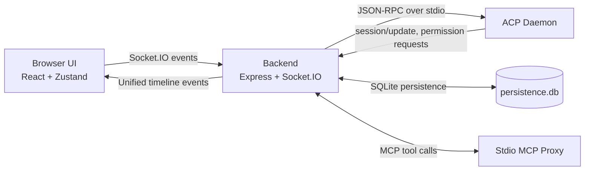

# AcpUI

A lightweight, high-performance web UI for ACP-based AI agents. Strictly provider-agnostic — swap the entire backend identity by changing a single config directory.

Spawns an ACP daemon natively on the host OS, parses the JSON-RPC stream into a **Unified Timeline**, and presents a high-fidelity chat interface with an integrated canvas, terminal, and diff viewer.

## Documentation Map

- **Agent standards and workflow:** [BOOTSTRAP.md](BOOTSTRAP.md) for development standards, coding practices, and operating instructions for coding agents.
- **Root README (this file):** platform overview, architecture, setup, and operational entry points.
- **Backend guide:** [backend/README.md](backend/README.md) for human-readable backend responsibilities, structure, and ops commands.
- **Frontend guide:** [frontend/README.md](frontend/README.md) for human-readable frontend responsibilities, structure, and build/test commands.
- **Deep implementation docs:** [documents/](documents/) (`[Feature Doc] - *.md`) for technical breakdowns with stable file/function/event anchors.

## Architecture

```
┌─────────────────────────────────────────────┐
│  Frontend (React + Vite + Zustand)          │
│  - Zero hardcoded provider references       │
│  - All branding/models from backend socket  │
├─────────────────────────────────────────────┤
│  Backend (Node.js + Express + Socket.IO)    │
│  - Generic ACP client, session management   │
│  - SQLite persistence, archive, hooks       │
│  - Stdio MCP proxy for tool execution       │
├─────────────────────────────────────────────┤
│  Provider (e.g., providers/my-provider/)    │
│  - provider.json: Protocol identity         │
│  - branding.json: UI labels and text        │
│  - user.json: User defaults                 │
│  - index.js: Logic module                   │
└─────────────────────────────────────────────┘
```

The backend supports multiple concurrent providers configured via `configuration/providers.json` (or the `ACP_PROVIDERS_CONFIG` env var). Each provider defines its own ACP command, models, branding, extension protocol, and file paths. On app load, invalid config issues, including malformed JSON and missing required provider definitions, are reported through a blocking frontend popup that lists the affected paths. See the [Provider System feature doc](<documents/[Feature Doc] - Provider System.md>) for full documentation.

### Runtime Flow Graph



### Backend Orchestration

The backend is anchored by the **AcpClient**, a pure orchestrator that delegates responsibilities to focused sub-systems:

- **JsonRpcTransport** — Handles the low-level JSON-RPC protocol, request/response correlation, and process communication.
- **PermissionManager** — Manages the lifecycle of user permission requests for sensitive tool executions.
- **StreamController** — Controls the flow of output chunks, including silent capturing for internal use and "draining" to suppress historical replays.
- **AcpDaemon** (Spawned) — The native process providing the AI capabilities.

This modular architecture ensures high performance, reliable session state management, and easy maintainability.

## Setup

### 1. Prerequisites

- **Node.js 22+** — [nodejs.org](https://nodejs.org/)
- **ACP CLI** — the provider's CLI must be in PATH (e.g., `my-agent-cli`)

```powershell
node --version      # verify 22+
my-agent-cli --version    # verify available
my-agent-cli login        # authenticate if needed
```

### 2. Install Dependencies

```powershell
cd backend; npm install
cd frontend; npm install
```

### 3. Configure Providers

The system requires at least one provider to be configured in `configuration/providers.json`. You can copy the example file to get started:

```powershell
cp configuration/providers.json.example configuration/providers.json
```

Example `providers.json`:
```json
{
  "defaultProviderId": "provider-a",
  "providers": [
    { "id": "provider-a", "path": "providers/provider-a", "label": "Provider A" },
    { "id": "provider-b", "path": "providers/provider-b", "label": "Provider B", "enabled": false }
  ]
}
```

### 4. Configure Environment

The `.env` file at the project root controls global settings. See `.env.example` for a template and full list of available variables.

#### MCP Tool Setup (`configuration/mcp.json`)

AcpUI exposes its UI-specific tools to ACP agents through a per-session stdio MCP proxy. Tool availability is controlled by the JSON file referenced by `MCP_CONFIG`; when `MCP_CONFIG` is not set, the backend reads `configuration/mcp.json`.

Create the runtime config from the checked-in example:

```powershell
cp configuration/mcp.json.example configuration/mcp.json
```

The MCP config is fail-closed: if the selected file is missing or malformed, all config-controlled MCP tools are disabled. The backend caches the config during process startup, and each MCP proxy captures the advertised tool list when its ACP session starts. Restart the backend after editing `configuration/mcp.json`, then create or reload sessions so agents see the updated tool list.

The top-level `tools` block enables tool groups. Each flag can be either `true` / `false` or an object such as `{ "enabled": true }`.

| Config key | Exposed tools |
|---|---|
| `tools.invokeShell` | `ux_invoke_shell` |
| `tools.subagents` | `ux_invoke_subagents`, plus `ux_check_subagents` and `ux_abort_subagents` |
| `tools.counsel` | `ux_invoke_counsel`, plus `ux_check_subagents` and `ux_abort_subagents` |
| `tools.io` | `ux_read_file`, `ux_write_file`, `ux_replace`, `ux_list_directory`, `ux_glob`, `ux_grep_search`, `ux_web_fetch` |
| `tools.googleSearch` | `ux_google_web_search`, only when `googleSearch.apiKey` is also non-empty |

The other config blocks control tool behavior:

- `subagents.statusWaitTimeoutMs` and `subagents.statusPollIntervalMs` control how long `ux_check_subagents` waits for async agent results and how often it polls.
- `io.autoAllowWorkspaceCwd` allows file IO inside the active workspace automatically. `io.allowedRoots` adds extra allowed roots; `allowedRoots: ["*"]` allows any resolved path. The `maxReadBytes`, `maxWriteBytes`, `maxReplaceBytes`, and `maxOutputBytes` fields cap IO size.
- `webFetch.allowedProtocols`, `blockedHosts`, `blockedHostPatterns`, `blockedCidrs`, `maxResponseBytes`, `timeoutMs`, and `maxRedirects` define URL fetch guardrails for `ux_web_fetch`.
- `googleSearch.apiKey`, `timeoutMs`, and `maxOutputBytes` configure grounded Google search. Keep real API keys in local-only config or point `MCP_CONFIG` at a private file.

A provider must also define `mcpName` in its `provider.json`; otherwise AcpUI will not inject the MCP proxy for that provider even when tool flags are enabled.

Minimal example:

```json
{
  "tools": {
    "invokeShell": { "enabled": true },
    "subagents": { "enabled": true },
    "counsel": { "enabled": true },
    "io": { "enabled": true },
    "googleSearch": { "enabled": false }
  },
  "subagents": {
    "statusWaitTimeoutMs": 120000,
    "statusPollIntervalMs": 1000
  },
  "io": {
    "autoAllowWorkspaceCwd": true,
    "allowedRoots": [],
    "maxReadBytes": 1048576,
    "maxWriteBytes": 1048576,
    "maxReplaceBytes": 1048576,
    "maxOutputBytes": 262144
  },
  "webFetch": {
    "allowedProtocols": ["http:", "https:"],
    "blockedHosts": [],
    "blockedHostPatterns": [],
    "blockedCidrs": [],
    "maxResponseBytes": 1048576,
    "timeoutMs": 15000,
    "maxRedirects": 5
  },
  "googleSearch": {
    "apiKey": "",
    "timeoutMs": 15000,
    "maxOutputBytes": 262144
  }
}
```

### 5. Configure SSL

Modern browser features (voice recording, pop-out windows) require a secure `https` context. This app uses a self-signed certificate for local development.

```powershell
cd backend; node generate-ssl.js
```

Generates a self-signed cert for `localhost` and `127.0.0.1` (10-year validity) and auto-imports into the Windows trusted root store. 

When you run the app for the first time, you may still see a browser warning ("Your connection is not private").
- **Automatic Setup (Windows):** The `run.ps1` script attempts to trust the certificate automatically.
- **Manual Setup:** If automatic trust fails, you can manually trust the certificate at `backend/.ssl/cert.pem` using:
  ```powershell
  certutil -addstore -user -f "Root" ".\backend\.ssl\cert.pem"
  ```
Restart your browser fully after trusting the certificate.

### 6. Configure Voice STT (Optional)

The application supports real-time voice-to-text input using **Whisper**. To enable this feature:

1.  **Set Environment Variable:** In your `.env`, set `VOICE_STT_ENABLED=true`.
2.  **Download Whisper Server:** Download a pre-built `whisper-server.exe` (or build it from [whisper.cpp](https://github.com/ggerganov/whisper.cpp)).
3.  **Download Model:** Download a Whisper model (e.g., `ggml-small.bin`) from the [Hugging Face repository](https://huggingface.co/ggerganov/whisper.cpp).
4.  **Place Binaries:** Put the `.exe`, required `.dll` files, and the `.bin` model file into the `backend/whisper/` directory.

The backend will automatically spawn the whisper server on the configured `STT_PORT` when the app starts.

### 7. Configure Workspaces

`configuration/workspaces.json` defines workspace buttons in the sidebar:

```json
{
  "workspaces": [
    { "label": "Project-A", "path": "C:\\repos\\project-a", "agent": "agent-dev", "pinned": true },
    { "label": "Project-B", "path": "C:\\repos\\project-b", "agent": "agent-dev", "pinned": true },
    { "label": "My-App", "path": "C:\\repos\\my-app", "agent": "agent-dev" }
  ]
}
```

Pinned workspaces show as permanent buttons; unpinned appear in a dropdown.

### 8. Configure Custom Commands (Optional)

`configuration/commands.json` defines custom slash commands:

```json
{
  "commands": [
    { "name": "/cp", "description": "Commit and push all changes", "prompt": "Commit and push all changes" }
  ]
}
```

### 9. Run

```powershell
.\scripts\run.ps1          # build frontend, start backend
.\scripts\run.ps1 dev      # dev mode with Vite HMR
```

Access at `https://localhost:3005`.

### 10. Configure Counsel

`configuration/counsel.json` defines counsel prompts sent to the agents:

```json
{
  "agents": {
    "core": [
      {
        "id": "advocate",
        "name": "Advocate",
        "prompt": "You are the Advocate. Your role is to argue FOR the approach or idea presented. Find every reason this is a good idea. Identify benefits, opportunities, and how to make it work. Be thorough and persuasive. Present your strongest case."
      },
      {
        "id": "critic",
        "name": "Critic",
        "prompt": "You are the Critic. Your role is to argue AGAINST the approach or idea presented. Find every weakness, risk, and potential problem. Play devil's advocate. What could go wrong? What are the hidden costs? What assumptions are being made?"
      },
      {
        "id": "pragmatist",
        "name": "Pragmatist",
        "prompt": "You are the Pragmatist. Your role is to evaluate this practically and objectively. What's the effort vs reward? What are the realistic alternatives? What would you actually recommend to a team with limited time and resources? Be grounded and actionable."
      }
    ],
    "optional": {
      "architect": {
        "name": "Architect",
        "prompt": "You are a Software Architecture expert. Evaluate this from an architectural perspective. Consider scalability, maintainability, separation of concerns, system boundaries, and long-term technical debt. How does this decision affect the overall system design?"
      },
      "performance": {
        "name": "Performance Expert",
        "prompt": "You are a Software Performance expert. Evaluate this from a performance perspective. Consider latency, throughput, memory usage, computational complexity, caching opportunities, and bottlenecks. What are the performance implications of this decision?"
      },
      "security": {
        "name": "Security Expert",
        "prompt": "You are a Software Security expert. Evaluate this from a security perspective. Consider attack surfaces, authentication, authorization, data protection, injection risks, and compliance requirements. What are the security implications?"
      },
      "ux": {
        "name": "UX Expert",
        "prompt": "You are a Software UX expert. Evaluate this from a user experience perspective. Consider usability, accessibility, user workflows, error handling, feedback mechanisms, and cognitive load. How does this decision affect the end user?"
      }
    }
  }
}
```

### 11. Configure Global Settings / Custom Agents

When setting up the system and your custom agents, for the best experience **agents must be configured without their built-in `Bash`, `PowerShell`, `Shell`, and sub-agent commands**. Some providers allow you to do this on a per-agent basis while others require their global settings file to be changed. Each provider in this repo contains a README that will have information on how to do this or will contain information on how this is done automatically for you. The AcpUI-specific tools that will be used instead are:

- **`ux_invoke_shell`** — Execute shell commands through AcpUI in a real terminal-backed tool step with live output, user stdin, resize, stop controls, input-wait detection, and separate terminals for concurrent shell calls.
- **`ux_invoke_subagents`** — Spawn parallel AI agents asynchronously with live streaming, sidebar nesting under parent chat, permission controls, status/result follow-up through `ux_check_subagents`, and parent-agent aborts through `ux_abort_subagents`. This provides the full agent coordination within AcpUI with full transparency and a global overview.

The MCP server name that exposes these tools is defined in the provider's `provider.json` file and defaults to `AcpUI`, each provider README will also cover how to allow these tools if you don't want to see permission requests when these are used. This ensures all agent execution (shell commands, sub-agent spawning, and tool calls) flows through the AcpUI's unified timeline, maintains proper session context, respects permissions, and integrates with the UI's canvas, terminal, and diff viewer.

## Features

### Multi-Provider Architecture
- **Isolated Runtimes** — Concurrent support for multiple ACP providers managed by independent clients.
- **Provider Registry** — Centralized configuration for dynamic loading of agent identities and capabilities.
- **Thread-Safe Contexts** — Reliable state isolation across asynchronous operations using `AsyncLocalStorage`.

### Performance & UX
- **Background Auto-Load** — Pinned chats are sequentially warmed up in memory after boot, ensuring they are hot and ready for instant use.
- **Hot-Resume Optimization** — Switching to memory-resident chats skips redundant RPC calls, eliminating "Warming up..." delays.
- **Unified Timeline** — Discrete, chronological steps for thoughts, tool executions, and assistant responses.
- **Adaptive Typewriter** — Smooth rendering that automatically speeds up under buffer pressure.

### Reliability & Resilience
- **Hardened Handshake** — Mutex-guarded initialization prevents race conditions during startup.
- **Exponential Back-off Restarts** — ACP daemons auto-restart with increasing delays (2s, 4s, 8s...) to prevent resource thrashing.
- **Zero-Division Protection** — Robust context usage reporting that handles edge cases in provider metadata.

### Security (Local Network)
- **Local-First Security** — Origin-locked CORS permits access from any machine on your **Local Area Network** while blocking public origins.
- **Active Approval Workflow** — Mandatory user confirmation for sensitive shell commands and sub-agent spawning.

### Chat
- **Dynamic workspaces** — configurable workspace buttons with per-workspace CWD and agent
- **Chat branching/forking** — fork a conversation at any point to explore alternatives
- **Fork merging** — merge forked conversations back into parent with auto-generated summary
- **Memoized markdown** — block-level caching for smooth streaming without re-parsing
- **Slash commands** — built-in (`/compact`, `/context`, `/agent`, `/help`) plus custom commands from `configuration/commands.json`
- **Context progress bar** — live context usage percentage from provider metadata
- **Compaction** — `/compact` locks prompt, shows summary, saves to DB
- **Auto title generation** — generates chat titles after first response
- **Desktop notifications** — Windows toast notifications when background chats complete
- **File & image attachments** — drag & drop files/images; automatic JPEG compression (quality 85, max dimension 1568px); per-session storage
- **Model quick-select** — footer dropdown with provider-configured model choices; shows context usage %
- **Voice input** — microphone recording with local speech-to-text via whisper.cpp (requires whisper-server setup)
- **Session export** — export chat sessions
- **Permission system** — ACP-compliant permission request/response with approve/deny buttons

### Canvas
- **Monaco editor** — view/edit files with syntax highlighting, "Open in VS Code" button
- **Integrated terminal** — multiple terminal tabs within the canvas
- **Git file list** — staged/modified/untracked files with diff view and stage/unstage
- **Diff viewer** — side-by-side diff display for file changes
- **Canvas resize** — adjustable canvas panel width
- **Syntax highlighting in tool output** — code blocks in tool results are highlighted

### Sidebar
- **Session archive** — archive/restore sessions, or permanent delete (configurable)
- **Sidebar folders** — nested folders with drag & drop, persisted expand/collapse
- **Scratch pad notes** — per-session markdown notes with raw/rendered tabs
- **Pop-out chat** — detach chat sessions into separate browser windows for side-by-side comparison (BroadcastChannel-coordinated ownership)
- **Empty state on load** — no chat auto-selected; starts with empty state until user picks or creates a session

### System Settings
- **Provider tab** — view and edit `user.json` fields directly in the UI
- **Monaco editors** — JSON config editing with syntax highlighting for provider (user.json), workspaces, and commands

### Other
- **Stdio MCP proxy** — Stdio MCP proxy spawned per ACP session — exposes enabled UI-specific tools via /api/mcp/tool-call
- **MCP tool config** — `configuration/mcp.json` controls `ux_invoke_shell`, `ux_invoke_subagents`, `ux_invoke_counsel`, `ux_check_subagents`, `ux_abort_subagents`, optional IO tools, optional Google search, and sub-agent status wait settings
- **Optional IO MCP tools** — `ux_read_file`, `ux_write_file`, `ux_replace`, `ux_list_directory`, `ux_glob`, `ux_grep_search`, and `ux_web_fetch`
- **Optional Google search MCP tool** — `ux_google_web_search` uses `googleSearch.apiKey` from `configuration/mcp.json`
- **Sub-agent system** — `ux_invoke_subagents` starts parallel AI agents asynchronously; `ux_check_subagents` can wait or return immediately for status/results; `ux_abort_subagents` stops running agents while the UI keeps live streaming, sidebar nesting, and permission inheritance
- **Multi-perspective counsel** — `ux_invoke_counsel` spawns Advocate, Critic, Pragmatist + optional domain experts to evaluate decisions
- **Shell execution** — `ux_invoke_shell` with interactive terminal interaction
- **Tool & turn timers** — live elapsed time on each tool call and assistant turn
- **File explorer** — full-screen file browser with Monaco editor and markdown preview
- **JSONL rehydration** — rebuild chat history from raw session files
- **Agent hooks** — `session_start`, `post_tool`, `stop` hooks from agent JSON configs
- **Voice STT** — speech-to-text input (requires whisper setup)
- **Session persistence** — periodic saves during streaming, full restore on refresh

## Tests

```powershell
cd backend; npx vitest run --coverage
cd frontend; npx vitest run --coverage
```

Last validated: **May 3, 2026 at 5:36 PM (America/Winnipeg)**.

| Suite | Command | Result |
|---|---|---:|
| Backend | `npx vitest run` | 64 files / 684 tests passed |
| Frontend | `npx vitest run` | 79 files / 699 tests passed |

Notes:
- Run the coverage commands above when coverage percentages are needed.
- Frontend test setup mocks `HTMLCanvasElement.getContext`, `window.alert`, and `window.open` to keep CI/local test output stable and warning-free.

## Provider System

The application is fully provider-agnostic. All branding, models, paths, and extension protocols are defined in a provider directory. To use a different ACP backend, add it to `configuration/providers.json`.

See the [Provider System feature doc](<documents/[Feature Doc] - Provider System.md>) for the complete provider system documentation, including the JSON schema, module interface, and step-by-step guide for creating new providers.

## Troubleshooting

- **"Provider registry does not contain any enabled providers"** — verify `configuration/providers.json` exists and contains at least one enabled provider.
- **Can't access from browser** — verify `https://localhost:3005` and SSL cert is trusted
- **"Engine warming up..."** — ACP CLI not in PATH or not authenticated
- **Socket disconnects** — check `pingTimeout` in server.js
- **Extensions not working** — verify `protocolPrefix` in `provider.json` matches ACP daemon output
