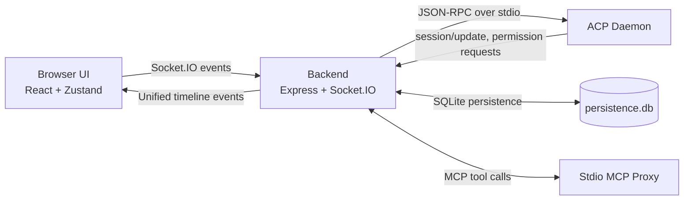

# AcpUI

A lightweight, high-performance web UI for ACP-based AI agents. Strictly provider-agnostic — swap the entire backend identity by changing a single config directory.

Spawns an ACP daemon natively on the host OS, parses the JSON-RPC stream into a **Unified Timeline**, and presents a high-fidelity chat interface with an integrated canvas, terminal, diff viewer, and repo documentation browser.

**Setup and local run instructions live in [SETUP.md](SETUP.md).** Start there for prerequisites, provider configuration, MCP tools, SSL, voice STT, workspace setup, run commands, validation commands, and troubleshooting.

## Documentation Map

- **Setup guide:** [SETUP.md](SETUP.md) for installation, configuration, run commands, validation, and troubleshooting.
- **Agent standards and workflow:** [BOOTSTRAP.md](BOOTSTRAP.md) for development standards, coding practices, and operating instructions for coding agents.
- **Root README (this file):** high-level platform overview, architecture, capabilities, and documentation entry points.
- **Backend guide:** [backend/README.md](backend/README.md) for human-readable backend responsibilities, structure, and ops commands.
- **Frontend guide:** [frontend/README.md](frontend/README.md) for human-readable frontend responsibilities, structure, and build/test commands.
- **Deep implementation docs:** [documents/](documents/) (`[Feature Doc] - *.md`) for technical breakdowns with stable file/function/event anchors.

## Architecture

```
┌─────────────────────────────────────────────┐
│  Frontend (React + Vite + Zustand)          │
│  - Zero hardcoded provider references       │
│  - All branding/models from backend socket  │
├─────────────────────────────────────────────┤
│  Backend (Node.js + Express + Socket.IO)    │
│  - Generic ACP client, session management   │
│  - SQLite persistence, archive, hooks       │
│  - Stdio MCP proxy for tool execution       │
├─────────────────────────────────────────────┤
│  Provider (e.g., providers/my-provider/)    │
│  - provider.json: Protocol identity         │
│  - branding.json: UI labels and text        │
│  - user.json: User defaults                 │
│  - index.js: Logic module                   │
└─────────────────────────────────────────────┘
```

The backend supports multiple concurrent providers configured via `configuration/providers.json` or the `ACP_PROVIDERS_CONFIG` env var. Each provider defines its own ACP command, models, branding, extension protocol, and file paths. On app load, invalid config issues, including malformed JSON and missing required provider definitions, are reported through a blocking frontend popup that lists the affected paths.

See the [Provider System feature doc](<documents/[Feature Doc] - Provider System.md>) for the full provider architecture.

### Runtime Flow Graph



### Backend Orchestration

The backend is anchored by the **AcpClient**, a pure orchestrator that delegates responsibilities to focused sub-systems:

- **JsonRpcTransport** — Handles the low-level JSON-RPC protocol, request/response correlation, and process communication.
- **PermissionManager** — Manages the lifecycle of user permission requests for sensitive tool executions.
- **StreamController** — Controls the flow of output chunks, including silent capturing for internal use and draining to suppress historical replays.
- **AcpDaemon** — The native provider process that supplies AI capabilities.

## Core Capabilities

### Provider-Agnostic Runtime

- Concurrent support for multiple ACP providers managed by isolated runtimes.
- Provider registry for dynamic loading of commands, models, branding, extension protocol, and user defaults.
- Thread-safe provider context via `AsyncLocalStorage` across asynchronous backend work.
- Startup diagnostics for malformed provider configuration and missing required provider definitions.

### Unified Chat Experience

- Unified Timeline for thoughts, tool executions, permission requests, and assistant responses.
- Smooth streaming with memoized Markdown rendering and adaptive typewriter behavior.
- Dynamic workspaces, chat branching/forking, fork merging, compaction, auto-title generation, session export, and desktop notifications.
- File and image attachments with per-session storage and automatic image compression.
- Voice input through local whisper.cpp STT when configured.

### Canvas And Work Surfaces

- Monaco-based file viewing/editing, markdown preview, and "Open in VS Code" entry points.
- Integrated terminal tabs, Git file list, staged/modified/untracked views, and side-by-side diff rendering.
- Full-screen File Explorer for workspace file operations.
- In-app Help Docs browser for searchable, read-only repository Markdown documentation.

### Tooling And Agent Orchestration

- Per-session stdio MCP proxy exposing enabled AcpUI tools to ACP agents.
- Shell execution through `ux_invoke_shell` with live terminal output, input handling, resize, and stop controls.
- Parallel sub-agent orchestration through `ux_invoke_subagents`, `ux_check_subagents`, and `ux_abort_subagents`.
- Multi-perspective counsel through `ux_invoke_counsel` with Advocate, Critic, Pragmatist, and optional expert prompts.
- Optional IO tools for safe file reads/writes/replacements, directory listing, globbing, grep, and web fetch.
- Optional grounded Google search tool when configured with an API key.

### Reliability And Local-First Security

- Handshake protection, provider runtime isolation, background pinned-chat warmup, and hot-resume optimization.
- ACP daemon restart backoff during runtime failures and controlled shutdown during backend watch-mode restarts.
- Local-first CORS policy for LAN access while blocking public origins.
- Active approval workflow for sensitive shell commands and agent spawning.
- SQLite-backed session, folder, note, artifact, and timeline persistence.

## Provider System

The application is fully provider-agnostic. All branding, models, paths, and extension protocols are defined in a provider directory. To use a different ACP backend, add it to `configuration/providers.json` and point it at the provider directory.

See the [Provider System feature doc](<documents/[Feature Doc] - Provider System.md>) for the complete provider system documentation, including the JSON schema, module interface, and step-by-step guide for creating new providers.

## Validation

Validation commands and troubleshooting notes are maintained in [SETUP.md](SETUP.md). Backend-specific and frontend-specific command references also live in [backend/README.md](backend/README.md) and [frontend/README.md](frontend/README.md).
