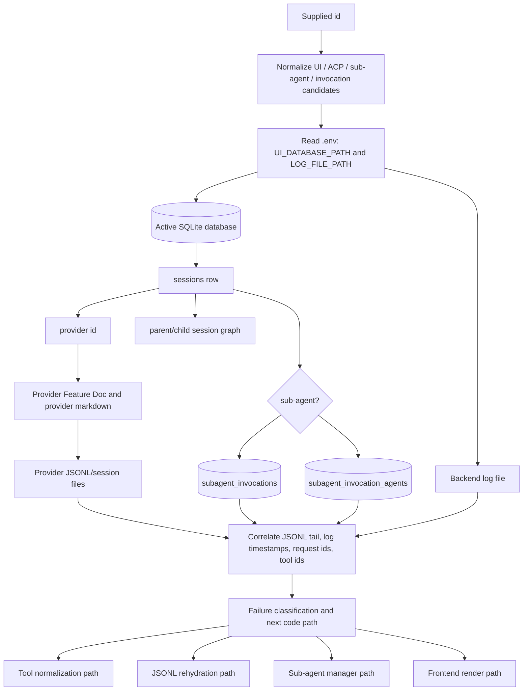

# Feature Doc - AcpUI Session Debugging Guide

This guide is a runbook for debugging a supplied AcpUI UI session id, ACP session id, sub-agent UI id, or sub-agent invocation id. It matters because session failures usually span SQLite persistence, provider runtime state, provider JSONL files, and backend ACP logs; agents should correlate those sources before drawing conclusions.

---

## Overview

### What It Does

- Maps a visible AcpUI session id to the durable SQLite row, ACP daemon session id, provider id, model metadata, and parent/child relationships.
- Identifies the active SQLite database and log file from runtime configuration instead of assuming a file path.
- Finds sub-agent invocation rows and agent rows for failed or completed parallel work.
- Locates provider-owned JSONL/session files through provider docs and provider `getSessionPaths` contracts.
- Correlates backend log timestamps, JSON-RPC request ids, provider session ids, tool call ids, and JSONL records.
- Separates persisted failure cause, provider-native artifacts, MCP tool executions, frontend rendering issues, and rehydration issues.

### Why This Matters

- AcpUI has multiple ids for the same visible work: `sessions.ui_id`, `sessions.acp_id`, sub-agent UI ids, sub-agent invocation ids, JSON-RPC request ids, and provider tool ids.
- `./persistence.db` can resolve differently depending on the backend process working directory, so the first database an agent finds is not always active.
- Provider JSONL is provider-owned replay data; SQLite is AcpUI durable metadata and cached messages.
- Backend logs are the only place that reliably ties JSON-RPC request ids, ACP errors, stderr, and streamed `session/update` events together.
- Tool titles are display metadata. A title like `Web search` or `Fetch` does not prove an AcpUI MCP tool ran; confirm with raw tool input, MCP invocation metadata, and tool ids.

Architectural role: this is a backend/provider/persistence debugging guide. It does not define a user-facing feature; it documents the current investigative path across AcpUI persistence, provider adapters, JSONL rehydration, sub-agent orchestration, and logs.

---

## How It Works - End-to-End Flow

### 1. Load The Correct Docs Before Inspecting Files

Files:
- `BOOTSTRAP.md` (Section: `Feature Documentation Index`)
- `documents/[Feature Doc] - Backend Architecture.md`
- `documents/[Feature Doc] - Provider System.md`
- `documents/[Feature Doc] - JSONL Rehydration & Session Persistence.md`
- `documents/[Feature Doc] - ux_invoke_subagents.md` when the id begins with `sub-` or an invocation id is involved
- `documents/[Feature Doc] - <Provider> Provider.md` once the session row identifies `provider`
- `providers/<provider>/*.md` after the provider is known

Start with the core docs, then load only the feature/provider docs matching the investigation. Do not interpret provider JSONL or tool records before loading the provider-specific doc; provider adapters own path discovery, normalization, and replay behavior.

### 2. Normalize The Supplied Id

The user may provide any of these:

```text
sessions.ui_id                 = visible AcpUI session id
sessions.acp_id                = ACP daemon session id
sub-<acp_session_id>           = sub-agent UI id convention
subagent_invocations.invocation_id = async batch invocation id, usually inv-...
subagent_invocation_agents.ui_id / acp_session_id
```

Use all plausible forms while searching:

```text
rawId              = user input
strippedSubId      = rawId without leading sub-
subUiCandidate     = sub- + rawId when rawId is an ACP id
```

Do not assume the visible UI id is the ACP id. Logs and provider JSONL normally key off the ACP id, while sidebar/session APIs key off the UI id.

### 3. Locate Runtime Configuration

Files:
- `.env` (Keys: `UI_DATABASE_PATH`, `LOG_FILE_PATH`)
- `backend/database.js` (Function: `initDb`)
- `backend/services/logger.js` (Function: `getLogFilePath`, Constant: `LOG_FILE_PATH`)

```javascript
// FILE: backend/database.js (Function: initDb)
dotenv.config({ path: path.join(__dirname, '..', '.env'), quiet: true });
const dbFile = process.env.UI_DATABASE_PATH || path.join(__dirname, '..', 'persistence.db');
db = new sqlite3.Database(dbFile);
```

```javascript
// FILE: backend/services/logger.js (Function: getLogFilePath)
const LOG_FILE_PATH = process.env.LOG_FILE_PATH;
logFile = path.isAbsolute(LOG_FILE_PATH)
  ? LOG_FILE_PATH
  : path.resolve(__dirname, '..', '..', LOG_FILE_PATH);
```

A relative `UI_DATABASE_PATH` is passed directly to SQLite. Confirm the active database by checking the backend startup log line `[DB] Using SQLite database at: ...` and by querying the database for the supplied id. Do not trust a root `persistence.db` just because it exists.

### 4. Query The Session Row

File: `backend/database.js` (Table: `sessions`, Functions: `getSession`, `getSessionByAcpId`, `getAllSessions`, `saveSession`)

Core SQL shape:

```sql
SELECT
  ui_id,
  acp_id,
  provider,
  name,
  model,
  current_model_id,
  is_sub_agent,
  forked_from,
  parent_acp_session_id,
  last_active,
  length(messages_json) AS messages_json_length
FROM sessions
WHERE ui_id = :rawId
   OR acp_id = :rawId
   OR ui_id = :subUiCandidate
   OR acp_id = :strippedSubId;
```

The important fields are:

```text
ui_id                 AcpUI durable/session/sidebar id
acp_id                provider daemon session id
provider              provider adapter id used for docs and JSONL lookup
is_sub_agent          1 when the row is a sub-agent session
forked_from           parent UI id for fork/sub-agent hierarchy
parent_acp_session_id parent ACP id for sub-agent routing and status
last_active           epoch milliseconds, not seconds
messages_json         cached UI messages; may be empty even when provider JSONL has history
```

If this query returns nothing, query every candidate database before concluding the id is missing.

### 5. Build The Parent And Child Graph

File: `backend/database.js` (Columns: `forked_from`, `parent_acp_session_id`, `is_sub_agent`)

For a found session row, query both directions:

```sql
-- Parent by UI id or ACP id.
SELECT ui_id, acp_id, provider, name, is_sub_agent, forked_from, parent_acp_session_id, last_active
FROM sessions
WHERE ui_id = :forked_from
   OR acp_id = :parent_acp_session_id;

-- Children/forks/sub-agents under this session.
SELECT ui_id, acp_id, provider, name, is_sub_agent, forked_from, parent_acp_session_id, last_active
FROM sessions
WHERE forked_from = :ui_id
   OR parent_acp_session_id = :acp_id
ORDER BY last_active DESC;
```

This establishes whether the supplied id is a parent chat, fork, sub-agent, or orphaned persisted row. For sub-agents, the parent row is often the best place to find the originating tool call and invocation batch.

### 6. Query Sub-Agent Invocation State

Files:
- `backend/database.js` (Tables: `subagent_invocations`, `subagent_invocation_agents`)
- `backend/mcp/subAgentInvocationManager.js` (Class: `SubAgentInvocationManager`, Method: `executeAgentPrompt`)
- `backend/sockets/subAgentHandlers.js` (Socket event: `sub_agent_snapshot`)

Schema anchors:

```text
subagent_invocations:
  invocation_id, provider, parent_acp_session_id, parent_ui_id, status,
  total_count, completed_count, status_tool_name, created_at, updated_at, completed_at

subagent_invocation_agents:
  invocation_id, acp_session_id, ui_id, idx, name, prompt, agent, model,
  status, result_text, error_text, created_at, updated_at, completed_at
```

Find the agent row first when the supplied id is a sub-agent session:

```sql
SELECT *
FROM subagent_invocation_agents
WHERE ui_id = :rawId
   OR acp_session_id = :rawId
   OR ui_id = :subUiCandidate
   OR acp_session_id = :strippedSubId;
```

Then expand to the whole batch:

```sql
SELECT *
FROM subagent_invocations
WHERE invocation_id = :invocationId;

SELECT *
FROM subagent_invocation_agents
WHERE invocation_id = :invocationId
ORDER BY idx ASC;
```

The persisted `status`, `result_text`, and `error_text` fields are the durable result of `ux_check_subagents`. If the UI says a sub-agent failed, verify the error here before inspecting UI rendering.

### 7. Locate Provider JSONL Or Session Files

Files:
- `backend/services/jsonlParser.js` (Function: `parseJsonlSession`)
- `providers/<provider>/index.js` (Functions: `getSessionPaths`, `parseSessionHistory`)
- `documents/[Feature Doc] - <Provider> Provider.md`
- `providers/<provider>/README.md`
- `providers/<provider>/ACP_PROTOCOL_SAMPLES.md` when present

```javascript
// FILE: backend/services/jsonlParser.js (Function: parseJsonlSession)
const paths = providerModule.getSessionPaths(acpSessionId);
return providerModule.parseSessionHistory(paths.jsonl, Diff);
```

Use the provider docs and `getSessionPaths(acpId)` implementation to locate the session file. Do not hardcode one provider's path rules into a generic investigation.

Provider JSONL may contain raw events that never appear in `sessions.messages_json`, and `sessions.messages_json` may be empty for active sub-agents. Treat JSONL as provider ground truth for replay, but use logs to determine live request/response timing.

### 8. Inspect JSONL For Terminal Records And Tool Events

Provider JSONL is newline-delimited JSON. Check the tail first, then search by ids:

```text
Search terms:
- ACP session id
- tool call ids from the UI or logs
- task_complete, error, failed, cancelled
- provider-specific event names from the provider docs
- MCP tool names such as ux_invoke_shell, ux_invoke_subagents, ux_google_web_search
```

For modern provider records, the distinction between event records and response item records matters:

```json
{"type":"event_msg","payload":{"type":"tool_call_update","call_id":"tool_...","status":"completed"}}
{"type":"response_item","payload":{"type":"function_call_output","call_id":"tool_..."}}
{"type":"event_msg","payload":{"type":"task_complete","last_agent_message":null}}
```

When investigating a visible tool with no output, record whether JSONL contains a begin record, an end record, a response item, raw input, raw output, and a terminal task record. A completed tool event with no output is different from a failed `session/prompt` request.

### 9. Correlate Backend Logs By Timestamp, ACP Id, Request Id, And Tool Id

Files:
- `backend/services/jsonRpcTransport.js` (Function: `sendRequest`)
- `backend/services/acpClient.js` (Method: `handleAcpMessage`)
- `backend/services/acpUpdateHandler.js` (Function: `handleUpdate`)
- `backend/services/logger.js` (Function: `writeLog`)

```javascript
// FILE: backend/services/jsonRpcTransport.js (Function: sendRequest)
const payload = { jsonrpc: '2.0', id, method, params };
writeLog(`[ACP SEND] ${json.trim()}`);
this.pendingRequests.set(id, { resolve, reject, method, params, sessionId });
```

```javascript
// FILE: backend/services/acpClient.js (Method: handleAcpMessage)
if (processedPayload.error) {
  const errorMsg = processedPayload.error.message || JSON.stringify(processedPayload.error);
  writeLog(`[ACP REQ ERR] Request #${processedPayload.id} (${method}) failed: ${errorMsg}`);
  reject(processedPayload.error);
}
```

For a failed session, build a compact timeline:

```text
1. [ACP SEND] request id + method + sessionId
2. session/update entries for the same ACP session id
3. tool_call / tool_call_update ids and titles
4. [ACP STDERR] provider/daemon stderr near the failure
5. [ACP RECV] response with matching request id
6. [ACP REQ ERR] for the matching request id
7. DB sub-agent status/error_text row
8. JSONL terminal records and file modified time
```

The matched JSON-RPC request id is often the strongest evidence for the real failure cause. Tool events immediately before an error are evidence to record, but the JSON-RPC error determines why the pending backend request rejected.

### 10. Trace Tool Display And Output Handling When Labels Look Wrong

Files:
- `backend/services/acpUpdateHandler.js` (Function: `handleUpdate`, Branches: `tool_call`, `tool_call_update`)
- `backend/services/tools/index.js` (Exports: `toolRegistry`, `toolCallState`, `resolveToolInvocation`, `applyInvocationToEvent`)
- `backend/services/tools/acpUxTools.js` (Tool definitions: AcpUI MCP tools)
- `backend/services/tools/acpUiToolTitles.js` (Function: `acpUiToolTitle`)
- `providers/<provider>/index.js` (Functions: `normalizeUpdate`, `normalizeTool`, `categorizeToolCall`, `extractToolOutput`)

Tool investigation rule:

```text
Display title is not identity.
Identity comes from provider raw input, MCP invocation metadata, tool id shape, provider normalization, and Tool System V2 resolution.
```

AcpUI MCP tool calls usually expose `ux_...` tool names, AcpUI MCP server metadata, or registry-resolved invocation details. Provider-native/system tool calls may use provider ids, provider titles, or provider-specific raw input and can still render with familiar labels such as `Web search`, `Fetch`, or `Search`.

For no-output tools, inspect these fields in logs and JSONL:

```text
toolCallId / call_id
sessionUpdate
kind
title
rawInput / arguments
rawOutput / content
status
provider normalizeTool result
Tool System V2 identity and display title
```

### 11. Compare Live Stream State Against Rehydrated History

Files:
- `backend/services/acpUpdateHandler.js` (Function: `handleUpdate`)
- `backend/services/jsonlParser.js` (Function: `parseJsonlSession`)
- `providers/<provider>/index.js` (Function: `parseSessionHistory`)
- `backend/sockets/sessionHandlers.js` (Socket events: `get_session_history`, `rehydrate_session`)

Live streaming and JSONL rehydration use different paths:

```text
Live provider update -> provider.normalizeUpdate -> acpUpdateHandler.handleUpdate -> system_event/token/thought -> frontend stores

Rehydration -> jsonlParser.parseJsonlSession -> provider.parseSessionHistory -> messages_json replacement -> get_session_history
```

If the UI shows a different timeline after refresh than it showed live, inspect both paths. A live `tool_call_update` may have enough metadata to render a title, while JSONL rehydration may only see an end record and create a fallback title.

### 12. Classify The Failure Source

Use evidence from the DB, logs, and JSONL to classify the problem:

```text
Provider/daemon rejection:
  [ACP REQ ERR] exists for the matching request id, sub-agent error_text stores the same error.

Backend routing or persistence bug:
  ACP response succeeds, but backend logs show DB, socket, parser, or handler errors.

Sub-agent orchestration bug:
  subagent_invocations status/counts or subagent_invocation_agents rows disagree with logs.

Tool normalization/display bug:
  raw event identity differs from rendered title or output handling, but request status is otherwise understood.

JSONL rehydration bug:
  live stream logs look correct, but parseJsonlSession/provider parseSessionHistory reconstructs a different timeline.

Frontend rendering bug:
  backend emits correct `system_event`, `token`, or `thought` events, but frontend stores/components render incorrectly.
```

State the persisted cause first, then note correlated artifacts separately. Do not claim that a correlated tool event caused a failure unless the logs or code path proves causation.

---

## Architecture Diagram



---

## The Critical Contract: Id Ownership And Evidence Ordering

The core contract is:

```text
sessions.ui_id owns AcpUI UI/sidebar identity.
sessions.acp_id owns provider daemon session identity.
subagent_invocation_agents.acp_session_id links a sub-agent status row to its provider daemon session.
subagent_invocations.invocation_id owns a batch of parallel sub-agent work.
JSON-RPC request ids own ACP request/response correlation in logs.
Provider JSONL owns provider replay history for one ACP session.
```

What breaks if this is ignored:

- Searching logs by UI id can miss provider events that only mention ACP ids.
- Searching JSONL by sub-agent UI id can miss files named by ACP ids.
- Querying only `sessions` can miss the durable sub-agent failure stored in `subagent_invocation_agents.error_text`.
- Reading only JSONL can miss the actual JSON-RPC error that rejected `session/prompt`.
- Treating display title as tool identity can confuse provider-native tools with AcpUI MCP tools.

Evidence ordering for a session failure:

```text
1. SQLite session and sub-agent rows identify the session, provider, parent, invocation, and persisted status.
2. Backend logs identify the live ACP request, response, stderr, streamed updates, and exact failure time.
3. Provider JSONL identifies provider replay state and terminal records.
4. Code paths explain why that evidence rendered, persisted, or rehydrated the way it did.
```

---

## Configuration / Provider-Specific Behavior

### Runtime Configuration

| Config | Location | Meaning |
|---|---|---|
| `UI_DATABASE_PATH` | `.env`, read by `backend/database.js` | SQLite database path. Relative paths are resolved by SQLite from the backend process working directory. |
| `LOG_FILE_PATH` | `.env`, read by `backend/services/logger.js` | Backend log file path. Absolute paths are used directly; relative paths are resolved from the repo root. |
| Provider id | `sessions.provider`, `providers/<provider>/provider.json` | Determines provider docs, provider module, branding, MCP config, and session path behavior. |

### Provider Behavior

A provider module must define or inherit the behavior needed by these investigation points:

| Provider Hook | Purpose During Debugging |
|---|---|
| `getSessionPaths(acpSessionId)` | Locates provider-owned JSONL/session/task files. |
| `parseSessionHistory(filePath, Diff)` | Reconstructs AcpUI messages from provider JSONL. |
| `normalizeUpdate(update)` | Converts raw ACP updates into AcpUI update shapes before routing. |
| `normalizeTool(event, update)` | Sets visible tool title, output, file path, and provider-specific tool fields. |
| `categorizeToolCall(event)` | Assigns tool category metadata used by rendering and tool handlers. |
| `extractToolOutput(update)` | Pulls output from provider-specific fields before generic ACP fallbacks. |

Provider-specific file names, JSONL formats, and tool id conventions belong to the provider doc. Load `documents/[Feature Doc] - <Provider> Provider.md` and `providers/<provider>/*.md` before making provider-specific claims.

---

## Data Flow / Rendering Pipeline

### Durable Session Row

```json
{
  "ui_id": "visible-session-id-or-sub-...",
  "acp_id": "provider-daemon-session-id",
  "provider": "provider-id",
  "name": "Session title",
  "model": "stored-model-key",
  "current_model_id": "runtime-model-id",
  "is_sub_agent": 0,
  "forked_from": null,
  "parent_acp_session_id": null,
  "last_active": 1778860105211,
  "messages_json": "[...]"
}
```

### Sub-Agent Agent Row

```json
{
  "invocation_id": "inv-...",
  "acp_session_id": "provider-daemon-sub-session-id",
  "ui_id": "sub-provider-daemon-sub-session-id",
  "idx": 1,
  "name": "Agent display name",
  "prompt": "Agent prompt text",
  "model": "resolved model",
  "status": "failed",
  "result_text": null,
  "error_text": "Provider or backend failure message",
  "completed_at": 1778860218444
}
```

### Backend ACP Log Pattern

```text
[ACP SEND] {"jsonrpc":"2.0","id":32,"method":"session/prompt","params":{"sessionId":"acp-session-id",...}}
[ACP RECV] {"jsonrpc":"2.0","method":"session/update","params":{"sessionId":"acp-session-id","update":{"sessionUpdate":"tool_call",...}}}
[ACP STDERR] provider stderr text
[ACP RECV] {"jsonrpc":"2.0","id":32,"error":{"code":-32603,"message":"Internal error","data":{"message":"..."}}}
[ACP REQ ERR] Request #32 (session/prompt) failed: ...
```

### Tool Event Pipeline

```text
Provider ACP update
  -> provider.normalizeUpdate(update)
  -> acpUpdateHandler.handleUpdate(...)
  -> provider.extractToolOutput(update)
  -> provider.normalizeTool(event, update)
  -> provider.categorizeToolCall(event)
  -> resolveToolInvocation(...)
  -> applyInvocationToEvent(...)
  -> toolRegistry.dispatch(...)
  -> Socket.IO `system_event`
  -> frontend Unified Timeline rendering
```

### JSONL Rehydration Pipeline

```text
UI asks for history or forced rehydrate
  -> backend/sockets/sessionHandlers.js (`get_session_history` or `rehydrate_session`)
  -> backend/services/jsonlParser.js (`parseJsonlSession`)
  -> provider `getSessionPaths(acpSessionId)`
  -> provider `parseSessionHistory(filePath, Diff)`
  -> normalized Message[]
  -> SQLite `messages_json` save when rehydrating
  -> frontend message store replacement
```

---

## Component Reference

### Runtime, Logging, And ACP

| Area | File | Anchors | Purpose |
|---|---|---|---|
| Runtime config | `.env` | `UI_DATABASE_PATH`, `LOG_FILE_PATH` | Defines database and log targets used by the backend. |
| Logger | `backend/services/logger.js` | `writeLog`, `getLogFilePath` | Writes backend logs and exposes the active log file path. |
| ACP client | `backend/services/acpClient.js` | `start`, `handleAcpMessage`, `sessionMetadata` | Spawns provider ACP daemon, reads stdout/stderr, routes updates and responses. |
| JSON-RPC transport | `backend/services/jsonRpcTransport.js` | `sendRequest`, `getPendingRequestContext`, `pendingRequests` | Assigns request ids and stores method/session context for response correlation. |
| Update routing | `backend/services/acpUpdateHandler.js` | `handleUpdate`; branches `tool_call`, `tool_call_update`, `agent_message_chunk`, `agent_thought_chunk` | Normalizes live ACP updates and emits frontend events. |

### Persistence And Sub-Agents

| Area | File | Anchors | Purpose |
|---|---|---|---|
| Session DB | `backend/database.js` | `initDb`, `sessions` table, `saveSession`, `getSession`, `getSessionByAcpId`, `getAllSessions` | Stores durable session metadata and cached messages. |
| Sub-agent DB | `backend/database.js` | `subagent_invocations`, `subagent_invocation_agents`, `createSubAgentInvocation`, `updateSubAgentInvocationStatus`, `updateSubAgentInvocationAgentStatus`, `getSubAgentInvocationWithAgents` | Stores durable async sub-agent batch and per-agent status/results/errors. |
| Sub-agent orchestration | `backend/mcp/subAgentInvocationManager.js` | `SubAgentInvocationManager`, `executeAgentPrompt`, `getInvocationStatus`, `cancelInvocation` | Creates sub-sessions, sends prompts, records results/errors, returns status snapshots. |
| Sub-agent sockets | `backend/sockets/subAgentHandlers.js` | `emitSubAgentSnapshotsForSession`, Socket event `sub_agent_snapshot` | Hydrates active sub-agent status for reconnecting clients. |

### Provider And JSONL

| Area | File | Anchors | Purpose |
|---|---|---|---|
| Provider system | `documents/[Feature Doc] - Provider System.md` | Provider contract | Explains provider module ownership and generic adapter rules. |
| Provider doc | `documents/[Feature Doc] - <Provider> Provider.md` | Provider-specific anchors | Explains provider paths, JSONL, normalization, and gotchas. |
| Provider module | `providers/<provider>/index.js` | `getSessionPaths`, `parseSessionHistory`, `normalizeUpdate`, `normalizeTool`, `categorizeToolCall`, `extractToolOutput` | Owns provider-specific session file lookup and event interpretation. |
| JSONL parser | `backend/services/jsonlParser.js` | `parseJsonlSession` | Delegates provider JSONL parsing and returns normalized messages. |
| Session socket history | `backend/sockets/sessionHandlers.js` | Socket events `get_session_history`, `rehydrate_session`, `load_session` | Loads/reloads sessions and triggers rehydration from provider JSONL. |

### Tool Identity And Rendering

| Area | File | Anchors | Purpose |
|---|---|---|---|
| Tool System V2 | `backend/services/tools/index.js` | `toolRegistry`, `toolCallState`, `resolveToolInvocation`, `applyInvocationToEvent` | Resolves tool identity, cached state, display metadata, and dispatch handlers. |
| AcpUI tool definitions | `backend/services/tools/acpUxTools.js` | Tool definitions such as `ux_invoke_shell`, `ux_invoke_subagents`, `ux_google_web_search` | Defines AcpUI MCP tool metadata and known tool names. |
| AcpUI tool titles | `backend/services/tools/acpUiToolTitles.js` | `acpUiToolTitle` | Produces display titles for AcpUI MCP tools. |
| Frontend timeline | `frontend/src/store` and message components | Unified Timeline stores/components from Frontend Architecture doc | Renders normalized events from backend Socket.IO. |

---

## Gotchas & Important Notes

1. **The first `persistence.db` is not necessarily active.**
   `UI_DATABASE_PATH=./persistence.db` resolves from the backend process working directory. Confirm with logs and by querying for the target id.

2. **UI id and ACP id are different contracts.**
   Search DB by both, but search provider files and ACP logs primarily by ACP id once mapped.

3. **Sub-agents live in two persistence layers.**
   A sub-agent has a `sessions` row and a `subagent_invocation_agents` row. The agent status/error belongs to the invocation-agent row.

4. **`messages_json` can be empty without proving the session is empty.**
   Provider JSONL may contain the real history, especially for sub-agents and recently streamed sessions.

5. **A tool title is not proof of a specific MCP tool.**
   Confirm AcpUI MCP tools by `ux_...` tool names, MCP invocation metadata, and Tool System V2 identity. Provider-native tools can render similar titles.

6. **A correlated event is not automatically the cause.**
   If a tool event appears immediately before `[ACP REQ ERR]`, record the timing, then use the matched JSON-RPC error to identify the persisted failure cause.

7. **JSONL live and rehydrated views can diverge.**
   Live stream uses `acpUpdateHandler`; rehydration uses `jsonlParser` and provider `parseSessionHistory`. Compare both when a refresh changes the visible timeline.

8. **Backend logs may truncate huge payloads.**
   `writeLog` truncates large messages. Request ids, session ids, method names, and error text usually remain enough for correlation.

9. **Epoch values are milliseconds.**
   `last_active`, `created_at`, `updated_at`, and `completed_at` are millisecond timestamps. Convert before comparing with ISO log timestamps.

10. **Provider docs are required before interpreting provider artifacts.**
    Session file paths, JSONL record types, and tool id conventions are provider-specific. Load the provider doc and provider markdown before asserting meaning.

---

## Unit Tests

This guide is documentation, but the systems it covers have focused tests. Use these when changing investigation-related behavior.

| Area | Test File | Relevant Tests / Anchors |
|---|---|---|
| ACP request/response routing | `backend/test/acpClient.test.js` | `should parse JSON-RPC error responses`, `should log extra info for invalid argument errors`, `should handle malformed JSON in stdout`, `should handle RESOURCE_EXHAUSTED in stderr` |
| JSON-RPC request ids | `backend/test/jsonRpcTransport.test.js` | `should increment request ID and correlate response`, `captures sessionId in pending request context`, `should handle JSON-RPC error responses` |
| Live update/tool handling | `backend/test/acpUpdateHandler.test.js` | `delegates normalization to provider`, `handles tool_call start`, `handles tool_call_update with Json output`, `falls back to standard ACP content for tool output`, `ignores empty tool_call_update`, `restores tool title from cache if missing in update` |
| JSONL parser dispatch | `backend/test/jsonlParser.test.js` | `delegates parsing to providerModule`, `returns null on malformed JSON`, `returns null and logs when provider lacks parseSessionHistory` |
| Sub-agent state | `backend/test/subAgentInvocationManager.test.js` | `starts asynchronously and returns completed results through the status call`, `formats failed agents in status output`, `uses explicit parent ACP session before stale client parent tracking`, `records setup failure when no sub-agent is configured`, `marks an agent cancelled when prompt failure follows invocation cancellation` |
| Provider session files/tools | `providers/<provider>/test/*.test.js` | Provider-specific tests for `getSessionPaths`, `parseSessionHistory`, `normalizeTool`, `extractToolOutput`, and provider JSONL record handling. |

For provider-specific debugging, run the provider test file that owns the relevant parser or normalizer. For generic routing/tool changes, run the backend tests above.

---

## How to Use This Guide

### For Implementing Or Extending Debugging Behavior

1. Load `Backend Architecture`, `Provider System`, `JSONL Rehydration & Session Persistence`, and this guide.
2. If the work touches sub-agents, load `ux_invoke_subagents`.
3. If the work touches provider JSONL/tool interpretation, load the provider-specific Feature Doc and provider markdown.
4. Identify the code path: DB schema, sub-agent manager, JSON-RPC logging, provider normalization, JSONL parser, Tool System V2, or frontend rendering.
5. Update tests in the area listed in the Unit Tests section.
6. Update this guide when new stable investigation anchors, ids, tables, or logs are added.

### For Debugging A Specific Session Id

1. Normalize the supplied id into UI id, ACP id, `sub-` candidate, and invocation id candidates.
2. Read `.env` and confirm the active DB/log path from backend logs.
3. Query `sessions` with all id candidates.
4. Query parent/child rows using `forked_from` and `parent_acp_session_id`.
5. If sub-agent-related, query `subagent_invocation_agents`, then expand to `subagent_invocations` and all sibling agents.
6. Load the provider docs for `sessions.provider`.
7. Locate provider JSONL/session files using the provider's `getSessionPaths` rules.
8. Inspect JSONL tail and search for the ACP id, tool ids, and terminal records.
9. Search backend logs for ACP id, invocation id, tool id, and JSON-RPC request id.
10. Build a timestamped timeline across DB row times, JSONL mtime/records, and backend log events.
11. Classify the issue as provider/daemon rejection, backend routing/persistence, sub-agent orchestration, tool normalization/display, JSONL rehydration, or frontend rendering.
12. Report facts first, then inferences, then recommended code paths or tests.

---

## Summary

- Debugging starts by mapping the supplied id to `sessions.ui_id`, `sessions.acp_id`, provider id, and any sub-agent invocation rows.
- The active SQLite DB and log path come from runtime configuration and logs, not from assumptions about repo-root files.
- Sub-agent failure state is durable in `subagent_invocations` and `subagent_invocation_agents`; inspect those rows before guessing from UI state.
- Provider JSONL is located through provider docs and provider `getSessionPaths`, then interpreted through provider `parseSessionHistory` behavior.
- Backend logs tie together JSON-RPC request ids, ACP session ids, streamed updates, stderr, and request errors.
- Tool display titles are not identity; validate AcpUI MCP tools against raw input, `ux_...` names, MCP metadata, and Tool System V2 resolution.
- Live stream rendering and JSONL rehydration are separate paths and can explain different visible timelines.
- The critical contract is id ownership: UI ids, ACP ids, invocation ids, request ids, and tool ids each answer different questions.
