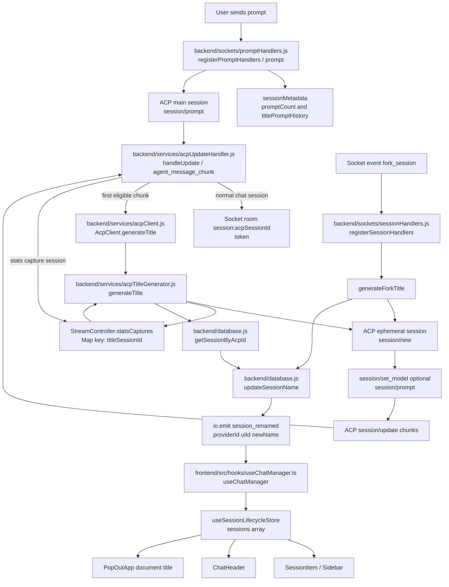

# Feature Doc - Auto Chat Title Generation

## Overview

Auto chat title generation creates short, human-readable session names for new chats and forked conversations in the background. It uses a throwaway ACP session, silently captures that session's streamed output, persists the chosen title to SQLite, and broadcasts a Socket.IO update to every connected frontend.

### What It Does

- Captures the first string prompt as `meta.userPrompt` and maintains the rolling last two string prompts in `meta.titlePromptHistory`.
- Starts new-chat title generation on the first non-empty `agent_message_chunk`, and starts later prompt title generation when `ALWAYS_RENAME_CHATS=true`.
- Starts fork title generation after `fork_session` creates and loads the forked ACP session.
- Uses `models.titleGeneration`, then `models.default`, then the first `models.quickAccess[]` entry as the title model selection chain.
- Buffers title-session tokens through `StreamController.statsCaptures` so title text is not rendered in the Unified Timeline.
- Updates `sessions.name` through the UI session ID and emits `session_renamed` with the new name.

### Why This Matters

- Sidebar, chat header, notifications, and pop-out windows all read the session name from frontend session state.
- The feature crosses prompt handling, streaming update routing, ACP JSON-RPC, SQLite persistence, and frontend store updates.
- The implementation depends on the distinction between ACP session IDs and UI session IDs.
- The title session must be invisible to the chat timeline while still receiving normal ACP streaming chunks.

This is a backend-led feature with a small frontend socket listener. Providers participate through their merged `models` configuration and their normal ACP `session/new`, `session/set_model`, and `session/prompt` support.

## How It Works - End-to-End Flow

### Path A: New Chat Title Generation

1. **A chat session is created with title-ready metadata**

   File: `backend/sockets/sessionHandlers.js` (Socket event: `create_session`)

   `registerSessionHandlers` creates metadata for both new and loaded ACP sessions. New sessions start with `promptCount: 0`, empty response buffers, selected model state, provider identity, and optional agent context.

   ```javascript
   // FILE: backend/sockets/sessionHandlers.js (Socket event: create_session)
   acpClient.sessionMetadata.set(result.sessionId, meta);
   await captureModelState(acpClient, result.sessionId, result, models, requestedModel.modelId, providerModule);
   selectedModelState = await setSessionModel(acpClient, result.sessionId, model || requestedModel.modelId, models, knownModelOptions);
   ```

2. **Prompt handling records rolling title context**

   File: `backend/sockets/promptHandlers.js` (Function: `registerPromptHandlers`, Socket event: `prompt`)

   The prompt handler increments `meta.promptCount`. String prompts update `meta.titlePromptHistory` with the last two non-empty prompts. The first string prompt is also retained as `meta.userPrompt`, which `getMetadataTitlePrompts` uses when no title history is available; array prompts are forwarded to ACP but do not populate title prompt history.

   ```javascript
   // FILE: backend/sockets/promptHandlers.js (Socket event: prompt)
   meta.promptCount = (meta.promptCount || 0) + 1;
   if (typeof prompt === 'string') {
     const promptForTitle = prompt.trim();
     if (promptForTitle) {
       const previousPrompts = Array.isArray(meta.titlePromptHistory)
         ? meta.titlePromptHistory
         : (typeof meta.userPrompt === 'string' && meta.userPrompt.trim() ? [meta.userPrompt] : []);
       meta.titlePromptHistory = [...previousPrompts, promptForTitle].slice(-2);
     }
     if (meta.promptCount === 1) {
       meta.userPrompt = prompt;
     }
   }
   ```

3. **Prompt buffers reset before ACP streaming begins**

   File: `backend/sockets/promptHandlers.js` (Socket event: `prompt`, Metadata fields: `lastResponseBuffer`, `lastThoughtBuffer`)

   The handler clears response and thought buffers before calling `session/prompt`, then calls provider prompt lifecycle hooks and sends normalized prompt parts to ACP.

   ```javascript
   // FILE: backend/sockets/promptHandlers.js (Socket event: prompt)
   meta.lastResponseBuffer = '';
   meta.lastThoughtBuffer = '';
   acpClient.providerModule.onPromptStarted(sessionId);
   await acpClient.transport.sendRequest('session/prompt', { sessionId, prompt: acpPromptParts });
   ```

4. **Assistant chunks trigger eligible title generation**

   File: `backend/services/acpUpdateHandler.js` (Function: `handleUpdate`, Update type: `agent_message_chunk`)

   `handleUpdate` normalizes provider output, estimates token usage, appends to `meta.lastResponseBuffer`, emits the token to the session room, and starts title generation once per eligible prompt. The first prompt is always eligible; later prompts are eligible only when `ALWAYS_RENAME_CHATS=true`.

   ```javascript
   // FILE: backend/services/acpUpdateHandler.js (Function: handleUpdate, Update type: agent_message_chunk)
   if (shouldGenerateTitle(meta)) {
     meta.titleGenerated = true;
     meta.lastTitleGeneratedPromptCount = Number(meta.promptCount || 0);
     acpClient.generateTitle(sessionId, meta).catch(err => writeLog(`[TITLE ERR] ${err.message}`));
   }
   ```

   The trigger uses `meta.lastTitleGeneratedPromptCount` and falls back to `meta.titleGenerated` when per-prompt count metadata is absent. It fires only outside `statsCaptures`, so internal title sessions cannot recursively generate more titles.

5. **AcpClient delegates to the service**

   File: `backend/services/acpClient.js` (Class: `AcpClient`, Method: `generateTitle`)

   `AcpClient.generateTitle` passes the live client instance, ACP session ID, and metadata object into `generateTitle` from the title generator service.

   ```javascript
   // FILE: backend/services/acpClient.js (Class: AcpClient, Method: generateTitle)
   async generateTitle(sessionId, meta) {
     return _generateTitle(this, sessionId, meta);
   }
   ```

6. **The title service creates an ephemeral ACP session**

   File: `backend/services/acpTitleGenerator.js` (Function: `generateTitle`)

   `generateTitle` resolves the provider ID from the client, exits early when metadata has no title prompt context, resolves the current UI session title, and creates a separate ACP session with an empty MCP server list.

   ```javascript
   // FILE: backend/services/acpTitleGenerator.js (Function: generateTitle)
   const providerId = acpClient.getProviderId?.() || acpClient.providerId;
   if (getMetadataTitlePrompts(meta).length === 0) return;

   let titleSessionId;
   const uiSession = await db.getSessionByAcpId(providerId, sessionId);
   if (!uiSession) return;

   const cwd = process.env.DEFAULT_WORKSPACE_CWD || process.env.HOME || process.cwd();
   const result = await acpClient.transport.sendRequest('session/new', { cwd, mcpServers: [] });
   titleSessionId = result.sessionId;
   ```

7. **The service selects the title model and registers silent capture**

   File: `backend/services/acpTitleGenerator.js` (Function: `getConfiguredModelId`, Function: `generateTitle`)

   The model is resolved from `getProvider(providerId).config.models`. The title ACP session is registered in `statsCaptures` before any title prompt is sent, and matching metadata is added to `acpClient.sessionMetadata`.

   ```javascript
   // FILE: backend/services/acpTitleGenerator.js (Function: getConfiguredModelId)
   function getConfiguredModelId(providerId, kind) {
     const models = getProvider(providerId).config.models || {};
     return models[kind] || models.default || modelOptionsFromProviderConfig(models)[0]?.id || '';
   }

   // FILE: backend/services/acpTitleGenerator.js (Function: generateTitle)
   const titleModelId = getConfiguredModelId(providerId, 'titleGeneration');
   acpClient.stream.statsCaptures.set(titleSessionId, { buffer: '' });
   acpClient.sessionMetadata.set(titleSessionId, { model: titleModelId, promptCount: 0, lastResponseBuffer: '', lastThoughtBuffer: '' });
   ```

8. **The title prompt runs through normal ACP JSON-RPC**

   File: `backend/services/acpTitleGenerator.js` (Function: `generateTitle`, ACP methods: `session/set_model`, `session/prompt`)

   If a title model ID exists, the service sets that model on the ephemeral session. It then prompts ACP with the current session title and the last two user prompts, oldest to newest. The prompt instructs the model to return the current title unchanged when it still fits the active work.

   ```javascript
   // FILE: backend/services/acpTitleGenerator.js (Function: generateTitle)
   const titlePrompt = buildTitlePrompt(currentTitle, recentPrompts);
   if (titleModelId) {
     await acpClient.transport.sendRequest('session/set_model', { sessionId: titleSessionId, modelId: titleModelId });
   }
   await acpClient.transport.sendRequest('session/prompt', { sessionId: titleSessionId, prompt: [{ type: 'text', text: titlePrompt }] });
   ```

9. **The update handler buffers title tokens**

   File: `backend/services/acpUpdateHandler.js` (Function: `handleUpdate`, Field: `acpClient.stream.statsCaptures`)

   Chunks for `titleSessionId` follow the same `session/update` route as chat chunks. Because the title session ID is present in `statsCaptures`, message chunks append to the capture buffer and are not emitted to the frontend.

   ```javascript
   // FILE: backend/services/acpUpdateHandler.js (Function: handleUpdate, Update type: agent_message_chunk)
   if (acpClient.stream.statsCaptures.has(sessionId)) {
     acpClient.stream.statsCaptures.get(sessionId).buffer += text;
   } else {
     acpClient.io.to('session:' + sessionId).emit('token', { providerId, sessionId, text });
   }
   ```

10. **The service reads the buffer and performs cleanup**

    File: `backend/services/acpTitleGenerator.js` (Function: `generateTitle`, Function: `cleanupTitleSession`)

    After `session/prompt` resolves, the service trims the capture buffer. In `finally`, `cleanupTitleSession` deletes the in-memory capture and metadata entries, then starts `cleanupAcpSession` for provider-owned ACP session files with a logged rejection handler.

    ```javascript
    // FILE: backend/services/acpTitleGenerator.js (Function: generateTitle)
    const title = acpClient.stream.statsCaptures.get(titleSessionId)?.buffer?.trim();

    // FILE: backend/services/acpTitleGenerator.js (Function: cleanupTitleSession)
    acpClient.stream.statsCaptures.delete(titleSessionId);
    acpClient.sessionMetadata.delete(titleSessionId);
    void cleanupAcpSession(titleSessionId, acpClient.providerId, reason)
      .catch(err => writeLog(`[TITLE ERR] Cleanup ${reason}: ${err.message}`));
    ```

11. **The database row is looked up by provider and ACP session ID**

    File: `backend/database.js` (Function: `getSessionByAcpId`)

    `generateTitle` has the main ACP session ID, but the UI and database rename operation need the UI session ID. `getSessionByAcpId(providerId, sessionId)` resolves the `sessions` row and maps `ui_id` to `id` in the returned object.

    ```javascript
    // FILE: backend/database.js (Function: getSessionByAcpId)
    const query = provider
      ? `SELECT * FROM sessions WHERE acp_id = ? AND provider = ? ORDER BY last_active DESC LIMIT 1`
      : `SELECT * FROM sessions WHERE acp_id = ? ORDER BY last_active DESC LIMIT 1`;
    ```

12. **The rename gate protects custom names**

    File: `backend/services/acpTitleGenerator.js` (Function: `generateTitle`, Env var: `ALWAYS_RENAME_CHATS`)

    New-chat titles are accepted only when they are non-empty, shorter than 100 characters, and different from the current title. The service looks up the current DB name before creating the ephemeral session. It generates and renames only when the current DB name is `New Chat` or `ALWAYS_RENAME_CHATS` is exactly `true`.

    ```javascript
    // FILE: backend/services/acpTitleGenerator.js (Function: generateTitle)
    const alwaysRename = process.env.ALWAYS_RENAME_CHATS === 'true';
    if (!alwaysRename && uiSession.name !== 'New Chat') return;

    if (isValidTitle(title) && title !== currentTitle) {
      await db.updateSessionName(uiSession.id, title);
      acpClient.io.emit('session_renamed', { providerId, uiId: uiSession.id, newName: title });
    }
    ```

13. **Frontend session state updates by UI ID**

    File: `frontend/src/hooks/useChatManager.ts` (Hook: `useChatManager`, Socket event: `session_renamed`)

    The frontend listener maps over `useSessionLifecycleStore.getState().sessions`, matches `s.id` against `data.uiId`, and replaces the session object with a shallow copy carrying the new name.

    ```typescript
    // FILE: frontend/src/hooks/useChatManager.ts (Hook: useChatManager, Socket event: session_renamed)
    socket.on('session_renamed', (data: { uiId: string, newName: string }) => {
      setSessions(useSessionLifecycleStore.getState().sessions.map(s => s.id === data.uiId ? { ...s, name: data.newName } : s));
    });
    ```

14. **Rendered title consumers update from store state**

    Files: `frontend/src/components/SessionItem.tsx` (Component: `SessionItem`), `frontend/src/components/ChatHeader/ChatHeader.tsx` (Component: `ChatHeader`), `frontend/src/PopOutApp.tsx` (Component: `PopOutApp`)

    `SessionItem` renders `session.name` in the sidebar. `ChatHeader` renders the active session name alongside provider branding. `PopOutApp` watches `activeSession?.name` and updates the browser title for the detached window.

### Path B: Fork Title Generation

1. **The fork handler creates the fork session**

   File: `backend/sockets/sessionHandlers.js` (Socket event: `fork_session`)

   The handler loads the source DB session, resolves the provider runtime, creates a new ACP ID and UI ID, asks the provider module to clone the ACP session, copies attachments, saves the fork row with an initial `name` of `${session.name} (fork)`, loads the new ACP session, waits for drain completion, and seeds `sessionMetadata` for the fork.

2. **The fork response returns before title generation completes**

   File: `backend/sockets/sessionHandlers.js` (Socket event: `fork_session`, Function: `generateForkTitle`)

   The callback is sent to the frontend after ACP load and metadata setup. `generateForkTitle` is launched afterward as fire-and-forget work.

   ```javascript
   // FILE: backend/sockets/sessionHandlers.js (Socket event: fork_session)
   callback?.({ success: true, providerId: runtime.providerId, newUiId, newAcpId, currentModelId: resolvedModel.modelId, modelOptions: knownModelOptions, configOptions: session.configOptions });
   generateForkTitle(acpClient, newUiId, session.messages || [], messageIndex).catch(() => {});
   ```

3. **The generator builds recent fork context**

   File: `backend/services/acpTitleGenerator.js` (Function: `generateForkTitle`)

   The function slices messages through the fork point, takes the last two user messages and last two assistant messages, truncates each content value to 200 characters, and joins them into a context prompt. If the joined context is empty after trimming, the function exits before creating an ACP session.

   ```javascript
   // FILE: backend/services/acpTitleGenerator.js (Function: generateForkTitle)
   const relevant = messages.slice(0, forkPoint + 1);
   const userMsgs = relevant.filter(m => m.role === 'user').slice(-2);
   const assistantMsgs = relevant.filter(m => m.role === 'assistant').slice(-2);

   const context = [
     ...userMsgs.map(m => `User: ${(m.content || '').substring(0, 200)}`),
     ...assistantMsgs.map(m => `Assistant: ${(m.content || '').substring(0, 200)}`),
   ].join('\n');

   if (!context.trim()) return;
   ```

4. **Fork title generation uses the same capture mechanism**

   File: `backend/services/acpTitleGenerator.js` (Function: `generateForkTitle`)

   Fork titles use `session/new`, optional `session/set_model`, `statsCaptures`, `sessionMetadata`, `session/prompt`, buffer readback, map cleanup, and `cleanupAcpSession`, just like new-chat titles. The cleanup context label is `fork-title-generation`.

5. **Valid fork titles always rename the fork row**

   File: `backend/services/acpTitleGenerator.js` (Function: `generateForkTitle`)

   A valid fork title updates the fork's UI session ID directly. It does not call `getSessionByAcpId`, and it does not apply the `New Chat` or `ALWAYS_RENAME_CHATS` gate.

   ```javascript
   // FILE: backend/services/acpTitleGenerator.js (Function: generateForkTitle)
   if (title && title.length > 0 && title.length < 100) {
     await db.updateSessionName(uiId, title);
     acpClient.io.emit('session_renamed', { providerId, uiId, newName: title });
   }
   ```

## Architecture Diagram



## Critical Contract

### 1. `statsCaptures` is the invisibility gate

File: `backend/services/streamController.js` (Class: `StreamController`, Field: `statsCaptures`)

`statsCaptures` is a `Map` keyed by ACP session ID. Each value has the shape `{ buffer: string }`. `handleUpdate` checks this map before emitting `token`, `thought`, `tool_start`, `tool_update`, or `tool_end` events for internal sessions.

Contract:

```typescript
type StatsCapture = {
  buffer: string;
};
```

A title session must be inserted into `acpClient.stream.statsCaptures` before `session/prompt` runs. If it is missing, title output follows the normal chat rendering path.

### 2. Metadata controls eligibility

Files: `backend/sockets/promptHandlers.js` (Socket event: `prompt`), `backend/services/acpUpdateHandler.js` (Function: `handleUpdate`)

The trigger depends on these metadata fields:

| Field | Owner | Contract |
|---|---|---|
| `promptCount` | `registerPromptHandlers` | Incremented before each ACP prompt; first prompt title generation is always eligible and later prompt generation requires `ALWAYS_RENAME_CHATS=true`. |
| `userPrompt` | `registerPromptHandlers` | Captured from the first string prompt and used as fallback title prompt metadata when `titlePromptHistory` is absent. |
| `titlePromptHistory` | `registerPromptHandlers` | Rolling last two non-empty string prompts used as title context. |
| `titleGenerated` | `handleUpdate` | Boolean fallback guard set to `true` before calling `acpClient.generateTitle`. |
| `lastTitleGeneratedPromptCount` | `handleUpdate` | Last prompt count that started title generation; prevents duplicate generation for the same prompt. |
| `isSubAgent` | Sub-agent creation flow | Truthy values exclude sub-agent sessions from new-chat title generation. |
| `lastResponseBuffer` | `handleUpdate` | Appended during assistant message chunks; reset by prompt handling and thought chunks. |
| `lastThoughtBuffer` | `handleUpdate` | Appended during thought chunks; reset by prompt handling. |

### 3. `session_renamed` uses UI session IDs

Files: `backend/services/acpTitleGenerator.js` (Functions: `generateTitle`, `generateForkTitle`), `frontend/src/hooks/useChatManager.ts` (Hook: `useChatManager`)

Socket event name: `session_renamed`

Payload:

```typescript
type SessionRenamedPayload = {
  providerId: string;
  uiId: string;
  newName: string;
};
```

The backend emits `uiId`, not ACP `sessionId`. The frontend matches `payload.uiId` against `ChatSession.id`.

### 4. Database rename happens through `sessions.ui_id`

File: `backend/database.js` (Table: `sessions`, Functions: `getSessionByAcpId`, `updateSessionName`)

The title service resolves the UI row from `providerId` plus the main ACP session ID. The update writes `name` where `ui_id` matches the UI session ID.

Relevant table fields:

| Table | Field | Role |
|---|---|---|
| `sessions` | `ui_id` | Frontend-facing session ID and primary key. |
| `sessions` | `acp_id` | ACP daemon session ID used by streaming and JSON-RPC. |
| `sessions` | `provider` | Provider disambiguation for ACP IDs. |
| `sessions` | `name` | Rendered title persisted by `updateSessionName`. |

### 5. Title model selection is config-only

Files: `backend/services/acpTitleGenerator.js` (Function: `getConfiguredModelId`), `backend/services/modelOptions.js` (Function: `modelOptionsFromProviderConfig`)

Providers do not implement a title hook. The backend reads `getProvider(providerId).config.models` and picks the first non-empty value in this order:

1. `models.titleGeneration`
2. `models.default`
3. first normalized entry from `models.quickAccess[]`
4. empty string, which skips `session/set_model`

## Configuration/Data Flow

### Provider Model Configuration

Title generation reads the merged provider configuration returned by `getProvider(providerId)`. A provider or user config can supply the optional title model alongside normal chat model configuration.

```json
{
  "models": {
    "default": "provider-model-standard",
    "quickAccess": [
      { "id": "provider-model-standard", "displayName": "Standard" },
      { "id": "provider-model-fast", "displayName": "Fast" }
    ],
    "titleGeneration": "provider-model-fast",
    "subAgent": "provider-model-standard"
  }
}
```

Runtime flow:

```text
getProvider(providerId).config.models
  -> getConfiguredModelId(providerId, 'titleGeneration')
  -> optional ACP session/set_model on the ephemeral title session
  -> ACP session/prompt for the title prompt
```

### Environment Variables

| Variable | Read By | Contract |
|---|---|---|
| `DEFAULT_WORKSPACE_CWD` | `generateTitle`, `generateForkTitle`, `create_session` | Preferred working directory for ephemeral and normal ACP sessions. |
| `HOME` | `generateTitle`, `generateForkTitle` | Fallback working directory for title sessions when `DEFAULT_WORKSPACE_CWD` is unset. |
| `ALWAYS_RENAME_CHATS` | `handleUpdate`, `generateTitle` | Exact string `true` enables title generation after every prompt and allows `generateTitle` to update non-`New Chat` names. |

### New Chat Data Flow

```text
User prompt string
  -> backend/sockets/promptHandlers.js stores meta.titlePromptHistory and first-prompt meta.userPrompt
  -> backend/services/acpUpdateHandler.js sees an eligible agent_message_chunk
  -> backend/services/acpClient.js delegates generateTitle
  -> backend/services/acpTitleGenerator.js creates ephemeral ACP title session
  -> backend/services/acpUpdateHandler.js buffers title chunks in statsCaptures
  -> backend/services/acpTitleGenerator.js trims captured title
  -> backend/database.js resolves UI row with getSessionByAcpId
  -> backend/database.js updates sessions.name with updateSessionName
  -> Socket.IO emits session_renamed with providerId, uiId, newName
  -> frontend/src/hooks/useChatManager.ts updates useSessionLifecycleStore sessions
  -> SessionItem, ChatHeader, and PopOutApp read the updated session name
```

### Fork Data Flow

```text
Socket event fork_session
  -> backend/sockets/sessionHandlers.js clones provider ACP session
  -> backend/database.js saves fork row with a UI ID
  -> backend/sockets/sessionHandlers.js loads and drains fork ACP session
  -> backend/services/acpTitleGenerator.js generateForkTitle builds recent context
  -> same ephemeral ACP capture path as new-chat title generation
  -> backend/database.js updates the fork row directly by UI ID
  -> Socket.IO emits session_renamed
  -> frontend session store updates by UI ID
```

## Component Reference

### Backend

| Area | File | Stable Anchors | Purpose |
|---|---|---|---|
| Title service | `backend/services/acpTitleGenerator.js` | `getConfiguredModelId`, `generateTitle`, `generateForkTitle` | Creates ephemeral ACP sessions, captures title text, applies rename rules, emits socket updates. |
| Streaming router | `backend/services/acpUpdateHandler.js` | `handleUpdate`, update type `agent_message_chunk`, field `statsCaptures`, fields `titleGenerated` and `lastTitleGeneratedPromptCount` | Buffers internal title chunks and triggers eligible title generation. |
| ACP client wrapper | `backend/services/acpClient.js` | Class `AcpClient`, method `generateTitle` | Delegates title generation from update handling to the service module. |
| Prompt socket handler | `backend/sockets/promptHandlers.js` | `registerPromptHandlers`, socket event `prompt`, fields `promptCount`, `userPrompt`, `titlePromptHistory` | Captures rolling title prompt history and resets stream buffers. |
| Session socket handler | `backend/sockets/sessionHandlers.js` | `registerSessionHandlers`, socket events `create_session`, `fork_session`, function `captureModelState` | Seeds metadata for sessions and launches fork title generation. |
| Stream state | `backend/services/streamController.js` | Class `StreamController`, field `statsCaptures`, method `reset` | Owns the capture map used for silent title output. |
| Persistence | `backend/database.js` | Table `sessions`, functions `getSessionByAcpId`, `updateSessionName` | Resolves ACP session IDs to UI rows and updates `sessions.name`. |
| Cleanup | `backend/mcp/acpCleanup.js` | Function `cleanupAcpSession` | Deletes provider-owned ACP session files for ephemeral title sessions. |
| Model helpers | `backend/services/modelOptions.js` | `modelOptionsFromProviderConfig`, `normalizeModelOptions` | Normalizes `models.quickAccess[]` fallback entries. |

### Frontend

| Area | File | Stable Anchors | Purpose |
|---|---|---|---|
| Socket dispatcher | `frontend/src/hooks/useChatManager.ts` | Hook `useChatManager`, socket event `session_renamed`, action `setSessions` | Applies backend rename events to session store state by UI ID. |
| Session store | `frontend/src/store/useSessionLifecycleStore.ts` | Store action `setSessions`, state `sessions` | Holds `ChatSession.name` consumed by sidebar and header rendering. |
| Sidebar row | `frontend/src/components/SessionItem.tsx` | Component `SessionItem`, CSS class `session-name`, prop `session.name` | Renders the session title in sidebar rows. |
| Chat header | `frontend/src/components/ChatHeader/ChatHeader.tsx` | Component `ChatHeader`, CSS class `header-session-name` | Renders the active session name with provider branding and workspace label. |
| Pop-out window | `frontend/src/PopOutApp.tsx` | Component `PopOutApp`, effect dependency `activeSession?.name` | Updates browser window title for detached chat windows. |

### Configuration And Data Stores

| Area | File | Stable Anchors | Purpose |
|---|---|---|---|
| Provider model config | `providers/*/user.json.example` | Keys `models.default`, `models.quickAccess`, `models.titleGeneration`, `models.subAgent` | Documents provider/user model configuration shape. |
| SQLite schema | `backend/database.js` | Table `sessions`, columns `ui_id`, `acp_id`, `name`, `provider` | Persists UI and ACP identity mapping plus rendered title. |
| Socket payload | Backend emitters and frontend listener | Event `session_renamed`, fields `providerId`, `uiId`, `newName` | Cross-process rename contract. |

## Gotchas

1. **`lastTitleGeneratedPromptCount` is the duplicate guard**

   The active per-prompt guard is `meta.lastTitleGeneratedPromptCount`. `meta.titleGenerated` is the boolean fallback used when per-prompt count metadata is absent. Use `handleUpdate` in `backend/services/acpUpdateHandler.js` as the source anchor.

2. **Title generation starts from assistant output, not prompt submission**

   `registerPromptHandlers` captures `titlePromptHistory` and `userPrompt`, but `handleUpdate` starts generation only after a non-empty `agent_message_chunk`. Failed prompts and sessions that never produce assistant text do not start the new-chat title path.

3. **Array prompts skip new-chat title generation**

   `meta.titlePromptHistory` is populated only when prompts are strings. If prompts arrive as arrays of ACP prompt parts, `generateTitle` exits before creating an ephemeral ACP session unless `meta.userPrompt` supplies a fallback string.

4. **`statsCaptures` must be registered before `session/prompt`**

   The title session receives normal ACP stream updates. Register `{ buffer: '' }` in `acpClient.stream.statsCaptures` before prompting the title session so title chunks are buffered instead of emitted to `token` listeners.

5. **Do not confuse ACP IDs and UI IDs**

   `sessionId` in streaming code is the ACP session ID. `uiId` in `session_renamed` is the database/UI session ID. Frontend updates use `ChatSession.id`, while backend streaming rooms use `session:<acpSessionId>`.

6. **New chats and forks have different rename gates**

   `generateTitle` creates a title session only for `New Chat` sessions unless `ALWAYS_RENAME_CHATS` is exactly `true`. When progressive rename is enabled, returning the current title is a no-op. `generateForkTitle` updates the fork UI ID directly whenever the generated title is valid.

7. **Title length validation is intentionally simple**

   Both title paths accept `title.length > 0 && title.length < 100`. Empty output and output with 100 or more characters leave the current session name unchanged.

8. **Cleanup runs from `finally`**

   `generateTitle` and `generateForkTitle` delete `statsCaptures` and `sessionMetadata` from `cleanupTitleSession` after a title session ID exists. The call to `cleanupAcpSession` is made without awaiting its returned promise, but rejected cleanup promises are logged. Code that changes this area must account for errors after capture registration.

9. **Sub-agents are excluded by metadata**

   The new-chat trigger checks `!meta.isSubAgent`. Sub-agent creation flows must set this flag for child sessions so their first chunks do not start new-chat title generation.

10. **The frontend listener ignores `providerId` for matching**

   `useChatManager` receives `providerId` in the payload but matches by `uiId`. The backend still emits `providerId` because the socket event is global and consumers may need provider context.

## Unit Tests

### Backend Tests

| File | Test Names | Coverage |
|---|---|---|
| `backend/test/acpTitleGenerator.test.js` | `should not generate if no userPrompt on meta` | Verifies the missing title-context guard in `generateTitle`. |
| `backend/test/acpTitleGenerator.test.js` | `should create session, send prompt, capture response, update DB` | Covers new-chat ephemeral session creation, prompt send, buffer readback, DB update, and `session_renamed` emit. |
| `backend/test/acpTitleGenerator.test.js` | `should include current title and last two prompts for progressive rename` | Covers progressive prompt construction with current title and rolling prompt context. |
| `backend/test/acpTitleGenerator.test.js` | `should not emit rename when generated title matches the current title` | Covers the keep-current-title no-op path. |
| `backend/test/acpTitleGenerator.test.js` | `should not rename if name is not New Chat and ALWAYS_RENAME_CHATS is false` | Covers the custom-name rename gate for new chats. |
| `backend/test/acpTitleGenerator.test.js` | `generates title from last 2 user and assistant messages` | Covers fork context construction and fork rename emit. |
| `backend/test/acpTitleGenerator.test.js` | `does nothing when messages are empty` | Covers fork empty-context guard. |
| `backend/test/acpTitleGenerator.test.js` | `only uses messages up to forkPoint` | Covers fork point slicing before title prompt construction. |
| `backend/test/acpUpdateHandler.test.js` | `handles generateTitle failure gracefully` | Verifies `handleUpdate` catches rejected title generation promises through the trigger path. |
| `backend/test/acpUpdateHandler.test.js` | `buffers text in statsCaptures if present` | Verifies capture sessions buffer message chunks and suppress token emits. |
| `backend/test/acpUpdateHandler.test.js` | `fires title generation on first message chunk` | Verifies first-chunk trigger conditions and `meta.titleGenerated`/`meta.lastTitleGeneratedPromptCount` mutation. |
| `backend/test/acpUpdateHandler.test.js` | `fires progressive title generation on later prompts when enabled` | Verifies `ALWAYS_RENAME_CHATS=true` enables later-prompt generation. |
| `backend/test/acpUpdateHandler.test.js` | `does not fire progressive title generation on later prompts when disabled` | Verifies default later-prompt suppression. |
| `backend/test/promptHandlers.test.js` | `should store userPrompt and title prompt history on metadata for first prompt` | Verifies first string prompt fallback capture, title history capture, and `promptCount` increment. |
| `backend/test/promptHandlers.test.js` | `should keep userPrompt and append title prompt history on subsequent prompts` | Verifies the first prompt remains fallback metadata while title history rolls forward. |
| `backend/test/promptHandlers.test.js` | `should keep only the last two title prompts` | Verifies rolling prompt history length. |
| `backend/test/promptHandlers.test.js` | `should delete from statsCaptures and not emit error token when error occurs during stats capture` | Covers prompt error behavior while a session is in `statsCaptures`. |
| `backend/test/sessionHandlers.test.js` | `handles fork_session` | Covers fork handler setup around clone, save, ACP load, and callback flow. |
| `backend/test/streamController.test.js` | `should isolate stats capture buffers between sessions` | Verifies capture map isolation. |
| `backend/test/streamController.test.js` | `should clear all state on reset` | Verifies `StreamController.reset` clears capture state. |

### Frontend Tests

| File | Test Names | Coverage |
|---|---|---|
| `frontend/src/test/useChatManager.test.ts` | `handles "session_renamed" event` | Verifies the socket listener calls `setSessions` for rename events. |
| `frontend/src/test/SessionItem.test.tsx` | `renders session name` | Verifies sidebar row rendering from `session.name`. |
| `frontend/src/test/SessionItem.test.tsx` | `enters edit mode when rename button is clicked` | Verifies manual rename UI still reads the current session name. |
| `frontend/src/test/PopOutApp.test.tsx` | `sets document.title with session name when ready` | Verifies detached windows derive browser title from active session name. |

### Focused Test Commands

Run these when changing title generation behavior:

```powershell
cd backend; npx vitest run test/acpTitleGenerator.test.js test/acpUpdateHandler.test.js test/promptHandlers.test.js test/sessionHandlers.test.js test/streamController.test.js
cd frontend; npx vitest run src/test/useChatManager.test.ts src/test/SessionItem.test.tsx src/test/PopOutApp.test.tsx
```

## How to Use This Guide

### For Implementing Or Extending This Feature

1. Start with `backend/services/acpTitleGenerator.js` and identify whether the change belongs in `generateTitle`, `generateForkTitle`, or `getConfiguredModelId`.
2. Check `backend/services/acpUpdateHandler.js` before changing trigger conditions; the active guard uses `shouldGenerateTitle(meta)`, `lastTitleGeneratedPromptCount`, `titleGenerated`, `isSubAgent`, and `ALWAYS_RENAME_CHATS`.
3. Check `backend/sockets/promptHandlers.js` before changing prompt capture; `titlePromptHistory` is populated from the rolling last two string prompts and `userPrompt` is retained as the first-prompt fallback.
4. Preserve the `statsCaptures` registration before `session/prompt` for every internal ACP title session.
5. Preserve the `session_renamed` payload fields and the UI-ID-based match in `frontend/src/hooks/useChatManager.ts`.
6. Update backend tests in `backend/test/acpTitleGenerator.test.js` or `backend/test/acpUpdateHandler.test.js` for title service or trigger changes.
7. Update frontend tests in `frontend/src/test/useChatManager.test.ts`, `frontend/src/test/SessionItem.test.tsx`, or `frontend/src/test/PopOutApp.test.tsx` for rename rendering changes.

### For Debugging Issues With This Feature

1. **New chats stay named `New Chat`**

   Check `backend/sockets/promptHandlers.js` for `meta.titlePromptHistory` or compatible `meta.userPrompt`, then check `backend/services/acpUpdateHandler.js` for `meta.promptCount`, `meta.titleGenerated`, `meta.lastTitleGeneratedPromptCount`, and `meta.isSubAgent`. If the trigger runs, inspect `backend/services/acpTitleGenerator.js` for the title length gate, DB lookup through `getSessionByAcpId`, and the `New Chat` or `ALWAYS_RENAME_CHATS` rename gate.

2. **Title text appears in the chat timeline**

   Check that `generateTitle` or `generateForkTitle` registers `acpClient.stream.statsCaptures.set(titleSessionId, { buffer: '' })` before sending the title prompt. Then check `handleUpdate` to confirm the ACP session ID in the chunk matches the title session ID.

3. **Fork title is missing or uses unexpected context**

   Check the `fork_session` payload `messageIndex`, the `session.messages` array persisted in SQLite, and `generateForkTitle` context construction. The service groups recent user messages first and recent assistant messages second.

4. **Frontend does not show the emitted title**

   Check that the backend emits `session_renamed` with `uiId`, not ACP `sessionId`. Then check `useChatManager` to confirm the session exists in `useSessionLifecycleStore.getState().sessions` with a matching `id`.

5. **Pop-out browser title does not update**

   Check `frontend/src/PopOutApp.tsx` for the effect keyed on `activeSession?.name`, and confirm the pop-out store contains the renamed session after `session_renamed` is handled.

## Summary

- New-chat titles use rolling string prompt context and are triggered by assistant message chunks; later-prompt generation requires `ALWAYS_RENAME_CHATS=true`.
- Fork titles are generated after the fork ACP session is cloned, loaded, drained, and returned to the caller.
- Title generation uses ephemeral ACP sessions with `mcpServers: []` and optional `session/set_model` from `models.titleGeneration` fallback rules.
- `StreamController.statsCaptures` is the critical mechanism that keeps title-session output out of the Unified Timeline.
- New-chat rename uses `getSessionByAcpId(providerId, acpSessionId)`, includes the current title in the prompt, respects the `New Chat` gate unless `ALWAYS_RENAME_CHATS=true`, and skips emitting when the generated title matches the current title.
- Fork rename writes directly to the fork UI session ID when the title passes the length gate.
- `session_renamed` carries `providerId`, `uiId`, and `newName`; frontend state updates match by `ChatSession.id`.
- The most important anchors are `generateTitle`, `generateForkTitle`, `handleUpdate`, `registerPromptHandlers`, `fork_session`, and the `session_renamed` listener in `useChatManager`.
