# Feature Doc — Auto Chat Title Generation

## Overview

The auto chat title generation feature creates human-readable titles for new chat sessions and forked conversations automatically in the background. It uses a throwaway ACP session with a dedicated model to generate concise titles (max 6 words) without interrupting the main conversation flow.

**Why This Matters:** Users appreciate descriptive session names instead of "New Chat" defaults. This feature runs silently, never blocking main conversation streaming, and respects user intent by not overwriting custom names.

## What It Does

- **Auto-titles new chats** — On the first response from the AI (not on prompt submission), generates a title based on the user's initial message
- **Auto-titles forked sessions** — When a conversation is forked, generates a title from the last 2 user + last 2 assistant messages before the fork point
- **Respects custom names** — Skips renaming if the session already has a custom name (unless `ALWAYS_RENAME_CHATS=true`)
- **Non-blocking generation** — Runs asynchronously in the background, uses ephemeral ACP sessions, no impact on main conversation
- **Model selection** — Uses the configured `titleGeneration` model (cheaper/faster) if available, falls back to provider default
- **Socket-driven UI updates** — Broadcasts `session_renamed` events so all connected clients instantly see title changes

## Why This Matters

- **User experience** — Descriptive titles make it easy to find conversations in a long sidebar
- **Non-invasive** — Fires on first response chunk (not on prompt), ensuring the model is actually responding
- **Resource-efficient** — Uses ephemeral sessions that are immediately cleaned up; no persistent overhead
- **Provider-agnostic** — Works with any ACP provider; title model is configured per provider
- **Safe by default** — Only renames "New Chat" sessions unless explicitly configured otherwise

---

## How It Works — End-to-End Flow

### Path A: New Chat Title Generation (`generateTitle()`)

**Step 1: User Submits Initial Message**
- File: `backend/sockets/promptHandlers.js` (Lines 48–51)
- When a user sends a message, the prompt handler increments `meta.promptCount` and stores the text in `meta.userPrompt` if this is the first prompt
```javascript
// Lines 48-51 in promptHandlers.js
meta.promptCount = (meta.promptCount || 0) + 1;
if (meta.promptCount === 1 && typeof prompt === 'string') {
  meta.userPrompt = prompt;  // Captured for title generation later
}
```

**Step 2: ACP Daemon Processes & Responds**
- File: `backend/services/acpClient.js` (line not shown, but part of standard streaming loop)
- The ACP daemon processes the user's message and begins streaming the response back via `agent_message_chunk` updates

**Step 3: First Response Chunk Triggers Title Generation**
- File: `backend/services/acpUpdateHandler.js` (Function: `handleUpdate`, Lines 48–57)
- On the very first token of the response, the system checks conditions: `promptCount === 1`, `!titleStarted`, and `!isSubAgent`
- If all conditions pass, it calls `generateTitle()` asynchronously
```javascript
// Lines 48-57 in acpUpdateHandler.js (approximate, within message chunk handling)
if (metadata.promptCount === 1 && metadata.lastResponseBuffer.length > 0 && !metadata.titleStarted && !metadata.isSubAgent) {
  metadata.titleStarted = true;
  generateTitle(acpClient, sessionId, metadata).catch(() => {});
}
```

**Step 4: Delegate to AcpClient Method**
- File: `backend/services/acpClient.js` (Function: `generateTitle`, Lines 387-389)
- The AcpClient has a wrapper method that delegates to the imported `generateTitle()` function from acpTitleGenerator
```javascript
// Lines 387-389 in acpClient.js
async generateTitle(sessionId, meta) {
  return _generateTitle(this, sessionId, meta);
}
```

**Step 5: Create Ephemeral Title Generation Session**
- File: `backend/services/acpTitleGenerator.js` (Lines 17–24)
- The `generateTitle()` function creates a temporary ACP session (one-time use) to avoid interrupting the main conversation
- This ephemeral session is completely separate and independent
```javascript
// Lines 17-24 in acpTitleGenerator.js
export async function generateTitle(acpClient, sessionId, meta) {
  const providerId = acpClient.getProviderId?.() || acpClient.providerId;
  if (!meta.userPrompt) return;  // Guard: must have user prompt
  writeLog(`[TITLE] Generating title for session ${sessionId}`);

  try {
    const cwd = process.env.DEFAULT_WORKSPACE_CWD || process.env.HOME || process.cwd();
    const result = await acpClient.transport.sendRequest('session/new', { cwd, mcpServers: [] });
    const titleSessionId = result.sessionId;
```

**Step 6: Select Title Generation Model**
- File: `backend/services/acpTitleGenerator.js` (Lines 7–10, 27)
- Resolves the model ID using the `titleGeneration` config key; falls back to `default` or first available model
```javascript
// Lines 7-10 in acpTitleGenerator.js
function getConfiguredModelId(providerId, kind) {
  const models = getProvider(providerId).config.models || {};
  return models[kind] || models.default || modelOptionsFromProviderConfig(models)[0]?.id || '';
}

// Line 27 in acpTitleGenerator.js
const titleModelId = getConfiguredModelId(providerId, 'titleGeneration');
```

**Step 7: Setup Silent Output Capture**
- File: `backend/services/acpTitleGenerator.js` (Lines 30–31)
- Configure `statsCaptures` map to silently buffer the title session's output (prevents tokens from leaking to UI)
- Also initialize session metadata for the ephemeral session
```javascript
// Lines 30-31 in acpTitleGenerator.js
acpClient.stream.statsCaptures.set(titleSessionId, { buffer: '' });
acpClient.sessionMetadata.set(titleSessionId, { model: titleModelId, promptCount: 0, lastResponseBuffer: '', lastThoughtBuffer: '' });
```

**Step 8: Set Model on Ephemeral Session**
- File: `backend/services/acpTitleGenerator.js` (Lines 34–35)
- Switch the ephemeral session to the configured title model (only if one is configured)
```javascript
// Lines 34-35 in acpTitleGenerator.js
if (titleModelId) {
  await acpClient.transport.sendRequest('session/set_model', { sessionId: titleSessionId, modelId: titleModelId });
}
```

**Step 9: Send Title Generation Prompt**
- File: `backend/services/acpTitleGenerator.js` (Lines 33, 37)
- Send a generic prompt to the ephemeral session: `"Generate a short chat title (max 6 words, no quotes) for this user message: \"[user prompt]\""`
```javascript
// Lines 33, 37 in acpTitleGenerator.js
const titlePrompt = `Generate a short chat title (max 6 words, no quotes) for this user message: "${meta.userPrompt}"`;
// ...
await acpClient.transport.sendRequest('session/prompt', { sessionId: titleSessionId, prompt: [{ type: 'text', text: titlePrompt }] });
```

**Step 10: Capture Title Output**
- File: `backend/services/acpTitleGenerator.js` (Line 39)
- Extract the generated title from the `statsCaptures` buffer (silently captured during streaming)
```javascript
// Line 39 in acpTitleGenerator.js
const title = acpClient.stream.statsCaptures.get(titleSessionId)?.buffer?.trim();
```

**Step 11: Cleanup Ephemeral Session**
- File: `backend/services/acpTitleGenerator.js` (Lines 41–43)
- Delete all traces: `statsCaptures` map entry, session metadata, and ACP-side files
```javascript
// Lines 41-43 in acpTitleGenerator.js
acpClient.stream.statsCaptures.delete(titleSessionId);
acpClient.sessionMetadata.delete(titleSessionId);
cleanupAcpSession(titleSessionId, acpClient.providerId, 'title-generation');
```

**Step 12: Validate Title**
- File: `backend/services/acpTitleGenerator.js` (Line 45)
- Check that the generated title is within acceptable bounds: 1–100 characters
```javascript
// Line 45 in acpTitleGenerator.js
if (title && title.length > 0 && title.length < 100) {
```

**Step 13: Lookup UI Session by ACP Session ID**
- File: `backend/services/acpTitleGenerator.js` (Line 46)
- Query the database to find the UI session record using the ACP session ID
```javascript
// Line 46 in acpTitleGenerator.js
const uiSession = await db.getSessionByAcpId(providerId, sessionId);
```

**Step 14: Check Rename Conditions**
- File: `backend/services/acpTitleGenerator.js` (Lines 48–49)
- Only rename if: (a) session is currently named "New Chat", or (b) `ALWAYS_RENAME_CHATS=true`
- This prevents overwriting user-chosen custom names
```javascript
// Lines 48-49 in acpTitleGenerator.js
const alwaysRename = process.env.ALWAYS_RENAME_CHATS === 'true';
if (alwaysRename || uiSession.name === 'New Chat') {
```

**Step 15: Update Database**
- File: `backend/services/acpTitleGenerator.js` (Line 50)
- Persist the new title to the `sessions` table in SQLite
```javascript
// Line 50 in acpTitleGenerator.js
await db.updateSessionName(uiSession.id, title);
```

**Step 16: Emit Socket Event**
- File: `backend/services/acpTitleGenerator.js` (Line 52)
- Broadcast `session_renamed` event to all connected clients with the new title
```javascript
// Line 52 in acpTitleGenerator.js
acpClient.io.emit('session_renamed', { providerId, uiId: uiSession.id, newName: title });
```

**Step 17: Error Handling**
- File: `backend/services/acpTitleGenerator.js` (Lines 56–58)
- Any errors during title generation are caught and logged without crashing the session
```javascript
// Lines 56-58 in acpTitleGenerator.js
} catch (err) {
  writeLog(`[TITLE ERR] ${err.message}`);
}
```

### Path B: Fork Title Generation (`generateForkTitle()`)

**Fork Step 1: Fork Session Handler Called**
- File: `backend/sockets/sessionHandlers.js` (Line 251)
- When a user forks a session at a specific message, `generateForkTitle()` is called asynchronously
```javascript
// Line 251 in sessionHandlers.js
generateForkTitle(acpClient, newUiId, session.messages || [], messageIndex).catch(() => {})
```

**Fork Step 2: Extract Relevant Messages**
- File: `backend/services/acpTitleGenerator.js` (Lines 65–72)
- Gather the last 2 user messages and last 2 assistant messages up to the fork point
- Truncate each message to 200 characters and build a context string
```javascript
// Lines 65-72 in acpTitleGenerator.js
const relevant = messages.slice(0, forkPoint + 1);
const userMsgs = relevant.filter(m => m.role === 'user').slice(-2);
const assistantMsgs = relevant.filter(m => m.role === 'assistant').slice(-2);

const context = [
  ...userMsgs.map(m => `User: ${(m.content || '').substring(0, 200)}`),
  ...assistantMsgs.map(m => `Assistant: ${(m.content || '').substring(0, 200)}`),
].join('\n');
```

**Fork Step 3: Guard Check**
- File: `backend/services/acpTitleGenerator.js` (Line 74)
- Exit early if no context is available (empty or whitespace-only)
```javascript
// Line 74 in acpTitleGenerator.js
if (!context.trim()) return;
```

**Fork Step 4–10: Same as Path A**
- Create ephemeral session, select model, capture output, cleanup (Lines 78–95)
- Same pattern as new chat title generation but using the fork context

**Fork Step 11: Fork Title Prompt**
- File: `backend/services/acpTitleGenerator.js` (Line 86)
- Send a context-aware prompt: `"Generate a short chat title (max 6 words, no quotes) for this forked conversation. Here is the recent context:\n\n[context]"`
```javascript
// Line 86 in acpTitleGenerator.js
const titlePrompt = `Generate a short chat title (max 6 words, no quotes) for this forked conversation. Here is the recent context:\n\n${context}`;
```

**Fork Step 12: Always Rename (No "New Chat" Check)**
- File: `backend/services/acpTitleGenerator.js` (Lines 98–99)
- Unlike new chats, forked sessions are ALWAYS renamed (no "New Chat" condition)
- This makes forked branches immediately distinguishable
```javascript
// Lines 98-99 in acpTitleGenerator.js
if (title && title.length > 0 && title.length < 100) {
  await db.updateSessionName(uiId, title);
```

**Fork Step 13: Emit Socket Event**
- File: `backend/services/acpTitleGenerator.js` (Line 101)
- Broadcast `session_renamed` event with fork's new title
```javascript
// Line 101 in acpTitleGenerator.js
acpClient.io.emit('session_renamed', { providerId, uiId, newName: title });
```

---

## Architecture Diagram

```mermaid
graph TB
  subgraph "User → Backend"
    A["User sends first message<br/>(prompt event)"]
    B["promptHandlers<br/>Capture userPrompt<br/>INCREMENT promptCount"]
  end

  subgraph "ACP Daemon"
    C["ACP processes<br/>main session<br/>sends response"]
  end

  subgraph "Backend Title Generation"
    D["acpUpdateHandler<br/>detects<br/>first agent_message_chunk"]
    E["Check guards:<br/>promptCount==1<br/>!titleGenerated<br/>!isSubAgent"]
    F["acpClient.generateTitle()<br/>async, fire-and-forget"]
    G["Create ephemeral<br/>ACP session"]
    H["Setup statsCaptures<br/>silent buffer"]
    I["Select titleGeneration<br/>model ID"]
    J["Send title prompt"]
    K["Capture output<br/>from buffer"]
    L["Delete ephemeral<br/>session traces"]
    M["Validate title<br/>1-100 chars"]
    N["Query DB:<br/>getSessionByAcpId"]
    O["Check rename<br/>condition:<br/>New Chat OR<br/>ALWAYS_RENAME_CHATS"]
    P["UPDATE DB<br/>sessions.name"]
    Q["io.emit<br/>session_renamed"]
  end

  subgraph "Frontend"
    R["useChatManager<br/>socket listener"]
    S["setSessions<br/>Zustand update"]
    T["SessionItem re-render<br/>display new name"]
    U["User sees title<br/>in sidebar +<br/>window tab"]
  end

  A --> B
  B --> C
  C --> D
  D --> E
  E -->|all pass| F
  F --> G
  G --> H
  H --> I
  I --> J
  J --> K
  K --> L
  L --> M
  M -->|valid| N
  N --> O
  O -->|rename| P
  P --> Q
  Q --> R
  R --> S
  S --> T
  T --> U

  style F fill:#ffcccc
  style Q fill:#ccffcc
```



**Flow:** Main conversation streaming continues uninterrupted while title generation happens in a parallel ephemeral session. Socket event broadcasts title change to all clients.

---

## The Critical Contract: Session Capture & Event Shape

### The Contract

1. **statsCaptures Buffer Pattern (Backend)**
   - When a session ID is registered in `acpClient.stream.statsCaptures`, all response chunks for that session are silently buffered instead of emitted to UI
   - The buffer is a simple object: `{ buffer: '' }` (accumulates tokens as strings)
   - This is the **only way** to prevent tokens from leaking into the Unified Timeline
   - File: `backend/services/acpUpdateHandler.js` (Lines 121–125)
   ```javascript
   if (acpClient.stream.statsCaptures.has(sessionId)) {
     acpClient.stream.statsCaptures.get(sessionId).buffer += text;
   } else {
     acpClient.io.to('session:' + sessionId).emit('token', { ... });  // normal path
   }
   ```

2. **Session Renamed Event Shape (Socket.IO)**
   - Event name: `session_renamed`
   - Payload structure:
   ```typescript
   {
     providerId: string;      // Provider ID (e.g., 'my-provider')
     uiId: string;            // UI Session ID (from database, not ACP ID)
     newName: string;         // Generated title (1-100 chars)
   }
   ```
   - File: `backend/services/acpTitleGenerator.js` (Lines 52, 101)
   - This event is broadcast to **all connected clients** via `io.emit()`, not scoped to a specific session room

3. **Frontend State Update Contract**
   - The `session_renamed` listener must match sessions by `s.id === data.uiId` (not by ACP session ID)
   - Update creates a shallow copy of the session object to trigger Zustand re-renders
   - File: `frontend/src/hooks/useChatManager.ts` (Lines 224–226)
   ```typescript
   socket.on('session_renamed', (data: { uiId: string, newName: string }) => {
     setSessions(useSessionLifecycleStore.getState().sessions.map(s => 
       s.id === data.uiId ? { ...s, name: data.newName } : s
     ));
   });
   ```

### Why This Contract Matters

- **statsCaptures is the gate:** If a session ID is not in `statsCaptures`, its tokens go to the UI. Missing this in new code = title tokens appear in chat
- **uiId vs acpSessionId:** Title generation uses ACP session IDs internally but must emit UI session IDs. Confusing these breaks the frontend lookup
- **Shallow copy required:** Zustand only re-renders if the object reference changes; `{ ...s, name: ... }` creates a new reference

---

## Configuration / Provider Support

### Provider Config Keys

A provider's `provider.json` must include a `models` section with an optional `titleGeneration` key:

```json
{
  "models": {
    "default": "provider-model-standard",
    "titleGeneration": "provider-model-fast",
    "balanced": { "id": "some-model", "label": "Balanced" }
  }
}
```

**Model Selection Logic (acpTitleGenerator.js Lines 7–10):**
1. If `models.titleGeneration` is defined → use it
2. Else if `models.default` is defined → use it
3. Else use the first available model from the provider's `modelOptions`

### Environment Variables

| Variable | Default | Purpose |
|----------|---------|---------|
| `DEFAULT_WORKSPACE_CWD` | `HOME` or `cwd()` | Working directory for ephemeral title sessions |
| `ALWAYS_RENAME_CHATS` | `'false'` | If `'true'`, rename sessions even if they already have custom names |

### Provider Implementation Requirements

Providers do **not** need to implement any special logic for title generation. The feature is entirely backend-managed. However:

- **Model config** — Provider must define `titleGeneration` key in `models` config if they want to use a specific model for titles
- **No provider hooks** — Title generation does not trigger any provider hooks (no `post_tool`, no `session_start`)
- **Ephemeral sessions** — Title generation creates standard ACP sessions; provider must support `session/new` and `session/prompt` RPC (all providers do)

---

## Data Flow Example

### Raw Input → Normalized → Rendered

```
[STEP 1] User Input
  Input: "Show me how to build a React component with Tailwind"
  Stored in: meta.userPrompt (promptHandlers.js:51)

[STEP 2] Ephemeral Session Processing
  Prompt sent to title model:
    "Generate a short chat title (max 6 words, no quotes) for this user message: \"Show me how to build a React component with Tailwind\""
  
  ACP Response (streamed to statsCaptures buffer):
    Token 1: "React"
    Token 2: " "
    Token 3: "Tailwind"
    Token 4: " "
    Token 5: "Component"
    Token 6: " "
    Token 7: "Tutorial"

  Captured buffer: "React Tailwind Component Tutorial"

[STEP 3] Validation & Database
  Trim: "React Tailwind Component Tutorial"
  Length check: 34 chars (pass, < 100)
  Rename condition: session.name === "New Chat" (pass)
  DB Update: UPDATE sessions SET name = 'React Tailwind Component Tutorial' WHERE ui_id = 'abc-123'

[STEP 4] Socket Emission
  Event: session_renamed
  Payload: { providerId: 'my-provider', uiId: 'abc-123', newName: 'React Tailwind Component Tutorial' }

[STEP 5] Frontend Update
  Zustand state: sessions[x] = { ...sessions[x], name: 'React Tailwind Component Tutorial' }
  
[STEP 6] UI Rendering
  SessionItem.tsx:67: <span className="session-name">React Tailwind Component Tutorial</span>
  Result: Sidebar shows "React Tailwind Component Tutorial" instead of "New Chat"
  If active session: window.title updates to "React Tailwind Component Tutorial — Pop Out" (PopOutApp.tsx:100)
```

---

## Component Reference

### Backend Files

| File | Lines | Key Functions | Purpose |
|------|-------|----------------|---------|
| `backend/services/acpTitleGenerator.js` | 17–59 | `generateTitle()` | Main title generation for new chats |
| `backend/services/acpTitleGenerator.js` | 61–106 | `generateForkTitle()` | Title generation for forked sessions |
| `backend/services/acpTitleGenerator.js` | 7–10 | `getConfiguredModelId()` | Resolve model ID from provider config |
| `backend/services/acpUpdateHandler.js` | 121–131 | — | Trigger detection and title gen call |
| `backend/services/acpClient.js` | 383–385 | `generateTitle()` method | Wrapper that delegates to acpTitleGenerator |
| `backend/sockets/promptHandlers.js` | 48–51 | — | Capture userPrompt on first prompt |
| `backend/sockets/sessionHandlers.js` | 251 | — | Call site for fork title generation |
| `backend/database.js` | — | `updateSessionName()` | Persist title to DB |
| `backend/database.js` | — | `getSessionByAcpId()` | Lookup UI session by ACP ID |
| `backend/mcp/acpCleanup.js` | — | `cleanupAcpSession()` | Delete ephemeral session files |

### Frontend Files

| File | Lines | Key Functions/State | Purpose |
|------|-------|---------------------|---------|
| `frontend/src/hooks/useChatManager.ts` | 224–226 | `socket.on('session_renamed')` | Receive title update event |
| `frontend/src/hooks/useChatManager.ts` | 224–226 | `setSessions()` | Update Zustand state with new title |
| `frontend/src/components/SessionItem.tsx` | 67 | render | Display session name in sidebar |
| `frontend/src/PopOutApp.tsx` | 100 | effect | Update browser tab title if session is active |

### Database

| Table | Column | Type | Purpose |
|-------|--------|------|---------|
| `sessions` | `name` | TEXT | Stores the generated (or user-edited) session title |
| `sessions` | `acpSessionId` | TEXT | Links UI session to ACP session ID |
| `sessions` | `id` (ui_id) | TEXT PRIMARY KEY | Frontend-facing session ID for socket events |

---

## Gotchas & Important Notes

### 1. **statsCaptures Must Be Set BEFORE Streaming Starts**
- **Problem:** If title session begins streaming tokens before `statsCaptures` is registered, those tokens will leak to the UI or cause errors
- **Why:** The update handler checks `acpClient.stream.statsCaptures.has(sessionId)` on every token. If the map entry doesn't exist, it tries to emit to the UI
- **Avoidance:** Always call `acpClient.stream.statsCaptures.set(titleSessionId, { buffer: '' })` (Line 30) immediately after creating the ephemeral session, before sending any prompts
- **Detection:** Check logs for unexpected tokens appearing in title-generation sessions or orphaned title tokens in the UI

### 2. **Sub-Agents Are Always Excluded**
- **Problem:** If a sub-agent's first response triggers title generation, it creates a title for a session that will be deleted, wasting resources
- **Why:** The guard at `acpUpdateHandler.js:123` explicitly checks `!meta.isSubAgent`
- **Avoidance:** When creating a sub-agent session, ensure `meta.isSubAgent = true` is set immediately
- **Detection:** If a sub-agent has an auto-generated title in the UI, the guard was bypassed

### 3. **"New Chat" Rename Gate Prevents Overwriting User Names**
- **Problem:** If a user has manually renamed a session to something custom, auto-title generation must not overwrite it
- **Why:** The condition at `acpTitleGenerator.js:49` checks `uiSession.name === 'New Chat'`. Only "New Chat" sessions are eligible for auto-titling
- **Avoidance:** Users can manually rename any session; once renamed, titles never auto-update (unless `ALWAYS_RENAME_CHATS=true`)
- **Detection:** If a manually-renamed session gets auto-renamed unexpectedly, check the `.env` for `ALWAYS_RENAME_CHATS=true`

### 4. **Ephemeral Session Cleanup Must Happen Immediately**
- **Problem:** If cleanup is delayed or skipped, ephemeral session files accumulate on disk and metadata leaks into memory
- **Why:** Each title generation creates a full ACP session; without cleanup, disk usage grows and memory footprint increases
- **Avoidance:** The cleanup call at `acpTitleGenerator.js:43` (`cleanupAcpSession()`) must complete before the function exits
- **Detection:** Check disk usage in the provider's session storage directory; orphaned `.jsonl` files indicate cleanup failures

### 5. **Fork Title Always Renames, Ignoring Custom Names**
- **Problem:** When forking a session that has a custom name, the fork gets an auto-generated title regardless of the parent's name
- **Why:** The fork title logic at `acpTitleGenerator.js:98` has **no** "New Chat" check—it unconditionally updates `db.updateSessionName()`
- **This is intentional:** Forked sessions should be visually distinct from their parents, so they always get new titles
- **Avoidance:** If you don't want a fork to be auto-titled, manually rename it after creation. Future prompts in the fork won't trigger title generation again
- **Detection:** Forked sessions in the sidebar will always have generated titles (unlike new chats which only get titles if "New Chat")

### 6. **Title Generation Is Fire-and-Forget**
- **Problem:** If the user cancels/stops the session very quickly after the first response, title generation may still be running and try to update a deleted session
- **Why:** `acpUpdateHandler.js:125` calls `acpClient.generateTitle()` with `.catch()` but no `await`. The operation is async and independent
- **Avoidance:** Database updates and socket emissions have guards (`if (uiSession)` at line 47), but if DB is in a bad state, updates may fail silently
- **Detection:** Rapid session deletion followed by errors in logs like `[TITLE ERR] Cannot update deleted session` indicates a race condition

### 7. **userPrompt Only Captured on First Prompt**
- **Problem:** If somehow a session receives a second prompt before the first response, `meta.userPrompt` is NOT updated
- **Why:** `promptHandlers.js:50` checks `meta.promptCount === 1`, so the capture only happens on the very first prompt
- **Avoidance:** This is by design; title generation should always reflect the original user intent, not mid-conversation edits
- **Detection:** If title generation fires but uses wrong text, check if multiple prompts were sent in rapid succession

### 8. **Model Config Fallback Chain**
- **Problem:** If `titleGeneration` model is not configured, the system falls back to `default`, then first available. A misconfigured provider might use an expensive model for titles
- **Why:** `getConfiguredModelId()` at lines 8–9 has no validation that the model is "cheap"; it just returns the first available
- **Avoidance:** Always define `models.titleGeneration` in provider config to an inexpensive, fast model. Don't rely on fallbacks
- **Detection:** Monitor ACP logs and costs; if titles are using your most expensive model, the fallback was triggered

### 9. **Title Length Validation Is Simple**
- **Problem:** If the LLM returns a title with > 100 chars or 0 chars, the title is silently rejected and the session stays "New Chat"
- **Why:** `acpTitleGenerator.js:45` checks `title.length > 0 && title.length < 100` with a simple if-guard
- **Avoidance:** The prompt is specific ("max 6 words"), so this is rare. If it happens, check the LLM's instructions or try a different model
- **Detection:** If some sessions remain "New Chat" after several tries, check logs for `[TITLE] Generating title...` without corresponding `[TITLE] Set title...`

### 10. **statsCaptures Cleanup Must Delete Both Map Entry AND Metadata**
- **Problem:** If only `statsCaptures.delete()` is called but `sessionMetadata.delete()` is skipped, memory leaks and stale metadata interferes with future sessions
- **Why:** Both maps need cleanup; title sessions use both for state isolation
- **Avoidance:** Always call both `acpClient.stream.statsCaptures.delete()` (line 41) and `acpClient.sessionMetadata.delete()` (line 42) in the same cleanup block
- **Detection:** If title sessions leak memory or cause ACP to use stale metadata, check that both cleanup calls are present

---

## Unit Tests

### Test File: `backend/test/acpTitleGenerator.test.js`

#### New Chat Title Tests (Lines 23–81)

| Test Name | Lines | Coverage |
|-----------|-------|----------|
| `should not generate if no userPrompt on meta` | 45–48 | Guard condition: missing userPrompt skips generation |
| `should create session, send prompt, capture response, update DB` | 50–65 | Happy path: full flow from RPC to DB update |
| `should not rename if name is not New Chat and ALWAYS_RENAME_CHATS is false` | 67–80 | Rename gate: respects custom names |

#### Fork Title Tests (Lines 83–160)

| Test Name | Lines | Coverage |
|-----------|-------|----------|
| `generates title from last 2 user and assistant messages` | 105–131 | Context extraction and fork prompt generation |
| `does nothing when messages are empty` | 133–136 | Guard: empty message array returns early |
| `only uses messages up to forkPoint` | 138–159 | Boundary: respects fork point in message slicing |

#### Related Tests

**File:** `backend/test/acpUpdateHandler.test.js`
- Line 102–109: `handles generateTitle failure gracefully` — Title generation doesn't crash session if it errors
- Line 233: `acpClient.generateTitle is called with correct params` — Trigger detection passes metadata correctly

### Running Tests

```bash
cd backend
npx vitest run backend/test/acpTitleGenerator.test.js     # Run title tests only
npx vitest run backend/test/acpUpdateHandler.test.js      # Run update handler tests
npx vitest run --coverage                                   # Full coverage report
```

---

## How to Use This Guide

### For Implementing or Extending Title Generation

1. **Understand the trigger** — Read Steps 1–3 (End-to-End Flow) to see when title generation fires
2. **Learn the contract** — Review the "Critical Contract" section to understand `statsCaptures` and `session_renamed` shape
3. **Check the gotchas** — Skim the 10 gotchas to avoid common mistakes
4. **Reference the component table** — Find exact line numbers for the files you need to modify
5. **Write tests** — Use the existing test patterns in `acpTitleGenerator.test.js` as templates
6. **Implement your change** — Modify the appropriate file with the line numbers as guides
7. **Verify against tests** — Run the test suite to ensure you haven't broken existing behavior

### For Debugging Issues

**Problem: Chats remain "New Chat" Instead of Getting Auto-Titled**

1. Check logs for `[TITLE] Generating title for session...` message
   - If absent → Title generation trigger (Lines 129–131 in acpUpdateHandler.js) never fired
   - If present → Generation happened; check next step
2. Check logs for `[TITLE] Set title for...` message
   - If absent → Title was invalid (< 1 or >= 100 chars) or rename condition failed (Line 45, 49)
   - If present → Title was set in DB but didn't reach UI (check socket event)
3. If socket event is being emitted, check frontend for `session_renamed` listener in `useChatManager.ts:224`
4. Verify the database has the correct `name` in the `sessions` table: `SELECT id, name FROM sessions;`

**Problem: Title Tokens Appearing in Chat**

1. Check if `statsCaptures` was registered before streaming: `acpTitleGenerator.js:30` must be called before `session/prompt` (Line 37)
2. Verify `acpUpdateHandler.js:115` checks `statsCaptures.has(sessionId)` before emitting to UI
3. Check logs for `[TITLE ERR]` errors that might indicate cleanup failure
4. Verify ephemeral session IDs don't appear in the main session's Unified Timeline

**Problem: Fork Gets Wrong Title or No Title**

1. Verify fork point is calculated correctly in `sessionHandlers.js:263` (messageIndex should be accurate)
2. Check that `generateForkTitle()` receives correct `messages` array (should include full conversation up to fork point)
3. Verify title model is available: check provider config for `models.titleGeneration`
4. If fork title is missing, check `generateForkTitle()` returns early due to empty context (Line 74)

**Problem: Title Generation Crashes Session**

1. Check `.catch()` handler at `acpUpdateHandler.js:125` — errors should be logged without crashing
2. Check database connection is available during `db.updateSessionName()` (Line 50)
3. Verify `cleanupAcpSession()` completes without throwing (Line 43)
4. Check for race conditions if session is deleted during title generation (should be safe due to guards)

---

## Summary

The auto chat title generation feature is a non-invasive, background system that:

1. **Captures user intent** on first prompt (`meta.userPrompt`)
2. **Detects first response** via `agent_message_chunk` update
3. **Creates ephemeral session** with dedicated model to generate title
4. **Silently buffers output** using `statsCaptures` (no token leakage)
5. **Respects user intent** by only renaming "New Chat" sessions (unless overridden)
6. **Updates database** and **broadcasts socket event** to all clients
7. **Cleans up immediately** to avoid resource leaks

### Critical Contract Reminder
- **statsCaptures:** All title-session tokens MUST be buffered via the map, not emitted to UI
- **session_renamed event:** Must include `providerId`, `uiId` (UI session ID, not ACP ID), and `newName`
- **Fork vs New:** Forks always rename; new chats only rename if "New Chat" or `ALWAYS_RENAME_CHATS=true`

### Why Agents Should Care
Title generation touches four systems (backend triggers, ephemeral ACP sessions, database updates, socket events) and six files. Understanding the flow prevents silent failures (wrong titles, token leaks, resource leaks) and enables confident extensions (custom title prompts, provider-specific models, alternate rename logic).

Load this doc when:
- Implementing title generation for a new provider
- Debugging missing or incorrect auto-titles
- Extending title logic (custom prompts, longer titles, different models)
- Investigating token leaks or session cleanup issues
- Adding support for custom title models per provider
