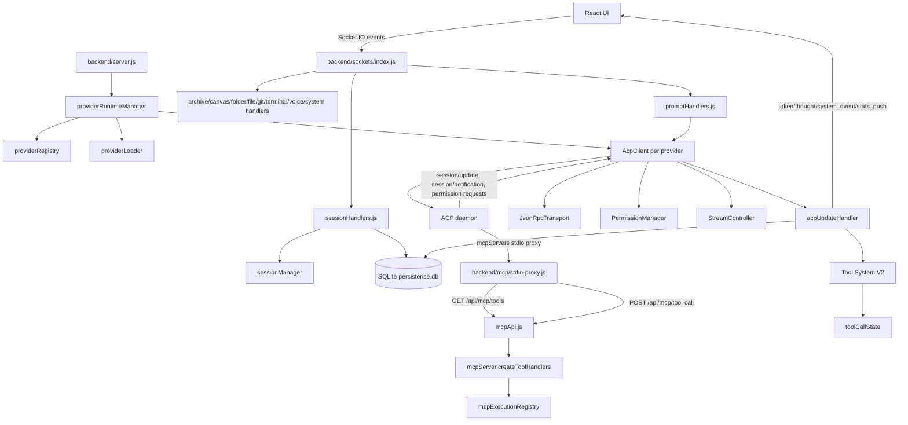

# Feature Doc - Backend Architecture

AcpUI's backend is a Node.js orchestrator between the React UI, provider ACP daemons, SQLite persistence, and the stdio MCP proxy. It owns provider runtime startup, socket event routing, session lifecycle, ACP JSON-RPC transport, tool execution metadata, and durable session state.

This feature doc is the backend map for agents changing server startup, provider runtime management, socket handlers, ACP message routing, persistence, or backend tests.

---

## Overview

### What It Does

The backend performs these responsibilities:

- **Server bootstrap:** Builds the Express app, Socket.IO server, MCP API router, branding API, static routes, voice service bootstrap, and global error logging in `backend/server.js`.
- **Provider runtime management:** Loads enabled providers from `configuration/providers.json`, creates one `AcpClient` runtime per provider, checks startup-blocking JSON config diagnostics, and starts each ACP daemon through `ProviderRuntimeManager.init`.
- **ACP transport and lifecycle:** Uses `JsonRpcTransport`, `PermissionManager`, and `StreamController` inside `AcpClient` to manage JSON-RPC requests, permission responses, history draining, stats captures, daemon restarts, and provider extension routing.
- **Socket gateway:** Registers modular socket handlers from `backend/sockets/index.js`, emits JSON config diagnostics through `config_errors`, hydrates clients with provider metadata and settings, and scopes streaming events to `session:<acpSessionId>` rooms.
- **Session lifecycle:** Creates, loads, forks, merges, rehydrates, exports, snapshots, and deletes sessions through `registerSessionHandlers`, `sessionManager`, provider hooks, and SQLite helpers in `backend/database.js`.
- **Prompt execution:** Converts UI prompts and attachments into ACP prompt parts, applies model selection, pairs provider prompt lifecycle hooks, sends `session/prompt`, and persists completion state through `autoSaveTurn`.
- **Update normalization:** Routes ACP `session/update` and `session/notification` payloads through provider normalization, Tool System V2, socket emissions, provider extensions, and database updates.
- **MCP tool bridge:** Advertises core and optional MCP tools through `GET /api/mcp/tools`, executes calls through `POST /api/mcp/tool-call`, and records authoritative MCP tool metadata through `mcpExecutionRegistry` and `toolCallState`.
- **Persistence:** Stores sessions, folders, canvas artifacts, notes, context stats, model state, config options, provider identity, fork/sub-agent relationships, and async sub-agent invocation state in SQLite.

### Why This Matters

- Provider isolation depends on each request, socket payload, DB row, and MCP proxy binding carrying provider identity through stable APIs.
- Socket rooms keep high-volume stream events scoped to the active ACP session instead of broadcasting every token to every client.
- `sessionMetadata` is in-memory runtime state; SQLite stores the durable session view needed after backend restarts and page reloads.
- Provider modules normalize daemon differences before generic backend code renders, saves, or emits updates.
- Tool metadata must stay sticky across MCP execution, provider updates, and frontend timeline rendering.

### Architectural Role

The backend sits between these systems:

1. Frontend: Socket.IO clients use events such as `config_errors`, `providers`, `ready`, `create_session`, `prompt`, `system_event`, `token`, `thought`, `stats_push`, `permission_request`, and `token_done`.
2. ACP daemons: `AcpClient` communicates over JSON-RPC 2.0 payloads on child-process stdio using `JsonRpcTransport`.
3. Providers: `providerRegistry` and `providerLoader` load config and bind provider hooks under `AsyncLocalStorage` context.
4. Persistence: `backend/database.js` stores session, folder, canvas, note, model, config, stats, and provider-scoped lookup data.
5. MCP layer: `stdio-proxy.js` registers tools from `/api/mcp/tools` and forwards tool calls to `/api/mcp/tool-call`.

---

## How It Works - End-to-End Flow

### 1. Server Bootstrap
File: `backend/server.js` (Function: `startServer`, Exports: `app`, `httpServer`, `io`)

`server.js` loads `.env`, builds the Express app, installs CORS rules, registers the lazy MCP API mount at `/api/mcp`, registers `/api/branding`, attaches the app router, creates HTTPS or HTTP based on `.ssl/key.pem` and `.ssl/cert.pem`, builds the Socket.IO server, starts STT service bootstrap, registers socket handlers, and exports `startServer`.

```javascript
// FILE: backend/server.js (Function: startServer)
export function startServer() {
  httpServer.listen(PORT, '0.0.0.0', () => {
    providerRuntimeManager.init(io, SERVER_BOOT_ID);
  });
  return httpServer;
}
```

`mcpApiRouter` is assigned with `createMcpApiRoutes(io)` before the server listens, so stdio MCP proxies can call `/api/mcp/tools` and `/api/mcp/tool-call` after the listening socket is available. `SERVER_BOOT_ID` is generated once per backend process and is included in `ready` events.

### 2. Provider Registry and Loader Resolve Runtime Config
File: `backend/services/providerRegistry.js` (Functions: `getProviderEntries`, `getDefaultProviderId`, `resolveProviderId`)
File: `backend/services/providerLoader.js` (Functions: `getProvider`, `getProviderModule`, `runWithProvider`)

`providerRegistry` reads `configuration/providers.json` or `ACP_PROVIDERS_CONFIG`, filters disabled entries, validates provider directories, normalizes provider ids, and sorts the default provider first. `providerLoader` reads each provider's `provider.json`, optional `branding.json`, and optional `user.json`, then caches the merged runtime config.

```javascript
// FILE: backend/services/providerLoader.js (Function: runWithProvider)
export function runWithProvider(providerId, fn) {
  const resolvedId = resolveProviderId(providerId);
  return providerContext.run({ providerId: resolvedId }, fn);
}
```

Provider modules are merged with `DEFAULT_MODULE` and every function is bound through `runWithProvider`, so provider hooks can call context-aware helpers without receiving a provider id on every call.

### 3. ProviderRuntimeManager Builds One Runtime Per Provider
File: `backend/services/providerRuntimeManager.js` (Class: `ProviderRuntimeManager`, Methods: `init`, `getRuntime`, `getClient`, `getProviderSummaries`)

`ProviderRuntimeManager.init(io, serverBootId)` is idempotent. It first calls `collectInvalidJsonConfigErrors()` and returns without daemon startup when a startup-blocking JSON config issue is present, such as an unreadable provider registry or provider `provider.json`. When config diagnostics are clean, it resolves the default provider id, iterates `getProviderEntries()`, reuses the default singleton `defaultAcpClient` for the default provider, creates `new AcpClient(entry.id)` for other providers, sets the provider id, loads provider config, stores `{ providerId, provider, client }` in `runtimes`, then starts every client.

```javascript
// FILE: backend/services/providerRuntimeManager.js (Method: init)
const configErrors = collectInvalidJsonConfigErrors();
if (hasStartupBlockingJsonConfigError(configErrors)) return this.getRuntimes();
const defaultProviderId = getDefaultProviderId();
const entries = getProviderEntries();
```

Provider config load failures after diagnostics are logged and leave `runtimes` empty so the backend process can stay online long enough for the frontend to display the blocking config popup.

Consumers call `getRuntime(providerId)` or `getClient(providerId)` instead of importing the singleton directly when provider identity matters.

### 4. AcpClient Starts the Daemon and Performs the Handshake
File: `backend/services/acpClient.js` (Class: `AcpClient`, Functions: `buildAcpSpawnCommand`, `withProviderContext`, Methods: `start`, `performHandshake`)

`AcpClient.start()` initializes SQLite, caches the provider module, builds the spawn command, allows the provider to prepare the child environment, spawns the ACP daemon, wires `JsonRpcTransport`, parses stdout payloads, handles stderr quota errors, and schedules exponential restart on process exit.

```javascript
// FILE: backend/services/acpClient.js (Method: start)
await db.initDb();
this.providerModule = await getProviderModule(providerId);
const spawnTarget = buildAcpSpawnCommand(shell, args);
childEnv = await this.providerModule.prepareAcpEnvironment(childEnv, context) || childEnv;
this.acpProcess = spawn(spawnTarget.command, spawnTarget.args, { cwd, env: childEnv });
this.transport.setProcess(this.acpProcess);
this.performHandshake();
```

On Windows, `buildAcpSpawnCommand` routes bare commands and `.cmd` or `.bat` shims through `cmd.exe /d /s /c` while keeping Node spawn options shell-free.

`performHandshake()` calls `providerModule.performHandshake(this)`, marks `isHandshakeComplete`, emits `ready` and `voice_enabled`, then calls `autoLoadPinnedSessions(this)` in the background.

### 5. Socket Connections Hydrate UI State
File: `backend/sockets/index.js` (Function: `registerSocketHandlers`, Events: `connection`, `watch_session`, `unwatch_session`)

On every Socket.IO connection, `registerSocketHandlers` emits `config_errors` before provider hydration. The payload always contains an `errors` array; invalid or missing startup-critical JSON config stops normal provider hydration so the frontend can render a blocking popup instead of navigating into a broken runtime. When file diagnostics are non-blocking or empty, the handler resolves runtime provider config. If runtime config loading throws, it emits a startup-blocking `runtime-config-load` issue and stops hydration. Otherwise it sends `providers`, one `ready` per ready runtime, `voice_enabled`, `workspace_cwds`, `branding` for each provider, `sidebar_settings`, `custom_commands`, and provider status extensions from memory plus SQLite fallback rows for providers missing from memory.

```javascript
// FILE: backend/sockets/index.js (Function: registerSocketHandlers)
const configErrors = collectInvalidJsonConfigErrors();
socket.emit('config_errors', { errors: configErrors });
if (hasStartupBlockingJsonConfigError(configErrors)) return;
try {
  defaultProviderId = getDefaultProviderId();
  providerPayloads = getProviderPayloads();
} catch (err) {
  socket.emit('config_errors', { errors: [...configErrors, runtimeConfigIssue(err)] });
  return;
}
socket.emit('providers', { defaultProviderId, providers: providerPayloads });
socket.emit('custom_commands', { commands: loadCommands() });
emitCachedProviderStatuses(socket, defaultProviderId);
```

`watch_session` joins `session:<sessionId>` and immediately emits shell run and sub-agent snapshots for the requested session. `unwatch_session` leaves the same room. Stream events in prompt and update handlers use this room convention.

### 6. Session Handlers Create, Load, and Resume ACP Sessions
File: `backend/sockets/sessionHandlers.js` (Function: `registerSessionHandlers`, Events: `load_sessions`, `create_session`, `save_snapshot`, `get_session_history`, `rehydrate_session`, `delete_session`, `fork_session`, `merge_fork`, `set_session_model`, `set_session_option`)
File: `backend/services/sessionManager.js` (Functions: `getMcpServers`, `setSessionModel`, `reapplySavedConfigOptions`, `getKnownModelOptions`, `updateSessionModelMetadata`)

`load_sessions` reads provider-scoped session summaries with aliases from `db.getAllSessions`. `create_session` handles both fresh ACP sessions and existing ACP session ids.

For a fresh session, the handler creates `pending-new` metadata, calls `getMcpServers(resolvedProviderId)`, sends `session/new`, binds the MCP proxy to the returned ACP session id, moves metadata from `pending-new` to the real session id, captures model and config state, applies initial agent and model selection, runs `session_start` hooks, and returns the ACP session id plus model/config state to the callback.

```javascript
// FILE: backend/sockets/sessionHandlers.js (Event: create_session)
acpClient.sessionMetadata.set('pending-new', { model, currentModelId, modelOptions, provider: resolvedProviderId });
const newMcpServers = getMcpServers(resolvedProviderId);
result = await acpClient.transport.sendRequest('session/new', { cwd: sessionCwd, mcpServers: newMcpServers, ...sessionParams });
bindMcpProxy(getMcpProxyIdFromServers(newMcpServers), { providerId: resolvedProviderId, acpSessionId: result.sessionId });
acpClient.sessionMetadata.set(result.sessionId, meta);
```

For an existing ACP session id, the handler returns hot metadata if `sessionMetadata` already has the session. For a cold session, it reconstructs metadata from SQLite, begins stream draining, sends `session/load` with MCP servers, waits for drain silence, captures advertised model/config state, emits cached context, reapplies saved model and config options, then returns the loaded state.

`save_snapshot` persists the UI-owned session shape to SQLite through `db.saveSession`. This keeps UI session id ownership separate from ACP session id creation.

### 7. Prompt Handlers Send User Work to the ACP Daemon
File: `backend/sockets/promptHandlers.js` (Function: `registerPromptHandlers`, Events: `prompt`, `cancel_prompt`, `respond_permission`, `set_mode`)

The `prompt` handler validates the provider runtime, requires session metadata, resolves the selected model, sends `session/set_model` when needed, increments prompt counters, stores the first user prompt for title generation, converts attachments into ACP prompt parts, injects one-time spawn context, clears response buffers, and starts the provider prompt lifecycle.

```javascript
// FILE: backend/sockets/promptHandlers.js (Event: prompt)
const modelId = resolveModelSelection(model || meta.currentModelId || meta.model, providerModels, meta.modelOptions).modelId;
await acpClient.transport.sendRequest('session/set_model', { sessionId, modelId });
acpClient.providerModule.onPromptStarted(sessionId);
try {
  const response = await acpClient.transport.sendRequest('session/prompt', { sessionId, prompt: acpPromptParts });
  if (!acpClient.stream.statsCaptures.has(sessionId)) {
    io.to('session:' + sessionId).emit('token_done', { providerId: resolvedProviderId, sessionId });
    autoSaveTurn(sessionId, acpClient);
  }
} finally {
  acpClient.providerModule.onPromptCompleted(sessionId);
}
```

Invalid provider ids and missing session metadata emit `token` and `token_done` error events. Prompt execution failures either clear `statsCaptures` for internal capture sessions or emit a recoverable error token, `token_done`, and `autoSaveTurn` for visible sessions.

`cancel_prompt` sends a `session/cancel` notification and cancels in-flight sub-agent invocations through `subAgentInvocationManager.cancelAllForParent`. `respond_permission` delegates to `PermissionManager.respond`. `set_mode` calls `AcpClient.setMode`.

### 8. AcpClient Routes Daemon Payloads
File: `backend/services/acpClient.js` (Methods: `handleAcpMessage`, `handleUpdate`, `handleRequestPermission`, `handleProviderExtension`, `handleModelStateUpdate`)
File: `backend/services/jsonRpcTransport.js` (Class: `JsonRpcTransport`)
File: `backend/services/permissionManager.js` (Class: `PermissionManager`)

Every parsed daemon payload goes through `providerModule.intercept(payload, { responseRequest })` before generic routing. `responseRequest` is read from `JsonRpcTransport` pending request state for the inbound JSON-RPC `id`, so providers can map responses back to the originating request/session. Intercepted `null` values are swallowed. `session/update` and `session/notification` are routed to `handleUpdate(sessionId, update)`. `session/request_permission` with a JSON-RPC id becomes a `permission_request` socket event through `PermissionManager.handleRequest`. JSON-RPC responses resolve or reject `transport.pendingRequests` by id. Provider extension methods are detected with `provider.config.protocolPrefix`.

```javascript
// FILE: backend/services/acpClient.js (Method: handleAcpMessage)
const responseRequest = payload?.id !== undefined
  ? this.transport.getPendingRequestContext(payload.id)
  : null;
const processedPayload = this.providerModule.intercept(payload, { responseRequest });
if (!processedPayload) return;
if (processedPayload.method === 'session/update' || processedPayload.method === 'session/notification') {
  this.handleUpdate(processedPayload.params.sessionId, processedPayload.params.update);
} else if (processedPayload.method === 'session/request_permission' && processedPayload.id !== undefined) {
  this.handleRequestPermission(processedPayload.id, processedPayload.params);
}
```

`handleProviderExtension` captures model and config option updates into metadata, persists provider-scoped model/config state through `db.saveModelState` and `db.saveConfigOptions`, remembers provider status extensions, persists valid provider status through `db.saveProviderStatusExtension`, and emits `provider_extension` with `providerId` included in `params`.

### 9. acpUpdateHandler Normalizes Stream Updates and Tool Events
File: `backend/services/acpUpdateHandler.js` (Function: `handleUpdate`)
File: `backend/services/tools/index.js` (Exports: `toolRegistry`, `toolCallState`, `mcpExecutionRegistry`, `resolveToolInvocation`, `applyInvocationToEvent`)

`handleUpdate(acpClient, sessionId, update)` calls `acpClient.stream.onChunk(sessionId)`, resolves the provider id, loads the provider module, applies `providerModule.normalizeUpdate`, and then branches by `update.sessionUpdate`.

- `config_option_update` normalizes options, merges with metadata, emits provider extension data when `protocolPrefix` is configured, and saves provider-scoped config options.
- Draining sessions drop message/tool updates during `session/load` replay while allowing metadata updates to continue.
- Message and tool updates schedule periodic `autoSaveTurn` at the client level.
- `agent_message_chunk` updates token estimates, appends `lastResponseBuffer`, buffers internal `statsCaptures`, emits `token`, and triggers title generation on the first visible response chunk.
- `agent_thought_chunk` appends `lastThoughtBuffer`, clears speculative response buffer, and emits `thought` for visible sessions.
- `tool_call` and `tool_call_update` combine provider extraction, Tool System V2 resolution, tool handler dispatch, sticky state updates, and `system_event` socket emissions.
- `usage_update` emits `stats_push` and provider metadata extension data.
- `available_commands_update` emits provider command extension data.

```javascript
// FILE: backend/services/acpUpdateHandler.js (Function: handleUpdate)
update = providerModule.normalizeUpdate(update);
const invocation = resolveToolInvocation({ providerId, sessionId, update, event, providerModule, phase, acpUiMcpServerName: config.mcpName });
event = applyInvocationToEvent(event, invocation);
event = toolRegistry.dispatch(phase, { acpClient, providerId, sessionId }, invocation, event);
toolCallState.upsert({ providerId, sessionId, toolCallId: update.toolCallId, identity: invocation.identity, input: invocation.input, display, category, filePath });
acpClient.io.to('session:' + sessionId).emit('system_event', event);
```

### 10. MCP Proxy Advertises and Executes Tools
File: `backend/routes/mcpApi.js` (Function: `createMcpApiRoutes`, Routes: `GET /tools`, `POST /tool-call`)
File: `backend/mcp/mcpServer.js` (Functions: `getMcpServers`, `createToolHandlers`, `getMaxShellResultLines`)
File: `backend/mcp/coreMcpToolDefinitions.js` (Functions: `getInvokeShellMcpToolDefinition`, `getSubagentsMcpToolDefinition`, `getCounselMcpToolDefinition`, `getCheckSubagentsMcpToolDefinition`, `getAbortSubagentsMcpToolDefinition`)
File: `backend/mcp/ioMcpToolDefinitions.js` (Functions: `getIoMcpToolDefinitions`, `getGoogleSearchMcpToolDefinitions`)
File: `backend/services/tools/mcpExecutionRegistry.js` (Class: `McpExecutionRegistry`)

`getMcpServers` returns a stdio proxy entry when the provider config has `mcpName`. The entry includes `ACP_SESSION_PROVIDER_ID`, `ACP_UI_MCP_PROXY_ID`, `BACKEND_PORT`, and `NODE_TLS_REJECT_UNAUTHORIZED` in the proxy environment. `bindMcpProxy` attaches the proxy id to `{ providerId, acpSessionId }` after the ACP daemon returns a real session id.

`GET /api/mcp/tools` resolves provider/proxy context, builds model descriptions from provider models, and includes core or optional tool definitions according to `mcpConfig` feature flags. `POST /api/mcp/tool-call` disables HTTP timeouts, creates an abort signal from request/response lifecycle events, resolves the proxy context, injects internal context fields into handler args, runs the matching tool handler, and avoids writing responses after aborts.

`createToolHandlers(io)` only registers enabled tools. It wraps all handlers with `mcpExecutionRegistry.begin`, `complete`, and `fail`, so tool executions can be matched later to provider `tool_call` updates and converted into stable UI titles, categories, inputs, file paths, and outputs.

### 11. SQLite Persists Backend State
File: `backend/database.js` (Functions: `initDb`, `saveSession`, `getAllSessions`, `getPinnedSessions`, `getSession`, `getSessionByAcpId`, `saveConfigOptions`, `saveModelState`, `saveProviderStatusExtension`, `getProviderStatusExtensions`, `createSubAgentInvocation`, `getSubAgentInvocationWithAgents`, `deleteSubAgentInvocationsForParent`, `createFolder`, `saveCanvasArtifact`, `saveNotes`)

`initDb` uses `UI_DATABASE_PATH` or `persistence.db`, creates `sessions`, `subagent_invocations`, `subagent_invocation_agents`, `folders`, `provider_status`, and `canvas_artifacts`, applies additive migrations, and creates provider/ACP and sub-agent invocation lookup indexes. Session rows store UI id, ACP id, provider, model, messages JSON, pinned state, cwd, folder id, notes, fork metadata, sub-agent metadata, context token stats, config options JSON, current model id, and model options JSON. Sub-agent invocation rows store async batch status by provider and parent UI session, and agent rows store each spawned ACP session status, result text, error text, and completion timestamps.

```sql
-- FILE: backend/database.js (Function: initDb, Tables: sessions, subagent_invocations, subagent_invocation_agents)
CREATE TABLE IF NOT EXISTS sessions (
  ui_id TEXT PRIMARY KEY,
  acp_id TEXT,
  name TEXT,
  model TEXT,
  messages_json TEXT,
  used_tokens REAL,
  total_tokens REAL,
  config_options_json TEXT,
  current_model_id TEXT,
  model_options_json TEXT,
  provider TEXT
)

CREATE TABLE IF NOT EXISTS subagent_invocations (
  invocation_id TEXT PRIMARY KEY,
  provider TEXT,
  parent_acp_session_id TEXT,
  parent_ui_id TEXT,
  status TEXT,
  total_count INTEGER DEFAULT 0,
  completed_count INTEGER DEFAULT 0,
  status_tool_name TEXT
)

CREATE TABLE IF NOT EXISTS subagent_invocation_agents (
  invocation_id TEXT,
  acp_session_id TEXT,
  ui_id TEXT,
  idx INTEGER,
  status TEXT,
  result_text TEXT,
  error_text TEXT,
  PRIMARY KEY(invocation_id, acp_session_id)
)

CREATE TABLE IF NOT EXISTS provider_status (
  provider TEXT PRIMARY KEY,
  extension_json TEXT NOT NULL,
  updated_at INTEGER NOT NULL
)
```

`saveSession` upserts by `ui_id`, preserves existing stats/model/config fields when an incoming value is empty, and stores normalized model options. `getAllSessions(provider, { providerAliases })` filters by provider plus aliases or unscoped rows. `getSessionByAcpId(provider, acpId)` prefers provider-scoped rows over unscoped rows. `saveConfigOptions` and `saveModelState` accept provider-scoped or unscoped signatures. `saveProviderStatusExtension` stores one latest status extension per provider and uses `updated_at` precedence so older async writes do not replace newer rows. Sub-agent invocation helpers create one active invocation per provider/parent UI session, update aggregate and per-agent status, load status snapshots for `ux_check_subagents`, and delete registry rows when a parent session is deleted or archived.

### 12. Auto-Save and Pinned Session Warmup Keep Runtime and DB Aligned
File: `backend/services/sessionManager.js` (Functions: `loadSessionIntoMemory`, `autoLoadPinnedSessions`, `autoSaveTurn`)
File: `backend/services/streamController.js` (Class: `StreamController`, Methods: `beginDraining`, `waitForDrainToFinish`, `onChunk`, `reset`)

After handshake, `autoLoadPinnedSessions(acpClient)` reads pinned sessions for that provider and sequentially calls `loadSessionIntoMemory`. Loading reconstructs metadata, begins drain state, sends `session/load`, binds the MCP proxy, waits for drain silence, emits cached provider context, captures model/config options, reapplies saved model selection and config options, and logs completion.

`autoSaveTurn(sessionId, acpClient)` waits for final updates to settle, skips while permission requests are pending, finds the DB session by provider and ACP id, copies runtime model/config/stats into the session object, completes streaming assistant messages when content exists, and saves stats changes even when the message is not streaming.

---

## Architecture Diagram



---

## Critical Contract

### Provider Runtime Contract

Every backend path that can affect provider-specific state must resolve the provider through `providerRuntimeManager`, `providerRegistry`, or `providerLoader`. Provider hooks run through `runWithProvider`, socket payloads include `providerId`, DB rows store `provider`, and MCP proxy bindings map `ACP_UI_MCP_PROXY_ID` to `{ providerId, acpSessionId }`.

Breaking this contract causes sessions, model state, config options, tool metadata, or provider extensions to land in the wrong runtime or DB row.

### Session Metadata Contract

`AcpClient.sessionMetadata` is keyed by ACP session id and is the runtime source for streaming and prompt state. The shape used by session and prompt handlers includes:

```javascript
// FILE: backend/sockets/sessionHandlers.js (Event: create_session, Runtime field: sessionMetadata)
{
  model,
  currentModelId,
  modelOptions,
  configOptions,
  toolCalls,
  successTools,
  startTime,
  usedTokens,
  totalTokens,
  promptCount,
  lastResponseBuffer,
  lastThoughtBuffer,
  agentName,
  spawnContext,
  provider
}
```

`pending-new` is a temporary metadata key used only while `session/new` is in flight. It must be moved to the returned ACP session id before prompt execution.

### ACP JSON-RPC Contract

`JsonRpcTransport.sendRequest(method, params)` writes JSON-RPC requests with ids and stores resolvers in `pendingRequests`. Daemon responses must return the same id. `sendNotification` writes id-free notifications for operations such as `session/cancel`.

Permission requests are JSON-RPC requests from the daemon. `PermissionManager.respond` writes a matching JSON-RPC response with the request id and an ACP-compatible `result.outcome` object:

```javascript
// FILE: backend/services/permissionManager.js (Method: respond)
{
  jsonrpc: '2.0',
  id,
  result: {
    outcome: optionId === 'cancel'
      ? { outcome: 'cancelled' }
      : { outcome: 'selected', optionId }
  }
}
```

### Tool Metadata Contract

MCP tool calls are authoritative for AcpUI UX tool names, user-facing titles, inputs, file paths, categories, and outputs. Provider updates are merged with this state through `mcpExecutionRegistry`, `resolveToolInvocation`, `applyInvocationToEvent`, and `toolCallState`. Tool handlers must not emit generic provider titles over higher-quality MCP handler titles.

---

## Configuration / Data Flow

### Configuration Inputs

| Source | Keys or Fields | Consumed By | Purpose |
|---|---|---|---|
| `.env` | `BACKEND_PORT`, `DEFAULT_WORKSPACE_CWD`, `UI_DATABASE_PATH`, `VOICE_STT_ENABLED`, `SIDEBAR_DELETE_PERMANENT`, `NOTIFICATION_SOUND`, `NOTIFICATION_DESKTOP`, `MAX_SHELL_RESULT_LINES`, `LOG_MESSAGE_CHUNKS` | `server.js`, `database.js`, `promptHandlers.js`, `mcpServer.js`, `acpClient.js`, `sockets/index.js` | Runtime ports, workspace defaults, database location, UI settings, voice state, shell output limits, logging behavior |
| `configuration/providers.json` or `ACP_PROVIDERS_CONFIG` | `defaultProviderId`, `providers[].path`, `providers[].id`, `providers[].enabled`, `providers[].label`, `providers[].order` | `providerRegistry.js` | Provider discovery and default selection |
| Provider directory | `provider.json`, `branding.json`, `user.json`, `index.js` | `providerLoader.js`, provider runtime hooks | Provider command, args, MCP name, protocol prefix, branding, models, user overrides, hook implementation |
| `configuration/mcp.json` | Core and optional MCP tool feature flags, IO/search hardening settings | `mcpConfig.js`, `mcpApi.js`, `mcpServer.js` | Tool advertisement and handler registration |
| Workspace and command config | Workspace entries, custom commands | `workspaceConfig.js`, `commandsConfig.js`, `sockets/index.js`, `jsonConfigDiagnostics.js` | Initial socket hydration data and invalid config diagnostics |
| JSON config diagnostics | `ACP_PROVIDERS_CONFIG`, `WORKSPACES_CONFIG`, `COMMANDS_CONFIG`, `MCP_CONFIG`, provider `provider.json`, `branding.json`, `user.json` | `jsonConfigDiagnostics.js`, `providerRuntimeManager.js`, `sockets/index.js` | Lists invalid JSON config files and marks provider-registry/provider-definition failures as startup blocking |

### Runtime Data Flow

1. `providerRuntimeManager.init` checks JSON config diagnostics, then creates `{ providerId, provider, client }` and starts the client when startup config is valid.
2. `AcpClient.start` initializes DB, spawns the daemon, and performs provider handshake.
3. `registerSocketHandlers` emits `config_errors`, then provider summaries, branding, ready state, settings, commands, in-memory provider status, and SQLite status fallback for providers missing from memory when startup config is not blocked.
4. `create_session` sends `session/new` or `session/load`, creates or rebuilds `sessionMetadata`, binds the MCP proxy, captures model/config state, and returns ACP session state.
5. `save_snapshot` persists the UI session row with the ACP session id.
6. `prompt` builds ACP prompt parts, sends model changes and `session/prompt`, and pairs prompt lifecycle hooks.
7. Daemon updates flow through `AcpClient.handleAcpMessage` and `acpUpdateHandler.handleUpdate`.
8. Socket room emissions update the UI timeline while `autoSaveTurn` keeps DB stats and completed messages aligned.
9. MCP tool execution records are merged into provider tool updates through Tool System V2.

### Socket Event Surface

| Direction | Events | Owner |
|---|---|---|
| Backend to frontend hydration | `config_errors`, `providers`, `ready`, `voice_enabled`, `workspace_cwds`, `branding`, `sidebar_settings`, `custom_commands`, `provider_extension` | `backend/sockets/index.js` |
| Frontend to backend sessions | `load_sessions`, `create_session`, `save_snapshot`, `get_session_history`, `rehydrate_session`, `delete_session`, `fork_session`, `merge_fork`, `set_session_model`, `set_session_option` | `backend/sockets/sessionHandlers.js` |
| Frontend to backend prompt flow | `prompt`, `cancel_prompt`, `respond_permission`, `set_mode` | `backend/sockets/promptHandlers.js` |
| Backend to frontend streaming | `token`, `thought`, `system_event`, `stats_push`, `permission_request`, `token_done`, `merge_message` | `promptHandlers.js`, `acpUpdateHandler.js`, `permissionManager.js`, `sessionHandlers.js` |
| Room management | `watch_session`, `unwatch_session` | `backend/sockets/index.js` |

---

## Component Reference

### Bootstrap, Provider Runtime, and ACP Transport

| Area | File | Stable Anchors | Purpose |
|---|---|---|---|
| Server | `backend/server.js` | `startServer`, `app`, `httpServer`, `io`, route `/api/mcp`, route `/api/branding`, `SERVER_BOOT_ID` | Express, Socket.IO, MCP API, branding API, static routes, STT bootstrap, provider runtime startup |
| Provider registry | `backend/services/providerRegistry.js` | `getProviderRegistry`, `getProviderEntries`, `getDefaultProviderId`, `resolveProviderId`, `getProviderEntry` | Loads and validates provider registry config |
| Provider loader | `backend/services/providerLoader.js` | `runWithProvider`, `getProvider`, `getProviderModule`, `getProviderModuleSync`, `DEFAULT_MODULE` | Loads provider config and binds provider hooks under AsyncLocalStorage |
| Runtime manager | `backend/services/providerRuntimeManager.js` | `ProviderRuntimeManager`, `init`, `getRuntime`, `getClient`, `getProviderSummaries` | Owns runtime map, startup JSON diagnostics gate, and client startup |
| JSON config diagnostics | `backend/services/jsonConfigDiagnostics.js` | `collectInvalidJsonConfigErrors`, `hasStartupBlockingJsonConfigError` | Scans configured JSON files, reports invalid config metadata, and marks provider startup blockers |
| ACP client | `backend/services/acpClient.js` | `AcpClient`, `buildAcpSpawnCommand`, `start`, `performHandshake`, `handleAcpMessage`, `handleProviderExtension`, `handleModelStateUpdate`, `reset` | ACP daemon lifecycle, routing, model/config extensions, restart behavior |
| JSON-RPC | `backend/services/jsonRpcTransport.js` | `JsonRpcTransport`, `sendRequest`, `sendNotification`, `getPendingRequestContext`, `reset` | Request ids, pending request/session correlation, notifications |
| Permissions | `backend/services/permissionManager.js` | `PermissionManager`, `handleRequest`, `respond`, `pendingPermissions` | Permission socket event and JSON-RPC response handling |
| Stream state | `backend/services/streamController.js` | `StreamController`, `statsCaptures`, `drainingSessions`, `beginDraining`, `waitForDrainToFinish`, `onChunk` | Drain and internal capture lifecycle |

### Socket Handlers

| File | Stable Anchors | Purpose |
|---|---|---|
| `backend/sockets/index.js` | `registerSocketHandlers`, `buildBrandingPayload`, `getProviderPayloads`, `emitCachedProviderStatuses`, events `connection`, `config_errors`, `watch_session`, `unwatch_session` | Config diagnostics, socket hydration, provider status replay, modular handler registration, room management |
| `backend/sockets/sessionHandlers.js` | `registerSessionHandlers`, `captureModelState`, `emitCachedContext`, `loadingSessions`, session events | Session CRUD, resume, fork/merge, snapshots, notes, model/config changes |
| `backend/sockets/promptHandlers.js` | `registerPromptHandlers`, events `prompt`, `cancel_prompt`, `respond_permission`, `set_mode` | Prompt assembly, attachment conversion, lifecycle hooks, cancellation, permission responses |
| `backend/sockets/archiveHandlers.js` | `registerArchiveHandlers`, events `list_archives`, `archive_session`, `restore_archive`, `delete_archive` | Archive and restore lifecycle |
| `backend/sockets/canvasHandlers.js` | `registerCanvasHandlers`, canvas events | Canvas artifact persistence |
| `backend/sockets/folderHandlers.js` | `registerFolderHandlers`, folder events | Folder CRUD and session movement |
| `backend/sockets/fileExplorerHandlers.js` | `registerFileExplorerHandlers`, `safePath`, explorer events | Safe workspace file browsing and writes |
| `backend/sockets/gitHandlers.js` | `registerGitHandlers`, git events | Git status and staging integration |
| `backend/sockets/terminalHandlers.js` | `registerTerminalHandlers`, terminal events | PTY terminal tabs |
| `backend/sockets/shellRunHandlers.js` | `registerShellRunHandlers`, `emitShellRunSnapshotsForSession` | Interactive shell controls and reconnect snapshots |
| `backend/sockets/subAgentHandlers.js` | `registerSubAgentHandlers`, `emitSubAgentSnapshotsForSession`, event `cancel_subagents` | Sub-agent cancellation control and reconnect snapshots |
| `backend/sockets/systemHandlers.js` | `registerSystemHandlers`, events `get_stats`, `get_logs` | System stats and log access |
| `backend/sockets/systemSettingsHandlers.js` | `registerSystemSettingsHandlers`, settings events | Environment, workspace, command, and provider config editing |
| `backend/sockets/voiceHandlers.js` | `registerVoiceHandlers`, voice events | Voice transcription socket flow |

### Sessions, Updates, MCP, and Persistence

| Area | File | Stable Anchors | Purpose |
|---|---|---|---|
| Session manager | `backend/services/sessionManager.js` | `getMcpServers`, `setSessionModel`, `reapplySavedConfigOptions`, `loadSessionIntoMemory`, `autoLoadPinnedSessions`, `autoSaveTurn` | MCP server config, model/config reapplication, pinned warmup, DB autosave |
| Update handler | `backend/services/acpUpdateHandler.js` | `handleUpdate`, `config_option_update`, `agent_message_chunk`, `agent_thought_chunk`, `tool_call`, `tool_call_update`, `usage_update`, `available_commands_update` | Normalizes daemon updates and emits timeline events |
| MCP API | `backend/routes/mcpApi.js` | `createMcpApiRoutes`, `resolveToolContext`, `createToolCallAbortSignal`, `canWriteResponse`, routes `GET /tools`, `POST /tool-call` | Internal HTTP bridge for stdio MCP proxy |
| MCP handlers | `backend/mcp/mcpServer.js` | `getMcpServers`, `createToolHandlers`, `getMaxShellResultLines`, `buildSubAgentInvocationKey` | MCP server config and tool handler map |
| MCP definitions | `backend/mcp/coreMcpToolDefinitions.js` | `getInvokeShellMcpToolDefinition`, `getSubagentsMcpToolDefinition`, `getCounselMcpToolDefinition`, `getCheckSubagentsMcpToolDefinition`, `getAbortSubagentsMcpToolDefinition` | Core tool schemas |
| MCP IO definitions | `backend/mcp/ioMcpToolDefinitions.js` | `getIoMcpToolDefinitions`, `getGoogleSearchMcpToolDefinitions` | Optional IO/search tool schemas |
| Tool registry | `backend/services/tools/index.js` | `toolRegistry.register`, exports `toolCallState`, `mcpExecutionRegistry`, `resolveToolInvocation`, `applyInvocationToEvent` | Tool System V2 integration point |
| MCP execution registry | `backend/services/tools/mcpExecutionRegistry.js` | `McpExecutionRegistry`, `begin`, `complete`, `fail`, `find`, `publicMcpToolInput`, `toolCallIdFromMcpContext`, `describeAcpUxToolExecution` | Authoritative MCP execution metadata cache |
| Database | `backend/database.js` | `initDb`, `saveSession`, `getAllSessions`, `getPinnedSessions`, `getSession`, `getSessionByAcpId`, `saveConfigOptions`, `saveModelState`, `saveProviderStatusExtension`, `getProviderStatusExtension`, `getProviderStatusExtensions`, `createSubAgentInvocation`, `getSubAgentInvocationWithAgents`, `deleteSubAgentInvocationsForParent`, tables `sessions`, `provider_status`, `subagent_invocations`, `subagent_invocation_agents`, `folders`, `canvas_artifacts`, indexes `idx_sessions_provider_acp`, `idx_sessions_acp`, `idx_subagent_active_parent` | SQLite schema, migrations, and persistence APIs |

---

## Gotchas

1. **Startup-blocking JSON config stops provider hydration**
   `collectInvalidJsonConfigErrors` marks the provider registry and provider `provider.json` as startup blocking. `ProviderRuntimeManager.init` and `registerSocketHandlers` must return early for those errors so the backend stays alive and the frontend receives `config_errors`.

2. **Provider id must be resolved before runtime access**
   `providerRuntimeManager.getRuntime(providerId)` throws for unknown ids. Socket handlers that accept provider input should catch this and emit a visible error path, as `prompt` and `cancel_prompt` do.

3. **Default AcpClient is shared only for the default provider**
   `ProviderRuntimeManager.init` reuses the default singleton for the default provider and creates separate `AcpClient` instances for the rest. Code that imports the singleton bypasses multi-provider isolation unless it is intentionally default-only.

4. **`pending-new` metadata is temporary**
   Fresh session creation uses `sessionMetadata.set('pending-new', ...)` before `session/new` returns. The metadata must be moved to the returned ACP session id before prompt execution, model updates, or config updates rely on it.

5. **Hot session resume skips daemon load**
   `create_session` with `existingAcpId` returns metadata directly when `sessionMetadata` already contains the ACP session id. Any feature that depends on daemon load side effects must also handle the hot path.

6. **Drain state is required for `session/load`**
   `StreamController.beginDraining` and `waitForDrainToFinish` prevent loaded transcript updates from being emitted as live UI output. Do not emit message or tool updates while `drainingSessions` contains the session.

7. **Prompt lifecycle hooks must be paired**
   `providerModule.onPromptStarted(sessionId)` is called only after pre-prompt setup succeeds. `onPromptCompleted(sessionId)` belongs in the inner `finally` that wraps `session/prompt` so provider lifecycle counters remain accurate on success, cancellation, and execution failure.

8. **Permission responses must use the JSON-RPC request id**
   `PermissionManager.respond` writes the daemon response directly through `transport.acpProcess.stdin`. The response id must match the original `session/request_permission` id or the daemon remains blocked.

9. **MCP tool definitions and handlers must stay in sync**
   `GET /api/mcp/tools` advertises schemas from definition modules while `POST /api/mcp/tool-call` calls handlers from `createToolHandlers`. Add, remove, rename, or feature-flag tools in both places.

10. **Tool titles are sticky by design**
   `mcpExecutionRegistry` and `toolCallState` preserve handler-derived titles and inputs across provider `tool_call_update` payloads. Provider normalization should enrich tool state without replacing authoritative MCP metadata with generic titles.

11. **SQLite provider scoping is part of lookup correctness**
   `getSessionByAcpId(provider, acpId)`, `saveConfigOptions(provider, acpId, ...)`, and `saveModelState(provider, acpId, ...)` protect sessions from cross-provider id collisions. Avoid unscoped calls when provider id is available.

---

## Unit Tests

Run backend tests from `backend` with `npx vitest run`. Focused backend architecture coverage is in these files:

| Test File | Important Test Names / Describe Blocks | Verified Surface |
|---|---|---|
| `backend/test/server.test.js` | `Express Server & Routes`, `should allow local origins`, `should handle /api/branding/manifest.json`, `should return 503 for MCP API if not ready`, `should handle unhandledRejection`, `should handle uncaughtException` | Express app, CORS, routes, global error handlers |
| `backend/test/providerRuntimeManager.test.js` | `providerRuntimeManager`, `initializes all providers in the registry`, `blocks init when startup-blocking config diagnostics exist`, `returns empty runtimes when provider registry loading throws`, `clears partially built runtimes when provider config loading throws`, `does not re-initialize if already initialized`, `getProviderSummaries returns correct data`, `throws error if runtime is not found` | Runtime map, startup diagnostics gate, runtime-load failure handling, default provider, readiness summaries |
| `backend/test/jsonConfigDiagnostics.test.js` | `jsonConfigDiagnostics`, `returns no errors when loaded JSON config files are valid`, `lists every malformed config file it can discover`, `reports missing enabled provider definitions as startup-blocking`, `reports a malformed provider registry and skips provider directory discovery` | Startup JSON config diagnostics and blocking classification |
| `backend/test/acpClient.test.js` | `AcpClient Service`, `start lifecycle`, `handleModelStateUpdate`, `buildAcpSpawnCommand`, `should implement exponential back-off for restarts`, `uses cmd.exe wrapper for bare commands on Windows` | Daemon lifecycle, routing, provider extensions, spawn command behavior |
| `backend/test/acpClient-deep.test.js` | `AcpClient Deep Coverage`, `skips duplicate start calls`, `hits intercepted message swallowing`, `hits empty config_options extension branch`, `buffers data in handleUpdate when statsCapture active` | Edge paths for client state and update routing |
| `backend/test/acpClient-multi.test.js` | `AcpClient Multi-Instance`, `maintains isolation between instances`, `restarts only the dead instance` | Multi-provider client isolation |
| `backend/test/acpClient-routing.test.js` | `routes all handleUpdate paths`, `passes pending JSON-RPC request context into intercept`, `routes all handleProviderExtension paths`, `emits provider status extensions even when persistence fails`, `hits JSON parse error in handleData` | ACP routing branches, response attribution, provider status persistence failure fallback |
| `backend/test/jsonRpcTransport.test.js` | `should increment request ID and correlate response`, `captures sessionId in pending request context`, `should reject all pending requests on reset`, `should handle JSON-RPC error responses` | Pending request/session context and response correlation |
| `backend/test/sockets-index.test.js` | `Socket Index Handler`, `registers all modular handlers on connection`, `emits config_errors on connection`, `blocks normal hydration when startup JSON config is invalid`, `preserves existing diagnostics when runtime config loading fails`, `emits sidebar_settings on connection`, `emits cached provider status on connection`, `emits persisted provider status on connection when memory is empty`, `does not emit persisted provider status over newer memory status for the same provider`, `watch_session joins the session room`, `watch_session emits shell run snapshots` | Socket hydration, config diagnostics, provider status replay, and rooms |
| `backend/test/sessionHandlers.test.js` | `handles create_session`, `captures normalized config options returned by session/new`, `handles create_session with existingAcpId (resume)`, `reapplies saved config options on resume when the provider still advertises them`, `handles create_session skipping load for hot sessions`, `handles create_session performing load for cold sessions with dbSession` | Session create/load/resume, model/config capture, snapshots |
| `backend/test/promptHandlers.test.js` | `Prompt Handlers`, `should handle incoming prompt and send to ACP`, `should cancel prompt when cancel_prompt received`, `should forward permission response to acpClient`, `provider prompt lifecycle hooks`, `calls onPromptCompleted even when sendRequest rejects (error path)` | Prompt assembly, cancellation, permissions, lifecycle pairing |
| `backend/test/acpUpdateHandler.test.js` | `acpUpdateHandler`, `delegates normalization to provider`, `caches and re-injects metadata (Sticky Metadata)`, `handles usage_update and emits stats_push`, `treats usage_update as latest absolute snapshot (not additive)`, `clamps usage_update provider metadata to 100 percent`, `handles usage_update with zero size`, `handles config_option_update and emits provider_extension`, `prepares shell run metadata for ux_invoke_shell tool starts`, `restores tool title from cache if missing in update` | Update normalization, usage snapshots, tokens, thoughts, tools, provider extensions |
| `backend/test/providerStatusMemory.test.js` | `remembers the latest provider status extension`, `ignores extensions that are not provider status payloads`, `returns a copy so callers cannot mutate cached memory`, `keeps provider status memory isolated by provider id`, `normalizes provider id into status extensions without mutating the source` | Provider status normalization and memory isolation |
| `backend/test/persistence.test.js` | `saves and retrieves sessions`, `saves and retrieves the latest provider status by provider`, `resolves provider status provider id from the extension payload`, `keeps newer provider status when an older write arrives later` | Session persistence and provider status SQLite fallback |
| `backend/test/sessionManager.test.js` | `getMcpServers`, `autoLoadPinnedSessions`, `loadSessionIntoMemory`, `autoSaveTurn`, `should attach _meta when getMcpServerMeta returns a value`, `should perform full hot-load lifecycle` | MCP server config, pinned warmup, hot load, autosave |
| `backend/test/database-exhaustive.test.js` | `Exhaustive Database Coverage`, `hits all optional field branches in saveSession`, `handles getSessionByAcpId with null provider`, `hits parseProviderScopedArgs 2-arg signature`, `hits parseProviderScopedArgs 3-arg signature` | Persistence shape and provider-scoped helper signatures |
| `backend/test/mcpApi.test.js` | `MCP API Routes`, route tests for `/tools`, `/tool-call`, abort handling, response write guards | MCP HTTP bridge |
| `backend/test/mcpServer.test.js` | `mcpServer`, `core MCP feature flags`, `optional IO MCP tools`, `ux_invoke_shell`, `ux_invoke_subagents`, `ux_check_subagents`, `ux_abort_subagents`, `ux_invoke_counsel` | Tool advertisement and handler behavior |
| `backend/test/toolInvocationResolver.test.js` | `uses provider extraction as canonical tool identity`, `reuses cached identity and title for incomplete updates`, `prefers centrally recorded MCP execution details over provider generic titles`, `records sub-agent check title from waitForCompletion input`, `can claim a recent MCP execution when the provider tool id arrives later` | Tool identity merging |
| `backend/test/acpUiToolTitles.test.js` | `titles sub-agent status checks by wait mode`, `accepts alternate false encodings for quick sub-agent checks` | Shared AcpUI MCP title helpers |
| `backend/test/providerToolNormalization.test.js` | `providerToolNormalization` | Provider tool normalization helpers |
| `backend/test/mcpConfig.test.js` | `MCP config` | MCP feature flag config |
| `backend/test/ioMcpFilesystem.test.js`, `backend/test/ioMcpWebFetch.test.js`, `backend/test/ioMcpGoogleSearch.test.js`, `backend/test/ioToolHandler.test.js` | IO MCP helper describe blocks | Optional IO/search tools and Tool System V2 rendering |

---

## How to Use This Guide

### For implementing/extending this feature

1. Start at `backend/server.js` if the change affects startup, CORS, HTTP routes, Socket.IO construction, or backend-wide initialization.
2. Use `providerRuntimeManager.getRuntime(providerId)` or `getClient(providerId)` for provider-aware work. Avoid singleton client imports unless the code is intentionally default-provider only.
3. For session work, trace `registerSessionHandlers` and `sessionManager` together. Check `create_session`, `save_snapshot`, `getMcpServers`, `setSessionModel`, and `autoSaveTurn` before changing persistence or resume behavior.
4. For prompt work, trace `registerPromptHandlers` from `prompt` through `AcpClient.transport.sendRequest('session/prompt', ...)`, then through `AcpClient.handleAcpMessage` and `acpUpdateHandler.handleUpdate`.
5. For tool work, update MCP definition modules, `mcpConfig` flags, `createToolHandlers`, Tool System V2 handler registration, and tests in the same change.
6. For DB work, update `initDb` migrations and the read/write helper that owns the field. Verify provider-scoped and unscoped signatures where they exist.
7. Update tests named in the Unit Tests section when changing the corresponding contract.

### For debugging issues with this feature

1. Identify the phase: server startup, provider runtime init, ACP daemon start, socket hydration, session create/load, prompt send, update routing, tool execution, or DB persistence.
2. Follow the stable anchor for that phase instead of searching by line number.
3. Confirm `providerId`, ACP session id, UI session id, and socket room are the expected values at the boundary where the symptom appears.
4. Check `sessionMetadata` for model/config/stats/prompt fields before debugging downstream rendering.
5. For missing tool titles or outputs, inspect `mcpExecutionRegistry.find`, `resolveToolInvocation`, and `toolCallState.upsert` before changing provider normalization.
6. For stale context usage or model options, inspect `handleModelStateUpdate`, `captureModelState`, `saveModelState`, `saveConfigOptions`, and `emitCachedContext`.
7. Run the smallest backend test file that owns the failing contract, then broaden to `npx vitest run` when behavior crosses modules.

---

## Summary

- `backend/server.js` wires Express, Socket.IO, MCP API routes, branding routes, voice bootstrap, socket handlers, and provider runtime startup.
- `ProviderRuntimeManager` owns one runtime per enabled provider and is the entry point for provider-aware backend code.
- `AcpClient` owns daemon spawn, JSON-RPC transport, provider intercepts, permission handling, stream state, model/config extension handling, restart behavior, and pinned-session warmup.
- Socket handlers own UI-facing workflows; high-volume stream events are scoped to `session:<acpSessionId>` rooms.
- Startup JSON diagnostics keep the backend alive long enough to emit `config_errors` and block provider hydration when provider-critical config is malformed.
- `sessionMetadata` is the runtime contract for prompts, streams, model/config options, stats, hooks, and title generation.
- SQLite stores durable UI session state, provider-scoped ACP lookups, model/config state, stats, folders, canvas artifacts, and notes.
- MCP tools flow through stdio proxy -> `mcpApi.js` -> `mcpServer.createToolHandlers` -> `mcpExecutionRegistry` -> Tool System V2 -> UI timeline.
- The critical contracts are provider identity propagation, ACP JSON-RPC id correlation, permission response shape, session metadata shape, and sticky tool metadata.
