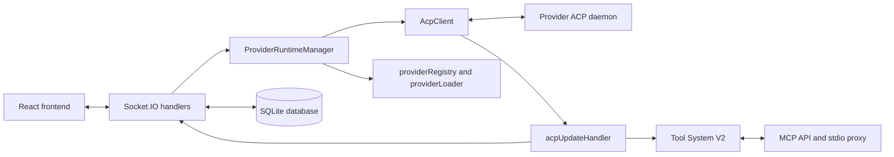

# Feature Doc - Backend Architecture

AcpUI's backend is a Node.js orchestration layer between the React UI, provider ACP daemons, SQLite persistence, and the stdio MCP proxy. This document is a compact orientation guide for backend-wide structure; load the specific feature docs for detailed flows, payload shapes, and feature-level gotchas.

---

## Overview

### What It Does

- Starts and stops the Express, Socket.IO, MCP API, branding API, static route, and voice-service runtime from `backend/server.js`.
- Loads enabled providers, creates one ACP runtime per provider, and keeps provider work isolated through `ProviderRuntimeManager`, `providerRegistry`, and `providerLoader`.
- Runs ACP daemon transport through `AcpClient`, `JsonRpcTransport`, `PermissionManager`, and `StreamController`.
- Exposes UI workflows through modular Socket.IO handlers under `backend/sockets/`.
- Normalizes daemon updates into provider-agnostic timeline events, provider extensions, stats, and Tool System V2 metadata.
- Persists durable session, folder, canvas, model, config, status, and sub-agent state through `backend/database.js`.

### Why This Matters

- Provider identity must survive every socket event, DB lookup, MCP proxy binding, and ACP request.
- Runtime state in `sessionMetadata` and durable SQLite state are different ownership layers.
- High-volume streaming must stay scoped to `session:<acpSessionId>` rooms.
- Provider modules normalize daemon differences before generic backend code emits, saves, or renders data.
- Tool metadata is sticky across MCP execution records, provider tool updates, and frontend timeline rendering.

Architectural role: backend orchestration, provider runtime management, Socket.IO gateway, ACP transport, MCP proxy bridge, and persistence layer.

---

## Scope And Feature Doc Handoffs

Use this document first when starting backend work, then load the feature doc for the system you are changing.

| Work area | Load next |
|---|---|
| Provider runtime or provider hooks | `[Feature Doc] - Provider System.md`, then the relevant provider supplement |
| MCP server, tool definitions, or optional IO/search tools | `[Feature Doc] - MCP Server.md`, `[Feature Doc] - ux_invoke_shell.md`, `[Feature Doc] - ux_invoke_subagents.md`, `[Feature Doc] - IO MCP Tools.md`, `[Feature Doc] - Google Search MCP Tool.md` |
| Session persistence, reload, or JSONL sync | `[Feature Doc] - JSONL Rehydration & Session Persistence.md` |
| Forking, archiving, or title generation | `[Feature Doc] - Session Forking.md`, `[Feature Doc] - Session Archiving.md`, `[Feature Doc] - Auto Chat Title Generation.md` |
| Canvas, terminals, file explorer, or settings | The matching frontend/backend feature doc for that workflow |
| Repository Markdown documentation browser | `[Feature Doc] - Help Docs Modal.md` |
| Provider status, notifications, or voice | `[Feature Doc] - Provider Status Panel.md`, `[Feature Doc] - Notification System.md`, `[Feature Doc] - Voice-to-Text System.md` |

This architecture doc intentionally avoids duplicating feature-level code snippets, payload walkthroughs, and full test tables that belong in those docs.

---

## Backend Execution Spine

1. **Server bootstrap and shutdown**
   File: `backend/server.js` (Functions: `startServer`, `shutdownServer`, Exports: `app`, `httpServer`, `io`, `SERVER_BOOT_ID`)

   `startServer` listens on the configured port and starts provider runtimes after the HTTP server is live. `shutdownServer` stops provider runtimes, stops voice STT, closes Socket.IO, and closes HTTP resources so watch-mode restarts do not leave daemon children running.

2. **Provider catalog and module loading**
   Files: `backend/services/providerRegistry.js` (Functions: `getProviderEntries`, `getDefaultProviderId`, `resolveProviderId`) and `backend/services/providerLoader.js` (Functions: `getProvider`, `getProviderModule`, `runWithProvider`)

   The registry resolves enabled provider entries and the loader merges provider config, branding, user config, and provider module hooks under `AsyncLocalStorage` provider context.

3. **Runtime creation**
   File: `backend/services/providerRuntimeManager.js` (Class: `ProviderRuntimeManager`, Methods: `init`, `getRuntime`, `getClient`, `stopAll`)

   `init` blocks daemon startup on startup-critical JSON config diagnostics, creates one runtime per enabled provider, and starts each `AcpClient`. Backend code should retrieve provider-aware clients through the runtime manager.

4. **ACP transport**
   Files: `backend/services/acpClient.js`, `backend/services/jsonRpcTransport.js`, `backend/services/permissionManager.js`, `backend/services/streamController.js`

   `AcpClient` spawns the daemon, performs the provider handshake, routes JSON-RPC payloads, tracks drain/capture state, handles permissions, emits provider extensions, and restarts daemons unless controlled shutdown is in progress.

5. **Socket hydration and rooms**
   File: `backend/sockets/index.js` (Function: `registerSocketHandlers`, Events: `connection`, `watch_session`, `unwatch_session`)

   On connection, the backend emits `config_errors` first, then provider metadata, readiness, branding, workspace, sidebar, command, and provider-status payloads when startup can continue. `watch_session` joins `session:<acpSessionId>` rooms for stream-scoped events.

6. **Sessions and prompts**
   Files: `backend/sockets/sessionHandlers.js`, `backend/sockets/promptHandlers.js`, `backend/services/sessionManager.js`

   Session handlers create, load, resume, snapshot, fork, merge, rehydrate, and delete sessions. Prompt handlers validate runtime/session metadata, apply model selection, convert attachments, pair provider prompt lifecycle hooks, send `session/prompt`, and persist completed turns.

7. **Update and tool normalization**
   Files: `backend/services/acpUpdateHandler.js`, `backend/services/tools/index.js`, `backend/services/tools/mcpExecutionRegistry.js`

   Daemon `session/update` and `session/notification` payloads pass through provider normalization, stream routing, Tool System V2, provider extension emission, stats updates, and durable stream persistence.

8. **MCP proxy and persistence**
   Files: `backend/routes/mcpApi.js`, `backend/mcp/mcpServer.js`, `backend/database.js`

   The stdio proxy calls `/api/mcp/tools` and `/api/mcp/tool-call`; handlers record MCP execution metadata before results are merged into tool updates. SQLite stores the durable view of sessions, folders, config, status, canvas artifacts, and sub-agent invocation state.

---

## Architecture Diagram

---

## Critical Contracts

- **Provider identity is mandatory:** Resolve `providerId` before runtime access, DB lookups, provider module calls, MCP proxy binding, and socket emissions.
- **ACP session id owns transport:** `acpSessionId` is used for daemon requests, socket rooms, stream queues, stats, permissions, shell runs, and sub-agent parent links.
- **UI session id owns persisted UI shape:** Frontend snapshots and sidebar state persist under the UI session id while backend ACP calls use the ACP session id.
- **`sessionMetadata` is runtime state:** It tracks model/config/options, buffers, prompt counters, drain state, and provider hooks while SQLite stores durable session state.
- **JSON-RPC ids are correlation keys:** Permission responses and pending request attribution must use the daemon request id.
- **Tool metadata is sticky:** MCP execution records and `toolCallState` preserve canonical names, titles, inputs, file paths, categories, and outputs across provider updates.
- **Config diagnostics gate startup:** Startup-blocking JSON config errors keep the backend online but stop provider hydration and daemon startup.
- **Shutdown is coordinated:** `shutdownServer`, `ProviderRuntimeManager.stopAll`, and `AcpClient.stop` must stay paired so controlled restarts do not trigger daemon auto-restart timers.

---

## Event And API Surface Map

| Surface | Owner | Purpose |
|---|---|---|
| `config_errors`, `providers`, `ready`, `voice_enabled`, `workspace_cwds`, `branding`, `sidebar_settings`, `custom_commands`, `provider_extension` | `backend/sockets/index.js` | Initial frontend hydration and provider-scoped extension replay |
| `watch_session`, `unwatch_session` | `backend/sockets/index.js` | Socket room membership for ACP-session-scoped stream events |
| `load_sessions`, `create_session`, `save_snapshot`, `get_session_history`, `rehydrate_session`, `delete_session`, `fork_session`, `merge_fork`, `set_session_model`, `set_session_option` | `backend/sockets/sessionHandlers.js` | Session lifecycle and persistence workflows |
| `prompt`, `cancel_prompt`, `respond_permission`, `set_mode` | `backend/sockets/promptHandlers.js` | User turn execution, cancellation, permission response, and mode changes |
| `token`, `thought`, `system_event`, `stream_resume_snapshot`, `stats_push`, `permission_request`, `token_done`, `merge_message` | `acpUpdateHandler`, `sessionStreamPersistence`, `promptHandlers`, `permissionManager`, `sessionHandlers` | Stream output, reconnect snapshots, and timeline-driving events |
| `help_docs_list`, `help_docs_read` | `backend/sockets/helpDocsHandlers.js` | Read-only repository Markdown discovery and safe document reads |
| `GET /api/mcp/tools`, `POST /api/mcp/tool-call` | `backend/routes/mcpApi.js` | Tool advertisement and internal MCP proxy execution |

Feature docs own the detailed payload contracts for each surface.

---

## Configuration And Persistence Ownership

| Area | Owner | Notes |
|---|---|---|
| Provider registry | `configuration/providers.json`, `providerRegistry.js` | Enabled providers, default provider, provider directories |
| Provider config and branding | `providers/<provider>/provider.json`, optional `branding.json`, optional `user.json`, `providerLoader.js` | Runtime config, provider module hooks, protocol prefix, branding payloads |
| MCP feature flags | `configuration/mcp.json`, `backend/services/mcpConfig.js` | Core and optional tool advertisement and handler registration |
| Runtime session state | `AcpClient.sessionMetadata`, `StreamController` | Hot model/config state, buffers, drain/capture state, prompt lifecycle data |
| Durable stream progress | `backend/services/sessionStreamPersistence.js`, `backend/database.js` | Normalized live tokens, thoughts, tools, permissions, terminal tool output, reconnect snapshots, active assistant finalization, and safe snapshot merge state |
| Durable state | `backend/database.js` | Sessions, folders, canvas artifacts, stats, config options, model state, provider status, notes, sub-agent invocations |

---

## Component Reference

| Area | File | Stable Anchors | Purpose |
|---|---|---|---|
| Server | `backend/server.js` | `startServer`, `shutdownServer`, `app`, `httpServer`, `io`, `SERVER_BOOT_ID` | HTTP, Socket.IO, routes, provider runtime startup, controlled shutdown |
| Provider registry | `backend/services/providerRegistry.js` | `getProviderEntries`, `getDefaultProviderId`, `resolveProviderId`, `getProviderEntry` | Provider registry validation and lookup |
| Provider loader | `backend/services/providerLoader.js` | `getProvider`, `getProviderModule`, `runWithProvider`, `DEFAULT_MODULE` | Provider config/module loading and context binding |
| Runtime manager | `backend/services/providerRuntimeManager.js` | `ProviderRuntimeManager`, `init`, `getRuntime`, `getClient`, `stopAll` | One runtime per enabled provider |
| Config diagnostics | `backend/services/jsonConfigDiagnostics.js` | `collectInvalidJsonConfigErrors`, `hasStartupBlockingJsonConfigError` | Invalid JSON reporting and startup gating |
| ACP client | `backend/services/acpClient.js` | `AcpClient`, `start`, `stop`, `performHandshake`, `handleAcpMessage`, `handleProviderExtension` | Daemon lifecycle and JSON-RPC routing |
| JSON-RPC transport | `backend/services/jsonRpcTransport.js` | `sendRequest`, `sendNotification`, `getPendingRequestContext`, `reset` | Request ids, response correlation, notifications |
| Permission manager | `backend/services/permissionManager.js` | `handleRequest`, `respond`, `pendingPermissions` | Permission socket event and daemon response handling |
| Stream controller | `backend/services/streamController.js` | `statsCaptures`, `drainingSessions`, `beginDraining`, `waitForDrainToFinish`, `onChunk` | Drain, capture, and stream silence tracking |
| Socket gateway | `backend/sockets/index.js` | `registerSocketHandlers`, `buildBrandingPayload`, `emitCachedProviderStatuses`, `emitStreamResumeSnapshot`, `watch_session` | Connection hydration, room membership, and reconnect stream snapshots |
| Sessions | `backend/sockets/sessionHandlers.js`, `backend/services/sessionManager.js`, `backend/services/sessionStreamPersistence.js` | `registerSessionHandlers`, `annotateLiveSessionState`, `flushActiveStream`, `getMcpServers`, `loadSessionIntoMemory`, `persistStreamEvent`, `flushStreamPersistence`, `getStreamResumeSnapshot`, `finalizeStreamPersistence` | Session create/load/resume, live-state annotation, stream progress persistence, reconnect snapshots, and safe snapshot merge workflows |
| Prompts | `backend/sockets/promptHandlers.js` | `registerPromptHandlers`, `prompt`, `cancel_prompt`, `respond_permission` | Prompt send, cancellation, lifecycle hooks |
| Help docs | `backend/sockets/helpDocsHandlers.js` | `registerHelpDocsHandlers`, `createHelpDocsHandlers`, `help_docs_list`, `help_docs_read` | Repository Markdown listing and read-only document content callbacks |
| Updates and tools | `backend/services/acpUpdateHandler.js`, `backend/services/tools/index.js` | `handleUpdate`, `toolRegistry`, `toolCallState`, `mcpExecutionRegistry` | Normalization, timeline events, sticky tool metadata |
| MCP API | `backend/routes/mcpApi.js`, `backend/mcp/mcpServer.js` | `createMcpApiRoutes`, `createToolHandlers`, `getMcpServers` | Tool advertisement and execution bridge |
| Database | `backend/database.js` | `initDb`, `saveSession`, `getAllSessions`, `getSessionByAcpId`, `saveConfigOptions`, `saveModelState` | SQLite schema and persistence helpers |

---

## Gotchas And Important Notes

1. **Startup diagnostics come first**
   `config_errors` must emit before normal hydration. Startup-blocking provider config issues must stop daemon startup while leaving the backend reachable.

2. **Do not bypass provider resolution**
   Importing a singleton client or using unscoped DB helpers in provider-aware code can leak state across providers.

3. **Hot and cold resume are different paths**
   Hot resume reads `sessionMetadata`; cold resume rebuilds state from SQLite and daemon load. Features must handle both.

4. **Drain replayed history**
   `session/load` replay must not emit historical daemon chunks as fresh live output.

5. **Move `pending-new` metadata**
   Fresh session creation starts with temporary metadata and must move it to the returned ACP session id before prompt execution.

6. **Pair prompt lifecycle hooks**
   `onPromptStarted` and `onPromptCompleted` must stay balanced across success, cancellation, and error paths.

7. **Permission ids are JSON-RPC ids**
   A permission response with the wrong request id leaves the daemon blocked.

8. **Tool definitions and handlers move together**
   Tool schema changes must update definitions, handlers, feature flags, registry behavior, and tests in the same change.

9. **Provider status has memory and SQLite sources**
   Connection hydration prefers in-memory provider status and uses SQLite fallback when memory has no newer status for a provider.

10. **Controlled shutdown prevents restart leaks**
   `AcpClient.stop` suppresses automatic daemon restart during backend shutdown and watch-mode restarts.

---

## Unit Tests

This doc lists only backbone tests. Feature docs list focused suites for their systems.

| Area | Tests |
|---|---|
| Server and config diagnostics | `backend/test/server.test.js`, `backend/test/jsonConfigDiagnostics.test.js` |
| Provider runtime and ACP client | `backend/test/providerRuntimeManager.test.js`, `backend/test/acpClient.test.js`, `backend/test/acpClient-routing.test.js`, `backend/test/jsonRpcTransport.test.js` |
| Socket hydration, session flow, and help docs | `backend/test/sockets-index.test.js`, `backend/test/sessionHandlers.test.js`, `backend/test/promptHandlers.test.js`, `backend/test/helpDocsHandlers.test.js` |
| Updates, tools, and MCP | `backend/test/acpUpdateHandler.test.js`, `backend/test/toolInvocationResolver.test.js`, `backend/test/mcpApi.test.js`, `backend/test/mcpServer.test.js`, `backend/test/mcpExecutionRegistryPersistence.test.js` |
| Persistence | `backend/test/persistence.test.js`, `backend/test/sessionManager.test.js`, `backend/test/sessionStreamPersistence.test.js`, `backend/test/database-exhaustive.test.js` |

Run backend verification from `backend` with `npm run lint` and `npx vitest run`.

---

## How To Use This Guide

### For Implementing Or Extending Backend Work

1. Identify the boundary first: startup, provider runtime, socket handler, ACP transport, MCP tool, or persistence.
2. Load this guide to find the owner files and stable anchors.
3. Load the feature doc from the handoff table before changing detailed behavior.
4. Preserve provider identity, ACP session identity, room scoping, and sticky tool metadata across boundaries.
5. Update tests and documentation for the specific feature you changed.

### For Debugging Backend Issues

1. Classify the symptom by phase: startup, socket hydration, session create/load, prompt send, daemon update, tool execution, or persistence.
2. Confirm `providerId`, UI session id, ACP session id, and socket room at the first boundary where data crosses modules.
3. Check `sessionMetadata` for runtime state and SQLite helpers for durable state.
4. For tool issues, inspect MCP execution metadata before changing provider normalization.
5. For lifecycle leaks, inspect `shutdownServer`, `ProviderRuntimeManager.stopAll`, and `AcpClient.stop` together.

---

## Summary

- The backend is the provider-agnostic orchestration layer for HTTP, Socket.IO, ACP daemons, MCP tools, and SQLite persistence.
- `ProviderRuntimeManager` and `AcpClient` are the runtime backbone for provider-aware work.
- Socket handlers own UI workflows; `acpUpdateHandler` owns normalized stream and tool updates.
- `sessionMetadata` is runtime state; `backend/database.js` stores the durable session view.
- Provider identity, ACP session identity, JSON-RPC ids, socket rooms, and sticky tool metadata are the critical cross-cutting contracts.
