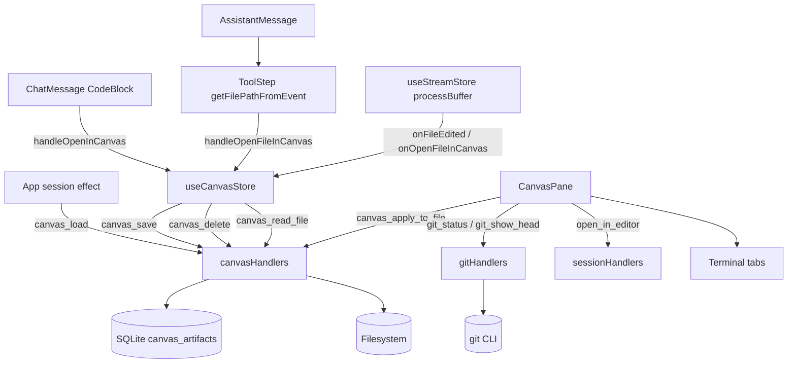

# Canvas System

The Canvas system is the right-side workspace for session-scoped file artifacts, Monaco editing, markdown preview, git-aware diff viewing, and terminal tab hosting. The feature spans React/Zustand state, Socket.IO file/git handlers, and SQLite `canvas_artifacts` persistence.

This area is easy to break because canvas state is keyed by UI session id while chat streaming is keyed by ACP session id, and because file artifacts can enter the canvas from code blocks, local Markdown file links, tool timeline steps, stream callbacks, git status rows, and persisted database rows.

---

## Overview

### What It Does

- Stores session-scoped `CanvasArtifact` entries in `useCanvasStore` and persists them with the `canvas_save` socket event.
- Loads saved artifacts for the active UI session with `canvas_load` and `getCanvasArtifactsForSession`.
- Reads current file contents through `canvas_read_file`, writes editor content through `canvas_apply_to_file`, and opens files in VS Code through `open_in_editor`.
- Renders artifact content in Monaco code view, ReactMarkdown preview, or a Monaco `SafeDiffEditor` diff view.
- Opens files from assistant code blocks, local Markdown file links, tool timeline file paths, completed tool events, and git status rows.
- Shows workspace git status, detects whether the active artifact has changes, and loads HEAD content with `git_show_head` for side-by-side diffs.
- Hosts session-scoped terminal tabs in the same pane and keeps the pane open while terminals exist.

### Why This Matters

- `CanvasArtifact.sessionId` uses the UI session id, not the ACP transport id.
- Artifact deduplication decides whether file updates replace an existing tab or create duplicates.
- File reads and writes touch the local filesystem directly through backend socket handlers.
- Git diff rendering depends on correct workspace `cwd`, path joining, and HEAD lookup callbacks.
- Monaco rendering is isolated by an `ErrorBoundary`, so reset behavior is intentional and session-scoped.

### Architectural Role

- Frontend: React + Zustand (`useCanvasStore`, `CanvasPane`, `App`, `PopOutApp`, `ToolStep`).
- Backend: Socket handlers (`canvasHandlers`, `gitHandlers`, `sessionHandlers`).
- Persistence: SQLite table `canvas_artifacts` managed by `backend/database.js`.
- Adjacent system: Terminal tabs are stored in `useCanvasStore`, while PTY lifecycle is handled by the Terminal-in-Canvas system.

---

## How It Works - End-to-End Flow

1. Assistant code blocks can create snippet artifacts.
   - File: `frontend/src/components/ChatMessage.tsx` (Component: `CodeBlock`, Handler: `handleOpenCanvas`)
   - File: `frontend/src/store/useCanvasStore.ts` (Store action: `handleOpenInCanvas`)
   - `CodeBlock` renders an `Open in Canvas` action only when `useCanvasStore.isCanvasOpen` is true. The handler creates a snippet artifact with `id`, `sessionId`, `title`, `content`, `language`, and `version`, then delegates to `handleOpenInCanvas`.

```tsx
// FILE: frontend/src/components/ChatMessage.tsx (Component: CodeBlock, Handler: handleOpenCanvas)
handleOpenInCanvas(socket, activeSessionId, {
  id: `canvas-${Date.now()}`,
  sessionId: activeSessionId || '',
  title: `${language} snippet`,
  content: value,
  language,
  version: 1
});
```

Assistant Markdown links with Windows absolute or `file:` file destinations also open files through the canvas. `frontend/src/components/ChatMessage.tsx` handles `markdownComponents.a`, `frontend/src/components/MemoizedMarkdown.tsx` preserves those local hrefs through `urlTransform`, and `frontend/src/utils/localFileLinks.ts` strips optional `:line` / `:line:column` suffixes before `handleOpenFileInCanvas` reads the file.

2. Tool timeline steps can open the current file state.
   - File: `frontend/src/components/AssistantMessage.tsx` (Component: `AssistantMessage`, Prop: `ToolStep.onOpenInCanvas`)
   - File: `frontend/src/components/ToolStep.tsx` (Function: `getFilePathFromEvent`, Component: `ToolStep`)
   - File: `frontend/src/store/useCanvasStore.ts` (Store action: `handleOpenFileInCanvas`)
   - `ToolStep` extracts file paths from `event.filePath`, provider file tool categories, supported tool-title patterns, or diff output headers. It suppresses canvas hoist for shell tools, sub-agent tools, non-file AcpUI UX tools, directory listings, glob tools, and truncated paths containing `...`.

```tsx
// FILE: frontend/src/components/ToolStep.tsx (Function: getFilePathFromEvent)
if (event.toolCategory === 'file_read') return event.filePath;
if (event.toolCategory === 'file_write') return event.filePath;
if (event.toolCategory === 'file_edit') return event.filePath;
if (event.filePath) return event.filePath;
```

3. Stream processing refreshes watched files and opens plans.
   - File: `frontend/src/hooks/useChatManager.ts` (Hook: `useChatManager`)
   - File: `frontend/src/store/useStreamStore.ts` (Store action: `processBuffer`)
   - File: `frontend/src/App.tsx` (Hook call: `useChatManager(...)`)
   - File: `frontend/src/PopOutApp.tsx` (Hook call: `useChatManager(...)`)
   - `App` and `PopOutApp` pass `handleFileEdited` and `handleOpenFileInCanvas` into `useChatManager`. `processBuffer` calls those callbacks when a `tool_end` or `tool_update` event has `status: 'completed'` and a `filePath`; paths ending in `plan.md` also open as artifacts.

```ts
// FILE: frontend/src/store/useStreamStore.ts (Store action: processBuffer)
if (status === 'completed' && filePath) {
  onFileEdited?.(filePath);
  if (filePath.toLowerCase().endsWith('plan.md')) {
    onOpenFileInCanvas?.(filePath);
  }
}
```

4. `handleOpenFileInCanvas` reads file content before creating an artifact.
   - File: `frontend/src/store/useCanvasStore.ts` (Store action: `handleOpenFileInCanvas`)
   - File: `backend/sockets/canvasHandlers.js` (Socket event: `canvas_read_file`)
   - The frontend emits `canvas_read_file` with `{ filePath, sessionId }`. The backend requires `sessionId`, resolves the path through the shared IO MCP allowed-root validator, reads UTF-8 content from the allowed path, derives `language` from the extension, and returns an artifact containing the same UI `sessionId`.

```js
// FILE: backend/sockets/canvasHandlers.js (Socket event: canvas_read_file)
if (!sessionId) throw new Error('sessionId is required for canvas_read_file');
const allowedPath = resolveAllowedPath(filePath, 'file_path');
const content = fs.readFileSync(allowedPath, 'utf8');
const language = path.extname(allowedPath).slice(1) || 'text';
callback({ artifact: { id: `canvas-fs-${Date.now()}`, sessionId, title, content, language, filePath: allowedPath, version: 1 } });
```

5. `handleOpenInCanvas` deduplicates and persists artifacts.
   - File: `frontend/src/store/useCanvasStore.ts` (Store action: `handleOpenInCanvas`)
   - File: `backend/sockets/canvasHandlers.js` (Socket event: `canvas_save`)
   - File: `backend/database.js` (Function: `saveCanvasArtifact`)
   - The store copies the artifact, sets `sessionId` from the active UI session id when available, finds an existing artifact by exact `filePath` match or by `id`, and either updates the existing entry or appends a new one. It emits `canvas_save` only when both `socket` and `sessionId` are available.

```ts
// FILE: frontend/src/store/useCanvasStore.ts (Store action: handleOpenInCanvas)
const existing = state.canvasArtifacts.find(a =>
  (a.filePath && newArtifact.filePath && a.filePath === newArtifact.filePath) ||
  (a.id === newArtifact.id)
);
```

6. SQLite stores artifacts by UI session id.
   - File: `backend/database.js` (Table: `canvas_artifacts`, Functions: `saveCanvasArtifact`, `getCanvasArtifactsForSession`, `deleteCanvasArtifact`)
   - `canvas_artifacts.session_id` references `sessions.ui_id`. `saveCanvasArtifact` upserts by artifact `id`, writes `file_path`, and refreshes `created_at` during updates. `getCanvasArtifactsForSession` returns artifacts ordered by `created_at DESC`.

```sql
-- FILE: backend/database.js (Table: canvas_artifacts)
CREATE TABLE IF NOT EXISTS canvas_artifacts (
  id TEXT PRIMARY KEY,
  session_id TEXT,
  title TEXT,
  content TEXT,
  language TEXT,
  version INTEGER DEFAULT 1,
  file_path TEXT,
  created_at DATETIME DEFAULT CURRENT_TIMESTAMP,
  FOREIGN KEY(session_id) REFERENCES sessions(ui_id) ON DELETE CASCADE
)
```

7. Active-session changes restore canvas state.
   - File: `frontend/src/App.tsx` (Effect: active session switch)
   - File: `frontend/src/store/useCanvasStore.ts` (State keys: `canvasOpenBySession`, `terminals`, `activeTerminalId`)
   - `App` emits `unwatch_session` and `watch_session` for ACP sessions, saves the departing UI session's `isCanvasOpen` value in `canvasOpenBySession`, clears active artifacts, restores open state from `canvasOpenBySession`, and keeps the pane open when the new UI session has terminals.
   - `App` also emits `canvas_load` for the active UI session and selects the first returned artifact when persisted artifacts exist.

8. Watched-file refresh updates open artifacts after writes.
   - File: `frontend/src/store/useCanvasStore.ts` (Store action: `handleFileEdited`)
   - File: `backend/sockets/canvasHandlers.js` (Socket event: `canvas_read_file`)
   - `handleFileEdited` normalizes separators and lowercases paths, then matches the first watched artifact whose normalized path suffix overlaps the edited path. It rereads that file and updates the existing artifact id plus `lastUpdated` for tab glow.

```ts
// FILE: frontend/src/store/useCanvasStore.ts (Store action: handleFileEdited)
const watched = state.canvasArtifacts.find(a =>
  a.filePath && (
    normalize(a.filePath).endsWith(editedNormalized) ||
    editedNormalized.endsWith(normalize(a.filePath))
  )
);
```

9. CanvasPane renders code, markdown preview, or diff.
   - File: `frontend/src/components/CanvasPane/CanvasPane.tsx` (Component: `CanvasPane`, Function: `getMonacoLanguage`, Component: `SafeDiffEditor`)
   - Markdown artifacts default to preview mode. Non-markdown artifacts default to Monaco code mode. The component keeps the current `viewMode` when the same artifact id receives updated content, and resets view mode only when the active artifact id changes outside a git-open flow.
   - Diff mode renders `SafeDiffEditor` only when `gitOriginal !== null`, which prevents Monaco diff models from mounting before HEAD content returns.

10. Editor apply writes content to disk.
    - File: `frontend/src/components/CanvasPane/CanvasPane.tsx` (Handler: `handleApplyToFile`)
    - File: `backend/sockets/canvasHandlers.js` (Socket event: `canvas_apply_to_file`)
    - `handleApplyToFile` emits `{ filePath, content }`. The backend validates that `filePath` is truthy, writes UTF-8 content with `fs.writeFileSync`, and reports success or an error through the callback. The frontend shows `Applied!` for successful writes and routes failures into the app-styled Canvas error modal.

11. Git status drives file list and diff affordances.
    - File: `frontend/src/components/CanvasPane/CanvasPane.tsx` (Handlers: `refreshGitStatus`, `handleOpenGitFile`)
    - File: `frontend/src/utils/canvasHelpers.ts` (Functions: `isFileChanged`, `buildFullPath`)
    - File: `backend/sockets/gitHandlers.js` (Socket events: `git_status`, `git_show_head`, `git_diff`, `git_stage`, `git_unstage`)
    - `CanvasPane` resolves `cwd` from the active session `cwd` or the first configured workspace path. It emits `git_status`, renders changed files, and uses `buildFullPath` before opening a git row. Opening a git row reads current disk content with `canvas_read_file`, stores it in the canvas, switches to diff mode, and fills the original side with `git_show_head`.
    - The toolbar Diff button appears when the active artifact has `filePath` and `isFileChanged` matches it against the git status list. This button also uses `git_show_head`. Backend `git_diff`, `git_stage`, and `git_unstage` are implemented socket events, but `CanvasPane` does not render stage controls and uses `git_show_head` for the Monaco side-by-side diff.

12. Terminal tabs share the canvas pane.
    - File: `frontend/src/store/useCanvasStore.ts` (Store actions: `openTerminal`, `closeTerminal`, `setActiveTerminalId`)
    - File: `frontend/src/components/CanvasPane/CanvasPane.tsx` (Component: `Terminal`, Socket event: `terminal_kill`)
    - `CanvasPane` filters terminal tabs by active UI session id. Closing a terminal emits `terminal_kill`, calls `clearSpawnedTerminal`, and updates `useCanvasStore`. Closing the final artifact keeps `isCanvasOpen` true when terminals remain.

13. Open in VS Code delegates to the backend.
    - File: `frontend/src/components/CanvasPane/CanvasPane.tsx` (Button: `Open in VS Code`)
    - File: `backend/sockets/sessionHandlers.js` (Socket event: `open_in_editor`)
    - The frontend emits `open_in_editor` with the artifact `filePath`; the backend spawns `code` with an argument array and `shell: false`, then logs failures through `writeLog`.

---

## Architecture Diagram



---

## The Critical Contract: `CanvasArtifact` + UI Session Persistence

File: `frontend/src/types.ts` (Interface: `CanvasArtifact`)

```ts
// FILE: frontend/src/types.ts (Interface: CanvasArtifact)
export interface CanvasArtifact {
  id: string;
  sessionId: string;
  title: string;
  content: string;
  language: string;
  version: number;
  filePath?: string;
  createdAt?: string;
  lastUpdated?: number;
}
```

Rules that must hold:

1. `sessionId` is the UI session id stored in `ChatSession.id` and `sessions.ui_id`; it is not the ACP session id.
2. `canvas_read_file` requests must include the UI `sessionId`, and returned artifacts must include that same `sessionId`.
3. `handleOpenInCanvas` deduplicates by exact `filePath` match before `id` match, and updates keep the existing artifact id.
4. `handleFileEdited` updates only already-watched artifacts and preserves the watched artifact id.
5. `canvas_load` and `getCanvasArtifactsForSession` query by UI session id.
6. Canvas close logic must keep the pane open when terminal tabs exist for the active UI session.

If this contract breaks, users see duplicated tabs, missing persisted artifacts, artifacts attached to the wrong session, stale file content, or canvas panes that close while terminals are active.

---

## Configuration / Provider-Specific Behavior

Canvas is provider-agnostic at the UI, socket, and database layers.

Required upstream behavior:

- Tool completion events that modify files should include `filePath` so `useStreamStore.processBuffer` can refresh watched artifacts.
- Tool timeline events should include `toolCategory`, `filePath`, `isAcpUxTool`, `isFileOperation`, `isShellCommand`, `canonicalName`, or `toolName` when those fields are needed for `ToolStep.getFilePathFromEvent` to decide whether the canvas hoist button is appropriate.
- Plan auto-open behavior requires a completed tool event whose `filePath` ends with `plan.md` after lowercase normalization.

Runtime and host dependencies:

- Git integration requires `git` to be available to the backend process and `cwd` to point at a git worktree.
- `CanvasPane` resolves git `cwd` from `ChatSession.cwd` or `useSystemStore.workspaceCwds[0].path`.
- `open_in_editor` requires the `code` command to be available on the backend host PATH.
- `canvas_apply_to_file` validates `filePath` through the shared IO MCP allowed-root resolver before writing UTF-8 content to disk.

---

## Data Flow / Rendering Pipeline

### Stream File Write to Watched Artifact Refresh

```text
backend emits system_event tool_end/tool_update with status completed and filePath
  -> useChatManager routes system_event to useStreamStore.onStreamEvent
  -> useStreamStore.processBuffer merges filePath into the tool step
  -> processBuffer calls onFileEdited(filePath)
  -> useCanvasStore.handleFileEdited finds a watched artifact by fuzzy path suffix
  -> canvas_read_file returns current disk content
  -> useCanvasStore replaces the watched artifact content and sets lastUpdated
  -> CanvasPane tab glows and active editor content refreshes
```

### Tool Timeline Hoist to Artifact Persistence

```text
ToolStep.getFilePathFromEvent extracts a file path
  -> AssistantMessage passes onOpenInCanvas to handleOpenFileInCanvas
  -> useCanvasStore emits canvas_read_file
  -> canvasHandlers reads UTF-8 file content and returns CanvasArtifact data
  -> handleOpenInCanvas stamps active UI session id
  -> handleOpenInCanvas emits canvas_save
  -> database.saveCanvasArtifact upserts canvas_artifacts row
  -> CanvasPane selects the artifact tab
```

### Git Row to Diff View

```text
CanvasPane.refreshGitStatus emits git_status with cwd
  -> gitHandlers returns branch and changed file list
  -> user selects a git row
  -> CanvasPane.handleOpenGitFile builds cwd-relative full path
  -> canvas_read_file loads current disk content
  -> handleOpenInCanvas stores current content as an artifact
  -> CanvasPane emits git_show_head for original content
  -> SafeDiffEditor renders original HEAD content against current editor content
```

### Socket and Database Shapes

```ts
// FILE: frontend/src/types.ts (Interface: CanvasReadFileResponse)
export interface CanvasReadFileResponse {
  artifact?: CanvasArtifact;
  error?: string;
}
```

```js
// FILE: backend/database.js (Function: getCanvasArtifactsForSession)
SELECT id, session_id as sessionId, title, content, language, version,
       file_path as filePath, created_at as createdAt
FROM canvas_artifacts
WHERE session_id = ?
ORDER BY created_at DESC
```

---

## Component Reference

### Frontend

| Area | File | Anchors | Purpose |
|---|---|---|---|
| Store | `frontend/src/store/useCanvasStore.ts` | `useCanvasStore`, `openTerminal`, `closeTerminal`, `setActiveTerminalId`, `resetCanvas`, `handleOpenInCanvas`, `handleOpenFileInCanvas`, `handleFileEdited`, `handleCloseArtifact` | Core canvas, artifact, and terminal-tab state |
| Pane | `frontend/src/components/CanvasPane/CanvasPane.tsx` | `CanvasPane`, `getMonacoLanguage`, `SafeDiffEditor`, `refreshGitStatus`, `handleOpenGitFile`, `handleApplyToFile` | Main canvas UI, Monaco editor, markdown preview, diff mode, git list, terminal tabs |
| App Shell | `frontend/src/App.tsx` | `App`, `useChatManager(...)`, active session switch effect, `canvas_load`, plan auto-open effect, `ErrorBoundary`, `computeResizeWidth` | Main-window canvas lifecycle, persisted artifact load, resize, crash isolation |
| Pop-out Shell | `frontend/src/PopOutApp.tsx` | `PopOutApp`, `useChatManager(...)`, `CanvasPane`, `ErrorBoundary`, `computeResizeWidthNoSidebar` | Pop-out canvas rendering and stream-file callbacks |
| Stream | `frontend/src/store/useStreamStore.ts` | `processBuffer`, `onStreamEvent` | Merges tool file paths, triggers file refresh, opens `plan.md` artifacts |
| Socket Hook | `frontend/src/hooks/useChatManager.ts` | `useChatManager`, socket event `system_event`, typewriter loop effect | Connects stream processing to canvas callbacks supplied by app shells |
| Code Blocks And Links | `frontend/src/components/ChatMessage.tsx` | `CodeBlock`, `handleOpenCanvas`, `markdownComponents.code`, `markdownComponents.a` | Creates snippet artifacts from rendered markdown code blocks and routes local file links to canvas file opening |
| Local Link Parser | `frontend/src/utils/localFileLinks.ts` | `parseLocalFileLinkHref` | Detects local file hrefs and removes line suffixes before canvas reads |
| Tool Timeline | `frontend/src/components/AssistantMessage.tsx` | `AssistantMessage`, `ToolStep.onOpenInCanvas` | Bridges tool-step hoist buttons to `handleOpenFileInCanvas` |
| Tool Timeline | `frontend/src/components/ToolStep.tsx` | `ToolStep`, `getFilePathFromEvent`, `canvas-hoist-btn` | Extracts file paths from tool events and renders file-state hoist button |
| Helpers | `frontend/src/utils/canvasHelpers.ts` | `isFileChanged`, `buildFullPath` | Git changed-file matching and cwd/path joining |
| Types | `frontend/src/types.ts` | `CanvasArtifact`, `CanvasLoadResponse`, `CanvasReadFileResponse`, `CanvasActionResponse`, `StreamEventData.filePath`, `SystemEvent.filePath` | Cross-layer canvas and stream contracts |

### Backend

| Area | File | Anchors | Purpose |
|---|---|---|---|
| Canvas Socket | `backend/sockets/canvasHandlers.js` | `registerCanvasHandlers`, socket events `canvas_save`, `canvas_load`, `canvas_delete`, `canvas_apply_to_file`, `canvas_read_file` | Artifact persistence callbacks and filesystem read/write |
| Git Socket | `backend/sockets/gitHandlers.js` | `registerGitHandlers`, helper `git`, socket events `git_status`, `git_diff`, `git_stage`, `git_unstage`, `git_show_head` | Git status, diff, staging, unstaging, and HEAD content lookup |
| Session Socket | `backend/sockets/sessionHandlers.js` | `registerSessionHandlers`, socket event `open_in_editor` | Opens current artifact path in VS Code through the backend host |
| Database | `backend/database.js` | Table `canvas_artifacts`, functions `saveCanvasArtifact`, `getCanvasArtifactsForSession`, `deleteCanvasArtifact` | SQLite storage keyed by UI session id |

### Tests

| Area | File | Anchors | Purpose |
|---|---|---|---|
| Frontend Store | `frontend/src/test/useCanvasStore.test.ts` | suite `useCanvasStore` | Store setters, terminal actions, artifact dedup, file read open, watched-file refresh, close/delete, reset |
| Frontend Pane | `frontend/src/test/CanvasPane.test.tsx` | suites `CanvasPane Component`, `CanvasPane - additional coverage`, `CanvasPane - Terminal Tab`, `CanvasPane - prevArtifactIdRef behavior`, `CanvasPane - multiple terminals and tab interactions` | Rendering modes, apply/open editor actions, tab behavior, language mapping, terminal tabs, same-artifact view-mode preservation |
| Frontend Helpers | `frontend/src/test/canvasHelpers.test.ts` | suites `isFileChanged`, `buildFullPath` | Path normalization and git file-change matching |
| Frontend Tool Timeline | `frontend/src/test/ToolStep.test.tsx` | suite `ToolStep`, suite `ToolStep - getFilePathFromEvent extraction` | Canvas hoist button rules and file path extraction |
| Frontend Chat | `frontend/src/test/ChatMessage.test.tsx` | tests `renders Open in Canvas button on code blocks and calls callback`, `opens local markdown file links in canvas`, `does not render Open in Canvas button for truncated paths with ellipses`, `renders Open in Canvas button for valid full paths`, `code block shows Canvas button when canvas is open`, `code block does NOT show Canvas button when canvas is closed` | Code-block, local-link, and tool-hoist visibility through assistant rendering |
| Frontend Link Helpers | `frontend/src/test/localFileLinks.test.ts` | suite `parseLocalFileLinkHref` | Local file href detection, percent decoding, and line-suffix stripping |
| Frontend App | `frontend/src/test/App.test.tsx` | tests `persists canvas open state per session`, `auto-opens canvas for plans when awaiting permission`, `handles resize handle mouse events` | Main app canvas lifecycle, plan auto-open, resize handle |
| Frontend Stream | `frontend/src/test/useStreamStore.test.ts` | suite `useStreamStore (Pure Logic)` | Tool event merging and stream queue processing that drives file callbacks |
| Backend Canvas | `backend/test/canvasHandlers.test.js` | suite `canvasHandlers` | Canvas socket success paths, filesystem read/write, error paths, no-callback safety |
| Backend Git | `backend/test/gitHandlers.test.js` | suites `Git Handlers`, `Git Handlers - git_show_head` | Git status, diff, stage, unstage, HEAD lookup, new-file fallback, error handling |
| Backend Database | `backend/test/persistence.test.js` | test `handles canvas artifacts` | End-to-end canvas artifact DB CRUD |
| Backend Database | `backend/test/database-exhaustive.test.js` | tests `hits all canvas branches`, `hits all error paths using mock injection` | Canvas DB helper branches and DB error propagation |

---

## Gotchas & Important Notes

1. UI session id and ACP session id are different.
   - Canvas persistence uses `ChatSession.id` / `sessions.ui_id`. Stream queues use `ChatSession.acpSessionId`. Passing the ACP id to `canvas_load` or `canvas_save` stores artifacts under the wrong key.

2. Artifact open dedup is exact, but file refresh matching is fuzzy.
   - `handleOpenInCanvas` compares `filePath` with strict equality. `handleFileEdited` lowercases, normalizes separators, and uses suffix overlap. Similar filenames in different folders can match the first watched suffix.

3. Watched-file refresh does not emit `canvas_save`.
   - `handleFileEdited` updates the in-memory artifact and `lastUpdated`. Reopening through `handleOpenFileInCanvas` or calling `handleOpenInCanvas` persists through `canvas_save`.

4. File reads are session-scoped.
   - `canvas_read_file` requires `sessionId` and echoes it in the returned artifact; frontend callers must send the active or watched UI session id.

5. Canvas reads and writes are root-gated.
   - `canvas_read_file` and `canvas_apply_to_file` resolve `filePath` through `resolveAllowedPath(filePath, 'file_path')` before touching disk, so paths outside configured allowed roots are rejected.

6. Diff mode has a loading sentinel.
   - `SafeDiffEditor` mounts only when `viewMode === 'diff'` and `gitOriginal !== null`. `git_show_head` returns an empty string for new files; empty string means render a blank original side, while `null` means HEAD content has not arrived.

7. Git cwd fallback can change the repo source.
   - `CanvasPane` uses active session `cwd` first and then `workspaceCwds[0].path`. Missing session `cwd` can make the git panel show the first configured workspace.

8. Code-block canvas actions require an open canvas.
   - `CodeBlock` hides its Canvas button when `isCanvasOpen` is false. ToolStep hoist buttons and local Markdown file links are independent of that code-block condition because they open files through `handleOpenFileInCanvas`.

9. Local Markdown file links must remove editor line suffixes.
   - `parseLocalFileLinkHref` strips trailing `:line` and `:line:column` before `canvas_read_file` so a rendered file link opens the file path, not a non-existent path with editor coordinates.

10. Pop-out canvas does not issue `canvas_load` during bootstrap.
   - `PopOutApp` wires stream callbacks and renders `CanvasPane`, but the persisted artifact load path is in `App`.

11. Terminal tabs keep the pane open.
    - `closeTerminal`, `resetCanvas`, and `handleCloseArtifact` all preserve `isCanvasOpen` when terminals remain for the active session.

---

## Unit Tests

### Backend

- `backend/test/canvasHandlers.test.js`
  - `canvas_save saves artifact to DB`
  - `canvas_load returns artifacts`
  - `canvas_delete removes artifact`
  - `canvas_read_file returns file content after allowed-root validation`
  - `canvas_apply_to_file writes content after allowed-root validation`
  - `returns an error when path validation rejects traversal/outside-root access`
  - `canvas_read_file falls back to "text" language when file has no extension`
  - `handlers do not throw when called without a callback`
  - `error branches do not throw when called without a callback`

- `backend/test/gitHandlers.test.js`
  - `git_status returns branch and files`
  - `git_status returns empty files array when working tree is clean`
  - `git_status maps deleted and renamed statuses`
  - `git_diff returns staged diff`
  - `git_diff returns unstaged diff`
  - `git_diff shows full content for untracked files`
  - `git_stage calls git add`
  - `git_unstage calls git reset HEAD`
  - `git_diff returns (no changes) when diff is empty`
  - `git_diff handles errors`
  - `git_unstage handles errors`
  - `git_stage handles errors`
  - `returns file content from HEAD`
  - `returns empty string for new files when git command throws`

- `backend/test/persistence.test.js`
  - `handles canvas artifacts`

- `backend/test/database-exhaustive.test.js`
  - `hits all canvas branches`
  - `hits all error paths using mock injection`

### Frontend

- `frontend/src/test/useCanvasStore.test.ts`
  - `setIsCanvasOpen updates global open state`
  - `setActiveCanvasArtifact updates current artifact`
  - `openTerminal adds a terminal and sets it as active`
  - `closeTerminal handles termination and active switch`
  - `handleOpenInCanvas adds new artifact or updates existing`
  - `handleOpenFileInCanvas fetches from socket`
  - `handleFileEdited updates watched artifacts`
  - `handleCloseArtifact emits canvas_delete and updates state`
  - `resetCanvas clears artifacts and closes canvas`

- `frontend/src/test/CanvasPane.test.tsx`
  - `renders placeholder when activeArtifact is null`
  - `renders artifact title and content correctly`
  - `emits canvas_apply_to_file when Apply is clicked if filePath exists`
  - `defaults to preview mode for markdown artifacts`
  - `switches between code and preview modes`
  - `detects language from filePath if generic`
  - `renders VS Code button when artifact has filePath`
  - `VS Code button emits open_in_editor`
  - `Apply button shows Applied state after successful apply`
  - `Apply button pushes failure into the Canvas error modal path`
  - `does not show Apply or VS Code buttons when no filePath`
  - `detects markdown from filePath ending in .md`
  - `editing content in monaco updates local state`
  - `tab shows filePath basename when filePath is set`
  - `does NOT reset viewMode when same artifact remounts with updated content`
  - `renders multiple terminal tabs when multiple terminals in store for active session`
  - `clicking a terminal tab calls setActiveTerminalId`
  - `close button on terminal tab calls closeTerminal`
  - `diff button not shown when no filePath on artifact`

- `frontend/src/test/canvasHelpers.test.ts`
  - `returns true when file path matches`
  - `returns false when no match`
  - `returns false for undefined filePath`
  - `handles backslash/forward slash normalization`
  - `joins and normalizes paths`

- `frontend/src/test/ToolStep.test.tsx`
  - `shows canvas button when filePath exists`
  - `extracts path from "Running write_file: path" title`
  - `extracts path from "Running read_file_parallel: path" title`
  - `returns undefined for shell commands`
  - `returns undefined for non-file AcpUI UX tools even when a file path is present`
  - `returns undefined for list_directory commands`
  - `returns undefined when path contains ellipsis`
  - `extracts path from generic "Running tool_name: path" pattern`
  - `extracts path from title that is just a filename with dot`
  - `extracts path from output Index: line`
  - `extracts path from output diff --- line`
  - `does not extract from output --- old (literal "old")`
  - `canvas hoist button calls onOpenInCanvas with extracted path`

- `frontend/src/test/ChatMessage.test.tsx`
  - `renders Open in Canvas button on code blocks and calls callback`
  - `does not render Open in Canvas button for truncated paths with ellipses`
  - `renders Open in Canvas button for valid full paths`
  - `code block shows Canvas button when canvas is open`
  - `code block does NOT show Canvas button when canvas is closed`

- `frontend/src/test/App.test.tsx`
  - `persists canvas open state per session`
  - `auto-opens canvas for plans when awaiting permission`
  - `handles resize handle mouse events`

- `frontend/src/test/useStreamStore.test.ts`
  - `onStreamEvent handles tool_start and collapses previous steps`
  - `onStreamEvent merges tool titles correctly`
  - `onStreamEvent handles tool_update and caches fallback output`

---

## How to Use This Guide

### For implementing/extending this feature

1. Start with `frontend/src/types.ts` and keep the `CanvasArtifact` shape stable.
2. Use `frontend/src/store/useCanvasStore.ts` to decide whether behavior belongs in store state, socket reads, socket writes, or terminal tab state.
3. For file-opening behavior, trace entry points through `ChatMessage.CodeBlock`, `ToolStep.getFilePathFromEvent`, `AssistantMessage.ToolStep.onOpenInCanvas`, and `useStreamStore.processBuffer`.
4. For session lifecycle behavior, inspect `App` active-session switching and `canvas_load` before changing artifact persistence or pane open/close behavior.
5. For git behavior, update `CanvasPane.refreshGitStatus`, `CanvasPane.handleOpenGitFile`, `canvasHelpers.isFileChanged`, and `backend/sockets/gitHandlers.js` together.
6. For filesystem behavior, update `backend/sockets/canvasHandlers.js` and DB helper tests when changing `canvas_read_file`, `canvas_apply_to_file`, or artifact persistence.
7. Add or adjust tests in `useCanvasStore.test.ts`, `CanvasPane.test.tsx`, `ToolStep.test.tsx`, `canvasHandlers.test.js`, and `gitHandlers.test.js` based on the affected layer.

### For debugging issues with this feature

1. Confirm whether the symptom involves UI session id (`ChatSession.id`) or ACP session id (`ChatSession.acpSessionId`). Canvas persistence uses the UI id.
2. Inspect `useCanvasStore` state: `isCanvasOpen`, `canvasOpenBySession`, `canvasArtifacts`, `activeCanvasArtifact`, `terminals`, and `activeTerminalId`.
3. Trace socket events: `canvas_load`, `canvas_save`, `canvas_delete`, `canvas_read_file`, `canvas_apply_to_file`, `git_status`, `git_show_head`, and `open_in_editor`.
4. Check `canvas_artifacts` rows for the active `session_id` when persisted artifacts are missing or sorted unexpectedly.
5. If a watched file does not refresh, verify that the stream event is completed, includes `filePath`, and that `handleFileEdited` can suffix-match an already-open artifact.
6. If a diff is blank, distinguish `gitOriginal === null` from `gitOriginal === ''`, then check the `git_show_head` callback and the artifact id guard in `handleOpenGitFile`.
7. If git status points at the wrong repository, inspect active session `cwd` and `workspaceCwds[0].path`.
8. If terminal tabs affect close behavior, inspect `terminals.filter(t => t.sessionId === activeSessionId)` and `activeTerminalId`.

---

## Summary

- Canvas is a session-scoped artifact, editor, diff, and terminal workspace.
- `CanvasArtifact.sessionId` is the UI session id and maps to SQLite `canvas_artifacts.session_id`.
- `useCanvasStore` owns artifact deduplication, file-open actions, watched-file refresh, and terminal tab state.
- `App` owns main-window canvas restoration, persisted artifact loading, plan auto-open, resize, and ErrorBoundary reset behavior.
- `ToolStep`, `AssistantMessage`, `ChatMessage`, and `useStreamStore` are the primary canvas entry points from chat rendering and streaming.
- `canvasHandlers` owns artifact CRUD plus direct filesystem read/write; `gitHandlers` owns git status, diffs, staging, unstaging, and HEAD content.
- `CanvasPane` renders code, preview, and diff modes, and uses `git_show_head` plus current disk content for Monaco side-by-side diffs.
- The critical contract is stable artifact shape, UI-session-keyed persistence, exact open deduplication, and careful separation between file refresh, artifact persistence, and terminal pane lifetime.

