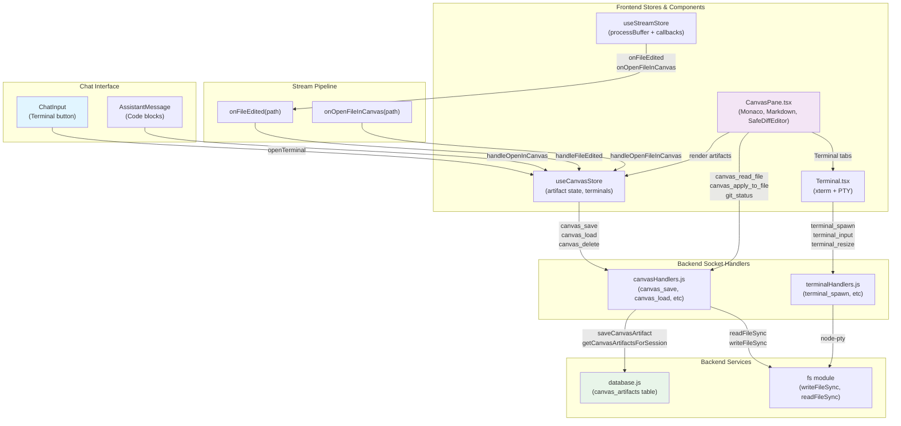

# Canvas System

The canvas is a right-side split-screen panel that displays code artifacts and terminal tabs. It provides a unified workspace for viewing, editing, and applying file changes alongside the chat interface. Artifacts are sourced from ACP tool outputs (file writes), manual file reads, or chat code blocks.

---

## Overview

### What It Does

- **Artifact Management** — Stores and displays multiple code/markdown/text files as tabs, each as a `CanvasArtifact` with id, title, content, language, and optional file path.
- **Multi-view Rendering** — Renders artifacts in three modes: code editor (Monaco), markdown preview (ReactMarkdown), or git diff (side-by-side SafeDiffEditor).
- **File Persistence** — Saves artifacts to SQLite per session; loads them on session switch or browser reload.
- **Git Integration** — Displays changed files (added/modified/deleted/untracked) from `git status`, allows clicking to open file and view git diff.
- **File-to-Disk** — Writes artifact content directly to the filesystem via `canvas_apply_to_file` with direct `fs.writeFileSync` call.
- **Session Scoping** — Canvas open/closed state is remembered per session in `canvasOpenBySession` map; terminals and artifacts are session-specific.
- **Terminal Hosting** — Shares the tab bar with terminal tabs (handled separately; see [Feature Doc] - Terminal in Canvas.md).
- **Auto-Plan Opening** — Automatically opens canvas when `plan.md` is created while waiting for a permission request.

### Why This Matters

- **Seamless Workflow** — Developers can write code in the chat, see it update in real-time in the canvas, and apply changes without leaving the UI.
- **Deduplication Logic** — Artifacts are merged by file path OR id to avoid duplicate tabs, but understanding the order of checks prevents unexpected behavior.
- **Error Boundary** — Monaco crashes on rapid session switches; error boundary per session ensures the crash doesn't kill the whole app.
- **Git-aware Editing** — Canvas integrates with the git workflow: view working tree changes, see diffs, apply to file, and track which files are watched.
- **Persistence Across Sessions** — Artifacts are persisted to the database so they survive browser reload.

---

## How It Works — End-to-End Flow

### Flow A: File Written by ACP Tool

1. **Tool Output Processing** — ACP daemon sends a `tool_call` or `tool_call_update` with a filePath field. This goes through acpUpdateHandler → useStreamStore.onStreamEvent (Function: `handleUpdate`, Lines: 16-283).

2. **processBuffer Detects Completion** — The frontend's useStreamStore.processBuffer loop (Function: `processBuffer`, Lines: 214-416) processes the tool step and checks if status === 'completed' && filePath exists.

3. **onFileEdited Callback** — processBuffer calls `onFileEdited(filePath)` (Line: 312), which is wired from useChatManager → App.tsx (Lines: 84-88).

4. **handleFileEdited Triggered** — The callback invokes `handleFileEdited(socket, editedFilePath)` in useCanvasStore (Function: `handleFileEdited`, Lines: 111-140).

5. **File Already in Artifacts** — handleFileEdited checks if the edited file matches any watched artifact's filePath (normalized path comparison, Line 119).

6. **Re-read File from Backend** — socket.emit('canvas_read_file', {filePath}) → backend canvasHandlers (Function: `registerCanvasHandlers`, Lines: 7-78) resolves the path, reads file content, infers language from extension.

7. **Artifact Updated** — The read artifact is merged into canvasArtifacts at the same artifact.id with updated content and `lastUpdated: Date.now()` (Lines: 125-138).

8. **Glow Animation** — The 3-second glow on the tab is driven by `lastUpdated` being recent (Line: 242).

### Flow B: plan.md Auto-Open

1. **plan.md Completion** — ACP tool writes plan.md → processBuffer detects status='completed' && filePath ends with 'plan.md'.

2. **onOpenFileInCanvas Callback** — processBuffer also calls `onOpenFileInCanvas(filePath)` (Line: frontend/src/store/useStreamStore.ts:303).

3. **handleOpenFileInCanvas Invoked** — App.tsx wires this callback (Line: frontend/src/App.tsx:87); it emits 'canvas_read_file' to the backend.

4. **Canvas Opens** — If `isAwaitingPermission` is true (permission request pending), App.tsx auto-sets `setIsCanvasOpen(true)` (Lines: frontend/src/App.tsx:145-156).

### Flow C: Code Block "Open in Canvas"

1. **Code Block Component** — User clicks "Open in Canvas" button in a code block message (ChatMessage.tsx Lines: ~44-70).

2. **handleOpenInCanvas Called** — Directly calls useCanvasStore.handleOpenInCanvas(socket, activeSessionId, {artifact object}) (frontend/src/components/ChatMessage.tsx:56-67).

3. **Deduplication Check** — handleOpenInCanvas checks if artifact already exists by filePath OR id (Lines: frontend/src/store/useCanvasStore.ts:75-78).

4. **New Artifact or Update** — If new, adds to canvasArtifacts and emits canvas_save; if exists, updates in-place and re-emits canvas_save (Lines: frontend/src/store/useCanvasStore.ts:80-99).

5. **DB Persistence** — Backend canvasHandlers.canvas_save persists the artifact to SQLite via `db.saveCanvasArtifact(artifact)` (Lines: backend/sockets/canvasHandlers.js:7-16).

### Flow D: Session Switch

1. **Active Session Changes** — useSessionLifecycleStore.activeSessionId changes (App.tsx Line: 103).

2. **Canvas State Saved** — Previous session's canvas open state is saved to `canvasOpenBySession[prevId]` (Lines: frontend/src/App.tsx:110-114).

3. **Artifacts Cleared** — canvasArtifacts and activeCanvasArtifact are reset to empty (Lines: frontend/src/App.tsx:120).

4. **canvas_load Emitted** — socket.emit('canvas_load', {sessionId: activeSessionId}) → backend getCanvasArtifactsForSession (Lines: backend/database.js:341-355).

5. **Artifacts Restored** — Backend returns all artifacts for the session, frontend populates canvasArtifacts (Lines: frontend/src/App.tsx:135-139).

6. **Canvas State Restored** — isCanvasOpen and activeCanvasArtifact are restored from canvasOpenBySession or set to false if no artifacts (Lines: frontend/src/App.tsx:118-121).

### Flow E: Git File Selection

1. **Git Panel Visible** — CanvasPane fetches git_status on mount (Lines: frontend/src/components/CanvasPane/CanvasPane.tsx:143-149) and when artifacts update.

2. **User Clicks Git File** — handleOpenGitFile invoked with the changed file path (Line: 157).

3. **File Read & Diff Fetch** — Emits canvas_read_file to get modified content; emits git_show_head to get HEAD version (Lines: 158-175).

4. **Diff View Activated** — Sets viewMode='diff', gitOriginal populated, SafeDiffEditor mounts showing side-by-side comparison (Lines: 339-346).

---

## Architecture Diagram



---

## The Critical Contract: CanvasArtifact

Every canvas artifact must conform to this shape:

```typescript
interface CanvasArtifact {
  id: string;                    // Unique identifier, often `canvas-${Date.now()}` or `canvas-fs-${Date.now()}`
  sessionId: string;             // UI session ID (foreign key to sessions table)
  title: string;                 // Display name in tab (e.g., "test.js" or "JavaScript snippet")
  content: string;               // Full file/code content
  language: string;              // Language for syntax highlighting (js, ts, python, markdown, etc.)
  version: number;               // Version number (always 1 for now, reserved for future versioning)
  filePath?: string;             // Optional: absolute or relative path on disk (e.g., "/home/user/src/main.js")
  createdAt?: string;            // Optional: ISO timestamp (set by DB)
  lastUpdated?: number;          // Optional: JavaScript timestamp (milliseconds), used to drive 3-second glow animation
}
```

### Deduplication Logic

When adding or updating an artifact:

1. **Check by filePath** — If filePath is provided and matches an existing artifact's filePath (case-insensitive, normalized), **update that artifact** (reuse its id).
2. **Check by id** — If filePath is not provided, check if an artifact with the same id exists. If yes, **update it**.
3. **Add New** — If neither filePath nor id match any existing artifact, **add a new entry** to canvasArtifacts.

**Note:** Because deduplication is by filePath OR id (not AND), it's possible to have multiple artifacts pointing to the same file if their ids differ. This is intentional and allows comparing versions.

---

## Data Flow: Raw → Normalized → Rendered

### Stage 1: Raw ACP Output

```typescript
// From ACP daemon: tool_call with status='completed'
{
  type: 'tool_call',
  id: 'tc-123',
  name: 'write_file',
  status: 'completed',
  filePath: '/home/user/project/src/app.js',
  // output omitted
}
```

### Stage 2: Normalized by Backend

```javascript
// FILE: backend/sockets/canvasHandlers.js (Lines 52-78)
socket.on('canvas_read_file', async ({ filePath }, callback) => {
  const resolvedPath = path.resolve(filePath);
  const finalPath = fs.existsSync(resolvedPath) ? fs.realpathSync(resolvedPath) : resolvedPath;
  const content = fs.readFileSync(finalPath, 'utf8');
  const language = path.extname(finalPath).slice(1) || 'text';  // Extract from extension
  const title = path.basename(finalPath);
  callback({
    artifact: {
      id: `canvas-fs-${Date.now()}`,
      title,
      content,
      language,
      filePath: finalPath,
      version: 1
    }
  });
});
```

### Stage 3: Stored in Frontend Store

```typescript
// FILE: frontend/src/store/useCanvasStore.ts (Lines 67-100)
const artifact = {
  id: 'canvas-fs-1234567890',
  sessionId: 'sess-abc123',
  title: 'app.js',
  content: '// JavaScript code...',
  language: 'javascript',
  version: 1,
  filePath: '/home/user/project/src/app.js',
  lastUpdated: 1640000000000
};

// Stored in canvasArtifacts array and activeCanvasArtifact
```

### Stage 4: Rendered in CanvasPane

```typescript
// FILE: frontend/src/components/CanvasPane/CanvasPane.tsx (Lines 347-368)
// Based on language and viewMode, choose renderer
<Editor
  height="100%"
  language={getMonacoLanguage(activeArtifact.language, activeArtifact.filePath)}
  theme="vs-dark"
  value={content}
  onChange={(value) => setContent(value || '')}
/>
```

---

## Configuration / Provider-Specific Behavior

The canvas system is provider-agnostic. All artifacts are stored uniformly regardless of which provider created them. Providers do not need special configuration to support canvas artifacts.

**However**, if a provider wants to optimize tool output handling:

- Ensure tool outputs include a `filePath` field if the tool writes a file (ACP standard).
- The backend will automatically infer language from the file extension.
- If a provider emits a custom `filePath` shape or encoding, it should be normalized in the provider's `index.js` before reaching the backend handlers.

---

## Component Reference

### Backend Files

| File | Key Functions | Lines | Purpose |
|------|---|---|---|
| `backend/sockets/canvasHandlers.js` | registerCanvasHandlers | 6-79 | Socket event handlers for canvas operations |
| ↳ | canvas_save | 7-16 | Persist artifact to DB |
| ↳ | canvas_load | 18-27 | Load artifacts for a session |
| ↳ | canvas_delete | 29-38 | Delete artifact by id |
| ↳ | canvas_read_file | 52-78 | Read file from disk and return as artifact |
| ↳ | canvas_apply_to_file | 40-50 | Write artifact content to disk |
| `backend/database.js` | saveCanvasArtifact | 320-340 | INSERT OR REPLACE into canvas_artifacts table |
| ↳ | getCanvasArtifactsForSession | 341-355 | SELECT all artifacts for a session, ordered by created_at DESC |
| ↳ | deleteCanvasArtifact | 357-368 | DELETE artifact by id |
| ↳ | initDb | ~74-92 | CREATE TABLE canvas_artifacts schema |

### Frontend Stores

| File | Key Functions | Lines | Purpose |
|------|---|---|---|
| `frontend/src/store/useCanvasStore.ts` | useCanvasStore | 31-169 | Zustand store for canvas state |
| ↳ | setIsCanvasOpen | 39 | Toggle canvas visibility |
| ↳ | setCanvasArtifacts | 40 | Replace all artifacts |
| ↳ | setActiveCanvasArtifact | 41 | Select active artifact |
| ↳ | handleOpenInCanvas | 67-100 | Add/update artifact with deduplication |
| ↳ | handleOpenFileInCanvas | 102-111 | Read file from backend and add to canvas |
| ↳ | handleFileEdited | 113-142 | Re-read edited file and update artifact |
| ↳ | handleCloseArtifact | 144-168 | Remove artifact and update canvas visibility |

### Frontend Components

| File | Key Components/Hooks | Lines | Purpose |
|------|---|---|---|
| `frontend/src/components/CanvasPane/CanvasPane.tsx` | CanvasPane | 99-382 | Main canvas panel with editor, diff, preview, and git panel |
| ↳ | SafeDiffEditor | 53-97 | Monaco diff editor (side-by-side) |
| ↳ | getMonacoLanguage | 24-51 | Map language string to Monaco language id |
| `frontend/src/App.tsx` | App | ~195-251 | Hosts CanvasPane in split-screen layout, handles canvas resize |
| ↳ | ErrorBoundary | ~34-49 | Catches Monaco crashes per session |
| `frontend/src/hooks/useChatManager.ts` | useChatManager | 23-428 | Wires onFileEdited and onOpenFileInCanvas callbacks |
| `frontend/src/store/useStreamStore.ts` | processBuffer | 199-402 | Detects tool completions and calls onFileEdited/onOpenFileInCanvas |
| `frontend/src/utils/canvasHelpers.ts` | isFileChanged | 6-13 | Check if file is in git changed list (normalized paths) |
| ↳ | buildFullPath | 15-17 | Build absolute path from cwd + relative path |
| `frontend/src/utils/resizeHelper.ts` | computeResizeWidth | 6-14 | Calculate chat pane width during drag resize (min 300px, max based on window size) |

### Database

| Table | Columns | Purpose |
|---|---|---|
| `canvas_artifacts` | id (PK), session_id (FK), title, content, language, version, file_path, created_at | Persists artifacts per session |

---

## Gotchas & Important Notes

1. **Monaco Crashes on Fast Session Switches**
   - **What:** Rapid switching between sessions can cause Monaco Editor to throw internal errors if it's mid-render.
   - **Why:** Monaco isn't fully unmounted between session changes; if state updates before DOM cleanup, exceptions propagate.
   - **Fix:** ErrorBoundary wraps CanvasPane per-session key (App.tsx Line 235); any crash resets canvas state via resetCanvas() instead of crashing the app.

2. **SafeDiffEditor Requires Non-Null gitOriginal**
   - **What:** If gitOriginal is null when SafeDiffEditor mounts, it silently fails to initialize.
   - **Why:** The guard `gitOriginal !== null` at CanvasPane.tsx:339 prevents mounting until git_show_head callback returns.
   - **Gotcha:** Rapid clicks on git files can cause multiple requests; the artifact id check (Line 173) prevents stale data from overwriting newer artifacts.

3. **Session Switch Clears All Canvas State**
   - **What:** Switching sessions resets canvasArtifacts, activeCanvasArtifact, and activeTerminalId.
   - **Why:** Each session has its own set of artifacts; the previous session's state is saved and the new session's state is loaded from DB.
   - **Gotcha:** Don't hold artifact references outside useCanvasStore; they're cleared on every session switch.

4. **Deduplication by FilePath OR ID (Not Both)**
   - **What:** Two artifacts can coexist if they differ on BOTH filePath and id.
   - **Why:** The deduplication check is: if filePath matches, update; else if id matches, update; else add new.
   - **Gotcha:** This allows multiple versions of the same file open simultaneously if id differs, which can be confusing.

5. **canvas_delete is Immediate, No Confirmation**
   - **What:** Clicking the ✕ button on a tab calls canvas_delete immediately; the artifact is removed from the store and DB without prompting.
   - **Why:** Artifact deletion is a lightweight operation; there's no recovery mechanism in the current design.
   - **Gotcha:** Users can't undo accidental closes. Consider adding a confirmation modal if this becomes a UX issue.

6. **Language Inference from File Extension (Backend)**
   - **What:** If a tool output doesn't provide a language, the backend infers it from file extension.
   - **Why:** Most ACP tools don't emit a language hint; extension is the fallback.
   - **Gotcha:** Unknown extensions default to 'text'; Monaco will treat them as plaintext. Provide explicit language hints if extension-based inference fails.

7. **canvasOpenBySession is In-Memory Only**
   - **What:** The canvas open/closed state per session is stored in canvasOpenBySession (Map in store), not persisted to DB.
   - **Why:** Canvas state is transient UI state; sessions are persisted, but their canvas visibility preference is not.
   - **Gotcha:** On browser reload, all sessions start with canvas closed (unless they have active terminals or loaded artifacts trigger auto-open).

8. **computeResizeWidth Enforces Hard Limits**
   - **What:** Min chat width is 300px; max is (window.innerWidth − sidebar − 400px).
   - **Why:** Minimum ensures the editor is usable; maximum prevents the canvas from disappearing.
   - **Gotcha:** On very narrow windows (<700px), canvas width becomes constrained. The resize handle will stop at the max width.

9. **Plan Auto-Open Only When isAwaitingPermission**
   - **What:** plan.md auto-opens canvas only if activeSession.isAwaitingPermission is true.
   - **Why:** Auto-opening the canvas on every plan.md creation would be noisy; limiting it to permission waits ensures relevance.
   - **Gotcha:** If plan.md is created while NOT awaiting a permission, canvas won't auto-open. Users must click the terminal button or manually open canvas.

10. **Artifact Deduplication Can Hide Concurrent Edits**
    - **What:** If two tool calls write the same file path simultaneously, the second one updates the first (same artifact id).
    - **Why:** Artifacts are merged by filePath, so concurrent writes to the same file are collapsed into one artifact.
    - **Gotcha:** If you need to compare two versions of the same file side-by-side, manually add one as a new artifact with a different id (e.g., via the code block "Open in Canvas" button with different content).

---

## Unit Tests

### Backend Tests

- **File:** `backend/test/canvasHandlers.test.js`
  - `canvas_save saves artifact to DB` — Verifies that canvas_save emits success and calls db.saveCanvasArtifact (Line ~40)
  - `canvas_load returns artifacts` — Verifies that canvas_load calls db.getCanvasArtifactsForSession and returns artifacts (Line ~51)
  - `canvas_delete removes artifact` — Verifies that canvas_delete calls db.deleteCanvasArtifact (Line ~61)
  - `canvas_read_file returns file content` — Verifies that canvas_read_file reads a file, infers language, and returns a CanvasArtifact (Line ~71)
  - `canvas_apply_to_file writes content` — Verifies that canvas_apply_to_file calls fs.writeFileSync (Line ~83)
  - Error cases: missing filePath, file not found, etc. (Lines ~92+)

### Frontend Tests

- **File:** `frontend/src/test/useCanvasStore.test.ts`
  - `handleOpenInCanvas adds new artifact or updates existing` — Verifies deduplication by id and filePath (Line ~68)
  - `handleFileEdited updates artifact on file change` — Verifies that file edits are detected and artifact is refreshed (Line ~90+)
  - `handleCloseArtifact removes artifact` — Verifies that closing an artifact removes it and adjusts active artifact (Line ~100+)
  - Terminal tests: openTerminal, closeTerminal, session scoping (Line ~110+)

- **File:** `frontend/src/test/CanvasPane.test.tsx`
  - `renders placeholder when activeArtifact is null` — Empty state (Line ~26)
  - `renders artifact title and content correctly` — Monaco editor receives artifact data (Line ~31)
  - `calls onClose when close button is clicked` — Close button works (Line ~44)
  - `emits canvas_apply_to_file when Apply is clicked if filePath exists` — Apply button calls socket.emit (Line ~57)
  - Git panel tests: git_status, git_show_head (Lines ~65+)
  - Diff view tests: SafeDiffEditor mounts with gitOriginal (Lines ~75+)

- **File:** `frontend/src/test/canvasHelpers.test.ts`
  - `isFileChanged detects file in git changed list` — Path normalization (Line ~15)
  - `buildFullPath constructs full path` — Path joining (Line ~25)

- **File:** `frontend/src/test/ChatMessage.test.tsx`
  - `code block shows Canvas button when canvas is open` — Code block "Open in Canvas" button appears and calls handleOpenInCanvas (Line ~485)

---

## How to Use This Guide

### For Implementing Canvas Features

1. **Read this entire doc** to understand the artifact lifecycle and deduplication logic.
2. **Study the data flow diagrams** to know where events come from and where they go.
3. **Reference the component table** for exact line numbers when reading code.
4. **Check the gotchas** before implementing your feature — they highlight common pitfalls.
5. **Write tests** in the same test files listed above; add new test cases for your feature.
6. **Update BOOTSTRAP.md** if you're adding a new system or significantly changing the architecture.

### For Debugging Canvas Issues

1. **Check the logs** — Backend logs appear in the configured `LOG_FILE_PATH` (`.env`), frontend logs appear in browser console.
2. **Verify database state** — Open `persistence.db` in a SQLite viewer and query `SELECT * FROM canvas_artifacts WHERE session_id = 'xxx'` to see what the backend has persisted.
3. **Use browser DevTools** — Check the Redux/Zustand store (React DevTools) to inspect `useCanvasStore` state in real-time.
4. **Trace socket events** — Use browser DevTools Network tab (filter for WebSocket) to see Socket.IO messages: `canvas_save`, `canvas_load`, `canvas_read_file`, etc.
5. **Monaco errors** — If canvas content doesn't render, check browser console for Monaco initialization errors; look for the ErrorBoundary reset in the logs.
6. **File path issues** — If canvas_read_file fails, verify the file path is absolute and the file exists; check that `fs.existsSync` passes on the backend.

---

## Summary

The canvas system is a multi-layered artifact management system that bridges the chat UI with a split-screen code editor:

- **Frontend store** (useCanvasStore) maintains in-memory artifact state and deduplication logic.
- **Backend handlers** (canvasHandlers.js) persist artifacts to SQLite and manage file I/O.
- **CanvasPane component** renders artifacts in three modes (code, diff, preview) and provides git integration.
- **ErrorBoundary** isolates Monaco crashes per session to prevent full app failure.
- **Session-scoped lifecycle** saves and restores canvas state on session switch.
- **Critical contract** is the CanvasArtifact shape; all code must conform to it.
- **Deduplication** by filePath OR id prevents duplicate tabs but allows intentional multi-version viewing.
- **Gotchas** span Monaco crashes, SafeDiffEditor initialization, in-memory state, and timing issues.

With this doc, an agent should be able to add features (new rendering modes, additional tool output handling), debug issues (missing artifacts, render failures), or extend the system (custom artifact types, provider-specific behavior) with confidence.
