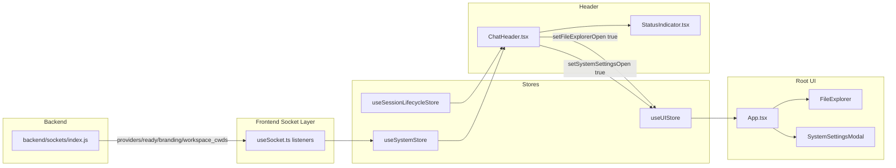

# Feature Doc — Chat Header

The Chat Header is the top control bar for an active session. It renders live connection state, session identity, and lightweight global controls while staying provider-agnostic.

This area is easy to break because it combines data from multiple stores (`session`, `system`, `ui`) and changes behavior in pop-out mode based on URL query params.

## Overview

### What It Does
- Renders socket/runtime status via `StatusIndicator` (`Disconnected`, `Warming up...`, `Engine Ready`).
- Resolves and displays active session identity with provider label and optional sub-agent suffix.
- Resolves `cwd` display labels from workspace metadata.
- Uses provider branding fallback (`appHeader`) when no active session exists.
- Shows/hides menu and action controls based on pop-out mode.
- Triggers UI state for sidebar open, file explorer open, and system settings open.

### Why This Matters
- It is the highest-visibility status surface in the chat UI.
- It enforces provider-agnostic naming by using provider payload data, not hardcoded labels.
- It prevents split-window ownership conflicts by hiding controls in pop-out windows.
- It connects backend boot payloads to visible user state with no additional requests.
- It is a frequent regression point when store shapes or URL behavior change.

Architectural role: frontend rendering component with backend-fed state dependencies (`both`, but logic is frontend-owned).

## How It Works — End-to-End Flow

1. Backend emits provider/runtime bootstrap payloads on socket connect.

```javascript
// FILE: backend/sockets/index.js (Lines 58-61, 67, 74, 76)
socket.emit('providers', {            // LINE 58
  defaultProviderId,                  // LINE 59
  providers: providerPayloads         // LINE 60
});
socket.emit('ready', { providerId: runtime.providerId, message: 'Ready to help ⚡', bootId: runtime.client.serverBootId }); // LINE 67
socket.emit('workspace_cwds', { cwds: loadWorkspaces() }); // LINE 74
socket.emit('branding', provider.branding);                // LINE 76
```

2. `useSocket` listeners normalize those events into `useSystemStore`.

```typescript
// FILE: frontend/src/hooks/useSocket.ts (Lines 31-35, 40-45, 47-50)
_socket.on('ready', (data: { bootId: string }) => {                  // LINE 31
  const providerId = (data as { providerId?: string }).providerId;   // LINE 32
  if (providerId) useSystemStore.getState().setProviderReady(providerId, true); // LINE 33
  else useSystemStore.getState().setIsEngineReady(true);             // LINE 34
});
_socket.on('workspace_cwds', (data) => { useSystemStore.getState().setWorkspaceCwds(data.cwds); }); // LINE 40-41
_socket.on('providers', (data) => { useSystemStore.getState().setProviders(data.defaultProviderId || null, data.providers || []); }); // LINE 43-44
_socket.on('branding', (data: any) => {                               // LINE 47
  if (data.providerId) useSystemStore.getState().setProviderBranding(data); // LINE 48-49
});
```

3. `ChatHeader` pulls session identity from `useSessionLifecycleStore`.

```typescript
// FILE: frontend/src/components/ChatHeader/ChatHeader.tsx (Lines 10, 16, 20)
const { sessions, activeSessionId } = useSessionLifecycleStore(); // LINE 10
const activeSession = sessions.find(s => s.id === activeSessionId); // LINE 16
const activeSessionName = activeSession?.name;                      // LINE 20
```

4. It resolves provider-specific display values through `useSystemStore` indirection.

```typescript
// FILE: frontend/src/components/ChatHeader/ChatHeader.tsx (Lines 17-19)
const branding = useSystemStore(state => state.getBranding(activeSession?.provider)); // LINE 17
const providerSummary = useSystemStore(state => activeSession?.provider ? state.providersById[activeSession.provider] : undefined); // LINE 18
const providerName = providerSummary?.branding?.title || providerSummary?.label || activeSession?.provider || ''; // LINE 19
```

5. It resolves optional workspace `cwd` label by matching the session path.

```typescript
// FILE: frontend/src/components/ChatHeader/ChatHeader.tsx (Lines 23-25)
const cwdLabel = activeSession?.cwd                                      // LINE 23
  ? useSystemStore.getState().workspaceCwds.find(w => w.path === activeSession.cwd)?.label || null // LINE 24
  : null;                                                                 // LINE 25
```

6. It gates UI behavior for detached windows (`?popout=...`).

```typescript
// FILE: frontend/src/components/ChatHeader/ChatHeader.tsx (Lines 21, 30, 53)
const isPopout = new URLSearchParams(window.location.search).has('popout'); // LINE 21
{!isPopout && ( /* Open Sidebar button */ )}                                // LINE 30
{!isPopout && ( /* Header actions block */ )}                               // LINE 53
```

7. It renders connection/engine status and title/fallback text.

```tsx
// FILE: frontend/src/components/ChatHeader/ChatHeader.tsx (Lines 28, 35, 40-48)
<header className={`header ${!connected ? 'disconnected' : ''}`}>  {/* LINE 28 */}
  <StatusIndicator connected={connected} isEngineReady={isEngineReady} /> {/* LINE 35 */}
  {activeSessionName ? (                                              // LINE 40
    <span className="header-session-name">
      {providerName && `${providerName}${activeSession?.isSubAgent ? ' Subagent' : ''}: `} {/* LINE 42 */}
      {activeSessionName}
      {cwdLabel && <span className="header-cwd-label"> ({cwdLabel})</span>} {/* LINE 44 */}
    </span>
  ) : (
    <span className="header-mobile-fallback">{branding.appHeader}</span> {/* LINE 47 */}
  )}
</header>
```

8. Action buttons only dispatch UI toggles; modal internals are owned by separate systems.

```tsx
// FILE: frontend/src/components/ChatHeader/ChatHeader.tsx (Lines 56, 63)
onClick={() => useUIStore.getState().setFileExplorerOpen(true)}   // LINE 56
onClick={() => useUIStore.getState().setSystemSettingsOpen(true)} // LINE 63
```

The actual File Explorer and System Settings workflows are documented in:
- `documents/[Feature Doc] - File Explorer.md`
- `documents/[Feature Doc] - System Settings Modal.md`

9. Root app renders the corresponding modal components once; header only flips booleans.

```tsx
// FILE: frontend/src/App.tsx (Lines 248-250)
<SystemSettingsModal /> // LINE 248
<NotesModal />          // LINE 249
<FileExplorer />        // LINE 250
```

10. Pop-out app still renders `ChatHeader`, but header self-suppresses controls by URL check.

```tsx
// FILE: frontend/src/PopOutApp.tsx (Lines 26, 110)
const popoutSessionId = new URLSearchParams(window.location.search).get('popout')!; // LINE 26
<ChatHeader /> // LINE 110
```

## Architecture Diagram



Data flow from backend connect payloads to Zustand stores and then to header rendering + UI toggle dispatch.

## The Critical Contract / Key Concept

The header depends on a three-store contract:

```typescript
// FILE: frontend/src/types.ts (Lines 158-171, 278-301)
interface ProviderSummary {
  providerId: string;    // Required identity key
  label?: string;        // Display name used by ChatHeader
  branding: ProviderBranding;
}

interface WorkspaceCwd {
  label: string;         // Display label shown as "(label)" in header
  path: string;          // Must match ChatSession.cwd exactly
}

interface ChatSession {
  id: string;
  name: string;
  provider?: string | null;
  cwd?: string | null;
  isSubAgent?: boolean;
}
```

If this contract is violated:
- Missing/incorrect `provider` or `providersById` mapping causes blank or fallback provider names.
- `cwd` path mismatch causes workspace label disappearance.
- Missing `appHeader` branding causes empty fallback title when no active session.
- URL pop-out param mismatches can expose controls in detached windows.

## Configuration / Provider-Specific Behavior

This feature is provider-agnostic. Provider behavior surfaces only through generic payload fields.

- A provider must expose branding via the backend `branding` payload (`assistantName`, `appHeader`, optional `title`, etc.).
- A provider should be included in `providers` payload with a stable `providerId` and optional human label.
- Header text uses `providerSummary.branding.title` first, then `providerSummary.label`, then `session.provider`, and never hardcodes provider names.
- Header does not implement provider config itself; it reads resolved system state only.

## Data Flow / Rendering Pipeline

Raw socket data:

```json
{
  "event": "providers",
  "defaultProviderId": "provider-a",
  "providers": [
    {
      "providerId": "provider-a",
      "label": "Provider A",
      "branding": { "appHeader": "Provider A UI" }
    }
  ]
}
```

Normalized store state:

```typescript
{
  providersById: {
    "provider-a": {
      providerId: "provider-a",
      label: "Provider A",
      branding: { appHeader: "Provider A UI", ... }
    }
  },
  workspaceCwds: [{ label: "Repo", path: "D:\\repo" }],
  connected: true,
  isEngineReady: true
}
```

Rendered header output:

```text
[status-dot: ready] Engine Ready | Provider A: Session Name (Repo)
```

Control dispatch (no side effects in header):

```typescript
setSidebarOpen(true)
setFileExplorerOpen(true)
setSystemSettingsOpen(true)
```

## Component Reference

### Frontend

| File | Key Functions / Symbols | Exact Lines | Purpose |
|---|---|---:|---|
| `frontend/src/components/ChatHeader/ChatHeader.tsx` | `ChatHeader`, `isPopout`, button handlers | 9-75 | Main header render + control dispatch |
| `frontend/src/components/ChatHeader/ChatHeader.css` | `.header`, `.disconnected`, `.header-session-name`, `.mobile-header-menu-btn` | 1-240 | Visual states, responsive behavior, disconnected styling |
| `frontend/src/components/Status/StatusIndicator.tsx` | `StatusIndicator` | 4-15 | Connection and engine text/dot state |
| `frontend/src/hooks/useSocket.ts` | `'ready'`, `'workspace_cwds'`, `'providers'`, `'branding'` listeners | 31-45, 47-56 | Hydrates store state consumed by header |
| `frontend/src/store/useSystemStore.ts` | `setProviders`, `setProviderBranding`, `setWorkspaceCwds`, `getBranding` | 114-147, 174, 178-184 | Provider/session display metadata source |
| `frontend/src/store/useUIStore.ts` | `setSidebarOpen`, `setSystemSettingsOpen`, `setFileExplorerOpen` | 65, 82, 84 | UI action state toggles |
| `frontend/src/store/useSessionLifecycleStore.ts` | `sessions`, `activeSessionId` | 35-37, 64-67 | Session selection source |
| `frontend/src/App.tsx` | `<ChatHeader />`, `<SystemSettingsModal />`, `<FileExplorer />` | 218, 248-250 | Root composition and modal mounting |
| `frontend/src/PopOutApp.tsx` | `popoutSessionId`, `<ChatHeader />` | 26, 110 | Detached-window context where header hides controls |

### Backend

| File | Key Functions / Symbols | Exact Lines | Purpose |
|---|---|---:|---|
| `backend/sockets/index.js` | `socket.emit('providers'/'ready'/'workspace_cwds'/'branding')` | 58-61, 67, 74, 76 | Seeds header-facing frontend state at connect time |

### Tests

| File | Coverage Focus | Exact Lines |
|---|---|---:|
| `frontend/src/test/ChatHeader.test.tsx` | Session name rendering, fallback title, pop-out control hiding, settings/explorer button behavior | 31-72 |
| `frontend/src/test/App.test.tsx` | Integration presence via mocked header | 16, 80-84 |
| `frontend/src/test/PopOutApp.test.tsx` | Pop-out integration presence via mocked header | 30, 92-112 |

## Gotchas & Important Notes

1. Pop-out detection is URL-based, not app-state-based.
   - What breaks: controls appear when they should be hidden if query handling changes.
   - Why: `new URLSearchParams(window.location.search).has('popout')` drives gating.
   - Avoid: preserve `popout` query contract for detached windows.

2. Header action buttons call store singletons (`useUIStore.getState()`), not captured hook actions.
   - What breaks: stale closures are less likely, but test mocks that only patch hook return values can miss this path.
   - Avoid: in tests, assert against store state mutation directly (as current tests do).

3. `cwdLabel` path match is exact-string equality.
   - What breaks: label disappears when path casing or slash style diverges.
   - Avoid: keep backend-emitted `cwd` paths normalized to same format as session `cwd`.

4. Provider display-name fallback chain matters.
   - What breaks: empty provider prefix or unexpected raw IDs shown.
   - Why: header uses `providerSummary.branding.title || providerSummary.label || activeSession.provider || ''`.
   - Avoid: ensure providers payload includes `branding.title` (preferred) and `label` (fallback).

5. Branding fallback only appears when no active session name.
   - What breaks: blank-looking title if `branding.appHeader` is missing.
   - Avoid: guarantee `appHeader` in provider branding contract.

6. Disconnected styling affects multiple nested controls.
   - What breaks: unreadable text/icons if new classes are added but not included in disconnected selectors.
   - Avoid: include new header control classes in `.header.disconnected ...` cascade.

7. Header is mounted in both normal and pop-out roots.
   - What breaks: mode-specific assumptions if code only tested in `App.tsx`.
   - Avoid: validate both `App.tsx` and `PopOutApp.tsx` render paths.

8. File Explorer and System Settings are intentionally shallow here.
   - What breaks: duplicate logic and drift if header starts managing modal internals.
   - Avoid: keep header limited to boolean toggles; extend behavior in their own feature areas.

## Unit Tests

Backend:
- None specific to header behavior (header is frontend-rendered).

Frontend:
- `frontend/src/test/ChatHeader.test.tsx`
  - `renders session name correctly`
  - `handles "System Settings" button click`
  - `handles "File Explorer" button click`
  - `renders app header fallback if no active session`
  - `hides sidebar menu and action buttons in pop-out mode`

Integration:
- `frontend/src/test/App.test.tsx` (header presence in main app composition via mock).
- `frontend/src/test/PopOutApp.test.tsx` (header presence in detached window composition via mock).

## How to Use This Guide

### For implementing/extending this feature
1. Start in `ChatHeader.tsx` and preserve the three-store dependency model.
2. Validate any new control against pop-out gating (`!isPopout`).
3. If adding header text fields, source from `useSystemStore`/payload-driven data only.
4. Add/update `ChatHeader.test.tsx` for the new rendering and click paths.
5. If you add backend payload requirements, update `backend/sockets/index.js` docs/tests accordingly.

### For debugging issues with this feature
1. Confirm socket listeners fired: `providers`, `ready`, `branding`, `workspace_cwds`.
2. Inspect `useSystemStore` state (`providersById`, `workspaceCwds`, `connected`, `isEngineReady`).
3. Inspect `useSessionLifecycleStore` (`activeSessionId`, matching session object).
4. Reproduce with and without `?popout=<sessionId>` in URL.
5. Check CSS disconnected overrides and truncation styles for visual regressions.

## Summary

- Chat Header is a provider-agnostic status + identity + control strip.
- It composes state from `useSessionLifecycleStore`, `useSystemStore`, and `useUIStore`.
- Backend connect events seed all visible header metadata.
- Pop-out mode is URL-param driven and suppresses sidebar/action controls.
- File Explorer/System Settings interactions are toggle-only here by design.
- The key contract is consistent session/provider/workspace shape across socket payloads and stores.
- Most breakages come from store shape drift, path mismatch, or pop-out query regressions.
