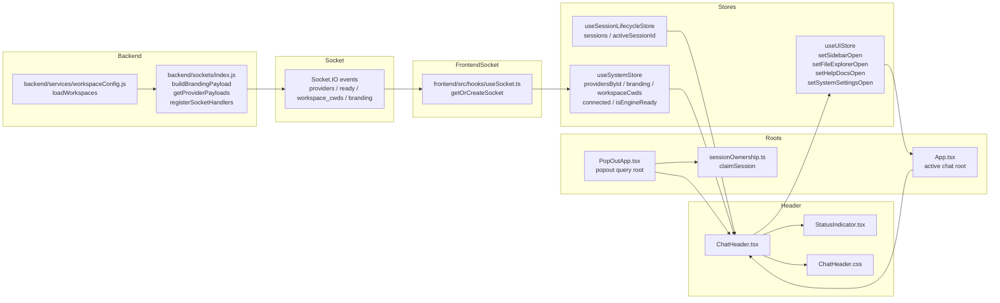

# Feature Doc - Chat Header

The Chat Header is the top control bar rendered above an active chat surface. It displays connection readiness, session identity, provider-derived branding, workspace context, and shallow global controls while keeping provider identity payload-driven.

This feature is easy to regress because it composes state from `useSessionLifecycleStore`, `useSystemStore`, and `useUIStore`, and the same component renders in the main app and the pop-out app with different control visibility.

## Overview

### What It Does
- Renders socket and engine readiness through `StatusIndicator`.
- Resolves the active `ChatSession` from `useSessionLifecycleStore.sessions` and `useSessionLifecycleStore.activeSessionId`.
- Builds the session title from provider metadata, optional sub-agent suffix, session name, and optional workspace label.
- Uses `useSystemStore.getBranding(activeSession?.provider)` for fallback header branding when the component is mounted without an active session name.
- Suppresses sidebar, file explorer, help docs, and system settings controls when `window.location.search` contains the `popout` query key.
- Dispatches only shallow UI actions: `setSidebarOpen(true)`, `setFileExplorerOpen(true)`, `setHelpDocsOpen(true)`, and `setSystemSettingsOpen(true)`.
- Relies on socket-hydrated provider, branding, readiness, and workspace state rather than hardcoded provider labels.

### Why This Matters
- It is a visible readiness and identity surface for every chat view.
- It is the main UI merge point for provider metadata and session metadata.
- It depends on store shapes shared with socket hydration, session lifecycle, sidebar provider selection, and pop-out ownership.
- It keeps detached chat windows focused by hiding controls that belong to the main app shell.
- Small changes to provider payloads, store defaults, URL query keys, or session path formatting appear in the header immediately.

Architectural role: frontend rendering component with backend-fed state dependencies.

## How It Works - End-to-End Flow

1. Backend builds provider metadata for socket hydration.

```javascript
// FILE: backend/sockets/index.js (Functions: buildBrandingPayload, getProviderPayloads)
function buildBrandingPayload(providerId) {
  const provider = getProvider(providerId);
  const providerConfig = provider.config;
  return {
    providerId,
    ...providerConfig.branding,
    title: providerConfig.title,
    models: providerConfig.models,
    defaultModel: providerConfig.models?.default,
    protocolPrefix: providerConfig.protocolPrefix,
    supportsAgentSwitching: providerConfig.supportsAgentSwitching ?? false
  };
}

function getProviderPayloads() {
  const defaultProviderId = getDefaultProviderId();
  return getProviderEntries().map(entry => ({
    providerId: entry.id,
    label: entry.label,
    default: entry.id === defaultProviderId,
    ready: providerRuntimeManager.getRuntimes().find(runtime => runtime.providerId === entry.id)?.client.isHandshakeComplete === true,
    branding: buildBrandingPayload(entry.id)
  }));
}
```

The header uses `ProviderSummary.branding.title`, `ProviderSummary.label`, `ProviderSummary.ready`, and `ProviderSummary.branding.appHeader`. The provider payloads are constructed in one backend location and then consumed generically by the frontend.

2. Backend emits the header-facing socket events during connection.

```javascript
// FILE: backend/sockets/index.js (Function: registerSocketHandlers, Socket events: providers, ready, workspace_cwds, branding)
io.on('connection', (socket) => {
  const defaultProviderId = getDefaultProviderId();
  const providerPayloads = getProviderPayloads();

  socket.emit('providers', { defaultProviderId, providers: providerPayloads });

  for (const runtime of providerRuntimeManager.getRuntimes()) {
    if (runtime.client.isHandshakeComplete) {
      socket.emit('ready', { providerId: runtime.providerId, bootId: runtime.client.serverBootId });
    }
  }

  socket.emit('workspace_cwds', { cwds: loadWorkspaces() });
  for (const provider of providerPayloads) {
    socket.emit('branding', provider.branding);
  }
});
```

`providers` gives the catalog and active/default provider basis. `ready` updates provider readiness. `workspace_cwds` supplies path-to-label mappings. `branding` is emitted once per provider with a `providerId`.

3. `useSocket` creates the singleton Socket.IO client and hydrates `useSystemStore`.

```typescript
// FILE: frontend/src/hooks/useSocket.ts (Function: getOrCreateSocket, Socket listeners: connect, ready, workspace_cwds, providers, branding)
_socket.on('connect', () => {
  useSystemStore.getState().setConnected(true);
});

_socket.on('ready', (data: { bootId: string }) => {
  const providerId = (data as { providerId?: string }).providerId;
  if (providerId) useSystemStore.getState().setProviderReady(providerId, true);
  else useSystemStore.getState().setIsEngineReady(true);
  useSystemStore.getState().setBackendBootId(data.bootId);
});

_socket.on('workspace_cwds', (data: { cwds: WorkspaceCwd[] }) => {
  useSystemStore.getState().setWorkspaceCwds(data.cwds);
});

_socket.on('providers', (data: { defaultProviderId?: string | null; providers?: ProviderSummary[] }) => {
  useSystemStore.getState().setProviders(data.defaultProviderId || null, data.providers || []);
});

_socket.on('branding', (data: any) => {
  if (data.providerId) useSystemStore.getState().setProviderBranding(data);
  else useSystemStore.setState({ branding: data });
  const activeBranding = useSystemStore.getState().branding;
  document.title = activeBranding.title || activeBranding.assistantName || 'ACP UI';
});
```

The header does not subscribe to socket events directly. It reads the normalized store state produced by these listeners.

4. `useSystemStore` maintains the provider and readiness state consumed by the header.

```typescript
// FILE: frontend/src/store/useSystemStore.ts (Store actions: setProviders, setProviderReady, setProviderBranding, getBranding)
setProviders: (defaultProviderId, providers) => set(state => {
  const providersById = Object.fromEntries(providers.map(provider => [provider.providerId, provider]));
  const nextActiveProviderId = state.activeProviderId || defaultProviderId || providers[0]?.providerId || null;
  const activeBranding = nextActiveProviderId ? providersById[nextActiveProviderId]?.branding : null;
  return {
    defaultProviderId,
    activeProviderId: nextActiveProviderId,
    providersById,
    readyByProviderId: {
      ...state.readyByProviderId,
      ...Object.fromEntries(providers.map(provider => [provider.providerId, provider.ready === true]))
    },
    ...(activeBranding ? { branding: activeBranding } : {})
  };
}),

setProviderReady: (providerId, isReady) => set(state => ({
  readyByProviderId: { ...state.readyByProviderId, [providerId]: isReady },
  isEngineReady: providerId === (state.activeProviderId || state.defaultProviderId) ? isReady : state.isEngineReady
})),

getBranding: (providerId) => {
  const state = get();
  if (providerId && state.providersById[providerId]) return state.providersById[providerId].branding;
  return state.branding;
}
```

`StatusIndicator` receives the global `isEngineReady`, which tracks the active/default provider through `setProviderReady`. The header title lookup uses `providersById[activeSession.provider]` directly so the displayed provider name follows the session provider.

5. Session lifecycle state supplies the active session identity.

```typescript
// FILE: frontend/src/store/useSessionLifecycleStore.ts (Store fields: sessions, activeSessionId; Action: setActiveSessionId)
sessions: [],
activeSessionId: null,

setActiveSessionId: (id) => {
  set({ activeSessionId: id });
  if (get().isUrlSyncReady) {
    const url = new URL(window.location.href);
    if (id) url.searchParams.set('s', id);
    else url.searchParams.delete('s');
    window.history.replaceState({}, '', url.toString());
  }
}
```

The header only reads the active session. Session selection, URL sync, hydration, and save behavior remain in `useSessionLifecycleStore` and app roots.

6. The main app mounts `ChatHeader` only for an active session.

```tsx
// FILE: frontend/src/App.tsx (Component: App, Components: ChatHeader, MessageList, ChatInput)
{!activeSessionId ? (
  <div className="empty-state">
    <MessageSquare size={48} strokeWidth={1} />
    <p>Select a chat or start a new one</p>
  </div>
) : (
  <>
    <ChatHeader />
    <MessageList />
    <ChatInput />
  </>
)}
```

The component has an internal fallback title, but the main app normally shows the empty state instead of mounting the header without an active session.

7. The pop-out app claims ownership, loads the requested session, and renders the same header.

```tsx
// FILE: frontend/src/PopOutApp.tsx (Component: PopOutApp, Functions: claimSession, hydrateSession, Socket event: watch_session)
const popoutSessionId = new URLSearchParams(window.location.search).get('popout')!;

useEffect(() => {
  if (!socket || !popoutSessionId || ready) return;
  claimSession(popoutSessionId);
  useSessionLifecycleStore.setState({ activeSessionId: popoutSessionId });

  socket.emit('load_sessions', (res: { sessions?: ChatSession[] }) => {
    if (res.sessions) {
      const mapped = res.sessions.map((s: ChatSession) => ({ ...s, isTyping: false, isWarmingUp: false }));
      useSessionLifecycleStore.setState({ sessions: mapped, activeSessionId: popoutSessionId });

      const session = mapped.find((s: ChatSession) => s.id === popoutSessionId);
      if (session?.acpSessionId) {
        socket.emit('watch_session', { sessionId: session.acpSessionId });
        useSessionLifecycleStore.getState().hydrateSession(socket, popoutSessionId);
      }
      setReady(true);
    }
  });
}, [socket, popoutSessionId, ready]);

return <ChatHeader />;
```

Pop-out ownership is coordinated in `frontend/src/lib/sessionOwnership.ts`, while the header only uses the `popout` query key to hide controls.

8. `ChatHeader` reads the three stores and resolves display values.

```typescript
// FILE: frontend/src/components/ChatHeader/ChatHeader.tsx (Component: ChatHeader, Stores: useSessionLifecycleStore, useSystemStore, useUIStore)
const { sessions, activeSessionId } = useSessionLifecycleStore();
const { setSidebarOpen } = useUIStore();
const { connected, isEngineReady } = useSystemStore();

const activeSession = sessions.find(s => s.id === activeSessionId);
const branding = useSystemStore(state => state.getBranding(activeSession?.provider));
const providerSummary = useSystemStore(state => activeSession?.provider ? state.providersById[activeSession.provider] : undefined);
const providerName = providerSummary?.branding?.title || providerSummary?.label || activeSession?.provider || '';
const activeSessionName = activeSession?.name;
const isPopout = new URLSearchParams(window.location.search).has('popout');
const cwdLabel = activeSession?.cwd
  ? useSystemStore.getState().workspaceCwds.find(w => w.path === activeSession.cwd)?.label || null
  : null;
```

The lookup order is part of the display contract: provider branding title, provider label, raw provider id, then an empty prefix.

9. `StatusIndicator` converts connection state into text and CSS state.

```tsx
// FILE: frontend/src/components/Status/StatusIndicator.tsx (Component: StatusIndicator, Props: connected, isEngineReady)
<div className={`status-dot ${connected ? (isEngineReady ? 'ready' : 'connected') : 'disconnected'}`} />
<span className="status-text">
  {!connected ? 'Disconnected' : (isEngineReady ? 'Engine Ready' : 'Warming up...')}
</span>
```

`ChatHeader` applies the parent `.header.disconnected` class when `connected` is false, and `StatusIndicator` renders the precise readiness text.

10. The header renders identity, workspace label, and fallback branding.

```tsx
// FILE: frontend/src/components/ChatHeader/ChatHeader.tsx (Component: ChatHeader, Child: StatusIndicator)
<header className={`header ${!connected ? 'disconnected' : ''}`}>
  <StatusIndicator connected={connected} isEngineReady={isEngineReady} />
  <h1 className="header-title">
    {activeSessionName ? (
      <span className="header-session-name">
        {providerName && `${providerName}${activeSession?.isSubAgent ? ' Subagent' : ''}: `}
        {activeSessionName}
        {cwdLabel && <span className="header-cwd-label"> ({cwdLabel})</span>}
      </span>
    ) : (
      <span className="header-mobile-fallback">{branding.appHeader}</span>
    )}
  </h1>
</header>
```

Sub-agent status is a display suffix derived from `ChatSession.isSubAgent`. Workspace text appears only when `ChatSession.cwd` exactly matches a `WorkspaceCwd.path`.

11. Header buttons dispatch UI store toggles and are hidden in pop-out mode.

```tsx
// FILE: frontend/src/components/ChatHeader/ChatHeader.tsx (Component: ChatHeader, Store actions: setSidebarOpen, setFileExplorerOpen, setHelpDocsOpen, setSystemSettingsOpen)
{!isPopout && (
  <button onClick={() => setSidebarOpen(true)} className="mobile-header-menu-btn" title="Open Sidebar">
    <Menu size={20} />
  </button>
)}

{!isPopout && (
  <div className="header-actions">
    <button onClick={() => useUIStore.getState().setFileExplorerOpen(true)} className="icon-button" title="File Explorer">
      <FolderOpen size={18} />
    </button>
    <button onClick={() => useUIStore.getState().setHelpDocsOpen(true)} className="icon-button" title="Help">
      <CircleHelp size={18} />
    </button>
    <button onClick={() => useUIStore.getState().setSystemSettingsOpen(true)} className="icon-button" title="System Settings">
      <Settings size={18} />
    </button>
  </div>
)}
```

The header opens existing surfaces. `App` owns `SystemSettingsModal`, `FileExplorer`, `HelpDocsModal`, and other app-root modals (including `NotesModal`); the header does not manage modal internals. Notes ownership is documented in `[Feature Doc] - Notes.md`.

## Architecture Diagram



## The Critical Contract

The header depends on a three-store display contract plus a URL mode contract.

### Store Contract
- `useSessionLifecycleStore.activeSessionId` must identify a session in `useSessionLifecycleStore.sessions` when the header should render a chat title.
- `ChatSession.provider` must match a `useSystemStore.providersById` key to render provider branding title or label.
- `ChatSession.cwd` must exactly match `WorkspaceCwd.path` to render `WorkspaceCwd.label` in parentheses.
- `useSystemStore.connected` and `useSystemStore.isEngineReady` must reflect socket and active/default provider readiness for `StatusIndicator`.
- `useUIStore` must expose `setSidebarOpen`, `setFileExplorerOpen`, `setHelpDocsOpen`, and `setSystemSettingsOpen` because the header dispatches those actions directly.

### URL Mode Contract
- `new URLSearchParams(window.location.search).has('popout')` is the only header-side pop-out check.
- `PopOutApp` uses `new URLSearchParams(window.location.search).get('popout')` as the session id.
- `sessionOwnership.openPopout(sessionId)` opens `/?popout=${sessionId}`.

Core display logic:

```typescript
// FILE: frontend/src/components/ChatHeader/ChatHeader.tsx (Display contract)
const providerName = providerSummary?.branding?.title || providerSummary?.label || activeSession?.provider || '';
const cwdLabel = activeSession?.cwd
  ? useSystemStore.getState().workspaceCwds.find(w => w.path === activeSession.cwd)?.label || null
  : null;
const isPopout = new URLSearchParams(window.location.search).has('popout');
```

If this contract is violated:
- Provider prefixes fall back to raw provider ids or disappear.
- Workspace labels disappear when path strings differ by casing, slashes, or normalization.
- Status text can show the wrong readiness state if `setProviderReady` does not update the active/default provider.
- Pop-out windows show main-app controls if the `popout` query key changes.
- Header buttons fail silently if UI store actions are renamed without updating the component.

## Configuration / Provider-Specific Behavior

This feature is provider-agnostic. Providers influence the header only through backend-normalized configuration and socket payloads.

- Provider registry entries from `configuration/providers.json` supply provider ids and optional labels consumed by `getProviderPayloads`.
- Provider config loaded by `getProvider(providerId)` supplies `branding`, `title`, `models`, `protocolPrefix`, and `supportsAgentSwitching` through `buildBrandingPayload`.
- `ProviderBranding.appHeader` is the fallback title string when `ChatHeader` is mounted without an active session name.
- `ProviderBranding.title` is preferred over `ProviderSummary.label` for the provider prefix in active-session titles.
- Workspace labels come from `configuration/workspaces.json` through `loadWorkspaces`, then `workspace_cwds`, then `useSystemStore.workspaceCwds`.
- No Chat Header behavior is controlled by environment variables or backend routes beyond the socket events listed in this guide.

Generic provider payload shape:

```typescript
// FILE: frontend/src/types.ts (Interfaces: ProviderSummary, ProviderBranding, WorkspaceCwd, ChatSession)
interface ProviderSummary {
  providerId: string;
  label?: string;
  default?: boolean;
  ready?: boolean;
  branding: ProviderBranding;
}

interface ProviderBranding {
  providerId: string;
  assistantName: string;
  appHeader: string;
  title?: string;
  // Other branding/model fields are defined in frontend/src/types.ts.
}

interface WorkspaceCwd {
  label: string;
  path: string;
  agent?: string;
  pinned?: boolean;
}

interface ChatSession {
  id: string;
  name: string;
  cwd?: string | null;
  isSubAgent?: boolean;
  provider?: string | null;
}
```

## Data Flow / Rendering Pipeline

### Socket Data to Header Text

```text
backend/sockets/index.js registerSocketHandlers
  -> emit providers/defaultProviderId/providerPayloads
  -> useSocket providers listener
  -> useSystemStore.setProviders
  -> useSystemStore.providersById[session.provider]
  -> ChatHeader providerName fallback chain
  -> rendered "Provider Title: Session Name"
```

### Branding Fallback

```text
backend/sockets/index.js buildBrandingPayload
  -> emit branding with providerId
  -> useSocket branding listener
  -> useSystemStore.setProviderBranding
  -> useSystemStore.getBranding(activeSession?.provider)
  -> ChatHeader renders branding.appHeader when activeSessionName is absent
```

### Workspace Label

```text
configuration/workspaces.json
  -> loadWorkspaces
  -> emit workspace_cwds
  -> useSocket workspace_cwds listener
  -> useSystemStore.setWorkspaceCwds
  -> ChatHeader exact match: WorkspaceCwd.path === ChatSession.cwd
  -> rendered "(Workspace Label)"
```

### Pop-Out Control Gating

```text
sessionOwnership.openPopout(sessionId)
  -> window.open('/?popout=' + sessionId)
  -> PopOutApp reads popoutSessionId
  -> PopOutApp renders ChatHeader
  -> ChatHeader isPopout true
  -> sidebar/file explorer/system settings buttons are not rendered
```

Rendered examples:

```text
Connected and ready:     Engine Ready | Provider Title: Test Chat (Repo)
Connected and warming:   Warming up... | Provider Title: Test Chat
Disconnected:            Disconnected | Provider Title: Test Chat
Sub-agent session:        Engine Ready | Provider Title Subagent: Task Worker
Fallback component path:  Engine Ready | ACP UI
```

## Component Reference

### Frontend Components and Styles

| Area | File | Anchors | Purpose |
|---|---|---|---|
| Header | `frontend/src/components/ChatHeader/ChatHeader.tsx` | `ChatHeader`, `StatusIndicator`, `setSidebarOpen`, `setFileExplorerOpen`, `setHelpDocsOpen`, `setSystemSettingsOpen`, `popout` query key | Renders readiness, session title, workspace label, and header actions |
| Header styles | `frontend/src/components/ChatHeader/ChatHeader.css` | `.header`, `.header.disconnected`, `.header-session-name`, `.header-cwd-label`, `.mobile-header-menu-btn`, `.header-actions` | Layout, truncation, disconnected coloring, responsive sidebar button visibility |
| Status | `frontend/src/components/Status/StatusIndicator.tsx` | `StatusIndicator`, props `connected`, `isEngineReady`, classes `ready`, `connected`, `disconnected` | Converts socket readiness into dot class and status text |
| Main root | `frontend/src/App.tsx` | `App`, `ChatHeader`, `SystemSettingsModal`, `FileExplorer`, `HelpDocsModal`, active-session conditional render | Mounts header for active sessions and owns the toggled modal surfaces |
| Pop-out root | `frontend/src/PopOutApp.tsx` | `PopOutApp`, `popoutSessionId`, `claimSession`, `load_sessions`, `watch_session`, `hydrateSession`, `ChatHeader` | Loads a single detached session and renders the same header with controls hidden |
| Pop-out ownership | `frontend/src/lib/sessionOwnership.ts` | `openPopout`, `claimSession`, `releaseSession`, `isSessionPoppedOut`, `setOwnershipChangeCallback`, BroadcastChannel `acpui-session-ownership` | Coordinates session ownership across main and detached windows |

### Frontend Stores and Socket Layer

| Area | File | Anchors | Purpose |
|---|---|---|---|
| Socket | `frontend/src/hooks/useSocket.ts` | `getOrCreateSocket`, listeners `connect`, `ready`, `workspace_cwds`, `providers`, `branding`, `disconnect` | Hydrates system state consumed by the header |
| System store | `frontend/src/store/useSystemStore.ts` | `connected`, `isEngineReady`, `providersById`, `workspaceCwds`, `setProviders`, `setProviderReady`, `setProviderBranding`, `setWorkspaceCwds`, `getBranding` | Source of readiness, provider display data, and workspace labels |
| Session store | `frontend/src/store/useSessionLifecycleStore.ts` | `sessions`, `activeSessionId`, `setActiveSessionId`, `handleInitialLoad`, `handleSessionSelect`, `hydrateSession` | Source of active session identity and session path/provider fields |
| UI store | `frontend/src/store/useUIStore.ts` | `setSidebarOpen`, `setSystemSettingsOpen`, `setFileExplorerOpen`, `setHelpDocsOpen`, `isSidebarOpen`, `isSystemSettingsOpen`, `isFileExplorerOpen`, `isHelpDocsOpen` | Header action target store |
| Types | `frontend/src/types.ts` | `ProviderSummary`, `ProviderBranding`, `WorkspaceCwd`, `ChatSession` | Data contracts used by socket hydration and title rendering |

### Backend Inputs

| Area | File | Anchors | Purpose |
|---|---|---|---|
| Socket bootstrap | `backend/sockets/index.js` | `buildBrandingPayload`, `getProviderPayloads`, `registerSocketHandlers`, events `providers`, `ready`, `workspace_cwds`, `branding` | Seeds provider, readiness, branding, and workspace state |
| Workspace config | `backend/services/workspaceConfig.js` | `loadWorkspaces` | Reads workspace labels and paths emitted as `workspace_cwds` |
| Provider loading | `backend/services/providerLoader.js` | `getProvider` | Supplies provider config and branding to `buildBrandingPayload` |
| Provider registry | `backend/services/providerRegistry.js` | `getDefaultProviderId`, `getProviderEntries` | Supplies provider ids, labels, defaults, and ordering |

### Tests

| Area | File | Anchors | Purpose |
|---|---|---|---|
| Header component | `frontend/src/test/ChatHeader.test.tsx` | `renders provider title and session name correctly`, `handles "System Settings" button click`, `handles "File Explorer" button click`, `handles "Help" button click`, `renders app header fallback if no active session`, `hides sidebar menu and action buttons in pop-out mode` | Verifies title fallback chain, UI actions, fallback title, and pop-out suppression |
| Socket hook | `frontend/src/test/useSocket.test.ts` | `handles "ready" event with providerId`, `handles "ready" event without providerId`, `handles "branding" event`, `handles "workspace_cwds" event`, `handles "providers" event`, `handles "disconnect" event` | Verifies socket events that populate header-facing system state |
| System store | `frontend/src/test/useSystemStore.test.ts`, `frontend/src/test/useSystemStoreExtended.test.ts` | `setProviders calculates active provider and branding`, `setProviderBranding updates branding if provider is active`, `setProviderReady updates isEngineReady state`, `setProviderReady updates isEngineReady if it is the active provider` | Verifies provider branding and readiness state used by the header |
| UI store | `frontend/src/test/useUIStore.test.ts` | `setSidebarOpen updates state`, `setNotesOpen, setFileExplorerOpen, and setHelpDocsOpen update state` | Verifies shared modal/sidebar visibility actions; Chat Header uses the sidebar/file-explorer/help/settings subset |
| Main root | `frontend/src/test/App.test.tsx` | `renders Sidebar and ChatInput`, `switches between sessions and emits watch events`, `toggles sidebar when clicking bubble` | Verifies main root composition and active-session shell behavior around the header |
| Pop-out root | `frontend/src/test/PopOutApp.test.tsx` | `renders ChatHeader and ChatInput when ready`, `does NOT render Sidebar`, `hydrates session and emits watch_session when ready`, `claims session ownership on mount` | Verifies detached root composition and pop-out session initialization |
| Ownership | `frontend/src/test/sessionOwnership.test.ts` | `claimSession posts a claim message`, `releaseSession posts a release message`, `openPopout opens a new window`, `claim from another window marks session as popped out` | Verifies BroadcastChannel ownership and `/?popout=` URL creation |

## Gotchas & Important Notes

1. Pop-out gating is URL-based in the header.
   - What goes wrong: detached windows show sidebar, file explorer, and system settings controls.
   - Why it happens: `ChatHeader` checks only `window.location.search` for the `popout` key.
   - How to avoid it: preserve the `/?popout=<sessionId>` URL contract in `sessionOwnership.openPopout` and `PopOutApp`.

2. Main app empty state bypasses the header.
   - What goes wrong: fallback `branding.appHeader` behavior is tested directly on `ChatHeader` but is not the main app empty-state UI.
   - Why it happens: `App` renders an empty-state panel when `activeSessionId` is absent.
   - How to avoid it: validate fallback title behavior at the component level and empty-state behavior at the `App` level.

3. Provider readiness and title use different provider lookups.
   - What goes wrong: status can track the active/default provider while title text follows `activeSession.provider`.
   - Why it happens: `StatusIndicator` receives `useSystemStore.isEngineReady`, while title rendering reads `providersById[activeSession.provider]`.
   - How to avoid it: keep `activeProviderId`, `defaultProviderId`, and session provider assignment consistent when changing provider selection behavior.

4. Workspace labels require exact path equality.
   - What goes wrong: the workspace label disappears.
   - Why it happens: `ChatHeader` uses `workspace.path === activeSession.cwd` with no path normalization.
   - How to avoid it: keep `ChatSession.cwd` and `WorkspaceCwd.path` in the same path format.

5. Header action handlers use `useUIStore.getState()` for main-shell buttons.
   - What goes wrong: tests that mock only hook return values miss file explorer, help docs, and system settings behavior.
   - Why it happens: the file explorer, help docs, and system settings click handlers call the store singleton.
   - How to avoid it: assert store state changes or rendered modal effects in tests.

6. Provider display text has a fixed fallback chain.
   - What goes wrong: raw provider ids appear in the title.
   - Why it happens: the component uses `branding.title`, then `label`, then `activeSession.provider`.
   - How to avoid it: keep `ProviderSummary.branding.title` or `ProviderSummary.label` populated in the `providers` payload.

7. Disconnected styling touches nested header controls.
   - What goes wrong: new header controls can become unreadable on disconnect.
   - Why it happens: `.header.disconnected` has explicit nested selectors in `ChatHeader.css`.
   - How to avoid it: add any new header control classes to the disconnected style cascade.

8. Pop-out ownership is outside `ChatHeader`.
   - What goes wrong: changes to ownership behavior are incorrectly implemented in the header.
   - Why it happens: `ChatHeader` only hides controls; `sessionOwnership.ts`, `App`, and `PopOutApp` coordinate window ownership.
   - How to avoid it: update ownership code and ownership tests for ownership changes, and update header tests only for visible controls.

9. The header is intentionally shallow.
   - What goes wrong: modal-specific logic drifts into `ChatHeader` and duplicates feature behavior.
   - Why it happens: header buttons are entry points to separately owned features.
   - How to avoid it: keep feature internals in File Explorer, System Settings, Sidebar, or pop-out modules.

## Unit Tests

### Focused Header Tests
- `frontend/src/test/ChatHeader.test.tsx`
  - `renders provider title and session name correctly`
  - `handles "System Settings" button click`
  - `handles "File Explorer" button click`
  - `handles "Help" button click`
  - `renders app header fallback if no active session`
  - `hides sidebar menu and action buttons in pop-out mode`

### Socket and Store Tests
- `frontend/src/test/useSocket.test.ts`
  - `handles "ready" event with providerId`
  - `handles "ready" event without providerId`
  - `handles "branding" event`
  - `handles "workspace_cwds" event`
  - `handles "providers" event`
  - `handles "disconnect" event`
- `frontend/src/test/useSystemStore.test.ts`
  - `setProviders calculates active provider and branding`
  - `setProviderBranding updates branding if provider is active`
  - `setProviderReady updates isEngineReady state`
- `frontend/src/test/useSystemStoreExtended.test.ts`
  - `setProviders updates nextActiveProviderId and active branding`
  - `setProviderReady updates isEngineReady if it is the active provider`
- `frontend/src/test/useUIStore.test.ts`
  - `setSidebarOpen updates state`
  - `setNotesOpen, setFileExplorerOpen, and setHelpDocsOpen update state` (shared UI store action coverage; header uses the non-notes subset)
- `frontend/src/test/useSessionLifecycleStoreSync.test.ts`
  - `syncs activeSessionId to URL when isUrlSyncReady is true`
  - `does NOT sync to URL if isUrlSyncReady is false`

### Root and Pop-Out Tests
- `frontend/src/test/App.test.tsx`
  - `renders Sidebar and ChatInput`
  - `switches between sessions and emits watch events`
  - `toggles sidebar when clicking bubble`
- `frontend/src/test/PopOutApp.test.tsx`
  - `renders ChatHeader and ChatInput when ready`
  - `does NOT render Sidebar`
  - `hydrates session and emits watch_session when ready`
  - `claims session ownership on mount`
- `frontend/src/test/sessionOwnership.test.ts`
  - `claimSession posts a claim message`
  - `releaseSession posts a release message`
  - `openPopout opens a new window`
  - `claim from another window marks session as popped out`

Run focused verification from `frontend`:

```powershell
npm run test -- src/test/ChatHeader.test.tsx src/test/useSocket.test.ts src/test/useSystemStore.test.ts src/test/useSystemStoreExtended.test.ts src/test/useUIStore.test.ts src/test/useSessionLifecycleStoreSync.test.ts src/test/App.test.tsx src/test/PopOutApp.test.tsx src/test/sessionOwnership.test.ts
```

## How to Use This Guide

### For implementing/extending this feature
1. Start in `frontend/src/components/ChatHeader/ChatHeader.tsx` and identify whether the change affects status, title text, workspace label, or controls.
2. Trace any provider or branding dependency through `backend/sockets/index.js`, `useSocket`, and `useSystemStore`.
3. Trace any session title dependency through `useSessionLifecycleStore.sessions`, `activeSessionId`, and `ChatSession` fields in `frontend/src/types.ts`.
4. Gate any new main-app controls with the same `popout` query check.
5. Keep button actions shallow by dispatching to the owning store or feature surface.
6. Update `frontend/src/test/ChatHeader.test.tsx` for direct rendering changes and root/pop-out tests for composition changes.

### For debugging issues with this feature
1. Confirm `useSocket` received and handled `providers`, `ready`, `workspace_cwds`, and `branding`.
2. Inspect `useSystemStore.providersById`, `readyByProviderId`, `activeProviderId`, `defaultProviderId`, `workspaceCwds`, `connected`, and `isEngineReady`.
3. Inspect `useSessionLifecycleStore.activeSessionId` and the matching `ChatSession` object, especially `name`, `provider`, `cwd`, and `isSubAgent`.
4. Check `StatusIndicator` output for the `connected` and `isEngineReady` combination.
5. Reproduce with `/?popout=<sessionId>` and without the query key.
6. Check `.header.disconnected`, `.header-session-name`, and `.header-cwd-label` in `ChatHeader.css` for visual regressions.

## Summary

- Chat Header is a provider-agnostic status, identity, and control bar.
- Backend socket bootstrap supplies `providers`, `ready`, `workspace_cwds`, and provider-scoped `branding` events.
- `useSocket` normalizes those events into `useSystemStore`; `ChatHeader` reads store state only.
- Active-session title rendering depends on `useSessionLifecycleStore.activeSessionId`, `ChatSession.provider`, provider metadata, and exact workspace path matching.
- `StatusIndicator` renders `Disconnected`, `Warming up...`, or `Engine Ready` from `connected` and `isEngineReady`.
- Pop-out mode is keyed by `popout` in `window.location.search` and hides main-app controls.
- Header buttons only open existing UI surfaces through `useUIStore`; ownership and modal internals stay in their own modules.
- The critical contract is stable session/provider/workspace state plus the `/?popout=<sessionId>` URL shape.
