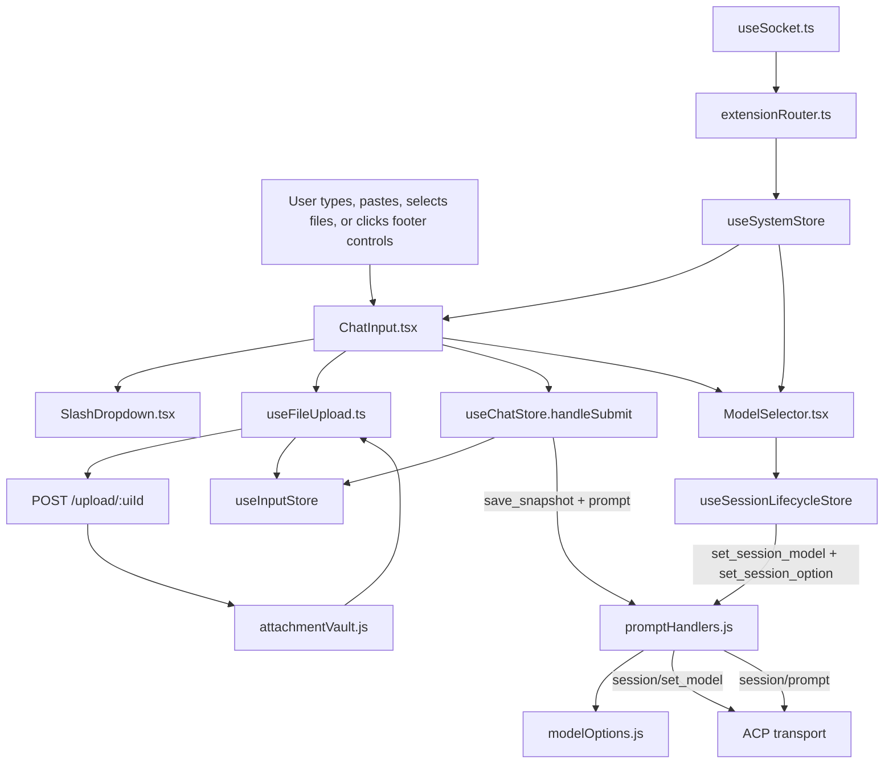

# Feature Doc - Chat Input and Prompt Area

## Overview
The Chat Input and Prompt Area is the prompt composition surface for an active chat session. It coordinates draft text, attachments, slash commands, voice entry controls, prompt submission/cancel actions, model quick-select, reasoning-effort options, context usage display, and footer actions for terminal, canvas, auto-scroll, Scratch Pad entry control, and fork merge. Notes ownership is documented in `[Feature Doc] - Notes.md`.

This feature matters because it is the frontend boundary that creates `prompt` socket payloads and the backend path that converts those payloads into ACP `session/prompt` parts. Small mismatches between the UI attachment shape, socket payload, provider model state, or context metadata path can break prompt submission while the rest of the session UI still renders.

### What It Does
- Renders the active session textarea and keeps draft text in `useInputStore.inputs` by UI session id.
- Uses `useFileUpload` to send file picker and clipboard files to `POST /upload/:uiId`, then stores attachment metadata in `useInputStore.attachmentsMap`.
- Merges provider slash commands with local custom commands and routes selected commands through the same submit path as typed prompts.
- Emits `save_snapshot`, `prompt`, `cancel_prompt`, `set_session_model`, `set_session_option`, and `merge_fork` socket events through store and component handlers.
- Displays footer state from provider branding, session model metadata, config options, context usage, compaction state, canvas state, terminal state, and auto-scroll state.
- Converts attachments into ACP prompt parts in `registerPromptHandlers` before sending `session/prompt` to the active provider runtime.

### Why This Matters
- `useChatStore.handleSubmit` is the only normal UI path that emits the `prompt` socket event.
- Attachment upload and attachment prompt conversion are separate phases with different failure points.
- Model selection has an optimistic frontend update and a backend ACP `session/set_model` enforcement path.
- Slash command visibility depends on provider extension data and local custom command data arriving through socket handlers.
- Context usage is displayed from metadata and stats state keyed by provider id + ACP session id, not UI session id.

## How It Works - End-to-End Flow
1. Active session state is selected in the input component.

   File: `frontend/src/components/ChatInput/ChatInput.tsx` (Component: `ChatInput`)

   `ChatInput` reads the active session from `useSessionLifecycleStore.sessions` and `activeSessionId`. It pulls connectivity from `useSystemStore`, draft text from `useInputStore.inputs`, footer state from `useUIStore` and `useCanvasStore`, voice state from `useVoiceStore`, and provider branding through `useSystemStore.getBranding(activeSession?.provider)`.

2. The textarea is enabled only when the session can accept input.

   File: `frontend/src/components/ChatInput/ChatInput.tsx` (Derived state: `isDisabled`)

   The textarea and file/mic actions are disabled when the socket is disconnected, the engine is not ready, the session is typing, or the session is warming up. Sub-agent sessions render a read-only input wrapper instead of the prompt form.

3. Slash commands are assembled from provider and local command sources.

   Files: `frontend/src/hooks/useSocket.ts` (Socket events: `custom_commands`, `provider_extension`), `frontend/src/utils/extensionRouter.ts` (Function: `routeExtension`), `frontend/src/components/ChatInput/ChatInput.tsx` (Memo: `slashCommands`)

   `custom_commands` stores local command definitions in `useSystemStore.customCommands` and also surfaces prompt-backed commands as `SlashCommand` entries with `meta.local`. `provider_extension` calls `routeExtension`; a `commands/available` extension returns provider commands plus any prompt-backed custom commands. `ChatInput` prefers `slashCommandsByProviderId[activeProvider]` when present and prefixes local commands while removing duplicate command names.

4. Slash autocomplete filters and handles keyboard selection.

   Files: `frontend/src/components/ChatInput/ChatInput.tsx` (Memo: `filteredCommands`, Function: `handleKeyDown`, Function: `selectSlashCommand`), `frontend/src/components/ChatInput/SlashDropdown.tsx` (Component: `SlashDropdown`)

   The dropdown appears only when the draft starts with `/`, contains no spaces, and has matching commands after hidden command names are removed. Arrow keys move `slashIndex`; `Tab` and `Enter` select a command; `Escape` clears the draft. Commands with `meta.inputType === 'panel'` or `meta.hint` leave a trailing space for arguments. Commands without arguments immediately call `handleSubmit(socket)` after storing the command name.

5. File picker and paste events enter the upload hook.

   File: `frontend/src/hooks/useFileUpload.ts` (Hook: `useFileUpload`, Functions: `handleFileUpload`, `handlePaste`)

   `handleFileUpload` builds a `FormData` payload with repeated `files` fields and posts it to `${BACKEND_URL}/upload/${currentSessionId}`. `handlePaste` listens on `window` and intercepts clipboard file payloads before delegating to `handleFileUpload`.

6. The upload route stores files under the provider attachment root.

   Files: `backend/routes/index.js` (Route mount: `router.use('/upload', uploadRoutes)`), `backend/routes/upload.js` (Route: `POST /:uiId`), `backend/services/attachmentVault.js` (Functions: `getAttachmentsRoot`, `upload`, `handleUpload`)

   The route applies `upload.array('files')` from multer. The storage destination is `path.join(getAttachmentsRoot(providerId), uiId)`, where `providerId` may come from request query or body. Filenames are timestamped and sanitized. `handleUpload` returns `{ success: true, files }` with each file shaped as `{ name, path, size, mimeType }`.

7. Uploaded attachments are stored for the active UI session.

   Files: `frontend/src/hooks/useFileUpload.ts` (Function: `handleFileUpload`), `frontend/src/store/useInputStore.ts` (Actions: `setAttachments`, `clearInput`), `frontend/src/components/FileTray.tsx` (Component: `FileTray`)

   Image responses are enriched with base64 `data` from the original browser `File` for immediate preview and prompt submission. The hook appends attachments with `setAttachments(currentSessionId, prev => [...prev, ...filesWithData])`. `FileTray` renders chips with name, formatted size, a file-type icon, and a remove button that filters the session attachment array.

8. The form submits through the chat store.

   Files: `frontend/src/components/ChatInput/ChatInput.tsx` (Function: `handleKeyDown`, Form `onSubmit`), `frontend/src/store/useChatStore.ts` (Action: `handleSubmit`)

   `Enter` without Shift and the submit button call `handleSubmit(socket)`. If the active session is typing, the form calls `handleCancel(socket)` instead. `handleSubmit` requires an active UI session, socket, active session object, non-empty prompt or attachments, and an ACP session id.

9. Submit creates optimistic messages and emits the prompt payload.

   File: `frontend/src/store/useChatStore.ts` (Action: `handleSubmit`)

   The store trims the prompt, resolves attachments from `attachmentsMap[activeSessionId]` unless an override is provided, intercepts exact prompt-backed custom commands from `useSystemStore.customCommands`, marks the ACP stream active in `useStreamStore`, clears the input and attachments, appends a user message plus an assistant placeholder, emits `save_snapshot`, then emits `prompt`.

10. The backend resolves provider runtime and model state.

    Files: `backend/sockets/promptHandlers.js` (Function: `registerPromptHandlers`, Socket event: `prompt`), `backend/services/modelOptions.js` (Function: `resolveModelSelection`)

    The prompt handler resolves the runtime through `providerRuntimeManager.getRuntime(providerId)`. It requires `sessionMetadata` for the ACP session. It resolves the requested model against provider config and session model options, sends ACP `session/set_model` when the metadata model differs, updates `meta.model`, increments `meta.promptCount`, records the rolling last two string prompts in `meta.titlePromptHistory`, and retains `meta.userPrompt` for the first string prompt.

11. Attachments become ACP prompt parts.

    File: `backend/sockets/promptHandlers.js` (Socket event: `prompt`, Attachment conversion block)

    Image attachments use `file.data` or `fs.readFileSync(file.path).toString('base64')`, resize through `sharp`, and emit ACP image parts with `mimeType: 'image/jpeg'` when compression succeeds. Image compression uses `runtime.provider.config.branding.maxImageDimension` or `1568`, `fit: 'inside'`, `withoutEnlargement: true`, and JPEG quality `85`. If compression fails, the original image mime type and base64 data are sent. Non-image attachments with `data` become text parts. Non-image attachments with `path` become `resource_link` parts with a `file:///` URI.

12. The prompt is sent to ACP and completion state is emitted.

    File: `backend/sockets/promptHandlers.js` (Socket event: `prompt`, ACP request: `session/prompt`)

    The handler appends the text prompt or array prompt parts after attachment parts, prepends `meta.spawnContext` on the first prompt when present, resets response buffers, marks the runtime prompt active, calls `providerModule.onPromptStarted(sessionId)`, sends ACP `session/prompt`, and uses response `usage.totalTokens` only as a stats fallback when no context-window total is known. When the stream controller has no pending stats capture, it emits `token_done` and calls `finalizeStreamPersistence`; errors emit formatted `token` and `token_done` events with `error: true` and finalize the persisted active assistant with the error text.

13. Footer model and session option controls update session state.

    Files: `frontend/src/components/ChatInput/ModelSelector.tsx` (Component: `ModelSelector`), `frontend/src/utils/modelOptions.ts` (Functions: `getFooterModelChoices`, `getModelLabel`, `isModelChoiceActive`), `frontend/src/store/useSessionLifecycleStore.ts` (Actions: `handleActiveSessionModelChange`, `handleSessionModelChange`, `handleSetSessionOption`)

    `ModelSelector` displays the label from `currentModelId`, session model options, and provider branding `models.quickAccess`. Dropdown choices come from quick-access branding only. Selecting a model calls `handleActiveSessionModelChange`, which calls `handleSessionModelChange`, applies local model state, and emits `set_session_model`. A `reasoning_effort` config option renders segmented buttons in `ChatInput`; selecting a value calls `handleSetSessionOption`, updates local `configOptions`, and emits `set_session_option`.

14. Context usage is displayed in two places.

    Files: `frontend/src/hooks/useSocket.ts` (Socket event: `provider_extension`), `frontend/src/utils/extensionRouter.ts` (Extension result: `metadata`), `frontend/src/store/useSystemStore.ts` (Action: `setContextUsage`), `frontend/src/store/useSessionLifecycleStore.ts` (Functions: `fetchStats`, `maybeHydrateContextUsage`), `frontend/src/components/ChatInput/ChatInput.tsx` (CSS classes: `context-bar-track`, `context-bar-fill`), `frontend/src/components/ChatInput/ModelSelector.tsx` (Label: context percentage and compaction suffix)

    Provider metadata extensions with `contextUsagePercentage` update a provider-scoped key (`providerId + acpSessionId`) in `contextUsageBySession`. Session stats can also hydrate the value from `usedTokens / totalTokens` using the same keying. `ChatInput` clamps the percentage to `0..100` for the thin context bar and selects green/yellow/red/accent colors by threshold. `ModelSelector` appends a rounded percentage to the model label when context data exists and shows a compacting suffix while the provider-scoped `compactingBySession` entry is true.

## Architecture Diagram


## The Critical Contract: Prompt Payload, Attachment Shape, and Session Keys
The prompt contract starts in `useChatStore.handleSubmit` and is consumed by `registerPromptHandlers`.

```ts
// FILE: frontend/src/store/useChatStore.ts (Action: handleSubmit)
socket.emit('prompt', {
  providerId: activeSession.provider,
  uiId: activeSession.id,
  sessionId: acpId,
  prompt: promptText,
  model: activeSession.model,
  attachments
});
```

The payload depends on these keys:
- `providerId`: resolves `providerRuntimeManager.getRuntime(providerId)` on the backend.
- `uiId`: identifies the frontend session and upload folder namespace.
- `sessionId`: identifies the ACP session and indexes backend `sessionMetadata`.
- `prompt`: string text or prebuilt ACP prompt parts when an override supplies an array.
- `model`: frontend selection that the backend resolves and applies through ACP `session/set_model`.
- `attachments`: `Attachment[]` from `frontend/src/types.ts`.

Attachment shape:
```ts
// FILE: frontend/src/types.ts (Interface: Attachment)
interface Attachment {
  name: string;
  path?: string;
  size: number;
  mimeType?: string;
  type?: string;
  data?: string;
}
```

Upload response shape:
```json
{
  "success": true,
  "files": [
    { "name": "example.txt", "path": "...", "size": 123, "mimeType": "text/plain" }
  ]
}
```

The key session distinction is mandatory:
- UI session id (`ChatSession.id`) indexes `useInputStore.inputs`, `useInputStore.attachmentsMap`, upload route `:uiId`, file chips, and footer actions.
- ACP session id (`ChatSession.acpSessionId`) indexes backend prompt handling, context usage, compaction state, stats, streaming, and ACP transport calls.

If these keys are mixed, the visible prompt can submit against the wrong backend session, attachments can render for one session but send with another, or context usage can appear blank even though metadata exists.

## Configuration / Provider-Specific Behavior
- Provider branding controls prompt placeholder and busy state strings through `inputPlaceholder`, `busyText`, `hooksText`, `warmingUpText`, and `resumingText`.
- Provider branding `models.default` seeds new sessions through `getDefaultModelSelection` in `useSessionLifecycleStore.handleNewChat`.
- Provider branding `models.quickAccess` is the only source for `ModelSelector` footer dropdown choices through `getFooterModelChoices`.
- Provider branding `maxImageDimension` controls image resize limits in `registerPromptHandlers`; the fallback value is `1568`.
- Provider branding `protocolPrefix` controls how `useSocket` routes `provider_extension` methods through `routeExtension`.
- Session `configOptions` can include a `select` option with `kind: 'reasoning_effort'`; `ChatInput` renders it as a segmented footer control and emits `set_session_option` when changed.
- Prompt-backed custom commands arrive through `custom_commands` and are stored in `useSystemStore.customCommands`; only entries with `prompt` are surfaced as local slash commands.

## Data Flow / Rendering Pipeline
### Draft Text and Submit
1. `ChatInput` reads `input = inputs[activeSession.id] || ''`.
2. Textarea `onChange` calls `useInputStore.setInput(activeSession.id, value)`.
3. `Enter` without Shift, the send button, or a no-argument slash command calls `useChatStore.handleSubmit(socket)`.
4. `handleSubmit` clears the draft with `useInputStore.clearInput(activeSessionId)` after it builds the prompt payload.
5. The optimistic user message stores `content: promptText` and a copy of the submitted attachments.

### Attachment Upload and Prompt Conversion
1. Browser files enter `useFileUpload.handleFileUpload` from the hidden file input or `window` paste listener.
2. The hook posts `FormData(files)` to `POST /upload/:uiId`.
3. `attachmentVault.handleUpload` returns server paths and MIME metadata.
4. The hook adds image `data` for preview/submission and appends the returned entries to `attachmentsMap[uiId]`.
5. `FileTray` renders `attachmentsMap[uiId]` and removes by array index.
6. `handleSubmit` includes the array in the `prompt` socket payload.
7. `registerPromptHandlers` converts each attachment to an ACP `image`, `text`, or `resource_link` prompt part.

### Slash Commands
1. `useSocket` receives provider command extensions and custom commands.
2. `useSystemStore` stores global and provider-scoped slash command arrays.
3. `ChatInput` picks active provider commands when available and prefixes local commands.
4. `filteredCommands` hides internal commands and filters by prefix.
5. `SlashDropdown` renders command names/descriptions and calls `onSelect` on `mouseDown`.
6. `selectSlashCommand` stores the command, optionally appends an argument space, and submits no-argument commands.
7. `useChatStore.handleSubmit` replaces exact prompt-backed custom command names with their configured prompt text.

### Model and Context Display
1. `ModelSelector` subscribes to provider branding in `useSystemStore.providersById[activeSession.provider]`, with global branding as fallback.
2. `getModelLabel` prefers `activeSession.currentModelId` and names from `activeSession.modelOptions` or `models.quickAccess`.
3. `getFooterModelChoices` returns quick-access model choices from branding.
4. Selecting a quick-access item calls `handleActiveSessionModelChange`, then `handleSessionModelChange`, then socket event `set_session_model`.
5. `useSocket` routes context metadata from `provider_extension` through `routeExtension`; stats hydration can also call `setContextUsage`.
6. `ChatInput` renders a context bar from provider-scoped context usage keyed by `activeSession.provider + activeSession.acpSessionId`; `ModelSelector` appends rounded context percentage or compaction state to the model label.

## Component Reference
### Frontend Components and Hooks
| Area | File | Anchors | Purpose |
|---|---|---|---|
| Input UI | `frontend/src/components/ChatInput/ChatInput.tsx` | `ChatInput`, `filteredCommands`, `selectSlashCommand`, `handleKeyDown`, `handleMergeFork`, `reasoningEffortOption`, `context-bar-track` | Main prompt form, slash command control, footer pills, context bar, reasoning-effort selector, merge fork action |
| Model footer | `frontend/src/components/ChatInput/ModelSelector.tsx` | `ModelSelector`, `getModelLabel`, `getFooterModelChoices`, `isModelChoiceActive` | Model label, quick-access dropdown, settings button, context/compaction suffix |
| Slash dropdown | `frontend/src/components/ChatInput/SlashDropdown.tsx` | `SlashDropdown`, `onMouseDown`, `selectedIndex` | Render-only command list and mouse selection surface |
| File chips | `frontend/src/components/FileTray.tsx` | `FileTray`, `getIcon`, `formatSize`, `onRemove` | Attachment chip rendering and removal callback |
| Upload hook | `frontend/src/hooks/useFileUpload.ts` | `useFileUpload`, `handleFileUpload`, `handlePaste` | HTTP upload, image base64 enrichment, paste interception |
| Socket hook | `frontend/src/hooks/useSocket.ts` | `custom_commands`, `provider_extension`, `session_model_options` | Receives custom commands, provider extensions, context metadata, model options |

### Frontend Stores and Utilities
| Area | File | Anchors | Purpose |
|---|---|---|---|
| Input state | `frontend/src/store/useInputStore.ts` | `inputs`, `attachmentsMap`, `setInput`, `setAttachments`, `clearInput`, `handleFileUpload` | Session-scoped drafts and attachments |
| Submit state | `frontend/src/store/useChatStore.ts` | `handleSubmit`, `handleCancel` | Optimistic messages, prompt/cancel socket emission, custom command prompt substitution |
| Session lifecycle | `frontend/src/store/useSessionLifecycleStore.ts` | `handleActiveSessionModelChange`, `handleSessionModelChange`, `handleSetSessionOption`, `fetchStats`, `maybeHydrateContextUsage` | Model mutation, session options, stats and context hydration |
| System state | `frontend/src/store/useSystemStore.ts` | `SlashCommand`, `setSlashCommands`, `setCustomCommands`, `setContextUsage`, `getContextUsage`, `hasContextUsage`, `setCompacting`, `getCompacting`, `getBranding` | Provider branding, command lists, provider-scoped context usage and compaction state |
| UI state | `frontend/src/store/useUIStore.ts` | `isModelDropdownOpen`, `setModelDropdownOpen`, `toggleAutoScroll`, `setSettingsOpen`, `setNotesOpen` | Dropdown, auto-scroll, settings, and Scratch Pad trigger state (notes ownership in `[Feature Doc] - Notes.md`) |
| Canvas state | `frontend/src/store/useCanvasStore.ts` | `terminals`, `isCanvasOpen`, `openTerminal`, `setIsCanvasOpen` | Terminal and canvas footer pill behavior |
| Model utilities | `frontend/src/utils/modelOptions.ts` | `getDefaultModelSelection`, `getModelIdForSelection`, `getModelLabel`, `getFooterModelChoices`, `getFullModelChoices`, `isModelChoiceActive` | Frontend model labels and option lists |
| Extension routing | `frontend/src/utils/extensionRouter.ts` | `routeExtension`, result types `commands`, `metadata`, `config_options`, `compaction_started`, `compaction_completed` | Pure parser for provider extension payloads |
| Types | `frontend/src/types.ts` | `Attachment`, `ChatSession`, `ProviderConfigOption`, `ProviderModelOption`, `StatsPushData`, `ProviderExtensionData` | Shared frontend data contracts |

### Backend Routes and Services
| Area | File | Anchors | Purpose |
|---|---|---|---|
| Route mount | `backend/routes/index.js` | `router.use('/upload', uploadRoutes)` | Mounts upload route tree |
| Upload route | `backend/routes/upload.js` | `router.post('/:uiId', upload.array('files'), handleUpload)` | Receives multipart attachment uploads |
| Attachment service | `backend/services/attachmentVault.js` | `getAttachmentsRoot`, `upload`, `handleUpload`, multer `destination`, multer `filename` | Resolves attachment storage root, stores files, sanitizes filenames, returns metadata |
| Prompt socket | `backend/sockets/promptHandlers.js` | `registerPromptHandlers`, socket events `prompt`, `cancel_prompt`, `respond_permission`, `set_mode`, ACP requests `session/set_model`, `session/prompt` | Prompt conversion, model enforcement, attachment transformation, cancel and permission forwarding |
| Model service | `backend/services/modelOptions.js` | `normalizeModelOptions`, `modelOptionsFromProviderConfig`, `findModelConfigOption`, `extractModelState`, `mergeModelOptions`, `resolveModelSelection` | Backend model selection normalization and resolution |

### Routes, Events, and Protocol Fields
| Type | Name | Producer | Consumer | Purpose |
|---|---|---|---|---|
| HTTP route | `POST /upload/:uiId` | `useFileUpload.handleFileUpload` | `backend/routes/upload.js` | Multipart upload endpoint for prompt attachments |
| Socket event | `prompt` | `useChatStore.handleSubmit` | `registerPromptHandlers` | Prompt dispatch with model and attachments |
| Socket event | `cancel_prompt` | `useChatStore.handleCancel` | `registerPromptHandlers` | ACP cancel forwarding and sub-agent cancellation |
| Socket event | `set_session_model` | `useSessionLifecycleStore.handleSessionModelChange` | Session handlers | Session model update request |
| Socket event | `set_session_option` | `useSessionLifecycleStore.handleSetSessionOption` | Session handlers | Session config option update request |
| Socket event | `custom_commands` | Backend socket setup | `useSocket` | Local slash command and prompt substitution data |
| Socket event | `provider_extension` | Provider runtime stream | `useSocket` and `routeExtension` | Commands, context metadata, provider status, config options, compaction status |
| Socket event | `stats_push` | `acpUpdateHandler`, `registerPromptHandlers` | Stream/system handlers | Context-window stats from `usage_update`, or prompt-response fallback when no context-window total is known |
| ACP request | `session/set_model` | `registerPromptHandlers` | Provider ACP daemon | Enforces backend model before prompt |
| ACP request | `session/prompt` | `registerPromptHandlers` | Provider ACP daemon | Sends prompt parts to ACP |

## Gotchas & Important Notes
1. UI and ACP session ids are different keys. `attachmentsMap` and textarea drafts use `ChatSession.id`; context usage, compaction, streaming, and backend prompt routing use `ChatSession.acpSessionId`.

2. Upload success is not prompt success. `POST /upload/:uiId` only proves that files reached disk and metadata returned. ACP prompt conversion happens later inside `registerPromptHandlers` and can fail independently.

3. The frontend upload request does not include `providerId`. `attachmentVault` can read `providerId` from query or body, but `useFileUpload` posts only to `/upload/:uiId`. Follow-up file/function for provider-specific upload roots: `frontend/src/hooks/useFileUpload.ts` (Function: `handleFileUpload`) and `backend/services/attachmentVault.js` (Function: `getAttachmentsRoot`).

4. Paste handling is global. `useFileUpload` attaches a `window` `paste` listener, so clipboard files are intercepted even when the textarea is not the active element.

5. Slash autocomplete is prefix-only. A space in the draft hides `SlashDropdown`; commands requiring arguments append a trailing space and do not auto-submit.

6. Prompt-backed custom command substitution is exact-match only. `useChatStore.handleSubmit` replaces the prompt only when `promptText === customCommand.name` and the custom command has a `prompt`.

7. Model footer choices come from provider branding quick-access entries. Session `modelOptions` can label the active model, but `ModelSelector` dropdown choices come from `branding.models.quickAccess` through `getFooterModelChoices`.

8. Backend model enforcement can change ACP state even after the frontend local model update. `handleSessionModelChange` updates the UI optimistically; `registerPromptHandlers` still resolves `model` and sends ACP `session/set_model` when needed.

9. Context bar absence can be valid state. No fill renders until the provider-scoped context key (`providerId + acpSessionId`) exists from metadata or stats hydration.

10. Input clear is eager. `handleSubmit` clears draft text and attachments before the backend prompt completes; submit failures emit error timeline events but do not restore the previous draft.

## Unit Tests
### Frontend
- `frontend/src/test/ChatInput.test.tsx`
  - `automatically focuses the textarea when enabled`
  - `does NOT focus the textarea when disabled (e.g. warming up)`
  - `renders model selector and allows model change`
  - `submits on Enter key press`
  - `shows slash command dropdown when input starts with /`
  - `selecting a slash command fills the input`
  - `send button is disabled when input is empty`
  - `shows cancel button when session isTyping`
  - `uses provider-specific input placeholder when session has a provider`
- `frontend/src/test/ChatInputExtended.test.tsx`
  - `renders textarea and updates store on change`
  - `triggers handleSubmit on Enter (without shift)`
  - `shows slash command dropdown when typing /`
  - `handles file upload trigger`
- `frontend/src/test/ModelSelector.test.tsx`
  - `returns null when activeSession is undefined`
  - `renders "Using" prefix and the current model name`
  - `shows context percentage appended to model name when available`
  - `rounds fractional context percentages`
  - `shows "Compacting..." suffix when isCompacting is true`
  - `model button has "static" class and is disabled when quickAccess is empty`
  - `calls onModelSelect with the choice selection when a dropdown item is clicked`
  - `shows the alt-provider quick-access models (not the default provider models) for a session owned by alt-provider`
  - `reactively updates to show alt-provider models when providersById is populated after initial render`
- `frontend/src/test/SlashDropdown.test.tsx`
  - `returns null when visible is false`
  - `renders all command names`
  - `applies the "active" class only to the item at selectedIndex`
  - `calls onSelect with the correct command on mouseDown`
  - `does not call onSelect on click — only on mouseDown (prevents textarea blur)`
- `frontend/src/test/FileTray.test.tsx`
  - `renders nothing when empty`
  - `renders file chips correctly`
  - `calls onRemove when remove button is clicked`
  - `formats file size in MB for large files`
- `frontend/src/test/useFileUpload.test.ts`
  - `initializes with attachments from store`
  - `handleFileUpload uploads files and updates store`
  - `handleFileUpload alerts if no active session`
  - `handlePaste processes files from clipboard`
  - `handlePaste does not prevent default for non-file clipboard data`
  - `handleFileUpload returns early with null files`
- `frontend/src/test/useInputStore.test.ts`
  - `setInput stores per-session input text`
  - `setAttachments handles direct values`
  - `setAttachments handles functional updaters`
  - `addAttachment and removeAttachment update state`
  - `clearInput resets input and attachments`
  - `handleFileUpload reads files and adds to attachmentsMap`
- `frontend/src/test/useChatStore.test.ts`
  - `creates messages and emits prompt`
  - `intercepts custom commands with prompt`
  - `emits cancel_prompt`
- `frontend/src/test/useSessionLifecycleStore.test.ts`
  - `fetchStats updates session with stats`
  - `fetchStats does not overwrite existing positive context usage with zero percent`
  - `handleSetSessionOption updates local state and emits`
  - `handleSessionSelect hydrates context usage from persisted session stats`
- `frontend/src/test/useSessionLifecycleStoreExtended.test.ts`
  - `handleActiveSessionModelChange calls handleSessionModelChange`
- `frontend/src/test/useSystemStoreDeep.test.ts`
  - `setContextUsage updates session percentage by provider+session key`
  - `clamps context usage to UI-safe bounds`
  - `setCompacting tracks compaction state per provider+session key`
  - `keeps compaction state isolated for interleaved providers sharing a session id`
  - `keeps context usage isolated for interleaved providers sharing a session id`
- `frontend/src/test/extensionRouter.test.ts`
  - `routes commands/available with system + custom commands merged`
  - `routes metadata with sessionId and percentage`
  - `routes config_options with various modes`
  - `routes compaction_started`
  - `routes compaction_completed with summary`
- `frontend/src/test/modelOptions.test.ts`
  - `getDefaultModelSelection handles missing models`
  - `getModelIdForSelection returns selection`
  - `normalizeModelOptions handles arrays`

### Backend
- `backend/test/routes-upload.test.js`
  - `registers POST /:uiId and responds via handleUpload`
  - `passes the uiId route param to the handler`
  - `runs the upload middleware before handleUpload`
  - `does not register a GET route`
- `backend/test/attachmentVault.test.js`
  - `handleUpload should return file information`
  - `getAttachmentsRoot returns dir from providerModule`
  - `multer destination callback creates session directory`
  - `multer destination callback skips mkdir when dir already exists`
  - `multer filename callback sanitizes original filename`
- `backend/test/promptHandlers.test.js`
  - `should handle incoming prompt and send to ACP`
  - `does not overwrite context-window stats with prompt response usage`
  - `should handle attachments (images and resource links)`
  - `should handle base64 image attachments without disk path`
  - `should decode non-image base64 files as text content`
  - `should compress image attachments via sharp before sending to ACP`
  - `should send original image as fallback if sharp fails`
  - `should reject prompts to sessions not loaded in current process`
  - `should cancel prompt when cancel_prompt received`
  - `should cancel running sub-agents and emit completion on cancel_prompt`
- `backend/test/modelOptions.test.js`
  - `normalizes model options from ACP and filters invalid or duplicate entries`
  - `derives quick model options from provider quickAccess entries`
  - `finds model config options by id, category, or kind`
  - `resolves quick access ids, raw ids, advertised ids, and fallbacks`

## How to Use This Guide
### For implementing/extending this feature
1. Start with `frontend/src/components/ChatInput/ChatInput.tsx` and identify whether the change touches draft text, attachments, slash commands, footer pills, model controls, session options, or context display.
2. For attachments, update `frontend/src/hooks/useFileUpload.ts`, `frontend/src/store/useInputStore.ts`, `frontend/src/components/FileTray.tsx`, `backend/routes/upload.js`, `backend/services/attachmentVault.js`, and the attachment conversion block in `backend/sockets/promptHandlers.js` as a single contract.
3. For model footer changes, update `frontend/src/components/ChatInput/ModelSelector.tsx`, `frontend/src/utils/modelOptions.ts`, `frontend/src/store/useSessionLifecycleStore.ts`, and backend `resolveModelSelection` behavior when ACP model ids are affected.
4. For slash commands, verify `frontend/src/hooks/useSocket.ts`, `frontend/src/utils/extensionRouter.ts`, `frontend/src/store/useSystemStore.ts`, `ChatInput` filtering, and `useChatStore.handleSubmit` custom command substitution.
5. For context usage, verify `provider_extension` metadata routing, `useSystemStore.setContextUsage`, `useSystemStore.getContextUsage`, `useSystemStore.getCompacting`, `useSessionLifecycleStore.fetchStats`, `ChatInput` context bar rendering, and `ModelSelector` label rendering.
6. Update the tests listed in this guide when the corresponding contract changes.

### For debugging issues with this feature
1. Check `useSystemStore.connected`, `useSystemStore.isEngineReady`, `activeSession.isTyping`, and `activeSession.isWarmingUp` before debugging textarea or button disabled state.
2. Check `activeSessionId` and `activeSession.acpSessionId` separately before debugging a missing `prompt` event.
3. Inspect `useInputStore.inputs[uiId]` and `useInputStore.attachmentsMap[uiId]` before submit, then inspect the `prompt` socket payload from `useChatStore.handleSubmit`.
4. For upload failures, inspect `POST /upload/:uiId`, `upload.array('files')`, multer storage callbacks, and `handleUpload` response shape.
5. For attachment prompt failures, inspect the attachment conversion block in `registerPromptHandlers` and confirm whether the file has `data`, `path`, and a correct `mimeType`.
6. For missing slash commands, inspect `custom_commands`, `provider_extension`, `routeExtension`, `setSlashCommands`, and `slashCommandsByProviderId[activeProvider]`.
7. For model dropdown issues, inspect provider branding in `providersById[activeSession.provider].branding.models.quickAccess` and the session fields `model`, `currentModelId`, and `modelOptions`.
8. For context display issues, inspect provider-scoped context/compaction entries for `activeSession.provider + activeSession.acpSessionId`, plus `stats.usedTokens` and `stats.totalTokens`.

## Summary
- `ChatInput` coordinates prompt composition, attachments, slash commands, voice controls, footer actions, context display, and model/session option controls for the active session.
- `useInputStore` owns UI-session-scoped drafts and attachments; `useChatStore.handleSubmit` owns prompt emission and optimistic message insertion.
- Attachment upload returns disk metadata first; ACP prompt conversion later transforms attachments into `image`, `text`, or `resource_link` parts.
- Model quick-select is sourced from provider branding quick-access entries and enforced again in the backend prompt handler through ACP `session/set_model`.
- Slash command data comes from provider extensions and prompt-backed custom commands; exact custom command names can substitute configured prompt text.
- Context display is keyed by provider id + ACP session id and can be populated from provider metadata or stats hydration.
- The critical contract is the `prompt` payload plus the `Attachment` shape and the separation between UI session id and ACP session id.
