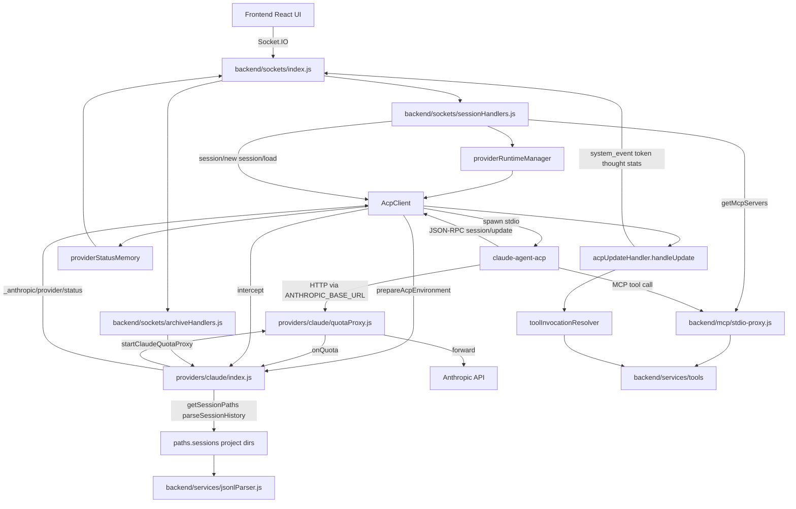

# Feature Doc - Claude Provider

This document is the Claude-specific sidecar for AcpUI's provider architecture. Read it together with `documents/[Feature Doc] - Provider System.md`.

Claude is implemented in `providers/claude/` and integrates `claude-agent-acp` through the standard provider contract plus Claude-specific quota capture, tool normalization, context-usage replay, hooks, and project-scoped session files.

## Overview

### What It Does

- Starts Claude ACP with provider-owned environment preparation in `prepareAcpEnvironment`.
- Captures Anthropic quota headers through `providers/claude/quotaProxy.js` and emits `_anthropic/provider/status`.
- Normalizes Claude ACP updates into AcpUI provider extensions and Unified Timeline events.
- Resolves canonical MCP tool identity from `provider.json` `toolIdPattern` through `extractToolInvocation`.
- Persists and replays context usage per session from `acp_session_context.json`.
- Routes Claude config changes through `session/set_mode`, `session/set_model`, and `session/set_config_option`.
- Applies Claude agent metadata through `_meta.claudeCode.options` during `session/new` and `session/load`.
- Locates, clones, archives, restores, deletes, and parses Claude project-scoped session files.

### Why This Matters

- Claude ACP emits useful provider-specific data as standard `session/update` payloads, so `intercept` must convert selected updates into provider extensions.
- Claude model selection and dynamic options share daemon payloads but use separate AcpUI contracts.
- Claude MCP tool names follow the configured `mcp__{mcpName}__{toolName}` pattern; tool routing breaks if parsing moves into generic backend code.
- Claude stores session history under project directories, so rehydration, fork, archive, and restore paths must use provider functions.
- Claude quota status is visible only through HTTP response headers seen by the provider-owned proxy.

### Architectural Role

Claude is a provider-specific backend adapter. The frontend stays provider-agnostic and receives branding, model state, config options, Unified Timeline events, and provider status through Socket.IO.

## How It Works - End-to-End Flow

1. **Provider Load and Contract Binding**

   Files: `backend/services/providerLoader.js` (Functions: `getProvider`, `bindProviderModule`, `getProviderModule`, `getProviderModuleSync`), `providers/claude/provider.json`, `providers/claude/branding.json`, `providers/claude/user.json`

   - `getProvider` loads `provider.json`, optional `branding.json`, and optional `user.json` from `providers/claude/`.
   - `user.json` overrides matching provider fields for local daemon command, paths, and model defaults.
   - `bindProviderModule` merges Claude exports with `DEFAULT_MODULE` and runs provider functions inside AsyncLocalStorage provider context.
   - Claude code calls `getProvider()` without arguments inside provider exports because `bindProviderModule` supplies the provider context.

2. **Daemon Spawn and Environment Preparation**

   Files: `backend/services/acpClient.js` (Class: `AcpClient`, Method: `start`), `providers/claude/index.js` (Function: `prepareAcpEnvironment`), `providers/claude/quotaProxy.js` (Function: `startClaudeQuotaProxy`)

   - `AcpClient.start` caches `this.providerModule`, builds the spawn command from provider config `command` and `args`, and calls `providerModule.prepareAcpEnvironment(childEnv, context)`.
   - Claude `prepareAcpEnvironment` loads context cache state from `{paths.home}/acp_session_context.json`.
   - Unless disabled by environment flags, `prepareAcpEnvironment` starts the quota proxy and injects `ANTHROPIC_BASE_URL` into the Claude ACP child environment.

3. **Quota Proxy Request Forwarding**

   File: `providers/claude/quotaProxy.js` (Functions: `startClaudeQuotaProxy`, `proxyRequest`, `extractClaudeQuotaHeaders`, `getLatestClaudeQuota`, `stopClaudeQuotaProxy`)

   - `startClaudeQuotaProxy` listens on loopback and forwards requests to `CLAUDE_QUOTA_PROXY_TARGET`, `ANTHROPIC_BASE_URL`, or `https://api.anthropic.com`.
   - `proxyRequest` filters hop-by-hop headers, forwards the request, and passes response headers to `extractClaudeQuotaHeaders`.
   - `extractClaudeQuotaHeaders` parses `anthropic-ratelimit-*` headers into quota fields such as `5h_utilization`, `7d_utilization`, `overage_utilization`, reset timestamps, `unified_status`, and `raw`.

4. **ACP Handshake**

   Files: `backend/services/acpClient.js` (Method: `performHandshake`), `providers/claude/index.js` (Function: `performHandshake`), `providers/claude/provider.json` (Key: `clientInfo`)

   - `AcpClient.performHandshake` calls `providerModule.performHandshake(this)` after process startup.
   - Claude sends one JSON-RPC `initialize` request with `protocolVersion: 1`, file-system and terminal client capabilities, and `clientInfo` from `provider.json`.
   - Claude provider tests assert that `authenticate` is not sent.

5. **Session Create, Load, and MCP Proxy Binding**

   Files: `backend/sockets/sessionHandlers.js` (Socket event: `create_session`, Helper: `captureModelState`), `backend/services/sessionManager.js` (Function: `getMcpServers`), `providers/claude/index.js` (Functions: `buildSessionParams`, `setInitialAgent`, `getMcpServerMeta`)

   - `create_session` obtains Claude `sessionParams` from `buildSessionParams(requestAgent)`.
   - `buildSessionParams` always returns `_meta.claudeCode.options.disallowedTools` with `Bash`, `PowerShell`, and `Agent`; it adds `_meta.claudeCode.options.agent` when an agent is supplied.
   - `getMcpServers` builds the AcpUI stdio MCP proxy with env keys `ACP_SESSION_PROVIDER_ID`, `ACP_UI_MCP_PROXY_ID`, `BACKEND_PORT`, and `NODE_EXTRA_CA_CERTS`; it adds `NODE_TLS_REJECT_UNAUTHORIZED=0` only when `ACP_UI_ALLOW_INSECURE_MCP_PROXY_TLS=1` is explicitly set.
   - Claude `getMcpServerMeta` returns `undefined`, so Claude MCP server entries do not include `_meta`.
   - `setInitialAgent` is a no-op because Claude agent selection is applied through spawn-time `_meta` fields.

6. **Model and Config State Capture**

   Files: `backend/sockets/sessionHandlers.js` (Helper: `captureModelState`, Socket events: `set_session_model`, `set_session_option`), `backend/services/sessionManager.js` (Functions: `normalizeProviderConfigOptions`, `reapplySavedConfigOptions`, `setProviderConfigOption`, `setSessionModel`), `providers/claude/index.js` (Functions: `normalizeModelState`, `normalizeConfigOptions`, `setConfigOption`)

   - `captureModelState` extracts model state from `session/new` or `session/load` responses, applies `normalizeModelState`, then saves model metadata.
   - The same helper normalizes response-time `configOptions` through Claude `normalizeConfigOptions` and persists non-model options.
   - Claude `normalizeConfigOptions` filters out option id `model` and maps option id `effort` to `kind: "reasoning_effort"`.
   - `set_session_option` calls Claude `setConfigOption`; Claude routes `mode` to `session/set_mode`, `model` to `session/set_model`, and all other dynamic options to `session/set_config_option`.

7. **Inbound Message Interception**

   Files: `backend/services/acpClient.js` (Method: `handleAcpMessage`), `providers/claude/index.js` (Functions: `intercept`, `emitCachedContext`, `normalizeConfigOptions`)

   - `handleAcpMessage` calls Claude `intercept(payload, { responseRequest })` before routing any daemon message.
   - `intercept` emits cached context for non-`usage_update` messages carrying a session id when a persisted context value exists.
   - Claude `usage_update` treats `used/size` as an authoritative absolute snapshot per session, clamps the calculated percentage to `0..100` (using `100` when `size <= 0`), updates the in-memory context cache, and saves `acp_session_context.json` without replaying stale cached metadata for that same update.
   - Claude `config_option_update` becomes `_anthropic/config_options` with `replace: true` after model filtering; model-only updates return `null` and are swallowed.
   - Claude `available_commands_update` becomes `_anthropic/commands/available`, prefixes command names with `/`, and maps `input.hint` to `meta.hint`.

8. **Provider Extension Routing and Reconnect Replay**

   Files: `backend/services/acpClient.js` (Methods: `handleProviderExtension`, `handleModelStateUpdate`), `backend/services/providerStatusMemory.js` (Functions: `rememberProviderStatusExtension`, `getLatestProviderStatusExtensions`), `backend/database.js` (Function: `saveProviderStatusExtension`), `backend/sockets/index.js` (Functions: `buildBrandingPayload`, `getProviderPayloads`, `registerSocketHandlers`), `providers/claude/index.js` (Function: `parseExtension`)

   - Any processed method with prefix `_anthropic/` is routed through `handleProviderExtension`.
   - `handleProviderExtension` merges config-option payloads into session metadata, persists them through `db.saveConfigOptions`, and emits `provider_extension` globally.
   - `rememberProviderStatusExtension` caches only provider-status payloads that include `params.status.sections`, and `db.saveProviderStatusExtension` persists the normalized status by provider.
   - `registerSocketHandlers` emits in-memory provider status extensions on client connection, then emits SQLite fallback rows only for providers missing from memory.
   - Claude `parseExtension` maps `_anthropic/commands/available`, `_anthropic/metadata`, `_anthropic/compaction/status`, `_anthropic/provider/status`, and `_anthropic/config_options` into frontend extension types.

9. **Tool Pipeline and Canonical Invocation**

   Files: `backend/services/acpUpdateHandler.js` (Function: `handleUpdate`), `backend/services/tools/toolInvocationResolver.js` (Functions: `resolveToolInvocation`, `applyInvocationToEvent`), `providers/claude/index.js` (Functions: `normalizeTool`, `extractToolInvocation`, `categorizeToolCall`, `extractToolOutput`, `extractFilePath`, `extractDiffFromToolCall`), `providers/claude/provider.json` (Keys: `mcpName`, `toolIdPattern`, `toolCategories`)

   - `handleUpdate` calls provider extractors for file paths, output, display title, category, and canonical identity.
   - `normalizeTool` reads Claude `kind`, `_meta.claudeCode.toolName`, MCP title patterns, and tool input to produce readable titles.
   - `extractToolInvocation` uses `matchToolIdPattern` with `toolIdPattern` to return canonical MCP identity fields.
   - `resolveToolInvocation` merges provider identity with sticky `toolCallState` and centrally recorded MCP execution data.
   - `applyInvocationToEvent` stamps `toolName`, `canonicalName`, `mcpServer`, `mcpToolName`, `isAcpUxTool`, title, file path, and category onto emitted tool events.

10. **Hooks and Agent Context**

    Files: `backend/services/hookRunner.js` (Function: `runHooks`), `backend/sockets/sessionHandlers.js` (Socket event: `create_session`), `backend/services/acpUpdateHandler.js` (Function: `handleUpdate`), `providers/claude/index.js` (Constant: `CLAUDE_HOOK_MAP`, Function: `getHooksForAgent`), `providers/claude/provider.json` (Key: `cliManagedHooks`)

    - Claude `provider.json` sets `cliManagedHooks` to an empty array, so AcpUI hook runner may invoke supported hooks.
    - `getHooksForAgent` maps AcpUI hook types to Claude settings keys: `session_start` -> `SessionStart`, `pre_tool` -> `PreToolUse`, `post_tool` -> `PostToolUse`, and `stop` -> `Stop`.
    - Claude hooks are read from `settings.json` next to the configured agents directory and returned as `{ command, matcher? }` entries.
    - `create_session` runs `session_start` hooks when an agent is set and stores non-empty output in `spawnContext`.
    - `handleUpdate` runs `post_tool` hooks for completed tool updates when session metadata includes an agent name and raw tool input.

11. **JSONL Rehydration and Session Files**

    Files: `backend/services/jsonlParser.js` (Function: `parseJsonlSession`), `backend/sockets/sessionHandlers.js` (Socket events: `rehydrate_session`, `get_session_history`), `providers/claude/index.js` (Functions: `getSessionPaths`, `findSessionDir`, `parseSessionHistory`), `providers/claude/ACP_PROTOCOL_SAMPLES.md`

    - `parseJsonlSession(acpSessionId, providerId)` delegates file path resolution and parsing to the provider module.
    - Claude `getSessionPaths` scans `paths.sessions` project subdirectories and returns `{ jsonl, json, tasksDir }` for the session id.
    - Claude `parseSessionHistory` reconstructs user messages, assistant text, thought steps, tool steps, tool result output, and diff fallback output from Claude JSONL entries.
    - Internal command/caveat messages are filtered during parsing and fork pruning.

12. **Fork, Archive, Restore, and Delete**

    Files: `backend/sockets/sessionHandlers.js` (Socket event: `fork_session`), `backend/sockets/archiveHandlers.js` (Socket events: `archive_session`, `restore_archive`, `delete_archive`, `list_archives`), `providers/claude/index.js` (Functions: `cloneSession`, `archiveSessionFiles`, `restoreSessionFiles`, `deleteSessionFiles`)

    - `fork_session` asks Claude `cloneSession(sourceAcpId, forkAcpId, pruneAtTurn)` to copy/prune JSONL, JSON metadata, and task directory files inside the source project directory.
    - `archive_session` calls Claude `archiveSessionFiles`, copies attachments, writes `session.json`, and removes the database session.
    - Claude `archiveSessionFiles` writes `restore_meta.json` with the original `sessionDir` so restore targets the correct project directory.
    - `restore_archive` calls Claude `restoreSessionFiles`, copies attachments, saves a restored DB session, and removes the archive folder after success.
    - `deleteSessionFiles` removes Claude JSONL, JSON metadata, and task directory files for a session id.

## Architecture Diagram



## The Critical Contract

### 1. Provider Context Contract

Files: `backend/services/providerLoader.js` (Functions: `runWithProvider`, `bindProviderModule`, `getProvider`), `providers/claude/index.js` (All exports)

Provider exports depend on AsyncLocalStorage context. Claude functions call `getProvider()` without arguments, so code must be executed through bound provider modules returned by `getProviderModule` or `getProviderModuleSync`.

### 2. Tool Identity Contract

Files: `providers/claude/provider.json` (Keys: `mcpName`, `toolIdPattern`), `providers/claude/index.js` (Functions: `normalizeTool`, `extractToolInvocation`), `backend/services/tools/toolInvocationResolver.js` (Function: `resolveToolInvocation`)

Claude must resolve canonical tool names from `toolIdPattern`, not from hardcoded MCP prefixes in backend generic code. `extractToolInvocation(update, context)` returns provider identity fields; `resolveToolInvocation` merges them with sticky state and classifies AcpUI-owned MCP tools as `acpui_mcp` when the tool belongs to the configured AcpUI MCP server.

Expected provider extraction shape:

```json
{
  "toolCallId": "tool-call-id",
  "kind": "mcp",
  "rawName": "mcp__AcpUI__ux_invoke_shell",
  "canonicalName": "ux_invoke_shell",
  "mcpServer": "AcpUI",
  "mcpToolName": "ux_invoke_shell",
  "input": { "description": "Run tests", "command": "npm test" },
  "title": "Invoke Shell: Run tests",
  "filePath": null,
  "category": {}
}
```

### 3. Model and Config Option Contract

Files: `providers/claude/index.js` (Functions: `normalizeModelState`, `normalizeConfigOptions`, `setConfigOption`), `backend/sockets/sessionHandlers.js` (Helper: `captureModelState`, Socket events: `set_session_model`, `set_session_option`)

Claude model state is first-class AcpUI model state. Generic config rendering receives only non-model options.

- `normalizeConfigOptions` removes option id `model`.
- Option id `effort` is emitted with `kind: "reasoning_effort"`.
- `setConfigOption('mode')` sends `session/set_mode` with `modeId`.
- `setConfigOption('model')` sends `session/set_model` with `modelId`.
- Other option ids send `session/set_config_option` with `configId` and `value`, and response `configOptions` are normalized before returning.

### 4. Context Usage Replay Contract

Files: `providers/claude/index.js` (Functions: `_loadContextState`, `_saveContextState`, `_emitCachedContext`, `emitCachedContext`, `intercept`), `backend/sockets/sessionHandlers.js` (Helper: `emitCachedContext`), `backend/services/sessionManager.js` (Helper: `emitCachedContext`)

Claude context usage percentage is persisted under `{paths.home}/acp_session_context.json`. For Claude `usage_update`, the provider treats `used/size` as the latest absolute snapshot per session, never adds to prior values, clamps finite percentages to `0..100`, and stores `100` when `size <= 0`. `emitCachedContext(sessionId)` emits `_anthropic/metadata` at most once per process/session id when a cached value exists, and `intercept` suppresses cached replay during `usage_update` processing so the authoritative update is not preceded by stale metadata. Backend prompt completion preserves these context-window stats and uses `response.usage.totalTokens` only when no context-window total is known. This preserves footer and settings context indicators across hot session reuse, explicit session load paths, and turn completion.

### 5. Session Path Contract

Files: `providers/claude/index.js` (Functions: `findSessionDir`, `getSessionPaths`, `cloneSession`, `archiveSessionFiles`, `restoreSessionFiles`, `deleteSessionFiles`), `providers/claude/user.json.example` (Keys: `paths.sessions`, `paths.archive`)

Claude sessions are project-scoped under `paths.sessions`. Any session operation must use `getSessionPaths` or `findSessionDir`; flat path assumptions fail for fork, rehydration, archive, and restore flows. Archive restore depends on `restore_meta.json` containing the original `sessionDir`.

### 6. Provider Status Contract

Files: `providers/claude/index.js` (Function: `buildClaudeProviderStatus`), `backend/services/providerStatusMemory.js` (Function: `rememberProviderStatusExtension`), `documents/[Feature Doc] - Provider Status Panel.md`

Claude quota status must be emitted as `_anthropic/provider/status` with `params.status.sections` as an array. `providerStatusMemory` and SQLite provider-status persistence ignore payloads without that shape, so reconnect and cold-start hydration depend on the status object returned by `buildClaudeProviderStatus`.

## Configuration / Provider-Specific Behavior

### Provider Configuration

File: `providers/claude/provider.json`

| Key | Current Value / Shape | Purpose |
|---|---|---|
| `name` | `Claude` | Provider identity label. |
| `protocolPrefix` | `_anthropic/` | Prefix for Claude provider extensions. |
| `mcpName` | `AcpUI` | MCP server name passed in `mcpServers` and used by `toolIdPattern`. |
| `defaultSystemAgentName` | `auto` | Default system agent metadata used by higher-level provider flows. |
| `supportsAgentSwitching` | `false` | Frontend/backend treat agent selection as spawn-time only. |
| `cliManagedHooks` | `[]` | AcpUI hook runner may invoke supported hook types. |
| `toolIdPattern` | `mcp__{mcpName}__{toolName}` | Canonical MCP tool id parser for Claude. |
| `toolCategories` | `read`, `edit`, `write`, `glob`, `grep` | Claude tool category metadata. |
| `clientInfo` | `{ name, version }` | Sent in `initialize`. |

### Branding Configuration

File: `providers/claude/branding.json`

Branding fields include `title`, `assistantName`, `busyText`, `hooksText`, `warmingUpText`, `resumingText`, `inputPlaceholder`, `emptyChatMessage`, `notificationTitle`, `appHeader`, `sessionLabel`, and `modelLabel`. `backend/sockets/index.js` sends these through `branding` events.

### Local Runtime Configuration

Files: `providers/claude/user.json`, `providers/claude/user.json.example`

`user.json` is local runtime configuration. The example file documents the portable schema:

- `command` and `args`: daemon executable and arguments for `AcpClient.start`.
- `defaultSubAgentName`: default AcpUI sub-agent name used by MCP sub-agent orchestration.
- `paths.home`: Claude home directory used for `acp_session_context.json`.
- `paths.sessions`: Claude project session directory root.
- `paths.agents`: Claude agents directory; `getHooksForAgent` reads `settings.json` next to this directory.
- `paths.attachments`: Claude attachment directory.
- `paths.archive`: archive directory used by `archiveHandlers` and provider file operations.
- `models.default`, `models.quickAccess`, `models.titleGeneration`, `models.subAgent`: model defaults and quick-select metadata.

### Environment Flags

Files: `providers/claude/index.js` (Function: `prepareAcpEnvironment`), `providers/claude/quotaProxy.js` (Functions: `resolveTarget`, `proxyRequest`)

- `CLAUDE_QUOTA_PROXY=false` disables proxy startup and leaves the child environment unchanged.
- `CLAUDE_QUOTA_PROXY_ENABLED=false` also disables proxy startup.
- `CLAUDE_QUOTA_PROXY_TARGET` sets the upstream Anthropic-compatible target.
- `ANTHROPIC_BASE_URL` is used as a target when `CLAUDE_QUOTA_PROXY_TARGET` is absent and the value is not a loopback URL.
- `CLAUDE_QUOTA_PROXY_LOG_MISSES=true` logs responses that do not carry quota headers.

### Claude Settings and Agent Metadata

Files: `providers/claude/README.md`, `providers/claude/SESSION_META_DATA.md`, `providers/claude/index.js` (Functions: `buildSessionParams`, `getHooksForAgent`)

- Claude agents live under the configured `paths.agents` directory or project `.claude/agents` directories according to Claude Code behavior.
- AcpUI forwards agent selection through `_meta.claudeCode.options.agent` when `buildSessionParams(agent)` receives a truthy agent name.
- AcpUI always disallows Claude-native `Bash`, `PowerShell`, and `Agent` tools for Claude ACP sessions so AcpUI-owned MCP tools handle shell and sub-agent workflows.
- Claude `settings.json` permissions can allow or deny `mcp__AcpUI__*` tool visibility for Claude.
- Claude settings hooks are read by `getHooksForAgent`; hook command output from `session_start` can become session spawn context.

### Protocol Reference Files

Files: `providers/claude/ACP_PROTOCOL_SAMPLES.md`, `providers/claude/SESSION_META_DATA.md`

- `ACP_PROTOCOL_SAMPLES.md` lists Claude ACP payload shapes for `initialize`, `session/new`, `available_commands_update`, `session/set_model`, `session/set_config_option`, `session/set_mode`, `session/prompt`, and `session/load`.
- `SESSION_META_DATA.md` documents Claude `_meta` fields including `systemPrompt`, `additionalRoots`, `claudeCode.options`, `claudeCode.emitRawSDKMessages`, and `gateway`.

## Data Flow / Rendering Pipeline

### A. Config Option Update Path

Raw Claude daemon update:

```json
{
  "method": "session/update",
  "params": {
    "sessionId": "claude-session-id",
    "update": {
      "sessionUpdate": "config_option_update",
      "configOptions": [
        { "id": "model", "currentValue": "default" },
        { "id": "effort", "currentValue": "high" },
        { "id": "mode", "currentValue": "acceptEdits" }
      ]
    }
  }
}
```

Claude provider normalization:

```json
{
  "method": "_anthropic/config_options",
  "params": {
    "sessionId": "claude-session-id",
    "options": [
      { "id": "effort", "currentValue": "high", "kind": "reasoning_effort" },
      { "id": "mode", "currentValue": "acceptEdits" }
    ],
    "replace": true
  }
}
```

Backend handling:

- `AcpClient.handleProviderExtension` merges the authoritative option snapshot into `sessionMetadata`.
- `db.saveConfigOptions` persists the incoming normalized options.
- Socket.IO emits `provider_extension` with provider id and merged params.

### B. Tool Invocation Path

Raw Claude MCP tool update can identify an AcpUI tool through `title`, `kind`, or `_meta.claudeCode.toolName`:

```json
{
  "sessionUpdate": "tool_call",
  "toolCallId": "tool-call-id",
  "title": "mcp__AcpUI__ux_invoke_shell",
  "rawInput": {
    "description": "Run backend tests",
    "command": "npm test"
  }
}
```

Claude extraction output from `extractToolInvocation`:

```json
{
  "toolCallId": "tool-call-id",
  "kind": "mcp",
  "rawName": "mcp__AcpUI__ux_invoke_shell",
  "canonicalName": "ux_invoke_shell",
  "mcpServer": "AcpUI",
  "mcpToolName": "ux_invoke_shell",
  "input": {
    "description": "Run backend tests",
    "command": "npm test"
  },
  "title": "Invoke Shell: Run backend tests",
  "category": {}
}
```

Backend resolver output stamped onto `system_event`:

```json
{
  "type": "tool_start",
  "toolName": "ux_invoke_shell",
  "canonicalName": "ux_invoke_shell",
  "mcpServer": "AcpUI",
  "mcpToolName": "ux_invoke_shell",
  "isAcpUxTool": true,
  "title": "Invoke Shell: Run backend tests"
}
```

### C. Quota Status Path

Quota proxy extraction from Anthropic headers:

```json
{
  "source": "acpui-claude-provider-proxy",
  "captured_at": "2026-04-18T18:23:14.941Z",
  "5h_utilization": 0.59,
  "5h_status": "allowed",
  "7d_utilization": 0.6,
  "7d_status": "allowed",
  "overage_utilization": 0,
  "unified_status": "allowed",
  "raw": {
    "anthropic-ratelimit-unified-5h-utilization": "0.59"
  }
}
```

Provider status output from `buildClaudeProviderStatus`:

```json
{
  "providerId": "claude",
  "title": "Claude",
  "summary": {
    "title": "Usage",
    "items": [
      { "id": "five-hour", "label": "5h", "value": "59%", "tone": "info" },
      { "id": "seven-day", "label": "7d", "value": "60%", "tone": "warning" }
    ]
  },
  "sections": [
    { "id": "limits", "title": "Usage Windows", "items": [] },
    { "id": "details", "title": "Details", "items": [] },
    { "id": "raw", "title": "Raw Headers", "items": [] }
  ]
}
```

The emitted provider extension is `_anthropic/provider/status`; `providerStatusMemory` caches it for reconnect hydration and SQLite stores it for cold-start hydration.

### D. JSONL Rehydration Path

- `sessionHandlers` calls `parseJsonlSession(acpSessionId, providerId)` for `rehydrate_session` and `get_session_history` when DB messages need provider history.
- `parseJsonlSession` calls Claude `getSessionPaths(acpSessionId)` and `parseSessionHistory(filePath, Diff)`.
- Claude `parseSessionHistory` returns AcpUI message objects with `role`, `content`, `id`, optional `timeline`, and tool event objects.
- Tool result entries update matching timeline steps by `tool_use_id`; write/edit fallback diffs are generated with `Diff.createPatch` when result output is missing.

## Component Reference

| Area | File | Anchors | Purpose |
|---|---|---|---|
| Provider | `providers/claude/index.js` | `intercept`, `emitCachedContext`, `normalizeConfigOptions`, `parseExtension` | Claude update interception and provider extension parsing. |
| Provider | `providers/claude/index.js` | `prepareAcpEnvironment`, `getQuotaState`, `buildClaudeProviderStatus` | Context state load, quota proxy integration, provider status shape. |
| Provider | `providers/claude/index.js` | `normalizeTool`, `extractToolInvocation`, `categorizeToolCall`, `extractToolOutput`, `extractFilePath`, `extractDiffFromToolCall` | Tool display, canonical identity, output, path, and diff extraction. |
| Provider | `providers/claude/index.js` | `setConfigOption`, `normalizeModelState`, `buildSessionParams`, `setInitialAgent`, `performHandshake`, `getMcpServerMeta` | Claude ACP handshake, config, model, MCP metadata, and agent contracts. |
| Provider | `providers/claude/index.js` | `findSessionDir`, `getSessionPaths`, `cloneSession`, `archiveSessionFiles`, `restoreSessionFiles`, `deleteSessionFiles`, `parseSessionHistory` | Claude session file lifecycle and JSONL replay. |
| Provider | `providers/claude/index.js` | `CLAUDE_HOOK_MAP`, `getHooksForAgent`, `onPromptStarted`, `onPromptCompleted` | Hook mapping and no-op prompt lifecycle hooks. |
| Provider | `providers/claude/quotaProxy.js` | `startClaudeQuotaProxy`, `proxyRequest`, `extractClaudeQuotaHeaders`, `getLatestClaudeQuota`, `stopClaudeQuotaProxy` | Quota proxy lifecycle and header parsing. |
| Backend | `backend/services/providerLoader.js` | `getProvider`, `bindProviderModule`, `getProviderModule`, `getProviderModuleSync` | Loads config files and binds provider functions to context. |
| Backend | `backend/services/acpClient.js` | `start`, `handleAcpMessage`, `handleProviderExtension`, `handleModelStateUpdate` | Daemon lifecycle, interception, extension routing, model/config state. |
| Backend | `backend/services/acpUpdateHandler.js` | `handleUpdate` | Unified Timeline event emission and tool pipeline integration. |
| Backend | `backend/services/tools/toolInvocationResolver.js` | `resolveToolInvocation`, `applyInvocationToEvent` | Canonical tool identity merge and event stamping. |
| Backend | `backend/services/sessionManager.js` | `getMcpServers`, `normalizeProviderConfigOptions`, `reapplySavedConfigOptions`, `loadSessionIntoMemory`, `setSessionModel` | MCP proxy config, hot-load behavior, model/config state handling. |
| Backend | `backend/sockets/sessionHandlers.js` | `create_session`, `fork_session`, `set_session_model`, `set_session_option`, `captureModelState`, `emitCachedContext` | Session creation/load/fork and provider config/model orchestration. |
| Backend | `backend/services/jsonlParser.js` | `parseJsonlSession` | Delegates JSONL parsing to Claude provider. |
| Backend | `backend/sockets/archiveHandlers.js` | `archive_session`, `restore_archive`, `delete_archive`, `list_archives` | Archive/restore orchestration calling Claude file operations. |
| Backend | `backend/services/providerStatusMemory.js` | `rememberProviderStatusExtension`, `getLatestProviderStatusExtension`, `getLatestProviderStatusExtensions`, `clearProviderStatusExtension` | In-memory provider status cache for live and reconnect bootstrap. |
| Backend | `backend/database.js` | `saveProviderStatusExtension`, `getProviderStatusExtension`, `getProviderStatusExtensions`, table `provider_status` | SQLite provider status persistence for cold-start bootstrap. |
| Backend | `backend/sockets/index.js` | `buildBrandingPayload`, `getProviderPayloads`, `registerSocketHandlers` | Emits provider registry, branding, readiness, in-memory status, and SQLite status fallback. |
| Backend | `backend/services/hookRunner.js` | `runHooks` | Executes Claude settings hooks through provider hook lookup. |
| Config | `providers/claude/provider.json` | `protocolPrefix`, `mcpName`, `toolIdPattern`, `toolCategories`, `clientInfo`, `supportsAgentSwitching`, `cliManagedHooks` | Provider contract keys. |
| Config | `providers/claude/branding.json` | Branding text keys | UI labels and messages emitted by backend socket bootstrap. |
| Config | `providers/claude/user.json.example` | `command`, `args`, `paths.*`, `models.*`, `defaultSubAgentName` | Portable local override schema. |
| Config | `providers/claude/user.json` | Local override keys | Machine-specific runtime values loaded by `getProvider`. |
| Docs | `providers/claude/README.md` | Runtime flow, provider status, agent support, session files, context usage persistence | Operator and provider behavior reference. |
| Docs | `providers/claude/SESSION_META_DATA.md` | `_meta.systemPrompt`, `_meta.additionalRoots`, `_meta.claudeCode.options`, `_meta.gateway` | Claude session metadata reference. |
| Docs | `providers/claude/ACP_PROTOCOL_SAMPLES.md` | `initialize`, `session/new`, `available_commands_update`, `session/set_model`, `session/set_config_option`, `session/load`, tool flow | Claude ACP payload reference. |
| Tests | `providers/claude/test/index.test.js` | `Claude Provider` suite | Claude provider unit coverage. |
| Tests | `backend/test/toolInvocationResolver.test.js` | `toolInvocationResolver` suite | Canonical tool identity and sticky merge coverage. |
| Tests | `backend/test/sessionHandlers.test.js` | `Session Handlers` suite | Session create/load, agent params, config/model socket behavior. |
| Tests | `backend/test/sessionManager.test.js` | `sessionManager` suite | MCP proxy config and hot-load lifecycle coverage. |
| Tests | `backend/test/acpClient.test.js` | `AcpClient Service` suite | Extension and model/config handling coverage. |
| Tests | `backend/test/providerStatusMemory.test.js` | `providerStatusMemory` suite | Provider status cache behavior. |
| Tests | `backend/test/jsonlParser.test.js` | `jsonlParser` suite | Provider-owned JSONL parsing delegation. |
| Tests | `backend/test/providerContract.test.js` | `provider contract exports` suite | Required provider export surface. |
| Tests | `backend/test/sockets-index.test.js` | `Socket Index Handler` suite | Cached provider status emission on connect. |
| Tests | `backend/test/mcpServer.test.js` | `mcpServer` suite, `getMcpServers` tests | MCP server config and optional tool handler behavior. |

## Gotchas & Important Notes

1. **`toolIdPattern` is the MCP identity source**
   - Claude tool identity uses `mcp__{mcpName}__{toolName}` from `provider.json`.
   - Generic backend code should not contain Claude-specific MCP string parsing.
   - Add or change parsing in `extractToolInvocation` and provider-local tests.

2. **Model option is filtered from generic config**
   - Claude emits model as both model state and a config option.
   - AcpUI renders model through model-state UI, so `normalizeConfigOptions` removes option id `model`.
   - Model-only `config_option_update` payloads are swallowed by `intercept`.

3. **`effort` needs `kind: "reasoning_effort"`**
   - The frontend relies on the `reasoning_effort` kind to render reasoning controls consistently.
   - Response-time config capture and extension-time config capture both call Claude normalization.

4. **`buildSessionParams` is always part of Claude session create/load**
   - The function always returns `_meta.claudeCode.options.disallowedTools`.
   - Agent metadata is added only when the requested agent value is truthy.
   - Backend tests assert that returned params are spread into both `session/new` and `session/load`.

5. **`setInitialAgent` intentionally does no post-create mutation**
   - Claude agent context is applied through `_meta.claudeCode.options.agent` during daemon session creation/load.
   - Runtime agent switching UI is gated by `supportsAgentSwitching: false`.

6. **Context replay is one emission per session id per process**
   - `_sessionsWithInitialEmit` prevents duplicate `_anthropic/metadata` emissions.
   - If no cached value exists, the session is not marked consumed and can emit after a later `usage_update` persists context.

7. **Provider status memory and persistence store status-shaped extensions only**
   - `rememberProviderStatusExtension` and `saveProviderStatusExtension` require `params.status.sections`.
   - `_anthropic/config_options`, `_anthropic/metadata`, and command extensions are broadcast but not provider-status cache or persistence entries.

8. **Claude session files are project-scoped**
   - `findSessionDir` scans project subdirectories below `paths.sessions`.
   - `restore_meta.json` stores the exact project directory for restore.
   - Fork pruning filters internal local-command entries before counting user turns.

9. **Hook lookup reads Claude settings, not agent markdown**
   - `getHooksForAgent` reads `settings.json` next to `paths.agents`.
   - Hook entries are flattened from Claude settings hook arrays and may carry `matcher` values.

10. **Quota status appears after proxied Anthropic responses**
    - Loading the app or creating a quiet session does not produce quota headers by itself.
    - Header misses are logged for `HEAD` requests or when `CLAUDE_QUOTA_PROXY_LOG_MISSES=true`.

## Unit Tests

### Claude Provider Tests

File: `providers/claude/test/index.test.js`

Important test names:

- `performHandshake` -> `sends initialize with clientInfo from provider config`
- `performHandshake` -> `does not send authenticate`
- `prepareAcpEnvironment` -> `returns the provided environment unchanged when proxy capture is disabled`
- `prepareAcpEnvironment` -> `emits persisted context for a loaded session on request`
- `prepareAcpEnvironment` -> `does not consume initial replay when cached context is unavailable`
- `prepareAcpEnvironment` -> `starts a provider-owned proxy and injects ANTHROPIC_BASE_URL`
- `prompt lifecycle hooks` -> `exports onPromptStarted and onPromptCompleted as no-op hooks`
- `intercept` -> `treats usage_update as an absolute latest snapshot, not additive`
- `intercept` -> `persists 100 percent when usage_update reports zero size`
- `intercept` -> `does not emit stale cached metadata during usage_update replay`
- `intercept` -> `ignores invalid usage_update values without overwriting cached context`
- `intercept` -> `normalizes available_commands_update`
- `intercept` -> `normalizes non-model config_option_update`
- `intercept` -> `emits an authoritative snapshot when effort is absent for the active model`
- `intercept` -> `swallows model-only config_option_update`
- `extractToolOutput` -> `extracts object-shaped Claude toolResponse file content`
- `extractToolOutput` -> `extracts filename lists from Claude toolResponse`
- `normalizeConfigOptions` -> `matches Claude config option normalization for response-time capture`
- `parseExtension` -> `parses provider status extensions`
- `buildClaudeProviderStatus` -> `translates quota headers into summary and full detail sections`
- `buildClaudeProviderStatus` -> `shows overage in the summary only when overage is above zero and marks high usage as danger`
- `quota proxy header parsing` -> `parses Anthropic rate-limit headers without depending on header casing`
- `extractFilePath` -> `extracts from object-shaped Claude toolResponse file path`
- `setConfigOption` -> `uses session/set_model for model config fallbacks`
- `setConfigOption` -> `normalizes returned config options for effort changes`
- `normalizeTool` -> `normalizes optional AcpUI MCP tool titles without server prefixes`
- `normalizeTool` -> `extracts canonical MCP invocation metadata`
- `getHooksForAgent` -> `reads SessionStart hooks from settings.json`
- `getHooksForAgent` -> `preserves matcher from outer entry`
- `buildSessionParams` -> `_meta` and `disallowedTools` cases for provided, undefined, null, and empty agent values

### Backend Contract and Integration Tests

- `backend/test/providerContract.test.js` -> `provider contract exports` / `every provider explicitly exports every contract function`
- `backend/test/toolInvocationResolver.test.js` -> `toolInvocationResolver` / `uses provider extraction as canonical tool identity`
- `backend/test/toolInvocationResolver.test.js` -> `toolInvocationResolver` / `reuses cached identity and title for incomplete updates`
- `backend/test/toolInvocationResolver.test.js` -> `toolInvocationResolver` / `marks registered AcpUI UX tool names without relying on a ux prefix`
- `backend/test/toolInvocationResolver.test.js` -> `toolInvocationResolver` / `prefers centrally recorded MCP execution details over provider generic titles`
- `backend/test/sessionHandlers.test.js` -> `Session Handlers` / `captures normalized config options returned by session/new`
- `backend/test/sessionHandlers.test.js` -> `Session Handlers` / `calls buildSessionParams with agent and spreads result into session/new`
- `backend/test/sessionHandlers.test.js` -> `Session Handlers` / `calls buildSessionParams with agent and spreads result into session/load`
- `backend/test/sessionHandlers.test.js` -> `Session Handlers` / `set_session_option routes through provider contract setConfigOption`
- `backend/test/sessionHandlers.test.js` -> `Session Handlers` / `handles create_session skipping load for hot sessions`
- `backend/test/sessionHandlers.test.js` -> `Session Handlers` / `handles create_session performing load for cold sessions with dbSession`
- `backend/test/sessionManager.test.js` -> `sessionManager` / `should return server config if mcpName exists`
- `backend/test/sessionManager.test.js` -> `sessionManager` / `should attach _meta when getMcpServerMeta returns a value`
- `backend/test/sessionManager.test.js` -> `sessionManager` / `should perform full hot-load lifecycle`
- `backend/test/acpClient.test.js` -> `AcpClient Service` / `handles handleProviderExtension config_options with replace: true`
- `backend/test/acpClient.test.js` -> `AcpClient Service` / `should capture state for pending-new`
- `backend/test/providerStatusMemory.test.js` -> `providerStatusMemory` / `remembers the latest provider status extension`
- `backend/test/providerStatusMemory.test.js` -> `providerStatusMemory` / `ignores extensions that are not provider status payloads`
- `backend/test/providerStatusMemory.test.js` -> `providerStatusMemory` / `keeps provider status memory isolated by provider id`
- `backend/test/jsonlParser.test.js` -> `jsonlParser` / `delegates parsing to providerModule`
- `backend/test/sockets-index.test.js` -> `Socket Index Handler` / `emits cached provider status on connection`
- `backend/test/sockets-index.test.js` -> `Socket Index Handler` / `emits persisted provider status on connection when memory is empty`
- `backend/test/sockets-index.test.js` -> `Socket Index Handler` / `does not emit persisted provider status over newer memory status for the same provider`
- `backend/test/mcpServer.test.js` -> `mcpServer` / `getMcpServers returns server config`
- `backend/test/mcpServer.test.js` -> `mcpServer` / `getMcpServers omits _meta when getMcpServerMeta returns undefined`

## How to Use This Guide

### For implementing or extending Claude provider behavior

1. Start with `providers/claude/index.js` and identify the provider contract function involved.
2. Check `providers/claude/provider.json` for `protocolPrefix`, `mcpName`, `toolIdPattern`, `toolCategories`, `supportsAgentSwitching`, and `cliManagedHooks` before changing protocol behavior.
3. For MCP tool behavior, update `normalizeTool`, `extractToolInvocation`, provider tests, and backend `toolInvocationResolver` expectations together.
4. For config/model behavior, update `normalizeConfigOptions`, `setConfigOption`, `captureModelState` expectations, and session handler tests together.
5. For quota behavior, update `quotaProxy.js`, `buildClaudeProviderStatus`, provider status memory and persistence expectations, and provider status panel docs if the frontend status shape changes.
6. For session files, update `getSessionPaths`, `cloneSession`, `archiveSessionFiles`, `restoreSessionFiles`, `parseSessionHistory`, and the provider's session operation tests together.
7. For hooks or agents, update `buildSessionParams`, `getHooksForAgent`, `supportsAgentSwitching`, `cliManagedHooks`, and session handler tests together.

### For debugging Claude provider issues

1. Spawn/env issue: inspect `AcpClient.start`, `prepareAcpEnvironment`, `user.json`, and `quotaProxy.js` startup logs.
2. Missing quota status: inspect `extractClaudeQuotaHeaders`, `buildClaudeProviderStatus`, `_anthropic/provider/status`, `providerStatusMemory` cache shape, and `provider_status` persistence rows.
3. Missing slash commands: inspect `intercept` handling of `available_commands_update` and frontend provider extension parsing.
4. Missing config options: inspect `intercept`, `normalizeConfigOptions`, `handleProviderExtension`, and `captureModelState`.
5. Wrong tool title or handler: inspect `toolIdPattern`, `normalizeTool`, `extractToolInvocation`, `resolveToolInvocation`, and `toolRegistry.dispatch`.
6. Missing context indicator after resume: inspect `acp_session_context.json`, `emitCachedContext`, session handler hot/cold resume paths, and `loadSessionIntoMemory`.
7. Rehydrate/fork/archive issue: inspect `findSessionDir`, `getSessionPaths`, `parseSessionHistory`, `cloneSession`, `restore_meta.json`, and archive socket handlers.
8. Hook issue: inspect `provider.json` `cliManagedHooks`, `getHooksForAgent`, `settings.json`, and `runHooks` matcher filtering.

## Summary

- Claude provider is a full provider contract implementation centered in `providers/claude/index.js`.
- Claude quota status comes from provider-owned HTTP proxy header capture and is emitted as `_anthropic/provider/status`.
- Claude tool routing depends on `toolIdPattern`, `extractToolInvocation`, `toolInvocationResolver`, and sticky tool state.
- Claude model state is first-class; generic config options filter `model` and mark `effort` as `reasoning_effort`.
- Claude agent selection is spawn-time `_meta.claudeCode.options.agent`; runtime agent switching is disabled for this provider.
- Claude context usage is persisted in `acp_session_context.json` and replayed through `_anthropic/metadata`.
- Claude hooks are read from Claude settings and executed by AcpUI when `cliManagedHooks` permits the hook type.
- Claude session files are project-scoped, so session lifecycle code must use provider path and archive helpers.
