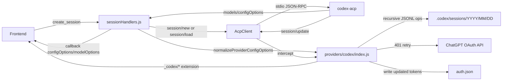

# Codex Provider

The Codex provider connects AcpUI to the `codex-acp` executable. The main implementation risk is that Codex advertises models and config options dynamically, while AcpUI already owns the model selector.

## Overview

**What It Does**

- Starts `codex-acp` as a provider runtime.
- Initializes ACP with terminal support and AcpUI client metadata.
- Authenticates only when configured or when API-key environment variables are present.
- Captures Codex dynamic models from `session/new` and `session/load`.
- Filters the Codex `model` config option while preserving `reasoning_effort`.
- Finds, clones, archives, restores, and parses recursive Codex rollout JSONL files.
- **Fetches background quota status** on startup, turn completion, and 30s poll.
- **Manages automatic OAuth token refresh** by deriving `client_id` from JWT access tokens in `auth.json`.
- **Extracts canonical tool identity** via `extractToolInvocation()` using `toolIdPattern` (`{mcpName}/{toolName}`).
- **Tracks active prompts** to only poll quota while the daemon is actively processing messages.
- **Replays persisted context usage** through `emitCachedContext(sessionId)` when the backend loads or hot-resumes a session.

**Why This Matters**

- Codex rollouts are not flat files; cleanup and forking must search recursively.
- Codex command updates omit leading slashes; the frontend slash-command UI expects them.
- Codex `session/set_config_option` expects a raw string value for value IDs.
- Quota information requires standard ChatGPT OAuth credentials (`auth.json`), which expire and need reactive refreshing to prevent UI "Stale" states.

## How It Works

1. **Provider Registry Loads Codex**

   `configuration/providers.json` includes:

   ```json
   { "id": "Codex", "path": "./providers/codex", "enabled": true }
   ```

   `backend/services/providerLoader.js:96` merges the provider module with default hooks. `normalizeConfigOptions` is part of the default contract at `backend/services/providerLoader.js:73`.

2. **Daemon Startup**

   `backend/services/acpClient.js:91` spawns `config.command` with `config.args`. Codex uses `codex-acp` with no extra args.

3. **Environment Preparation**

   `providers/codex/index.js` (Function: `prepareAcpEnvironment`, Line: 344) injects configured `CODEX_API_KEY` or `OPENAI_API_KEY` into the child environment. It also supports `noBrowser`.

4. **Handshake**

   `providers/codex/index.js` (Function: `performHandshake`, Line: 430) sends:

   ```json
   {
     "protocolVersion": 1,
     "clientCapabilities": { "terminal": true },
     "clientInfo": { "name": "AcpUI", "version": "1.0.0" }
   }
   ```

   It sends `authenticate` only if `authMethod` or env/configured API keys require it.

5. **Session Creation**

   `backend/sockets/sessionHandlers.js` (Lines 214-268) sends `session/new` with `cwd`, AcpUI MCP server config, and provider session params.

6. **Initial Model And Config Capture**

   `backend/sockets/sessionHandlers.js` (Function: `captureModelState`) calls `captureModelState`. The helper captures both model state and normalized config options.

7. **Config Option Updates**

   `providers/codex/index.js` (Function: `intercept`, Line: 178) filters `model` and marks `reasoning_effort`. `providers/codex/index.js` (Line 202) converts `config_option_update` into `_codex/config_options`.

8. **Slash Commands**

   `providers/codex/index.js` (Function: `intercept`, Line: 163) also converts `available_commands_update` to `_codex/commands/available` and prefixes `/`.

9. **Tool Calls**

   `providers/codex/index.js` (Function: `extractToolOutput`, Line: 116) extracts output from ACP content blocks or Codex raw output. `providers/codex/index.js` (Function: `extractToolInvocation`, Line: 302) implements `extractToolInvocation()` to resolve canonical identity and input using `toolIdPattern` (e.g. `{mcpName}/{toolName}`). `normalizeTool()` uses the same pattern to strip `Tool: AcpUI/` prefixes for display.

10. **Session Files**

    `providers/codex/index.js` finds rollout JSONL files recursively, clones/prunes by user-turn boundaries, trims from the next turn start boundary (so forked files never retain orphan `response_item` user prompts), copies matching task directories, and parses modern Codex rollout records for rehydration (`event_msg`, `response_item`, and `compacted`).
    - Rehydration links tool starts/ends through `call_id` across `function_call`, `function_call_output`, `exec_command_end`, `custom_tool_call`, and `patch_apply_end`.
    - `compacted.replacement_history` is treated as the replacement source-of-truth for earlier messages when compaction records appear.

11. **Quota & OAuth Management**

    `providers/codex/index.js` (Line 365) starts background fetching in `prepareAcpEnvironment()`.
    - **Initial Load:** Fetches quota immediately on boot and emits `_codex/provider/status`.
    - **Reactive Refresh:** `fetchCodexQuota()` (Lines 430-456) implements a retry loop. On 401, it reads `auth.json`, refreshes the token, saves it, and retries.
    - **Client ID Derivation:** `extractClientIdFromAccessToken()` (Lines 506-516) decodes the JWT `access_token` from `auth.json` to find the `client_id` automatically.
    - **Poll Control:** `intercept()` (Lines 116-248) tracks `_activePromptCount`. Polling only occurs when at least one prompt is in-flight and stops when all turns end.

## Architecture Diagram



## Critical Contract

Codex exposes `model` twice: once through `models.availableModels` and once as a select config option. AcpUI must use `models.availableModels` for the model selector and remove the `model` config option before it reaches the provider settings UI.

For **Quota Status**, the provider depends on `~/.codex/auth.json` containing a standard ChatGPT OAuth payload. The `access_token` **must** be a valid JWT for the provider to automatically derive the `client_id` needed for token refreshes.

## Configuration

Provider files:

| File | Purpose |
| --- | --- |
| `providers/codex/provider.json` | Static provider identity, protocol prefix, MCP name, tool categories |
| `providers/codex/branding.json` | UI labels and image compression size |
| `providers/codex/user.json` | Local command, auth mode, paths, model defaults |
| `providers/codex/index.js` | Provider contract implementation |

Important local settings:

- `"command": "codex-acp"`
- `"authMethod": "auto"`
- `"fetchQuotaStatus": true` (Enables status display)
- `"refreshQuotaOAuth": true` (Enables background 401 refresh)
- `"quotaStatusIntervalMs": 30000` (Poll frequency)
- `"paths.sessions": "%USERPROFILE%\\.codex\\sessions"`

## Data Flow

Raw Codex response:

```json
{
  "models": {
    "currentModelId": "model/medium",
    "availableModels": [{ "id": "model/medium", "name": "Model (medium)" }]
  },
  "configOptions": [
    { "id": "model", "currentValue": "model" },
    { "id": "reasoning_effort", "currentValue": "medium" }
  ]
}
```

Backend capture:

```js
const configOptions = normalizeProviderConfigOptions(providerModule, source.configOptions);
meta.configOptions = mergeConfigOptions(meta.configOptions, configOptions);
```

Frontend receives:

```json
{
  "modelOptions": [{ "id": "model/medium", "name": "Model (medium)" }],
  "configOptions": [
    { "id": "reasoning_effort", "kind": "reasoning_effort", "currentValue": "medium" }
  ]
}
```

## Component Reference

| File | Key Functions | Purpose |
| --- | --- | --- |
| `providers/codex/index.js` | `performHandshake`, `prepareAcpEnvironment` | Startup, auth, and quota init |
| `providers/codex/index.js` | `intercept`, `normalizeConfigOptions` | Config/Command updates; active prompt tracking; error message promotion |
| `providers/codex/index.js` | `fetchCodexQuota` | Handled OAuth-backed quota retrieval with 401 retry |
| `providers/codex/index.js` | `refreshCodexOAuthToken` | Refreshes and persists tokens to `auth.json` |
| `providers/codex/index.js` | `buildCodexProviderStatus` | Maps raw ChatGPT usage JSON to UI status shape |
| `providers/codex/index.js` | `getMcpServerMeta` | Injects MCP timeout overrides into server config `_meta` when `acpSupportsMcpTimeouts` is enabled |
| `providers/codex/index.js` | `emitCachedContext` | Emits cached `{protocolPrefix}metadata` context usage after session load or hot-resume |
| `providers/codex/index.js` | `setConfigOption` | Routes mode/model/reasoning changes |
| `providers/codex/index.js` | `extractToolInvocation` | V2 canonical tool identity extraction |
| `providers/codex/index.js` | `getSessionPaths`, `cloneSession`, `parseSessionHistory` | Rollout lifecycle |
| `backend/sockets/sessionHandlers.js` | `captureModelState` | Captures response-time config options |
| `backend/services/sessionManager.js` | `normalizeProviderConfigOptions` | Shared provider config normalization |
| `backend/services/acpUpdateHandler.js` | `handleUpdate` | Applies normalization to native config updates |

## MCP Timeout Configuration

Codex ACP has a known upstream bug where MCP tool calls can time out around the 2-minute mark (see https://github.com/zed-industries/codex-acp/issues/277). When a future `codex-acp` release adds support for MCP timeout overrides via `_meta`, AcpUI can inject them automatically.

Enable in `providers/codex/user.json`:

```json
{
  "acpSupportsMcpTimeouts": true,
  "acpMcpStartupTimeoutSec": 30,
  "acpMcpToolTimeoutSec": 3600
}
```

When `acpSupportsMcpTimeouts` is `true`, `getMcpServerMeta()` returns:

```json
{
  "codex_acp": { "startup_timeout_sec": 30, "tool_timeout_sec": 3600 }
}
```

This is spread as `_meta` on the MCP server config entry in both `session/new` and `session/load` requests. Fields are omitted individually if their value is not a positive integer. Set `acpSupportsMcpTimeouts: false` (the default) until upstream support is confirmed.

Because Codex can retry long-running MCP calls when the upstream timeout path is hit or a result is lost, AcpUI's `ux_invoke_subagents` and `ux_invoke_counsel` handlers are replay-protected. Duplicate calls with the same provider/session/tool/MCP request identity join the active invocation or return the recent cached result instead of spawning another sub-agent batch.

## Gotchas

1. **Do not advertise `fs` in initialize.** AcpUI does not implement Codex fs proxy requests.
2. **Do not advertise Codex terminal-output metadata until the backend consumes it.** Without it, Codex keeps normal tool output in content/raw output.
3. **Do not send API keys inside JSON-RPC params.** Codex ACP reads API keys from child process env vars during `authenticate`.
4. **Do not wrap config option values.** `session/set_config_option` must send `"value": "high"`.
5. **Do not assume flat session files.** Codex stores rollouts in dated subdirectories.
6. **Do not auto-trigger ChatGPT auth in `"auto"` mode.** It can launch browser/device login during backend startup.
7. **Do not persist the Codex `model` config option.** It is represented by AcpUI model state instead.
8. **Automatic OAuth refresh requires a valid JWT.** If `auth.json` contains an opaque token without a `client_id`, refresh will fail.
9. **Codex buries the user-facing error message in `error.data.message`.** The JSON-RPC top-level `error.message` is always the generic sentinel `"Internal error"` (-32603). The `intercept()` function promotes `error.data.message` to `error.message` so the real cause (e.g. `usage_limit_exceeded`) surfaces in logs and in the UI error box.
10. **Avoid double-counting assistant text during rehydration.** When `event_msg/agent_message` exists, treat `response_item/message(role=assistant)` as fallback-only for text to prevent duplicate assistant outputs.
11. **`acpSupportsMcpTimeouts` is `false` by default.** The `_meta` timeout injection only activates when explicitly set to `true`. Until `codex-acp` officially supports MCP `_meta` timeout overrides, leave this disabled to avoid sending unexpected fields to the daemon.
12. **Sub-agent MCP retries must stay idempotent.** Codex may retry a long-running MCP tool call. Do not remove the sub-agent idempotency key path in `backend/mcp/mcpServer.js` or the active/completed replay cache in `backend/mcp/subAgentInvocationManager.js`.

## Unit Tests

- `providers/codex/test/index.test.js`
  - **Quota Status:** Handshake, 401 refresh loop, client ID derivation, status mapping
  - Handshake and auth selection
  - Environment injection
  - Command/config update normalization; error message promotion
  - Config option routing
  - Tool output/path/diff extraction
  - Tool normalization/categorization
  - Rollout cloning and parsing (modern Codex JSONL schema + compaction handling)

- `backend/test/sessionHandlers.test.js`
  - `captures normalized config options returned by session/new`

## How To Use This Guide

**For extending Codex provider behavior**

1. Start at `providers/codex/index.js`.
2. Check whether the behavior is live-streaming, response-time capture, or rollout parsing.
3. Update provider tests first if the protocol shape is new.
4. Keep `providers/codex/ACP_PROTOCOL_SAMPLES.md` aligned with the source-derived shape.

**For debugging**

1. Confirm `codex-acp` is on `PATH`.
2. Check `providers/codex/user.json` paths.
3. Check whether the data arrived in the response (`session/new` or `session/load`) or as `session/update`.
4. For rehydration/forking bugs, inspect the rollout file under `.codex/sessions/YYYY/MM/DD`.
5. If Quota is stale, check `auth.json` last modified time and backend logs for refresh errors.

## Summary

- Codex is a normal AcpUI provider with `_codex/` extension events.
- Models are dynamic and come from Codex ACP response metadata.
- **Quota Status** is fetched from ChatGPT OAuth APIs with automatic token refresh.
- The `model` config option is filtered by design.
- `reasoning_effort` is retained and marked for footer/settings rendering.
- Sessions are recursive Codex rollout JSONL files.
- Provider tests cover protocol translation and rollout lifecycle behavior.
