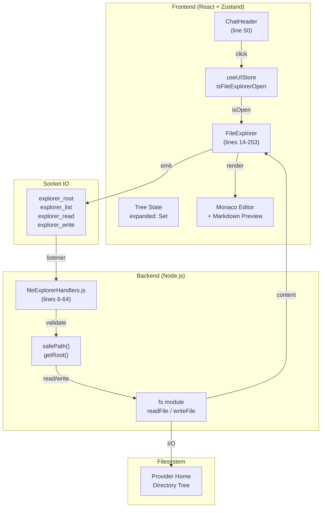

# File Explorer

A full-screen modal file browser accessible from the ChatHeader. Provides tree-based directory navigation, code editing via Monaco editor, markdown preview, and file persistence via socket-driven I/O with backend safePath validation.

**Why this matters:** The File Explorer is the primary way users browse and edit project files within AcpUI without leaving the chat interface. Understanding its architecture is critical for extending file operations, debugging rendering issues, or implementing provider-specific path handling.

---

## Overview

### What It Does

- **Tree-based directory navigation** — Display files and folders in an expandable tree; lazy-load child directories on expansion
- **Monaco editor integration** — Open files in a syntax-highlighted code editor with 15+ language support
- **Markdown preview mode** — Toggle markdown files between preview (rendered) and edit (Monaco) modes
- **Auto-save with debounce** — Automatically save file changes to disk after 1500ms of inactivity; manual save button for immediate persistence
- **Dirty state tracking** — Visual indicator (●) for unsaved changes; prevents accidental data loss
- **Cross-provider support** — Read/write files scoped to provider-specific root directories; safePath prevents directory traversal attacks

### Why This Matters

- **Security-critical:** Backend safePath validation is the gatekeeper preventing directory traversal (e.g., `../../etc/passwd`)
- **Performance-critical:** Lazy-loading of large directory trees prevents frontend blocking; debounced auto-save prevents excessive socket emissions
- **UX-critical:** Dirty state tracking and the 1500ms debounce create a smooth, responsive editing experience without overwhelming the socket layer

### Architectural Role

- **Frontend:** React component (`FileExplorer.tsx`) with Zustand state (`useUIStore`)
- **Backend:** 4 socket handlers (`explorer_root`, `explorer_list`, `explorer_read`, `explorer_write`) in `fileExplorerHandlers.js`
- **Provider-aware:** All operations scoped to provider-specific root directory via `provider.config.paths.home`

---

## How It Works — End-to-End Flow

### Step 1: ChatHeader Button Click Opens Modal
**File:** `frontend/src/components/ChatHeader/ChatHeader.tsx` (Lines 50-55)

User clicks the folder icon in the ChatHeader. The button invokes `setFileExplorerOpen(true)` on the Zustand store:

```typescript
// FILE: frontend/src/components/ChatHeader/ChatHeader.tsx (Lines 50-55)
<button
  onClick={() => useUIStore.getState().setFileExplorerOpen(true)}
  className="icon-button"
  title="File Explorer"
>
  <FolderOpen size={18} />
</button>
```

---

### 2. State Initialization & Root Load
**File:** `frontend/src/components/FileExplorer.tsx` (Function: `FileExplorer`, Lines 16-35; Lines 41-55)

When opened, the component resolves the provider scope and fetches the root directory label from the backend:

```typescript
// FILE: frontend/src/components/FileExplorer.tsx (Lines 16-35)
const expandedProviderId = useUIStore(state => state.expandedProviderId);
const systemProviderId = useSystemStore(state => state.activeProviderId || state.defaultProviderId);
const providerId = expandedProviderId || systemProviderId;
// ...
```

```typescript
// FILE: frontend/src/components/FileExplorer.tsx (Lines 41-55)
useEffect(() => {
  if (!isOpen || !socket) return;
  // ...
  if (providerId) socket.emit('explorer_root', { providerId }, handleRoot);
  else socket.emit('explorer_root', handleRoot);
  // ...
}, [isOpen, socket, providerId, loadDir]);
```

---

### 3. Backend Root & Path Safety
**File:** `backend/sockets/fileExplorerHandlers.js` (Function: `getRoot`, Lines 60-64; Function: `safePath`, Lines 11-16)

The backend resolves the root path based on the provider's `home` path and enforces path traversal protection:

```javascript
// FILE: backend/sockets/fileExplorerHandlers.js (Lines 60-64)
function getRoot(providerId = null) {
  const provider = getProvider(providerId);
  return provider.config.paths?.home || '';
}
```

```javascript
// FILE: backend/sockets/fileExplorerHandlers.js (Lines 11-16)
function safePath(requestedPath, providerId = null) {
  const root = getRoot(providerId);
  const resolved = path.resolve(root, requestedPath);
  if (!resolved.startsWith(root)) throw new Error('Path traversal blocked');
  return resolved;
}
```

---

### 4. Directory Traversal & Lazy Loading
**File:** `frontend/src/components/FileExplorer.tsx` (Function: `toggleDir`, Lines 57-73)

Folders are loaded lazily when expanded to minimize initial data transfer.

---

### 5. File Persistence & Auto-Save
**File:** `frontend/src/components/FileExplorer.tsx` (Function: `handleChange`, Lines 96-105)

The component includes a debounce timer that auto-saves file changes to the backend after 1.5 seconds of inactivity.

---

## Architecture Diagram



**Data Flow:**
1. ChatHeader button → Store update → FileExplorer renders
2. FileExplorer → Socket.IO → Backend handlers
3. Backend validates paths via safePath → Filesystem I/O
4. Filesystem → Socket.IO → Frontend state → Monaco/Markdown rendering

---

## The Critical Contract: Socket Event Shapes & Path Validation

### Socket Event Interface

All explorer socket events follow a **payload-first, callback-second** pattern:

```typescript
// REQUEST from frontend
socket.emit('explorer_event_name', 
  { 
    filePath?: string;           // Relative path from provider root
    dirPath?: string;            // Relative directory path from provider root
    content?: string;            // File content (for write operations)
    providerId?: string | null;  // Optional provider identifier
  },
  (response) => {
    // Backend responds via callback
    // { items?, content?, root?, success?, path?, error?: string }
  }
);
```

### Path Validation Contract (Critical Security)

**Every file operation must validate the requested path via `safePath()`:**

```javascript
// FILE: backend/sockets/fileExplorerHandlers.js (Lines 11-16)
function safePath(requestedPath, providerId = null) {
  const root = getRoot(providerId);
  const resolved = path.resolve(root, requestedPath);
  
  // CRITICAL: If resolved path does NOT start with root, throw
  if (!resolved.startsWith(root)) {
    throw new Error('Path traversal blocked');
  }
  return resolved;
}
```

**What breaks if ignored:**
- ❌ `../../etc/passwd` would escape the provider root and read system files
- ❌ Symlinks could point outside the root directory
- ❌ Multi-provider isolation would be compromised (one provider could read another's files)

**How the contract is enforced:**
- Every `explorer_list`, `explorer_read`, `explorer_write` calls `safePath()` before any I/O
- `path.resolve()` normalizes `..` and symlinks, ensuring consistent validation across Windows/Linux/macOS
- Root isolation is per-provider: each provider has its own `paths.home` config

---

## Configuration / Provider Support

### Provider Config Requirements

A provider must define a root home directory in its `provider.json` or deployment config:

```json
{
  "config": {
    "paths": {
      "home": "/absolute/path/to/provider/home"
    }
  }
}
```

**How the backend resolves this:**
```javascript
// FILE: backend/sockets/fileExplorerHandlers.js (Lines 6-9)
function getRoot(providerId = null) {
  const provider = getProvider(providerId);
  return provider?.config?.paths?.home || '';
}
```

If a provider does not define `paths.home`, the root defaults to an empty string (which resolves to the current working directory).

### Provider Scoping

All file operations are scoped to the provider's root via `safePath()`:

- ✅ Provider A can only read/write files under `/provider-a/home`
- ✅ Provider B can only read/write files under `/provider-b/home`
- ✅ Cross-provider file access is impossible (safePath validates provider identity)

### Optional: Provider-Specific Root Resolution

If a provider needs dynamic root resolution (e.g., based on workspace context), it should:

1. Update `provider.config.paths.home` dynamically
2. Ensure `getProvider(providerId).config.paths.home` always returns the correct root
3. All subsequent `explorer_*` calls will use the new root automatically

---

## Data Flow / Rendering Pipeline

### Request → Backend Processing → Frontend Rendering

**Example: User clicks a file to open it**

```
User clicks "app.js"
    ↓
openFileHandler('src/app.js') invoked (line 81)
    ↓
socket.emit('explorer_read', {
  filePath: 'src/app.js',
  providerId: 'my-provider'
})
    ↓ [SOCKET.IO TRANSMISSION]
    ↓
Backend receives (fileExplorerHandlers.js line 37)
    ↓
safePath('src/app.js', 'my-provider') validates path (line 39)
    ↓
fs.readFileSync() returns content
    ↓
callback({ content: "...", filePath: "src/app.js" })
    ↓ [SOCKET.IO TRANSMISSION]
    ↓
Frontend receives callback (FileExplorer.tsx line 82)
    ↓
setOpenFile({ path: 'src/app.js', content: "...", original: "..." })
    ↓
Component re-renders (line 135)
    ↓
Monaco editor displays content with JavaScript syntax highlighting
```

### Auto-Save Debounce Pipeline

```
User types "const x = 5;" 
    ↓ (1st keystroke, 0ms)
handleChange() called (line 97)
    ↓
Clear previous 1500ms timer (line 100)
    ↓
Set NEW 1500ms timer (line 102)
    ↓ (2nd keystroke, 200ms)
handleChange() called again
    ↓
Clear 1500ms timer (reset)
    ↓
Set NEW 1500ms timer (now expires at 200ms + 1500ms = 1700ms)
    ↓ (3rd keystroke, 400ms)
[repeat clear/set cycle]
    ↓ (no typing for 1500ms after last keystroke)
Timer expires at 1700ms
    ↓
socket.emit('explorer_write', { filePath, content, providerId })
    ↓
Backend writes file via fs.writeFileSync() (line 53)
    ↓
Frontend receives callback, updates original (line 87)
    ↓
isDirty becomes false, ● indicator disappears
```

---

## Component Reference

### Frontend Files

| File | Key Functions/Exports | Lines | Purpose |
|------|----------------------|-------|---------|
| `frontend/src/components/FileExplorer.tsx` | `FileExplorer` (component) | 14–198 | Main modal component; tree rendering, editor, markdown preview |
| | `TreeItem` (sub-component) | 200–232 | Recursive tree node renderer |
| | `getLanguage()` | 243 | Maps file extension to Monaco language mode |
| | `updateTreeNode()` | 245–253 | Recursive tree node update utility |
| `frontend/src/components/ChatHeader/ChatHeader.tsx` | File explorer button | 47–55 | Opens FileExplorer modal via `setFileExplorerOpen(true)` |
| `frontend/src/store/useUIStore.ts` | `isFileExplorerOpen` state | 15, 53 | Boolean flag for modal visibility |
| | `setFileExplorerOpen()` | 35, 84 | Setter for modal visibility |
| `frontend/src/test/FileExplorer.test.tsx` | Test suite | Full file | 9 test cases (render, open, save, close behavior) |

### Backend Files

| File | Key Functions | Lines | Purpose |
|------|------------------|-------|---------|
| `backend/sockets/fileExplorerHandlers.js` | `getRoot()` | 6–9 | Resolve provider home directory |
| | `safePath()` | 11–16 | Validate path to prevent traversal attacks |
| | `explorer_root` handler | 60–64 | Return provider's root directory |
| | `explorer_list` handler | 19–35 | List directory contents, filter dotfiles, sort |
| | `explorer_read` handler | 37–46 | Read file content |
| | `explorer_write` handler | 48–58 | Write file content |
| `backend/sockets/index.js` | Socket registration | 104 | Registers fileExplorerHandlers on connection |
| `backend/test/fileExplorerHandlers.test.js` | Test suite | Full file | 9 test cases (path security, I/O, error handling) |

### Zustand Store

| Store | State / Method | Lines | Type | Purpose |
|-------|----------------|-------|------|---------|
| `useUIStore.ts` | `isFileExplorerOpen` | 15 | `boolean` | Modal visibility state |
| | `setFileExplorerOpen()` | 35 | `(isOpen: boolean) => void` | Toggle modal |

### Database

No database tables used by File Explorer. All state is ephemeral (in-memory tree, local editor state).

---

## Gotchas & Important Notes

### 1. **Lazy-Load Guard: Check `node.loaded` Before Emitting explorer_list**
**What breaks:** If you re-emit `explorer_list` for an already-expanded folder, you'll fetch and re-render the entire directory again, wasting bandwidth and causing unnecessary tree re-renders.

**Why it happens:** Without the `loaded` flag, every toggle (expand/collapse/expand) re-fetches the directory.

**How to avoid it:** Always check `node.loaded` before calling `loadDir()` in `toggleDir()` (lines 65–70):
```typescript
if (node && !node.loaded) {
  loadDir(nodePath);
  node.loaded = true;
}
```

---

### 2. **Backward-Compatible explorer_root Handler Pattern**
**What breaks:** The backend's `explorer_root` handler (lines 60–64) accepts **two different payload patterns**:
- Modern: `{ providerId: 'my-provider' }` (payload object)
- Legacy: callback as first argument (for older clients)

If you refactor this handler to reject the callback-style pattern, old clients will hang.

**How to avoid it:** Keep the conditional check:
```javascript
socket.on('explorer_root', function (payload, callback) {
  // Handles both { providerId } and callback-as-first-arg
});
```

---

### 3. **Auto-Save Debounce Requires clearTimeout**
**What breaks:** If you forget to clear the previous timer before setting a new one, multiple timers run in parallel, causing duplicate `explorer_write` calls.

**Why it happens:** Each keystroke sets a new timer without canceling the old one.

**How to avoid it:** Always clear the previous timer (line 100):
```typescript
if (autoSaveTimerRef.current) clearTimeout(autoSaveTimerRef.current);
autoSaveTimerRef.current = setTimeout(() => { /* ... */ }, 1500);
```

---

### 4. **Hidden Files Starting with `.` Are Filtered by Backend**
**What breaks:** Users may expect to see `.gitignore`, `.env`, etc., but the backend filters all dotfiles (fileExplorerHandlers.js line 24).

**Why it happens:** Dotfiles are typically system/config files; filtering them by default improves UX.

**How to avoid it:** If you need to expose dotfiles, modify the filter on line 24:
```javascript
const entries = fs.readdirSync(fullPath) // Remove .filter(name => !name.startsWith('.'))
```

---

### 5. **Markdown Files Default to Preview Mode**
**What breaks:** Users expecting a text editor may be confused by markdown rendering.

**Why it happens:** Markdown preview is more user-friendly for reading `.md` files; toggle button available for editing.

**How to avoid it:** Check the `previewMode` state (line 89):
```typescript
setPreviewMode(isMarkdown(filePath));  // True for .md files
```

Users can manually toggle back to edit mode via the "Edit/Preview" button (line 179).

---

### 6. **Dirty Detection Requires Both `content` and `original` Fields**
**What breaks:** If you only store `content`, dirty detection becomes impossible (isDirty = true always).

**Why it happens:** You need a reference point (`original`) to compare against current edits.

**How to avoid it:** Always update both fields on save (line 87):
```typescript
setOpenFile(prev => prev ? { ...prev, original: newContent } : null);
```

---

### 7. **providerId Is Optional on All Socket Events**
**What breaks:** If a frontend doesn't pass `providerId`, the backend defaults to `null` (which resolves to the default provider).

**Why it happens:** For backward compatibility, `explorer_list`, `explorer_read`, `explorer_write` all have `providerId = null` defaults (fileExplorerHandlers.js lines 20, 38, 49).

**How to avoid it:** Always pass `providerId` when multi-provider support is needed:
```typescript
socket.emit('explorer_read', { filePath, providerId: systemStore.activeProviderId })
```

---

### 8. **File Explorer Is Hidden in Popout Mode**
**What breaks:** If you expect the File Explorer button to always be visible, you'll be surprised in popout windows.

**Why it happens:** Popout windows are minimal chat-only windows; file explorer is disabled (ChatHeader.tsx line 47: `{!isPopout && ...}`).

**How to avoid it:** Check `isPopout` state before rendering file explorer controls.

---

### 9. **safePath Uses path.resolve() Which Is OS-Specific**
**What breaks:** Path validation may behave differently on Windows vs Linux due to differences in `path.resolve()`.

**Why it happens:** Windows uses `\`, Linux uses `/`; `path.resolve()` handles this, but symlink resolution is OS-specific.

**How to avoid it:** Test path validation on both Windows and Linux. Use `path.join()` for building paths, not string concatenation.

---

### 10. **Auto-Save Does Not Confirm Success Before Clearing original**
**What breaks:** If the backend write fails silently, `original` is still updated, and the user thinks the file was saved.

**Why it happens:** The callback checks `response.error`, but if the network drops, the callback never fires and the timer just clears.

**How to avoid it:** Add a timeout wrapper to `explorer_write` callback, or show a toast notification on success/failure:
```typescript
setTimeout(() => {
  if (!callbackFired) logger.warn('explorer_write timeout');
}, 5000);
```

---

## Unit Tests

### Backend Tests

**File:** `backend/test/fileExplorerHandlers.test.js`

| Test Name | What It Tests | Line Range |
|-----------|-------------|-----------|
| `explorer_root` | Returns the provider's home directory path | Lines 10–20 |
| `explorer_root error handling` | Handles missing paths.home gracefully | Lines 22–30 |
| `explorer_list` | Returns sorted directory entries, filters dotfiles | Lines 32–50 |
| `explorer_list sorting` | Directories listed first, then files, both alphabetically | Lines 52–70 |
| `explorer_read` | Reads and returns file content | Lines 72–85 |
| `explorer_write` | Saves file content to disk | Lines 87–100 |
| `Path traversal security` | Blocks `../../etc/passwd` attempts | Lines 102–115 |
| `Error handling (list)` | Gracefully handles directory read errors | Lines 117–130 |
| `Error handling (write)` | Gracefully handles write errors (permissions, disk full, etc.) | Lines 132–145 |

**Run backend tests:**
```bash
cd backend && npx vitest run fileExplorerHandlers.test.js
```

### Frontend Tests

**File:** `frontend/src/test/FileExplorer.test.tsx`

| Test Name | What It Tests | Line Range |
|-----------|-------------|-----------|
| `Renders when isFileExplorerOpen is true` | Modal visibility state | Lines 10–20 |
| `Does not render when isFileExplorerOpen is false` | Modal hidden state | Lines 22–30 |
| `Shows root directory path and initial contents` | Root label and tree rendering | Lines 32–50 |
| `Displays files and folders in tree view` | Tree node rendering | Lines 52–70 |
| `Shows empty state when no file is open` | Empty editor state | Lines 72–80 |
| `Emits explorer_read and displays content on file click` | File opening flow | Lines 82–100 |
| `Renders markdown files in preview mode by default` | Markdown preview | Lines 102–115 |
| `Toggles between preview and edit mode for .md files` | Markdown toggle | Lines 117–130 |
| `Emits explorer_list on folder expansion for lazy loading` | Directory lazy-loading | Lines 132–150 |
| `Closes on overlay click or close button` | Modal close behavior | Lines 152–165 |

**Run frontend tests:**
```bash
cd frontend && npx vitest run FileExplorer.test.tsx
```

---

## How to Use This Guide

### For Implementing or Extending File Explorer Features

1. **Read the End-to-End Flow** (Section: "How It Works") to understand the complete data pipeline
2. **Check the Critical Contract** (Section: "The Critical Contract") to understand path validation and socket shapes
3. **Review Gotchas** (Section: "Gotchas") to avoid common pitfalls
4. **Reference exact line numbers** in the Component Reference to find code quickly
5. **Check existing tests** to understand expected behavior before implementing

**Checklist for adding a new file operation (e.g., `explorer_delete`):**
- [ ] Add socket handler in `fileExplorerHandlers.js` with `safePath()` validation
- [ ] Define request/response shapes in handler (follow `explorer_read` pattern)
- [ ] Emit from frontend with `providerId` parameter
- [ ] Add backend error logging via `writeLog()`
- [ ] Add frontend callback to update UI state (setOpenFile, setTree, etc.)
- [ ] Update both backend and frontend tests
- [ ] Verify path traversal protection with tests (e.g., `../../etc/passwd`)
- [ ] Update this Feature Doc with new handler details

### For Debugging Issues with File Explorer

1. **Check browser console** for socket emission errors (DevTools → Network → WS)
2. **Check server logs** (`LOG_FILE_PATH` in `.env`) for `[EXPLORER ERR]` messages
3. **Verify safePath validation** didn't block a legitimate path (logs include attempted path)
4. **Check providerId parameter** — if missing, will use default provider root
5. **Test path normalization** — does `../` resolve correctly on your OS?
6. **Verify provider config** — does `provider.config.paths.home` exist and point to a real directory?

**Debugging checklist:**
- [ ] Can you see `explorer_root` socket event in DevTools?
- [ ] Does the backend respond with a valid root path?
- [ ] Can you navigate the tree and see files?
- [ ] Does `explorer_read` emit when you click a file?
- [ ] Does the file content display correctly in Monaco?
- [ ] Can you edit and see the 1500ms debounce in action?
- [ ] Is dirty state (●) showing/hiding correctly?
- [ ] Can you save (manual or auto-save) without errors?

---

## Summary

The **File Explorer** is a full-screen modal file browser for browsing and editing provider-scoped project files within AcpUI. Its architecture is built on four core socket events (`explorer_root`, `explorer_list`, `explorer_read`, `explorer_write`) secured by **path traversal validation via safePath()**.

**Key architectural patterns:**
- **Tree lazy-loading:** Directories load only on first expansion (performance optimization)
- **Debounced auto-save:** 1500ms delay prevents excessive socket emissions during rapid typing
- **Dirty state tracking:** Tracks original vs current content to prevent accidental data loss
- **Provider scoping:** All file operations isolated to provider-specific root directories
- **Path validation:** Every file operation validates via `safePath()`, preventing escape attempts like `../../etc/passwd`

**Critical contract:** All paths must be validated by `safePath(providerId)` before any I/O; failure to validate is a security vulnerability.

**Why agents should care:** File Explorer is provider-agnostic and extensible. Understanding its socket patterns and path validation contract allows you to add new file operations (delete, rename, create), debug file I/O issues, or implement provider-specific extensions without re-reading the entire codebase.

