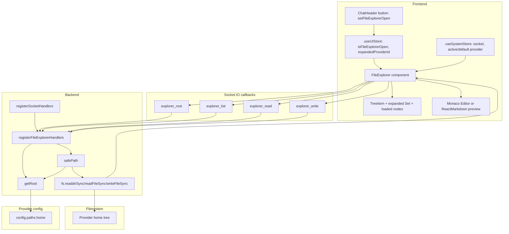

# File Explorer

A full-screen file browser modal that opens from `ChatHeader`, lists provider-scoped files through Socket.IO, renders files in Monaco or markdown preview mode, and writes edits back through backend path validation.

This guide matters because File Explorer combines UI state, provider selection, filesystem access, and save semantics. Most mistakes in this area come from stale assumptions about socket payload shapes, provider root resolution, or when frontend dirty state is cleared.

## Overview

### What It Does

- Opens from the `ChatHeader` file button and is mounted once by `App`.
- Resolves a provider scope from `useUIStore.expandedProviderId`, `useSystemStore.activeProviderId`, or `useSystemStore.defaultProviderId`.
- Loads the provider root label with `explorer_root` and root entries with `explorer_list`.
- Renders an expandable tree using `TreeItem`, `expanded`, and `loaded` node state.
- Opens file contents with `explorer_read`, then renders markdown files in `ReactMarkdown` preview mode or other files in `@monaco-editor/react`.
- Saves edits through `explorer_write` by manual Save button or a 1500 ms editor debounce.

### Why This Matters

- Backend path validation is the filesystem boundary for provider-scoped browsing and writes.
- Frontend save behavior clears dirty state differently for manual saves and debounced saves.
- Directory loading is intentionally lazy to avoid fetching entire provider homes.
- The backend returns callback payloads, not streamed events, so missing callbacks produce silent UI stalls.
- Current tests cover root/list/read/write handlers and main render/open/preview flows; save timing is verified from source.

### Architectural Role

- Frontend modal: `frontend/src/components/FileExplorer.tsx` (Component: `FileExplorer`, helper component: `TreeItem`).
- Frontend state: `frontend/src/store/useUIStore.ts` (State: `isFileExplorerOpen`, action: `setFileExplorerOpen`) and `frontend/src/store/useSystemStore.ts` (State: `socket`, `activeProviderId`, `defaultProviderId`).
- Backend socket handlers: `backend/sockets/fileExplorerHandlers.js` (Export: `registerFileExplorerHandlers`, functions: `getRoot`, `safePath` using shared `resolvePathWithinRoot`).
- Socket registration: `backend/sockets/index.js` (Function: `registerSocketHandlers`, call: `registerFileExplorerHandlers(io, socket)`).
- Persistence: direct filesystem reads and writes through Node `fs`; no database tables are used.

## How It Works - End-to-End Flow

1. User opens the modal from the chat header.

   File: `frontend/src/components/ChatHeader/ChatHeader.tsx` (Component: `ChatHeader`, button title: `File Explorer`)

   ```tsx
   <button
     onClick={() => useUIStore.getState().setFileExplorerOpen(true)}
     className="icon-button"
     title="File Explorer"
   >
     <FolderOpen size={18} />
   </button>
   ```

   The button is rendered only when the URL query does not include `popout`. The action flips `useUIStore.isFileExplorerOpen` to `true`.

2. `App` keeps `FileExplorer` mounted at the application level.

   File: `frontend/src/App.tsx` (Component: `App`, child component: `FileExplorer`)

   ```tsx
   <SessionSettingsModal />
   <SystemSettingsModal />
   <NotesModal />
   <FileExplorer />
   <HelpDocsModal />
   ```

   `FileExplorer` returns `null` while `isFileExplorerOpen` is false, so the modal state is controlled entirely through the UI store.

3. `FileExplorer` resolves socket and provider scope.

   File: `frontend/src/components/FileExplorer.tsx` (Component: `FileExplorer`, state selectors: `socket`, `expandedProviderId`, `activeProviderId`, `defaultProviderId`)

   ```tsx
   const socket = useSystemStore(state => state.socket);
   const expandedProviderId = useUIStore(state => state.expandedProviderId);
   const systemProviderId = useSystemStore(state => state.activeProviderId || state.defaultProviderId);
   const providerId = expandedProviderId || systemProviderId;
   ```

   The expanded provider from the sidebar wins over the active/default provider. Socket requests include `providerId` only when one is available.

4. Opening the modal resets local file state and fetches root metadata.

   File: `frontend/src/components/FileExplorer.tsx` (Hook: root-load `useEffect`, socket event: `explorer_root`)

   ```tsx
   setTree([]);
   setExpanded(new Set());
   setOpenFile(null);
   setPreviewMode(false);

   if (providerId) socket.emit('explorer_root', { providerId }, handleRoot);
   else socket.emit('explorer_root', handleRoot);
   ```

   The root callback updates `rootLabel`. The same effect then calls `loadDir('')` to populate the first tree level.

5. Backend registration attaches explorer socket handlers to each connection.

   File: `backend/sockets/index.js` (Function: `registerSocketHandlers`, registration: `registerFileExplorerHandlers`)

   ```js
   registerSystemSettingsHandlers(io, socket);
   registerFolderHandlers(io, socket);
   registerFileExplorerHandlers(io, socket);
   registerGitHandlers(io, socket);
   ```

   File Explorer uses Socket.IO callbacks for all responses. It does not expose HTTP routes.

6. `explorer_root` resolves the provider home directory.

   File: `backend/sockets/fileExplorerHandlers.js` (Function: `getRoot`, socket event: `explorer_root`)

   ```js
   function getRoot(providerId = null) {
     const provider = getProvider(providerId);
     return provider.config.paths?.home || '';
   }

   socket.on('explorer_root', (payload, callback) => {
     const cb = typeof payload === 'function' ? payload : callback;
     const providerId = typeof payload === 'object' && payload !== null ? payload.providerId || null : null;
     cb?.({ root: getRoot(providerId) });
   });
   ```

   `explorer_root` accepts either `{ providerId }` plus callback or a callback as the first argument. The returned root string is used as a label in the modal header.

7. `explorer_list` validates and lists a directory.

   File: `backend/sockets/fileExplorerHandlers.js` (Socket event: `explorer_list`, functions: `safePath`, `resolvePathWithinRoot`, `fs.readdirSync`)

   ```js
   const fullPath = safePath(payload.dirPath || '.', payload.providerId || null);
   const entries = fs.readdirSync(fullPath, { withFileTypes: true });
   const items = entries
     .filter(e => !e.name.startsWith('.'))
     .map(e => ({ name: e.name, isDirectory: e.isDirectory() }))
     .sort((a, b) => {
       if (a.isDirectory !== b.isDirectory) return a.isDirectory ? -1 : 1;
       return a.name.localeCompare(b.name);
     });
   callback?.({ items, path: payload.dirPath || '' });
   ```

   Dotfiles are omitted. Directories sort before files, and entries of the same type sort alphabetically.

8. `TreeItem` expands directories lazily.

   File: `frontend/src/components/FileExplorer.tsx` (Component: `TreeItem`, handler: `toggleDir`, helper: `updateTreeNode`)

   ```tsx
   if (!node.loaded) {
     loadDir(node.path, (items) => {
       const children = items.map(e => ({
         name: e.name,
         path: `${node.path}/${e.name}`,
         isDirectory: e.isDirectory,
         children: e.isDirectory ? [] : undefined
       }));
       updateNode(node.path, { children, loaded: true });
     });
   }
   setExpanded(prev => new Set(prev).add(key));
   ```

   The `loaded` flag prevents re-fetching a directory after it has received children.

9. Clicking a file reads content and selects the renderer.

   File: `frontend/src/components/FileExplorer.tsx` (Handler: `openFileHandler`, socket event: `explorer_read`)

   ```tsx
   socket?.emit('explorer_read', { ...(providerId ? { providerId } : {}), filePath }, (res: { content?: string }) => {
     const content = res.content || '';
     setOpenFile({ path: filePath, content, original: content });
     setPreviewMode(filePath.endsWith('.md'));
   });
   ```

   File: `backend/sockets/fileExplorerHandlers.js` (Socket event: `explorer_read`)

   ```js
   const fullPath = safePath(payload.filePath, payload.providerId || null);
   const content = fs.readFileSync(fullPath, 'utf8');
   callback?.({ content, filePath: payload.filePath });
   ```

   Markdown files open in preview mode. Other files render in Monaco with a language from `getLanguage`.

10. Editing and saving writes through `explorer_write`.

    File: `frontend/src/components/FileExplorer.tsx` (Handlers: `handleSave`, `handleChange`, socket event: `explorer_write`)

    ```tsx
    socket.emit('explorer_write', { ...(providerId ? { providerId } : {}), filePath: openFile.path, content: openFile.content }, () => {
      setOpenFile(prev => prev ? { ...prev, original: prev.content } : null);
      setSaving(false);
    });
    ```

    ```tsx
    if (saveTimer.current) clearTimeout(saveTimer.current);
    saveTimer.current = setTimeout(() => {
      if (!socket || !openFile) return;
      socket.emit('explorer_write', { ...(providerId ? { providerId } : {}), filePath: openFile.path, content });
      setOpenFile(prev => prev ? { ...prev, original: content } : null);
    }, 1500);
    ```

    File: `backend/sockets/fileExplorerHandlers.js` (Socket event: `explorer_write`)

    ```js
    const fullPath = safePath(filePath, payload.providerId || null);
    fs.writeFileSync(fullPath, content, 'utf8');
    callback?.({ success: true });
    ```

    Manual save waits for the backend callback before clearing dirty state. Debounced save emits without a callback and clears dirty state immediately after emitting.

## Architecture Diagram



## Critical Contract

The critical contract is: every filesystem operation that receives a user-controlled path must call `safePath(requestedPath, providerId)` before touching `fs`, and `safePath` must delegate containment checks to `resolvePathWithinRoot`.

File: `backend/sockets/fileExplorerHandlers.js` (Function: `safePath`, dependency: `getRoot`)

```js
function safePath(requestedPath, providerId = null) {
  const root = getRoot(providerId);
  return resolvePathWithinRoot(root, requestedPath || '.', 'requested path');
}
```

Contract details:

- `requestedPath` is a relative path from the provider root in frontend calls.
- `providerId` selects the provider passed to `getProvider(providerId)`.
- `getRoot(providerId)` must return a non-empty absolute provider root.
- `resolvePathWithinRoot` uses canonicalization plus `path.relative` containment checks to block traversal, sibling-prefix bypasses, and symlink escapes when parent directories resolve outside root.
- `explorer_list`, `explorer_read`, and `explorer_write` call `safePath` before reading or writing.
- `explorer_root` returns the root label and does not perform file I/O.
- Backend errors return callback payloads such as `{ error: err.message }` or `{ items: [], error: err.message }` and log `[EXPLORER ERR]` through `writeLog`.

Socket callback shapes:

```ts
type ExplorerRootResponse = { root: string };
type ExplorerListResponse = { items: { name: string; isDirectory: boolean }[]; path?: string; error?: string };
type ExplorerReadResponse = { content?: string; filePath?: string; error?: string };
type ExplorerWriteResponse = { success?: true; error?: string };
```

What breaks when the contract is bypassed:

- `../` path segments can escape provider-scoped storage.
- Missing `providerId` can route through the default provider context rather than the intended provider.
- Missing or non-absolute `paths.home` breaks root resolution and prevents safe filesystem operations.
- Frontend code that assumes successful callbacks can clear dirty state while the backend reports a write error.

## Configuration/Data Flow

### Provider Configuration

Provider configs expose the File Explorer root through `paths.home`.

Files: `providers/*/user.json.example` (Config key: `paths.home`)

```json
{
  "paths": {
    "home": "/absolute/path/to/provider/home"
  }
}
```

The backend reads this value through `getProvider(providerId)` in `getRoot`. Providers with environment-variable expansion or default home resolution must make sure the loaded provider config contains the resolved home path before File Explorer requests run.

### Provider Selection Flow

```text
useUIStore.expandedProviderId
  -> useSystemStore.activeProviderId
  -> useSystemStore.defaultProviderId
  -> omitted providerId field
  -> backend getProvider(null) behavior
```

The frontend omits `providerId` from socket payloads when no provider is available. The backend treats missing provider IDs as `null`.

### Directory Data Flow

```text
FileExplorer root-load effect
  -> socket.emit('explorer_root', { providerId }, callback)
  -> backend getRoot(providerId)
  -> callback({ root })
  -> setRootLabel(root)

FileExplorer loadDir('')
  -> socket.emit('explorer_list', { providerId, dirPath: '' }, callback)
  -> backend safePath('.', providerId)
  -> fs.readdirSync(fullPath, { withFileTypes: true })
  -> filter dotfiles, sort directories first, map to { name, isDirectory }
  -> callback({ items, path })
  -> setTree([...TreeNode])
```

### File Rendering Flow

```text
TreeItem file click
  -> openFileHandler(filePath)
  -> socket.emit('explorer_read', { providerId, filePath }, callback)
  -> backend safePath(filePath, providerId)
  -> fs.readFileSync(fullPath, 'utf8')
  -> callback({ content, filePath })
  -> setOpenFile({ path, content, original: content })
  -> setPreviewMode(filePath.endsWith('.md'))
  -> render ReactMarkdown with remarkGfm or Monaco Editor
```

File: `frontend/src/components/FileExplorer.tsx` (Function: `getLanguage`, constant: `EXT_LANG`)

```ts
const EXT_LANG: Record<string, string> = {
  ts: 'typescript', tsx: 'typescript', js: 'javascript', jsx: 'javascript',
  json: 'json', md: 'markdown', css: 'css', html: 'html', yml: 'yaml', yaml: 'yaml',
  py: 'python', sh: 'shell', bash: 'shell', cs: 'csharp', xml: 'xml', sql: 'sql',
};
```

### Save Flow

```text
Monaco onChange
  -> handleChange(content)
  -> update openFile.content
  -> clear saveTimer when present
  -> set saveTimer for 1500 ms
  -> emit explorer_write without callback
  -> set openFile.original to emitted content

Save button
  -> handleSave()
  -> setSaving(true)
  -> emit explorer_write with callback
  -> callback sets openFile.original to current content
  -> callback sets saving(false)
```

The Save button is disabled when `isDirty` is false or `saving` is true. `isDirty` is derived from `openFile.content !== openFile.original`.

## Component Reference

### Frontend

| Area | File | Anchors | Purpose |
|---|---|---|---|
| App mount | `frontend/src/App.tsx` | Component: `App`, child: `FileExplorer` | Mounts the modal once at the application root. |
| Header control | `frontend/src/components/ChatHeader/ChatHeader.tsx` | Component: `ChatHeader`, button title: `File Explorer`, action: `setFileExplorerOpen(true)` | Opens the modal outside popout mode. |
| Modal | `frontend/src/components/FileExplorer.tsx` | Component: `FileExplorer`; handlers: `loadDir`, `toggleDir`, `openFileHandler`, `handleSave`, `handleChange`; helpers: `getLanguage`, `updateTreeNode` | Owns tree state, provider-scoped socket calls, editor state, preview mode, and save behavior. |
| Tree row | `frontend/src/components/FileExplorer.tsx` | Component: `TreeItem` | Recursively renders directories and files, expands folders, and opens files. |
| UI state | `frontend/src/store/useUIStore.ts` | State: `isFileExplorerOpen`, `expandedProviderId`; action: `setFileExplorerOpen` | Stores modal visibility and sidebar-selected provider scope. |
| System state | `frontend/src/store/useSystemStore.ts` | State: `socket`, `activeProviderId`, `defaultProviderId`; action: `setProviders` | Supplies the Socket.IO client and provider IDs used by the modal. |
| Styling | `frontend/src/components/FileExplorer.css` | Selectors: `.file-explorer-overlay`, `.file-explorer-modal`, `.fe-tree`, `.fe-editor`, `.fe-md-preview`, `.fe-save-btn` | Defines modal layout, tree rows, editor panel, markdown preview, dirty marker, and save controls. |

### Backend

| Area | File | Anchors | Purpose |
|---|---|---|---|
| Socket registration | `backend/sockets/index.js` | Function: `registerSocketHandlers`, call: `registerFileExplorerHandlers(io, socket)` | Registers explorer handlers for each connected Socket.IO client. |
| Explorer handlers | `backend/sockets/fileExplorerHandlers.js` | Export: `registerFileExplorerHandlers`; socket events: `explorer_root`, `explorer_list`, `explorer_read`, `explorer_write` | Handles root, directory listing, file reads, and file writes. |
| Root resolution | `backend/sockets/fileExplorerHandlers.js` | Function: `getRoot`; config key: `provider.config.paths.home` | Converts provider ID to the explorer root directory. |
| Path validation | `backend/sockets/fileExplorerHandlers.js` | Function: `safePath`; helper: `resolvePathWithinRoot` | Validates non-empty absolute roots and blocks traversal/sibling-prefix/symlink escapes with canonicalization plus `path.relative`. |
| Logging | `backend/services/logger.js` | Function: `writeLog`; log prefix: `[EXPLORER ERR]` | Records list/read/write failures. |

### Tests

| Area | File | Anchors | Purpose |
|---|---|---|---|
| Frontend tests | `frontend/src/test/FileExplorer.test.tsx` | Suite: `FileExplorer`; mocked socket events: `explorer_root`, `explorer_list`, `explorer_read`, `explorer_write` | Verifies render, root load, file open, markdown preview, directory expansion, and overlay close. |
| Backend tests | `backend/test/fileExplorerHandlers.test.js` | Suite: `File Explorer Handlers`; mocked modules: `fs`, `providerLoader`, `logger` | Verifies root resolution, sorted listing, dotfile filtering, reads, writes, traversal blocking, and error callbacks. |

### Database

No database tables are used. File Explorer state is frontend-local, and file persistence is direct filesystem I/O.

## Gotchas

1. `paths.home` must be non-empty and absolute.

   `getRoot` throws when `paths.home` is missing or relative. This blocks list/read/write until provider home configuration is fixed.

2. `safePath` depends on canonicalized containment checks.

   The guard path is `safePath -> resolvePathWithinRoot`, which canonicalizes existing paths and existing parent directories before applying a `path.relative` boundary check. Keep traversal, sibling-prefix, and symlink-escape tests updated when this logic changes.

3. `explorer_root` accepts two call shapes.

   `FileExplorer` emits `{ providerId }` plus callback when a provider ID exists, and emits callback as the first argument when no provider ID exists. The backend handler selects the callback with `typeof payload === 'function' ? payload : callback`.

4. Dotfiles are filtered on the backend.

   `explorer_list` filters entries whose names start with `.`. Hidden provider files such as `.env`, `.gitignore`, or provider metadata files do not appear in the tree unless the backend filter changes.

5. Directory expansion depends on `loaded` state.

   `toggleDir` fetches children only when `node.loaded` is falsy. If tree updates drop the `loaded` flag, expanded folders re-fetch from the backend.

6. Frontend read/list callbacks tolerate errors by defaulting to empty values.

   `loadDir` passes `res.items || []`, and `openFileHandler` uses `res.content || ''`. Backend errors are available in callback payloads and logs, but the modal does not render an error state.

7. Debounced save does not wait for backend acknowledgement.

   `handleChange` emits `explorer_write` without a callback and sets `original` to the emitted content. This clears dirty state even when the backend write fails after emission.

8. Manual save does not inspect callback payloads.

   `handleSave` clears dirty state and `saving` in the callback regardless of `{ success: true }` or `{ error }`. UI error handling must be added before treating write failures as visible user feedback.

9. Markdown preview unmounts Monaco.

   Markdown files open with `previewMode` set to true, so editing requires toggling the preview button to the edit state. The preview renderer is `ReactMarkdown` with `remarkGfm`.

10. Pending save timers are component-local.

    `saveTimer` is a ref inside `FileExplorer`. Changes to file switching or modal close behavior should clear pending timers explicitly when that behavior needs to cancel debounced writes.

## Unit Tests

### Backend

File: `backend/test/fileExplorerHandlers.test.js` (Suite: `File Explorer Handlers`)

- `explorer_root returns paths.home`: verifies `explorer_root` returns the provider home path from `paths.home`.
- `explorer_root returns an error when paths.home is missing`: verifies missing-root validation.
- `explorer_root returns an error when paths.home is not absolute`: verifies absolute-root enforcement.
- `explorer_list returns sorted entries without dotfiles`: verifies dotfile filtering and directory-first ordering.
- `explorer_read returns file content`: verifies file content callback shape.
- `explorer_read allows spaces and quotes in file names inside root`: verifies safe handling of quoted/spaced names.
- `explorer_write saves file`: verifies `fs.writeFileSync` is called and `{ success: true }` is returned.
- `blocks path traversal`: verifies traversal attempts are rejected.
- `blocks sibling-prefix bypass paths`: verifies prefix-adjacent directories are rejected.
- `blocks symlink escape when target parent resolves outside root`: verifies canonicalization-based symlink escape blocking.
- `handles list errors gracefully`: verifies list failures return `{ items: [], error }`.
- `explorer_list sorts items of same type alphabetically`: verifies same-type alphabetical sorting.
- `explorer_write handles errors gracefully`: verifies write failures return `{ error }`.

Run targeted backend verification:

```bash
npx vitest run test/fileExplorerHandlers.test.js
```

### Frontend

File: `frontend/src/test/FileExplorer.test.tsx` (Suite: `FileExplorer`)

- `renders when open`: verifies root label renders when `isFileExplorerOpen` is true.
- `does not render when closed`: verifies null render when `isFileExplorerOpen` is false.
- `loads and displays root directory`: verifies mocked directory entries render.
- `shows empty state when no file selected`: verifies the empty editor message.
- `opens a file on click`: verifies `explorer_read` payload includes `providerId` and `filePath`, and the editor header shows the file path.
- `opens MD file with preview mode`: verifies markdown files render preview content by default.
- `toggles between preview and edit for MD files`: verifies the preview toggle hides rendered markdown when switching to edit mode.
- `expands directory on click`: verifies `explorer_list` payload includes `providerId` and directory path.
- `closes on overlay click`: verifies overlay click sets `isFileExplorerOpen` to false.

Run targeted frontend verification:

```bash
npx vitest run src/test/FileExplorer.test.tsx
```

Frontend test coverage note: the current suite does not directly assert `handleSave` callback behavior or the 1500 ms `handleChange` debounce. Those behaviors are anchored in `frontend/src/components/FileExplorer.tsx` and should be covered when save UX changes.

## How to Use This Guide

### For Implementing or Extending This Feature

1. Start with `frontend/src/components/FileExplorer.tsx` and identify whether the change touches `loadDir`, `toggleDir`, `openFileHandler`, `handleSave`, or `handleChange`.
2. For new filesystem operations, add a Socket.IO event in `backend/sockets/fileExplorerHandlers.js` inside `registerFileExplorerHandlers` and call `safePath` (which delegates to `resolvePathWithinRoot`) before any `fs` access.
3. Keep provider scope in the frontend payload by following the existing `{ ...(providerId ? { providerId } : {}), ... }` pattern.
4. Return callback payloads with explicit success or error fields, matching the existing `explorer_*` response style.
5. Update `backend/test/fileExplorerHandlers.test.js` with success, error, and path traversal cases for any new backend operation.
6. Update `frontend/src/test/FileExplorer.test.tsx` for visible UI behavior, socket payloads, and callback-driven state changes.
7. Keep this document anchored to file paths, functions, components, socket events, config keys, and test names.

### For Debugging Issues with This Feature

1. Check `useUIStore.isFileExplorerOpen` and `setFileExplorerOpen` if the modal does not appear.
2. Check `useSystemStore.socket`, `activeProviderId`, `defaultProviderId`, and `useUIStore.expandedProviderId` if payloads miss provider scope.
3. Check Socket.IO callback traffic for `explorer_root`, `explorer_list`, `explorer_read`, and `explorer_write` if the UI stalls.
4. Check `[EXPLORER ERR]` logs from `backend/sockets/fileExplorerHandlers.js` when list/read/write callbacks return errors.
5. Check `provider.config.paths.home` through `getRoot` when the root label is empty or paths resolve outside the expected provider directory.
6. Check `safePath` and `resolvePathWithinRoot` behavior with the exact `dirPath` or `filePath` payload when traversal errors appear.
7. Check `openFile.content`, `openFile.original`, `saving`, and `saveTimer` when dirty state or saves behave unexpectedly.
8. Check `previewMode` and `filePath.endsWith('.md')` when markdown renders instead of Monaco.

## Summary

- File Explorer is a Socket.IO-backed modal for browsing and editing provider-scoped files.
- `ChatHeader` opens the modal through `useUIStore.setFileExplorerOpen(true)`, and `App` mounts `FileExplorer` once.
- `FileExplorer` derives provider scope from `expandedProviderId`, `activeProviderId`, and `defaultProviderId`.
- Backend behavior lives in `registerFileExplorerHandlers` with `explorer_root`, `explorer_list`, `explorer_read`, and `explorer_write`.
- The critical contract is that `explorer_list`, `explorer_read`, and `explorer_write` call `safePath`/`resolvePathWithinRoot` before filesystem access.
- Directory listings filter dotfiles, sort directories first, and lazy-load child nodes through `TreeItem` expansion.
- Markdown files use `ReactMarkdown` preview by default; other edit views use Monaco with `getLanguage` extension mapping.
- Manual save waits for a callback; debounced save emits after 1500 ms and clears dirty state without waiting for backend acknowledgement.
