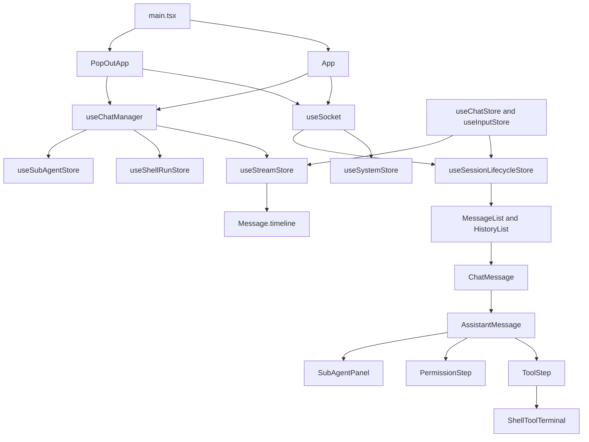

# Feature Doc - Frontend Architecture

AcpUI's frontend is a React, Vite, and Zustand runtime that renders provider-agnostic chat state from Socket.IO events and normalized timeline data. This document is a compact orientation guide for frontend-wide structure; load the specific feature docs for detailed component flows, payload examples, and feature-level gotchas.

---

## Overview

### What It Does

- Selects the normal app or pop-out app root from `frontend/src/main.tsx`.
- Creates one Socket.IO client through `frontend/src/hooks/useSocket.ts` and stores it in `useSystemStore`.
- Hydrates provider metadata, branding, config diagnostics, workspace data, commands, provider extensions, and readiness from backend events.
- Manages session lifecycle, prompt submission, streaming queues, input state, shell runs, sub-agent state, canvas state, and UI state through specialized Zustand stores.
- Renders assistant output from `Message.timeline` through message, tool, permission, shell, and sub-agent components.
- Coordinates normal-window and pop-out-window ownership so one ACP session is watched by the right UI root.

### Why This Matters

- UI session id, ACP session id, provider id, shell run id, and sub-agent invocation id each route different state.
- Socket listeners are centralized; duplicate component-local listeners can corrupt session state or leak subscriptions.
- Streaming correctness depends on ACP-session-keyed queues and the active assistant message map.
- Provider identity and branding must come from backend payloads and store lookups, not hardcoded frontend logic.
- The Unified Timeline is the render source for assistant text, thoughts, tool calls, and permissions.

Architectural role: frontend presentation/runtime layer consuming backend Socket.IO contracts and rendering provider-normalized timeline state.

---

## Scope And Feature Doc Handoffs

Use this document first when starting frontend work, then load the feature doc for the workflow you are changing.

| Work area | Load next |
|---|---|
| Sidebar hierarchy and session display | `[Feature Doc] - Sidebar Rendering.md` |
| Message streaming, typewriter, timeline rendering, tool collapse, or sub-agent panels | `[Feature Doc] - Message Bubble UI & Typewriter System.md` |
| Chat header, input, model picker, attachments, or prompt area | `[Feature Doc] - Chat Header.md`, `[Feature Doc] - Chat Input and Prompt Area.md` |
| Repository documentation browser | `[Feature Doc] - Help Docs Modal.md` |
| Auto-scroll behavior | `[Feature Doc] - Auto-scroll System.md` |
| Canvas, terminal tabs, file explorer, or editor workflows | `[Feature Doc] - Canvas System.md`, `[Feature Doc] - Terminal in Canvas.md`, `[Feature Doc] - File Explorer.md` |
| Settings, session settings, voice, notifications, or provider status | `[Feature Doc] - System Settings Modal.md`, `[Feature Doc] - Session Settings Modal.md`, `[Feature Doc] - Voice-to-Text System.md`, `[Feature Doc] - Notification System.md`, `[Feature Doc] - Provider Status Panel.md` |
| Pop-out coordination | `[Feature Doc] - Pop Out Chat.md` |

This architecture doc intentionally avoids duplicating feature-level rendering rules, socket payload examples, and full test tables that belong in those docs.

---

## Runtime Topology

1. **Root selection**
   File: `frontend/src/main.tsx` (Anchor: `isPopout`)

   The query string selects either `App` for the normal window or `PopOutApp` for the detached session window.

2. **Normal-window shell**
   File: `frontend/src/App.tsx` (Component: `App`)

   `App` mounts sidebar, header, message list, input, modals, canvas pane, socket hooks, scroll behavior, and normal-window session switching.

3. **Pop-out shell**
   File: `frontend/src/PopOutApp.tsx` (Component: `PopOutApp`)

   `PopOutApp` claims a single URL-selected session, runs a dedicated one-time `load_sessions` path, sets explicit loading/ready/error UI states for callback outcomes, watches the selected ACP session when available, and renders the chat surface without the sidebar shell.

4. **Socket bootstrap**
   File: `frontend/src/hooks/useSocket.ts` (Function: `getOrCreateSocket`, Hook: `useSocket`)

   The module-scoped socket registers global bootstrap listeners and writes provider, branding, readiness, config diagnostics, commands, settings, and provider extension data into stores.

5. **Turn-level dispatcher**
   File: `frontend/src/hooks/useChatManager.ts` (Hook: `useChatManager`)

   The chat manager registers stream, stats, rename, shell, sub-agent, and permission listeners. It drops stream events for sessions currently owned by another pop-out window and routes remaining events into lifecycle, stream, shell-run, and sub-agent stores.

6. **State ownership**
   Directory: `frontend/src/store/`

   Zustand stores split global system data, session lifecycle, stream timeline mutation, prompt commands, input, UI settings, canvas state, shell runs, and sub-agent state.

7. **Rendering path**
   Files: `MessageList`, `HistoryList`, `ChatMessage`, `AssistantMessage`, `ToolStep`, `PermissionStep`, `ShellToolTerminal`, `SubAgentPanel`, `renderToolOutput`

   Session messages flow through a stable render tree. Assistant rendering reads `Message.timeline` and delegates specialized output to tool, permission, shell, and sub-agent components.

---

## Architecture Diagram

---

## Identity And Routing Model

| Identity | Use it for | Do not use it for |
|---|---|---|
| `ChatSession.id` | Active session selection, URL `s`, sidebar selection, input and attachments, canvas-open persistence, `save_snapshot` ownership | ACP requests, stream queues, shell/sub-agent routing |
| `ChatSession.acpSessionId` | Socket rooms, prompts, stream queues, stats, permissions, shell runs, sub-agent parent links, backend history calls | Sidebar identity, URL session id, input maps |
| `providerId` | Provider catalog lookup, branding, model/config options, context usage, compaction state, provider status | Hardcoded provider-specific frontend behavior |
| `shellRunId` | Shell snapshots, output routing, terminal state, shell input-wait indicators | Matching by command title or tool label |
| `invocationId` | Sub-agent batch state, bottom-pinned panels, orchestration tool-step collapse behavior | Matching sub-agent UI by display name only |

---

## Socket Event Ownership Map

| Owner | Events | Responsibility |
|---|---|---|
| `useSocket` | `connect`, `disconnect`, `config_errors`, `providers`, `ready`, `voice_enabled`, `workspace_cwds`, `branding`, `sidebar_settings`, `custom_commands`, `session_model_options`, `provider_extension` | Bootstrap and provider-scoped global state hydration |
| `useChatManager` | `stats_push`, `session_renamed`, `merge_message`, `thought`, `token`, `system_event`, `permission_request`, `token_done`, `hooks_status` | Turn-level session, stream, stats, timeline, and permission routing |
| `useChatManager` | `shell_run_prepared`, `shell_run_snapshot`, `shell_run_started`, `shell_run_output`, `shell_run_exit` | Shell run store updates and timeline step patching by `shellRunId` |
| `useChatManager` | `sub_agents_starting`, `sub_agent_started`, `sub_agent_snapshot`, `sub_agent_status`, `sub_agent_invocation_status`, `sub_agent_completed` | Invocation-scoped sub-agent store and lazy sub-agent session state |
| App roots | `watch_session`, `unwatch_session`, `load_sessions`, `create_session`, `save_snapshot`, `canvas_load` | Session room ownership, hydration, persistence, and canvas coordination |

---

## State Ownership Map

| Store | Anchors | Owns |
|---|---|---|
| `useSystemStore` | `setProviders`, `setProviderBranding`, `setInvalidJsonConfigs`, `setContextUsage`, `setProviderStatus`, `getBranding` | Socket instance, provider catalog, branding, config errors, commands, context, compaction, provider status |
| `useSessionLifecycleStore` | `handleInitialLoad`, `handleNewChat`, `handleSessionSelect`, `hydrateSession`, `fetchStats`, `handleSaveSession` | Session list, active session, URL sync, hydration, stats, model/config state |
| `useStreamStore` | `ensureAssistantMessage`, `onStreamThought`, `onStreamToken`, `onStreamEvent`, `processBuffer`, `onStreamDone` | Per-ACP stream queues, adaptive typewriter, timeline mutation, stream completion |
| `useChatStore` | `handleSubmit`, `handleCancel`, `handleForkSession`, `handleRespondPermission` | Prompt submit/cancel/fork/permission command workflows |
| `useInputStore` | `setInput`, `setAttachments`, `handleFileUpload`, `clearInput` | Per-session prompt text and attachments |
| `useUIStore` | `setSidebarOpen`, `setSettingsOpen`, `setSystemSettingsOpen`, `setFileExplorerOpen`, `setHelpDocsOpen`, `incrementVisibleCount`, `toggleAutoScroll` | Sidebar, modal, documentation browser, pagination, and scroll preferences |
| `useCanvasStore` | `handleOpenInCanvas`, `handleOpenFileInCanvas`, `openTerminal`, `resetCanvas` | Canvas artifacts, terminal tabs, file reload, canvas persistence hooks |
| `useShellRunStore` | `upsertSnapshot`, `markStarted`, `appendOutput`, `markExited` | Shell run snapshots and terminal transcripts keyed by `runId` |
| `useSubAgentStore` | `startInvocation`, `setInvocationStatus`, `addAgent`, `setStatus`, `completeAgent`, `setPermission` | Invocation and agent state keyed by parent ACP session and `invocationId` |

---

## Timeline Rendering Contract

- `Message.timeline` is the authoritative assistant render model.
- `useStreamStore.activeMsgIdByAcp[acpSessionId]` identifies the assistant message receiving streamed updates.
- `thought`, `token`, `system_event`, and `permission_request` events must become `TimelineStep` entries instead of separate component-local render state.
- Tool updates merge by `SystemEvent.id`; shell output patches by `shellRunId`; sub-agent panels filter by `invocationId`.
- Provider-scoped data flows through `useSystemStore.providersById`, `useSystemStore.branding`, and `useSystemStore.getBranding(providerId)`.

If this contract is broken, background streams can write into the wrong chat, shell output can attach to the wrong tool, sub-agent panels can display the wrong invocation, and provider metadata can leak between sessions.

---

## Component Reference

| Area | File | Stable Anchors | Purpose |
|---|---|---|---|
| Root split | `frontend/src/main.tsx` | `isPopout` | Selects normal or pop-out app root |
| Normal root | `frontend/src/App.tsx` | `App`, `ConfigErrorModal`, `HelpDocsModal`, session switch effect | Main shell, session room switching, modal roots, canvas coordination |
| Pop-out root | `frontend/src/PopOutApp.tsx` | `PopOutApp`, `claimSession`, `hydrateSession` | Detached single-session runtime |
| Socket singleton | `frontend/src/hooks/useSocket.ts` | `getOrCreateSocket`, `useSocket` | Bootstrap socket creation and global hydration listeners |
| Stream dispatcher | `frontend/src/hooks/useChatManager.ts` | `useChatManager`, `syncShellInputStateForSession` | Turn, shell, sub-agent, stats, and permission event routing |
| Scroll | `frontend/src/hooks/useScroll.ts` | `useScroll`, `scrollToBottom`, `handleScroll`, `handleWheel` | Auto-scroll stickiness and manual override behavior |
| Types | `frontend/src/types.ts` | `ChatSession`, `Message`, `TimelineStep`, `SystemEvent`, `ProviderSummary`, `ProviderBranding` | Shared frontend/backend contract shapes |
| Message viewport | `frontend/src/components/MessageList/MessageList.tsx`, `frontend/src/components/HistoryList.tsx` | `MessageList`, `HistoryList` | Active-session message slicing and memoized message mapping |
| Message rendering | `frontend/src/components/ChatMessage.tsx`, `frontend/src/components/AssistantMessage.tsx` | `ChatMessage`, `AssistantMessage` | Role routing, assistant timeline rendering, local file links, actions, collapse behavior |
| Tool rendering | `frontend/src/components/ToolStep.tsx`, `frontend/src/components/renderToolOutput.tsx` | `ToolStep`, `renderToolOutput` | Tool headers, shell terminals, canvas hoist, output formatting |
| Permission rendering | `frontend/src/components/PermissionStep.tsx` | `PermissionStep` | Permission response UI |
| Shell UI | `frontend/src/components/ShellToolTerminal.tsx`, `frontend/src/store/useShellRunStore.ts` | `ShellToolTerminal`, `useShellRunStore` | Live shell transcript and terminal controls |
| Sub-agent UI | `frontend/src/components/SubAgentPanel.tsx`, `frontend/src/store/useSubAgentStore.ts` | `SubAgentPanel`, `useSubAgentStore` | Invocation-scoped sub-agent status, output, tools, and permissions |
| Extension routing | `frontend/src/utils/extensionRouter.ts` | `routeExtension` | Provider extension dispatch into store actions |
| Ownership | `frontend/src/lib/sessionOwnership.ts` | `claimSession`, `setOwnershipChangeCallback` | BroadcastChannel-backed pop-out ownership coordination |

---

## Gotchas And Important Notes

1. **UI session id and ACP session id are not interchangeable**
   Use `ChatSession.id` for UI ownership and `acpSessionId` for transport and stream ownership.

2. **The socket is module-scoped**
   Add bootstrap listeners in `useSocket` and turn listeners in `useChatManager` with cleanup. Avoid component-body listeners.

3. **Stream queues are per ACP session**
   Background sessions can still receive tokens and must keep their own queue and active assistant message mapping.

4. **Timeline is the assistant render source**
   New assistant content, tools, thoughts, and permissions should become timeline steps.

5. **Shell output must route by `shellRunId`**
   Matching by title or command is unsafe when multiple shell tools run in parallel.

6. **Sub-agent panels are invocation-scoped**
   `invocationId` ties orchestration tool steps to the bottom-pinned panel and active/collapsed behavior.

7. **Provider extensions stay provider-scoped**
   Context usage, compaction, status, command, and config option updates must carry provider identity where the store supports it.

8. **Config diagnostics block interaction**
   `config_errors` drives the non-dismissible `ConfigErrorModal`; recovery happens by fixing config and reconnecting/reloading.

9. **Normal and pop-out windows share runtime hooks but not initial-load ownership**
   `PopOutApp` must pass `skipInitialLoad` to `useChatManager` and keep its dedicated `load_sessions` lifecycle so detached windows do not run duplicate session loading paths.

---

## Unit Tests

This doc lists only backbone tests. Feature docs list focused suites for their workflows.

| Area | Tests |
|---|---|
| Root and socket hydration | `frontend/src/test/App.test.tsx`, `frontend/src/test/PopOutApp.test.tsx`, `frontend/src/test/useSocket.test.ts` |
| Session lifecycle and stream state | `frontend/src/test/useSessionLifecycleStore.test.ts`, `frontend/src/test/useSessionLifecycleStoreExtended.test.ts`, `frontend/src/test/useStreamStore.test.ts`, `frontend/src/test/streamConcurrency.test.ts` |
| Turn dispatcher, shell, and sub-agents | `frontend/src/test/useChatManager.test.ts`, `frontend/src/test/useShellRunStore.test.ts` |
| System store and extensions | `frontend/src/test/useSystemStoreDeep.test.ts`, `frontend/src/test/extensionRouter.test.ts`, `frontend/src/test/acpUxTools.test.ts` |
| Rendering path | `frontend/src/test/MessageList.test.tsx`, `frontend/src/test/ChatMessage.test.tsx`, `frontend/src/test/AssistantMessage.test.tsx`, `frontend/src/test/ToolStep.test.tsx`, `frontend/src/test/renderToolOutput.test.tsx`, `frontend/src/test/renderToolOutput-ansi.test.tsx` |

Run frontend verification from `frontend` with `npm run lint`, `npx vitest run`, and `npm run build`.

---

## How To Use This Guide

### For Implementing Or Extending Frontend Work

1. Identify which identity routes the state: UI session id, ACP session id, provider id, shell run id, or invocation id.
2. Load this guide to find the owning hook, store, component, or utility.
3. Load the feature doc from the handoff table before changing detailed behavior.
4. Keep socket listener ownership centralized and route state through the appropriate Zustand store.
5. Update focused tests and documentation for the feature you changed.

### For Debugging Frontend Issues

1. Confirm the incoming or outgoing socket event and owner: `useSocket`, `useChatManager`, a store action, or an app root.
2. Verify the code is using the correct identity for the operation.
3. Inspect `streamQueues`, `activeMsgIdByAcp`, and the target session's `messages[].timeline` for stream issues.
4. Inspect `useShellRunStore.runs[runId]` for shell issues and `useSubAgentStore` entries by `invocationId` for sub-agent issues.
5. Reproduce in both `App` and `PopOutApp` when ownership, URL selection, watch rooms, or canvas state is involved.

---

## Summary

- The frontend is socket-driven, provider-agnostic, store-split, and timeline-first.
- `useSocket` owns bootstrap hydration; `useChatManager` owns turn, shell, sub-agent, and stream routing.
- `useSessionLifecycleStore` owns UI session lifecycle; `useStreamStore` owns ACP-session streaming and timeline mutation.
- `Message.timeline` is the assistant render source for text, thoughts, tools, and permissions.
- Correct identity routing prevents cross-session streams, shell output misrouting, sub-agent panel leakage, and provider metadata bleed.
