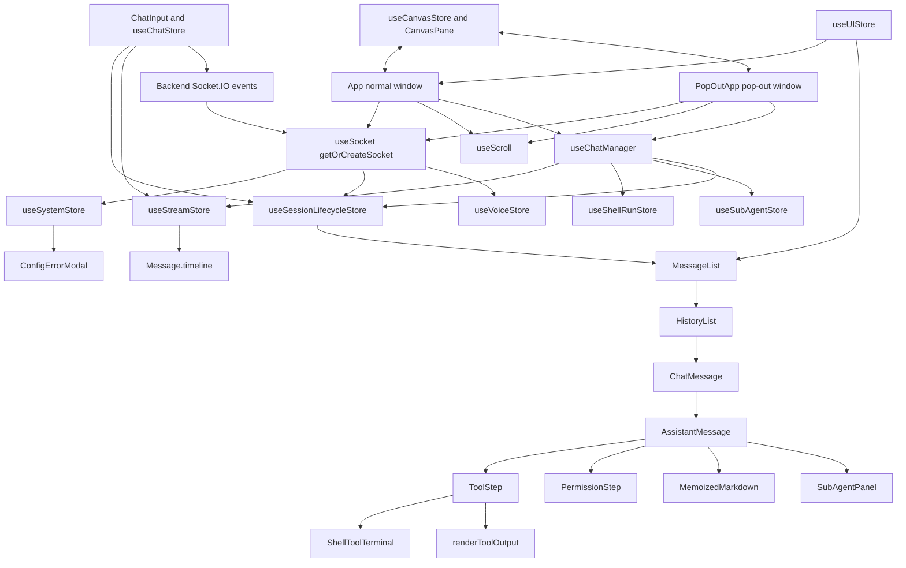

# Feature Doc - Frontend Architecture

AcpUI frontend is a React, Vite, and Zustand runtime that renders a provider-agnostic chat UI from Socket.IO events and normalized timeline data. It matters because correctness depends on coordination between the app roots, socket singleton, session lifecycle store, stream store, and timeline renderer.

---

## Overview

### What It Does

- Creates one Socket.IO client through `frontend/src/hooks/useSocket.ts` (Function: `getOrCreateSocket`) and stores it in `useSystemStore.socket`.
- Hydrates invalid JSON config diagnostics, provider metadata, branding, workspace entries, notification settings, custom commands, voice availability, session model options, and provider extensions from backend socket events.
- Maintains session list state, active session selection, URL session sync, model/config state, stats, notes flags, and session hydration through `useSessionLifecycleStore`.
- Submits prompts, cancels turns, forks sessions, and answers permissions through `useChatStore`.
- Queues `thought`, `token`, `system_event`, and `permission_request` events per ACP session and drains them into `Message.timeline` through `useStreamStore.processBuffer`.
- Renders the timeline through `MessageList`, `HistoryList`, `ChatMessage`, `AssistantMessage`, `ToolStep`, `PermissionStep`, `ShellToolTerminal`, and `SubAgentPanel`.
- Coordinates normal-window and pop-out-window ownership through `App`, `PopOutApp`, and `frontend/src/lib/sessionOwnership.ts`.

### Why This Matters

- `ChatSession.id` and `ChatSession.acpSessionId` serve different roles; mixing them breaks session selection, stream routing, watch rooms, stats, and persistence.
- Streaming correctness depends on `activeMsgIdByAcp`, `streamQueues`, and `Message.timeline` staying keyed by ACP session ID.
- Tool rendering depends on sticky metadata: `toolName`, `canonicalName`, `titleSource`, `filePath`, `shellRunId`, `invocationId`, `isAcpUxTool`, and tool category fields.
- Provider identity is data-driven through backend payloads and `useSystemStore.getBranding`; frontend rendering code must not depend on provider names or model IDs.
- Normal-window and pop-out-window roots share most runtime hooks but differ in ownership, sidebar, and session bootstrap behavior.

Architectural role: frontend presentation and runtime layer consuming backend Socket.IO contracts and rendering normalized timeline state.

---

## How It Works - End-to-End Flow

1. Socket singleton starts the frontend runtime

File: `frontend/src/hooks/useSocket.ts` (Function: `getOrCreateSocket`, Hook: `useSocket`)

`getOrCreateSocket` creates a module-level Socket.IO client once, registers global listeners, and writes the socket to `useSystemStore.setSocket`. React strict-mode remounts reuse the same socket instance.

```typescript
// FILE: frontend/src/hooks/useSocket.ts (Function: getOrCreateSocket)
let _socket: Socket | null = null;
function getOrCreateSocket(): Socket {
  if (_socket) return _socket;
  _socket = io(BACKEND_URL, { reconnection: true, reconnectionAttempts: Infinity });
  _socket.on('providers', data => useSystemStore.getState().setProviders(data.defaultProviderId || null, data.providers || []));
  useSystemStore.getState().setSocket(_socket);
  return _socket;
}
```

2. Backend bootstrap payloads hydrate system state

File: `frontend/src/hooks/useSocket.ts` (Socket events: `connect`, `config_errors`, `ready`, `voice_enabled`, `workspace_cwds`, `providers`, `branding`, `sidebar_settings`, `custom_commands`, `session_model_options`, `provider_extension`, `disconnect`)

File: `frontend/src/store/useSystemStore.ts` (Actions: `setInvalidJsonConfigs`, `setProviders`, `setProviderBranding`, `setSlashCommands`, `setContextUsage`, `getContextUsage`, `hasContextUsage`, `setProviderStatus`, `setCompacting`, `getCompacting`, `getBranding`)

The socket listener writes invalid JSON diagnostics, provider catalog, active provider, readiness, branding, sidebar/notification settings, slash commands, context usage, provider status, and compaction state into system/session stores. `config_errors` writes `invalidJsonConfigs` for the blocking startup modal, and `provider_extension` resolves provider id from the event payload before routing through `routeExtension` with that provider's branding prefix.

```typescript
// FILE: frontend/src/hooks/useSocket.ts (Socket event: provider_extension)
const providerId = data.providerId || p.providerId || p.status?.providerId;
const providerBranding = useSystemStore.getState().getBranding(providerId);
const ext = providerBranding?.protocolPrefix || '_provider/';
const result = routeExtension(data.method, p, ext, [], useSystemStore.getState().customCommands);
```

3. App root composes the normal-window shell

File: `frontend/src/App.tsx` (Component: `App`)

`App` mounts `Sidebar`, `ChatHeader`, `MessageList`, `ChatInput`, global modals including `ConfigErrorModal`, and `CanvasPane`. It wires `useSocket`, `useScroll`, and `useChatManager`, handles drag-and-drop uploads through `useInputStore.handleFileUpload`, and owns the normal-window session switch effect.

```tsx
// FILE: frontend/src/App.tsx (Component: App)
const { socket } = useSocket();
const { scrollRef, scrollToBottom, handleScroll, handleWheel } = useScroll(activeSessionId, activeSession?.messages, visibleCount);
useChatManager(scrollToBottom, filePath => handleFileEdited(socket, filePath), filePath => handleOpenFileInCanvas(socket, activeSessionId, filePath));
```

4. Normal-window session switching updates socket rooms and canvas state

File: `frontend/src/App.tsx` (Effect: `activeSessionId` session switch)

When `activeSessionId` changes, `App` emits `unwatch_session` for the prior ACP session when it is not typing, emits `watch_session` for the new ACP session, stores the outgoing canvas open state by UI session ID, restores terminals for the incoming UI session, clears canvas artifacts, resets `visibleCount`, and emits `canvas_load` for persisted artifacts.

Stable socket events: `unwatch_session`, `watch_session`, `canvas_load`.

5. Pop-out root claims one session and omits sidebar UI

File: `frontend/src/PopOutApp.tsx` (Component: `PopOutApp`)

`PopOutApp` reads the `popout` URL query parameter, calls `claimSession(popoutSessionId)`, sets `activeSessionId`, emits `load_sessions`, maps returned sessions into local state, emits `watch_session` when the selected session has an ACP ID, calls `hydrateSession`, and renders `ChatHeader`, `MessageList`, `ChatInput`, optional `CanvasPane`, and `ConfigErrorModal` without `Sidebar` or normal-window settings modals.

Stable anchors: `claimSession`, `load_sessions`, `watch_session`, `hydrateSession`.

6. Initial session hydration loads persisted UI sessions

File: `frontend/src/hooks/useChatManager.ts` (Hook: `useChatManager`, Effect: initial load)

File: `frontend/src/store/useSessionLifecycleStore.ts` (Action: `handleInitialLoad`)

`useChatManager` calls `handleInitialLoad(socket, fetchAudioDevices)` once a socket exists. `handleInitialLoad` emits `load_sessions`, applies model state through `applyModelState`, hydrates notes flags and persisted context usage with `maybeHydrateContextUsage`, marks URL sync ready, and selects the URL session when `?s=<uiId>` exists.

Stable socket event: `load_sessions`.

7. Session selection and hydration rebuild a live ACP transport

File: `frontend/src/store/useSessionLifecycleStore.ts` (Actions: `handleSessionSelect`, `hydrateSession`, `fetchStats`)

`handleSessionSelect` stores the UI session ID, clears unread state, hydrates context usage from persisted stats, and calls `hydrateSession` when history or stats need loading. `hydrateSession` emits `get_session_history`, drops thought steps from persisted history, collapses restored tool steps, emits `create_session` with `existingAcpId`, fetches stats, and emits `watch_session` for the resumed ACP session.

Stable socket events: `get_session_history`, `create_session`, `get_stats`, `watch_session`.

8. New chats create optimistic UI state before ACP creation completes

File: `frontend/src/store/useSessionLifecycleStore.ts` (Action: `handleNewChat`)

`handleNewChat` creates a UI session immediately with `isWarmingUp: true`, selects it, emits `save_snapshot`, then emits `create_session` using the active provider and default model from provider branding. A daemon readiness response schedules a retry. A successful response stores `acpSessionId`, model state, config options, fetches stats, watches the ACP session, and saves the updated snapshot.

Stable socket events: `save_snapshot`, `create_session`, `watch_session`.

9. Prompt submission creates the user turn and assistant placeholder

File: `frontend/src/store/useChatStore.ts` (Action: `handleSubmit`)

`handleSubmit` reads active UI session state, input text, attachments, custom commands, and the active ACP session ID. It stores `activeMsgIdByAcp[acpId]`, clears the input, appends the user message and an assistant message with a `_Thinking..._` thought step, emits `save_snapshot`, then emits `prompt` with provider, UI session ID, ACP session ID, model, prompt text, and attachments.

Stable socket events: `save_snapshot`, `prompt`.

10. Stream dispatcher routes backend events to the correct store

File: `frontend/src/hooks/useChatManager.ts` (Hook: `useChatManager`, Socket events: `stats_push`, `session_renamed`, `merge_message`, `thought`, `token`, `system_event`, `permission_request`, `token_done`, `hooks_status`, `shell_run_prepared`, `shell_run_snapshot`, `shell_run_started`, `shell_run_output`, `shell_run_exit`, `sub_agents_starting`, `sub_agent_started`, `sub_agent_snapshot`, `sub_agent_status`, `sub_agent_invocation_status`, `sub_agent_completed`)

The hook registers turn-level socket listeners. Chat events route to `useStreamStore`; stats and rename events update `useSessionLifecycleStore`; shell events update `useShellRunStore`, patch timeline tool steps by `shellRunId`, tool-call ID, or active shell description title, mirror active `ShellRunSnapshot.needsInput` into `ChatSession.isAwaitingShellInput`, and queue fallback shell tool starts through `useStreamStore` when shell lifecycle events arrive before a provider `tool_start`; sub-agent events update `useSubAgentStore` and lazily create sidebar `ChatSession` shells when a sub-agent first emits token or system-event output.

```typescript
// FILE: frontend/src/hooks/useChatManager.ts (Handler: shell_run_snapshot)
useShellRunStore.getState().upsertSnapshot(snapshot);
patchShellRunToolStep(snapshot.runId, shellRunSnapshotPatch(snapshot), snapshot);
syncShellInputStateForSession(snapshot.sessionId);
```

11. Stream store transforms queues into unified timeline entries

File: `frontend/src/store/useStreamStore.ts` (Actions: `ensureAssistantMessage`, `onStreamThought`, `onStreamToken`, `onStreamEvent`, `processBuffer`, `onStreamDone`)

The stream store keeps queues per ACP session. `processBuffer` runs in three phases: immediate event scan, adaptive thought drip, and adaptive token drip. Events create or update `tool` and `permission` steps; thought chunks create `thought` steps; token chunks create `text` steps and update `message.content`. `onStreamDone` waits for the queue to empty, marks the active assistant message non-streaming, resolves in-progress tool fallback status, emits `save_snapshot`, and calls `fetchStats`.

Stable state keys: `streamQueues`, `activeMsgIdByAcp`, `isProcessActiveByAcp`, `displayedContentByMsg`, `settledLengthByMsg`.

12. Message rendering maps timeline entries to UI components

Files: `frontend/src/components/MessageList/MessageList.tsx`, `frontend/src/components/HistoryList.tsx`, `frontend/src/components/ChatMessage.tsx`, `frontend/src/components/AssistantMessage.tsx`, `frontend/src/components/ToolStep.tsx`, `frontend/src/components/renderToolOutput.tsx`

`MessageList` slices active-session messages by `visibleCount`, passes ACP and provider IDs to `HistoryList`, and renders the back-to-bottom control. `ChatMessage` handles user/divider/assistant role routing and collapse policy. `AssistantMessage` renders `text`, `thought`, `tool`, and `permission` timeline steps, then pins any sub-agent orchestration panels to the bottom of the assistant response by `invocationId`; pinned panels auto-collapse after terminal completion unless manually toggled. `ToolStep` chooses `ShellToolTerminal`, canvas hoist controls, and `renderToolOutput` output formatting; successful output from sub-agent start tools is hidden while the status/result and abort tools still render output normally.

---

## Architecture Diagram



---

## Critical Contract

### Contract: UI Session ID, ACP Session ID, and Timeline Ownership

- `ChatSession.id` is the frontend UI identity. Use it for `activeSessionId`, URL query parameter `s`, sidebar selection, canvas-open persistence, input text, attachments, settings modal targeting, and `save_snapshot` payload identity.
- `ChatSession.acpSessionId` is the transport identity. Use it for socket rooms (`watch_session`, `unwatch_session`), prompt routing, stream queues, stats, permission responses, shell run routing, sub-agent parent tracking, and backend history/ACP calls.
- `Message.timeline` is the authoritative assistant render model. Assistant text, thoughts, tool calls, and permissions must become timeline entries instead of side-channel UI state.
- `useStreamStore.activeMsgIdByAcp[acpSessionId]` identifies the assistant message receiving stream events for that ACP session.
- Tool updates must merge into an existing `tool` timeline step by `SystemEvent.id`; shell events must patch by `shellRunId` and carry `shellNeedsInput`; sub-agent panels must filter by `invocationId`.
- Provider data must flow through `useSystemStore.providersById`, `useSystemStore.branding`, and `useSystemStore.getBranding(providerId)`.

If this contract is broken, session switching can watch the wrong backend room, background streams can write into the wrong chat, shell output can attach to the wrong tool step, sub-agent panels can display the wrong invocation, and provider-specific branding/model data can leak across sessions.

---

## Configuration / Data Flow

### Provider and App Configuration Flow

- Backend `config_errors` event -> `useSocket` -> `useSystemStore.setInvalidJsonConfigs(errors)` -> `ConfigErrorModal` blocks interaction until the JSON files are fixed and the backend/app reload.
- Backend `providers` event -> `useSocket` -> `useSystemStore.setProviders(defaultProviderId, providers)` -> `providersById`, `orderedProviderIds`, `activeProviderId`, `readyByProviderId`, active `branding`.
- Backend `branding` event -> `useSocket` -> `useSystemStore.setProviderBranding(data)` for provider-scoped branding or root `branding` state for generic branding -> `document.title`.
- Backend `sidebar_settings` event -> `useSocket` -> `deletePermanent`, notification settings, and browser notification permission prompt.
- Backend `custom_commands` event -> `useSocket` -> `customCommands` plus local slash command entries with `meta.local`.
- Backend `provider_extension` event -> `routeExtension` -> slash commands, context usage, provider status, config options, compaction flags, and compaction summary token injection.
- Backend `session_model_options` event -> `useSocket` -> matching session by `acpSessionId` -> model and option state.

### Session and Prompt Flow

```text
normal window:
App -> useChatManager -> handleInitialLoad -> load_sessions -> sessions[]
Sidebar or URL -> handleSessionSelect -> hydrateSession -> get_session_history -> create_session(existingAcpId) -> watch_session
ChatInput -> useChatStore.handleSubmit -> save_snapshot -> prompt
Backend stream events -> useChatManager -> useStreamStore -> Message.timeline -> render components
```

```text
pop-out window:
PopOutApp -> claimSession(popoutSessionId) -> load_sessions -> activeSessionId=popoutSessionId
session.acpSessionId -> watch_session -> hydrateSession -> shared stream/render path
```

### Stream Event Transformation

```text
thought { sessionId, text }
  -> useStreamStore.onStreamThought
  -> streamQueues[sessionId][]
  -> processBuffer thought phase
  -> TimelineStep { type: 'thought', content, isCollapsed }
```

```text
token { sessionId, text }
  -> useStreamStore.onStreamToken
  -> optional RESPONSE_DIVIDER when a tool just completed and markdown is outside a code block
  -> processBuffer token phase
  -> TimelineStep { type: 'text', content }
  -> Message.content
```

```text
system_event { sessionId, type, id, title, output, filePath, shellRunId, invocationId, ... }
  -> useStreamStore.onStreamEvent
  -> processBuffer event phase
  -> TimelineStep { type: 'tool', event: SystemEvent }
  -> AssistantMessage -> ToolStep plus bottom-pinned SubAgentPanel for sub-agent invocations
  -> ToolStep -> ShellToolTerminal or renderToolOutput
```

```text
shell_run_output { sessionId, runId, chunk, needsInput }
  -> useShellRunStore.appendOutput
  -> patch matching TimelineStep.event.shellNeedsInput
  -> syncShellInputStateForSession -> ChatSession.isAwaitingShellInput
```

```text
permission_request { sessionId, id, options, toolCall }
  -> useChatManager permission routing
  -> useSubAgentStore.setPermission for sub-agent sessions
  -> useStreamStore.onStreamEvent({ type: 'permission_request' }) for main chat sessions
  -> PermissionStep -> useChatStore.handleRespondPermission -> respond_permission
```

### Core Data Shapes

File: `frontend/src/types.ts` (Interfaces: `ChatSession`, `Message`, `TimelineStep`, `SystemEvent`, `StreamEventData`, `InvalidJsonConfig`, `ProviderSummary`, `ProviderBranding`, `ProviderStatus`)

```typescript
// FILE: frontend/src/types.ts (Interface: ChatSession)
export interface ChatSession {
  id: string;
  acpSessionId: string | null;
  messages: Message[];
  model: string;
  currentModelId?: string | null;
  provider?: string | null;
  configOptions?: ProviderConfigOption[];
  isTyping: boolean;
  isAwaitingPermission?: boolean;
  isAwaitingShellInput?: boolean;
}
```

```typescript
// FILE: frontend/src/types.ts (Type: TimelineStep)
export type TimelineStep =
  | { type: 'thought'; content: string; isCollapsed?: boolean }
  | { type: 'tool'; event: SystemEvent; isCollapsed?: boolean }
  | { type: 'text'; content: string; isCollapsed?: boolean }
  | { type: 'permission'; request: PermissionRequest; response?: string; isCollapsed?: boolean };
```

---

## Component Reference

### App Roots and Hooks

| Area | File | Stable Anchors | Purpose |
|---|---|---|---|
| Normal root | `frontend/src/App.tsx` | `App`, `ErrorBoundary`, `ConfigErrorModal`, session switch effect, `canvas_load`, `watch_session`, `unwatch_session` | Main shell with sidebar, chat, canvas, global modals, drag/drop upload, and session-room coordination |
| Pop-out root | `frontend/src/PopOutApp.tsx` | `PopOutApp`, `ConfigErrorModal`, `claimSession`, `load_sessions`, `watch_session`, `hydrateSession` | Detached chat runtime for one URL-selected session, including blocking config diagnostics |
| Socket singleton | `frontend/src/hooks/useSocket.ts` | `getOrCreateSocket`, `useSocket`, socket events: `config_errors`, `providers`, `branding`, `provider_extension` | Creates global socket and hydrates system/session stores |
| Stream dispatcher | `frontend/src/hooks/useChatManager.ts` | `useChatManager`, `trimShellOutputLines`, `syncShellInputStateForSession`, socket events: `token`, `system_event`, `permission_request`, `token_done`, `shell_run_*`, `sub_agent_*` | Routes backend events to lifecycle, stream, shell, and sub-agent stores, including shell input-wait session state |
| Scroll | `frontend/src/hooks/useScroll.ts` | `useScroll`, `scrollToBottom`, `handleScroll`, `handleWheel`, `ResizeObserver` effect | Auto-scroll stickiness, manual override state, and back-to-bottom control |

### Zustand Stores

| Area | File | Stable Anchors | Purpose |
|---|---|---|---|
| System state | `frontend/src/store/useSystemStore.ts` | `invalidJsonConfigs`, `setInvalidJsonConfigs`, `setSocket`, `setProviders`, `setProviderBranding`, `setSlashCommands`, `setContextUsage`, `getContextUsage`, `hasContextUsage`, `setProviderStatus`, `setCompacting`, `getCompacting`, `getBranding` | Config diagnostics, provider catalog, branding, connection status, status panel data, provider-scoped context usage and compaction state, notifications, commands |
| Session lifecycle | `frontend/src/store/useSessionLifecycleStore.ts` | `handleInitialLoad`, `handleNewChat`, `handleSessionSelect`, `hydrateSession`, `fetchStats`, `handleSessionModelChange`, `handleSetSessionOption`, `handleSaveSession` | Session list, active selection, hydration, model/config state, stats, URL sync, persistence emits |
| Stream timeline | `frontend/src/store/useStreamStore.ts` | `ensureAssistantMessage`, `onStreamThought`, `onStreamToken`, `onStreamEvent`, `processBuffer`, `onStreamDone` | Per-ACP stream queues, adaptive typewriter, timeline mutation, stream completion persistence |
| Chat commands | `frontend/src/store/useChatStore.ts` | `handleSubmit`, `handleCancel`, `handleForkSession`, `handleRespondPermission` | Prompt submit/cancel/fork/permission workflows |
| Input state | `frontend/src/store/useInputStore.ts` | `setInput`, `setAttachments`, `handleFileUpload`, `clearInput` | Per-UI-session input text and attachments |
| UI state | `frontend/src/store/useUIStore.ts` | `setSidebarOpen`, `toggleSidebarPinned`, `setSettingsOpen`, `incrementVisibleCount`, `resetVisibleCount`, `toggleAutoScroll` | Sidebar, modal, pagination, and auto-scroll preferences |
| Canvas state | `frontend/src/store/useCanvasStore.ts` | `openTerminal`, `closeTerminal`, `handleOpenInCanvas`, `handleOpenFileInCanvas`, `handleFileEdited`, `handleCloseArtifact`, `resetCanvas` | Canvas artifacts, terminal tabs, file reload, canvas persistence hooks |
| Shell run state | `frontend/src/store/useShellRunStore.ts` | `useShellRunStore`, `ShellRunSnapshot.needsInput`, `trimShellTranscript`, `pruneShellRuns`, `upsertSnapshot`, `markStarted`, `appendOutput`, `markExited` | Shell V2 snapshots, input-wait state, and transcript pruning keyed by `runId` |
| Sub-agent state | `frontend/src/store/useSubAgentStore.ts` | `startInvocation`, `setInvocationStatus`, `completeInvocation`, `isInvocationActive`, `addAgent`, `setStatus`, `completeAgent`, `addToolStep`, `updateToolStep`, `setPermission`, `clearForParent` | Invocation-level and agent-level panel state keyed by ACP session and `invocationId` |

### Rendering Components

| Area | File | Stable Anchors | Purpose |
|---|---|---|---|
| Message viewport | `frontend/src/components/MessageList/MessageList.tsx` | `MessageList`, `visibleCount`, `incrementVisibleCount`, `HistoryList` | Active-session message slicing, empty state, load-more button, back-to-bottom control |
| Message list | `frontend/src/components/HistoryList.tsx` | `HistoryList` | Memoized mapping from `Message[]` to `ChatMessage` with ACP/provider IDs |
| Role router | `frontend/src/components/ChatMessage.tsx` | `ChatMessage`, `CodeBlock`, `copyToClipboard`, `localCollapsed`, `manuallyToggled` | User/divider/assistant routing, code block actions, collapse policy |
| Assistant renderer | `frontend/src/components/AssistantMessage.tsx` | `AssistantMessage`, `getPinnedSubAgentInvocationIds`, `renderContentWithErrors`, `handleFork`, `handleCopyAll` | Timeline rendering, bottom-pinned sub-agent panels, copy/fork actions, hooks indicator, fallback content render |
| Tool renderer | `frontend/src/components/ToolStep.tsx` | `ToolStep`, `getFilePathFromEvent`, `ShellToolTerminal` | Tool step header, timer, canvas hoist, shell terminal, sub-agent start output suppression, output wrapper |
| Output formatting | `frontend/src/components/renderToolOutput.tsx` | `renderToolOutput`, `tryExtractShellOutput`, `isWebFetchResult`, `isGrepSearchResult` | Diff, ANSI, JSON, file, web fetch, grep, and plain output rendering |
| Permissions | `frontend/src/components/PermissionStep.tsx` | `PermissionStep` | Permission response UI feeding `handleRespondPermission` |
| Config diagnostics | `frontend/src/components/ConfigErrorModal.tsx` | `ConfigErrorModal`, `invalidJsonConfigs`, `role="alertdialog"` | Blocking app-load popup for invalid or missing startup config reported by the backend |
| Shell terminal | `frontend/src/components/ShellToolTerminal.tsx` | `ShellToolTerminal` | Live shell transcript and terminal controls for `shellRunId` tool steps |
| Sub-agent panel | `frontend/src/components/SubAgentPanel.tsx` | `SubAgentPanel`, `handleStop`, `respond_permission` | Bottom-pinned sub-agent status, Stop action, output, tools, and permission response UI |

### Utilities and Backend Contract Anchors

| Area | File | Stable Anchors | Purpose |
|---|---|---|---|
| Provider extension routing | `frontend/src/utils/extensionRouter.ts` | `routeExtension` | Converts provider extension methods into typed frontend actions |
| Model options | `frontend/src/utils/modelOptions.ts` | `getDefaultModelSelection`, `getModelIdForSelection`, `normalizeModelOptions` | Resolves provider model labels and IDs for session state |
| Config options | `frontend/src/utils/configOptions.ts` | `mergeProviderConfigOptions` | Merges provider config option updates from session creation and provider extensions |
| AcpUI UX tool identity | `frontend/src/utils/acpUxTools.ts` | `ACP_UX_TOOL_NAMES`, `toolNameFromEvent`, `isAcpUxShellToolEvent`, `isAcpUxSubAgentStartToolEvent`, `isAcpUxSubAgentToolName` | Central frontend AcpUI UX tool-name constants and predicates shared by stream, socket, and rendering code |
| Ownership | `frontend/src/lib/sessionOwnership.ts` | `claimSession`, `setOwnershipChangeCallback` | BroadcastChannel-backed pop-out ownership coordination |
| Backend bootstrap contract | `backend/sockets/index.js` | Socket connection emits: `config_errors`, `providers`, `ready`, `voice_enabled`, `workspace_cwds`, `branding`, `sidebar_settings`, `custom_commands`, `provider_extension` | Source of initial frontend runtime payloads and startup config diagnostics |
| Backend stream contract | `backend/services/acpUpdateHandler.js` | `handleUpdate`, emits: `token`, `thought`, `system_event`, `stats_push`, `provider_extension` | Source of normalized timeline stream events |
| Backend permission contract | `backend/services/permissionManager.js` | `handleRequest`, emits: `permission_request` | Source of frontend permission timeline requests |

---

## Gotchas

1. `id` and `acpSessionId` are not interchangeable

Use `id` for UI session selection, URL sync, input/attachment maps, canvas-open maps, and settings. Use `acpSessionId` for socket rooms, prompt routing, stream queues, stats, permissions, shell runs, and sub-agent parent links.

2. The socket is module-scoped

`getOrCreateSocket` returns the same instance for every `useSocket` call. Do not add component-local listeners in a component body. Put global listeners in `useSocket` or turn listeners in `useChatManager` with cleanup.

3. `useChatManager` registers `system_event` twice for different concerns

One listener routes all tool events to `useStreamStore.onStreamEvent`. Another listener routes sub-agent tool steps to `useSubAgentStore`. Cleanup uses `socket.off('system_event')`, so adding another listener in this hook requires reviewing teardown behavior.

4. Stream queues are per ACP session

`useStreamStore.streamQueues` and `activeMsgIdByAcp` are keyed by ACP session ID. Background or inactive sessions still receive tokens and must keep their queue entries until drained.

5. `processBuffer` handles events before visible token drip

Tool updates, permission requests, shell metadata, and file edits must remain responsive even when token text is still streaming. `tool_start` waits behind preceding thought chunks to avoid splitting an open thought bubble.

6. Shell V2 output is keyed by `shellRunId`

Shell snapshots and output update `useShellRunStore.runs[runId]`, patch matching tool timeline steps by `event.shellRunId`, and mirror active `needsInput` into `ChatSession.isAwaitingShellInput`. Matching shell output by title or command is unsafe when multiple shell tools run in parallel.

7. Sub-agent sessions are created lazily

`sub_agent_started` adds an entry to `useSubAgentStore` and a pending map. The sidebar `ChatSession` shell is added only when the sub-agent emits its first token or system event.

8. `invocationId` scopes sub-agent panels

The first `sub_agent_started` event stamps `invocationId` onto the active `ux_invoke_subagents` or `ux_invoke_counsel` tool step. `AssistantMessage` uses that value to render a bottom-pinned `SubAgentPanel` for the exact batch of agents, and `isInvocationActive` keeps the active orchestration tool step expanded until the invocation is terminal unless the user manually collapses it.

9. Provider extensions must remain provider-scoped

`provider_extension` uses the provider's `protocolPrefix` from branding and passes provider ID to store updates where supported. Context usage and compaction state must be keyed by `providerId + sessionId` in `useSystemStore` so interleaved providers cannot overwrite each other. Avoid writing extension results only to global state unless the store action is intentionally global.

10. Config error modal is intentionally not dismissible

`ConfigErrorModal` has no close or continue action. It renders whenever `useSystemStore.invalidJsonConfigs` contains entries from `config_errors`, so the only recovery path is fixing the JSON, restarting the backend when needed, and reconnecting/reloading so the backend emits an empty error list.

11. Persisted context usage must not be downgraded to zero

`maybeHydrateContextUsage` and `fetchStats` preserve an existing positive context usage percentage when incoming stats imply zero. Keep this guard when changing stats hydration.

---

## Unit Tests

### Runtime, Socket, and Store Tests

| File | Suites and Important Test Names |
|---|---|
| `frontend/src/test/acpUxTools.test.ts` | Suite: `acpUxTools`; tests: `centralizes known AcpUI UX tool names`, `normalizes direct tool name checks`, `resolves tool identity from normalized event fields` |
| `frontend/src/test/useSocket.test.ts` | Suite: `useSocket hook`; tests: `initializes socket and sets up listeners`, `handles "config_errors" event`, `clears config errors when the backend sends no errors array`, `handles "ready" event with providerId`, `handles "providers" event`, `handles "custom_commands" event`, `handles "session_model_options" event`, `provider_extension event` cases for `commands`, `metadata`, `provider_status`, `config_options`, `compaction_started`, `compaction_completed` |
| `frontend/src/test/useChatManager.test.ts` | Suite: `useChatManager hook`; tests: `sets up listeners and calls handleInitialLoad`, `handles Shell V2 socket events by explicit shellRunId`, `marks the session as awaiting shell input from shell output and clears it on exit`, `keeps shell input waiting state while another run in the same session still needs input`, `creates a Shell V2 tool step from shell lifecycle events when provider tool_start is missing`, `attaches shell lifecycle to a queued provider shell start instead of adding a duplicate`, `does not attach shell lifecycle to ambiguous queued provider shell starts with the same description`, `attaches shell lifecycle to an existing provider shell step by description`, `marks Shell V2 tool steps failed on non-zero shell exits`, `routes parallel Shell V2 output by shellRunId without claiming unmatched shell steps`, `handles "sub_agents_starting" - clears old sidebar sessions immediately`, `handles "sub_agent_started" event and stamps invocationId on in-progress ToolStep at index 0`, `handles "sub_agent_invocation_status" event`, `handles "sub_agent_status" with invocationId by updating agent and invocation state`, `moves waiting sub-agents back to running on token events`, `passes terminal sub-agent completion statuses through to the store`, `creates lazy sub-agent session with provider on first token`, `creates lazy sub-agent session with provider on first system_event`, `routes system_event tool_start/tool_end to sub-agent store`, `handles "token_done" event` |
| `frontend/src/test/useShellRunStore.test.ts` | Suite: `useShellRunStore`; tests: `upserts snapshots by run id`, `appends output and applies max line trimming`, `hydrates active state from snapshots for reattach`, `marks exits as read-only terminal state`, `prunes old exited runs while retaining active runs`, `keeps the last N lines while preserving trailing newline` |
| `frontend/src/test/useSystemStoreDeep.test.ts` | Suite: `useSystemStore deep coverage`; tests: `setContextUsage updates session percentage by provider+session key`, `clamps context usage to UI-safe bounds`, `setCompacting tracks compaction state per provider+session key`, `reads unscoped context and compaction entries as a fallback`, `keeps compaction state isolated for interleaved providers sharing a session id`, `keeps context usage isolated for interleaved providers sharing a session id` |
| `frontend/src/test/useSessionLifecycleStore.test.ts` | Suite: `useSessionLifecycleStore`; tests: `handleInitialLoad loads sessions and syncs URL`, `fetchStats updates session with stats`, `fetchStats does not overwrite existing positive context usage with zero percent`, `handleNewChat creates session and retries if daemon not ready`, `hydrateSession cleans timeline and resumes on backend`, `hydrateSession hydrates context usage from existing session stats before history load`, `handleSessionSelect hydrates context usage from persisted session stats` |
| `frontend/src/test/useSessionLifecycleStoreExtended.test.ts` | Suite: `useSessionLifecycleStore (extended)`; tests: `handleActiveSessionModelChange calls handleSessionModelChange`, `handleUpdateModel updates session model locally without socket emit`, `handleSaveSession emits save_snapshot for active session`, `checkPendingPrompts is a no-op currently`, `handleNewChat does not create if uiId already exists` |
| `frontend/src/test/useStreamStore.test.ts` | Suite: `useStreamStore (Pure Logic)`; tests: `ensureAssistantMessage creates a placeholder message`, `onStreamToken queues text and triggers typewriter`, `processBuffer drains queue into session messages with adaptive speed`, `hydrates queued shell tool_start from an existing shell snapshot`, `prefers MCP handler titles over longer raw provider titles`, `preserves Shell V2 terminal output on tool_end by shellRunId`, `keeps active parallel shell tool starts expanded while later shell steps arrive`, `merges duplicate shell tool_start events by shellRunId`, `merges provider shell tool_start without run id into an existing shell run by description`, `merges duplicate provider shell tool_start events before a shell run id is attached`, `merges shell tool_end events by shellRunId when tool ids differ`, `keeps active sub-agent orchestration steps expanded when new timeline steps arrive`, `collapses inactive sub-agent orchestration steps when new timeline steps arrive`, `onStreamDone marks message as finished and saves snapshot` |
| `frontend/src/test/streamConcurrency.test.ts` | Suite: `Multi-session stream isolation`; tests: `tokens for acp-a are queued under acp-a only - acp-b queue is unaffected`, `tokens for two sessions are queued independently and in order`, `processBuffer writes tokens only to the correct session messages`, `activeMsgIdByAcp maps each ACP session to the correct message placeholder`, `tool events for session A do not create timeline entries in session B`, `three sessions streaming simultaneously all accumulate content independently` |
| `frontend/src/test/typewriter-adaptive.test.ts` | Suite: `Typewriter Adaptive Speed`; tests: `should increase speed when buffer is large`, `should drip thoughts at adaptive speed` |
| `frontend/src/test/extensionRouter.test.ts` | Suite: `routeExtension`; tests: `routes commands/available with system + custom commands merged`, `routes metadata with sessionId and percentage`, `routes generic provider status`, `routes config_options with various modes`, `routes compaction_completed with summary` |

### App Root and Rendering Tests

| File | Suites and Important Test Names |
|---|---|
| `frontend/src/test/App.test.tsx` | Suite: `App Component`; tests: `renders Sidebar and ChatInput`, `renders the config error modal from root state`, `switches between sessions and emits watch events`, `handles file drop`, `persists canvas open state per session`, `auto-opens canvas for plans when awaiting permission`, `handles resize handle mouse events` |
| `frontend/src/test/PopOutApp.test.tsx` | Suite: `PopOutApp`; tests: `renders loading state initially`, `renders the config error modal while loading`, `renders ChatHeader and ChatInput when ready`, `does NOT render Sidebar`, `sets document.title with session name when ready`, `hydrates session and emits watch_session when ready`, `claims session ownership on mount` |
| `frontend/src/test/ConfigErrorModal.test.tsx` | Suite: `ConfigErrorModal`; tests: `renders nothing when there are no invalid JSON configs`, `renders a blocking alert with every invalid JSON config` |
| `frontend/src/test/MessageList.test.tsx` | Suite: `MessageList`; tests: `renders empty state when no messages`, `renders messages via HistoryList when available`, `shows load more button when hasMoreMessages is true`, `increments visible count when load more is clicked`, `shows scroll to bottom button when showScrollButton is true`, `renders empty state with provider-specific branding message` |
| `frontend/src/test/ChatMessage.test.tsx` | Suites: `ChatMessage`, `ChatMessage - additional coverage`, `ChatMessage - Collapse Fix (Regression)`; tests: `renders assistant message correctly with interleaved timeline`, `keeps only the last 3 tool calls and last 3 thought bubbles expanded while streaming`, `auto-collapses completed shell tool steps after a short settling delay`, `keeps auto-collapsed terminal shell steps collapsed while later shell steps stream`, `pins active sub-agent orchestration to the bottom after later parent work`, `keeps active sub-agent orchestration expanded after remount`, `renders permission requests and allows response`, `tool timeline step renders with title`, `respects manual toggle during timeline updates while streaming`, `respects manual toggle after streaming stops` |
| `frontend/src/test/AssistantMessage.test.tsx` | Suites: `AssistantMessage`, `AssistantMessage - fork and copy`, `AssistantMessage - sub-agent`; tests: `renders text timeline step content`, `renders permission step in timeline`, `renders fallback content when no timeline text steps`, `does not render fallback when timeline has text step`, `shows hooks running indicator`, `does not render fork button for sub-agent sessions` |
| `frontend/src/test/ToolStep.test.tsx` | Suites: `ToolStep`, `ToolStep - getFilePathFromEvent extraction`; tests: `uses the AcpUI UX icon for ux tools`, `does not render SubAgentPanel inline for ux_invoke_subagents`, `does not render SubAgentPanel inline when canonicalName is a sub-agent tool`, `does not render SubAgentPanel inline for ux_invoke_counsel`, `renders ShellToolTerminal for Shell V2 tool steps`, `suppresses instructional output for sub-agent start tools`, `keeps failure output visible for sub-agent start tools`, `keeps output visible for ux_check_subagents`, `returns undefined for shell commands`, `returns undefined for non-file AcpUI UX tools even when a file path is present`, `returns undefined for sub-agent status tools even when a file path is present`, `canvas hoist button calls onOpenInCanvas with extracted path` |
| `frontend/src/test/renderToolOutput.test.tsx` | Suite: `renderToolOutput`; tests: `renders JSON output`, `handles empty or null output`, `renders structured web fetch output`, `renders structured grep search output` |
| `frontend/src/test/renderToolOutput-ansi.test.tsx` | Suite: `renderToolOutput - ANSI color rendering`; tests: `renders ANSI colored output as HTML with color spans`, `strips terminal noise (cursor, window title) but keeps colors`, `does not use ANSI path for shell JSON output` |

Run focused verification with:

```powershell
cd frontend; npx vitest run src/test/App.test.tsx src/test/PopOutApp.test.tsx src/test/ConfigErrorModal.test.tsx src/test/useSocket.test.ts src/test/useChatManager.test.ts src/test/useSystemStoreDeep.test.ts src/test/useSessionLifecycleStore.test.ts src/test/useSessionLifecycleStoreExtended.test.ts src/test/useStreamStore.test.ts src/test/streamConcurrency.test.ts src/test/typewriter-adaptive.test.ts src/test/extensionRouter.test.ts src/test/SessionItem.test.tsx src/test/MessageList.test.tsx src/test/ChatMessage.test.tsx src/test/AssistantMessage.test.tsx src/test/ToolStep.test.tsx src/test/renderToolOutput.test.tsx src/test/renderToolOutput-ansi.test.tsx
```

---

## How to Use This Guide

### For implementing or extending frontend runtime

1. Identify the identity boundary first: UI session ID, ACP session ID, provider ID, shell run ID, or sub-agent invocation ID.
2. Start at the owning root or hook: `App`, `PopOutApp`, `useSocket`, `useChatManager`, or `useScroll`.
3. Trace state through the relevant store action in `useSessionLifecycleStore`, `useStreamStore`, `useChatStore`, `useSystemStore`, `useCanvasStore`, `useShellRunStore`, or `useSubAgentStore`.
4. Update rendering components only after the store contract is clear.
5. Add or update tests from the Unit Tests table that cover the affected identity, store action, socket event, and renderer.

### For debugging frontend runtime issues

1. Confirm the incoming or outgoing socket event name and payload shape in `useSocket`, `useChatManager`, `useChatStore`, or `useSessionLifecycleStore`.
2. Check whether the code is using `ChatSession.id` or `ChatSession.acpSessionId` for the operation.
3. Inspect `useStreamStore.streamQueues`, `activeMsgIdByAcp`, and the target session's `messages[].timeline`.
4. For shell issues, inspect `useShellRunStore.runs[runId]` and matching `SystemEvent.shellRunId`.
5. For sub-agent issues, inspect `useSubAgentStore.agents`, `SubAgentEntry.invocationId`, and the parent tool step's `SystemEvent.invocationId`.
6. Reproduce root-specific behavior in both `App` and `PopOutApp` when ownership, URL selection, watch rooms, or canvas state is involved.

---

## Summary

- The frontend is socket-driven, provider-agnostic, store-split, and timeline-first.
- Startup JSON config diagnostics flow through `config_errors`, `useSystemStore.invalidJsonConfigs`, and the blocking `ConfigErrorModal` mounted in both app roots.
- `useSocket` owns singleton bootstrap listeners; `useChatManager` owns turn, shell, and sub-agent stream listeners.
- `useSessionLifecycleStore` owns UI session lifecycle; `useStreamStore` owns ACP-session streaming and timeline mutation.
- `App` and `PopOutApp` share chat rendering hooks but have different ownership, sidebar, and session bootstrap responsibilities.
- `Message.timeline` is the render source for assistant text, thoughts, tools, and permissions.
- Shell V2 routing depends on `shellRunId`; input-wait sidebar state depends on `ShellRunSnapshot.needsInput`; sub-agent panel routing depends on `invocationId`.
- Provider branding, models, slash commands, status, and config options must flow through backend payloads and store actions.
- Changes in this area should be verified with the runtime/store and rendering tests listed above.
