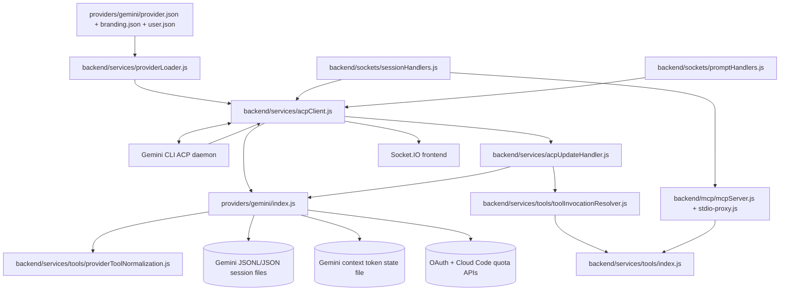

# Gemini Provider

The Gemini provider adapts AcpUI to the Gemini CLI ACP daemon. It owns Gemini-specific startup, authentication, tool identity normalization, quota/context signaling, and Gemini session-file handling so the rest of AcpUI receives provider-agnostic timeline events.

## Overview

### What It Does

- Starts the Gemini CLI ACP daemon from `providers/gemini/user.json` command settings.
- Authenticates with `gemini-api-key` when `apiKey` exists, or `oauth-personal` when the CLI's OAuth credentials are used.
- Translates Gemini `session/update` notifications into AcpUI provider extensions, tokens, thoughts, and normalized tool events.
- Resolves Gemini tool identity into canonical AcpUI fields through `normalizeTool`, `extractToolInvocation`, and backend tool invocation resolution.
- Repairs missing or incomplete Gemini tool output for file reads, directory listings, search results, and structured result objects.
- Emits Gemini provider extensions for slash commands, context usage metadata, and provider status.
- Handles Gemini JSONL and JSON session files for clone, archive, restore, delete, and history rehydration.

### Why This Matters

- Gemini emits ACP payloads with shapes that differ from the generic backend assumptions.
- Gemini MCP tool IDs use the provider-configured `mcp_{mcpName}_{toolName}` pattern, so the provider must normalize tool names before the backend can dispatch AcpUI-owned tools.
- Context usage comes from final prompt quota metadata, not from streaming `usage_update` notifications.
- Quota status requires OAuth credentials and Google Cloud Code quota endpoints; API-key sessions skip that status path.
- Session replay depends on Gemini's project-hashed session directory layout and JSONL record semantics.

### Architectural Role

This feature is a backend provider adapter plus provider-specific file/session logic. The frontend receives normalized Socket.IO events and `provider_extension` payloads; it does not call Gemini-specific code.

## How It Works - End-to-End Flow

1. **Provider identity and config load**

   Files: `providers/gemini/provider.json`, `providers/gemini/branding.json`, `providers/gemini/user.json`, `providers/gemini/user.json.example`, `backend/services/providerLoader.js` (Functions: `getProvider`, `getProviderModule`, `bindProviderModule`).

   `provider.json` defines `protocolPrefix: "_gemini/"`, `mcpName: "AcpUI"`, `toolIdPattern: "mcp_{mcpName}_{toolName}"`, `supportsAgentSwitching: false`, and the Gemini `clientInfo`. `user.json` supplies local command, path, auth, quota, and model settings. The provider loader merges the config files and binds every exported provider function to provider context.

2. **The ACP daemon environment is prepared**

   File: `providers/gemini/index.js` (Export: `prepareAcpEnvironment`, Helpers: `resolveApiKey`, `_loadTokenState`, `_startQuotaFetching`).

   `prepareAcpEnvironment` stores `emitProviderExtension` and `writeLog`, initializes token-state persistence, and starts quota bootstrap only when `apiKey` is absent and `fetchQuotaStatus` is enabled. It returns the environment unchanged and intentionally keeps API-key auth out of the child process environment.

   ```javascript
   // FILE: providers/gemini/index.js (Export: prepareAcpEnvironment)
   _emitProviderExtension = context.emitProviderExtension;
   _writeLog = context.writeLog;
   const apiKey = resolveApiKey();
   _tokenStateFile = path.join(homePath, '.gemini', 'acp_session_tokens.json');
   if (!apiKey && config.fetchQuotaStatus) {
     _startQuotaFetching(config.paths.home).catch(err => _writeLog?.(...));
   }
   return env;
   ```

3. **Handshake sends `initialize` and `authenticate` together**

   Files: `backend/services/acpClient.js` (Methods: `start`, `performHandshake`), `providers/gemini/index.js` (Export: `performHandshake`), `providers/gemini/ACP_PROTOCOL_SAMPLES.md` (Sections: `Handshake Timing`, `initialize`, `authenticate`).

   `AcpClient.start` spawns the configured Gemini command, caches the provider module, calls `prepareAcpEnvironment`, and then calls `performHandshake`. Gemini requires `initialize` and `authenticate` to be in flight at the same time.

   ```javascript
   // FILE: providers/gemini/index.js (Export: performHandshake)
   const initPromise = acpClient.transport.sendRequest('initialize', {
     protocolVersion: 1,
     clientCapabilities: { terminal: true },
     clientInfo: config.clientInfo || { name: 'AcpUI', version: '1.0.0' }
   });

   const authPromise = apiKey
     ? acpClient.transport.sendRequest('authenticate', {
         methodId: 'gemini-api-key',
         _meta: { 'api-key': apiKey }
       })
     : acpClient.transport.sendRequest('authenticate', { methodId: 'oauth-personal' });

   await Promise.all([initPromise, authPromise]);
   ```

4. **Session creation includes Gemini session params and the AcpUI MCP proxy**

   Files: `backend/sockets/sessionHandlers.js` (Socket event: `create_session`, Helper: `captureModelState`), `backend/services/sessionManager.js` (Function: `getMcpServers`), `providers/gemini/index.js` (Exports: `buildSessionParams`, `getMcpServerMeta`, `setInitialAgent`, `normalizeModelState`).

   `create_session` calls `buildSessionParams(requestAgent)` and spreads the result into `session/new` or `session/load`. `getMcpServers` injects the AcpUI stdio proxy using the provider's `mcpName`. Gemini's `getMcpServerMeta` returns `undefined`, so the MCP server entry contains standard proxy fields only.

   ```javascript
   // FILE: providers/gemini/index.js (Export: buildSessionParams)
   export function buildSessionParams(agent) {
     if (agent) return { _meta: { agent } };
     return undefined;
   }
   ```

5. **Inbound daemon payloads pass through Gemini interception**

   Files: `backend/services/acpClient.js` (Method: `handleAcpMessage`), `providers/gemini/index.js` (Export: `intercept`, Helper: `normalizeCommands`, Export: `emitCachedContext`).

   `handleAcpMessage` calls `intercept(payload)` before routing. Gemini interception rewrites `available_commands_update` into `_gemini/commands/available`, emits cached context once a session id is observed, caches tool arguments for later tool updates, drops `usage_update`, and emits `_gemini/metadata` after final prompt results with quota token counts.

   ```javascript
   // FILE: providers/gemini/index.js (Export: intercept)
   if (update?.sessionUpdate === 'available_commands_update') {
     return {
       method: `${config.protocolPrefix}commands/available`,
       params: { sessionId, commands: normalizeCommands(update.availableCommands) }
     };
   }
   if (update?.sessionUpdate === 'usage_update') return null;
   ```

6. **Streaming updates are normalized into the Unified Timeline**

   Files: `backend/services/acpUpdateHandler.js` (Function: `handleUpdate`), `providers/gemini/index.js` (Exports: `normalizeUpdate`, `stripReminder`, `extractToolOutput`, `extractDiffFromToolCall`, `extractFilePath`).

   `handleUpdate` delegates Gemini text cleanup to `normalizeUpdate`. It then emits `token`, `thought`, and `system_event` Socket.IO events. Gemini-specific helpers remove `<system-reminder>` blocks, extract paths from `locations`, arguments, and diff blocks, and recover output from Gemini's result shapes.

7. **Tool identity becomes canonical before AcpUI tool dispatch**

   Files: `providers/gemini/index.js` (Exports: `normalizeTool`, `extractToolInvocation`, `categorizeToolCall`), `backend/services/tools/providerToolNormalization.js` (Functions: `inputFromToolUpdate`, `collectToolNameCandidates`, `resolveToolNameFromCandidates`, `resolveToolNameFromAcpUiMcpTitle`), `backend/services/tools/toolIdPattern.js` (Function: `matchToolIdPattern`), `backend/services/tools/toolInvocationResolver.js` (Functions: `resolveToolInvocation`, `applyInvocationToEvent`), `backend/services/tools/acpUiToolTitles.js` (Function: `acpUiToolTitle`), `backend/services/tools/acpUxTools.js` (Constants: `ACP_UX_TOOL_NAMES`, `ACP_UX_IO_TOOL_CONFIG`).

   Gemini can expose AcpUI MCP tool identity through tool ids, titles, nested `functionCall` metadata, JSON description strings, or cached arguments. The provider resolves those candidates, derives a canonical tool name, formats the UI title, and returns a tool invocation object. The backend resolver merges provider identity with sticky tool state and MCP execution registry details, then `toolRegistry` dispatches AcpUI-owned handlers.

   ```javascript
   // FILE: providers/gemini/index.js (Export: extractToolInvocation)
   return {
     toolCallId: update.toolCallId || event.id,
     kind: isMcpTool ? 'mcp' : (canonicalName ? 'provider_builtin' : 'unknown'),
     rawName,
     canonicalName,
     mcpServer: patternMatch?.mcpName || (isAcpUiTool ? config.mcpName : undefined),
     mcpToolName: patternMatch?.toolName || (isAcpUiTool ? canonicalName : undefined),
     input,
     title: finalTitle,
     filePath: normalizedFilePath,
     category: categorizeToolCall({ ...normalized, toolName: canonicalName }) || {}
   };
   ```

8. **Provider extensions are parsed and broadcast**

   Files: `providers/gemini/index.js` (Export: `parseExtension`, Helper: `_emitStatus`), `backend/services/acpClient.js` (Method: `handleProviderExtension`), `backend/services/providerStatusMemory.js` (Functions: `rememberProviderStatusExtension`, `getLatestProviderStatusExtensions`).

   Provider extension methods under `_gemini/` are converted into structured types: `commands`, `metadata`, `provider_status`, or `unknown`. `handleProviderExtension` emits them as `provider_extension` and remembers status-like extensions so new Socket.IO clients receive current provider state.

9. **Prompt lifecycle controls quota polling**

   Files: `backend/sockets/promptHandlers.js` (Socket event: `prompt`), `providers/gemini/index.js` (Exports: `onPromptStarted`, `onPromptCompleted`, `stopQuotaFetching`, Helpers: `_ensureQuotaPolling`, `_fetchAndEmitQuota`, `_buildStatus`).

   The backend calls `onPromptStarted(sessionId)` immediately before `session/prompt` and calls `onPromptCompleted(sessionId)` in a `finally` block. Gemini uses those hooks to start interval polling while prompts are active and stop polling when the active prompt set is empty. Final prompt results also trigger a quota refresh when `stopReason` is `end_turn` and a quota project id exists.

10. **Gemini session files back clone, archive, restore, delete, and JSONL replay**

    Files: `providers/gemini/index.js` (Exports: `getSessionPaths`, `cloneSession`, `archiveSessionFiles`, `restoreSessionFiles`, `deleteSessionFiles`, `parseSessionHistory`; Helpers: `getShortId`, `findSessionDir`, `getExactSessionFile`, `extractTextFromContent`, `extractToolResultText`).

    The provider searches `config.paths.sessions` for project-hashed `chats` directories containing files whose names include the first UUID segment. `parseSessionHistory` reads Gemini JSONL records, applies `$rewindTo`, skips metadata and system records, then returns AcpUI messages whose assistant entries contain timeline steps for thoughts, tools, and text.

## Architecture Diagram



## Critical Contract

The Gemini provider contract has five required boundaries:

- **Handshake contract:** `performHandshake(acpClient)` must send `initialize` with `clientCapabilities: { terminal: true }` and must send `authenticate` without waiting for the initialize response.
- **Interception contract:** `intercept(payload)` must return a routed payload object or `null`. `usage_update` returns `null`; `available_commands_update` returns a `_gemini/commands/available` extension payload.
- **Tool identity contract:** `provider.json.toolIdPattern` and `extractToolInvocation(update, context)` must agree on the Gemini MCP id shape. For AcpUI tools, the returned `canonicalName`, `mcpServer`, `mcpToolName`, and `input` are the source data for `toolInvocationResolver` and `toolRegistry`.
- **Quota/context contract:** `onPromptStarted`, `onPromptCompleted`, final prompt result quota fields, and `_emitProviderExtension` are the only provider-owned path for Gemini quota polling and context percentage metadata.
- **Session-file contract:** `getSessionPaths`, `cloneSession`, `archiveSessionFiles`, `restoreSessionFiles`, `deleteSessionFiles`, and `parseSessionHistory` must follow Gemini's project-hashed directory layout and first-UUID-segment filename lookup.

When any of these boundaries drift, AcpUI can show generic tool titles, lose AcpUI MCP tool output, display stale context usage, fail session replay, or route provider extensions incorrectly.

## Configuration / Data Flow

### Provider config files

| File | Keys / Anchors | Current Role |
|---|---|---|
| `providers/gemini/provider.json` | `name`, `protocolPrefix`, `mcpName`, `toolIdPattern`, `toolCategories`, `clientInfo`, `supportsAgentSwitching` | Static provider identity, MCP tool id format, and tool category metadata. |
| `providers/gemini/branding.json` | `title`, `assistantName`, `busyText`, `modelLabel`, `maxImageDimension` | UI labels and image sizing used through generic branding payloads. |
| `providers/gemini/user.json` | `command`, `args`, `fetchQuotaStatus`, `paths`, `models`, optional `apiKey` | Local runtime settings for the Gemini CLI command, paths, auth, quota, and model defaults. |
| `providers/gemini/user.json.example` | Same schema as `user.json` with placeholder values | Safe template for local provider configuration. |
| `configuration/mcp.json.example` | `tools.invokeShell`, `tools.subagents`, `tools.counsel`, `tools.io`, `tools.googleSearch`, `io`, `webFetch`, `googleSearch` | Optional AcpUI MCP tool advertisement and limits. |

### Gemini settings integration

`providers/gemini/README.md` documents Gemini CLI settings for tool allow/exclude behavior. The relevant Gemini tool patterns are `mcp_AcpUI_*` and concrete names such as `mcp_AcpUI_ux_invoke_shell`. Those names match the provider's `toolIdPattern` after `{mcpName}` resolves to `AcpUI`.

Core AcpUI tools are `ux_invoke_shell`, `ux_invoke_subagents`, and `ux_invoke_counsel`. Optional IO/search tools are enabled through `configuration/mcp.json` and include `ux_read_file`, `ux_write_file`, `ux_replace`, `ux_list_directory`, `ux_glob`, `ux_grep_search`, `ux_web_fetch`, and `ux_google_web_search`.

### Authentication data flow

- `providers/gemini/user.json` `apiKey` present: `performHandshake` sends `authenticate` with `methodId: "gemini-api-key"` and `_meta["api-key"]` inside request params.
- `apiKey` absent: `performHandshake` sends `authenticate` with `methodId: "oauth-personal"` and the Gemini CLI uses saved OAuth credentials.
- `prepareAcpEnvironment` does not set `GEMINI_API_KEY` in the spawned process environment.
- Quota fetching reads `oauth_creds.json` from `config.paths.home` and uses OAuth-only Cloud Code quota requests.

### Context usage data flow

1. Gemini returns a final prompt result with `result._meta.quota.token_count` and `result._meta.quota.model_usage`.
2. `intercept` reads the cumulative `input_tokens` and `output_tokens` for the session.
3. The provider stores token counts in `_accumulatedTokensBySession` and writes token state through `_saveTokenState`.
4. The provider computes `contextUsagePercentage` using `CONTEXT_WINDOWS` or `DEFAULT_CONTEXT_WINDOW`.
5. `_emitProviderExtension` sends `_gemini/metadata` with `sessionId` and `contextUsagePercentage`.
6. `emitCachedContext(sessionId)` re-emits persisted context once for hot or loaded sessions.

### Quota status data flow

1. `prepareAcpEnvironment` calls `_startQuotaFetching(config.paths.home)` when `fetchQuotaStatus` is true and `apiKey` is absent.
2. `_readTokenFromDisk` reads `oauth_creds.json` from `config.paths.home`.
3. `_requestLoadCodeAssist` discovers `cloudaicompanionProject`.
4. `_fetchAndEmitQuota` calls `retrieveUserQuota`, handles 401 retry/refresh, and stores quota buckets.
5. `_buildStatus` groups buckets into Pro, Flash, Light, and other labels.
6. `_emitStatus` sends `_gemini/provider/status` with the provider status payload.
7. `parseExtension` maps that method to `{ type: "provider_status", status }`.

### Tool normalization data flow

1. Gemini sends a `tool_call` or `tool_call_update` with `toolCallId`, `kind`, `title`, `locations`, and possible argument objects.
2. `intercept` caches tool input by `toolCallId` and session-scoped key.
3. `normalizeTool` resolves `toolName` from configured id patterns, MCP server titles, nested `functionCall` metadata, and `KIND_TO_TOOL_NAME`.
4. `extractToolInvocation` returns canonical identity, input, title, file path, and category.
5. `resolveToolInvocation` merges provider data with `toolCallState` and `mcpExecutionRegistry`.
6. `applyInvocationToEvent` stamps `toolName`, `canonicalName`, `mcpServer`, `mcpToolName`, `isAcpUxTool`, title, category, and file path onto the emitted `system_event`.

### Session-file data flow

1. `getSessionPaths(acpId)` calls `findSessionDir(config.paths.sessions, acpId)`.
2. `findSessionDir` searches project directories for `<project-hash>/chats` entries that include `getShortId(acpId)`.
3. `getExactSessionFile` returns the matching `.jsonl` or `.json` file, or a fallback exact filename under the resolved directory.
4. `parseSessionHistory` reads JSONL records, handles `$rewindTo`, ignores `$set` and system records, then emits AcpUI user/assistant messages.
5. Assistant messages include timeline entries for `thought`, `tool`, and final text content.

## Component Reference

### Provider Files

| Area | File | Anchors | Purpose |
|---|---|---|---|
| Provider logic | `providers/gemini/index.js` | `prepareAcpEnvironment`, `performHandshake`, `resolveApiKey` | Environment preparation and Gemini ACP auth. |
| Provider logic | `providers/gemini/index.js` | `intercept`, `normalizeCommands`, `emitCachedContext` | Raw payload interception, slash command extension mapping, cached context emission. |
| Provider logic | `providers/gemini/index.js` | `normalizeUpdate`, `stripReminder` | Text cleanup for message and thought chunks. |
| Provider logic | `providers/gemini/index.js` | `extractToolOutput`, `extractDiffFromToolCall`, `extractFilePath` | Gemini tool output, diff, and path recovery. |
| Provider logic | `providers/gemini/index.js` | `normalizeTool`, `extractToolInvocation`, `categorizeToolCall` | Canonical tool identity and category extraction. |
| Provider logic | `providers/gemini/index.js` | `parseExtension`, `_emitStatus`, `_buildStatus` | Gemini provider extension parsing and provider status payload formatting. |
| Provider logic | `providers/gemini/index.js` | `onPromptStarted`, `onPromptCompleted`, `stopQuotaFetching` | Prompt lifecycle and quota polling. |
| Provider logic | `providers/gemini/index.js` | `getSessionPaths`, `cloneSession`, `archiveSessionFiles`, `restoreSessionFiles`, `deleteSessionFiles`, `parseSessionHistory` | Session file lifecycle and JSONL history replay. |
| Provider config | `providers/gemini/provider.json` | `protocolPrefix`, `mcpName`, `toolIdPattern`, `toolCategories`, `clientInfo` | Static provider contract and MCP identity pattern. |
| Provider config | `providers/gemini/branding.json` | `assistantName`, `modelLabel`, `maxImageDimension` | Gemini branding and upload sizing. |
| Provider config | `providers/gemini/user.json`, `providers/gemini/user.json.example` | `command`, `args`, `apiKey`, `fetchQuotaStatus`, `paths`, `models` | Local runtime, auth, path, quota, and model settings. |
| Provider docs | `providers/gemini/README.md` | `Configuring Tool Permissions`, `Runtime Flow`, `Session Files`, `Authentication & Quota Status`, `Context Usage Percentage` | Operational notes for Gemini CLI and AcpUI MCP tool configuration. |
| Provider docs | `providers/gemini/ACP_PROTOCOL_SAMPLES.md` | `Handshake Timing`, `initialize`, `authenticate`, `session/load`, `available_commands_update`, `FS Proxy` | Captured Gemini ACP protocol behavior. |
| Provider docs | `providers/gemini/SESSION_META_DATA.md` | `_meta.api-key`, `_meta.agent` | Gemini ACP meta-field reference. |

### Backend Integration

| Area | File | Anchors | Purpose |
|---|---|---|---|
| Provider loading | `backend/services/providerLoader.js` | `getProvider`, `getProviderModule`, `bindProviderModule` | Loads Gemini config and binds exports to provider context. |
| ACP client | `backend/services/acpClient.js` | `start`, `performHandshake`, `handleAcpMessage`, `handleProviderExtension`, `handleModelStateUpdate` | Spawns Gemini, routes payloads, handles provider extensions. |
| Update handling | `backend/services/acpUpdateHandler.js` | `handleUpdate`, `tool_call`, `tool_call_update`, `usage_update`, `available_commands_update` branches | Converts normalized provider updates into Socket.IO events. |
| Prompt socket | `backend/sockets/promptHandlers.js` | Socket event `prompt`, Socket event `cancel_prompt`, Socket event `respond_permission`, Socket event `set_mode` | Sends prompts, calls prompt lifecycle hooks, cancels Gemini prompts, responds to permissions. |
| Session socket | `backend/sockets/sessionHandlers.js` | Socket event `create_session`, `fork_session`, `rehydrate_session`, `set_session_option`, `set_session_model`, Helper: `captureModelState` | Creates/loads sessions, injects provider params and MCP servers, captures model/config state. |
| Session manager | `backend/services/sessionManager.js` | `getMcpServers`, `setSessionModel`, `setProviderConfigOption`, `reapplySavedConfigOptions`, `emitCachedContext` | Builds MCP proxy config and reapplies persisted session state. |
| JSONL parser | `backend/services/jsonlParser.js` | `parseJsonlSession` | Calls provider `parseSessionHistory` during session rehydration. |
| Provider status | `backend/services/providerStatusMemory.js` | `rememberProviderStatusExtension`, `getLatestProviderStatusExtensions` | Stores latest provider status extension for new clients. |

### Tool and MCP Integration

| Area | File | Anchors | Purpose |
|---|---|---|---|
| Tool normalization | `backend/services/tools/providerToolNormalization.js` | `inputFromToolUpdate`, `collectToolNameCandidates`, `resolveToolNameFromCandidates`, `resolveToolNameFromAcpUiMcpTitle` | Extracts AcpUI MCP names and inputs from Gemini-shaped raw data. |
| Tool id pattern | `backend/services/tools/toolIdPattern.js` | `matchToolIdPattern`, `toolIdPatternToRegex`, `replaceToolIdPattern` | Matches `mcp_{mcpName}_{toolName}` against Gemini tool ids and titles. |
| Tool identity | `backend/services/tools/toolInvocationResolver.js` | `resolveToolInvocation`, `applyInvocationToEvent` | Merges provider extraction with cached tool state and MCP execution details. |
| Tool definitions | `backend/services/tools/acpUxTools.js` | `ACP_UX_TOOL_NAMES`, `ACP_UX_CORE_TOOL_NAMES`, `ACP_UX_IO_TOOL_CONFIG`, `isAcpUxToolName` | Central AcpUI MCP tool names and category metadata. |
| Tool titles | `backend/services/tools/acpUiToolTitles.js` | `acpUiToolTitle`, `basenameForToolPath` | Formats visible AcpUI MCP tool titles. |
| MCP server | `backend/mcp/mcpServer.js` | `getMcpServers`, `createToolHandlers`, `wrapToolHandlers` | Advertises and executes core/optional AcpUI MCP tools. |
| MCP config | `backend/services/mcpConfig.js` | `getMcpConfig`, `isInvokeShellMcpEnabled`, `isIoMcpEnabled`, `isGoogleSearchMcpEnabled` | Controls which AcpUI MCP tools Gemini can discover. |
| MCP config example | `configuration/mcp.json.example` | `tools`, `io`, `webFetch`, `googleSearch` | Reference shape for MCP feature flags and IO/search limits. |

## Gotchas

1. **Handshake requests must be concurrent**

   Gemini holds the `initialize` response until authentication completes. Keep `initialize` and `authenticate` in flight together in `performHandshake`.

2. **Do not advertise filesystem capability**

   `clientCapabilities` contains `terminal: true` only. Adding `fs` makes Gemini route file operations through `fs/read_text_file` and `fs/write_text_file` JSON-RPC requests that AcpUI does not answer in this provider path.

3. **API keys stay inside `authenticate` params**

   `prepareAcpEnvironment` does not set `GEMINI_API_KEY`. API-key auth is passed as `authenticate.params._meta["api-key"]`, which keeps daemon startup from rewriting OAuth-oriented Gemini settings.

4. **Streaming `usage_update` is dropped**

   Gemini's native streaming usage events do not drive AcpUI context usage. `intercept` returns `null` for those events and uses final prompt result quota fields instead.

5. **Token-state path is computed by code, not by README prose**

   `prepareAcpEnvironment` builds `_tokenStateFile` with `path.join(homePath, '.gemini', 'acp_session_tokens.json')`. Check `config.paths.home` before assuming the absolute file location.

6. **AcpUI MCP ids use single underscores for Gemini**

   Gemini tool ids match `mcp_AcpUI_ux_invoke_shell`, not double-underscore or slash-separated formats. Update `provider.json.toolIdPattern`, `matchToolIdPattern` expectations, and provider tests together if the daemon naming shape changes.

7. **Tool input may arrive in nested Gemini fields**

   `rawInput.functionCall.args`, `args`, `arguments`, `description`, and cached tool input all feed title and identity resolution. Update `normalizeTool` and `extractToolInvocation` together when adding a tool shape.

8. **Generic AcpUI titles can be intentionally empty**

   For generic AcpUI tool starts, `extractToolInvocation` can return an empty title so `toolInvocationResolver` can reuse cached title or MCP handler title data.

9. **Session-load history does not count as prompt activity**

   Gemini replay traffic can look like live chunks. Quota polling is controlled by `onPromptStarted` and `onPromptCompleted`, not by observing `intercept` traffic.

10. **Session filenames use the first UUID segment**

   `getShortId(acpId)` uses `acpId.split('-')[0]`. `getSessionPaths` searches project `chats` directories for filenames containing that segment.

11. **Runtime config changes are limited to mode and model**

   `setConfigOption` sends `session/set_mode` for `mode`, sends `session/set_model` for `model`, and returns `null` for other option ids.

12. **Provider extensions are provider-level broadcasts**

   `handleProviderExtension` emits `provider_extension` globally. Gemini command, metadata, and status extensions can reach all connected clients.

## Unit Tests

### Provider Tests

File: `providers/gemini/test/index.test.js`

Key test names:

- `sends initialize and authenticate in parallel`
- `normalizes available commands into slash commands`
- `emits persisted context for a loaded session on request`
- `extracts context % and emits metadata extension on prompt result`
- `swallows native usage_update events`
- `fixes read_file by reading from disk directly`
- `reconstructs list_directory output using cached args`
- `maps ACP kind search to grep`
- `normalizes optional AcpUI MCP tool titles without server prefixes`
- `normalizes AcpUI MCP titles from nested Gemini function call args`
- `resolves AcpUI MCP names from Gemini functionCall metadata when the call id is generic`
- `extracts canonical AcpUI MCP invocation metadata`
- `returns empty title for generic AcpUI tool to allow fallback`
- `routes ux_invoke_shell to shell category`
- `getSessionPaths resolves project-hashed dirs`
- `prepareAcpEnvironment initializes quota fetching when enabled`
- `handles token refresh on 401 response during startup`
- `onPromptStarted is idempotent - double-calling does not double-count`
- `intercept() does not start quota polling from session/load drain messages`
- `onPromptCompleted stops polling when the last active prompt ends`

### Backend Contract and Tool Tests

Files and important tests:

- `backend/test/providerContract.test.js` - `every provider explicitly exports every contract function`
- `backend/test/providerToolNormalization.test.js` - `builds input from Gemini-style args and JSON description fields`; `resolves AcpUI tool names from nested candidates and human MCP titles`
- `backend/test/toolIdPattern.test.js` - `matches provider-configured Gemini ids without numeric suffixes`
- `backend/test/toolInvocationResolver.test.js` - `uses provider extraction as canonical tool identity`; `prefers centrally recorded MCP execution details over provider generic titles`; `can claim a recent MCP execution when the provider tool id arrives later`
- `backend/test/acpUpdateHandler.test.js` - `prepares shell run metadata for ux_invoke_shell tool starts`; `preserves a shell description title after provider normalization on updates`; `updates shell title when provider exposes description after tool start`
- `backend/test/mcpConfig.test.js` - MCP feature flag loading and optional Google search gating
- `backend/test/mcpServer.test.js` - MCP server advertisement and handler behavior for core and optional AcpUI tools

## How to Use This Guide

### For implementing or extending Gemini behavior

1. Start in `providers/gemini/index.js` and choose the exported provider contract function that owns the behavior.
2. For tool rendering or AcpUI MCP routing, update `normalizeTool`, `extractToolInvocation`, and provider tests together.
3. For optional IO/search tool behavior, also check `backend/services/tools/acpUxTools.js`, `backend/services/tools/acpUiToolTitles.js`, and `configuration/mcp.json.example`.
4. For raw Gemini payload routing, trace `backend/services/acpClient.js` `handleAcpMessage` into provider `intercept` and then into `backend/services/acpUpdateHandler.js` `handleUpdate`.
5. For context usage or quota status, trace `prepareAcpEnvironment`, `intercept`, `onPromptStarted`, `onPromptCompleted`, `_fetchAndEmitQuota`, and `parseExtension`.
6. For session persistence, trace `getSessionPaths`, `cloneSession`, `archiveSessionFiles`, `restoreSessionFiles`, `deleteSessionFiles`, and `parseSessionHistory`.
7. Add focused provider tests in `providers/gemini/test/index.test.js` and backend tool pipeline tests when generic resolution behavior changes.

### For debugging Gemini issues

1. Daemon startup or auth failure: check `providers/gemini/user.json`, `prepareAcpEnvironment`, `performHandshake`, and `providers/gemini/ACP_PROTOCOL_SAMPLES.md` handshake sections.
2. Missing slash commands: check `intercept`, `normalizeCommands`, `_gemini/commands/available`, and `parseExtension`.
3. Wrong AcpUI MCP tool title: check `provider.json.toolIdPattern`, `normalizeTool`, `extractToolInvocation`, `providerToolNormalization`, and `toolInvocationResolver`.
4. Missing shell/subagent/counsel UI: check `configuration/mcp.json`, `mcpServer.createToolHandlers`, `acpUxTools`, and Gemini settings allow/exclude patterns from `providers/gemini/README.md`.
5. Stale context percentage: check final prompt result quota metadata, `_accumulatedTokensBySession`, `_saveTokenState`, and `emitCachedContext`.
6. Missing provider status: check `fetchQuotaStatus`, `config.paths.home`, `oauth_creds.json`, `_requestLoadCodeAssist`, `_fetchAndEmitQuota`, and `_emitStatus`.
7. Bad session replay: check `getSessionPaths`, `findSessionDir`, `parseSessionHistory`, and Gemini JSONL records for `$rewindTo`.

## Summary

- Gemini provider behavior is implemented in `providers/gemini/index.js` through explicit provider contract exports.
- Provider identity, extension prefix, MCP server name, tool id pattern, and categories come from `providers/gemini/provider.json`.
- Handshake uses concurrent `initialize` and `authenticate` requests and advertises only terminal capability.
- API-key auth is carried in the ACP `authenticate` request; OAuth enables optional quota status.
- Context usage comes from final prompt quota metadata and can be re-emitted through `emitCachedContext`.
- Gemini AcpUI MCP tool identity is normalized through `normalizeTool`, `extractToolInvocation`, `providerToolNormalization`, and `toolInvocationResolver`.
- Optional IO/search tools are controlled by `configuration/mcp.json` and still use Gemini's `mcp_AcpUI_*` tool id shape.
- Gemini session files are project-scoped and history replay is owned by `parseSessionHistory`.
