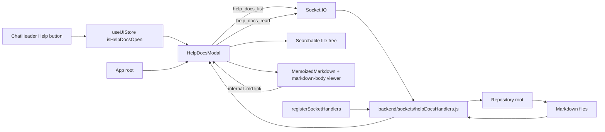

# Feature Doc - Help Docs Modal

The Help Docs Modal is a read-only in-app documentation browser for Markdown files in the AcpUI repository. It is opened from the chat header, lists repository `.md` documents through Socket.IO, and renders the selected document with the same Markdown renderer family used elsewhere in the frontend.

This feature matters because it is repo-scoped rather than provider-scoped: it must not reuse provider home file editing semantics, and backend reads must stay constrained to Markdown files under the repository root.

## Overview

### What It Does

- Adds a `Help` icon button to `ChatHeader`, immediately before `System Settings`.
- Tracks modal visibility through `useUIStore.isHelpDocsOpen` and `setHelpDocsOpen`.
- Mounts `HelpDocsModal` once in `App` alongside the other global modals.
- Lists all repository Markdown files with `help_docs_list`, excluding dependency/build directories.
- Reads selected Markdown files with `help_docs_read` after repository-root traversal checks.
- Renders a large two-pane modal: searchable file tree on the left, Markdown viewer on the right.
- Intercepts internal repository `.md` links in rendered documents and opens them inside the Help viewer.

### Why This Matters

- Repository documentation becomes available without leaving the chat UI.
- The modal is read-only, so it avoids the save/dirty-state contract owned by File Explorer.
- Search operates over the full relative path, which keeps provider READMEs and feature docs discoverable.
- The backend owns filesystem trust boundaries; the frontend never receives absolute read paths.
- Pop-out chat windows keep main-shell controls hidden, including Help.

Architectural role: frontend modal plus backend Socket.IO read-only filesystem handlers.

## How It Works - End-to-End Flow

1. Header button opens the modal.

   File: `frontend/src/components/ChatHeader/ChatHeader.tsx` (Component: `ChatHeader`, button title: `Help`)

   ```tsx
   <button
     onClick={() => useUIStore.getState().setHelpDocsOpen(true)}
     className="icon-button"
     title="Help"
   >
     <CircleHelp size={18} />
   </button>
   ```

   The button is inside the existing non-pop-out `header-actions` block, so detached chat windows do not show it.

2. UI store tracks modal visibility.

   File: `frontend/src/store/useUIStore.ts` (State: `isHelpDocsOpen`, action: `setHelpDocsOpen`)

   ```typescript
   isHelpDocsOpen: false,
   setHelpDocsOpen: (isOpen) => set({ isHelpDocsOpen: isOpen }),
   ```

   `ChatHeader` only flips the state; it does not own any modal internals.

3. App mounts the modal once.

   File: `frontend/src/App.tsx` (Component: `App`, child: `HelpDocsModal`)

   ```tsx
   <FileExplorer />
   <HelpDocsModal />
   <ConfigErrorModal />
   ```

   `HelpDocsModal` returns `null` while `isHelpDocsOpen` is false.

4. Socket bootstrap registers help docs handlers.

   File: `backend/sockets/index.js` (Function: `registerSocketHandlers`, registration: `registerHelpDocsHandlers`)

   ```javascript
   registerFolderHandlers(io, socket);
   registerFileExplorerHandlers(io, socket);
   registerHelpDocsHandlers(io, socket);
   registerGitHandlers(io, socket);
   ```

   Handlers are registered after normal socket hydration succeeds, alongside the other app-shell utility handlers.

5. Backend resolves the repository root.

   File: `backend/sockets/helpDocsHandlers.js` (Constants: `DEFAULT_REPO_ROOT`, `IGNORED_DIRECTORIES`)

   ```javascript
   const __filename = fileURLToPath(import.meta.url);
   const __dirname = path.dirname(__filename);
   const DEFAULT_REPO_ROOT = path.resolve(__dirname, '..', '..');
   const IGNORED_DIRECTORIES = new Set(['.git', 'node_modules', 'dist', 'coverage', '.vite', '.turbo', 'build']);
   ```

   The root is derived from the handler file location, not `process.cwd()`, so backend launch directory does not affect document discovery.

6. Opening the modal lists Markdown files.

   File: `frontend/src/components/HelpDocsModal.tsx` (Component: `HelpDocsModal`, socket event: `help_docs_list`)

   ```tsx
   socket.emit('help_docs_list', {}, (res: HelpDocsListResponse) => {
     const nextFiles = res.files || [];
     setFiles(nextFiles);
     setRootLabel(res.root || 'Repository');
     const initialFile = nextFiles.find(file => file.path === 'BOOTSTRAP.md') || nextFiles[0];
     if (initialFile) loadDocument(initialFile.path);
   });
   ```

   `BOOTSTRAP.md` is selected first when it exists; otherwise the first sorted Markdown file is loaded.

7. Backend recursively lists `.md` files.

   File: `backend/sockets/helpDocsHandlers.js` (Functions: `collectMarkdownFiles`, `listDocs`, socket event: `help_docs_list`)

   ```javascript
   function listDocs() {
     return collectMarkdownFiles(resolvedRoot)
       .sort((a, b) => a.path.localeCompare(b.path));
   }
   ```

   Returned entries are `{ name, path, directory }` with POSIX-style relative paths.

8. Frontend builds and filters the tree.

   File: `frontend/src/components/HelpDocsModal.tsx` (Functions: `buildTree`, `collectDirectoryPaths`)

   ```tsx
   const filteredFiles = query.trim()
     ? files.filter(file => file.path.toLowerCase().includes(query.trim().toLowerCase()))
     : files;
   const tree = useMemo(() => buildTree(filteredFiles), [filteredFiles]);
   const autoExpanded = query.trim() ? collectDirectoryPaths(tree) : expanded;
   ```

   Search filters by relative path and auto-expands matching folders while the query is active.

9. Selecting a file reads and renders it.

   File: `frontend/src/components/HelpDocsModal.tsx` (Function: `loadDocument`, socket event: `help_docs_read`)

   ```tsx
   socket.emit('help_docs_read', { filePath }, (res: HelpDocsReadResponse) => {
     setContent(res.content || '');
     setSelectedPath(res.filePath || filePath);
   });
   ```

   The viewer renders through `MemoizedMarkdown`, using the shared `.markdown-body` styles and the same syntax-highlighter code override used by other Markdown surfaces.

10. Internal Markdown links stay inside the Help viewer.

    File: `frontend/src/components/HelpDocsModal.tsx` (Functions: `resolveMarkdownLink`, `getInternalHrefPath`, `normalizeRepoPath`, renderer component: `markdownComponents.a`)

    ```tsx
    const targetPath = resolveMarkdownLink(href, selectedPath, files);
    if (targetPath) {
      event.preventDefault();
      setQuery('');
      setExpanded(parentDirectories(targetPath));
      loadDocument(targetPath);
    }
    ```

    Links to repository `.md` files are resolved against the current document first, then against the repository root. External links and non-Markdown links keep normal anchor behavior.

11. Backend validates every read.

    File: `backend/sockets/helpDocsHandlers.js` (Functions: `ensureMarkdownDocPath`, `readDoc`, socket event: `help_docs_read`)

    ```javascript
    const resolved = path.resolve(rootDir, normalizedPath);
    if (!isInsideRoot(rootDir, resolved)) throw new Error('Path traversal blocked');
    if (!resolved.toLowerCase().endsWith('.md')) throw new Error('Only Markdown documents can be viewed');
    ```

    Invalid reads return callback payloads with `{ error }` and are logged with `[HELP DOCS ERR]`.

## Architecture Diagram



## The Critical Contract: Repo-Scoped Read-Only Markdown

All Help Docs filesystem access must follow this contract:

- `help_docs_list` returns only repository-relative Markdown entries.
- `help_docs_read` accepts only a repository-relative `filePath`.
- Every read must pass through `ensureMarkdownDocPath(rootDir, filePath)` before `fs.readFileSync`.
- Absolute paths, traversal paths, and non-`.md` paths return errors.
- The frontend displays and sends relative paths only; it never receives a path that grants broader filesystem authority.
- The modal has no write path, dirty state, Monaco editor, or provider root scope.
- Rendered internal `.md` links must resolve only to entries already returned by `help_docs_list`; unresolved and external links keep normal anchor behavior.

If this contract is broken, the help surface can read outside the repository, expose non-document files, or accidentally inherit File Explorer's provider-scoped editing behavior.

## Configuration / Provider-Specific Behavior

No provider configuration is required. Provider directories are included only when they contain Markdown files under the repository root. Dependency and build directories are skipped by `IGNORED_DIRECTORIES` in `backend/sockets/helpDocsHandlers.js`.

## Data Flow / Rendering Pipeline

```text
ChatHeader Help button
  -> useUIStore.setHelpDocsOpen(true)
  -> App-mounted HelpDocsModal renders
  -> help_docs_list callback returns { files, root }
  -> HelpDocsModal buildTree(files)
  -> user search filters relative paths
  -> user selects file or clicks an internal .md link
  -> help_docs_read { filePath }
  -> backend validates root + .md extension
  -> callback { content, filePath }
  -> MemoizedMarkdown + shared markdown-body viewer
```

Backend list response shape:

```typescript
type HelpDocsListResponse = {
  root?: string;
  files?: Array<{ name: string; path: string; directory: string }>;
  error?: string;
};
```

Backend read response shape:

```typescript
type HelpDocsReadResponse = {
  content?: string;
  filePath?: string;
  error?: string;
};
```

## Component Reference

### Frontend

| Area | File | Anchors | Purpose |
|---|---|---|---|
| Header action | `frontend/src/components/ChatHeader/ChatHeader.tsx` | `ChatHeader`, `CircleHelp`, button title `Help`, `setHelpDocsOpen(true)` | Opens the help docs modal from the header. |
| Modal | `frontend/src/components/HelpDocsModal.tsx` | `HelpDocsModal`, `HelpDocTreeItem`, `markdownComponents`, `resolveMarkdownLink`, `loadDocument`, `buildTree`, `parentDirectories`, `collectDirectoryPaths` | Owns list/read socket calls, search state, tree rendering, internal link interception, shared Markdown rendering, and Markdown viewing. |
| Modal styles | `frontend/src/components/HelpDocsModal.css` | `.help-docs-overlay`, `.help-docs-modal`, `.hd-sidebar`, `.hd-search`, `.hd-viewer-content` | Defines large popup layout, responsive split panes, tree rows, and Markdown content styling. |
| App mount | `frontend/src/App.tsx` | `App`, child `HelpDocsModal` | Mounts the modal once with other app-level modals. |
| UI state | `frontend/src/store/useUIStore.ts` | `isHelpDocsOpen`, `setHelpDocsOpen` | Stores modal visibility. |

### Backend

| Area | File | Anchors | Purpose |
|---|---|---|---|
| Socket registration | `backend/sockets/index.js` | `registerSocketHandlers`, `registerHelpDocsHandlers` | Registers help docs socket handlers on each connected client. |
| Help docs handlers | `backend/sockets/helpDocsHandlers.js` | `createHelpDocsHandlers`, `collectMarkdownFiles`, `ensureMarkdownDocPath`, `listDocs`, `readDoc`, events `help_docs_list`, `help_docs_read` | Lists repository Markdown files and reads selected Markdown content safely. |
| Logging | `backend/services/logger.js` | `writeLog`, prefix `[HELP DOCS ERR]` | Records list/read failures. |

### Tests

| Area | File | Anchors | Purpose |
|---|---|---|---|
| Frontend modal | `frontend/src/test/HelpDocsModal.test.tsx` | `renders when open and loads the default Markdown document`, `filters the Markdown tree by path`, `opens a selected Markdown document in the viewer`, `opens internal Markdown links in the Help viewer`, `closes on overlay click` | Verifies modal visibility, shared `.markdown-body` styling, list/read calls, search, selection, internal Markdown link interception, and close behavior. |
| Header | `frontend/src/test/ChatHeader.test.tsx` | `handles "Help" button click`, `hides sidebar menu and action buttons in pop-out mode` | Verifies the header opens Help and hides it in pop-out mode. |
| UI store | `frontend/src/test/useUIStore.test.ts` | `setNotesOpen, setFileExplorerOpen, and setHelpDocsOpen update state` | Verifies the modal visibility action. |
| Backend handlers | `backend/test/helpDocsHandlers.test.js` | `help_docs_list returns sorted Markdown files under the repository root`, `help_docs_list supports callback-only emits`, `help_docs_read returns Markdown document content`, `blocks path traversal reads`, `rejects non-Markdown reads`, `handles list errors gracefully` | Verifies repository listing, callback compatibility, safe reads, and error handling. |
| Socket registration | `backend/test/sockets-index.test.js` | `registers all modular handlers on connection` | Verifies `registerHelpDocsHandlers` is wired into socket bootstrap. |

## Gotchas & Important Notes

1. Help Docs is not File Explorer.

   File Explorer is provider-scoped and editable. Help Docs is repo-scoped and read-only. Do not add save logic or provider path selection to `HelpDocsModal`.

2. The backend root must not depend on `process.cwd()`.

   Backend dev/prod launch directories can differ. `DEFAULT_REPO_ROOT` is derived from `import.meta.url` so it remains stable.

3. Search filters relative paths, not content.

   The search input filters file paths in the already-loaded file list. It does not grep document contents.

4. Search mode auto-expands folders.

   `autoExpanded` is derived from the filtered tree while a query exists. Manual expansion state resumes when the query is cleared.

5. `BOOTSTRAP.md` is the default selected document.

   The modal chooses `BOOTSTRAP.md` first when present; otherwise it selects the first sorted Markdown file.

6. Path validation must check both root containment and extension.

   `ensureMarkdownDocPath` blocks traversal first and then rejects non-Markdown files. Keep both checks for every read path.

7. Dependency/build directories are intentionally skipped.

   `node_modules`, `.git`, `dist`, `coverage`, `.vite`, `.turbo`, and `build` are excluded to keep listing fast and focused on repository docs.

8. Pop-out mode hides Help through the same header gate as other main-shell controls.

   Keep the `popout` URL query check in `ChatHeader` when adding or moving header actions.

9. Internal doc links are list-bound.

   `resolveMarkdownLink` only opens paths that exist in the current `files` array from `help_docs_list`. This keeps link clicks aligned with the backend-discovered Markdown set and avoids inventing frontend-only read paths.

## Unit Tests

Run focused backend verification from `backend`:

```powershell
npx vitest run test/helpDocsHandlers.test.js test/sockets-index.test.js
```

Run focused frontend verification from `frontend`:

```powershell
npx vitest run src/test/HelpDocsModal.test.tsx src/test/ChatHeader.test.tsx src/test/useUIStore.test.ts src/test/App.test.tsx
```

## How to Use This Guide

### For implementing/extending this feature

1. Start with `frontend/src/components/HelpDocsModal.tsx` for UI behavior, socket payloads, and internal Markdown link resolution.
2. Update `backend/sockets/helpDocsHandlers.js` for new backend list/read behavior, preserving `ensureMarkdownDocPath` for reads.
3. Register any new socket event in the same handler module and update `backend/test/helpDocsHandlers.test.js`.
4. Keep `ChatHeader` shallow: it should only call `setHelpDocsOpen(true)`.
5. Update this Feature Doc, the Chat Header doc, and architecture docs when changing events, state names, or component ownership.

### For debugging issues with this feature

1. Confirm `useUIStore.isHelpDocsOpen` flips to `true` after clicking the Help button.
2. Confirm `HelpDocsModal` has a non-null `useSystemStore.socket` while open.
3. Inspect `help_docs_list` callback payload for `{ files, root, error }`.
4. Inspect `help_docs_read` callback payload for `{ content, filePath, error }`.
5. Check `[HELP DOCS ERR]` logs when list/read callbacks return errors.
6. Verify the requested `filePath` is repository-relative and ends in `.md`.
7. If an internal link navigates the browser instead of the viewer, inspect `resolveMarkdownLink`, the current `selectedPath`, and whether the target appears in the `help_docs_list` file array.

## Summary

- Help Docs adds a header Help icon and large read-only Markdown documentation modal.
- Modal visibility lives in `useUIStore.isHelpDocsOpen` and `setHelpDocsOpen`.
- `App` mounts `HelpDocsModal` once with other global modals.
- Backend socket events are `help_docs_list` and `help_docs_read`.
- The backend lists repository Markdown files and reads only validated repository-relative `.md` paths.
- The frontend builds a searchable tree, renders selected content through `MemoizedMarkdown`, `.markdown-body`, and the shared syntax-highlighted code override, and keeps internal `.md` links inside the viewer.
- The critical contract is repo-scoped read-only Markdown access with backend traversal protection.
