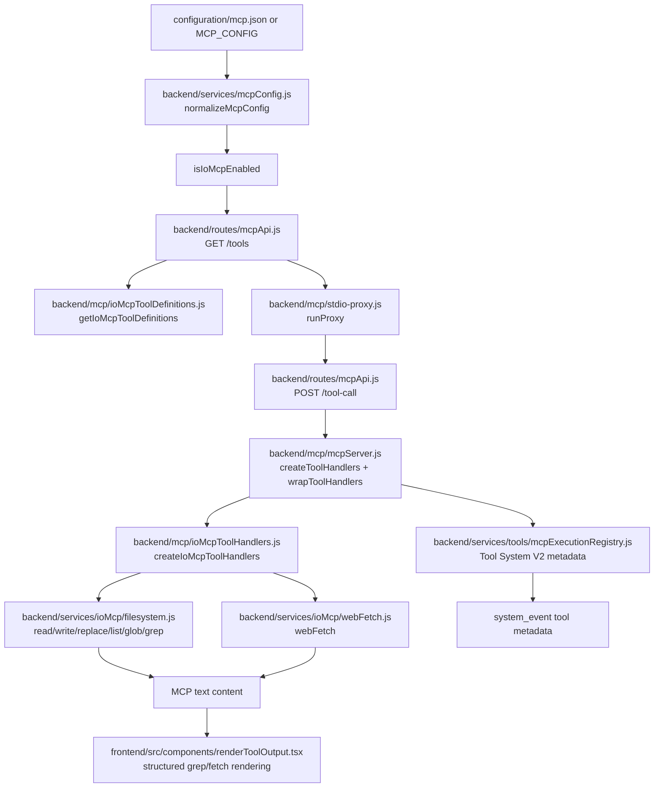

# IO MCP Tools

IO MCP Tools expose AcpUI-owned file, directory, search, and URL fetch helpers through the backend MCP server. This guide covers the seven IO tools returned by `getIoMcpToolDefinitions`: `ux_read_file`, `ux_write_file`, `ux_replace`, `ux_list_directory`, `ux_glob`, `ux_grep_search`, and `ux_web_fetch`.

The feature is security-sensitive because it lets agent tool calls cross local filesystem boundaries and network boundaries. The main maintenance risks are schema/handler drift, incomplete config gating, path policy bypasses, and output shape changes that break downstream rendering.

## Overview

### What It Does
- Advertises optional IO tool schemas through `GET /api/mcp/tools` when `tools.io` is enabled.
- Registers executable IO handlers in `createToolHandlers` when `tools.io` is enabled.
- Reads, writes, edits, lists, globs, and greps local filesystem content within configured allowed roots.
- Fetches HTTP/HTTPS URLs with protocol, host, redirect, timeout, and response-size policy checks.
- Wraps every handler result in MCP text content at `content[0].text`.
- Returns structured JSON text for `ux_grep_search` and `ux_web_fetch`, which `renderToolOutput` recognizes for specialized UI rendering.

### Why This Matters
- Agents only see tools that the MCP API advertises at session proxy startup.
- Filesystem helpers must resolve every path through the same allowed-root contract before touching disk.
- Web fetch must apply URL policy before each network request and redirect target.
- Tool names, schemas, handler keys, UI titles, categories, and tests all depend on the canonical `ux_*` names.
- Output shape is part of the frontend contract for grep and web fetch rendering.

### Architectural Role
This is a backend MCP feature with frontend output rendering support. Source ownership is split across MCP config normalization, MCP schema advertisement, tool handler registration, filesystem/network services, Tool System V2 metadata projection, and `renderToolOutput` structured payload rendering.

## How It Works - End-to-End Flow

1. **MCP config is loaded and normalized**
   - File: `backend/services/mcpConfig.js` (Functions: `getMcpConfig`, `normalizeMcpConfig`, `isIoMcpEnabled`, `getIoMcpConfig`, `getWebFetchMcpConfig`)
   - The backend reads the config path from `MCP_CONFIG` or `configuration/mcp.json`. Relative paths resolve from the repository root.
   - `boolSetting` accepts both boolean flags and `{ "enabled": true }` objects.
   - A missing or malformed config returns `disabledConfig`, which disables `tools.io` and keeps safe limit defaults available to callers.

   ```javascript
   // FILE: backend/services/mcpConfig.js (Function: normalizeMcpConfig)
   tools: {
     io: boolSetting(tools.io)
   },
   io: {
     autoAllowWorkspaceCwd: boolSetting(io.autoAllowWorkspaceCwd),
     allowedRoots: stringArray(io.allowedRoots),
     maxReadBytes: numberSetting(io.maxReadBytes, 1048576),
     maxWriteBytes: numberSetting(io.maxWriteBytes, 1048576),
     maxReplaceBytes: numberSetting(io.maxReplaceBytes, 1048576),
     maxOutputBytes: numberSetting(io.maxOutputBytes, 262144)
   }
   ```

2. **Canonical names and UI metadata come from one registry**
   - File: `backend/services/tools/acpUxTools.js` (Symbols: `ACP_UX_TOOL_NAMES`, `ACP_UX_IO_TOOL_CONFIG`, `ACP_UX_IO_TOOL_NAMES`)
   - The canonical names are the `ux_*` constants. `ACP_UX_IO_TOOL_CONFIG` provides title details, categories, and `usesFilePath` metadata for Tool System V2.
   - `ACP_UX_IO_TOOL_CONFIG` also contains metadata for `ux_google_web_search`; that tool uses `getGoogleSearchMcpToolDefinitions` and `createGoogleSearchMcpToolHandlers`, and is covered by `documents/[Feature Doc] - Google Search MCP Tool.md`.

3. **Tool schemas are advertised through the MCP API**
   - File: `backend/routes/mcpApi.js` (Route: `GET /tools`, Function: `createMcpApiRoutes`)
   - File: `backend/mcp/ioMcpToolDefinitions.js` (Function: `getIoMcpToolDefinitions`)
   - `GET /tools` appends IO definitions only when `isIoMcpEnabled()` is true.
   - The schema list is exactly: `ux_read_file`, `ux_write_file`, `ux_replace`, `ux_list_directory`, `ux_glob`, `ux_grep_search`, and `ux_web_fetch`.

   ```javascript
   // FILE: backend/routes/mcpApi.js (Route: GET /tools)
   if (isIoMcpEnabled()) {
     toolList.push(...getIoMcpToolDefinitions());
   }
   ```

4. **The stdio proxy registers the advertised schemas with the ACP client**
   - File: `backend/mcp/stdio-proxy.js` (Functions: `runProxy`, `backendFetch`, `buildServerInstructions`)
   - The proxy calls `GET /api/mcp/tools` during `runProxy`, registers those tool definitions with the MCP SDK, and forwards tool calls to `POST /api/mcp/tool-call`.
   - Tool visibility is tied to the schema list fetched by the proxy for that ACP session.

5. **Runtime handlers are registered with the same gate**
   - File: `backend/mcp/mcpServer.js` (Function: `createToolHandlers`, Anchor: `Object.assign(tools, createIoMcpToolHandlers())`)
   - File: `backend/mcp/ioMcpToolHandlers.js` (Function: `createIoMcpToolHandlers`)
   - The handler map is merged only when `isIoMcpEnabled()` is true, then wrapped by `wrapToolHandlers` so Tool System V2 can record metadata and outputs.

   ```javascript
   // FILE: backend/mcp/mcpServer.js (Function: createToolHandlers)
   if (isIoMcpEnabled()) {
     Object.assign(tools, createIoMcpToolHandlers());
   }
   return wrapToolHandlers(tools, io);
   ```

6. **Tool calls enter through the MCP API execution route**
   - File: `backend/routes/mcpApi.js` (Route: `POST /tool-call`, Function: `createToolCallAbortSignal`, Function: `resolveToolContext`)
   - The route finds `tools[toolName]`, augments args with provider/proxy context, forwards `mcpRequestId` and `requestMeta`, and always includes `abortSignal`.
   - Handler failures return text content shaped as `Error: <message>` unless the request/response is already aborted or destroyed.

7. **Tool System V2 records stable display metadata**
   - File: `backend/mcp/mcpServer.js` (Function: `wrapToolHandlers`)
   - File: `backend/services/tools/mcpExecutionRegistry.js` (Functions: `begin`, `complete`, `fail`, `publicMcpToolInput`, `describeAcpUxToolExecution`)
   - File: `backend/services/tools/handlers/ioToolHandler.js` (Handler: `ioToolHandler`)
   - `wrapToolHandlers` strips internal keys from the public tool input, records execution state, emits early `system_event` title updates when context is present, and stores output when the handler completes.
   - Titles come from `acpUiToolTitle`: file tools use file basenames, list uses the directory path, glob/grep prefer `description` and then `pattern`, and web fetch uses `url`.

8. **Filesystem paths are resolved before filesystem access**
   - File: `backend/services/ioMcp/filesystem.js` (Functions: `resolveAllowedPath`, `configuredAllowedRoots`, `configRootToAbsolute`, `isPathWithinRoot`)
   - `resolveAllowedPath` resolves the target path, expands configured roots, applies the wildcard root `*`, and rejects paths outside allowed roots.
   - `io.autoAllowWorkspaceCwd` adds `DEFAULT_WORKSPACE_CWD` or `process.cwd()` to the allowed-root list.
   - Relative roots in config resolve from the repository root, not from the requested file path.

9. **Read, write, and replace apply size and text contracts**
   - File: `backend/services/ioMcp/filesystem.js` (Functions: `readFile`, `writeFile`, `replaceText`, `limitTextOutput`)
   - `readFile` requires a file target, checks `maxReadBytes`, supports optional 1-based `start_line` and inclusive `end_line`, and caps returned text with `maxOutputBytes`.
   - `writeFile` requires string `content`, checks `maxWriteBytes`, creates parent directories, writes UTF-8 text, and returns the written content capped by `maxOutputBytes`.
   - `replaceText` checks `maxReplaceBytes`, normalizes CRLF to LF for matching, restores CRLF output when the file uses it, returns a diff, and caps the diff with `maxOutputBytes`.

10. **Replace follows an exact-first tolerant edit path**
    - File: `backend/services/ioMcp/filesystem.js` (Functions: `replaceText`, `findActualString`, `preserveQuoteStyle`, `replaceMostSimilarChunk`, `replaceWithMissingLeadingWhitespace`, `replaceClosestEditDistance`)
    - Exact matching is attempted first, including straight/curly quote normalization.
    - `allow_multiple` replaces all exact occurrences only. Fuzzy fallback rejects `allow_multiple=true`.
    - Fallback matching handles an extra leading blank line, missing leading whitespace, and close line-sequence similarity.

11. **Directory, glob, and grep stay inside allowed roots**
    - File: `backend/services/ioMcp/filesystem.js` (Functions: `listDirectory`, `findFiles`, `grepSearch`, `parseRipgrepJson`, `limitGrepResult`)
    - `listDirectory` returns direct entries and appends `/` to directories.
    - `findFiles` uses `glob` with `absolute: true` and `nodir: true` under the allowed `dir_path` or allowed `process.cwd()`.
    - `grepSearch` spawns the `@vscode/ripgrep` binary with `--json`, searches `.` under the allowed cwd, treats exit code `0` and `1` as successful, and rejects other exit codes.
    - Grep defaults to case-insensitive search (`-i`) unless `case_sensitive` is true. `fixed_strings` adds `-F`; positive `context` adds `-C<n>`.

12. **Web fetch applies URL policy before network access**
    - File: `backend/services/ioMcp/webFetch.js` (Functions: `webFetch`, `assertUrlAllowed`, `fetchWithRedirects`, `readResponseText`, `composeAbortSignal`)
    - URL policy checks run before the first request and before each redirect target.
    - Policy includes allowed protocols, blocked hosts, wildcard host patterns, IPv4 CIDR checks for literal IPv4 hosts, redirect caps, response byte caps, timeout, and parent abort signal propagation.
    - HTML responses are parsed with `cheerio`; scripts, styles, media, SVG, and iframe content are removed before body text is normalized.

13. **Structured outputs render in the frontend**
    - File: `frontend/src/components/renderToolOutput.tsx` (Function: `renderToolOutput`, Type guards: `isWebFetchResult`, `isGrepSearchResult`)
    - `ux_grep_search` and `ux_web_fetch` handlers return JSON strings in `content[0].text`.
    - `renderToolOutput` parses those JSON objects and renders grep matches with file/line rows plus highlighted submatches, or web fetch output with title, URL, status, content type, and text.

## Architecture Diagram



## Critical Contract

The critical contract is schema, handler, policy, and output parity for each canonical `ux_*` IO tool.

For each IO tool, these pieces must stay aligned:
- Canonical name in `backend/services/tools/acpUxTools.js` (`ACP_UX_TOOL_NAMES` and `ACP_UX_IO_TOOL_CONFIG`).
- MCP schema in `backend/mcp/ioMcpToolDefinitions.js` (`getIoMcpToolDefinitions`).
- Handler key and argument destructuring in `backend/mcp/ioMcpToolHandlers.js` (`createIoMcpToolHandlers`).
- Config gates in `backend/routes/mcpApi.js` (`GET /tools`) and `backend/mcp/mcpServer.js` (`createToolHandlers`).
- Tool System V2 display metadata in `backend/services/tools/mcpExecutionRegistry.js`, `backend/services/tools/acpUiToolTitles.js`, and `backend/services/tools/handlers/ioToolHandler.js`.
- Frontend structured rendering in `frontend/src/components/renderToolOutput.tsx` for `web_fetch_result` and `ux_grep_search_result`.

The safety contract is equally strict:
- Every local path operation must pass through `resolveAllowedPath` before disk access.
- Every web request URL and redirect target must pass through `assertUrlAllowed` before `fetch`.
- Every long-running operation that receives `abortSignal` must stop or reject when it is aborted.

The output contract is:
- All handlers return `{ content: [{ type: 'text', text: string }] }`.
- File read, write, replace, list, and glob return plain text.
- `ux_grep_search` returns JSON text for a `ux_grep_search_result` object.
- `ux_web_fetch` returns JSON text for a `web_fetch_result` object.

## Configuration / Data Flow

### Configuration Keys

Primary source: `configuration/mcp.json` or the path in `MCP_CONFIG`.

| Key | Used By | Meaning |
|---|---|---|
| `tools.io` or `tools.io.enabled` | `isIoMcpEnabled` | Enables IO schema advertisement and handler registration |
| `io.autoAllowWorkspaceCwd` | `configuredAllowedRoots` | Adds `DEFAULT_WORKSPACE_CWD` or `process.cwd()` to allowed roots |
| `io.allowedRoots` | `resolveAllowedPath` | Allowed absolute paths, repo-relative paths, or `*` wildcard |
| `io.maxReadBytes` | `readFile` | Maximum existing file size for `ux_read_file` |
| `io.maxWriteBytes` | `writeFile` | Maximum UTF-8 byte size for `content` |
| `io.maxReplaceBytes` | `replaceText` | Maximum source file size and replacement result size |
| `io.maxOutputBytes` | `limitTextOutput`, `limitGrepResult` | Maximum returned text or JSON payload size |
| `webFetch.allowedProtocols` | `assertUrlAllowed` | Allowed URL protocols, typically `http:` and `https:` |
| `webFetch.blockedHosts` | `assertUrlAllowed` | Exact blocked hostnames after normalization |
| `webFetch.blockedHostPatterns` | `assertUrlAllowed` | Wildcard blocked host patterns such as `*.internal` |
| `webFetch.blockedCidrs` | `assertUrlAllowed` | Blocked IPv4 CIDR ranges for literal IPv4 URL hosts |
| `webFetch.maxResponseBytes` | `readResponseText` | Maximum fetched response byte size |
| `webFetch.timeoutMs` | `composeAbortSignal` | Fetch timeout in milliseconds |
| `webFetch.maxRedirects` | `fetchWithRedirects` | Redirect hop cap; `0` allows no redirects |

Example pattern with placeholder values:

```json
{
  "tools": {
    "io": { "enabled": true }
  },
  "io": {
    "autoAllowWorkspaceCwd": true,
    "allowedRoots": ["D:/Git/AcpUI"],
    "maxReadBytes": 1048576,
    "maxWriteBytes": 1048576,
    "maxReplaceBytes": 1048576,
    "maxOutputBytes": 262144
  },
  "webFetch": {
    "allowedProtocols": ["http:", "https:"],
    "blockedHosts": [],
    "blockedHostPatterns": [],
    "blockedCidrs": [],
    "maxResponseBytes": 1048576,
    "timeoutMs": 15000,
    "maxRedirects": 5
  }
}
```

### File Tool Flow

```text
MCP request args
  -> backend/routes/mcpApi.js POST /tool-call
  -> backend/mcp/mcpServer.js wrapToolHandlers
  -> backend/mcp/ioMcpToolHandlers.js createIoMcpToolHandlers
  -> backend/services/ioMcp/filesystem.js helper
  -> MCP text result in content[0].text
```

### Grep Output Shape

`ux_grep_search` returns `JSON.stringify(result)` where `result` has this shape:

```json
{
  "type": "ux_grep_search_result",
  "pattern": "needle",
  "dirPath": "D:/Git/AcpUI",
  "matchCount": 1,
  "matches": [
    {
      "filePath": "D:/Git/AcpUI/src/app.ts",
      "lineNumber": 12,
      "line": "const value = \"needle\";",
      "submatches": [
        { "text": "needle", "start": 15, "end": 21 }
      ]
    }
  ],
  "context": [
    {
      "filePath": "D:/Git/AcpUI/src/app.ts",
      "lineNumber": 11,
      "line": "const before = true;"
    }
  ],
  "truncated": false
}
```

When `limitGrepResult` must shrink output to fit `io.maxOutputBytes`, it sets `truncated: true`, adds `maxOutputBytes`, drops `context` entries first, then drops `matches`, and updates `matchCount` to the number of returned matches.

### Web Fetch Output Shape

`ux_web_fetch` returns `JSON.stringify(result)` where `result` has this shape:

```json
{
  "type": "web_fetch_result",
  "url": "https://example.test/docs",
  "status": 200,
  "contentType": "text/html",
  "title": "Docs",
  "text": "Normalized body text"
}
```

For non-HTML responses, `title` is an empty string and `text` is the fetched response text.

### Tool Metadata Flow

```text
wrapToolHandlers begin
  -> mcpExecutionRegistry.begin
  -> describeAcpUxToolExecution
  -> acpUiToolTitle
  -> toolCallState.upsert
  -> system_event tool_update with title/category/filePath
```

## Component Reference

### Backend and Configuration

| Area | File | Anchors | Purpose |
|---|---|---|---|
| Config file | `configuration/mcp.json.example` | `tools.io`, `io`, `webFetch` | Example config shape for IO and web fetch policies |
| Config normalization | `backend/services/mcpConfig.js` | `getMcpConfig`, `normalizeMcpConfig`, `boolSetting`, `numberSetting`, `stringArray`, `isIoMcpEnabled`, `getIoMcpConfig`, `getWebFetchMcpConfig` | Loads config, normalizes flags/limits, and exposes IO/web fetch config |
| Tool names | `backend/services/tools/acpUxTools.js` | `ACP_UX_TOOL_NAMES`, `ACP_UX_IO_TOOL_CONFIG`, `ACP_UX_IO_TOOL_NAMES`, `acpUxIoToolConfig`, `isAcpUxToolName` | Canonical names and UI metadata for optional AcpUI tools |
| MCP schemas | `backend/mcp/ioMcpToolDefinitions.js` | `getIoMcpToolDefinitions` | Defines IO MCP schemas, annotations, and required inputs |
| MCP API | `backend/routes/mcpApi.js` | `createMcpApiRoutes`, `GET /tools`, `POST /tool-call`, `resolveToolContext`, `createToolCallAbortSignal`, `canWriteResponse` | Advertises schemas, dispatches calls, attaches context and abort signals |
| Stdio proxy | `backend/mcp/stdio-proxy.js` | `runProxy`, `backendFetch`, `buildServerInstructions`, `ListToolsRequestSchema`, `CallToolRequestSchema` | Fetches schemas for ACP sessions and forwards tool calls to backend API |
| Handler registration | `backend/mcp/mcpServer.js` | `createToolHandlers`, `wrapToolHandlers`, `Object.assign(tools, createIoMcpToolHandlers())` | Registers IO handlers behind the feature flag and records Tool System V2 execution metadata |
| IO handlers | `backend/mcp/ioMcpToolHandlers.js` | `createIoMcpToolHandlers`, `textResult` | Maps MCP args to filesystem/web services and returns MCP text content |
| Filesystem services | `backend/services/ioMcp/filesystem.js` | `readFile`, `writeFile`, `replaceText`, `listDirectory`, `findFiles`, `grepSearch`, `resolveAllowedPath`, `limitTextOutput`, `parseRipgrepJson`, `limitGrepResult` | Implements path-gated local file, glob, and grep operations |
| Web fetch service | `backend/services/ioMcp/webFetch.js` | `webFetch`, `assertUrlAllowed`, `fetchWithRedirects`, `readResponseText`, `composeAbortSignal` | Implements policy-gated URL fetch and HTML text extraction |
| Tool title builder | `backend/services/tools/acpUiToolTitles.js` | `acpUiToolTitle`, `basenameForToolPath` | Builds user-facing titles from IO tool inputs |
| Tool execution metadata | `backend/services/tools/mcpExecutionRegistry.js` | `begin`, `complete`, `fail`, `publicMcpToolInput`, `describeAcpUxToolExecution`, `invocationFromMcpExecution` | Records MCP execution identity, display metadata, category, file path, and output |
| IO Tool System handler | `backend/services/tools/handlers/ioToolHandler.js` | `ioToolHandler`, `applyIoToolMetadata` | Applies IO title/category/file metadata to normalized tool lifecycle events |
| Tool registry | `backend/services/tools/index.js` | `toolRegistry.register`, `ACP_UX_IO_TOOL_NAMES` loop | Registers IO tools with Tool System V2 lifecycle dispatch |
| Provider tool normalization | `backend/services/tools/providerToolNormalization.js` | `ACP_UX_MCP_TITLE_TO_TOOL_NAME`, `resolveToolNameFromAcpUiMcpTitle`, `resolvePatternToolName`, `inputFromToolUpdate` | Resolves provider-supplied MCP tool names/titles back to canonical AcpUI names, including titles with `: <detail>` suffixes |

### Frontend Rendering

| Area | File | Anchors | Purpose |
|---|---|---|---|
| Tool output renderer | `frontend/src/components/renderToolOutput.tsx` | `renderToolOutput`, `tryParseJsonObject`, `isWebFetchResult`, `isGrepSearchResult`, `renderHighlightedMatch` | Parses structured grep/fetch JSON text and renders specialized UI output |
| Tool step UI | `frontend/src/components/ToolStep.tsx` | `ToolStep`, `getFilePathFromEvent`, `renderToolOutput` call site | Passes tool output and file path into the renderer |
| Stream store | `frontend/src/store/useStreamStore.ts` | `onStreamEvent`, `processBuffer` | Preserves Tool System V2 titles and merges tool lifecycle events into timeline steps |

### Tests

| Area | File | Anchors | Purpose |
|---|---|---|---|
| Filesystem service tests | `backend/test/ioMcpFilesystem.test.js` | `IO MCP filesystem helpers`, `reads selected line ranges`, `writes parent directories recursively`, `lists direct children with slash suffixes for directories`, `finds files with glob patterns`, `searches file contents with ripgrep`, `blocks file access outside configured allowed roots`, `supports wildcard allowed roots`, `enforces read and write size caps`, `replaceText with fuzzy matching` | Covers file IO, root policy, grep shape, size caps, and replace behavior |
| Web fetch service tests | `backend/test/ioMcpWebFetch.test.js` | `IO MCP webFetch`, `returns structured non-HTML text`, `extracts structured normalized body text from HTML`, `throws for non-OK responses`, `blocks configured hosts before fetching`, `follows redirects through the configured policy checks`, `enforces response size caps` | Covers fetch result shape and network policy enforcement |
| Config tests | `backend/test/mcpConfig.test.js` | `MCP config`, `disables config-controlled tools when the config is missing`, `disables config-controlled tools when the config is malformed`, `reads enabled tools from configuration/mcp.json shape`, `normalizes IO, web fetch, and Google search settings` | Covers config loading, flag normalization, and IO/web fetch config defaults |
| MCP API tests | `backend/test/mcpApi.test.js` | `MCP API Routes`, `GET /tools hides optional IO and Google tools by default`, `GET /tools advertises IO tools when MCP config enables them`, `POST /tool-call with valid tool returns result`, `POST /tool-call passes resolved proxy context to handlers`, `POST /tool-call aborts the handler signal when the request fires the "aborted" event`, `POST /tool-call aborts the handler signal when the response closes before completion` | Covers schema advertisement, dispatch, context forwarding, and abort behavior |
| MCP server tests | `backend/test/mcpServer.test.js` | `optional IO MCP tools`, `does not register optional IO or Google handlers by default`, `registers IO handlers when MCP config enables IO`, `uses glob description for cached tool headers`, `uses grep description for cached tool headers`, `returns written content from write_file`, `returns a diff from replace`, `emits full directory path in list_directory title`, `emits fetch URL title and structured web_fetch output` | Covers handler registration and Tool System V2 title/category output |
| Tool metadata tests | `backend/test/ioToolHandler.test.js` | `IO Tool System V2 handler`, `applies file metadata for ux_write_file`, `uses grep description for the visual title`, `uses fetch URL for the visual title` | Covers IO lifecycle metadata projection |
| Invocation resolver tests | `backend/test/toolInvocationResolver.test.js` | `marks registered AcpUI UX tool names without relying on a ux prefix`, `can claim a recent MCP execution when the provider tool id arrives later` | Covers centralized MCP execution metadata and delayed provider tool IDs |
| Provider normalization tests | `backend/test/providerToolNormalization.test.js` | `resolveToolNameFromCandidates`, `resolveToolNameFromAcpUiMcpTitle` | Covers canonical name recovery from provider MCP tool labels/IDs, including colon-suffixed display titles |
| Frontend renderer tests | `frontend/src/test/renderToolOutput.test.tsx` | `renders structured web fetch output`, `renders structured grep search output` | Covers structured JSON rendering contracts |
| Frontend stream tests | `frontend/src/test/useStreamStore.test.ts` | grep title preservation tests around `ux_grep_search` tool events | Covers preserving Tool System V2 titles through frontend stream merging |

## Gotchas

1. **IO enablement has two gates**
   - `GET /tools` and `createToolHandlers` both check `isIoMcpEnabled()`. A schema-only or handler-only change creates a discoverability/execution mismatch.

2. **Config flags accept two shapes**
   - `boolSetting` accepts `tools.io: true` and `tools.io: { "enabled": true }`. Tests cover both shapes through config normalization and MCP API behavior.

3. **Shared metadata is broader than this IO schema family**
   - `ACP_UX_IO_TOOL_CONFIG` includes metadata for `ux_google_web_search`, but `getIoMcpToolDefinitions` returns the seven IO tools in this guide. Google search schema, handler, config, and service details belong in `documents/[Feature Doc] - Google Search MCP Tool.md`.

4. **Allowed roots are mandatory unless wildcard is configured**
   - `resolveAllowedPath` rejects paths outside `io.allowedRoots` plus the optional auto-allowed workspace cwd. `allowedRoots: ["*"]` permits any local path.

5. **Repo-relative roots are rooted at the repository**
   - `configRootToAbsolute` resolves relative roots against the repository root. Do not reason about relative roots from the target file's directory.

6. **Size caps are operation-specific**
   - `maxReadBytes`, `maxWriteBytes`, `maxReplaceBytes`, `maxResponseBytes`, and `maxOutputBytes` protect different stages. A file can pass one cap and fail another.

7. **Replace fuzzy matching is single-occurrence only**
   - `allow_multiple=true` works only for exact matches. Fuzzy fallback rejects multi-replace because it cannot prove every replacement location is intended.

8. **Grep match counts can shrink during truncation**
   - `limitGrepResult` drops context first, then matches. `matchCount` reflects the returned matches after truncation, not the original ripgrep total when truncation occurs.

9. **Grep is case-insensitive unless requested otherwise**
   - `grepSearch` adds `-i` when `case_sensitive` is falsy. Set `case_sensitive: true` when regex case must be preserved.

10. **Web fetch CIDR blocking applies to literal IPv4 hosts**
    - `hostMatchesCidr` compares the URL hostname directly when it is an IPv4 address. It does not perform DNS resolution before CIDR checks.

11. **Redirect targets receive the same URL policy checks**
    - `fetchWithRedirects` calls `assertUrlAllowed` for each target before fetching it. Blocked redirect hosts fail before the next network request.

12. **Existing ACP sessions keep their registered tool list**
    - `stdio-proxy.js` fetches `GET /api/mcp/tools` during `runProxy`. Config changes affect sessions whose MCP proxy starts after the change.

## Unit Tests

Use these test files first when changing IO MCP behavior:
- `backend/test/ioMcpFilesystem.test.js`
- `backend/test/ioMcpWebFetch.test.js`
- `backend/test/mcpConfig.test.js`
- `backend/test/mcpApi.test.js`
- `backend/test/mcpServer.test.js`
- `backend/test/ioToolHandler.test.js`
- `backend/test/toolInvocationResolver.test.js`
- `backend/test/providerToolNormalization.test.js`
- `frontend/src/test/renderToolOutput.test.tsx`
- `frontend/src/test/useStreamStore.test.ts`

Targeted backend command:

```powershell
cd backend
npx vitest run test/ioMcpFilesystem.test.js test/ioMcpWebFetch.test.js test/mcpConfig.test.js test/mcpApi.test.js test/mcpServer.test.js test/ioToolHandler.test.js test/toolInvocationResolver.test.js test/providerToolNormalization.test.js
```

Targeted frontend command for structured output rendering:

```powershell
cd frontend
npx vitest run src/test/renderToolOutput.test.tsx src/test/useStreamStore.test.ts
```

## How to Use This Guide

### For Implementing Or Extending This Feature
1. Start with `backend/services/tools/acpUxTools.js` if a tool name, title, category, or file-path behavior changes.
2. Update `backend/mcp/ioMcpToolDefinitions.js` and `backend/mcp/ioMcpToolHandlers.js` together so schema and handler contracts stay aligned.
3. Update the service layer in `backend/services/ioMcp/filesystem.js` or `backend/services/ioMcp/webFetch.js`.
4. Confirm `backend/routes/mcpApi.js` and `backend/mcp/mcpServer.js` keep the same `tools.io` gate for advertisement and execution.
5. If output shape changes, update `frontend/src/components/renderToolOutput.tsx` and the renderer tests.
6. Add or update the focused tests listed in the Unit Tests section.

### For Debugging Issues With This Feature
1. Confirm effective config through `backend/services/mcpConfig.js` (`getMcpConfig`, `isIoMcpEnabled`, `getIoMcpConfig`, `getWebFetchMcpConfig`).
2. Check `GET /api/mcp/tools` behavior in `backend/routes/mcpApi.js` before debugging handler execution.
3. Verify the handler key in `createIoMcpToolHandlers` matches the advertised schema name in `getIoMcpToolDefinitions`.
4. For file failures, inspect `resolveAllowedPath`, `configuredAllowedRoots`, and the specific size cap used by the operation.
5. For grep failures, inspect `grepSearch` args, `parseRipgrepJson`, and `limitGrepResult` output.
6. For fetch failures, inspect `assertUrlAllowed`, redirect policy in `fetchWithRedirects`, and response cap handling in `readResponseText`.
7. For UI title/category issues, inspect `mcpExecutionRegistry`, `acpUiToolTitle`, `ioToolHandler`, and the relevant Tool System V2 tests.
8. For frontend display issues, inspect the JSON string in `content[0].text` and the type guards in `renderToolOutput`.

## Summary

- IO MCP Tools are the seven optional file, directory, grep, glob, and web-fetch tools returned by `getIoMcpToolDefinitions`.
- `tools.io` controls both MCP advertisement and runtime handler registration.
- Canonical `ux_*` names must match across tool metadata, schemas, handlers, API dispatch, Tool System V2, and tests.
- Filesystem operations must pass through `resolveAllowedPath` and the operation-specific byte caps before touching disk.
- `ux_replace` uses exact-first matching with quote, whitespace, and fuzzy fallback behavior for single replacements.
- `ux_grep_search` returns structured `ux_grep_search_result` JSON text and may truncate context/matches to fit `io.maxOutputBytes`.
- `ux_web_fetch` returns structured `web_fetch_result` JSON text after URL policy checks, redirect checks, timeout handling, and response-size enforcement.
- Frontend rendering depends on the `type` fields in the grep and web fetch JSON payloads.
- The highest-risk contract is schema/handler/policy/output parity for each canonical IO tool.
