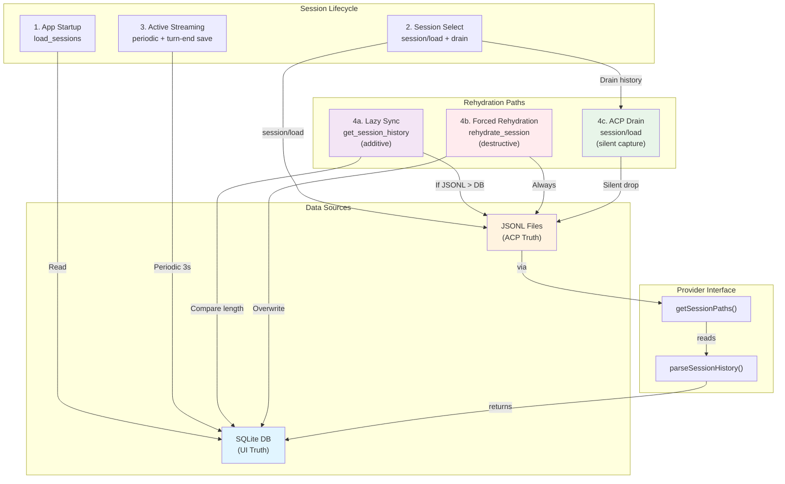

# Feature Doc — JSONL Rehydration & Session Persistence

## Overview

Session persistence in AcpUI is a **dual-source system** where SQLite DB is the UI's source of truth and JSONL files (from ACP providers) are the provider's ground truth. Rehydration is the process of synchronizing these two sources, with three distinct modes: lazy sync (`get_session_history`), forced rehydration (`rehydrate_session`), and live loading (ACP `session/load` with draining).

**Why This Matters:** Users expect sessions to survive app crashes, browser refresh, and provider disconnects. The system must handle stale DB, missing JSONL files, and provider-specific JSONL formats. Understanding rehydration is critical for implementing session recovery, debugging lost messages, and adding new providers.

## What It Does

- **Dual-source persistence** — DB handles UI state; JSONL handles provider history; each serves different purposes
- **Periodic streaming saves** — Auto-saves every 3 seconds during active streaming to prevent message loss
- **Turn-end persistence** — Marks assistant message `isStreaming=false` only after autoSaveTurn completes
- **Lazy sync** — `get_session_history` parses JSONL only if it has MORE messages than DB
- **Forced rehydration** — `rehydrate_session` destructively replaces all DB messages with JSONL (recovery mode)
- **ACP drain mechanism** — `session/load` prevents history replay from flooding UI via silent capture/drop
- **Provider delegated parsing** — Each provider implements `parseSessionHistory()` for its own JSONL format
- **Pinned session auto-load** — On startup, sequentially loads pinned chats into memory for instant access

## Why This Matters

- **Resilience** — Sessions survive app crash, browser tab close, network interruption
- **Provider flexibility** — Each provider (Claude, Gemini, Kiro) stores history differently; parsing is delegated
- **Performance** — Draining prevents UI from re-rendering historical messages on every resume
- **Data integrity** — Dual sources prevent loss if one source becomes corrupted
- **User recovery** — Rehydration allows manual recovery from stale DB or sync issues

---

## How It Works — End-to-End Flows

### Flow A: App Startup (load_sessions)

**Step 1: Frontend Socket Connection**
- File: `frontend/src/hooks/useSocket.ts` (Lines 21–26)
- Socket connects to backend, 'connect' event fires
- Socket waits for 'ready' event before proceeding

**Step 2: Engine Ready & Initial Load**
- File: `frontend/src/store/useSessionLifecycleStore.ts` (Lines 86–118)
- On first socket connection, `handleInitialLoad()` is called
- Checks `isInitiallyLoaded` flag to prevent duplicate calls

**Step 3: Emit load_sessions**
- File: `frontend/src/store/useSessionLifecycleStore.ts` (Line 91)
- Frontend emits: `socket.emit('load_sessions', callback)`
- Backend handler at `sessionHandlers.js:81` receives it

**Step 4: Backend Loads From DB**
- File: `backend/sockets/sessionHandlers.js` (Lines 94–120)
- Handler calls `db.getAllSessions(providerId, { providerAliases })`
- Cleans up duplicate "New Chat" sessions (lines 92–101)
- Returns array of sessions with full metadata (messages_json, modelOptions, configOptions)
```javascript
// Lines 81-107 in sessionHandlers.js
socket.on('load_sessions', async (...args) => {
  const callback = args.pop();
  let providerId = null;
  try {
    const allSessions = await db.getAllSessions(providerId, { providerAliases });
    const emptyNewChats = allSessions.filter(s => s.name === 'New Chat');
    
    if (emptyNewChats.length > 1) {
      for (let i = 1; i < emptyNewChats.length; i++) {
        await db.deleteSession(emptyNewChats[i].id);
      }
    }
    
    const sessions = await db.getAllSessions(providerId, { providerAliases });
    callback({ sessions });
  } catch (err) {
    callback({ error: err.message });
  }
});
```

**Step 5: Frontend Updates Zustand Store**
- File: `frontend/src/store/useSessionLifecycleStore.ts` (Lines 93–104)
- Maps each session through `applyModelState()` to normalize model display
- Sets `isUrlSyncReady = true` to enable URL navigation
- Checks for `?s=sessionId` URL param and auto-selects that session
```typescript
// Lines 93-104 in useSessionLifecycleStore.ts
set({
  sessions: res.sessions.map((s: ChatSession) => applyModelState(
    { ...s, isTyping: false, isWarmingUp: false },
    { currentModelId: s.currentModelId, modelOptions: s.modelOptions }
  )),
  sessionNotes: notesMap
});
```

**Step 6: Auto-Load Pinned Sessions (Background)**
- File: `backend/services/sessionManager.js` (Lines 255–277)
- Separate process: backend calls `autoLoadPinnedSessions(acpClient)` after handshake
- Sequentially loads each pinned session via `loadSessionIntoMemory()` (see Flow B)
- No blocking: happens asynchronously after app is ready

### Flow B: Session Select + Load (session/load + Drain)

**Step 1: User Selects Session from Sidebar**
- File: `frontend/src/store/useSessionLifecycleStore.ts` (Line 111)
- `handleSessionSelect(socket, sessionId)` is called

**Step 2: Emit watch_session**
- File: `frontend/src/store/useSessionLifecycleStore.ts` (Line 115)
- Frontend emits: `socket.emit('watch_session', { sessionId: session.acpSessionId })`
- Joins a broadcast room for that session's ACP ID

**Step 3: Backend Checks Memory vs DB**
- File: `backend/services/providerRuntimeManager.js` (implicit in runtime manager)
- If session already in memory (from auto-load), use hot copy
- If not in memory, trigger load from DB

**Step 4: Load Session Into Memory**
- File: `backend/services/sessionManager.js` (Lines 177–253)
- Called: `loadSessionIntoMemory(acpClient, dbSession)`

**Step 4a: Initialize Session Metadata**
- File: `backend/services/sessionManager.js` (Lines 172–192)
- Creates `acpClient.sessionMetadata` entry with:
  - Model state (model, currentModelId, modelOptions)
  - Metrics (toolCalls, usedTokens, promptCount)
  - Buffers (lastResponseBuffer, lastThoughtBuffer)
  - Config state (configOptions)

**Step 4b: Begin Draining**
- File: `backend/services/sessionManager.js` (Line 195)
- Call: `acpClient.stream.beginDraining(sessionId)`
- This sets a flag: all message chunks from ACP for this session will be **silently dropped**, not emitted to UI

**Step 4c: Send session/load RPC**
- File: `backend/services/sessionManager.js` (Lines 196–202)
- Send to ACP provider: `session/load` with:
  - `sessionId` — ACP session ID
  - `cwd` — working directory
  - `mcpServers` — MCP configuration
  - Provider-specific params from `buildSessionParams()`
```javascript
// Lines 196-202 in sessionManager.js
const result = await acpClient.transport.sendRequest('session/load', {
  sessionId,
  cwd: dbSession.cwd || process.cwd(),
  mcpServers: getMcpServers(providerId),
  ...sessionParams  // Provider-specific (Claude: _meta, Gemini: agent, etc.)
});
```

**Step 4d: ACP Provider Replays History (Drained)**
- The ACP provider (Claude, Gemini, Kiro) streams back the historical messages
- Messages appear as update events: `user_message_chunk`, `agent_message_chunk`, `tool_call`, etc.
- **But** the `acpUpdateHandler` drops all these because draining is active
- File: `backend/services/acpUpdateHandler.js` (Lines 74–82)
```javascript
// Lines 74-82 in acpUpdateHandler.js
const drainState = acpClient.stream.drainingSessions.get(sessionId);
const isMessage = ['agent_message_chunk', 'agent_thought_chunk', 'tool_call', 'tool_call_update'].includes(update.sessionUpdate);

if (drainState && isMessage) {
  return; // Drop message chunks during drain
}
```

**Step 4e: End Draining (Wait for History Replay)**
- File: `backend/services/sessionManager.js` (Line 202)
- Call: `await acpClient.stream.waitForDrainToFinish(sessionId, 1500)`
- Waits up to 1500ms for ACP to finish replaying history
- Once wait completes, draining flag is cleared

**Step 4f: Update Model and Config State from ACP Response**
- File: `backend/services/sessionManager.js` (Lines 204–222)
- Extract model state and provider-normalized config options from the `session/load` RPC response
- Update `acpClient.sessionMetadata` with advertised models and config options
- Save model state to DB

**Step 4g: Re-Apply Saved Model & Config**
- File: `backend/services/sessionManager.js` (Lines 224–227)
- Call: `setSessionModel(acpClient, sessionId, savedModelId, ...)`
- Call: `reapplySavedConfigOptions(acpClient, sessionId, ...)`
- These send RPC calls to ACP to switch back to the saved model and options
```javascript
// Lines 224-227 in sessionManager.js
await setSessionModel(acpClient, sessionId, dbSession.currentModelId || dbSession.model, models, knownModelOptions);
await reapplySavedConfigOptions(acpClient, sessionId, dbSession.configOptions, providerModule);
```

**Step 5: Session is Hot-Loaded**
- Session is now fully in memory and ready for real-time streaming
- UI receives no historical messages (they came from DB on startup)
- UI receives real-time updates from ACP as they happen

### Flow C: Active Streaming (Periodic Save + Turn End)

**Step 1: User Submits Prompt**
- File: `backend/sockets/promptHandlers.js` (Lines 12–128)
- Frontend: `socket.emit('prompt', { providerId, uiId, sessionId, prompt, ... })`

**Step 2: Backend Sends to ACP**
- File: `backend/sockets/promptHandlers.js` (Line 112)
- `acpClient.transport.sendRequest('session/prompt', { sessionId, prompt: [...] })`
- ACP streams back updates

**Step 3: Updates Enter acpUpdateHandler**
- File: `backend/services/acpUpdateHandler.js` (Line 16)
- `handleUpdate(acpClient, sessionId, update)` routes all response chunks
- NOT drained (draining only happens during session/load)

**Step 4: Periodic Save Every 3 Seconds**
- File: `backend/services/acpUpdateHandler.js` (Lines 84–91)
- On every message chunk (agent_message_chunk, agent_thought_chunk, tool_call, tool_call_update):
  - Check time since last save
  - If > 3000ms since last save, trigger `autoSaveTurn(sessionId, acpClient)`
  - Non-blocking: fire-and-forget
```javascript
// Lines 84-91 in acpUpdateHandler.js
if (['agent_message_chunk', 'agent_thought_chunk', 'tool_call', 'tool_call_update'].includes(update.sessionUpdate)) {
  if (!acpClient._lastPeriodicSave) acpClient._lastPeriodicSave = new Map();
  const now = Date.now();
  const last = acpClient._lastPeriodicSave.get(sessionId) || 0;
  if (now - last > 3000) {
    acpClient._lastPeriodicSave.set(sessionId, now);
    autoSaveTurn(sessionId, acpClient);
  }
}
```

**Step 5: autoSaveTurn Executes (Asynchronously)**
- File: `backend/services/sessionManager.js` (Lines 284–330)
- Waits 5 seconds for any final updates to settle
- Skips if permission request is pending
- Marks last assistant message `isStreaming = false` (if it's true)
- Syncs metadata from memory: `configOptions`, `currentModelId`, `modelOptions`
- Saves session to DB via `db.saveSession()`
```javascript
// Lines 278-290 in sessionManager.js
if (session && session.messages && session.messages.length > 0) {
  const lastMsg = session.messages[session.messages.length - 1];
  
  if (meta?.configOptions) session.configOptions = meta.configOptions;
  if (meta?.currentModelId) session.currentModelId = meta.currentModelId;
  if (meta?.modelOptions) session.modelOptions = meta.modelOptions;
  
  if (lastMsg.role === 'assistant' && lastMsg.isStreaming) {
    lastMsg.isStreaming = false;
    await db.saveSession(session);
  }
}
```

**Step 6: Turn End Notification**
- File: `backend/sockets/promptHandlers.js` (Line 127)
- ACP sends final response (no more updates coming)
- Backend emits: `io.to('session:' + sessionId).emit('token_done', { ... })`
- Frontend marks session as no longer typing

**Step 7: Final autoSaveTurn Call**
- File: `backend/sockets/promptHandlers.js` (Line 128)
- Explicit call to `autoSaveTurn(sessionId, acpClient)` at turn end
- Ensures final state (with `isStreaming = false`) is persisted

### Flow D: Lazy Sync (get_session_history)

**Step 1: Frontend Detects Missing or Stale Messages**
- Typically: User opens a session that was last active in a different tab/window
- Frontend emits: `socket.emit('get_session_history', { uiId: session.id })`

**Step 2: Backend Checks JSONL vs DB**
- File: `backend/sockets/sessionHandlers.js` (Lines 122–137)
- Query DB for session
- Get ACP session ID from DB
- Call `parseJsonlSession(acpSessionId, provider)` to get JSONL messages
```javascript
// Lines 109-124 in sessionHandlers.js
socket.on('get_session_history', async ({ uiId }, callback) => {
  try {
    const session = await db.getSession(uiId);
    if (session?.acpSessionId) {
      const jsonlMessages = await parseJsonlSession(session.acpSessionId, session.provider);
      // Only sync if JSONL has MORE messages than DB
      if (jsonlMessages && jsonlMessages.length > (session.messages?.length || 0)) {
        session.messages = jsonlMessages;
        await db.saveSession(session);
      }
    }
    callback({ session });
  } catch (err) {
    callback({ error: err.message });
  }
});
```

**Step 3: Frontend Receives Fresh Messages**
- Callback returns updated session with fresh messages array
- Frontend updates Zustand: `sessions[x].messages = freshMessages`
- UI re-renders with up-to-date messages

**Key Point:** This is **additive-only** — it only updates DB if JSONL has **MORE** messages. This prevents accidental downgrades if DB was updated after JSONL was last written.

### Flow E: Forced Rehydration (rehydrate_session)

**Step 1: User Clicks "Rebuild from JSONL" in Modal**
- File: `frontend/src/components/SessionSettingsModal.tsx` (Line 52)
- Frontend emits: `socket.emit('rehydrate_session', { uiId: session.id })`

**Step 2: Backend Destructively Overwrites**
- File: `backend/sockets/sessionHandlers.js` (Lines 139–156)
- Query DB for session by UI ID
- Validate ACP session ID exists
- Parse JSONL: `const jsonlMessages = await parseJsonlSession(...)`
- **Destructively overwrite**: `session.messages = jsonlMessages;`
- Save to DB
- Return callback with success and message count
```javascript
// Lines 139-156 in sessionHandlers.js
socket.on('rehydrate_session', async ({ uiId }, callback) => {
  try {
    const session = await db.getSession(uiId);
    if (!session?.acpSessionId) {
      return callback?.({ error: 'No ACP session ID — nothing to rehydrate from' });
    }
    const jsonlMessages = await parseJsonlSession(session.acpSessionId, session.provider);
    if (!jsonlMessages) {
      return callback?.({ error: 'JSONL file not found or could not be parsed' });
    }
    session.messages = jsonlMessages;  // DESTRUCTIVE
    await db.saveSession(session);
    callback?.({ success: true, messageCount: jsonlMessages.length });
  } catch (err) {
    callback?.({ error: err.message });
  }
});
```

**Step 3: Frontend Refreshes Messages**
- On success callback, frontend emits `get_session_history` to reload UI
- Maps fresh messages into Zustand store
- UI displays rebuilt conversation

**Key Point:** This is **destructive** — any messages in DB are lost. Used for recovery from corruption or sync issues.

---

## Architecture Diagram



**Flow:** Startup loads from DB. Session select triggers ACP load with drain. Active streaming saves periodically. Three rehydration paths maintain sync: lazy (additive), forced (destructive), drain (silent).

---

## The Critical Contract: Dual Sources of Truth

### Contract 1: DB vs JSONL Ownership
- **Rule:** DB is authoritative for **UI state**; JSONL is authoritative for **provider history**
- **What it means:** 
  - UI always displays DB messages (fast, always available)
  - JSONL is the provider's permanent record (recovered from if DB corrupts)
- **Why it matters:** Decoupling prevents UI from blocking on slow JSONL parsing
- **Breaking point:** Code that trusts JSONL over DB for current state will see lag; code that doesn't fallback to JSONL will lose messages on DB corruption

### Contract 2: get_session_history is Additive-Only
- **Rule:** `get_session_history` only updates DB if `JSONL.length > DB.length`
- **What it means:** Never downgrades DB with stale JSONL; never overwrites newer DB messages
- **Why it matters:** Prevents race conditions when JSONL is written slowly
- **Breaking point:** Code that always trusts JSONL (even if shorter) will lose recent messages

### Contract 3: rehydrate_session is Destructive
- **Rule:** `rehydrate_session` **always** replaces all DB messages with JSONL, regardless of length
- **What it means:** Used only for explicit recovery/sync; destructive by design
- **Why it matters:** Gives users a "last resort" to recover from corruption
- **Breaking point:** Users must explicitly confirm destructive rehydration; surprise overwrites break trust

### Contract 4: Draining Prevents History Flood
- **Rule:** `beginDraining()` / `waitForDrainToFinish()` silently drops message chunks during ACP `session/load`
- **What it means:** ACP sends history back on load, but we discard it (UI got it from DB)
- **Why it matters:** Prevents re-rendering old messages; maintains performance on resume
- **Breaking point:** Code that doesn't drain will see duplicate historical messages in UI

### Contract 5: Provider Must Implement Paths & Parsing
- **Rule:** Provider MUST export:
  - `getSessionPaths(acpSessionId)` → `{ jsonl: string, json?: string, tasksDir?: string }`
  - Optionally: `parseSessionHistory(filePath, Diff)` → `Message[]`
- **What it means:** Backend orchestrates; provider handles provider-specific logic
- **Why it matters:** AcpUI remains provider-agnostic; each provider owns its JSONL format
- **Breaking point:** Missing `getSessionPaths` → file not found; missing `parseSessionHistory` → rehydration error

---

## Configuration / Provider Support

### What a Provider Must Implement

**Required: `getSessionPaths(acpSessionId: string)`**

Returns an object with file paths for a session. AcpUI calls this to locate JSONL.

```typescript
interface SessionPaths {
  jsonl: string;        // Path to JSONL file (e.g., ~/.claude/sessions/uuid.jsonl)
  json?: string;        // Optional: path to session metadata JSON
  tasksDir?: string;    // Optional: directory for task files
}
```

File: Each provider implements this in `providers/{provider}/index.js` (lines vary per provider)

**Optional: `parseSessionHistory(filePath: string, Diff: DiffModule)`**

Parses provider-specific JSONL format and returns normalized messages.

```typescript
// Input: full path to JSONL file
// Returns: array of normalized message objects
// Message shape:
[
  {
    role: 'user' | 'assistant',
    content: string | ContentBlock[],
    id?: string,
    timeline?: TimelineStep[],
    isStreaming?: boolean
  },
  ...
]
```

- If provider doesn't implement this, rehydration fails with error: "Provider missing parseSessionHistory implementation"
- Diff library is provided for message diffing (used by some providers to reconstruct changes)

**Example Provider Implementations:**
- **Claude** (`providers/claude/index.js:705`): Parses JSONL with `type: 'user'` / `type: 'assistant'` entries
- **Gemini** (`providers/gemini/index.js:756`): Parses with `type: 'user'` / `type: 'gemini'`; supports `$rewindTo` for conversation branching
- **Kiro** (`providers/kiro/index.js:455`): Parses with `kind: 'Prompt'` / `kind: 'AssistantMessage'` entries

### Environment Variables

None specific to rehydration. Session paths are provider-configured.

### Socket Events Used

| Event | Handler | Direction | Purpose |
|-------|---------|-----------|---------|
| `load_sessions` | sessionHandlers.js:81 | Frontend → Backend | Load all sessions from DB |
| `get_session_history` | sessionHandlers.js:109 | Frontend → Backend | Lazy-sync JSONL if newer |
| `rehydrate_session` | sessionHandlers.js:126 | Frontend → Backend | Destructive JSONL overwrite |
| `watch_session` | socketIndexJs | Frontend → Backend | Join broadcast room for session |
| Internal: `session/load` | — | Backend → ACP | Load session in ACP (triggers history replay) |

---

## Data Flow / Persistence Pipeline

### Initialization (Boot Sequence)

```
Frontend boots
  ↓ Socket connects
  ↓ 'ready' event received
  ↓ handleInitialLoad()
  ↓ emit('load_sessions')
  ↓
Backend: getAllSessions()
  ↓ Query DB
  ↓ Deserialize messages_json, modelOptions, configOptions
  ↓ Return to frontend
  ↓
Frontend: Update Zustand store
  ↓ Sessions ready for display
  ↓ Auto-select from URL param if present
  ↓ User can click to select session
```

### Session Select (Load into Memory)

```
User clicks session
  ↓ handleSessionSelect(sessionId)
  ↓ emit('watch_session', {acpSessionId})
  ↓ Backend: loadSessionIntoMemory()
  ↓ Initialize acpClient.sessionMetadata
  ↓ beginDraining(sessionId)
  ↓ session/load RPC to ACP provider
  ↓ ACP replays history (SILENTLY DROPPED by draining)
  ↓ waitForDrainToFinish()
  ↓ Extract model state and provider-normalized config options from ACP response
  ↓ Reapply saved model & config
  ↓ Session hot-loaded, ready for new prompts
```

### Active Streaming (Save Cycle)

```
User submits prompt
  ↓ Frontend: socket.emit('prompt', {...})
  ↓ Backend: sendRequest('session/prompt', {...})
  ↓ ACP streams updates back
  ↓ acpUpdateHandler routes chunks to UI
  ↓
Every 3 seconds during streaming:
  ↓ autoSaveTurn(sessionId, acpClient) [async]
    ├─ Wait 5s for settle
    ├─ Sync metadata: configOptions, currentModelId, modelOptions
    ├─ Mark isStreaming = false if still true
    └─ Save session to DB
  ↓
ACP sends turn_end notification
  ↓ Frontend: emit('token_done')
  ↓ Backend: emit('token_done')
  ↓ Final autoSaveTurn() call
  ↓ Session persisted with isStreaming = false
```

### Database Schema (Relevant Columns)

```sql
CREATE TABLE sessions (
  ui_id TEXT PRIMARY KEY,
  acp_id TEXT,                        -- Link to ACP session (used for JSONL lookup)
  name TEXT,
  messages_json TEXT,                 -- Serialized message array (UI source of truth)
  config_options_json TEXT,           -- Serialized config options array
  current_model_id TEXT,              -- Which model was selected
  model_options_json TEXT,            -- Available model options
  provider TEXT,                      -- Which provider owns this session
  ...
)
```

Messages are stored as **JSON.stringify(messages)** — no individual message table. This keeps the schema simple and makes rehydration straightforward: parse JSONL → update messages_json → done.

---

## Component Reference

### Backend Files

| File | Lines | Function | Purpose |
|------|-------|----------|---------|
| `backend/services/jsonlParser.js` | 10–28 | `parseJsonlSession()` | Orchestrate provider parsing |
| `backend/sockets/sessionHandlers.js` | 94–120 | `load_sessions` | Load all sessions from DB |
| `backend/sockets/sessionHandlers.js` | 122–137 | `get_session_history` | Lazy-sync JSONL if newer |
| `backend/sockets/sessionHandlers.js` | 139–156 | `rehydrate_session` | Destructive JSONL overwrite |
| `backend/services/sessionManager.js` | 177–253 | `loadSessionIntoMemory()` | Hot-load session: drain + RPC + response-state capture + reapply |
| `backend/services/sessionManager.js` | 255–277 | `autoLoadPinnedSessions()` | Background auto-load of pinned chats |
| `backend/services/sessionManager.js` | 284–330 | `autoSaveTurn()` | Periodic + turn-end persistence |
| `backend/services/sessionManager.js` | 75–99 | `reapplySavedConfigOptions()` | Re-apply config after load |
| `backend/services/sessionManager.js` | 128–175 | `setSessionModel()` | Switch model via RPC + update metadata |
| `backend/services/acpUpdateHandler.js` | 84–91 | Periodic save trigger | Check time, call autoSaveTurn |
| `backend/services/acpUpdateHandler.js` | 74–82 | Drain logic | Drop messages if draining active |
| `backend/sockets/promptHandlers.js` | 112–148 | Prompt + turn-end | Send RPC, handle response, save |
| `backend/database.js` | 29–58 | Schema + migrations | SQLite table definition |
| `backend/database.js` | 155–188 | `saveSession()` | Serialize and persist session |
| `backend/database.js` | 224–258 | `getSession()` / `getAllSessions()` | Query and deserialize |

### Frontend Files

| File | Lines | Function | Purpose |
|------|-------|----------|---------|
| `frontend/src/store/useSessionLifecycleStore.ts` | 86–118 | `handleInitialLoad()` | Boot: emit load_sessions, populate store |
| `frontend/src/hooks/useSocket.ts` | 78–85 | `session_model_options` listener | Receive model updates from backend |
| `frontend/src/store/useSessionLifecycleStore.ts` | 119+ | `handleSessionSelect()` | Emit watch_session |
| `frontend/src/components/SessionSettingsModal.tsx` | 49–71 | `handleRehydrate()` | Emit rehydrate_session |

### Database

| Table | Columns (relevant) | Usage |
|-------|-------------------|-------|
| `sessions` | `ui_id`, `acp_id`, `messages_json`, `config_options_json`, `current_model_id`, `model_options_json`, `provider` | Session persistence |

---

## Gotchas & Important Notes

### 1. **Draining is Transparent to the ACP Provider**
- **Problem:** ACP provider doesn't know its history is being silently dropped
- **Why:** Draining is a backend-only mechanism; provider just replays history as normal
- **Avoidance:** Understand that `session/load` + drain is the standard flow; don't expect history in UI after load
- **Detection:** If old messages appear in UI after selecting a session, draining was skipped or failed

### 2. **JSONL May Be Stale (Different from DB)**
- **Problem:** `get_session_history` checks length before syncing; if JSONL is shorter, DB is trusted
- **Why:** JSONL is written asynchronously; DB may have newer messages
- **Avoidance:** Don't assume JSONL is always more recent; trust the length check
- **Detection:** If messages "disappear" after rehydrate, JSONL was older; use rehydrate only when confident

### 3. **autoSaveTurn Waits 5 Seconds Before Saving**
- **Problem:** If user closes tab/browser during streaming, final messages may be lost (only periodic save applied)
- **Why:** 5s delay allows final tool results and tokens to settle before marking turn complete
- **Avoidance:** Periodic saves (every 3s) provide coverage; final save happens later
- **Detection:** If messages are missing, check logs for "skipping auto-save" (permission request pending)

### 4. **Provider parseSessionHistory Must Handle Diff Library**
- **Problem:** If provider doesn't use the Diff utility correctly, message reconstruction fails
- **Why:** Some providers use diffs to reconstruct messages from delta updates
- **Avoidance:** When implementing a provider, test parseSessionHistory with sample JSONL files
- **Detection:** Rehydrate fails with "Provider failed to parse"; check provider's parseSessionHistory

### 5. **isStreaming Flag Must Be Marked false Before Turn is Final**
- **Problem:** If `isStreaming` remains true, autoSaveTurn won't finalize the message
- **Why:** `autoSaveTurn` only marks complete if `lastMsg.isStreaming === true` (line 293)
- **Avoidance:** Ensure autoSaveTurn is called at prompt completion (promptHandlers.js line 128)
- **Detection:** After refresh, message still shows "Thinking..." or streaming indicator

### 6. **Pinned Sessions Load Sequentially, Not in Parallel**
- **Problem:** Auto-loading 10 pinned sessions takes time; slow startup
- **Why:** Sequential loading prevents overwhelming the ACP provider with parallel session/load requests
- **Avoidance:** Keep pinned session count reasonable (<10)
- **Detection:** App takes 20+ seconds to boot with many pinned sessions

### 7. **JSONL File Path is Provider-Specific**
- **Problem:** If `getSessionPaths()` returns wrong path, `get_session_history` and `rehydrate_session` fail silently
- **Why:** `fs.existsSync()` returns false; parseJsonlSession returns null
- **Avoidance:** Test provider's `getSessionPaths()` before relying on rehydration
- **Detection:** Rehydrate fails with "JSONL file not found"; check logs for path

### 8. **get_session_history is Additive-Only by Design**
- **Problem:** Users expect `get_session_history` to always fetch latest JSONL, but it skips if JSONL is shorter
- **Why:** Protects against race conditions when JSONL is being written
- **Avoidance:** For forced sync, use `rehydrate_session` instead of `get_session_history`
- **Detection:** If `get_session_history` doesn't update UI, check if DB.length >= JSONL.length

### 9. **Config/Model State Not Restored from JSONL**
- **Problem:** Rehydration restores messages but not model selection or config options
- **Why:** JSONL doesn't store these; they're in DB
- **Avoidance:** After rehydration, manually switch model if needed (modal UI handles this)
- **Detection:** After rehydrate, model still shows as previously selected

### 10. **Provider Extension Events Not Blocked by Draining**
- **Problem:** During `session/load` drain, provider extension events (status, metadata) still come through
- **Why:** Draining only blocks message chunks, not other update types
- **Avoidance:** Be aware that context usage, status updates, etc. are not drained; only message chunks
- **Detection:** Context percentage updates during session load (expected behavior)

---

## Unit Tests

### Backend Tests

**File:** `backend/test/sessionHandlers.test.js`

| Test | Lines | Coverage |
|------|-------|----------|
| `load_sessions` success | – | DB query, session deserialization, callback |
| `load_sessions` cleanup duplicates | – | Remove extra "New Chat" sessions |
| `get_session_history` additive-only | 480–489 | Only sync if JSONL > DB length |
| `get_session_history` no ACP ID | – | Skip if session not linked to ACP |
| `rehydrate_session` success | 171–179 | Parse JSONL, overwrite DB, callback with count |
| `rehydrate_session` no ACP ID | 462–468 | Error if session not linked |
| `rehydrate_session` JSONL not found | 470–478 | Error if file missing or parse fails |

**File:** `backend/test/sessionManager.test.js`

| Test | Lines | Coverage |
|------|-------|----------|
| `loadSessionIntoMemory()` metadata init | – | Metadata created with model/config state |
| `loadSessionIntoMemory()` drain setup | – | beginDraining() called before session/load |
| `autoSaveTurn()` with isStreaming | 94+ | Mark false, save to DB |
| `autoSaveTurn()` skips if permission pending | – | Guard checks pendingPermissions |
| `autoSaveTurn()` syncs metadata | – | Pulls configOptions/model from memory to DB |
| `reapplySavedConfigOptions()` | – | Re-apply saved options via provider |

### Running Tests

```bash
cd backend
npx vitest run backend/test/sessionHandlers.test.js
npx vitest run backend/test/sessionManager.test.js
npx vitest run --coverage   # Full coverage report
```

---

## How to Use This Guide

### For Implementing Session Persistence for a New Provider

1. **Read the Three Rehydration Paths** (Flows A, B, D, E)
2. **Implement `getSessionPaths(acpSessionId)`** — Return object with `{ jsonl: '/path/to/file' }`
3. **Implement `parseSessionHistory(filePath, Diff)`** — Parse your JSONL format, return normalized messages
4. **Test rehydration** with sample JSONL files
5. **Verify draining works** — Session/load should not replay history to UI
6. **Test auto-load** of pinned sessions to ensure memory efficiency

### For Debugging Session State Issues

**Problem: Messages disappear after app refresh**
1. Check if DB messages_json has content: `SELECT ui_id, LENGTH(messages_json) FROM sessions;`
2. Check if JSONL file exists: `ls ~/.provider/sessions/{acpSessionId}.jsonl`
3. Check autoSaveTurn logs: `grep "auto-save\|auto-complete" LOG_FILE`
4. Verify `isStreaming` was set to false: read DB messages_json and check last message

**Problem: Rehydrate fails with "JSONL file not found"**
1. Verify provider's `getSessionPaths()` returns correct path
2. Check if JSONL file actually exists on disk
3. Check file permissions (readable)
4. Test provider's `parseSessionHistory()` directly with the JSONL file

**Problem: Old messages appear in UI after selecting session**
1. Draining failed — check `beginDraining()` and `waitForDrainToFinish()` in logs
2. Check if `acpClient.stream.drainingSessions` was set correctly
3. Verify update handler is checking draining flag (line 77 in acpUpdateHandler.js)

**Problem: Session loads with stale model**
1. Check DB `current_model_id` and `model_options_json` columns
2. Verify `reapplySavedConfigOptions()` was called and succeeded
3. Check provider's `setConfigOption()` / model switching RPC response
4. Manually switch model in UI (Session Settings Modal)

---

## Summary

**Session Persistence in AcpUI is a dual-source system:**

1. **SQLite DB** — UI's source of truth, updated every 3s during streaming + on turn end
2. **JSONL Files** — Provider's ground truth, parsed on-demand for recovery/sync

**Three Rehydration Paths Serve Different Needs:**

1. **Lazy Sync** (`get_session_history`) — Additive-only; syncs if JSONL has more messages
2. **Forced Rehydration** (`rehydrate_session`) — Destructive; recovery mode for corruption
3. **ACP Drain** (`session/load`) — Silent; prevents history replay from flooding UI

**Key Architectural Insights:**

- Draining is the innovation that prevents re-rendering history on every session switch
- Periodic saves (3s) provide crash recovery during active conversations
- Provider delegation ensures AcpUI stays agnostic to JSONL formats
- Additive-only sync prevents data loss from race conditions

**Critical Contracts:**

- DB is UI's truth; JSONL is provider's truth
- Draining is transparent to provider (it doesn't know history is dropped)
- Provider MUST implement `getSessionPaths` and optionally `parseSessionHistory`
- `get_session_history` is safe (never downgrades); `rehydrate_session` is destructive

**Why Agents Should Care:**

Session persistence touches **5 systems** (DB layer, streaming, socket handlers, provider interface, frontend store) across **20+ files**. Understanding rehydration prevents silent data loss, enables confident provider implementation, and allows debugging complex multi-source sync issues. Load this doc when implementing session recovery, extending persistence to new data types (canvas artifacts, attachments), or adding a new ACP provider.

Load this doc when:
- Implementing rehydration for a new provider
- Debugging missing or stale messages
- Adding new data to persist (canvas artifacts, notes, attachments)
- Optimizing session load performance
- Implementing provider-specific persistence logic
- Investigating state inconsistencies between DB and JSONL
