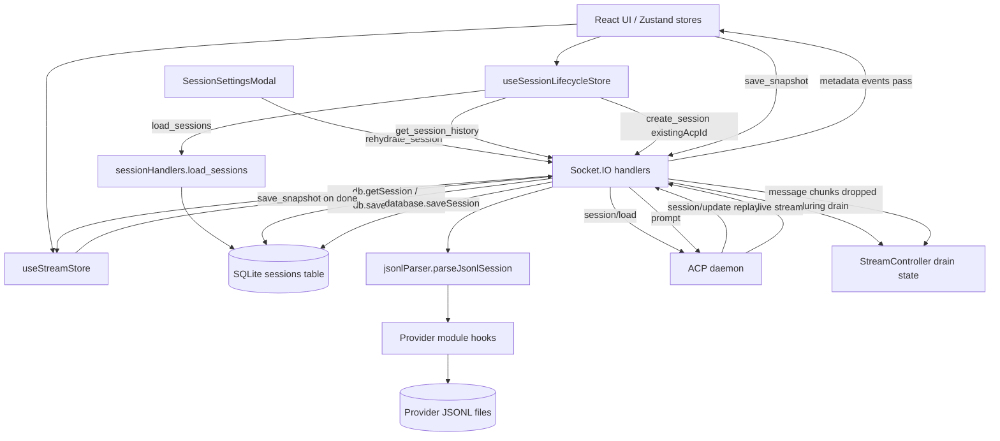

# Feature Doc - JSONL Rehydration & Session Persistence

Session persistence keeps the chat UI recoverable across refreshes, backend restarts, and provider reconnects. AcpUI stores the UI-facing session record in SQLite and delegates provider-owned JSONL replay to the active provider module.

Agents commonly confuse three different paths in this feature: DB history loading, explicit JSONL rehydration, and ACP `session/load` replay draining. They are connected, but each has a distinct owner and contract.

## Overview

### What It Does

- Loads session metadata from SQLite with `load_sessions`, annotating active runtime prompts before the frontend lazy-loads full message history with `get_session_history`.
- Stores UI snapshots through the frontend `save_snapshot` socket event and `database.saveSession`.
- Reduces live backend stream progress into SQLite through `sessionStreamPersistence` so closed browsers still recover token, thought, tool, permission, and terminal tool-output timeline progress.
- Uses JSONL only as provider-owned replay/recovery data through `jsonlParser.parseJsonlSession` and provider `parseSessionHistory` hooks.
- Resumes ACP daemon state with `create_session` and `existingAcpId`, using `session/load` plus stream draining.
- Finalizes streaming turns with `promptHandlers.finalizeStreamPersistence` and `useStreamStore.onStreamDone` so persisted assistant messages are not left streaming.
- Supports explicit rebuilds from JSONL with `rehydrate_session`, replacing the DB message array for that session.
- Preserves model, config, and context usage state through `saveModelState`, `saveConfigOptions`, `stats_push`, and provider `emitCachedContext` hooks.

### Why This Matters

- The UI must open quickly without parsing provider files on every sidebar render.
- The provider daemon may replay historical output during `session/load`; draining prevents duplicate timeline content.
- JSONL formats are provider-specific, so generic backend code must not parse provider records directly.
- DB writes and provider replay can race; the socket handlers use explicit rules to avoid silent message loss.
- Recovery tools need a clear distinction between safe lazy sync and explicit DB replacement.

Architectural role: backend Socket.IO handlers, SQLite persistence, provider persistence hooks, frontend Zustand stores, and ACP JSON-RPC lifecycle all participate in this feature.

## How It Works - End-to-End Flow

1. **The app opens a socket and asks for session metadata**

   File: `frontend/src/hooks/useChatManager.ts` (Hook: `useChatManager`)
   File: `frontend/src/store/useSessionLifecycleStore.ts` (Store action: `handleInitialLoad`)
   File: `backend/sockets/sessionHandlers.js` (Socket event: `load_sessions`)
   File: `backend/database.js` (Function: `getAllSessions`)

   `useChatManager` calls `handleInitialLoad` once a socket exists. `handleInitialLoad` emits `load_sessions`, and the backend returns session rows from `getAllSessions` after `annotateLiveSessionState` copies hot runtime prompt and pending-permission state onto each matching row. `getAllSessions` intentionally returns metadata with `messages: []`; full message arrays are loaded only when a session is hydrated.

   ```ts
   // FILE: frontend/src/store/useSessionLifecycleStore.ts (Store action: handleInitialLoad)
   socket.emit('load_sessions', (res: LoadSessionsResponse) => {
     set({
       sessions: res.sessions.map((s: ChatSession) => applyModelState(
         { ...s, isTyping: Boolean(s.isTyping), isWarmingUp: false },
         { currentModelId: s.currentModelId, modelOptions: s.modelOptions }
       ))
     });
   });
   ```

   ```js
   // FILE: backend/database.js (Function: getAllSessions)
   messages: [] // Lazy loaded
   ```

2. **Session selection decides whether hydration is needed**

   File: `frontend/src/store/useSessionLifecycleStore.ts` (Store actions: `handleSessionSelect`, `hydrateSession`)
   File: `frontend/src/App.tsx` (Socket event: `watch_session`)

   `handleSessionSelect` marks the active UI session, hydrates cached context usage from persisted stats, and calls `hydrateSession` when the session has no messages or lacks cached context usage. `App.tsx` handles active-session room membership with `watch_session` and `unwatch_session`.

   `hydrateSession` first emits `get_session_history`. After history is loaded into the store, it emits `create_session` with `existingAcpId` so the backend can attach or resume the ACP daemon session.

3. **Lazy history sync reads DB first and uses JSONL as a guarded supplement**

   File: `backend/sockets/sessionHandlers.js` (Socket event: `get_session_history`)
   File: `backend/services/jsonlParser.js` (Function: `parseJsonlSession`)
   File: `backend/database.js` (Functions: `getSession`, `saveSession`)

   The handler loads the full DB session by UI ID. If the session has an ACP ID, it first flushes any active backend stream persistence for that ACP session, re-reads SQLite, then asks the provider parser for JSONL messages. The handler writes JSONL messages back when JSONL has more messages or when the DB latest assistant is a low-quality same-length placeholder and JSONL has richer assistant content, while preserving richer DB terminal tool output when provider JSONL lacks it. UI message IDs are preserved when same-position roles match.

   ```js
   // FILE: backend/sockets/sessionHandlers.js (Socket event: get_session_history)
   let session = await db.getSession(uiId);
   if (session?.acpSessionId) {
     await flushActiveStream(session.provider, session.acpSessionId);
     session = await db.getSession(uiId) || session;
     const jsonlMessages = await parseJsonlSession(session.acpSessionId, session.provider);
     if (shouldUseJsonlMessages(session.messages, jsonlMessages)) {
       session.messages = mergeJsonlMessagesPreservingIds(session.messages, jsonlMessages);
       await db.saveSession(session);
     }
   }
   callback({ session });
   ```

4. **The JSONL parser delegates all format work to the provider**

   File: `backend/services/jsonlParser.js` (Function: `parseJsonlSession`)
   File: `providers/<provider>/index.js` (Functions: `getSessionPaths`, `parseSessionHistory`)

   The parser resolves the provider module, asks it for the session file path, checks that the JSONL file exists, and calls the provider parser with the `diff` module. Missing files and parser exceptions return `null` to the socket handler.

   ```js
   // FILE: backend/services/jsonlParser.js (Function: parseJsonlSession)
   const providerModule = await getProviderModule(providerId);
   const paths = providerModule.getSessionPaths(acpSessionId);
   const filePath = paths.jsonl;
   if (!fs.existsSync(filePath)) return null;
   return await providerModule.parseSessionHistory(filePath, Diff);
   ```

5. **The frontend normalizes loaded history before rendering**

   File: `frontend/src/store/useSessionLifecycleStore.ts` (Store action: `hydrateSession`)

   `hydrateSession` maps loaded DB messages into render-ready state. It preserves the latest backend-marked streaming assistant, removes stale synthetic thinking placeholders, keeps useful active thoughts, restores unresolved permission state, and collapses loaded non-active tool steps so restored sessions open in a compact state.

   ```ts
   // FILE: frontend/src/store/useSessionLifecycleStore.ts (Store action: hydrateSession)
   const cleanedMessages = fullHistory.messages.map((m: Message, index: number) => {
     const isActiveAssistant = index === activeAssistantIndex;
     return {
       ...m,
       isStreaming: isActiveAssistant,
       timeline: m.timeline
         ?.filter(step => step.type !== 'thought' || (isActiveAssistant && step.content !== '_Thinking..._'))
         .map(step => step.type === 'tool'
           ? { ...step, isCollapsed: isActiveAssistant ? step.isCollapsed : true }
           : step)
     };
   });
   const hasAwaitingPermission = cleanedMessages.some((message: Message) =>
     message.timeline?.some(step => step.type === 'permission' && !step.response)
   );
   ```

6. **Cold ACP resume uses `create_session` with drain and replay suppression**

   File: `backend/sockets/sessionHandlers.js` (Socket event: `create_session`, Helper: `captureModelState`)
   File: `backend/services/streamController.js` (Class: `StreamController`, Methods: `beginDraining`, `waitForDrainToFinish`, `onChunk`)
   File: `backend/services/acpUpdateHandler.js` (Function: `handleUpdate`)

   When `create_session` receives `existingAcpId`, it looks up the DB row with `getSessionByAcpId`. If `sessionMetadata` already contains that ACP ID, the handler skips `session/load`, returns the hot metadata state, and calls provider `emitCachedContext`.

   If the ACP session is cold in this backend process, the handler initializes `sessionMetadata`, starts draining, sends ACP `session/load`, waits for the drain silence window, captures model/config state from the load response, emits cached context, reapplies the selected model and saved config options, and returns the resumed session state.

   ```js
   // FILE: backend/sockets/sessionHandlers.js (Socket event: create_session)
   acpClient.stream.beginDraining(existingAcpId);
   result = await acpClient.transport.sendRequest('session/load', {
     sessionId: existingAcpId,
     cwd: sessionCwd,
     mcpServers: loadMcpServers,
     ...sessionParams
   });
   await acpClient.stream.waitForDrainToFinish(existingAcpId, 1500);
   await captureModelState(acpClient, result.sessionId, result, models, fallbackModel, providerModule);
   emitCachedContext(providerModule, result.sessionId);
   ```

7. **Draining drops replayed message chunks but lets metadata through**

   File: `backend/services/acpUpdateHandler.js` (Function: `handleUpdate`)
   File: `backend/services/streamController.js` (Method: `onChunk`)
   Test: `backend/test/drain.test.js` (Test name: `should allow metadata to pass through during drain while swallowing messages`)

   `handleUpdate` calls `stream.onChunk` before provider normalization. During a drain, only message-like updates are dropped: `agent_message_chunk`, `agent_thought_chunk`, `tool_call`, and `tool_call_update`. Usage updates, config option updates, command updates, and provider extension metadata still flow.

   ```js
   // FILE: backend/services/acpUpdateHandler.js (Function: handleUpdate)
   const drainState = acpClient.stream.drainingSessions.get(sessionId);
   const isMessage = ['agent_message_chunk', 'agent_thought_chunk', 'tool_call', 'tool_call_update'].includes(update.sessionUpdate);
   if (drainState && isMessage) return;
   ```

8. **Pinned sessions hot-load in the background**

   File: `backend/services/sessionManager.js` (Functions: `autoLoadPinnedSessions`, `loadSessionIntoMemory`)
   File: `backend/database.js` (Function: `getPinnedSessions`)

   After provider startup, `autoLoadPinnedSessions` asks SQLite for pinned sessions for the active provider and loads them sequentially through `loadSessionIntoMemory`. That helper performs the same drain, ACP `session/load`, model/config capture, cached-context emission, and saved config reapply pattern used by cold resume.

9. **Prompt submission writes a DB snapshot before ACP streaming starts**

   File: `frontend/src/store/useChatStore.ts` (Store action: `handleSubmit`)
   File: `backend/sockets/sessionHandlers.js` (Socket event: `save_snapshot`)
   File: `backend/sockets/promptHandlers.js` (Socket event: `prompt`)
   File: `backend/database.js` (Function: `saveSession`)

   `handleSubmit` appends a user message and an assistant placeholder locally, emits `save_snapshot`, then emits `prompt`. The backend `save_snapshot` handler persists the frontend session object through `db.saveSession` after resolving the provider ID. The `prompt` handler sends ACP `session/prompt` and streams updates back through `handleUpdate`.

   ```ts
   // FILE: frontend/src/store/useChatStore.ts (Store action: handleSubmit)
   lifecycle.setSessions(sessions.map(s => s.id === activeSessionId ? {
     ...s,
     isTyping: true,
     messages: [...s.messages,
       { id: userMsgId, role: 'user', content: promptText, attachments: [...attachments] },
       { id: assistantMsgId, role: 'assistant', content: '', isStreaming: true, timeline: [{ type: 'thought', content: '_Thinking..._' }], turnStartTime: Date.now() }
     ]
   } : s));
   if (updatedSession) socket.emit('save_snapshot', updatedSession);
   socket.emit('prompt', { providerId: activeSession.provider, uiId: activeSession.id, sessionId: acpId, prompt: promptText, attachments });
   ```

10. **Live stream persistence and completion finalize messages and stats**

    File: `backend/services/acpUpdateHandler.js` (Function: `handleUpdate`)
    File: `backend/sockets/promptHandlers.js` (Socket event: `prompt`)
    File: `backend/services/sessionStreamPersistence.js` (Functions: `persistStreamEvent`, `flushStreamPersistence`, `finalizeStreamPersistence`)
    File: `frontend/src/hooks/useChatManager.ts` (Socket event: `token_done`)
    File: `frontend/src/store/useStreamStore.ts` (Store action: `onStreamDone`)

    During streaming, `handleUpdate` calls `persistStreamEvent` for message chunks, thought chunks, tool updates, and permission requests after drain and stats-capture filtering. The reducer updates the persisted active assistant message while keeping `isStreaming: true` during progress saves.

    `promptHandlers` calls `finalizeStreamPersistence` after successful prompts and failure paths that emit an error to the UI. Finalization removes synthetic thinking placeholders, marks the active assistant non-streaming, records `turnEndTime`, and marks unresolved in-progress tools as failed. The frontend still receives `token_done`, drains its local queue in `onStreamDone`, emits the final `save_snapshot`, and refreshes stats; stale snapshots are merged so they cannot overwrite richer backend-persisted progress for the same assistant message.

11. **Forced JSONL rehydration replaces DB messages explicitly**

    File: `frontend/src/components/SessionSettingsModal.tsx` (Component: `SessionSettingsModal`, Handler: `handleRehydrate`)
    File: `backend/sockets/sessionHandlers.js` (Socket event: `rehydrate_session`)
    File: `backend/services/jsonlParser.js` (Function: `parseJsonlSession`)
    File: `backend/database.js` (Function: `saveSession`)

    The rehydrate tab emits `rehydrate_session` with the UI session ID. The backend requires an ACP session ID, parses JSONL, replaces `session.messages`, and saves the DB row. On success, the modal emits `get_session_history` and updates that session's messages in Zustand.

    ```js
    // FILE: backend/sockets/sessionHandlers.js (Socket event: rehydrate_session)
    const session = await db.getSession(uiId);
    if (!session?.acpSessionId) return callback?.({ error: 'No ACP session ID - nothing to rehydrate from' });
    const jsonlMessages = await parseJsonlSession(session.acpSessionId, session.provider);
    if (!jsonlMessages) return callback?.({ error: 'JSONL file not found or could not be parsed' });
    session.messages = jsonlMessages;
    await db.saveSession(session);
    callback?.({ success: true, messageCount: jsonlMessages.length });
    ```

12. **Provider lifecycle hooks keep persistence provider-agnostic**

    File: `backend/test/providerContract.test.js` (Test name: `every provider explicitly exports every contract function`)
    File: `providers/<provider>/index.js` (Functions: `getSessionPaths`, `parseSessionHistory`, `cloneSession`, `archiveSessionFiles`, `restoreSessionFiles`, `deleteSessionFiles`, `buildSessionParams`, `emitCachedContext`, `onPromptStarted`, `onPromptCompleted`)

    The backend relies on every provider exporting the same persistence hooks. The generic backend owns orchestration, DB writes, socket events, and drain behavior; providers own file paths, JSONL schema parsing, clone/archive/restore/delete operations, session params, cached context emission, and prompt lifecycle side effects.

## Architecture Diagram



## The Critical Contract: DB-First UI With Provider-Owned Replay

### Contract 1: SQLite is the UI session source

The UI renders the `sessions.messages_json` array after `db.getSession` or `get_session_history`. `getAllSessions` returns session metadata for sidebar load and leaves `messages` empty by design. Code that expects `load_sessions` to include full message arrays will render empty or incomplete histories.

### Contract 2: JSONL is provider-owned recovery data

Generic backend code calls `parseJsonlSession`; it does not inspect provider record schemas. Providers must implement `getSessionPaths(acpSessionId)` and `parseSessionHistory(filePath, Diff)` so JSONL parsing returns AcpUI `Message[]` objects.

### Contract 3: `get_session_history` is guarded by message count and latest-assistant quality

The lazy sync path writes JSONL messages back to SQLite when `jsonlMessages.length > session.messages.length`, or when both arrays have the same length and the DB latest assistant is a low-quality placeholder while JSONL has richer assistant content. It preserves existing UI message IDs for same-position roles and does not replace richer DB timelines with poorer provider output.

### Contract 4: `rehydrate_session` replaces messages

The forced rehydrate path assigns `session.messages = jsonlMessages` and saves the session. It is an explicit repair action for a single session, not a merge operation.

### Contract 5: `save_snapshot` and backend stream persistence merge by active assistant identity

The frontend appends user and assistant messages locally and emits `save_snapshot` before prompt start and after stream completion. The backend also persists normalized live stream events into the active assistant message. `save_snapshot` merges against the existing DB row and preserves richer persisted content only when the latest assistant message ID matches, so a new blank prompt placeholder cannot inherit an older assistant answer.

### Contract 6: Drain suppresses replayed message updates only

ACP `session/load` can emit historical updates. `StreamController` and `handleUpdate` swallow message chunks during drain, while metadata/config/usage events continue through to the UI and DB.

### Contract 7: Model, config, and context state are separate from messages

`saveModelState`, provider-scoped `saveConfigOptions` calls, `stats_push`, and provider `emitCachedContext` update metadata paths that are independent from JSONL message rehydration. Rehydrating messages does not replace saved model or config option state.

## Configuration / Provider Support

### Provider Contract

Every provider module must export the persistence and lifecycle functions verified by `backend/test/providerContract.test.js`.

Required persistence hooks for this feature:

- `getSessionPaths(acpSessionId)` returns paths for provider-owned session files.
- `parseSessionHistory(filePath, Diff)` returns normalized AcpUI messages or `null` when no usable history exists.
- `cloneSession(oldAcpId, newAcpId, pruneAtTurn)` supports forked history creation.
- `archiveSessionFiles(acpId, archiveDir)`, `restoreSessionFiles(savedAcpId, archiveDir)`, and `deleteSessionFiles(acpId)` keep DB lifecycle actions aligned with provider files.
- `buildSessionParams(agent)` returns provider-specific fields to spread into `session/new` and `session/load`, or `undefined` when no fields are needed.
- `emitCachedContext(sessionId)` emits provider-cached context usage after hot resume or pinned auto-load.
- `onPromptStarted(sessionId)` and `onPromptCompleted(sessionId)` bracket real prompt activity in `promptHandlers`.

`getSessionPaths` shape:

```ts
interface ProviderSessionPaths {
  jsonl: string;
  json?: string;
  tasksDir?: string;
}
```

`parseSessionHistory` return shape:

```ts
type ParsedMessage = {
  id?: string;
  role: 'user' | 'assistant';
  content: string | Array<unknown>;
  timeline?: Array<unknown>;
  isStreaming?: boolean;
};
```

### Runtime Configuration

- `UI_DATABASE_PATH` selects the SQLite DB file in `backend/database.js`; the default is `persistence.db` at the repository root.
- `ACP_PROVIDERS_CONFIG` selects the provider registry file in `backend/services/providerRegistry.js`; the default registry path is `configuration/providers.json`, with `configuration/providers.json.example` as the repository example.
- `backend/services/providerLoader.js` merges `providers/<provider>/provider.json`, optional `providers/<provider>/branding.json`, and optional `providers/<provider>/user.json` into the runtime provider config.
- Provider `mcpName` controls whether `getMcpServers` injects the AcpUI MCP stdio proxy during `session/new` and `session/load`.
- Provider `models` config seeds fallback model options through `modelOptionsFromProviderConfig` and `getKnownModelOptions`.
- Provider `paths.sessions` comes from the merged provider config and is consumed inside `providers/<provider>/index.js`; generic backend code should use provider hooks instead of duplicating those paths.

## Data Flow / Persistence Pipeline

### Startup Metadata Pipeline

```text
useChatManager
  -> useSessionLifecycleStore.handleInitialLoad
  -> socket event load_sessions
  -> sessionHandlers.load_sessions
  -> database.getAllSessions
  -> frontend sessions with messages: []
  -> maybeHydrateContextUsage for persisted stats
```

### Session Hydration Pipeline

```text
User selects a UI session
  -> handleSessionSelect
  -> hydrateSession
  -> socket event get_session_history
  -> database.getSession
  -> jsonlParser.parseJsonlSession when acpSessionId exists
  -> database.saveSession only when guarded JSONL repair is selected
  -> clean loaded messages for render
  -> socket event create_session with existingAcpId
  -> hot metadata return or cold session/load with drain
  -> socket event watch_session
  -> backend emits stream_resume_snapshot for any flushed streaming assistant
  -> useChatManager merges the snapshot and seeds activeMsgIdByAcp
```

### Active Prompt Persistence Pipeline

```text
useChatStore.handleSubmit
  -> append user message and assistant placeholder locally
  -> save_snapshot
  -> sessionHandlers.mergeSnapshotWithPersisted
  -> prompt
  -> ACP session/prompt
  -> handleUpdate persists normalized stream events with sessionStreamPersistence
  -> handleUpdate emits token/thought/system_event/permission_request
  -> useStreamStore queues and renders stream content
  -> token_done
  -> useStreamStore.onStreamDone marks message complete
  -> save_snapshot
  -> database.saveSession through safe merge
```

### Backend Progress And Finalization Pipeline

```text
handleUpdate message/tool/permission event
  -> skip drained session/load replay and statsCaptures output
  -> persistStreamEvent loads DB session by provider + ACP session id
  -> update active assistant content/timeline and runtime metadata
  -> flush progress to SQLite, keeping isStreaming true

MCP handler completion/failure
  -> mcpExecutionRegistry emits and persists terminal tool_end output
  -> sessionStreamPersistence preserves terminal shell output as reload fallback

promptHandlers success/error or sub-agent prompt completion
  -> finalizeStreamPersistence
  -> remove synthetic thinking placeholder
  -> mark active assistant non-streaming with turnEndTime
  -> mark unresolved in-progress tool steps failed/aborted
  -> force-save SQLite
```

### Forced Rehydrate Pipeline

```text
SessionSettingsModal.handleRehydrate
  -> rehydrate_session
  -> database.getSession
  -> jsonlParser.parseJsonlSession
  -> replace session.messages
  -> database.saveSession
  -> get_session_history
  -> update Zustand messages for the selected UI session
```

### Relevant SQLite Columns

Table: `sessions`

| Column | Purpose |
|---|---|
| `ui_id` | Primary key for frontend session identity. |
| `acp_id` | Provider ACP session ID used for JSONL lookup and daemon resume. |
| `provider` | Provider scope for ACP ID lookup and model/config persistence. |
| `messages_json` | Serialized AcpUI message array rendered by the chat UI. |
| `config_options_json` | Serialized provider config option state. |
| `current_model_id` | Selected provider model ID. |
| `model_options_json` | Advertised and normalized model options. |
| `used_tokens`, `total_tokens` | Persisted context usage fallback for session restore. |
| `is_pinned` | Background hot-load eligibility for provider startup. |
| `cwd`, `folder_id`, `notes`, `forked_from`, `fork_point`, `is_sub_agent`, `parent_acp_session_id` | Session organization and related lifecycle metadata. |

## Component Reference

### Backend

| Area | File | Stable Anchors | Purpose |
|---|---|---|---|
| Socket gateway | `backend/sockets/index.js` | `watch_session`, `emitStreamResumeSnapshot`, socket event `stream_resume_snapshot` | Joins session rooms and sends the latest persisted streaming assistant snapshot before live chunks resume. |
| Socket handlers | `backend/sockets/sessionHandlers.js` | `registerSessionHandlers`, `load_sessions`, `annotateLiveSessionState`, `get_session_history`, `flushActiveStream`, `rehydrate_session`, `save_snapshot`, `create_session`, `captureModelState`, `loadingSessions` | Main socket API for DB load, active runtime annotation, JSONL sync, forced rehydrate, snapshot writes, and ACP resume. |
| Prompt handlers | `backend/sockets/promptHandlers.js` | `registerPromptHandlers`, `prompt`, `cancel_prompt`, `respond_permission`, provider hooks `onPromptStarted`, `onPromptCompleted` | Sends prompts to ACP, emits `token_done`, and triggers backend turn finalization. |
| JSONL parser | `backend/services/jsonlParser.js` | `parseJsonlSession` | Delegates session file lookup and parsing to provider modules. |
| Session manager | `backend/services/sessionManager.js` | `getMcpServers`, `loadSessionIntoMemory`, `autoLoadPinnedSessions`, `reapplySavedConfigOptions`, `setSessionModel`, `updateSessionModelMetadata` | Pinned hot-load, MCP injection, drain lifecycle, metadata reapply, and model state helpers. |
| Stream persistence | `backend/services/sessionStreamPersistence.js` | `persistStreamEvent`, `flushStreamPersistence`, `getStreamResumeSnapshot`, `finalizeStreamPersistence`, `mergeSnapshotWithPersisted`, `shouldUseJsonlMessages` | Durable active-turn reducer for backend stream progress, reconnect snapshots, safe snapshot merge, finalization, and guarded JSONL repair. |
| Stream controller | `backend/services/streamController.js` | `StreamController`, `beginDraining`, `onChunk`, `waitForDrainToFinish`, `reset` | Tracks drain state and resolves after replay silence. |
| Update router | `backend/services/acpUpdateHandler.js` | `handleUpdate`, `config_option_update`, `usage_update`, message drain check, `persistStreamEvent` calls | Normalizes provider updates, routes live stream events, persists stream/config/stat metadata, and suppresses drained replay chunks. |
| Database | `backend/database.js` | `initDb`, `saveSession`, `getAllSessions`, `getPinnedSessions`, `getSession`, `getSessionByAcpId`, `saveConfigOptions`, `saveModelState` | SQLite schema, serialization, provider-scoped lookup, and metadata persistence. |

### Frontend

| Area | File | Stable Anchors | Purpose |
|---|---|---|---|
| Socket dispatcher | `frontend/src/hooks/useChatManager.ts` | `useChatManager`, `applyStreamResumeSnapshot`, socket events `stream_resume_snapshot`, `token`, `thought`, `system_event`, `token_done`, `stats_push` | Wires backend stream events and reconnect snapshots to stores and calls initial session load. |
| Session lifecycle store | `frontend/src/store/useSessionLifecycleStore.ts` | `handleInitialLoad`, `handleSessionSelect`, `hydrateSession`, `fetchStats`, `maybeHydrateContextUsage`, `handleSaveSession` | Loads metadata, preserves active runtime typing markers, hydrates history, resumes ACP sessions, and restores persisted stats. |
| Chat orchestrator | `frontend/src/store/useChatStore.ts` | `handleSubmit`, `handleCancel`, `handleRespondPermission` | Creates local messages, emits `save_snapshot`, and starts prompts. |
| Stream store | `frontend/src/store/useStreamStore.ts` | `ensureAssistantMessage`, `onStreamToken`, `onStreamThought`, `onStreamEvent`, `onStreamDone`, `processBuffer` | Converts socket stream events into AcpUI messages and final snapshot writes. |
| Settings modal | `frontend/src/components/SessionSettingsModal.tsx` | `SessionSettingsModal`, `handleRehydrate`, tab `rehydrate` | User-triggered JSONL rebuild and UI message refresh. |
| Socket singleton | `frontend/src/hooks/useSocket.ts` | `getOrCreateSocket`, `provider_extension`, `session_model_options` | Keeps socket identity stable and routes provider metadata. |

### Provider

| Area | File | Stable Anchors | Purpose |
|---|---|---|---|
| Provider module | `providers/<provider>/index.js` | `getSessionPaths`, `parseSessionHistory`, `cloneSession`, `archiveSessionFiles`, `restoreSessionFiles`, `deleteSessionFiles`, `buildSessionParams`, `emitCachedContext`, `onPromptStarted`, `onPromptCompleted` | Owns file paths, JSONL schema replay, provider session file lifecycle, session params, cached context, and prompt lifecycle side effects. |
| Provider contract test | `backend/test/providerContract.test.js` | `requiredExports`, test `every provider explicitly exports every contract function` | Ensures all provider modules expose the persistence contract. |

### Configuration

| Area | File | Stable Anchors | Purpose |
|---|---|---|---|
| Environment | `backend/database.js` | Env var `UI_DATABASE_PATH`, default `persistence.db` | Selects SQLite database path. |
| Provider registry and config | `configuration/providers.json`, `configuration/providers.json.example`, `backend/services/providerRegistry.js`, `backend/services/providerLoader.js`, `providers/<provider>/provider.json`, optional `providers/<provider>/user.json` | Env var `ACP_PROVIDERS_CONFIG`, config keys `paths.sessions`, `mcpName`, `models` | Selects providers, merges provider config, supplies session file roots, MCP proxy activation, and model option fallbacks. |

## Gotchas & Important Notes

1. **`load_sessions` is metadata-only**

   The sidebar load path calls `getAllSessions`, which returns `messages: []`. Full histories come from `get_session_history` through `hydrateSession`. Debug empty message arrays by checking `hydrateSession`, not only `load_sessions`.

2. **Lazy sync is not a force rebuild**

   `get_session_history` writes JSONL back to DB only for larger JSONL histories or same-length low-quality latest assistant repair. Use `rehydrate_session` for explicit replacement.

3. **`save_snapshot` must merge with backend stream progress**

   Tokens and timeline steps are assembled in the frontend stream store and reduced in backend stream persistence. `save_snapshot` preserves richer DB content only for the same latest assistant message ID; new blank placeholders must remain blank until their own stream data arrives. Terminal MCP output is also persisted as tool output so completed shell cards can reload after the browser closes.

4. **Drain only suppresses message-like updates**

   Config and usage updates pass through during ACP `session/load`. Context usage can change while replayed message chunks are being dropped.

5. **Hot sessions skip ACP `session/load`**

   `create_session` checks `acpClient.sessionMetadata.has(existingAcpId)`. Hot sessions return metadata and emit cached context without a load RPC.

6. **Cold resume is duplicate-protected with deterministic callbacks**

   `loadingSessions` in `sessionHandlers.js` prevents duplicate `create_session` work for the same `existingAcpId`, and duplicate callers are queued to receive the same final callback payload when the in-flight resume completes.

7. **Config reapply is advertised-option gated**

   `reapplySavedConfigOptions` only sends saved values back to the provider when the provider advertises that option and the saved value is valid for the option.

8. **Provider parser failures intentionally become `null`**

   `parseJsonlSession` logs parser exceptions and returns `null`. Socket handlers translate this into either no lazy sync or a forced rehydrate error callback.

9. **Empty assistant placeholders stay streaming until a terminal prompt path finalizes them**

   Progress saves keep `isStreaming: true`; `finalizeStreamPersistence` owns terminal state on prompt success, prompt error, cancellation, and sub-agent prompt completion. Synthetic `_Thinking..._` placeholders are removed when real stream content arrives or finalization runs.

10. **Context usage has two restore paths**

    `maybeHydrateContextUsage` restores persisted DB stats into the frontend cache, and provider `emitCachedContext` can emit provider-cached usage after ACP resume. Positive cached percentages are protected from being overwritten by a zero fallback.

## Unit Tests

### Backend Tests

| Test File | Stable Test Names / Anchors | Coverage |
|---|---|---|
| `backend/test/jsonlParser.test.js` | `parses simple prompt/response pair`, `delegates parsing to providerModule`, `returns null on malformed JSON`, `returns null and logs when provider lacks parseSessionHistory` | Provider delegation, missing parser/file failure behavior. |
| `backend/test/sessionHandlers.test.js` | `handles load_sessions with cleanup`, `handles get_session_history`, `handles rehydrate_session`, `handles rehydrate_session when no acpSessionId`, `handles rehydrate_session when JSONL not found`, `handles get_session_history with JSONL having more messages than DB`, `repairs same-length low-quality assistant history from JSONL`, `protects richer DB stream progress from a stale save_snapshot`, `handles create_session with existingAcpId (resume)`, `handles create_session skipping load for hot sessions`, `handles create_session performing load for cold sessions with dbSession` | Socket persistence API, lazy sync, forced rehydrate, stale snapshot protection, cold/hot ACP resume. |
| `backend/test/sessionManager.test.js` | `should return empty if no mcpName`, `should return server config if mcpName exists`, `should attach _meta when getMcpServerMeta returns a value`, `should load pinned sessions sequentially`, `should perform full hot-load lifecycle`, `does not force-complete a streaming assistant during progress saves` | MCP injection, pinned hot-load, drain setup, metadata capture, and progress-save behavior. |
| `backend/test/acpUpdateHandler.test.js` | `persists message chunks as stream progress`, `handles config_option_update and emits provider_extension`, `handles usage_update and emits stats_push`, `buffers text in statsCaptures if present` | Backend stream progress persistence and metadata event persistence. |
| `backend/test/sessionStreamPersistence.test.js` | `persists token progress into the active assistant message`, `merges tool updates by id and preserves sticky fields`, `finalizes the active assistant only on terminal prompt lifecycle`, `protects richer persisted assistant content from stale snapshots`, `does not copy a previous assistant answer into a new blank prompt placeholder`, `allows same-length JSONL repair for a low-quality latest assistant while preserving ids` | Durable stream reducer, sticky tool merge, safe snapshot merge, finalization, and guarded JSONL repair. |
| `backend/test/drain.test.js` | `should drop chunks and reset timer while draining`, `should allow metadata to pass through during drain while swallowing messages`, `should process chunks normally when not draining` | Drain behavior during `session/load`. |
| `backend/test/streamController.test.js` | `should stay in draining state as long as chunks arrive`, `should support multiple concurrent draining sessions with independent timers`, `should resolve pending waitForDrain promises on reset` | Drain timer and reset semantics. |
| `backend/test/persistence.test.js` | `saves and retrieves sessions`, `retrieves pinned sessions`, `saves config options without provider`, `saveModelState handles null provider path`, `retrieves session by acpId`, `handles saveModelState with modelOptions and 3-arg signature`, `handles saveConfigOptions with 4-arg signature` | SQLite session serialization and metadata helpers. |
| `backend/test/providerContract.test.js` | `every provider explicitly exports every contract function` | Provider persistence hook availability. |
| `backend/test/promptHandlers.test.js` | `should handle incoming prompt and send to ACP`, `should handle prompt errors and emit error token`, `calls onPromptStarted before sendRequest and onPromptCompleted after success`, `calls onPromptCompleted even when sendRequest rejects (error path)` | Prompt lifecycle and backend finalization triggers. |

### Frontend Tests

| Test File | Stable Test Names / Anchors | Coverage |
|---|---|---|
| `frontend/src/test/useSessionLifecycleStore.test.ts` | `handleInitialLoad loads sessions and syncs URL`, `hydrateSession cleans timeline and resumes on backend`, `hydrateSession preserves a persisted active assistant marker`, `hydrateSession restores awaiting permission state from unresolved permission steps`, `hydrateSession hydrates context usage from existing session stats before history load`, `fetchStats does not overwrite existing positive context usage with zero percent` | Metadata load, history hydration, active stream preservation, permission restore, ACP resume request, context fallback. |
| `frontend/src/test/useSessionLifecycleStoreDeep.test.ts` | `handleSessionSelect rehydrates loaded sessions when cached context is missing`, `handleSessionSelect hydrates if session is empty`, `handleInitialLoad handles empty session list` | Selection-time hydration rules. |
| `frontend/src/test/useChatStore.test.ts` | `creates messages and emits prompt`, `updates permission step and emits to socket` | Prompt snapshot setup and permission snapshot writes. |
| `frontend/src/test/useStreamStore.test.ts` | `ensureAssistantMessage reuses a hydrated streaming assistant`, `onStreamToken appends to a hydrated streaming assistant without duplicating`, `onStreamDone finalizes a hydrated streaming assistant without an active map`, `onStreamDone marks message as finished and saves snapshot`, `processBuffer drains queue into session messages with adaptive speed` | Hydrated stream reattachment, stream completion persistence, and queue rendering. |
| `frontend/src/test/SessionSettingsModal.test.tsx` | `rehydrate button calls socket emit` | Forced rehydrate UI entry point. |
| `frontend/src/test/SessionSettingsModalExtended.test.tsx` | `handles rehydrate request` | Modal success state and message refresh behavior. |

### Provider Tests

Provider-specific suites live under `providers/<provider>/test/index.test.js`. Relevant stable anchors include tests for `getSessionPaths`, `parseSessionHistory`, session file operations (`cloneSession`, `archiveSessionFiles`, `restoreSessionFiles`, `deleteSessionFiles`), `buildSessionParams`, `emitCachedContext`, and prompt lifecycle hooks. Use the provider-specific feature doc with these tests when changing a provider parser or session file layout.

### Focused Test Commands

```bash
cd backend
npx vitest run test/sessionStreamPersistence.test.js test/jsonlParser.test.js test/sessionHandlers.test.js test/sessionManager.test.js test/acpUpdateHandler.test.js test/drain.test.js test/streamController.test.js test/persistence.test.js test/providerContract.test.js test/promptHandlers.test.js
```

```bash
cd frontend
npx vitest run src/test/useSessionLifecycleStore.test.ts src/test/useSessionLifecycleStoreDeep.test.ts src/test/useChatStore.test.ts src/test/useStreamStore.test.ts src/test/streamConcurrency.test.ts src/test/SessionSettingsModal.test.tsx src/test/SessionSettingsModalExtended.test.tsx
```

## How to Use This Guide

### For Implementing or Extending This Feature

1. Start with `backend/sockets/sessionHandlers.js` and identify which socket event owns the change: `load_sessions`, `get_session_history`, `rehydrate_session`, `save_snapshot`, or `create_session`.
2. If message content changes, follow the frontend writer path through `useChatStore.handleSubmit`, `useStreamStore.onStreamDone`, and `save_snapshot`.
3. If ACP resume changes, follow `create_session`, `captureModelState`, `StreamController`, and `acpUpdateHandler.handleUpdate` drain behavior.
4. If provider JSONL behavior changes, update `providers/<provider>/index.js` hooks and the matching provider test suite; keep generic parsing inside `parseJsonlSession` delegated.
5. If model/config/context state changes, update `saveModelState`, `saveConfigOptions`, `emitCachedContext`, `maybeHydrateContextUsage`, and the related tests.
6. Run the focused backend and frontend test commands listed above.

### For Debugging Issues With This Feature

1. **Sidebar shows sessions but chat is empty:** inspect `useSessionLifecycleStore.hydrateSession`, `get_session_history`, and `database.getSession`.
2. **History appears duplicated after selecting a session:** inspect `create_session` cold resume, `StreamController.beginDraining`, and `acpUpdateHandler.handleUpdate` drain checks.
3. **Rehydrate reports JSONL missing:** inspect provider `getSessionPaths`, `jsonlParser.parseJsonlSession`, and provider `parseSessionHistory`.
4. **Message stays streaming after refresh:** inspect `useSessionLifecycleStore.hydrateSession`, `useStreamStore.onStreamDone`, `save_snapshot`, and `promptHandlers` calls to `finalizeStreamPersistence`.
5. **Model or provider options reset on resume:** inspect `captureModelState`, `setSessionModel`, `reapplySavedConfigOptions`, `saveModelState`, and `saveConfigOptions`.
6. **Context usage is missing after restart:** inspect DB `used_tokens` / `total_tokens`, `maybeHydrateContextUsage`, `emitCachedContext`, `usage_update`, and `stats_push`.

## Summary

- Session persistence is DB-first for UI rendering and provider-owned for JSONL recovery.
- `load_sessions` loads metadata and active runtime state; `get_session_history` flushes active stream progress before loading full messages.
- `get_session_history` syncs JSONL when JSONL has more messages or repairs a same-length low-quality latest assistant without overwriting richer DB state.
- `rehydrate_session` explicitly replaces the DB message array from provider JSONL.
- `create_session` with `existingAcpId` resumes ACP state and uses drain to suppress replayed message chunks.
- `watch_session` emits `stream_resume_snapshot` for the latest persisted streaming assistant so reconnecting UIs seed the active stream before new chunks arrive.
- `save_snapshot` merges frontend-rendered state with backend-persisted stream progress by latest assistant message ID.
- `sessionStreamPersistence` owns backend progress saves, terminal tool-output persistence, reconnect snapshots, and terminal assistant finalization from prompt lifecycle paths.
- Provider modules own JSONL paths, parsing, file lifecycle, session params, cached context, and prompt lifecycle hooks.
