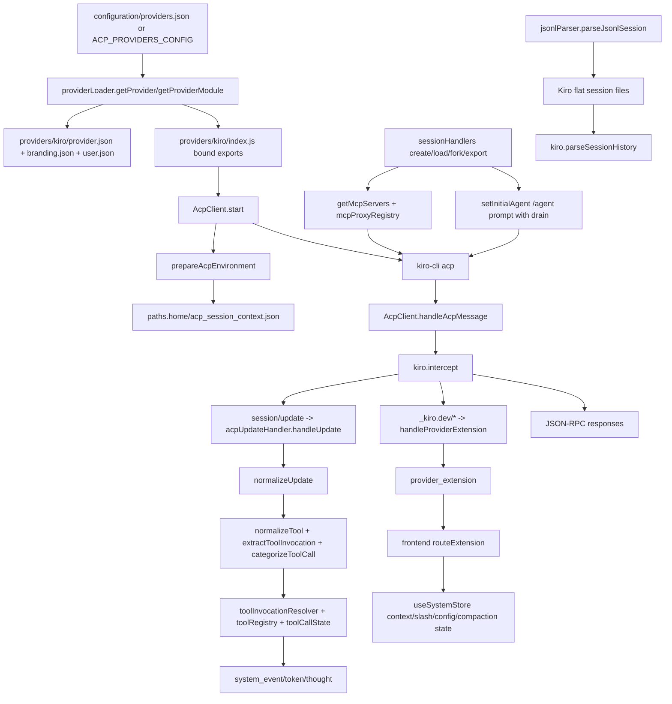

# Feature Doc - Kiro Provider

The Kiro provider adapts `kiro-cli acp` to AcpUI's provider contract. It owns Kiro-specific update normalization, `_kiro.dev/` extension handling, canonical MCP tool identity, context usage persistence, slash-command agent switching, hooks, and Kiro session file operations.

This is a provider-specific sidecar to `documents/[Feature Doc] - Provider System.md`. Use both docs together when changing Kiro provider behavior.

## Overview

### What It Does

- Exports every provider contract function required by `backend/test/providerContract.test.js`.
- Starts `kiro-cli acp` using `providers/kiro/user.json` command, args, paths, and model settings.
- Normalizes Kiro update objects by converting PascalCase `type` values to `sessionUpdate` and string `content` values to `{ text }`.
- Persists `_kiro.dev/metadata` context usage values in `<paths.home>/acp_session_context.json` and re-emits cached values when sessions load.
- Converts Kiro MCP tool names such as `@AcpUI/ux_invoke_shell` into AcpUI's canonical tool invocation contract.
- Uses `/agent <agentName>` through `session/prompt` for initial agent selection and drains the confirmation output.
- Manages Kiro's flat session file layout for JSONL rehydration, forking, archiving, restoring, and deletion.
- Reads per-agent hook configuration through `getHooksForAgent` and skips hook types listed in `provider.json.cliManagedHooks`.

### Why This Matters

- Kiro sends provider-specific wire shapes, so generic ACP handling depends on Kiro's normalization hooks.
- Kiro MCP tool identity uses `@{mcpName}/{toolName}`, which must be parsed by provider code before `toolInvocationResolver` can route AcpUI tools.
- Kiro context usage arrives as provider extension metadata, not as generic ACP token stats.
- Kiro agent switching is prompt based; routing it through unsupported mode/config methods destabilizes the daemon.
- Kiro session files are provider-owned, so lifecycle features must use `providers/kiro/index.js` file operations instead of generic path guesses.

Architectural role: backend provider adapter with frontend effects through normalized Socket.IO events (`system_event`, `token`, `thought`, `provider_extension`, `session_model_options`).

## How It Works - End-to-End Flow

1. **Provider registration selects Kiro**

   Files: `configuration/providers.json` (Provider entries), `backend/services/providerRegistry.js` (Function: `buildRegistry`), `backend/services/providerLoader.js` (Functions: `getProvider`, `getProviderModule`, `bindProviderModule`)

   The runtime uses `configuration/providers.json` unless `ACP_PROVIDERS_CONFIG` points at another provider registry. Kiro is available to the backend when an enabled registry entry points to `./providers/kiro`. `getProvider` merges `providers/kiro/provider.json`, `providers/kiro/branding.json`, and `providers/kiro/user.json`; `getProviderModule` imports `providers/kiro/index.js` and `bindProviderModule` wraps its exports in `runWithProvider`.

   ```javascript
   // FILE: backend/services/providerLoader.js (Functions: getProvider, bindProviderModule)
   const config = {
     providerId: resolvedId,
     providerPath: entry.path,
     basePath,
     ...providerData,
     ...userData,
     title,
     branding: brandingFields,
   };
   ```

2. **Runtime starts the Kiro daemon**

   Files: `backend/services/providerRuntimeManager.js` (Function: `init`), `backend/services/acpClient.js` (Functions: `start`, `buildAcpSpawnCommand`), `providers/kiro/user.json` (Keys: `command`, `args`)

   `providerRuntimeManager.init` creates an `AcpClient` for each enabled provider. For Kiro, `AcpClient.start` reads `command: "kiro-cli"` and `args: ["acp"]`, resolves the Windows-safe spawn command with `buildAcpSpawnCommand`, and spawns the ACP process with JSON-safe environment defaults.

   ```javascript
   // FILE: backend/services/acpClient.js (Function: start)
   const { config } = getProvider(providerId);
   const shell = config.command;
   const baseArgs = config.args || ['acp'];
   const spawnTarget = buildAcpSpawnCommand(shell, baseArgs);
   ```

3. **Kiro prepares context persistence**

   File: `providers/kiro/index.js` (Functions: `prepareAcpEnvironment`, `expandPath`, `_loadContextState`, `_saveContextState`, `emitCachedContext`)

   Before spawn, `AcpClient.start` calls `prepareAcpEnvironment`. Kiro stores the backend-provided `emitProviderExtension` callback, resolves `paths.home` with `expandPath`, sets `_contextStateFile` to `<home>/acp_session_context.json`, and loads cached `{ sessionId: contextUsagePercentage }` values into `_sessionContextCache`.

   ```javascript
   // FILE: providers/kiro/index.js (Function: prepareAcpEnvironment)
   const homePath = expandPath(config.paths?.home || path.join(os.homedir(), '.kiro'));
   _contextStateFile = path.join(homePath, 'acp_session_context.json');
   _loadContextState();
   ```

4. **Handshake initializes the ACP session layer**

   Files: `backend/services/acpClient.js` (Function: `performHandshake`), `providers/kiro/index.js` (Function: `performHandshake`), `providers/kiro/provider.json` (Key: `clientInfo`), `providers/kiro/ACP_PROTOCOL_SAMPLES.md` (Section: `initialize`)

   `AcpClient.performHandshake` delegates the initialization RPC to Kiro's `performHandshake`. Kiro sends `initialize` with protocol version `1`, filesystem and terminal capabilities, and `clientInfo` from `provider.json`.

   ```javascript
   // FILE: providers/kiro/index.js (Function: performHandshake)
   await acpClient.transport.sendRequest('initialize', {
     protocolVersion: 1,
     clientCapabilities: { fs: { readTextFile: true, writeTextFile: true }, terminal: true },
     clientInfo: config.clientInfo || { name: 'ACP-UI', version: '1.0.0' }
   });
   ```

5. **Session creation and load inject AcpUI MCP tools**

   Files: `backend/sockets/sessionHandlers.js` (Socket event: `create_session`, Helper: `captureModelState`), `backend/services/sessionManager.js` (Functions: `getMcpServers`, `loadSessionIntoMemory`), `backend/mcp/mcpProxyRegistry.js` (Functions: `createMcpProxyBinding`, `bindMcpProxy`), `providers/kiro/index.js` (Functions: `buildSessionParams`, `getMcpServerMeta`)

   `create_session` and `loadSessionIntoMemory` call `buildSessionParams`; Kiro returns `undefined`, so no Kiro-specific extra request keys are spread into `session/new` or `session/load`. `getMcpServers` injects a stdio proxy named by `provider.json.mcpName` (`AcpUI`) and includes `ACP_SESSION_PROVIDER_ID` plus `ACP_UI_MCP_PROXY_ID` so MCP tool calls can be routed back to the correct provider/session.

   ```javascript
   // FILE: providers/kiro/index.js (Functions: buildSessionParams, getMcpServerMeta)
   export function buildSessionParams(_agent) {
     return undefined;
   }

   export function getMcpServerMeta() {
     return undefined;
   }
   ```

6. **Model state is captured and model changes use `session/set_model`**

   Files: `backend/sockets/sessionHandlers.js` (Helper: `captureModelState`, Socket event: `set_session_model`), `backend/services/sessionManager.js` (Functions: `setSessionModel`, `updateSessionModelMetadata`), `providers/kiro/index.js` (Functions: `normalizeModelState`, `setConfigOption`), `providers/kiro/ACP_PROTOCOL_SAMPLES.md` (Sections: `session/new`, `session/load`, `session/set_model`)

   Kiro returns dynamic model catalogs in `result.models.currentModelId` and `result.models.availableModels`. Backend model helpers extract that shape, Kiro's `normalizeModelState` passes it through, and metadata/DB state are updated. Explicit model changes call `session/set_model`. `setConfigOption` handles only `optionId === 'model'` and returns `null` for unsupported config options.

7. **Initial agent selection is drain-aware**

   Files: `backend/sockets/sessionHandlers.js` (Socket event: `create_session`), `backend/mcp/subAgentInvocationManager.js` (Methods: `runInvocation`, `startInvocation`), `providers/kiro/index.js` (Function: `setInitialAgent`), `providers/kiro/provider.json` (Keys: `supportsAgentSwitching`, `defaultSystemAgentName`), `providers/kiro/user.json` (Key: `defaultSubAgentName`)

   When a requested agent differs from Kiro's baseline agent, the backend calls `setInitialAgent`. Kiro begins stream draining, sends `/agent <agentName>` as `session/prompt`, waits for drain completion, and resumes normal streaming so the agent-switch confirmation stays out of the chat timeline. Sub-agent creation uses `defaultSubAgentName` when the MCP request omits `agent` and calls `setInitialAgent` when the selected agent differs from `defaultSystemAgentName`.

   ```javascript
   // FILE: providers/kiro/index.js (Function: setInitialAgent)
   acpClient.stream.beginDraining(sessionId);
   await sendWithTimeout('session/prompt', {
     sessionId,
     prompt: [{ type: 'text', text: `/agent ${agent}` }]
   });
   await acpClient.stream.waitForDrainToFinish(sessionId, 1000);
   ```

8. **Raw JSON-RPC messages pass through Kiro interception**

   Files: `backend/services/acpClient.js` (Function: `handleAcpMessage`, Function: `handleProviderExtension`), `providers/kiro/index.js` (Functions: `intercept`, `parseExtension`, `emitCachedContext`), `frontend/src/utils/extensionRouter.ts` (Function: `routeExtension`), `frontend/src/hooks/useSocket.ts` (Socket event: `provider_extension`)

   `handleAcpMessage` calls Kiro `intercept` before routing. `intercept` persists `_kiro.dev/metadata` context usage values and maps `_kiro.dev/agent/switched` `params.model` to `params.currentModelId` so `handleProviderExtension` can update model state. Live frontend routing uses `provider_extension` plus `routeExtension`; Kiro's `parseExtension` remains a provider contract helper and provider-local test anchor.

   ```javascript
   // FILE: providers/kiro/index.js (Function: intercept)
   if (payload.method === `${config.protocolPrefix}agent/switched` &&
       typeof payload.params?.model === 'string' &&
       !payload.params.currentModelId) {
     return { ...payload, params: { ...payload.params, currentModelId: payload.params.model } };
   }
   ```

9. **Kiro updates enter the Unified Timeline pipeline**

   Files: `backend/services/acpUpdateHandler.js` (Function: `handleUpdate`), `providers/kiro/index.js` (Functions: `normalizeUpdate`, `extractFilePath`, `extractDiffFromToolCall`, `extractToolOutput`, `normalizeTool`, `extractToolInvocation`, `categorizeToolCall`), `backend/services/tools/toolInvocationResolver.js` (Functions: `resolveToolInvocation`, `applyInvocationToEvent`), `backend/services/tools/index.js` (Exports: `toolRegistry`, `toolCallState`)

   `handleUpdate` calls Kiro `normalizeUpdate` before generic routing. Tool calls then flow through Kiro's path/diff/output extraction, display normalization, category mapping, canonical invocation extraction, central resolver merge, tool registry dispatch, and Socket.IO emission. This is the Tool Invocation V2 path for Kiro MCP tools.

   ```javascript
   // FILE: providers/kiro/index.js (Function: extractToolInvocation)
   return {
     toolCallId: update.toolCallId || event.id,
     kind: mcpMatch ? 'mcp' : (canonicalName ? 'provider_builtin' : 'unknown'),
     rawName,
     canonicalName,
     mcpServer: mcpMatch?.mcpName,
     mcpToolName: mcpMatch?.toolName,
     input,
     title: normalized.title || title,
     filePath: normalized.filePath || event.filePath,
     category: categorizeToolCall({ ...normalized, toolName: canonicalName }) || {}
   };
   ```

10. **Kiro owns session files and JSONL reconstruction**

    Files: `backend/services/jsonlParser.js` (Function: `parseJsonlSession`), `backend/sockets/sessionHandlers.js` (Socket events: `get_session_history`, `rehydrate_session`, `fork_session`, `export_session`), `providers/kiro/index.js` (Functions: `getSessionPaths`, `cloneSession`, `archiveSessionFiles`, `restoreSessionFiles`, `deleteSessionFiles`, `parseSessionHistory`)

    Kiro stores session files in a flat layout: `<paths.sessions>/<acpId>.jsonl`, `<paths.sessions>/<acpId>.json`, and `<paths.sessions>/<acpId>/` for task files. `parseJsonlSession` asks the provider for the JSONL path and delegates parsing to Kiro `parseSessionHistory`, which reconstructs user messages, assistant text, and tool timeline steps from Kiro `Prompt`, `AssistantMessage`, and `ToolResults` entries.

## Architecture Diagram



## Critical Contract - Kiro Adapter Guarantees

Kiro must preserve these contracts for backend and frontend compatibility:

1. **Provider export surface:** `providers/kiro/index.js` explicitly exports the full function list enforced by `backend/test/providerContract.test.js` (`requiredExports`). Missing exports fail contract validation.
2. **Update normalization:** `normalizeUpdate` must set `sessionUpdate` from Kiro `type` and wrap string `content` values as `{ text }` before `acpUpdateHandler.handleUpdate` routes the update.
3. **Extension normalization:** `intercept` must persist `_kiro.dev/metadata` context usage and must map `_kiro.dev/agent/switched` `model` to `currentModelId` before `AcpClient.handleProviderExtension` runs.
4. **Tool Invocation V2:** `extractToolInvocation` must return canonical identity fields (`kind`, `rawName`, `canonicalName`, `mcpServer`, `mcpToolName`) plus `input`, `title`, `filePath`, and `category`. `toolInvocationResolver` depends on these fields to mark AcpUI MCP tools and dispatch registered handlers.
5. **Tool ID pattern ownership:** Kiro tool parsing must use `provider.json.toolIdPattern` (`@{mcpName}/{toolName}`) through `matchToolIdPattern`, `replaceToolIdPattern`, and `resolvePatternToolName`; generic backend code must not hardcode Kiro's prefix shape.
6. **Agent switching:** `setInitialAgent` must use `session/prompt` with `/agent <agentName>` and stream draining. Kiro code must not route startup agent selection through `session/set_mode`.
7. **Model setting:** `setConfigOption` must call `session/set_model` only for `optionId === 'model'` and return `null` for unsupported option IDs so backend config-option flow can stop cleanly.
8. **Session files:** `getSessionPaths`, `cloneSession`, `archiveSessionFiles`, `restoreSessionFiles`, `deleteSessionFiles`, and `parseSessionHistory` must match Kiro's flat on-disk layout.

If these guarantees drift, AcpUI can lose context usage, misroute MCP tools, emit incorrect model state, show slash-command chatter, or fail fork/archive/rehydration flows.

## Configuration/Data Flow

### Provider Registration

File: `configuration/providers.json` (Keys: `defaultProviderId`, `providers[].id`, `providers[].path`, `providers[].enabled`)

Kiro starts only when the active provider registry contains an enabled Kiro entry whose `path` points at `./providers/kiro`. The checked-in provider directory is not enough by itself; the registry controls runtime creation.

### Provider Identity

File: `providers/kiro/provider.json` (Keys: `name`, `protocolPrefix`, `mcpName`, `defaultSystemAgentName`, `supportsAgentSwitching`, `cliManagedHooks`, `toolIdPattern`, `toolCategories`, `clientInfo`)

- `protocolPrefix`: `_kiro.dev/` routes provider extensions.
- `mcpName`: `AcpUI` names the injected MCP server.
- `toolIdPattern`: `@{mcpName}/{toolName}` parses Kiro MCP tool IDs.
- `defaultSystemAgentName`: `kiro_default` identifies the baseline Kiro agent.
- `supportsAgentSwitching`: `true` exposes agent-aware UI affordances through branding.
- `cliManagedHooks`: `["stop"]` tells `hookRunner.runHooks` to skip backend execution for stop hooks.
- `toolCategories`: maps built-in Kiro tool names (`bash`, `read_file`, `write_file`, `replace`, `list_directory`, `glob`) to UI category flags.
- `clientInfo`: sent in Kiro's `initialize` request.

### Local Runtime Config

Files: `providers/kiro/user.json`, `providers/kiro/user.json.example` (Keys: `command`, `args`, `defaultSubAgentName`, `paths`, `models`)

`user.json` overrides matching `provider.json` keys during `getProvider` merge. Kiro uses:

- `command` and `args` for daemon spawn.
- `paths.home` for `acp_session_context.json`.
- `paths.sessions` for JSONL, JSON metadata, and task directories.
- `paths.agents` for per-agent config files read by `getHooksForAgent`.
- `paths.attachments` and `paths.archive` for provider file lifecycle support.
- `defaultSubAgentName` when `ux_invoke_subagents` requests omit an explicit `agent`.
- `models.default`, `models.quickAccess`, `models.titleGeneration`, and `models.subAgent` for UI model selection and sub-agent model resolution.

`expandPath` supports `~`, `%USERPROFILE%`, and `$HOME` in path values before resolving them.

### Branding Data

File: `providers/kiro/branding.json` (Keys: `title`, `assistantName`, `busyText`, `hooksText`, `warmingUpText`, `resumingText`, `inputPlaceholder`, `emptyChatMessage`, `notificationTitle`, `appHeader`, `sessionLabel`, `modelLabel`, `maxImageDimension`)

`backend/sockets/index.js` builds provider branding through `buildBrandingPayload` and emits it on `providers` and `branding`. The frontend stores it in `useSystemStore` and uses `protocolPrefix` from that branding when routing `provider_extension` events.

### AcpUI MCP Tool Advertisement

Files: `configuration/mcp.json.example` (Keys: `tools.invokeShell`, `tools.subagents`, `tools.counsel`, `tools.io`, `tools.googleSearch`, `subagents.statusWaitTimeoutMs`, `subagents.statusPollIntervalMs`), `backend/services/mcpConfig.js` (Functions: `isInvokeShellMcpEnabled`, `isSubagentsMcpEnabled`, `isCounselMcpEnabled`, `isIoMcpEnabled`, `isGoogleSearchMcpEnabled`, `getSubagentsMcpConfig`), `backend/mcp/mcpServer.js` (Function: `createToolHandlers`), `backend/mcp/stdio-proxy.js` (Function: `runProxy`)

Kiro sees AcpUI tools through the injected MCP server named `AcpUI`. Core tools and optional IO/search tools are advertised by backend MCP config; `ux_check_subagents` and `ux_abort_subagents` are also advertised when either `tools.subagents` or `tools.counsel` is enabled. Kiro refers to these tools with the `@AcpUI/<toolName>` shape. Agent files can allow all AcpUI tools with `@AcpUI/*` or specific tools such as `@AcpUI/ux_invoke_shell`.

### Extension Data Flow

Raw Kiro extension:

```json
{
  "method": "_kiro.dev/metadata",
  "params": { "sessionId": "acp-session-id", "contextUsagePercentage": 42 }
}
```

Flow:

1. `providers/kiro/index.js` `intercept` caches and saves the percentage.
2. `backend/services/acpClient.js` `handleProviderExtension` emits `provider_extension` with `providerId`, `method`, and `params`.
3. `frontend/src/hooks/useSocket.ts` handles `provider_extension` and passes it to `routeExtension`.
4. `frontend/src/utils/extensionRouter.ts` returns `{ type: 'metadata', sessionId, contextUsagePercentage }` for `metadata`.
5. `frontend/src/store/useSystemStore.ts` `setContextUsage` stores the value by session ID.

### Tool Invocation Data Flow

Raw Kiro tool call data can contain `name`, `title`, `arguments`, `rawInput`, `locations`, `content`, or `rawOutput.items`. Kiro normalization extracts:

```javascript
{
  toolCallId,
  kind,          // mcp | provider_builtin | unknown; resolver may promote AcpUI tools to acpui_mcp
  rawName,
  canonicalName,
  mcpServer,
  mcpToolName,
  input,
  title,
  filePath,
  category
}
```

`toolInvocationResolver` merges this provider result with `toolCallState` and `mcpExecutionRegistry`; `applyInvocationToEvent` writes `toolName`, `canonicalName`, `mcpServer`, `mcpToolName`, `isAcpUxTool`, title, category flags, and sticky file path onto the emitted `system_event`.

### Agent Hooks Data Flow

Files: `providers/kiro/index.js` (Constant: `KIRO_HOOK_MAP`, Function: `getHooksForAgent`), `backend/services/hookRunner.js` (Function: `runHooks`)

AcpUI passes generic hook types (`session_start`, `pre_tool`, `post_tool`, `stop`) to `getHooksForAgent`. Kiro maps them to agent JSON keys:

```javascript
const KIRO_HOOK_MAP = {
  session_start: 'agentSpawn',
  pre_tool: 'preToolUse',
  post_tool: 'postToolUse',
  stop: 'stop',
};
```

`getHooksForAgent` reads `<paths.agents>/<agentName>.json`, normalizes string hook entries to `{ command }`, filters out entries without `command`, and returns the list to `hookRunner.runHooks`. `cliManagedHooks` skips backend execution for hook types Kiro runs itself.

## Component Reference

### Provider Module

| Area | File | Anchors | Purpose |
|---|---|---|---|
| Provider | `providers/kiro/index.js` | `prepareAcpEnvironment`, `expandPath`, `_loadContextState`, `_saveContextState`, `emitCachedContext` | Context cache setup, persistence, and replay |
| Provider | `providers/kiro/index.js` | `intercept`, `parseExtension`, `normalizeModelState`, `normalizeConfigOptions` | Raw JSON-RPC interception plus contract helpers |
| Provider | `providers/kiro/index.js` | `normalizeUpdate`, `extractToolOutput`, `extractFilePath`, `extractDiffFromToolCall` | Kiro update shape, output, path, and diff normalization |
| Provider | `providers/kiro/index.js` | `normalizeTool`, `extractToolInvocation`, `categorizeToolCall` | Tool display, canonical identity, and category flags |
| Provider | `providers/kiro/index.js` | `performHandshake`, `setInitialAgent`, `setConfigOption`, `buildSessionParams`, `getMcpServerMeta` | ACP initialization, agent switching, model setting, and session params |
| Provider | `providers/kiro/index.js` | `getSessionPaths`, `cloneSession`, `archiveSessionFiles`, `restoreSessionFiles`, `deleteSessionFiles`, `parseSessionHistory` | Kiro file lifecycle and JSONL reconstruction |
| Provider | `providers/kiro/index.js` | `getSessionDir`, `getAttachmentsDir`, `getAgentsDir`, `getHooksForAgent`, `KIRO_HOOK_MAP` | Provider path helpers and hook mapping |

### Backend Integration

| Area | File | Anchors | Purpose |
|---|---|---|---|
| Registry | `backend/services/providerRegistry.js` | `buildRegistry`, `getProviderEntries`, `resolveProviderId` | Active provider registry and ID resolution |
| Loader | `backend/services/providerLoader.js` | `getProvider`, `getProviderModule`, `bindProviderModule`, `runWithProvider`, `DEFAULT_MODULE` | Provider config merge and contract binding |
| Runtime | `backend/services/providerRuntimeManager.js` | `init`, `getRuntime`, `getClient` | Per-provider ACP client lifecycle |
| ACP Client | `backend/services/acpClient.js` | `start`, `buildAcpSpawnCommand`, `performHandshake`, `handleAcpMessage`, `handleProviderExtension`, `handleModelStateUpdate` | Spawn, route, extension, and model handling |
| Updates | `backend/services/acpUpdateHandler.js` | `handleUpdate` | Unified Timeline emission and tool pipeline |
| Sessions | `backend/sockets/sessionHandlers.js` | Socket events `create_session`, `set_session_model`, `set_session_option`, `get_session_history`, `rehydrate_session`, `fork_session`, `export_session`; Helper `captureModelState` | Session creation/load/config/history flows |
| Session Manager | `backend/services/sessionManager.js` | `getMcpServers`, `loadSessionIntoMemory`, `setSessionModel`, `setProviderConfigOption`, `reapplySavedConfigOptions`, `autoLoadPinnedSessions` | MCP injection, hot-load, and session state reapply |
| JSONL | `backend/services/jsonlParser.js` | `parseJsonlSession` | Provider-owned history parser dispatch |
| Hooks | `backend/services/hookRunner.js` | `runHooks` | Backend-managed hook execution and `cliManagedHooks` skip |
| Sub-agents | `backend/mcp/subAgentInvocationManager.js` | `runInvocation`, `startInvocation`, `trackSubAgentParent`, `cancelAllForParent` | Kiro sub-agent creation, default agent selection, async status, and cancellation |
| MCP Proxy | `backend/mcp/mcpProxyRegistry.js` | `createMcpProxyBinding`, `bindMcpProxy`, `getMcpProxyIdFromServers` | Session-scoped MCP proxy binding |
| Tool Resolver | `backend/services/tools/toolInvocationResolver.js` | `resolveToolInvocation`, `applyInvocationToEvent` | Canonical invocation merge and event enrichment |
| Tool Patterns | `backend/services/tools/toolIdPattern.js` | `toolIdPatternToRegex`, `matchToolIdPattern`, `replaceToolIdPattern` | Provider-configurable MCP tool ID parsing |
| Tool Normalization | `backend/services/tools/providerToolNormalization.js` | `inputFromToolUpdate`, `resolvePatternToolName`, `prettyToolTitle` | Shared provider-side tool input/name helpers |
| Tool Titles | `backend/services/tools/acpUiToolTitles.js` | `acpUiToolTitle`, `basenameForToolPath` | AcpUI MCP tool display titles |
| Tool Registry | `backend/services/tools/index.js` | `toolRegistry`, `toolCallState`, `mcpExecutionRegistry` | Registered AcpUI handlers and sticky tool state |

### Frontend Integration

| Area | File | Anchors | Purpose |
|---|---|---|---|
| Socket | `frontend/src/hooks/useSocket.ts` | Socket event `provider_extension`, Socket event `session_model_options` | Routes provider extensions and model catalogs into stores |
| Extension Router | `frontend/src/utils/extensionRouter.ts` | `routeExtension`, Type `ExtensionResult` | Parses `_kiro.dev/` suffixes for commands, metadata, config options, compaction, and provider status |
| System Store | `frontend/src/store/useSystemStore.ts` | `setContextUsage`, `setSlashCommands`, `setProviderStatus`, `setCompacting`, `getBranding` | Stores provider-scoped extension state |

### Provider Config and Docs

| Area | File | Anchors | Purpose |
|---|---|---|---|
| Provider Config | `providers/kiro/provider.json` | `protocolPrefix`, `mcpName`, `defaultSystemAgentName`, `supportsAgentSwitching`, `cliManagedHooks`, `toolIdPattern`, `toolCategories`, `clientInfo` | Kiro protocol and tool identity contract |
| Branding | `providers/kiro/branding.json` | Branding keys listed in Configuration/Data Flow | UI-facing Kiro labels and limits |
| Local Config | `providers/kiro/user.json` | `command`, `args`, `defaultSubAgentName`, `paths`, `models` | Machine/runtime settings consumed by `getProvider` |
| Local Config Template | `providers/kiro/user.json.example` | `command`, `args`, `defaultSubAgentName`, `paths`, `models` | Placeholder shape for Kiro user config |
| Protocol Reference | `providers/kiro/ACP_PROTOCOL_SAMPLES.md` | Sections `initialize`, `session/new`, `session/prompt - Agent Switch`, `session/set_model`, `session/load`, `Extension Notifications`, `Unsupported Methods` | Kiro wire-format reference |
| Operational Notes | `providers/kiro/README.md` | Sections `Configuring Agents and Tool Permissions`, `Extension Protocol`, `Dynamic Models`, `Session Files`, `Agent Switching`, `Hooks` | Kiro-specific operator-facing notes |
| MCP Config | `configuration/mcp.json.example` | `tools.invokeShell`, `tools.subagents`, `tools.counsel`, `tools.io`, `tools.googleSearch`, `subagents.statusWaitTimeoutMs`, `subagents.statusPollIntervalMs` | Controls AcpUI MCP tool advertisement and sub-agent status polling behavior |

## Gotchas

1. **Provider directory does not start the runtime**

   Kiro must be present and enabled in the active provider registry. If `providerRuntimeManager.getRuntime('Kiro')` fails, check `configuration/providers.json` or `ACP_PROVIDERS_CONFIG` before debugging `providers/kiro/index.js`.

2. **`parseExtension` is not the live frontend parser**

   Backend live routing emits raw `provider_extension` events from `AcpClient.handleProviderExtension`; frontend parsing happens in `frontend/src/utils/extensionRouter.ts` `routeExtension`. Keep Kiro `parseExtension` accurate for the provider contract and provider-local tests, but update `routeExtension` for UI behavior.

3. **Agent hook JSON keys use Kiro native names**

   `getHooksForAgent` maps AcpUI hook types to `agentSpawn`, `preToolUse`, `postToolUse`, and `stop`. Agent JSON files under `paths.agents` must use those mapped keys for the source code path in `KIRO_HOOK_MAP`.

4. **`setInitialAgent` must drain output**

   `/agent <agentName>` produces normal `session/update` traffic. Without `beginDraining` and `waitForDrainToFinish`, the agent-switch confirmation can appear in the chat timeline.

5. **`buildSessionParams` returning `undefined` is expected**

   Kiro does agent switching after `session/new`/`session/load` through `setInitialAgent`. Do not add request params unless Kiro's ACP session creation contract requires them and tests cover the spread behavior.

6. **Tool matching is provider-pattern driven**

   Kiro MCP tool IDs are parsed through `provider.json.toolIdPattern`. Hardcoded `@AcpUI/` parsing belongs in neither generic backend code nor tests; provider code should call `matchToolIdPattern`, `replaceToolIdPattern`, or `resolvePatternToolName`.

7. **Context replay is one-shot per process session ID**

   `_emitCachedContext` tracks `_sessionsWithInitialEmit`. Repeated `emitCachedContext(sessionId)` calls return `false` after the first attempt for that process, even when a cached value exists.

8. **Unsupported config options return `null`**

   Kiro `setConfigOption` intentionally stops non-model options. This prevents backend fallback to generic `session/configure` or mode-setting behavior.

9. **Kiro tool output uses `rawOutput.items`**

   `extractToolOutput` reads `item.Text` and `item.Json`. Standard ACP `content[]` fallback is handled in `acpUpdateHandler`, so provider code should not duplicate that generic fallback.

10. **Archive task directories use a fixed archive child name**

    `archiveSessionFiles` copies Kiro task files to `<archiveDir>/tasks`; `restoreSessionFiles` restores that directory to `<paths.sessions>/<savedAcpId>`. Archive consumers must preserve that shape.

## Unit Tests

### Provider Tests

- `providers/kiro/test/index.test.js`
  - `sends initialize with clientInfo from provider config`
  - `does not send authenticate`
  - `returns the provided environment unchanged`
  - `emits persisted context for a loaded session on request`
  - `exports onPromptStarted and onPromptCompleted as no-op hooks`
  - `normalizes agent switch model into currentModelId`
  - `routes model through session/set_model`
  - `does not call unsupported config or mode methods`
  - `normalizes PascalCase type to snake_case sessionUpdate`
  - `normalizes string content to { text } object`
  - `explicitly passes config options through unchanged`
  - `extracts text from rawOutput items`
  - `extracts json content from rawOutput items`
  - `ignores success messages`
  - `getSessionPaths returns correct paths`
  - `deleteSessionFiles unlinks files`
  - `archiveSessionFiles copies and unlinks`
  - `restoreSessionFiles copies back`
  - `strips primary MCP server prefix from tool name`
  - `normalizes optional AcpUI MCP tool titles without server prefixes`
  - `extracts canonical MCP invocation metadata from Kiro names`
  - `parses agent switch notifications with current model state`
  - `maps post_tool to postToolUse key`
  - `sends /agent command via session/prompt with drain lifecycle`
  - `returns undefined when agent is provided`

### Backend Integration Tests

- `backend/test/providerContract.test.js`
  - `every provider explicitly exports every contract function`
- `backend/test/providerLoader.test.js`
  - `loads provider from registry`
  - `DEFAULT_MODULE functions all have correct default behaviors`
- `backend/test/sessionManager.test.js`
  - `should return server config if mcpName exists`
  - `should attach _meta when getMcpServerMeta returns a value`
  - `should perform full hot-load lifecycle`
- `backend/test/sessionHandlers.test.js`
  - `handles create_session`
  - `uses provider model-state normalization when creating a session`
  - `calls buildSessionParams with agent and spreads result into session/new`
  - `spreads no extra keys into session/new when buildSessionParams returns undefined`
  - `calls buildSessionParams with agent and spreads result into session/load`
  - `handles create_session skipping load for hot sessions`
  - `handles create_session performing load for cold sessions with dbSession`
  - `set_session_option routes through provider contract setConfigOption`
- `backend/test/toolInvocationResolver.test.js`
  - `uses provider extraction as canonical tool identity`
  - `reuses cached identity and title for incomplete updates`
  - `marks registered AcpUI UX tool names without relying on a ux prefix`
  - `prefers centrally recorded MCP execution details over provider generic titles`
  - `can claim a recent MCP execution when the provider tool id arrives later`
- `backend/test/providerToolNormalization.test.js`
  - `builds input from standard update fields and optional deep values`
  - `resolves AcpUI tool names from nested candidates and human MCP titles`
- `backend/test/toolIdPattern.test.js`
  - Pattern parsing and replacement for provider-defined MCP tool IDs.
- `backend/test/hookRunner.test.js`
  - `skips hooks listed in cliManagedHooks`
  - `passes agentName and hookType to getHooksForAgent`
- `backend/test/subAgentInvocationManager.test.js`
  - `starts asynchronously and returns completed results through the status call`
  - `cancelAllForParent cascades through nested sub-agent invocations`
- `backend/test/mcpServer.test.js`
  - `passes defaultSubAgentName into session/new when request omits agent`
  - `binds the MCP proxy id to the sub-agent ACP session after session/new`
  - `uses models.subAgent when no explicit model arg is provided`

### Frontend Tests

- `frontend/src/test/extensionRouter.test.ts`
  - `routes commands/available with system + custom commands merged`
  - `routes metadata with sessionId and percentage`
  - `routes config_options with various modes`
  - `routes compaction_started`
  - `routes compaction_completed with summary`
- `frontend/src/test/useSocket.test.ts`
  - `handles "metadata" extension`
  - `handles "config_options" extension`
  - `session_model_options updates session model state`

## How to Use This Guide

### For implementing/extending Kiro provider behavior

1. Start with `providers/kiro/provider.json` and confirm `protocolPrefix`, `mcpName`, `toolIdPattern`, and `toolCategories` match the daemon output you are handling.
2. Update provider-owned logic in `providers/kiro/index.js`; keep generic backend code provider-agnostic.
3. For tool behavior, update `normalizeTool`, `extractToolInvocation`, and provider-local tests before touching `toolInvocationResolver` or `toolRegistry`.
4. For model/agent behavior, trace `backend/sockets/sessionHandlers.js` `create_session` through `captureModelState`, `setInitialAgent`, and `setSessionModel`.
5. For context usage, trace `_kiro.dev/metadata` through `intercept`, `_saveContextState`, `handleProviderExtension`, `routeExtension`, and `setContextUsage`.
6. For session lifecycle behavior, update Kiro file functions and run provider tests that cover `getSessionPaths`, archive/restore/delete, and fork/load integration.

### For debugging Kiro issues

1. **Daemon does not start:** check active provider registry, `providers/kiro/user.json` `command`/`args`, and `AcpClient.start` spawn logs.
2. **Wrong tool title or handler:** inspect `toolIdPattern`, `normalizeTool`, `extractToolInvocation`, `toolInvocationResolver`, and `mcpExecutionRegistry` state.
3. **Context percentage missing after reload:** inspect `prepareAcpEnvironment`, `_contextStateFile`, `intercept` metadata handling, and `emitCachedContext` calls from `sessionHandlers` or `sessionManager`.
4. **Agent selection appears in chat:** inspect `setInitialAgent`, `StreamController.beginDraining`, and `waitForDrainToFinish` timing.
5. **Slash commands or compaction status missing:** inspect `handleProviderExtension`, provider branding `protocolPrefix`, frontend `routeExtension`, and `useSystemStore` actions.
6. **JSONL rehydration mismatch:** inspect `getSessionPaths`, `parseJsonlSession`, and `parseSessionHistory` assumptions for Kiro `Prompt`, `AssistantMessage`, and `ToolResults` entries.

## Summary

- Kiro is a backend provider adapter for `kiro-cli acp` with provider-specific normalization, file lifecycle, hooks, and extension behavior.
- Kiro config is split across `provider.json`, `branding.json`, `user.json`, and the active provider registry.
- Kiro update normalization converts PascalCase `type` and string `content` into AcpUI's expected update shape.
- Kiro context usage flows from `_kiro.dev/metadata` into a persisted cache, then into frontend `contextUsageBySession` through `provider_extension`.
- Kiro tool routing depends on `@{mcpName}/{toolName}`, `extractToolInvocation`, `toolInvocationResolver`, and registered AcpUI tool handlers.
- Kiro initial agent selection uses `/agent <agentName>` with stream draining.
- Kiro owns flat session file paths and JSONL reconstruction through provider contract functions.
- The critical contract is the provider export surface plus stable normalization hooks for updates, extensions, tools, agent switching, model setting, hooks, and session files.
