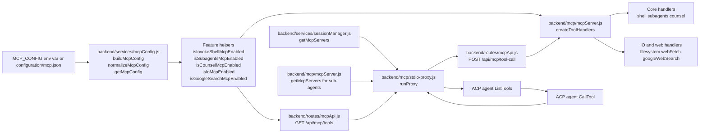

# MCP Feature Flag System

The MCP feature flag system controls which AcpUI MCP tools are advertised to ACP agents and which backend handlers can execute those tools. The canonical runtime input is the JSON file selected by `MCP_CONFIG`, with `configuration/mcp.json` as the default path and `configuration/mcp.json.example` as the documented shape.

This feature matters because MCP tool availability crosses several boundaries: config loading, ACP session MCP server injection, stdio proxy tool discovery, route-level JSON Schema advertisement, backend handler registration, and tests.

## Overview

### What It Does
- Loads and caches MCP configuration through `backend/services/mcpConfig.js`.
- Normalizes `tools`, `io`, `webFetch`, and `googleSearch` settings into one canonical object.
- Exposes feature helpers such as `isInvokeShellMcpEnabled`, `isIoMcpEnabled`, and `isGoogleSearchMcpEnabled`.
- Advertises enabled tool definitions through `GET /api/mcp/tools` in `backend/routes/mcpApi.js`.
- Registers enabled tool handlers through `createToolHandlers` in `backend/mcp/mcpServer.js`.
- Keeps stdio proxy discovery and backend execution on the same canonical tool names from `ACP_UX_TOOL_NAMES`.

### Why This Matters
- ACP agents can only call tools returned by the stdio proxy's `ListTools` handler.
- `POST /api/mcp/tool-call` can only execute names present in the backend handler map.
- A missing, unreadable, or malformed MCP config disables all config-controlled tools.
- Google search requires both `tools.googleSearch` and a non-empty `googleSearch.apiKey`.
- IO, web fetch, and search guardrails are normalized once and reused by the tool services.

### Architectural Role
This is a backend control plane for MCP tools. The frontend renders tool effects, but feature flags are resolved in backend config, route, proxy, handler, and service layers.

## How It Works - End-to-End Flow

1. **The config path is selected**

   File: `backend/services/mcpConfig.js` (Function: `buildMcpConfig`, Helper: `repoPath`, Env var: `MCP_CONFIG`)

   `buildMcpConfig` reads the path from `process.env.MCP_CONFIG`. When the env var is absent, it uses `configuration/mcp.json`. Relative paths are resolved from the repository root.

   ```js
   // FILE: backend/services/mcpConfig.js (Function: buildMcpConfig)
   const configPath = env.MCP_CONFIG || DEFAULT_CONFIG_PATH;
   const resolvedPath = repoPath(configPath);
   ```

2. **The JSON file is parsed and normalized**

   File: `backend/services/mcpConfig.js` (Functions: `buildMcpConfig`, `normalizeMcpConfig`, `boolSetting`, `numberSetting`, `stringArray`)

   `normalizeMcpConfig` accepts boolean flags or `{ "enabled": true }` flag objects. Tool flags fall back to `false` when the key is omitted or malformed.

   ```js
   // FILE: backend/services/mcpConfig.js (Function: normalizeMcpConfig)
   tools: {
     invokeShell: boolSetting(tools.invokeShell),
     subagents: boolSetting(tools.subagents),
     counsel: boolSetting(tools.counsel),
     io: boolSetting(tools.io),
     googleSearch: requestedGoogleSearch && Boolean(googleSearchApiKey)
   }
   ```

3. **Load failures produce a disabled config**

   File: `backend/services/mcpConfig.js` (Function: `disabledConfig`)

   If the file cannot be read or parsed, `buildMcpConfig` returns `disabledConfig`. The object keeps default numeric guardrails but sets every `tools.*` flag to `false` and includes `loaded: false` plus the failure `reason`.

4. **Runtime callers use the cached config**

   File: `backend/services/mcpConfig.js` (Functions: `getMcpConfig`, `resetMcpConfigForTests`)

   `getMcpConfig` stores the first parsed result in `cachedConfig`. Tests that change `MCP_CONFIG` call `resetMcpConfigForTests` before reading a new temp config.

   ```js
   // FILE: backend/services/mcpConfig.js (Function: getMcpConfig)
   if (!cachedConfig) cachedConfig = buildMcpConfig(env);
   return cachedConfig;
   ```

5. **The backend mounts the MCP API**

   File: `backend/server.js` (Route mount: `app.use('/api/mcp', ...)`, Startup call: `createMcpApiRoutes(io)`)

   The Express app reserves `/api/mcp` before the static route stack. `createMcpApiRoutes(io)` is assigned during backend startup, which creates the route handlers and the backend tool handler map.

6. **ACP sessions receive a stdio proxy MCP server**

   File: `backend/services/sessionManager.js` (Function: `getMcpServers`)
   File: `backend/mcp/mcpServer.js` (Function: `getMcpServers`)

   Main session create/load/fork flows call `sessionManager.getMcpServers`. Sub-agent invocation code uses `mcpServer.getMcpServers`. Both functions return a `node backend/mcp/stdio-proxy.js` server config when the provider has `config.mcpName`, create an MCP proxy binding, and pass `ACP_SESSION_PROVIDER_ID`, `ACP_UI_MCP_PROXY_ID`, `BACKEND_PORT`, and `NODE_TLS_REJECT_UNAUTHORIZED` in the server env.

   ```js
   // FILE: backend/services/sessionManager.js (Function: getMcpServers)
   const proxyPath = path.resolve(__dirname, '..', 'mcp', 'stdio-proxy.js');
   const proxyId = createMcpProxyBinding({ providerId, acpSessionId });
   return [{ name, command: 'node', args: [proxyPath], env: [...] }];
   ```

7. **The stdio proxy fetches advertised tools**

   File: `backend/mcp/stdio-proxy.js` (Function: `runProxy`, MCP request: `ListToolsRequestSchema`)

   `runProxy` requests `GET /api/mcp/tools` with `providerId` and `proxyId` query parameters. It stores the returned tool definitions in the proxy process and returns those definitions from its MCP `ListTools` handler.

   ```js
   // FILE: backend/mcp/stdio-proxy.js (Function: runProxy)
   const { tools, serverName } = await backendFetch(`/api/mcp/tools${query}`);
   server.setRequestHandler(ListToolsRequestSchema, async () => ({
     tools: tools.map(t => ({ name: t.name, description: t.description, inputSchema: t.inputSchema }))
   }));
   ```

8. **The route advertises only enabled tool definitions**

   File: `backend/routes/mcpApi.js` (Function: `createMcpApiRoutes`, Route: `GET /tools`, Mounted route: `GET /api/mcp/tools`)

   The route resolves provider context with `resolveToolContext`, builds a provider-specific subagent model description from `modelOptionsFromProviderConfig`, and appends definitions only when the matching feature helper returns `true`.

   ```js
   // FILE: backend/routes/mcpApi.js (Route: GET /tools)
   if (isInvokeShellMcpEnabled()) toolList.push(getInvokeShellMcpToolDefinition());
   if (isSubagentsMcpEnabled()) toolList.push(getSubagentsMcpToolDefinition({ modelDescription }));
   if (isCounselMcpEnabled()) toolList.push(getCounselMcpToolDefinition());
   if (isIoMcpEnabled()) toolList.push(...getIoMcpToolDefinitions());
   if (isGoogleSearchMcpEnabled()) toolList.push(...getGoogleSearchMcpToolDefinitions());
   ```

9. **Tool definitions are owned by definition modules**

   File: `backend/mcp/coreMcpToolDefinitions.js` (Functions: `getInvokeShellMcpToolDefinition`, `getSubagentsMcpToolDefinition`, `getCounselMcpToolDefinition`)
   File: `backend/mcp/ioMcpToolDefinitions.js` (Functions: `getIoMcpToolDefinitions`, `getGoogleSearchMcpToolDefinitions`)

   These modules define MCP names, descriptions, annotations, `_meta`, and JSON Schemas. Route code chooses which definitions to include; definition modules own the schemas.

10. **Tool calls are forwarded to backend handlers**

    File: `backend/mcp/stdio-proxy.js` (Function: `runProxy`, MCP request: `CallToolRequestSchema`)
    File: `backend/routes/mcpApi.js` (Route: `POST /tool-call`, Mounted route: `POST /api/mcp/tool-call`)

    The proxy sends the called tool name, arguments, provider id, proxy id, MCP request id, request metadata, and abort signal to the backend API. The route resolves proxy context, injects `providerId`, `acpSessionId`, and `mcpProxyId` into handler args, and returns either the handler result, a 404 for unknown tools, or MCP text error content.

11. **Handler registration follows the same flags**

    File: `backend/mcp/mcpServer.js` (Function: `createToolHandlers`)

    `createToolHandlers` installs only handlers whose config helpers are enabled. IO handlers and Google search handlers are added as grouped maps from `backend/mcp/ioMcpToolHandlers.js`.

    ```js
    // FILE: backend/mcp/mcpServer.js (Function: createToolHandlers)
    if (isInvokeShellMcpEnabled()) tools[ACP_UX_TOOL_NAMES.invokeShell] = runShellInvocation;
    if (isSubagentsMcpEnabled()) tools[ACP_UX_TOOL_NAMES.invokeSubagents] = runSubagentInvocation;
    if (isCounselMcpEnabled()) tools[ACP_UX_TOOL_NAMES.invokeCounsel] = runCounselInvocation;
    if (isIoMcpEnabled()) Object.assign(tools, createIoMcpToolHandlers());
    if (isGoogleSearchMcpEnabled()) Object.assign(tools, createGoogleSearchMcpToolHandlers());
    ```

12. **Registered handlers are wrapped for tool state updates**

    File: `backend/mcp/mcpServer.js` (Functions: `wrapToolHandlers`, `createToolHandlers`)
    File: `backend/services/tools/mcpExecutionRegistry.js` (Functions: `begin`, `complete`, `fail`, `publicMcpToolInput`)

    `wrapToolHandlers` records tool execution state before the real handler runs and marks the execution complete or failed. This keeps visible MCP tool updates aligned with the handler that actually ran.

## Architecture Diagram



## Critical Contract

The contract is that config normalization, route advertisement, proxy forwarding, canonical names, and handler registration must agree for every MCP tool.

For a tool to be callable, all of these must line up:
- A feature flag helper in `backend/services/mcpConfig.js` returns `true`.
- `GET /api/mcp/tools` includes a definition with the canonical name from `ACP_UX_TOOL_NAMES`.
- The stdio proxy returns that definition from `ListToolsRequestSchema`.
- `createToolHandlers` registers a handler under the same canonical name.
- `POST /api/mcp/tool-call` can resolve context and find the handler by name.

What breaks when the contract drifts:
- A tool appears in `ListTools` but `POST /api/mcp/tool-call` returns `Unknown tool`.
- A handler exists but the agent cannot discover the tool.
- A route schema accepts arguments that the handler does not understand.
- Google search appears without `googleSearch.apiKey` and fails every call.
- IO tools run with guardrails that differ from the advertised behavior.

## Configuration / Data Flow

### Config Files

File: `configuration/mcp.json.example` (Config keys: `tools`, `io`, `webFetch`, `googleSearch`)
File: `backend/services/mcpConfig.js` (Constant: `DEFAULT_CONFIG_PATH`, Env var: `MCP_CONFIG`)

The default runtime file is `configuration/mcp.json`. The example file documents the supported structure:

```json
{
  "tools": {
    "invokeShell": { "enabled": true },
    "subagents": { "enabled": true },
    "counsel": { "enabled": true },
    "io": { "enabled": true },
    "googleSearch": { "enabled": false }
  },
  "io": {
    "autoAllowWorkspaceCwd": true,
    "allowedRoots": [],
    "maxReadBytes": 1048576,
    "maxWriteBytes": 1048576,
    "maxReplaceBytes": 1048576,
    "maxOutputBytes": 262144
  },
  "webFetch": {
    "allowedProtocols": ["http:", "https:"],
    "blockedHosts": [],
    "blockedHostPatterns": [],
    "blockedCidrs": [],
    "maxResponseBytes": 1048576,
    "timeoutMs": 15000,
    "maxRedirects": 5
  },
  "googleSearch": {
    "apiKey": "",
    "timeoutMs": 15000,
    "maxOutputBytes": 262144
  }
}
```

### Tool Flags

Supported keys under `tools`:
- `invokeShell` gates `ux_invoke_shell`.
- `subagents` gates `ux_invoke_subagents`.
- `counsel` gates `ux_invoke_counsel`.
- `io` gates `ux_read_file`, `ux_write_file`, `ux_replace`, `ux_list_directory`, `ux_glob`, `ux_grep_search`, and `ux_web_fetch`.
- `googleSearch` gates `ux_google_web_search` only when `googleSearch.apiKey` is also non-empty.

Each flag accepts either a boolean or an object with `enabled`:

```json
{
  "tools": {
    "invokeShell": true,
    "subagents": { "enabled": true },
    "io": { "enabled": false }
  }
}
```

### Normalized Config Shape

File: `backend/services/mcpConfig.js` (Function: `normalizeMcpConfig`)

`getMcpConfig()` returns this shape to all consumers:

```js
{
  source: resolvedPath,
  loaded: true,
  tools: {
    invokeShell: Boolean,
    subagents: Boolean,
    counsel: Boolean,
    io: Boolean,
    googleSearch: Boolean
  },
  io: {
    autoAllowWorkspaceCwd: Boolean,
    allowedRoots: String[],
    maxReadBytes: Number,
    maxWriteBytes: Number,
    maxReplaceBytes: Number,
    maxOutputBytes: Number
  },
  webFetch: {
    allowedProtocols: String[],
    blockedHosts: String[],
    blockedHostPatterns: String[],
    blockedCidrs: String[],
    maxResponseBytes: Number,
    timeoutMs: Number,
    maxRedirects: Number
  },
  googleSearch: {
    apiKey: String,
    timeoutMs: Number,
    maxOutputBytes: Number
  }
}
```

### Config Consumers

File: `backend/services/ioMcp/filesystem.js` (Functions: `configuredAllowedRoots`, `resolveAllowedPath`, `readFile`, `writeFile`, `replaceText`, `limitTextOutput`)

The filesystem tools use `getIoMcpConfig()` for allowed roots and byte caps. `autoAllowWorkspaceCwd` adds `DEFAULT_WORKSPACE_CWD` or `process.cwd()` to the allowed roots. `allowedRoots: ["*"]` permits any resolved path.

File: `backend/services/ioMcp/webFetch.js` (Functions: `webFetch`, `assertUrlAllowed`, `fetchWithRedirects`, `readResponseText`)

`ux_web_fetch` uses `getWebFetchMcpConfig()` for allowed protocols, blocked hosts, wildcard host patterns, CIDR blocking, response size, timeout, and redirect caps.

File: `backend/services/ioMcp/googleWebSearch.js` (Function: `googleWebSearch`)

`ux_google_web_search` uses `getGoogleSearchMcpConfig()` for API key, timeout, and output truncation. The service also accepts explicit test options, but normal MCP handler calls use the config object.

## Component Reference

### Configuration and Session Injection

| Area | File | Stable Anchors | Purpose |
|---|---|---|---|
| Config example | `configuration/mcp.json.example` | `tools.invokeShell`, `tools.subagents`, `tools.counsel`, `tools.io`, `tools.googleSearch`, `io.*`, `webFetch.*`, `googleSearch.*` | Documents the JSON shape and sample values. |
| Config loader | `backend/services/mcpConfig.js` | `DEFAULT_CONFIG_PATH`, `repoPath`, `boolSetting`, `numberSetting`, `stringArray`, `disabledConfig`, `normalizeMcpConfig`, `buildMcpConfig`, `getMcpConfig`, `resetMcpConfigForTests` | Loads, normalizes, caches, and resets MCP config. |
| Feature helpers | `backend/services/mcpConfig.js` | `isInvokeShellMcpEnabled`, `isSubagentsMcpEnabled`, `isCounselMcpEnabled`, `isIoMcpEnabled`, `isGoogleSearchMcpEnabled`, `getIoMcpConfig`, `getWebFetchMcpConfig`, `getGoogleSearchMcpConfig` | Exposes normalized flags and guardrail settings to routes and services. |
| Main sessions | `backend/services/sessionManager.js` | `getMcpServers`, `loadSessionIntoMemory`, `autoLoadPinnedSessions` | Builds stdio proxy MCP server configs for main session loading paths. |
| Socket sessions | `backend/sockets/sessionHandlers.js` | Socket event `create_session`, socket event `fork_session`, `getMcpServers`, `bindMcpProxy`, `getMcpProxyIdFromServers` | Injects MCP server configs into `session/new` and `session/load` requests. |
| Sub-agent sessions | `backend/mcp/subAgentInvocationManager.js` | `getMcpServersFn`, `runInvocation` | Creates MCP server configs for spawned sub-agent sessions. |

### Advertisement and Execution

| Area | File | Stable Anchors | Purpose |
|---|---|---|---|
| Server mount | `backend/server.js` | `app.use('/api/mcp', ...)`, `mcpApiRouter`, `createMcpApiRoutes(io)` | Mounts the MCP API before the static route stack. |
| Stdio proxy | `backend/mcp/stdio-proxy.js` | `runProxy`, `backendFetch`, `ListToolsRequestSchema`, `CallToolRequestSchema`, `ACP_SESSION_PROVIDER_ID`, `ACP_UI_MCP_PROXY_ID` | Fetches tool definitions and forwards tool calls to the backend API. |
| MCP API | `backend/routes/mcpApi.js` | `createMcpApiRoutes`, `resolveToolContext`, `createToolCallAbortSignal`, `GET /tools`, `POST /tool-call` | Advertises enabled tools and dispatches tool calls. |
| Core definitions | `backend/mcp/coreMcpToolDefinitions.js` | `getInvokeShellMcpToolDefinition`, `getSubagentsMcpToolDefinition`, `getCounselMcpToolDefinition` | Defines core MCP tool schemas and metadata. |
| IO definitions | `backend/mcp/ioMcpToolDefinitions.js` | `getIoMcpToolDefinitions`, `getGoogleSearchMcpToolDefinitions` | Defines IO, web fetch, and Google search schemas and metadata. |
| Handler registration | `backend/mcp/mcpServer.js` | `createToolHandlers`, `wrapToolHandlers`, `runShellInvocation`, `runSubagentInvocation`, `runCounselInvocation`, `getMaxShellResultLines` | Registers enabled backend handlers under canonical tool names. |
| IO handlers | `backend/mcp/ioMcpToolHandlers.js` | `createIoMcpToolHandlers`, `createGoogleSearchMcpToolHandlers` | Maps canonical IO/search tool names to service calls. |
| Canonical names | `backend/services/tools/acpUxTools.js` | `ACP_UX_TOOL_NAMES`, `ACP_UX_CORE_TOOL_NAMES`, `ACP_UX_IO_TOOL_CONFIG`, `ACP_UX_IO_TOOL_NAMES`, `isAcpUxToolName` | Provides the stable names used by definitions, handlers, providers, and UI metadata. |
| Tool execution state | `backend/services/tools/mcpExecutionRegistry.js` | `begin`, `complete`, `fail`, `publicMcpToolInput`, `toolCallIdFromMcpContext` | Tracks MCP tool execution state around wrapped handlers. |

### Config-Backed Services

| Area | File | Stable Anchors | Purpose |
|---|---|---|---|
| Filesystem IO | `backend/services/ioMcp/filesystem.js` | `configuredAllowedRoots`, `resolveAllowedPath`, `readFile`, `writeFile`, `replaceText`, `listDirectory`, `findFiles`, `grepSearch`, `limitTextOutput` | Applies IO allowed roots and byte limits. |
| Web fetch | `backend/services/ioMcp/webFetch.js` | `webFetch`, `assertUrlAllowed`, `fetchWithRedirects`, `readResponseText`, `composeAbortSignal` | Applies URL policy, timeout, redirect, and response-size settings. |
| Google search | `backend/services/ioMcp/googleWebSearch.js` | `googleWebSearch`, `withTimeout`, `limitOutput` | Uses configured Google API key, timeout, and output cap. |

## Gotchas

1. **Omitted tool flags are false**

   `boolSetting` defaults to `false`. A tool is enabled only when the loaded config has a boolean `true` value or an object with `enabled: true`.

2. **The default path is not the example path**

   `configuration/mcp.json.example` documents the shape. `buildMcpConfig` reads `configuration/mcp.json` unless `MCP_CONFIG` points somewhere else.

3. **Missing or malformed config disables all tools**

   `disabledConfig` sets every `tools.*` flag to `false`. Numeric guardrails still have defaults, but no route definitions or handlers should be considered enabled from a failed load.

4. **Config is cached per backend process**

   `getMcpConfig` caches the first load. Runtime config file edits require a backend lifecycle that rebuilds the cache. Tests use `resetMcpConfigForTests` to make each temp config visible.

5. **Proxy tool definitions are captured during proxy startup**

   `stdio-proxy.js` fetches `/api/mcp/tools` in `runProxy` and its `ListTools` handler returns that captured list. New tool visibility is tied to the backend config cache and the proxy/session lifecycle.

6. **Provider `mcpName` controls proxy injection**

   `getMcpServers` returns no MCP server when the provider config has no `mcpName`. Feature flags decide tools after the proxy exists; they do not create the proxy server config by themselves.

7. **Google search has a double gate**

   `isGoogleSearchMcpEnabled` is true only when `tools.googleSearch` is enabled and `googleSearch.apiKey` trims to a non-empty string. The API key is not part of the advertised input schema.

8. **`tools.io` also gates web fetch**

   `getIoMcpToolDefinitions` includes `ux_web_fetch`, and `createIoMcpToolHandlers` registers the web fetch handler. There is no separate `tools.webFetch` flag.

9. **Advertisement and handler registration are separate code paths**

   `backend/routes/mcpApi.js` builds `GET /tools` responses. `backend/mcp/mcpServer.js` builds the handler map. New tools must update both paths with the same canonical name.

10. **Runtime context still matters after a flag is enabled**

    `POST /api/mcp/tool-call` resolves proxy context and injects provider/session fields. Shell and sub-agent execution depend on those fields even when their feature flags are enabled.

## Unit Tests

### Config Loader

File: `backend/test/mcpConfig.test.js`
- `disables config-controlled tools when the config is missing`
- `disables config-controlled tools when the config is malformed`
- `reads enabled tools from configuration/mcp.json shape`
- `normalizes IO, web fetch, and Google search settings`
- `disables Google search when enabled without an MCP config API key`

### Route Advertisement and Tool Calls

File: `backend/test/mcpApi.test.js`
- `GET /tools returns tool list with JSON Schema`
- `GET /tools includes default-on core tools when flags are blank`
- `GET /tools hides disabled core tools`
- `GET /tools describes ux_invoke_shell as an interactive terminal-backed shell replacement`
- `GET /tools hides optional IO and Google tools by default`
- `GET /tools advertises IO tools when MCP config enables them`
- `GET /tools advertises Google search only when MCP config enables it`
- `GET /tools does not advertise Google search when enabled without an MCP config API key`
- `POST /tool-call returns 404 for unknown tool`
- `POST /tool-call returns error content when handler throws`
- `POST /tool-call with valid tool returns result`
- `POST /tool-call passes resolved proxy context to handlers`
- `POST /tool-call aborts the handler signal when the request fires the "aborted" event`
- `POST /tool-call suppresses the error response when res.destroyed is true before the handler throws`
- `POST /tool-call aborts the handler signal when the response closes before completion`

### Handler Registration and Execution

File: `backend/test/mcpServer.test.js`
- `getMcpServers returns server config`
- `getMcpServers attaches _meta when getMcpServerMeta returns a value`
- `getMcpServers omits _meta when getMcpServerMeta returns undefined`
- `getMcpServers handles null providerId by using default provider`
- `registers core handlers when MCP config enables them`
- `omits invoke shell handler when MCP config disables it`
- `omits subagents handler when MCP config disables it`
- `omits counsel handler when MCP config disables it`
- `does not register optional IO or Google handlers by default`
- `registers IO handlers when MCP config enables IO`
- `registers Google search handler when MCP config enables Google search`
- `does not register Google search handler when enabled without an MCP config API key`

### Session MCP Server Injection

File: `backend/test/sessionManager.test.js`
- `should return empty if no mcpName`
- `should return server config if mcpName exists`
- `should attach _meta when getMcpServerMeta returns a value`

### Stdio Proxy

File: `backend/test/stdio-proxy.test.js`
- `runs the proxy lifecycle`
- `handles fetch errors with retry`
- `handles ListTools and CallTool requests`
- `throws error after max retries in backendFetch`
- `does not retry when fetch throws an AbortError`

### Config-Backed IO and Search Services

File: `backend/test/ioMcpFilesystem.test.js`
- `reads selected line ranges`
- `blocks file access outside configured allowed roots`
- `supports wildcard allowed roots`
- `enforces read and write size caps`

File: `backend/test/ioMcpWebFetch.test.js`
- `returns structured non-HTML text`
- `extracts structured normalized body text from HTML`
- `blocks configured hosts before fetching`
- `follows redirects through the configured policy checks`
- `enforces response size caps`

File: `backend/test/ioMcpGoogleSearch.test.js`
- `requires googleSearch.apiKey in MCP config`
- `formats grounded results with citations and sources`
- `reads the API key configured in mcp.json`
- `truncates oversized search output`

## How to Use This Guide

### For Implementing or Extending This Feature

1. Update `configuration/mcp.json.example` when the public config shape changes.
2. Update `backend/services/mcpConfig.js` when adding a flag, config block, normalization rule, or getter.
3. Add the canonical tool name to `ACP_UX_TOOL_NAMES` in `backend/services/tools/acpUxTools.js` when adding a tool.
4. Add or update the tool schema in `backend/mcp/coreMcpToolDefinitions.js` or `backend/mcp/ioMcpToolDefinitions.js`.
5. Update `GET /tools` in `backend/routes/mcpApi.js` so advertisement follows the correct feature helper.
6. Update `createToolHandlers` in `backend/mcp/mcpServer.js` so handler registration follows the same helper and canonical name.
7. Add config tests in `backend/test/mcpConfig.test.js`, advertisement tests in `backend/test/mcpApi.test.js`, and handler tests in `backend/test/mcpServer.test.js`.
8. Add service-level tests when the new or changed flag affects filesystem, fetch, search, shell, sub-agent, or counsel behavior.

### For Debugging Issues With This Feature

1. Inspect `MCP_CONFIG` and confirm the resolved file exists and parses as JSON.
2. Check `getMcpConfig()` output for `source`, `loaded`, `reason`, `tools`, `io`, `webFetch`, and `googleSearch`.
3. Check the relevant helper: `isInvokeShellMcpEnabled`, `isSubagentsMcpEnabled`, `isCounselMcpEnabled`, `isIoMcpEnabled`, or `isGoogleSearchMcpEnabled`.
4. Confirm the provider config has `mcpName` so `getMcpServers` returns a stdio proxy server config.
5. Inspect `GET /api/mcp/tools?providerId=<provider>&proxyId=<proxy>` to confirm the advertised tool list.
6. Inspect `createToolHandlers(io)` to confirm the backend has a handler under the same canonical tool name.
7. For tool-call failures, inspect `POST /api/mcp/tool-call` handling in `backend/routes/mcpApi.js`, especially `resolveToolContext` and the `Unknown tool` branch.
8. Use the unit tests listed above as the fastest executable reference for the contract under investigation.

## Summary

- `backend/services/mcpConfig.js` is the source of truth for MCP feature flags and config-backed guardrails.
- `MCP_CONFIG` selects the runtime config file; `configuration/mcp.json` is the default path.
- `configuration/mcp.json.example` documents the supported config shape without being the default runtime path.
- Missing or malformed config disables all config-controlled MCP tools.
- `GET /api/mcp/tools` advertises enabled schemas, and `createToolHandlers` registers enabled handlers.
- `ACP_UX_TOOL_NAMES` provides the canonical tool names shared by definitions, handlers, providers, and UI metadata.
- IO, web fetch, and Google search services consume normalized config through getter functions.
- The critical contract is exact agreement between flags, advertised tool definitions, stdio proxy forwarding, and backend handler names.
