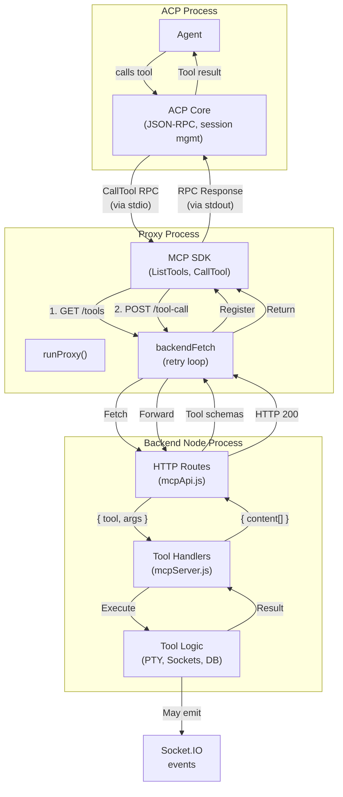

# Feature Doc — MCP Server System

**AcpUI's custom MCP (Model Context Protocol) server bridges the ACP daemon to AcpUI-specific tools via a stateless stdio proxy. Tools like `ux_invoke_shell`, `ux_invoke_subagents`, and `ux_invoke_counsel` run as tool handlers in the backend, not in the proxy — keeping all orchestration and I/O logic centralized.**

This is a critical infrastructure component. The system's key insight: the proxy is a thin, generic passthrough, while all intelligence (PTY spawning, socket emission, sub-agent orchestration) stays in the backend Node.js process.

---

## Overview

### What It Does

When an ACP session is created, the backend injects an MCP server config telling the ACP to spawn `node stdio-proxy.js`. That proxy:

1. Fetches tool definitions from the backend's HTTP API
2. Registers those tools with the MCP SDK
3. Waits for the ACP to call a tool
4. Forwards every tool call to an HTTP endpoint
5. Returns the result to the ACP

Meanwhile, the **backend** handles all the real work:
- Spawning PTYs for shell commands
- Creating sub-agent ACP sessions
- Emitting Socket.IO events for live updates
- Managing databases and file systems

### Why Two Processes?

**Simplicity:** The proxy is stateless and generic. Swapping it for a different ACP implementation requires only changing which executable the proxy points to.

**Separation of Concerns:** MCP protocol handling is isolated from business logic. Tools are decoupled from how they're discovered or called.

**Scalability:** If needed, the proxy could be separate microservices per provider, while the backend handles orchestration.

### Why This Matters

- **No tool state in the proxy:** If the proxy crashes, tools and sockets aren't affected
- **Live streaming works:** Tools can emit real-time updates via Socket.IO (the proxy just forwards results)
- **Sub-agents work:** Tools can spawn new ACP sessions independently
- **No timeout issues:** HTTP timeouts are disabled, tools can run indefinitely

---

## Architecture

The system has **three components**:

### 1. **Backend Tool Handlers** (`backend/mcp/mcpServer.js`)

Where the actual tool logic lives. These are plain async functions that receive `{ command, args, providerId, ... }` and resolve with `{ content: [{ type: 'text', text: '...' }] }` or throw errors.

```javascript
// FILE: backend/mcp/mcpServer.js (Line 64)
tools.ux_invoke_shell = async ({ command, cwd, providerId }) => {
  // Real logic: spawn PTY, emit tool_output_stream, return result
};

tools.ux_invoke_subagents = async ({ requests, model, providerId }) => {
  // Real logic: spawn sub-agent sessions, await responses, cleanup
};
```

### 2. **Stdio Proxy** (`backend/mcp/stdio-proxy.js`)

A child process spawned per ACP session. The proxy is stateless and generic.

```javascript
// FILE: backend/mcp/stdio-proxy.js (Full file, 74 lines)
async function runProxy() {
  // Fetch tool definitions from backend
  const { tools, serverName } = await backendFetch(`/api/mcp/tools?providerId=...`);
  
  // Register with MCP SDK
  const server = new Server({ name: serverName, ... });
  server.setRequestHandler(ListToolsRequestSchema, () => ({ tools: [...] }));
  server.setRequestHandler(CallToolRequestSchema, async (req) => {
    // Forward to backend HTTP endpoint
    return await backendFetch('/api/mcp/tool-call', {
      method: 'POST',
      body: JSON.stringify({ tool: req.params.name, args: req.params.arguments, providerId: ... })
    });
  });
  
  // Connect to ACP via stdio
  const transport = new StdioServerTransport();
  await server.connect(transport);
}
```

**Key detail (Line 40):** The proxy fetches tool definitions on startup. If new tools are added and schemas aren't updated, the ACP won't see them.

### 3. **Backend HTTP API** (`backend/routes/mcpApi.js`)

Two routes that bridge proxy ↔ backend:

**GET /api/mcp/tools?providerId=...** — Returns tool definitions with JSON schemas.
```javascript
// FILE: backend/routes/mcpApi.js (Lines 24-78)
router.get('/tools', (req, res) => {
  const providerId = req.query.providerId || null;
  const toolList = [
    { 
      name: 'ux_invoke_shell', 
      description: 'Execute a shell command with live streaming output. Always use this tool for shell commands; never use system shell, bash, or powershell tools when they are present. Use only non-interactive commands and adjust pager-prone commands like git diff to be non-interactive, for example git --no-pager diff.',
      inputSchema: { type: 'object', properties: { command: {...}, cwd: {...} }, required: ['command'] }
    },
    { 
      name: 'ux_invoke_subagents',
      ...
    },
    // ... more tools
  ];
  res.json({ tools: toolList, serverName: 'AcpUI' });
});
```

**POST /api/mcp/tool-call** — Executes a tool and returns the result.
```javascript
// FILE: backend/routes/mcpApi.js (Lines 84-106)
router.post('/tool-call', async (req, res) => {
  // CRITICAL: Disable timeouts so tools can run indefinitely
  req.setTimeout(0);      // LINE 85
  res.setTimeout(0);      // LINE 86
  if (req.socket) req.socket.setTimeout(0);

  const { tool: toolName, args, providerId } = req.body;
  const handler = tools[toolName];
  if (!handler) {
    res.status(404).json({ error: `Unknown tool: ${toolName}` });
    return;
  }

  try {
    const result = await handler({ ...(args || {}), providerId });  // LINE 99
    res.json(result);  // Content array, not plain text
  } catch (err) {
    res.json({ content: [{ type: 'text', text: `Error: ${err.message}` }] });
  }
});
```

---

## How It Works — End-to-End Flow

### 1. **Session Creation Request from User**

User creates a session in the UI. Backend receives `create_session` via Socket.IO.

### 2. **Backend Constructs MCP Server Config**

**File:** `backend/services/sessionManager.js` (Lines 24-38)

```javascript
export function getMcpServers(providerId) {
  const name = getProvider(providerId).config.mcpName;  // "AcpUI" (configurable)
  if (!name) return [];
  const proxyPath = path.resolve(__dirname, '..', 'mcp', 'stdio-proxy.js');
  return [{
    name,
    command: 'node',
    args: [proxyPath],
    env: [
      { name: 'ACP_SESSION_PROVIDER_ID', value: String(providerId) },  // LINE 27: Critical for multi-provider
      { name: 'BACKEND_PORT', value: String(process.env.BACKEND_PORT || 3005) },
      { name: 'NODE_TLS_REJECT_UNAUTHORIZED', value: '0' },
    ]
  }];
}
```

**Note the environment variables:**
- `ACP_SESSION_PROVIDER_ID` — So the proxy knows which provider to report tools for
- `BACKEND_PORT` — So the proxy knows where to send HTTP requests
- `NODE_TLS_REJECT_UNAUTHORIZED` — For self-signed localhost certs

### 3. **Backend Sends session/new to ACP**

**File:** `backend/sockets/sessionHandlers.js` (Lines 330-332)

```javascript
result = await acpClient.transport.sendRequest('session/new', {
  cwd: sessionCwd,
  mcpServers: getMcpServers(resolvedProviderId),  // <- Injected here
  ...sessionParams
});
```

The `mcpServers` array is sent in the `session/new` RPC request.

### 4. **ACP Spawns Proxy Process**

The ACP reads the `mcpServers` array and spawns a child process:
```bash
node /path/to/stdio-proxy.js
```

With environment variables from the config.

### 5. **Proxy Fetches Tool Definitions**

**File:** `backend/mcp/stdio-proxy.js` (Lines 40-41)

```javascript
const { tools, serverName } = await backendFetch(`/api/mcp/tools?providerId=${process.env.ACP_SESSION_PROVIDER_ID || ''}`);
```

The proxy makes an HTTPS request to the backend's GET /api/mcp/tools endpoint. Includes a retry loop (lines 25-38) with exponential backoff (500ms * attempt) for reliability.

### 6. **Proxy Registers with MCP SDK**

**File:** `backend/mcp/stdio-proxy.js` (Lines 43-66)

```javascript
const server = new Server(
  { name: serverName || 'acpui-proxy', version: '1.0.0' },
  { capabilities: { tools: {} } }
);

server.setRequestHandler(ListToolsRequestSchema, async () => ({
  tools: tools.map(t => ({
    name: t.name,
    description: t.description,
    inputSchema: t.inputSchema,
  }))
}));

server.setRequestHandler(CallToolRequestSchema, async (request) => {
  const { name, arguments: args } = request.params;
  return await backendFetch('/api/mcp/tool-call', {  // LINE 58
    method: 'POST',
    body: JSON.stringify({ tool: name, args: args || {}, providerId: process.env.ACP_SESSION_PROVIDER_ID || null }),
  });
});

const transport = new StdioServerTransport();  // LINE 64
await server.connect(transport);  // LINE 65
```

Now the proxy is listening on stdin/stdout for MCP RPC requests from the ACP.

### 7. **Agent Calls a Tool**

The agent issues a call to `ux_invoke_shell`:
```
Agent: "Let me run npm test"
ACP: Calls tool "ux_invoke_shell" with { command: "npm test", cwd: "..." }
```

### 8. **ACP Sends CallTool RPC to Proxy (via stdio)**

The ACP sends a JSON-RPC request on stdout:
```json
{
  "jsonrpc": "2.0",
  "id": 123,
  "method": "call_tool",
  "params": {
    "name": "ux_invoke_shell",
    "arguments": {
      "command": "npm test",
      "cwd": "/home/user/project"
    }
  }
}
```

### 9. **Proxy Forwards to Backend HTTP Endpoint**

**File:** `backend/mcp/stdio-proxy.js` (Lines 56-62)

```typescript
server.setRequestHandler(CallToolRequestSchema, async (request) => {
  const { name, arguments: args } = request.params;
  return await backendFetch('/api/mcp/tool-call', {
    method: 'POST',
    body: JSON.stringify({ 
      tool: name,                                       // "ux_invoke_shell"
      args: args || {},                                // { command, cwd }
      providerId: process.env.ACP_SESSION_PROVIDER_ID  // From env
    }),
  });
});
```

The proxy calls `backendFetch()` (with retry logic) to POST /api/mcp/tool-call.

### 10. **Backend Executes Tool Handler**

**File:** `backend/routes/mcpApi.js` (Lines 84-106)

```javascript
const handler = tools[toolName];  // Get ux_invoke_shell handler
const result = await handler({ command, cwd, providerId });  // Execute
res.json(result);  // Return immediately
```

The handler for `ux_invoke_shell` runs (spawns PTY, streams output, etc.). It may emit Socket.IO events during execution.

### 11. **Tool Result Returned to Proxy**

The handler resolves with:
```javascript
{
  content: [
    { 
      type: 'text', 
      text: 'npm test output...\n\nExit Code: 0' 
    }
  ]
}
```

This is sent back via HTTP response.

### 12. **Proxy Returns Result to ACP**

The proxy returns the HTTP response body as the MCP result.

### 13. **ACP Forwards to Agent**

The ACP routes the tool result back to the agent, which can now use it in its reasoning.

---

## Architecture Diagram



---

## The Critical Contract: Schema ↔ Handler Sync

**This is the #1 gotcha in this system.**

Tool schemas and handlers are defined in **two separate files** with **no code linking them together**. They must be manually kept in sync.

### Where Schemas Are Defined

**File:** `backend/routes/mcpApi.js` (Lines 32-76)

```javascript
const toolList = [
  { 
    name: 'ux_invoke_shell',                    // LINE 33
    description: '...',
    inputSchema: {
      type: 'object',
      properties: {
        command: { type: 'string', description: '...' },
        cwd: { type: 'string', description: '...' },
      },
      required: ['command'],
    }
  },
  // ... more tools
];
res.json({ tools: toolList, serverName });
```

### Where Handlers Are Defined

**File:** `backend/mcp/mcpServer.js` (Lines 61-297)

```javascript
export function createToolHandlers(io) {
  const tools = {};

  tools.ux_invoke_shell = async ({ command, cwd, providerId }) => {  // LINE 64
    // Real implementation
  };

  tools.ux_invoke_subagents = async ({ requests, model, providerId }) => {  // LINE 116
    // Real implementation
  };

  tools.ux_invoke_counsel = async ({ question, architect, performance, security, ux, providerId }) => {  // LINE 274
    // Real implementation
  };

  return tools;
}
```

### The Contract

1. **Tool name must match:** `inputSchema` in GET /tools and `tools[name]` in createToolHandlers
2. **Input properties must match:** What's in `inputSchema.properties` must be passable to the handler
3. **Required fields must match:** Fields marked `required: true` in schema must be the handler's required params

### Why It Breaks

If you add a tool to `mcpServer.js` but forget to add its schema to `mcpApi.js`:
- The proxy won't return the schema when ACP asks "what tools are available?"
- The ACP won't offer that tool to the agent
- Tool call silently fails if agent somehow tries it

If you add a schema but forget the handler:
- ACP offers the tool to the agent
- Agent calls it
- 404 error returned from /api/mcp/tool-call

### The Warning Comments

Both files have warning comments (read them!):

**mcpServer.js (Lines 8-9):**
```javascript
 * IMPORTANT: When adding/renaming/removing tools here, also update the schemas in mcpApi.js.
```

**mcpApi.js (Lines 10-13):**
```javascript
 * IMPORTANT: If you add/rename/remove tools in mcpServer.js, you must also update
 * the JSON Schema definitions in the GET /tools response below, AND the proxy will
 * pick up the changes automatically on next ACP session creation.
```

---

## Two getMcpServers Functions (The Gotcha)

**This is a subtle but important difference.**

### Version 1: For User Sessions (sessionManager.js)

**File:** `backend/services/sessionManager.js` (Lines 24-38)

```javascript
export function getMcpServers(providerId) {
  const name = getProvider(providerId).config.mcpName;
  if (!name) return [];
  const proxyPath = path.resolve(__dirname, '..', 'mcp', 'stdio-proxy.js');
  return [{
    name,
    command: 'node',
    args: [proxyPath],
    env: [
      { name: 'ACP_SESSION_PROVIDER_ID', value: String(providerId) },  // ← Includes provider ID
      { name: 'BACKEND_PORT', value: String(process.env.BACKEND_PORT || 3005) },
      { name: 'NODE_TLS_REJECT_UNAUTHORIZED', value: '0' },
    ]
  }];
}
```

**Used by:** `sessionHandlers.js` for regular `session/new` and `session/load` calls.

**Key:** Includes `ACP_SESSION_PROVIDER_ID` in the environment so the proxy knows which provider to use.

### Version 2: For Sub-Agent Sessions (mcpServer.js)

**File:** `backend/mcp/mcpServer.js` (Lines 40-53)

```javascript
export function getMcpServers() {  // ← No providerId parameter
  const name = getProvider().config.mcpName;  // ← Uses getProvider() without args
  if (!name) return [];
  const proxyPath = path.resolve(path.dirname(fileURLToPath(import.meta.url)), 'stdio-proxy.js');
  return [{
    name,
    command: 'node',
    args: [proxyPath],
    env: [
      // ← NO ACP_SESSION_PROVIDER_ID here
      { name: 'BACKEND_PORT', value: String(process.env.BACKEND_PORT || 3005) },
      { name: 'NODE_TLS_REJECT_UNAUTHORIZED', value: '0' },
    ]
  }];
}
```

**Used by:** Inside `mcpServer.js` at line 172 for sub-agent spawning.

**Key:** Does NOT include `ACP_SESSION_PROVIDER_ID`. The proxy will send `providerId: null` to the backend, and the backend falls back to the default/active provider.

### Why Two?

The sessionManager version is the "proper" one with full context. The mcpServer version is a shortcut for internal sub-agent use where the provider is already known in the calling context.

### Implication

When tools are called from within a sub-agent, they may not know their provider explicitly (it defaults). This is usually fine because there's typically one active provider at a time.

---

## Adding a New Tool

If you want to add a new tool (e.g., `ux_invoke_test_runner`), you must update **three places**:

### 1. Define the Handler

**File:** `backend/mcp/mcpServer.js`

```javascript
// Add to createToolHandlers function
tools.ux_invoke_test_runner = async ({ command, framework, providerId }) => {
  // Your implementation
  return { content: [{ type: 'text', text: 'result' }] };
};
```

### 2. Define the Schema

**File:** `backend/routes/mcpApi.js`

```javascript
// Add to toolList in GET /tools
{
  name: 'ux_invoke_test_runner',
  description: 'Run tests with optional framework selection',
  inputSchema: {
    type: 'object',
    properties: {
      command: { type: 'string', description: 'Test command to run' },
      framework: { type: 'string', description: 'Test framework (jest, mocha, etc)' },
    },
    required: ['command'],
  }
}
```

### 3. Add Unit Tests

**File:** `backend/test/mcpServer.test.js` and/or `backend/test/mcpApi.test.js`

Test both the handler and the schema definition.

### Verification

After making changes:
1. Run `npm run lint` to ensure no syntax errors
2. Run tests: `npx vitest run`
3. Start the backend and check logs for any errors
4. Test the tool via ACP to ensure it's discoverable and callable

---

## Component Reference

### Backend Files

| File | Functions | Lines | Purpose |
|------|-----------|-------|---------|
| `backend/mcp/mcpServer.js` | `createToolHandlers(io)` | 61-297 | Defines all tool handlers (ux_invoke_shell, ux_invoke_subagents, ux_invoke_counsel) |
| | `getMcpServers()` | 40-53 | Returns MCP server config for sub-agent spawning (no providerId env) |
| | `ux_invoke_shell` | 64-114 | Spawn PTY, stream output, handle timeout |
| | `ux_invoke_subagents` | 116-260 | Spawn sub-agents, await responses, cleanup |
| | `ux_invoke_counsel` | 274-297 | Spawn counsel agents (delegates to ux_invoke_subagents) |
| `backend/mcp/stdio-proxy.js` | `runProxy()` | 40-66 | Fetch schemas, register with MCP SDK, forward tool calls |
| | `backendFetch()` | 25-38 | HTTP request with 3-attempt retry loop |
| `backend/routes/mcpApi.js` | `GET /tools` | 24-78 | Return tool schemas and server name |
| | `POST /tool-call` | 84-106 | Execute tool handler, disable timeouts, return result |
| `backend/services/sessionManager.js` | `getMcpServers(providerId)` | 24-38 | Returns MCP server config for user sessions (includes ACP_SESSION_PROVIDER_ID) |

---

## Gotchas & Important Notes

### 1. **Schema and Handler Must Be in Sync**

Adding a tool to `mcpServer.js` without adding its schema to `mcpApi.js` means the agent can't discover it. Adding a schema without a handler causes 404 errors when the agent tries to call it.

**Test:** When you add a tool, verify that both places are updated before testing.

### 2. **HTTP Timeouts Are Disabled**

Lines 85-87 of `mcpApi.js` disable all HTTP timeouts. **This is intentional** — tools like sub-agents can take minutes. If you add timeout logic, be aware it's disabled at the socket level.

### 3. **Two Different getMcpServers Functions**

`sessionManager.js:getMcpServers(providerId)` has `ACP_SESSION_PROVIDER_ID` in env. `mcpServer.js:getMcpServers()` doesn't. Don't mix them up.

### 4. **The Proxy Retries Three Times**

`backendFetch()` in stdio-proxy.js (lines 25-38) retries with exponential backoff (500ms, 1s, 1.5s). If the backend is down, the proxy may hang for a few seconds before failing. This is intentional — allows backend startup race conditions to recover.

### 5. **Tool Result Must Be Content Array**

Handlers must return `{ content: [{ type: 'text', text: '...' }, ...] }`. Returning raw strings or other shapes will confuse the ACP.

### 6. **providerId May Be Null for Sub-Agent Tools**

Because the sub-agent version of `getMcpServers()` doesn't include `ACP_SESSION_PROVIDER_ID`, tools called from within sub-agents receive `providerId: null`. The backend falls back to the active/default provider. This is usually fine but worth being aware of.

### 7. **Tool Definitions Are Cached by Proxy**

The proxy fetches tool definitions once at startup (line 41). If you update schemas while a session is running, the agent won't see the new definitions until a new session is created. No need to restart anything — just create a new session.

### 8. **Errors Must Be Caught and Wrapped**

If a handler throws, mcpApi.js catches it (line 102) and returns `{ content: [{ type: 'text', text: 'Error: ...' }] }`. The proxy passes this back as a successful response. The ACP sees it as tool output, not an error. This is acceptable — the tool ran and returned an error message.

### 9. **Tool Output Streaming Happens Outside Tool Call**

`ux_invoke_shell` doesn't stream output through the tool result. It emits `tool_output_stream` events via Socket.IO while the PTY is running. The final result is just a summary. This is efficient because streaming in the HTTP response would be slow.

### 10. **The Proxy Is Stateless**

Every tool call includes `providerId`. The proxy doesn't store state. If you need to track state across tool calls, use the backend's session metadata (acpClient.sessionMetadata).

---

## Unit Tests

### Backend Tests

- **`backend/test/mcpServer.test.js`** — Tests tool handlers:
  - `getMcpServers returns server config` (line 128-131)
  - `ux_invoke_shell spawns PTY and returns output`
  - Tool handler signatures and result format

- **`backend/test/mcpApi.test.js`** — Tests HTTP routes:
  - `GET /tools returns correct schema`
  - `POST /tool-call routes to correct handler`
  - Error handling

---

## Summary

The AcpUI MCP server is a clean two-process design:

1. **Proxy (stdio-proxy.js):** Thin, stateless, generic. Fetches schemas, registers tools, forwards calls.
2. **Backend (mcpServer.js + mcpApi.js):** All intelligence. Tool logic, sockets, orchestration.

**The critical contract:** Tool schemas (mcpApi.js) and handlers (mcpServer.js) must be manually kept in sync. No code links them.

**The key gotcha:** Two different `getMcpServers` functions exist. SessionManager version includes `ACP_SESSION_PROVIDER_ID` for user sessions. MCP Server version doesn't, for sub-agent internal use.

**Why it matters:** This architecture allows agents to have powerful, extensible tools (shell, sub-agents, counsel) without bloating the proxy. Tools can emit live updates, spawn long-running processes, and orchestrate complex workflows — all while the proxy remains a simple passthrough.

**Adding a tool requires:**
1. Add handler to `mcpServer.js:createToolHandlers()`
2. Add schema to `mcpApi.js:GET /tools`
3. Add tests
4. Verify no lint errors and tests pass
