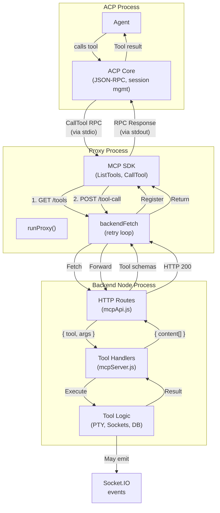

# Feature Doc — MCP Server System

**AcpUI's custom MCP (Model Context Protocol) server bridges the ACP daemon to AcpUI-specific tools via a stateless stdio proxy. Tools like `ux_invoke_shell`, `ux_invoke_subagents`, and `ux_invoke_counsel` run as tool handlers in the backend, not in the proxy — keeping all orchestration and I/O logic centralized.**

This is a critical infrastructure component. The system's key insight: the proxy is a thin, generic passthrough, while all intelligence (interactive shell PTY lifecycle, socket emission, sub-agent orchestration) stays in the backend Node.js process.

---

## Overview

### What It Does

When an ACP session is created, the backend injects an MCP server config telling the ACP to spawn `node stdio-proxy.js`. That proxy:

1. Fetches tool definitions from the backend's HTTP API
2. Registers those tools with the MCP SDK
3. Waits for the ACP to call a tool
4. Forwards every tool call to an HTTP endpoint
5. Returns the result to the ACP

Meanwhile, the **backend** handles all the real work:
- Spawning PTYs for shell commands through `ShellRunManager`
- Creating sub-agent ACP sessions
- Emitting Socket.IO events for live updates
- Managing databases and file systems

### Why Two Processes?

**Simplicity:** The proxy is stateless and generic. Swapping it for a different ACP implementation requires only changing which executable the proxy points to.

**Separation of Concerns:** MCP protocol handling is isolated from business logic. Tools are decoupled from how they're discovered or called.

**Scalability:** If needed, the proxy could be separate microservices per provider, while the backend handles orchestration.

### Why This Matters

- **No tool state in the proxy:** If the proxy crashes, tools and sockets aren't affected
- **Live streaming works:** Tools can emit real-time updates via Socket.IO (the proxy just forwards results)
- **Sub-agents work:** Tools can spawn new ACP sessions independently
- **Backend HTTP timeouts disabled plus abort-aware:** backend routes keep long tool calls open, but MCP cancellation/disconnects are propagated through abort signals so side-effectful tools can stop background work

---

## Architecture

The system has **three components**:

### 1. **Backend Tool Handlers** (`backend/mcp/mcpServer.js`)

Where the actual tool logic lives. These are plain async functions that receive `{ description, command, args, providerId, ... }` and resolve with `{ content: [{ type: 'text', text: '...' }] }` or throw errors.
```javascript
// FILE: backend/mcp/mcpServer.js (Lines 140-289)
export function createToolHandlers(io) {
  const tools = {};

  tools.ux_invoke_shell = async ({ description, command, cwd, providerId, acpSessionId, mcpRequestId, requestMeta }) => {
    // Delegate to shellRunManager for interactive terminal execution.
    // Caches tool invocation metadata and returns PTY output.
  };

  tools.ux_invoke_subagents = async ({ requests, model, providerId, acpSessionId, mcpProxyId, mcpRequestId, requestMeta, abortSignal }) => {
    // Build an idempotency key, then spawn sub-agent sessions through SubAgentInvocationManager.
    // abortSignal is passed through so upstream MCP cancellation cascades to sub-agents.
  };

  tools.ux_invoke_counsel = async ({ question, architect, performance, security, ux, providerId, acpSessionId, mcpProxyId, mcpRequestId, requestMeta, abortSignal }) => {
    // Spawn counsel agents with different perspectives. Delegates to ux_invoke_subagents.
  };

  return tools;  // LINE 289
}
```

### 2. **Stdio Proxy** (`backend/mcp/stdio-proxy.js`)

A child process spawned per ACP session. The proxy is stateless and generic.

```javascript
// FILE: backend/mcp/stdio-proxy.js (Lines 46-119)

// Fetch with retry loop (3 attempts, exponential backoff)
// Abort errors bypass retry immediately
async function backendFetch(path, options = {}) {
  for (let attempt = 0; attempt < 3; attempt++) {
    try {
      const res = await fetch(`${getBackendUrl()}${path}`, {
        ...options,
        headers: { 'Content-Type': 'application/json', ...options.headers },
      });
      return await res.json();
    } catch (err) {
      if (options.signal?.aborted || err.name === 'AbortError') throw err;  // LINE 55: Don't retry aborts
      if (attempt < 2) await new Promise(r => setTimeout(r, 500 * (attempt + 1)));
      else throw err;
    }
  }
}

async function runProxy() {  // LINE 62
  const providerId = process.env.ACP_SESSION_PROVIDER_ID || '';
  const proxyId = process.env.ACP_UI_MCP_PROXY_ID || '';
  const query = ...;
  const { tools, serverName } = await backendFetch(`/api/mcp/tools${query}`);
  
  // Register with MCP SDK and advertise server-level instructions
  const instructions = buildServerInstructions(tools, serverName);
  const server = new Server({ name: serverName, ... }, { instructions, ... });
  server.setRequestHandler(ListToolsRequestSchema, () => ({ tools: [...] }));
  server.setRequestHandler(CallToolRequestSchema, async (request, extra) => {
    // Forward to backend HTTP endpoint, passing MCP signal
    return await backendFetch('/api/mcp/tool-call', {
      method: 'POST',
      body: JSON.stringify({
        tool: request.params.name,
        args: request.params.arguments,
        providerId: process.env.ACP_SESSION_PROVIDER_ID || null,
        proxyId: process.env.ACP_UI_MCP_PROXY_ID || null,
        mcpRequestId: extra?.requestId ?? null,
        requestMeta: request.params?._meta || extra?._meta || null
      }),
      signal: extra?.signal  // LINE 106: Propagate MCP cancellation
    });
  });
  
  // Connect to ACP via stdio
  const transport = new StdioServerTransport();
  await server.connect(transport);  // LINE 111
}  // LINE 112
```

**Key details:** 
- `backendFetch()` (lines 46-60): Retries 3x with exponential backoff (500ms, 1s, 1.5s). **Important:** Abort errors and pre-aborted signals are NOT retried (line 55) — they throw immediately so MCP cancellation propagates cleanly.
- `runProxy()` (lines 62-119): Fetches tool definitions on startup, derives MCP `instructions`, registers with SDK, and forwards tool calls. The proxy forwards the MCP SDK `extra.signal` into `fetch()` so client-side cancellation or timeouts close the backend request.

### 3. **Backend HTTP API** (`backend/routes/mcpApi.js`)

Two routes that bridge proxy ↔ backend:

**GET /api/mcp/tools?providerId=...&proxyId=...** — Returns tool definitions with JSON schemas and MCP tool metadata.
```javascript
// FILE: backend/routes/mcpApi.js (Lines 54-118)
router.get('/tools', (req, res) => {
  const context = resolveToolContext(req.query.providerId || null, req.query.proxyId || null);
  const toolList = [
    { 
      name: 'ux_invoke_shell', 
      description: 'Execute a shell command in a real terminal with live streaming output and user-interactive stdin while the process is running...',
      inputSchema: { type: 'object', properties: { description: {...}, command: {...}, cwd: {...} }, required: ['description', 'command'] }
    },
    { 
      name: 'ux_invoke_subagents',
      ...
    },
    // ... more tools
  ];
  res.json({ tools: toolList, serverName });  // LINE 117
});  // LINE 118
```

**POST /api/mcp/tool-call** — Executes a tool and returns the result.

```javascript
// FILE: backend/routes/mcpApi.js (Lines 16-34, 124-158)

// Helper: Create an AbortSignal tied to request/response lifecycle
function createToolCallAbortSignal(req, res, toolName) {  // LINE 16
  const controller = new globalThis.AbortController();
  const abort = (reason) => {
    if (controller.signal.aborted) return;
    writeLog(`[MCP API] Tool ${toolName} aborted: ${reason}`);
    controller.abort(new Error(reason));
  };

  req.on?.('aborted', () => abort('request aborted'));  // LINE 24
  res.on?.('close', () => {
    if (!res.writableEnded) abort('response closed');
  });

  return controller.signal;  // LINE 29
}

// Helper: Check if response can still be written
function canWriteResponse(res, abortSignal) {  // LINE 32
  return !abortSignal.aborted && !res.destroyed && !res.writableEnded;  // LINE 33
}

router.post('/tool-call', async (req, res) => {  // LINE 124
  // CRITICAL: Disable timeouts so tools can run indefinitely
  req.setTimeout(0);      // LINE 125
  res.setTimeout(0);      // LINE 126
  if (req.socket) req.socket.setTimeout(0);

  const { tool: toolName, args, providerId, proxyId, mcpRequestId, requestMeta } = req.body;
  const handler = tools[toolName];
  if (!handler) {
    res.status(404).json({ error: `Unknown tool: ${toolName}` });
    return;
  }

  let abortSignal = null;
  try {
    abortSignal = createToolCallAbortSignal(req, res, toolName);  // LINE 140
    const context = resolveToolContext(providerId || null, proxyId || null);  // LINE 141
    const handlerArgs = { ...(args || {}) };
    if (context.providerId) handlerArgs.providerId = context.providerId;
    if (context.acpSessionId) handlerArgs.acpSessionId = context.acpSessionId;
    if (context.mcpProxyId) handlerArgs.mcpProxyId = context.mcpProxyId;
    if (mcpRequestId !== undefined && mcpRequestId !== null) handlerArgs.mcpRequestId = mcpRequestId;
    if (requestMeta) handlerArgs.requestMeta = requestMeta;
    handlerArgs.abortSignal = abortSignal;  // LINE 148
    const result = await handler(handlerArgs);  // LINE 149
    if (canWriteResponse(res, abortSignal)) res.json(result);  // LINE 151: Guard write
  } catch (err) {
    writeLog(`[MCP API] Tool ${toolName} error: ${err.message}`);
    if (!abortSignal?.aborted && !res.destroyed && !res.writableEnded) {
      res.json({ content: [{ type: 'text', text: `Error: ${err.message}` }] });  // LINE 155
    }
  }
});  // LINE 158
```

**Key details:**
- `createToolCallAbortSignal()` (lines 16-30): Creates an `AbortController` that aborts on request `aborted` event (line 24; client closed connection) or response `close` event (line 25-26; response sent/closed). Logs which event triggered abort.
- `canWriteResponse()` (lines 32-33): Guards response writes to ensure we don't write to an already-closed or aborted response.
- Tool timeouts disabled (lines 125-127): Intentional — tools like sub-agents can take minutes. Disconnects still abort via canWriteResponse guard at line 151.
- Abort signal passed to handler (line 148): Every handler receives the signal so it can cancel background work if client disconnects.

---

## How It Works — End-to-End Flow

### 1. **Session Creation Request from User**

User creates a session in the UI. Backend receives `create_session` via Socket.IO.

### 2. **Backend Constructs MCP Server Config**

**File:** `backend/services/sessionManager.js` (Lines 28-44)

```javascript
export function getMcpServers(providerId, { acpSessionId = null } = {}) {
  const name = getProvider(providerId).config.mcpName;  // "AcpUI" (configurable)
  if (!name) return [];
  const proxyPath = path.resolve(__dirname, '..', 'mcp', 'stdio-proxy.js');
  const proxyId = createMcpProxyBinding({ providerId, acpSessionId });  // LINE 32: Creates proxy registry entry
  return [{
    name,
    command: 'node',
    args: [proxyPath],
    env: [
      { name: 'ACP_SESSION_PROVIDER_ID', value: String(providerId) },  // LINE 38: Critical for multi-provider
      { name: 'ACP_UI_MCP_PROXY_ID', value: proxyId },                  // LINE 39: Proxy identity for session binding
      { name: 'BACKEND_PORT', value: String(process.env.BACKEND_PORT || 3005) },
      { name: 'NODE_TLS_REJECT_UNAUTHORIZED', value: '0' },
    ]
  }];
}
```

**Note the environment variables:**
- `ACP_SESSION_PROVIDER_ID` — So the proxy knows which provider to report tools for
- `ACP_UI_MCP_PROXY_ID` — A unique proxy id that binds this proxy to its provider/session context in the registry
- `BACKEND_PORT` — So the proxy knows where to send HTTP requests
- `NODE_TLS_REJECT_UNAUTHORIZED` — For self-signed localhost certs

### 3. **Backend Sends session/new to ACP**

**File:** `backend/sockets/sessionHandlers.js` (Lines 330-332)

```javascript
result = await acpClient.transport.sendRequest('session/new', {
  cwd: sessionCwd,
  mcpServers: getMcpServers(resolvedProviderId),  // <- Injected here
  ...sessionParams
});
```

The `mcpServers` array is sent in the `session/new` RPC request.

### 4. **ACP Spawns Proxy Process**

The ACP reads the `mcpServers` array and spawns a child process:
```bash
node /path/to/stdio-proxy.js
```

With environment variables from the config.

### 5. **Proxy Fetches Tool Definitions**

**File:** `backend/mcp/stdio-proxy.js` (Lines 62-69)

```javascript
const queryParts = [];
if (providerId) queryParts.push(`providerId=${encodeURIComponent(providerId)}`);
if (proxyId) queryParts.push(`proxyId=${encodeURIComponent(proxyId)}`);
const query = queryParts.length > 0 ? `?${queryParts.join('&')}` : '';
const { tools, serverName } = await backendFetch(`/api/mcp/tools${query}`);
```

The proxy makes an HTTPS request to the backend's GET /api/mcp/tools endpoint. Includes a retry loop (lines 46-60) with exponential backoff (500ms * attempt) for reliability.

### 6. **Proxy Registers with MCP SDK**

**File:** `backend/mcp/stdio-proxy.js`

```javascript
const resolvedServerName = serverName || 'acpui-proxy';
const instructions = buildServerInstructions(tools, resolvedServerName);
const server = new Server(
  { name: resolvedServerName, version: '1.0.0' },
  { capabilities: { tools: {} }, instructions }
);

server.setRequestHandler(ListToolsRequestSchema, async () => ({
  tools: tools.map(t => ({
    name: t.name,
    description: t.description,
    inputSchema: t.inputSchema,
  }))
}));

server.setRequestHandler(CallToolRequestSchema, async (request, extra) => {
  const { name, arguments: args } = request.params;
  return await backendFetch('/api/mcp/tool-call', {
    method: 'POST',
    body: JSON.stringify({
      tool: name,
      args: args || {},
      providerId: process.env.ACP_SESSION_PROVIDER_ID || null,
      proxyId: process.env.ACP_UI_MCP_PROXY_ID || null,
      mcpRequestId: extra?.requestId ?? null,
      requestMeta: request.params?._meta || extra?._meta || null
    }),
    signal: extra?.signal,
  });
});

const transport = new StdioServerTransport();
await server.connect(transport);
```

Now the proxy is listening on stdin/stdout for MCP RPC requests from the ACP. The `instructions` payload gives the agent server-level guidance about available AcpUI tools before it decides whether to call any tool.

### 7. **Agent Calls a Tool**

The agent issues a call to `ux_invoke_shell`:
```
Agent: "Let me run npm test"
ACP: Calls tool "ux_invoke_shell" with { command: "npm test", cwd: "..." }
```

### 8. **ACP Sends CallTool RPC to Proxy (via stdio)**

The ACP sends a JSON-RPC request on stdout:
```json
{
  "jsonrpc": "2.0",
  "id": 123,
  "method": "call_tool",
  "params": {
    "name": "ux_invoke_shell",
    "arguments": {
      "command": "npm test",
      "cwd": "/home/user/project"
    }
  }
}
```

### 9. **Proxy Forwards to Backend HTTP Endpoint**

**File:** `backend/mcp/stdio-proxy.js`

```typescript
server.setRequestHandler(CallToolRequestSchema, async (request, extra) => {
  const { name, arguments: args } = request.params;
  return await backendFetch('/api/mcp/tool-call', {
    method: 'POST',
    body: JSON.stringify({ 
      tool: name,                                       // "ux_invoke_shell"
      args: args || {},                                // { command, cwd }
      providerId: process.env.ACP_SESSION_PROVIDER_ID, // From env
      proxyId: process.env.ACP_UI_MCP_PROXY_ID,        // Session binding
      mcpRequestId: extra?.requestId ?? null
    }),
    signal: extra?.signal,                             // MCP cancellation
  });
});
```

The proxy calls `backendFetch()` (with retry logic) to POST /api/mcp/tool-call. If the MCP request is cancelled, `extra.signal` aborts the fetch and closes the backend route.

### 10. **Backend Executes Tool Handler with Abort Signal**

**File:** `backend/routes/mcpApi.js` (Lines 140-151)

```javascript
let abortSignal = null;
try {
  abortSignal = createToolCallAbortSignal(req, res, toolName);  // LINE 140
  const context = resolveToolContext(providerId || null, proxyId || null);  // LINE 141: Resolve from proxy registry
  const handlerArgs = { ...(args || {}) };
  if (context.providerId)   handlerArgs.providerId   = context.providerId;
  if (context.acpSessionId) handlerArgs.acpSessionId = context.acpSessionId;
  if (context.mcpProxyId)   handlerArgs.mcpProxyId   = context.mcpProxyId;
  if (mcpRequestId !== undefined && mcpRequestId !== null) handlerArgs.mcpRequestId = mcpRequestId;
  if (requestMeta)          handlerArgs.requestMeta  = requestMeta;
  handlerArgs.abortSignal = abortSignal;  // LINE 148: Pass to handler
  const result = await handler(handlerArgs);  // Execute; may block for long-running tools
  if (canWriteResponse(res, abortSignal)) res.json(result);  // LINE 151: Guard write
} catch (err) {
  writeLog(`[MCP API] Tool ${toolName} error: ${err.message}`);
  if (!abortSignal?.aborted && !res.destroyed && !res.writableEnded) {
    res.json({ content: [{ type: 'text', text: `Error: ${err.message}` }] });
  }
}
```

**Abort Signal Flow:**
- **Line 140:** `createToolCallAbortSignal()` creates an AbortController that aborts on request `aborted` or response `close` events.
- **Line 148:** Handler receives `abortSignal` in its arguments.
- **Line 151:** Response write is guarded — only writes if signal is not aborted and response is still open.

The handler for `ux_invoke_shell` delegates to `shellRunManager.startPreparedRun(...)` and blocks until the PTY exits or is user-terminated. It emits `shell_run_started`, `shell_run_output`, and `shell_run_exit` during execution.

For `ux_invoke_subagents` and `ux_invoke_counsel`, the handler passes the abort signal to `SubAgentInvocationManager.runInvocation()` (line 216 of mcpServer.js), which cascades cancellation through every active descendant sub-agent via `cancelAllForParent()` if the signal aborts.

### 11. **Tool Result Returned to Proxy**

The handler resolves with:
```javascript
{
  content: [
    { 
      type: 'text', 
      text: 'npm test output...\n\nExit Code: 0' 
    }
  ]
}
```

This is sent back via HTTP response.

### 12. **Proxy Returns Result to ACP**

The proxy returns the HTTP response body as the MCP result.

### 13. **ACP Forwards to Agent**

The ACP routes the tool result back to the agent, which can now use it in its reasoning.

---

## Architecture Diagram



---

## The Critical Contract: Schema ↔ Handler Sync

**This is the #1 gotcha in this system.**

Tool schemas and handlers are defined in **two separate files** with **no code linking them together**. They must be manually kept in sync.

### Where Schemas Are Defined

**File:** `backend/routes/mcpApi.js` (Lines 57-121)

```javascript
const toolList = [
  { 
    name: 'ux_invoke_shell',
    description: '...',
    inputSchema: {
      type: 'object',
      properties: {
        command: { type: 'string', description: '...' },
        description: { type: 'string', description: 'Short user-facing run description for the tool header.' },
        cwd: { type: 'string', description: '...' },
      },
      required: ['description', 'command'],
    }
  },
  // ... more tools
];
res.json({ tools: toolList, serverName });
```

### Where Handlers Are Defined

**File:** `backend/mcp/mcpServer.js` (Lines 140-217)

```javascript
export function createToolHandlers(io) {
  const tools = {};

  tools.ux_invoke_shell = async ({ description, command, cwd, providerId, acpSessionId, mcpRequestId, requestMeta }) => {  // LINE 70
    // Interactive implementation via shellRunManager
  };

  tools.ux_invoke_subagents = async ({ requests, model, providerId, acpSessionId, mcpProxyId, mcpRequestId, requestMeta }) => {
    // Build replay key; delegate to SubAgentInvocationManager
  };

  tools.ux_invoke_counsel = async ({ question, architect, performance, security, ux, providerId, acpSessionId, mcpProxyId, mcpRequestId, requestMeta }) => {
    // Builds counsel requests and reuses the sub-agent replay guard
  };

  return tools;
}
```

### The Contract

1. **Tool name must match:** `inputSchema` in GET /tools and `tools[name]` in createToolHandlers
2. **Input properties must match:** What's in `inputSchema.properties` must be passable to the handler. For `ux_invoke_shell`, `description` is required and must flow into `ShellRunManager` snapshots so the UI can render `Invoke Shell: <description>`.
3. **Required fields must match:** Fields marked `required: true` in schema must be the handler's required params

### Why It Breaks

If you add a tool to `mcpServer.js` but forget to add its schema to `mcpApi.js`:
- The proxy won't return the schema when ACP asks "what tools are available?"
- The ACP won't offer that tool to the agent
- Tool call silently fails if agent somehow tries it

If you add a schema but forget the handler:
- ACP offers the tool to the agent
- Agent calls it
- 404 error returned from /api/mcp/tool-call

### The Warning Comments

Both files have warning comments (read them!):

**mcpServer.js (Lines 8-9):**
```javascript
 * IMPORTANT: When adding/renaming/removing tools here, also update the schemas in mcpApi.js.
```

**mcpApi.js (Lines 10-13):**
```javascript
 * IMPORTANT: If you add/rename/remove tools in mcpServer.js, you must also update
 * the JSON Schema definitions in the GET /tools response below, AND the proxy will
 * pick up the changes automatically on next ACP session creation.
```

---

## Two getMcpServers Functions (The Gotcha)

**This is a subtle but important difference.**

### Version 1: For User Sessions (sessionManager.js)

**File:** `backend/services/sessionManager.js` (Lines 28-47)

```javascript
export function getMcpServers(providerId, { acpSessionId = null } = {}) {
  const name = getProvider(providerId).config.mcpName;
  if (!name) return [];
  const providerModule = getProviderModuleSync(providerId);
  const mcpServerMeta = providerModule.getMcpServerMeta?.();
  const proxyPath = path.resolve(__dirname, '..', 'mcp', 'stdio-proxy.js');
  const proxyId = createMcpProxyBinding({ providerId, acpSessionId });  // ← Creates registry entry
  return [{
    name,
    command: 'node',
    args: [proxyPath],
    env: [
      { name: 'ACP_SESSION_PROVIDER_ID', value: String(providerId) },  // ← Provider identity
      { name: 'ACP_UI_MCP_PROXY_ID', value: proxyId },                  // ← Proxy registry binding
      { name: 'BACKEND_PORT', value: String(process.env.BACKEND_PORT || 3005) },
      { name: 'NODE_TLS_REJECT_UNAUTHORIZED', value: '0' },
    ],
    ...(mcpServerMeta ? { _meta: mcpServerMeta } : {})
  }];
}
```

**Used by:** `sessionHandlers.js` for regular `session/new` and `session/load` calls.

**Key:** Creates a proxy registry entry and includes both `ACP_SESSION_PROVIDER_ID` and `ACP_UI_MCP_PROXY_ID` so the backend can resolve the proxy back to its provider/session context when a tool call arrives.

### Version 2: For Sub-Agent Sessions (mcpServer.js)

**File:** `backend/mcp/mcpServer.js` (Lines 114-134)

```javascript
export function getMcpServers(providerId = null, { acpSessionId = null } = {}) {
  const provider = getProvider(providerId);
  const name = provider.config.mcpName;
  if (!name) return [];
  const providerModule = getProviderModuleSync(providerId);
  const mcpServerMeta = providerModule.getMcpServerMeta?.();
  const proxyPath = path.resolve(path.dirname(fileURLToPath(import.meta.url)), 'stdio-proxy.js');
  const proxyId = createMcpProxyBinding({ providerId: provider.id, acpSessionId });  // ← Creates registry entry
  return [{
    name,
    command: 'node',
    args: [proxyPath],
    env: [
      { name: 'ACP_SESSION_PROVIDER_ID', value: String(provider.id) },
      { name: 'ACP_UI_MCP_PROXY_ID', value: proxyId },
      { name: 'BACKEND_PORT', value: String(process.env.BACKEND_PORT || 3005) },
      { name: 'NODE_TLS_REJECT_UNAUTHORIZED', value: '0' },
    ],
    ...(mcpServerMeta ? { _meta: mcpServerMeta } : {})
  }];
}
```

**Used by:** Inside `subAgentInvocationManager.js` for sub-agent spawning (line 251: `const mcpServers = this.getMcpServersFn(resolvedProviderId)`). After `session/new` returns (line 252), `bindMcpProxy` is called (line 255) to associate the proxy id with the newly created ACP session id.

**Key:** Same contract as Version 1 — both include `ACP_SESSION_PROVIDER_ID` and `ACP_UI_MCP_PROXY_ID`. The distinction is purely about which call site uses which version.

### Why Two?

The sessionManager version is used by socket session creation paths. The mcpServer version is used by internal sub-agent session creation paths.

### Implication

Both flows propagate provider identity and proxy identity via env vars. The gotcha is maintenance drift: there are two implementations in different files and both must stay aligned to ensure provider scoping and proxy resolution work consistently for user sessions and sub-agent sessions.

**Provider metadata injection:** Both versions also call `getProviderModuleSync(providerId).getMcpServerMeta?.()` and conditionally attach the result as `_meta` on the server config entry. This allows providers to inject daemon-specific metadata (e.g., MCP timeout overrides) into both user session and sub-agent session spawn paths without duplicating logic.

---

## Adding a New Tool

If you want to add a new tool (e.g., `ux_invoke_test_runner`), you must update **three places**:

### 1. Define the Handler

**File:** `backend/mcp/mcpServer.js`

```javascript
// Add to createToolHandlers function
tools.ux_invoke_test_runner = async ({ command, framework, providerId }) => {
  // Your implementation
  return { content: [{ type: 'text', text: 'result' }] };
};
```

### 2. Define the Schema

**File:** `backend/routes/mcpApi.js`

```javascript
// Add to toolList in GET /tools
{
  name: 'ux_invoke_test_runner',
  description: 'Run tests with optional framework selection',
  inputSchema: {
    type: 'object',
    properties: {
      command: { type: 'string', description: 'Test command to run' },
      framework: { type: 'string', description: 'Test framework (jest, mocha, etc)' },
    },
    required: ['command'],
  }
}
```

### 3. Add Unit Tests

**File:** `backend/test/mcpServer.test.js` and/or `backend/test/mcpApi.test.js`

Test both the handler and the schema definition.

### Verification

After making changes:
1. Run `npm run lint` to ensure no syntax errors
2. Run tests: `npx vitest run`
3. Start the backend and check logs for any errors
4. Test the tool via ACP to ensure it's discoverable and callable

---

## Component Reference

### Backend Files

| File | Functions | Lines | Purpose |
|------|-----------|-------|---------|
| `backend/mcp/mcpServer.js` | `createToolHandlers(io)` | 140-289 | Defines all tool handlers (ux_invoke_shell, ux_invoke_subagents, ux_invoke_counsel) |
| | `getMcpServers(providerId)` | 114-134 | Returns MCP server config for sub-agent spawning (includes proxy id env) |
| | `ux_invoke_shell` | 143-175 | Delegate to `shellRunManager` for interactive shell execution |
| | `ux_invoke_subagents` | 177-218 | Spawn sub-agents, pass abort signal, await responses, cleanup |
| | `ux_invoke_counsel` | 232-286 | Spawn counsel agents (delegates to ux_invoke_subagents) |
| `backend/mcp/stdio-proxy.js` | `backendFetch(path, options)` | 46-60 | HTTP fetch with 3-attempt retry; abort errors bypass retry |
| | `runProxy()` | 62-119 | Fetch schemas, derive MCP instructions, register with MCP SDK, forward tool calls with proxy/session context and abort signal |
| `backend/routes/mcpApi.js` | `createToolCallAbortSignal(req, res, toolName)` | 16-30 | Create AbortSignal from request aborted/response close events |
| | `canWriteResponse(res, abortSignal)` | 32-33 | Guard response writes; check abort status and writability |
| | `GET /tools` | 54-118 | Return tool schemas and server name |
| | `POST /tool-call` | 124-158 | Execute tool handler, disable timeouts, propagate disconnect aborts, return result |
| `backend/mcp/mcpProxyRegistry.js` | proxy binding helpers | 1-78 | Correlate stdio proxy ids to provider/session context |
| `backend/services/shellRunManager.js` | `detectPwsh(platform, spawnSyncFn)` | 28-44 | Detect if PowerShell 7+ (pwsh) is available on Windows |
| | `ShellRunManager` constructor | 114-141 | Initialize PTY manager with `pwshAvailable` option (null = auto-detect) |
| | `resizeRun(runId, cols, rows)` | 312-324 | Resize PTY; wrapped in try/catch to handle Windows PTY race |
| `backend/services/sessionManager.js` | `getMcpServers(providerId, { acpSessionId })` | 28-44 | Returns MCP server config for user sessions (includes proxy id env) |
| `backend/mcp/subAgentInvocationManager.js` | `subAgentParentKey()` | 57-59 | Build parent-child tracking key |
| | `trackSubAgentParent()` | 61-68 | Record parent-child relationship for cascade cancellation |
| | `collectDescendantAcpSessionIds()` | 70-95 | Recursive descent graph traversal to find all descendants |
| | `cancelAllForParent(parentAcpSessionId, providerId)` | 124-131 | Cancel all invocations for a parent and its descendants |

---

## Gotchas & Important Notes

### 1. **Schema and Handler Must Be in Sync**

Adding a tool to `mcpServer.js` without adding its schema to `mcpApi.js` means the agent can't discover it. Adding a schema without a handler causes 404 errors when the agent tries to call it.

**Test:** When you add a tool, verify that both places are updated before testing.

### 2. **HTTP Timeouts Are Disabled, But Disconnects Create AbortSignals**

Lines 125-127 of `mcpApi.js` disable all HTTP timeouts. **This is intentional** — tools like sub-agents can take minutes.

This does not mean tool calls are uncancellable. Two abort mechanisms exist:
1. **Request/Response Abort (Local):** `createToolCallAbortSignal()` (lines 17-31) converts request `aborted` events and response `close` events into an `AbortSignal`. The route guards response writes with `canWriteResponse()` (lines 33-35).
2. **MCP Cancellation (Upstream):** The stdio proxy passes the MCP SDK `extra.signal` into the backend `fetch()` (line 106 of stdio-proxy.js), so an upstream MCP cancellation closes the backend request instead of leaving backend work running. The `backendFetch()` retry loop (line 55) also checks for pre-aborted signals and throws immediately without retry.

Both paths ensure handlers receive an abort signal and can cancel background work (shell commands, sub-agent spawning) when the client disconnects.

### 3. **Two Different getMcpServers Functions**

Both `sessionManager.js:getMcpServers(providerId)` and `mcpServer.js:getMcpServers(providerId)` include `ACP_SESSION_PROVIDER_ID` in env. They exist in two places because one is used for user session creation (sessionManager) and the other for sub-agent session creation within tool handlers (mcpServer). Both must stay aligned.

### 4. **The Proxy Retries Three Times, But NOT Abort Errors**

`backendFetch()` in stdio-proxy.js (lines 46-60) retries with exponential backoff (500ms, 1s, 1.5s). If the backend is down, the proxy may hang for a few seconds before failing. This is intentional — allows backend startup race conditions to recover.

**Critical:** Abort errors are NOT retried. Line 55 checks `if (options.signal?.aborted || err.name === 'AbortError') throw err;` immediately. This ensures MCP cancellation (when client disconnects or upstream cancels) propagates cleanly without unnecessary retry delays.

### 5. **Tool Result Must Be Content Array**

Handlers must return `{ content: [{ type: 'text', text: '...' }, ...] }`. Returning raw strings or other shapes will confuse the ACP.

### 6. **Side-Effectful Tool Calls Need Idempotency**

The stdio proxy retries failed backend fetches, and provider MCP clients may also retry a long-running tool if their own timeout fires or the response is lost. Tools that only read data can tolerate this. Tools that create durable side effects, especially `ux_invoke_subagents`, must deduplicate by provider/session/tool/MCP request identity and return an active or cached result instead of repeating the side effect.

`ux_invoke_subagents` builds a key from `mcpRequestId`, `requestMeta.toolCallId`, or a scoped hash of its input. Duplicate active calls join the original promise. Duplicate completed calls return the cached result for a short TTL.

Idempotency prevents duplicate batches, but abort propagation is a separate requirement. A cancelled `ux_invoke_subagents` or `ux_invoke_counsel` call must cascade cancellation through every active descendant sub-agent.

### 7. **Provider Scope Is Inherited by Sub-Agents**

Sub-agent sessions inherit the parent provider's `ACP_SESSION_PROVIDER_ID` via environment variable. This ensures tools called from within sub-agents maintain the correct provider scope and access the right configuration, models, and branding. No fallback logic needed.

### 8. **Tool Definitions Are Cached by Proxy; Session Restart Required for Updates**

The proxy fetches tool definitions once at startup (line 69 in stdio-proxy.js). If you update schemas while a session is running, the agent won't see the new definitions until a new session is created. No need to restart the backend — just create a new session.

### 9. **Errors Must Be Caught and Wrapped**

If a handler throws, mcpApi.js catches it (lines 155-159) and returns `{ content: [{ type: 'text', text: 'Error: ...' }] }` unless the request was already aborted. The proxy passes this back as a successful response. The ACP sees it as tool output, not an error. This is acceptable — the tool ran and returned an error message.

### 10. **Shell Terminal Events Happen Outside Tool Result**

`ux_invoke_shell` emits `shell_run_started`, `shell_run_output`, and `shell_run_exit` through Socket.IO while the HTTP/MCP tool call remains pending. The final MCP result is returned only after process exit or user termination. Multiple shell calls can be pending at once because each run is correlated by `shellRunId`.

### 11. **MCP Tool Annotations Are Hints, Not Scheduling Controls**

`GET /api/mcp/tools` includes conservative `annotations` for `ux_invoke_shell`:

- `readOnlyHint: false`
- `destructiveHint: true`
- `idempotentHint: false`
- `openWorldHint: true`

MCP does not define a standard `parallelizable` flag. The shell tool description states that independent shell calls may be invoked concurrently, and the tool descriptor includes `_meta["acpui/concurrentInvocationsSupported"] = true` for AcpUI-aware clients. The stdio proxy preserves `title`, `annotations`, `execution`, `outputSchema`, and `_meta` when registering tools.

### 12. **Tool Output Streaming Happens Outside Tool Call**

Shell output is not streamed through the HTTP response body. It is sent through Socket.IO terminal events, and the HTTP response carries only the final MCP content array.

### 13. **The Proxy Is Stateless**

Every tool call includes `providerId` and `proxyId`. The proxy doesn't store state. If you need to track state across tool calls, use backend state keyed by proxy/session/run id.

---

## Unit Tests

### Backend Tests

- **`backend/test/mcpServer.test.js`** — Tests tool handlers:
  - `getMcpServers returns server config`
  - `ux_invoke_shell` interactive path via `shellRunManager`
  - MCP call remains pending until PTY resolves
  - Tool handler signatures and result format

- **`backend/test/mcpApi.test.js`** — Tests HTTP routes:
  - `GET /tools returns correct schema`
  - Shell schema advertises interactive terminal behavior
  - `POST /tool-call routes to correct handler`
  - Proxy context is forwarded to handlers
  - Error handling

- **`backend/test/mcpProxyRegistry.test.js`** — Tests proxy id creation, binding, lookup, and expiration.
- **`backend/test/shellRunManager.test.js`** — Tests interactive shell lifecycle, output formatting, Ctrl+C, hard kill, timeout, and snapshots.

---

## Summary

The AcpUI MCP server is a clean two-process design:

1. **Proxy (stdio-proxy.js):** Thin, stateless, generic. Fetches schemas, registers tools, forwards calls.
2. **Backend (mcpServer.js + mcpApi.js):** All intelligence. Tool logic, sockets, orchestration.

**The critical contract:** Tool schemas (mcpApi.js) and handlers (mcpServer.js) must be manually kept in sync. No code links them.

**The key gotcha:** Two different `getMcpServers` functions exist — one in `sessionManager.js` (for user sessions via socket handlers) and one in `mcpServer.js` (for sub-agent sessions inside tool handlers). Both include `ACP_SESSION_PROVIDER_ID` and `ACP_UI_MCP_PROXY_ID`. They must stay aligned or proxy resolution will break for one of the two paths.

**Why it matters:** This architecture allows agents to have powerful, extensible tools (shell, sub-agents, counsel) without bloating the proxy. Tools can emit live updates, spawn long-running processes, and orchestrate complex workflows — all while the proxy remains a simple passthrough.

**Adding a tool requires:**
1. Add handler to `mcpServer.js:createToolHandlers()`
2. Add schema to `mcpApi.js:GET /tools`
3. Add tests
4. Verify no lint errors and tests pass
## Tool Invocation State Integration

AcpUI MCP handlers are authoritative for their own tool arguments. When a handler receives
provider/session/tool-call metadata, it upserts canonical tool metadata into
`backend/services/tools/toolCallState.js`.

For example, `ux_invoke_shell` stores:

```javascript
{
  identity: {
    kind: "acpui_mcp",
    canonicalName: "ux_invoke_shell",
    mcpServer,
    mcpToolName: "ux_invoke_shell"
  },
  input: { description, command, cwd },
  display: {
    title: "Invoke Shell: <description>",
    titleSource: "mcp_handler"
  }
}
```

The ACP stream may report the `tool_call` before or after the MCP handler runs. Both paths
merge through the same tool state cache, keyed by provider id, ACP session id, and tool call
id when available. This prevents the ACP update handler from scraping shell descriptions,
commands, or sub-agent identity from provider display titles.

Future AcpUI UX MCP tools should:

1. Add the MCP schema in `backend/routes/mcpApi.js`.
2. Add the handler in `backend/mcp/mcpServer.js`.
3. Upsert authoritative tool metadata into `toolCallState` when request metadata includes a
   tool call id.
4. Add a backend tool registry handler for UX-specific lifecycle behavior.
5. Add provider `extractToolInvocation` fixtures only for providers whose raw ACP stream
   needs provider-owned parsing.
