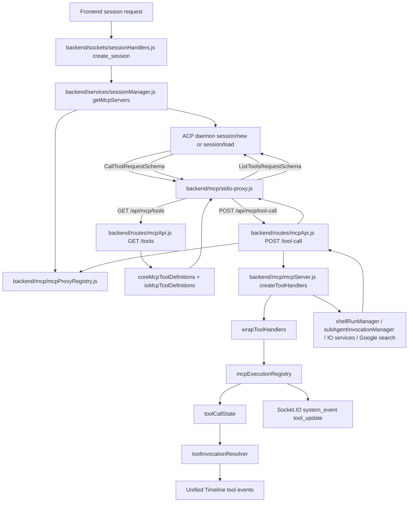

# Feature Doc - MCP Server

AcpUI exposes its MCP tools through a two-process bridge: ACP talks to a per-session stdio proxy, and the proxy talks to the backend HTTP API for tool definitions and tool execution. The contracts that matter are tool advertisement, context resolution, cancellation propagation, and execution metadata projection into the AcpUI tool state pipeline.

## Overview

### What It Does
- Builds MCP server entries for ACP `session/new` and `session/load` requests.
- Starts `backend/mcp/stdio-proxy.js` as the MCP protocol process for each configured ACP session.
- Binds each proxy process to provider/session scope through `mcpProxyRegistry`.
- Serves enabled MCP tool definitions through `GET /api/mcp/tools`.
- Executes MCP tool calls through `POST /api/mcp/tool-call`.
- Wraps all registered handlers with `mcpExecutionRegistry` so AcpUI UX tools produce stable UI metadata.
- Propagates MCP cancellation and HTTP disconnects to backend handlers through `AbortSignal`.
- Correlates MCP execution records with later provider tool events through `toolInvocationResolver` and `toolCallState`.

### Why This Matters
- MCP protocol handling stays isolated from long-running backend tool execution.
- Provider and ACP session scope survive the stdio boundary.
- Tool metadata, titles, file paths, and output remain stable even when provider tool updates are sparse.
- Long-running tools can keep their HTTP request open without backend timeouts.
- Feature flags, tool definitions, handlers, and tests must stay synchronized for agents to see and call the correct tools.

### Architectural Role
Backend MCP orchestration, stdio-to-HTTP transport, tool execution dispatch, and Tool System V2 metadata projection.

## How It Works - End-to-End Flow

1. Backend mounts the MCP API before static routes.

File: `backend/server.js` (Startup block: `app.use('/api/mcp', ...)`, `mcpApiRouter = createMcpApiRoutes(io)`)

The server registers `/api/mcp` before the SPA/static route chain. Requests receive `503` until `mcpApiRouter` is assigned after Socket.IO exists, because MCP handlers need the shared `io` instance for live tool-state events.

```javascript
// FILE: backend/server.js (Startup block: /api/mcp route mount)
let mcpApiRouter = null;
app.use('/api/mcp', (req, res, next) => {
  if (mcpApiRouter) return mcpApiRouter(req, res, next);
  res.status(503).json({ error: 'MCP API not ready' });
});

setIo(io);
mcpApiRouter = createMcpApiRoutes(io);
```

2. Session creation and loading request MCP server entries.

File: `backend/sockets/sessionHandlers.js` (Socket event: `create_session`)
File: `backend/services/sessionManager.js` (Functions: `getMcpServers`, `loadSessionIntoMemory`)

The `create_session` socket handler includes `mcpServers` in ACP `session/new` and `session/load` requests. Existing ACP sessions pass `acpSessionId` into `getMcpServers`; newly created ACP sessions call `bindMcpProxy(getMcpProxyIdFromServers(newMcpServers), ...)` after ACP returns the session id. Hot-loaded pinned sessions use `loadSessionIntoMemory`, which sends ACP `session/load` with `mcpServers` and binds the proxy id to the loaded session.

```javascript
// FILE: backend/sockets/sessionHandlers.js (Socket event: create_session)
const newMcpServers = getMcpServers(resolvedProviderId);
result = await acpClient.transport.sendRequest('session/new', {
  cwd: sessionCwd,
  mcpServers: newMcpServers,
  ...sessionParams
});
bindMcpProxy(getMcpProxyIdFromServers(newMcpServers), {
  providerId: resolvedProviderId,
  acpSessionId: result.sessionId
});
```

3. MCP server builders create stdio proxy launch config.

File: `backend/services/sessionManager.js` (Function: `getMcpServers`)
File: `backend/mcp/mcpServer.js` (Function: `getMcpServers`)

Both builders read `provider.config.mcpName`, create a proxy binding, point ACP at `backend/mcp/stdio-proxy.js`, and inject environment values required by the proxy. `backend/services/sessionManager.js` is used by user session load/create paths; `backend/mcp/mcpServer.js` is used by sub-agent session creation through `subAgentInvocationManager`.

```javascript
// FILE: backend/mcp/mcpServer.js (Function: getMcpServers)
const provider = getProvider(providerId);
const name = provider.config.mcpName;
if (!name) return [];
const mcpServerMeta = providerModule.getMcpServerMeta?.();
const proxyId = createMcpProxyBinding({ providerId: provider.id, acpSessionId });
return [{
  name,
  command: 'node',
  args: [proxyPath],
  env: [
    { name: 'ACP_SESSION_PROVIDER_ID', value: String(provider.id) },
    { name: 'ACP_UI_MCP_PROXY_ID', value: proxyId },
    { name: 'ACP_UI_MCP_PROXY_AUTH_TOKEN', value: String(proxyAuthToken || '') },
    { name: 'BACKEND_PORT', value: String(process.env.BACKEND_PORT || 3005) },
    { name: 'NODE_TLS_REJECT_UNAUTHORIZED', value: '0' }
  ],
  ...(mcpServerMeta ? { _meta: mcpServerMeta } : {})
}];
```

4. Proxy bindings preserve provider/session scope.

File: `backend/mcp/mcpProxyRegistry.js` (Functions: `createMcpProxyBinding`, `bindMcpProxy`, `resolveMcpProxy`, `getMcpProxyIdFromServers`)

`createMcpProxyBinding` returns an id like `mcp-proxy-...` and stores provider id, optional ACP session id, a per-proxy auth token, creation time, bound time, and last-seen time. `resolveMcpProxy` is the primary lookup used by `/api/mcp/*`; `/api/mcp/tool-call` now requires a valid proxy id, matching proxy auth token, and bound ACP session.

```javascript
// FILE: backend/mcp/mcpProxyRegistry.js (Functions: createMcpProxyBinding, resolveMcpProxy)
const proxyId = `mcp-proxy-${randomUUID()}`;
proxies.set(proxyId, {
  proxyId,
  providerId,
  acpSessionId,
  createdAt: now,
  boundAt: acpSessionId ? now : null,
  lastSeenAt: now
});
```

5. ACP starts the stdio proxy and the proxy fetches definitions.

File: `backend/mcp/stdio-proxy.js` (Functions: `runProxy`, `backendFetch`)

The proxy reads `ACP_SESSION_PROVIDER_ID`, `ACP_UI_MCP_PROXY_ID`, `ACP_UI_MCP_PROXY_AUTH_TOKEN`, and `BACKEND_PORT`, then calls `GET /api/mcp/tools`. It forwards `x-acpui-mcp-proxy-auth` on backend calls. `backendFetch` retries ordinary fetch failures up to three attempts and immediately rethrows aborts.

```javascript
// FILE: backend/mcp/stdio-proxy.js (Function: runProxy)
const providerId = process.env.ACP_SESSION_PROVIDER_ID || '';
const proxyId = process.env.ACP_UI_MCP_PROXY_ID || '';
const proxyAuthToken = process.env.ACP_UI_MCP_PROXY_AUTH_TOKEN || '';
const { tools, serverName } = await backendFetch(`/api/mcp/tools${query}`);
```

6. `GET /api/mcp/tools` returns enabled tool definitions.

File: `backend/routes/mcpApi.js` (Route: `GET /tools`, Function: `resolveToolContext`)
File: `backend/mcp/coreMcpToolDefinitions.js` (Functions: `getInvokeShellMcpToolDefinition`, `getSubagentsMcpToolDefinition`, `getCounselMcpToolDefinition`, `getCheckSubagentsMcpToolDefinition`, `getAbortSubagentsMcpToolDefinition`)
File: `backend/mcp/ioMcpToolDefinitions.js` (Functions: `getIoMcpToolDefinitions`, `getGoogleSearchMcpToolDefinitions`)

The route resolves provider context from the proxy id, uses provider model config to enrich the sub-agent model description, and returns `{ tools, serverName }`. Feature flags from `backend/services/mcpConfig.js` decide which definitions are advertised.

```javascript
// FILE: backend/routes/mcpApi.js (Route: GET /tools)
const context = resolveToolContext(query.providerId || null, query.proxyId || null);
const providerConfig = getProvider(context.providerId).config;
const serverName = providerConfig.mcpName || 'acpui';
const toolList = [];
if (isInvokeShellMcpEnabled()) toolList.push(getInvokeShellMcpToolDefinition());
if (isSubagentsMcpEnabled()) toolList.push(getSubagentsMcpToolDefinition({ modelDescription }));
if (isCounselMcpEnabled()) toolList.push(getCounselMcpToolDefinition());
if (isIoMcpEnabled()) toolList.push(...getIoMcpToolDefinitions());
if (isGoogleSearchMcpEnabled()) toolList.push(...getGoogleSearchMcpToolDefinitions());
res.json({ tools: toolList, serverName });
```

7. The stdio proxy registers MCP SDK handlers.

File: `backend/mcp/stdio-proxy.js` (Function: `buildServerInstructions`, Handlers: `ListToolsRequestSchema`, `CallToolRequestSchema`)

The proxy creates an MCP `Server` with tool capabilities and server instructions generated from the fetched tools. `ListToolsRequestSchema` returns definitions while preserving optional `title`, `annotations`, `execution`, `outputSchema`, and `_meta` fields.

```javascript
// FILE: backend/mcp/stdio-proxy.js (Handler: ListToolsRequestSchema)
server.setRequestHandler(ListToolsRequestSchema, async () => ({
  tools: tools.map(t => {
    const tool = { name: t.name, description: t.description, inputSchema: t.inputSchema };
    if (t.title) tool.title = t.title;
    if (t.annotations) tool.annotations = t.annotations;
    if (t.execution) tool.execution = t.execution;
    if (t.outputSchema) tool.outputSchema = t.outputSchema;
    if (t._meta) tool._meta = t._meta;
    return tool;
  })
}));
```

8. `call_tool` requests are forwarded to the backend.

File: `backend/mcp/stdio-proxy.js` (Handler: `CallToolRequestSchema`)

The proxy forwards the tool name, arguments, provider id, proxy id, MCP request id, request metadata, cancellation signal, and `x-acpui-mcp-proxy-auth` token to `POST /api/mcp/tool-call`.

```javascript
// FILE: backend/mcp/stdio-proxy.js (Handler: CallToolRequestSchema)
return await backendFetch('/api/mcp/tool-call', {
  method: 'POST',
  body: JSON.stringify({
    tool: name,
    args: args || {},
    providerId: providerId || null,
    proxyId: proxyId || null,
    mcpRequestId: extra?.requestId ?? null,
    requestMeta: request.params?._meta || extra?._meta || null
  }),
  signal: extra?.signal
});
```

9. `POST /api/mcp/tool-call` authenticates the proxy boundary, resolves bound context, disables timeouts, and invokes the handler.

File: `backend/routes/mcpApi.js` (Route: `POST /tool-call`, Functions: `createToolCallAbortSignal`, `canWriteResponse`)

The route disables request, response, and socket timeouts, returns `404` for unknown tools, creates an `AbortSignal` tied to request abort and response close events, enriches handler arguments with resolved context, and writes only when the response is still open.

```javascript
// FILE: backend/routes/mcpApi.js (Route: POST /tool-call)
req.setTimeout(0);
res.setTimeout(0);
if (req.socket) req.socket.setTimeout(0);

const resolvedExecution = resolveExecutionContext(providerId || null, proxyId || null, proxyAuthToken);
if (resolvedExecution.error) return res.status(resolvedExecution.status).json({ error: resolvedExecution.error });
const context = resolvedExecution.context;
const handlerArgs = { ...(args || {}) };
if (context.providerId) handlerArgs.providerId = context.providerId;
if (context.acpSessionId) handlerArgs.acpSessionId = context.acpSessionId;
if (context.mcpProxyId) handlerArgs.mcpProxyId = context.mcpProxyId;
handlerArgs.abortSignal = abortSignal;
const result = await handler(handlerArgs);
if (canWriteResponse(res, abortSignal)) res.json(result);
```

10. `createToolHandlers` builds the executable tool map.

File: `backend/mcp/mcpServer.js` (Function: `createToolHandlers`, Handler anchors: `runShellInvocation`, `runSubagentInvocation`, `runCheckSubagentsInvocation`, `runAbortSubagentsInvocation`, `runCounselInvocation`)
File: `backend/mcp/ioMcpToolHandlers.js` (Functions: `createIoMcpToolHandlers`, `createGoogleSearchMcpToolHandlers`)

Core tools are registered behind `tools.invokeShell`, `tools.subagents`, and `tools.counsel`. `ux_check_subagents` and `ux_abort_subagents` are registered whenever sub-agents or counsel are enabled. Optional IO and Google search handlers are registered behind `tools.io` and `tools.googleSearch`. Shell execution delegates to `shellRunManager.startPreparedRun` and forwards route abort signals so cancelled MCP calls stop active shell runs; sub-agent start calls delegate to `subAgentInvocationManager.runInvocation`; status calls delegate to `subAgentInvocationManager.getInvocationStatus` with `waitForCompletion` deciding whether the configured wait timeout is used; status tool titles include either `Check Subagents: Waiting for agents to finish` or `Check Subagents: Quick status check`; abort calls delegate to `subAgentInvocationManager.cancelInvocation` and then return an immediate status payload; counsel builds configured role prompts and delegates through the sub-agent invocation path.

```javascript
// FILE: backend/mcp/mcpServer.js (Function: createToolHandlers)
if (isInvokeShellMcpEnabled()) tools[ACP_UX_TOOL_NAMES.invokeShell] = runShellInvocation;
if (isSubagentsMcpEnabled()) tools[ACP_UX_TOOL_NAMES.invokeSubagents] = runSubagentInvocation;
if (isCounselMcpEnabled()) tools[ACP_UX_TOOL_NAMES.invokeCounsel] = runCounselInvocation;
if (isSubagentsMcpEnabled() || isCounselMcpEnabled()) {
  tools[ACP_UX_TOOL_NAMES.checkSubagents] = runCheckSubagentsInvocation;
  tools[ACP_UX_TOOL_NAMES.abortSubagents] = runAbortSubagentsInvocation;
}
if (isIoMcpEnabled()) Object.assign(tools, createIoMcpToolHandlers());
if (isGoogleSearchMcpEnabled()) Object.assign(tools, createGoogleSearchMcpToolHandlers());
return wrapToolHandlers(tools, io);
```

11. `wrapToolHandlers` projects MCP execution into AcpUI tool state.

File: `backend/mcp/mcpServer.js` (Function: `wrapToolHandlers`)
File: `backend/services/tools/mcpExecutionRegistry.js` (Functions: `begin`, `complete`, `fail`, `publicMcpToolInput`, `toolCallIdFromMcpContext`)
File: `backend/services/tools/toolCallState.js` (Functions: `upsert`, `get`, `clear`)

Each registered handler is wrapped. The wrapper removes internal fields from public input, starts an MCP execution record, completes or fails the record after the handler resolves, and returns the original handler result. `mcpExecutionRegistry.begin` emits an immediate `system_event` tool update when provider id, ACP session id, tool call id, and title are available.

```javascript
// FILE: backend/mcp/mcpServer.js (Function: wrapToolHandlers)
wrapped[toolName] = async (args = {}) => {
  const input = publicMcpToolInput(toolName, args);
  const execution = mcpExecutionRegistry.begin({
    io,
    providerId: args.providerId,
    sessionId: args.acpSessionId,
    acpSessionId: args.acpSessionId,
    mcpProxyId: args.mcpProxyId,
    mcpRequestId: args.mcpRequestId,
    requestMeta: args.requestMeta,
    toolName,
    input
  });
  try {
    const result = await handler(args);
    mcpExecutionRegistry.complete(execution, result);
    return result;
  } catch (err) {
    mcpExecutionRegistry.fail(execution, err);
    throw err;
  }
};
```

12. Provider tool events are reconciled with MCP execution metadata.

File: `backend/services/tools/toolInvocationResolver.js` (Functions: `resolveToolInvocation`, `applyInvocationToEvent`)
File: `backend/services/tools/mcpExecutionRegistry.js` (Function: `invocationFromMcpExecution`)

Provider updates can arrive with generic or incomplete tool information. `resolveToolInvocation` merges provider-extracted details, cached `toolCallState`, and `mcpExecutionRegistry` records. `applyInvocationToEvent` applies canonical tool names, MCP server names, file paths, titles, and `isAcpUxTool` flags to timeline events.

## Architecture Diagram



## Critical Contract

The MCP server contract has four synchronized layers:

1. Tool names and definitions.
- Canonical names live in `backend/services/tools/acpUxTools.js` (`ACP_UX_TOOL_NAMES`).
- Advertised schemas come from `coreMcpToolDefinitions.js` and `ioMcpToolDefinitions.js`.
- `GET /api/mcp/tools` must advertise only names that have registered handlers for the same feature-flag state.

2. Proxy-scoped context.
- `ACP_UI_MCP_PROXY_ID` is the stable key across the stdio boundary.
- `ACP_UI_MCP_PROXY_AUTH_TOKEN` authenticates stdio proxy calls into `/api/mcp/tool-call`.
- `/api/mcp/tool-call` must reject missing/invalid proxy ids, auth tokens, unbound proxy sessions, and provider mismatches.
- Handler arguments must include `providerId`, `acpSessionId`, and `mcpProxyId` from the resolved proxy binding.

3. Cancellation and timeout behavior.
- The proxy forwards MCP cancellation through `fetch(..., { signal })`.
- `POST /tool-call` creates an `AbortSignal` from request abort and response close events.
- Long-running calls rely on `req.setTimeout(0)`, `res.setTimeout(0)`, and `req.socket.setTimeout(0)`.

4. Tool execution identity and output projection.
- `wrapToolHandlers` must surround every registered handler.
- `mcpExecutionRegistry.begin`, `complete`, and `fail` own the canonical MCP execution state.
- `toolCallIdFromMcpContext` recognizes `requestMeta.toolCallId`, `requestMeta.tool_call_id`, `requestMeta.callId`, and MCP-shaped request ids.
- Handlers return MCP content objects such as `{ content: [{ type: 'text', text: '...' }] }`.

## Configuration/Data Flow

### Provider and Runtime Configuration

File: `backend/services/sessionManager.js` (Function: `getMcpServers`)
File: `backend/mcp/mcpServer.js` (Function: `getMcpServers`)
File: `backend/services/mcpConfig.js` (Functions: `getMcpConfig`, `getSubagentsMcpConfig`, `isInvokeShellMcpEnabled`, `isSubagentsMcpEnabled`, `isCounselMcpEnabled`, `isIoMcpEnabled`, `isGoogleSearchMcpEnabled`)

| Config | Owner | Effect |
|---|---|---|
| `provider.config.mcpName` | Provider config loaded by `providerLoader` | Enables MCP for that provider and supplies the MCP server display name. |
| Provider hook `getMcpServerMeta()` | Provider module | Adds optional server `_meta` to the ACP `mcpServers` entry. |
| `MCP_CONFIG` | Environment variable | Overrides the default `configuration/mcp.json` path. |
| `tools.invokeShell` | `configuration/mcp.json` | Advertises and registers `ux_invoke_shell`. |
| `tools.subagents` | `configuration/mcp.json` | Advertises and registers `ux_invoke_subagents`; also enables `ux_check_subagents` and `ux_abort_subagents`. |
| `tools.counsel` | `configuration/mcp.json` | Advertises and registers `ux_invoke_counsel`; also enables `ux_check_subagents` and `ux_abort_subagents`. |
| `subagents.statusWaitTimeoutMs` / `subagents.statusPollIntervalMs` | `configuration/mcp.json` | Controls how long `ux_check_subagents` waits by default and how often it polls before returning partial progress. |
| `tools.io` | `configuration/mcp.json` | Advertises and registers IO tools. |
| `tools.googleSearch` plus `googleSearch.apiKey` | `configuration/mcp.json` | Advertises and registers `ux_google_web_search` only when both are configured. |
| `io.*` | `configuration/mcp.json` | Controls file IO roots, auto-allow behavior, and byte limits used by IO handlers. |
| `webFetch.*` | `configuration/mcp.json` | Controls protocol, host, CIDR, byte, timeout, and redirect limits for `ux_web_fetch`. |
| `googleSearch.*` | `configuration/mcp.json` | Controls API key, timeout, and output size for Google search. |
| `BACKEND_PORT` | Runtime environment and proxy env | Tells the stdio proxy which backend port to call. |
| `NODE_TLS_REJECT_UNAUTHORIZED` | MCP server env and proxy process env | Allows localhost backend calls with local SSL certificates. |
| `DEFAULT_WORKSPACE_CWD` | Runtime environment | Supplies default working directory for shell and IO contexts when a call omits `cwd` or `dir_path`. |
| `MAX_SHELL_RESULT_LINES` | Runtime environment | Caps shell result lines in `getMaxShellResultLines`. |

Missing or malformed MCP config produces a disabled config through `disabledConfig`; all config-controlled tools are disabled in that state. Google search also requires a non-empty `googleSearch.apiKey`.

### Request and State Shapes

MCP server entry passed to ACP:

```json
{
  "name": "provider-mcp-name",
  "command": "node",
  "args": ["absolute/path/to/backend/mcp/stdio-proxy.js"],
  "env": [
    { "name": "ACP_SESSION_PROVIDER_ID", "value": "provider-id" },
    { "name": "ACP_UI_MCP_PROXY_ID", "value": "mcp-proxy-id" },
    { "name": "ACP_UI_MCP_PROXY_AUTH_TOKEN", "value": "mcp-proxy-auth-token" },
    { "name": "BACKEND_PORT", "value": "3005" },
    { "name": "NODE_TLS_REJECT_UNAUTHORIZED", "value": "0" }
  ],
  "_meta": { "provider_namespace": { "option": true } }
}
```

`GET /api/mcp/tools` response:

```json
{
  "serverName": "provider-mcp-name",
  "tools": [
    {
      "name": "ux_invoke_shell",
      "title": "Interactive shell",
      "description": "Execute a shell command...",
      "annotations": { "readOnlyHint": false, "destructiveHint": true },
      "_meta": { "acpui/concurrentInvocationsSupported": true },
      "inputSchema": { "type": "object", "required": ["description", "command"] }
    }
  ]
}
```

Proxy-to-backend tool call body:

```json
{
  "tool": "ux_invoke_shell",
  "args": { "description": "Run tests", "command": "npm test", "cwd": "D:/Git/AcpUI" },
  "providerId": "provider-id",
  "proxyId": "mcp-proxy-id",
  "mcpRequestId": 42,
  "requestMeta": { "toolCallId": "tool-call-id" }
}
```

Handler arguments after route enrichment:

```json
{
  "description": "Run tests",
  "command": "npm test",
  "cwd": "D:/Git/AcpUI",
  "providerId": "provider-id",
  "acpSessionId": "acp-session-id",
  "mcpProxyId": "mcp-proxy-id",
  "mcpRequestId": 42,
  "requestMeta": { "toolCallId": "tool-call-id" },
  "abortSignal": "AbortSignal"
}
```

Tool state projection written by `mcpExecutionRegistry`:

```json
{
  "toolCallId": "tool-call-id",
  "identity": {
    "kind": "acpui_mcp",
    "canonicalName": "ux_invoke_shell",
    "rawName": "ux_invoke_shell",
    "mcpServer": "provider-mcp-name",
    "mcpToolName": "ux_invoke_shell"
  },
  "input": { "description": "Run tests", "command": "npm test", "cwd": "D:/Git/AcpUI" },
  "display": { "title": "Invoke Shell: Run tests", "titleSource": "mcp_handler" },
  "category": { "toolCategory": "shell", "isShellCommand": true, "isFileOperation": false },
  "output": "text returned by the MCP result"
}
```

## Component Reference

### Backend Lifecycle and Transport

| Area | File | Anchors | Purpose |
|---|---|---|---|
| Server | `backend/server.js` | `createMcpApiRoutes`, `app.use('/api/mcp', ...)`, `mcpApiRouter` | Mounts the lazy MCP API bridge before static routes. |
| Socket sessions | `backend/sockets/sessionHandlers.js` | Socket event `create_session`, `bindMcpProxy`, `getMcpProxyIdFromServers` | Adds MCP server entries to ACP `session/new` and `session/load` requests. |
| Session hot load | `backend/services/sessionManager.js` | `getMcpServers`, `loadSessionIntoMemory` | Builds user-session MCP server entries and hot-loads pinned sessions. |
| MCP server helpers | `backend/mcp/mcpServer.js` | `getMcpServers`, `createToolHandlers`, `wrapToolHandlers`, `getMaxShellResultLines` | Builds sub-agent MCP server entries and executable handler maps. |
| Proxy registry | `backend/mcp/mcpProxyRegistry.js` | `createMcpProxyBinding`, `bindMcpProxy`, `resolveMcpProxy`, `expireMcpProxyBindings`, `getMcpProxyIdFromServers`, `clearMcpProxyRegistry` | Stores proxy-to-provider/session bindings. |
| Stdio proxy | `backend/mcp/stdio-proxy.js` | `runProxy`, `backendFetch`, `buildServerInstructions`, `ListToolsRequestSchema`, `CallToolRequestSchema` | Speaks MCP over stdio and forwards definitions/calls over HTTPS. |
| MCP routes | `backend/routes/mcpApi.js` | `createMcpApiRoutes`, `GET /tools`, `POST /tool-call`, `resolveToolContext`, `createToolCallAbortSignal`, `canWriteResponse` | Serves tool definitions and dispatches tool calls to handlers. |

### Tool Definitions, Handlers, and State

| Area | File | Anchors | Purpose |
|---|---|---|---|
| Tool names | `backend/services/tools/acpUxTools.js` | `ACP_UX_TOOL_NAMES`, `ACP_UX_CORE_TOOL_NAMES`, `ACP_UX_IO_TOOL_CONFIG`, `isAcpUxToolName`, `acpUxIoToolConfig` | Defines canonical MCP tool names and UI categories. |
| Tool title helpers | `backend/services/tools/acpUiToolTitles.js` | `acpUiToolTitle`, `subAgentCheckToolTitle`, `basenameForToolPath` | Builds handler-visible titles for IO/search tools and wait-vs-quick sub-agent status checks. |
| Core schemas | `backend/mcp/coreMcpToolDefinitions.js` | `getInvokeShellMcpToolDefinition`, `getSubagentsMcpToolDefinition`, `getCounselMcpToolDefinition`, `getCheckSubagentsMcpToolDefinition`, `getAbortSubagentsMcpToolDefinition` | Provides JSON Schema and annotations for core MCP tools. |
| IO schemas | `backend/mcp/ioMcpToolDefinitions.js` | `getIoMcpToolDefinitions`, `getGoogleSearchMcpToolDefinitions` | Provides JSON Schema and annotations for optional IO/search tools. |
| IO handlers | `backend/mcp/ioMcpToolHandlers.js` | `createIoMcpToolHandlers`, `createGoogleSearchMcpToolHandlers` | Implements optional file, search, and fetch tool behavior. |
| MCP config | `backend/services/mcpConfig.js` | `getMcpConfig`, `resetMcpConfigForTests`, `isInvokeShellMcpEnabled`, `isSubagentsMcpEnabled`, `isCounselMcpEnabled`, `isIoMcpEnabled`, `isGoogleSearchMcpEnabled`, `getSubagentsMcpConfig`, `getIoMcpConfig`, `getWebFetchMcpConfig`, `getGoogleSearchMcpConfig` | Loads and normalizes feature flags and per-tool limits. |
| Execution registry | `backend/services/tools/mcpExecutionRegistry.js` | `McpExecutionRegistry`, `mcpExecutionRegistry`, `begin`, `complete`, `fail`, `find`, `publicMcpToolInput`, `toolCallIdFromMcpContext`, `invocationFromMcpExecution` | Tracks MCP executions and projects canonical tool metadata. |
| Tool state cache | `backend/services/tools/toolCallState.js` | `upsert`, `get`, `clear` | Stores timeline-visible tool invocation metadata. |
| Invocation resolver | `backend/services/tools/toolInvocationResolver.js` | `resolveToolInvocation`, `applyInvocationToEvent` | Merges provider updates with cached MCP execution state. |
| Shell runner | `backend/services/shellRunManager.js` | `startPreparedRun`, `setIo` | Owns terminal-backed shell execution for `ux_invoke_shell`. |
| Sub-agent manager | `backend/mcp/subAgentInvocationManager.js` | `runInvocation`, `getInvocationStatus`, `trackSubAgentParent`, `cancelInvocation`, `cancelAllForParent`, `getMcpServersFn`, `bindMcpProxyFn` | Owns async sub-agent start, status polling, idempotency, room joins, and cancellation. |
| Counsel config | `backend/services/counselConfig.js` | `loadCounselConfig` | Provides role prompts used by `ux_invoke_counsel`. |

### Tests

| Area | File | Anchors | Purpose |
|---|---|---|---|
| API routes | `backend/test/mcpApi.test.js` | `MCP API Routes`, `GET /tools returns tool list with JSON Schema`, `GET /tools hides disabled core tools`, `POST /tool-call passes resolved proxy context to handlers`, `POST /tool-call aborts the handler signal when the request fires the "aborted" event`, `POST /tool-call aborts the handler signal when the response closes before completion` | Verifies `/api/mcp/*` definitions, dispatch, context, errors, and abort wiring. |
| Server helpers | `backend/test/mcpServer.test.js` | `mcpServer`, `getMcpServers returns server config`, `getMcpServers attaches _meta when getMcpServerMeta returns a value`, `core MCP feature flags`, `optional IO MCP tools`, `ux_invoke_shell`, `ux_invoke_subagents`, `ux_check_subagents`, `ux_abort_subagents`, `ux_invoke_counsel` | Verifies server config, feature-gated handlers, wrapper projection, shell behavior, and sub-agent behavior. |
| Stdio proxy | `backend/test/stdio-proxy.test.js` | `stdio-proxy`, `runs the proxy lifecycle`, `handles fetch errors with retry`, `handles ListTools and CallTool requests`, `throws error after max retries in backendFetch`, `does not retry when fetch throws an AbortError` | Verifies proxy startup, list/call forwarding, metadata passthrough, retry, and abort behavior. |
| Proxy registry | `backend/test/mcpProxyRegistry.test.js` | `mcpProxyRegistry`, `creates and resolves a pending proxy binding`, `creates pre-bound proxy bindings for known sessions`, `binds pending proxy bindings after session creation`, `rejects provider mismatches when binding`, `expires only unbound proxy bindings`, `extracts proxy id from MCP server env` | Verifies proxy binding lifecycle and extraction from `mcpServers`. |
| Session manager | `backend/test/sessionManager.test.js` | `sessionManager`, `getMcpServers`, `should perform full hot-load lifecycle` | Verifies session-manager MCP entries and hot-load proxy binding. |
| Sub-agent manager | `backend/test/subAgentInvocationManager.test.js` | `SubAgentInvocationManager`, `starts asynchronously and returns completed results through the status call`, `joins an active invocation when the idempotency key repeats`, `reports the active invocation instead of starting another batch for the same parent chat`, `aborts and cancels sub-agents when the tool call abort signal fires` | Verifies async sub-agent session creation, status polling, active-invocation enforcement, idempotency, and cancellation. |
| Invocation resolver | `backend/test/toolInvocationResolver.test.js` | `toolInvocationResolver`, `prefers centrally recorded MCP execution details over provider generic titles`, `records sub-agent check title from waitForCompletion input`, `can claim a recent MCP execution when the provider tool id arrives later` | Verifies provider event reconciliation with MCP execution records. |
| Tool title helpers | `backend/test/acpUiToolTitles.test.js` | `acpUiToolTitles`, `titles sub-agent status checks by wait mode`, `accepts alternate false encodings for quick sub-agent checks` | Verifies shared AcpUI tool display titles. |
| Feature flags | `backend/test/mcpConfig.test.js` | `MCP config`, `disables config-controlled tools when the config is missing`, `disables config-controlled tools when the config is malformed`, `reads enabled tools from configuration/mcp.json shape`, `normalizes IO, web fetch, and Google search settings`, `disables Google search when enabled without an MCP config API key` | Verifies config parsing and fail-closed behavior. |
| Server route order | `backend/test/server.test.js` | `Express Server & Routes`, `should return 503 for MCP API if not ready` | Verifies lazy MCP API readiness behavior. |

## Gotchas

1. Keep definitions and handlers synchronized.
- Problem: a tool can be advertised by `GET /api/mcp/tools` but missing from `createToolHandlers`, or registered as a handler but absent from the advertised schemas.
- Detection: compare `ACP_UX_TOOL_NAMES`, definition modules, `createToolHandlers`, and `mcpApi.test.js`/`mcpServer.test.js` expectations.

2. Keep both MCP server builders equivalent.
- Problem: user sessions use `backend/services/sessionManager.js`; sub-agent sessions use `backend/mcp/mcpServer.js`.
- Detection: check both `getMcpServers` functions for the same env variables, proxy binding behavior, and `_meta` behavior.

3. Bind new-session proxies after ACP returns the session id.
- Problem: a `session/new` MCP server entry has a proxy id before the ACP session id exists.
- Detection: confirm `bindMcpProxy(getMcpProxyIdFromServers(newMcpServers), ...)` runs after `session/new`, and confirm `mcpProxyRegistry.test.js` covers pending-to-bound transitions.

4. Enforce proxy auth and bound-session context for tool execution.
- Problem: direct HTTP callers can bypass the intended stdio MCP boundary if `/tool-call` accepts unbound context.
- Detection: `POST /tool-call rejects unauthenticated direct calls`, `rejects unknown proxy ids`, `rejects proxies missing session context`, and `rejects fallback provider mismatches` should all pass.

5. Preserve timeout disabling for long-running tools.
- Problem: shell, sub-agent, and counsel calls can run longer than default HTTP timeouts.
- Detection: `POST /tool-call` must keep `req.setTimeout(0)`, `res.setTimeout(0)`, and `req.socket.setTimeout(0)`.

6. Cancellation crosses two boundaries.
- Problem: MCP cancellation reaches the proxy as `extra.signal`, while browser/backend disconnects appear as request or response events.
- Detection: `stdio-proxy.test.js` checks fetch `signal`; `mcpApi.test.js` checks request `aborted` and response `close` behavior; `mcpServer.test.js`, `shellRunManager.test.js`, and `ioMcpGoogleSearch.test.js` verify shell and search handlers consume forwarded abort signals.

7. Handler wrapping owns UI metadata.
- Problem: bypassing `wrapToolHandlers` skips `mcpExecutionRegistry` and loses canonical names, titles, file paths, categories, and output projection.
- Detection: tool updates should appear in `toolCallState` and Socket.IO `system_event` calls in `mcpServer.test.js`.

8. Internal handler args must not become public tool input.
- Problem: provider/session/request fields can leak into displayed tool input if `publicMcpToolInput` is bypassed.
- Detection: registry input should include user-provided arguments such as `description`, `command`, `cwd`, `pattern`, or `file_path`, not `providerId`, `acpSessionId`, `requestMeta`, or `abortSignal`.

9. Tool call id correlation has specific accepted fields.
- Problem: missing or unrecognized ids make MCP execution records harder to claim from provider events.
- Detection: use `requestMeta.toolCallId`, `requestMeta.tool_call_id`, `requestMeta.callId`, or MCP-shaped request ids accepted by `toolCallIdFromMcpContext`.

10. Google search is gated by both a tool flag and API key.
- Problem: `tools.googleSearch` alone is not enough to advertise or register `ux_google_web_search`.
- Detection: `mcpConfig.test.js`, `mcpApi.test.js`, and `mcpServer.test.js` all check the API-key gate.

## Unit Tests

### Required Backend Test Targets

Run these when changing MCP server creation, stdio proxy behavior, `/api/mcp/*`, handler wrapping, or execution metadata:

```powershell
cd backend; npx vitest run test/mcpApi.test.js test/mcpServer.test.js test/stdio-proxy.test.js test/mcpProxyRegistry.test.js test/sessionManager.test.js test/subAgentInvocationManager.test.js test/toolInvocationResolver.test.js test/acpUiToolTitles.test.js test/mcpConfig.test.js test/server.test.js
```

### High-Value Test Names

- `backend/test/mcpApi.test.js`
  - `GET /tools returns tool list with JSON Schema`
  - `GET /tools hides disabled core tools`
  - `GET /tools advertises IO tools when MCP config enables them`
  - `GET /tools advertises Google search only when MCP config enables it`
  - `POST /tool-call passes resolved proxy context to handlers`
  - `POST /tool-call aborts the handler signal when the request fires the "aborted" event`
  - `POST /tool-call aborts the handler signal when the response closes before completion`
- `backend/test/mcpServer.test.js`
  - `getMcpServers returns server config`
  - `getMcpServers attaches _meta when getMcpServerMeta returns a value`
  - `registers core handlers when MCP config enables them`
  - `registers IO handlers when MCP config enables IO`
  - `delegates to shellRunManager with session context`
  - `keeps the MCP tool call pending until shell completion`
  - `passes abortSignal through to the sub-agent invocation manager`
  - `deduplicates repeated MCP request ids for the same parent session`
  - `binds the MCP proxy id to the sub-agent ACP session after session/new`
  - `runs counsel through the sub-agent invocation pipeline when the subagents tool is hidden`
- `backend/test/stdio-proxy.test.js`
  - `runs the proxy lifecycle`
  - `handles fetch errors with retry`
  - `handles ListTools and CallTool requests`
  - `does not retry when fetch throws an AbortError`
- `backend/test/mcpProxyRegistry.test.js`
  - `creates and resolves a pending proxy binding`
  - `creates pre-bound proxy bindings for known sessions`
  - `binds pending proxy bindings after session creation`
  - `rejects provider mismatches when binding`
  - `expires only unbound proxy bindings`
  - `extracts proxy id from MCP server env`
- `backend/test/sessionManager.test.js`
  - `should return empty if no mcpName`
  - `should return server config if mcpName exists`
  - `should attach _meta when getMcpServerMeta returns a value`
  - `should perform full hot-load lifecycle`
- `backend/test/toolInvocationResolver.test.js`
  - `prefers centrally recorded MCP execution details over provider generic titles`
  - `can claim a recent MCP execution when the provider tool id arrives later`
- `backend/test/mcpConfig.test.js`
  - `disables config-controlled tools when the config is missing`
  - `disables config-controlled tools when the config is malformed`
  - `reads enabled tools from configuration/mcp.json shape`
  - `normalizes IO, web fetch, and Google search settings`
  - `disables Google search when enabled without an MCP config API key`

## How to Use This Guide

### For implementing/extending this feature
1. Start with `ACP_UX_TOOL_NAMES` in `backend/services/tools/acpUxTools.js` for canonical naming and category metadata.
2. Add or adjust the advertised schema in `backend/mcp/coreMcpToolDefinitions.js` or `backend/mcp/ioMcpToolDefinitions.js`.
3. Add or adjust the handler in `createToolHandlers`, `createIoMcpToolHandlers`, or `createGoogleSearchMcpToolHandlers`.
4. Confirm the handler accepts context fields injected by `POST /tool-call`: `providerId`, `acpSessionId`, `mcpProxyId`, `mcpRequestId`, `requestMeta`, and `abortSignal`.
5. Confirm the handler returns MCP content form: `{ content: [{ type: 'text', text: '...' }] }`.
6. Confirm `wrapToolHandlers` still wraps the handler and that `mcpExecutionRegistry` projects expected identity, input, display, category, file path, and output fields.
7. Update the relevant route, server, proxy, config, registry, and resolver tests listed in Unit Tests.

### For debugging issues with this feature
1. Check `backend/server.js` route order and readiness if `/api/mcp/*` returns `503` or a static fallback response.
2. Inspect the `mcpServers` payload sent with ACP `session/new` or `session/load`; verify `ACP_SESSION_PROVIDER_ID`, `ACP_UI_MCP_PROXY_ID`, `ACP_UI_MCP_PROXY_AUTH_TOKEN`, `BACKEND_PORT`, and optional `_meta`.
3. Resolve the proxy id with `resolveMcpProxy(proxyId)` to confirm provider/session scope.
4. Compare `/api/mcp/tools` output with `createToolHandlers(io)` for the same config flags.
5. Trace a `POST /api/mcp/tool-call` request and verify `x-acpui-mcp-proxy-auth` is present, proxy validation succeeds, and enriched handler args include context and `abortSignal`.
6. Check `mcpExecutionRegistry.find(...)` and `toolCallState.get(...)` when timeline tool titles, categories, or outputs are missing.
7. Check `toolInvocationResolver.resolveToolInvocation` when provider tool events do not match MCP execution metadata.
8. Run the required backend test targets before changing broader MCP behavior.

## Summary
- AcpUI MCP uses a stdio proxy for MCP protocol handling and backend routes for execution.
- `getMcpServers` builds per-session proxy launch config from `provider.config.mcpName`, proxy registry bindings, backend port, and optional provider `_meta`.
- `/api/mcp/tools` advertises schemas from definition modules according to `mcpConfig` feature flags.
- `/api/mcp/tool-call` owns timeout disabling, context resolution, abort signal creation, handler dispatch, and response safety.
- `createToolHandlers` registers core, IO, and search handlers behind the same feature flags used for advertisement.
- `wrapToolHandlers` and `mcpExecutionRegistry` are the canonical bridge from MCP calls to timeline-visible AcpUI tool metadata.
- `requestMeta`, `mcpRequestId`, `providerId`, `acpSessionId`, and `mcpProxyId` are the fields that keep execution records correlated with provider updates.
- The main breakage risk is divergence between canonical tool names, advertised definitions, registered handlers, proxy context, and execution-state projection.
