# Message Bubble UI & Typewriter System

This feature turns backend stream events into a unified assistant timeline and renders that timeline with adaptive typewriter updates, memoized markdown, permission controls, and tool-output panels.

This area is high-risk because correctness depends on per-session stream isolation, event ordering, sticky tool metadata, shell-run routing, and collapse-state synchronization.

---

## Overview

### What It Does
- Queues `token`, `thought`, and `system_event` payloads per ACP session in `streamQueues[acpSessionId]`.
- Drains each session queue through `processBuffer` in event, thought, and token phases.
- Adapts typewriter speed by buffer size while keeping `Message.content` and `Message.timeline` synchronized.
- Renders a single `Message.timeline` with `thought`, `tool`, `text`, and `permission` steps.
- Preserves sticky tool metadata across `tool_start`, `tool_update`, and `tool_end` events.
- Routes shell-run socket events by `shellRunId` into `useShellRunStore` and `ShellToolTerminal`, including input-wait state from `needsInput` / `shellNeedsInput`.
- Renders markdown in stable blocks while streaming and renders tool output through specialized formatters.

### Why This Matters
- The timeline is the assistant message contract consumed by rendering, snapshot persistence, fork controls, and permission handling.
- Event ordering controls whether thoughts, tools, text, and permissions appear in the same order as the agent action stream.
- Metadata merge rules keep file paths, MCP tool names, shell run IDs, and sub-agent invocation IDs attached to the correct tool step.
- Markdown and output rendering can be expensive during active streams; memoized settled blocks and typewriter pacing keep the UI responsive.
- Per-session queue keys prevent cross-session stream bleed when background sessions and sub-agents stream at the same time.

Architectural role: frontend runtime and rendering pipeline, backed by normalized backend stream contracts.

---

## How It Works - End-to-End Flow

1. Backend normalizes ACP updates and emits stream events
- File: `backend/services/acpUpdateHandler.js` (Function: `handleUpdate`)
- File: `backend/services/permissionManager.js` (Class: `PermissionManager`, Methods: `handleRequest`, `respond`)
- Socket events emitted: `token`, `thought`, `system_event`, `stats_push`, `permission_request`.

```javascript
// FILE: backend/services/acpUpdateHandler.js (Function: handleUpdate)
if (update.sessionUpdate === 'agent_message_chunk') {
  acpClient.io.to('session:' + sessionId).emit('token', { providerId, sessionId, text });
}

if (update.sessionUpdate === 'agent_thought_chunk') {
  acpClient.io.to('session:' + sessionId).emit('thought', { providerId, sessionId, text });
}

if (update.sessionUpdate === 'tool_call') {
  acpClient.io.to('session:' + sessionId).emit('system_event', eventToEmit);
}
```

`handleUpdate` delegates provider-specific update normalization to `providerModule.normalizeUpdate`, provider-specific tool display normalization to `providerModule.normalizeTool`, generic tool identity resolution to `resolveToolInvocation`, and handler enrichment to `toolRegistry.dispatch`.

2. Permission requests use a separate backend event
- File: `backend/services/permissionManager.js` (Method: `handleRequest`)
- File: `frontend/src/store/useChatStore.ts` (Action: `handleRespondPermission`)
- Socket events: `permission_request`, `respond_permission`, `save_snapshot`.

```javascript
// FILE: backend/services/permissionManager.js (Method: handleRequest)
io.to('session:' + sessionId).emit('permission_request', {
  id,
  providerId,
  sessionId,
  ...params
});
```

The frontend stores the selected permission option in the matching timeline step and emits `respond_permission` with `providerId`, request `id`, `optionId`, optional `toolCallId`, and `sessionId`.

3. Socket listeners route stream payloads into stores
- File: `frontend/src/hooks/useChatManager.ts` (Hook: `useChatManager`)
- Store actions: `onStreamThought`, `onStreamToken`, `onStreamEvent`, `onStreamDone`, `processBuffer`.
- Socket events listened to: `thought`, `token`, `system_event`, `permission_request`, `token_done`, `stats_push`.

```typescript
// FILE: frontend/src/hooks/useChatManager.ts (Hook: useChatManager)
socket.on('thought', onStreamThought);
socket.on('token', wrappedOnStreamToken);
socket.on('system_event', onStreamEvent);
socket.on('permission_request', (event: StreamEventData) => {
  onStreamEvent({ ...event, type: 'permission_request' });
});
```

`permission_request` checks `useSubAgentStore` first. Sub-agent permissions are stored on the matching sub-agent entry; main-session permissions enter the message timeline through `onStreamEvent`.

4. Assistant placeholder creation anchors each ACP stream
- File: `frontend/src/store/useStreamStore.ts` (Store action: `ensureAssistantMessage`)
- Store fields: `activeMsgIdByAcp`, `useSessionLifecycleStore.sessions`.

```typescript
// FILE: frontend/src/store/useStreamStore.ts (Store action: ensureAssistantMessage)
const newMsgId = `assistant-${Date.now()}`;
set(state => ({
  activeMsgIdByAcp: { ...state.activeMsgIdByAcp, [acpSessionId]: newMsgId }
}));
```

The placeholder message has `role: 'assistant'`, empty `content`, empty `timeline`, `isStreaming: true`, and `turnStartTime`. Every stream mutation for that ACP session targets this active message ID.

5. Tokens and thoughts enqueue per session
- File: `frontend/src/store/useStreamStore.ts` (Store actions: `onStreamThought`, `onStreamToken`)
- Queue items: `{ type: 'thought', data }`, `{ type: 'token', data }`.
- Store fields: `streamQueues`, `isProcessActiveByAcp`, `displayedContentByMsg`.

```typescript
// FILE: frontend/src/store/useStreamStore.ts (Store action: onStreamToken)
if (isProcessActiveByAcp[sessionId]) {
  const existingContent = activeMsgId ? displayedContentByMsg[activeMsgId] : '';
  const backticks = (existingContent.match(/`/g) || []).length;
  if (existingContent.trim().length > 0 && backticks % 2 === 0) {
    prefix = '\n\n:::RESPONSE_DIVIDER:::\n\n';
  }
}
queue.push({ type: 'token', data: prefix + (text || '') });
```

`:::RESPONSE_DIVIDER:::` separates prose after tool or event activity. Backtick parity blocks divider insertion while a code span or fence is open.

6. System events enqueue and mark process activity
- File: `frontend/src/store/useStreamStore.ts` (Store action: `onStreamEvent`)
- Queue item: `{ type: 'event', data: StreamEventData }`.
- Session flag: `isAwaitingPermission` for `permission_request`.

```typescript
// FILE: frontend/src/store/useStreamStore.ts (Store action: onStreamEvent)
queue.push({ type: 'event', data: event });
return {
  isProcessActiveByAcp: { ...state.isProcessActiveByAcp, [sessionId]: true },
  streamQueues: { ...state.streamQueues, [sessionId]: queue }
};
```

This marker lets the next response token decide whether to insert the response divider.

7. `processBuffer` phase 1 scans events before tokens
- File: `frontend/src/store/useStreamStore.ts` (Store action: `processBuffer`, Phase 1 event scan)
- Timeline mutations: permission append, tool append, tool merge.

```typescript
// FILE: frontend/src/store/useStreamStore.ts (Store action: processBuffer)
while (eventScanIdx < queue.length && queue[eventScanIdx].type !== 'token') {
  if (queue[eventScanIdx].type === 'event') {
    if (queue[eventScanIdx].data?.type === 'tool_start' && eventScanIdx > 0) break;
    const action = queue.splice(eventScanIdx, 1)[0];
    // permission_request, tool_start, tool_update, and tool_end mutate the timeline
  } else {
    eventScanIdx++;
  }
}
```

Events are processed immediately up to the first token. `tool_start` waits when thoughts precede it so the active thought step can finish as one thought block. `tool_update`, `tool_end`, and `permission_request` can update visible steps without collapsing the active thought.

8. Tool starts append or merge an in-progress tool step
- File: `frontend/src/store/useStreamStore.ts` (Store action: `processBuffer`, branch: `type === 'tool_start'`)
- Helper functions: `shellRunPatch`, `isShellDescriptionTitle`.

```typescript
// FILE: frontend/src/store/useStreamStore.ts (Store action: processBuffer)
const existingShellIdx = action.data.shellRunId
  ? t.findLastIndex(s => s.type === 'tool' && s.event.shellRunId === action.data.shellRunId)
  : -1;
```

A non-shell or first-seen tool start collapses earlier timeline steps and appends an in-progress tool step. A shell `tool_start` with a `shellRunId` already present in the timeline merges into that existing step, preserving terminal status and avoiding duplicate blank shell cards when ACP and MCP lifecycle events arrive with different tool IDs. If a matching shell snapshot exists in `useShellRunStore.runs`, `shellRunPatch` copies `shellState`, `command`, `cwd`, and the description-derived title into the tool event.

9. Tool updates merge by `SystemEvent.id` or shell run ID
- File: `frontend/src/store/useStreamStore.ts` (Store action: `processBuffer`, branches: `type === 'tool_update'`, `type === 'tool_end'`)
- Sticky fields: `title`, `titleSource`, `toolName`, `canonicalName`, `mcpServer`, `mcpToolName`, `isAcpUxTool`, `toolCategory`, `isShellCommand`, `isFileOperation`, `filePath`, `shellRunId`, `invocationId`, `_fallbackOutput`.

```typescript
// FILE: frontend/src/store/useStreamStore.ts (Store action: processBuffer)
const idx = t.findLastIndex(s =>
  s.type === 'tool' &&
  (s.event.id === id || (action.data.shellRunId && s.event.shellRunId === action.data.shellRunId))
);
t[idx] = {
  ...existingStep,
  event: {
    ...existingStep.event,
    status: status || existingStep.event.status,
    output: (existingStep.event.shellRunId ? existingStep.event.output : output) || existingStep.event.output,
    filePath: filePath || existingStep.event.filePath,
    title: bestTitle,
    titleSource: bestTitleSource || action.data.titleSource || existingStep.event.titleSource,
    toolName: action.data.toolName || existingStep.event.toolName,
    canonicalName: action.data.canonicalName || existingStep.event.canonicalName
  },
  isCollapsed: false
};
```

The merge preserves terminal-owned shell output for `shellRunId` steps, keeps authoritative handler titles, carries file context forward, and stores the first streamed output on `_fallbackOutput` for reload paths. Shell updates prefer `shellRunId` when tool IDs disagree because the terminal run is the stable identity for frontend rendering.

10. File edits can trigger canvas refresh and plan opening
- File: `frontend/src/store/useStreamStore.ts` (Store action: `processBuffer`, callbacks: `onFileEdited`, `onOpenFileInCanvas`)
- Callback origins: `useChatManager(scrollToBottom, onFileEdited, onOpenFileInCanvas)`.

When a completed tool update includes `filePath`, `processBuffer` calls `onFileEdited(filePath)`. Paths ending in `plan.md` also call `onOpenFileInCanvas(filePath)` when that callback is provided.

11. `processBuffer` phase 2 drips thought text
- File: `frontend/src/store/useStreamStore.ts` (Store action: `processBuffer`, Phase 2 thought typewriter)
- Timeline step: `{ type: 'thought', content, isCollapsed }`.

```typescript
// FILE: frontend/src/store/useStreamStore.ts (Store action: processBuffer)
const thoughtCharsPerTick =
  thoughtBufLen > 500 ? thoughtBufLen :
  thoughtBufLen > 100 ? Math.ceil(thoughtBufLen / 3) :
  Math.max(1, Math.ceil(thoughtBufLen / 5));
```

Adjacent thought queue items are batched, a partial chunk is appended to an open thought step, and the remaining thought text is unshifted back onto the queue. A `_Thinking..._` placeholder is removed before real thought or text content renders.

12. `processBuffer` phase 3 drips assistant text
- File: `frontend/src/store/useStreamStore.ts` (Store action: `processBuffer`, Phase 3 token typewriter)
- Store fields: `displayedContentByMsg`, `settledLengthByMsg`.

```typescript
// FILE: frontend/src/store/useStreamStore.ts (Store action: processBuffer)
const prevContent = newDisplayedContent[activeMsgId] || '';
const newContent = prevContent + nextChars;
newDisplayedContent[activeMsgId] = newContent;
newSettledLength[activeMsgId] = prevContent.length;
```

Token chunks update both `message.content` and the latest `text` timeline step. If the latest step is not `text`, existing steps are collapsed and a new `text` step is appended.

13. Stream completion finalizes the active assistant message
- File: `frontend/src/store/useStreamStore.ts` (Store action: `onStreamDone`)
- Socket events: `token_done`, `save_snapshot`.

`onStreamDone` waits until the session queue is empty or times out after 10 seconds. It clears `isTyping` when compaction is not active, sets `isStreaming: false`, records `turnEndTime`, marks still-running tools as terminal states, emits `save_snapshot`, and triggers `fetchStats`.

14. Shell-run socket events patch the matching tool step
- File: `frontend/src/hooks/useChatManager.ts` (Helpers: `shellEventStatus`, `shellRunSnapshotPatch`, `buildShellRunToolEvent`, `ensureShellRunToolStep`, `patchShellRunToolStep`)
- File: `frontend/src/store/useShellRunStore.ts` (Actions: `upsertSnapshot`, `markStarted`, `appendOutput`, `markExited`)
- Socket events: `shell_run_prepared`, `shell_run_snapshot`, `shell_run_started`, `shell_run_output`, `shell_run_exit`.

```typescript
// FILE: frontend/src/hooks/useChatManager.ts (Helper: patchShellRunToolStep)
const activeMsgId = snapshot?.sessionId ? useStreamStore.getState().activeMsgIdByAcp[snapshot.sessionId] : undefined;
timeline: message.timeline?.map(entry => {
  if (entry.type !== 'tool') return entry;
  const sameRun = entry.event.shellRunId === runId;
  const sameToolCall = !entry.event.shellRunId && snapshot?.toolCallId && entry.event.id === snapshot.toolCallId;
  const sameDescription = !entry.event.shellRunId && message.id === activeMsgId && matchesShellDescription(entry.event, snapshot);
  if (!sameRun && !sameToolCall && !sameDescription) return entry;
  matched = true;
  return { ...entry, event: { ...entry.event, ...patch, shellRunId: runId } };
}) || message.timeline;
if (!matched && snapshot) ensureShellRunToolStep(snapshot, patch);
```

Shell output routes by `runId` to `useShellRunStore.runs[runId]`. The message timeline receives status, display metadata, and `shellNeedsInput` patches by `shellRunId`, tool-call ID, or the active shell description title. `useChatManager.syncShellInputStateForSession` also mirrors active `ShellRunSnapshot.needsInput` values into `ChatSession.isAwaitingShellInput`, which drives the sidebar's green waiting state for interactive shell prompts. If no matching rendered step exists yet, shell lifecycle events queue a fallback `tool_start` through `useStreamStore.onStreamEvent` so it stays ordered behind pending thought chunks. Provider shell starts that arrive before `shellRunId` exists merge by provider tool id, preventing duplicate no-run-id shell cards from later becoming duplicate terminals for one run. Active shell tool steps stay expanded when later parallel shell starts arrive, so running sibling terminals do not spawn collapsed. Completed shell steps stay open briefly so the terminal-to-read-only transition can settle, then ChatMessage auto-collapses them unless the user manually toggled that step. Once a terminal shell step has auto-collapsed, later timeline updates preserve that local collapsed state instead of reopening the step from stale `isCollapsed: false` stream metadata.

15. Sub-agent events coordinate panel rendering and child sessions
- File: `frontend/src/hooks/useChatManager.ts` (Handlers: `sub_agents_starting`, `sub_agent_started`, `sub_agent_snapshot`, `sub_agent_status`, `sub_agent_invocation_status`, `sub_agent_completed`, `subAgentSystemHandler`)
- File: `frontend/src/store/useSubAgentStore.ts` (Actions: `startInvocation`, `setInvocationStatus`, `completeInvocation`, `isInvocationActive`, `addAgent`, `setStatus`, `addToolStep`, `updateToolStep`, `setPermission`, `completeAgent`)
- File: `frontend/src/components/SubAgentPanel.tsx` (Component: `SubAgentPanel`, Prop: `invocationId`, Handler: `handleStop`)

`sub_agent_started` stores agent metadata and stamps `invocationId` onto the in-progress `ux_invoke_subagents` or `ux_invoke_counsel` tool step. `AssistantMessage` finds those stamped timeline steps and passes each `invocationId` to a bottom-pinned `SubAgentPanel`, which filters visible agents to the invocation that created the panel. The start tools hide successful instructional output in the timeline; `ux_check_subagents` and `ux_abort_subagents` keep normal output rendering for status and results. Active invocation state also prevents automatic collapse of the orchestration step until every agent is terminal unless the user manually collapses it. The bottom-pinned panel stays open for live active agents, auto-collapses after live terminal completion unless the user manually toggles it, and renders already-terminal invocations collapsed immediately when terminal agent state hydrates during chat load.

16. Message rendering flows through message-list components
- File: `frontend/src/components/MessageList/MessageList.tsx` (Component: `MessageList`)
- File: `frontend/src/components/HistoryList.tsx` (Component: `HistoryList`)
- File: `frontend/src/components/ChatMessage.tsx` (Component: `ChatMessage`)
- File: `frontend/src/components/AssistantMessage.tsx` (Component: `AssistantMessage`)

`MessageList` selects the active session and slices messages by `visibleCount`. `HistoryList` memoizes message iteration. `ChatMessage` routes divider, user, and assistant messages, and its markdown overrides handle code blocks, response dividers, and local file links. Assistant messages receive `localCollapsed`, `toggleCollapse`, `markdownComponents`, `acpSessionId`, and `providerId`.

17. Collapse policy is computed in `ChatMessage`
- File: `frontend/src/components/ChatMessage.tsx` (State: `localCollapsed`, Ref: `manuallyToggled`)
- Step fields: `TimelineStep.isCollapsed`.

```typescript
// FILE: frontend/src/components/ChatMessage.tsx (Component: ChatMessage)
if (!isStreaming) {
  if (isActiveSubAgentTimelineStep(step, activeSubAgentInvocationSet)) updates[idx] = false;
  else if (isSubAgentTimelineStep(step)) updates[idx] = true;
  else if (isTerminalShellTimelineStep(step) && localCollapsed[idx] === true) updates[idx] = true;
  else if (typeof step.isCollapsed === 'boolean') updates[idx] = step.isCollapsed;
  else if (step.type === 'tool') updates[idx] = true;
  else if (step.type === 'thought') updates[idx] = true;
} else {
  const last3Tools = toolIndices.slice(-3);
  const last3Thoughts = thoughtIndices.slice(-3);
  if (isActiveSubAgentTimelineStep(step, activeSubAgentInvocationSet)) updates[idx] = false;
  else if (isSubAgentTimelineStep(step)) updates[idx] = true;
  else if (isTerminalShellTimelineStep(step) && localCollapsed[idx] === true) updates[idx] = true;
  else if (typeof step.isCollapsed === 'boolean') updates[idx] = step.isCollapsed;
  else if (step.type === 'tool') updates[idx] = !last3Tools.includes(idx);
  else if (step.type === 'thought') updates[idx] = !last3Thoughts.includes(idx);
}
```

Explicit `step.isCollapsed` values from the stream store take priority unless the user toggles that index, except terminal shell steps keep an existing local `true` collapse state so completed shells do not reopen during later stream updates. While streaming, the last three tools and thoughts stay expanded by default. After streaming, tools and thoughts collapse by default, text and permissions stay expanded. Active sub-agent orchestration tool steps stay expanded until the invocation is terminal unless the user manually collapses them.

18. Assistant timeline steps render by type
- File: `frontend/src/components/AssistantMessage.tsx` (Component: `AssistantMessage`, Function: `renderContentWithErrors`)
- Child components: `MemoizedMarkdown`, `ToolStep`, `PermissionStep`.

```tsx
// FILE: frontend/src/components/AssistantMessage.tsx (Component: AssistantMessage)
if (step.type === 'text') return renderContentWithErrors(step.content);
if (step.type === 'permission') return <PermissionStep step={step} onRespond={...} />;
if (step.type === 'tool') return <ToolStep step={step} ... />;
```

`AssistantMessage` renders text, tool, permission, and thought steps in timeline order. After the timeline and fallback content, it pins any sub-agent orchestration panels to the bottom of the response bubble by scanning sub-agent start tool steps for `invocationId`. It also exposes copy-all, fork-from-message, archive, hook-running, elapsed-turn, and fork-overlay UI states.

19. Markdown renders settled blocks and an active tail
- File: `frontend/src/components/MemoizedMarkdown.tsx` (Component: `MemoizedMarkdown`, Function: `splitIntoBlocks`, Memoized component: `MemoizedBlock`)
- Libraries: `react-markdown`, `remark-gfm`, `mdast-util-from-markdown`, `micromark-extension-gfm`, `mdast-util-gfm`.

```tsx
// FILE: frontend/src/components/MemoizedMarkdown.tsx (Component: MemoizedMarkdown)
const { settled, active } = useMemo(
  () => (isStreaming ? splitIntoBlocks(content) : { settled: [], active: content }),
  [content, isStreaming]
);
```

Streaming content is parsed into top-level mdast blocks. All blocks except the last one render through `MemoizedBlock`; the last block renders in `.streaming-block`. Completed messages render as a single markdown document. `MemoizedMarkdown` uses a targeted `urlTransform` that preserves local file hrefs recognized by `parseLocalFileLinkHref` while leaving normal URL sanitization to `react-markdown`.

20. Tool steps route specialized terminals and output formatting
- File: `frontend/src/components/ToolStep.tsx` (Component: `ToolStep`, Function: `getFilePathFromEvent`)
- File: `frontend/src/components/ShellToolTerminal.tsx` (Component: `ShellToolTerminal`)
- File: `frontend/src/components/renderToolOutput.tsx` (Function: `renderToolOutput`)

`ToolStep` renders AcpUI UX tool branding when `isAcpUxTool` is true, a timer from `useElapsed`, an optional canvas hoist button from `getFilePathFromEvent`, `ShellToolTerminal` for `shellRunId`, and `renderToolOutput` for non-shell output. Successful output from sub-agent start tools is suppressed because the bottom-pinned panel is the visible orchestration surface owned by `AssistantMessage`; failed start output and `ux_check_subagents` / `ux_abort_subagents` status/result output still render normally.

---

## Architecture Diagram

```mermaid
flowchart LR
  ACP[ACP daemon update] --> BE[backend/services/acpUpdateHandler.js\nhandleUpdate]
  PERM[ACP permission request] --> PM[backend/services/permissionManager.js\nPermissionManager.handleRequest]

  BE -->|token| CM[frontend/src/hooks/useChatManager.ts\nuseChatManager]
  BE -->|thought| CM
  BE -->|system_event| CM
  BE -->|stats_push| CM
  PM -->|permission_request| CM

  CM -->|onStreamThought/onStreamToken/onStreamEvent| SS[frontend/src/store/useStreamStore.ts\nstreamQueues + processBuffer]
  CM -->|shell_run_*| SH[frontend/src/store/useShellRunStore.ts\nruns by runId]
  CM -->|sub_agent_*| SA[frontend/src/store/useSubAgentStore.ts\nagents by invocationId]

  SS --> SL[frontend/src/store/useSessionLifecycleStore.ts\nsessions/messages]
  SH --> SL
  SA --> SP[frontend/src/components/SubAgentPanel.tsx]

  SL --> ML[MessageList]
  ML --> HL[HistoryList]
  HL --> CMSG[ChatMessage]
  CMSG --> AMSG[AssistantMessage]

  AMSG --> MD[MemoizedMarkdown]
  AMSG --> TOOL[ToolStep]
  AMSG --> PERMSTEP[PermissionStep]
  AMSG --> SP[SubAgentPanel]
  TOOL --> TERM[ShellToolTerminal]
  TOOL --> OUT[renderToolOutput]
```



---

## The Critical Contract: Timeline Integrity and Event Merge

The message bubble system depends on the `TimelineStep` contract and per-ACP-session queue ownership.

- File: `frontend/src/types.ts` (Types: `Message`, `TimelineStep`, `SystemEvent`, `PermissionRequest`, `StreamEventData`, `StreamTokenData`)
- File: `frontend/src/store/useStreamStore.ts` (Store fields: `streamQueues`, `activeMsgIdByAcp`, `displayedContentByMsg`, `settledLengthByMsg`)

```typescript
// FILE: frontend/src/types.ts (Type: TimelineStep)
export type TimelineStep =
  | { type: 'thought'; content: string; isCollapsed?: boolean }
  | { type: 'tool'; event: SystemEvent; isCollapsed?: boolean }
  | { type: 'text'; content: string; isCollapsed?: boolean }
  | { type: 'permission'; request: PermissionRequest; response?: string; isCollapsed?: boolean };
```

Rules:
1. Every stream payload targets the ACP session in `sessionId`; queue keys are ACP session IDs, not UI session IDs.
2. `ensureAssistantMessage` owns the mapping from `activeMsgIdByAcp[acpSessionId]` to the active assistant placeholder.
3. `tool_update` and `tool_end` merge into the latest tool step whose `event.id` matches `StreamEventData.id`; shell events may also merge by `shellRunId`, tool-call ID, or active shell description title.
4. Tool merges preserve sticky metadata fields when an update omits them.
5. Shell-run output is owned by `useShellRunStore` when `SystemEvent.shellRunId` exists; generic tool-end output does not overwrite that transcript path.
6. `message.content` and the latest `text` timeline step stay synchronized during token drains.
7. Collapse UI reads `TimelineStep.isCollapsed` and preserves user toggles in `ChatMessage.manuallyToggled` while the component is mounted.
8. Permission responses update the matching permission timeline step and emit `respond_permission` for the same ACP session.

Breaking this contract causes duplicated tool cards, detached shell transcripts, lost file paths, missing permission state, split thought blocks, stale copy/fork content, or cross-session stream bleed.

---

## Configuration / Provider-Specific Behavior

This is a generic feature doc. Provider-specific behavior reaches the message bubble system only through normalized stream fields and provider hooks.

### Backend provider hooks
- File: `backend/services/acpUpdateHandler.js` (Function: `handleUpdate`)
- Provider hooks called by `handleUpdate`: `normalizeUpdate`, `extractFilePath`, `extractDiffFromToolCall`, `extractToolOutput`, `normalizeTool`, `categorizeToolCall`.
- Tool-system anchors: `resolveToolInvocation`, `applyInvocationToEvent`, `toolRegistry.dispatch`, `toolCallState.upsert`.

A provider module must normalize raw ACP updates into generic stream events before the frontend sees them. Tool events should include stable display and identity fields when available:

```typescript
// FILE: frontend/src/types.ts (Interface: SystemEvent)
interface SystemEvent {
  id: string;
  title: string;
  status: 'in_progress' | 'completed' | 'failed' | 'pending_result';
  output?: string;
  filePath?: string;
  toolName?: string;
  canonicalName?: string;
  titleSource?: 'unknown' | 'cached' | 'provider' | 'tool_handler' | 'mcp_handler' | string;
  mcpServer?: string;
  mcpToolName?: string;
  isAcpUxTool?: boolean;
  toolCategory?: string;
  isShellCommand?: boolean;
  isFileOperation?: boolean;
  shellRunId?: string;
  invocationId?: string;
}
```

### Frontend feature assumptions
- `StreamEventData.sessionId` is an ACP session ID.
- `StreamEventData.type` uses `tool_start`, `tool_update`, `tool_end`, or `permission_request` for timeline mutations.
- `StreamEventData.id` is stable across a tool start/update/end sequence.
- `shellRunId` is stable across `shell_run_prepared`, `shell_run_snapshot`, `shell_run_started`, `shell_run_output`, and `shell_run_exit`.
- `shellNeedsInput` on timeline events mirrors `ShellRunSnapshot.needsInput`; active session-level input waiting is stored on `ChatSession.isAwaitingShellInput`.
- `invocationId` is stable for one sub-agent or counsel invocation and is used by `SubAgentPanel` filtering.
- `toolCategory` and `isFileOperation` guide `ToolStep.getFilePathFromEvent` and canvas hoisting.

---

## Data Flow / Rendering Pipeline

### Token pipeline
```text
backend handleUpdate(agent_message_chunk)
-> socket event token { providerId, sessionId, text }
-> useChatManager token listener
-> useStreamStore.onStreamToken
-> streamQueues[sessionId].push({ type: 'token', data })
-> useStreamStore.processBuffer token phase
-> Message.content and latest TimelineStep.text update
-> AssistantMessage.renderContentWithErrors
-> MemoizedMarkdown
```

### Thought pipeline
```text
backend handleUpdate(agent_thought_chunk)
-> socket event thought { providerId, sessionId, text }
-> useStreamStore.onStreamThought
-> streamQueues[sessionId].push({ type: 'thought', data })
-> useStreamStore.processBuffer thought phase
-> latest open TimelineStep.thought updates or a new thought step is appended
-> AssistantMessage thought block
-> MemoizedMarkdown
```

### Tool pipeline
```text
backend handleUpdate(tool_call or tool_call_update)
-> provider hooks and tool registry enrich SystemEvent
-> socket event system_event
-> useStreamStore.onStreamEvent
-> processBuffer event phase
-> TimelineStep.tool append or merge by event.id
-> AssistantMessage
-> ToolStep plus bottom-pinned SubAgentPanel for sub-agent invocations
-> ToolStep routes shell steps to ShellToolTerminal and visible non-shell output to renderToolOutput
```

### Shell-run pipeline
```text
socket shell_run_prepared/shell_run_snapshot/shell_run_started/shell_run_output/shell_run_exit
-> useChatManager shell-run handlers
-> useShellRunStore.upsertSnapshot/markStarted/appendOutput/markExited
-> useChatManager.patchShellRunToolStep by shellRunId, tool-call ID, or active shell description title
-> ToolStep sees event.shellRunId
-> ShellToolTerminal renders live xterm or read-only terminal output
```

### Permission pipeline
```text
PermissionManager.handleRequest
-> socket event permission_request
-> useChatManager checks useSubAgentStore.agents
-> main-session permission: useStreamStore.onStreamEvent({ type: 'permission_request' })
-> processBuffer appends TimelineStep.permission
-> PermissionStep onRespond
-> useChatStore.handleRespondPermission
-> socket event respond_permission and save_snapshot
```

### Markdown pipeline
```text
TimelineStep.text or TimelineStep.thought content
-> AssistantMessage.renderContentWithErrors
-> :::ERROR::: blocks render as error-message-box
-> :::RESPONSE_DIVIDER::: becomes markdown horizontal rule
-> MemoizedMarkdown
-> splitIntoBlocks when streaming
-> MemoizedBlock for settled blocks and streaming-block for active tail
```

### Tool output priority
File: `frontend/src/components/renderToolOutput.tsx` (Function: `renderToolOutput`)

1. Unified diff output with create-only syntax highlighting when `filePath` is present.
2. ANSI terminal output with terminal-control cleanup.
3. Shell JSON objects containing `stdout` or `stderr`.
4. Structured `web_fetch_result` JSON.
5. Structured `ux_grep_search_result` JSON, including match rows, file-only rows, and count-only summaries.
6. File-read syntax highlighting by extension from `filePath` with optional displayed line numbers.
7. Generic JSON pretty print.
8. Plain `<pre>` output.

---

## Component Reference

### Backend
| Area | File | Anchors | Purpose |
|---|---|---|---|
| Stream normalization | `backend/services/acpUpdateHandler.js` | `handleUpdate`, `providerModule.normalizeUpdate`, `providerModule.normalizeTool`, `providerModule.extractToolOutput`, `providerModule.extractFilePath`, `resolveToolInvocation`, `applyInvocationToEvent`, `toolRegistry.dispatch`, `toolCallState.upsert` | Normalizes ACP updates and emits stream/socket events consumed by the frontend timeline. |
| Permission backend | `backend/services/permissionManager.js` | `PermissionManager.handleRequest`, `PermissionManager.respond`, `pendingPermissions`, socket event `permission_request`, socket event `respond_permission` | Emits permission requests and writes selected ACP permission outcomes back to the daemon transport. |
| Stream controller | `backend/services/streamController.js` | `drainingSessions`, `statsCaptures`, `onChunk`, `waitForDrain`, `reset` | Supports update draining and silent stats capture paths used before UI stream emission. |

### Frontend Stores and Hooks
| Area | File | Anchors | Purpose |
|---|---|---|---|
| Socket wiring | `frontend/src/hooks/useChatManager.ts` | `useChatManager`, `wrappedOnStreamToken`, `shellEventStatus`, `shellRunSnapshotPatch`, `buildShellRunToolEvent`, `ensureShellRunToolStep`, `patchShellRunToolStep`, `syncShellInputStateForSession`, `subAgentSystemHandler`, socket events `thought`, `token`, `system_event`, `permission_request`, `token_done`, `shell_run_*`, `sub_agent_*` | Routes socket events into stream, shell-run, sub-agent, notification, and session stores. |
| Stream engine | `frontend/src/store/useStreamStore.ts` | `ensureAssistantMessage`, `onStreamThought`, `onStreamToken`, `onStreamEvent`, `onStreamDone`, `processBuffer`, `shellRunPatch`, `isShellDescriptionTitle`, `isShellToolData`, `isTerminalToolStatus`, `isSameShellDescriptionTitle` | Owns stream queues, adaptive typewriter mutation, event merge logic, and active assistant message mapping. |
| Shell run state | `frontend/src/store/useShellRunStore.ts` | `ShellRunSnapshot`, `ShellRunSnapshot.needsInput`, `upsertSnapshot`, `markStarted`, `appendOutput`, `markExited`, `trimShellTranscript`, `pruneShellRuns` | Stores live shell transcripts and shell-run metadata by `runId`, including input-wait state. |
| Permission response | `frontend/src/store/useChatStore.ts` | `handleRespondPermission`, socket event `respond_permission`, socket event `save_snapshot` | Updates permission timeline responses and emits ACP permission selections. |
| Session state | `frontend/src/store/useSessionLifecycleStore.ts` | `sessions`, `activeSessionId`, `setSessions`, `fetchStats` | Holds `ChatSession.messages` and active-session state used by message rendering. |
| Sub-agent state | `frontend/src/store/useSubAgentStore.ts` | `startInvocation`, `setInvocationStatus`, `completeInvocation`, `isInvocationActive`, `addAgent`, `setStatus`, `addToolStep`, `updateToolStep`, `setPermission`, `completeAgent` | Stores invocation state, sub-agent cards, tool steps, and permission state for `SubAgentPanel`. |
| AcpUI UX tool identity | `frontend/src/utils/acpUxTools.ts` | `ACP_UX_TOOL_NAMES`, `ACP_UX_RESULT_TYPES`, `isAcpUxShellToolEvent`, `isAcpUxSubAgentStartToolEvent`, `isAcpUxSubAgentToolName` | Centralizes frontend AcpUI UX tool-name and structured-result discriminators used by stream and renderer branches. |

### Frontend Components
| Area | File | Anchors | Purpose |
|---|---|---|---|
| Message list | `frontend/src/components/MessageList/MessageList.tsx` | `MessageList`, `visibleCount`, `HistoryList` | Selects active session messages, supports lazy visible-count expansion, and renders the chat scroll area. |
| Message iteration | `frontend/src/components/HistoryList.tsx` | `HistoryList`, `React.memo`, `ChatMessage` | Memoized mapping from `Message[]` to `ChatMessage` components. |
| Message router | `frontend/src/components/ChatMessage.tsx` | `ChatMessage`, `CodeBlock`, `copyToClipboard`, `localCollapsed`, `manuallyToggled`, `markdownComponents`, `markdownComponents.a` | Routes message roles, computes collapse defaults, renders code-block copy/canvas controls, opens local file links in canvas, and passes markdown overrides. |
| Assistant renderer | `frontend/src/components/AssistantMessage.tsx` | `AssistantMessage`, `getPinnedSubAgentInvocationIds`, `renderContentWithErrors`, `handleCopyAll`, `handleFork` | Renders timeline steps, bottom-pinned sub-agent panels, provider branding, copy, fork, archive, hook-running, elapsed-turn, and fallback content states. |
| Markdown renderer | `frontend/src/components/MemoizedMarkdown.tsx` | `MemoizedMarkdown`, `splitIntoBlocks`, `MemoizedBlock`, `markdownUrlTransform` | Parses markdown to mdast, memoizes settled streaming blocks, preserves local file hrefs, and renders active markdown tails. |
| Local file link parser | `frontend/src/utils/localFileLinks.ts` | `parseLocalFileLinkHref` | Detects canvas-openable local file hrefs and removes editor line suffixes. |
| Tool renderer | `frontend/src/components/ToolStep.tsx` | `ToolStep`, `getFilePathFromEvent`, `ShellToolTerminal`, `renderToolOutput` | Renders tool headers, collapse content, canvas hoist buttons, shell terminals, sub-agent start output suppression, and formatted output. |
| Permission renderer | `frontend/src/components/PermissionStep.tsx` | `PermissionStep`, `onRespond`, `PermissionTimelineStep` | Renders permission options and disables buttons when a response is recorded. |
| Shell terminal | `frontend/src/components/ShellToolTerminal.tsx` | `ShellToolTerminal`, `fallbackRunFromEvent`, `getReadOnlyTerminalHtml`, `getTranscriptWritePlan`, `emitResize`, `stopRun` | Renders live xterm sessions, read-only terminal output, stdin, paste, resize, and kill controls. |
| Output formatting | `frontend/src/components/renderToolOutput.tsx` | `renderToolOutput`, `tryExtractShellOutput`, `tryParseJsonObject`, `isWebFetchResult`, `isGrepSearchResult`, `renderHighlightedMatch`, `getLangFromPath` | Converts raw tool output into diff, ANSI, structured, syntax-highlighted, JSON, or plain output. |
| Sub-agent panel | `frontend/src/components/SubAgentPanel.tsx` | `SubAgentPanel`, `invocationId` | Displays only sub-agents associated with the invoking tool step. |
| Styling | `frontend/src/components/ChatMessage.css` | `.unified-timeline`, `.sub-agent-pinned-panels`, `.timeline-step`, `.response-divider`, `.system-event`, `.tool-output-container`, `.permission-step`, `.shell-tool-terminal` | Defines message bubble, bottom-pinned sub-agent panel area, timeline, divider, tool, permission, and terminal presentation. |

### Types and Contracts
| Area | File | Anchors | Purpose |
|---|---|---|---|
| Stream types | `frontend/src/types.ts` | `StreamTokenData`, `StreamEventData`, `StreamDoneData`, `StatsPushData` | Socket payload contracts for stream listeners. |
| Timeline types | `frontend/src/types.ts` | `SystemEvent`, `PermissionOption`, `PermissionRequest`, `TimelineStep`, `Message`, `ChatSession` | Rendering and persistence data shapes used by the timeline. |

---

## Gotchas & Important Notes

1. `tool_start` waits behind queued thoughts when thoughts come first.
   - What goes wrong: thoughts split into multiple blocks or appear after a tool card.
   - Why it happens: a tool start collapses the active thought step before Phase 2 can append remaining thought text.
   - How to avoid it: keep the `tool_start` defer branch in `processBuffer` when `eventScanIdx > 0`.

2. Queue keys are ACP session IDs.
   - What goes wrong: background sessions, pop-outs, or sub-agents receive another session's text or tool steps.
   - Why it happens: UI session IDs and ACP session IDs are both present in frontend state.
   - How to avoid it: use `StreamTokenData.sessionId`, `StreamEventData.sessionId`, and `ChatSession.acpSessionId` for stream queue ownership.

3. Divider injection depends on rendered content and backtick parity.
   - What goes wrong: `:::RESPONSE_DIVIDER:::` can split an active code block or fail to separate prose after tools.
   - Why it happens: divider insertion uses `displayedContentByMsg[activeMsgId]`, not the raw queue.
   - How to avoid it: preserve the existing backtick-count check in `onStreamToken`.

4. Shell-run tool output is terminal-owned when `shellRunId` exists.
   - What goes wrong: `tool_end` output replaces the live terminal transcript or duplicates final text.
   - Why it happens: shell transcript data flows through `useShellRunStore`, not generic `SystemEvent.output` merges.
   - How to avoid it: keep the `existingStep.event.shellRunId ? existingStep.event.output : output` merge rule.

5. Tool titles have source precedence.
   - What goes wrong: raw tool IDs replace descriptive titles, or shell description titles are lost.
   - Why it happens: provider updates can arrive with shorter, longer, or less useful titles at different phases.
   - How to avoid it: preserve `titleSource` rules for `mcp_handler`, `tool_handler`, shell description titles, detailed titles, and file-path suffixing.

6. `_fallbackOutput` is a reload fallback field.
   - What goes wrong: rehydrated tool steps lose streamed progress output when a final event omits output.
   - Why it happens: some tools emit progress in `tool_update` and a status-only `tool_end`.
   - How to avoid it: keep caching the first `tool_update` output when `_fallbackOutput` is empty.

7. `Message.content` and timeline text must update together.
   - What goes wrong: copy-all, fork-from-message, fallback rendering, and snapshot persistence diverge from visible text.
   - Why it happens: `AssistantMessage` uses timeline text for rendering and `message.content` for copy/fork/fallback paths.
   - How to avoid it: update both `message.content` and latest `TimelineStep.text.content` in the token phase.

8. Manual collapse overrides are component-local.
   - What goes wrong: a user-expanded tool collapses during streaming updates.
   - Why it happens: stream changes recompute defaults from `timeline` and `isStreaming`.
   - How to avoid it: keep `manuallyToggled` checks before applying automatic collapse updates in `ChatMessage`.

9. Permission steps need the ACP session ID on response.
   - What goes wrong: the selected option is recorded in the UI but the daemon does not receive the permission response.
   - Why it happens: `handleRespondPermission` filters sessions by `acpSessionId` and emits `respond_permission` with `sessionId`.
   - How to avoid it: pass `acpSessionId` from `AssistantMessage` to `handleRespondPermission`.

10. Local file links need both URL preservation and path cleanup.
    - What goes wrong: a Windows drive-letter link is sanitized or opens as browser navigation, or `canvas_read_file` receives a path ending in `:line`.
    - Why it happens: `react-markdown` treats `D:` as a URL protocol unless `MemoizedMarkdown.markdownUrlTransform` preserves recognized local file hrefs, and editor-style line suffixes are not filesystem paths.
    - How to avoid it: keep `parseLocalFileLinkHref` aligned with `markdownComponents.a` and `markdownUrlTransform`, and strip line suffixes before calling `handleOpenFileInCanvas`.

11. Sub-agent panels filter by invocation ID and active panels stay visible.
    - What goes wrong: a response bubble displays agents from another invocation, the panel stays attached to an early tool call and gets lost below later work, the live orchestration step collapses while agents are still running, or a completed historical panel flashes open before collapsing.
    - Why it happens: `SubAgentPanel` filters by `invocationId`, `useChatManager` stamps that field onto the in-progress tool step, `AssistantMessage` pins matching panels at the response bottom, collapse policy checks `useSubAgentStore.isInvocationActive`, and `PinnedSubAgentPanel` separates observed live activity from already-terminal hydration.
    - How to avoid it: keep `sub_agent_started` invocation stamping, keep `AssistantMessage.getPinnedSubAgentInvocationIds` aligned with sub-agent tool identities, preserve the active-invocation collapse guard, and keep terminal hydration collapsed until the user explicitly opens it.

---

## Unit Tests

### Backend stream and permission contracts
- `backend/test/acpUpdateHandler.test.js`
  - `handles agent_thought_chunk`
  - `handles tool_call start`
  - `prepares shell run metadata for ux_invoke_shell tool starts`
  - `preserves a shell description title after provider normalization on updates`
  - `updates shell title when provider exposes description after tool start`
  - `handles tool_call_update with Json output`
  - `falls back to standard ACP content for tool output`
  - `restores tool title from cache if missing in update`
  - `assigns lastSubAgentParentAcpId for sub-agent spawning tools`
  - `handles diff fallback in tool_call_update`
  - `skips path resolution for paths with ellipses`
- `backend/test/shellRunManager.test.js`
  - `detects shell output prompts that are waiting for user input`
  - `marks running shell prompts as needing input and clears the marker on user input`
- `backend/test/permissionManager.test.js`
  - `should track requests and emit to correct session room`
  - `should correlate approval and send correct JSON-RPC result`
  - `should correlate rejection and send cancelled outcome`
  - `should support out-of-order responses across sessions`
- `backend/test/streamController.test.js`
  - `should stay in draining state as long as chunks arrive`
  - `should support multiple concurrent draining sessions with independent timers`
  - `should isolate stats capture buffers between sessions`

### Stream store and socket wiring
- `frontend/src/test/acpUxTools.test.ts`
  - `centralizes known AcpUI UX tool names`
  - `normalizes direct tool name checks`
  - `resolves tool identity from normalized event fields`
- `frontend/src/test/useStreamStore.test.ts`
  - `ensureAssistantMessage creates a placeholder message`
  - `onStreamToken queues text and triggers typewriter`
  - `onStreamToken injects RESPONSE_DIVIDER after tool processing`
  - `processBuffer drains queue into session messages with adaptive speed`
  - `processBuffer flushes large buffers immediately`
  - `onStreamEvent handles tool_start and collapses previous steps`
  - `hydrates queued shell tool_start from an existing shell snapshot`
  - `keeps active parallel shell tool starts expanded while later shell steps arrive`
  - `merges duplicate shell tool_start events by shellRunId`
  - `merges provider shell tool_start without run id into an existing shell run by description`
  - `merges duplicate provider shell tool_start events before a shell run id is attached`
  - `merges shell tool_end events by shellRunId when tool ids differ`
  - `prefers MCP handler titles over longer raw provider titles`
  - `preserves Shell V2 terminal output on tool_end by shellRunId`
  - `preserves Shell V2 description title over later command titles`
  - `keeps active sub-agent orchestration steps expanded when new timeline steps arrive`
  - `collapses inactive sub-agent orchestration steps when new timeline steps arrive`
  - `processBuffer removes Thinking placeholder when real thoughts or tokens arrive`
  - `onStreamDone marks message as finished and saves snapshot`
- `frontend/src/test/typewriter-adaptive.test.ts`
  - `should increase speed when buffer is large`
  - `should drip thoughts at adaptive speed`
- `frontend/src/test/streamConcurrency.test.ts`
  - `tokens for two sessions are queued independently and in order`
  - `processBuffer writes tokens only to the correct session messages`
  - `activeMsgIdByAcp maps each ACP session to the correct message placeholder`
  - `tool events for session A do not create timeline entries in session B`
  - `concurrent tool events for different sessions are tracked independently`
- `frontend/src/test/useChatManager.test.ts`
  - `handles "permission_request" for sub-agent`
  - `handles Shell V2 socket events by explicit shellRunId`
  - `creates a Shell V2 tool step from shell lifecycle events when provider tool_start is missing`
  - `marks Shell V2 tool steps failed on non-zero shell exits`
  - `routes parallel Shell V2 output by shellRunId without claiming unmatched shell steps`
  - `handles "sub_agent_started" event and stamps invocationId on in-progress ToolStep at index 0`
  - `handles "sub_agent_invocation_status" event`
  - `handles "sub_agent_status" with invocationId by updating agent and invocation state`
  - `moves waiting sub-agents back to running on token events`
  - `passes terminal sub-agent completion statuses through to the store`
  - `creates lazy sub-agent session with provider on first token`
  - `creates lazy sub-agent session with provider on first system_event`
  - `routes system_event tool_start/tool_end to sub-agent store`
  - `handles "token_done" event`
- `frontend/src/test/useChatStore.test.ts`
  - `updates permission step and emits to socket`
- `frontend/src/test/useChatStoreExtended.test.ts`
  - `updates specific permission step and emits save_snapshot`

### Message, markdown, permission, and tool rendering
- `frontend/src/test/ChatMessage.test.tsx`
  - `renders assistant message correctly with interleaved timeline`
  - `collapses tool calls and thought bubbles when streaming is finished`
  - `auto-collapses completed shell tool steps after a short settling delay`
  - `keeps auto-collapsed terminal shell steps collapsed while later shell steps stream`
  - `respects explicit thought collapse state from the streaming timeline`
  - `keeps only the last 3 tool calls and last 3 thought bubbles expanded while streaming`
  - `pins active sub-agent orchestration to the bottom after later parent work`
  - `auto-collapses bottom-pinned sub-agent orchestration two seconds after completion`
  - `keeps completed bottom-pinned sub-agent orchestration collapsed when terminal agents hydrate after render`
  - `keeps active sub-agent orchestration expanded after remount`
  - `renders response dividers`
  - `opens local markdown file links in canvas`
  - `respects manual toggle during timeline updates while streaming`
  - `respects manual toggle after streaming stops`
- `frontend/src/test/AssistantMessage.test.tsx`
  - `renders text timeline step content`
  - `renders tool step with title`
  - `renders thought timeline step with Thinking Process header`
  - `renders response divider from ::: marker`
  - `renders fallback content when no timeline text steps`
  - `renders permission step in timeline`
  - `does not render fork button for sub-agent sessions`
- `frontend/src/test/AssistantMessageExtended.test.tsx`
  - `renders correctly with multiple timeline steps`
  - `handles copy button click`
  - `handles fork button click`
  - `renders permission step and handles response`
  - `shows error messages with special box`
  - `hides fork button for sub-agents`
- `frontend/src/test/AssistantMessageCollapse.test.tsx`
  - `toggles thought step collapse when clicking header`
  - `renders collapsed thought step without content`
- `frontend/src/test/PermissionStep.test.tsx`
  - `calls onRespond with (requestId, optionId, toolCallId) on click`
  - `passes undefined as toolCallId when toolCall is absent`
  - `all buttons are disabled once step.response is set`
  - `shows the selected option in a confirmation message after response`
- `frontend/src/test/localFileLinks.test.ts`
  - `parses Windows drive paths and removes line suffixes`
  - `decodes spaces and strips angle brackets`
  - `supports file URLs`
  - `ignores non-local links`
- `frontend/src/test/MemoizedMarkdown.test.tsx`
  - `renders markdown content`
  - `memoizes completed blocks during streaming`
  - `renders full content when not streaming`
  - `preserves local file hrefs through the markdown URL transform`
  - `when isStreaming=true with multiple blocks, only the last block has streaming-block class`

### Tool output, shell terminal, and sub-agent rendering
- `frontend/src/test/ToolStep.test.tsx`
  - `uses the AcpUI UX icon for ux tools`
  - `shows output when expanded and output exists`
  - `auto-scrolls live shell output to the bottom when output changes`
  - `shows canvas button when filePath exists`
  - `does not render SubAgentPanel inline for ux_invoke_subagents`
  - `does not render SubAgentPanel inline when canonicalName is a sub-agent tool`
  - `does not render SubAgentPanel inline for ux_invoke_counsel`
  - `renders ShellToolTerminal for Shell V2 tool steps`
  - `suppresses instructional output for sub-agent start tools`
  - `keeps failure output visible for sub-agent start tools`
  - `keeps output visible for ux_check_subagents`
  - `returns undefined for shell commands`
  - `returns undefined for non-file AcpUI UX tools even when a file path is present`
  - `returns undefined for sub-agent status tools even when a file path is present`
  - `canvas hoist button calls onOpenInCanvas with extracted path`
- `frontend/src/test/renderToolOutput.test.tsx`
  - `renders simple text output`
  - `renders JSON output`
  - `handles empty or null output`
  - `renders structured web fetch output`
  - `renders structured grep search output`
  - `renders structured grep file and count result modes`
- `frontend/src/test/renderToolOutput-ansi.test.tsx`
  - `renders ANSI colored output as HTML with color spans`
  - `strips terminal noise (cursor, window title) but keeps colors`
  - `does not use ANSI path for shell JSON output`
- `frontend/src/test/ShellToolTerminal.test.tsx`
  - `replays transcript into xterm without spawning a terminal`
  - `paces xterm writes until the previous write callback completes`
  - `splits large transcript writes into bounded xterm chunks`
  - `renders completed runs as read-only text without creating xterm`
  - `settles read-only output at terminal height before compacting after exit`
  - `prefers colored stored transcript over plain final output after exit`
  - `sends input only while running`
  - `sends clipboard paste through shell_run_input`
  - `emits resize from fitted xterm dimensions`
  - `sends stop command and disables stop after exit`
- `frontend/src/test/SubAgentPanel.test.tsx`
  - `renders nothing when invocationId is undefined`
  - `renders nothing when invocationId does not match any agent`
  - `renders only agents matching the invocationId`
  - `renders tool steps`
  - `renders permission buttons`
  - `emits cancel_subagents and marks active invocation as cancelling`
  - `emits permission responses with the invocation provider and clears local permission`
- `frontend/src/test/MessageList.test.tsx`
  - `renders messages via HistoryList when available`
  - `shows load more button when hasMoreMessages is true`
  - `renders empty state with provider-specific branding message`
- `frontend/src/test/ChronologicalStream.test.tsx`
  - `should stream thoughts, tools, and response in one vertical timeline with smart collapsing`

---

## How to Use This Guide

### For implementing/extending this feature
1. Start with `frontend/src/types.ts` and confirm the `TimelineStep`, `SystemEvent`, and `StreamEventData` fields needed by the change.
2. Update backend normalization in `backend/services/acpUpdateHandler.js` only if the socket payload contract needs additional normalized fields.
3. Update queue and merge behavior in `frontend/src/store/useStreamStore.ts` before changing rendering components.
4. Keep socket event routing in `frontend/src/hooks/useChatManager.ts` aligned with stream, shell-run, sub-agent, and permission store ownership.
5. Update `ChatMessage` collapse defaults only when the step-level collapse contract changes.
6. Update `AssistantMessage`, `ToolStep`, `PermissionStep`, `MemoizedMarkdown`, or `renderToolOutput` based on the step type or output shape being rendered.
7. Add or update tests at the store layer first, then component tests, then backend event-contract tests when socket payloads change.

### For debugging issues with this feature
1. Capture the socket payload and confirm `sessionId`, event name, `type`, `id`, `shellRunId`, and `invocationId`.
2. Inspect `useStreamStore.streamQueues[sessionId]` and `activeMsgIdByAcp[sessionId]`.
3. Check the active assistant message in `useSessionLifecycleStore.sessions[].messages[]` and inspect its `timeline`.
4. For missing or incorrect tool display, inspect `SystemEvent.title`, `titleSource`, `toolName`, `canonicalName`, `filePath`, `shellRunId`, and `toolCategory`.
5. For shell output issues, inspect `useShellRunStore.runs[runId]` and the `patchShellRunToolStep` path in `useChatManager`.
6. For sub-agent panel issues, inspect `useSubAgentStore.agents[].invocationId` and the invoking tool step's `event.invocationId`.
7. For markdown rendering issues, isolate `MemoizedMarkdown.splitIntoBlocks` and compare streaming versus completed rendering.
8. For permission issues, trace `permission_request` through `PermissionStep.onRespond` and `useChatStore.handleRespondPermission`.
9. Reproduce with multi-session tests when the bug involves inactive sessions, background streams, or sub-agents.

---

## Summary

- Backend ACP updates become normalized `token`, `thought`, `system_event`, `stats_push`, and `permission_request` socket events.
- `useChatManager` routes socket events into stream, shell-run, sub-agent, permission, and session stores.
- `useStreamStore` owns per-ACP-session queues and drains them in event, thought, and token phases.
- `TimelineStep` is the rendering contract for assistant thoughts, tools, text, and permissions.
- Tool updates merge by `SystemEvent.id` and preserve sticky display, identity, file, shell, and sub-agent metadata.
- Shell-run transcripts are keyed by `shellRunId` in `useShellRunStore` and rendered by `ShellToolTerminal`.
- `ChatMessage` owns collapse defaults and manual toggles; `AssistantMessage` owns timeline step dispatch.
- `MemoizedMarkdown` memoizes settled streaming blocks; `renderToolOutput` chooses specialized output renderers before generic output paths.
- Tests cover backend event contracts, stream queue behavior, multi-session isolation, collapse logic, markdown rendering, tool formatting, shell terminals, permissions, and sub-agent panels.
