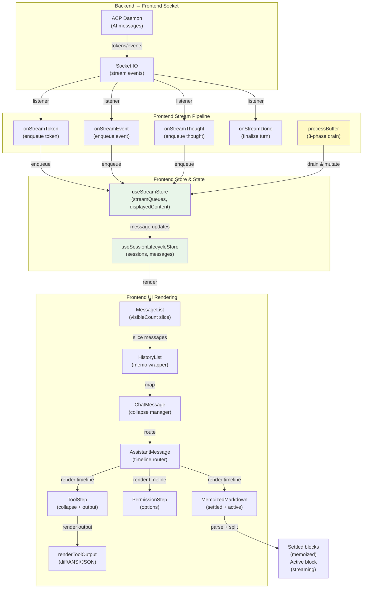

# Message Bubble UI & Typewriter System

The typewriter system decouples network message arrival from UI render rate, feeding incremental mutations to the message pipeline. The bubble UI renders messages as a Unified Timeline of discrete, collapsible steps (thoughts, tools, text, permissions). Together, they create smooth, live-streaming chat bubbles that don't freeze the UI.

---

## Overview

### What It Does

**Typewriter (Streaming) System:**
- Queues incoming ACP tokens, events, and thoughts per session in `streamQueues[acpId]`
- Drains on a 32ms timer with adaptive speed (buffers >500 chars flush fully, <100 chars drain at 1/5 speed)
- Three-phase processing: events (immediate), thoughts (typewriter), tokens (typewriter)
- Detects file edits and plan.md creation to trigger canvas callbacks
- Preserves shell output (`$ ` prefix) across tool updates
- Injects `RESPONSE_DIVIDER` between tool output and subsequent prose (only when backtick count is even)

**Bubble UI (Rendering) System:**
- Renders messages as `Message[]` containing a `Unified Timeline` of `TimelineStep` objects
- Each step is independently collapsible (thoughts, tools) or always-open (text, permissions)
- Manages collapse state per message: streaming shows only last 3 tools/thoughts, completed hides all except manually toggled
- Implements `MemoizedMarkdown` that splits content into settled (memoized) and active (streaming) blocks
- Detects and renders diffs, ANSI colors, shell JSON, file reads, and raw JSON with priority rendering
- Supports error markers (`:::ERROR:::...:::END_ERROR:::`) for error reporting

### Why This Matters

- **Decoupled Render Rate** — Network jitter doesn't cause UI freezes; adaptive speed scales with buffer depth
- **Unified Timeline** — All streaming output (thoughts, tools, text) appears in chronological order with consistent styling
- **Collapse Management** — Users can expand tools/thoughts to inspect details without losing context
- **Memoization** — Completed blocks never re-render; only the in-progress tail updates per tick
- **Tool Context** — Tool steps preserve file paths, status, output, and timestamps for canvas integration
- **Smart Rendering** — Output is intelligently formatted (diff > ANSI > JSON > plain text) to maximize readability

---

## How It Works — End-to-End

### Flow A: Token Streaming → Text Bubble

1. **ACP Daemon Sends Token** — Backend receives `session/update` with type `agent_message_chunk` containing text token.

2. **Socket Listener Dispatches** — `useChatManager` socket listener (Lines: frontend/src/hooks/useChatManager.ts:~190-210) receives the message and calls `useStreamStore.getState().onStreamToken(data)` (frontend/src/store/useStreamStore.ts:95).

3. **Token Queued** — `onStreamToken` (Lines: 95-121) enqueues a queue entry `{type:'token', data: prefix+text}` and sets `isTyping: true` on the session. The prefix includes `RESPONSE_DIVIDER` if the previous item was an event (Lines: 101-106): only injected when backtick count in existing content is even (no open code fence).

4. **processBuffer Processes Phase 3** — `useStreamStore.processBuffer` runs on 32ms timer (frontend/src/store/useStreamStore.ts:199-402). Phase 1 handles events (immediate), Phase 2 drains thoughts with adaptive speed. Phase 3 (Lines: 351-386) drains token queue:
   - Calculate adaptive rate: `bufLen > 500 ? bufLen : bufLen > 100 ? ceil(bufLen/3) : max(1, ceil(bufLen/5))` (Line: 361)
   - Extract `nextChars = batchedText.substring(0, charsPerTick)` (Line: 362)
   - Push remaining back onto queue if needed (Line: 365)
   - Append `nextChars` to the active text step or create new text step (Lines: 377-380)

5. **Message Timeline Updated** — `updateSession.messages` maps over messages, finds `activeMsgId`, updates the last timeline step of type 'text' or creates new step (Lines: 372-385). React detects mutation and schedules re-render.

6. **MemoizedMarkdown Processes** — AssistantMessage renders last text step via `<MemoizedMarkdown content={step.content} isStreaming={!!isStreaming} />` (frontend/src/components/AssistantMessage.tsx:180-184). `splitIntoBlocks` parses content with mdast into top-level blocks (frontend/src/components/MemoizedMarkdown.tsx:34-72):
   - Parses markdown into mdast tree using gfm extension (Lines: 38-42)
   - Extracts settled blocks (all except last child) by slicing at position offsets (Lines: 54-65)
   - Treats last block as "active" (streaming) (Lines: 67-69)

7. **Settled Blocks Memoized** — Settled blocks render via `MemoizedBlock.displayName = 'MemoizedBlock'` (Line: 24), a React.memo component that never re-renders on content match (Lines: 16-23). Only the active block re-renders each 32ms tick (Lines: 112-117).

8. **Active Block Renders** — The active (trailing) block renders as plain ReactMarkdown without memoization, allowing live character-by-character updates (Lines: 113-117). This creates the typewriter effect while settled blocks remain stable.

### Flow B: Tool Call Lifecycle

1. **ACP Emits tool_start** — Backend sends `tool_call` update with status 'in_progress'. Socket listener dispatches `onStreamEvent(event)` (frontend/src/store/useStreamStore.ts:123-141), enqueuing `{type:'event', data: event}` with `isProcessActiveByAcp[sessionId] = true` (Line: 132).

2. **Phase 1: Event Processing (Immediate)** — `processBuffer` scans queue for events before tokens (Lines: 239-313). **Exception:** If `tool_start` is found but thoughts precede it in queue, processing stops to let thoughts drain first (Lines: 242-243). This prevents thought text from splitting mid-word when the tool_start collapses the thought step.

3. **Process tool_start** — When `tool_start` event is processed (Lines: 250-254):
   - Collapse all prior steps: `for (let i=0; i<t.length; i++) t[i] = {...t[i], isCollapsed: true}` (Line: 252)
   - Remove placeholder thought if present: `if (t[0]?.content === '_Thinking..._') t.shift()` (Line: 253)
   - Create new tool step: `t.push({type: 'tool', event: {...action.data, status: 'in_progress', startTime: Date.now()}, isCollapsed: false})` (Line: 254)

4. **Tool Step Rendered** — `CanvasPane` / `AssistantMessage` renders ToolStep (frontend/src/components/ToolStep.tsx:83-143). Title shows, status indicator appears (Lines: 100-102), expand/collapse button enabled.

5. **tool_update Arrives** — Event with status 'in_progress' but new output. Phase 1 finds existing tool step by id (Lines: 256-257) and merges output (Lines: 286). **Key logic:** If existing output starts with `$ ` (shell streaming), the new output does NOT overwrite (Line: 286): `(existingStep.event.output?.startsWith('$ ') ? existingStep.event.output : output)`. This preserves live shell output.

6. **Tool Title Resolution** — If title changes, picks the best one (Lines: 266-279). Priority: longest/most detailed title, then prefer titles with colons (filename:args format), fall back to appending filename from filePath. This ensures `Running read_file: /path/to/file` is preferred over just `Running read_file`.

7. **_fallbackOutput Cached** — On first tool_update with output, cache as `_fallbackOutput` (Lines: 296-297). Used later during JSONL rehydration if browser reload happens mid-stream.

8. **tool_end Completes** — Event with status 'completed'. Same merge logic as tool_update. If filePath is present and status is 'completed', trigger canvas callbacks (Lines: 301-304): `onFileEdited(filePath)` and if ends with `plan.md`, also `onOpenFileInCanvas(filePath)` (Line: 303).

9. **ToolStep Renders Output** — Calls `renderToolOutput(step.event.output)` (frontend/src/components/ToolStep.tsx:126), which applies priority rendering:
   - **Diff detection** (Lines: renderToolOutput.tsx:52) — If contains unified diff markers, render as colored diff
   - **Create-only diff** (Lines: 59) — All additions, no removals → render as syntax-highlighted code
   - **ANSI detection** (Lines: 87) — Contains escape codes → render with ansiToHtml color conversion
   - **Shell JSON** (Lines: 84) — Extract `{stdout,stderr}` from JSON
   - **File read** (Lines: 107) — Syntax highlight using file extension, auto-strip line numbers if >80% of lines have them
   - **JSON** (Lines: 147) — Pretty-print with syntax highlighting
   - **Fallback** (Line: 158) — Plain `<pre>` text

10. **Canvas Hoist Button** — If filePath is detected (Lines: ToolStep.tsx:104-112), show "Open in Canvas" button. Clicking calls `onOpenInCanvas(filePath)`, which emits `canvas_read_file` to read current file state and add to canvas.

### Flow C: Thought Streaming

1. **ACP Emits agent_thought_chunk** — Socket listener dispatches `onStreamThought(data)` (frontend/src/store/useStreamStore.ts:73-88), enqueuing `{type:'thought', data: text || ''}` and setting `isProcessActiveByAcp[sessionId] = true` (Line: 83).

2. **Phase 2: Thought Draining** — After Phase 1 events complete, if queue[0].type === 'thought' (Line: 317), batch all thought items and drain at adaptive speed identical to tokens (Lines: 318-334). New thought step created or last thought step appended (Lines: 341-345).

3. **Phase 1 tool_start Exception** — If a `tool_start` event is encountered while thoughts are in queue, Phase 1 stops (Lines: 242-243). This allows Phase 2 to finish draining thoughts before the tool collapses and hides them.

### Flow D: Permission Request

1. **ACP Sends permission_request** — Event with `type: 'permission_request'`, `options: [{optionId, name, kind}]`, and optional `toolCall: {toolCallId, title}` (frontend/src/types.ts:204-211).

2. **Immediately Queued** — `onStreamEvent` enqueues as event (not held by tool_start exception). Phase 1 processes it (Lines: useStreamStore.ts:250):  `t.push({type: 'permission', request: action.data, isCollapsed: false})`.

3. **PermissionStep Renders** — (frontend/src/components/PermissionStep.tsx:12-47) Shows prompt text from `step.request.toolCall?.title || 'The agent is requesting permission...'` (Line: 24). For each option, render a button with class based on `opt.kind` (allow_always, allow_once, reject_once) (Line: 30). Buttons disabled after response (Line: 32).

4. **User Responds** — Click triggers `onRespond(step.request.id, opt.optionId, step.request.toolCall?.toolCallId)` (frontend/src/components/AssistantMessage.tsx:148), which calls backend via `socket.emit('respond_permission', ...)`. Backend records response, continues streaming.

---

## Architecture Diagram



**Data Flow Caption:** Socket events → useStreamStore queues → processBuffer drains with adaptive speed → Message/timeline mutations → React render → Component tree renders timeline steps → MemoizedMarkdown splits blocks → only active block re-renders each 32ms tick.

---

## The Critical Contracts

### Message & Timeline Shape

```typescript
// FILE: frontend/src/types.ts (Lines 228-239)
export interface Message {
  id: string;                      // e.g., "assistant-{timestamp}"
  role: 'user' | 'assistant' | 'system' | 'divider';
  content: string;                 // Full text content (may contain :::DIVIDER:::)
  timeline?: TimelineStep[];       // Array of discrete steps
  isStreaming?: boolean;           // True while receiving new data
  isArchived?: boolean;            // True if archived
  turnStartTime?: number;          // Timestamp when turn began
  turnEndTime?: number;            // Timestamp when turn completed (undefined = still streaming)
  attachments?: Attachment[];      // User-attached images/files
}

// FILE: frontend/src/types.ts (Lines 213-217)
export type TimelineStep = 
  | { type: 'thought'; content: string; isCollapsed?: boolean }
  | { type: 'tool'; event: SystemEvent; isCollapsed?: boolean }
  | { type: 'text'; content: string; isCollapsed?: boolean }
  | { type: 'permission'; request: PermissionRequest; response?: string; isCollapsed?: boolean };

// FILE: frontend/src/types.ts (Lines 175-196)
export interface SystemEvent {
  id: string;                      // Event ID
  title: string;                   // Tool name/action description
  status: 'in_progress' | 'completed' | 'failed' | 'pending_result';
  output?: string;                 // Tool output
  filePath?: string;               // Path if this is a file operation
  toolCategory?: string;           // e.g., 'file_read', 'file_edit', 'glob'
  toolName?: string;               // e.g., 'ux_invoke_shell', 'ux_invoke_subagents'
  isShellCommand?: boolean;        // True if this is a shell command
  _fallbackOutput?: string;        // Cached output for JSONL rehydration
  startTime?: number;              // Timestamp when tool started
  endTime?: number;                // Timestamp when tool ended (undefined = in_progress)
  invocationId?: string;           // Sub-agent batch correlation ID
  shellRunId?: string;             // Shell process correlation ID
}
```

### Adaptive Typewriter Algorithm

The buffer drain speed adapts to buffer size:

```typescript
// FILE: frontend/src/store/useStreamStore.ts (Lines 360-361)
const bufferLen = batchedText.length;
const charsPerTick = bufferLen > 500 ? bufferLen : bufferLen > 100 ? Math.ceil(bufferLen / 3) : Math.max(1, Math.ceil(bufferLen / 5));
```

| Buffer Size | Drain Rate | Reschedule |
|---|---|---|
| > 500 chars | Flush entire buffer (1× speed) | 32ms |
| 100–500 chars | Drain at 1/3 speed | 32ms |
| < 100 chars | Drain at 1/5 speed | 32ms |

---

## Key Mechanics & Behaviors

### 1. RESPONSE_DIVIDER Injection

When a tool event completes and prose follows, inject `\n\n:::RESPONSE_DIVIDER:::\n\n` to visually separate output from text. **Critical:** Only inject when backtick count is even (no open code block).

```typescript
// FILE: frontend/src/store/useStreamStore.ts (Lines 101-106)
let prefix = '';
if (isProcessActiveByAcp[sessionId]) {
  const activeMsgId = activeMsgIdByAcp[sessionId];
  const existingContent = activeMsgId ? displayedContentByMsg[activeMsgId] : '';
  if (existingContent && existingContent.trim().length > 0) {
    const backticks = (existingContent.match(/`/g) || []).length;
    if (backticks % 2 === 0) prefix = '\n\n:::RESPONSE_DIVIDER:::\n\n';
  }
}
```

Why: If open code fence exists, injecting `:::` inside the fence breaks syntax. The even-backtick check ensures the fence is closed.

### 2. Tool Title Resolution

When a tool's title might change across updates, choose the best title using a priority system:

```typescript
// FILE: frontend/src/store/useStreamStore.ts (Lines 266-279)
let bestTitle = incomingTitle || existingStep.event.title;
const existingTitle = existingStep.event.title || '';

// Prefer longer titles (more detail)
if (existingTitle.length > (bestTitle || '').length || 
    (existingTitle.includes(':') && !bestTitle?.includes(':'))) {
  bestTitle = existingTitle;
}

// Append filename if filePath present and not already in title
if (mergedFilePath) {
  const filename = mergedFilePath.split(/[/\\]/).pop();
  if (filename && bestTitle && !bestTitle.toLowerCase().includes(filename.toLowerCase())) {
    bestTitle += `: ${filename}`;
  }
}
```

### 3. Shell Output Preservation

Tool output starting with `$ ` indicates live shell streaming. Never overwrite it with a later update:

```typescript
// FILE: frontend/src/store/useStreamStore.ts (Line 286)
output: (existingStep.event.output?.startsWith('$ ') ? existingStep.event.output : output) || existingStep.event.output,
```

Why: If a shell tool is streaming output in real-time, the `tool_update` events contain partial output. We don't want to replace the accumulated `$ ` output with an intermediate snapshot.

### 4. Collapse Management During Streaming

While streaming, show only the last 3 tools and last 3 thoughts; collapse the rest. After streaming ends, collapse all tools/thoughts unless manually toggled.

```typescript
// FILE: frontend/src/components/ChatMessage.tsx (Lines 107-120)
const toolIndices = timeline.map((step, idx) => step.type === 'tool' ? idx : -1).filter(idx => idx !== -1);
const thoughtIndices = timeline.map((step, idx) => step.type === 'thought' ? idx : -1).filter(idx => idx !== -1);
const last3Tools = toolIndices.slice(-3);
const last3Thoughts = thoughtIndices.slice(-3);

timeline.forEach((step, idx) => {
  if (manuallyToggled.current.has(idx)) return;  // Respect user's toggle
  if (typeof step.isCollapsed === 'boolean') updates[idx] = step.isCollapsed;
  else if (step.type === 'tool') updates[idx] = !last3Tools.includes(idx);
  else if (step.type === 'thought') updates[idx] = !last3Thoughts.includes(idx);
  else if (step.type === 'text') updates[idx] = false;
});
```

### 5. manuallyToggled Ref Persistence

User toggles are tracked in a `Set<number>` ref to survive across streaming updates:

```typescript
// FILE: frontend/src/components/ChatMessage.tsx (Lines 171-177)
toggleCollapse={(idx) => {
  manuallyToggled.current.add(idx);
  setLocalCollapsed(prev => {
    const current = prev[idx] ?? timeline?.[idx]?.isCollapsed ?? false;
    return { ...prev, [idx]: !current };
  });
}}
```

The `manuallyToggled` Set is checked in the collapse effect (Line 100) and excluded from auto-sync: if a user manually expands a tool, it stays expanded even when the streaming collapse logic would auto-collapse it.

### 6. renderToolOutput Priority Chain

Tool output is rendered with intelligent fallbacks:

1. **Diff Detection** (Lines: renderToolOutput.tsx:52) — Unified diff or Index format
2. **Create-only Diff** (Lines: 59) — All additions, no removals → syntax-highlighted code
3. **ANSI Colors** (Lines: 87) — Terminal escape codes → HTML with ansiToHtml
4. **Shell JSON** (Lines: 84) — Extract `{stdout,stderr}` from JSON wrapper
5. **File Read** (Lines: 107) — Syntax highlight, auto-strip line numbers if >80%
6. **JSON** (Lines: 147) — Pretty-print and highlight
7. **Fallback** (Line: 158) — Plain `<pre>` text

---

## Component Reference

### Frontend Components

| Component | File | Lines | Purpose |
|---|---|---|---|
| **MessageList** | frontend/src/components/MessageList/MessageList.tsx | 18-92 | Main chat container; slices messages by visibleCount; renders HistoryList + load-more button |
| **HistoryList** | frontend/src/components/HistoryList.tsx | 11-26 | memo-wrapped; maps Message[] to ChatMessage components |
| **ChatMessage** | frontend/src/components/ChatMessage.tsx | 89-183 | Routes to UserMessage or AssistantMessage; manages collapse state + manuallyToggled Set; defines CodeBlock for syntax highlighting |
| **UserMessage** | frontend/src/components/UserMessage.tsx | 11-40 | Renders user content + attachments (images, files); uses ReactMarkdown with custom components |
| **AssistantMessage** | frontend/src/components/AssistantMessage.tsx | 50-216 | Renders assistant messages with unified timeline; maps TimelineStep to ToolStep/PermissionStep/MemoizedMarkdown; handles copy all, fork, error rendering |
| **ToolStep** | frontend/src/components/ToolStep.tsx | 83-143 | Renders tool execution step; detectsFilePath for canvas hoist button; renders renderToolOutput; shows ToolSubAgentPanel if ux_invoke_subagents |
| **PermissionStep** | frontend/src/components/PermissionStep.tsx | 12-47 | Renders permission request with option buttons; disables after response |
| **MemoizedMarkdown** | frontend/src/components/MemoizedMarkdown.tsx | 87-123 | Parses content with mdast; splits into settled + active blocks; memoizes settled, streams active |
| **MemoizedBlock** | frontend/src/components/MemoizedMarkdown.tsx | 16-23 | React.memo wrapper; never re-renders if content unchanged |
| **renderToolOutput** | frontend/src/components/renderToolOutput.tsx | 49-161 | Priority renderer for tool output (diff > ANSI > JSON > file > plain) |
| **CodeBlock** | frontend/src/components/ChatMessage.tsx | 44-87 | Syntax highlighting for code in markdown; Copy button + Canvas button (if canvas open) |

### Frontend Stores & Hooks

| Store / Hook | File | Lines | Purpose |
|---|---|---|---|
| **useStreamStore** | frontend/src/store/useStreamStore.ts | 38-403 | Manages streamQueues, processBuffer, adaptive typewriter, turn finalization |
| **ensureAssistantMessage** | frontend/src/store/useStreamStore.ts | 47-71 | Lazily creates placeholder assistant message for new ACP session |
| **onStreamToken** | frontend/src/store/useStreamStore.ts | 95-121 | Enqueues token with RESPONSE_DIVIDER injection logic |
| **onStreamThought** | frontend/src/store/useStreamStore.ts | 73-88 | Enqueues thought item; sets isTyping flag |
| **onStreamEvent** | frontend/src/store/useStreamStore.ts | 123-141 | Enqueues tool/permission event; sets isAwaitingPermission if permission_request |
| **onStreamDone** | frontend/src/store/useStreamStore.ts | 143-192 | Finalizes turn; polls queue drain with 50ms interval, 10s timeout; saves snapshot |
| **processBuffer** | frontend/src/store/useStreamStore.ts | 199-402 | Three-phase drain: Phase 1 (events), Phase 2 (thoughts), Phase 3 (tokens); reschedules at 32ms |
| **useElapsed** | frontend/src/utils/timer.ts | 12-25 | Hook: live timer during streaming, frozen after turn ends |
| **formatDuration** | frontend/src/utils/timer.ts | 3-10 | Format milliseconds as "XXms", "XXs", "XXm YYs" |

---

## Gotchas & Important Notes

1. **tool_start Held If Thoughts Precede It**
   - **What:** Phase 1 stops if `tool_start` event is encountered and thoughts are still queued (Lines: useStreamStore.ts:242-243).
   - **Why:** Without this, Phase 2 drains thoughts after tool_start collapses the thought step, splitting thought text mid-word.
   - **How to avoid:** Write Phase 1 logic as shown; don't process tool_start immediately if thoughts are in queue.

2. **RESPONSE_DIVIDER Injection Requires Even Backtick Count**
   - **What:** If backtick count in existing content is odd, don't inject `:::RESPONSE_DIVIDER:::` (Lines: 105-106).
   - **Why:** Injecting inside an open code fence breaks the fence syntax.
   - **How to avoid:** Always check backtick parity before injecting divider.

3. **Shell Output with $ Prefix Is Never Overwritten**
   - **What:** If tool output starts with `$ ` (live shell streaming), later `tool_update` payloads don't replace it (Line: 286).
   - **Why:** Live shell output is accumulated in real-time; final updates shouldn't truncate it.
   - **How to avoid:** Don't assume tool_update always has the final output; check for `$ ` prefix.

4. **_fallbackOutput Only Set on First tool_update**
   - **What:** Cached on the first `tool_update` with output, not on subsequent updates (Lines: 296-297).
   - **Why:** For JSONL rehydration; avoids redundant caching.
   - **How to avoid:** Don't rely on _fallbackOutput after tool completion; it's a best-effort snapshot.

5. **MemoizedBlock Never Re-renders on Same Content**
   - **What:** React.memo comparison uses content equality; no re-render if content string is identical (Lines: MemoizedMarkdown.tsx:22).
   - **Why:** Prevents re-parsing settled markdown blocks.
   - **How to avoid:** Never mutate settled block content in-place; always create a new string.

6. **visibleCount Slice Truncates Old Messages**
   - **What:** MessageList renders only `messages.slice(-visibleCount)` (Lines: MessageList.tsx:32). Old messages are hidden until "Load previous" is clicked.
   - **Why:** Improves render performance for long conversations.
   - **How to avoid:** Ensure test setup loads all messages if needed; call `incrementVisibleCount(10)` to load more.

7. **isStreaming Flag Controls MemoizedMarkdown Mode**
   - **What:** `MemoizedMarkdown` checks `isStreaming` to determine whether to split blocks or render as single doc (Line: 89).
   - **Why:** While streaming, split into settled+active; after done, render full content for correctness.
   - **How to avoid:** Always pass correct isStreaming value; don't forget to set `isStreaming: false` after turn ends.

8. **manuallyToggled Set Resets on Component Unmount**
   - **What:** The Set is declared at function scope in ChatMessage; unmounting the component loses the Set (Lines: ChatMessage.tsx:91).
   - **Why:** Collapse state is per-render, not persisted to DB.
   - **How to avoid:** Page reload clears all manual toggle overrides; this is by design (don't expect persistence).

9. **onStreamDone Polls Queue with 50ms Interval, 10s Timeout**
   - **What:** Finalization checks if queue is empty every 50ms; if not empty after 10s, force finalize (Lines: onStreamDone:153-191).
   - **Why:** Prevents hanging if processBuffer stalls.
   - **How to avoid:** Keep processBuffer executing reliably; don't create bottlenecks that would trigger the timeout.

10. **processBuffer is Self-Rescheduling setTimeout, Not setInterval**
    - **What:** At end of each drain, `setTimeout(..., 32)` is called (Line: 401), not setInterval (Lines: 401).
    - **Why:** Self-rescheduling allows dynamic timing and graceful termination when queue is empty.
    - **How to avoid:** Check that queue drain completes; if stuck, the timeout loop will still tick but do nothing.

---

## Unit Tests

### Backend Tests
- N/A (streaming is pure frontend logic)

### Frontend Tests

| File | Lines | Key Tests |
|---|---|---|
| **ChatMessage.test.tsx** | 669 | Routes to UserMessage/AssistantMessage; CodeBlock renders; collapse state logic; canvas button visibility |
| **AssistantMessage.test.tsx** | 229 | Timeline rendering; copy all button; fork button; error message boxes; timer display |
| **AssistantMessageCollapse.test.tsx** | — | Collapse state during streaming; last-3 rule; manual toggle persistence |
| **AssistantMessageExtended.test.tsx** | — | Permission steps; tool step rendering; tool status indicators |
| **UserMessage.test.tsx** | — | Attachment rendering (images, files); markdown content |
| **MessageList.test.tsx** | — | Slice by visibleCount; load-more button; empty state |
| **useStreamStore.test.ts** | 196 | ensureAssistantMessage; onStreamToken; onStreamEvent; processBuffer draining; collapse logic |

---

## How to Use This Guide

### For Implementing Features

1. **Understand the data contracts** — Read Message, TimelineStep, SystemEvent shapes in Section 3.
2. **Trace a flow** — Follow one of the four flows (token, tool, thought, permission) to understand the end-to-end path.
3. **Reference exact line numbers** — Use the Component Reference table to jump to code.
4. **Study the gotchas** — Before implementing collapse logic, output rendering, or streaming updates, review the gotchas.
5. **Write tests** — Add test cases to the files listed above; verify your feature integrates with the existing pipeline.

### For Debugging Issues

1. **Check the logs** — Look for `[DB]`, `[FS]`, `[TERM]` entries in the backend log.
2. **Inspect the store** — Use React DevTools to inspect `useStreamStore` and `useSessionLifecycleStore` state in real-time.
3. **Trace the queue** — Add logging to `processBuffer` to see what's in the queue and how it's drained.
4. **Verify collapse state** — Ensure `manuallyToggled` Set is being managed correctly.
5. **Check rendering** — Use React DevTools Profiler to verify MemoizedMarkdown splitting and memoization behavior.
6. **Browser console** — Watch for markdown parsing errors from mdast; check ReactMarkdown component errors.

---

## Summary

The message bubble UI and typewriter system work together to create smooth, live-streaming chat:

- **Typewriter decouples arrival from render** — Socket events are queued and drained at adaptive speed (32ms ticks, speed scaling with buffer depth).
- **Three-phase processing** — Events are immediate, thoughts and tokens drain with adaptive typewriter effect.
- **Unified timeline** — Messages contain TimelineSteps (thoughts, tools, text, permissions) that render as discrete, collapsible bubbles.
- **Smart output rendering** — Tool output uses priority-based formatting (diff > ANSI > JSON > file > plain).
- **Memoized markdown** — Settled blocks never re-render; only the active (streaming) tail updates per tick.
- **Collapse management** — Streaming shows last 3 tools/thoughts; completed hides all unless manually toggled.
- **Tool context preservation** — File paths, status, output, and timestamps enable canvas integration.
- **Critical contracts** — Message shape, TimelineStep union, SystemEvent, and adaptive algorithm are invariant.

With this doc, an agent can implement streaming optimizations, add new timeline step types, enhance output rendering, or debug streaming/rendering issues with confidence.
