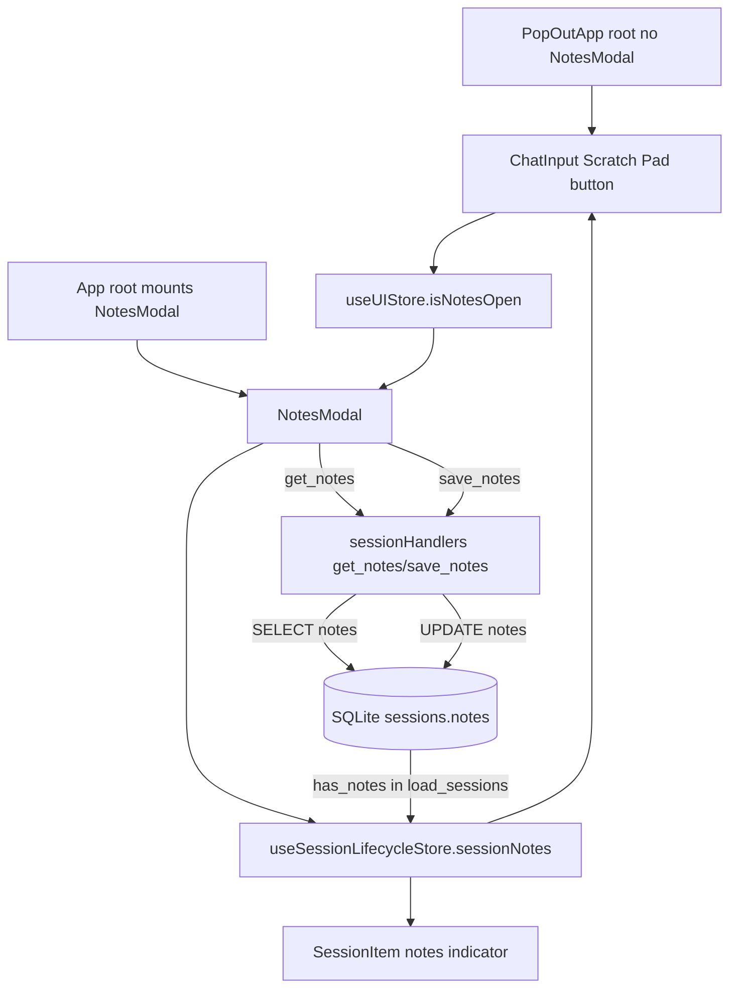

# Feature Doc - Notes

Notes (Scratch Pad) is the per-session markdown note system shown from the Chat Input footer and session-row indicator. It is easy to break because ownership spans Socket.IO handlers, SQLite session metadata, lifecycle store hydration, modal UI state, and pop-out root composition.

## Overview

### What It Does
- Opens a Scratch Pad modal from `ChatInput` using `useUIStore.setNotesOpen(true)`.
- Loads note text for the active UI session through `get_notes`.
- Persists note text with debounced `save_notes` writes.
- Stores durable note text in SQLite `sessions.notes`.
- Exposes `hasNotes` in `load_sessions` metadata and hydrates `useSessionLifecycleStore.sessionNotes`.
- Renders notes indicators in `SessionItem` and Scratch Pad button tint in `ChatInput`.

### Why This Matters
- Notes use UI session identity (`ui_id`), not ACP session identity.
- Notes persistence is separate from `save_snapshot`/`saveSession` session upserts.
- Sidebar indicators depend on `load_sessions` metadata, not real-time note reloads.
- Pop-out windows render `ChatInput` but do not mount `NotesModal`, so notes UI availability differs by root.
- Socket payload shape is small and easy to drift (`{ sessionId }` and `{ sessionId, notes }`).

Architectural role: cross-layer frontend + backend + database feature.

## How It Works - End-to-End Flow

1. `App` mounts the modal owner.

File: `frontend/src/App.tsx` (Component: `App`)

```tsx
// FILE: frontend/src/App.tsx (Component: App)
<SessionSettingsModal />
<SystemSettingsModal />
<NotesModal />
<FileExplorer />
<HelpDocsModal />
```

`NotesModal` exists only in the main app root.

2. Chat input exposes the Scratch Pad entry point and local indicator.

File: `frontend/src/components/ChatInput/ChatInput.tsx` (Component: `ChatInput`)

```tsx
// FILE: frontend/src/components/ChatInput/ChatInput.tsx (Component: ChatInput)
<button
  type="button"
  className={`input-action-btn ${useSessionLifecycleStore.getState().sessionNotes[activeSessionId || ''] ? 'has-notes' : ''}`}
  onClick={() => useUIStore.getState().setNotesOpen(true)}
  title="Scratch Pad"
>
  <StickyNote size={20} />
</button>
```

The button reads `sessionNotes[uiId]` and sets modal-open UI state.

3. Modal visibility is owned by `useUIStore`.

File: `frontend/src/store/useUIStore.ts` (Store: `useUIStore`, Fields/Actions: `isNotesOpen`, `setNotesOpen`)

```ts
// FILE: frontend/src/store/useUIStore.ts (Store: useUIStore)
isNotesOpen: false,
setNotesOpen: (isOpen) => set({ isNotesOpen: isOpen }),
```

4. Modal loads session notes on open.

File: `frontend/src/components/NotesModal.tsx` (Component: `NotesModal`, Effect: load notes)

```tsx
// FILE: frontend/src/components/NotesModal.tsx (Component: NotesModal)
useEffect(() => {
  if (!isOpen || !socket || !activeSessionId) return;
  sessionRef.current = activeSessionId;
  socket.emit('get_notes', { sessionId: activeSessionId }, (res: { notes?: string }) => {
    if (sessionRef.current === activeSessionId) setNotes(res.notes || '');
  });
}, [isOpen, socket, activeSessionId]);
```

The socket payload uses UI session id in `sessionId`.

5. Backend returns note text for the UI session row.

File: `backend/sockets/sessionHandlers.js` (Function: `registerSessionHandlers`, Socket event: `get_notes`)

```js
// FILE: backend/sockets/sessionHandlers.js (Function: registerSessionHandlers)
socket.on('get_notes', async ({ sessionId }, callback) => {
  try {
    const notes = await db.getNotes(sessionId);
    callback?.({ notes });
  } catch (err) {
    callback?.({ notes: '', error: err.message });
  }
});
```

6. Database reads the `sessions.notes` column.

File: `backend/database.js` (Functions: `initDb`, `getNotes`)

```js
// FILE: backend/database.js (Function: initDb)
db.run(`ALTER TABLE sessions ADD COLUMN notes TEXT`, ...);

// FILE: backend/database.js (Function: getNotes)
export function getNotes(uiId) {
  return new Promise((resolve, reject) => {
    db.get(`SELECT notes FROM sessions WHERE ui_id = ?`, [uiId], (err, row) => {
      if (err) reject(err);
      else resolve(row?.notes || '');
    });
  });
}
```

Missing or null values normalize to `''`.

7. Edits are debounced and persisted through `save_notes`.

Files: `frontend/src/components/NotesModal.tsx` (Functions: `handleChange`, `saveNotes`), `backend/sockets/sessionHandlers.js` (Socket event: `save_notes`)

```tsx
// FILE: frontend/src/components/NotesModal.tsx (Function: handleChange)
const handleChange = (text: string) => {
  setNotes(text);
  if (saveTimer.current) clearTimeout(saveTimer.current);
  saveTimer.current = setTimeout(() => saveNotes(text), 500);
};
```

```tsx
// FILE: frontend/src/components/NotesModal.tsx (Function: saveNotes)
socket.emit('save_notes', { sessionId: activeSessionId, notes: text });
useSessionLifecycleStore.setState(state => ({
  sessionNotes: { ...state.sessionNotes, [activeSessionId]: text.length > 0 }
}));
```

```js
// FILE: backend/sockets/sessionHandlers.js (Function: registerSessionHandlers)
socket.on('save_notes', async ({ sessionId, notes }, callback) => {
  try {
    await db.saveNotes(sessionId, notes);
    callback?.({ success: true });
  } catch (err) {
    callback?.({ error: err.message });
  }
});
```

8. Database writes note text independently of session snapshots.

File: `backend/database.js` (Functions: `saveNotes`, `saveSession`)

```js
// FILE: backend/database.js (Function: saveNotes)
export function saveNotes(uiId, notes) {
  return new Promise((resolve, reject) => {
    db.run(`UPDATE sessions SET notes = ? WHERE ui_id = ?`, [notes, uiId], (err) => {
      if (err) reject(err);
      else resolve();
    });
  });
}
```

`saveSession` upserts many columns but does not write `notes`; notes ownership stays in `saveNotes`.

9. Session metadata includes `hasNotes` during initial load.

Files: `backend/database.js` (Function: `getAllSessions`), `frontend/src/store/useSessionLifecycleStore.ts` (Action: `handleInitialLoad`)

```js
// FILE: backend/database.js (Function: getAllSessions)
CASE WHEN notes IS NOT NULL AND notes != '' THEN 1 ELSE 0 END as has_notes
```

```ts
// FILE: frontend/src/store/useSessionLifecycleStore.ts (Action: handleInitialLoad)
const notesMap: Record<string, boolean> = {};
res.sessions.forEach((s: ChatSession & { hasNotes?: boolean }) => {
  if (s.hasNotes) notesMap[s.id] = true;
});
set({ sessionNotes: notesMap, ... });
```

10. Sidebar rows render the notes indicator.

File: `frontend/src/components/SessionItem.tsx` (Component: `SessionItem`)

```tsx
// FILE: frontend/src/components/SessionItem.tsx (Component: SessionItem)
const hasNotes = useSessionLifecycleStore(state => state.sessionNotes[session.id]);
...
{hasNotes && <StickyNote size={10} className="session-notes-indicator" />}
```

11. Pop-out windows keep trigger UI but not modal root.

Files: `frontend/src/main.tsx` (Anchor: `isPopout`), `frontend/src/PopOutApp.tsx` (Component: `PopOutApp`), `frontend/src/components/ChatInput/ChatInput.tsx` (Scratch Pad button)

`PopOutApp` renders `ChatHeader`, `MessageList`, and `ChatInput` but does not render `NotesModal`. The Scratch Pad button can set `isNotesOpen`, but no notes modal appears in pop-out mode because there is no modal owner in that root.

## Architecture Diagram



## The Critical Contract: UI Session-Keyed Notes Ownership

Notes persistence and indicators are keyed by UI session id and must stay independent from ACP session id.

- Socket payload contract:
  - `get_notes({ sessionId: <uiId> }) -> { notes } | { notes: '', error }`
  - `save_notes({ sessionId: <uiId>, notes }) -> { success: true } | { error }`
- Database contract:
  - `sessions.notes` stores full markdown text.
  - `getAllSessions` exposes derived `hasNotes` from `notes`.
- Frontend contract:
  - `sessionNotes[uiId]` is the boolean indicator source.
  - `NotesModal` owns text load/save behavior.

If this contract is broken, notes can be saved against the wrong row, indicator icons can drift from stored state, or pop-out behavior can appear inconsistent.

## Configuration / Provider-Specific Behavior

Notes are provider-agnostic and do not use provider-specific hooks.

- No provider config keys are required.
- No MCP feature flags are involved.
- Backend provider filtering still applies indirectly through `load_sessions`, because `hasNotes` travels with session rows returned for the selected provider scope.

## Data Flow / Rendering Pipeline

### Read path
1. User opens Scratch Pad from `ChatInput`.
2. `setNotesOpen(true)` shows `NotesModal` in `App`.
3. `NotesModal` emits `get_notes({ sessionId: activeSessionId })`.
4. Backend calls `db.getNotes(uiId)` and returns note text.
5. Modal stores text in local `notes` state.

### Write path
1. User edits text in `NotesModal` raw tab.
2. `handleChange` debounces writes by 500ms.
3. `saveNotes` emits `save_notes({ sessionId, notes })`.
4. Backend calls `db.saveNotes(uiId, notes)`.
5. Frontend updates `sessionNotes[uiId] = notes.length > 0` for immediate indicator updates.

### Metadata hydration path
1. `load_sessions` returns rows with `hasNotes` derived from DB.
2. `handleInitialLoad` converts `hasNotes` to `sessionNotes` map.
3. `SessionItem` and `ChatInput` read the map to render indicator states.

## Component Reference

### Frontend

| Area | File | Anchors | Purpose |
|---|---|---|---|
| App root | `frontend/src/App.tsx` | `App`, `<NotesModal />` | Main modal owner for notes UI |
| Pop-out root | `frontend/src/PopOutApp.tsx` | `PopOutApp`, root render tree | Detached root that omits `NotesModal` |
| Entry control | `frontend/src/components/ChatInput/ChatInput.tsx` | Scratch Pad button (`title="Scratch Pad"`), `setNotesOpen`, `has-notes` class | Opens notes UI and shows indicator tint |
| Modal | `frontend/src/components/NotesModal.tsx` | `NotesModal`, load `useEffect`, `saveNotes`, `handleChange`, `activeTab` | Note text UI, markdown rendering, socket load/save |
| Session row indicator | `frontend/src/components/SessionItem.tsx` | `hasNotes`, `session-notes-indicator` | Sidebar sticky-note indicator per session |
| Modal state | `frontend/src/store/useUIStore.ts` | `isNotesOpen`, `setNotesOpen` | Global notes modal visibility |
| Session metadata | `frontend/src/store/useSessionLifecycleStore.ts` | `sessionNotes`, `handleInitialLoad` | Note indicator map hydration and local updates |

### Backend

| Area | File | Anchors | Purpose |
|---|---|---|---|
| Socket handlers | `backend/sockets/sessionHandlers.js` | `registerSessionHandlers`, events `get_notes`, `save_notes` | Backend read/write entry points |
| Persistence | `backend/database.js` | `initDb` notes migration, `getNotes`, `saveNotes`, `getAllSessions` (`has_notes`) | Durable note storage and metadata derivation |

### Tests

| Area | File | Anchors | Purpose |
|---|---|---|---|
| Notes modal UI | `frontend/src/test/NotesModal.test.tsx` | `describe('NotesModal')`, `describe('NotesModal - additional')` | Load/save behavior, debounce, rendered markdown, close behavior |
| UI state | `frontend/src/test/useUIStore.test.ts` | `setNotesOpen, setFileExplorerOpen, and setHelpDocsOpen update state` | Notes modal open/close action coverage |
| Pop-out controls | `frontend/src/test/ChatHeader.test.tsx` | `hides sidebar menu and action buttons in pop-out mode` | Confirms pop-out action set excludes modal-launch controls in header |
| Pop-out root | `frontend/src/test/PopOutApp.test.tsx` | `does NOT render Sidebar`, `renders ChatHeader and ChatInput when ready` | Verifies detached root composition used for notes availability reasoning |
| Socket handlers | `backend/test/sessionHandlers.test.js` | `handles get_notes`, `handles get_notes error`, `handles save_notes success`, `handles save_notes error` | Backend notes event behavior |
| DB notes | `backend/test/persistence.test.js` | `handles notes` | DB read/write contract |
| DB error paths | `backend/test/database-exhaustive.test.js` | `hits all error paths using mock injection` | `getNotes`/`saveNotes` rejection coverage |

## Gotchas & Important Notes

1. UI session id is the notes key.
   - `sessionId` in `get_notes`/`save_notes` is `ui_id`, not ACP session id.

2. Notes are not part of `saveSession` upsert.
   - `save_snapshot` does not update `sessions.notes`; only `saveNotes` does.

3. Indicator map can be stale until next load when writes fail.
   - Modal sets `sessionNotes` optimistically without waiting for `save_notes` callback.

4. Pop-out Scratch Pad button has no mounted modal root.
   - `ChatInput` exists in pop-out; `NotesModal` does not.

5. Debounce timer is per modal instance.
   - Rapid edits are coalesced; persistence is not immediate per keystroke.

6. `hasNotes` is derived from non-empty text.
   - DB logic treats empty string as no notes.

7. Overlay click does not close modal.
   - Close path is the explicit close button (`setNotesOpen(false)`), not background click.

8. Markdown rendering and raw editing are separate tabs.
   - Rendered view is preview-only; raw tab is the edit source.

## Unit Tests

### Frontend
- `frontend/src/test/NotesModal.test.tsx`
  - `renders when open`
  - `does not render when closed`
  - `loads existing notes on open`
  - `saves notes after debounce`
  - `sets sessionNotes to true when notes exist`
  - `sets sessionNotes to false when notes are emptied`
  - `switches to rendered tab and displays markdown`
  - `renders fallback text when no notes in rendered tab`
  - `reloads notes when session changes while open`
  - `does not close when clicking overlay`
  - `renders code blocks via syntax highlighter in rendered mode`
- `frontend/src/test/useUIStore.test.ts`
  - `setNotesOpen, setFileExplorerOpen, and setHelpDocsOpen update state`

### Backend
- `backend/test/sessionHandlers.test.js`
  - `handles get_notes`
  - `handles get_notes error`
  - `handles save_notes success`
  - `handles save_notes error`
- `backend/test/persistence.test.js`
  - `handles notes`
- `backend/test/database-exhaustive.test.js`
  - `hits all error paths using mock injection` (includes `getNotes`/`saveNotes`)

## How to Use This Guide

### For implementing/extending this feature
1. Start in `frontend/src/components/NotesModal.tsx` for UI behavior changes.
2. Keep modal visibility in `useUIStore` and indicator ownership in `useSessionLifecycleStore.sessionNotes`.
3. Keep socket payloads UI-session keyed and update `backend/sockets/sessionHandlers.js` + `backend/database.js` together.
4. If changing indicator semantics, update both `getAllSessions` (`has_notes`) and `handleInitialLoad` mapping.
5. If changing pop-out behavior, update `PopOutApp` root composition intentionally and add tests.

### For debugging issues with this feature
1. Check `useUIStore.isNotesOpen` and whether the current root is `App` or `PopOutApp`.
2. Verify `activeSessionId` is non-null before modal load/save emits.
3. Inspect `get_notes` / `save_notes` callback payloads and DB errors.
4. Confirm `sessions.notes` value for the target `ui_id` and `has_notes` derivation in `getAllSessions`.
5. Check `useSessionLifecycleStore.sessionNotes[uiId]` for indicator mismatches.

## Summary

- Notes are a UI-session-keyed, markdown-capable scratch pad stored in `sessions.notes`.
- `NotesModal` owns content load/save; `useUIStore` owns visibility; `useSessionLifecycleStore` owns indicator map state.
- Backend ownership is `get_notes`/`save_notes` in `sessionHandlers` and `getNotes`/`saveNotes` in `database`.
- Notes persistence is separate from regular session snapshot upserts.
- Sidebar and Chat Input indicators use `sessionNotes`, hydrated from `hasNotes` metadata and updated optimistically on save.
- Pop-out windows intentionally omit `NotesModal`, so Scratch Pad UI is unavailable there unless root composition changes.
