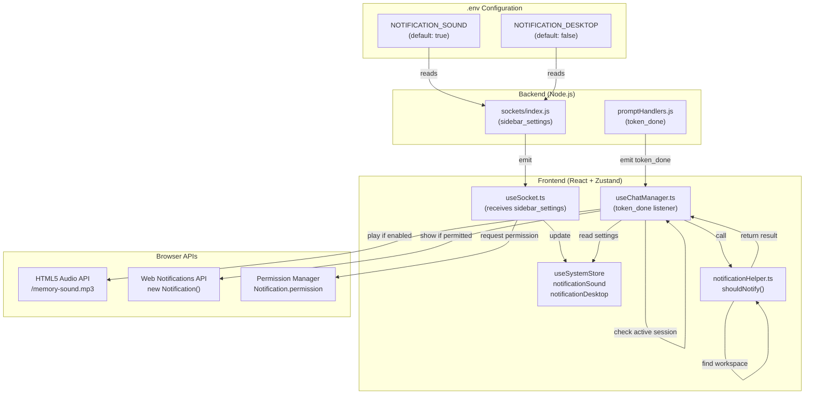

# Notification System

A multi-modal notification system that alerts users when background sessions complete, supporting desktop notifications (Windows toast via Web Notifications API), audio notifications (MP3 playback), and environment variable configuration. Notifications are scoped to background sessions only and include workspace context in the notification body.

**Why this matters:** Notifications are the primary feedback mechanism for long-running background agents. Understanding the decision logic (when to notify, when to suppress), desktop permission flow, audio fallback patterns, and environment variable defaults is critical for extending notifications to new events, debugging silent failures, or implementing notification preferences UI.

---

## Overview

### What It Does

- **Background session detection** — Suppress notifications for the currently active session; only notify for sessions running in the background
- **Desktop notifications** — Display Windows toast notifications via Web Notifications API when configured and permitted
- **Audio notifications** — Play a notification sound (MP3) when session completes, configurable independently from desktop notifications
- **Workspace awareness** — Include workspace context in notification body if session CWD matches a configured workspace path
- **Environment configuration** — Control default notification behavior via `.env` variables (NOTIFICATION_SOUND, NOTIFICATION_DESKTOP)
- **Permission management** — Request and respect browser notification permissions; gracefully degrade if permission denied

### Why This Matters

- **User attention:** Desktop/audio notifications are the only way to alert users of background work completion; critical for long-running agents
- **Distraction reduction:** Only notifying for background sessions prevents notification spam for active work
- **Accessibility:** Independent sound/desktop toggles allow users to choose their preferred feedback mode
- **Configuration consistency:** Env-based defaults sync across backend → frontend at connection time
- **Sub-agent exclusion:** Sub-agents should never notify (spawned agents are implementation details, not user-facing work)

### Architectural Role

- **Frontend:** `notificationHelper.ts` with decision logic, `useChatManager` hook receiving `token_done` events, `useSystemStore` managing settings
- **Backend:** Socket handlers emitting `token_done` event on session completion, `sidebar_settings` emitting config on connect
- **Environment layer:** `.env` variables control defaults (NOTIFICATION_SOUND, NOTIFICATION_DESKTOP)
- **Browser API:** Native Web Notifications API for desktop notifications, HTML5 Audio API for sound playback

---

## How It Works — End-to-End Flow

### Step 1: Backend Emits Notification Config on Socket Connect
**File:** `backend/sockets/index.js` (Lines 78–82)

When a client connects, the server emits the notification configuration from environment variables:

```javascript
// FILE: backend/sockets/index.js (Lines 78-82)
socket.emit('sidebar_settings', {
  deletePermanent: String(process.env.SIDEBAR_DELETE_PERMANENT || '').trim().toLowerCase() === 'true',
  notificationSound: process.env.NOTIFICATION_SOUND !== 'false',  // LINE 80 - Defaults to true
  notificationDesktop: process.env.NOTIFICATION_DESKTOP === 'true',  // LINE 81 - Defaults to false
});
```

**Key defaults:**
- `NOTIFICATION_SOUND` defaults to **true** unless explicitly set to `'false'`
- `NOTIFICATION_DESKTOP` defaults to **false** unless explicitly set to `'true'`

---

### Step 2: Frontend Receives Config and Updates Store
**File:** `frontend/src/hooks/useSocket.ts` (Lines 57–61)

```typescript
// FILE: frontend/src/hooks/useSocket.ts (Lines 57-61)
_socket.on('sidebar_settings', (data: { 
  deletePermanent: boolean; 
  notificationSound: boolean; 
  notificationDesktop: boolean 
}) => {
  useSystemStore.getState().setDeletePermanent(data.deletePermanent);
  useSystemStore.getState().setNotificationSettings(data.notificationSound, data.notificationDesktop);  // LINE 59
  if (data.notificationDesktop && Notification.permission === 'default') {
    Notification.requestPermission();  // LINE 61 - Request permission if needed
  }
});
```

**Key behavior:**
- Settings stored in Zustand `useSystemStore` (lines 31–32)
- If desktop notifications enabled AND permission is `'default'`, request permission
- Permission request returns a Promise; resolving to `'granted'`, `'denied'`, or `'default'`

---

### Step 3: User Starts/Switches to Different Session
**Frontend State:**

The active session ID is tracked in `useSessionLifecycleStore`:

```typescript
// From useSessionLifecycleStore
const activeSessionId = useSessionLifecycleStore.getState().activeSessionId;
const sessions = useSessionLifecycleStore.getState().sessions;
const activeSession = sessions.find(s => s.id === activeSessionId);
```

---

### Step 4: Agent Completes Work in Background Session → Backend Emits `token_done`
**File:** `backend/sockets/promptHandlers.js` (Lines 19, 33, 127, 143)

The backend emits `token_done` when a session completes (success or error):

```javascript
// FILE: backend/sockets/promptHandlers.js (Line 127)
io.to('session:' + sessionId).emit('token_done', { 
  providerId: resolvedProviderId, 
  sessionId,  // ACP session ID
  error: false  // Optional error flag
});
```

**Emission points:**
- Line 127: Successful completion
- Line 33: Session expired error
- Line 143: Prompt processing error
- Line 19: Invalid provider error

**Event shape:**
```typescript
{
  providerId: string;     // Provider identifier
  sessionId: string;      // ACP session ID of completed session
  error?: boolean;        // Optional error flag
}
```

---

### Step 5: Frontend Receives `token_done` Event
**File:** `frontend/src/hooks/useChatManager.ts` (Lines 257–271)

```typescript
// FILE: frontend/src/hooks/useChatManager.ts (Lines 257-271)
socket.on('token_done', (data: StreamDoneData) => {
  onStreamDone(socket, data);  // LINE 258 - Process stream completion (update UI, etc.)
  
  // Get notification settings from store
  const { notificationSound, notificationDesktop, workspaceCwds, branding } = useSystemStore.getState();  // LINE 259
  
  // Find active session to check if this is a background session
  const activeAcpId = useSessionLifecycleStore.getState().sessions
    .find(s => s.id === useSessionLifecycleStore.getState().activeSessionId)?.acpSessionId;  // LINE 260
  
  // Find the completed session
  const session = useSessionLifecycleStore.getState().sessions
    .find(s => s.acpSessionId === data.sessionId);  // LINE 262
  
  // Skip notifications for sub-agents
  if (session && !session.isSubAgent) {  // LINE 263 - Only notify for user-facing sessions
    
    // Check if should notify using helper logic
    const result = shouldNotifyHelper(
      data.sessionId,  // ACP ID of completed session
      activeAcpId,  // ACP ID of active session
      session.name,  // Session display name
      workspaceCwds as readonly { path: string; label: string }[],  // Available workspaces
      session.cwd,  // Session working directory
      { notificationSound, notificationDesktop }  // User settings
    );
    
    if (result) {
      // Play sound if enabled
      if (result.shouldSound) {  // LINE 265
        try { 
          new Audio('/memory-sound.mp3').play()?.catch(() => {});  // Play notification sound
        } 
        catch { /* audio unavailable */ } 
      }
      
      // Show desktop notification if enabled and permitted
      if (result.shouldDesktop && Notification.permission === 'granted') {  // LINE 267
        new Notification(branding.notificationTitle, {  // LINE 268
          body: result.body,  // "Session Name (Workspace) agent has finished"
          icon: '/vite.svg'
        });
      }
    }
  }
});
```

---

### Step 6: Helper Function Determines If Should Notify
**File:** `frontend/src/utils/notificationHelper.ts` (Lines 17–37)

```typescript
// FILE: frontend/src/utils/notificationHelper.ts (Lines 17-37)
export function shouldNotify(
  sessionAcpId: string,  // ACP ID of completed session
  activeAcpId: string | null | undefined,  // ACP ID of currently active session
  sessionName: string | undefined,  // Display name
  workspaceCwds: readonly { path: string; label: string }[],  // Configured workspaces
  sessionCwd: string | null | undefined,  // Session working directory
  settings: NotificationSettings  // User's notification preferences
): NotificationResult | null
```

**Decision logic (lines 23–37):**

```typescript
// Only notify if this is NOT the active session
if (sessionAcpId === activeAcpId) {  // LINE 26
  return null;  // Active session; suppress notification
}

// Only notify if session has a name
if (!sessionName) {  // LINE 27
  return null;  // No name; can't notify
}

// Find workspace label if session CWD matches a configured workspace
let wsLabel: string | undefined;
const matchingWorkspace = workspaceCwds.find(ws => ws.path === sessionCwd);  // LINE 28
if (matchingWorkspace) {
  wsLabel = matchingWorkspace.label;  // LINE 29
}

// Build notification body
const body = `${sessionName}${wsLabel ? ` (${wsLabel})` : ''} agent has finished`;  // LINE 30

// Return notification result with user settings
return {  // LINE 31
  shouldSound: settings.notificationSound,
  shouldDesktop: settings.notificationDesktop,
  body
};
```

**Returns:**
- `null` if should NOT notify (active session, missing name, etc.)
- `NotificationResult` with `shouldSound`, `shouldDesktop`, and `body` string

---

### Step 7: Frontend Plays Sound (If Enabled)
**File:** `frontend/src/hooks/useChatManager.ts` (Line 265)

```typescript
// FILE: frontend/src/hooks/useChatManager.ts (Line 265-266)
if (result.shouldSound) {
  try { 
    new Audio('/memory-sound.mp3').play()?.catch(() => {});  // Play async, ignore errors
  } 
  catch { /* audio unavailable */ } 
}
```

**Sound file:** `/memory-sound.mp3` served from `frontend/public/memory-sound.mp3`

**Error handling:** If audio fails to play (e.g., browser muted, network issue), silently continues.

---

### Step 8: Frontend Shows Desktop Notification (If Enabled & Permitted)
**File:** `frontend/src/hooks/useChatManager.ts` (Lines 267–269)

```typescript
// FILE: frontend/src/hooks/useChatManager.ts (Lines 267-269)
if (result.shouldDesktop && Notification.permission === 'granted') {  // LINE 267
  new Notification(branding.notificationTitle, {  // LINE 268 - Title from branding config
    body: result.body,  // "Session Name (Workspace) agent has finished"
    icon: '/vite.svg'  // Icon served from frontend public folder
  });
}
```

**Desktop notification properties:**
- **Title:** Sourced from `branding.notificationTitle` (defined per-provider in `branding.json`)
- **Body:** Generated by `shouldNotify()`, includes session name and optional workspace label
- **Icon:** Static `/vite.svg` icon

**Permission check (line 267):** Only shows if `Notification.permission === 'granted'`. If permission is `'denied'`, notification is suppressed silently.

---

## Architecture Diagram



---

## The Critical Contract: Notification Triggers & Suppression

### When Notifications Fire

**Notification fires (returns non-null from `shouldNotify()`) when:**
1. ✅ Completed session is **NOT** the active session (`sessionAcpId !== activeAcpId`)
2. ✅ Session has a valid **name** (`sessionName` is truthy)
3. ✅ User has enabled notification setting (`notificationSound` OR `notificationDesktop`)

### When Notifications Suppress

**Notification returns null (suppresses) when:**
1. ❌ Completed session **IS** the active session
2. ❌ Session has no **name** (unnamed sessions don't notify)
3. ❌ Session is a **sub-agent** (`isSubAgent === true`) — line 263
4. ❌ Both sound AND desktop disabled in settings
5. ❌ Desktop notification permission is `'denied'` (sound still plays if enabled)

### Workspace Label Logic

Workspace label is **included in body** when:
- Session's `cwd` **exactly matches** a configured workspace's `path` (line 28 of helper)
- Workspace has a `label` (e.g., "Project-A", "My-App")
- Example body: `"Session Name (Project-A) agent has finished"`

If **no match**, workspace label is **omitted**:
- Example body: `"Session Name agent has finished"`

---

## Configuration / Environment Variables

### .env Variables

| Variable | Default | Type | Purpose |
|----------|---------|------|---------|
| `NOTIFICATION_SOUND` | `true` | boolean string | Enable/disable audio notification |
| `NOTIFICATION_DESKTOP` | `false` | boolean string | Enable/disable desktop notification |
| `UI_NOTIFICATION_DELAY_MS` | `2000` | number string | *(Currently unused in code)* |

**Resolution logic (backend/sockets/index.js line 80–81):**
```javascript
notificationSound: process.env.NOTIFICATION_SOUND !== 'false',  // Defaults to true
notificationDesktop: process.env.NOTIFICATION_DESKTOP === 'true',  // Defaults to false
```

- `NOTIFICATION_SOUND`: Truthy unless explicitly set to string `'false'`
- `NOTIFICATION_DESKTOP`: Truthy only if explicitly set to string `'true'`

### Branding Configuration

Each provider defines its notification title in `branding.json`:

```json
{
  "notificationTitle": "My Provider"  // Shown in desktop notification title bar
}
```

Fallback: If not defined, defaults to `"ACP UI"` (useSystemStore.ts line 39)

---

## Data Flow / Rendering Pipeline

### Configuration Flow: .env → Backend → Frontend Store

```
.env file
  ├─ NOTIFICATION_SOUND=true (or 'false')
  └─ NOTIFICATION_DESKTOP=false (or 'true')
    ↓
Backend reads on startup
    ↓
backend/sockets/index.js:80-81 parses to boolean
    ↓
On socket connect: emit 'sidebar_settings' with boolean values
    ↓
Frontend receives via useSocket.ts:57-61
    ↓
setNotificationSettings() updates useSystemStore
    ↓
useChatManager.ts reads from store on token_done
```

### Notification Flow: Session Complete → Sound + Desktop

```
Agent finishes work in background session
    ↓
Backend emits 'token_done' { sessionId, providerId }
    ↓
Frontend receives in useChatManager.ts:258
    ↓
onStreamDone() updates UI (message history, etc.)
    ↓
Get settings from useSystemStore:
  - notificationSound: true/false
  - notificationDesktop: true/false
  - workspaceCwds: { path, label }[]
  - branding: { notificationTitle: "My Provider" }
    ↓
Get active session from useSessionLifecycleStore
    ↓
Find completed session by acpSessionId
    ↓
Check: Is sub-agent? → SKIP if true
    ↓
Call shouldNotify() with:
  - sessionId (completed)
  - activeAcpId (current)
  - sessionName
  - workspaceCwds
  - sessionCwd
  - { notificationSound, notificationDesktop }
    ↓
shouldNotify() logic:
  1. Return null if sessionId === activeAcpId (suppress active)
  2. Return null if !sessionName (no name)
  3. Find workspace label if cwd matches
  4. Build body: "${name}${wsLabel ? ` (${wsLabel})` : ''} agent has finished"
  5. Return { shouldSound, shouldDesktop, body }
    ↓
If result:
  ├─ shouldSound? → Play /memory-sound.mp3 via Audio API
  └─ shouldDesktop & permission granted? → Show notification
```

---

## Component Reference

### Frontend Files

| File | Key Functions/Exports | Lines | Purpose |
|------|----------------------|-------|---------|
| `frontend/src/utils/notificationHelper.ts` | `shouldNotify()` | 17–37 | Decision logic: when to notify, workspace label detection, body building |
| | `NotificationSettings` interface | 6–9 | Type for user notification preferences |
| | `NotificationResult` interface | 11–15 | Type for notification outcome (shouldSound, shouldDesktop, body) |
| `frontend/src/hooks/useChatManager.ts` | `token_done` event listener | 257–271 | Receives completion event, calls shouldNotify(), plays sound, shows notification |
| `frontend/src/hooks/useSocket.ts` | `sidebar_settings` event listener | 57–61 | Receives config from backend, updates store, requests permission |
| `frontend/src/store/useSystemStore.ts` | `notificationSound` state | 31 | Boolean flag for sound preference |
| | `notificationDesktop` state | 32 | Boolean flag for desktop notification preference |
| | `setNotificationSettings()` | 176 | Setter for both notification preferences |
| | `notificationTitle` in branding | 39 | Title shown in desktop notification (from provider branding) |
| `frontend/src/test/notificationHelper.test.ts` | Test suite | Full file | 6 test cases (active session, background session, workspace labels, settings) |
| `frontend/public/memory-sound.mp3` | Audio asset | N/A | Notification sound file |

### Backend Files

| File | Key Functions | Lines | Purpose |
|------|------------------|-------|---------|
| `backend/sockets/index.js` | Socket initialization | 78–82 | Emits `sidebar_settings` with notification config on connect |
| | `sidebar_settings` event | 78–82 | Sends NOTIFICATION_SOUND and NOTIFICATION_DESKTOP to frontend |
| `backend/sockets/promptHandlers.js` | `token_done` emission | 19, 33, 127, 143 | Emits event when session completes (success or error) |
| | Successful completion | 127 | Main emission point for normal completion |
| | Error emissions | 19, 33, 143 | Also emit on session error |

### Environment Configuration

| Variable | File | Default | Purpose |
|----------|------|---------|---------|
| `NOTIFICATION_SOUND` | `.env` | `true` | Backend sends to frontend; enables sound playback |
| `NOTIFICATION_DESKTOP` | `.env` | `false` | Backend sends to frontend; enables desktop notifications |
| `UI_NOTIFICATION_DELAY_MS` | `.env` | `2000` | *(Currently unused; could be used for debouncing)* |

---

## Gotchas & Important Notes

### 1. **Active Session Check: sessionId vs activeAcpId Must Match**
**What breaks:** If you compare wrong ID types (UI ID vs ACP ID), active session suppression fails and notifications spam the active session.

**Why it happens:** Sessions have two IDs: `ui_id` (frontend) and `acpSessionId` (backend). `token_done` comes with `sessionId` (ACP ID), but stores track both.

**How to avoid it:**
```typescript
// ❌ Wrong: comparing different ID types
const activeId = useSessionLifecycleStore.getState().activeSessionId;  // UI ID
if (data.sessionId === activeId) { /* ... */ }  // Comparing ACP ID to UI ID

// ✅ Correct: extract ACP ID from active session
const activeAcpId = useSessionLifecycleStore.getState().sessions
  .find(s => s.id === useSessionLifecycleStore.getState().activeSessionId)?.acpSessionId;
if (data.sessionId === activeAcpId) { /* ... */ }
```

---

### 2. **Sub-Agents Never Notify: isSubAgent Flag Is Critical**
**What breaks:** If you skip the `isSubAgent` check, spawn notifications for every background sub-agent, spamming the user with "Agent has finished" for internal operations.

**Why it happens:** Sub-agents are spawned by parent agents for parallel work (e.g., running 3 sub-agents in parallel). Users see no UI for them; notifications are noise.

**How to avoid it:** Always check `isSubAgent` before calling `shouldNotify()` (line 263):
```typescript
if (session && !session.isSubAgent) {  // Skip sub-agents
  const result = shouldNotify(...);
}
```

---

### 3. **Desktop Notification Permission Is Persistent at Browser Level**
**What breaks:** If user denies permission, it can't be requested again without clearing site permissions in browser settings.

**Why it happens:** `Notification.permission` persists across page reloads. Denied → Denied (unless user manually clears).

**How to avoid it:** Request permission **proactively** when user enables desktop notifications in settings:
```typescript
if (data.notificationDesktop && Notification.permission === 'default') {
  Notification.requestPermission();  // LINE 61: Request before using
}
```

Alternatively, ask user to manually allow notifications if permission is denied:
```typescript
if (result.shouldDesktop && Notification.permission === 'denied') {
  console.warn('Desktop notifications denied. Allow in browser settings.');
}
```

---

### 4. **Audio Playback May Fail Silently in Muted or Restricted Contexts**
**What breaks:** Sound doesn't play, but no error is shown (wrapped in try/catch).

**Why it happens:** Browsers restrict audio playback in certain contexts (muted tabs, autoplay policies, permissions).

**How to avoid it:**
```typescript
// Log failures for debugging
if (result.shouldSound) {
  new Audio('/memory-sound.mp3').play()
    ?.catch(err => console.warn('Audio play failed:', err));
}
```

---

### 5. **Workspace Label Requires Exact Path Match**
**What breaks:** Session runs in `/projects/my-app/` but workspace is configured as `/projects/my-app`, so no label is included.

**Why it happens:** `workspaceCwds` is an array of `{ path, label }`. Path comparison is exact string match (line 28 of helper).

**How to avoid it:** Ensure workspace paths in `workspaces.json` match exactly what sessions use:
```json
{
  "workspaces": [
    { "label": "Project-A", "path": "C:\\repos\\project-a" }
  ]
}
```

And sessions should have `cwd` that exactly matches `"C:\\repos\\project-a"`.

---

### 6. **Environment Variable Defaults Are Counterintuitive**
**What breaks:** You set `NOTIFICATION_DESKTOP=false` expecting it to stay off, but code treats absence as `true`.

**Why it happens:** Line 80 uses `!== 'false'` (defaults true), not `=== 'true'` (defaults false).

**How to avoid it:** Understand the logic:
```javascript
// NOTIFICATION_SOUND
notificationSound: process.env.NOTIFICATION_SOUND !== 'false'
// Truthy: not set, or set to anything except 'false'
// Falsy: set to 'false'

// NOTIFICATION_DESKTOP
notificationDesktop: process.env.NOTIFICATION_DESKTOP === 'true'
// Truthy: set to 'true'
// Falsy: not set, or set to anything except 'true'
```

To disable sound: `NOTIFICATION_SOUND=false`
To enable desktop: `NOTIFICATION_DESKTOP=true`

---

### 7. **Notification Body Includes Session Name; Truncation Not Implemented**
**What breaks:** Very long session names exceed notification width; text overflows.

**Why it happens:** No truncation logic (line 30 of helper just concatenates).

**How to avoid it:** Add truncation:
```typescript
const truncatedName = sessionName.length > 30 ? sessionName.substring(0, 27) + '...' : sessionName;
const body = `${truncatedName}${wsLabel ? ` (${wsLabel})` : ''} agent has finished`;
```

---

### 8. **Sound File Must Exist at `/memory-sound.mp3` at Runtime**
**What breaks:** If the audio file doesn't exist or 404s, `play()` fails silently.

**Why it happens:** Path is hardcoded (line 265), no existence check before playing.

**How to avoid it:** Verify file exists in build:
```bash
ls frontend/public/memory-sound.mp3
```

Alternatively, catch and log errors:
```typescript
new Audio('/memory-sound.mp3').play()?.catch(e => console.error('Audio failed:', e));
```

---

### 9. **Branding notificationTitle Falls Back to "ACP UI" if Undefined**
**What breaks:** Provider's branding doesn't include `notificationTitle`; notification shows "ACP UI" instead of provider name.

**Why it happens:** `branding.notificationTitle` defaults to "ACP UI" (useSystemStore line 39).

**How to avoid it:** Ensure every provider's `branding.json` includes `notificationTitle`:
```json
{
  "notificationTitle": "My Provider Name"
}
```

---

### 10. **Settings Not Persisted Across Browser Reloads**
**What breaks:** User toggles desktop notifications ON in settings, reloads page, and it's OFF again.

**Why it happens:** Settings come from backend `.env`, not persisted in browser localStorage.

**How to avoid it:** Add user-level persistence (localStorage) or provide System Settings UI to change `.env`:
```typescript
// In Zustand actions, persist to localStorage
setNotificationSettings: (sound, desktop) => {
  localStorage.setItem('notificationSound', String(sound));
  localStorage.setItem('notificationDesktop', String(desktop));
  set({ notificationSound: sound, notificationDesktop: desktop });
}
```

Or ensure backend remembers user preferences via database.

---

## Unit Tests

### Frontend Tests

**File:** `frontend/src/test/notificationHelper.test.ts`

| Test Name | What It Tests | Purpose |
|-----------|-------------|---------|
| `returns null when sessionId matches activeAcpId` | Suppresses notification for active session | Active session guard |
| `returns notification result for background session` | Notifies when session is in background | Main notification flow |
| `includes workspace label when cwd matches workspace path` | Workspace context in body | Workspace-aware notifications |
| `excludes workspace label when no matching path` | No label if path doesn't match | Workspace path matching |
| `respects independent sound and desktop settings` | Sound and desktop can toggle independently | Setting independence |
| `returns null when sessionName is undefined` | Suppresses if no name | Name validation |

**Run:** `cd frontend && npx vitest run notificationHelper.test.ts`

---

## How to Use This Guide

### For Adding Notifications to New Events

1. **Identify the trigger event** — Where does work complete? (e.g., `token_done`, merge complete, export done)
2. **Emit event from backend** with `{ sessionId, providerId }` and relevant context
3. **Listen in frontend** — Add socket listener in appropriate hook or store
4. **Call `shouldNotify()`** with session context (activeAcpId, name, cwd, workspaceCwds, settings)
5. **Conditionally play sound and show notification** based on returned result
6. **Test edge cases:** Active session, sub-agents, missing names, workspace matching
7. **Update this Feature Doc** with new event details

**Checklist:**
- [ ] Backend emits event with sessionId and providerId
- [ ] Frontend listens for event in appropriate hook
- [ ] Calls shouldNotify() with correct parameters
- [ ] Plays sound if enabled and not in error state
- [ ] Shows desktop notification if enabled and permission granted
- [ ] Skips notifications for sub-agents
- [ ] Tests cover active session, background session, workspace labels
- [ ] Feature Doc updated with new event

### For Debugging Notification Issues

1. **Check `.env` variables** — Verify `NOTIFICATION_SOUND` and `NOTIFICATION_DESKTOP` are set correctly
2. **Check browser console** — Look for errors in audio playback or notification creation
3. **Check permissions** — `Notification.permission` should be `'granted'` for desktop notifications
4. **Check active session** — Is the completed session actually the active session? (suppresses notification)
5. **Check sub-agent flag** — Is `isSubAgent === true`? (skips notification)
6. **Check session name** — Is it defined and non-empty? (required for notification)
7. **Check workspace config** — Does session cwd match any configured workspace path?
8. **Check audio file** — Is `/memory-sound.mp3` accessible (check network tab in DevTools)?

**Debugging checklist:**
- [ ] Notification settings received from backend? (check sidebar_settings in DevTools)
- [ ] token_done event emitted and received? (check WebSocket messages)
- [ ] shouldNotify() returns non-null? (add console.log)
- [ ] Active session check passes? (sessionId !== activeAcpId)
- [ ] Session name defined? (not empty/undefined)
- [ ] Sub-agent flag checked? (not isSubAgent)
- [ ] Sound file exists? (curl /memory-sound.mp3 from browser)
- [ ] Desktop notification permission granted? (Notification.permission === 'granted')
- [ ] Browser allows notifications? (not muted, not denied)

---

## Summary

The **Notification System** alerts users when background sessions complete via desktop notifications, audio playback, or both—all configurable via environment variables and scoped to background-only sessions. Its architecture pivots on a decision function (`shouldNotify()`) that suppresses notifications for active sessions, sub-agents, and sessions without names, while enriching notification body with workspace context if available.

**Key patterns:**
- **Active session suppression:** No notification if completed session is currently active
- **Sub-agent exclusion:** Spawned agents never notify (implementation details)
- **Workspace awareness:** Include workspace label in body if session CWD matches configured path
- **Independent toggles:** Sound and desktop notifications can be enabled/disabled separately
- **Permission-aware:** Desktop notifications only shown if user has granted permission
- **Error tolerant:** Audio and notification failures silently degrade (try/catch wrapping)

**Critical contract:** Notifications fire when `sessionId !== activeAcpId` AND session has a name AND user has enabled setting AND (for desktop) permission is granted.

**Why agents should care:** Notifications are a key user feedback mechanism for long-running background work. Understanding suppression logic, workspace matching, permission flow, and environment variable defaults allows you to extend notifications to new events (fork merge, export done, deployment complete), debug silent notification failures, or implement custom notification preferences without re-reading the entire codebase.
