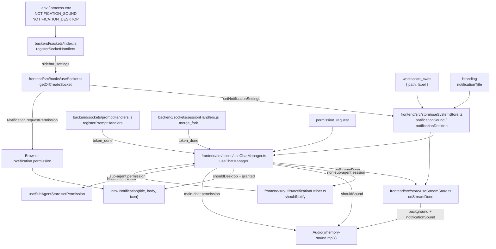

# Notification System

The notification system alerts users when background chat sessions finish and when main-chat permission requests need attention. It combines environment-backed defaults, Socket.IO hydration, Zustand state, native browser notifications, and MP3 playback.

This guide matters because notification behavior is split across backend socket hydration, frontend completion handling, stream finalization, browser permission state, provider branding, and a pure helper that only decides whether a completed session is eligible for the desktop/body notification path.

---

## Overview

### What It Does

- Hydrates notification defaults from backend environment variables through the `sidebar_settings` socket event.
- Stores `notificationSound` and `notificationDesktop` in `useSystemStore` for completion handlers.
- Requests browser desktop notification permission when desktop notifications are enabled and permission is still `default`.
- Emits `token_done` when prompt processing, prompt errors, stale sessions, and fork merge parent prompts finish.
- Plays `/memory-sound.mp3` for background completion paths and main-chat permission requests.
- Shows a native `Notification` for eligible non-sub-agent background sessions when desktop notifications are enabled and browser permission is `granted`.
- Adds workspace context to the desktop notification body when a session `cwd` exactly matches a configured workspace path.

### Why This Matters

- Background agents can finish while the user is reading another session, so completion feedback must use ACP session identity rather than UI tab identity.
- Desktop notification permission is browser-owned state, while notification defaults are backend-owned environment state.
- Audio has more than one call site; completion sounds and permission-request sounds are controlled by different paths.
- Provider branding supplies the desktop notification title, so the UI must avoid hardcoded provider names.
- Tests cover the pure helper and several socket events, but browser API side effects need focused tests when behavior changes.

### Architectural Role

- Backend socket layer: `backend/sockets/index.js`, `backend/sockets/promptHandlers.js`, `backend/sockets/sessionHandlers.js`, and `backend/sockets/systemSettingsHandlers.js`.
- Frontend socket layer: `frontend/src/hooks/useSocket.ts` and `frontend/src/hooks/useChatManager.ts`.
- Frontend state layer: `frontend/src/store/useSystemStore.ts`, `frontend/src/store/useSessionLifecycleStore.ts`, and `frontend/src/store/useStreamStore.ts`.
- Pure notification logic: `frontend/src/utils/notificationHelper.ts`.
- Browser APIs and assets: `Notification`, `Audio`, `frontend/public/memory-sound.mp3`, and `/vite.svg`.

---

## How It Works - End-to-End Flow

### 1. Backend Hydrates Notification Defaults on Socket Connection

File: `backend/sockets/index.js` (Function: `registerSocketHandlers`, Socket event: `sidebar_settings`)

`registerSocketHandlers` sends notification defaults to each connecting socket along with the sidebar delete mode.

```javascript
// FILE: backend/sockets/index.js (Function: registerSocketHandlers, Socket event: sidebar_settings)
socket.emit('sidebar_settings', {
  deletePermanent: String(process.env.SIDEBAR_DELETE_PERMANENT || '').trim().toLowerCase() === 'true',
  notificationSound: process.env.NOTIFICATION_SOUND !== 'false',
  notificationDesktop: process.env.NOTIFICATION_DESKTOP === 'true',
});
```

`NOTIFICATION_SOUND` is enabled unless the exact string is `false`. `NOTIFICATION_DESKTOP` is enabled only when the exact string is `true`.

### 2. Frontend Stores Settings and Requests Desktop Permission

File: `frontend/src/hooks/useSocket.ts` (Function: `getOrCreateSocket`, Socket event: `sidebar_settings`)

The singleton socket stores the settings in `useSystemStore`. Browser permission is requested only when desktop notifications are enabled and the browser reports `Notification.permission === 'default'`.

```typescript
// FILE: frontend/src/hooks/useSocket.ts (Function: getOrCreateSocket, Socket event: sidebar_settings)
_socket.on('sidebar_settings', (data: { deletePermanent: boolean; notificationSound: boolean; notificationDesktop: boolean }) => {
  useSystemStore.getState().setDeletePermanent(data.deletePermanent);
  useSystemStore.getState().setNotificationSettings(data.notificationSound, data.notificationDesktop);
  if (data.notificationDesktop && Notification.permission === 'default') Notification.requestPermission();
});
```

### 3. Store Defaults Exist Before Socket Hydration

File: `frontend/src/store/useSystemStore.ts` (Store: `useSystemStore`, State: `notificationSound`, `notificationDesktop`, Action: `setNotificationSettings`)

The store defaults match `.env.example`: sound enabled, desktop disabled. `setNotificationSettings` is an in-memory Zustand update; runtime socket hydration supplies the backend values.

```typescript
// FILE: frontend/src/store/useSystemStore.ts (Store: useSystemStore)
notificationSound: true,
notificationDesktop: false,
setNotificationSettings: (sound: boolean, desktop: boolean) => set({
  notificationSound: sound,
  notificationDesktop: desktop
}),
```

### 4. Backend Emits Completion Events

File: `backend/sockets/promptHandlers.js` (Function: `registerPromptHandlers`, Socket event: `prompt`, Emit: `token_done`)

Prompt handling emits `token_done` on success and on recoverable error paths. The event payload uses ACP `sessionId`, not frontend UI session ID.

```javascript
// FILE: backend/sockets/promptHandlers.js (Function: registerPromptHandlers, Emit: token_done)
io.to('session:' + sessionId).emit('token_done', {
  providerId: resolvedProviderId,
  sessionId,
});
```

Error paths include `error: true`:

```javascript
// FILE: backend/sockets/promptHandlers.js (Function: registerPromptHandlers, Emit: token_done error)
io.to('session:' + sessionId).emit('token_done', {
  providerId: resolvedProviderId,
  sessionId,
  error: true,
});
```

File: `backend/sockets/sessionHandlers.js` (Function: `registerSessionHandlers`, Socket event: `merge_fork`, Emit: `token_done`)

Fork merge prompts the parent session asynchronously and emits `token_done` for the parent ACP session after the merge prompt resolves.

```javascript
// FILE: backend/sockets/sessionHandlers.js (Function: registerSessionHandlers, Socket event: merge_fork)
io.to(`session:${parentSession.acpSessionId}`).emit('merge_message', {
  sessionId: parentSession.acpSessionId,
  text: mergeMessage
});
await acpClient.transport.sendRequest('session/prompt', {
  sessionId: parentSession.acpSessionId,
  prompt: [{ type: 'text', text: mergeMessage }]
});
io.to(`session:${parentSession.acpSessionId}`).emit('token_done', {
  sessionId: parentSession.acpSessionId
});
```

### 5. Frontend Dispatches Completion Through Stream Finalization

File: `frontend/src/hooks/useChatManager.ts` (Hook: `useChatManager`, Socket event: `token_done`)

`useChatManager` always sends completion data to `useStreamStore.onStreamDone` before running the desktop/body notification path.

```typescript
// FILE: frontend/src/hooks/useChatManager.ts (Hook: useChatManager, Socket event: token_done)
socket.on('token_done', (data: StreamDoneData) => {
  onStreamDone(socket, data);
  const { notificationSound, notificationDesktop, workspaceCwds, branding } = useSystemStore.getState();
  const activeAcpId = useSessionLifecycleStore.getState().sessions
    .find(s => s.id === useSessionLifecycleStore.getState().activeSessionId)?.acpSessionId;
  const session = useSessionLifecycleStore.getState().sessions.find(s => s.acpSessionId === data.sessionId);
  // desktop/body path continues below
});
```

### 6. Stream Finalization Marks Unread State and Plays Background Sound

File: `frontend/src/store/useStreamStore.ts` (Store action: `onStreamDone`, Search token: `isBackground`)

After the stream queue drains or times out, `onStreamDone` marks the session as not typing, sets `hasUnreadResponse` when the completed UI session is not active, saves a snapshot, fetches stats, and plays the completion sound for background sessions when `notificationSound` is true.

```typescript
// FILE: frontend/src/store/useStreamStore.ts (Store action: onStreamDone, Search token: isBackground)
const activeId = state.activeSessionId;
const isBackground = state.sessions.some(s => s.acpSessionId === sessionId && s.id !== activeId);
if (isBackground && useSystemStore.getState().notificationSound) {
  try { new Audio('/memory-sound.mp3').play()?.catch(() => {}); }
  catch { /* audio may not be available */ }
}
```

This sound path is completion-scoped and does not create a desktop notification.

### 7. Completion Eligibility Uses the Active ACP Session ID

File: `frontend/src/hooks/useChatManager.ts` (Hook: `useChatManager`, Socket event: `token_done`, Helper: `shouldNotifyHelper`)

The desktop/body path finds the completed `ChatSession` by `acpSessionId`, skips sub-agent sessions, and passes ACP IDs into `shouldNotifyHelper`.

```typescript
// FILE: frontend/src/hooks/useChatManager.ts (Hook: useChatManager, Socket event: token_done)
const activeAcpId = useSessionLifecycleStore.getState().sessions
  .find(s => s.id === useSessionLifecycleStore.getState().activeSessionId)?.acpSessionId;
const session = useSessionLifecycleStore.getState().sessions.find(s => s.acpSessionId === data.sessionId);
if (session && !session.isSubAgent) {
  const result = shouldNotifyHelper(
    data.sessionId,
    activeAcpId,
    session.name,
    workspaceCwds as readonly { path: string; label: string }[],
    session.cwd,
    { notificationSound, notificationDesktop }
  );
}
```

The `activeSessionId` store field is a UI ID. It must be resolved to the active session's `acpSessionId` before comparison with `token_done.sessionId`.

### 8. The Pure Helper Builds the Notification Result

File: `frontend/src/utils/notificationHelper.ts` (Function: `shouldNotify`, Interfaces: `NotificationSettings`, `NotificationResult`)

`shouldNotify` is pure. It suppresses active-session completions and unnamed sessions, performs exact workspace path matching, and returns the settings values unchanged.

```typescript
// FILE: frontend/src/utils/notificationHelper.ts (Function: shouldNotify)
export function shouldNotify(
  sessionAcpId: string,
  activeAcpId: string | null | undefined,
  sessionName: string | undefined,
  workspaceCwds: readonly { path: string; label: string }[],
  sessionCwd: string | null | undefined,
  settings: NotificationSettings
): NotificationResult | null {
  if (sessionAcpId === activeAcpId) return null;
  if (!sessionName) return null;

  const wsLabel = sessionCwd ? workspaceCwds.find(w => w.path === sessionCwd)?.label : undefined;
  const body = `${sessionName}${wsLabel ? ` (${wsLabel})` : ''} agent has finished`;

  return {
    shouldSound: settings.notificationSound,
    shouldDesktop: settings.notificationDesktop,
    body,
  };
}
```

### 9. Completion Side Effects Use Browser APIs

File: `frontend/src/hooks/useChatManager.ts` (Hook: `useChatManager`, Socket event: `token_done`, Browser APIs: `Audio`, `Notification`)

When `shouldNotifyHelper` returns a result, `useChatManager` plays the same MP3 if `result.shouldSound` is true. It creates a native desktop notification only when `result.shouldDesktop` is true and browser permission is `granted`.

```typescript
// FILE: frontend/src/hooks/useChatManager.ts (Hook: useChatManager, Socket event: token_done)
if (result) {
  if (result.shouldSound) {
    try { new Audio('/memory-sound.mp3').play()?.catch(() => {}); }
    catch { /* audio unavailable */ }
  }
  if (result.shouldDesktop && Notification.permission === 'granted') {
    new Notification(branding.notificationTitle, { body: result.body, icon: '/vite.svg' });
  }
}
```

The notification title comes from `useSystemStore.branding.notificationTitle`, which is hydrated from provider branding through the backend `branding` socket event. The store fallback title is `ACP UI`.

### 10. Main Permission Requests Play a Separate Attention Sound

File: `frontend/src/hooks/useChatManager.ts` (Hook: `useChatManager`, Socket event: `permission_request`)

Main-chat permission requests play `/memory-sound.mp3` before entering the unified timeline. Sub-agent permission requests are routed to `useSubAgentStore.setPermission` and return before this sound path.

```typescript
// FILE: frontend/src/hooks/useChatManager.ts (Hook: useChatManager, Socket event: permission_request)
const subAgent = agents.find(a => a.acpSessionId === evtData.sessionId);
if (subAgent) {
  useSubAgentStore.getState().setPermission(subAgent.acpSessionId, {
    id: evtData.id,
    sessionId: evtData.sessionId,
    options: evtData.options || [],
    toolCall: evtData.toolCall,
  });
  return;
}
new Audio('/memory-sound.mp3').play()?.catch(() => {});
onStreamEvent({ ...event, type: 'permission_request' });
```

This permission-request sound does not consult `notificationSound` or `notificationDesktop`.

---

## Architecture Diagram



---

## Critical Contract

### Event and ID Contract

- `sidebar_settings` payload fields are `deletePermanent`, `notificationSound`, and `notificationDesktop`.
- `token_done.sessionId` is an ACP session ID. It must be compared to `ChatSession.acpSessionId`, not `ChatSession.id` or `activeSessionId` directly.
- `StreamDoneData` in `frontend/src/types.ts` contains `sessionId` and optional `error`.
- `useChatManager` calls `onStreamDone(socket, data)` for all `token_done` events before running completion notification side effects.

### Eligibility Contract

- `shouldNotify` returns `null` when the completed ACP session is the active ACP session.
- `shouldNotify` returns `null` when `sessionName` is missing.
- `shouldNotify` does not check sub-agent status; `useChatManager` performs `!session.isSubAgent` before calling it.
- `shouldNotify` does not check browser permission; `useChatManager` checks `Notification.permission === 'granted'` before creating `new Notification`.
- `shouldNotify` returns settings values unchanged, so callers decide which side effects run.

### Audio Contract

- Completion audio is controlled by `notificationSound` in both `useStreamStore.onStreamDone` and the `useChatManager` `token_done` result path.
- Main-chat `permission_request` audio is independent of `notificationSound` and `notificationDesktop`.
- All audio paths use `/memory-sound.mp3`, served by `frontend/public/memory-sound.mp3`.
- Audio playback failures are caught or ignored; no UI error is shown.

### Desktop Notification Contract

- Desktop notification opt-in starts with `NOTIFICATION_DESKTOP=true` on the backend.
- Permission prompting happens in `useSocket.ts` during `sidebar_settings` handling when browser permission is `default`.
- Desktop notification display happens in `useChatManager.ts` during `token_done` handling when browser permission is `granted`.
- The title is `branding.notificationTitle`; the fallback branding title in `useSystemStore` is `ACP UI`.
- The body is built by `shouldNotify` as `Session Name agent has finished` or `Session Name (Workspace Label) agent has finished`.

---

## Configuration/Data Flow

### Environment Keys

| Key | Runtime parser | Default behavior | Purpose |
|---|---|---|---|
| `NOTIFICATION_SOUND` | `backend/sockets/index.js` (`process.env.NOTIFICATION_SOUND !== 'false'`) | Enabled when unset or any value other than exact `false` | Controls completion sounds in `useStreamStore.onStreamDone` and `useChatManager` `token_done` result path |
| `NOTIFICATION_DESKTOP` | `backend/sockets/index.js` (`process.env.NOTIFICATION_DESKTOP === 'true'`) | Disabled unless exact `true` | Controls browser permission request and desktop notification side effect |
| `SIDEBAR_DELETE_PERMANENT` | `backend/sockets/index.js` (`String(...).trim().toLowerCase() === 'true'`) | Disabled unless truthy after trim/lowercase parsing | Shares the `sidebar_settings` payload but is not notification-specific |
| `UI_NOTIFICATION_DELAY_MS` | Declared in `.env.example`; no backend or frontend notification source reads this key | No runtime notification effect | Reserved configuration key in the example file |

### Runtime Configuration Flow

```text
.env / process.env
  -> backend/sockets/index.js registerSocketHandlers
  -> socket.emit('sidebar_settings', { notificationSound, notificationDesktop })
  -> frontend/src/hooks/useSocket.ts getOrCreateSocket
  -> useSystemStore.setNotificationSettings(sound, desktop)
  -> frontend/src/store/useStreamStore.ts onStreamDone
  -> frontend/src/hooks/useChatManager.ts token_done
```

### Environment Editing Flow

File: `frontend/src/components/SystemSettingsModal.tsx` (Component: `SystemSettingsModal`, Socket events: `get_env`, `update_env`)

The Environment tab fetches current variables with `get_env` and sends edits with `update_env`.

```typescript
// FILE: frontend/src/components/SystemSettingsModal.tsx (Component: SystemSettingsModal, Handler: updateEnv)
const updateEnv = (key: string, value: string) => {
  setEnvVars(prev => ({ ...prev, [key]: value }));
  socket?.emit('update_env', { key, value });
};
```

File: `backend/sockets/systemSettingsHandlers.js` (Function: `registerSystemSettingsHandlers`, Socket events: `get_env`, `update_env`)

`update_env` writes `.env` and updates `process.env[key]` in the running backend process.

```javascript
// FILE: backend/sockets/systemSettingsHandlers.js (Function: registerSystemSettingsHandlers, Socket event: update_env)
fs.writeFileSync(ENV_PATH, content, 'utf8');
process.env[key] = value;
callback?.({ success: true });
```

Notification store hydration still flows through `sidebar_settings`; existing sockets do not receive a dedicated notification-settings event from `update_env`.

### Workspace and Branding Data Flow

- `workspace_cwds` is emitted by `backend/sockets/index.js` from `loadWorkspaces()` and stored with `useSystemStore.setWorkspaceCwds` in `frontend/src/hooks/useSocket.ts`.
- `branding` is emitted by `backend/sockets/index.js` from provider config and stored with `useSystemStore.setProviderBranding` in `frontend/src/hooks/useSocket.ts`.
- `shouldNotify` reads workspace labels through its `workspaceCwds` argument and requires exact string equality between `session.cwd` and `workspace.path`.
- `new Notification` reads the title from `useSystemStore.getState().branding.notificationTitle`.

---

## Component Reference

### Backend

| Area | File | Stable Anchors | Purpose |
|---|---|---|---|
| Socket hydration | `backend/sockets/index.js` | `registerSocketHandlers`, `sidebar_settings`, `workspace_cwds`, `branding`, `buildBrandingPayload`, `getProviderPayloads` | Sends notification defaults, workspace paths, and provider branding to connecting clients |
| Prompt completion | `backend/sockets/promptHandlers.js` | `registerPromptHandlers`, `prompt`, `token_done`, `autoSaveTurn`, `statsCaptures` | Emits `token_done` for successful prompts and error completions |
| Fork merge completion | `backend/sockets/sessionHandlers.js` | `registerSessionHandlers`, `merge_fork`, `merge_message`, `token_done` | Emits parent-session completion after merge prompt injection |
| Environment editing | `backend/sockets/systemSettingsHandlers.js` | `registerSystemSettingsHandlers`, `get_env`, `update_env`, `ENV_PATH` | Reads/writes `.env` and updates `process.env` |
| Example config | `.env.example` | `NOTIFICATION_SOUND`, `NOTIFICATION_DESKTOP`, `UI_NOTIFICATION_DELAY_MS` | Documents default notification-related keys |

### Frontend

| Area | File | Stable Anchors | Purpose |
|---|---|---|---|
| Socket singleton | `frontend/src/hooks/useSocket.ts` | `getOrCreateSocket`, `sidebar_settings`, `workspace_cwds`, `branding`, `Notification.requestPermission` | Receives backend settings and starts browser permission flow |
| Completion dispatcher | `frontend/src/hooks/useChatManager.ts` | `useChatManager`, `token_done`, `permission_request`, `shouldNotifyHelper`, `new Audio`, `new Notification` | Handles completion side effects and permission-request audio |
| Stream finalization | `frontend/src/store/useStreamStore.ts` | `useStreamStore`, `onStreamDone`, `isBackground`, `save_snapshot`, `fetchStats` | Marks responses complete, sets unread state, saves snapshots, plays background completion sound |
| Notification helper | `frontend/src/utils/notificationHelper.ts` | `NotificationSettings`, `NotificationResult`, `shouldNotify` | Pure completion eligibility and body builder |
| System state | `frontend/src/store/useSystemStore.ts` | `notificationSound`, `notificationDesktop`, `setNotificationSettings`, `branding.notificationTitle`, `setProviderBranding`, `setWorkspaceCwds` | Holds notification settings, branding title, and workspace labels |
| Environment UI | `frontend/src/components/SystemSettingsModal.tsx` | `SystemSettingsModal`, `get_env`, `update_env`, `updateEnv` | General environment variable editor that can edit notification keys |
| Types | `frontend/src/types.ts` | `StreamDoneData`, `ProviderBranding`, `WorkspaceCwd` | Shared frontend shapes used by notification flow |
| Asset | `frontend/public/memory-sound.mp3` | Static asset path `/memory-sound.mp3` | MP3 used by completion and permission-request audio paths |

---

## Gotchas

### 1. ACP Session IDs and UI Session IDs Are Different

`token_done.sessionId` is an ACP session ID. `useSessionLifecycleStore.activeSessionId` is a UI session ID. Resolve the active `ChatSession` first and compare against its `acpSessionId`.

Search anchors: `frontend/src/hooks/useChatManager.ts` (`token_done`, `activeAcpId`), `frontend/src/utils/notificationHelper.ts` (`shouldNotify`).

### 2. Completion Audio Has Two Call Sites

`useStreamStore.onStreamDone` can play the background completion sound after queue drain. `useChatManager` can also play sound from the `shouldNotify` result. Keep both paths in sync when changing completion sound semantics.

Search anchors: `frontend/src/store/useStreamStore.ts` (`onStreamDone`, `isBackground`), `frontend/src/hooks/useChatManager.ts` (`token_done`, `result.shouldSound`).

### 3. Permission-Request Audio Is Separate From Completion Settings

Main-chat `permission_request` audio does not read `notificationSound` or `notificationDesktop`. It plays `/memory-sound.mp3` before adding the permission request to the timeline. Sub-agent permission requests return through `useSubAgentStore.setPermission` first.

Search anchors: `frontend/src/hooks/useChatManager.ts` (`permission_request`, `useSubAgentStore.setPermission`).

### 4. Desktop Permission Is Browser State

`Notification.requestPermission()` runs only when `sidebar_settings.notificationDesktop` is true and browser permission is `default`. If permission is `denied`, the completion path checks `Notification.permission === 'granted'` and suppresses desktop notifications.

Search anchors: `frontend/src/hooks/useSocket.ts` (`Notification.requestPermission`), `frontend/src/hooks/useChatManager.ts` (`Notification.permission`).

### 5. Environment Boolean Parsing Is Exact for Notification Keys

`NOTIFICATION_SOUND=false` disables sound. Other values, including `False`, `0`, or an unset variable, enable sound. `NOTIFICATION_DESKTOP=true` enables desktop notifications. Other values disable desktop notifications.

Search anchor: `backend/sockets/index.js` (`sidebar_settings`).

### 6. Workspace Labels Require Exact Path Equality

`shouldNotify` compares `session.cwd` to `workspace.path` with exact string equality. Case, slash style, trailing separators, and path normalization differences prevent workspace labels from appearing in the notification body.

Search anchors: `frontend/src/utils/notificationHelper.ts` (`workspaceCwds.find`), `frontend/src/hooks/useSocket.ts` (`workspace_cwds`).

### 7. Sub-Agent Desktop Notifications Are Gated in `useChatManager`

`useChatManager` checks `!session.isSubAgent` before calling `shouldNotifyHelper` for the desktop/body path. `shouldNotify` itself has no sub-agent parameter.

Search anchors: `frontend/src/hooks/useChatManager.ts` (`token_done`, `isSubAgent`), `frontend/src/utils/notificationHelper.ts` (`shouldNotify`).

### 8. Audio Failures Are Silent

Completion audio catches synchronous construction failures and ignores rejected `play()` promises. Permission-request audio ignores rejected `play()` promises. Browser autoplay policy, muted tabs, missing assets, or fetch failures do not surface an in-app error.

Search anchors: `frontend/src/hooks/useChatManager.ts` (`new Audio('/memory-sound.mp3')`), `frontend/src/store/useStreamStore.ts` (`new Audio('/memory-sound.mp3')`).

### 9. `update_env` Does Not Push Notification Settings to Existing Sockets

`update_env` updates `.env` and `process.env`, but notification store values are hydrated by `sidebar_settings` on socket connection. A notification-specific live update requires an emitted event and a frontend handler.

Search anchors: `backend/sockets/systemSettingsHandlers.js` (`update_env`), `backend/sockets/index.js` (`sidebar_settings`), `frontend/src/hooks/useSocket.ts` (`sidebar_settings`).

### 10. Desktop Title Depends on Active Branding

`new Notification` uses `useSystemStore.branding.notificationTitle`. If branding is missing this field, the store fallback title is `ACP UI`.

Search anchors: `frontend/src/store/useSystemStore.ts` (`branding.notificationTitle`), `frontend/src/hooks/useSocket.ts` (`branding`), `frontend/src/hooks/useChatManager.ts` (`new Notification`).

---

## Unit Tests

### Frontend Tests

| File | Test Names | Verified Behavior |
|---|---|---|
| `frontend/src/test/notificationHelper.test.ts` | `returns null when sessionId matches activeAcpId`; `returns notification result for background session`; `includes workspace label in body when cwd matches`; `excludes workspace label when no cwd match`; `respects sound/desktop settings independently`; `returns null when sessionName is undefined` | Pure `shouldNotify` eligibility, body generation, workspace labels, and settings propagation |
| `frontend/src/test/useSocket.test.ts` | `handles "sidebar_settings" event` | `setDeletePermanent` and `setNotificationSettings` are called from socket payload |
| `frontend/src/test/useChatManager.test.ts` | `handles "token_done" event`; `handles "permission_request" for sub-agent` | `token_done` dispatches to `onStreamDone`; sub-agent permission requests route to sub-agent state |
| `frontend/src/test/useStreamStore.test.ts` | `ensureAssistantMessage creates a placeholder message`; `onStreamToken queues text and triggers typewriter`; stream finalization tests around `onStreamDone` behavior | Stream store lifecycle that completion notification sound depends on |

Run focused frontend tests:

```powershell
cd frontend; .\node_modules\.bin\vitest.cmd run src/test/notificationHelper.test.ts src/test/useSocket.test.ts src/test/useChatManager.test.ts src/test/useStreamStore.test.ts
```

### Backend Tests

| File | Test Names | Verified Behavior |
|---|---|---|
| `backend/test/sockets-index.test.js` | `emits sidebar_settings on connection` | Socket connection emits `sidebar_settings` payload |
| `backend/test/promptHandlers.test.js` | `should handle incoming prompt and send to ACP`; `should handle prompt errors and emit error token`; `should reject prompts to sessions not loaded in current process`; `outer catch emits error token/token_done and does not call onPromptCompleted when onPromptStarted throws` | Prompt success and error paths emit `token_done` with ACP `sessionId` |
| `backend/test/sessionHandlers.test.js` | `handles merge_fork`; `merge_fork returns error when parent session not found`; `handles merge_fork when not a valid fork` | Fork merge flow prompts the parent session and covers merge validation errors |
| `backend/test/subAgentHandlers.test.js` | `emits sub_agent_snapshot for each running sub-agent matching parentAcpSessionId` | Sub-agent snapshot flow that shares room/session context with main completion handling |

Run focused backend tests:

```powershell
cd backend; .\node_modules\.bin\vitest.cmd run test/sockets-index.test.js test/promptHandlers.test.js test/sessionHandlers.test.js test/subAgentHandlers.test.js
```

### Coverage Boundaries

- Direct frontend tests cover `shouldNotify`, `sidebar_settings`, `token_done` dispatch, and sub-agent permission routing.
- Direct frontend tests do not assert `new Notification` construction, `Notification.requestPermission`, or MP3 playback side effects.
- Direct backend tests assert `sidebar_settings` emission and `token_done` emission paths, but `sockets-index.test.js` only asserts `deletePermanent` within the `sidebar_settings` payload.

---

## How to Use This Guide

### For Implementing or Extending This Feature

1. Start at `backend/sockets/index.js` (`registerSocketHandlers`, `sidebar_settings`) when changing environment defaults or socket payload shape.
2. Update `frontend/src/hooks/useSocket.ts` (`sidebar_settings`) when adding a frontend store field or browser permission behavior.
3. Update `frontend/src/store/useSystemStore.ts` (`notificationSound`, `notificationDesktop`, `setNotificationSettings`) when changing notification state shape.
4. Use `frontend/src/utils/notificationHelper.ts` (`shouldNotify`) for pure eligibility or body-format changes.
5. Update both completion audio call sites when changing sound semantics: `frontend/src/store/useStreamStore.ts` (`onStreamDone`) and `frontend/src/hooks/useChatManager.ts` (`token_done`).
6. Keep permission-request audio changes separate in `frontend/src/hooks/useChatManager.ts` (`permission_request`).
7. Use `frontend/src/types.ts` (`StreamDoneData`, `ProviderBranding`) when changing payload or branding type contracts.
8. Add or update tests in the frontend and backend test files listed above.

### For Debugging Notification Issues

1. Inspect backend `sidebar_settings` values in `backend/sockets/index.js` and the runtime values of `NOTIFICATION_SOUND` and `NOTIFICATION_DESKTOP`.
2. Confirm the frontend receives `sidebar_settings` in `frontend/src/hooks/useSocket.ts` and that `useSystemStore.setNotificationSettings` is called.
3. Check `Notification.permission` in the browser console for desktop notifications.
4. Verify `token_done` carries an ACP `sessionId` and that the matching `ChatSession.acpSessionId` exists in `useSessionLifecycleStore`.
5. Compare the completed session's UI ID against `activeSessionId`; compare the completed session's ACP ID against `activeAcpId`.
6. Check `session.isSubAgent` before expecting a desktop notification from the `token_done` path.
7. Check `session.name`; `shouldNotify` returns `null` when it is missing.
8. Check `session.cwd` and `workspaceCwds` for exact path equality when workspace labels are absent.
9. Verify `/memory-sound.mp3` exists in `frontend/public` and is served by the frontend build.
10. Use the focused tests above to separate helper logic failures from socket dispatch and browser side-effect issues.

---

## Summary

- Notification defaults enter the app through `sidebar_settings` from `backend/sockets/index.js`.
- `NOTIFICATION_SOUND` is disabled only by exact `false`; `NOTIFICATION_DESKTOP` is enabled only by exact `true`.
- `token_done.sessionId` is an ACP session ID and must be matched against `ChatSession.acpSessionId`.
- `useStreamStore.onStreamDone` handles stream finalization, unread state, snapshot saving, stats fetch, and one background completion sound path.
- `useChatManager` handles the desktop/body completion path through `shouldNotify` and browser APIs.
- `shouldNotify` is pure: it checks active session identity, requires a session name, performs exact workspace matching, and returns settings values unchanged.
- Main-chat `permission_request` audio is separate from completion notifications and does not consult notification settings.
- Desktop notification display depends on `Notification.permission === 'granted'` and uses `branding.notificationTitle` for the title.
