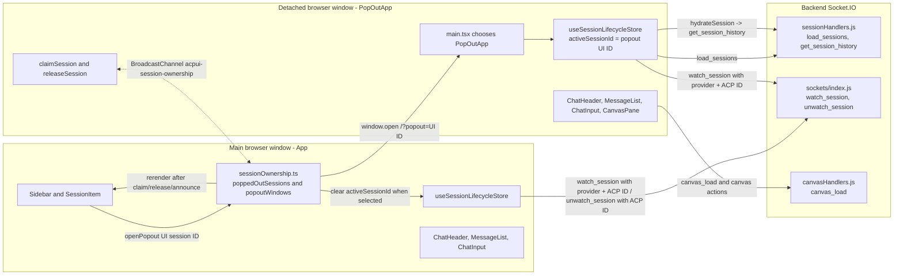

# Feature Doc - Pop Out Chat

Pop Out Chat opens a single chat session in a detached browser window while the main window keeps navigation and other sessions available. The feature is easy to misread because ownership coordination is split between `sessionOwnership.ts`, `App`, `PopOutApp`, backend socket rooms, and UI components that gate actions by the `?popout` URL parameter.

---

## Overview

### What It Does
- Opens `/?popout={uiSessionId}` in a named browser window with `width=1000,height=750`.
- Routes detached windows to `PopOutApp` instead of the normal `App` shell.
- Claims and releases session ownership through the `acpui-session-ownership` `BroadcastChannel`.
- Clears the main window's active session when the popped session is active there.
- Marks popped-out sessions in the sidebar and redirects sidebar clicks to the detached window when a window reference exists.
- Reuses `ChatHeader`, `MessageList`, `ChatInput`, and `CanvasPane` inside the detached window without rendering the sidebar or modal roots.

### Why This Matters
- The UI must avoid editing or actively viewing the same session in two windows.
- BroadcastChannel state is in-memory and per browser context, so session ownership must be treated as ephemeral coordination.
- Socket room membership depends on `watch_session` and `unwatch_session`, which use ACP session IDs rather than UI session IDs.
- Pop-out mode changes header controls and modal availability while keeping chat input, canvas, terminal, and model controls available.
- This is a frontend orchestration feature with backend Socket.IO support; it has no provider-specific behavior.

---

## How It Works - End-to-End Flow

### 1. Sidebar session rows expose the pop-out action

File: `frontend/src/components/SessionItem.tsx` (Component: `SessionItem`, Functions: `openPopout`, `isSessionPoppedOut`, `focusPopout`)

```tsx
// FILE: frontend/src/components/SessionItem.tsx (Component: SessionItem)
<div
  className={`session-item ... ${isSessionPoppedOut(session.id) ? 'popped-out' : ''}`}
  onClick={() => !isEditing && (isSessionPoppedOut(session.id) ? focusPopout(session.id) : onSelect())}
>
  ...
  <button className="session-action-btn" title="Pop Out" onClick={(e) => { e.stopPropagation(); openPopout(session.id); }}>
    <ExternalLink size={12} />
  </button>
</div>
```

Normal session rows show the `Pop Out` action. Sub-agent rows use their own action branch and do not render the pop-out button. When a session is marked as owned by another window, the row receives the `popped-out` class and the row click attempts `focusPopout(session.id)` rather than selecting the session in the main window.

### 2. `openPopout` creates or focuses the detached window

File: `frontend/src/lib/sessionOwnership.ts` (Function: `openPopout`)

```ts
// FILE: frontend/src/lib/sessionOwnership.ts (Function: openPopout)
export async function openPopout(sessionId: string): Promise<Window | null> {
  const existing = popoutWindows.get(sessionId);
  if (existing && !existing.closed) {
    existing.focus();
    return existing;
  }

  const win = window.open(`/?popout=${sessionId}`, `popout-${sessionId}`, 'width=1000,height=750');
  if (win) {
    popoutWindows.set(sessionId, win);
    const { activeSessionId } = useSessionLifecycleStore.getState();
    if (activeSessionId === sessionId) {
      useSessionLifecycleStore.getState().setActiveSessionId(null);
    }
  }
  return win;
}
```

`popoutWindows` stores `Window` references by UI session ID in the opener window. A second click for the same open session focuses the existing window. When the opened session is active in the main window, `setActiveSessionId(null)` moves the main shell to the empty-state view and triggers the normal session switch effect.

### 3. Main `App` listens for ownership changes and manages socket rooms

File: `frontend/src/App.tsx` (Component: `App`, Function: `setOwnershipChangeCallback`, Socket events: `watch_session`, `unwatch_session`, `canvas_load`)

```tsx
// FILE: frontend/src/App.tsx (Component: App)
useEffect(() => {
  setOwnershipChangeCallback(() => forceUpdate(n => n + 1));
}, []);

useEffect(() => {
  if (activeSessionId !== lastActiveSessionIdRef.current) {
    const oldSession = sessions.find(s => s.id === lastActiveSessionIdRef.current);
    const newSession = sessions.find(s => s.id === activeSessionId);
    if (oldSession?.acpSessionId && socket && !oldSession.isTyping) socket.emit('unwatch_session', { sessionId: oldSession.acpSessionId });
    if (newSession?.acpSessionId && socket) {
      socket.emit('watch_session', { providerId: newSession.provider, sessionId: newSession.acpSessionId });
    }
    ...
  }

  if (activeSessionId && socket) {
    socket.emit('canvas_load', { sessionId: activeSessionId }, ...);
  }
}, [activeSessionId, socket, ...]);
```

`setOwnershipChangeCallback` forces a React re-render when `sessionOwnership.ts` receives `claim`, `release`, or `announce` messages from another window. The session switch effect handles room changes for the main window: the former active ACP session is unwatched when appropriate, the selected ACP session is watched, and canvas artifacts load for the selected UI session.

### 4. `main.tsx` selects the pop-out root by URL parameter

File: `frontend/src/main.tsx` (Bootstrap branch: `isPopout`)

```tsx
// FILE: frontend/src/main.tsx (Bootstrap branch: isPopout)
const isPopout = new URLSearchParams(window.location.search).has('popout');

createRoot(document.getElementById('root')!).render(
  <StrictMode>
    {isPopout ? <PopOutApp /> : <App />}
  </StrictMode>,
);
```

The detached window has the same bundled frontend code as the main window. The `popout` query parameter selects `PopOutApp`, which omits main-window navigation and settings modal roots but still mounts the blocking `ConfigErrorModal` for startup JSON diagnostics.

### 5. `PopOutApp` claims ownership and hydrates the target session

File: `frontend/src/PopOutApp.tsx` (Component: `PopOutApp`, Function: `claimSession`, Store action: `hydrateSession`, Socket events: `load_sessions`, `watch_session`)

```tsx
// FILE: frontend/src/PopOutApp.tsx (Component: PopOutApp)
const popoutSessionId = new URLSearchParams(window.location.search).get('popout')!;

useEffect(() => {
  if (!socket || !popoutSessionId || ready) return;

  claimSession(popoutSessionId);
  useSessionLifecycleStore.setState({ activeSessionId: popoutSessionId });

  socket.emit('load_sessions', (res: { sessions?: ChatSession[] }) => {
    if (res.sessions) {
      const mapped = res.sessions.map((s: ChatSession) => ({ ...s, isTyping: false, isWarmingUp: false }));
      useSessionLifecycleStore.setState({ sessions: mapped, activeSessionId: popoutSessionId });

      const session = mapped.find((s: ChatSession) => s.id === popoutSessionId);
      if (session?.acpSessionId) {
        socket.emit('watch_session', { providerId: session.provider, sessionId: session.acpSessionId });
        useSessionLifecycleStore.getState().hydrateSession(socket, popoutSessionId);
      }
      setReady(true);
    }
  });
}, [socket, popoutSessionId, ready]);
```

The detached window uses the UI session ID from the URL for Zustand selection and uses the ACP session ID from the loaded session for the backend room. `load_sessions` populates the pop-out store with the backend session list, then `PopOutApp` keeps `activeSessionId` pinned to the popped session and hydrates that session's timeline.

### 6. Backend socket events provide the session and room contract

Files:
- `backend/sockets/sessionHandlers.js` (Socket events: `load_sessions`, `get_session_history`)
- `backend/sockets/index.js` (Socket events: `watch_session`, `unwatch_session`)
- `backend/sockets/canvasHandlers.js` (Socket event: `canvas_load`)

```js
// FILE: backend/sockets/index.js (Socket events: watch_session, unwatch_session)
socket.on('watch_session', ({ providerId = null, sessionId }) => {
  if (sessionId) {
    socket.join(`session:${sessionId}`);
    void emitStreamResumeSnapshot(socket, { providerId, sessionId })
      .catch(err => writeLog(`[STREAM SNAPSHOT ERR] ${err.message}`));
    emitShellRunSnapshotsForSession(socket, { providerId, sessionId });
    void emitSubAgentSnapshotsForSession(socket, { providerId, sessionId })
      .catch(err => writeLog(`[SUB-AGENT SNAPSHOT ERR] ${err.message}`));
    emitPendingPermissionSnapshot(socket, { providerId, sessionId });
  }
});

socket.on('unwatch_session', ({ sessionId }) => {
  if (sessionId) {
    socket.leave(`session:${sessionId}`);
  }
});
```

`watch_session` and `unwatch_session` operate on ACP session IDs and Socket.IO rooms named `session:{acpSessionId}`. The watch payload also carries `providerId` so reconnect replay can use the correct provider runtime for stream, shell, sub-agent, and pending-permission snapshots. `load_sessions` and `get_session_history` use the database-backed UI session records that connect UI IDs to ACP IDs.

### 7. `PopOutApp` renders the focused chat shell

File: `frontend/src/PopOutApp.tsx` (Component: `PopOutApp`, Hooks: `useScroll`, `useChatManager`, Component: `ConfigErrorModal`, Function: `computeResizeWidthNoSidebar`)

```tsx
// FILE: frontend/src/PopOutApp.tsx (Component: PopOutApp)
return (
  <div className={`app-container ${isCanvasOpen ? 'split-screen' : ''}`}>
    <div className="main-content" style={chatWidth ? { flex: 'none', width: chatWidth } : undefined}>
      <ChatHeader />
      <MessageList ... />
      <ChatInput />
    </div>

    {isCanvasOpen && <div className="canvas-resize-handle" onMouseDown={onResizeStart} />}
    {isCanvasOpen && (
      <ErrorBoundary key={activeSessionId} onError={() => resetCanvas()}>
        <CanvasPane ... />
      </ErrorBoundary>
    )}
    <ConfigErrorModal />
  </div>
);
```

The detached shell has no `Sidebar`, `SessionSettingsModal`, `SystemSettingsModal`, `NotesModal`, `FileExplorer`, or `HelpDocsModal` component roots. It still mounts `ConfigErrorModal`, registers chat socket listeners through `useChatManager`, scroll behavior through `useScroll`, canvas file handlers through `useCanvasStore`, and resize behavior through `computeResizeWidthNoSidebar`. Notes behavior/ownership details are documented in `[Feature Doc] - Notes.md`.

### 8. `ChatHeader` switches controls by pop-out mode

File: `frontend/src/components/ChatHeader/ChatHeader.tsx` (Component: `ChatHeader`, URL parameter: `popout`)

```tsx
// FILE: frontend/src/components/ChatHeader/ChatHeader.tsx (Component: ChatHeader)
const isPopout = new URLSearchParams(window.location.search).has('popout');

{!isPopout && (
  <button onClick={() => setSidebarOpen(true)} className="mobile-header-menu-btn" title="Open Sidebar">
    <Menu size={20} />
  </button>
)}

{!isPopout && (
  <div className="header-actions">
    <button title="File Explorer">...</button>
    <button title="Help">...</button>
    <button title="System Settings">...</button>
  </div>
)}
```

Pop-out headers keep the status indicator, provider/session title, sub-agent label, and workspace label. They hide the mobile sidebar menu plus the File Explorer, Help, and System Settings header actions because those shells are only mounted by `App`.

### 9. `ChatInput` keeps normal chat controls in the detached window

File: `frontend/src/components/ChatInput/ChatInput.tsx` (Component: `ChatInput`, Store actions: `setInput`, `handleSubmit`, `handleCancel`, `openTerminal`, `setIsCanvasOpen`, `toggleAutoScroll`, `handleActiveSessionModelChange`, `handleSetSessionOption`)

```tsx
// FILE: frontend/src/components/ChatInput/ChatInput.tsx (Component: ChatInput)
const input = activeSession ? (inputs[activeSession.id] || '') : '';
const isDisabled = !connected || !isEngineReady || activeSession?.isTyping || activeSession?.isWarmingUp;

<form onSubmit={(e) => {
  e.preventDefault();
  if (activeSession?.isTyping) handleCancel(socket);
  else handleSubmit(socket);
}}>
  <textarea
    value={input}
    onChange={(e) => setInput(activeSession?.id || '', e.target.value)}
    onKeyDown={handleKeyDown}
    disabled={isDisabled}
  />
  ...
</form>
```

`ChatInput` does not branch on `popout`. It follows the detached window's active UI session and per-window Zustand state. File attachments, slash commands, voice input, send/cancel, Terminal, Canvas, Auto-scroll, Merge Fork, reasoning effort controls, context usage, and the footer `ModelSelector` are available when their normal session conditions are met.

### 10. Closing the detached window releases ownership

File: `frontend/src/lib/sessionOwnership.ts` (Functions: `releaseSession`, `beforeunload` listener)

```ts
// FILE: frontend/src/lib/sessionOwnership.ts (Functions: releaseSession, beforeunload listener)
export function releaseSession(sessionId: string) {
  getChannel().postMessage({ type: 'release', sessionId, windowId });
  poppedOutSessions.delete(sessionId);
}

window.addEventListener('beforeunload', () => {
  const popoutId = new URLSearchParams(window.location.search).get('popout');
  if (popoutId) {
    releaseSession(popoutId);
  }
});
```

A pop-out window broadcasts `release` as it unloads. Other windows remove the session from `poppedOutSessions`, delete any opener window reference for that session, and invoke the ownership callback so the sidebar rerenders.

---

## Architecture Diagram



---

## The Critical Contract: Broadcast Ownership Plus Socket Room Isolation

The feature depends on two connected contracts: BroadcastChannel ownership uses UI session IDs, and backend room membership uses ACP session IDs.

### Ownership Message Contract

File: `frontend/src/lib/sessionOwnership.ts` (Type: `OwnershipMessage`, Constant: `CHANNEL_NAME`)

```ts
// FILE: frontend/src/lib/sessionOwnership.ts (Type: OwnershipMessage)
type OwnershipMessage =
  | { type: 'claim'; sessionId: string; windowId: string }
  | { type: 'release'; sessionId: string; windowId: string }
  | { type: 'query' }
  | { type: 'announce'; sessionId: string; windowId: string };
```

- `claim`: a pop-out announces that it owns a UI session ID.
- `release`: a pop-out announces that the UI session ID is available to other windows.
- `query`: a newly initialized channel asks existing pop-outs to announce their claims.
- `announce`: a pop-out answers `query` with the UI session ID it owns.
- `windowId`: self-originated `claim`, `release`, and `announce` messages are ignored by the sender.

### Invariants

- `poppedOutSessions` stores sessions owned by other windows, keyed by UI session ID.
- `popoutWindows` stores opener-owned `Window` references, keyed by UI session ID.
- `SessionItem` must call `isSessionPoppedOut(session.id)` before selecting a session from the sidebar.
- `PopOutApp` must call `claimSession(popoutSessionId)` during initialization and `releaseSession(popoutSessionId)` during unload.
- `PopOutApp` must use the UI session ID for Zustand state and `hydrateSession`, and send provider ID plus ACP session ID to `watch_session`.
- Main `App` must keep `setOwnershipChangeCallback` wired so sidebar state reflects BroadcastChannel messages.

Breaking this contract causes one of three visible failures: the main window can select an active popped session, a closed pop-out can leave stale sidebar state, or a detached window can miss streaming updates because it joined the wrong socket room.

---

## Configuration / Provider Support

Pop Out Chat is provider-agnostic. Providers do not need `provider.json`, branding, model, tool, or protocol changes for this feature.

Runtime dependencies:
- Browser API: `BroadcastChannel` with channel name `acpui-session-ownership`.
- Browser API: `window.open` using URL `/?popout={uiSessionId}` and window name `popout-{uiSessionId}`.
- Frontend route state: query parameter `popout` for detached windows.
- Socket events: `load_sessions`, `get_session_history`, `watch_session`, `unwatch_session`, `canvas_load`, `save_snapshot`, `prompt`, `cancel_prompt`, `set_session_model`, `set_session_option`, `merge_fork`.
- Store keys: `useSessionLifecycleStore.activeSessionId`, `useSessionLifecycleStore.sessions`, `useInputStore.inputs`, `useInputStore.attachmentsMap`, `useCanvasStore.isCanvasOpen`, `useUIStore.isModelDropdownOpen`.

---

## Data Flow / Rendering Pipeline

### URL and Ownership Flow

```text
SessionItem Pop Out button
  -> openPopout(uiSessionId)
  -> window.open('/?popout={uiSessionId}', 'popout-{uiSessionId}', 'width=1000,height=750')
  -> main useSessionLifecycleStore.setActiveSessionId(null) when that session is selected
  -> detached main.tsx renders PopOutApp
  -> PopOutApp claimSession(uiSessionId)
  -> BroadcastChannel claim message reaches main window
  -> main sessionOwnership poppedOutSessions.set(uiSessionId, ownerWindowId)
  -> App ownership callback forces sidebar render
```

### Detached Session Hydration Flow

```text
PopOutApp reads popout UI session ID
  -> socket.emit('load_sessions')
  -> backend sessionHandlers.js returns UI session records
  -> PopOutApp sets useSessionLifecycleStore.sessions and activeSessionId
  -> PopOutApp finds the matching UI session
  -> socket.emit('watch_session', { providerId, sessionId: acpSessionId })
  -> hydrateSession(socket, uiSessionId)
  -> socket.emit('get_session_history', { uiId })
  -> useSessionLifecycleStore updates messages, model state, config options, and ACP session state
  -> ready=true renders ChatHeader, MessageList, ChatInput, and optional CanvasPane
```

### Store Shape by Window

```ts
// Main window state after popping out the selected session
{
  activeSessionId: null,
  sessions: [/* all loaded sessions */],
  // sessionOwnership module state, not Zustand:
  poppedOutSessions: new Map([[uiSessionId, ownerWindowId]]),
  popoutWindows: new Map([[uiSessionId, windowRef]])
}

// Detached window state after load_sessions resolves
{
  activeSessionId: uiSessionId,
  sessions: [/* all loaded sessions with isTyping=false and isWarmingUp=false */],
  inputs: { [uiSessionId]: draftText },
  attachmentsMap: { [uiSessionId]: attachments },
  isCanvasOpen: false | true
}
```

### Header and Input Rendering in Pop-Out Mode

- `ChatHeader` reads `new URLSearchParams(window.location.search).has('popout')` and hides only the sidebar menu, File Explorer action, Help action, and System Settings action.
- `ChatHeader` still renders `StatusIndicator`, provider title, session name, sub-agent suffix, and workspace label.
- `ChatInput` does not read the `popout` query parameter. It uses `activeSessionId`, `activeSession`, provider branding, input store state, canvas store state, and system connectivity exactly as it does in the main shell.
- `ChatInput` can open Terminal and Canvas because `PopOutApp` renders `CanvasPane` and wires canvas handlers.
- `ChatInput` can still set Scratch Pad and chat-config UI flags, but `PopOutApp` does not render `NotesModal` or `SessionSettingsModal`, so those modal roots are unavailable in the detached shell. Notes ownership and contracts: `[Feature Doc] - Notes.md`.

---

## Component Reference

### Frontend

| Area | File | Anchors | Purpose |
|---|---|---|---|
| Routing | `frontend/src/main.tsx` | `isPopout`, `PopOutApp`, `App` | Chooses detached or main root from the `popout` query parameter. |
| Detached root | `frontend/src/PopOutApp.tsx` | `PopOutApp`, `ConfigErrorModal`, `claimSession`, `load_sessions`, `watch_session`, `hydrateSession`, `computeResizeWidthNoSidebar` | Owns detached session initialization, hydration, rendering, blocking config diagnostics, and canvas resizing. |
| Main root | `frontend/src/App.tsx` | `App`, `setOwnershipChangeCallback`, `watch_session`, `unwatch_session`, `canvas_load` | Rerenders sidebar on ownership changes and manages main-window socket room membership. |
| Ownership | `frontend/src/lib/sessionOwnership.ts` | `CHANNEL_NAME`, `OwnershipMessage`, `setOwnershipChangeCallback`, `claimSession`, `releaseSession`, `isSessionPoppedOut`, `getWindowId`, `openPopout`, `focusPopout`, `beforeunload` listener | Coordinates cross-window ownership with BroadcastChannel and opener window references. |
| Sidebar row | `frontend/src/components/SessionItem.tsx` | `SessionItem`, `openPopout`, `isSessionPoppedOut`, `focusPopout`, `popped-out` class | Displays the pop-out action and gates sidebar selection for popped sessions. |
| Header | `frontend/src/components/ChatHeader/ChatHeader.tsx` | `ChatHeader`, `isPopout`, `StatusIndicator`, `setSidebarOpen`, `setFileExplorerOpen`, `setHelpDocsOpen`, `setSystemSettingsOpen` | Renders title/status and hides main-window-only controls in pop-out mode. |
| Input | `frontend/src/components/ChatInput/ChatInput.tsx` | `ChatInput`, `handleSubmit`, `handleCancel`, `setInput`, `openTerminal`, `setIsCanvasOpen`, `toggleAutoScroll`, `handleMergeFork` | Sends prompts, controls drafts/attachments, and exposes terminal/canvas/model controls in the detached window. |
| Model footer | `frontend/src/components/ChatInput/ModelSelector.tsx` | `ModelSelector`, `onModelSelect`, `onOpenSettings`, `isModelDropdownOpen` | Shows active model/context state and emits model changes. |
| Socket singleton | `frontend/src/hooks/useSocket.ts` | `useSocket`, `getOrCreateSocket`, Socket events `config_errors`, `ready`, `providers`, `branding`, `session_model_options`, `provider_extension` | Creates the per-window Socket.IO client and stores backend/provider state, including startup JSON diagnostics. |
| Chat events | `frontend/src/hooks/useChatManager.ts` | `useChatManager`, events `token`, `thought`, `system_event`, `permission_request`, `token_done` | Registers stream/event listeners in both main and detached windows. |
| Session store | `frontend/src/store/useSessionLifecycleStore.ts` | `activeSessionId`, `sessions`, `setActiveSessionId`, `handleInitialLoad`, `hydrateSession`, `handleActiveSessionModelChange`, `handleSetSessionOption` | Tracks session selection and hydrates UI session history. |
| Input store | `frontend/src/store/useInputStore.ts` | `inputs`, `attachmentsMap`, `setInput`, `setAttachments`, `clearInput`, `handleFileUpload` | Stores drafts and attachments per UI session within each browser context. |
| Canvas store | `frontend/src/store/useCanvasStore.ts` | `isCanvasOpen`, `canvasArtifacts`, `activeCanvasArtifact`, `openTerminal`, `handleOpenFileInCanvas`, `handleFileEdited`, `handleCloseArtifact` | Supports canvas and terminal state in the detached shell. |
| Resize helper | `frontend/src/utils/resizeHelper.ts` | `computeResizeWidthNoSidebar`, `computeResizeWidth` | Computes split-screen chat width with and without sidebar offset. |

### Backend

| Area | File | Anchors | Purpose |
|---|---|---|---|
| Session records | `backend/sockets/sessionHandlers.js` | Socket events `load_sessions`, `get_session_history`, `save_snapshot`, `set_session_model`, `set_session_option`, `merge_fork` | Provides UI session metadata and hydrated history for the pop-out. |
| Socket rooms | `backend/sockets/index.js` | Socket events `watch_session`, `unwatch_session`, helpers `emitStreamResumeSnapshot`, `emitShellRunSnapshotsForSession`, `emitSubAgentSnapshotsForSession`, `emitPendingPermissionSnapshot` | Joins/leaves `session:{acpSessionId}` rooms and replays stream, shell, sub-agent, and pending-permission snapshots. |
| Canvas persistence | `backend/sockets/canvasHandlers.js` | Socket events `canvas_load`, `canvas_save`, `canvas_delete`, `canvas_apply_to_file` | Loads and saves canvas artifacts used by `CanvasPane`. |

### Tests

| Area | File | Anchors | Purpose |
|---|---|---|---|
| Detached app | `frontend/src/test/PopOutApp.test.tsx` | `PopOutApp`, mocked `useSocket`, mocked `claimSession`, `renders the config error modal while loading` | Verifies detached loading, blocking config diagnostics, rendering, title, hydration, `watch_session`, and ownership claim. |
| Ownership | `frontend/src/test/sessionOwnership.test.ts` | `claimSession`, `releaseSession`, `setOwnershipChangeCallback`, `isSessionPoppedOut`, `openPopout`, `focusPopout`, `getWindowId` | Verifies BroadcastChannel messaging, self-message filtering, window open/focus behavior, and release handling. |
| Sidebar row | `frontend/src/test/SessionItem.test.tsx` | `SessionItem`, `Pop Out`, sub-agent branch | Verifies pop-out button presence for normal sessions and absence for sub-agent action branch. |
| Sidebar list | `frontend/src/test/Sidebar.test.tsx` | `Sidebar - popped-out sessions`, `popped-out` class, `Pop Out` button | Verifies popped-out class rendering and pop-out buttons on session items. |
| Header | `frontend/src/test/ChatHeader.test.tsx` | `hides sidebar menu and action buttons in pop-out mode`, provider/session title tests | Verifies header gating by `?popout` and title rendering. |
| Input | `frontend/src/test/ChatInput.test.tsx` | `automatically focuses the textarea when enabled`, `renders model selector and allows model change`, `submits on Enter key press`, slash command tests, send/cancel tests | Verifies core input behavior reused by `PopOutApp`. |
| Input extended | `frontend/src/test/ChatInputExtended.test.tsx` | `renders textarea and updates store on change`, `triggers handleSubmit on Enter (without shift)`, `shows slash command dropdown when typing /`, `handles file upload trigger` | Verifies additional draft, submit, slash, and upload behavior. |
| Main app rooms | `frontend/src/test/App.test.tsx` | `switches between sessions and emits watch events`, canvas resize tests | Verifies main-window watch/unwatch and canvas behavior used when the main active session changes. |
| Backend rooms | `backend/test/sockets-index.test.js` | `watch_session joins the session room`, `watch_session emits shell run snapshots`, `watch_session emits a stream resume snapshot when active progress exists`, `watch_session emits pending permission snapshots`, `unwatch_session leaves the session room` | Verifies socket room operations and reconnect replay used by main and detached windows. |
| Backend sessions | `backend/test/sessionHandlers.test.js` | `handles load_sessions with cleanup`, `handles get_session_history`, `handles save_snapshot`, model/config option tests | Verifies session metadata and history socket handlers. |
| Backend canvas | `backend/test/canvasHandlers.test.js` | `canvas_load returns artifacts`, canvas error tests | Verifies canvas artifact loading used by split-screen pop-outs. |

---

## Gotchas & Important Notes

### 1. UI session IDs and ACP session IDs are both required

The URL, `poppedOutSessions`, `popoutWindows`, and `hydrateSession` use the UI session ID. `watch_session` and `unwatch_session` use the ACP session ID. Passing the UI ID to `watch_session` joins the wrong room and streaming events will not arrive.

### 2. `poppedOutSessions` tracks other windows only

A pop-out owns its own session but does not store that ownership as a local `poppedOutSessions` entry. The map means "owned elsewhere" from the perspective of the current window.

### 3. `popoutWindows` only contains opener-held window references

BroadcastChannel `announce` can mark a session as popped out even when the current window has no `Window` reference for `focusPopout`. In that state the sidebar can show `popped-out` while a click cannot focus the detached window from this main page context.

### 4. `PopOutApp` always settles loading state from the `load_sessions` callback

`PopOutApp` transitions to `ready` on a valid target session and transitions to `error` when callbacks return missing sessions, explicit errors, or no matching pop-out session ID. Detached windows no longer remain stuck in loading on callback failure paths.

### 5. Header controls and modal roots are different in the detached shell

`ChatHeader` hides File Explorer, Help, and System Settings controls in pop-out mode. `ChatInput` still renders Scratch Pad and chat-config triggers through normal input controls, but `PopOutApp` does not mount `NotesModal`, `SessionSettingsModal`, or `HelpDocsModal`. Notes ownership and persistence contracts are documented in `[Feature Doc] - Notes.md`.

### 6. Canvas resize uses the no-sidebar helper

`PopOutApp` must use `computeResizeWidthNoSidebar`. The main `App` uses `computeResizeWidth` because its chat width depends on sidebar offset.

### 7. Every browser window has its own frontend module state

`useSocket` is a module singleton inside one browser execution context. The main window and each pop-out each create their own Socket.IO client and each register `useChatManager` listeners.

### 8. BroadcastChannel requires same-origin windows

The main and detached windows communicate through `BroadcastChannel`, so they must share protocol, host, and port. A different origin prevents `claim`, `release`, `query`, and `announce` coordination.

### 9. Pop-up blockers can return `null`

`openPopout` returns `null` when `window.open` is blocked. Callers should not assume a detached window exists unless the returned value is truthy.

### 10. Sub-agent session rows do not expose pop-out controls

`SessionItem` renders a delete-only action branch for sub-agent sessions when they are not typing. Pop-out behavior is implemented for normal session rows.

---

## Unit Tests

### Frontend Tests

- `frontend/src/test/PopOutApp.test.tsx`
  - `renders loading state initially`
  - `renders ChatHeader and ChatInput when ready`
  - `does NOT render Sidebar`
  - `sets document.title with session name when ready`
  - `hydrates session and emits watch_session when ready`
  - `claims session ownership on mount`

- `frontend/src/test/sessionOwnership.test.ts`
  - `claimSession posts a claim message`
  - `releaseSession posts a release message`
  - `isSessionPoppedOut returns false initially`
  - `getWindowId returns a string starting with win-`
  - `setOwnershipChangeCallback initializes the channel`
  - `claim from another window marks session as popped out`
  - `release from another window removes popped out status`
  - `announce from another window marks session as popped out`
  - `claim from own window is ignored`
  - `openPopout opens a new window`
  - `openPopout focuses existing window if not closed`
  - `openPopout opens new window if existing is closed`
  - `focusPopout returns false when no window exists`
  - `focusPopout returns true and focuses existing window`
  - `focusPopout returns false when window is closed`

- `frontend/src/test/SessionItem.test.tsx`
  - `calls openPopout when pop-out button is clicked`
  - `shows only delete button for sub-agent when not typing`
  - `hides delete button for sub-agent when typing`

- `frontend/src/test/Sidebar.test.tsx`
  - `popped-out sessions show popped-out class`
  - `pop-out button exists on session items`

- `frontend/src/test/ChatHeader.test.tsx`
  - `renders provider title and session name correctly`
  - `hides sidebar menu and action buttons in pop-out mode`

- `frontend/src/test/ChatInput.test.tsx`
  - `automatically focuses the textarea when enabled`
  - `does NOT focus the textarea when disabled (e.g. warming up)`
  - `renders model selector and allows model change`
  - `submits on Enter key press`
  - `shows slash command dropdown when input starts with /`
  - `selecting a slash command fills the input`
  - `send button is disabled when input is empty`
  - `shows cancel button when session isTyping`
  - `uses provider-specific input placeholder when session has a provider`

- `frontend/src/test/ChatInputExtended.test.tsx`
  - `renders textarea and updates store on change`
  - `triggers handleSubmit on Enter (without shift)`
  - `shows slash command dropdown when typing /`
  - `handles file upload trigger`

- `frontend/src/test/App.test.tsx`
  - `switches between sessions and emits watch events`
  - `persists canvas open state per session`
  - `handles resize handle mouse events`

### Backend Tests

- `backend/test/sockets-index.test.js`
  - `watch_session joins the session room`
  - `watch_session emits shell run snapshots`
  - `watch_session emits a stream resume snapshot when active progress exists`
  - `watch_session emits pending permission snapshots`
  - `unwatch_session leaves the session room`
  - `watch_session does nothing when sessionId is falsy`
  - `unwatch_session does nothing when sessionId is falsy`

- `backend/test/sessionHandlers.test.js`
  - `handles load_sessions with cleanup`
  - `handles get_session_history`
  - `handles save_snapshot`
  - `handles set_session_model`
  - `handles set_session_option`

- `backend/test/canvasHandlers.test.js`
  - `canvas_load returns artifacts`
  - `canvas_load calls callback with error when DB fails`

---

## How to Use This Guide

### For Implementing or Extending This Feature

1. Start with `frontend/src/lib/sessionOwnership.ts` and confirm whether the change affects ownership messages, window references, or sidebar click gating.
2. For detached-window initialization, update `frontend/src/PopOutApp.tsx` and keep UI session ID usage separate from ACP session ID usage.
3. For main-window coordination, update `frontend/src/App.tsx` and `frontend/src/components/SessionItem.tsx` together so selection, socket rooms, and sidebar state stay aligned.
4. For header behavior, update `frontend/src/components/ChatHeader/ChatHeader.tsx` and `frontend/src/test/ChatHeader.test.tsx` with the `popout` query parameter as the stable mode switch.
5. For input behavior, update `frontend/src/components/ChatInput/ChatInput.tsx`, `frontend/src/components/ChatInput/ModelSelector.tsx`, and the `ChatInput` tests while remembering that pop-out mode does not mount modal roots.
6. For canvas behavior, update `frontend/src/PopOutApp.tsx`, `frontend/src/store/useCanvasStore.ts`, and tests that cover `CanvasPane` or resize helpers.

### For Debugging Issues With This Feature

1. If a pop-out does not open, inspect `openPopout` and confirm `window.open` returns a truthy `Window` object.
2. If the sidebar shows the wrong popped-out state, inspect `setOwnershipChangeCallback`, `getChannel`, and the `claim`/`release`/`announce` message flow.
3. If the detached window loads indefinitely, inspect `PopOutApp` and the `load_sessions` callback shape from `backend/sockets/sessionHandlers.js`.
4. If messages do not stream in the detached window, verify the loaded session has `acpSessionId` and that `watch_session` receives that ACP session ID.
5. If header actions appear in a detached window, inspect `ChatHeader` and the `popout` URL parameter.
6. If input controls set state but a modal does not appear, check whether the target modal component is mounted by `PopOutApp`.
7. If canvas resizing is offset, verify `PopOutApp` uses `computeResizeWidthNoSidebar` rather than the main-window sidebar-aware helper.

---

## Summary

- `SessionItem` starts the flow with `openPopout(session.id)` and uses `isSessionPoppedOut` to gate sidebar selection.
- `sessionOwnership.ts` owns BroadcastChannel messaging, opener window references, and unload release behavior.
- `main.tsx` routes `?popout` windows to `PopOutApp`.
- `PopOutApp` claims the UI session ID, runs one pop-out-specific `load_sessions` path, sets loading/ready/error status from callback outcomes, watches the ACP session room, hydrates the session, and renders the detached chat shell.
- `useChatManager` ignores stream events for sessions marked as owned by another window, so stale room subscriptions cannot mutate non-owning windows.
- `ChatHeader` hides main-window-only controls in pop-out mode.
- `ChatInput` keeps normal prompt, attachment, terminal, canvas, model, and context controls, with modal roots limited by the detached shell.
- Backend socket rooms use ACP session IDs; frontend ownership uses UI session IDs.
- The critical contract is to keep BroadcastChannel ownership, Zustand active session state, and Socket.IO room membership aligned.
