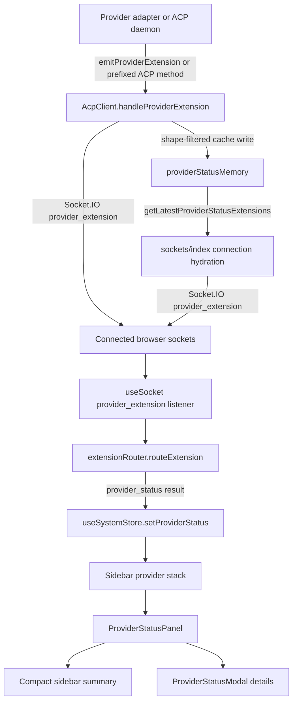

# Feature Doc - Provider Status Panel

The Provider Status Panel renders provider-supplied metrics in the sidebar and a details modal. It matters because the payload crosses provider adapters, backend extension routing, an in-memory reconnect cache, frontend extension routing, Zustand state, and React rendering; a mismatch at any boundary makes the panel disappear silently.

This guide covers the generic status pipeline and payload contract. Provider-specific status collection belongs in provider-specific feature docs.

## Overview

### What It Does

- Accepts provider extension payloads whose method resolves to `provider/status` or `provider_status` after removing the provider `protocolPrefix`.
- Caches the latest valid status extension per `providerId` in `backend/services/providerStatusMemory.js`.
- Replays cached status extensions to each browser socket during `backend/sockets/index.js` connection hydration.
- Routes `provider_extension` socket events through `frontend/src/hooks/useSocket.ts` and `frontend/src/utils/extensionRouter.ts`.
- Stores status by provider in `useSystemStore.providerStatusByProviderId` and keeps `useSystemStore.providerStatus` aligned with the active provider.
- Renders provider-scoped sidebar panels through `frontend/src/components/Sidebar.tsx` and `frontend/src/components/ProviderStatusPanel.tsx`.

### Why This Matters

- Status is provider-owned data, but the UI contract is generic and provider-agnostic.
- The backend cache lets reconnecting browser clients see the latest status without waiting for another provider emission.
- The frontend routes status by provider id, so multi-provider sidebars can show each provider's own status card.
- The payload shape is intentionally UI-ready: the panel renders sections, items, progress values, tones, and details without provider-specific branching.

Architectural role: backend extension cache and Socket.IO emission, frontend extension routing, Zustand system state, sidebar rendering.

## How It Works - End-to-End Flow

1. Provider code gets an extension emitter.

File: `backend/services/acpClient.js` (Method: `start`, callback: `emitProviderExtension`)

During ACP process startup, the backend passes an emitter callback into the provider module. Provider code can call this callback when it derives status from its own runtime, sidecar process, proxy, poller, or daemon-specific source.

```javascript
// FILE: backend/services/acpClient.js (Method: start)
childEnv = await this.providerModule.prepareAcpEnvironment(childEnv, {
  providerConfig: config,
  io: this.io,
  writeLog,
  emitProviderExtension: (method, params) =>
    this.handleProviderExtension({ providerId, method, params })
}) || childEnv;
```

2. ACP daemon extension messages use provider-prefix routing.

File: `backend/services/acpClient.js` (Method: `handleAcpMessage`, Branch: provider `protocolPrefix`)

Provider extensions that arrive from the ACP daemon are accepted only when the method starts with the active provider's configured `protocolPrefix`. The provider interceptor runs before this branch, so provider modules can normalize raw daemon messages into prefixed extension messages.

```javascript
// FILE: backend/services/acpClient.js (Method: handleAcpMessage)
const processedPayload = this.providerModule.intercept(payload);
if (!processedPayload) return;

if (processedPayload.method &&
    getProvider(this.getProviderId()).config.protocolPrefix &&
    processedPayload.method.startsWith(getProvider(this.getProviderId()).config.protocolPrefix)) {
  this.handleProviderExtension(processedPayload);
}
```

3. Backend handles every provider extension through one method.

File: `backend/services/acpClient.js` (Method: `handleProviderExtension`)

`handleProviderExtension` handles side effects shared by provider extensions, including model state updates, config option updates, provider-status cache insertion, and Socket.IO broadcast. `rememberProviderStatusExtension` is called for each extension, and the cache function filters out non-status payloads.

```javascript
// FILE: backend/services/acpClient.js (Method: handleProviderExtension)
if (this.io) {
  rememberProviderStatusExtension(payload, providerId);
  const params = payload.params || {};
  this.io.emit('provider_extension', {
    providerId,
    method: payload.method,
    params: { ...params, providerId }
  });
}
```

4. Backend cache validates and normalizes status payloads.

File: `backend/services/providerStatusMemory.js` (Function: `rememberProviderStatusExtension`)

The cache only accepts extensions with a string `method`, object `params`, object `params.status`, and array `params.status.sections`. It resolves `providerId`, writes that id into the extension, params, and status object, stores the latest global extension, and stores per-provider entries when a provider id exists.

```javascript
// FILE: backend/services/providerStatusMemory.js (Function: rememberProviderStatusExtension)
const status = extension.params.status;
if (!status || typeof status !== 'object' || !Array.isArray(status.sections)) return;

const resolvedProviderId = providerId || extension.providerId ||
  extension.params.providerId || status.providerId || null;

const normalizedExtension = cloneJson({
  ...extension,
  ...(resolvedProviderId ? { providerId: resolvedProviderId } : {}),
  params: {
    ...extension.params,
    ...(resolvedProviderId ? { providerId: resolvedProviderId } : {}),
    status: {
      ...status,
      ...(resolvedProviderId ? { providerId: resolvedProviderId } : {})
    }
  }
});
```

5. Socket connection hydration replays cached statuses.

File: `backend/sockets/index.js` (Function: `registerSocketHandlers`, Socket event: `connection`)

During socket hydration, the backend emits provider catalog and branding first, then replays cached status extensions. It emits every provider-scoped cached status returned by `getLatestProviderStatusExtensions()`. The default-provider fallback uses `getLatestProviderStatusExtension(defaultProviderId)` when the per-provider list is empty.

```javascript
// FILE: backend/sockets/index.js (Function: registerSocketHandlers, Event: connection)
const providerStatusExtensions = getLatestProviderStatusExtensions();
if (providerStatusExtensions.length > 0) {
  for (const providerStatusExtension of providerStatusExtensions) {
    socket.emit('provider_extension', providerStatusExtension);
  }
} else {
  const providerStatusExtension = getLatestProviderStatusExtension(defaultProviderId);
  if (providerStatusExtension) {
    socket.emit('provider_extension', providerStatusExtension);
  }
}
```

6. Frontend extracts provider identity and protocol prefix.

File: `frontend/src/hooks/useSocket.ts` (Function: `getOrCreateSocket`, Socket event: `provider_extension`)

The socket listener resolves the provider id from the top-level event, `params.providerId`, or `params.status.providerId`. It then reads provider branding to find the expected `protocolPrefix` before calling the pure router.

```typescript
// FILE: frontend/src/hooks/useSocket.ts (Function: getOrCreateSocket, Event: provider_extension)
const p = data.params || {};
const providerId = (data as { providerId?: string }).providerId ||
  p.providerId || p.status?.providerId;
const providerBranding = useSystemStore.getState().getBranding(providerId);
const ext = providerBranding?.protocolPrefix || '_provider/';
const result = routeExtension(data.method, p, ext, [], useSystemStore.getState().customCommands);
```

7. Frontend router accepts only status method suffixes and valid shapes.

File: `frontend/src/utils/extensionRouter.ts` (Function: `routeExtension`, Helper: `isProviderStatus`)

`routeExtension` first verifies the method starts with the expected protocol prefix. It then slices the prefix and accepts `provider/status` and `provider_status` only when `params.status.sections` is an array.

```typescript
// FILE: frontend/src/utils/extensionRouter.ts (Function: routeExtension, Helper: isProviderStatus)
if ((type === 'provider/status' || type === 'provider_status') && isProviderStatus(params.status)) {
  return { type: 'provider_status', status: params.status };
}

function isProviderStatus(value: unknown): value is ProviderStatus {
  if (!value || typeof value !== 'object') return false;
  const status = value as Partial<ProviderStatus>;
  return Array.isArray(status.sections);
}
```

8. System store writes status by provider id.

File: `frontend/src/store/useSystemStore.ts` (Action: `setProviderStatus`)

The store resolves the status owner, writes keyed status into `providerStatusByProviderId`, deletes keyed status when the status is null, and updates the singular `providerStatus` only for the active provider path.

```typescript
// FILE: frontend/src/store/useSystemStore.ts (Action: setProviderStatus)
const resolvedProviderId = providerId || status?.providerId || state.activeProviderId || state.defaultProviderId;
if (!resolvedProviderId) return { providerStatus: status };

const providerStatusByProviderId = { ...state.providerStatusByProviderId };
if (status) providerStatusByProviderId[resolvedProviderId] = { ...status, providerId: resolvedProviderId };
else delete providerStatusByProviderId[resolvedProviderId];
```

9. Sidebar scopes a panel to each provider stack.

File: `frontend/src/components/Sidebar.tsx` (Component: `Sidebar`, Render anchor: `ProviderStatusPanel providerId={p.providerId}`)

The sidebar renders a `ProviderStatusPanel` inside each expanded provider stack. The `providerId` prop makes the panel read only that provider's keyed status instead of rendering every cached provider status.

```tsx
// FILE: frontend/src/components/Sidebar.tsx (Component: Sidebar)
<div className="provider-stack-sessions">
  {/* folders and sessions */}
</div>
<ProviderStatusPanel providerId={p.providerId} />
```

10. ProviderStatusPanel renders summary rows and modal details.

File: `frontend/src/components/ProviderStatusPanel.tsx` (Components: `ProviderStatusPanels`, `ProviderStatusPanelSingle`, `ProviderStatusModal`, `ProviderStatusRow`)

`ProviderStatusPanels` reads `providerStatusByProviderId`. Without a `providerId`, it filters to statuses that have at least one item-bearing section. With a `providerId`, it selects that provider's status and leaves the item check to `ProviderStatusPanelSingle`. The single panel uses `getSummaryItems`, opens `ProviderStatusModal` through local `isDetailsOpen`, and renders rows with `ProviderStatusRow`.

```tsx
// FILE: frontend/src/components/ProviderStatusPanel.tsx (Component: ProviderStatusPanels)
const statuses = providerId
  ? [statusByProvider[providerId]].filter(Boolean)
  : Object.values(statusByProvider).filter(s => s && s.sections?.some(section => section.items?.length > 0));

// FILE: frontend/src/components/ProviderStatusPanel.tsx (Function: getSummaryItems)
if (status.summary?.items?.length) return status.summary.items;
const firstSectionItems = status.sections.find(section => section.items?.length > 0)?.items || [];
return firstSectionItems.slice(0, 2);
```

## Architecture Diagram



## Critical Contract

The provider status contract has two layers: transport extension shape and UI status shape.

### Transport Extension Shape

```typescript
// Socket event: provider_extension
interface ProviderStatusExtension {
  providerId?: string;
  method: string; // `${protocolPrefix}provider/status` or `${protocolPrefix}provider_status`
  params: {
    providerId?: string;
    status: ProviderStatus;
  };
}
```

Rules:

- `method` must start with the provider branding `protocolPrefix` available through `useSystemStore.getBranding(providerId)`.
- The method suffix after `protocolPrefix` must be `provider/status` or `provider_status` for frontend rendering.
- A stable provider id should be present at the top level, in `params.providerId`, or in `params.status.providerId`.
- Backend cache insertion requires `params.status.sections` to be an array.

### UI Status Shape

File: `frontend/src/types.ts` (Types: `ProviderStatusTone`, `ProviderStatusProgress`, `ProviderStatusItem`, `ProviderStatusSection`, `ProviderStatusSummary`, `ProviderStatus`)

```typescript
export type ProviderStatusTone = 'neutral' | 'info' | 'success' | 'warning' | 'danger';

export interface ProviderStatusProgress {
  value: number;
  label?: string;
}

export interface ProviderStatusItem {
  id: string;
  label: string;
  value?: string;
  detail?: string;
  tone?: ProviderStatusTone;
  progress?: ProviderStatusProgress;
}

export interface ProviderStatusSection {
  id: string;
  title?: string;
  items: ProviderStatusItem[];
}

export interface ProviderStatusSummary {
  title?: string;
  items: ProviderStatusItem[];
}

export interface ProviderStatus {
  providerId?: string;
  title?: string;
  subtitle?: string;
  updatedAt?: string;
  summary?: ProviderStatusSummary;
  sections: ProviderStatusSection[];
}
```

If this contract breaks:

- Missing `sections` prevents backend cache insertion and frontend route acceptance.
- Missing item-bearing sections makes `ProviderStatusPanelSingle` render null.
- Wrong `protocolPrefix` makes `routeExtension` return null.
- Missing provider id can attach the status to the active/default provider instead of the provider that emitted it.
- Progress values outside normalized `0..1` are clamped by `clampProgress`, so the UI hides the data error.
- Tone values outside the union produce CSS classes without matching status styling.

## Configuration/Data Flow

### Provider Configuration

File: `backend/sockets/index.js` (Function: `buildBrandingPayload`)

`buildBrandingPayload` includes `protocolPrefix` in each `branding` socket payload. `useSocket` reads that prefix through `useSystemStore.getBranding(providerId)` before routing provider extensions.

```javascript
// FILE: backend/sockets/index.js (Function: buildBrandingPayload)
return {
  providerId,
  ...providerConfig.branding,
  title: providerConfig.title,
  models: providerConfig.models,
  defaultModel: providerConfig.models?.default,
  protocolPrefix: providerConfig.protocolPrefix,
  supportsAgentSwitching: providerConfig.supportsAgentSwitching ?? false
};
```

A provider must emit status using its configured `protocolPrefix` plus `provider/status` or `provider_status`.

### Data Flow Pipeline

```text
Provider-owned status source
  -> provider extension method `${protocolPrefix}provider/status`
  -> AcpClient.handleProviderExtension
  -> providerStatusMemory.rememberProviderStatusExtension
  -> Socket.IO `provider_extension`
  -> useSocket `provider_extension` listener
  -> extensionRouter.routeExtension
  -> useSystemStore.setProviderStatus
  -> Sidebar provider stack
  -> ProviderStatusPanel compact card
  -> ProviderStatusModal details view
```

### Example Payload

```json
{
  "providerId": "provider-id",
  "method": "_provider/provider/status",
  "params": {
    "providerId": "provider-id",
    "status": {
      "providerId": "provider-id",
      "title": "Provider API",
      "subtitle": "Usage window",
      "updatedAt": "2026-05-12T14:32:15Z",
      "summary": {
        "title": "Summary",
        "items": [
          {
            "id": "usage-summary",
            "label": "Usage",
            "value": "42%",
            "detail": "Resets at 2:32 PM",
            "tone": "info",
            "progress": { "value": 0.42, "label": "Usage progress" }
          }
        ]
      },
      "sections": [
        {
          "id": "usage",
          "title": "Usage",
          "items": [
            {
              "id": "usage-window",
              "label": "Usage Window",
              "value": "42%",
              "detail": "Provider-specific reset text",
              "tone": "info",
              "progress": { "value": 0.42 }
            }
          ]
        }
      ]
    }
  }
}
```

## Component Reference

### Backend

| Area | File | Anchors | Purpose |
|---|---|---|---|
| ACP client | `backend/services/acpClient.js` | `start`, `emitProviderExtension`, `handleAcpMessage`, `handleProviderExtension` | Receives provider emissions, routes prefixed ACP extension methods, broadcasts `provider_extension` |
| Status cache | `backend/services/providerStatusMemory.js` | `rememberProviderStatusExtension`, `getLatestProviderStatusExtension`, `getLatestProviderStatusExtensions`, `clearProviderStatusExtension`, `cloneJson` | Validates, normalizes, clones, stores, and clears latest status extensions |
| Socket hydration | `backend/sockets/index.js` | `registerSocketHandlers`, `connection`, `getLatestProviderStatusExtensions`, `getLatestProviderStatusExtension`, `provider_extension` | Replays cached statuses during browser socket connection |
| Branding payload | `backend/sockets/index.js` | `buildBrandingPayload`, `protocolPrefix` | Sends provider protocol prefix to frontend routing state |

### Frontend

| Area | File | Anchors | Purpose |
|---|---|---|---|
| Socket listener | `frontend/src/hooks/useSocket.ts` | `getOrCreateSocket`, `provider_extension`, `getBranding`, `routeExtension`, `setProviderStatus` | Resolves provider id/prefix and dispatches typed status results to the store |
| Extension router | `frontend/src/utils/extensionRouter.ts` | `routeExtension`, `isProviderStatus`, `ExtensionResult` | Accepts status suffixes and validates `sections` array |
| System store | `frontend/src/store/useSystemStore.ts` | `providerStatus`, `providerStatusByProviderId`, `setProviderStatus`, `getBranding` | Stores keyed provider status and active-provider status |
| Sidebar mount | `frontend/src/components/Sidebar.tsx` | `Sidebar`, `ProviderStatusPanel providerId={p.providerId}` | Places provider-scoped status panel in each expanded provider stack |
| Status UI | `frontend/src/components/ProviderStatusPanel.tsx` | `ProviderStatusPanels`, `ProviderStatusPanelSingle`, `ProviderStatusModal`, `ProviderStatusRow`, `getSummaryItems`, `clampProgress`, `formatUpdatedAt` | Renders compact summary and modal details |
| Status CSS | `frontend/src/components/ProviderStatusPanel.css` | `.provider-status-panel`, `.provider-status-row`, `.tone-success`, `.tone-warning`, `.tone-danger`, `.tone-info`, `.provider-status-modal` | Styles rows, progress bars, tones, and modal layout |
| Types | `frontend/src/types.ts` | `ProviderStatusTone`, `ProviderStatusProgress`, `ProviderStatusItem`, `ProviderStatusSection`, `ProviderStatusSummary`, `ProviderStatus`, `ProviderExtensionData` | Defines transport and render payload shapes |

### Tests

| Area | File | Anchors | Purpose |
|---|---|---|---|
| Backend cache | `backend/test/providerStatusMemory.test.js` | `providerStatusMemory` suite | Validates cache acceptance, rejection, cloning, and provider isolation |
| Socket hydration | `backend/test/sockets-index.test.js` | `emits cached provider status on connection` | Verifies cached status replay on browser connection |
| Backend extension broadcast | `backend/test/acpClient-routing.test.js` | `routes all handleProviderExtension paths` | Verifies `handleProviderExtension` emits `provider_extension` |
| Frontend router | `frontend/src/test/extensionRouter.test.ts` | `routes generic provider status`, `routes generic provider_status alias`, `ignores malformed provider status payloads` | Verifies method suffixes and shape guard |
| Frontend store | `frontend/src/test/useSystemStore.test.ts`, `frontend/src/test/useSystemStoreExtended.test.ts`, `frontend/src/test/useSystemStoreDeep.test.ts` | `setProviderStatus manages active status vs background status`, `setProviderStatus manages per-provider status`, `setProviderStatus handles missing resolvedProviderId`, `setProviderStatus correctly identifies active provider updates` | Verifies keyed and active status state |
| Socket dispatch | `frontend/src/test/useSocket.test.ts` | `handles "provider_status" extension` | Verifies socket listener calls `setProviderStatus` with provider id |
| Component rendering | `frontend/src/test/ProviderStatusPanel.test.tsx` | `ProviderStatusPanel` suite | Verifies null render, compact summary, modal details, fallback summary, detail text, and progress clamping |

## Gotchas

1. Method prefix and suffix both matter.

Backend caching is shape-based, but frontend rendering requires `method.startsWith(protocolPrefix)` and a suffix of `provider/status` or `provider_status`. A valid status shape with the wrong method does not reach the store.

2. `sections` is the gate at both backend and frontend boundaries.

`rememberProviderStatusExtension` and `isProviderStatus` both require `status.sections` to be an array. An empty array passes routing, but the component needs at least one item-bearing section to render visible content.

3. Provider id resolution has fallbacks.

The backend and frontend resolve provider id from explicit arguments, top-level event fields, params, status, active provider, and default provider. Include a stable `providerId` in the emitted extension and in `status` to avoid attaching a background provider status to the active provider.

4. Cached values are cloned.

`providerStatusMemory` stores and returns JSON clones. Mutating the result of `getLatestProviderStatusExtension` or `getLatestProviderStatusExtensions` does not mutate cache memory.

5. Cache lifetime is process memory.

The cache is not persisted to SQLite. It survives browser refresh and socket reconnect while the backend process is alive; providers should emit status again after backend startup.

6. Compact view can show detail text.

`ProviderStatusRow` renders `item.detail` in both compact and modal rows. Keep summary item detail short enough for the sidebar.

7. Summary is optional, but first-section fallback is narrow.

`getSummaryItems` uses `status.summary.items` when present. Without summary items, it uses the first item-bearing section and slices the first two items.

8. Progress values are normalized floats.

`ProviderStatusProgress.value` is a `0..1` number. `clampProgress` clamps invalid ranges and treats non-finite values as zero, so tests may pass while provider math is wrong.

9. Tone values are CSS contracts.

Only `neutral`, `info`, `success`, `warning`, and `danger` have type support. CSS styles progress fill/value colors for the non-neutral tones defined in `ProviderStatusPanel.css`.

10. Modal rendering filters empty sections.

`ProviderStatusModal` renders only sections where `section.items?.length > 0`. If diagnostic text is important, put it in an item `detail` field, not in an empty section.

## Unit Tests

### Backend Tests

- `backend/test/providerStatusMemory.test.js`
  - `remembers the latest provider status extension`
  - `ignores extensions that are not provider status payloads`
  - `returns a copy so callers cannot mutate cached memory`
  - `keeps provider status memory isolated by provider id`

- `backend/test/sockets-index.test.js`
  - `emits cached provider status on connection`

- `backend/test/acpClient-routing.test.js`
  - `routes all handleProviderExtension paths`

- `backend/test/acpClient-deep.test.js`
  - `handles handleProviderExtension without metadata`
  - `handles handleProviderExtension without io`

### Frontend Tests

- `frontend/src/test/extensionRouter.test.ts`
  - `routes generic provider status`
  - `routes generic provider_status alias`
  - `ignores malformed provider status payloads`

- `frontend/src/test/useSocket.test.ts`
  - `handles "provider_status" extension`

- `frontend/src/test/useSystemStore.test.ts`
  - `setProviderStatus manages active status vs background status`

- `frontend/src/test/useSystemStoreExtended.test.ts`
  - `setProviderStatus manages per-provider status`

- `frontend/src/test/useSystemStoreDeep.test.ts`
  - `setProviderStatus handles missing resolvedProviderId`
  - `setProviderStatus correctly identifies active provider updates`

- `frontend/src/test/ProviderStatusPanel.test.tsx`
  - `renders nothing when no provider status is available`
  - `renders compact summary rows and opens full details in a modal`
  - `falls back to the first two section items when no summary is provided`
  - `renders compact summary detail text below progress rows`
  - `clamps progress bars to the normalized 0 to 1 range`

### Focused Commands

```powershell
cd backend; npx vitest run providerStatusMemory.test.js sockets-index.test.js acpClient-routing.test.js acpClient-deep.test.js
cd frontend; npx vitest run ProviderStatusPanel.test.tsx extensionRouter.test.ts useSocket.test.ts useSystemStore.test.ts useSystemStoreExtended.test.ts useSystemStoreDeep.test.ts
```

## How to Use This Guide

### For implementing/extending this feature

1. Start with the payload contract in `frontend/src/types.ts` and build a UI-ready `ProviderStatus` object.
2. Emit `params.status` through `emitProviderExtension` or a prefixed ACP extension method using `${protocolPrefix}provider/status`.
3. Verify `backend/services/providerStatusMemory.js` accepts the payload by checking `sections` and `providerId` normalization.
4. Verify `frontend/src/utils/extensionRouter.ts` accepts the method and status shape.
5. Add or adjust focused tests in `providerStatusMemory.test.js`, `extensionRouter.test.ts`, `useSystemStore*.test.ts`, and `ProviderStatusPanel.test.tsx`.

### For debugging issues with this feature

1. Confirm the backend emits a `provider_extension` event from `AcpClient.handleProviderExtension`.
2. Confirm `rememberProviderStatusExtension` accepts the payload and `getLatestProviderStatusExtensions` returns it.
3. Refresh the browser and confirm socket connection hydration replays the cached extension from `registerSocketHandlers`.
4. Confirm `useSocket` resolves the same provider id and branding `protocolPrefix` used by the extension method.
5. Confirm `routeExtension` returns `{ type: 'provider_status', status }`.
6. Inspect `useSystemStore.providerStatusByProviderId[providerId]` and the sidebar `ProviderStatusPanel providerId` prop.
7. Check `ProviderStatusPanelSingle` item-bearing section filtering and `getSummaryItems` fallback behavior.

## Summary

- Provider status is delivered as a provider extension with a prefixed `provider/status` or `provider_status` method.
- `AcpClient.handleProviderExtension` broadcasts every provider extension and lets `providerStatusMemory` cache only valid status payloads.
- `providerStatusMemory` validates `params.status.sections`, normalizes provider id into the cached extension, and returns clones.
- `registerSocketHandlers` replays cached status extensions during socket connection hydration.
- `useSocket` resolves provider id and protocol prefix before calling `routeExtension`.
- `routeExtension` is the frontend gate for method suffix and `sections` shape.
- `useSystemStore.setProviderStatus` maintains both keyed provider status and active-provider status.
- `ProviderStatusPanel` renders provider-scoped compact summaries and modal details from `ProviderStatus` without provider-specific UI branches.
