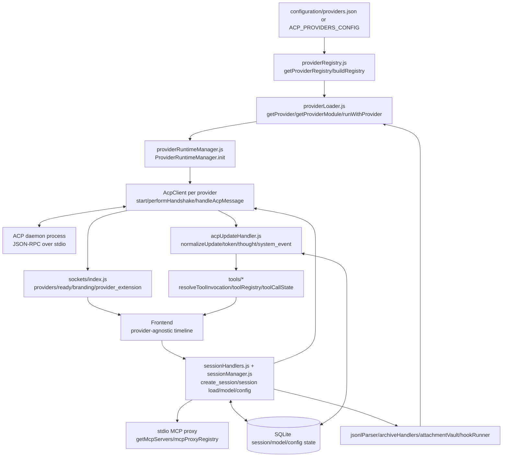

# Feature Doc - Provider System

AcpUI's provider system is the backend adapter layer that loads provider definitions, starts isolated ACP daemon runtimes, and routes daemon-specific protocol details through provider-owned hooks. It matters because the frontend depends on normalized Socket.IO payloads and must not know which provider produced a session, model list, tool call, or status extension.

---

## Overview

### What It Does

- Loads enabled providers from `configuration/providers.json` or the `ACP_PROVIDERS_CONFIG` environment variable.
- Reads each provider directory through `provider.json`, optional `branding.json`, optional `user.json`, and optional `index.js`.
- Normalizes provider IDs, validates provider paths, and keeps the default provider first in registry order.
- Creates one runtime per enabled provider through `providerRuntimeManager.init`, with one `AcpClient` per runtime.
- Spawns provider ACP daemon processes, performs provider-owned handshakes, and restarts exited daemons with exponential backoff.
- Routes JSON-RPC daemon messages through provider hooks before emitting provider-agnostic socket events and Unified Timeline updates.
- Delegates model state, config options, tool identity, session file paths, archive behavior, hooks, and prompt lifecycle tracking to provider modules.

### Why This Matters

- Provider code owns provider differences; backend core stays generic and the frontend consumes dynamic payloads.
- Provider isolation is enforced by provider IDs, per-runtime `AcpClient` instances, and `AsyncLocalStorage` in `providerLoader.js`.
- Tool UI quality depends on provider-supplied canonical tool identity, not display-title guessing.
- Session loading, forking, archiving, JSONL rehydration, and attachment storage rely on provider filesystem hooks.
- Contract tests require provider modules to explicitly export the expected hook surface.

Architectural role: backend runtime and provider-adapter contract. The frontend only receives provider catalogs, branding, model/config state, timeline events, permissions, and provider extensions over Socket.IO.

---

## How It Works - End-to-End Flow

1. Registry configuration is resolved

File: `backend/services/providerRegistry.js` (Functions: `getProviderRegistry`, `buildRegistry`, `normalizeEntry`, `resolveProviderId`)

`getProviderRegistry` builds and caches the provider registry. `buildRegistry` reads `process.env.ACP_PROVIDERS_CONFIG` or `configuration/providers.json`, requires `defaultProviderId`, filters disabled entries, validates provider directories, verifies each directory has `provider.json`, rejects duplicate IDs, and sorts the default provider first.

```javascript
// FILE: backend/services/providerRegistry.js (Function: buildRegistry)
const configPath = process.env.ACP_PROVIDERS_CONFIG || 'configuration/providers.json';
const raw = readRegistryFile(configPath);
const entries = [];
const seen = new Set();

raw.providers.forEach((entry, index) => {
  const normalized = normalizeEntry(entry, index);
  if (!normalized) return;
  if (seen.has(normalized.id)) throw new Error(`Duplicate provider id "${normalized.id}"`);
  seen.add(normalized.id);
  entries.push(normalized);
});
```

2. Provider IDs are normalized and validated

File: `backend/services/providerRegistry.js` (Functions: `normalizeProviderId`, `providerIdFromPath`, `getProviderEntry`)

Provider IDs are trimmed, lowercased, converted to `a-z`, `0-9`, `_`, and `-`, and may be inferred from the provider path. `resolveProviderId(null)` returns the configured default provider. Unknown IDs throw before runtime access.

3. Provider config is loaded and merged

File: `backend/services/providerLoader.js` (Functions: `getProvider`, `resolveProviderIdWithContext`)

`getProvider(providerId)` resolves the provider ID, reads the registry entry, loads required `provider.json`, and optionally reads `branding.json` and `user.json`. The final `config` object merges provider data first, then user data, then `title` and `branding` extracted from branding data.

```javascript
// FILE: backend/services/providerLoader.js (Function: getProvider)
const config = {
  providerId: resolvedId,
  providerPath: entry.path,
  basePath,
  ...providerData,
  ...userData,
  title,
  branding: brandingFields,
};
```

`getProvider()` without an argument resolves from `AsyncLocalStorage` when called inside a bound provider hook. Outside provider context it resolves to the default provider.

4. Provider modules are imported, defaulted, bound, and cached

File: `backend/services/providerLoader.js` (Symbols: `DEFAULT_MODULE`, `getProviderModule`, `getProviderModuleSync`, `bindProviderModule`, `runWithProvider`)

`getProviderModule(providerId)` imports the provider `index.js` when present. It merges exported functions over `DEFAULT_MODULE`, wraps every function in `runWithProvider(providerId, fn)`, caches the bound module, and returns the cached module on repeat calls. If `index.js` is missing or import fails, a bound `DEFAULT_MODULE` is returned.

```javascript
// FILE: backend/services/providerLoader.js (Function: bindProviderModule)
function bindProviderModule(providerId, mod) {
  const merged = { ...DEFAULT_MODULE, ...mod };
  const bound = {};

  for (const [key, value] of Object.entries(merged)) {
    bound[key] = typeof value === 'function'
      ? (...args) => runWithProvider(providerId, () => value(...args))
      : value;
  }

  return bound;
}
```

`getProviderModuleSync(providerId)` returns the cached bound module if async initialization has loaded it. If not, it returns a bound `DEFAULT_MODULE` fallback without importing `index.js`.

5. Runtime manager creates one runtime per provider

File: `backend/services/providerRuntimeManager.js` (Class: `ProviderRuntimeManager`, Methods: `init`, `getRuntime`, `getClient`, `getProviderSummaries`)

`providerRuntimeManager.init(io, serverBootId)` reads registry entries, reuses the exported default `AcpClient` for the default provider, creates `new AcpClient(entry.id)` for every other provider, assigns each provider ID, loads provider config through `getProvider`, stores runtime records, and starts every client with `client.init(io, serverBootId)`. A second `init` call returns existing runtimes without starting daemons again.

6. Each `AcpClient` starts its provider daemon

File: `backend/services/acpClient.js` (Class: `AcpClient`, Methods: `init`, `start`, Function: `buildAcpSpawnCommand`)

`AcpClient.start` initializes the database, caches the provider module for synchronous stdout handling, reads `config.command` and `config.args`, lets `prepareAcpEnvironment(env, context)` adjust the child environment, spawns the ACP daemon, connects it to `JsonRpcTransport`, and starts the handshake.

```javascript
// FILE: backend/services/acpClient.js (Method: AcpClient.start)
this.providerModule = await getProviderModule(providerId);
const { config } = getProvider(providerId);
let childEnv = { ...process.env, TERM: 'dumb', CI: 'true', FORCE_COLOR: '0', DEBUG: '1' };
childEnv = await this.providerModule.prepareAcpEnvironment(childEnv, {
  providerConfig: config,
  io: this.io,
  writeLog,
  emitProviderExtension: (method, params) => this.handleProviderExtension({ providerId, method, params })
}) || childEnv;
```

`buildAcpSpawnCommand` routes Windows bare commands and `.cmd` or `.bat` commands through `cmd.exe /d /s /c`, while non-Windows commands are spawned directly. Daemon exit clears handshake state, resets transport, and schedules restart with exponential backoff capped at 30 seconds.

7. The provider owns ACP initialization

File: `backend/services/acpClient.js` (Method: `AcpClient.performHandshake`)

`performHandshake` is mutexed by `handshakePromise`. It waits briefly after spawn, reloads the provider module, calls `providerModule.performHandshake(this)`, marks the runtime ready, emits `ready` and `voice_enabled`, and starts `autoLoadPinnedSessions(this)` in the background.

The provider's `performHandshake(client)` sends the ACP `initialize` request and any required provider protocol requests through `client.transport.sendRequest` or related transport APIs.

8. Socket connections receive provider catalog and branding

File: `backend/sockets/index.js` (Functions: `buildBrandingPayload`, `getProviderPayloads`, `registerSocketHandlers`; Socket events: `providers`, `ready`, `branding`, `provider_extension`)

On Socket.IO connection, the backend emits:

- `providers` with `defaultProviderId`, provider labels, ready state, and branding payloads.
- `ready` for each runtime whose client has completed handshake.
- `branding` for every provider, sourced from provider config.
- `provider_extension` snapshots stored by `providerStatusMemory.js`.

`buildBrandingPayload` includes `providerId`, branding fields, `title`, `models`, `defaultModel`, `protocolPrefix`, and `supportsAgentSwitching`.

9. Session creation and loading use provider hooks

File: `backend/sockets/sessionHandlers.js` (Socket event: `create_session`, Function: `captureModelState`)
File: `backend/services/sessionManager.js` (Functions: `getMcpServers`, `loadSessionIntoMemory`, `setSessionModel`, `reapplySavedConfigOptions`)

The `create_session` handler resolves the runtime, checks `isHandshakeComplete`, loads provider config and module, calls `providerModule.buildSessionParams(requestAgent)`, and sends either `session/new` or `session/load` with `cwd`, `mcpServers`, and any returned provider params.

`getMcpServers(providerId, { acpSessionId })` reads provider config key `mcpName`. If absent, no MCP server is advertised. If present, it creates a stdio proxy server entry with `ACP_SESSION_PROVIDER_ID`, `ACP_UI_MCP_PROXY_ID`, `BACKEND_PORT`, `NODE_TLS_REJECT_UNAUTHORIZED`, and optional `_meta` from `providerModule.getMcpServerMeta()`.

Model and config state are captured through `extractModelState`, `providerModule.normalizeModelState`, `providerModule.normalizeConfigOptions`, and persisted with database helpers. `setInitialAgent(acpClient, sessionId, requestAgent)` is called after session creation and after non-hot `session/load` when an agent is requested.

10. Daemon messages are intercepted and routed

File: `backend/services/acpClient.js` (Methods: `handleAcpMessage`, `handleUpdate`, `handleRequestPermission`, `handleProviderExtension`, `handleModelStateUpdate`)

Every parsed JSON-RPC payload passes through `this.providerModule.intercept(payload)` before routing. Any falsy return is ignored. A provider should return the payload object for normal routing and return `null` only for intentional drops.

Routing order:

- `session/update` and `session/notification` call `handleUpdate(sessionId, update)`.
- `session/request_permission` with a JSON-RPC `id` delegates to `PermissionManager`.
- Responses with pending JSON-RPC IDs resolve or reject `JsonRpcTransport.pendingRequests`.
- Methods starting with the provider config key `protocolPrefix` call `handleProviderExtension`.
- Unmatched methods are logged.

`handleProviderExtension` updates model state when model fields are present, merges dynamic config options when the extension method ends with `config_options`, stores provider status snapshots when `params.status.sections` exists, and emits `provider_extension` globally with `providerId` included in `params`.

11. Session updates become normalized timeline events

File: `backend/services/acpUpdateHandler.js` (Function: `handleUpdate`)
File: `backend/services/tools/toolInvocationResolver.js` (Functions: `resolveToolInvocation`, `applyInvocationToEvent`)
File: `backend/services/tools/toolCallState.js` (Class: `ToolCallState`)
File: `backend/services/tools/index.js` (Exports: `toolRegistry`, `toolCallState`, `resolveToolInvocation`, `applyInvocationToEvent`)

`handleUpdate` calls `providerModule.normalizeUpdate(update)` first. It handles config option updates, drains replayed load output, buffers internal title-generation captures, emits `token`, `thought`, `stats_push`, and turns tool updates into `system_event` payloads.

Tool flow:

1. `extractFilePath(update, resolvePath)` provides sticky file context.
2. `extractDiffFromToolCall(update, Diff)` can provide output at tool start.
3. `normalizeTool(event, update)` adjusts display shape.
4. `categorizeToolCall(event)` provides timeline category metadata.
5. `extractToolInvocation(update, context)` provides canonical identity and input.
6. `resolveToolInvocation` merges provider identity, cached `toolCallState`, and MCP handler details.
7. `applyInvocationToEvent` writes canonical fields back to the emitted event.
8. `toolRegistry.dispatch(phase, ctx, invocation, event)` adds tool-specific state.
9. `toolCallState.upsert` preserves identity, input, title, category, file path, and tool-specific IDs across start/update/end phases.

12. Provider hooks support files, JSONL, archives, hooks, and prompt lifecycle

File: `backend/services/jsonlParser.js` (Function: `parseJsonlSession`)
File: `backend/mcp/acpCleanup.js` (Function: `cleanupAcpSession`)
File: `backend/sockets/archiveHandlers.js` (Socket events: `archive_session`, `restore_archive`, `delete_archive`, `list_archives`)
File: `backend/services/attachmentVault.js` (Function: `getAttachmentsRoot`)
File: `backend/services/hookRunner.js` (Function: `runHooks`)
File: `backend/sockets/promptHandlers.js` (Socket event: `prompt`, Hooks: `onPromptStarted`, `onPromptCompleted`)

Supporting workflows use provider hooks directly:

- `parseJsonlSession` calls `getSessionPaths(acpSessionId)` and `parseSessionHistory(filePath, Diff)`.
- `cleanupAcpSession` calls `deleteSessionFiles(acpSessionId)`.
- Archive handlers call `archiveSessionFiles`, `restoreSessionFiles`, and `deleteSessionFiles`.
- Attachment upload storage calls `getAttachmentsDir()`.
- `runHooks` calls `getHooksForAgent(agentName, hookType)` unless `cliManagedHooks` includes the hook type.
- Prompt execution calls `onPromptStarted(sessionId)` before `session/prompt` and `onPromptCompleted(sessionId)` in the prompt completion path.

---

## Architecture Diagram



---

## Critical Contract

### Contract: Provider Identity and Runtime Isolation

A provider ID is the key for registry entries, provider config, runtime lookup, MCP proxy binding, session rows, model/config persistence, provider extensions, and tool state. Code that accepts a nullable provider ID must resolve it through `resolveProviderId` or through `getProvider`/`getProviderModule` so the default provider is applied consistently.

If this contract breaks, events and DB state can attach to the wrong provider, tool state can merge across sessions, and `getProvider()` calls can resolve the wrong config.

### Contract: Provider Module Export Surface

`backend/test/providerContract.test.js` verifies that every `providers/*/index.js` explicitly exports these functions:

| Group | Required exports |
|---|---|
| Message/update hooks | `intercept`, `normalizeUpdate`, `normalizeModelState`, `normalizeConfigOptions`, `parseExtension`, `emitCachedContext` |
| Tool hooks | `extractToolOutput`, `extractFilePath`, `extractDiffFromToolCall`, `extractToolInvocation`, `normalizeTool`, `categorizeToolCall` |
| Daemon/session hooks | `prepareAcpEnvironment`, `performHandshake`, `setInitialAgent`, `buildSessionParams`, `getMcpServerMeta` |
| File/session hooks | `getSessionPaths`, `cloneSession`, `archiveSessionFiles`, `restoreSessionFiles`, `deleteSessionFiles`, `parseSessionHistory` |
| Directory/hook hooks | `getSessionDir`, `getAttachmentsDir`, `getAgentsDir`, `getHooksForAgent` |
| Prompt lifecycle hooks | `onPromptStarted`, `onPromptCompleted` |

Runtime fallback in `providerLoader.js` supplies `DEFAULT_MODULE` implementations for many hooks. The contract test is stricter than the fallback: real provider modules are expected to export the complete surface explicitly.

`setConfigOption(acpClient, sessionId, optionId, value)` is used by `sessionManager.setProviderConfigOption`, `sessionHandlers` event `set_session_option`, and saved config reapply logic. Providers that advertise writable config options must export this hook even though it is not part of `providerContract.test.js` required exports.

### Contract: Intercept Return Value

`AcpClient.handleAcpMessage` treats any falsy `intercept` result as ignored. Providers should return the payload object for normal routing and return `null` for intentional drops. An accidental missing return also drops the payload.

### Contract: Tool Invocation V2

`extractToolInvocation(update, context)` is provider-owned. It must parse provider raw tool naming conventions and return canonical identity and input so the generic backend does not infer AcpUI tool identity from display strings.

Expected shape:

```javascript
// Provider hook return shape for extractToolInvocation(update, context)
{
  toolCallId: 'tool-call-id',
  kind: 'acpui_mcp',
  rawName: 'raw-provider-tool-name',
  canonicalName: 'ux_invoke_shell',
  mcpServer: 'configured-mcp-server-name',
  mcpToolName: 'ux_invoke_shell',
  input: { description: 'Short task label', command: 'npm test' },
  title: 'Invoke Shell: Short task label',
  filePath: 'path/if/relevant',
  category: { category: 'shell', isShellCommand: true }
}
```

Allowed `kind` values used by the contract are `acpui_mcp`, `mcp`, `provider_builtin`, and `unknown`. `backend/services/tools/toolInvocationResolver.js` compacts this into `invocation.identity`, merges cached state and MCP execution registry data, and marks AcpUI UX tools when the canonical name or MCP server matches the registered AcpUI tool set.

`provider.json` key `toolIdPattern` is the configured source for MCP tool ID parsing. Generic helpers such as `matchToolIdPattern` only compile the pattern and extract `{mcpName}` and `{toolName}`; provider modules decide which raw fields to inspect.

### Contract: Session Model and Config State

Provider hooks must preserve these generic shapes:

```javascript
// normalizeModelState(modelState, source)
{
  currentModelId: 'model-id-or-null',
  modelOptions: [{ id: 'model-id', name: 'Display Name' }],
  replaceModelOptions: false
}

// normalizeConfigOptions(options)
[
  { id: 'option-id', currentValue: 'value' }
]
```

`replaceModelOptions: true` replaces current model options. Without it, model options are merged by ID. Config options are merged by ID unless an update has `replace: true` or `mode: 'replace'`; removals use `removeOptionIds`.

---

## Configuration / Data Flow

### Registry File

File: `configuration/providers.json.example` (Config keys: `defaultProviderId`, `providers[].id`, `providers[].path`, `providers[].enabled`, `providers[].label`, `providers[].order`)

```json
{
  "defaultProviderId": "example-provider",
  "providers": [
    {
      "id": "example-provider",
      "path": "./providers/example-provider",
      "enabled": true,
      "label": "Example Provider",
      "order": 1
    }
  ]
}
```

`enabled: false` removes the entry from the runtime registry. `defaultProviderId` must resolve to an enabled entry.

### Provider Directory Files

A provider directory is rooted at the registry entry's `path` and is read by `providerLoader.getProvider`.

| File | Required | Data owner | Notes |
|---|---:|---|---|
| `provider.json` | Yes | Shared provider definition | Runtime identity, protocol config, MCP config, model defaults, tool pattern, hook policy |
| `branding.json` | No | UI-facing provider strings | `title` is lifted to `config.title`; remaining keys become `config.branding` |
| `user.json` | No | Local deployment config | Overrides matching `provider.json` fields in final `config` |
| `index.js` | No at runtime, required by contract tests for shipped providers | Provider logic | Imported by `getProviderModule`; functions are bound into provider context |

Generic provider config fields consumed by current backend code:

```json
{
  "name": "Example Provider",
  "command": "provider-acp-command",
  "args": ["acp"],
  "protocolPrefix": "provider-prefix/",
  "mcpName": "AcpUI",
  "toolIdPattern": "mcp__{mcpName}__{toolName}",
  "supportsAgentSwitching": false,
  "cliManagedHooks": [],
  "models": {
    "default": "default-model-id",
    "quickAccess": [
      { "id": "default-model-id", "name": "Default Model" }
    ]
  },
  "paths": {
    "archive": "D:/archives/example-provider"
  }
}
```

### End-to-End Data Flow

```text
Registry config
  -> providerRegistry.getProviderRegistry()
  -> providerLoader.getProvider()
  -> providerRuntimeManager.init()
  -> AcpClient.start()
  -> providerModule.prepareAcpEnvironment()
  -> spawn ACP daemon
  -> providerModule.performHandshake()
  -> Socket.IO ready/branding/providers
```

```text
Daemon session/update
  -> AcpClient.handleAcpMessage()
  -> providerModule.intercept()
  -> acpUpdateHandler.handleUpdate()
  -> providerModule.normalizeUpdate()
  -> provider tool/model/config hooks
  -> toolInvocationResolver/toolRegistry/toolCallState when tool update
  -> Socket.IO token/thought/system_event/stats_push/provider_extension
  -> frontend Unified Timeline
```

```text
Session create/load
  -> socket create_session
  -> providerRuntimeManager.getRuntime(providerId)
  -> providerModule.buildSessionParams(agent)
  -> sessionManager.getMcpServers(providerId, acpSessionId?)
  -> ACP session/new or session/load
  -> captureModelState()
  -> providerModule.setInitialAgent()
  -> runHooks(agent, session_start)
  -> callback with acpSessionId/currentModelId/modelOptions/configOptions
```

---

## Component Reference

### Runtime and Loading

| Area | File | Anchors | Purpose |
|---|---|---|---|
| Registry | `backend/services/providerRegistry.js` | `getProviderRegistry`, `getProviderEntries`, `getDefaultProviderId`, `resolveProviderId`, `getProviderEntry`, `resetProviderRegistryForTests` | Loads, validates, caches, and resolves provider registry entries |
| Loader | `backend/services/providerLoader.js` | `getProvider`, `getProviderModule`, `getProviderModuleSync`, `runWithProvider`, `resetProviderLoaderForTests`, `DEFAULT_MODULE`, `bindProviderModule` | Loads provider config, imports provider modules, binds hooks to provider context |
| Runtime Manager | `backend/services/providerRuntimeManager.js` | `ProviderRuntimeManager`, `init`, `getRuntime`, `getClient`, `getProviderSummaries`, `getRuntimes` | Creates and exposes provider runtimes and clients |
| ACP Client | `backend/services/acpClient.js` | `AcpClient`, `buildAcpSpawnCommand`, `start`, `performHandshake`, `handleAcpMessage`, `handleProviderExtension`, `handleModelStateUpdate` | Owns daemon process lifecycle, JSON-RPC routing, provider extension handling, restart behavior |
| Transport | `backend/services/jsonRpcTransport.js` | `JsonRpcTransport`, `setProcess`, `sendRequest`, `pendingRequests`, `reset` | Correlates JSON-RPC requests and daemon responses |
| Permissions | `backend/services/permissionManager.js` | `PermissionManager`, `handleRequest`, `respond` | Handles `session/request_permission` lifecycle |
| Streams | `backend/services/streamController.js` | `StreamController`, `beginDraining`, `waitForDrainToFinish`, `statsCaptures`, `onChunk` | Suppresses load replay and captures internal output |

### Sessions, Updates, and Tools

| Area | File | Anchors | Purpose |
|---|---|---|---|
| Socket Bootstrap | `backend/sockets/index.js` | `buildBrandingPayload`, `getProviderPayloads`, `registerSocketHandlers`, events `providers`, `ready`, `branding`, `provider_extension` | Hydrates frontend provider catalog and branding |
| Session Socket | `backend/sockets/sessionHandlers.js` | `create_session`, `captureModelState`, `set_session_option`, `set_session_model`, `fork_session`, `get_session_history`, `rehydrate_session` | Creates, loads, configures, forks, and rehydrates sessions through provider hooks |
| Session Manager | `backend/services/sessionManager.js` | `getMcpServers`, `loadSessionIntoMemory`, `autoLoadPinnedSessions`, `setSessionModel`, `reapplySavedConfigOptions`, `normalizeProviderConfigOptions` | MCP proxy config, hot loading, model/config state, pinned session warmup |
| Update Handler | `backend/services/acpUpdateHandler.js` | `handleUpdate`, update types `agent_message_chunk`, `agent_thought_chunk`, `tool_call`, `tool_call_update`, `usage_update`, `config_option_update`, `available_commands_update` | Normalizes ACP updates and emits timeline socket events |
| Tool Resolver | `backend/services/tools/toolInvocationResolver.js` | `resolveToolInvocation`, `applyInvocationToEvent` | Merges provider identity, cached tool state, and MCP handler state |
| Tool State | `backend/services/tools/toolCallState.js` | `ToolCallState`, `upsert`, `get`, `clearSession`, `shouldUseTitle` | Preserves sticky tool metadata across lifecycle phases |
| Tool Registry | `backend/services/tools/index.js` | `toolRegistry`, registered handlers for AcpUI UX tools | Dispatches canonical tool lifecycle events to handlers |
| Tool Pattern | `backend/services/tools/toolIdPattern.js` | `toolIdPatternToRegex`, `matchToolIdPattern`, `replaceToolIdPattern` | Parses provider-configured `{mcpName}` and `{toolName}` patterns |
| Tool Normalization Helpers | `backend/services/tools/providerToolNormalization.js` | `inputFromToolUpdate`, `resolveToolNameFromCandidates`, `resolveToolNameFromAcpUiMcpTitle`, `mcpInvocationFromRaw`, `prettyToolTitle`, `toolTitleDetailFromInput` | Shared parsing helpers for provider adapters, including full-title and colon-prefix AcpUI MCP title recovery |
| MCP Proxy Registry | `backend/mcp/mcpProxyRegistry.js` | `createMcpProxyBinding`, `bindMcpProxy`, `getMcpProxyIdFromServers`, `resolveMcpProxy` | Correlates stdio MCP proxy instances with provider/session context |

### Files, Archives, Hooks, and Status

| Area | File | Anchors | Purpose |
|---|---|---|---|
| JSONL Rehydration | `backend/services/jsonlParser.js` | `parseJsonlSession` | Delegates provider session-file parsing to `parseSessionHistory` |
| Cleanup | `backend/mcp/acpCleanup.js` | `cleanupAcpSession` | Delegates session file removal to `deleteSessionFiles` |
| Archive Socket | `backend/sockets/archiveHandlers.js` | `archive_session`, `restore_archive`, `delete_archive`, `list_archives` | Delegates provider archive/restore file movement |
| Attachments | `backend/services/attachmentVault.js` | `getAttachmentsRoot`, `upload`, `handleUpload` | Resolves provider attachment root and handles upload storage |
| Hook Runner | `backend/services/hookRunner.js` | `runHooks` | Loads provider agent hooks and executes matching scripts |
| Prompt Socket | `backend/sockets/promptHandlers.js` | `prompt`, `cancel_prompt`, `respond_permission`, `onPromptStarted`, `onPromptCompleted` | Sends prompts and pairs provider lifecycle hooks around prompt execution |
| Status Memory | `backend/services/providerStatusMemory.js` | `rememberProviderStatusExtension`, `getLatestProviderStatusExtension`, `getLatestProviderStatusExtensions`, `clearProviderStatusExtension` | Caches provider status extensions for new socket connections |
| Models | `backend/services/modelOptions.js` | `extractModelState`, `normalizeModelOptions`, `mergeModelOptions`, `resolveModelSelection`, `modelOptionsFromProviderConfig` | Normalizes dynamic model catalogs and selections |
| Config Options | `backend/services/configOptions.js` | `normalizeConfigOptions`, `applyConfigOptionsChange`, `mergeConfigOptions`, `normalizeRemovedConfigOptionIds` | Normalizes and merges provider config options |

### Configuration

| File | Anchors | Purpose |
|---|---|---|
| `configuration/providers.json.example` | `defaultProviderId`, `providers[].id`, `providers[].path`, `providers[].enabled` | Example registry shape |
| `providers/*/provider.json` | `name`, `command`, `args`, `protocolPrefix`, `mcpName`, `toolIdPattern`, `models`, `paths`, `cliManagedHooks` | Provider runtime config consumed by backend services |
| `providers/*/branding.json` | `title`, provider branding fields | Socket `branding` payload source |
| `providers/*/user.json` | Any provider config override fields | Local override source merged after `provider.json` |
| `providers/*/index.js` | Provider hook exports | Provider adapter implementation |

---

## Gotchas

1. Falsy `intercept` results drop messages.
   `AcpClient.handleAcpMessage` ignores any falsy processed payload. A provider hook that forgets `return payload` drops the JSON-RPC message.

2. Provider module imports are cached.
   `getProviderModule` caches the bound module after import. Runtime code changes in `providers/*/index.js` require process restart to load again.

3. `DEFAULT_MODULE` is not the provider contract test surface.
   `DEFAULT_MODULE` keeps many runtime paths callable, but `providerContract.test.js` requires real provider modules to explicitly export the full contract, including prompt lifecycle hooks.

4. `setConfigOption` is conditional and direct.
   Session option writes call `providerModule.setConfigOption` through `sessionManager.setProviderConfigOption`. Providers that expose writable options need this function even though the provider contract test does not list it.

5. `getProvider()` without an ID depends on context.
   Bound provider hooks run inside `runWithProvider`, so `getProvider()` resolves the active provider. Background work outside that context should pass `providerId` explicitly.

6. `user.json` overrides matching provider fields.
   `providerLoader.getProvider` merges `userData` after `providerData`. Local command, path, model, or protocol overrides affect runtime immediately after process start.

7. `mcpName` controls MCP tool advertisement.
   `sessionManager.getMcpServers` returns an empty array when provider config has no `mcpName`. Tool calls through the AcpUI stdio proxy require `mcpName` and a bound `ACP_UI_MCP_PROXY_ID`.

8. Model and config extensions can arrive before session metadata is keyed by the final session ID.
   `AcpClient.handleProviderExtension` checks `sessionMetadata.get(sessionId)` and `sessionMetadata.get('pending-new')`. New-session code must keep `pending-new` populated until the daemon returns the final `sessionId`.

9. Tool identity belongs in `extractToolInvocation`.
   Generic backend code should not classify AcpUI UX tools by searching titles or file contents. Provider adapters parse provider raw structures and return canonical identity.

10. `session/load` replay is drained.
    `StreamController.beginDraining` and `waitForDrainToFinish` suppress historical update replay during hot load. Debugging missing replay output should account for the drain state.

11. Provider status memory only stores status-shaped extensions.
    `rememberProviderStatusExtension` stores extensions only when `params.status.sections` is an array. Other provider extensions are emitted but not replayed to new socket connections by status memory.

12. Prompt lifecycle hooks are direct calls.
    `promptHandlers.js` calls `acpClient.providerModule.onPromptStarted(sessionId)` and `onPromptCompleted(sessionId)`. Provider modules need no-op implementations if they do not track prompt lifecycle.

---

## Unit Tests

### Provider Loader and Registry

- `backend/test/providerRegistry.test.js`
  - `loads registry from default config path`
  - `throws error if registry file is missing`
  - `throws error if defaultProviderId is missing`
  - `throws error if no enabled providers are found`
  - `normalizes provider ids`
  - `infers provider id from path if not provided`
  - `throws error if provider path does not exist`
  - `throws error if provider.json is missing in provider directory`
  - `throws error if duplicate provider ids are found`
  - `throws error if default provider is not in the registry`
  - `resolves provider id correctly`
  - `sorts providers with default first, then by order`

- `backend/test/providerLoader.test.js`
  - `loads provider from registry`
  - `getProviderModule returns DEFAULT_MODULE when module file does not exist`
  - `getProviderModuleSync returns DEFAULT_MODULE if not initialized`
  - `handles provider.json read error`
  - `throws when registry file is missing`
  - `getProvider returns cached provider on repeat calls`
  - `loads multiple providers from ACP_PROVIDERS_CONFIG`
  - `rejects duplicate provider ids in ACP_PROVIDERS_CONFIG`
  - `getProviderModule returns cached module on repeat calls`
  - `getProviderModuleSync returns cached module after async initialization`
  - `DEFAULT_MODULE functions all have correct default behaviors`

- `backend/test/providerContract.test.js`
  - `every provider explicitly exports every contract function`

### Runtime and ACP Client

- `backend/test/providerRuntimeManager.test.js`
  - `initializes all providers in the registry`
  - `does not re-initialize if already initialized`
  - `getRuntime returns the correct runtime`
  - `getRuntime defaults to default provider if no id provided`
  - `getClient returns the correct client`
  - `getProviderSummaries returns correct data`
  - `throws error if runtime is not found`

- `backend/test/acpClient.test.js`
  - `should implement exponential back-off for restarts`
  - `should handle malformed JSON in stdout`
  - `should parse JSON-RPC error responses`
  - `should return same result if start is called during handshake`
  - `should handle handshake failure`
  - `should return existing handshake promise if already in flight`
  - `should handle pending-new race condition in handleProviderExtension`
  - `handles handleProviderExtension with model data`
  - `handles handleProviderExtension config_options with replace: true`
  - `should throw error when changing provider id of running process`
  - `uses cmd.exe wrapper for bare commands on Windows`
  - `uses cmd.exe wrapper for .cmd files on Windows`
  - `keeps direct spawn for non-Windows`

- `backend/test/acpClient-multi.test.js`
  - `maintains isolation between instances`
  - `restarts only the dead instance`

- `backend/test/acpClient-routing.test.js`
  - `routes all handleUpdate paths`
  - `routes all handleProviderExtension paths`
  - `hits JSON parse error in handleData`

### Update and Tool Contracts

- `backend/test/acpUpdateHandler.test.js`
  - `delegates normalization to provider`
  - `caches and re-injects metadata (Sticky Metadata)`
  - `prepares shell run metadata for ux_invoke_shell tool starts`
  - `preserves a shell description title after provider normalization on updates`
  - `updates shell title when provider exposes description after tool start`
  - `does not prepare shell metadata for non-shell tools that mention ux_invoke_shell`
  - `handles config_option_update and emits provider_extension`
  - `handles available_commands_update and emits provider_extension`
  - `handles usage_update with zero size`
  - `falls back to standard ACP content for tool output`
  - `assigns lastSubAgentParentAcpId for sub-agent spawning tools`
  - `ignores empty tool_call_update`

- `backend/test/toolInvocationResolver.test.js`
  - `uses provider extraction as canonical tool identity`
  - `reuses cached identity and title for incomplete updates`
  - `marks registered AcpUI UX tool names without relying on a ux prefix`
  - `prefers centrally recorded MCP execution details over provider generic titles`
  - `records sub-agent check title from waitForCompletion input`
  - `can claim a recent MCP execution when the provider tool id arrives later`

- `backend/test/providerToolNormalization.test.js`
  - `builds input from standard update fields and optional deep values`
  - provider-specific nested argument parsing coverage
  - provider-specific raw MCP invocation metadata coverage
  - `resolves AcpUI tool names from nested candidates and human MCP titles`
  - `formats shared provider titles and detail values`

- `backend/test/toolIdPattern.test.js`
  - `matches provider-configured slash tool ids`
  - `matches provider-configured double underscore tool ids`
  - provider-configured underscore tool ID matching with numeric suffix trimming
  - `replaces configured pattern occurrences`
  - `returns null for missing or invalid patterns`

### Session, File, and Lifecycle Hooks

- `backend/test/sessionManager.test.js`
  - `should return empty if no mcpName`
  - `should return server config if mcpName exists`
  - `should attach _meta when getMcpServerMeta returns a value`
  - `should load pinned sessions sequentially`
  - `should perform full hot-load lifecycle`

- `backend/test/sessionHandlers.test.js`
  - `calls buildSessionParams with agent and spreads result into session/new`
  - `spreads no extra keys into session/new when buildSessionParams returns undefined`
  - `calls buildSessionParams with agent and spreads result into session/load`
  - `spreads no extra keys into session/load when buildSessionParams returns undefined`

- `backend/test/promptHandlers.test.js`
  - `calls onPromptStarted before sendRequest and onPromptCompleted after success`
  - `calls onPromptCompleted even when sendRequest rejects (error path)`
  - `does not call onPromptStarted when session metadata is missing`
  - `outer catch emits error token/token_done and does not call onPromptCompleted when onPromptStarted throws`

- `backend/test/jsonlParser.test.js`
  - `delegates parsing to providerModule`
  - `returns null on malformed JSON`
  - `returns null and logs when provider lacks parseSessionHistory`

- `backend/test/providerHooks.test.js`
  - `should call performHandshake`
  - `should use provider.normalizeUpdate`
  - `should use provider.extractFilePath`
  - `should use provider.deleteSessionFiles`

- `backend/test/hookRunner.test.js`
  - `passes agentName and hookType to getHooksForAgent`
  - hook filtering, script failure, timeout, stop hook status, and stdin data tests cover `getHooksForAgent` consumers.

- `backend/test/archiveHandlers.test.js`
  - archive, restore, descendant cleanup, and provider file hook expectations cover `archiveSessionFiles`, `restoreSessionFiles`, and `deleteSessionFiles`.

---

## How to Use This Guide

### For implementing/extending this feature

1. Start at `backend/services/providerRegistry.js` and confirm the registry entry resolves through `resolveProviderId`.
2. Check `backend/services/providerLoader.js` for config merge behavior and provider module binding.
3. Add provider hook behavior in `providers/*/index.js` and keep every export listed in `backend/test/providerContract.test.js` explicit.
4. For daemon startup or environment changes, edit provider hook `prepareAcpEnvironment` or `performHandshake`, then verify through `AcpClient.start` and `AcpClient.performHandshake` behavior.
5. For session create/load fields, implement `buildSessionParams`, `getMcpServerMeta`, `setInitialAgent`, `normalizeModelState`, and `normalizeConfigOptions` as needed.
6. For tools, implement provider-local parsing in `extractToolInvocation`, then rely on `resolveToolInvocation`, `toolRegistry`, and `toolCallState` for generic lifecycle behavior.
7. For files, archives, attachments, or JSONL, use the filesystem hooks listed in the Component Reference instead of adding provider logic to generic handlers.
8. Add or update focused tests in `backend/test/providerContract.test.js`, `providerLoader.test.js`, `providerRegistry.test.js`, `providerRuntimeManager.test.js`, `acpClient*.test.js`, `acpUpdateHandler.test.js`, and the relevant session/tool test.

### For debugging issues with this feature

1. Registry errors: inspect `configuration/providers.json`, `ACP_PROVIDERS_CONFIG`, and `providerRegistry.getProviderRegistry` validation failures.
2. Wrong provider selected: trace `resolveProviderId`, `getProvider`, `getRuntime`, and Socket.IO `providerId` fields.
3. Daemon fails to start: inspect `AcpClient.start`, `buildAcpSpawnCommand`, `config.command`, `config.args`, and `prepareAcpEnvironment`.
4. Handshake never completes: inspect provider `performHandshake(client)`, `JsonRpcTransport.pendingRequests`, and `AcpClient.handshakePromise`.
5. Branding or provider selector issues: inspect `buildBrandingPayload`, `getProviderPayloads`, and socket events `providers` and `branding`.
6. Session create/load issues: inspect `create_session`, `buildSessionParams`, `getMcpServers`, `mcpProxyRegistry`, `captureModelState`, and `setInitialAgent`.
7. Missing or malformed timeline events: inspect `intercept`, `normalizeUpdate`, `handleUpdate`, and drain state in `StreamController`.
8. Tool title or identity issues: inspect `extractToolInvocation`, `toolInvocationResolver.resolveToolInvocation`, `toolCallState.upsert`, and `toolRegistry.dispatch`.
9. Context/model/config issues: inspect `handleProviderExtension`, `handleModelStateUpdate`, `normalizeModelState`, `normalizeConfigOptions`, and DB save helpers.
10. File/archive/JSONL issues: inspect `getSessionPaths`, `parseSessionHistory`, `archiveSessionFiles`, `restoreSessionFiles`, `deleteSessionFiles`, and `getAttachmentsDir`.

---

## Summary

- The provider system is a provider-agnostic backend adapter and runtime isolation layer.
- `providerRegistry.js` owns enabled provider discovery, ID normalization, default-provider validation, and ordering.
- `providerLoader.js` owns config merging, module import, `AsyncLocalStorage` provider context, and cached bound modules.
- `providerRuntimeManager.js` owns one `AcpClient` runtime per enabled provider.
- `acpClient.js` owns daemon spawn, restart, handshake, JSON-RPC routing, provider extensions, model state, and permission routing.
- Provider modules own daemon initialization, protocol normalization, tool identity extraction, model/config normalization, session file operations, hooks, and prompt lifecycle callbacks.
- Tool System V2 depends on `extractToolInvocation` for canonical identity and on `toolCallState` for sticky metadata.
- The critical contract is explicit provider module exports plus stable provider IDs across runtime, socket, DB, MCP proxy, and tool state boundaries.
