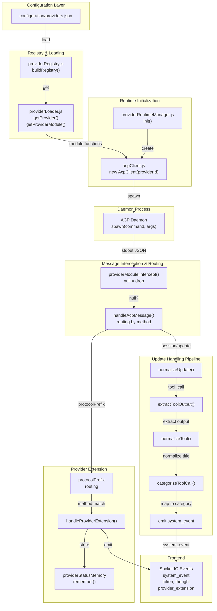

# Feature Doc — Provider System

## Overview

The **Provider System** is AcpUI's pluggable adapter architecture that decouples the frontend from specific AI daemon implementations. Instead of hardcoding support for particular services, AcpUI defines a contract that any ACP-compatible daemon can implement via a provider module. This allows the frontend to be completely provider-agnostic—all branding, protocol handling, tool categorization, and daemon-specific behavior is owned and controlled by the provider itself.

A provider is a directory containing four files: `provider.json` (identity), `branding.json` (UI strings), `user.json` (local settings), and `index.js` (the logic module). The backend loads providers at startup, spawns one ACP daemon per provider, and routes all protocol translation through the provider's module functions. The frontend receives a normalized, provider-agnostic timeline and uses provider branding to render it.

This document serves as the definitive technical guide for understanding the provider system, implementing a new provider, or debugging provider-related issues. It is the replacement for the legacy provider guide, using the full Feature Doc structure (end-to-end flow, architecture diagrams, component reference, gotchas) while preserving the provider JSON schemas and implementation patterns.

---

## Overview Section

### What It Does

- **Decouples frontend from provider logic** — The frontend consumes a normalized Unified Timeline and provider branding; it has zero hardcoded provider names or protocol details
- **Supports multiple providers simultaneously** — Each provider runs its own ACP daemon process with its own AcpClient instance; users can switch between providers per session
- **Owns protocol translation** — Each provider's `index.js` module intercepts raw daemon output, normalizes it, categorizes tools, and forwards standardized events to the UI
- **Manages daemon lifecycle** — Spawns the provider's executable, handles handshake, auto-restarts with exponential backoff, manages environment setup
- **Provides flexible configuration** — Providers define tool ID patterns, default agents, agent switching support, branding text, and local paths via JSON config files
- **Enables provider-specific extensions** — Providers can emit custom protocol methods that the backend forwards to the UI without interpretation

### Why This Matters

- **Extensibility** — New providers can be added without modifying core AcpUI code; they just need to implement the contract in `index.js`
- **Maintainability** — Protocol changes to one daemon don't cascade through the entire codebase; they're isolated to that provider's module
- **Multi-daemon support** — Teams using multiple AI services can run them side-by-side with full feature parity on the frontend
- **Provider ownership** — Each provider controls its own data transformations, secrets, and vendor-specific behavior; AcpUI doesn't impose assumptions
- **Zero frontend bloat** — The frontend doesn't grow with each new provider; all provider-specific logic lives in the backend

---

## How It Works — End-to-End Flow

The provider system orchestrates a complex sequence from server startup through daemon lifecycle, message interception, normalization, and UI delivery. Here is the complete flow with exact file references:

### 1. Server Initialization & Provider Registry Load

**File:** `backend/server.js` (startup), `backend/services/providerRegistry.js` (Function: `buildRegistry`, Lines 110-160)

When the AcpUI backend starts, `server.js` calls `providerRuntimeManager.init(io, serverBootId)`. This triggers the registry load: `buildRegistry()` reads `configuration/providers.json`, validates each provider entry, and normalizes provider IDs.

---

### 2. Provider Configuration & Module Cache

**File:** `backend/services/providerLoader.js` (Function: `getProvider`, Lines 26-68; Function: `getProviderModule`, Lines 108-129)

For each registered provider, `getProvider(providerId)` loads three JSON files from the provider directory and merges them:

```javascript
// FILE: backend/services/providerLoader.js (Lines 26-68)
export function getProvider(providerId) {
  // ... resolvedId ...
  let providerData;
  try {
    providerData = JSON.parse(fs.readFileSync(path.join(basePath, 'provider.json'), 'utf8'));
  } catch (err) {
    // ... error handling ...
  }
  // ... load branding.json and user.json ...
  const config = {
    // ... merge providerData, userData, branding ...
  };
  return provider;
}
```

**Merge Order:** `provider.json` is loaded first, then `user.json` overrides any matching fields. This allows local deployments to customize settings without modifying the repo.

Next, `getProviderModule(providerId)` dynamically imports `index.js`:

```javascript
// FILE: backend/services/providerLoader.js (Lines 108-129)
export async function getProviderModule(providerId) {
  const resolvedId = resolveProviderIdWithContext(providerId);
  if (cachedModules.has(resolvedId)) return cachedModules.get(resolvedId);
  
  const { modulePath } = getProvider(resolvedId);
  if (!modulePath || !fs.existsSync(modulePath)) {
    const defaultModule = bindProviderModule(resolvedId, DEFAULT_MODULE);
    cachedModules.set(resolvedId, defaultModule);
    return defaultModule;
  }

  try {
    const mod = await import(pathToFileURL(modulePath).href);
    const boundModule = bindProviderModule(resolvedId, mod);
    cachedModules.set(resolvedId, boundModule);
    return boundModule;
  } catch (err) {
    writeLog(`[PROVIDER ERR] Failed to import module from ${modulePath}: ${err.message}`);
    const defaultModule = bindProviderModule(resolvedId, DEFAULT_MODULE);
    cachedModules.set(resolvedId, defaultModule);
    return defaultModule;
  }
}
```

**Critical:** The module is cached after first import and never invalidated. Changes to `index.js` require a server restart.

All functions exported from the provider's `index.js` are wrapped in `bindProviderModule()`, which ensures they run within an AsyncLocalStorage context (`runWithProvider(providerId, fn)`). This allows provider functions to call `getProvider()` with no arguments and get the correct provider context automatically.

### 3. ACP Client Creation & Daemon Spawn

**File:** `backend/services/providerRuntimeManager.js:14–46` (init), `backend/services/acpClient.js:85–188` (start)

For each registered provider, a new `AcpClient` instance is created:

```javascript
// FILE: backend/services/providerRuntimeManager.js (Lines 14-46, abridged)
init(io, serverBootId) {
  const entries = getProviderEntries();
  for (const entry of entries) {
    const client = entry.id === defaultProviderId ? defaultAcpClient : new AcpClient(entry.id);
    client.setProviderId(entry.id);
    const provider = getProvider(entry.id);
    this.runtimes.set(entry.id, { providerId: entry.id, provider, client });
  }
  
  for (const runtime of this.runtimes.values()) {
    runtime.client.init(io, serverBootId);  // Calls start()
  }
}
```

The AcpClient's `init()` calls `start()`, which spawns the provider's daemon executable. The daemon command and arguments come from `provider.json`:

```javascript
// FILE: backend/services/acpClient.js (Lines 85-126, abridged)
async start() {
  const { config } = getProvider(providerId);
  const shell = config.command;              // e.g., "node" or a CLI path
  const baseArgs = config.args || ['acp'];   // e.g., ["arg1", "acp"]

  let childEnv = { ...process.env, TERM: 'dumb', CI: 'true', FORCE_COLOR: '0', DEBUG: '1' };
  
  // Provider can customize environment (e.g., set API keys, proxy URLs)
  if (typeof this.providerModule.prepareAcpEnvironment === 'function') {
    childEnv = await this.providerModule.prepareAcpEnvironment(childEnv, {
      providerConfig: config,
      io: this.io,
      writeLog,
      emitProviderExtension: (method, params) => this.handleProviderExtension({ providerId, method, params })
    }) || childEnv;
  }

  this.acpProcess = spawn(shell, args, {
    cwd: process.env.DEFAULT_WORKSPACE_CWD || process.cwd(),
    env: childEnv,
    shell: process.platform === 'win32'
  });

  // Daemon crash → auto-restart with exponential backoff (2s, 4s, 8s, 16s, max 30s)
  this.acpProcess.on('exit', (code) => {
    const delay = Math.min(Math.pow(2, this.restartAttempts) * 1000, 30000);
    setTimeout(() => this.start(), delay);
  });

  this.performHandshake();
}
```

**Stdout Handler (Lines 137–157):**

Every line of stdout is parsed as JSON-RPC and passed to `handleAcpMessage()`:

```javascript
let stdoutBuffer = '';
this.acpProcess.stdout.on('data', (data) => {
  stdoutBuffer += data.toString();
  let newlineIndex;
  while ((newlineIndex = stdoutBuffer.indexOf('\n')) !== -1) {
    const line = stdoutBuffer.slice(0, newlineIndex).trim();
    stdoutBuffer = stdoutBuffer.slice(newlineIndex + 1);
    if (!line) continue;
    try {
      const payload = JSON.parse(line);
      this.handleAcpMessage(payload);
    } catch (err) {
      writeLog(`[ACP PARSE ERR] Malformed payload: ${err.message}`);
    }
  }
});
```

### 4. Handshake & Provider-Owned Initialization

**File:** `backend/services/acpClient.js:190–218` (performHandshake)

After the daemon process starts, `performHandshake()` waits 2 seconds for stdout to settle, then calls the provider's `performHandshake(client)` function:

```javascript
// FILE: backend/services/acpClient.js (Lines 197-224)
async performHandshake() {
  if (this.handshakePromise) return this.handshakePromise;

  const providerId = this.getProviderId();
  this.handshakePromise = withProviderContext(providerId, async () => {
    try {
      writeLog(`[${providerId}] Performing ACP handshake...`);
      await new Promise(r => setTimeout(r, 2000));  // Let stdout settle
      const { config: providerConfig } = getProvider(providerId);
      const providerModule = await getProviderModule(providerId);
      await providerModule.performHandshake(this);

      this.isHandshakeComplete = true;
      writeLog(`ACP Daemon Ready (${providerConfig.name}).`);
      this.io.emit('ready', { providerId, message: 'Ready to help ⚡', bootId: this.serverBootId });

      // Auto-load pinned sessions into memory
      autoLoadPinnedSessions(this).catch(err =>
        writeLog(`[SESSION ERR] Background auto-load failed: ${err.message}`)
      );
    } catch (err) {
      writeLog(`[${providerId}] ACP Handshake Failed: ${err.message}`);
      this.handshakePromise = null; // Allow retry
    }
  });
  return this.handshakePromise;
}
```

The provider's `performHandshake(client)` owns the entire initialization sequence. It must send at least `initialize` and may send additional provider-specific requests. Some daemons require two requests in-flight simultaneously before responding to either.

### 5. Frontend Connection & Branding Emission

**File:** `backend/sockets/index.js:23–94` (on-connect handlers)

When a client connects via WebSocket, the backend emits the provider registry and branding:

```javascript
// FILE: backend/sockets/index.js (Lines 23-35, 37-46, 56-94)
function buildBrandingPayload(providerId) {
  const provider = getProvider(providerId);
  const providerConfig = provider.config;
  return {
    providerId,
    ...providerConfig.branding,           // Fields from branding.json
    title: providerConfig.title,           // App title
    models: providerConfig.models,         // Model catalog
    defaultModel: providerConfig.models?.default,
    protocolPrefix: providerConfig.protocolPrefix,  // For extension routing
    supportsAgentSwitching: providerConfig.supportsAgentSwitching ?? false
  };
}

function getProviderPayloads() {
  const defaultProviderId = getDefaultProviderId();
  return getProviderEntries().map(entry => ({
    providerId: entry.id,
    label: entry.label,
    default: entry.id === defaultProviderId,
    ready: providerRuntimeManager.getRuntimes()
      .find(runtime => runtime.providerId === entry.id)
      ?.client.isHandshakeComplete === true,
    branding: buildBrandingPayload(entry.id)
  }));
}

io.on('connection', (socket) => {
  const defaultProviderId = getDefaultProviderId();
  const providerPayloads = getProviderPayloads();
  
  // Emit all providers + which is default + which is ready
  socket.emit('providers', { defaultProviderId, providers: providerPayloads });
  
  // Emit ready status for any providers that are online
  for (const runtime of providerRuntimeManager.getRuntimes()) {
    if (runtime.client.isHandshakeComplete) {
      socket.emit('ready', { 
        providerId: runtime.providerId, 
        message: 'Ready to help ⚡', 
        bootId: runtime.client.serverBootId 
      });
    }
  }
  
  socket.emit('voice_enabled', { enabled: isSTTEnabled() });
  
  // Emit branding for all providers
  for (const provider of providerPayloads) {
    socket.emit('branding', provider.branding);
  }
  
  // Emit any provider status extensions (quota, usage, etc.)
  const providerStatusExtensions = getLatestProviderStatusExtensions();
  for (const ext of providerStatusExtensions) {
    socket.emit('provider_extension', ext);
  }
});
```

The frontend uses these events to:
- Populate the provider selector
- Show/hide "Ready" status
- Display provider-specific branding text
- Render quota/usage information

### 6. Session Creation/Load with Provider Parameters

**File:** `backend/sockets/sessionHandlers.js:270–376` (create_session)

When the user creates or loads a session, the backend calls the provider's `buildSessionParams(agent)` to inject provider-specific data into the `session/new` or `session/load` request:

```javascript
// FILE: backend/sockets/sessionHandlers.js (Lines 258-336, abridged)
socket.on('create_session', async ({ providerId, model, existingAcpId }, callback) => {
  const runtime = providerRuntimeManager.getRuntime(providerId);
  const acpClient = runtime.client;
  const providerModule = await getProviderModule(resolvedProviderId);
  
  const sessionParams = providerModule.buildSessionParams(requestAgent);
  
  let result;
  if (existingAcpId) {
    // Load existing session
    result = await acpClient.transport.sendRequest('session/load', {
      sessionId: existingAcpId, 
      cwd: sessionCwd, 
      mcpServers: getMcpServers(resolvedProviderId),
      ...sessionParams  // Provider-specific fields spread here
    });
  } else {
    // Create new session
    result = await acpClient.transport.sendRequest('session/new', {
      cwd: sessionCwd, 
      mcpServers: getMcpServers(resolvedProviderId),
      ...sessionParams  // Provider-specific fields spread here
    });
  }
  
  // Capture model state and provider-normalized config options from the daemon's response
  await captureModelState(acpClient, result.sessionId, result, models, model, providerModule);
  
  // If the provider supports runtime agent switching, apply agent now
  if (requestAgent) await providerModule.setInitialAgent(acpClient, result.sessionId, requestAgent);
});
```

**getMcpServers(providerId) Contract:**

This function returns the MCP server configuration for the stdio proxy. It reads `mcpName` from `provider.json`:

```javascript
// FILE: backend/services/sessionManager.js (Lines 24-38)
export function getMcpServers(providerId) {
  const name = getProvider(providerId).config.mcpName;  // e.g., "AcpUI"
  if (!name) return [];
  const proxyPath = path.resolve(__dirname, '..', 'mcp', 'stdio-proxy.js');
  return [{
    name,
    command: 'node',
    args: [proxyPath],
    env: [
      { name: 'ACP_SESSION_PROVIDER_ID', value: String(providerId) },  // Proxy knows its provider
      { name: 'BACKEND_PORT', value: String(process.env.BACKEND_PORT || 3005) },
      { name: 'NODE_TLS_REJECT_UNAUTHORIZED', value: '0' },
    ]
  }];
}
```

### 7. Message Interception & Routing

**File:** `backend/services/acpClient.js:219–253` (handleAcpMessage)

Every message from the daemon goes through the provider's `intercept()` function before routing:

```javascript
// FILE: backend/services/acpClient.js (Lines 225-252)
handleAcpMessage(payload) {
  // Step 1: Interception phase — let the provider mutate or swallow the payload
  const processedPayload = this.providerModule?.intercept ? this.providerModule.intercept(payload) : payload;

  // If interceptor returns null, the message is swallowed (dropped)
  if (!processedPayload) return;

  // Step 2: Routing phase
  if (processedPayload.method === 'session/update' || processedPayload.method === 'session/notification') {
    this.handleUpdate(processedPayload.params.sessionId, processedPayload.params.update);
  } else if (processedPayload.method === 'session/request_permission' && processedPayload.id !== undefined) {
    this.handleRequestPermission(processedPayload.id, processedPayload.params);
  } else if (processedPayload.id !== undefined && this.transport.pendingRequests.has(processedPayload.id)) {
    // Response to a previous request (e.g., session/new, session/set_model)
    const { resolve, reject } = this.transport.pendingRequests.get(processedPayload.id);
    this.transport.pendingRequests.delete(processedPayload.id);
    if (processedPayload.error) {
      reject(processedPayload.error);
    } else {
      resolve(processedPayload.result);
    }
  } else if (processedPayload.method && getProvider(this.getProviderId()).config.protocolPrefix && 
             processedPayload.method.startsWith(getProvider(this.getProviderId()).config.protocolPrefix)) {
    // Provider extension method (e.g., vendor-specific extensions)
    this.handleProviderExtension(processedPayload);
  }
}
```

**Golden Rule:** If `intercept()` returns `null`, the message is dropped entirely. Returning `undefined` does NOT swallow the message—it becomes undefined and may cause errors. Always return the payload (possibly mutated) or explicitly `null`.

### 8. Update Handling & Tool Pipeline

**File:** `backend/services/acpUpdateHandler.js:16–283` (handleUpdate)

When a `session/update` arrives, the provider's normalization functions transform it before emission:

```javascript
// FILE: backend/services/acpUpdateHandler.js (Lines 16-36)
export async function handleUpdate(acpClient, sessionId, update) {
  const providerId = acpClient.getProviderId?.() || acpClient.providerId;
  const { config } = getProvider(providerId);
  const providerModule = await getProviderModule(providerId);

  // Step 1: Normalize (provider-specific structure → standard fields)
  update = typeof providerModule.normalizeUpdate === 'function'
    ? providerModule.normalizeUpdate(update)
    : update;

  if (update.sessionUpdate === 'config_option_update') {
    const providerOptions = typeof providerModule.normalizeConfigOptions === 'function'
      ? providerModule.normalizeConfigOptions(update.configOptions)
      : update.configOptions;
    const incomingOptions = normalizeConfigOptions(providerOptions);
    // ... merge, save, and emit config_options extension ...
  }

  // ... rest of update handling ...
}
```

For tool calls, the pipeline is:

1. **extractDiffFromToolCall()** — Extract any diff/content from `tool_call` (for validation diffs)
2. **normalizeTool()** — Transform `eventToEmit` to match expected shape (title, toolName, arguments in title)
3. **categorizeToolCall()** — Return `{ category, toolId }` by matching `toolIdPattern`
4. **Emit system_event** — Send `{ type: 'tool_start', id, title, category, toolId, ... }` to UI

```javascript
// FILE: backend/services/acpUpdateHandler.js (Lines 153-183, abridged)
else if (update.sessionUpdate === 'tool_call') {
  let eventToEmit = { providerId, sessionId, type: 'tool_start', id: update.toolCallId, title: titleStr, filePath };

  // Step 1: Normalize format
  eventToEmit = typeof providerModule.normalizeTool === 'function'
    ? providerModule.normalizeTool(eventToEmit, update)
    : eventToEmit;

  // Step 2: Categorize (provider maps its tools to UI categories)
  const category = typeof providerModule.categorizeToolCall === 'function'
    ? providerModule.categorizeToolCall(eventToEmit)
    : null;
  if (category) eventToEmit = { ...eventToEmit, ...category };

  acpClient.io.to('session:' + sessionId).emit('system_event', eventToEmit);
}
```

For `tool_call_update`, sticky metadata is applied: if a previous chunk extracted a filePath or title, they are re-injected if the current chunk doesn't have them.

### 9. Provider Extension Routing

**File:** `backend/services/acpClient.js:284–355` (handleProviderExtension)

Messages matching the provider's `protocolPrefix` are routed to `handleProviderExtension()`:

```javascript
// FILE: backend/services/acpClient.js (Lines 284-355, abridged)
handleProviderExtension(payload) {
  const providerId = this.getProviderId();
  writeLog(`[ACP EXT] ${payload.method}`);

  // Special handling: model state updates
  if (payload.params?.sessionId && (payload.params.currentModelId || payload.params.modelOptions)) {
    this.handleModelStateUpdate(payload.params.sessionId, {
      currentModelId: payload.params.currentModelId,
      models: payload.params.models,
      modelOptions: payload.params.modelOptions
    });
  }

  // Special handling: config option updates
  if (payload.method.endsWith('config_options') && payload.params?.sessionId) {
    const mergedOptions = applyConfigOptionsChange(meta?.configOptions, incomingOptions, { replace, removeOptionIds });
    // ... save merged options ...
  }

  // Emit the extension to the UI
  if (this.io) {
    rememberProviderStatusExtension(payload, providerId);
    this.io.emit('provider_extension', {
      providerId,
      method: payload.method,
      params: { ...payload.params, providerId }
    });
  }
}
```

The `rememberProviderStatusExtension()` call stores the latest extension so newly connected clients can receive it immediately.

### 10. Frontend Delivery

The UI receives normalized events via Socket.IO:
- **system_event** — tool calls, thoughts, messages with normalized metadata
- **token** — streaming message chunks
- **thought** — streaming thought chunks
- **provider_extension** — vendor-specific data (quota, model updates, etc.)

The frontend uses provider branding to render labels and never touches provider-specific logic.

---

## Architecture Diagram



---

## The Critical Contracts

### Contract 1: Provider Directory Structure

A provider directory MUST contain these four files:

```
my-provider/
├── provider.json      # REQUIRED: Protocol identity and tool mapping
├── branding.json      # REQUIRED: UI text strings
├── user.json          # OPTIONAL: Local paths and executable settings (git-ignored in production)
└── index.js           # REQUIRED: Logic module with provider functions
```

**Load Order & Merge:**

1. `provider.json` is loaded first and defines the canonical configuration
2. `user.json` (if present) overrides any matching fields in `provider.json`
3. `branding.json` provides UI strings and is merged separately

This means `user.json` can override critical settings like `command`, `args`, `models.default`, or even `protocolPrefix` at deployment time without modifying the repo.

### Contract 2: The DEFAULT_MODULE Interface

Every function exported by a provider's `index.js` must match the signature and behavior of the corresponding function in `DEFAULT_MODULE`. If a new function is added to this contract, every provider must be updated in the same change to implement it, even if that implementation is only an explicit pass-through/no-op.

```javascript
// FILE: backend/services/providerLoader.js (Lines 70-95)
const DEFAULT_MODULE = {
  intercept: (p) => p,                                    // Pass through unchanged
  normalizeUpdate: (u) => u,                              // No transformation
  normalizeConfigOptions: (options) => options,            // No config option transformation
  extractToolOutput: () => undefined,                     // No output extraction
  extractFilePath: () => undefined,                       // No file path extraction
  extractDiffFromToolCall: () => undefined,               // No diff extraction
  normalizeTool: (e) => e,                                // No tool normalization
  categorizeToolCall: () => null,                         // No categorization
  parseExtension: () => null,                             // No extension parsing
  emitCachedContext: () => false,                         // No cached context emission
  prepareAcpEnvironment: async (env) => env,              // Environment unchanged
  performHandshake: async () => {},                       // No-op
  buildSessionParams: (_agent) => undefined,              // No extra params
  getMcpServerMeta: () => undefined,                      // No MCP server metadata
  setInitialAgent: async () => {},                        // No-op
  setConfigOption: async () => {},                        // No-op
  getSessionPaths: () => ({ jsonl: '', json: '', tasksDir: '' }),
  cloneSession: () => {},                                 // No-op
  archiveSessionFiles: () => {},                          // No-op
  restoreSessionFiles: () => {},                          // No-op
  deleteSessionFiles: () => {},                           // No-op
  getSessionDir: () => '',                                // Empty string
  getAttachmentsDir: () => '',                            // Empty string
  getAgentsDir: () => '',                                 // Empty string
  getHooksForAgent: async () => [],                       // No hooks
};
```

    The default module remains a runtime safety net, but it is not a substitute for updating providers when the contract changes. New contract functions require explicit provider implementations so behavior is visible and testable in each provider.

    **Prompt lifecycle contract:** `onPromptStarted(sessionId)` and `onPromptCompleted(sessionId)` are provider-owned hooks called by `backend/sockets/promptHandlers.js` around every real `session/prompt` request. Providers that drive quota polling or other prompt-scoped side effects must implement these hooks directly instead of inferring lifecycle from `intercept()` traffic (which also includes `session/load` history replay notifications).

### Contract 3: toolIdPattern Resolution & Tool Categorization

The `toolIdPattern` in `provider.json` defines how tool IDs are constructed. It uses two placeholders:
- `{mcpName}` — substituted with the value of the `mcpName` field from `provider.json` (default: "AcpUI")
- `{toolName}` — substituted with the daemon's native tool name

**Examples:**
```
Pattern: "mcp__{mcpName}__{toolName}" → "mcp__AcpUI__ux_invoke_shell"
Pattern: "mcp_{mcpName}_{toolName}" → "mcp_AcpUI_ux_invoke_shell"
Pattern: "@{mcpName}/{toolName}" → "@AcpUI/ux_invoke_shell"
```

The exact format varies by provider; what matters is consistency between the `toolIdPattern` and what the daemon actually sends. The `categorizeToolCall(event)` function uses this pattern to determine if a tool call is a UI-hooked tool. If the tool ID matches the pattern and the tool name is a known UI tool, the event is tagged with `category`, `toolId`, etc.

**Golden Rule:** If `toolIdPattern` doesn't match what the daemon actually sends, tool calls will never be categorized, and the UI won't hook them.

### Contract 4: AsyncLocalStorage Provider Context

All provider module functions run inside an AsyncLocalStorage context created by `runWithProvider(providerId, fn)`. This means calling `getProvider()` without arguments resolves to the current request's provider:

```javascript
// Inside a provider module function:
export function normalizeTool(event, update) {
  const provider = getProvider();  // NO ARGUMENT — uses context
  const name = provider.config.name;  // Provider name from config
  // ...
}

// Outside a provider context, getProvider() needs an explicit ID:
// ❌ getProvider() — error or default provider
// ✅ getProvider("provider-id") — explicit ID
```

This context is automatically established whenever:
- A provider function is called (via `bindProviderModule` wrapping)
- An async operation within that function maintains the context via AsyncLocalStorage

**When Context Is Lost:** If you spawn a child process or use `setTimeout` without preserving the context, `getProvider()` may fail. Always pass `providerId` explicitly in those cases.

---

## Configuration Schemas

### A. provider.json (Protocol & Identity)

Defines the low-level communication identity and how the provider's tools map to UI features.

```jsonc
{
  // REQUIRED: Human-readable display name
  "name": "Provider Display Name",

  // REQUIRED: Prefix for provider-specific protocol methods
  // Example: a provider might send "{prefix}quota" or "{prefix}model_update" extensions
  "protocolPrefix": "_provider/",

  // OPTIONAL: The MCP server name passed to ACP
  // Default: "AcpUI"
  // Substituted in toolIdPattern as {mcpName}
  "mcpName": "AcpUI",

  // REQUIRED: The REAL default agent name of the daemon
  // Used to detect if a session has diverged from the baseline
  "defaultSystemAgentName": "default-agent",

  // OPTIONAL: Whether daemon supports switching agents at runtime
  // Default: false
  "supportsAgentSwitching": false,

  // OPTIONAL: Hooks that the CLI manages natively (UI skips these)
  "cliManagedHooks": [],

  // REQUIRED: Template for mapping tool names to tool IDs
  // Placeholders: {mcpName}, {toolName}
  // The exact pattern depends on the daemon's behavior
  "toolIdPattern": "mcp__{mcpName}__{toolName}",

  // OPTIONAL: Maps daemon tool names to UI categories
  // Used by categorizeToolCall() to classify tools
  "toolCategories": {
    "read_file": { "category": "file_read", "isFileOperation": true },
    "write_file": { "category": "file_write", "isFileOperation": true },
    "bash_command": { "category": "shell", "isShellCommand": true },
    "search": { "category": "grep" }
  },

  // OPTIONAL: Client info passed to daemon during initialize
  "clientInfo": {
    "name": "client-name",
    "version": "1.0.0"
  }
}
```

### B. branding.json (UI Text & Visual Identity)

Defines all strings rendered in the UI. The frontend has ZERO hardcoded provider names.

```jsonc
{
  // OPTIONAL: Browser tab title
  "title": "Provider Name",

  // OPTIONAL: Label for assistant messages
  "assistantName": "Assistant",

  // OPTIONAL: Placeholder text while model is generating
  "busyText": "Thinking...",

  // OPTIONAL: Placeholder text while post-process hooks run
  "hooksText": "Running hooks...",

  // OPTIONAL: Placeholder text while daemon is starting up
  "warmingUpText": "Starting up...",

  // OPTIONAL: Placeholder text while session is loading from disk
  "resumingText": "Resuming...",

  // OPTIONAL: Input field placeholder
  "inputPlaceholder": "Message...",

  // OPTIONAL: Message shown when a session is completely empty
  "emptyChatMessage": "Start a conversation.",

  // OPTIONAL: Desktop notification header
  "notificationTitle": "Notification",

  // OPTIONAL: App header text
  "appHeader": "Header Text",

  // OPTIONAL: Label for session settings
  "sessionLabel": "Session",

  // OPTIONAL: Label for model selection
  "modelLabel": "Model"
}
```

### C. user.json (Local Paths & Executable)

Contains local machine settings. Typically git-ignored in production. **Paths must be absolute.**

```jsonc
{
  // REQUIRED: Command to spawn the daemon
  // Example: "node" for Node.js, "/usr/local/bin/daemon-cli" for custom executables
  "command": "node",

  // REQUIRED: Arguments passed to the command
  // The last argument is usually the subcommand
  "args": ["path/to/daemon.js", "acp"],

  // OPTIONAL: Local paths for session storage and metadata
  "paths": {
    // Absolute path to directory containing .jsonl session files
    "sessions": "/path/to/sessions",

    // Absolute path to directory containing agent definitions
    "agents": "/path/to/agents",

    // Absolute path to directory for uploaded attachments
    "attachments": "/path/to/attachments"
  },

  // OPTIONAL: Model configuration
  "models": {
    // Default model ID used for new sessions (must be a real provider model ID)
    "default": "model-id",

    // Quick-access model list shown in footer UI
    // Optional; if empty, the UI shows a label but no clickable options
    "quickAccess": [
      {
        "id": "model-id",
        "displayName": "Model Display Name",
        "description": "Optional description"
      }
    ],

    // Model ID used for auto-generating session titles
    "titleGeneration": "model-id",

    // Model ID used for sub-agent spawning
    "subAgent": "model-id"
  }
}
```

### D. Dynamic Model Contract

AcpUI treats model selection as a first-class application contract. Providers can advertise full per-session model catalogs dynamically.

**Normalization:** The backend normalizes model state from multiple sources into:

```typescript
{
  currentModelId: string;           // Real provider model ID, source of truth
  modelOptions: [
    {
      id: string;                   // Real provider model ID
      name: string;                 // Display name shown in UI
      description?: string;          // Optional detail
    }
  ]
}
```

**Input Shapes:** Providers can send model data in any of these equivalent forms:

```jsonc
// Shape 1 (Preferred)
{ "id": "model-id", "name": "Display Name", "description": "Optional" }

// Shape 2
{ "modelId": "model-id", "displayName": "Display Name" }

// Shape 3
{ "value": "model-id", "name": "Display Name" }
```

**Priority Order:**

1. `session/new` or `session/load` result: `models.currentModelId` and `models.availableModels`
2. `session/new` or `session/load` result: top-level `currentModelId` and `modelOptions`
3. Dynamic config option: `{ type: 'select', id: 'model', currentValue: '...', options: [...] }`
4. Provider `user.json` `models.quickAccess[]` as fallback catalog

**Contract Rules:**

- `currentModelId` is the source of truth; it must be the real provider model ID, never a display name
- `session/set_model` requests receive the real model ID, never a display name
- The legacy `model` field may contain the raw model ID for backward compatibility

### E. Provider Status Contract

Providers can publish provider-level status (quota, usage, cost windows, model limits, etc.) through a provider extension method using the `protocolPrefix`:

```
{protocolPrefix}provider/status
```

**Format:**

```jsonc
{
  "method": "{protocolPrefix}provider/status",
  "params": {
    "status": {
      "providerId": "provider-id",
      "title": "Provider Title",
      "subtitle": "Usage: 2.3% of 5h window",
      "updatedAt": "2026-05-01T12:34:56.789Z",

      // Compact sidebar layer (always visible)
      "summary": {
        "title": "Usage",
        "items": [
          {
            "id": "item-id",
            "label": "5h",
            "value": "3%",
            "tone": "success",
            "progress": { "value": 0.03 }
          }
        ]
      },

      // Full details layer (shown in modal)
      "sections": [
        {
          "id": "section-id",
          "title": "Section Title",
          "items": [
            {
              "id": "item-id",
              "label": "Label",
              "value": "Value",
              "detail": "Optional detail",
              "tone": "success",
              "progress": { "value": 0.03 }
            }
          ]
        }
      ]
    }
  }
}
```

**Contract Rules:**

- `summary.items` is the compact always-visible sidebar layer; keep it short (1-3 items)
- `sections` is the complete details layer; include any raw/provider-specific data useful for inspection
- `progress.value` is a number from 0 to 1; the provider owns that conversion
- `tone` is optional and may be `neutral`, `info`, `success`, `warning`, or `danger`
- All values are already formatted for display; the frontend should never interpret provider-specific units

---

## The index.js Function Reference

Every function in a provider's `index.js` must match one of the signatures in `DEFAULT_MODULE`. This section describes each function's purpose, default behavior, and implementation patterns.

### Data Normalization & Interception

#### intercept(payload)

**Purpose:** Called synchronously on every raw JSON-RPC line from stdout. Allows mutating, dropping, or transforming the payload before routing.

**Default:** Returns payload unchanged.

**Signature:**
```javascript
export function intercept(payload) {
  // Return: mutated payload (routed normally)
  // Return: null (message is swallowed/dropped)
  // Return: undefined (DOES NOT swallow — becomes undefined)
}
```

**Pattern Example:**
```javascript
export function intercept(payload) {
  // A provider might filter out vendor-specific heartbeats
  if (payload.method === 'heartbeat') {
    return null;  // Drop
  }
  
  // A provider might normalize top-level field names
  if (payload.CustomField !== undefined) {
    payload.standardField = payload.CustomField;
  }
  
  return payload;
}
```

**Golden Rule:** Return `null` to swallow. Returning undefined does NOT swallow.

#### normalizeUpdate(update)

**Purpose:** Transforms non-standard daemon `session/update` shapes into the standard ACP update format. Called once per update.

**Default:** Returns update unchanged.

**Pattern Example:**
```javascript
export function normalizeUpdate(update) {
  // A provider might use different field names for standard concepts
  if (update.CustomUpdateType !== undefined) {
    update.sessionUpdate = update.CustomUpdateType;
    delete update.CustomUpdateType;
  }
  
  // A provider might nest fields differently
  if (update.payload && update.payload.content) {
    update.content = update.payload.content;
    delete update.payload;
  }
  
  return update;
}
```

#### normalizeConfigOptions(options)

**Purpose:** Transforms provider-specific dynamic config options before they are merged into metadata, saved to the database, or emitted to the frontend. This is used for both native `config_option_update` notifications and `session/new` / `session/load` response-time config options.

**Default:** Returns options unchanged.

**Common Pattern:** Filter out a provider's `model` config option when AcpUI already captures the model catalog through `models.availableModels`, and mark reasoning controls with `kind: "reasoning_effort"` so the chat footer can render them.

```javascript
export function normalizeConfigOptions(options) {
  return Array.isArray(options)
    ? options
        .filter(option => option.id !== 'model')
        .map(option => option.id === 'reasoning_effort'
          ? { ...option, kind: 'reasoning_effort' }
          : option)
    : [];
}
```

#### extractToolOutput(update)

**Purpose:** Extracts displayable text or diffs from `tool_call_update`. Called for real-time streaming.

**Default:** Returns undefined (falls back to `content[]` array).

**Golden Rule:** If a tool is streaming (e.g., raw output is partial or fragmented), parse and extract partial content to provide real-time UI updates.

**Pattern Example:**
```javascript
export function extractToolOutput(update) {
  // A provider might send tool output in a nested or custom format
  if (update.toolOutput && update.toolOutput.text) {
    return update.toolOutput.text;  // Real-time
  }
  
  // A provider might have streaming output that needs parsing
  if (update.stream && Array.isArray(update.stream)) {
    return update.stream.map(item => item.data).join('');
  }
  
  return undefined;
}
```

#### extractFilePath(update, resolve)

**Purpose:** Identifies the file being targeted by a tool. Used for "Sticky Metadata" so the UI knows which file is being "Written..." even if the daemon sends generic updates.

**Default:** Returns undefined.

**Pattern Example:**
```javascript
export function extractFilePath(update, resolve) {
  // A provider might include file paths in tool arguments
  if (update.arguments && update.arguments.filepath) {
    return resolve(update.arguments.filepath);
  }
  
  // A provider might include it in a different structure
  if (update.metadata && update.metadata.target_file) {
    return resolve(update.metadata.target_file);
  }
  
  return undefined;
}
```

**Golden Rule:** Extract from the FIRST packet so sticky metadata works for subsequent packets.

#### normalizeTool(event, update)

**Purpose:** Produces a human-readable `title` and normalizes the event shape. Should inject arguments (like filenames) into the title for visibility.

**Default:** Returns event unchanged.

**Pattern Example:**
```javascript
export function normalizeTool(event, update) {
  // A provider might have generic tool titles that need enhancement
  if (event.title === 'FileOperation' && update.operation) {
    event.title = `${update.operation} file`;
  }
  
  // A provider might omit important context that should be in the title
  if (event.title && update.arguments && update.arguments.filename) {
    event.title = `${event.title}: ${update.arguments.filename}`;
  }
  
  return event;
}
```

#### categorizeToolCall(event)

**Purpose:** Maps a tool to a UI category (`file_read`, `file_edit`, `shell`, `glob`, etc.). Returns an object with `category` and optionally `toolId`.

**Default:** Returns null (uncategorized).

**Pattern Example:**
```javascript
export function categorizeToolCall(event) {
  const { config } = getProvider();  // Context available!
  
  // A provider might use non-standard tool names
  // Check the title or event against known UI tool patterns
  if (event.title && event.title.includes('shell')) {
    return { category: 'shell', toolId: 'ux_invoke_shell' };
  }
  
  if (event.title && event.title.includes('file')) {
    return { category: 'file_read', toolId: 'ux_invoke_file_read' };
  }
  
  return null;
}
```

### Session & History Management

#### getSessionPaths(sessionId)

**Purpose:** Locates the `.jsonl` and `.json` files for a session. Must handle project-scoped subdirectories.

**Default:** Returns `{ jsonl: '', json: '', tasksDir: '' }` (empty strings).

**Signature:**
```javascript
export function getSessionPaths(sessionId) {
  return {
    jsonl: '/path/to/session.jsonl',
    json: '/path/to/session.json',
    tasksDir: '/path/to/tasks'
  };
}
```

**Golden Rule:** If returning empty strings, the backend will silently fail to read session history.

#### cloneSession(oldId, newId, messageCount)

**Purpose:** Copies session files for forking. Must distinguish "internal" messages (caveats, internal tool calls) from real user turns to avoid premature truncation.

**Default:** No-op.

**Signature:**
```javascript
export function cloneSession(oldId, newId, messageCount) {
  // Copy oldId's session files to newId
  // Optionally truncate to messageCount user turns
  // Be careful: internal messages should not count toward messageCount
}
```

#### parseSessionHistory(path, Diff)

**Purpose:** Reconstructs the **Unified Timeline** from a `.jsonl` file. Maps daemon messages into a sequence of `thought`, `tool`, and `text` steps.

**Default:** No-op.

**Returns:**
```typescript
[
  {
    role: 'user',      // or 'assistant'
    type: 'text',      // or 'thought', 'tool'
    content: string,
    timestamp: number,
    metadata: object
  }
]
```

#### archiveSessionFiles(sessionId, archivePath)

**Purpose:** Moves files to long-term storage.

**Default:** No-op.

#### deleteSessionFiles(sessionId)

**Purpose:** Cleans up all persistence associated with a session.

**Default:** No-op.

### Lifecycle Hooks

#### prepareAcpEnvironment(env, context)

**Purpose:** Prepares the environment used to spawn the ACP daemon. Can set provider-owned sidecars, local proxies, API keys, etc.

**Default:** Returns env unchanged.

**Signature:**
```javascript
export async function prepareAcpEnvironment(env, context) {
  // context: { providerConfig, io, writeLog, emitProviderExtension }
  const newEnv = { ...env };
  newEnv['API_KEY'] = process.env.MY_API_KEY;
  newEnv['PROXY_URL'] = 'http://localhost:8080';
  return newEnv;  // Must return the environment object
}
```

#### emitCachedContext(sessionId)

**Purpose:** Gives providers a backend-triggered hook to replay any context usage percentage they persisted locally for a session. `session/load` responses do not always echo `sessionId`, and hot-resume can skip `session/load` entirely, so relying only on `intercept()` can miss the first UI update after reboot.

**Default:** Returns `false`.

**Signature:**
```javascript
export function emitCachedContext(sessionId) {
  if (!sessionId || !cachedContext.has(sessionId)) return false;
  emitProviderExtension(`${protocolPrefix}metadata`, {
    sessionId,
    contextUsagePercentage: cachedContext.get(sessionId)
  });
  return true;
}
```

**Backend call sites:** `backend/sockets/sessionHandlers.js` calls this after explicit session load and hot-session reuse; `backend/services/sessionManager.js` calls it after pinned-session hot-load.

#### performHandshake(client)

**Purpose:** Owns the full initialization sequence. Must call `client.sendRequest('initialize', ...)` and any provider-specific follow-up (e.g., `authenticate`). The provider controls ordering.

**Default:** No-op (daemon remains uninitialized).

**Signature:**
```javascript
export async function performHandshake(client) {
  // client: AcpClient instance with transport.sendRequest() method
  
  const initResult = await client.transport.sendRequest('initialize', {
    protocolVersion: 1,
    clientCapabilities: { fs: { readTextFile: true, writeTextFile: true }, terminal: true },
    clientInfo: { name: 'AcpUI', version: '1.0.0' }
  });
  
  // Some daemons require paired requests before responding
  if (initResult.requiresAuthentication) {
    await client.transport.sendRequest('authenticate', {
      // auth params
    });
  }
}
```

#### buildSessionParams(agent)

**Purpose:** Returns extra params to spread into `session/new` and `session/load` ACP requests.

**Default:** Returns undefined (no extra params).

**Use When:** Daemon must receive the agent at spawn time (via startup option, not runtime command).

**Signature:**
```javascript
export function buildSessionParams(agent) {
  if (!agent) return undefined;
  return { _meta: { daemon_options: { agent } } };
}
```

The returned object is spread verbatim into the request:
```javascript
const result = await client.sendRequest('session/new', {
  cwd: sessionCwd,
  mcpServers: getMcpServers(providerId),
  ...buildSessionParams(requestAgent)  // Spread here
});
```

#### getMcpServerMeta()

**Purpose:** Returns optional metadata to attach as `_meta` on the MCP server config object sent to the ACP daemon in `session/new` and `session/load` requests.

**Default:** Returns `undefined` (no metadata attached).

**Use When:** The daemon's MCP implementation supports non-standard metadata fields (e.g., timeout overrides). The returned object is conditionally spread onto the server config entry only when non-null/undefined.

**Signature:**
```javascript
export function getMcpServerMeta() {
  // Return undefined for no metadata
  return undefined;

  // Or return an object with daemon-specific fields:
  // return { codex_acp: { tool_timeout_sec: 3600 } };
}
```

The returned value is spread onto the MCP server config:
```javascript
const mcpServerMeta = providerModule.getMcpServerMeta?.();
return [{
  name,
  command: 'node',
  args: [proxyPath],
  env: [...],
  ...(mcpServerMeta ? { _meta: mcpServerMeta } : {})
}];
```

**Golden Rule:** Return `undefined` (not `{}`) when not needed. An empty object would still be spread as `_meta: {}`, which may confuse daemons that check for `_meta` presence.

#### setInitialAgent(client, sessionId, agent)

**Purpose:** Called after session creation to apply an agent via a post-creation mechanism (e.g., a slash command).

**Default:** No-op.

**Use When:** Daemon supports runtime agent switching after session exists.

**Signature:**
```javascript
export async function setInitialAgent(client, sessionId, agent) {
  if (!agent) return;
  await client.transport.sendRequest('session/prompt', {
    sessionId,
    prompt: [{ type: 'text', text: `/agent ${agent}` }]
  });
}
```

#### setConfigOption(client, sessionId, optionId, value)

**Purpose:** Translates UI config changes (like "Reasoning Effort") to native daemon requests.

**Default:** No-op.

**Signature:**
```javascript
export async function setConfigOption(client, sessionId, optionId, value) {
  if (optionId === 'reasoning_effort') {
    return await client.transport.sendRequest('session/configure', {
      sessionId,
      options: { effort: value }  // Provider owns the mapping
    });
  }
}
```

#### getHooksForAgent(agentName)

**Purpose:** Resolves post-processing hooks from agent definitions.

**Default:** Returns empty array.

**Signature:**
```javascript
export async function getHooksForAgent(agentName) {
  return [
    {
      id: 'lint',
      name: 'Run linter',
      script: 'eslint *.js'
    }
  ];
}
```

---

## Agent Forwarding

When the user selects a named agent, AcpUI passes the agent name to the provider via two hooks at different points in the session lifecycle. **How you implement these depends entirely on when your daemon accepts agent configuration.**

### buildSessionParams(agent) — Spawn-Time Forwarding

Use this when your daemon must receive the agent at the point of session creation (i.e., it is applied as a startup option, not a runtime command).

```javascript
// Example pattern: daemon reads agent from metadata on session/new and session/load
export function buildSessionParams(agent) {
  if (!agent) return undefined;
  return { _meta: { options: { agent } } };
}
```

The backend spreads the return value verbatim — you fully control the key names and nesting. Return `undefined` (or nothing) when no agent is set.

### setInitialAgent(client, sessionId, agent) — Post-Creation Forwarding

Use this when your daemon supports switching agents at runtime after a session exists (e.g., via a command sent as a `session/prompt`).

```javascript
// Example pattern: daemon switches agent via a command
export async function setInitialAgent(client, sessionId, agent) {
  if (!agent) return;
  await client.transport.sendRequest('session/prompt', {
    sessionId,
    prompt: [{ type: 'text', text: `/agent ${agent}` }]
  });
}
```

### Decision Table

| Scenario | Use |
|----------|-----|
| Daemon applies agent at subprocess start (startup flag / env var) | `buildSessionParams` |
| Daemon supports runtime agent switching via a command or request | `setInitialAgent` |
| Daemon supports both | **Both** — `buildSessionParams` for new/load, `setInitialAgent` as a fallback override |
| Daemon does not support named agents | Neither — inherit the no-op defaults |

Both hooks are called on every `session/new` and `session/load`. If `agent` is `undefined` or empty, both should be no-ops.

---

## Provider Registration

Providers are registered in `configuration/providers.json`:

```json
{
  "defaultProviderId": "provider-a",
  "providers": [
    {
      "id": "provider-a",
      "path": "./providers/provider-a",
      "enabled": true,
      "label": "Provider A",
      "order": 0
    },
    {
      "id": "provider-b",
      "path": "./providers/provider-b",
      "enabled": true,
      "label": "Provider B",
      "order": 1
    }
  ]
}
```

**Fields:**

- `id` — Provider identifier (normalized to lowercase, alphanumeric + hyphens)
- `path` — Relative path to provider directory (e.g., `./providers/my-provider`)
- `enabled` — Boolean; if false, the provider is skipped
- `label` — Human-readable label for provider selection UI (optional; defaults to id)
- `order` — Sort order for UI provider lists (optional; defaults to index)

**Validation:**

- The default provider must exist and be enabled, or the server refuses to start
- Each `path` must exist and contain a `provider.json` file
- Provider IDs must be unique

---

## Update Handling Pipeline — Tool Normalization Flow

The update handling pipeline in `acpUpdateHandler.js` is a multi-stage transformation that converts daemon-specific update formats into normalized system events. Here's the exact sequence:

### For tool_call (Lines 150–181)

```
1. extractDiffFromToolCall(update, Diff)
   ↓ extracts validation diffs if present
2. normalizeTool(eventToEmit, update)
   ↓ transforms title, arguments, shape
3. categorizeToolCall(eventToEmit)
   ↓ maps tool to { category, toolId, ... }
4. emit('system_event', { type: 'tool_start', id, title, category, toolId, ... })
```

### For tool_call_update (Lines 183–256)

```
1. extractToolOutput(update)
   ↓ extracts streaming output if present
2. sticky metadata re-injection
   ↓ if filePath/title cached from earlier packet, re-apply
3. normalizeTool(endEvent, update)
   ↓ transforms for consistency
4. categorizeToolCall(endEvent)
   ↓ re-categorize with latest data
5. emit('system_event', { type: 'tool_update' | 'tool_end', id, output, status, ... })
```

### Fallback: content[] Array

If `extractToolOutput()` returns undefined and the update has a `content[]` array:

```javascript
if (toolOutput === undefined && update.content && Array.isArray(update.content)) {
  const contentItem = update.content[0];
  if (contentItem.type === 'content' && contentItem.content?.type === 'text') {
    toolOutput = contentItem.content.text;
  } else if (contentItem.type === 'diff') {
    // Generate a unified diff for file changes
    toolOutput = Diff.createPatch(update.toolCallId || 'file', 
      contentItem.oldText || '', contentItem.newText || '', 'old', 'new');
  }
}
```

---

## Frontend Branding & Provider Visibility

### buildBrandingPayload()

When a client connects via WebSocket, the backend emits branding for all providers:

```javascript
// FILE: backend/sockets/index.js (Lines 23-35)
function buildBrandingPayload(providerId) {
  const provider = getProvider(providerId);
  const providerConfig = provider.config;
  return {
    providerId,
    ...providerConfig.branding,           // All fields from branding.json
    title: providerConfig.title,           // App title
    models: providerConfig.models,         // Model catalog
    defaultModel: providerConfig.models?.default,
    protocolPrefix: providerConfig.protocolPrefix,
    supportsAgentSwitching: providerConfig.supportsAgentSwitching ?? false
  };
}
```

### On-Connect Emission Sequence

```javascript
// 1. Provider registry (which providers exist, which is default, which are ready)
socket.emit('providers', { defaultProviderId, providers: providerPayloads });

// 2. Ready status for online providers
for (const runtime of providerRuntimeManager.getRuntimes()) {
  if (runtime.client.isHandshakeComplete) {
    socket.emit('ready', { providerId, message: 'Ready to help ⚡', bootId });
  }
}

// 3. Branding for each provider
for (const provider of providerPayloads) {
  socket.emit('branding', provider.branding);
}

// 4. Latest provider status extensions (quota, usage, etc.)
for (const ext of getLatestProviderStatusExtensions()) {
  socket.emit('provider_extension', ext);
}
```

The frontend uses these events to:
- Populate the provider selector
- Show/hide "Ready" status
- Display provider-specific branding text
- Render quota/usage information

---

## Provider Extension Protocol

Providers can emit custom protocol methods prefixed with their `protocolPrefix`. These are routed automatically without interpretation by the backend.

### Routing Logic

```javascript
// FILE: backend/services/acpClient.js (Lines 254)
else if (processedPayload.method && getProvider(this.getProviderId()).config.protocolPrefix && 
         processedPayload.method.startsWith(getProvider(this.getProviderId()).config.protocolPrefix)) {
  this.handleProviderExtension(processedPayload);
}
```

### Examples

A provider might define methods like:
- `{protocolPrefix}quota` — quota usage update
- `{protocolPrefix}model_update` — available models changed
- `{protocolPrefix}agent/switched` — agent switched at runtime

### Special Handling in handleProviderExtension()

**Model State Updates:**

If an extension contains model data, `handleModelStateUpdate()` is called:

```javascript
if (payload.params?.sessionId && (payload.params.currentModelId || payload.params.modelOptions)) {
  this.handleModelStateUpdate(payload.params.sessionId, {
    currentModelId: payload.params.currentModelId,
    models: payload.params.models,
    modelOptions: payload.params.modelOptions
  });
}
```

**Config Option Updates:**

If the extension method ends with `config_options`:

```javascript
if (payload.method.endsWith('config_options') && payload.params?.sessionId) {
  // Merge with saved options, save to DB, emit to UI
  const mergedOptions = applyConfigOptionsChange(meta?.configOptions, incomingOptions, { replace, removeOptionIds });
  // ...
}
```

**Status Extension Memory:**

All extensions are stored in memory via `rememberProviderStatusExtension()` so newly connected clients can receive the latest status immediately.

---

## Implementation Patterns (High-Fidelity Standard)

### Real-Time Tool Streaming

Don't wait for `status: "completed"` to show output. In `extractToolOutput()`, parse available data (even if partial or fragmented) to extract content fields. This allows the UI to render output as it's being generated.

```javascript
export function extractToolOutput(update) {
  if (update.rawData && update.toolCallId) {
    try {
      // A provider might send partial JSON that needs parsing
      const parsed = JSON.parse(update.rawData);
      return parsed.content;  // Partial content, rendered in real-time
    } catch {
      return update.rawData;  // Unparseable but displayable
    }
  }
}
```

### Sticky Metadata

Daemons often emit a `tool_call` with metadata (filename, title), followed by many `tool_call_update` messages that omit this metadata. The backend caches the first metadata; your `extractFilePath()` should reliably find it in the first packet so the UI can "stick" it to the entire tool execution block.

```javascript
export function extractFilePath(update, resolve) {
  // Extract from the initial tool_call, not updates
  if (update.sessionUpdate === 'tool_call' && update.filePath) {
    return resolve(update.filePath);
  }
  return undefined;
}
```

### Internal Message Filtering

When parsing history or pruning for forks, look for "meta" flags or content markers. These should not count as "User Turns". If you treat an internal command as a user turn, a session pruned at turn 1 might contain only a system warning and no actual conversation.

```javascript
export function parseSessionHistory(path, Diff) {
  const lines = fs.readFileSync(path, 'utf8').split('\n');
  const timeline = [];
  
  for (const line of lines) {
    const entry = JSON.parse(line);
    
    // Skip internal messages
    if (entry._internal === true) continue;
    if (entry.content?.includes('[SystemNotice]')) continue;
    
    timeline.push(entry);
  }
  return timeline;
}
```

### Unified Timeline Construction

In `parseSessionHistory()`, return a timeline of steps with explicit types:

- `type: "thought"` for internal reasoning
- `type: "tool"` for actions
- `type: "text"` for final responses

This allows the UI to render the "thinking" process and tool logs inline with the conversation.

### Hot-Loading Sessions (autoLoadPinnedSessions)

After handshake completes, the backend auto-loads all pinned sessions into memory via `loadSessionIntoMemory()`. This ensures sessions are "hot" and responsive.

```javascript
// FILE: backend/services/sessionManager.js (Lines 255-277)
export async function autoLoadPinnedSessions(acpClient) {
  const pinnedSessions = await db.getPinnedSessions(providerId);
  
  for (const session of pinnedSessions) {
    try {
      await loadSessionIntoMemory(acpClient, session);
    } catch (err) {
      writeLog(`[SESSION ERR] Failed to auto-load pinned session ${session.id}: ${err.message}`);
    }
  }
}
```

---

## Debugging & Protocol Capture

When developing or troubleshooting a provider, you can invoke the ACP daemon directly to inspect the raw JSON-RPC traffic without the backend/frontend in the way.

### Quick Test Script

Create a Node.js script (e.g., `acp_capture.js`) in the project root:

```javascript
const { spawn } = require('child_process');
const fs = require('fs');

const lines = [];
function log(label) { lines.push('', `=== ${label} ===`); }
function capture(line) { lines.push(line); }

const proc = spawn('<command>', ['<args>'], {
  env: { ...process.env, TERM: 'dumb', CI: 'true', FORCE_COLOR: '0' },
  cwd: process.cwd()
});

let buf = '';
proc.stdout.on('data', d => {
  buf += d.toString();
  let idx;
  while ((idx = buf.indexOf('\n')) !== -1) {
    const line = buf.slice(0, idx).trim();
    buf = buf.slice(idx + 1);
    if (line) capture(line);
  }
});

function send(json) { proc.stdin.write(json + '\n'); }
function sleep(ms) { return new Promise(r => setTimeout(r, ms)); }

async function run() {
  log('initialize');
  send(JSON.stringify({
    jsonrpc: '2.0', id: 1, method: 'initialize',
    params: {
      protocolVersion: 1,
      clientCapabilities: { fs: { readTextFile: true, writeTextFile: true }, terminal: true },
      clientInfo: { name: 'AcpUI', version: '1.0.0' }
    }
  }));
  await sleep(4000);

  log('session/new');
  send(JSON.stringify({
    jsonrpc: '2.0', id: 2, method: 'session/new',
    params: { cwd: process.cwd(), mcpServers: [] }
  }));
  await sleep(8000);

  // Extract session ID and continue testing...
  
  fs.writeFileSync('acp_capture_output.txt', lines.join('\n'), 'utf8');
  proc.kill();
}

run();
```

### What to Capture

| Step | Method | Purpose |
|------|--------|---------|
| 1 | `initialize` (+ auth handshake if needed) | Capabilities, auth, agent info |
| 2 | `session/new` | Session creation, modes, models, extension notifications |
| 3 | `session/prompt` with agent command | Agent switching mechanism |
| 4 | `session/set_model` | Model switching with real model ID |
| 5 | `session/prompt` with a simple question | Streaming chunks, metadata, turn completion |
| 6 | `session/load` | History replay, mode/model preservation |

### What to Look For

- **Extension notifications** — Methods prefixed with your `protocolPrefix`. Arrive as notifications (no `id`) between or after responses
- **Ordering** — Notifications often arrive BEFORE the response they relate to
- **Unsupported methods** — Test methods to see if they work, crash, or are silently ignored
- **Field differences** — Compare what the daemon sends vs what your provider normalizes
- **Model state** — Capture dynamic model catalogs, `currentModelId`, model config option updates

### Output

Save formatted results as `ACP_PROTOCOL_SAMPLES.md` in your provider directory. Sanitize personal data before committing.

---

## How to Add a New Provider

### Step 1: Create Provider Directory

```bash
mkdir providers/my-provider
cd providers/my-provider
```

### Step 2: Write provider.json

```json
{
  "name": "My Provider",
  "protocolPrefix": "_myprovider/",
  "mcpName": "AcpUI",
  "defaultSystemAgentName": "auto",
  "supportsAgentSwitching": false,
  "cliManagedHooks": [],
  "toolIdPattern": "mcp__{mcpName}__{toolName}",
  "toolCategories": {
    "read_file": { "category": "file_read", "isFileOperation": true },
    "write_file": { "category": "file_write", "isFileOperation": true }
  },
  "clientInfo": { "name": "my-provider", "version": "1.0.0" }
}
```

### Step 3: Write branding.json

```json
{
  "title": "My Provider",
  "assistantName": "Assistant",
  "busyText": "Thinking...",
  "inputPlaceholder": "Ask a question..."
}
```

### Step 4: Write user.json

```json
{
  "command": "/usr/local/bin/daemon-cli",
  "args": ["acp"],
  "paths": {
    "sessions": "/path/to/sessions",
    "agents": "/path/to/agents",
    "attachments": "/path/to/attachments"
  },
  "models": {
    "default": "default-model-id",
    "quickAccess": [
      { "id": "model-1", "displayName": "Model 1" }
    ]
  }
}
```

### Step 5: Write index.js (Start from DEFAULT_MODULE)

```javascript
// Export every function in the provider contract.
// Use explicit pass-through/no-op bodies for functions the provider does not customize.
export async function performHandshake(client) {
  await client.transport.sendRequest('initialize', {
    protocolVersion: 1,
    clientCapabilities: { fs: { readTextFile: true, writeTextFile: true }, terminal: true },
    clientInfo: { name: 'AcpUI', version: '1.0.0' }
  });
}

export function intercept(payload) {
  // Custom filtering if needed
  return payload;
}

export function normalizeTool(event, update) {
  // Enhance tool titles with arguments
  return event;
}

export function categorizeToolCall(event) {
  // Map tools to UI categories
  return null;
}

export function normalizeConfigOptions(options) {
  return Array.isArray(options) ? options : [];
}

// ... export the remaining contract functions with provider logic or pass-through/no-op bodies ...
```

### Step 6: Register in configuration/providers.json

```json
{
  "defaultProviderId": "my-provider",
  "providers": [
    {
      "id": "my-provider",
      "path": "./providers/my-provider",
      "enabled": true
    }
  ]
}
```

### Step 7: Test

1. Start the backend: `npm start`
2. Verify handshake completes: `[my-provider] Performing ACP handshake...` → `ACP Daemon Ready`
3. Create a session and verify tool calls are categorized
4. Check the browser console for any errors

---

## Component Reference

### Backend Services

| File | Function | Lines | Purpose |
|------|----------|-------|---------|
| providerRegistry.js | buildRegistry() | 84–124 | Load & validate `configuration/providers.json` |
| providerRegistry.js | getProviderRegistry() | 126–151 | Return cached registry |
| providerRegistry.js | resolveProviderId(id) | 139–146 | Normalize & validate provider ID |
| providerLoader.js | getProvider(id) | 26–68 | Load provider.json, branding.json, user.json, merge config |
| providerLoader.js | bindProviderModule() | 96–106 | Wrap module functions in AsyncLocalStorage context |
| providerLoader.js | getProviderModule(id) | 108–129 | Import & cache index.js module |
| providerRuntimeManager.js | init() | 14–46 | Create AcpClient for each provider |
| providerRuntimeManager.js | getRuntime(id) | 48–55 | Retrieve runtime instance |
| providerRuntimeManager.js | getProviderSummaries() | 72–84 | Return provider metadata for UI |
| acpClient.js | start() | 85–195 | Spawn daemon, attach handlers, call performHandshake |
| acpClient.js | performHandshake() | 197–225 | Call provider's performHandshake() |
| acpClient.js | handleAcpMessage() | 227–260 | Intercept + routing |
| acpClient.js | handleProviderExtension() | 286–344 | Route extension methods to UI |
| acpUpdateHandler.js | handleUpdate() | 16–283 | Normalize update, route by sessionUpdate type |
| acpUpdateHandler.js | (config_option_update) | 30–66 | Normalize, merge, save, and emit dynamic provider settings |
| acpUpdateHandler.js | (tool_call handling) | 150–181 | Extract, normalize, categorize, emit system_event |
| acpUpdateHandler.js | (tool_call_update) | 183–256 | Sticky metadata + stream handling |
| sessionManager.js | getMcpServers() | 24–38 | Return MCP proxy config with ACP_SESSION_PROVIDER_ID |
| sessionManager.js | normalizeProviderConfigOptions() | 65–68 | Apply provider config-option normalization before merge/save |
| sessionManager.js | loadSessionIntoMemory() | 177–253 | Load session from DB, call session/load, capture response state, reapply state |
| sessionManager.js | autoLoadPinnedSessions() | 255–277 | Auto-load all pinned sessions after handshake |
| providerStatusMemory.js | rememberProviderStatusExtension() | 4–28 | Cache latest provider status extension |
| providerStatusMemory.js | getLatestProviderStatusExtension() | 31–37 | Retrieve cached extension |

### Backend Sockets

| File | Function | Lines | Purpose |
|------|----------|-------|---------|
| index.js | buildBrandingPayload() | 23–35 | Construct branding object from provider config |
| index.js | getProviderPayloads() | 37–46 | Return all providers with ready status |
| index.js | on-connect handlers | 56–94 | Emit providers, branding, ready, extensions on connect |
| sessionHandlers.js | captureModelState() | 37–61 | Capture response-time model state and config options |
| sessionHandlers.js | create_session | 270–376 | Create new or load existing session with provider params |
| sessionHandlers.js | fork_session | 211–268 | Clone session using provider's cloneSession() |
| sessionHandlers.js | set_session_model | 457–481 | Switch session model via setSessionModel() |
| sessionHandlers.js | set_session_option | 439–455 | Set config option via provider's setConfigOption() |

---

## Gotchas & Important Notes

1. **toolIdPattern must match daemon output exactly**
   - If your provider sends tool IDs in a specific format, `toolIdPattern` must match that format
   - Mismatch means tools never get categorized, and the UI won't hook them
   - Test with your daemon to verify the pattern works

2. **getProvider() without arguments only works inside provider context**
   - Inside a provider module function (wrapped by bindProviderModule), `getProvider()` resolves via AsyncLocalStorage
   - Outside that context, you must pass the ID explicitly: `getProvider("provider-id")`
   - This applies to all backend code that runs synchronously in stdout handler or within provider function calls

3. **user.json silently overrides provider.json**
   - Any field in user.json wins over the same field in provider.json
   - Great for local dev, dangerous for shared deployments
   - Always use `user.json` for secrets or machine-specific paths, never commit them

4. **intercept() returns null to swallow messages**
   - Returning `null` drops the message entirely
   - Returning `undefined` does NOT swallow — it becomes undefined and may cause errors
   - Always return the payload (possibly mutated) or explicitly `null`

5. **performHandshake() owns the full initialization sequence**
   - Including any paired requests that must be in-flight simultaneously
   - The 2-second delay in acpClient.js is to let stdout settle after process spawn
   - If your daemon requires two requests before responding to either, send both before awaiting

6. **Provider module is cached after first import**
   - Changes to index.js require a full server restart
   - The module cache in providerLoader.js is never invalidated during runtime
   - This is intentional (performance), not a limitation

7. **DEFAULT_MODULE getSessionPaths returns empty strings**
   - Any code that calls getSessionPaths without checking for empties will silently fail
   - If you see "session file not found" errors but don't implement getSessionPaths, that's why

8. **Hot-loaded sessions skip session/load**
   - If metadata already exists for a session ID, create_session returns immediately without calling ACP
   - This is intentional (avoid redundant load calls)
   - But it can mask load failures if metadata exists from a prior run

9. **cloneSession must handle "internal" messages**
   - If you treat system commands as user turns, fork pruning will be off by N turns
   - Always filter out internal/meta messages before counting user turns

10. **Config options have a race condition**
    - Daemon may send `config_options` extension BEFORE `session/new` response arrives
    - Backend handles this via "pending-new" metadata key (acpClient.js:311)
    - Save config state in memory before sending session/new

11. **provider_extension is broadcast globally**
    - `io.emit()` not `io.to(room).emit()`
    - Status updates reach ALL connected clients regardless of session
    - This is correct for provider-level state (quota, models), but be aware

12. **Daemon auto-restarts with exponential backoff**
    - 2s, 4s, 8s, 16s, max 30s
    - During this time `isHandshakeComplete=false` and new session requests fail with "Daemon not ready"
    - Check logs if sessions are hanging; daemon may be in a crash loop

---

## Unit Tests

Provider-related tests are organized by layer:

- **backend/services/__tests__/providerLoader.test.js** — getProvider(), getProviderModule(), DEFAULT_MODULE merging
- **backend/services/__tests__/providerRegistry.test.js** — buildRegistry(), ID normalization, validation
- **backend/services/__tests__/acpUpdateHandler.test.js** — normalizeUpdate(), tool pipeline (normalizeTool, categorizeToolCall)
- **backend/__tests__/integration/provider-lifecycle.test.js** — Full provider spawn, handshake, session creation cycle

---

## How to Use This Guide

### For Implementing a New Provider

1. Read **The Critical Contracts** section (Contract 1-4) to understand the core requirements
2. Read **Configuration Schemas** to write your provider.json, branding.json, user.json
3. Reference **The index.js Function Reference** while implementing each function
4. Review **Implementation Patterns** to understand high-fidelity behavior (streaming, sticky metadata, etc.)
5. Use **How to Add a New Provider** as a checklist
6. Test with **Debugging & Protocol Capture** to inspect daemon output
7. Reference **Gotchas** before shipping

### For Debugging a Provider Issue

1. Check **Gotchas** for the most common issues
2. Review **How It Works — End-to-End Flow** to identify where the issue occurs
3. Use **Debugging & Protocol Capture** to inspect raw daemon output
4. Check **Component Reference** to locate the relevant code section
5. Look at **Unit Tests** for examples of expected behavior

---

## Summary

The provider system is AcpUI's pluggable adapter architecture. It decouples the frontend from daemon-specific logic by requiring providers to implement a contract defined in `index.js`. Providers own all data transformation, branding, protocol extensions, and daemon lifecycle management.

**Key Takeaways:**

- **Four files per provider:** provider.json (identity), branding.json (UI text), user.json (local config), index.js (logic)
- **One AcpClient per provider:** Daemon lifecycle is managed per provider; multiple providers run simultaneously
- **Interception → Routing → Normalization → Emission:** Every message flows through intercept(), route by method, normalize via provider functions, emit as system_event
- **AsyncLocalStorage context:** Provider functions can call getProvider() with no arguments and get the correct provider automatically
- **DEFAULT_MODULE as runtime safety net:** Every contract function has a default, but each provider must explicitly export every contract function, using pass-through/no-op bodies when unsupported
- **Critical contracts:** toolIdPattern, intercept() null-to-swallow, performHandshake() ownership, sticky metadata, tool categorization
- **Provider extensions:** Methods matching protocolPrefix are routed automatically without interpretation by the backend

Implementing a new provider requires understanding these contracts, writing the four config files, implementing the `index.js` functions, and registering in `configuration/providers.json`. The backend and frontend remain completely agnostic to provider-specific logic; all complexity lives in the provider module.

For agents reading this guide: you have the complete architecture, exact file paths, line numbers, function signatures, and patterns for implementation. You can now implement a provider from scratch, debug provider issues, or understand how any provider-specific behavior is routed through the system.
## Tool Invocation V2 Contract

ACP tool routing now uses a canonical tool invocation layer instead of asking the
generic ACP update handler to infer AcpUI tool identity from display strings.

Each provider must export `extractToolInvocation(update, context)`. This function is
provider-owned: it parses that provider's raw tool naming conventions and returns a
canonical tool invocation object.

The provider's `provider.json` `toolIdPattern` is the source of truth for the MCP tool id
shape. Provider code should read that value instead of hard-coding prefixes such as
`mcp__...`, `mcp_...`, or `@.../...`. The generic `toolIdPattern` helper only compiles the
configured placeholder pattern; it does not define provider-specific MCP formats.

Expected return shape:

```javascript
{
  toolCallId,
  kind,          // "acpui_mcp", "mcp", "provider_builtin", or "unknown"
  rawName,
  canonicalName,
  mcpServer,
  mcpToolName,
  input,
  title,
  filePath,
  category
}
```

The generic backend pipeline is:

1. `normalizeUpdate(update)` handles provider-specific update shape.
2. `normalizeTool(event, update)` preserves legacy display/category behavior.
3. `extractToolInvocation(update, context)` returns canonical identity and input.
4. `toolInvocationResolver` merges provider data with cached sticky metadata.
5. `toolRegistry` dispatches AcpUI-owned tools by canonical name.
6. `acpUpdateHandler` emits the normalized `system_event`.

`acpUpdateHandler.js` should not contain direct checks for AcpUI UX MCP tool names or
title substrings. Add new UX MCP tool behavior through the backend tool registry and a
provider extraction fixture.

Provider-specific string parsing belongs in the provider adapter or provider-local helper
tests. Generic helpers may parse JSON/nested argument objects, but they must not decide
which provider or MCP tool a string represents.
