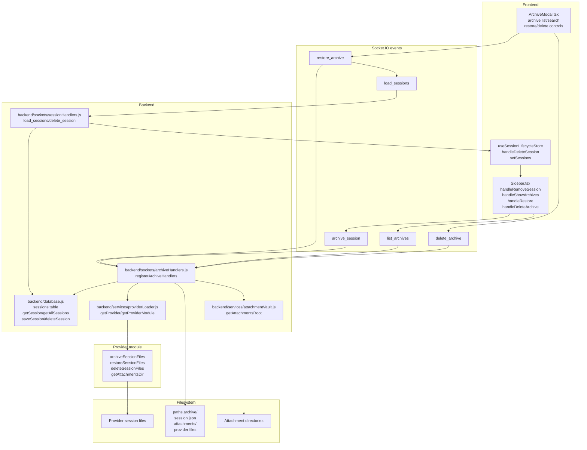

# Session Archiving

Session Archiving is the soft-delete path for chat sessions. It moves the selected session into a provider archive folder, writes generic `session.json` metadata, delegates provider file movement to provider hooks, and removes the active SQLite row.

This area matters because the UI has both soft-delete and permanent-delete entry points, restore creates a new UI id while retaining the archived ACP id, and archive operations combine Socket.IO, SQLite, provider files, attachments, and sidebar state.

---

## Overview

### What It Does

- Archives a selected session through the `archive_session` socket event.
- Writes an archive folder at `provider.config.paths.archive/<safe session name>`.
- Persists restore metadata in `session.json` and stores provider-managed files beside it.
- Removes fork descendants from provider storage, attachment storage, and the `sessions` table before archiving the parent.
- Lists archive folders that contain `session.json` for the Archive Modal.
- Restores an archive by creating a new UI session id, restoring provider files, copying attachments, and saving a fresh SQLite row.
- Permanently removes an archive folder through the `delete_archive` socket event.

### Why This Matters

- The sidebar delete control uses archiving unless permanent deletion is enabled or the session is a sub-agent.
- Archive and restore depend on provider hooks, so provider modules must implement the file contract consistently.
- SQLite has no archive table; the filesystem folder and `session.json` are the archive source of truth.
- Restore is merge-only in the frontend; existing in-memory sessions are preserved.
- Descendant cleanup is explicit application logic, not a database foreign-key cascade.

Architectural role: backend socket orchestration, provider filesystem hooks, SQLite session persistence, frontend sidebar/modal controls.

---

## How It Works - End-to-End Flow

### 1. Sidebar Delete Chooses Archive or Permanent Delete

File: `frontend/src/components/Sidebar.tsx` (Function: `handleRemoveSession`)

`Sidebar` owns the visible session archive action. It reads `deletePermanent` from `useSystemStore`, finds the session in `useSessionLifecycleStore`, and emits either `archive_session` or `delete_session`.

```typescript
// FILE: frontend/src/components/Sidebar.tsx (Function: handleRemoveSession)
const session = useSessionLifecycleStore.getState().sessions.find(s => s.id === sessionId);
if (deletePermanent || session?.isSubAgent) {
  socket.emit('delete_session', { uiId: sessionId });
} else {
  const archiveProviderId = session?.provider || activeProviderId || defaultProviderId;
  socket.emit('archive_session', { ...(archiveProviderId ? { providerId: archiveProviderId } : {}), uiId: sessionId });
}
```

After emitting, `handleRemoveSession` recursively removes the selected session and local descendants whose `forkedFrom` points at a removed id. The active session is cleared when it is part of that removed set.

### 2. Store Delete Action Supports Non-Sidebar Callers

File: `frontend/src/store/useSessionLifecycleStore.ts` (Action: `handleDeleteSession`)

The store-level delete action is used by settings and tests. It emits `delete_session` when `forcePermanent` or `deletePermanent` is true; otherwise it emits `archive_session`. It removes only the selected UI id from local state.

```typescript
// FILE: frontend/src/store/useSessionLifecycleStore.ts (Action: handleDeleteSession)
if (forcePermanent || useSystemStore.getState().deletePermanent) {
  socket.emit('delete_session', { providerId: session.provider, uiId });
} else {
  socket.emit('archive_session', { providerId: session.provider, uiId });
}
```

### 3. Backend Resolves the Stored Session and Provider

File: `backend/sockets/archiveHandlers.js` (Function: `registerArchiveHandlers`, Socket event: `archive_session`)

The backend handler reads the persisted session with `db.getSession(uiId)`. The provider id used for archiving comes from `session.provider` or the default provider resolution path; the handler signature ignores the frontend `providerId` field for this event.

```javascript
// FILE: backend/sockets/archiveHandlers.js (Socket event: archive_session)
socket.on('archive_session', async ({ uiId }) => {
  const session = await db.getSession(uiId);
  const providerId = session?.provider || null;
  const provider = getProvider(providerId);
  const archivePath = provider.config.paths.archive;
  if (!archivePath || !session) return;

  const providerModule = await getProviderModule(providerId);
  // archive work continues here
});
```

### 4. Backend Deletes Descendants Before Archiving Parent

Files:
- `backend/sockets/archiveHandlers.js` (Socket event: `archive_session`, local helper: `collectDescendants`)
- `backend/database.js` (Functions: `getAllSessions`, `deleteSession`, `getActiveSubAgentInvocationForParent`, `deleteSubAgentInvocationsForParent`)
- `backend/mcp/subAgentInvocationManager.js` (Method: `cancelInvocation`)

Before descendant deletion, the archive handler cancels any active sub-agent invocation rooted at the parent UI session and removes its SQL invocation registry rows. It then loads all sessions and recursively collects descendants by matching `forkedFrom` to the parent UI id. Each descendant is permanently removed through the same provider module used for the parent archive, its attachment directory is removed, and its SQLite row is deleted.

```javascript
// FILE: backend/sockets/archiveHandlers.js (Socket event: archive_session)
const activeInvocation = await db.getActiveSubAgentInvocationForParent(provider.id, uiId);
if (activeInvocation) await subAgentInvocationManager.cancelInvocation(provider.id, activeInvocation.invocationId);
await db.deleteSubAgentInvocationsForParent(provider.id, uiId);

const allSessions = await db.getAllSessions();
const descendants = [];
const collectDescendants = (parentId) => {
  for (const s of allSessions) {
    if (s.forkedFrom === parentId) { descendants.push(s); collectDescendants(s.id); }
  }
};
collectDescendants(uiId);

for (const child of descendants) {
  if (child.acpSessionId) providerModule.deleteSessionFiles(child.acpSessionId);
  const childAttach = path.join(getAttachmentsRoot(), child.id);
  if (fs.existsSync(childAttach)) fs.rmSync(childAttach, { recursive: true, force: true });
  await db.deleteSession(child.id);
}
```

`parentAcpSessionId` is stored in the database for sub-agent relationships, but the archive cascade still follows `forkedFrom` for session row descendants.

### 5. Backend Builds the Archive Folder and Delegates Provider Files

Files:
- `backend/sockets/archiveHandlers.js` (Socket event: `archive_session`)
- `providers/<provider>/index.js` (Functions: `archiveSessionFiles`, `deleteSessionFiles`)
- `backend/services/providerLoader.js` (Exports: `DEFAULT_MODULE`, `getProviderModule`)

The parent archive folder name is derived from `session.name || 'Unnamed'`, replaces Windows-invalid path characters with `_`, and truncates to 80 characters. The handler creates the directory, calls `providerModule.archiveSessionFiles(session.acpSessionId, archiveDir)`, then copies and removes attachments.

```javascript
// FILE: backend/sockets/archiveHandlers.js (Socket event: archive_session)
const safeName = (session.name || 'Unnamed').replace(/[<>:"/\\|?*]/g, '_').substring(0, 80);
const archiveDir = path.join(archivePath, safeName);
if (!fs.existsSync(archiveDir)) fs.mkdirSync(archiveDir, { recursive: true });

if (session.acpSessionId) {
  providerModule.archiveSessionFiles(session.acpSessionId, archiveDir);
}

const attachDir = path.join(getAttachmentsRoot(), uiId);
if (fs.existsSync(attachDir)) {
  fs.cpSync(attachDir, path.join(archiveDir, 'attachments'), { recursive: true });
  fs.rmSync(attachDir, { recursive: true, force: true });
}
```

Provider modules are responsible for placing provider-specific session files inside `archiveDir` and removing active provider files. The bound default module supplies no-op versions of the archive hooks so missing provider code does not crash solely due to a missing export.

### 6. Backend Writes `session.json` and Deletes the Parent DB Row

Files:
- `backend/sockets/archiveHandlers.js` (Socket event: `archive_session`)
- `backend/database.js` (Function: `deleteSession`)

The generic metadata file is written after provider files and attachments are handled. Then the active SQLite row is removed.

```javascript
// FILE: backend/sockets/archiveHandlers.js (Socket event: archive_session)
fs.writeFileSync(path.join(archiveDir, 'session.json'), JSON.stringify({
  id: session.id,
  acpSessionId: session.acpSessionId,
  name: session.name,
  model: session.model,
  currentModelId: session.currentModelId,
  modelOptions: session.modelOptions,
  messages: session.messages,
  isPinned: session.isPinned,
  cwd: session.cwd || null,
  configOptions: session.configOptions || []
}, null, 2));

await db.deleteSession(uiId);
```

The archive metadata does not include `provider`, `folderId`, `forkedFrom`, `forkPoint`, `isSubAgent`, `parentAcpSessionId`, `notes`, or `stats`.

### 7. User Opens the Archive Modal

Files:
- `frontend/src/components/Sidebar.tsx` (Function: `handleShowArchives`)
- `frontend/src/components/ArchiveModal.tsx` (Component: `ArchiveModal`)

The sidebar utility button emits `list_archives` for the currently expanded provider. The callback stores folder names, clears archive search, and opens `ArchiveModal`.

```typescript
// FILE: frontend/src/components/Sidebar.tsx (Function: handleShowArchives)
const pid = currentExpandedId;
const payload = pid ? { providerId: pid } : undefined;
const callback = (res: { archives: string[] }) => {
  setArchives(res.archives || []);
  setArchiveSearch('');
  setShowArchives(true);
};
if (payload) socket.emit('list_archives', payload, callback);
else socket.emit('list_archives', callback);
```

`ArchiveModal` filters archive folder names case-insensitively, restores from the row content click, and permanently deletes from the trash button.

### 8. Backend Lists Archive Folders

File: `backend/sockets/archiveHandlers.js` (Socket event: `list_archives`)

The list handler accepts either `(callback)` or `(payload, callback)`. It resolves `payload.providerId` when present, reads the provider archive path, and returns only directories containing `session.json`.

```javascript
// FILE: backend/sockets/archiveHandlers.js (Socket event: list_archives)
const _cb = typeof payload === 'function' ? payload : callback;
const provider = getProvider(payload?.providerId || null);
const archivePath = provider.config.paths.archive;
if (!archivePath || !fs.existsSync(archivePath)) return _cb({ archives: [] });
const dirs = fs.readdirSync(archivePath).filter(d => {
  const full = path.join(archivePath, d);
  return fs.statSync(full).isDirectory() && fs.existsSync(path.join(full, 'session.json'));
});
_cb({ archives: dirs });
```

Read or path errors are logged and return `{ archives: [] }`.

### 9. User Restores an Archive

Files:
- `frontend/src/components/Sidebar.tsx` (Function: `handleRestore`)
- `backend/sockets/archiveHandlers.js` (Socket event: `restore_archive`)

The frontend emits `restore_archive` with the folder name and current provider id. On success, it closes the modal and emits `load_sessions`. The resulting sessions are merged into the current store by UI id; existing sessions are not replaced.

```typescript
// FILE: frontend/src/components/Sidebar.tsx (Function: handleRestore)
socket.emit('restore_archive', { ...(pid ? { providerId: pid } : {}), folderName }, (res) => {
  if (res.success) {
    setShowArchives(false);
    socket.emit('load_sessions', (loadRes: { sessions?: ChatSession[] }) => {
      const current = useSessionLifecycleStore.getState().sessions;
      const existingIds = new Set(current.map(s => s.id));
      const newSessions = (loadRes.sessions || [])
        .filter((s: ChatSession) => !existingIds.has(s.id))
        .map((s: ChatSession) => ({ ...s, isTyping: false, isWarmingUp: false }));
      if (newSessions.length) setSessions([...current, ...newSessions]);
    });
  }
});
```

### 10. Backend Restores Files, Attachments, and DB Record

Files:
- `backend/sockets/archiveHandlers.js` (Socket event: `restore_archive`)
- `backend/database.js` (Function: `saveSession`)
- `providers/<provider>/index.js` (Function: `restoreSessionFiles`)

The backend reads `session.json`, creates `newUiId` from `Date.now().toString()`, calls the provider restore hook, copies attachments to the new UI id, writes a new SQLite session row, removes the archive folder, and returns the new UI id.

```javascript
// FILE: backend/sockets/archiveHandlers.js (Socket event: restore_archive)
const saved = JSON.parse(fs.readFileSync(sessionFile, 'utf8'));
const newUiId = Date.now().toString();
const providerModule = await getProviderModule(providerId);

if (saved.acpSessionId) {
  providerModule.restoreSessionFiles(saved.acpSessionId, archiveDir);
}

const attachSrc = path.join(archiveDir, 'attachments');
if (fs.existsSync(attachSrc)) {
  const attachDest = path.join(getAttachmentsRoot(), newUiId);
  fs.cpSync(attachSrc, attachDest, { recursive: true });
}

await db.saveSession({
  id: newUiId,
  acpSessionId: saved.acpSessionId,
  name: saved.name || folderName,
  model: saved.model || 'flagship',
  currentModelId: saved.currentModelId,
  modelOptions: saved.modelOptions,
  messages: saved.messages || [],
  isPinned: false,
  cwd: saved.cwd || null,
  configOptions: saved.configOptions || []
});

fs.rmSync(archiveDir, { recursive: true, force: true });
callback({ success: true, uiId: newUiId, acpSessionId: saved.acpSessionId });
```

The restore handler ignores the return value from `restoreSessionFiles`. The database row receives a new UI id and the archived ACP session id. The save payload does not include a `provider` field, so the stored provider is `NULL` for restored sessions.

### 11. User Permanently Deletes an Archive

Files:
- `frontend/src/components/Sidebar.tsx` (Function: `handleDeleteArchive`)
- `backend/sockets/archiveHandlers.js` (Socket event: `delete_archive`)

The frontend emits `delete_archive` and removes the folder name from local modal state after the callback runs. The backend resolves the provider archive path and removes the folder recursively when it exists.

```javascript
// FILE: backend/sockets/archiveHandlers.js (Socket event: delete_archive)
const folderName = payload.folderName;
const provider = getProvider(payload?.providerId || null);
const archivePath = provider.config.paths.archive;
if (!archivePath) return callback?.({ error: 'No archive path' });
const archiveDir = path.join(archivePath, folderName);
if (fs.existsSync(archiveDir)) {
  fs.rmSync(archiveDir, { recursive: true, force: true });
}
callback?.({ success: true });
```

---

## Architecture Diagram



---

## Critical Contract

### Archive Folder Contract

An archive folder is valid when it is a directory under `provider.config.paths.archive` and contains `session.json`.

```text
<provider archive path>/
  <safe session name>/
    session.json
    attachments/             optional, copied from the UI attachment directory
    restore_meta.json         optional, written by provider hook implementations
    *.jsonl, *.json, tasks/   optional, provider-managed session files
```

Folder names are display-name based. They are sanitized on archive but are not guaranteed to be globally unique.

### `session.json` Contract

File: `backend/sockets/archiveHandlers.js` (Socket events: `archive_session`, `restore_archive`)

```json
{
  "id": "original-ui-id",
  "acpSessionId": "provider-session-id",
  "name": "Display Name",
  "model": "model-selection",
  "currentModelId": "model-id-or-null",
  "modelOptions": [],
  "messages": [],
  "isPinned": false,
  "cwd": "workspace-path-or-null",
  "configOptions": []
}
```

Restore consumes these fields directly. Fields outside this shape are ignored unless code is added to `restore_archive` and `db.saveSession` receives them.

### Restore Identity Contract

- Restore always creates a new UI id with `Date.now().toString()`.
- Restore stores `saved.acpSessionId` as the session `acpSessionId`.
- Restore calls `providerModule.restoreSessionFiles(saved.acpSessionId, archiveDir)` and ignores the return value.
- Restore saves the session unpinned with `isPinned: false`.
- Frontend restore merges sessions by UI id and does not replace existing in-memory sessions.
- The archive folder is removed after `db.saveSession` succeeds.

### Provider Hook Contract

Files:
- `backend/services/providerLoader.js` (Exports: `DEFAULT_MODULE`, `getProviderModule`, `runWithProvider`)
- `providers/<provider>/index.js` (Functions: `archiveSessionFiles`, `restoreSessionFiles`, `deleteSessionFiles`, `getAttachmentsDir`)

Provider modules must expose these hooks:

```javascript
// FILE: providers/<provider>/index.js (Provider archive hook contract)
export function archiveSessionFiles(acpId, archiveDir) {
  // Copy provider session files into archiveDir and remove active provider files.
}

export function restoreSessionFiles(savedAcpId, archiveDir) {
  // Copy provider files from archiveDir back to provider storage for savedAcpId.
}

export function deleteSessionFiles(acpId) {
  // Remove active provider files for acpId.
}
```

`archiveHandlers.js` invokes these hooks without awaiting them. Hook implementations should complete synchronously or throw synchronously for the current handler to observe failures.

---

## Configuration / Data Flow

### Provider Archive Path

File: `providers/<provider>/user.json` (Config key: `paths.archive`)

Each provider config supplies an archive path through its merged provider configuration. `getProvider(providerId).config.paths.archive` is read by all archive socket events.

```json
{
  "paths": {
    "archive": "absolute-or-expanded-provider-archive-path"
  }
}
```

### Provider Resolution by Event

| Socket event | Provider source | Notes |
|---|---|---|
| `archive_session` | `db.getSession(uiId).provider` through `getProvider(providerId)` | Frontend sends `providerId`, but the handler destructures only `uiId`. |
| `list_archives` | `payload.providerId` or default provider | Supports callback-only form. |
| `restore_archive` | `payload.providerId` or default provider | Uses provider path for archive lookup and `getProviderModule(providerId)` for file restore. |
| `delete_archive` | `payload.providerId` or default provider | Requires payload with `folderName`. |
| `delete_session` | `db.getSession(uiId).provider` or default provider | Permanent delete path lives in `backend/sockets/sessionHandlers.js`. |

### Database Flow

File: `backend/database.js` (Table: `sessions`)

The archive system uses these helpers:

- `getSession(uiId)` returns full messages and metadata for `session.json`.
- `getAllSessions(provider, options)` returns lightweight metadata for descendant scans and frontend lists.
- `saveSession(session)` creates the restored row.
- `deleteSession(uiId)` deletes one row by `ui_id`.
- `getActiveSubAgentInvocationForParent(providerId, parentUiId)` finds an active invocation rooted at the parent.
- `deleteSubAgentInvocationsForParent(providerId, parentUiId)` removes invocation and agent registry rows for the parent.

The `sessions` table stores relationship fields used by archive and sidebar state: `forked_from`, `fork_point`, `is_sub_agent`, `parent_acp_session_id`, plus provider and model/config fields. Archive cascade uses `forkedFrom`, which is the normalized frontend/db object field for `forked_from`. Sub-agent invocation registry rows are cleaned before the session-row cascade.

### Attachment Flow

File: `backend/services/attachmentVault.js` (Function: `getAttachmentsRoot`)

Archive copies `getAttachmentsRoot()/uiId` to `archiveDir/attachments` and removes the active attachment folder. Restore copies `archiveDir/attachments` to `getAttachmentsRoot()/newUiId`. `getAttachmentsRoot(providerId = null)` resolves through the provider module `getAttachmentsDir`, but `archiveHandlers.js` calls it without a provider argument.

---

## Component Reference

### Backend

| Area | File | Anchors | Purpose |
|---|---|---|---|
| Socket handlers | `backend/sockets/archiveHandlers.js` | `registerArchiveHandlers`, socket events `archive_session`, `list_archives`, `restore_archive`, `delete_archive` | Main archive, list, restore, invocation cleanup, and permanent archive deletion orchestration. |
| Permanent session delete | `backend/sockets/sessionHandlers.js` | Socket events `delete_session`, `load_sessions`; local helper `collectDescendants` | Removes active sessions permanently and reloads sessions after restore. |
| Sub-agent manager | `backend/mcp/subAgentInvocationManager.js` | `cancelInvocation` | Cancels active sub-agent invocation work before archive cleanup. |
| Database | `backend/database.js` | `sessions` table, `subagent_invocations` table, `subagent_invocation_agents` table, `saveSession`, `getSession`, `getAllSessions`, `deleteSession`, `getActiveSubAgentInvocationForParent`, `deleteSubAgentInvocationsForParent` | Persists active sessions, relationship fields, and sub-agent invocation registry rows. |
| Provider loader | `backend/services/providerLoader.js` | `DEFAULT_MODULE`, `getProvider`, `getProviderModule`, `runWithProvider` | Resolves provider config and binds provider hooks to provider context. |
| Attachments | `backend/services/attachmentVault.js` | `getAttachmentsRoot`, `getAttachmentsDir` provider hook | Resolves attachment storage roots and ensures roots exist. |
| Cleanup helper | `backend/mcp/acpCleanup.js` | `cleanupAcpSession` | Permanent delete path delegates provider file deletion through `deleteSessionFiles`. |

### Frontend

| Area | File | Anchors | Purpose |
|---|---|---|---|
| Sidebar UI | `frontend/src/components/Sidebar.tsx` | `Sidebar`, `handleRemoveSession`, `handleShowArchives`, `handleRestore`, `handleDeleteArchive`, `renderChildren` | Emits archive socket events, updates local session state, owns Archive Modal state. |
| Archive Modal | `frontend/src/components/ArchiveModal.tsx` | `ArchiveModal`, `ArchiveModalProps`, `filtered` | Displays archive names, search input, restore action, and permanent archive delete action. |
| Session store | `frontend/src/store/useSessionLifecycleStore.ts` | `handleDeleteSession`, `setSessions`, `activeSessionId` | Store-level archive/delete action and restore merge target. |
| System store | `frontend/src/store/useSystemStore.ts` | `deletePermanent`, `activeProviderId`, `defaultProviderId`, `socket` | Supplies delete mode, provider selection, and socket instance. |

### Provider Hooks

| Area | File | Anchors | Purpose |
|---|---|---|---|
| Provider modules | `providers/<provider>/index.js` | `archiveSessionFiles`, `restoreSessionFiles`, `deleteSessionFiles`, `getAttachmentsDir`, `getSessionPaths` | Provider-owned file lifecycle for archive, restore, cleanup, and attachment roots. |
| Provider tests | `providers/<provider>/test/index.test.js` | Tests for `archiveSessionFiles`, `restoreSessionFiles`, `deleteSessionFiles` where present | Verifies provider file copies/removals for provider-specific session layouts. |

### Tests

| Area | File | Anchors | Purpose |
|---|---|---|---|
| Backend archive handlers | `backend/test/archiveHandlers.test.js` | `archiveHandlers` suite | Covers list, restore, delete, archive metadata, error handling, and recursive descendant cleanup. |
| Provider contract | `backend/test/providerContract.test.js` | `provider contract exports` suite | Requires every provider to explicitly export archive hooks. |
| Provider loader | `backend/test/providerLoader.test.js` | Default module expectations for `archiveSessionFiles`, `restoreSessionFiles`, `deleteSessionFiles` | Verifies no-op defaults exist. |
| Provider cleanup hook | `backend/test/providerHooks.test.js` | `acpCleanup.cleanupAcpSession() Discovery Hook` | Verifies cleanup uses `provider.deleteSessionFiles`. |
| Frontend modal | `frontend/src/test/ArchiveModal.test.tsx` | `ArchiveModal` suite | Covers render, search, restore click, delete click, and empty state. |
| Frontend sidebar | `frontend/src/test/Sidebar.test.tsx` | Archive Modal and archive/delete session tests | Covers list, restore merge, archive emit, deletePermanent behavior, and archive deletion UI. |
| Frontend store | `frontend/src/test/useSessionLifecycleStore.test.ts`, `frontend/src/test/useSessionLifecycleStoreDeep.test.ts` | `handleDeleteSession` tests | Covers store-level archive and permanent delete emission. |

---

## Gotchas

### 1. Restore Creates a New UI Id but Reuses the Archived ACP Id

The restore handler creates `newUiId` with `Date.now().toString()` and stores `saved.acpSessionId` in the restored row. `restoreSessionFiles` return values are ignored. Provider hooks should restore files for the saved ACP id unless the backend restore contract is changed together with tests.

### 2. Restored Rows Do Not Persist Provider Id

`restore_archive` calls `db.saveSession` without `provider`. The restored row has `provider` set to `NULL` in SQLite. Sidebar grouping treats missing provider as the active/default provider path in `Sidebar`, but backend provider-specific session loading should be checked when changing restore behavior.

### 3. Descendant Cascade Follows `forkedFrom` Only

Archive cascade recursively matches `s.forkedFrom === parentId`. It does not traverse `parentAcpSessionId`. Sub-agent or fork records that need cascade cleanup must have the UI relationship represented through `forkedFrom`.

### 4. Descendants Are Permanently Deleted During Parent Archive

Descendant sessions are removed through `deleteSessionFiles`, attachment removal, and `db.deleteSession`. They are not written as separate archive folders. Restoring the parent restores only the parent session metadata and provider files found in that archive folder.

### 5. Archive Folder Names Are Display Names

The archive directory is based on sanitized session name, truncated to 80 characters. Two sessions with the same sanitized name target the same directory. Detect collisions in `backend/sockets/archiveHandlers.js` before adding batch archive or retention features.

### 6. Restore and Delete Use Unsanitized Folder Names

Archive creation sanitizes `safeName`, but `restore_archive` and `delete_archive` join `payload.folderName` directly under the archive path. Archive names come from `list_archives` in the normal UI flow. Any new external restore/delete entry point should validate folder names.

### 7. Archive Handler Calls Attachment Root Without Provider Id

`archiveHandlers.js` calls `getAttachmentsRoot()` with no provider argument for archive and restore attachment copies. `getAttachmentsRoot` can resolve provider-specific roots, but the archive handler relies on the ambient/default provider path for these calls.

### 8. Provider Hooks Are Invoked Synchronously

`archiveSessionFiles`, `restoreSessionFiles`, and `deleteSessionFiles` are called without `await` in the archive handler. Current hook implementations are synchronous filesystem operations. Async hooks can finish outside the handler error path.

### 9. Missing Archive Paths Return Empty or Error Depending on Event

`list_archives` returns `{ archives: [] }` when the archive path is missing or unreadable. `restore_archive` returns `{ error: 'No ARCHIVE_PATH configured' }`. `delete_archive` returns `{ error: 'No archive path' }` when no path is configured.

### 10. Sidebar and Store Delete Paths Have Different Local Cascade Behavior

`Sidebar.handleRemoveSession` recursively removes descendants from local state. `useSessionLifecycleStore.handleDeleteSession` removes only the selected session locally. Use the sidebar path as the reference for visible tree deletion behavior.

---

## Unit Tests

### Backend Tests

Run from `backend`:

```bash
npx vitest run test/archiveHandlers.test.js test/providerContract.test.js test/providerLoader.test.js test/providerHooks.test.js
```

Key tests:

| File | Test name | Contract |
|---|---|---|
| `backend/test/archiveHandlers.test.js` | `returns folder names that contain session.json` | `list_archives` filters valid archive folders. |
| `backend/test/archiveHandlers.test.js` | `returns empty archives when archive path does not exist` | Missing archive path lists as empty. |
| `backend/test/archiveHandlers.test.js` | `returns empty archives on error` | Listing errors do not throw through callback. |
| `backend/test/archiveHandlers.test.js` | `copies files via provider and creates DB record` | Restore calls `restoreSessionFiles`, saves DB row, and returns success. |
| `backend/test/archiveHandlers.test.js` | `returns error when session.json not found in archive` | Restore requires `session.json`. |
| `backend/test/archiveHandlers.test.js` | `returns error when restore throws` | Restore read/provider failures return callback errors. |
| `backend/test/archiveHandlers.test.js` | `removes folder` | `delete_archive` removes archive folders recursively. |
| `backend/test/archiveHandlers.test.js` | `returns error when rmSync throws` | Permanent archive deletion surfaces filesystem errors. |
| `backend/test/archiveHandlers.test.js` | `archives via provider and saves session.json` | Archive creates folder, calls provider hook, writes metadata, deletes DB row. |
| `backend/test/archiveHandlers.test.js` | `recursively deletes descendant sessions before archiving parent` | Descendant provider files and DB rows are removed. |
| `backend/test/archiveHandlers.test.js` | `logs error when getSession throws` | Archive handler logs DB read errors. |
| `backend/test/archiveHandlers.test.js` | `does not call deleteSession for descendants when there are none` | Parent archive does not delete unrelated sessions. |
| `backend/test/providerContract.test.js` | `every provider explicitly exports every contract function` | Provider modules expose archive hooks. |
| `backend/test/providerLoader.test.js` | default module expectations for archive hooks | Missing hooks fall back to no-op functions. |
| `backend/test/providerHooks.test.js` | `should use provider.deleteSessionFiles` | Permanent cleanup delegates to provider hook. |

### Frontend Tests

Run from `frontend`:

```bash
npx vitest run src/test/ArchiveModal.test.tsx src/test/Sidebar.test.tsx src/test/useSessionLifecycleStore.test.ts src/test/useSessionLifecycleStoreDeep.test.ts
```

Key tests:

| File | Test name | Contract |
|---|---|---|
| `frontend/src/test/ArchiveModal.test.tsx` | `renders list of archive names` | Modal renders archive folder names. |
| `frontend/src/test/ArchiveModal.test.tsx` | `filters archives by search` | Search filters archive names. |
| `frontend/src/test/ArchiveModal.test.tsx` | `calls onRestore when clicking an archive` | Row click restores the archive. |
| `frontend/src/test/ArchiveModal.test.tsx` | `calls onDelete when clicking delete button` | Trash button calls delete without restore. |
| `frontend/src/test/ArchiveModal.test.tsx` | `shows empty message when no archives match` | Empty state renders. |
| `frontend/src/test/Sidebar.test.tsx` | `archive button opens archive modal` | Sidebar emits `list_archives` and opens modal. |
| `frontend/src/test/Sidebar.test.tsx` | `restoring archive preserves existing sessions and only adds new ones` | Restore merge keeps existing sessions intact. |
| `frontend/src/test/Sidebar.test.tsx` | `clicking archive item calls restore_archive socket emit` | Restore emits folder and provider payload. |
| `frontend/src/test/Sidebar.test.tsx` | `archive session removes it from the list` | Sidebar archive emits `archive_session` and updates local state. |
| `frontend/src/test/Sidebar.test.tsx` | `emits archive_session when deletePermanent is false` | Delete mode selects soft-delete. |
| `frontend/src/test/Sidebar.test.tsx` | `emits delete_session when deletePermanent is true` | Delete mode selects permanent delete. |
| `frontend/src/test/useSessionLifecycleStore.test.ts` | `handleDeleteSession removes session and emits archive_session by default` | Store delete action archives by default. |
| `frontend/src/test/useSessionLifecycleStoreDeep.test.ts` | `handleDeleteSession emits archive_session when permanent is false` | Store action archive branch. |
| `frontend/src/test/useSessionLifecycleStoreDeep.test.ts` | `handleDeleteSession emits delete_session when permanent is true` | Store action permanent branch. |

---

## How to Use This Guide

### For implementing or extending this feature

1. Start at `backend/sockets/archiveHandlers.js` and identify which socket event changes.
2. Check the `session.json` contract before adding restore fields; update both archive write and restore save code together.
3. Confirm whether the change affects provider files; if yes, update `archiveSessionFiles`, `restoreSessionFiles`, or `deleteSessionFiles` in provider modules.
4. If descendants are involved, verify the `forkedFrom` tree in `db.getAllSessions` output and the local `Sidebar.handleRemoveSession` removal loop.
5. If attachments are involved, inspect `getAttachmentsRoot` and provider `getAttachmentsDir` behavior.
6. Update or add backend tests in `backend/test/archiveHandlers.test.js` for socket behavior.
7. Update frontend tests in `ArchiveModal.test.tsx`, `Sidebar.test.tsx`, or store tests for UI/store behavior.

### For debugging archive issues

1. Verify the socket event and payload: `archive_session`, `list_archives`, `restore_archive`, or `delete_archive`.
2. For archive failures, inspect `db.getSession(uiId)`, `session.provider`, `provider.config.paths.archive`, and `providerModule.archiveSessionFiles`.
3. For missing archive rows, inspect the archive folder and confirm `session.json` exists directly under the folder.
4. For restore failures, inspect `session.json`, `providerModule.restoreSessionFiles(saved.acpSessionId, archiveDir)`, attachment copy paths, and `db.saveSession` input.
5. For missing descendants, inspect `forkedFrom` values from `db.getAllSessions()` and the sidebar `renderChildren` relationship.
6. For provider file mismatches, inspect `getSessionPaths`, `archiveSessionFiles`, `restoreSessionFiles`, and provider-specific `restore_meta.json` handling.
7. For restored sessions appearing under the wrong provider, inspect the restored DB row provider value and `Sidebar` provider grouping fallback.

---

## Summary

- Session Archiving is a filesystem-backed soft-delete path coordinated by `backend/sockets/archiveHandlers.js`.
- `session.json` is the generic archive metadata contract; provider hooks own provider-specific session files.
- Archive removes descendants by `forkedFrom` before archiving the selected parent.
- Restore creates a new UI id, keeps the archived ACP session id, saves an unpinned DB row, and removes the archive folder.
- Frontend restore is merge-only and preserves existing in-memory session objects.
- Archive folder listing depends on directories that contain `session.json`.
- Permanent archive deletion removes the archive folder from disk and does not touch active DB rows.
- The critical contract is `session.json` plus synchronous provider archive hooks and correct UI-id/ACP-id handling.
