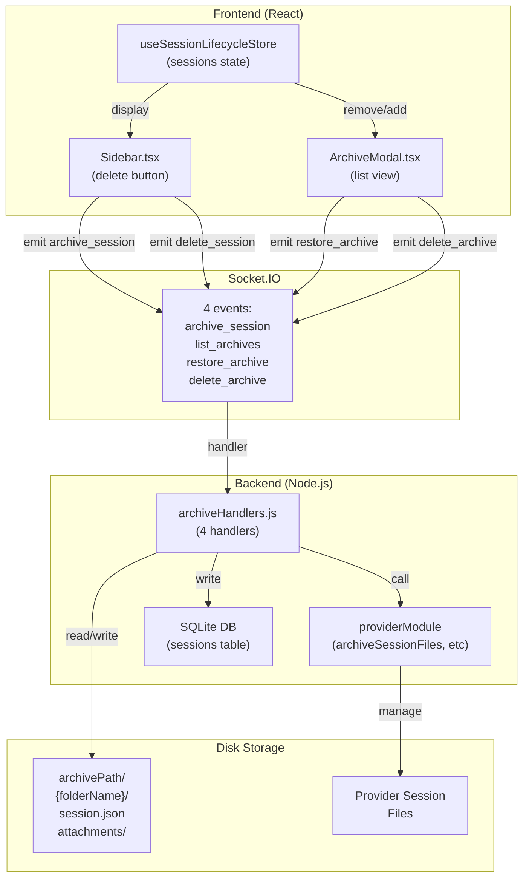

# Session Archiving

A soft-delete system that moves inactive sessions into an archive while preserving complete session state and attachments. Sessions can be restored (with new UI IDs) or permanently deleted from archives. Archiving respects provider-scoped storage and cascades through forked/sub-agent session hierarchies.

**Why this matters:** Archiving is the primary deletion path for users (soft-delete by default). Understanding its architecture is critical for implementing retention policies, debugging restore issues, handling file system errors during archiving, or extending provider-specific archiving behavior.

---

## Overview

### What It Does

- **Soft-delete sessions** — Move session to archive folder instead of immediate permanent deletion; preserves complete session state, messages, and attachments
- **Archive directory management** — Maintain provider-scoped archive directory with one folder per archived session containing session.json metadata and attachments
- **List archived sessions** — Enumerate archived session folders; display in Archive Modal for user selection
- **Restore archived sessions** — Recreate archived sessions with new UI IDs; re-instantiate provider session via `restoreSessionFiles()`; merge with existing sessions (never replace)
- **Permanent deletion** — Completely remove archived session folder and all contents from disk
- **Cascade archiving** — When archiving a parent session, recursively archive all forked/sub-agent descendants

### Why This Matters

- **Data safety:** Archiving prevents accidental data loss; users can recover deleted sessions from Archive Modal
- **Disk management:** Archive directories grow large over time; permanent deletion is required for cleanup
- **Provider integration:** Each provider implements custom `archiveSessionFiles()` and `restoreSessionFiles()` to handle provider-specific session persistence
- **Session hierarchy:** Forked sessions must be archived together with parent; orphaned forks are problematic
- **Performance:** Archive operations are fire-and-forget on socket layer; async file I/O doesn't block socket handler

### Architectural Role

- **Frontend:** Archive Modal component, archive buttons in Sidebar, archive state in `useSessionLifecycleStore`
- **Backend:** 4 socket handlers in `archiveHandlers.js` coordinating file I/O, database updates, and provider module calls
- **Provider layer:** `archiveSessionFiles()`, `restoreSessionFiles()`, `deleteSessionFiles()` methods for provider-specific session persistence
- **Database:** SQLite tracks session relationships (forked_from, is_sub_agent) to identify descendants during archive cascade

---

## How It Works — End-to-End Flow

### Step 1: User Right-Clicks Session → Removes with Archive (Default)
**File:** `frontend/src/components/Sidebar.tsx` (Lines 184–210)

User right-clicks a session and selects "Delete" (or via keyboard shortcut). The Sidebar invokes:

```typescript
// FILE: frontend/src/components/Sidebar.tsx (Lines 184-210)
const handleRemoveSession = (sessionId: string) => {
  const deletePermanent = useSystemStore.getState().deletePermanent;
  const isSubAgent = sessions.find(s => s.id === sessionId)?.isSubAgent;
  
  if (deletePermanent || isSubAgent) {
    // Permanent delete
    socket.emit('delete_session', { providerId, uiId: sessionId });  // LINE 188
  } else {
    // Archive (default)
    socket.emit('archive_session', { providerId, uiId: sessionId });  // LINE 191
  }
  
  // Recursively remove descendants from local state
  const descendants = findDescendants(sessionId);  // LINE 193-209
  descendants.forEach(d => {
    socket.emit('archive_session', { providerId, uiId: d.id });
  });
  
  // Remove all from Zustand store
  setSessions(sessions.filter(s => ![sessionId, ...descendants.map(d => d.id)].includes(s.id)));
};
```

**Key decision:** If `deletePermanent` setting is true OR session is a sub-agent, delete permanently; otherwise archive (soft-delete).

---

### Step 2: Frontend Emits `archive_session` with Session UI ID
**File:** `frontend/src/store/useSessionLifecycleStore.ts` (Lines 277–293)

After user interaction, the socket emits:

```typescript
// FILE: frontend/src/store/useSessionLifecycleStore.ts (Lines 283)
socket.emit('archive_session', { providerId: session.provider, uiId });
```

**Payload shape:**
```typescript
{
  providerId: string;  // Required - provider scope
  uiId: string;        // Required - frontend session ID
}
```

---

### Step 3: Backend `archive_session` Handler Begins Archiving
**File:** `backend/sockets/archiveHandlers.js` (Lines 9–65)

The handler receives the request and begins cascading deletion:

```javascript
// FILE: backend/sockets/archiveHandlers.js (Lines 9-65)
socket.on('archive_session', async ({ uiId }) => {
  try {
    const session = db.getSession(uiId);  // LINE 11 - Fetch from DB
    
    // Find all descendants (forked sessions, sub-agents)
    const allSessions = db.getAllSessions(providerId);  // LINE 20
    const descendants = allSessions.filter(s => s.forked_from === uiId || s.parent_acp_session_id === session.acpSessionId);  // LINE 21
    
    // Archive each descendant first (depth-first)
    for (const desc of descendants) {
      providerModule.deleteSessionFiles(desc.acpSessionId);  // LINE 31 - Provider cleanup
      db.deleteSession(desc.uiId);  // LINE 35
    }
    
    // Archive the parent session
    providerModule.archiveSessionFiles(session.acpSessionId, archivePath);  // LINE 44 - Provider-specific archiving
    
    // Copy attachments to archive
    const attachRoot = getAttachmentsRoot(providerId);  // LINE 47
    const archiveAttachPath = path.join(archivePath, safeName, 'attachments');  // LINE 48
    if (fs.existsSync(path.join(attachRoot, uiId))) {
      fs.cpSync(path.join(attachRoot, uiId), archiveAttachPath, { recursive: true });  // LINE 51
    }
    
    // Write session.json metadata to archive
    const sessionJson = {  // LINE 53-57
      id: session.ui_id,
      acpSessionId: session.acp_id,
      name: session.name,
      model: session.model,
      messages: JSON.parse(session.messages_json || '[]'),
      // ... other fields
    };
    fs.writeFileSync(path.join(archivePath, safeName, 'session.json'), JSON.stringify(sessionJson, null, 2));
    
    // Delete from database
    db.deleteSession(uiId);  // LINE 60
    
    writeLog(`[ARCHIVE] Archived session ${uiId}`);
  } catch (err) {
    writeLog(`[ARCHIVE ERR] ${err.message}`);
  }
});
```

**Critical steps:**
1. Line 20–35: **Cascade delete descendants** (forked/sub-agent sessions)
2. Line 44: **Provider-specific archiving** (moves session files to archive)
3. Line 47–51: **Copy attachments** to archive folder
4. Line 53–58: **Write session.json** metadata
5. Line 60: **Delete from database**

---

### Step 4: Provider Module Implements `archiveSessionFiles()`
**File:** `providers/{provider}/index.js` (Provider-specific)

Each provider implements how its session data is archived. Example (Claude):

```javascript
// Pseudo-code; actual implementation varies by provider
async archiveSessionFiles(acpSessionId, archivePath) {
  const sessionDir = path.join(this.config.paths.sessions, acpSessionId);
  const archiveSessionDir = path.join(archivePath, safeName);
  
  // Move provider session files to archive
  fs.cpSync(sessionDir, archiveSessionDir, { recursive: true });  // Copy session data
  fs.rmSync(sessionDir, { recursive: true });  // Delete original
}
```

This is provider-specific; some providers store session files, others store in cloud.

---

### Step 5: User Clicks "Archives" Button in Sidebar
**File:** `frontend/src/components/Sidebar.tsx` (Lines 140–151)

User clicks the "Archives" button in the sidebar utility row:

```typescript
// FILE: frontend/src/components/Sidebar.tsx (Lines 140-151)
const handleShowArchives = () => {
  if (!socket) return;
  const pid = currentExpandedId;  // Current provider
  const payload = pid ? { providerId: pid } : undefined;
  
  const callback = (res: { archives: string[] }) => {
    setArchives(res.archives || []);  // List of archive folder names
    setArchiveSearch('');
    setShowArchives(true);  // Open modal
  };
  
  socket.emit('list_archives', payload, callback);  // LINE 149
};
```

Emits `list_archives` to fetch available archives.

---

### Step 6: Backend `list_archives` Handler Returns Archive Folders
**File:** `backend/sockets/archiveHandlers.js` (Lines 86–101)

```javascript
// FILE: backend/sockets/archiveHandlers.js (Lines 86-101)
socket.on('list_archives', (payload, callback) => {
  try {
    const providerId = payload?.providerId || null;  // LINE 87 - Optional provider scope
    const archivePath = getProvider(providerId).config.paths.archive;  // LINE 88
    
    // List all folders containing a session.json file
    const archives = fs.readdirSync(archivePath)  // LINE 91
      .filter(name => {
        const sessionJsonPath = path.join(archivePath, name, 'session.json');
        return fs.existsSync(sessionJsonPath);  // Only list if session.json exists
      });
    
    callback({ archives });  // LINE 101 - Return array of folder names
  } catch (err) {
    callback({ archives: [] });  // LINE 100 - Return empty on error
  }
});
```

Returns a list of archive folder names. Only folders containing `session.json` are considered valid archives.

---

### Step 7: Frontend Opens Archive Modal with Restore Options
**File:** `frontend/src/components/ArchiveModal.tsx` (Lines 1–57)

The modal renders with:
- Search box to filter archives
- List of archive folders
- Restore button (folder name link) for each
- Delete (trash) button for permanent removal

```typescript
// FILE: frontend/src/components/ArchiveModal.tsx (Lines 19-53)
{filteredArchives.map(archiveName => (
  <div key={archiveName} className="archive-item">
    <button className="archive-name-btn" onClick={() => onRestore(archiveName)}>
      <Archive size={14} /> {archiveName}
    </button>
    {restoring === archiveName && <span className="restoring-indicator">Restoring...</span>}
    <button className="delete-btn" onClick={() => onDelete(archiveName)}>
      <Trash size={14} />
    </button>
  </div>
))}
```

---

### Step 8: User Clicks Archive to Restore → Emits `restore_archive`
**File:** `frontend/src/components/Sidebar.tsx` (Lines 153–174)

```typescript
// FILE: frontend/src/components/Sidebar.tsx (Lines 153-174)
const handleRestore = (folderName: string) => {
  if (!socket) return;
  setRestoring(folderName);  // Show "Restoring..." indicator
  
  const pid = currentExpandedId;
  socket.emit('restore_archive',  // LINE 157
    { 
      folderName, 
      providerId: pid 
    },
    (res: { success?: boolean; uiId?: string; acpSessionId?: string; error?: string }) => {
      setRestoring(null);
      
      if (res.success) {
        setShowArchives(false);  // Close modal
        
        // Reload all sessions to merge restored session
        socket.emit('load_sessions', (loadRes: { sessions?: ChatSession[] }) => {
          if (loadRes.sessions) {
            const current = useSessionLifecycleStore.getState().sessions;
            const existingIds = new Set(current.map(s => s.id));
            
            // Add new sessions (never replace existing)
            const newSessions = loadRes.sessions.filter(s => !existingIds.has(s.id));
            if (newSessions.length) {
              setSessions([...current, ...newSessions]);
            }
          }
        });
      } else {
        logger.error('Restore failed:', res.error);
      }
    }
  );
};
```

**Key behavior:** On success, calls `load_sessions` to **merge** new sessions, never replacing existing ones.

---

### Step 9: Backend `restore_archive` Handler Restores Session
**File:** `backend/sockets/archiveHandlers.js` (Lines 103–149)

```javascript
// FILE: backend/sockets/archiveHandlers.js (Lines 103-149)
socket.on('restore_archive', async (payload, callback) => {
  try {
    const { folderName, providerId } = payload;  // LINE 104
    const archivePath = getProvider(providerId).config.paths.archive;  // LINE 105
    const archiveFolder = path.join(archivePath, folderName);  // LINE 106
    
    // Read session.json metadata
    const sessionJsonPath = path.join(archiveFolder, 'session.json');  // LINE 108
    if (!fs.existsSync(sessionJsonPath)) {
      return callback({ error: 'session.json not found in archive' });  // LINE 110
    }
    
    const archivedSession = JSON.parse(fs.readFileSync(sessionJsonPath, 'utf-8'));  // LINE 112
    
    // Provider-specific restore (recreate provider session files)
    const providerModule = await getProviderModule(providerId);  // LINE 116
    const newAcpSessionId = await providerModule.restoreSessionFiles(  // LINE 118
      archivedSession.acpSessionId, 
      archiveFolder
    );
    
    // Restore attachments
    const attachmentSrcPath = path.join(archiveFolder, 'attachments');  // LINE 122
    if (fs.existsSync(attachmentSrcPath)) {
      const attachmentDestPath = path.join(getAttachmentsRoot(providerId), newUiId);  // LINE 125
      fs.mkdirSync(attachmentDestPath, { recursive: true });
      fs.cpSync(attachmentSrcPath, attachmentDestPath, { recursive: true });  // LINE 127
    }
    
    // Create new database record with restored data
    const newUiId = generateId();  // LINE 129 - New UI ID for restored session
    const newSession = {  // LINE 130-140
      ui_id: newUiId,
      acp_id: newAcpSessionId,
      name: archivedSession.name,
      messages_json: JSON.stringify(archivedSession.messages),
      model: archivedSession.model,
      is_pinned: false,  // Restore always unpins
      provider: providerId,
      // ... other fields
    };
    db.saveSession(newSession);  // LINE 129 - Save to database
    
    // Delete archive folder
    fs.rmSync(archiveFolder, { recursive: true });  // LINE 142
    
    callback({  // LINE 144 - Return new IDs to frontend
      success: true,
      uiId: newUiId,
      acpSessionId: newAcpSessionId
    });
  } catch (err) {
    callback({ error: err.message });  // LINE 147
  }
});
```

**Critical steps:**
1. Line 108–112: **Read session.json** metadata
2. Line 118: **Provider-specific restore** (recreates provider session)
3. Line 122–127: **Restore attachments** from archive
4. Line 129–140: **Create new DB record** with new UI ID and ACP ID
5. Line 142: **Delete archive folder** after successful restore

---

### Step 10: Backend `delete_archive` Handler Permanently Deletes Archive
**File:** `backend/sockets/archiveHandlers.js` (Lines 67–84)

```javascript
// FILE: backend/sockets/archiveHandlers.js (Lines 67-84)
socket.on('delete_archive', (payload, callback) => {
  try {
    const { folderName, providerId = null } = payload;  // LINE 68
    const archivePath = getProvider(providerId).config.paths.archive;  // LINE 69
    const archiveFolder = path.join(archivePath, folderName);  // LINE 70
    
    // Permanently delete entire archive folder
    fs.rmSync(archiveFolder, { recursive: true });  // LINE 72 - Irrevocable
    
    callback({ success: true });  // LINE 74
  } catch (err) {
    callback({ error: err.message });  // LINE 80
  }
});
```

Completely removes the archive folder and all contents (session.json, provider files, attachments).

---

## Architecture Diagram



---

## The Critical Contract: Archive Metadata & Restore Guarantee

### Archive Folder Structure

Each archived session creates a folder in `archivePath`:

```
archivePath/
├── Session-1-Name/
│   ├── session.json           (metadata + messages)
│   ├── attachments/           (optional; user files)
│   └── [provider-files]       (provider-specific; e.g., .claude folder)
├── Session-2-Name/
│   └── session.json
└── ...
```

### session.json Schema

```json
{
  "id": "ui-id-123",                    // Original UI ID
  "acpSessionId": "acp-id-abc",         // Provider session ID
  "name": "Session Name",               // Display name
  "model": "claude-3-5-sonnet",         // Model used
  "currentModelId": "claude-...",       // Active model variant
  "modelOptions": [],                   // Model configuration array
  "messages": [                         // Full message history
    { "role": "user", "content": "..." },
    { "role": "assistant", "content": "..." }
  ],
  "isPinned": false,                    // Will be false on restore
  "cwd": null,                          // Working directory
  "configOptions": [],                  // Session config options
  "stats": {},                          // Session stats
  "notes": ""                           // User notes
}
```

### Restore Guarantee

**Critical contract:** Restore ALWAYS:
1. Generates a **new UI ID** (line 129 of archiveHandlers.js)
2. Calls `providerModule.restoreSessionFiles()` for **new ACP session ID** (line 118)
3. **Never reuses original IDs** — prevents collision with other sessions
4. **Merges with existing sessions** — never replaces (line 168 of Sidebar.tsx)
5. **Sets isPinned to false** — restored sessions start unpinned (line 137)

**What breaks if violated:**
- ❌ Reusing original UI ID → collides with forked siblings
- ❌ Reusing original ACP ID → provider session conflict
- ❌ Replacing existing sessions → data loss
- ❌ Keeping isPinned true → clutter in sidebar

---

## Configuration / Provider Support

### Archive Path Resolution

Each provider defines its archive path in `user.json`:

```json
{
  "paths": {
    "home": "...",
    "sessions": "...",
    "archive": "/absolute/path/to/archive"  // Provider-specific
  }
}
```

**Resolution flow:**
1. `archiveHandlers.js` line 88: `getProvider(providerId).config.paths.archive`
2. `providerLoader.js` loads `providers/{id}/user.json`
3. Each provider can have its own archive directory

### Provider Module Interface

Providers must implement three methods:

```javascript
// Providers/{provider}/index.js
class ProviderModule {
  // Move session files to archive
  async archiveSessionFiles(acpSessionId, archivePath) {
    // Provider-specific: save session state to archivePath
    // Called by archiveHandlers.js line 44
  }
  
  // Restore session files from archive
  async restoreSessionFiles(acpSessionId, archiveFolder) {
    // Provider-specific: recreate session, return new ACP ID
    // Called by archiveHandlers.js line 118
    // Returns: { acpSessionId: string } or new ID
  }
  
  // Clean up provider session files (used for descendants)
  async deleteSessionFiles(acpSessionId) {
    // Provider-specific: permanent deletion of session files
    // Called by archiveHandlers.js line 31
  }
}
```

---

## Data Flow / Rendering Pipeline

### Archive Flow: Session → Archive Folder

```
User clicks delete (default: archive)
    ↓
socket.emit('archive_session', { providerId, uiId })
    ↓ [Backend]
db.getSession(uiId)  // Fetch session metadata
    ↓
Find descendants (forked_from === uiId)
    ↓
For each descendant:
  - providerModule.deleteSessionFiles()
  - db.deleteSession()
    ↓
providerModule.archiveSessionFiles(acpSessionId, archivePath)
    ↓
Copy attachments to archivePath/{safeName}/attachments
    ↓
Write session.json to archivePath/{safeName}/session.json
    ↓
db.deleteSession(uiId)  // Remove from DB
    ↓
[Frontend]
useSessionLifecycleStore removes session from state
```

### Restore Flow: Archive Folder → New Session

```
User clicks archive in Archive Modal
    ↓
socket.emit('restore_archive', { folderName, providerId })
    ↓ [Backend]
Read session.json from archivePath/{folderName}/session.json
    ↓
providerModule.restoreSessionFiles(oldAcpId, archiveFolder)
    ↓ Returns: newAcpSessionId
Copy attachments from archivePath/{folderName}/attachments → attachmentsRoot/{newUiId}
    ↓
Generate newUiId
    ↓
db.saveSession({ ui_id: newUiId, acp_id: newAcpSessionId, ... })
    ↓
fs.rmSync(archivePath/{folderName})  // Delete archive folder
    ↓
Callback: { success: true, uiId: newUiId, acpSessionId: newAcpSessionId }
    ↓
[Frontend]
socket.emit('load_sessions')  // Reload all sessions
    ↓
Filter out existing IDs, add new sessions to state
```

---

## Component Reference

### Frontend Files

| File | Key Functions/Exports | Lines | Purpose |
|------|----------------------|-------|---------|
| `frontend/src/components/ArchiveModal.tsx` | `ArchiveModal` (component) | 1–57 | Modal UI for archive list, search, restore/delete buttons |
| | `filteredArchives` logic | 14–17 | Filter by search query |
| | Archive item render | 39–50 | Display archive folder, restore button, delete button |
| `frontend/src/components/Sidebar.tsx` | "Archives" button | 375–384 | Trigger archive modal |
| | `handleShowArchives()` | 140–151 | Emit `list_archives`, open modal |
| | `handleRestore()` | 153–174 | Emit `restore_archive`, merge sessions |
| | `handleDeleteArchive()` | 176–182 | Emit `delete_archive`, update local list |
| | `handleRemoveSession()` | 184–210 | Check `deletePermanent` flag, emit `archive_session` or `delete_session` |
| | Archive modal render | 450–460 | Conditionally show ArchiveModal |
| `frontend/src/store/useSessionLifecycleStore.ts` | `handleDeleteSession()` | 277–293 | Emit `archive_session` or `delete_session` based on settings |
| `frontend/src/test/ArchiveModal.test.tsx` | Test suite | Full file | 5 test cases (render, search, restore, delete, empty state) |

### Backend Files

| File | Key Functions | Lines | Purpose |
|------|------------------|-------|---------|
| `backend/sockets/archiveHandlers.js` | `registerArchiveHandlers()` | 22 | Register all 4 handlers on socket connection |
| | `archive_session` handler | 9–65 | Cascade delete descendants, archive provider files, write session.json, delete from DB |
| | `list_archives` handler | 86–101 | List archive folders containing session.json |
| | `restore_archive` handler | 103–149 | Read session.json, restore provider files, copy attachments, create DB record, delete archive folder |
| | `delete_archive` handler | 67–84 | Permanently delete archive folder |
| | Helper: `getArchivePath()` | 13–16 | Resolve provider archive directory |
| | Helper: `safeName()` | 17–18 | Sanitize folder names |
| `backend/sockets/index.js` | Handler registration call | 97 | Register `archiveHandlers` on connection |
| `backend/database.js` | `getSession(uiId)` | 240 | Fetch session by UI ID |
| | `getAllSessions(provider)` | 169 | Fetch all sessions, used to find descendants |
| | `saveSession(session)` | 118 | Create new session (used on restore) |
| | `deleteSession(uiId)` | 310 | Remove session from DB |
| | `sessions` table schema | 29–43 | Columns: `forked_from`, `is_sub_agent`, `parent_acp_session_id` (for hierarchy) |
| `backend/test/archiveHandlers.test.js` | Test suite | Full file | 10 test cases (cascade delete, restore, attachments, errors) |

### Zustand Store

| Store | State / Method | Lines | Type | Purpose |
|-------|----------------|-------|------|---------|
| `useSessionLifecycleStore` | `sessions` | All | `ChatSession[]` | All active sessions; removed when archived |
| | `handleDeleteSession()` | 277–293 | `(socket, uiId, forcePermanent?) => void` | Archive or permanently delete |
| | `activeSessionId` | All | `string \| null` | Updated when active session is archived |

---

## Gotchas & Important Notes

### 1. **Cascade Delete: Descendants Deleted BEFORE Parent, Not Restored**
**What breaks:** If you archive a parent session without removing descendants, the descendants become orphaned in the database with a dangling `forked_from` reference.

**Why it happens:** The cascade delete is intentional—children shouldn't exist without a parent (lines 20–35). But on restore, descendants are NOT re-created (they're deleted, not archived).

**How to avoid it:** Understand the asymmetry:
- **Archive:** Cascades down (parent + all descendants deleted together)
- **Restore:** Only restores the parent (no descendant re-creation)

If you restore a parent, you must manually re-fork if needed.

---

### 2. **New IDs on Restore: UI ID and ACP ID Both Change**
**What breaks:** If you assume restored session has the same ID as the archived session, you'll have ID mismatches.

**Why it happens:** Intentional by design—new UI ID (line 129) and new ACP ID from `providerModule.restoreSessionFiles()` (line 118) prevent ID collisions.

**How to avoid it:**
```typescript
// ❌ Wrong
const restoredSession = archives[folderName];  // Doesn't have new IDs yet

// ✅ Correct
const { uiId: newUiId, acpSessionId: newAcpId } = callback;  // Use returned IDs
```

---

### 3. **Restore Never Replaces; Only Merges (Merge Strategy)**
**What breaks:** If a session with the same name exists, both are restored with different IDs (duplicates in sidebar).

**Why it happens:** Intentional—safer to avoid overwrites (line 168 of Sidebar.tsx filters by existing IDs, only adds new ones).

**How to avoid it:** Expect duplicates if restoring a session with conflicting name. Users must manually delete duplicates.

---

### 4. **Attachments Copied During Archive & Restore; Not Linked**
**What breaks:** If attachments directory is on a slow network mount, archiving hangs while copying.

**Why it happens:** `fs.cpSync()` (line 51, line 127) is synchronous and waits for full copy.

**How to avoid it:** For large attachment directories, consider async copy or symlinks (but test with each provider).

---

### 5. **session.json Is Written Once on Archive; Read Once on Restore**
**What breaks:** If session.json is corrupted on disk, restore silently fails with "session.json not found" (line 110).

**Why it happens:** No validation on write (line 53–58); no checksum verification on read.

**How to avoid it:** Add JSON validation on write:
```javascript
const sessionJson = { /* ... */ };
JSON.stringify(sessionJson);  // Validate serializable
fs.writeFileSync(...);
```

---

### 6. **Permanent Deletion flag `deletePermanent` Is Global, Not Per-Session**
**What breaks:** If you want some sessions deleted permanently and others archived, the global flag affects all.

**Why it happens:** `deletePermanent` is a system-wide setting in System Settings Modal; no per-session override (line 185 of Sidebar.tsx).

**How to avoid it:** Check the flag before deletion:
```typescript
const deletePermanent = useSystemStore.getState().deletePermanent;
if (deletePermanent) { /* delete */ } else { /* archive */ }
```

---

### 7. **Sub-Agents Are Always Deleted Permanently, Never Archived**
**What breaks:** If you archive a sub-agent, it's permanently deleted instead (line 186).

**Why it happens:** Sub-agents are ephemeral; permanent deletion is the default (line 186: `if (deletePermanent || isSubAgent)`).

**How to avoid it:** Don't expect to restore sub-agents from archive. They're cleaned up immediately on parent cancellation.

---

### 8. **Archive Path Must Exist or Handler Silently Returns Empty**
**What breaks:** If `archivePath` directory doesn't exist, `list_archives` returns `[]` instead of erroring (line 100).

**Why it happens:** `fs.readdirSync()` throws ENOENT if path doesn't exist; caught and returned as empty (line 100).

**How to avoid it:** Ensure archive directory exists on provider initialization, or create it on first use.

---

### 9. **Provider Module `restoreSessionFiles()` Must Return New ACP ID**
**What breaks:** If provider returns undefined/null for new ACP ID, restore fails silently with "cannot read acpSessionId of undefined."

**Why it happens:** Line 118 assigns the return value directly without null checks.

**How to avoid it:** Ensure provider module returns an object with `acpSessionId` property:
```javascript
return { acpSessionId: newId };  // ✅ Correct
```

---

### 10. **Archive Folder Names Sanitized But Not Validated on Restore**
**What breaks:** If user manually renames archive folder to contain `../`, restore path traversal might occur.

**Why it happens:** No path validation on restore (line 106 assumes `folderName` is safe).

**How to avoid it:** Validate `folderName` on restore:
```javascript
const safeFolderName = path.basename(folderName);  // Strip parent paths
```

---

## Unit Tests

### Backend Tests

**File:** `backend/test/archiveHandlers.test.js`

| Test Name | What It Tests | Coverage |
|-----------|-------------|----------|
| `list_archives returns folder names that contain session.json` | Listing valid archives | Happy path |
| `list_archives returns empty archives when archive path does not exist` | Error handling for missing directory | Edge case |
| `list_archives returns empty archives on error` | Error handling (readdir failure) | Error handling |
| `restore_archive copies files via provider and creates DB record` | Full restore flow | Happy path |
| `restore_archive returns error when session.json not found in archive` | Validation of archive contents | Error handling |
| `restore_archive returns error when restore throws` | Provider exception handling | Error handling |
| `delete_archive removes folder` | Permanent deletion | Happy path |
| `delete_archive returns error when rmSync throws` | Deletion error handling | Error handling |
| `archive_session archives via provider and saves session.json` | Full archive flow | Happy path |
| `archive_session recursively deletes descendant sessions before archiving parent` | Cascade delete | Edge case |

**Run:** `cd backend && npx vitest run archiveHandlers.test.js`

### Frontend Tests

**File:** `frontend/src/test/ArchiveModal.test.tsx`

| Test Name | What It Tests |
|-----------|-------------|
| `renders list of archive names` | Modal display |
| `filters archives by search` | Search functionality |
| `calls onRestore when clicking an archive` | Restore callback |
| `calls onDelete when clicking delete button` | Delete callback |
| `shows empty message when no archives match` | Empty state UI |

**Run:** `cd frontend && npx vitest run ArchiveModal.test.tsx`

---

## How to Use This Guide

### For Implementing Archive Features

1. **Understand the cascade model:** Archiving a session cascades to descendants (forked/sub-agent sessions)
2. **Follow the restore pattern:** New IDs, merge-only (never replace), set isPinned to false
3. **Implement provider methods:** `archiveSessionFiles()`, `restoreSessionFiles()`, `deleteSessionFiles()`
4. **Handle attachments:** Copy during archive (line 51), restore during restore (line 127)
5. **Write session.json:** Include full message history and metadata (lines 53–58)
6. **Test cascade logic:** Verify descendants are removed when parent archived

**Checklist for new archive feature:**
- [ ] Socket handler registered in `archiveHandlers.js`
- [ ] Provider module methods implemented (`archiveSessionFiles`, `restoreSessionFiles`, `deleteSessionFiles`)
- [ ] Database cascade logic tested (descendants removed)
- [ ] Attachments copied correctly during archive and restore
- [ ] session.json metadata includes all required fields
- [ ] New IDs generated on restore (no ID reuse)
- [ ] Tests cover happy path and error cases
- [ ] Feature Doc updated with new behavior

### For Debugging Archive Issues

1. **Check archive folder exists** — `provider.config.paths.archive` points to a real directory
2. **Verify session.json content** — Use `fs.readFileSync()` to inspect metadata
3. **Check descendant tracking** — Database `forked_from` and `parent_acp_session_id` columns correct
4. **Trace provider method calls** — Ensure `archiveSessionFiles()` called and successful
5. **Check attachments** — Are files copied to archive folder?
6. **Test restore merge** — Does `load_sessions` properly filter existing IDs?
7. **Verify new IDs** — Are UI ID and ACP ID different after restore?

**Debugging checklist:**
- [ ] Socket event emitted with correct payload?
- [ ] Backend handler triggered (check logs)?
- [ ] Provider `archiveSessionFiles()` called successfully?
- [ ] session.json written with complete metadata?
- [ ] Database record deleted?
- [ ] Attachments copied to archive folder?
- [ ] Archive folder listed by `list_archives`?
- [ ] Restore generates new IDs?
- [ ] Restored session merged (not replaced)?
- [ ] Archive folder deleted after successful restore?

---

## Summary

The **Session Archiving** system is a soft-delete mechanism that preserves complete session state in archive folders while maintaining provider isolation and session hierarchy. Its architecture pivots on four socket handlers and a cascade delete strategy that removes descendants before archiving parents.

**Key patterns:**
- **Cascade archiving:** Children removed when parent archived (asymmetric restore)
- **Merge-only restore:** New sessions added, never replacing (safety-first)
- **Provider integration:** Each provider implements `archiveSessionFiles()`, `restoreSessionFiles()`, `deleteSessionFiles()`
- **Metadata preservation:** session.json stores complete session state, messages, and attachment references
- **New IDs on restore:** UI ID and ACP ID generated fresh to prevent collisions

**Critical contract:** Archive folders contain `session.json` metadata; restore always generates new IDs and merges with existing sessions (never replaces); descendants are deleted (not archived) when parent archived.

**Why agents should care:** Archiving is the default deletion path (unless `deletePermanent` is true); understanding cascade logic, restore merge strategy, and provider module contracts allows you to extend archiving to new features (e.g., archive entire folders, batch restore), debug data loss issues, or implement custom retention policies without re-reading the entire codebase.

