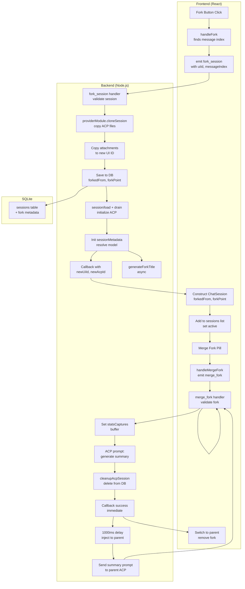

# Feature Doc — Session Forking

**Session forking allows users to branch a conversation at any message boundary, creating a detached copy with full conversation history up to that point. Merging a fork back to its parent captures a summary of the fork's work and injects it into the parent chat.**

This feature enables parallel exploration of conversations — testing different approaches, rolling back to a point to try something new, or branching into specialized sub-tasks — while maintaining full traceability and the ability to consolidate work back to the original chat.

---

## Overview

### What It Does

- **Fork Session:** Creates a new session that includes all messages up to a selected message boundary (the "fork point"). The new session is marked with `forkedFrom: {parentUiId}` and `forkPoint: {messageIndex}` in the database, and appears in the sidebar indented under its parent.
- **Auto-Orient:** After forking, sends a system message to the forked session explaining it is now detached, to prevent the agent from confusing fork context with parent context.
- **Auto-Title:** Asynchronously generates a descriptive fork title from the last 2 user/assistant message pairs before the fork point.
- **Merge Fork:** Consolidates a fork back to its parent by: generating a detailed summary of the fork's work, deleting the fork session, injecting the summary into the parent chat as a user message, and sending the same summary as a prompt to the parent's ACP session.
- **Cascade Delete:** When a parent session is deleted, all of its fork descendants (and their descendants, recursively) are cleaned up automatically, removing DB records, ACP session files, and attachments.
- **Hierarchy Display:** The sidebar renders fork sessions indented under their parent with a fork arrow (↳) and GitFork icon for visual distinction.

### Why This Matters

- **Branching Conversations:** Users can explore alternatives without losing the original thread.
- **Undo-Friendly:** Fork to a prior point, try a new direction, merge back if useful or discard if not.
- **Non-Linear Workflows:** Enable specialized sub-tasks that can be summarized back into the main conversation.
- **Data Integrity:** Fork metadata (`forkedFrom`, `forkPoint`) is strictly typed and enforced in DB, preventing orphaned sessions and ensuring consistent hierarchy.
- **Provider Isolation:** Fork metadata is provider-agnostic; the backend handles all cloning and file management via provider modules.

---

## How It Works — End-to-End Flow

### Fork Creation Flow

**Step 1: Fork Button Click & Message Index Resolution**
- **File:** `frontend/src/components/AssistantMessage.tsx` (Function: `handleFork`, Lines 83-93)
- User clicks GitFork icon on an assistant message; the component finds that message's index in the session's message array via `findIndex(m => m.id === message.id)`.
- If the index is found, `useChatStore.getState().handleForkSession()` is invoked with the session ID and message index.

```javascript
// FILE: frontend/src/components/AssistantMessage.tsx (Lines 83-93)
const handleFork = () => {
  if (!socket || !activeSessionId || forking) return;
  // ... finds message index ...
  const msgIndex = session.messages.findIndex(m => m.id === message.id);
  if (msgIndex === -1) return;
  setForking(true);
  useChatStore.getState().handleForkSession(socket, activeSessionId, msgIndex, () => setForking(false));
};
```

**Step 2: Socket Emit & Backend Reception**
- **File:** `frontend/src/store/useChatStore.ts` (Function: `handleForkSession`, Lines 100-140)
- `handleForkSession` emits a `fork_session` socket event with `{ uiId: sessionId, messageIndex }`.

```typescript
// FILE: frontend/src/store/useChatStore.ts (Lines 100-105)
handleForkSession: (socket, sessionId, messageIndex, onComplete) => {
  // ...
  socket.emit('fork_session', { uiId: sessionId, messageIndex }, (res: ForkSessionResponse) => {
    // ...
```

**Step 3: Backend Fork Session Handler — ACP Session Cloning**
- **File:** `backend/sockets/sessionHandlers.js` (Function: `socket.on('fork_session')`, Lines 214-268)
- Handler fetches the parent session from DB, resolves the provider ID, and generates new IDs.
- The handler calls `providerModule.cloneSession()`, which delegates to the provider to perform provider-specific session file cloning.

```javascript
// FILE: backend/sockets/sessionHandlers.js (Lines 214-224)
socket.on('fork_session', async ({ uiId, messageIndex }, callback) => {
  try {
    const session = await db.getSession(uiId);
    // ... resolves provider and client ...
    const newAcpId = crypto.randomUUID();
    const newUiId = `fork-${Date.now()}`;
    // ... calls cloneSession ...
    providerModule.cloneSession(oldAcpId, newAcpId, Math.ceil((messageIndex + 1) / 2));
```

**Step 4: Copy Attachments**
- **File:** `backend/sockets/sessionHandlers.js` (Lines 226-229)
- Attachment files are copied from the parent's attachment directory to the fork's directory.

```javascript
// FILE: backend/sockets/sessionHandlers.js (Lines 226-229)
const oldAttach = path.join(getAttachmentsRoot(providerId), uiId);
if (fs.existsSync(oldAttach)) {
  fs.cpSync(oldAttach, path.join(getAttachmentsRoot(providerId), newUiId), { recursive: true });
}
```

**Step 5: Database Save with Fork Metadata**
- **File:** `backend/sockets/sessionHandlers.js` (Lines 231-238)
- Messages are sliced to `messageIndex + 1`, and the new session is saved to the database with fork metadata:
  - `forkedFrom: uiId` — parent session UI ID
  - `forkPoint: messageIndex` — 0-based message index where fork occurred

```javascript
// FILE: backend/sockets/sessionHandlers.js (Lines 231-238)
const forkedMessages = (session.messages || []).slice(0, messageIndex + 1);  // LINE 219
await db.saveSession({
  id: newUiId, acpSessionId: newAcpId, name: `${session.name} (fork)`,
  model: session.model, messages: forkedMessages, isPinned: false,
  cwd: session.cwd, folderId: session.folderId, forkedFrom: uiId,  // LINE 223
  forkPoint: messageIndex, currentModelId: session.currentModelId,  // LINE 224
  modelOptions: session.modelOptions, provider: providerId,
});
```

**Step 6: ACP Session Load & Drain**
- **File:** `backend/sockets/sessionHandlers.js` (Lines 240-245)
- The backend drains any pending output from the cloned ACP session (to discard stale data), then loads the session via `session/load` to initialize it in the daemon.

```javascript
// FILE: backend/sockets/sessionHandlers.js (Lines 240-245)
acpClient.stream.beginDraining(newAcpId);
await acpClient.transport.sendRequest('session/load', {
  sessionId: newAcpId, cwd: session.cwd || process.cwd(),
  mcpServers: getMcpServers(providerId)
});
await acpClient.stream.waitForDrainToFinish(newAcpId, 3000);
```

**Step 7: Session Metadata Initialization**
- **File:** `backend/sockets/sessionHandlers.js` (Lines 247-256)
- The backend resolves the fork's model state from the parent session's saved state and initializes session metadata.

```javascript
// FILE: backend/sockets/sessionHandlers.js (Lines 247-256)
const { models: forkModels } = getProvider(providerId).config;
const knownModelOptions = getKnownModelOptions(session, null, forkModels);
const resolvedModel = resolveModelSelection(session.currentModelId || session.model, forkModels, knownModelOptions);

acpClient.sessionMetadata.set(newAcpId, {
  model: resolvedModel.modelId, currentModelId: resolvedModel.modelId,
  modelOptions: knownModelOptions, toolCalls: 0, successTools: 0, startTime: Date.now(),
  usedTokens: 0, totalTokens: 0, promptCount: 0, lastResponseBuffer: '', lastThoughtBuffer: '',
  agentName: null, spawnContext: null, provider: runtime.providerId, configOptions: session.configOptions
});
```

**Step 8: Callback & Frontend Session Construction**
- **File:** `backend/sockets/sessionHandlers.js` (Lines 258-261); `frontend/src/store/useChatStore.ts` (Lines 111-131)
- The backend calls back with fork metadata. The frontend constructs a `ChatSession` object, setting `forkedFrom: sessionId` and `forkPoint: messageIndex`.

```javascript
// FILE: backend/sockets/sessionHandlers.js (Lines 258-261)
callback?.({
  success: true, providerId: runtime.providerId, newUiId, newAcpId,
  currentModelId: resolvedModel.modelId, modelOptions: knownModelOptions, configOptions: session.configOptions
});
```

```typescript
// FILE: frontend/src/store/useChatStore.ts (Lines 111-128)
const newSession: ChatSession = {
  id: res.newUiId,
  acpSessionId: res.newAcpId,
  name: `${original.name} (fork)`,
  messages: forkedMessages,
  isTyping: false,
  isWarmingUp: false,
  model: original.model,
  currentModelId: res.currentModelId ?? original.currentModelId,
  modelOptions: mergeModelOptions(original.modelOptions, res.modelOptions),
  cwd: original.cwd,
  folderId: original.folderId,
  forkedFrom: sessionId,  // LINE 124
  forkPoint: messageIndex,  // LINE 125
  configOptions: mergeProviderConfigOptions(original.configOptions, res.configOptions),
  provider: original.provider
};
```

**Step 9: Session Registration & Socket Watch**
- **File:** `frontend/src/store/useChatStore.ts` (Lines 130-134)
- The new session is added to the session list, set as active, and a `watch_session` event is emitted to subscribe to updates from the backend.

```typescript
// FILE: frontend/src/store/useChatStore.ts (Lines 130-134)
lifecycle.setSessions([...lifecycle.sessions, newSession]);
lifecycle.setActiveSessionId(res.newUiId!);
lifecycle.fetchStats(socket, res.newAcpId);

socket.emit('watch_session', { sessionId: res.newAcpId });
```

**Step 10: Async Orientation Message & Title Generation**
- **File:** `frontend/src/store/useChatStore.ts` (Lines 136-138); `backend/sockets/sessionHandlers.js` (Line 263)
- After 500ms, a system message is sent to the forked session to orient the agent that it is now detached.
- In parallel, `generateForkTitle()` is invoked asynchronously (fire-and-forget) to generate a title from the fork point context.

```typescript
// FILE: frontend/src/store/useChatStore.ts (Lines 136-138)
setTimeout(() => {
  get().handleSubmit(socket, 'This is a conversation fork. You are now detached from the original session and acting as a new session with the existing history. If you are asked about work you did, only refer to work you did after this message. Acknowledge briefly.');
}, 500);
```

```javascript
// FILE: backend/sockets/sessionHandlers.js (Line 263)
generateForkTitle(acpClient, newUiId, session.messages || [], messageIndex).catch(() => {});
```

---

### Merge Fork Flow

**Step 1: Merge Fork Button Click**
- **File:** `frontend/src/components/ChatInput/ChatInput.tsx` (Lines 303-313)
- The "Merge Fork" pill appears only when `activeSession.forkedFrom` is defined and the session is not a sub-agent.

```typescript
// FILE: frontend/src/components/ChatInput/ChatInput.tsx (Lines 303-313)
{activeSession?.forkedFrom && !activeSession?.isSubAgent && (
  <button
    className="chatinput-pill merge-fork-pill"
    onClick={handleMergeFork}
    disabled={merging || !!activeSession?.isTyping || !!activeSession?.isWarmingUp}
    title="Summarize fork work and send to parent chat"
  >
    <GitMerge size={12} />
    Merge Fork
  </button>
)}
```

**Step 2: Merge Handler & Socket Emit**
- **File:** `frontend/src/components/ChatInput/ChatInput.tsx` (Lines 86-102)
- `handleMergeFork` emits a `merge_fork` socket event with the fork's UI ID, sets `merging: true` for the loading overlay, and shows a merge progress overlay (Lines 175-182).

```typescript
// FILE: frontend/src/components/ChatInput/ChatInput.tsx (Lines 86-102)
const handleMergeFork = () => {
  if (!socket || !activeSession?.forkedFrom || merging) return;
  setMerging(true);
  const forkId = activeSession.id;
  const parentId = activeSession.forkedFrom;
  socket.emit('merge_fork', { uiId: forkId }, (res: { success?: boolean; parentUiId?: string; error?: string }) => {
    setMerging(false);
    if (res.success) {
      useSessionLifecycleStore.getState().handleSessionSelect(socket, parentId);
      setTimeout(() => {
        useSessionLifecycleStore.setState(state => ({
          sessions: state.sessions.filter(s => s.id !== forkId),
        }));
      }, 100);
    }
  });
};
```

**Step 3: Backend Merge Handler — Summary Capture Setup**
- **File:** `backend/sockets/sessionHandlers.js` (Lines 386-436)
- Handler validates the fork session has `forkedFrom` (Line 391) and retrieves the parent session (Line 392).
- A `statsCaptures` buffer is created for the fork's ACP session ID (Line 397) — this will capture the summary text.

```javascript
// FILE: backend/sockets/sessionHandlers.js (Lines 402-417)
socket.on('merge_fork', async ({ uiId }, callback) => {
  try {
    const forkSession = await db.getSession(uiId);
    if (!forkSession?.forkedFrom || !forkSession.acpSessionId) return callback?.({ error: 'Not a valid fork session' });
    const parentSession = await db.getSession(forkSession.forkedFrom);  // LINE 392
    if (!parentSession?.acpSessionId) return callback?.({ error: 'Parent session not found' });
    const pid = forkSession.provider || getProvider().id;
    const acpClient = providerRuntimeManager.getClient(pid);

    acpClient.stream.statsCaptures.set(forkSession.acpSessionId, { buffer: '' });  // LINE 397
```

**Step 4: Generate Summary via ACP Prompt**
- **File:** `backend/sockets/sessionHandlers.js` (Lines 412-416)
- A prompt is sent to the fork's ACP session asking for a detailed summary of its work since the fork.
- Output is silently captured via `statsCaptures` (initialized in Step 3) and accumulated in the buffer.

```javascript
// FILE: backend/sockets/sessionHandlers.js (Lines 412-416)
await acpClient.transport.sendRequest('session/prompt', {
  sessionId: forkSession.acpSessionId,
  prompt: [{ type: 'text', text: 'Create a highly detailed summary of everything you have done since the most recent fork, so you can inform the parent chat of your work.' }]
});
const summary = acpClient.stream.statsCaptures.get(forkSession.acpSessionId)?.buffer?.trim() || '(No summary generated)';  // LINE 402
```

**Step 5: Cleanup & DB Deletion**
- **File:** `backend/sockets/sessionHandlers.js` (Lines 417-419)
- The fork's ACP session files are cleaned up via `cleanupAcpSession()`, and the fork session is deleted from the database.

```javascript
// FILE: backend/sockets/sessionHandlers.js (Lines 417-419)
acpClient.stream.statsCaptures.delete(forkSession.acpSessionId);
await cleanupAcpSession(forkSession.acpSessionId, pid, 'fork-merge');  // LINE 404
await db.deleteSession(uiId);  // LINE 405
```

**Step 6: Immediate Callback**
- **File:** `backend/sockets/sessionHandlers.js` (Line 420)
- The handler calls back immediately with `{ success: true, parentUiId }` so the frontend can switch to the parent session without waiting for the summary injection.

```javascript
// FILE: backend/sockets/sessionHandlers.js (Line 420)
callback?.({ success: true, parentUiId: forkSession.forkedFrom });
```

**Step 7: Frontend Switch to Parent (Immediate)**
- **File:** `frontend/src/components/ChatInput/ChatInput.tsx` (Lines 93-99)
- Frontend switches to the parent session immediately (Line 94), then removes the fork from the sessions list after 100ms (Lines 95-99) to avoid flickering.

```typescript
// FILE: frontend/src/components/ChatInput/ChatInput.tsx (Lines 93-99)
if (res.success) {
  useSessionLifecycleStore.getState().handleSessionSelect(socket, parentId);
  setTimeout(() => {
    useSessionLifecycleStore.setState(state => ({
      sessions: state.sessions.filter(s => s.id !== forkId),
    }));
  }, 100);
}
```

**Step 8: Delayed Summary Injection to Parent (1000ms Delay)**
- **File:** `backend/sockets/sessionHandlers.js` (Lines 422-431)
- After 1000ms (allowing the callback and frontend updates to complete), the backend emits a `merge_message` event to the parent session's socket room.

```javascript
// FILE: backend/sockets/sessionHandlers.js (Lines 422-431)
setTimeout(async () => {
  try {
    const mergeMessage = `A forked child agent is informing you of their work:\n\n${summary}`;
    io.to(`session:${parentSession.acpSessionId}`).emit('merge_message', { sessionId: parentSession.acpSessionId, text: mergeMessage });  // LINE 411
    await acpClient.transport.sendRequest('session/prompt', { sessionId: parentSession.acpSessionId, prompt: [{ type: 'text', text: mergeMessage }] });  // LINE 412
    io.to(`session:${parentSession.acpSessionId}`).emit('token_done', { sessionId: parentSession.acpSessionId });  // LINE 413
  } catch (err) {
    writeLog(`[MERGE ERR] ${err.message}`);
  }
}, 1000);
```

**Step 9: Frontend Receives merge_message Event**
- **File:** `frontend/src/hooks/useChatManager.ts` (Lines 215-220)
- The frontend's `merge_message` socket event handler injects the summary as a user-role message into the parent session's messages.

```typescript
// FILE: frontend/src/hooks/useChatManager.ts (Lines 215-220)
socket.on('merge_message', (data: { sessionId: string; text: string }) => {
  useSessionLifecycleStore.setState(state => ({ sessions: state.sessions.map(s => {
      if (s.acpSessionId !== data.sessionId) return s;
      return { ...s, messages: [...s.messages, { id: `merge-${Date.now()}`, role: 'user' as const, content: data.text }] };
    }) }));
});
```

---

## Architecture Diagram



---

## The Critical Contract: Fork Identity & Ownership

### Fork ID Format
A fork is identified by **two fields** that together form the contract:

1. **`forkedFrom: string`** — The UI ID of the parent session. This is the single source of truth for fork lineage. There is no parent reference in the opposite direction (parent does not maintain a list of forks); instead, the sidebar queries `forkedFrom` at display time.

2. **`forkPoint: number`** — The 0-based index in the parent's message array where the fork was created. This is strictly read-only and used only to reconstruct the fork's initial message history and for title generation.

### Backend Fork ID
- **UI ID:** `fork-${Date.now()}` — Millisecond-precision timestamp-based ID, not guaranteed unique but collision-unlikely in practice. Used for database keys, session selection, sidebar rendering.
- **ACP ID:** `crypto.randomUUID()` — Globally unique UUID for the ACP daemon's session ID.

### Critical Rules

✅ **Must enforce:**
- A fork's `forkedFrom` must point to an existing session ID.
- A fork's `forkPoint` must be a valid index within the parent's message array at the time of fork.
- Forks are **never parent to other forks**; a fork has `forkedFrom` set, but cannot be a parent (sidebar filtering excludes forks from becoming parents to prevent deep nesting issues).
- Sub-agents (sessions with `isSubAgent: true`) are never treated as forks via `forkedFrom`; they are tracked separately.

❌ **Must prevent:**
- Setting `forkedFrom` on a session that already has `forkedFrom` (no fork-of-fork). **Exception:** Sub-agents use `forkedFrom` for parent linkage and are orthogonal to fork UI hierarchy.
- Deleting a parent session without cascading deletion of all descendants.
- Merging a fork that has already been deleted or whose parent no longer exists.

### Summary Capture Pattern
Merge uses the `statsCaptures` pattern to silently capture ACP output:

```javascript
acpClient.stream.statsCaptures.set(sessionId, { buffer: '' });
// ... send prompt ...
const output = acpClient.stream.statsCaptures.get(sessionId)?.buffer;
acpClient.stream.statsCaptures.delete(sessionId);
```

This ensures the summary is captured without polluting the UI or triggering stream events.

---

## Data Flow & Rendering Pipeline

### Fork Session Data Structure
**From database (raw):**
```json
{
  "ui_id": "fork-1735689600000",
  "acp_id": "550e8400-e29b-41d4-a716-446655440000",
  "name": "Session A (fork)",
  "forked_from": "session-parent-ui",
  "fork_point": 8,
  "messages_json": "[... sliced messages from index 0 to 8 ...]",
  "model": "test-flagship",
  "current_model_id": "provider-model-id",
  "provider": "provider-a"
}
```

**Frontend ChatSession (normalized):**
```typescript
{
  id: "fork-1735689600000",
  acpSessionId: "550e8400-e29b-41d4-a716-446655440000",
  name: "Session A (fork)",
  messages: [ /* 0 to 8 */ ],
  forkedFrom: "session-parent-ui",
  forkPoint: 8,
  model: "test-flagship",
  currentModelId: "provider-model-id",
  provider: "provider-a",
  isTyping: false,
  isWarmingUp: false,
  isPinned: false
}
```

### Title Generation Data Flow
**Input (from handler):**
```javascript
messages = [ /* full parent message array */ ]
forkPoint = 8  // last message index to consider
```

**Processing (acpTitleGenerator.js):**
```javascript
relevant = messages.slice(0, forkPoint + 1)  // indices 0-8
userMsgs = relevant.filter(m => m.role === 'user').slice(-2)  // last 2 user messages
assistantMsgs = relevant.filter(m => m.role === 'assistant').slice(-2)  // last 2 assistant messages
context = userMsgs + assistantMsgs  // concatenated as string (first 200 chars each)
titlePrompt = `Generate a short chat title (max 6 words, no quotes) for this forked conversation. Here is the recent context:\n\n${context}`
```

**Output (to UI):**
```javascript
title = "Multi-agent Collaboration Strategy"  // max 6 words, no quotes
// ... updated in DB via updateSessionName(), emitted via session_renamed event ...
```

### Merge Summary Data Flow
**Capture (merge_fork handler):**
```javascript
statsCaptures.set(forkSessionId, { buffer: '' })
// send prompt to ACP
summary = statsCaptures.get(forkSessionId).buffer.trim()
mergeMessage = `A forked child agent is informing you of their work:\n\n${summary}`
```

**Frontend Injection (merge_message handler):**
```typescript
// Received from backend
{ sessionId: parentAcpSessionId, text: mergeMessage }
// Injected as a user message
messages.push({
  id: `merge-${Date.now()}`,
  role: 'user',
  content: mergeMessage
})
// When ACP processes this message, it is visible in the chat timeline
```

---

## Component Reference

### Backend Files

| File | Function(s) | Lines | Purpose |
|------|-------------|-------|---------|
| `backend/sockets/sessionHandlers.js` | `fork_session` handler | 210–268 | Creates fork: validates parent, generates IDs, clones ACP session, copies attachments, saves to DB, loads session, initializes metadata, calls back |
| `backend/sockets/sessionHandlers.js` | `merge_fork` handler | 402–436 | Merges fork: validates fork, captures summary via ACP prompt, cleans up, deletes from DB, injects summary to parent after delay |
| `backend/sockets/sessionHandlers.js` | `delete_session` handler | 167–201 | Deletes session: removes from DB, cleans ACP files, and cascades to all descendants (forks) recursively |
| `backend/services/acpTitleGenerator.js` | `generateForkTitle()` | 61–106 | Generates descriptive title for fork from last 2 user/assistant message pairs before forkPoint; spawns ephemeral ACP session, generates title, cleans up |
| `backend/services/acpCleanup.js` | `cleanupAcpSession()` | (via import) | Removes ACP session files (`.jsonl`, `.json`, task files) from the provider's session directory |
| `backend/database.js` | Session table schema | 30–60 | Defines columns: `forked_from TEXT`, `fork_point INTEGER` for fork metadata storage |

### Frontend Files

| File | Function(s) / Component | Lines | Purpose |
|------|------------------------|-------|---------|
| `frontend/src/store/useChatStore.ts` | `handleForkSession()` | 100–140 | Socket emit fork_session, construct ChatSession with forkedFrom/forkPoint, add to list, set active, emit watch_session, send orientation prompt after 500ms |
| `frontend/src/components/AssistantMessage.tsx` | `handleFork()` | 75–84 | Click handler: find message index, call handleForkSession, set forking state |
| `frontend/src/components/AssistantMessage.tsx` | Fork button + overlay | 120–124, 204–211 | Display GitFork icon; show fork-overlay during creation |
| `frontend/src/components/ChatInput/ChatInput.tsx` | `handleMergeFork()` | 86–102 | Emit merge_fork, switch to parent, remove fork from list after 100ms |
| `frontend/src/components/ChatInput/ChatInput.tsx` | Merge fork pill | 303–313 | Display GitMerge icon; visible when `forkedFrom` exists, disabled during merge/typing |
| `frontend/src/components/ChatInput/ChatInput.tsx` | Merge overlay | 175–182 | Show "Merging fork..." with spinner during merge |
| `frontend/src/hooks/useChatManager.ts` | `merge_message` handler | 215–220 | Receive fork summary from backend, inject as user message to parent session |
| `frontend/src/components/Sidebar.tsx` | `rootSessions` filter | 96 | Exclude forks and sub-agents from root; only show actual root sessions |
| `frontend/src/components/Sidebar.tsx` | `getForksOf()` filter | 97 | Query forks by parent ID; used for nesting |
| `frontend/src/components/Sidebar.tsx` | `renderChildren()` | 254–292 | Recursively render forks indented under parent, with `fork-indent` style |
| `frontend/src/components/SessionItem.tsx` | Fork icon & arrow | 42–46 | Display `↳` arrow and `GitFork` icon in blue for forked sessions |
| `frontend/src/types.ts` | `ChatSession` type | 292–297 | TypeScript type: `forkedFrom?: string \| null`, `forkPoint?: number \| null` |

### Database Schema

| Column | Type | Purpose |
|--------|------|---------|
| `forked_from` | TEXT | UI ID of parent session (nullable; NULL for root sessions) |
| `fork_point` | INTEGER | 0-based message index where fork was created (nullable; NULL for root sessions) |
| `is_sub_agent` | INTEGER | Boolean: 1 if sub-agent, 0 otherwise; orthogonal to fork system |
| `parent_acp_session_id` | TEXT | ACP session ID of parent (for sub-agents); separate from fork metadata |

---

## Gotchas & Important Notes

### 1. **statsCaptures Must Be Set Before Prompt**
**What goes wrong:** The merge handler sends a prompt to the fork's ACP session expecting the summary to be captured in `statsCaptures`, but if `statsCaptures` is not initialized first, the output streams to the UI or is lost.

**Why:** The ACP daemon sends output as stream events, which are routed by the `acpUpdateHandler`. If `statsCaptures` is set, output is buffered; otherwise, it's processed as normal chat events.

**How to avoid:** Always call `acpClient.stream.statsCaptures.set(sessionId, { buffer: '' })` **before** sending a prompt that you intend to capture silently. Clean up with `.delete()` after capturing.

---

### 2. **1000ms Delay Before Parent Injection Is Critical**
**What goes wrong:** If the merge message is injected to the parent's ACP session before the frontend callback returns, the UI may flicker, the parent session switch may race with the fork deletion, or the summary may appear before the fork is removed from the sidebar.

**Why:** The frontend needs time to switch to the parent and remove the fork session from the list before the backend injects the summary as an ACP prompt.

**How to avoid:** Never reduce the 1000ms delay without testing full fork/merge flow in the UI. The delay is intentionally generous to avoid race conditions.

---

### 3. **Cascade Delete Uses getAllSessions() Scan, Not Foreign Keys**
**What goes wrong:** If you delete a parent session and a fork descendant is somehow orphaned (due to DB corruption or partial deletion), the descendant will persist in the database and appear in the sidebar as a root session.

**Why:** SQLite migration approach does not enforce foreign key constraints on `forked_from`. The cascade is implemented in application code using `collectDescendants()`, which scans all sessions to find descendants.

**How to avoid:** Always delete parent sessions via the socket handler (line 144), never via direct DB calls. If you suspect orphaned forks, query sessions where `forked_from` points to a non-existent parent and manually clean them up.

---

### 4. **Fork's ACP Session Is Loaded, Not Created**
**What goes wrong:** If you assume a forked ACP session is a freshly spawned session (via `session/new`), you may expect empty metadata or a clean slate. Instead, the forked session inherits the cloned state of the parent.

**Why:** The fork handler calls `providerModule.cloneSession()` first (which copies ACP session files), then `session/load` (which reloads from those files). The session starts with the parent's state, not a blank state.

**How to avoid:** Always call `session/load` with a drain before the session, and re-initialize `sessionMetadata` explicitly. Do not assume the daemon knows the session has been cloned; tell it via the `load` request.

---

### 5. **Orientation Message Sent After 500ms Delay**
**What goes wrong:** If the orientation message is sent immediately after the fork callback, it may race with the initial session setup in the ACP daemon, causing the message to be dropped or processed out of order.

**Why:** The fork handler completes the callback, but the ACP daemon may still be settling after the `session/load` and metadata initialization.

**How to avoid:** The 500ms delay is intentional. Do not eliminate it. If you add a new fork feature that depends on the orientation message being received first, increase the delay if needed.

---

### 6. **merge_message Injects a User Role, Not Assistant**
**What goes wrong:** The merge summary appears in the timeline as if the **user** said it (because `role: 'user'`), not the assistant. When the backend then sends the same summary as a prompt to the parent's ACP session, the agent sees it as a user message, not a system message.

**Why:** This is intentional. The summary is context provided by the user (the fork), not a system directive. The agent should treat it as user input, which it is in the sense that it's information from a parallel exploration.

**How to avoid:** If you need the summary to be treated as a system message, change the `role` in the `merge_message` handler (frontend) and adjust the ACP prompt accordingly (backend). Test that the agent understands the context correctly.

---

### 7. **Forks Don't Appear as Root; Sub-Agents Do**
**What goes wrong:** You expect a forked session to appear as a root session in the sidebar, but it appears indented under the parent. You expect a sub-agent to appear indented, but it also uses `forkedFrom` and gets confused with forks.

**Why:** The sidebar filter excludes both `forkedFrom` and `isSubAgent` from root sessions. Forks are filtered by `forkedFrom`, sub-agents by `isSubAgent`. Both use different hierarchies but look similar in the DB.

**How to avoid:** Always check **both** `forkedFrom` and `isSubAgent` when querying sessions. The two systems are orthogonal. A session can be a fork (has `forkedFrom`) or a sub-agent (has `isSubAgent: true`), but not both in normal operation.

---

### 8. **Title Generation Is Fully Fire-and-Forget**
**What goes wrong:** You expect title generation to block or complete before the fork is fully ready. Instead, the title updates asynchronously after several seconds, and if title generation fails, the fork keeps the default name `${parentName} (fork)`.

**Why:** Title generation spawns an ephemeral ACP session, which takes time. The fork handler does not wait for it (`.catch(() => {})`), so it runs in the background.

**How to avoid:** If your UI depends on a finalized title before showing the fork, poll the session name from the backend or wait for the `session_renamed` event. Do not assume the title is final immediately after fork creation.

---

## Unit Tests

### Backend

**File:** `backend/test/sessionHandlers.test.js`

| Test Name | Lines | Scenario |
|-----------|-------|----------|
| `handles fork_session` | 188–195 | Fork creation: validates parent, calls cloneSession, saves to DB, returns success |
| `handles merge_fork` | 205–218 | Merge: captures summary, deletes fork, emits merge_message, sends parent prompt |
| `merge_fork returns error when parent session not found` | 220–230 | Error handling: parent doesn't exist |
| `handles delete_session with cascading child sessions` | 458–467 | Cascade: parent deleted, fork child also deleted |
| `handles merge_fork when not a valid fork` | 469–475 | Error: session has no forkedFrom field |

**File:** `backend/test/acpTitleGenerator.test.js`

| Test Name | Lines | Scenario |
|-----------|-------|----------|
| `generates title from last 2 user and assistant messages` | 105–131 | Title gen: extracts last 2 pairs before forkPoint, generates via ACP |
| `does nothing when messages are empty` | 133–136 | Edge case: empty messages array |
| `only uses messages up to forkPoint` | 138–159 | Boundary: title generated only from messages[0 ... forkPoint] |

### Frontend

**No dedicated unit tests for fork UI.** Fork state management is tested implicitly through session lifecycle tests.

---

## How to Use This Guide

### For Implementing Fork Features

1. **Read the end-to-end flows** above for fork creation (Steps 1–10) and merge (Steps 1–9).
2. **Reference the critical contract** section to understand `forkedFrom` and `forkPoint` are the foundation.
3. **Check the component reference table** to find exact line numbers for any file you need to modify.
4. **Consult the gotchas** before implementing a new feature to avoid common pitfalls (especially statsCaptures timing and cascade deletion).
5. **Run the unit tests** to ensure your changes don't break existing fork/merge behavior:
   ```bash
   npx vitest run backend/test/sessionHandlers.test.js -t fork
   npx vitest run backend/test/acpTitleGenerator.test.js -t generateForkTitle
   ```

### For Debugging Fork/Merge Issues

1. **Check the sidebar:** Do forks appear indented under the parent? If not, check that `forkedFrom` is set in the DB and the session list includes it.
2. **Inspect the DB:** Query the sessions table for the fork session:
   ```sql
   SELECT ui_id, name, forked_from, fork_point FROM sessions WHERE forked_from IS NOT NULL;
   ```
3. **Check socket events:** Is `fork_session` being received? Are `merge_message` and `token_done` events being emitted after the 1000ms delay?
4. **Verify ACP session state:** Is the fork's ACP session properly initialized after `session/load`? Check logs for draining issues.
5. **Test title generation:** Does the title update after fork creation? If not, check the backend logs for title generation errors.
6. **Simulate merge:** Manually emit a `merge_fork` event from the browser console and verify the summary is captured and injected correctly.

---

## Summary

**Fork & Merge** is a core session branching feature:

- **Fork Creation:** Clones the parent ACP session (via provider), copies attachments, saves DB metadata (`forkedFrom`, `forkPoint`), initializes ACP state, and generates a title asynchronously.
- **Fork Identity:** UI ID is `fork-{timestamp}`, ACP ID is a UUID. The single lineage pointer is `forkedFrom: parentUiId`.
- **Fork Hierarchy:** Sidebar filters root sessions (non-fork, non-sub-agent), then recursively renders forks indented under their parent using `renderChildren()`.
- **Merge Flow:** Captures summary from fork's ACP session, deletes fork, switches UI to parent, then injects summary as user message and ACP prompt after 1000ms delay.
- **Cascade Delete:** Deleting a parent automatically recursively deletes all fork descendants and their ACP session files.
- **Title Generation:** Asynchronous, fire-and-forget. Uses last 2 message pairs before forkPoint to generate a concise title via ephemeral ACP session.

**Critical Contract:** `forkedFrom` + `forkPoint` form the immutable fork metadata. Sidebar rendering, cascade delete, and merge validation all depend on this contract being enforced.

**Why This Matters:** Forks enable parallel exploration of conversations without losing history, and merging summarizes divergent work back into the main thread. The strict metadata enforcement and provider-agnostic cloning ensure forks work identically across all AI providers.

---
