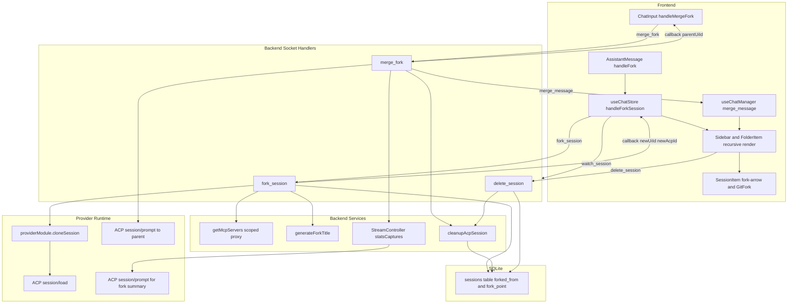

# Feature Doc - Session Forking

Session forking branches a chat at a selected assistant message, creates a provider-backed ACP clone with sliced UI history, and keeps the fork nested under its parent in the sidebar. Merge-back summarizes fork work through the fork ACP session, deletes the fork record, and injects the summary into the parent chat.

This feature crosses frontend message actions, Zustand session state, Socket.IO session handlers, provider session file cloning, SQLite fork metadata, title generation, and recursive sidebar rendering.

---

## Overview

### What It Does

- Creates a fork from an assistant message action in `AssistantMessage` and resolves the selected message to a `messageIndex` in the active `ChatSession.messages` array.
- Emits the `fork_session` Socket.IO event from `useChatStore.handleForkSession`, then inserts the returned fork session into `useSessionLifecycleStore` and selects it.
- Clones provider-owned ACP session files through `providerModule.cloneSession(oldAcpId, newAcpId, pruneAtTurn)` and loads the cloned session with `session/load` while draining replayed output.
- Persists fork metadata in SQLite through `sessions.forked_from` and `sessions.fork_point`, exposed to the frontend as `ChatSession.forkedFrom` and `ChatSession.forkPoint`.
- Sends a detached-context orientation prompt to the fork after frontend selection and starts fork title generation with `generateForkTitle`.
- Merges a fork through the `merge_fork` Socket.IO event by silently capturing a fork summary with `statsCaptures`, cleaning up the fork ACP session, deleting the fork DB record, and sending the summary to the parent ACP session.
- Renders fork trees recursively under parent sessions in `Sidebar` and `FolderItem`; `SessionItem` displays the `fork-arrow` marker and `GitFork` icon.
- Cascades session deletion by scanning all sessions for `forkedFrom` descendants and cleaning their ACP session files, attachment directories, and DB rows.

### Why This Matters

- Forks let users explore alternatives while preserving the original chat context.
- Merge-back turns fork work into parent-session context through the same prompt path agents already understand.
- The UI uses `ChatSession.id` for hierarchy and selection, while backend streaming and rooms use `ChatSession.acpSessionId`.
- Provider cloning keeps fork behavior generic; provider modules own the file-format details.
- Fork metadata is shared with sub-agent hierarchy, so `isSubAgent` checks are required wherever UI behavior differs.

Architectural role: frontend message action + session store feature, backend Socket.IO session lifecycle, provider clone contract, SQLite persistence, and sidebar rendering.

---

## How It Works - End-to-End Flow

1. Assistant message action resolves the fork boundary

File: `frontend/src/components/AssistantMessage.tsx` (Component: `AssistantMessage`, Handler: `handleFork`)

The fork button is rendered for completed assistant messages when the active session is not a sub-agent. `handleFork` reads the active session from `useSessionLifecycleStore`, finds the clicked message by `message.id`, and passes the message array index to `useChatStore.handleForkSession`.

```tsx
// FILE: frontend/src/components/AssistantMessage.tsx (Component: AssistantMessage, Handler: handleFork)
const handleFork = () => {
  if (!socket || !activeSessionId || forking) return;
  const session = useSessionLifecycleStore.getState().sessions.find(s => s.id === activeSessionId);
  const msgIndex = session.messages.findIndex(m => m.id === message.id);
  setForking(true);
  useChatStore.getState().handleForkSession(socket, activeSessionId, msgIndex, () => setForking(false));
};
```

2. The chat store emits `fork_session`

File: `frontend/src/store/useChatStore.ts` (Store action: `handleForkSession`, Socket event: `fork_session`)

`handleForkSession` emits `{ uiId, messageIndex }`. The callback must include `success`, `newUiId`, and `newAcpId`; optional model and provider config fields refine the local fork session.

```ts
// FILE: frontend/src/store/useChatStore.ts (Store action: handleForkSession)
socket.emit('fork_session', { uiId: sessionId, messageIndex }, (res: ForkSessionResponse) => {
  if (!res?.success || !res.newUiId || !res.newAcpId) return;
  const original = lifecycle.sessions.find(s => s.id === sessionId);
  const forkedMessages = original.messages.slice(0, messageIndex + 1).map(m => ({ ...m, isStreaming: false }));
});
```

3. The backend clones the provider ACP session

File: `backend/sockets/sessionHandlers.js` (Socket event: `fork_session`)

The handler fetches the parent UI session from SQLite, resolves the provider runtime and provider module, generates a timestamp-based UI ID plus UUID ACP ID, and delegates provider-owned file cloning to `cloneSession`.

```js
// FILE: backend/sockets/sessionHandlers.js (Socket event: fork_session)
const session = await db.getSession(uiId);
const providerId = session.provider || getProvider().id;
const runtime = providerRuntimeManager.getRuntime(providerId);
const providerModule = await getProviderModule(providerId);
const newAcpId = crypto.randomUUID();
const newUiId = `fork-${Date.now()}`;

providerModule.cloneSession(session.acpSessionId, newAcpId, Math.ceil((messageIndex + 1) / 2));
```

4. Attachments and fork metadata are saved

File: `backend/sockets/sessionHandlers.js` (Socket event: `fork_session`, Helpers: `getAttachmentsRoot`, `db.saveSession`)

Attachments are copied from the parent UI session directory to the fork UI session directory when the parent attachment directory exists. The fork row is inserted with sliced messages and metadata that drives hierarchy, merge validation, and title generation.

```js
// FILE: backend/sockets/sessionHandlers.js (Socket event: fork_session)
const forkedMessages = (session.messages || []).slice(0, messageIndex + 1);
await db.saveSession({
  id: newUiId,
  acpSessionId: newAcpId,
  name: `${session.name} (fork)`,
  messages: forkedMessages,
  cwd: session.cwd,
  folderId: session.folderId,
  forkedFrom: uiId,
  forkPoint: messageIndex,
  currentModelId: session.currentModelId,
  modelOptions: session.modelOptions,
  provider: providerId
});
```

5. The cloned ACP session is loaded and drained

File: `backend/sockets/sessionHandlers.js` (Socket event: `fork_session`)
File: `backend/services/sessionManager.js` (Function: `getMcpServers`)

The backend starts a drain for the new ACP session, builds MCP server config scoped to the new `acpSessionId`, sends `session/load`, and waits for replayed history to finish before initializing metadata.

```js
// FILE: backend/sockets/sessionHandlers.js (Socket event: fork_session)
acpClient.stream.beginDraining(newAcpId);
const forkMcpServers = getMcpServers(providerId, { acpSessionId: newAcpId });
await acpClient.transport.sendRequest('session/load', {
  sessionId: newAcpId,
  cwd: session.cwd || process.cwd(),
  mcpServers: forkMcpServers
});
await acpClient.stream.waitForDrainToFinish(newAcpId, 3000);
```

6. Session metadata inherits model, config, and stats state

File: `backend/sockets/sessionHandlers.js` (Socket event: `fork_session`, Helpers: `getKnownModelOptions`, `resolveModelSelection`)

The backend resolves the active model from the parent session and stores runtime metadata under the fork ACP ID. Token stats are copied from `session.stats` when present, and `configOptions` are carried into metadata and callback payload.

```js
// FILE: backend/sockets/sessionHandlers.js (Socket event: fork_session)
const knownModelOptions = getKnownModelOptions(session, null, forkModels);
const resolvedModel = resolveModelSelection(session.currentModelId || session.model, forkModels, knownModelOptions);

acpClient.sessionMetadata.set(newAcpId, {
  model: resolvedModel.modelId,
  currentModelId: resolvedModel.modelId,
  modelOptions: knownModelOptions,
  usedTokens: Number(session.stats?.usedTokens || 0),
  totalTokens: Number(session.stats?.totalTokens || 0),
  provider: runtime.providerId,
  configOptions: session.configOptions
});
```

7. The frontend registers, selects, watches, and orients the fork

File: `frontend/src/store/useChatStore.ts` (Store action: `handleForkSession`, Socket event: `watch_session`, Store action: `handleSubmit`)

The callback constructs a `ChatSession`, appends it to `useSessionLifecycleStore.sessions`, sets it active, fetches stats by ACP ID, subscribes to backend room updates with `watch_session`, and schedules an orientation prompt through normal prompt submission.

```ts
// FILE: frontend/src/store/useChatStore.ts (Store action: handleForkSession)
const newSession: ChatSession = {
  id: res.newUiId,
  acpSessionId: res.newAcpId,
  name: `${original.name} (fork)`,
  messages: forkedMessages,
  forkedFrom: sessionId,
  forkPoint: messageIndex,
  provider: original.provider
};

lifecycle.setSessions([...lifecycle.sessions, newSession]);
lifecycle.setActiveSessionId(res.newUiId);
socket.emit('watch_session', { sessionId: res.newAcpId });
setTimeout(() => get().handleSubmit(socket, '<detached fork orientation prompt>'), 500);
```

8. Fork title generation runs in a throwaway ACP session

File: `backend/services/acpTitleGenerator.js` (Function: `generateForkTitle`)
File: `backend/sockets/sessionHandlers.js` (Call site: `generateForkTitle(...)`)

`generateForkTitle` uses messages through `forkPoint`, keeps the last two user messages and last two assistant messages, creates an internal title session, optionally sets the configured title-generation model, captures title output with `statsCaptures`, updates the DB name, and emits `session_renamed`.

```js
// FILE: backend/services/acpTitleGenerator.js (Function: generateForkTitle)
const relevant = messages.slice(0, forkPoint + 1);
const userMsgs = relevant.filter(m => m.role === 'user').slice(-2);
const assistantMsgs = relevant.filter(m => m.role === 'assistant').slice(-2);

acpClient.stream.statsCaptures.set(titleSessionId, { buffer: '' });
await acpClient.transport.sendRequest('session/prompt', { sessionId: titleSessionId, prompt: [{ type: 'text', text: titlePrompt }] });
const title = acpClient.stream.statsCaptures.get(titleSessionId)?.buffer?.trim();
await db.updateSessionName(uiId, title);
acpClient.io.emit('session_renamed', { providerId, uiId, newName: title });
```

9. Sidebar and folder views render recursive fork trees

File: `frontend/src/components/Sidebar.tsx` (Component: `Sidebar`, Helpers: `rootSessions`, `getForksOf`, `getSubAgentsOf`, `renderChildren`)
File: `frontend/src/components/FolderItem.tsx` (Component: `FolderItem`, Helper: `renderForkTree`)
File: `frontend/src/components/SessionItem.tsx` (Component: `SessionItem`, CSS class: `fork-arrow`, Icon: `GitFork`)

Root session lists exclude `forkedFrom` sessions and sub-agents. Forks are fetched by parent UI ID and rendered recursively, including forks of forks. Sub-agents share `forkedFrom` parent linkage but are filtered separately with `isSubAgent`.

```tsx
// FILE: frontend/src/components/Sidebar.tsx (Component: Sidebar)
const rootSessions = filteredSessions.filter(s => !s.folderId && !s.forkedFrom && !s.isSubAgent);
const getForksOf = (parentId: string) => filteredSessions.filter(s => s.forkedFrom === parentId && !s.isSubAgent);
const getSubAgentsOf = (parentId: string) => filteredSessions.filter(s => s.isSubAgent && s.forkedFrom === parentId);
```

10. Merge UI emits `merge_fork`

File: `frontend/src/components/ChatInput/ChatInput.tsx` (Component: `ChatInput`, Handler: `handleMergeFork`, CSS class: `merge-fork-pill`)

The merge pill is visible when the active session has `forkedFrom` and is not a sub-agent. `handleMergeFork` emits `{ uiId: forkId }`, shows the merge overlay while awaiting the callback, switches to the parent on success, and removes the fork from local state after a short delay.

```tsx
// FILE: frontend/src/components/ChatInput/ChatInput.tsx (Handler: handleMergeFork)
const handleMergeFork = () => {
  if (!socket || !activeSession?.forkedFrom || merging) return;
  const forkId = activeSession.id;
  const parentId = activeSession.forkedFrom;
  socket.emit('merge_fork', { uiId: forkId }, (res) => {
    if (res.success) {
      useSessionLifecycleStore.getState().handleSessionSelect(socket, parentId);
      setTimeout(() => useSessionLifecycleStore.setState(state => ({
        sessions: state.sessions.filter(s => s.id !== forkId)
      })), 100);
    }
  });
};
```

11. The backend captures a fork summary and deletes the fork

File: `backend/sockets/sessionHandlers.js` (Socket event: `merge_fork`, Helpers: `statsCaptures`, `cleanupAcpSession`, `db.deleteSession`)

The handler validates `forkedFrom` plus `acpSessionId`, resolves the parent session, captures the fork response silently, deletes capture state, removes provider-owned fork files, deletes the fork row, and callbacks with the parent UI ID.

```js
// FILE: backend/sockets/sessionHandlers.js (Socket event: merge_fork)
const forkSession = await db.getSession(uiId);
if (!forkSession?.forkedFrom || !forkSession.acpSessionId) return callback?.({ error: 'Not a valid fork session' });
const parentSession = await db.getSession(forkSession.forkedFrom);
if (!parentSession?.acpSessionId) return callback?.({ error: 'Parent session not found' });

acpClient.stream.statsCaptures.set(forkSession.acpSessionId, { buffer: '' });
await acpClient.transport.sendRequest('session/prompt', { sessionId: forkSession.acpSessionId, prompt: [summaryPrompt] });
const summary = acpClient.stream.statsCaptures.get(forkSession.acpSessionId)?.buffer?.trim() || '(No summary generated)';
acpClient.stream.statsCaptures.delete(forkSession.acpSessionId);
await cleanupAcpSession(forkSession.acpSessionId, pid, 'fork-merge');
await db.deleteSession(uiId);
callback?.({ success: true, parentUiId: forkSession.forkedFrom });
```

12. The parent receives the merge summary

File: `backend/sockets/sessionHandlers.js` (Socket event: `merge_fork`, Emitted event: `merge_message`, ACP method: `session/prompt`)
File: `frontend/src/hooks/useChatManager.ts` (Hook: `useChatManager`, Socket event: `merge_message`)

After the success callback, the backend emits `merge_message` to the parent ACP room, sends the same text to the parent ACP session as `session/prompt`, and emits `token_done`. The frontend appends `merge_message.text` as a user-role message to the matching parent `ChatSession`.

```ts
// FILE: frontend/src/hooks/useChatManager.ts (Socket event: merge_message)
socket.on('merge_message', (data: { sessionId: string; text: string }) => {
  useSessionLifecycleStore.setState(state => ({ sessions: state.sessions.map(s => {
    if (s.acpSessionId !== data.sessionId) return s;
    return { ...s, messages: [...s.messages, { id: `merge-${Date.now()}`, role: 'user', content: data.text }] };
  }) }));
});
```

13. Deleting a parent cascades through descendants

File: `backend/sockets/sessionHandlers.js` (Socket event: `delete_session`, Helper: `collectDescendants`)
File: `frontend/src/components/Sidebar.tsx` (Handler: `handleRemoveSession`)

The backend removes the requested session, scans `db.getAllSessions()` for recursive `forkedFrom` descendants, then cleans each descendant's ACP files, attachment directory, and DB row. The sidebar also removes the same descendant tree from local state immediately after a delete/archive action.

```js
// FILE: backend/sockets/sessionHandlers.js (Socket event: delete_session)
const collectDescendants = (parentId) => {
  for (const s of allSessions) {
    if (s.forkedFrom === parentId) {
      descendants.push(s);
      collectDescendants(s.id);
    }
  }
};
```

---

## Architecture Diagram



---

## Critical Contract

### Session Identity Fields

- `ChatSession.id` / `sessions.ui_id`: UI identity for selection, sidebar hierarchy, attachment directories, and `forkedFrom` parent references.
- `ChatSession.acpSessionId` / `sessions.acp_id`: ACP daemon identity for `session/load`, `session/prompt`, stream rooms, stats, and MCP proxy scope.
- `ChatSession.forkedFrom` / `sessions.forked_from`: parent UI ID. Forks and sub-agents both use this field, so `isSubAgent` is required to distinguish fork UI from sub-agent UI.
- `ChatSession.forkPoint` / `sessions.fork_point`: selected UI message index at creation time. It drives local message slicing and fork title context.
- `ChatSession.isSubAgent` / `sessions.is_sub_agent`: sub-agent flag. Sub-agent rows can carry `forkedFrom` for parent linkage, but the visible merge UI excludes them.

### Fork Boundary Contract

The frontend sends a UI message index. The backend uses that index in two ways:

- `session.messages.slice(0, messageIndex + 1)` for persisted UI history.
- `Math.ceil((messageIndex + 1) / 2)` as the `pruneAtTurn` argument for `providerModule.cloneSession`.

A provider's `cloneSession(oldAcpId, newAcpId, pruneAtTurn)` must clone provider session files and interpret `pruneAtTurn` at whole-turn boundaries for that provider's transcript format. If a provider cannot prune accurately, the UI message history and ACP daemon context can diverge.

### Merge Summary Contract

Merge-back depends on `StreamController.statsCaptures` being set before the fork summary prompt is sent. `acpUpdateHandler.handleUpdate` buffers `agent_message_chunk` output into the capture buffer when a session ID is present in `statsCaptures`; that keeps summary generation out of the visible stream.

### Persistence Contract

`db.saveSession` inserts `forked_from`, `fork_point`, `is_sub_agent`, and `parent_acp_session_id` values. Its conflict update path preserves existing hierarchy fields. Create fork metadata before the first insert for the fork row; do not rely on a generic `saveSession` update to repoint an existing session.

### Delete Contract

Cascade delete is implemented by application code in `delete_session`, not by SQLite foreign keys. Any code path that deletes session rows directly must handle descendant cleanup itself or call the socket lifecycle path.

---

## Configuration / Data Flow

### Provider Support

File: `backend/services/providerLoader.js` (Default export contract: `cloneSession`, `getSessionPaths`, `deleteSessionFiles`)
File: `backend/sockets/sessionHandlers.js` (Socket event: `fork_session`)

A provider module must expose a usable `cloneSession(oldAcpId, newAcpId, pruneAtTurn)` implementation for complete fork support. The default provider loader supplies a no-op, so a provider without a real clone implementation can produce a DB fork whose ACP files are missing or incomplete.

`cleanupAcpSession(acpSessionId, providerId, context)` delegates deletion to the provider module's session-file deletion behavior. Fork merge and session delete both depend on that provider cleanup path.

### Runtime Configuration

File: `backend/services/sessionManager.js` (Function: `getMcpServers`)
File: `backend/services/acpTitleGenerator.js` (Functions: `generateTitle`, `generateForkTitle`, Helper: `getConfiguredModelId`)

- `getMcpServers(providerId, { acpSessionId })` creates an MCP proxy binding scoped to the fork ACP session and passes the proxy ID to `stdio-proxy.js` through `ACP_UI_MCP_PROXY_ID`.
- `generateForkTitle` uses provider config `models.titleGeneration`, then `models.default`, then the first provider model option when choosing the internal title model.
- `generateForkTitle` chooses title-session `cwd` from `DEFAULT_WORKSPACE_CWD`, then `HOME`, then `process.cwd()`.

### Database Shape

File: `backend/database.js` (Functions: `initDb`, `saveSession`, `getAllSessions`, `getSession`)

```json
{
  "ui_id": "fork-1735689600000",
  "acp_id": "mock-acp-session-id",
  "name": "Parent Chat (fork)",
  "messages_json": "[sliced UI messages]",
  "forked_from": "parent-ui-id",
  "fork_point": 4,
  "is_sub_agent": 0,
  "parent_acp_session_id": null,
  "provider": "test-provider"
}
```

### Frontend Session Shape

File: `frontend/src/types.ts` (Interface: `ChatSession`)
File: `frontend/src/store/useChatStore.ts` (Store action: `handleForkSession`)

```ts
{
  id: 'fork-1735689600000',
  acpSessionId: 'mock-acp-session-id',
  name: 'Parent Chat (fork)',
  messages: slicedMessages,
  model: 'mock-model-id',
  currentModelId: 'mock-model-id',
  modelOptions: [],
  cwd: 'D:/workspace',
  folderId: null,
  forkedFrom: 'parent-ui-id',
  forkPoint: 4,
  provider: 'test-provider',
  isTyping: false,
  isWarmingUp: false
}
```

### Socket Payloads

| Event | Direction | Payload | Purpose |
|---|---|---|---|
| `fork_session` | Frontend to backend | `{ uiId, messageIndex }` | Request a fork from the selected UI session at a UI message index. |
| `fork_session` callback | Backend to frontend | `{ success, providerId, newUiId, newAcpId, currentModelId, modelOptions, configOptions }` | Register and select the local fork session. |
| `watch_session` | Frontend to backend | `{ sessionId: newAcpId }` | Subscribe to stream events for the fork ACP session. |
| `session_renamed` | Backend to frontend | `{ providerId, uiId, newName }` | Apply generated fork title. |
| `merge_fork` | Frontend to backend | `{ uiId: forkUiId }` | Request merge-back for a fork UI session. |
| `merge_fork` callback | Backend to frontend | `{ success, parentUiId }` or `{ error }` | Switch UI to parent or show failure state. |
| `merge_message` | Backend to frontend | `{ sessionId: parentAcpId, text }` | Append merge summary as a user message in the parent chat. |
| `token_done` | Backend to frontend | `{ sessionId: parentAcpId }` | Mark parent stream completion after the merge prompt dispatch path. |

---

## Component Reference

### Backend

| Area | File | Anchors | Purpose |
|---|---|---|---|
| Socket handlers | `backend/sockets/sessionHandlers.js` | Socket events `fork_session`, `merge_fork`, `delete_session`; helper `collectDescendants`; imports `cleanupAcpSession`, `generateForkTitle` | Creates forks, merges forks, and cascades descendant deletion. |
| Database | `backend/database.js` | `initDb`, `saveSession`, `getAllSessions`, `getSession`; columns `forked_from`, `fork_point`, `is_sub_agent`, `parent_acp_session_id` | Persists and hydrates fork hierarchy metadata. |
| Title generation | `backend/services/acpTitleGenerator.js` | `generateForkTitle`, `getConfiguredModelId`, `statsCaptures`, `session_renamed` | Generates asynchronous fork titles from context through `forkPoint`. |
| Session manager | `backend/services/sessionManager.js` | `getMcpServers`, `getKnownModelOptions`, `resolveModelSelection`, `updateSessionModelMetadata` | Builds fork-scoped MCP server config and resolves model state. |
| Provider loader | `backend/services/providerLoader.js` | Default module field `cloneSession`, `getProviderModule`, `getProvider` | Loads provider clone behavior and config. |
| ACP cleanup | `backend/mcp/acpCleanup.js` | `cleanupAcpSession` | Removes provider-owned ACP session files after merge/delete/title generation. |
| Update routing | `backend/services/acpUpdateHandler.js` | `handleUpdate`, `statsCaptures` checks | Buffers captured output instead of emitting it to visible chat streams. |

### Frontend

| Area | File | Anchors | Purpose |
|---|---|---|---|
| Assistant action | `frontend/src/components/AssistantMessage.tsx` | `AssistantMessage`, `handleFork`, `GitFork`, `fork-overlay` | Resolves selected assistant message index and starts fork creation. |
| Chat actions | `frontend/src/store/useChatStore.ts` | `handleForkSession`, `handleSubmit`, socket events `fork_session`, `watch_session` | Emits fork requests, constructs local fork sessions, sends orientation prompt. |
| Merge UI | `frontend/src/components/ChatInput/ChatInput.tsx` | `ChatInput`, `handleMergeFork`, `merge-fork-pill`, `merge-overlay`, `GitMerge` | Offers merge-back action for fork sessions and switches to parent after success. |
| Socket listeners | `frontend/src/hooks/useChatManager.ts` | `useChatManager`, socket event `merge_message` | Appends merge summary as a user message to the parent session. |
| Sidebar | `frontend/src/components/Sidebar.tsx` | `rootSessions`, `getForksOf`, `getSubAgentsOf`, `renderChildren`, `handleRemoveSession` | Renders recursive fork/sub-agent trees and removes descendant local state on delete. |
| Folder sidebar | `frontend/src/components/FolderItem.tsx` | `childSessions`, `getForksOf`, `getSubAgentsOf`, `renderForkTree` | Renders fork trees under sessions inside folders. |
| Session row | `frontend/src/components/SessionItem.tsx` | `SessionItem`, `fork-arrow`, `GitFork`, `Bot` | Displays fork/sub-agent hierarchy indicators and fork icon. |
| Types | `frontend/src/types.ts` | `ChatSession`, `forkedFrom`, `forkPoint`, `isSubAgent`, `parentAcpSessionId` | Defines frontend session hierarchy fields. |

### Tests

| Area | File | Anchors | Purpose |
|---|---|---|---|
| Backend socket lifecycle | `backend/test/sessionHandlers.test.js` | `handles fork_session`, `handles merge_fork`, `merge_fork returns error when parent session not found`, `handles delete_session with cascading child sessions`, `handles merge_fork when not a valid fork` | Covers backend fork, merge, validation, and cascade paths. |
| Backend title generation | `backend/test/acpTitleGenerator.test.js` | `describe('generateForkTitle')`, `generates title from last 2 user and assistant messages`, `does nothing when messages are empty`, `only uses messages up to forkPoint` | Covers fork title context selection and rename emission. |
| Backend persistence | `backend/test/database-exhaustive.test.js` | `hits all optional field branches in saveSession` | Exercises optional fork fields in `saveSession`. |
| Backend capture routing | `backend/test/acpUpdateHandler.test.js` | `buffers text in statsCaptures if present` | Verifies silent capture buffering behavior. |
| Backend stream controller | `backend/test/streamController.test.js` | `should isolate stats capture buffers between sessions` | Verifies capture buffers are session-scoped. |
| Frontend store | `frontend/src/test/useChatStoreExtended.test.ts` | `describe('handleForkSession')`, `creates a forked session and switches to it` | Covers local fork creation, selection, and orientation prompt. |
| Frontend socket listener | `frontend/src/test/useChatManager.test.ts` | `handles "merge_message" event` | Covers parent message injection after merge. |
| Frontend sidebar | `frontend/src/test/Sidebar.test.tsx` | `deleting a parent session also removes its forks from the session list`, `forked sessions render indented under parent`, `forked sessions are NOT shown as root sessions`, `renders fork-of-fork nested under its parent`, `forks are rendered inside fork-indent containers` | Covers hierarchy rendering and local cascade behavior. |
| Frontend folders | `frontend/src/test/FolderItem.test.tsx` | `renders fork-indent for forked sessions inside folders`, `shows fork arrow for forked sessions` | Covers folder-contained fork rendering. |
| Frontend session row | `frontend/src/test/SessionItem.test.tsx` | `shows GitFork icon when session has forkedFrom`, `shows MessageSquare icon when session has no forkedFrom`, `fork icon takes priority over terminal icon when session has both forkedFrom and a terminal` | Covers row icon and arrow behavior. |

---

## Gotchas

1. `forkedFrom` is shared with sub-agents

`forkedFrom` means parent UI session ID, not always fork UI. UI features that are fork-only must also check `!isSubAgent`; `Sidebar` and `FolderItem` keep forks and sub-agents in separate filters.

2. Fork metadata is insert-time state in `saveSession`

`saveSession` inserts `forked_from` and `fork_point`, but its conflict update path does not overwrite those hierarchy fields. Set fork metadata on initial fork row creation.

3. UI message index and provider turn count are different concepts

The backend passes `Math.ceil((messageIndex + 1) / 2)` to `cloneSession`. Provider implementations must translate that value to their own transcript turn boundary. Test provider clone logic when changing message grouping.

4. Manual socket callers can send invalid fork boundaries

The normal UI finds `messageIndex` from an existing message ID. The backend uses the provided index directly for slicing and pruning. Add backend validation before exposing programmatic fork creation outside the existing UI action.

5. Forks are loaded clones

The fork ACP ID is loaded with `session/load` after provider file cloning. It is not created through `session/new`. Keep `beginDraining`, `session/load`, and `waitForDrainToFinish` together so replayed history does not stream into the visible timeline.

6. `statsCaptures` must surround internal prompts

Merge summaries and title generation depend on capture buffers. Set `statsCaptures` before `session/prompt`, read the buffer after prompt completion, and delete capture state even when follow-up cleanup is added.

7. Merge summary appears as a user message

The frontend `merge_message` handler appends `{ role: 'user' }` to the parent session, and the backend sends the same text as a parent `session/prompt`. This keeps UI context and ACP context aligned.

8. Recursive fork trees are valid UI state

`renderChildren` and `renderForkTree` recurse through `forkedFrom`, and tests cover fork-of-fork rendering. Do not flatten fork trees unless sidebar and deletion semantics are changed together.

9. Cascade cleanup is application-level

SQLite does not enforce `forked_from` relationships. Use `delete_session` for parent deletion so descendants, attachment directories, and ACP files are cleaned consistently.

10. `fork-${Date.now()}` is the UI ID format

Fork UI IDs use millisecond timestamps. The ACP ID is a UUID. Code that needs a globally unique transport identity must use `acpSessionId`, not the UI ID.

---

## Unit Tests

### Backend

- `backend/test/sessionHandlers.test.js`
  - `handles fork_session`
  - `handles merge_fork`
  - `merge_fork returns error when parent session not found`
  - `handles delete_session with cascading child sessions`
  - `handles merge_fork when not a valid fork`
- `backend/test/acpTitleGenerator.test.js`
  - `generates title from last 2 user and assistant messages`
  - `does nothing when messages are empty`
  - `only uses messages up to forkPoint`
- `backend/test/database-exhaustive.test.js`
  - `hits all optional field branches in saveSession`
- `backend/test/acpUpdateHandler.test.js`
  - `buffers text in statsCaptures if present`
- `backend/test/streamController.test.js`
  - `should isolate stats capture buffers between sessions`

Suggested focused backend commands:

```powershell
cd backend; npx vitest run test/sessionHandlers.test.js test/acpTitleGenerator.test.js test/database-exhaustive.test.js
cd backend; npx vitest run test/acpUpdateHandler.test.js test/streamController.test.js
```

### Frontend

- `frontend/src/test/useChatStoreExtended.test.ts`
  - `creates a forked session and switches to it`
- `frontend/src/test/useChatManager.test.ts`
  - `handles "merge_message" event`
- `frontend/src/test/Sidebar.test.tsx`
  - `deleting a parent session also removes its forks from the session list`
  - `forked sessions render indented under parent`
  - `forked sessions are NOT shown as root sessions`
  - `renders fork-of-fork nested under its parent`
  - `forks are rendered inside fork-indent containers`
- `frontend/src/test/FolderItem.test.tsx`
  - `renders fork-indent for forked sessions inside folders`
  - `shows fork arrow for forked sessions`
- `frontend/src/test/SessionItem.test.tsx`
  - `shows GitFork icon when session has forkedFrom`
  - `shows MessageSquare icon when session has no forkedFrom`
  - `fork icon takes priority over terminal icon when session has both forkedFrom and a terminal`

Suggested focused frontend commands:

```powershell
cd frontend; npx vitest run src/test/useChatStoreExtended.test.ts src/test/useChatManager.test.ts
cd frontend; npx vitest run src/test/Sidebar.test.tsx src/test/FolderItem.test.tsx src/test/SessionItem.test.tsx
```

---

## How to Use This Guide

### For implementing or extending this feature

1. Start at `AssistantMessage.handleFork` or `ChatInput.handleMergeFork`, depending on the UI action being changed.
2. Follow the socket event into `backend/sockets/sessionHandlers.js` using `fork_session`, `merge_fork`, or `delete_session`.
3. Keep `ChatSession.id` and `ChatSession.acpSessionId` separate in store updates and socket payloads.
4. For fork creation, verify `providerModule.cloneSession`, `getMcpServers(providerId, { acpSessionId })`, `session/load`, and `sessionMetadata.set` stay in the same flow.
5. For merge-back, verify `statsCaptures`, fork cleanup, `db.deleteSession`, `merge_message`, parent `session/prompt`, and `token_done` stay coordinated.
6. Update tests in both the backend socket/title layer and the frontend store/sidebar layer when behavior changes.

### For debugging issues with this feature

1. Verify the fork row in SQLite: `SELECT ui_id, acp_id, forked_from, fork_point, is_sub_agent FROM sessions WHERE ui_id = ?;`.
2. Check the frontend session object for `id`, `acpSessionId`, `forkedFrom`, `forkPoint`, and `isSubAgent` in `useSessionLifecycleStore`.
3. For missing fork output, inspect `fork_session`, provider `cloneSession`, `session/load`, and drain completion in `backend/sockets/sessionHandlers.js`.
4. For missing fork title, inspect `generateForkTitle`, `models.titleGeneration`, `statsCaptures`, `db.updateSessionName`, and `session_renamed`.
5. For missing merge summary, inspect `merge_fork`, `statsCaptures`, `merge_message`, parent ACP room `session:<parentAcpId>`, and the `useChatManager` listener.
6. For orphaned children, inspect `delete_session.collectDescendants`, direct DB deletes, and `Sidebar.handleRemoveSession` local removal.

---

## Summary

- Session forking starts from `AssistantMessage.handleFork` and flows through `useChatStore.handleForkSession` to the backend `fork_session` handler.
- The backend clones provider-owned ACP files, copies attachments, saves `forkedFrom` and `forkPoint`, loads the cloned ACP session with drain protection, initializes metadata, and starts title generation.
- The frontend registers the returned fork, selects it, watches the new ACP session, and sends an orientation prompt through normal prompt submission.
- Sidebar and folder rendering use recursive `forkedFrom` trees, while `isSubAgent` separates sub-agent rows from fork rows.
- Merge-back uses `merge_fork`, `statsCaptures`, `cleanupAcpSession`, `db.deleteSession`, `merge_message`, and parent `session/prompt` as one coordinated flow.
- The critical contract is correct separation of UI identity, ACP identity, hierarchy fields, sub-agent flags, and provider clone turn boundaries.
- When changing this feature, update backend socket/title tests and frontend store/sidebar tests together because fork behavior spans persistence, transport, and rendering.
