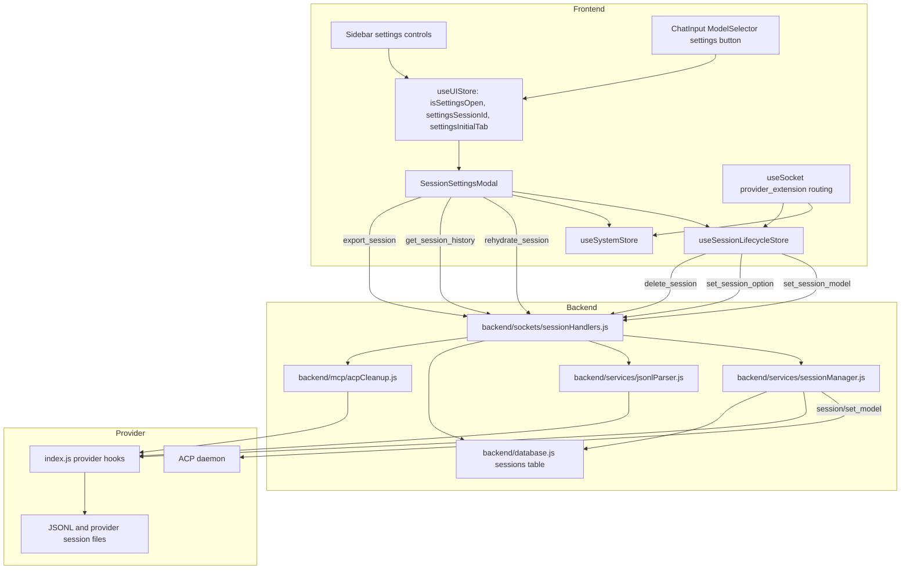

# Feature Doc - Session Settings Modal

The Session Settings Modal is the per-session control surface for system identifiers, context usage, model selection, provider config options, JSONL rehydration, export, and permanent deletion. It matters because the modal crosses frontend state, Socket.IO events, SQLite persistence, ACP provider hooks, and provider-specific session files.

## Overview

**What It Does**

- Opens for one UI session through `useUIStore.setSettingsOpen()` and renders the session selected by `settingsSessionId`.
- Shows system discovery fields, including `ChatSession.acpSessionId`, the provider-specific `branding.sessionLabel`, and the UI session id.
- Displays context usage from `useSystemStore.contextUsageBySession[acpSessionId]` through `ContextUsageCard`.
- Renders model choices from `getFullModelChoices(session, branding.models)` and applies model updates through `handleSessionModelChange()`.
- Renders provider config options from `ChatSession.configOptions` and applies option updates through `handleSetSessionOption()`.
- Rehydrates messages from provider JSONL, exports session assets to a user-specified directory, and permanently deletes sessions after confirmation.

**Why This Matters**

- The modal is provider-agnostic, so labels, model choices, and config controls must come from backend/provider data.
- Model and provider-option updates are optimistic in the frontend and reconciled through backend callbacks or provider extension events.
- Rehydration replaces `session.messages` in SQLite with provider-parsed JSONL output.
- Export and delete touch the database, provider session files, and attachment storage.
- Context usage can arrive through provider extension metadata or from persisted session stats.

This feature spans the frontend modal, Zustand stores, Socket.IO session handlers, session manager helpers, provider hooks, SQLite tables, and focused frontend/backend tests.

## How It Works - End-to-End Flow

1. **The modal is mounted once with the app shell**

   File: `frontend/src/App.tsx` (Component: `App`, Component usage: `SessionSettingsModal`)

   `App` renders `<SessionSettingsModal />` next to the other global modals. The modal decides whether to show content by reading `useUIStore`.

2. **A caller opens the modal for a specific session**

   Files:
   - `frontend/src/components/Sidebar.tsx` (Callbacks: `onSettings`, `onSettingsSession`)
   - `frontend/src/components/ChatInput/ChatInput.tsx` (Prop: `onOpenSettings` passed to `ModelSelector`)
   - `frontend/src/components/ChatInput/ModelSelector.tsx` (Prop: `onOpenSettings`, Title: `Open chat config`)
   - `frontend/src/store/useUIStore.ts` (Action: `setSettingsOpen`)

   Sidebar session controls open the modal with the default `session` tab. The chat input model settings button opens it with the `config` tab.

   ```typescript
   // FILE: frontend/src/store/useUIStore.ts (Action: setSettingsOpen)
   setSettingsOpen: (isOpen, sessionId = null, initialTab = 'session') => set({
     isSettingsOpen: isOpen,
     settingsSessionId: isOpen ? sessionId : null,
     settingsInitialTab: isOpen ? initialTab : 'session',
   })
   ```

3. **`SessionSettingsModal` resolves the session and resets local modal state**

   File: `frontend/src/components/SessionSettingsModal.tsx` (Component: `SessionSettingsModal`, Hook: `useEffect`, State: `activeTab`, `rehydrateStatus`, `exportStatus`)

   The component reads `isSettingsOpen`, `settingsSessionId`, and `settingsInitialTab` from `useUIStore`, then finds the session in `useSessionLifecycleStore.sessions`. If no session matches, the component returns `null`. When the modal opens, it resets delete confirmation, tab, and rehydration message state.

   ```typescript
   // FILE: frontend/src/components/SessionSettingsModal.tsx (Component: SessionSettingsModal)
   const session = sessions.find(s => s.id === settingsSessionId);
   if (!session) return null;
   ```

4. **The Info tab renders identifiers and context usage**

   Files:
   - `frontend/src/components/SessionSettingsModal.tsx` (Component: `ContextUsageCard`, Tab: `session`)
   - `frontend/src/store/useSystemStore.ts` (State: `contextUsageBySession`, Action: `setContextUsage`)
   - `frontend/src/hooks/useSocket.ts` (Socket event: `provider_extension`, Routed type: `metadata`)
   - `frontend/src/store/useSessionLifecycleStore.ts` (Helpers: `maybeHydrateContextUsage`, `fetchStats`)

   `ContextUsageCard` indexes context usage by ACP session id. Provider metadata events reach the card through `useSocket`, `routeExtension()`, and `useSystemStore.setContextUsage()`. Persisted stats can also hydrate context usage during initial load, session selection, and stats fetches.

   ```typescript
   // FILE: frontend/src/components/SessionSettingsModal.tsx (Component: ContextUsageCard)
   const pct = useSystemStore(state => acpSessionId ? state.contextUsageBySession[acpSessionId] : undefined);
   ```

5. **The Config tab builds model choices from session/provider state**

   Files:
   - `frontend/src/components/SessionSettingsModal.tsx` (Tab: `config`)
   - `frontend/src/utils/modelOptions.ts` (Functions: `getFullModelChoices`, `getFullModelSelectionValue`, `getCurrentModelId`)
   - `frontend/src/types.ts` (Interfaces: `ChatSession`, `ProviderModelOption`, `ProviderBranding`)

   The modal asks `useSystemStore.getBranding(session.provider)` for provider labels and model metadata. `getFullModelChoices()` renders `session.modelOptions` first, falls back to branding `models.quickAccess`, then falls back to the session's active model id.

   ```typescript
   // FILE: frontend/src/components/SessionSettingsModal.tsx (Tab: config)
   const brandingModels = branding.models;
   const modelChoices = getFullModelChoices(session, brandingModels);
   const selectedModelValue = getFullModelSelectionValue(session, brandingModels);
   ```

6. **Model changes update the frontend optimistically**

   File: `frontend/src/store/useSessionLifecycleStore.ts` (Action: `handleSessionModelChange`, Helper: `applyModelState`)

   `handleSessionModelChange(socket, uiId, model)` resolves the model id from the selected value, updates the matching `ChatSession` immediately, then emits `set_session_model`.

   ```typescript
   // FILE: frontend/src/store/useSessionLifecycleStore.ts (Action: handleSessionModelChange)
   set(state => ({
     sessions: state.sessions.map(s => s.id === uiId ? applyModelState(s, { model, currentModelId }) : s)
   }));
   socket.emit('set_session_model', { uiId, model }, callback);
   ```

7. **The backend applies the ACP model change and persists model state**

   Files:
   - `backend/sockets/sessionHandlers.js` (Socket event: `set_session_model`)
   - `backend/services/sessionManager.js` (Functions: `getKnownModelOptions`, `setSessionModel`, `updateSessionModelMetadata`)
   - `backend/services/modelOptions.js` (Function: `resolveModelSelection`)
   - `backend/database.js` (Functions: `saveSession`, `saveModelState`)

   The backend loads the DB session, resolves the provider runtime, merges known model options from DB, metadata, and provider config, then calls `setSessionModel()`. `setSessionModel()` sends ACP `session/set_model` when it has a model id, normalizes the provider response with `providerModule.normalizeModelState()`, updates in-memory session metadata, and persists model state. The socket callback returns the selected model state and any config options returned by the model switch.

   ```javascript
   // FILE: backend/services/sessionManager.js (Function: setSessionModel)
   const result = await acpClient.transport.sendRequest('session/set_model', {
     sessionId,
     modelId: resolved.modelId
   });
   ```

8. **The frontend reconciles the model callback**

   File: `frontend/src/store/useSessionLifecycleStore.ts` (Action: `handleSessionModelChange`, Utility: `mergeProviderConfigOptions`)

   On a successful callback, the store reapplies authoritative `model`, `currentModelId`, `modelOptions`, and merged `configOptions`. If the callback is missing or contains an error, the optimistic frontend state remains unchanged.

9. **Provider config controls render from `session.configOptions`**

   Files:
   - `frontend/src/components/SessionSettingsModal.tsx` (Tab: `config`, Controls: `select`, `boolean`, `number`)
   - `frontend/src/types.ts` (Interface: `ProviderConfigOption`)
   - `frontend/src/hooks/useSocket.ts` (Routed type: `config_options`)
   - `frontend/src/utils/configOptions.ts` (Function: `mergeProviderConfigOptions`)

   The modal maps each provider option to a select, toggle button, or number input. Provider extension events can merge, replace, or remove config options for the matching ACP session id.

10. **Provider config changes are fire-and-forget from the frontend**

    File: `frontend/src/store/useSessionLifecycleStore.ts` (Action: `handleSetSessionOption`)

    The store updates the matching option's `currentValue` immediately and emits `set_session_option` without a callback.

    ```typescript
    // FILE: frontend/src/store/useSessionLifecycleStore.ts (Action: handleSetSessionOption)
    const opts = s.configOptions?.map(o => o.id === optionId ? { ...o, currentValue: value } : o);
    socket.emit('set_session_option', { uiId, optionId, value });
    ```

11. **The backend routes provider config changes through the provider contract**

    Files:
    - `backend/sockets/sessionHandlers.js` (Socket event: `set_session_option`)
    - `backend/services/sessionManager.js` (Functions: `setProviderConfigOption`, `getConfigOptionsFromSetResult`, `normalizeProviderConfigOptions`)
    - `backend/services/configOptions.js` (Function: `mergeConfigOptions`)
    - `backend/database.js` (Function: `saveConfigOptions`)

    The handler finds the UI session through `db.getAllSessions()`, requires an ACP session id, calls `providerModule.setConfigOption()`, normalizes returned config options, merges them into `acpClient.sessionMetadata`, and persists them by ACP session id. A provider result of `null` stops persistence.

12. **Rehydration replaces DB messages with provider-parsed JSONL**

    Files:
    - `frontend/src/components/SessionSettingsModal.tsx` (Handler: `handleRehydrate`)
    - `backend/sockets/sessionHandlers.js` (Socket events: `rehydrate_session`, `get_session_history`)
    - `backend/services/jsonlParser.js` (Function: `parseJsonlSession`)
    - Provider modules (Functions: `getSessionPaths`, `parseSessionHistory`)
    - `backend/database.js` (Functions: `getSession`, `saveSession`)

    The button is disabled without `session.acpSessionId`. The modal emits `rehydrate_session`, and the backend calls `parseJsonlSession(acpSessionId, provider)`. `parseJsonlSession()` obtains the JSONL path from the provider and delegates parsing to `providerModule.parseSessionHistory(filePath, Diff)`. On success, `session.messages` is replaced and saved. The frontend then emits `get_session_history` and copies the returned `messages` array into the store.

13. **Export writes a session folder under the selected path**

    Files:
    - `frontend/src/components/SessionSettingsModal.tsx` (Tab: `export`, State: `exportPath`, `exportStatus`)
    - `backend/sockets/sessionHandlers.js` (Socket event: `export_session`)
    - `backend/services/attachmentVault.js` (Function: `getAttachmentsRoot`)
    - Provider modules (Function: `getSessionPaths`)

    The export button is disabled until `exportPath.trim()` has content. The backend resolves a folder named after a sanitized `session.name`, writes `session.json`, copies the provider JSONL file when present, and copies attachment files from `getAttachmentsRoot(providerId)/uiId` into an `attachments` subfolder.

14. **Delete permanently removes the session and fork descendants**

    Files:
    - `frontend/src/components/SessionSettingsModal.tsx` (Handler: `handleDelete`, State: `showConfirmDelete`)
    - `frontend/src/store/useSessionLifecycleStore.ts` (Action: `handleDeleteSession`)
    - `backend/sockets/sessionHandlers.js` (Socket event: `delete_session`)
    - `backend/mcp/acpCleanup.js` (Function: `cleanupAcpSession`)
    - Provider modules (Function: `deleteSessionFiles`)

    The Delete tab requires two user actions. `handleDelete()` calls `handleDeleteSession(socket, session.id, true)`, forcing permanent delete instead of archive behavior. The frontend removes the session locally. The backend deletes attachment directories, calls `cleanupAcpSession()` for the ACP session and descendants, deletes DB rows, and traverses descendants using `forkedFrom`.

## Architecture Diagram



## The Critical Contract: Session-Scoped State and Provider Hooks

1. **Modal state is UI-store scoped**

   `SessionSettingsModal` renders for `useUIStore.settingsSessionId`. Every modal action must operate on the resolved `ChatSession`, not on the active chat by assumption. Closing the modal calls `setSettingsOpen(false)`, which clears `settingsSessionId` and resets `settingsInitialTab` to `session`.

2. **Model identity is provider data, not hardcoded UI state**

   The selected value is a model id from `session.modelOptions`, branding `models.quickAccess`, or the session's active model id. `handleSessionModelChange()` emits the selected value as `model`; the backend resolves it with `resolveModelSelection()` and persists both `model` and `currentModelId`.

3. **Provider config options are session metadata**

   `ProviderConfigOption` objects are merged by `id`. The frontend merge helper is `mergeProviderConfigOptions()`, and the backend merge helper is `mergeConfigOptions()`. Provider extension `config_options` events can request `replace` or `removeOptionIds` through `routeExtension()`.

4. **Rehydration replaces messages**

   `rehydrate_session` assigns the parsed JSONL output to `session.messages` and saves the session. It is a replacement operation. The frontend follow-up `get_session_history` updates only the local `messages` array for that session.

5. **Delete from this modal is permanent**

   `handleDelete()` passes `forcePermanent = true` to `handleDeleteSession()`. The global archive preference does not change the modal's Delete tab behavior.

6. **Provider hooks are mandatory integration points**

   Session settings relies on provider module functions supplied through `getProviderModule()`: `getSessionPaths`, `parseSessionHistory`, `normalizeModelState`, `normalizeConfigOptions`, `setConfigOption`, `emitCachedContext`, and `deleteSessionFiles`. Default hooks exist, but no-op defaults return empty state or perform no provider cleanup.

## Configuration / Data Flow

### Provider and Branding Inputs

| Source | Key or Hook | Used By | Purpose |
|---|---|---|---|
| Provider config and branding | `branding.sessionLabel` | `SessionSettingsModal` | Labels provider-specific session id fields. |
| Provider config and branding | `branding.modelLabel` | `SessionSettingsModal` | Labels the model selector text. |
| Provider config | `models.default` | `getDefaultModelSelection`, backend `resolveModelSelection` | Supplies fallback model selection. |
| Provider config | `models.quickAccess` | `getFullModelChoices`, backend `modelOptionsFromProviderConfig` | Supplies quick model choices when the daemon has not advertised `modelOptions`. |
| Provider module | `normalizeModelState(modelState, source)` | `setSessionModel`, session loading | Normalizes provider model state after ACP calls. |
| Provider module | `setConfigOption(acpClient, sessionId, optionId, value)` | `set_session_option` | Applies provider config changes. |
| Provider module | `normalizeConfigOptions(options)` | `normalizeProviderConfigOptions` | Normalizes provider-advertised option shapes. |
| Provider module | `getSessionPaths(acpSessionId)` | `parseJsonlSession`, `export_session` | Locates provider JSONL files. |
| Provider module | `parseSessionHistory(filePath, Diff)` | `parseJsonlSession` | Converts provider JSONL into UI `Message[]`. |
| Provider module | `deleteSessionFiles(acpSessionId)` | `cleanupAcpSession` | Removes provider-owned session files during permanent delete. |

### Socket Events

| Event | Emitter | Handler | Payload | Response |
|---|---|---|---|---|
| `set_session_model` | `handleSessionModelChange` | `registerSessionHandlers` | `{ uiId, model }` | `{ success, providerId, model, currentModelId, modelOptions, configOptions }` or `{ error }` |
| `set_session_option` | `handleSetSessionOption` | `registerSessionHandlers` | `{ uiId, optionId, value }` | No callback |
| `rehydrate_session` | `handleRehydrate` | `registerSessionHandlers` | `{ uiId }` | `{ success, messageCount }` or `{ error }` |
| `get_session_history` | `handleRehydrate`, `hydrateSession` | `registerSessionHandlers` | `{ uiId }` | `{ session }` or `{ error }` |
| `export_session` | Export tab button | `registerSessionHandlers` | `{ uiId, exportPath }` | `{ success, exportDir }` or `{ error }` |
| `delete_session` | `handleDeleteSession` | `registerSessionHandlers` | `{ providerId, uiId }` from frontend; backend uses `uiId` | No callback |
| `session_model_options` | Backend socket layer | `useSocket` | `{ sessionId, currentModelId, modelOptions }` | Store update by ACP session id |
| `provider_extension` | ACP update routing | `useSocket` | `{ method, params, providerId? }` | Store updates for metadata, config options, status, commands, compaction |

### Store Shapes

```typescript
// FILE: frontend/src/types.ts (Interface: ProviderConfigOption)
export interface ProviderConfigOption {
  id: string;
  name: string;
  description?: string;
  category?: string;
  kind?: 'reasoning_effort' | 'generic';
  type: 'select' | 'boolean' | 'number';
  currentValue: unknown;
  options?: Array<{ value: string; name: string; description?: string }>;
}
```

```typescript
// FILE: frontend/src/types.ts (Interface: ChatSession, session-settings fields)
export interface ChatSession {
  id: string;
  acpSessionId: string | null;
  model: string;
  currentModelId?: string | null;
  modelOptions?: ProviderModelOption[];
  provider?: string | null;
  configOptions?: ProviderConfigOption[];
  stats?: SessionStats;
}
```

### Database Fields

| Table | Columns | Used By |
|---|---|---|
| `sessions` | `ui_id`, `acp_id`, `provider` | Modal session lookup, backend provider/runtime lookup, JSONL path lookup. |
| `sessions` | `model`, `current_model_id`, `model_options_json` | Model selector state and ACP model switching. |
| `sessions` | `config_options_json` | Provider settings controls and saved config reapplication. |
| `sessions` | `messages_json` | Rehydration replacement and session history loading. |
| `sessions` | `used_tokens`, `total_tokens` | Context usage hydration through `stats`. |
| `sessions` | `forked_from` | Permanent delete descendant traversal. |

## Component Reference

### Frontend

| Area | File | Anchors | Purpose |
|---|---|---|---|
| App shell | `frontend/src/App.tsx` | Component usage: `SessionSettingsModal` | Mounts the global modal. |
| Modal | `frontend/src/components/SessionSettingsModal.tsx` | Component: `SessionSettingsModal` | Renders tabs, state, socket actions, and close behavior. |
| Context card | `frontend/src/components/SessionSettingsModal.tsx` | Component: `ContextUsageCard` | Displays context percentage by ACP session id. |
| Opening state | `frontend/src/store/useUIStore.ts` | Type: `SettingsTab`, Action: `setSettingsOpen` | Stores modal visibility, target session, and initial tab. |
| Session store | `frontend/src/store/useSessionLifecycleStore.ts` | Actions: `handleSessionModelChange`, `handleSetSessionOption`, `handleDeleteSession`, `hydrateSession`, `fetchStats`; Helpers: `applyModelState`, `maybeHydrateContextUsage` | Applies optimistic state, emits session events, hydrates stats. |
| Socket routing | `frontend/src/hooks/useSocket.ts` | Socket events: `session_model_options`, `provider_extension` | Applies backend model/options/context updates. |
| Model utilities | `frontend/src/utils/modelOptions.ts` | `getFullModelChoices`, `getFullModelSelectionValue`, `getCurrentModelId`, `normalizeModelOptions` | Resolves model selector choices and labels. |
| Config utilities | `frontend/src/utils/configOptions.ts` | `mergeProviderConfigOptions` | Merges provider config option snapshots and partial updates. |
| Types | `frontend/src/types.ts` | `ChatSession`, `ProviderConfigOption`, `ProviderModelOption`, `ProviderBranding` | Defines modal data contracts. |
| Sidebar triggers | `frontend/src/components/Sidebar.tsx` | Callbacks: `onSettings`, `onSettingsSession` | Opens the modal from session rows and sidebar controls. |
| Chat input trigger | `frontend/src/components/ChatInput/ChatInput.tsx` | Prop: `onOpenSettings` | Opens the modal to the Config tab for the active session. |
| Model selector trigger | `frontend/src/components/ChatInput/ModelSelector.tsx` | Prop: `onOpenSettings`, Title: `Open chat config` | Renders the compact settings button near the footer model indicator. |

### Backend

| Area | File | Anchors | Purpose |
|---|---|---|---|
| Socket handlers | `backend/sockets/sessionHandlers.js` | Function: `registerSessionHandlers`; Events: `set_session_model`, `set_session_option`, `rehydrate_session`, `get_session_history`, `export_session`, `delete_session` | Handles all modal-driven backend actions. |
| Session manager | `backend/services/sessionManager.js` | `setSessionModel`, `updateSessionModelMetadata`, `getKnownModelOptions`, `setProviderConfigOption`, `getConfigOptionsFromSetResult`, `normalizeProviderConfigOptions`, `reapplySavedConfigOptions` | Applies model/config state to ACP sessions and DB metadata. |
| JSONL parser | `backend/services/jsonlParser.js` | `parseJsonlSession` | Loads provider JSONL paths and delegates parsing. |
| Model utilities | `backend/services/modelOptions.js` | `resolveModelSelection`, `extractModelState`, `mergeModelOptions`, `modelOptionsFromProviderConfig`, `normalizeModelOptions` | Resolves backend model ids and option catalogs. |
| Config utilities | `backend/services/configOptions.js` | `normalizeConfigOptions`, `applyConfigOptionsChange`, `mergeConfigOptions` | Normalizes and merges provider config options. |
| Persistence | `backend/database.js` | `saveSession`, `getSession`, `getAllSessions`, `getSessionByAcpId`, `saveConfigOptions`, `saveModelState`, `deleteSession` | Persists settings, messages, model state, config state, and deletes DB rows. |
| Cleanup | `backend/mcp/acpCleanup.js` | `cleanupAcpSession` | Delegates provider session-file deletion to `deleteSessionFiles`. |
| Attachments | `backend/services/attachmentVault.js` | `getAttachmentsRoot` | Supplies attachment roots for export and delete. |
| Runtime | `backend/services/providerRuntimeManager.js` | `getClient`, `getRuntime` | Resolves provider-specific ACP clients. |
| Provider loading | `backend/services/providerLoader.js` | `getProvider`, `getProviderModule`, `getProviderModuleSync` | Supplies provider config, branding, and hooks. |

### Provider Hooks

| File Pattern | Anchors | Purpose |
|---|---|---|
| `providers/<provider>/index.js` | `getSessionPaths`, `parseSessionHistory` | JSONL rehydration and export source paths. |
| `providers/<provider>/index.js` | `setConfigOption`, `normalizeConfigOptions` | Provider settings mutation and normalization. |
| `providers/<provider>/index.js` | `normalizeModelState` | Model-state normalization after ACP model calls. |
| `providers/<provider>/index.js` | `emitCachedContext` | Replays cached context usage after session load/reuse. |
| `providers/<provider>/index.js` | `deleteSessionFiles` | Removes provider session files during permanent delete. |
| `providers/<provider>/provider.json` | Keys: `models`, `mcpName`, provider command/config | Supplies backend model defaults and MCP wiring. |
| `providers/<provider>/branding.json` | Keys: `sessionLabel`, `modelLabel`, `protocolPrefix` | Supplies modal labels and extension routing prefix. |

## Gotchas

1. **`isSettingsOpen` alone does not render the modal**

   `SessionSettingsModal` returns `null` unless `settingsSessionId` matches a session in `useSessionLifecycleStore.sessions`. Open it with `setSettingsOpen(true, session.id, tab)`.

2. **The Info tab labels are provider-branded, but values are fixed fields**

   `branding.sessionLabel` labels a row that displays `session.acpSessionId`. The row labeled `Attachments` displays `UI ID: {session.id}`. Treat these as the present UI labels when updating tests or copy.

3. **The model selector can render with only the active model id**

   `getFullModelChoices()` falls back to the active model id when `session.modelOptions` and `branding.models.quickAccess` are empty. An empty dropdown usually means the session has no model id and provider branding has no quick access list.

4. **Model rollback is not explicit**

   `handleSessionModelChange()` updates state before the backend response. If `set_session_model` returns no callback because the DB session or ACP session id is missing, the optimistic value remains in the frontend.

5. **Config option updates have no frontend callback**

   `set_session_option` is fire-and-forget. Backend errors are written through `writeLog()`. The frontend learns about later provider-side changes through `provider_extension` events of type `config_options`.

6. **Rehydration replaces messages and then reloads only messages into the store**

   The backend saves a full session object, but the modal's follow-up `get_session_history` response is applied as `{ ...s, messages: histRes.session.messages }`. Model and config fields from that response are not copied by `handleRehydrate()`.

7. **`get_session_history` also performs lazy JSONL sync**

   Outside forced rehydration, `get_session_history` parses JSONL and saves the DB session only when JSONL contains more messages than the DB copy.

8. **Export has no frontend ACP-id guard**

   The Export tab can emit `export_session` for a session without `acpSessionId`. The backend always writes `session.json`, then asks the provider for `getSessionPaths(session.acpSessionId)` and copies JSONL only if a path exists on disk.

9. **Delete from the modal bypasses archive behavior**

   The modal passes `forcePermanent = true` to `handleDeleteSession()`. This emits `delete_session` even when the global sidebar delete mode would archive a session.

10. **Permanent delete cascades descendants after deleting the parent DB row**

    `delete_session` deletes the parent, reads all sessions, collects descendants by `forkedFrom`, and then deletes each child. Tests must include `db.getAllSessions()` data for descendant behavior.

## Unit Tests

### Frontend Tests

| File | Test Names / Anchors | Coverage |
|---|---|---|
| `frontend/src/test/SessionSettingsModal.test.tsx` | `renders when open with session`; `shows session info tab by default`; `shows ACP session ID`; `switches to export tab`; `switches to rehydrate tab`; `switches to config tab and shows model selector`; `switches to danger tab and shows delete button`; `shows confirm delete after clicking Delete Chat`; `closes modal when Done clicked`; `closes modal when overlay clicked`; `returns null when no session found`; `uses provider-specific session and model labels`; `export action button is disabled when path is empty`; `export action button is enabled when path is provided`; `rehydrate button calls socket emit` | Modal rendering, tab navigation, labels, close behavior, export button state, rehydrate emit. |
| `frontend/src/test/SessionSettingsModalExtended.test.tsx` | `renders session info by default`; `switches tabs and renders model selection`; `handles rehydrate request`; `handles delete session flow with confirmation`; `handles export request` | Callback status behavior and modal action flows. |
| `frontend/src/test/useSessionLifecycleStore.test.ts` | `handleDeleteSession removes session and emits archive_session by default`; `handleSetSessionOption updates local state and emits`; context hydration tests around `hydrateSession` and `handleSessionSelect` | Store delete defaults, option optimistic update, context usage hydration. |
| `frontend/src/test/useSessionLifecycleStoreExtended.test.ts` | `handleActiveSessionModelChange calls handleSessionModelChange`; `handleUpdateModel updates session model locally without socket emit`; `handleSetSessionOption handles missing session gracefully` | Model action delegation and missing-session guards. |
| `frontend/src/test/useSessionLifecycleStoreDeep.test.ts` | `handleDeleteSession emits archive_session when permanent is false`; `handleDeleteSession emits delete_session when permanent is true` | Delete event selection in store. |
| `frontend/src/test/useUIStore.test.ts` | `setSettingsOpen manages session ID and tab` | Modal opening state contract. |
| `frontend/src/test/ModelSelector.test.tsx` | `renders the settings button when onOpenSettings is provided`; `does not render the settings button when onOpenSettings is not provided`; `calls onOpenSettings when the settings button is clicked` | Chat-input settings trigger. |
| `frontend/src/test/useSocket.test.ts` | `handles "session_model_options" event`; `handles "metadata" extension`; `handles "config_options" extension` | Passive model/context/config updates that feed the modal. |
| `frontend/src/test/extensionRouter.test.ts` | `routes config_options with various modes` | Provider extension config-options routing. |
| `frontend/src/test/configOptions.test.ts` | `mergeProviderConfigOptions handles null/undefined`; `merges new options while preserving current values`; `adds brand new options as provided` | Frontend config option merge semantics. |

### Backend Tests

| File | Test Names / Anchors | Coverage |
|---|---|---|
| `backend/test/sessionHandlers.test.js` | `handles rehydrate_session`; `handles rehydrate_session when no acpSessionId`; `handles rehydrate_session when JSONL not found`; `handles get_session_history with JSONL having more messages than DB` | Rehydration and lazy JSONL sync. |
| `backend/test/sessionHandlers.test.js` | `handles set_session_model`; `set_session_model updates metadata when meta exists`; `set_session_model logs error when sendRequest throws` | Model switching, metadata update, error logging. |
| `backend/test/sessionHandlers.test.js` | `handles set_session_option`; `set_session_option merges configOptions returned by provider`; `set_session_option returns early when session not found`; `set_session_option routes through provider contract setConfigOption`; `set_session_option updates sessionMetadata when meta exists`; `set_session_option logs error when setConfigOption throws` | Provider config option mutation and persistence. |
| `backend/test/sessionHandlers.test.js` | `handles export_session successfully`; `handles export_session when session not found` | Export folder/session JSON behavior and missing-session error. |
| `backend/test/sessionHandlers.test.js` | `handles delete_session`; `handles delete_session with cascading child sessions` | Permanent delete and descendant cleanup. |
| `backend/test/jsonlParser.test.js` | `parses simple prompt/response pair`; `delegates parsing to providerModule`; `returns null on malformed JSON`; `returns null and logs when provider lacks parseSessionHistory` | JSONL parser delegation and null-return behavior. |
| `backend/test/sessionManager.test.js` | `loadSessionIntoMemory` tests covering `emitCachedContext`, `normalizeModelState`, `saveModelState` | Session-load model/context support that feeds modal state. |
| `backend/test/persistence.test.js` | `saveConfigOptions returns immediately if nothing to change`; `saveModelState handles null provider path`; `handles saveModelState with modelOptions and 3-arg signature`; `handles saveConfigOptions with 4-arg signature`; `handles saveConfigOptions with invalid existing JSON` | SQLite persistence for model/config settings. |
| `backend/test/acpCleanup.test.js` | `calls deleteSessionFiles on the provider`; `does nothing for null/undefined acpSessionId` | Delete cleanup hook. |
| `backend/test/providerContract.test.js` | Provider contract includes `getSessionPaths`, `parseSessionHistory`, `deleteSessionFiles`, `archiveSessionFiles`, `restoreSessionFiles` | Provider hook availability. |

## How to Use This Guide

### For implementing or extending this feature

1. Start with `frontend/src/components/SessionSettingsModal.tsx` and identify which tab owns the new control.
2. If the control mutates session model state, follow `handleSessionModelChange()` in `frontend/src/store/useSessionLifecycleStore.ts` and `set_session_model` in `backend/sockets/sessionHandlers.js`.
3. If the control mutates provider config, use `ProviderConfigOption` in `frontend/src/types.ts`, `handleSetSessionOption()` in `useSessionLifecycleStore`, and `setProviderConfigOption()` in `backend/services/sessionManager.js`.
4. If the control depends on provider-discovered data, verify `useSocket` routes the provider extension and that the provider module normalizes the data.
5. If the change affects persisted state, check `backend/database.js` functions `saveSession`, `saveConfigOptions`, and `saveModelState`.
6. Add or update tests in the frontend modal/store tests and backend `sessionHandlers.test.js` for the socket event path.

### For debugging issues with this feature

1. For a modal that does not appear, inspect `useUIStore.isSettingsOpen`, `useUIStore.settingsSessionId`, and the presence of that id in `useSessionLifecycleStore.sessions`.
2. For wrong model display, inspect `session.currentModelId`, `session.modelOptions`, `branding.models.quickAccess`, and `getFullModelChoices()`.
3. For failed model switching, inspect `set_session_model`, `setSessionModel()`, ACP `session/set_model`, and `db.saveSession()`/`db.saveModelState()`.
4. For missing provider settings, inspect `session.configOptions`, `provider_extension` routing through `routeExtension()`, and provider `normalizeConfigOptions()`.
5. For config changes that do not persist, inspect `set_session_option`, provider `setConfigOption()`, `getConfigOptionsFromSetResult()`, `acpClient.sessionMetadata`, and `db.saveConfigOptions()`.
6. For rehydration errors, inspect `session.acpSessionId`, provider `getSessionPaths()`, `parseJsonlSession()`, and provider `parseSessionHistory()`.
7. For export errors, inspect `exportPath`, sanitized `session.name`, provider `getSessionPaths()`, and `getAttachmentsRoot(providerId)`.
8. For delete issues, inspect `handleDeleteSession()`, `delete_session`, `cleanupAcpSession()`, provider `deleteSessionFiles()`, and descendant sessions with `forkedFrom`.

## Summary

- `SessionSettingsModal` is a global component that renders for one `settingsSessionId`.
- The Info tab displays ACP/UI identifiers and context percentage by ACP session id.
- The Config tab renders provider-aware model choices and provider config controls from session state.
- Model updates are optimistic and reconciled through the `set_session_model` callback.
- Provider config updates are optimistic and fire-and-forget, with later reconciliation through provider extension events.
- Rehydration replaces DB messages with provider-parsed JSONL and refreshes local messages through `get_session_history`.
- Export writes `session.json`, JSONL when available, and attachments into a sanitized session folder.
- Delete from the modal is permanent and cascades fork descendants through backend cleanup.
- The critical contract is session-scoped state plus provider hooks: never hardcode model lists, config options, JSONL paths, or cleanup behavior in the modal.
