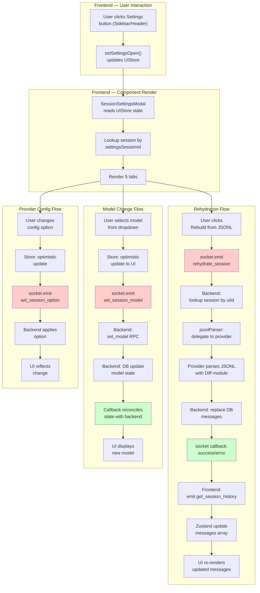

# Feature Doc — Session Settings Modal

## Overview

The Session Settings Modal is a per-session configuration hub that allows users to view session metadata, change models, adjust provider-specific options, rehydrate session history from JSONL, export sessions, and delete sessions. It's a 5-tab interface accessed from the sidebar and chat header.

**Why This Matters:** The modal is a critical interface for session management, but more importantly, it demonstrates a **full rehydration pipeline** (JSONL parsing + DB replacement) that's useful for understanding session persistence and recovery. Model changes show **optimistic UI patterns** with callback reconciliation. Provider settings show **dynamic form generation** from backend config.

## What It Does

- **System Discovery Tab** — Displays ACP session ID and UI session ID (read-only debugging info)
- **Context Usage Display** — Real-time percentage bar showing token consumption vs context window limit
- **Model Selection Tab** — Provider-aware dropdown to switch models; changes apply to session immediately with DB persistence
- **Provider Settings Tab** — Dynamic form generation for provider-specific options (mode, effort, temperature, etc.)
- **Rehydration Tab** — Rebuilds session history from raw JSONL files (destructive operation, replaces DB messages)
- **Export Tab** — Exports entire session (messages, JSONL, attachments) to a user-specified folder
- **Delete Tab** — Permanently deletes session with two-step confirmation

## Why This Matters

- **Powerful recovery** — Rehydration allows recovery from DB corruption or out-of-sync state
- **Provider flexibility** — Dynamic config options accommodate any ACP provider without code changes
- **User control** — Full lifecycle management (change model, customize, export, delete) in one place
- **State integrity** — Model changes demonstrate optimistic patterns that prevent UI lag while ensuring DB consistency
- **Debugging** — System Discovery tab exposes session IDs for troubleshooting

---

## How It Works — End-to-End Flows

### Path A: Opening the Modal

**Step 1: User Clicks Settings Button**
- File: `frontend/src/components/Sidebar.tsx` (Lines 271-422)
- Multiple trigger points in the sidebar (provider header, session item, context menu) call `setSettingsOpen(true, sessionId)`.
- File: `frontend/src/components/ChatInput/ChatInput.tsx` (Line 366)
  - Chat header settings button: `onOpenSettings={() => activeSession && setSettingsOpen(true, activeSession.id, 'config')}`

**Step 2: Update UIStore**
- File: `frontend/src/store/useUIStore.ts` (Function: `setSettingsOpen`, Lines 77-81)
- `setSettingsOpen(isOpen, sessionId, initialTab)` updates the global modal state.

```typescript
// Lines 77-81 in useUIStore.ts
setSettingsOpen: (isOpen, sessionId = null, initialTab = 'session') => set({
  isSettingsOpen: isOpen, 
  settingsSessionId: isOpen ? sessionId : null,
  settingsInitialTab: isOpen ? initialTab : 'session',
})
```

**Step 3: Render Modal Component**
- File: `frontend/src/components/SessionSettingsModal.tsx` (Function: `SessionSettingsModal`, Lines 29-96)
- Component reads `isSettingsOpen` and `settingsSessionId` from `useUIStore` and renders the 5-tab interface.

---

### Path B: Rehydration Flow (The Deep Focus)

**Step 1: User Clicks "Rebuild from JSONL" Button**
- File: `frontend/src/components/SessionSettingsModal.tsx` (Line 259)
- Condition: Button only enabled if `session.acpSessionId` exists.

**Step 2: Frontend Emits Rehydrate Event**
- File: `frontend/src/components/SessionSettingsModal.tsx` (Function: `handleRehydrate`, Lines 49-71)
- State updates to `loading`, and the `rehydrate_session` socket event is emitted.

```javascript
// Lines 49-71 in SessionSettingsModal.tsx
const handleRehydrate = () => {
  if (!session?.acpSessionId || !socket) return;
  setRehydrateStatus('loading');
  socket.emit('rehydrate_session', { uiId: session.id }, (res) => { ... });
};
```
    if (res.success) {
      setRehydrateStatus('done');
      setRehydrateMsg(`Rebuilt ${res.messageCount} messages from JSONL`);
      // Then fetch fresh messages
      socket.emit('get_session_history', { uiId: session.id }, (histRes) => {
        if (histRes?.session) {
          useSessionLifecycleStore.setState(state => ({
            sessions: state.sessions.map(s => s.id === session.id
              ? { ...s, messages: histRes.session!.messages }
              : s)
          }));
        }
      });
    } else {
      setRehydrateStatus('error');
      setRehydrateMsg(res.error || 'Failed to rehydrate');
    }
  });
};
```

**Step 3: Backend Looks Up Session**
- File: `backend/sockets/sessionHandlers.js` (Lines 126–143)
- Handler receives `{ uiId }` from frontend
- Queries database: `const session = await db.getSession(uiId);`
- Validates that `session.acpSessionId` exists (needed to find JSONL file)
```javascript
// Lines 126-130 in sessionHandlers.js
socket.on('rehydrate_session', async ({ uiId }, callback) => {
  try {
    const session = await db.getSession(uiId);
    if (!session?.acpSessionId) {
      return callback?.({ error: 'No ACP session ID — nothing to rehydrate from' });
    }
```

**Step 4: Parse JSONL Session File**
- File: `backend/services/jsonlParser.js` (Lines 10–28)
- Called from handler: `const jsonlMessages = await parseJsonlSession(session.acpSessionId, session.provider);`
- Gets JSONL file path from provider-specific module: `providerModule.getSessionPaths(acpSessionId)`
- Checks file exists: `if (!fs.existsSync(filePath)) return null;`
- **Delegates to provider** for parsing: `await providerModule.parseSessionHistory(filePath, Diff)`
  - Provider receives Diff library to handle message diffs
  - Provider reconstructs UI messages from ACP JSONL format
  - Returns array of normalized messages
```javascript
// Lines 10-28 in jsonlParser.js
export async function parseJsonlSession(acpSessionId, providerId = null) {
  const providerModule = await getProviderModule(providerId);
  const paths = providerModule.getSessionPaths(acpSessionId);
  const filePath = paths.jsonl;

  if (!fs.existsSync(filePath)) return null;

  if (typeof providerModule.parseSessionHistory === 'function') {
    try {
      return await providerModule.parseSessionHistory(filePath, Diff);
    } catch (err) {
      writeLog(`[JSONL ERR] Provider failed to parse ${filePath}: ${err.message}`);
      return null;
    }
  }

  writeLog(`[JSONL ERR] Provider missing parseSessionHistory implementation for ${filePath}`);
  return null;
}
```

**Step 5: Validate and Replace Messages**
- File: `backend/sockets/sessionHandlers.js` (Lines 132–138)
- Backend checks if parsing succeeded: `if (!jsonlMessages) return error`
- **Destructively** replaces DB messages: `session.messages = jsonlMessages;`
- Persists to database: `await db.saveSession(session);`
- Returns success with message count to frontend
```javascript
// Lines 132-138 in sessionHandlers.js
const jsonlMessages = await parseJsonlSession(session.acpSessionId, session.provider);
if (!jsonlMessages) {
  return callback?.({ error: 'JSONL file not found or could not be parsed' });
}
session.messages = jsonlMessages;  // DESTRUCTIVE: replaces entire message array
await db.saveSession(session);
callback?.({ success: true, messageCount: jsonlMessages.length });
```

**Step 6: Frontend Receives Success Response**
- File: `frontend/src/components/SessionSettingsModal.tsx` (Lines 53–65)
- Callback triggered with `{ success: true, messageCount: N }`
- UI state updates: `setRehydrateStatus('done')`, displays message count
- **Immediately fetches fresh messages**: Emits `get_session_history` to reload UI
- Maps fresh messages into Zustand store via `useSessionLifecycleStore.setState()`
```javascript
// Lines 53-65 in SessionSettingsModal.tsx
if (res.success) {
  setRehydrateStatus('done');
  setRehydrateMsg(`Rebuilt ${res.messageCount} messages from JSONL`);
  socket.emit('get_session_history', { uiId: session.id }, (histRes) => {
    if (histRes?.session) {
      useSessionLifecycleStore.setState(state => ({
        sessions: state.sessions.map(s => s.id === session.id
          ? { ...s, messages: histRes.session!.messages }
          : s)
      }));
    }
  });
}
```

**Step 7: Frontend UI Updates with Fresh Messages**
- Chat message list re-renders via Zustand update
- Session in sidebar reflects updated message count
- Modal shows success message with count of rebuilt messages

### Path C: Model Change Flow

**Step 1: User Selects Model from Dropdown**
- File: `frontend/src/components/SessionSettingsModal.tsx` (Lines 183–193)
- Dropdown renders options from `modelChoices` (computed from `getFullModelChoices()`)
- Change handler: `handleSessionModelChange(socket, session.id, e.target.value)`

**Step 2: Store Applies Optimistic Update**
- File: `frontend/src/store/useSessionLifecycleStore.ts` (Lines 345–369)
- Gets current session and branding
- Resolves model ID from selection value: `getModelIdForSelection(model, providerModels)`
- **Immediately updates local state** (optimistic):
```typescript
// Lines 350-352 in useSessionLifecycleStore.ts
set(state => ({
  sessions: state.sessions.map(s => s.id === uiId ? applyModelState(s, { model, currentModelId }) : s)
}));
```
- UI reflects change instantly (no loading spinner)

**Step 3: Emit Socket Event**
- File: `frontend/src/store/useSessionLifecycleStore.ts` (Lines 355–367)
- Sends to backend: `socket.emit('set_session_model', { uiId, model }, callback)`
- Backend processes change in background

**Step 4: Backend Switches Model**
- File: `backend/sockets/sessionHandlers.js` (Lines 442–466)
- Gets session and ACP client context
- Calls `setSessionModel()` to switch ACP session to new model (sends RPC)
- Updates session DB with new model state (model, currentModelId, modelOptions)
```javascript
// Lines 451-455 in sessionHandlers.js
const selectedModelState = await setSessionModel(acpClient, session.acpSessionId, model, models, knownModelOptions);
session.model = selectedModelState.model;
session.currentModelId = selectedModelState.currentModelId;
session.modelOptions = selectedModelState.modelOptions;
await db.saveSession(session);
```
- Returns callback with updated state

**Step 5: Callback Reconciles State**
- File: `frontend/src/store/useSessionLifecycleStore.ts` (Lines 355–367)
- Callback updates store with backend's authoritative model state
- If model change succeeded, UI is already correct; if it failed, this reconciliation corrects it
```typescript
// Lines 357-366 in useSessionLifecycleStore.ts
socket.emit('set_session_model', { uiId, model }, (res) => {
  if (!res || res.error) return;
  set(state => ({
    sessions: state.sessions.map(s => s.id === uiId ? {
      ...applyModelState(s, {
        model: res.model || model,
        currentModelId: res.currentModelId ?? currentModelId,
        modelOptions: res.modelOptions
      }),
      configOptions: mergeProviderConfigOptions(s.configOptions, res.configOptions)
    } : s)
  }));
});
```

### Path D: Provider Config Option Change

**Step 1: User Changes a Provider Option**
- File: `frontend/src/components/SessionSettingsModal.tsx` (Lines 214–240)
- Option types: select (lines 214–223), boolean toggle (lines 225–231), number input (lines 233–239)
- All call: `handleSetSessionOption(socket, session.id, opt.id, newValue)`

**Step 2: Store Updates Optimistically**
- File: `frontend/src/store/useSessionLifecycleStore.ts` (Lines 380–394)
- Finds option in `session.configOptions` and updates its `currentValue`
- UI updates immediately without waiting for backend
```typescript
// Lines 385-389 in useSessionLifecycleStore.ts
set(state => ({
  sessions: state.sessions.map(s => {
    if (s.id !== uiId) return s;
    const opts = s.configOptions?.map(o => o.id === optionId ? { ...o, currentValue: value } : o);
    return { ...s, configOptions: opts };
  })
}));
```

**Step 3: Emit Socket Event (No Callback)**
- File: `frontend/src/store/useSessionLifecycleStore.ts` (Line 392)
- **Fire-and-forget**: `socket.emit('set_session_option', { uiId, optionId, value });`
- No callback specified (unlike model change)

**Step 4: Backend Applies Option**
- File: `backend/sockets/sessionHandlers.js` (Lines 424–440)
- Calls provider-specific handler: `setProviderConfigOption()`
- Normalizes config options returned by the provider, then updates runtime metadata and DB
- Does not emit response (no need to reconcile UI)

---

## Architecture Diagram



**Flow:** Opening triggers UIStore update → component renders 5 tabs. Each tab (Rehydrate, Config, Export, Delete) emits specific socket events. Rehydration shows a destructive DB replacement. Model change shows optimistic UI with callback reconciliation. Provider config is fire-and-forget.

---

## The Critical Contract: UIStore Driven

### Contract 1: Modal Visibility & Session Selection
- **Rule:** Modal exists **only** when `useUIStore.isSettingsOpen === true` **AND** `useUIStore.settingsSessionId !== null`
- **What it means:** If `settingsSessionId` is null, SessionSettingsModal returns `null` (renders nothing)
- **Why it matters:** UIStore is the single source of truth for which session's settings are displayed
- **Breaking point:** If you emit socket events without validating `session` exists, those events will crash or send null IDs
- File: `frontend/src/components/SessionSettingsModal.tsx` (Lines 39, 96)
```typescript
const session = sessions.find(s => s.id === settingsSessionId);
if (!session) return null;  // Guard
```

### Contract 2: Rehydration is Destructive
- **Rule:** `rehydrate_session` handler **fully replaces** `session.messages` array, not merges
- **What it means:** Any messages in the DB are discarded; JSONL becomes the source of truth
- **Why it matters:** Rehydration is for recovery/sync, not for merging new messages with old
- **Breaking point:** Code that assumes messages are merged (appended) will lose state
- File: `backend/sockets/sessionHandlers.js` (Line 136)
```javascript
session.messages = jsonlMessages;  // DESTRUCTIVE replacement
```

### Contract 3: Model Change is Optimistic
- **Rule:** UI updates **before** backend response; callback only reconciles if backend differs
- **What it means:** Users see the change immediately; backend processes asynchronously
- **Why it matters:** No loading spinners; responsive UX; handles network lag gracefully
- **Breaking point:** Code that waits for callback before updating UI will feel laggy
- File: `frontend/src/store/useSessionLifecycleStore.ts` (Lines 350–367)
```typescript
// Line 350: Update immediately
set(state => ({ sessions: state.sessions.map(...applyModelState...) }));

// Lines 355+: Emit and reconcile asynchronously
socket.emit('set_session_model', { uiId, model }, (res) => {
  // Update again if backend differs
  set(state => ({ sessions: state.sessions.map(...) }));
});
```

### Contract 4: Provider Config is Fire-and-Forget
- **Rule:** `set_session_option` emits with **no callback** and **no confirmation**
- **What it means:** UI updates optimistically; backend applies in background; no two-way synchronization
- **Why it matters:** Simpler pattern for simple boolean/select changes that rarely fail
- **Breaking point:** Code expecting an error response will crash or hang
- File: `frontend/src/store/useSessionLifecycleStore.ts` (Line 392)
```typescript
socket.emit('set_session_option', { uiId, optionId, value });  // No callback
```

### Contract 5: Provider Configures Models Dynamically
- **Rule:** Model choices come from `branding.models` via `getFullModelChoices()`, not hardcoded in modal
- **What it means:** Each provider defines its own model list; modal adapts automatically
- **Why it matters:** Modal remains provider-agnostic; adding new models requires no code changes
- **Breaking point:** Hardcoding model list in modal will break for new providers
- File: `frontend/src/components/SessionSettingsModal.tsx` (Lines 97–99)
```typescript
const brandingModels = branding.models;
const modelChoices = getFullModelChoices(session, brandingModels);
const selectedModelValue = getFullModelSelectionValue(session, brandingModels);
```

---

## Configuration / Provider Support

### What a Provider Must Implement for Modal Compatibility

1. **`parseSessionHistory(filePath, Diff)`** (Required for Rehydration)
   - Takes JSONL file path and Diff library
   - Returns array of UI messages reconstructed from ACP JSONL
   - Called by `jsonlParser.parseJsonlSession()` (line 19)
   - Must handle message diffs to reconstruct original message content
   - If missing, rehydration returns error: "Provider missing parseSessionHistory implementation"

2. **`getSessionPaths(acpSessionId)`** (Required for Rehydration)
   - Returns object with `{ jsonl: '/path/to/session.jsonl', ... }`
   - Used by jsonlParser to find JSONL file
   - Provider-specific path mapping

3. **Dynamic Model Catalog** (Optional, for Model Selection)
   - Provider can advertise models in `provider.json` config under `models` key
   - Example:
   ```json
   {
     "models": {
       "default": "provider-model-capable",
       "titleGeneration": "provider-model-fast",
       "balanced": { "id": "provider-model-standard", "label": "Standard" }
     }
   }
   ```
   - Modal uses this to populate dropdown
   - If `models` missing, modal hides model selector

4. **Provider Config Options** (Optional, for Provider Settings Tab)
   - Provider sends `configOptions` array with structure:
   ```typescript
   {
     id: string;                    // Unique option ID
     name: string;                  // Display name
     description?: string;          // Help text
     type: 'select' | 'boolean' | 'number';
     currentValue: unknown;         // Current setting
     options?: Array<{ name, value, description }>;  // For select
   }
   ```
   - Modal renders form based on type
   - If `configOptions` empty or missing, tab is hidden

### Environment Variables

None specific to Session Settings Modal. Rehydration uses provider-configured paths.

### Socket Events Emitted by Modal

| Event | Payload | Response | Tab |
|-------|---------|----------|-----|
| `rehydrate_session` | `{ uiId: string }` | `{ success: boolean, messageCount?: number, error?: string }` | Rehydrate |
| `get_session_history` | `{ uiId: string }` | `{ session?: { messages: [] } }` | Rehydrate |
| `set_session_model` | `{ uiId: string, model: string }` | `{ success, currentModelId, modelOptions, configOptions }` | Config |
| `set_session_option` | `{ uiId: string, optionId: string, value }` | (none) | Config |
| `export_session` | `{ uiId: string, exportPath: string }` | `{ success?, exportDir?, error? }` | Export |
| `delete_session` | (via handleDeleteSession) | (none) | Delete |

---

## Data Flow / Rendering Pipeline

### Session Info Retrieval

```
Modal opens
  → Session found in Zustand by settingsSessionId
  → Extract: acpSessionId, acp ID
  → Display in System Discovery section (read-only)

Context usage display
  → useSystemStore.contextUsageBySession[acpSessionId]
  → Populated by backend 'metadata' event (provider extension router)
  → Shown as percentage with progress bar
  → "No data yet" if not initialized
```

### Model Selection Rendering

```
Modal opens to Config tab
  → Get session from store
  → Get branding from useSystemStore.getBranding(provider)
  → Call getFullModelChoices(session, branding.models)
    → Returns array of { id, name, description, selection }
  → Render <select> with <option> for each choice
  → Current selection from getFullModelSelectionValue()
  → On change: handleSessionModelChange()
    → Optimistic update
    → Socket emit
    → Callback reconciliation
```

### Provider Config Rendering

```
Modal opens to Config tab
  → Check if session.configOptions exists and has length
  → If yes, map each option:
    → If type 'select': render <select>
    → If type 'boolean': render toggle button
    → If type 'number': render <input type="number">
  → On change: handleSetSessionOption()
    → Optimistic update in configOptions array
    → Socket emit (fire-and-forget)
  → If no options or empty: hide Provider Settings section
```

### Rehydration Data Flow

```
Raw JSONL file on disk
  ↓ (provider.parseSessionHistory)
Normalized UI messages array
  ↓ (socket callback response)
Frontend receives messageCount
  ↓ (emit get_session_history)
Backend returns fresh messages from DB
  ↓ (Zustand setState)
Store updates messages array
  ↓ (React reconciliation)
MessageList re-renders with fresh messages
```

---

## Component Reference

### Frontend Files

| File | Lines | Component/Function | Purpose |
|------|-------|-------------------|---------|
| `frontend/src/components/SessionSettingsModal.tsx` | 10–27 | `ContextUsageCard` | Displays context % with progress bar |
| `frontend/src/components/SessionSettingsModal.tsx` | 29–71 | `SessionSettingsModal` (top-level) | Main modal component |
| `frontend/src/components/SessionSettingsModal.tsx` | 49–71 | `handleRehydrate()` | Rehydration flow handler |
| `frontend/src/components/SessionSettingsModal.tsx` | 83–92 | `useEffect` cleanup | Reset state when modal opens |
| `frontend/src/components/SessionSettingsModal.tsx` | 102–349 | Modal render | 5 tabs + content sections |
| `frontend/src/components/SessionSettingsModal.tsx` | 134–169 | Info tab | System Discovery + Context Usage |
| `frontend/src/components/SessionSettingsModal.tsx` | 173–194 | Config: Model Select | Dropdown with model choices |
| `frontend/src/components/SessionSettingsModal.tsx` | 197–246 | Config: Provider Options | Dynamic form for config options |
| `frontend/src/components/SessionSettingsModal.tsx` | 250–281 | Rehydrate tab | JSONL rebuild button + status |
| `frontend/src/components/SessionSettingsModal.tsx` | 283–316 | Export tab | Path input + export button |
| `frontend/src/components/SessionSettingsModal.tsx` | 319–340 | Delete tab | Delete confirmation |
| `frontend/src/store/useUIStore.ts` | 77–81 | `setSettingsOpen()` | Manage modal visibility & session selection |
| `frontend/src/store/useSessionLifecycleStore.ts` | 345–369 | `handleSessionModelChange()` | Model selection logic |
| `frontend/src/store/useSessionLifecycleStore.ts` | 380–394 | `handleSetSessionOption()` | Provider option changes |
| `frontend/src/hooks/useSocket.ts` | 78–85 | `'session_model_options'` listener | Passive model option updates from backend |
| `frontend/src/components/Sidebar.tsx` | 271, 357, 398, 419 | Settings triggers | Open modal from sidebar |
| `frontend/src/components/ChatInput/ChatInput.tsx` | 366 | Settings trigger | Open modal to Config tab from header |

### Backend Files

| File | Lines | Handler/Function | Purpose |
|------|-------|------------------|---------|
| `backend/sockets/sessionHandlers.js` | 126–143 | `rehydrate_session` | Main rehydration handler |
| `backend/sockets/sessionHandlers.js` | 442–466 | `set_session_model` | Model switching handler |
| `backend/sockets/sessionHandlers.js` | 424–440 | `set_session_option` | Provider config option handler |
| `backend/services/jsonlParser.js` | 10–28 | `parseJsonlSession()` | Delegate to provider for JSONL parsing |
| `backend/services/sessionManager.js` | 128–175 | `setSessionModel()` | Perform model switch via RPC |

### Database

| Table | Columns (relevant) | Usage |
|-------|-------------------|-------|
| `sessions` | `model`, `current_model_id`, `model_options_json`, `config_options_json`, `messages_json` | Persist model state, config, and messages |
| `sessions` | `acp_id` (acpSessionId) | Link to JSONL file path (via provider) |

---

## Gotchas & Important Notes

### 1. **Modal Only Renders if settingsSessionId is Non-Null**
- **Problem:** If `settingsSessionId` is null, `sessions.find()` returns undefined, and modal returns null immediately
- **Why:** Guard at line 96 prevents rendering when no session is selected
- **Avoidance:** Always call `setSettingsOpen(true, sessionId)` with a valid session ID
- **Detection:** Modal won't appear even if `isSettingsOpen = true`; check UIStore for null `settingsSessionId`

### 2. **Rehydration is Destructive and Irreversible**
- **Problem:** If user rehydrates and the JSONL is corrupt or incomplete, all DB messages are lost
- **Why:** Backend does `session.messages = jsonlMessages;` without merging or checking
- **Avoidance:** Warn users in UI that rehydration replaces all messages; consider snapshot backup before rehydrate
- **Detection:** After rehydrate, message count differs; check JSONL file integrity

### 3. **Provider Must Implement parseSessionHistory**
- **Problem:** If provider lacks `parseSessionHistory()` function, rehydration returns error silently
- **Why:** `jsonlParser.js` catches exceptions and logs errors (lines 20–23)
- **Avoidance:** Ensure provider module exports `parseSessionHistory` function
- **Detection:** Rehydrate fails with error "Provider missing parseSessionHistory implementation"

### 4. **JSONL File Path is Provider-Specific**
- **Problem:** If provider's `getSessionPaths()` returns wrong path, file won't be found
- **Why:** `jsonlParser` checks `fs.existsSync(filePath)` (line 15)
- **Avoidance:** Verify provider correctly implements `getSessionPaths(acpSessionId)`
- **Detection:** Rehydrate fails with error "JSONL file not found"

### 5. **Model Change is Optimistic (May Show Wrong State Briefly)**
- **Problem:** If backend rejects model change, UI already shows new model; callback reconciles but feels laggy
- **Why:** Store updates before socket callback for responsiveness
- **Avoidance:** Accept this pattern; users tolerate it for responsive UX
- **Detection:** If model change fails, UI briefly shows new model then reverts to old one

### 6. **Provider Config Options Are Dynamic (No Hardcoding)**
- **Problem:** If provider doesn't send `configOptions`, Config tab won't show provider settings section
- **Why:** Rendering is conditional: `if (session.configOptions && session.configOptions.length > 0)`
- **Avoidance:** Ensure provider sends `configOptions` in session metadata
- **Detection:** Config tab shows only Model Selection, not Provider Settings

### 7. **set_session_option Has No Callback (Fire-and-Forget)**
- **Problem:** If backend operation fails, frontend doesn't know; UI already updated
- **Why:** Simple options (boolean, select) rarely fail; no need for confirmation
- **Avoidance:** Accept this pattern for config options; use full round-trip for critical changes
- **Detection:** If option fails to apply, UI shows new value but backend hasn't changed

### 8. **ContextUsageCard Depends on Backend Context Events**
- **Problem:** If backend doesn't emit context usage metadata, card shows "No data yet"
- **Why:** Frontend only has data if backend sends 'metadata' event via provider extension
- **Avoidance:** Ensure provider extension emits context usage; check `useSystemStore.setContextUsage()`
- **Detection:** Card always shows "No data yet" even in active sessions

### 9. **useEffect Resets Modal State When Opening**
- **Problem:** If user opens settings, switches tabs, then re-opens modal, tab resets to initial tab
- **Why:** `useEffect` dependency on `isOpen` and `settingsInitialTab` triggers reset
- **Avoidance:** This is intentional; initial tab defaults to 'session' unless overridden by caller
- **Detection:** Tab selection doesn't persist across modal open/close cycles

### 10. **Rehydrate Immediately Fetches Fresh Messages (Double Socket Call)**
- **Problem:** Rehydrate handler succeeds, then frontend immediately emits `get_session_history`
- **Why:** Ensure UI has latest messages; direct DB access might be stale
- **Avoidance:** This pattern is safe; `get_session_history` is fast (DB read)
- **Detection:** Two socket events fired in rapid succession during rehydrate

---

## Unit Tests

### Frontend Tests

**File:** `frontend/src/test/SessionSettingsModal.test.tsx` (164 lines)

| Test Name | Lines | Coverage |
|-----------|-------|----------|
| Modal renders when open | – | Component visibility, overlay click close |
| Tab navigation | – | Switching between 5 tabs |
| Session info display | – | ACP ID, UI ID rendering |
| Context usage card | – | Progress bar, percentage display |
| Model selector | – | Dropdown options, current selection |
| Delete confirmation | – | Two-step delete confirmation flow |
| Export button | – | Path input validation, disabled/enabled states |
| Rehydrate button socket emit | – | Emit with correct payload |
| Modal close | – | Overlay click, Done button, Delete post-action |

**File:** `frontend/src/test/SessionSettingsModalExtended.test.tsx` (86 lines)

| Test Name | Lines | Coverage |
|-----------|-------|----------|
| Tab switching with content verification | – | All 5 tabs render correct content |
| Rehydrate request callback response | – | Success, error, message count |
| Delete session flow | – | Confirmation → deletion → modal close |
| Export request with path and socket | – | Path validation, socket emit, response |

### Backend Tests

**File:** `backend/test/sessionHandlers.test.js`

| Test Name | Lines | Coverage |
|-----------|-------|----------|
| `rehydrate_session` success | 171–179 | Full flow: lookup → parse → save → callback |
| `rehydrate_session` no ACP ID | 462–468 | Error: no session ID to rehydrate from |
| `rehydrate_session` JSONL not found | 470–478 | Error: file doesn't exist or parse fails |
| `set_session_model` updates DB | 526–540 | Model switch, DB save, callback response |
| `set_session_option` applies option | 543–554 | Config option merging and persistence |

### Running Tests

```bash
cd frontend
npx vitest run frontend/src/test/SessionSettingsModal.test.tsx
npx vitest run frontend/src/test/SessionSettingsModalExtended.test.tsx

cd backend
npx vitest run backend/test/sessionHandlers.test.js --reporter=verbose
```

---

## How to Use This Guide

### For Implementing or Extending Modal Features

1. **Understand the opening flow** — Read "Path A: Opening the Modal" (Steps 1–4) to see how `setSettingsOpen()` drives the modal
2. **For rehydration work** — Read "Path B: Rehydration Flow" completely (Steps 1–7) to understand JSONL parsing, provider delegation, and DB replacement
3. **For model changes** — Read "Path C: Model Change Flow" (Steps 1–5) to understand optimistic updates and callback reconciliation
4. **Check the contracts** — Review "The Critical Contract" section before implementing; especially understand that rehydration is **destructive** and model change is **optimistic**
5. **Verify provider support** — Check "Configuration / Provider Support" to ensure provider implements required functions
6. **Write tests** — Use test patterns in SessionSettingsModal.test.tsx as templates
7. **Reference component tables** — Use exact line numbers from component reference to locate code

### For Debugging Issues

**Problem: Modal won't open**

1. Check `useUIStore.isSettingsOpen === true` (use React DevTools)
2. Check `useUIStore.settingsSessionId !== null` (should be session ID, not null)
3. Verify session exists in `useSessionLifecycleStore.sessions` by matching ID
4. Check that `setSettingsOpen(true, sessionId)` is being called with valid session ID (not undefined)

**Problem: Rehydrate Fails**

1. Check backend logs for `[DB ERR]` or `[JSONL ERR]` messages
2. Verify `session.acpSessionId` exists (needed to find JSONL path)
3. Verify JSONL file exists at `providerModule.getSessionPaths(acpSessionId).jsonl`
4. Verify provider implements `parseSessionHistory()` (if error says "Provider missing...")
5. Try manual JSONL parse with provider module to check file integrity

**Problem: Model Dropdown Shows No Options**

1. Check `branding.models` is populated from provider config
2. Verify `getFullModelChoices(session, brandingModels)` returns non-empty array
3. Check that session has `modelOptions` in store (might be null if never set)
4. Provider config must have `models` key in `provider.json`

**Problem: Provider Settings Don't Appear**

1. Check `session.configOptions` exists and has length > 0
2. Verify backend sent `configOptions` in session metadata
3. Check each option has correct `type` ('select', 'boolean', or 'number')
4. For select options, verify `options` array is present

**Problem: Context Usage Shows "No data yet"**

1. Check backend is emitting 'metadata' event via provider extension
2. Verify `useSystemStore.contextUsageBySession[acpSessionId]` is populated (use DevTools)
3. Check that `acpSessionId` is not null (card uses it as key)
4. Verify provider extension includes context metadata in provider config

---

## Summary

The Session Settings Modal is a comprehensive configuration hub with five distinct tabs:

1. **Info Tab** — Displays system IDs and real-time context usage
2. **Config Tab** — Model selection and provider-specific options (dynamic form generation)
3. **Rehydrate Tab** — Rebuilds session history from JSONL (destructive operation)
4. **Export Tab** — Exports session data to filesystem
5. **Delete Tab** — Permanent deletion with confirmation

### Key Patterns Demonstrated

1. **Rehydration Pipeline** — Shows full DB replacement workflow: file parsing → provider delegation → DB persistence → UI refresh
2. **Optimistic Updates** — Model changes update UI immediately, then reconcile with backend via callback
3. **Fire-and-Forget** — Provider config options update UI without waiting for backend confirmation
4. **Dynamic Rendering** — Modal adapts to provider capabilities (models, options) without code changes

### Critical Contract Reminder

- **Modal visibility:** Entirely driven by `useUIStore.settingsSessionId`
- **Rehydration:** Destructive (replaces all messages); requires valid ACP session ID; delegated to provider
- **Model change:** Optimistic (UI first, callback reconciles)
- **Config change:** Fire-and-forget with optimistic updates
- **Provider config:** Dynamic, no hardcoding; provider defines models and options

### Why Agents Should Care

Session Settings Modal touches **three systems** (UIStore + SessionLifecycleStore, backend handlers, provider implementation) across **15+ files**. Understanding the modal prevents silent failures (unopenable modal, failed rehydration, state inconsistencies) and enables confident extensions (new config option types, custom export formats, alternative rehydration strategies, provider-specific UI).

Load this doc when:
- Implementing new config option types
- Extending rehydration with new data (attachments, metadata)
- Adding provider-specific settings to the modal
- Debugging session state mismatches (rehydration, model switching)
- Implementing export/import features
- Optimizing modal rendering performance
