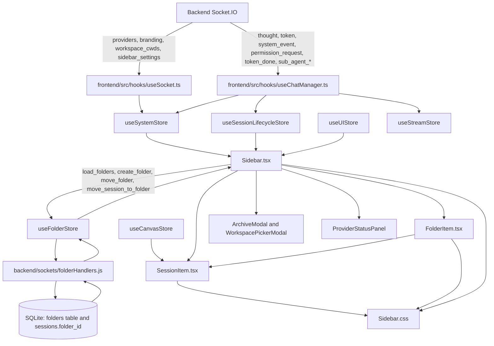

# Feature Doc - Sidebar Rendering

AcpUI's sidebar renders the provider-scoped chat tree: provider stacks, folders, root sessions, forked sessions, sub-agent sessions, real-time status classes, workspace launch controls, archive access, and provider status panels. The implementation is split across React components, Zustand stores, Socket.IO event handlers, CSS state classes, and folder persistence contracts.

Agents working in this area need the exact rendering contract because a small mismatch between `session.provider`, `folder.providerId`, `folderId`, `forkedFrom`, and runtime stream flags can hide sessions or place them in the wrong part of the tree.

---

## Overview

### What It Does

- Renders one provider stack per `ProviderSummary` in `useSystemStore.orderedProviderIds`, with a default provider fallback when backend provider metadata is unavailable.
- Displays root folders and root sessions for the expanded provider, and renders nested folder trees through `FolderItem`.
- Renders forked sessions and sub-agent sessions beneath their parent session through `Sidebar.renderChildren` and `FolderItem.renderForkTree`.
- Applies visual state classes from `ChatSession` flags: `active`, `pinned`, `typing`, `unread`, `awaiting-permission`, `awaiting-shell-input`, and `popped-out`.
- Handles drag/drop for moving sessions between folders, moving folders under folders, and dropping sessions or folders back to the provider root.
- Exposes provider-scoped new chat, new folder, archive restore/delete, provider status, sidebar pin, sidebar collapse, search, and resize controls.

### Why This Matters

- The sidebar is the main navigation surface for active, background, forked, archived, and sub-agent work.
- Provider and folder identity are matched in the frontend, so stale or missing `provider` and `providerId` fields create display bugs without throwing runtime errors.
- Streaming, permission, and interactive shell input-wait state are rendered through CSS classes, so store flags must be updated consistently by socket handlers and stream stores.
- Drag/drop updates both backend folder persistence and optimistic frontend session state.
- Search changes the tree shape by flattening matching sessions and hiding folder recursion while the query is active.

### Architectural Role

The sidebar is a frontend rendering and interaction layer. It consumes backend data through Socket.IO, stores normalized state in Zustand, persists small UI preferences in `localStorage`, and emits folder/session/archive actions back to backend socket handlers. Folder persistence is backed by `backend/database.js` and `backend/sockets/folderHandlers.js`.

---

## How It Works - End-to-End Flow

### 1. Socket Bootstrap Loads Provider, Workspace, Branding, and Sidebar Settings

File: `frontend/src/hooks/useSocket.ts` (Function: `getOrCreateSocket`)

The socket singleton registers metadata listeners once and writes them into `useSystemStore`. Sidebar rendering depends on `providers`, `workspace_cwds`, `branding`, and `sidebar_settings`.

```typescript
// FILE: frontend/src/hooks/useSocket.ts (Function: getOrCreateSocket)
_socket.on('providers', (data) => {
  useSystemStore.getState().setProviders(data.defaultProviderId || null, data.providers || []);
});
_socket.on('workspace_cwds', (data) => {
  useSystemStore.getState().setWorkspaceCwds(data.cwds);
});
_socket.on('branding', (data) => {
  if (data.providerId) useSystemStore.getState().setProviderBranding(data);
  else useSystemStore.setState({ branding: data });
});
_socket.on('sidebar_settings', (data) => {
  useSystemStore.getState().setDeletePermanent(data.deletePermanent);
  useSystemStore.getState().setNotificationSettings(data.notificationSound, data.notificationDesktop);
});
```

The provider list becomes `effectiveProviders` inside `Sidebar`, and workspace entries determine whether the primary new chat control starts immediately or opens `WorkspacePickerModal`.

### 2. Initial Session Metadata Loads Into the Session Lifecycle Store

File: `frontend/src/hooks/useChatManager.ts` (Hook: `useChatManager`)
File: `frontend/src/store/useSessionLifecycleStore.ts` (Action: `handleInitialLoad`)

`useChatManager` calls `handleInitialLoad` when a socket is available. The store emits `load_sessions`, normalizes model fields, clears runtime startup flags, and builds the notes indicator map used by sidebar row rendering. Notes ownership and socket/DB contracts are documented in `[Feature Doc] - Notes.md`.

```typescript
// FILE: frontend/src/store/useSessionLifecycleStore.ts (Action: handleInitialLoad)
socket.emit('load_sessions', (res: LoadSessionsResponse) => {
  const notesMap: Record<string, boolean> = {};
  res.sessions.forEach((s: ChatSession & { hasNotes?: boolean }) => {
    if (s.hasNotes) notesMap[s.id] = true;
  });
  set({
    sessions: res.sessions.map((s: ChatSession) => applyModelState(
      { ...s, isTyping: false, isWarmingUp: false },
      { currentModelId: s.currentModelId, modelOptions: s.modelOptions }
    )),
    sessionNotes: notesMap
  });
});
```

### 3. Folder Metadata Loads Once on Sidebar Mount

File: `frontend/src/components/Sidebar.tsx` (Component: `Sidebar`, Effect: `loadFolders`)
File: `frontend/src/store/useFolderStore.ts` (Action: `loadFolders`)
File: `backend/sockets/folderHandlers.js` (Function: `registerFolderHandlers`, Socket event: `load_folders`)

`Sidebar` calls `loadFolders` on mount. The store emits `load_folders` without a provider filter; folders carry `providerId`, and `Sidebar` filters them per provider during render.

```typescript
// FILE: frontend/src/store/useFolderStore.ts (Action: loadFolders)
loadFolders: () => {
  const socket = useSystemStore.getState().socket;
  socket?.emit('load_folders', (res: { folders?: Folder[] }) => {
    if (res.folders) set({ folders: res.folders });
  });
}
```

```javascript
// FILE: backend/sockets/folderHandlers.js (Function: registerFolderHandlers, Socket event: load_folders)
socket.on('load_folders', async (callback) => {
  const folders = await getAllFolders();
  callback?.({ folders });
});
```

### 4. Sidebar Derives Provider, Search, Root Session, and Root Folder State

File: `frontend/src/components/Sidebar.tsx` (Component: `Sidebar`, Derived state: `currentExpandedId`, `filteredSessions`, `rootSessions`, `rootFolders`)

The visible provider is resolved from `expandedProviderId`, `activeProviderId`, `defaultProviderId`, or the first provider. A null `expandedProviderId` still displays the active/default provider through `currentExpandedId`.

```typescript
// FILE: frontend/src/components/Sidebar.tsx (Component: Sidebar, Derived state)
const currentExpandedId = expandedProviderId || activeProviderId || defaultProviderId || effectiveProviders[0]?.providerId;
const filteredSessions = searchQuery
  ? sessions.filter(s => s.name.toLowerCase().includes(searchQuery.toLowerCase()))
  : sessions;
const rootSessions = filteredSessions.filter(s => !s.folderId && !s.forkedFrom && !s.isSubAgent);
const rootFolders = folders.filter(f => !f.parentId);
```

Search changes the input to provider rendering: when `searchQuery` is set, provider sessions use all matching sessions instead of only root sessions, and folder rendering is skipped.

### 5. Provider Stacks Render the Expanded Provider and Collapsed Activity Summaries

File: `frontend/src/components/Sidebar.tsx` (Component: `Sidebar`, Render block: `effectiveProviders.map`)

For each provider, `Sidebar` computes root sessions, root folders, and activity indicators. The expanded provider renders workspace controls, utility controls, the folder/session tree, and `ProviderStatusPanel`. A collapsed provider renders only sessions that are typing or unread.

```tsx
// FILE: frontend/src/components/Sidebar.tsx (Component: Sidebar, Render block: effectiveProviders.map)
const isExpanded = currentExpandedId === p.providerId;
const pSessions = (searchQuery ? filteredSessions : rootSessions)
  .filter(s => (s.provider || activeProviderId || defaultProviderId || 'default') === p.providerId);
const pFolders = isExpanded ? rootFolders.filter(f => f.providerId === p.providerId) : [];
const allPSessions = sessions.filter(s => (s.provider || activeProviderId || defaultProviderId || 'default') === p.providerId);
const isTyping = allPSessions.some(s => s.isTyping);
const hasUnreadResponse = !isExpanded && !isTyping && allPSessions.some(s => s.hasUnreadResponse);
```

Provider stack headers toggle `setExpandedProviderId(isExpanded ? null : p.providerId)`. The displayed label is `p.branding?.title || p.label || p.providerId`.

### 6. Workspace and Utility Controls Stay Inside the Expanded Provider Content

File: `frontend/src/components/Sidebar.tsx` (Handlers: `handlePrimaryNew`, `handleNew`, `handleCreateFolderSubmit`, `handleShowArchives`)
File: `frontend/src/components/WorkspacePickerModal.tsx` (Component: `WorkspacePickerModal`)
File: `frontend/src/components/ArchiveModal.tsx` (Component: `ArchiveModal`)

The primary new chat button uses the only workspace directly, opens `WorkspacePickerModal` when multiple workspaces exist, or starts without a cwd when none exist. The new folder modal calls `createFolder(name, null, currentExpandedId || null)`. Archive actions emit provider-scoped archive socket events using `currentExpandedId`.

```typescript
// FILE: frontend/src/components/Sidebar.tsx (Handlers: handleNew, handleCreateFolderSubmit)
const handleNew = (cwd?: string, agent?: string) => {
  if (currentExpandedId) useSystemStore.setState({ activeProviderId: currentExpandedId });
  handleNewChat(socket, undefined, cwd, agent);
};

createFolder(name, null, currentExpandedId || null);
```

### 7. FolderItem Recursively Renders Child Folders and Folder Sessions

File: `frontend/src/components/FolderItem.tsx` (Component: `FolderItem`, Function: `renderForkTree`)
File: `frontend/src/store/useFolderStore.ts` (Action: `toggleFolder`)

`FolderItem` reads `expandedFolderIds` and folder actions from `useFolderStore`. It renders child folders recursively and renders direct child sessions whose `folderId` equals the folder ID and whose `forkedFrom` is not set.

```tsx
// FILE: frontend/src/components/FolderItem.tsx (Component: FolderItem)
const isExpanded = expandedFolderIds.has(folder.id);
const childFolders = folders.filter(f => f.parentId === folder.id);
const childSessions = sessions.filter(s => s.folderId === folder.id && !s.forkedFrom);

{isExpanded && (
  <div className="folder-children">
    {childFolders.map(cf => <FolderItem key={cf.id} folder={cf} depth={depth + 1} />)}
    {childSessions.map(session => <SessionItem key={session.id} session={session} />)}
  </div>
)}
```

Folder rows use `paddingLeft: depth * 16 + 8`. Folder sessions use `paddingLeft: (depth + 1) * 16`.

### 8. Drag/Drop Moves Sessions and Folders

File: `frontend/src/components/Sidebar.tsx` (Handlers: `handleRootDrop`, `handleDropSession`, `handleDropFolder`)
File: `frontend/src/components/FolderItem.tsx` (Handlers: `handleDrop`, `handleFolderDragStart`, Function: `isDescendant`)
File: `frontend/src/store/useFolderStore.ts` (Actions: `moveSessionToFolder`, `moveFolder`)
File: `backend/sockets/folderHandlers.js` (Socket events: `move_session_to_folder`, `move_folder`)

Session drags use the `DataTransfer` key `session-id`; folder drags use `folder-id`. Dropping on the root `sessions-list` clears the parent folder. Dropping on a folder assigns the target folder. Folder-on-folder drops call `isDescendant` to prevent cycles.

```typescript
// FILE: frontend/src/components/Sidebar.tsx (Handlers: handleDropSession, handleRootDrop)
const handleDropSession = (sessionId: string, folderId: string | null) => {
  moveSessionToFolder(sessionId, folderId);
  useSessionLifecycleStore.setState(state => ({
    sessions: state.sessions.map(s => s.id === sessionId ? { ...s, folderId } : s)
  }));
};
```

```typescript
// FILE: frontend/src/components/FolderItem.tsx (Handler: handleDrop)
if (sessionId) {
  onDropSession(sessionId, folder.id);
} else if (dragFolderId && dragFolderId !== folder.id) {
  if (!isDescendant(dragFolderId, folder.id, folders)) {
    onDropFolder(dragFolderId, folder.id);
  }
}
```

### 9. SessionItem Applies State Classes, Icons, Actions, and Pop-Out Behavior

File: `frontend/src/components/SessionItem.tsx` (Component: `SessionItem`)
File: `frontend/src/components/Sidebar.css` (Classes: `.session-item`, `.typing`, `.unread`, `.awaiting-permission`, `.awaiting-shell-input`, `.popped-out`)
File: `frontend/src/lib/sessionOwnership.ts` (Functions: `isSessionPoppedOut`, `openPopout`, `focusPopout`)

`SessionItem` builds its class string directly from session flags and pop-out ownership. It selects an icon in this order: sub-agent, fork, terminal, normal chat. Terminal presence is derived from `useCanvasStore.terminals`.

```tsx
// FILE: frontend/src/components/SessionItem.tsx (Component: SessionItem)
className={`session-item ${isActive ? 'active' : ''} ${session.isPinned ? 'pinned' : ''} ${session.isTyping ? 'typing' : ''} ${session.hasUnreadResponse ? 'unread' : ''} ${session.isAwaitingPermission ? 'awaiting-permission' : ''} ${session.isAwaitingShellInput ? 'awaiting-shell-input' : ''} ${isSessionPoppedOut(session.id) ? 'popped-out' : ''}`}

{session.isSubAgent ? <Bot />
  : session.forkedFrom ? <GitFork />
  : hasTerminal ? <Terminal />
  : <MessageSquare />}
```

Sub-agent sessions show only a delete action when they are not typing. Regular sessions show pin, rename, settings, pop-out, and archive/delete actions. Permission requests and shell input prompts share the green waiting glow through `.awaiting-permission` and `.awaiting-shell-input`.

### 10. Forks and Sub-Agents Render Beneath Their Parent UI Session

File: `frontend/src/components/Sidebar.tsx` (Function: `renderChildren`, Selectors: `getForksOf`, `getSubAgentsOf`)
File: `frontend/src/components/FolderItem.tsx` (Function: `renderForkTree`)

Root sessions and folder sessions render their descendants through recursive helpers. Both helpers match descendants by UI session ID through `forkedFrom`.

```typescript
// FILE: frontend/src/components/Sidebar.tsx (Selectors: getForksOf, getSubAgentsOf)
const getForksOf = (parentId: string) => filteredSessions.filter(s => s.forkedFrom === parentId && !s.isSubAgent);
const getSubAgentsOf = (parentId: string) => filteredSessions.filter(s => s.isSubAgent && s.forkedFrom === parentId);
```

`parentAcpSessionId` is retained on sub-agent sessions, but the sidebar tree lookup uses `forkedFrom`.

### 11. Stream and Shell Events Update Sidebar State

File: `frontend/src/hooks/useChatManager.ts` (Hook: `useChatManager`, Socket events: `thought`, `token`, `system_event`, `permission_request`, `token_done`, `session_renamed`, `shell_run_prepared`, `shell_run_snapshot`, `shell_run_started`, `shell_run_output`, `shell_run_exit`)
File: `frontend/src/store/useStreamStore.ts` (Actions: `onStreamThought`, `onStreamToken`, `onStreamEvent`, `onStreamDone`)
File: `frontend/src/store/useShellRunStore.ts` (Actions: `upsertSnapshot`, `markStarted`, `appendOutput`, `markExited`)
File: `frontend/src/store/useChatStore.ts` (Action: `handleRespondPermission`)

`useChatManager` routes socket events into `useStreamStore`. Stream actions set `isTyping` for thoughts, tokens, and system events; permission requests set `isAwaitingPermission`; completion clears typing after the queue drains and marks inactive sessions with `hasUnreadResponse`.

```typescript
// FILE: frontend/src/store/useStreamStore.ts (Actions: onStreamToken, onStreamEvent)
useSessionLifecycleStore.setState(state => ({
  sessions: state.sessions.map(s => s.acpSessionId === sessionId ? { ...s, isTyping: true } : s)
}));

useSessionLifecycleStore.setState(state => ({
  sessions: state.sessions.map(s => s.acpSessionId === sessionId ? {
    ...s,
    isTyping: true,
    isAwaitingPermission: event.type === 'permission_request' ? true : s.isAwaitingPermission
  } : s)
}));
```

`handleRespondPermission` clears `isAwaitingPermission` and emits `respond_permission`. Shell run snapshots and output carry `needsInput`; `useChatManager.syncShellInputStateForSession` mirrors any active run for the ACP session into `ChatSession.isAwaitingShellInput`, then shell input and exit events clear it. `handleSessionSelect` clears `hasUnreadResponse` for the selected UI session.

### 12. Sub-Agent Socket Events Materialize Sidebar Sessions Lazily

File: `frontend/src/hooks/useChatManager.ts` (Hook: `useChatManager`, Socket events: `sub_agents_starting`, `sub_agent_started`, `sub_agent_snapshot`, `sub_agent_status`, `sub_agent_invocation_status`, `sub_agent_completed`)
File: `frontend/src/store/useSubAgentStore.ts` (Actions: `startInvocation`, `setInvocationStatus`, `completeInvocation`, `isInvocationActive`, `clearInvocationsForParent`, `addAgent`, `setStatus`, `completeAgent`)

`sub_agents_starting` starts invocation-level state, clears stale parent-linked agent and invocation rows, and removes old sub-agent sidebar sessions only after the backend accepts a new invocation. `sub_agent_started` and `sub_agent_snapshot` register pending sub-agents, including provider-derived fallback model display metadata when a socket payload has no model, while `sub_agent_status` and `sub_agent_invocation_status` keep panel and auto-collapse state synchronized. The sidebar `ChatSession` is created when the first token or sub-agent system event arrives.

```typescript
// FILE: frontend/src/hooks/useChatManager.ts (Handler: wrappedOnStreamToken)
if (pendingSubAgents.has(data.sessionId)) {
  const pending = pendingSubAgents.get(data.sessionId)!;
  pendingSubAgents.delete(data.sessionId);
  const subSession = {
    id: pending.uiId,
    acpSessionId: pending.acpSessionId,
    name: pending.name,
    provider: pending.providerId,
    messages: [],
    isTyping: true,
    isWarmingUp: false,
    model: pending.model,
    currentModelId: pending.model || null,
    modelOptions: pending.modelOptions,
    isSubAgent: true,
    parentAcpSessionId: pending.parentSessionId,
    forkedFrom: pending.parentUiId,
  };
  useSessionLifecycleStore.setState(state => ({ sessions: [...state.sessions, subSession] }));
}
```

### 13. User Selection, Rename, Pin, Delete, Resize, and Collapse Update Stores Immediately

File: `frontend/src/components/Sidebar.tsx` (Handlers: `handleSelect`, `handleRemoveSession`, `onResizeStart`)
File: `frontend/src/store/useSessionLifecycleStore.ts` (Actions: `handleSessionSelect`, `handleTogglePin`, `handleRenameSession`)
File: `frontend/src/store/useUIStore.ts` (Actions: `setSidebarOpen`, `setSidebarPinned`, `toggleSidebarPinned`)

Selecting a session calls `handleSessionSelect`, clears unread state, hydrates history when needed, and collapses the sidebar if it is not pinned. Pin and rename update local session state and emit `save_snapshot`. `Sidebar.handleRemoveSession` emits `archive_session` or `delete_session`, removes descendants with matching `forkedFrom`, and clears the active session when the active ID is removed.

```typescript
// FILE: frontend/src/store/useSessionLifecycleStore.ts (Action: handleSessionSelect)
set(state => ({
  activeSessionId: uiId,
  sessions: state.sessions.map(s => s.id === uiId ? { ...s, hasUnreadResponse: false } : s)
}));
```

Sidebar width is persisted under `acpui-sidebar-width`. Pinned state is persisted by `useUIStore` under `isSidebarPinned`.

---

## Architecture Diagram



---

## Critical Contract

The sidebar depends on three contracts: provider identity, tree identity, and runtime status flags.

### Provider Identity Contract

`Sidebar` renders provider stacks from `ProviderSummary.providerId`. Sessions are included in a provider stack when `session.provider` matches the provider ID, with a fallback to the active/default provider for sessions without a provider. Root folders are included only when `folder.providerId` matches the provider ID.

```typescript
// FILE: frontend/src/components/Sidebar.tsx (Provider matching)
const pSessions = (searchQuery ? filteredSessions : rootSessions)
  .filter(s => (s.provider || activeProviderId || defaultProviderId || 'default') === p.providerId);
const pFolders = isExpanded ? rootFolders.filter(f => f.providerId === p.providerId) : [];
```

If `folder.providerId` is missing or mismatched, the folder does not render in provider content. If `session.provider` is missing, the active/default provider fallback controls where the session appears.

### Tree Identity Contract

Root sessions, folder sessions, forks, and sub-agents are mutually distinguished by `folderId`, `forkedFrom`, and `isSubAgent`.

```typescript
// FILE: frontend/src/components/Sidebar.tsx and frontend/src/components/FolderItem.tsx (Tree selectors)
rootSessions = filteredSessions.filter(s => !s.folderId && !s.forkedFrom && !s.isSubAgent);
childSessions = sessions.filter(s => s.folderId === folder.id && !s.forkedFrom);
forks = sessions.filter(s => s.forkedFrom === parentId && !s.isSubAgent);
subAgents = sessions.filter(s => s.isSubAgent && s.forkedFrom === parentId);
```

A fork or sub-agent must use its parent UI session ID in `forkedFrom`. A folder child session must use an existing `folder.id` in `folderId`.

### Runtime Status Contract

`SessionItem` does not compute status. It only maps fields to classes and actions.

```typescript
// FILE: frontend/src/types.ts (Interface: ChatSession, Sidebar-relevant fields)
interface ChatSession {
  id: string;
  acpSessionId: string | null;
  name: string;
  provider?: string | null;
  folderId?: string | null;
  forkedFrom?: string | null;
  isSubAgent?: boolean;
  parentAcpSessionId?: string | null;
  isPinned?: boolean;
  isTyping: boolean;
  isWarmingUp: boolean;
  hasUnreadResponse?: boolean;
  isAwaitingPermission?: boolean;
  isAwaitingShellInput?: boolean;
}
```

The stream layer owns `isTyping`, `hasUnreadResponse`, and `isAwaitingPermission`. Shell run socket handling owns `isAwaitingShellInput` by folding active `ShellRunSnapshot.needsInput` values per ACP session. Session lifecycle actions own selected-session unread clearing, pin sorting, rename state, and hydration.

---

## Configuration / Data Flow

### localStorage Keys

| Key | Owner | Shape | Purpose |
|---|---|---|---|
| `isSidebarPinned` | `frontend/src/store/useUIStore.ts` | String boolean | Initializes `isSidebarOpen` and `isSidebarPinned`; updated by `setSidebarPinned` and `toggleSidebarPinned`. |
| `acpui-expanded-folders` | `frontend/src/store/useFolderStore.ts` | JSON array of folder IDs | Initializes and persists `expandedFolderIds`. |
| `acpui-sidebar-width` | `frontend/src/components/Sidebar.tsx` | Numeric string | Restores the sidebar width when open. |
| `isAutoScrollDisabled` | `frontend/src/store/useUIStore.ts` | String boolean | Stored in the same UI store, not used by sidebar rendering. |

### Socket Events

| Direction | Event | Owner | Purpose |
|---|---|---|---|
| Backend to frontend | `providers` | `useSocket.getOrCreateSocket` | Sets provider order, default provider, and provider summaries. |
| Backend to frontend | `branding` | `useSocket.getOrCreateSocket` | Sets global or provider branding. |
| Backend to frontend | `workspace_cwds` | `useSocket.getOrCreateSocket` | Provides workspace choices for new chat. |
| Backend to frontend | `sidebar_settings` | `useSocket.getOrCreateSocket` | Sets archive/delete mode and notification settings. |
| Backend to frontend | `session_renamed` | `useChatManager` | Updates a session title by UI session ID. |
| Backend to frontend | `thought`, `token`, `system_event`, `permission_request`, `token_done` | `useChatManager`, `useStreamStore` | Drives typing, unread, permission, and stream completion flags. |
| Backend to frontend | `shell_run_prepared`, `shell_run_snapshot`, `shell_run_started`, `shell_run_output`, `shell_run_exit` | `useChatManager`, `useShellRunStore` | Drives shell run state and mirrors interactive input-wait prompts into `isAwaitingShellInput`. |
| Backend to frontend | `sub_agents_starting`, `sub_agent_started`, `sub_agent_snapshot`, `sub_agent_status`, `sub_agent_invocation_status`, `sub_agent_completed` | `useChatManager`, `useSubAgentStore` | Maintains invocation-level and agent-level sub-agent state plus lazy sidebar sessions. |
| Frontend to backend | `load_folders`, `create_folder`, `rename_folder`, `delete_folder`, `move_folder`, `move_session_to_folder` | `useFolderStore`, `folderHandlers.js` | Persists folder tree changes. |
| Frontend to backend | `save_snapshot` | `useSessionLifecycleStore`, `useStreamStore`, `useChatStore` | Persists session metadata after pin, rename, stream completion, or permission response. |
| Frontend to backend | `archive_session`, `delete_session`, `list_archives`, `restore_archive`, `delete_archive` | `Sidebar` | Handles sidebar archive/delete UI. |

### Persistence Data

File: `backend/database.js` (Table: `folders`, Functions: `getAllFolders`, `createFolder`, `renameFolder`, `deleteFolder`, `moveFolder`, `moveSessionToFolder`)

The `folders` table stores `id`, `name`, `parent_id`, `position`, `created_at`, and `provider_id`. Session folder membership is stored on `sessions.folder_id`. `deleteFolder` reparents child folders and sessions to the deleted folder's parent. `moveSessionToFolder` updates `sessions.folder_id` by UI session ID.

### Rendering Pipeline

1. Backend folder rows and session rows are loaded through socket callbacks.
2. `useSystemStore`, `useSessionLifecycleStore`, `useFolderStore`, `useUIStore`, and `useCanvasStore` hold current frontend state.
3. `Sidebar` derives provider-scoped session and folder lists.
4. `FolderItem` recursively expands folders based on `expandedFolderIds`.
5. `Sidebar.renderChildren` and `FolderItem.renderForkTree` recursively render forks and sub-agents.
6. `SessionItem` maps flags to icons, actions, and CSS classes.
7. Shell run `needsInput` snapshots are mirrored into `ChatSession.isAwaitingShellInput` before `SessionItem` renders.
8. `Sidebar.css` supplies responsive layout, drag-over states, and status animations.

---

## Component Reference

### Frontend Components

| Area | File | Anchors | Purpose |
|---|---|---|---|
| Sidebar shell | `frontend/src/components/Sidebar.tsx` | Component `Sidebar`; handlers `handleSelect`, `handleNew`, `handlePrimaryNew`, `handleShowArchives`, `handleRestore`, `handleRemoveSession`, `handleDropSession`, `handleDropFolder`, `handleRootDrop`, `renderChildren`, `onResizeStart` | Main provider stack, search, workspace, archive, folder, session, drag/drop, resize, and footer renderer. |
| Folder tree | `frontend/src/components/FolderItem.tsx` | Component `FolderItem`; function `renderForkTree`; handlers `handleDrop`, `handleFolderDragStart`, `startEdit`, `saveEdit`; function `isDescendant` | Recursive folder renderer with rename/delete/subfolder controls and folder/session drop targets. |
| Session row | `frontend/src/components/SessionItem.tsx` | Component `SessionItem`; handlers `handleStartEdit`, `handleSaveEdit`; functions `isSessionPoppedOut`, `openPopout`, `focusPopout` | Applies session classes, icons, notes indicator rendering, sub-agent action restrictions, edit mode, and pop-out behavior. Notes ownership: `[Feature Doc] - Notes.md`. |
| Styling | `frontend/src/components/Sidebar.css` | Classes `.sidebar`, `.sessions-list`, `.provider-stack`, `.provider-stack-header`, `.collapsed-running`, `.folder-row`, `.folder-row.drag-over`, `.session-item`, `.typing`, `.unread`, `.awaiting-permission`, `.awaiting-shell-input`, `.popped-out`, `.sidebar-resize-handle`; keyframes `breatheGlow`, `greenBreatheGlow` | Layout, responsive behavior, status animations, drag-over feedback, and row states. |
| Archive modal | `frontend/src/components/ArchiveModal.tsx` | Component `ArchiveModal` | Lists, filters, restores, and deletes archive folder entries passed by `Sidebar`. |
| Workspace picker | `frontend/src/components/WorkspacePickerModal.tsx` | Component `WorkspacePickerModal` | Lets the user choose a workspace cwd and optional agent when multiple workspaces exist. |
| Provider status | `frontend/src/components/ProviderStatusPanel.tsx` | Component `ProviderStatusPanel`; prop `providerId` | Renders provider status inside expanded provider content. |

### Stores and Hooks

| Area | File | Anchors | Purpose |
|---|---|---|---|
| Socket bootstrap | `frontend/src/hooks/useSocket.ts` | Function `getOrCreateSocket`; hook `useSocket`; events `providers`, `branding`, `workspace_cwds`, `sidebar_settings` | Loads provider/workspace/branding/settings data used by the sidebar. |
| Chat event routing | `frontend/src/hooks/useChatManager.ts` | Hook `useChatManager`; handlers for `session_renamed`, `token_done`, `shell_run_prepared`, `shell_run_snapshot`, `shell_run_started`, `shell_run_output`, `shell_run_exit`, `sub_agents_starting`, `sub_agent_started`, `sub_agent_snapshot`, `sub_agent_status`, `sub_agent_invocation_status`, `sub_agent_completed`; local map `pendingSubAgents`; helper `syncShellInputStateForSession` | Routes stream, shell, and sub-agent events into stores that drive sidebar state. |
| Sessions | `frontend/src/store/useSessionLifecycleStore.ts` | Store `useSessionLifecycleStore`; actions `handleInitialLoad`, `handleSessionSelect`, `handleNewChat`, `handleTogglePin`, `handleRenameSession`, `setSessions` | Holds session list, active session, notes indicator map, selection behavior, pin sorting, and rename persistence. Notes ownership: `[Feature Doc] - Notes.md`. |
| Folders | `frontend/src/store/useFolderStore.ts` | Store `useFolderStore`; actions `loadFolders`, `createFolder`, `renameFolder`, `deleteFolder`, `moveFolder`, `moveSessionToFolder`, `toggleFolder`; constant `EXPANDED_KEY` | Holds folder tree and expanded state, emits folder socket events, and applies optimistic folder/session updates. |
| UI | `frontend/src/store/useUIStore.ts` | Store `useUIStore`; actions `setSidebarOpen`, `setSidebarPinned`, `toggleSidebarPinned`, `setExpandedProviderId`, `setSettingsOpen` | Holds sidebar open/pinned state, expanded provider state, and session settings modal target. |
| System | `frontend/src/store/useSystemStore.ts` | Store `useSystemStore`; actions `setProviders`, `setProviderBranding`, `setWorkspaceCwds`, `setDeletePermanent`, `setProviderStatus`, `getBranding` | Holds provider order, provider summaries, workspace list, delete mode, and provider status data. |
| Canvas | `frontend/src/store/useCanvasStore.ts` | Store `useCanvasStore`; field `terminals` | Lets `SessionItem` show the terminal icon for sessions with open terminal tabs. |
| Stream | `frontend/src/store/useStreamStore.ts` | Store `useStreamStore`; actions `onStreamThought`, `onStreamToken`, `onStreamEvent`, `onStreamDone`, `ensureAssistantMessage`, `processBuffer` | Sets typing, unread, and permission flags while managing the message stream. |
| Shell runs | `frontend/src/store/useShellRunStore.ts` | Store `useShellRunStore`; actions `upsertSnapshot`, `markStarted`, `appendOutput`, `markExited`; field `ShellRunSnapshot.needsInput` | Holds live shell run state that `useChatManager` mirrors into `isAwaitingShellInput`. |
| Permission response | `frontend/src/store/useChatStore.ts` | Action `handleRespondPermission` | Clears `isAwaitingPermission` and emits `respond_permission`. |

### Backend and Persistence

| Area | File | Anchors | Purpose |
|---|---|---|---|
| Folder socket API | `backend/sockets/folderHandlers.js` | Function `registerFolderHandlers`; events `load_folders`, `create_folder`, `rename_folder`, `delete_folder`, `move_folder`, `move_session_to_folder` | Backend folder CRUD and move event handlers. |
| Database | `backend/database.js` | Table `folders`; functions `getAllFolders`, `createFolder`, `renameFolder`, `deleteFolder`, `moveFolder`, `moveSessionToFolder`; session fields `folder_id`, `provider` | Stores folder hierarchy, folder provider ownership, and session folder membership. |
| Prompt completion | `backend/sockets/promptHandlers.js` | Socket event `token_done` | Emits completion events consumed by `useChatManager` and `useStreamStore`. |
| Title updates | `backend/services/acpTitleGenerator.js` | Socket event `session_renamed` | Emits UI session title updates consumed by `useChatManager`. |
| Sub-agents | `backend/mcp/subAgentInvocationManager.js` | Socket event `sub_agent_started` | Emits sub-agent metadata consumed by `useChatManager`. |

---

## Gotchas

1. **`expandedProviderId` is not the only expansion source**

   `Sidebar` uses `currentExpandedId = expandedProviderId || activeProviderId || defaultProviderId || firstProvider`. A null `expandedProviderId` still displays the active/default provider.

2. **Folders require `providerId` to render in provider content**

   Root folders are filtered with `folder.providerId === p.providerId`. A folder with a missing or mismatched `providerId` is present in `useFolderStore.folders` but absent from the provider stack.

3. **`load_folders` returns every folder**

   The backend `load_folders` handler does not accept a provider filter. Provider scoping is a frontend render filter based on each folder's `providerId`.

4. **Search flattens sessions and hides folders**

   With `searchQuery` set, provider sessions are sourced from all matching `filteredSessions`, folder rendering is skipped, and recursive fork rendering from `Sidebar.renderChildren` is skipped. Matching folder sessions, forks, and sub-agent sessions can appear as direct search results.

5. **Sub-agent nesting uses `forkedFrom`, not `parentAcpSessionId`**

   The sidebar tree selectors use `isSubAgent && s.forkedFrom === parentId`. `parentAcpSessionId` is useful metadata, but it does not place the row in the tree.

6. **`moveSessionToFolder` only emits from the store**

   `useFolderStore.moveSessionToFolder` emits the backend event. `Sidebar.handleDropSession` performs the optimistic local `session.folderId` update. Calling the store action directly does not update `useSessionLifecycleStore.sessions`.

7. **Folder deletion reparents instead of discarding children**

   `useFolderStore.deleteFolder` and `backend/database.js` move child folders and child sessions to the deleted folder's parent. Do not assume folder deletion clears every descendant to root.

8. **Cycle prevention is local to folder-on-folder drops**

   `FolderItem.isDescendant` prevents dropping a folder into its own descendant. Root drops and session drops do not need that check.

9. **Sub-agent rows do not use a `.sub-agent` CSS class**

   Sub-agent behavior is controlled by `session.isSubAgent` inside `SessionItem`. Styling comes through icon choice and restricted actions, not a dedicated row class.

10. **Collapsed provider unread state is suppressed while typing exists**

   `hasUnreadResponse` for the provider header is computed only when the provider is collapsed and no session in that provider is typing. Collapsed content still lists sessions with `isTyping` or `hasUnreadResponse`.

11. **Permission state is a session flag plus a timeline response**

   `useStreamStore.onStreamEvent` sets `isAwaitingPermission` on permission requests. `useChatStore.handleRespondPermission` clears the flag and annotates the matching permission step with the selected response.

12. **Interactive shell input state is separate from typing**

   A shell command can still be typing while also waiting for stdin. `useChatManager.syncShellInputStateForSession` sets `isAwaitingShellInput` from active `ShellRunSnapshot.needsInput` values so `.awaiting-shell-input` can override the normal blue typing glow with the green waiting glow.

---

## Unit Tests

### Frontend Tests

| File | Test names / describe blocks | Coverage |
|---|---|---|
| `frontend/src/test/Sidebar.test.tsx` | `renders session list with pinned status indicators`; `applies typing class when a session is typing`; `renders a typing session outside the provider content when collapsed`; `renders an unread session outside the provider content when collapsed`; `marks a collapsed provider header as unread when one of its chats has an unread response`; `applies awaiting-permission class when a session is awaiting permission`; `filters sessions by search input`; `new folder button opens the app modal and creates a folder`; `drag and drop session to root calls moveSessionToFolder with null`; `deleting a parent session also removes its forks from the session list`; `forked sessions render indented under parent`; `renders resize handle when sidebar is open`; `restores width from localStorage` | Sidebar rendering, state classes, collapsed provider summaries, search, workspace controls, archive modal, new folder modal, root drag/drop, fork cascade removal, pop-out class, and resize persistence. |
| `frontend/src/test/SidebarExtended.test.tsx` | `renders session items in the correct provider stack`; `filters sessions based on search input`; `handles "New Chat" click`; `toggles pinned state of sidebar` | Provider stack rendering with mocked child components and top-level interactions. |
| `frontend/src/test/FolderItem.test.tsx` | `renders folder name`; `shows child count`; `expands on click to show children`; `enters rename mode on right-click`; `saves rename on Enter`; `handles drop of session onto folder`; `handles drop of folder onto folder`; `renders fork-indent for forked sessions inside folders`; `shows fork arrow for forked sessions` | Folder recursion, counts, rename flow, drag/drop callbacks, and fork rendering inside folders. |
| `frontend/src/test/SessionItem.test.tsx` | `has active class when isActive is true`; `uses the shell input waiting class when an interactive shell needs input`; `calls onSelect when clicked`; `enters edit mode when rename button is clicked`; `shows only delete button for sub-agent when not typing`; `hides delete button for sub-agent when typing`; `shows "Archive Chat" when deletePermanent is false`; `shows "Delete Chat" when deletePermanent is true`; `shows GitFork icon when session has forkedFrom`; `shows Terminal icon when session has a terminal in canvas store`; `fork icon takes priority over terminal icon when session has both forkedFrom and a terminal` | Session row classes, shell input-wait class, action gating, delete/archive title, icon priority, and terminal indicator. |
| `frontend/src/test/useFolderStore.test.ts` | `createFolder emits and updates local state`; `deleteFolder reparents sub-folders and sessions`; `loadFolders emits and sets folders`; `renameFolder emits and updates local state`; `moveFolder emits and updates local state`; `moveSessionToFolder emits socket event`; `toggleFolder manages expanded set` | Folder store socket calls, optimistic state, reparenting, and expansion persistence state. |
| `frontend/src/test/useChatManager.test.ts` | `marks the session as awaiting shell input from shell output and clears it on exit`; `handles "sub_agents_starting" - clears old sidebar sessions immediately`; `handles "sub_agent_started" event and stamps invocationId on in-progress ToolStep at index 0`; `handles "sub_agent_invocation_status" event`; `handles "sub_agent_status" with invocationId by updating agent and invocation state`; `moves waiting sub-agents back to running on token events`; `passes terminal sub-agent completion statuses through to the store`; `creates lazy sub-agent session with provider on first token`; `creates lazy sub-agent session with provider on first system_event`; `handles "session_renamed" event`; `handles "token_done" event` | Realtime sidebar updates from title, completion, shell input-wait state, and sub-agent socket events. |
| `frontend/src/test/useStreamStore.test.ts` | `onStreamToken queues text and triggers typewriter`; `onStreamDone marks message as finished and saves snapshot` | Stream-driven typing and completion behavior used by sidebar state classes. |

### Backend Tests

| File | Test names / describe blocks | Coverage |
|---|---|---|
| `backend/test/folderHandlers.test.js` | `load_folders returns all folders`; `create_folder creates and returns folder`; `create_folder defaults name to New Folder`; `rename_folder calls db and returns success`; `delete_folder calls db and returns success`; `move_folder calls db and returns success`; `move_session_to_folder calls db and returns success`; error path tests for each event; null parent/folder ID tests | Backend folder socket contract used by `useFolderStore` and drag/drop. |
| `backend/test/database-exhaustive.test.js` | Folder operation coverage through `renameFolder`, `moveFolder`, `getAllFolders`, `moveSessionToFolder`, `deleteFolder` | Database folder functions and failure paths. |

### Targeted Test Commands

```bash
# Frontend sidebar rendering and store coverage
cd frontend
npx vitest run src/test/Sidebar.test.tsx src/test/SidebarExtended.test.tsx src/test/FolderItem.test.tsx src/test/SessionItem.test.tsx src/test/useFolderStore.test.ts src/test/useChatManager.test.ts src/test/useStreamStore.test.ts

# Backend folder socket coverage
cd backend
npx vitest run test/folderHandlers.test.js
```

---

## How to Use This Guide

### For Implementing or Extending Sidebar Features

1. Start with `frontend/src/components/Sidebar.tsx` and identify whether the feature belongs to provider stacks, folder rendering, session rows, root drag/drop, utility controls, or footer controls.
2. Check the owning store before adding component state. Use `useSessionLifecycleStore` for sessions, `useFolderStore` for folders, `useUIStore` for sidebar UI state, `useSystemStore` for provider/workspace/config data, and `useCanvasStore` for terminal indicators.
3. If the feature affects session row visuals, update `SessionItem` and `Sidebar.css` together and add tests in `SessionItem.test.tsx` or `Sidebar.test.tsx`.
4. If the feature affects folder state, update `useFolderStore`, `FolderItem`, `backend/sockets/folderHandlers.js`, and relevant frontend/backend tests.
5. If the feature affects stream or sub-agent indicators, trace through `useChatManager` and `useStreamStore` before changing `Sidebar`.
6. Keep provider-specific examples out of this generic doc. Use provider IDs and placeholder names in code and tests.

### For Debugging Sidebar Issues

1. **Session missing from provider stack:** Inspect `session.provider`, `activeProviderId`, `defaultProviderId`, `folderId`, `forkedFrom`, and `isSubAgent`. Root sessions require no `folderId`, no `forkedFrom`, and no `isSubAgent`.
2. **Folder missing:** Inspect `folder.providerId` and `folder.parentId`. Provider content renders root folders only when `folder.providerId` matches the provider ID.
3. **Folder session missing:** Inspect `session.folderId` and verify it matches an existing `folder.id`. Expand the folder by checking `useFolderStore.expandedFolderIds`.
4. **Fork or sub-agent misplaced:** Inspect `forkedFrom`. The value must be the parent UI session ID.
5. **Typing glow missing:** Inspect `session.isTyping` and confirm `useStreamStore.onStreamToken`, `onStreamThought`, or `onStreamEvent` receives the ACP session ID matching `session.acpSessionId`.
6. **Unread marker missing:** Inspect `session.hasUnreadResponse`, active session ID, and `useStreamStore.onStreamDone`. Collapsed provider headers do not show unread class while any session in that provider is typing.
7. **Permission glow stuck or missing:** Inspect `session.isAwaitingPermission`, `useStreamStore.onStreamEvent`, and `useChatStore.handleRespondPermission`.
8. **Shell input glow missing or stuck:** Inspect `session.isAwaitingShellInput`, `useShellRunStore.runs[runId].needsInput`, and `useChatManager.syncShellInputStateForSession` after `shell_run_output`, `shell_run_snapshot`, and `shell_run_exit`.
9. **Drag/drop does not persist:** Check `DataTransfer` keys (`session-id`, `folder-id`), `useFolderStore.moveSessionToFolder`, `useFolderStore.moveFolder`, and backend `folderHandlers.js` events.
10. **Width or pin state resets:** Check `acpui-sidebar-width` and `isSidebarPinned` in `localStorage`.
11. **Search result shape is surprising:** Search intentionally hides folders and recursive child rendering from provider content.

---

## Summary

- `Sidebar` is the provider-scoped orchestrator for sidebar search, provider stacks, workspace controls, archive controls, folders, root sessions, fork nesting, sub-agent nesting, drag/drop, resizing, and footer actions.
- `FolderItem` owns recursive folder rendering, folder actions, folder drop targets, and fork rendering inside expanded folders.
- `SessionItem` owns row state classes, icon priority, edit mode, notes indicator rendering, pop-out behavior, and action restrictions for sub-agents. Notes ownership and persistence contracts live in `[Feature Doc] - Notes.md`.
- `useSessionLifecycleStore`, `useFolderStore`, `useUIStore`, `useSystemStore`, `useCanvasStore`, and `useStreamStore` are all part of the rendering contract.
- Provider matching uses `session.provider` and `folder.providerId`; tree matching uses `folderId`, `forkedFrom`, and `isSubAgent`.
- Realtime status classes come from `isTyping`, `hasUnreadResponse`, `isAwaitingPermission`, `isAwaitingShellInput`, and pop-out ownership.
- Drag/drop uses `session-id` and `folder-id` data transfer keys and persists through `move_session_to_folder` and `move_folder`.
- The critical contract is to keep provider identity, tree identity, and runtime status flags synchronized across socket handlers, stores, and row components.
