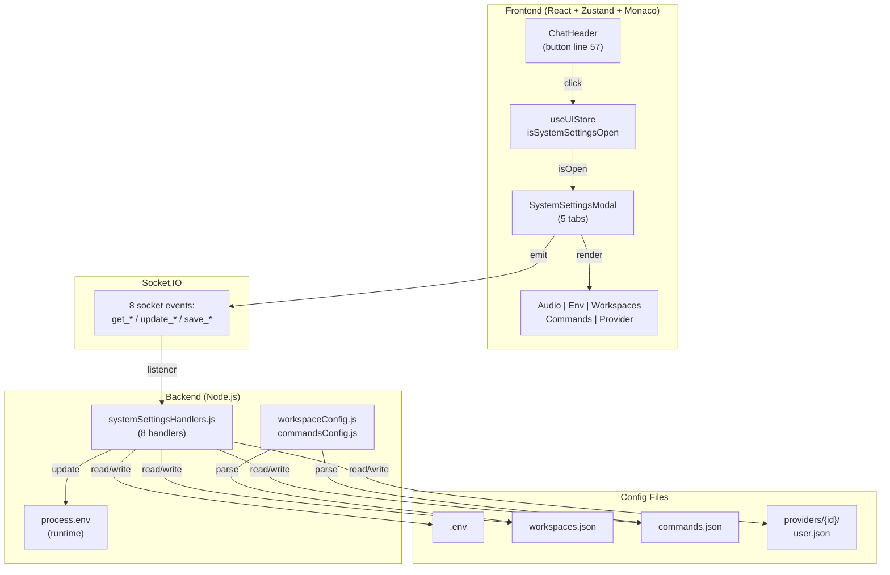

# System Settings Modal

A five-tab configuration hub accessible from the ChatHeader. Provides controls for audio device selection, environment variable management, workspace definitions, custom commands, and provider-specific user configuration—all with real-time Monaco editor support for JSON config files.

**Why this matters:** System Settings is where users configure fundamental runtime behavior (env vars), define workspaces with custom agents, create shortcuts, and manage provider authentication. Understanding its architecture is critical for adding new config tabs, debugging config save/load issues, or extending Monaco editor integration.

---

## Overview

### What It Does

- **Audio device management** — Detect available microphones; select the device for voice-to-text input
- **Environment variable editor** — View all `.env` variables; toggle booleans or edit values; changes apply immediately to runtime
- **Workspace configuration** — Define workspace buttons with custom paths and agents; edit as raw JSON with Monaco editor
- **Custom commands** — Create slash commands (e.g., `/deploy`); edit via Monaco with JSON validation
- **Provider configuration** — Manage provider-specific settings (user.json) with Monaco editor; supports multi-provider selection

### Why This Matters

- **Configurability:** System Settings is the primary UX for non-code configuration; every new runtime setting should have a UI in this modal
- **JSON editor patterns:** Monaco editor integration is reused here; understanding it enables similar features elsewhere (canvas, file explorer)
- **Multi-provider support:** Config files are scoped per-provider; config loading must respect provider isolation
- **Real-time env updates:** Changes to `.env` apply immediately via `process.env[key]` in Node.js; no server restart needed

### Architectural Role

- **Frontend:** React modal component (`SystemSettingsModal.tsx`) with 5 tabs, Zustand state (`useUIStore`)
- **Backend:** 8 socket handlers in `systemSettingsHandlers.js` for config file I/O
- **Service layer:** `workspaceConfig.js`, `commandsConfig.js` handle config parsing and caching

---

## How It Works — End-to-End Flow

### Step 1: ChatHeader Settings Button Opens Modal
**File:** `frontend/src/components/ChatHeader/ChatHeader.tsx` (Lines 56–62)

User clicks the settings icon in the ChatHeader:

```typescript
// FILE: frontend/src/components/ChatHeader/ChatHeader.tsx (Lines 56-62)
<button
  onClick={() => useUIStore.getState().setSystemSettingsOpen(true)}  // LINE 57
  className="icon-button"
  title="System Settings"
>
  <Settings size={18} />
</button>
```

This directly calls `setSystemSettingsOpen(true)` on the store without a hook.

---

### Step 2: Modal Opens and useEffect Triggers Config Fetch
**File:** `frontend/src/components/SystemSettingsModal.tsx` (Lines 1–35)

The modal mounts when `isSystemSettingsOpen` becomes `true`. A `useEffect` dependency fires:

```typescript
// FILE: frontend/src/components/SystemSettingsModal.tsx (Lines 32-67)
useEffect(() => {
  if (!isOpen) return;
  
  // Fetch all config on modal open
  socket.emit('get_env', (response) => {
    setEnvVars(response.vars || {});
    setEnvLoading(false);
  });
  
  socket.emit('get_workspaces_config', (response) => {
    setWsConfig(response.content);
  });
  
  socket.emit('get_commands_config', (response) => {
    setCmdConfig(response.content);
  });
  
  socket.emit('get_provider_config', { providerId: systemProviderId }, (response) => {
    setUserConfig(response.content);
  });
}, [isOpen]);
```

All four config types are fetched **in parallel** on modal open (no waiting between requests).

---

### Step 3: Backend Handlers Respond with Config Contents

#### 3a. `get_env` Handler
**File:** `backend/sockets/systemSettingsHandlers.js` (Lines 23–39)

```javascript
// FILE: backend/sockets/systemSettingsHandlers.js (Lines 23-39)
socket.on('get_env', (callback) => {
  try {
    const content = fs.readFileSync(ENV_PATH, 'utf-8');  // LINE 25 - Reads .env
    const vars = {};
    content.split('\n').forEach(line => {
      const [key, value] = line.split('=');  // LINE 28 - Parse key=value
      if (key && key.trim()) vars[key.trim()] = value?.trim() || '';
    });
    callback({ vars });
  } catch (err) {
    callback({ error: err.message });
  }
});
```

Returns all env variables as a flat object: `{ KEY1: "value1", KEY2: "value2" }`.

#### 3b. `get_workspaces_config` Handler
**File:** `backend/sockets/systemSettingsHandlers.js` (Lines 60–67)

```javascript
// FILE: backend/sockets/systemSettingsHandlers.js (Lines 60-67)
socket.on('get_workspaces_config', (callback) => {
  try {
    const content = fs.readFileSync(WORKSPACES_PATH, 'utf-8');  // LINE 62 - Read workspaces.json
    callback({ content });
  } catch (err) {
    callback({ content: '', error: err.message });
  }
});
```

Returns the raw JSON file content as a string (not parsed).

#### 3c. `get_commands_config` Handler
**File:** `backend/sockets/systemSettingsHandlers.js` (Lines 81–88)

Similar to workspaces: reads `commands.json` and returns raw JSON string.

#### 3d. `get_provider_config` Handler
**File:** `backend/sockets/systemSettingsHandlers.js` (Lines 102–116)

```javascript
// FILE: backend/sockets/systemSettingsHandlers.js (Lines 102-116)
socket.on('get_provider_config', (payload, callback) => {
  try {
    const providerId = payload?.providerId || null;
    const paths = getProviderPaths(providerId);
    let content;
    
    try {
      content = fs.readFileSync(paths.path, 'utf-8');  // LINE 110 - Attempt user.json
    } catch (e) {
      content = fs.readFileSync(paths.example, 'utf-8');  // LINE 112 - Fallback to user.json.example
    }
    callback({ content });
  } catch (err) {
    callback({ error: err.message });
  }
});
```

Attempts to read `providers/{id}/user.json`; falls back to `.example` if missing.

---

### Step 4: Frontend Renders Audio Tab (Default Active)
**File:** `frontend/src/components/SystemSettingsModal.tsx` (Lines 104–127)

```typescript
// FILE: frontend/src/components/SystemSettingsModal.tsx (Lines 104-127)
{activeTab === 'audio' && (
  <div className="tab-content">
    <div className="audio-devices">
      <h4>Microphone Input</h4>
      <select value={selectedAudioDevice} onChange={handleAudioChange}>
        {availableAudioDevices.map(device => (
          <option key={device.deviceId} value={device.deviceId}>
            {device.label}
          </option>
        ))}
      </select>
      <button onClick={fetchAudioDevices}>Refresh Devices</button>
    </div>
  </div>
)}
```

Uses `useVoiceStore` hook to access available devices, selected device, and refresh function. No socket emission (audio devices are discovered by the Web Audio API on the frontend).

---

### Step 5: Frontend Renders Environment Tab
**File:** `frontend/src/components/SystemSettingsModal.tsx` (Lines 129–175)

When user clicks the "Environment" tab:

```typescript
// FILE: frontend/src/components/SystemSettingsModal.tsx (Lines 129-175)
{activeTab === 'env' && (
  <div className="tab-content env-editor">
    {/* Sort env vars: booleans first, then alphabetically */}
    {sortedEnvVars.map(([key, value]) => (
      <div key={key} className="env-row">
        {/* Boolean toggle */}
        {(value === 'true' || value === 'false') && (
          <label>
            <input
              type="checkbox"
              checked={value === 'true'}
              onChange={(e) => {
                const newVal = e.target.checked ? 'true' : 'false';
                setEnvVars(prev => ({ ...prev, [key]: newVal }));
                // Emit update_env immediately on toggle
                socket.emit('update_env', { key, value: newVal });
              }}
            />
            {key}
          </label>
        )}
        
        {/* String input */}
        {value !== 'true' && value !== 'false' && (
          <label>
            {key}:
            <input
              value={value}
              onChange={(e) => setEnvVars(prev => ({ ...prev, [key]: e.target.value }))}
              onBlur={(e) => {
                // Emit update_env on blur (not on every keystroke)
                socket.emit('update_env', { key, value: e.target.value });
              }}
            />
          </label>
        )}
      </div>
    ))}
  </div>
)}
```

**Key behavior:** Booleans toggle instantly; strings emit `update_env` on blur (not on every keystroke).

---

### Step 6: Backend `update_env` Handler Updates `.env` and Runtime
**File:** `backend/sockets/systemSettingsHandlers.js` (Lines 41–58)

When user toggles a boolean or blurs a string input:

```javascript
// FILE: backend/sockets/systemSettingsHandlers.js (Lines 41-58)
socket.on('update_env', (payload, callback) => {
  try {
    const { key, value } = payload;
    
    // Read current .env file
    let content = fs.readFileSync(ENV_PATH, 'utf-8');  // LINE 44
    
    // Replace or append key=value line
    const lines = content.split('\n');
    const index = lines.findIndex(line => line.startsWith(key + '='));
    
    if (index >= 0) {
      lines[index] = `${key}=${value}`;  // LINE 51 - Update existing
    } else {
      lines.push(`${key}=${value}`);  // LINE 52 - Add new
    }
    
    // Write back to .env
    fs.writeFileSync(ENV_PATH, lines.join('\n'), 'utf-8');  // LINE 54
    
    // Update runtime process.env
    process.env[key] = value;  // LINE 56 - Immediate runtime update
    
    callback({ success: true });
  } catch (err) {
    callback({ error: err.message });
  }
});
```

**Critical:** Line 56 updates `process.env[key]` immediately, so changes take effect without restart.

---

### Step 7: Frontend Renders Workspaces Tab
**File:** `frontend/src/components/SystemSettingsModal.tsx` (Lines 177–210)

When user clicks the "Workspaces" tab:

```typescript
// FILE: frontend/src/components/SystemSettingsModal.tsx (Lines 177-210)
{activeTab === 'workspaces' && (
  <div className="tab-content">
    <Editor
      height="500px"
      language="json"
      value={wsConfig}
      onChange={(value) => setWsConfig(value || '')}
      theme="vs-dark"
      options={{ automaticLayout: true }}
    />
    <button onClick={saveWorkspacesConfig}>Save</button>
    {wsSaved && <span className="success-badge">✓ Saved</span>}
    {wsError && <span className="error-badge">{wsError}</span>}
  </div>
)}
```

Monaco editor renders the raw JSON. On save (line 201):

```typescript
// FILE: frontend/src/components/SystemSettingsModal.tsx (Line 201)
const saveWorkspacesConfig = () => {
  try {
    JSON.parse(wsConfig);  // LINE 200 - Validate JSON first
    socket.emit('save_workspaces_config', { content: wsConfig }, (response) => {
      if (response.error) {
        setWsError(response.error);
      } else {
        setWsSaved(true);
      }
    });
  } catch (e) {
    setWsError(e.message);
  }
};
```

---

### Step 8: Backend `save_workspaces_config` Handler Writes File
**File:** `backend/sockets/systemSettingsHandlers.js` (Lines 69–79)

```javascript
// FILE: backend/sockets/systemSettingsHandlers.js (Lines 69-79)
socket.on('save_workspaces_config', (payload, callback) => {
  try {
    const { content } = payload;
    JSON.parse(content);  // LINE 71 - Validate JSON
    fs.writeFileSync(WORKSPACES_PATH, content, 'utf-8');  // LINE 72 - Write to disk
    callback({ success: true });
  } catch (err) {
    callback({ error: err.message });
  }
});
```

Validates JSON before writing; returns error if invalid.

---

### Step 9: Frontend Renders Commands Tab
**File:** `frontend/src/components/SystemSettingsModal.tsx` (Lines 213–246)

Identical pattern to Workspaces tab: Monaco editor with save button, error/success feedback.

---

### Step 10: Frontend Renders Provider Config Tab
**File:** `frontend/src/components/SystemSettingsModal.tsx` (Lines 249–282)

```typescript
// FILE: frontend/src/components/SystemSettingsModal.tsx (Lines 249-282)
{activeTab === 'provider' && (
  <div className="tab-content">
    {/* Provider selector dropdown */}
    <select value={expandedProviderId || systemProviderId} onChange={...}>
      {/* List of available providers */}
    </select>
    
    {/* Monaco editor for provider's user.json */}
    <Editor
      height="500px"
      language="json"
      value={userConfig}
      onChange={(value) => setUserConfig(value || '')}
      theme="vs-dark"
    />
    <button onClick={saveProviderConfig}>Save</button>
  </div>
)}
```

On save (line 273):

```typescript
// FILE: frontend/src/components/SystemSettingsModal.tsx (Line 273)
socket.emit('save_provider_config', 
  { providerId: systemProviderId, content: userConfig }, 
  (response) => { /* handle response */ }
);
```

---

### Step 11: Backend `save_provider_config` Handler Writes Provider user.json
**File:** `backend/sockets/systemSettingsHandlers.js` (Lines 118–129)

```javascript
// FILE: backend/sockets/systemSettingsHandlers.js (Lines 118-129)
socket.on('save_provider_config', (payload, callback) => {
  try {
    const { providerId, content } = payload;
    JSON.parse(content);  // Validate JSON
    const paths = getProviderPaths(providerId);
    fs.writeFileSync(paths.path, content, 'utf-8');  // Write to providers/{id}/user.json
    callback({ success: true });
  } catch (err) {
    callback({ error: err.message });
  }
});
```

---

### Step 12: User Closes Modal
**File:** `frontend/src/components/SystemSettingsModal.tsx` (Lines 283–296)

Clicking the overlay or close button sets `isSystemSettingsOpen` to `false`, unmounting the modal and clearing state.

---

## Architecture Diagram



**Data Flow:**
1. ChatHeader button → Store update → Modal renders with 5 tabs
2. Modal open → Fetch all configs in parallel via 4 socket events
3. Backend reads from disk, responds with config contents
4. User edits via Monaco (JSON) or toggles/text input (env)
5. On save/blur → Emit update socket → Backend writes to disk + runtime
6. Success/error feedback via callback

---

## The Critical Contract: Config File Shapes & Update Patterns

### Socket Event Request/Response Contract

All config fetch/save operations follow a **callback-first, error-in-response** pattern:

```typescript
// Fetch events (no validation needed from frontend)
socket.emit('get_env', (response) => {
  if (response.error) { /* handle error */ }
  else { setEnvVars(response.vars); }
});

socket.emit('get_workspaces_config', (response) => {
  if (response.error) { /* show error */ }
  else { setWsConfig(response.content); }
});

// Save events (frontend validates JSON first)
try {
  JSON.parse(wsConfig);  // REQUIRED: validate before emit
  socket.emit('save_workspaces_config', { content: wsConfig }, (response) => {
    if (response.error) { /* show error */ }
    else { /* success */ }
  });
} catch (e) {
  // JSON parse failed; show error to user
}
```

### Config File Shapes (Source of Truth)

**Environment Variables** (`.env`)
```
KEY1=value1
KEY2=true
KEY3=false
```

Parsed into: `{ KEY1: "value1", KEY2: "true", KEY3: "false" }` (note: booleans are strings)

**Workspaces Config** (`workspaces.json`)
```json
{
  "workspaces": [
    { "label": "Project-A", "path": "/path/to/repo", "agent": "agent-id", "pinned": true },
    { "label": "Project-B", "path": "/path/to/other", "agent": "agent-id", "pinned": false }
  ]
}
```

**Commands Config** (`commands.json`)
```json
{
  "commands": [
    { "name": "/deploy", "description": "Deploy to production", "prompt": "Deploy the app" },
    { "name": "/test", "description": "Run tests", "prompt": "Run all tests" }
  ]
}
```

**Provider User Config** (`providers/{id}/user.json`)
Provider-specific structure; defined by the provider. Example:
```json
{
  "apiKey": "sk-...",
  "organizationId": "org-...",
  "modelDefaults": { "default": "provider-model-id" }
}
```

### Critical Contract Violations

❌ **What breaks if ignored:**

- **No JSON validation before save:** Frontend emits `save_*` with invalid JSON → Backend catches error, returns it, but frontend showed no warning. User confused.
- **update_env emitted too frequently:** Emitting on every keystroke instead of on blur → 100s of writes to `.env` during fast typing.
- **Env var values not trimmed:** Frontend doesn't trim whitespace → `KEY = value ` writes with spaces, causing "value " instead of "value".
- **Provider config save without providerId:** Frontend doesn't pass `providerId` → Saves to default provider instead of selected provider.
- **Workspaces config not cached after load:** Backend re-reads `workspaces.json` on every request instead of caching → File I/O bottleneck.

---

## Configuration / Provider Support

### Backend Config Path Resolution

All config file paths resolve from environment variables with fallbacks:

```javascript
// FILE: backend/sockets/systemSettingsHandlers.js (Lines 9-11)
const ENV_PATH = path.resolve('.env');
const WORKSPACES_PATH = process.env.WORKSPACES_CONFIG || path.resolve('workspaces.json');
const COMMANDS_PATH = process.env.COMMANDS_CONFIG || path.resolve('commands.json');
```

**How providers override paths:**
- Providers define custom paths in their own `user.json` or via `providerLoader.js`
- Each provider has its own `providers/{id}/user.json` file
- `getProviderPaths(providerId)` resolves the correct path for the selected provider

### Provider-Specific Behavior

**Multi-provider config isolation:**
- Each provider has a dedicated `providers/{id}/user.json`
- Frontend's provider tab dropdown selects which provider's config to display/edit
- Backend's `get_provider_config` and `save_provider_config` accept `providerId` parameter
- If `providerId` is omitted, defaults to the active provider

**Provider config fallback:**
- If `providers/{id}/user.json` doesn't exist, backend reads `providers/{id}/user.json.example`
- This allows new providers to have template configs without requiring `user.json` to exist

---

## Data Flow / Rendering Pipeline

### Environment Variables: Read → Edit → Update → Apply

```
User opens modal
    ↓
emit 'get_env' → backend reads .env file
    ↓
Parse "KEY1=value1\nKEY2=true" into { KEY1: "value1", KEY2: "true" }
    ↓
Frontend sorts (booleans first, then alphabetical)
    ↓
Render toggles for "true"/"false", text inputs for others
    ↓
User changes KEY2 toggle from true → false
    ↓
emit 'update_env' { key: "KEY2", value: "false" }
    ↓
Backend updates .env: "KEY2=false"
    ↓
Backend updates process.env.KEY2 = "false"
    ↓
Next code that reads process.env.KEY2 gets updated value (no restart needed)
```

### Config Files: Fetch → Monaco → Validate → Save → Disk

```
User clicks Workspaces tab
    ↓
emit 'get_workspaces_config' → backend reads workspaces.json as raw string
    ↓
Frontend renders Monaco editor with JSON content
    ↓
User edits JSON: adds new workspace object
    ↓
User clicks Save button
    ↓
Frontend validates: JSON.parse(wsConfig) — throws if invalid
    ↓
If valid, emit 'save_workspaces_config' { content: wsConfig }
    ↓
Backend validates again: JSON.parse(content)
    ↓
Backend writes fs.writeFileSync(WORKSPACES_PATH, content)
    ↓
Return { success: true } via callback
    ↓
Frontend shows "✓ Saved" badge (line 194)
```

---

## Component Reference

### Frontend Files

| File | Key Functions/Exports | Lines | Purpose |
|------|----------------------|-------|---------|
| `frontend/src/components/SystemSettingsModal.tsx` | `SystemSettingsModal` (component) | 1–296 | Main 5-tab modal; socket emit/receive for configs |
| | `useEffect` (config fetch) | 32–67 | Fetch all 4 configs on modal open |
| | Audio tab render | 104–127 | Microphone selection from `useVoiceStore` |
| | Environment tab render | 129–175 | Toggle/input for env vars; `update_env` on blur |
| | Workspaces tab render | 177–210 | Monaco editor + save button for workspaces.json |
| | Commands tab render | 213–246 | Monaco editor + save button for commands.json |
| | Provider tab render | 249–282 | Monaco editor + provider selector for user.json |
| | `saveWorkspacesConfig()` | 201 | JSON validate, emit, handle response |
| | `saveCommandsConfig()` | 237 | JSON validate, emit, handle response |
| | `saveProviderConfig()` | 273 | JSON validate, emit with `providerId`, handle response |
| `frontend/src/components/ChatHeader/ChatHeader.tsx` | Settings button | 56–62 | Opens modal via `setSystemSettingsOpen(true)` |
| `frontend/src/store/useUIStore.ts` | `isSystemSettingsOpen` state | 13, 51 | Boolean flag for modal visibility |
| | `setSystemSettingsOpen()` | 33, 82 | Setter for modal visibility |
| `frontend/src/test/SystemSettingsModal.test.tsx` | Test suite | Full file | 6 test cases (tabs, toggles, saves, close) |

### Backend Files

| File | Key Functions | Lines | Purpose |
|------|------------------|-------|---------|
| `backend/sockets/systemSettingsHandlers.js` | `registerSystemSettingsHandlers()` | 22 | Register all 8 handlers on socket connection |
| | `get_env` handler | 23–39 | Read .env, parse into object |
| | `update_env` handler | 41–58 | Update .env + process.env |
| | `get_workspaces_config` handler | 60–67 | Read workspaces.json as string |
| | `save_workspaces_config` handler | 69–79 | Validate JSON, write to disk |
| | `get_commands_config` handler | 81–88 | Read commands.json as string |
| | `save_commands_config` handler | 90–100 | Validate JSON, write to disk |
| | `get_provider_config` handler | 102–116 | Read provider's user.json (fallback to .example) |
| | `save_provider_config` handler | 118–129 | Validate JSON, write to provider's user.json |
| | `getProviderPaths()` | 13–20 | Resolve provider config file paths |
| `backend/sockets/index.js` | Handler registration call | 102 | Register `systemSettingsHandlers` on connection |
| `backend/services/workspaceConfig.js` | `loadWorkspaces()` | 9–31 | Load & cache workspaces.json, parse JSON, return array |
| `backend/services/commandsConfig.js` | `loadCommands()` | 9–30 | Load & cache commands.json, parse JSON, return array |
| `backend/test/systemSettingsHandlers.test.js` | Test suite | Full file | 8 test cases (I/O, JSON validation, error handling) |

### Zustand Store

| Store | State / Method | Lines | Type | Purpose |
|-------|----------------|-------|------|---------|
| `useUIStore.ts` | `isSystemSettingsOpen` | 13, 51 | `boolean` | Modal visibility state |
| | `setSystemSettingsOpen()` | 33, 82 | `(isOpen: boolean) => void` | Toggle modal |

### Imported Stores

| Store | Used For | Import Line |
|-------|----------|------------|
| `useSystemStore()` | Socket instance, active provider ID | SystemSettingsModal line 11 |
| `useVoiceStore()` | Audio devices, microphone selection | SystemSettingsModal line 17 |

---

## Gotchas & Important Notes

### 1. **Env Var Values Are Strings; Boolean Check Is String Comparison**
**What breaks:** If you check `envVars.DEBUG === true` instead of `envVars.DEBUG === 'true'`, it's always false.

**Why it happens:** `.env` files store everything as text. `process.env.DEBUG` is always a string, even if the value is the word `true`.

**How to avoid it:**
```typescript
// ❌ Wrong
if (process.env.VOICE_ENABLED) { /* ... */ }  // Truthy for any non-empty string, including "false"

// ✅ Correct
if (process.env.VOICE_ENABLED === 'true') { /* ... */ }
```

---

### 2. **Boolean Toggle Emits update_env Immediately; Strings Emit on Blur**
**What breaks:** If you emit `update_env` on every keystroke for text inputs, `.env` gets written hundreds of times during fast typing.

**Why it happens:** Different UX patterns: toggles are discrete (true/false), strings are continuous (many intermediate states).

**How to avoid it:** Keep the dual pattern—toggles emit immediately (line 160), strings emit on blur (line 166):
```typescript
{/* Boolean toggle: emit immediately */}
onChange={(e) => socket.emit('update_env', { key, value: e.target.checked ? 'true' : 'false' })}

{/* String input: emit on blur */}
onBlur={(e) => socket.emit('update_env', { key, value: e.target.value })}
```

---

### 3. **Frontend Must Validate JSON Before Emit; Backend Validates Again**
**What breaks:** If you skip frontend JSON validation, user types invalid JSON, clicks Save, waits for network roundtrip, then sees backend error. Bad UX.

**Why it happens:** Validating locally is instant feedback; backend validation is a safety net.

**How to avoid it:** Always validate before emit (line 200):
```typescript
try {
  JSON.parse(wsConfig);  // Frontend validation
  socket.emit('save_workspaces_config', { content: wsConfig }, ...);
} catch (e) {
  setWsError(e.message);  // Show error immediately
}
```

Backend also validates (systemSettingsHandlers line 71) and returns error if needed.

---

### 4. **Config File Paths Resolve from Env Vars; Test with Overrides**
**What breaks:** Tests write to the real `workspaces.json` if `WORKSPACES_CONFIG` env var is not set during testing.

**Why it happens:** No default isolation; tests must override paths.

**How to avoid it:** In test setup, set environment variables to point to test config files:
```javascript
process.env.WORKSPACES_CONFIG = '/tmp/test-workspaces.json';
process.env.COMMANDS_CONFIG = '/tmp/test-commands.json';
```

---

### 5. **Provider Config Falls Back to .example If user.json Missing**
**What breaks:** If you delete `providers/{id}/user.json` and expect an error, you get the `.example` contents instead.

**Why it happens:** Fallback is intentional—allows new providers to work without requiring `user.json` to exist (line 112).

**How to avoid it:** Understand the fallback chain:
1. Try to read `providers/{id}/user.json`
2. If missing, read `providers/{id}/user.json.example`
3. If both missing, return error

---

### 6. **process.env Update Is Immediate; Code Seeing Old Value Must Restart**
**What breaks:** You change `VOICE_STT_ENABLED=true` in settings, whisper server doesn't start because code already loaded and cached the env var.

**Why it happens:** Node.js code reads `process.env` at module load time, not every time.

**How to avoid it:** If a feature depends on env var being fresh, force a re-read:
```javascript
// ❌ Cached at module load
const STT_ENABLED = process.env.VOICE_STT_ENABLED === 'true';
if (STT_ENABLED) { startWhisperServer(); }

// ✅ Fresh read every time
if (process.env.VOICE_STT_ENABLED === 'true') { startWhisperServer(); }
```

Or: emit a backend event on env change to trigger re-initialization.

---

### 7. **Workspaces & Commands Configs Are Loaded & Cached; Manual Refresh Not Automatic**
**What breaks:** User edits `workspaces.json` via System Settings, clicks Save, but the sidebar still shows old workspaces.

**Why it happens:** `loadWorkspaces()` in `workspaceConfig.js` caches the result (line 10). Save updates the file, but cache is stale.

**How to avoid it:** After saving, either:
- Clear the cache in the backend service
- Emit a socket event to re-load and broadcast new config to frontend
- Frontend should subscribe to a broadcast event when config changes

Currently, no auto-refresh happens—user must refresh the page.

---

### 8. **Multi-Provider Selector Is Optional; If Omitted, Uses Active Provider**
**What breaks:** Frontend doesn't pass `providerId` when saving → Saves to wrong provider.

**Why it happens:** For backward compatibility, handlers default to the current/active provider (line 105).

**How to avoid it:** Always pass `providerId` when multi-provider support is intended:
```typescript
socket.emit('save_provider_config', 
  { providerId: systemProviderId, content: userConfig },  // Include providerId
  (response) => { /* ... */ }
);
```

---

### 9. **Audio Tab Uses useVoiceStore; No Socket Emission (Web Audio API)**
**What breaks:** Audio devices fetched by Web Audio API, not socket. Expect different error patterns than config file operations.

**Why it happens:** Web Audio is client-side; no backend involvement needed.

**How to avoid it:** Don't assume all System Settings tabs follow socket pattern. Audio tab is entirely frontend (`useVoiceStore` and Web Audio).

---

### 10. **Tab State Is Local; Closed Modal Loses Active Tab (Resets to Audio)**
**What breaks:** User clicks "Workspaces" tab, closes modal, reopens it → Back at "Audio" tab.

**Why it happens:** Tab state is local `useState` (line 19), not persisted.

**How to avoid it:** If you need persistent tab selection, store it in Zustand or localStorage.

---

## Unit Tests

### Backend Tests

**File:** `backend/test/systemSettingsHandlers.test.js`

| Test Name | What It Tests | Lines |
|-----------|-------------|-------|
| `handles get_env and error` | Reads .env, parses to object, error case | 32–41 |
| `handles update_env and error` | Updates .env and process.env, error case | 43–53 |
| `handles workspaces_config and error` | Get/save workspaces.json, error case | 55–70 |
| `handles commands_config and error` | Get/save commands.json, error case | 72–84 |
| `save_commands_config errors on invalid JSON` | JSON validation on save | 86–90 |
| `get_provider_config falls back to example file` | Fallback to .example when user.json missing | 92–98 |
| `save_provider_config errors on invalid JSON` | Provider config JSON validation | 100–104 |
| `handles provider_config and error` | Get/save provider user.json, error case | 106–118 |

**Run:** `cd backend && npx vitest run systemSettingsHandlers.test.js`

### Frontend Tests

**File:** `frontend/src/test/SystemSettingsModal.test.tsx`

| Test Name | What It Tests | Lines |
|-----------|-------------|-------|
| `renders and switches tabs` | Modal renders, tab navigation works (5 tabs) | 48–63 |
| `handles environment variable toggle` | Boolean toggle emits `update_env` | 65–74 |
| `handles environment variable input change` | Text input blur emits `update_env` | 76–85 |
| `handles workspace config save` | Monaco editor save → `save_workspaces_config` emit | 87–96 |
| `handles invalid JSON in workspace config` | JSON validation error display | 98–107 |
| `closes when clicking close button` | Modal close button sets state to false | 109–118 |

**Run:** `cd frontend && npx vitest run SystemSettingsModal.test.tsx`

---

## How to Use This Guide

### For Implementing New Config Tabs

1. **Understand the socket pattern:** Fetch on mount (Step 2), save on button click with validation
2. **Add new socket handler** in `backend/sockets/systemSettingsHandlers.js` following `get_*` and `save_*` pattern
3. **Add frontend JSX** in `SystemSettingsModal.tsx` for your new tab (follow Workspaces or Commands pattern)
4. **Add Zustand state** if needed (for form state, errors, saved flags)
5. **Validate JSON/format before save** on the frontend
6. **Add tests** for both backend handler and frontend UI
7. **Update this Feature Doc** with new handler details and gotchas

**Checklist:**
- [ ] Backend handler registered in `systemSettingsHandlers.js` with `socket.on()`
- [ ] Frontend emits correct socket event name and payload
- [ ] Callback response handled correctly (check for errors)
- [ ] Input validation (JSON, required fields, etc.)
- [ ] Error and success feedback shown to user
- [ ] Tests cover happy path and error cases
- [ ] Feature Doc updated with new handler

### For Debugging Issues

1. **Check browser DevTools** (Network tab) to see socket events (names, payloads, responses)
2. **Check server logs** for `[SYSTEM_SETTINGS ERR]` messages (errors logged with `writeLog()`)
3. **Verify file permissions** — does the backend have write access to config files?
4. **Check env var resolution** — does `process.env.WORKSPACES_CONFIG` point to the right file?
5. **Test JSON validity** — copy config content, validate locally with `JSON.parse()`
6. **Verify provider paths** — does `providers/{id}/user.json` exist or `.example` fallback available?

**Debugging checklist:**
- [ ] Socket event emitted with correct payload?
- [ ] Backend handler triggered (check logs)?
- [ ] File I/O succeeded (logs show read/write)?
- [ ] JSON valid (manually test `JSON.parse()`)?
- [ ] Frontend callback fired with response?
- [ ] Error message displayed if callback contains `error`?
- [ ] State updated correctly after response?

---

## Summary

The **System Settings Modal** is a five-tab configuration hub for environment variables, workspaces, commands, and provider settings. Its architecture is built on a **socket-callback pattern** with dual validation (frontend JSON validation + backend validation before file write).

**Key patterns:**
- **Fetch on open:** All 4 configs loaded in parallel via `useEffect`
- **Save with validation:** JSON validated locally, then backend, before file write
- **Immediate runtime update:** `update_env` updates `process.env[key]` immediately (no restart)
- **Provider isolation:** Each provider has its own `user.json`; `providerId` parameter ensures correct provider is edited
- **Monaco editor integration:** Workspaces, Commands, and Provider configs edited as raw JSON with syntax highlighting

**Critical contract:** Config fetch/save always goes through socket callbacks; errors returned in response; frontend validates before save to provide instant feedback.

**Why agents should care:** System Settings is the extensibility point for new runtime configurations. Understanding its socket patterns, validation flow, and multi-provider scoping allows you to add new config tabs, integrate new environment variables, or debug config persistence issues without re-reading the entire codebase.

