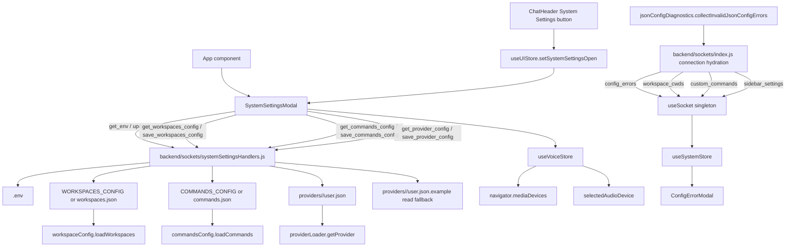

# Feature Doc - System Settings Modal

System Settings Modal is the global configuration surface for audio device selection, environment variables, workspace definitions, custom slash commands, and provider-scoped `user.json` settings. It matters because this modal writes runtime configuration through Socket.IO callbacks while the rest of the app consumes those values through hydrated stores and cached backend services.

## Overview

### What It Does
- Opens from `ChatHeader` through `useUIStore.isSystemSettingsOpen` and remains mounted at the app root in `App`.
- Hydrates tab data on open with socket callback events: `get_env`, `get_workspaces_config`, `get_commands_config`, and `get_provider_config`.
- Renders five tabs: Audio, Environment, Workspaces, Commands, and Provider.
- Saves environment values through `update_env`, writing `.env` and updating `process.env[key]` in the backend process.
- Saves JSON text through `save_workspaces_config`, `save_commands_config`, and `save_provider_config` after frontend and backend JSON validation.
- Surfaces invalid startup/hydration config through the root-level `ConfigErrorModal` fed by the `config_errors` socket event.
- Resolves provider settings from `expandedProviderId`, then `activeProviderId`, then `defaultProviderId`.
- Uses `useVoiceStore` for microphone device listing, selected device persistence, and refresh behavior.

### Why This Matters
- Invalid JSON in workspace, command, provider, registry, or MCP settings is reported during app load and blocks navigation until fixed.
- Provider-scoped config writes must target the selected provider directory, not the active chat by accident.
- Workspace and command loaders cache values, so file writes and runtime hydration are separate concerns.
- This is the primary Socket.IO callback pattern for editable global configuration.
- Audio device selection is browser-local state, while voice enablement is backend-configured state.

Architectural role: frontend modal plus backend Socket.IO configuration handlers; persistence is filesystem-backed, not database-backed.

## How It Works - End-to-End Flow

1. **The app root mounts the modal shell**
   - File: `frontend/src/App.tsx` (Component: `App`)
   - `App` renders `<SystemSettingsModal />` alongside `SessionSettingsModal`, `NotesModal`, and `FileExplorer`. The modal component returns `null` when `useUIStore.isSystemSettingsOpen` is false.

2. **The header opens System Settings**
   - File: `frontend/src/components/ChatHeader/ChatHeader.tsx` (Component: `ChatHeader`, Button title: `System Settings`)
   - The settings icon calls `useUIStore.getState().setSystemSettingsOpen(true)`. In pop-out windows, `ChatHeader` omits the header action buttons.

3. **The modal resolves provider scope**
   - File: `frontend/src/components/SystemSettingsModal.tsx` (Component: `SystemSettingsModal`)
   - Provider config uses `expandedProviderId` from `useUIStore`, then `activeProviderId || defaultProviderId` from `useSystemStore`.

```tsx
// FILE: frontend/src/components/SystemSettingsModal.tsx (Component: SystemSettingsModal, provider selection)
const expandedProviderId = useUIStore(state => state.expandedProviderId);
const systemProviderId = useSystemStore(state => state.activeProviderId || state.defaultProviderId);
const providerId = expandedProviderId || systemProviderId;
```

4. **Open-state hydration fetches all editable text**
   - File: `frontend/src/components/SystemSettingsModal.tsx` (Effect: open hydration `useEffect`)
   - When `isOpen` is true, the modal resets `activeTab` to `audio`, emits config read events, pretty-prints valid JSON, and clears each tab's saved/error state.

```tsx
// FILE: frontend/src/components/SystemSettingsModal.tsx (Effect: open hydration useEffect)
socket.emit('get_env', (res) => { /* setEnvVars */ });
socket.emit('get_workspaces_config', (res) => { /* setWsConfig */ });
socket.emit('get_commands_config', (res) => { /* setCmdConfig */ });
socket.emit('get_provider_config', { providerId }, handleProviderConfig);
```

5. **Socket handlers are registered per connection after config diagnostics pass**
   - File: `backend/sockets/index.js` (Function: `registerSocketHandlers`, Call: `registerSystemSettingsHandlers(io, socket)`)
   - On each Socket.IO connection, the backend emits `config_errors` first. Startup-blocking invalid config stops normal hydration and handler registration for that connection. When diagnostics are clear, the backend emits provider, branding, workspace, sidebar, and command hydration payloads, then registers the system settings handlers.

6. **Environment reads and writes use `.env`**
   - File: `backend/sockets/systemSettingsHandlers.js` (Function: `registerSystemSettingsHandlers`, Socket events: `get_env`, `update_env`)
   - `get_env` reads `<repo>/.env`, skips blank/comment lines, splits each key at the first `=`, and returns `{ vars }`.
   - `update_env` rewrites or appends `key=value`, updates `process.env[key]`, and returns `{ success: true }` or `{ error }`.

7. **Workspace config reads and writes use JSON text**
   - File: `backend/sockets/systemSettingsHandlers.js` (Socket events: `get_workspaces_config`, `save_workspaces_config`)
   - The handler resolves `WORKSPACES_PATH` from `process.env.WORKSPACES_CONFIG || 'workspaces.json'`, reads raw text for the editor, validates JSON on save, and writes the file.
   - File: `backend/services/workspaceConfig.js` (Function: `loadWorkspaces`)
   - Runtime workspace hydration filters entries to `{ label, path, agent, pinned }` and caches the result. When the JSON file cannot be read, `loadWorkspaces` falls back to four env vars: `DEFAULT_WORKSPACE_CWD`, `DEFAULT_WORKSPACE_AGENT`, `WORKSPACE_B_CWD`, and `WORKSPACE_B_AGENT`, producing two hardcoded entries labelled `Project-A` and `Project-B`.

8. **Command config reads and writes use JSON text**
   - File: `backend/sockets/systemSettingsHandlers.js` (Socket events: `get_commands_config`, `save_commands_config`)
   - The handler resolves `COMMANDS_PATH` from `process.env.COMMANDS_CONFIG || 'commands.json'`, reads raw text for the editor, validates JSON on save, and writes the file.
   - File: `backend/services/commandsConfig.js` (Function: `loadCommands`)
   - Runtime custom command hydration retains entries that have both `name` and `description`, preserves all fields on each entry (including `prompt`), and caches the result.

9. **Provider config reads and writes are provider-scoped**
   - File: `backend/sockets/systemSettingsHandlers.js` (Function: `getProviderPaths`, Socket events: `get_provider_config`, `save_provider_config`)
   - `getProviderPaths(providerId)` calls `getProvider(providerId)`, resolves `providers/<provider.id>/user.json`, and uses `user.json.example` as a read fallback.
   - `save_provider_config` validates JSON and writes `user.json` for the resolved provider.

10. **Frontend save buttons validate before emitting**
    - File: `frontend/src/components/SystemSettingsModal.tsx` (Handlers: Workspaces `Save`, Commands `Save`, Provider `Save`)
    - Each Monaco-backed tab runs `JSON.parse` locally. Invalid text sets `Invalid JSON`; valid text emits the matching save event and displays either callback error text or saved state.

11. **Audio selection stays in the browser**
    - File: `frontend/src/store/useVoiceStore.ts` (Actions: `fetchAudioDevices`, `setSelectedAudioDevice`)
    - The Audio tab renders `availableAudioDevices`, calls `fetchAudioDevices` from the refresh button, and stores `selectedAudioDevice` in `localStorage`.

12. **Runtime consumers hydrate through separate socket events**
    - File: `frontend/src/hooks/useSocket.ts` (Function: `getOrCreateSocket`, Socket events: `config_errors`, `workspace_cwds`, `custom_commands`, `sidebar_settings`, `providers`)
    - On connection, `config_errors` populates `useSystemStore.invalidJsonConfigs` first. When the backend does not block hydration, `workspace_cwds` populates `useSystemStore.workspaceCwds`, `custom_commands` populates `customCommands` and local slash commands, and `sidebar_settings` populates notification/delete flags.

13. **Invalid or missing startup config blocks app navigation at load**
    - File: `backend/services/jsonConfigDiagnostics.js` (Function: `collectInvalidJsonConfigErrors`)
    - File: `backend/sockets/index.js` (Socket event: `config_errors`)
    - File: `frontend/src/components/ConfigErrorModal.tsx` (Component: `ConfigErrorModal`)
    - On every socket connection, the backend emits `config_errors` with every invalid startup or hydration config issue it can discover, including missing required enabled-provider `provider.json` files. The frontend stores the list in `useSystemStore.invalidJsonConfigs`; `ConfigErrorModal` renders a non-dismissable `alertdialog` until the list is empty.

## Architecture Diagram



## Critical Contract

### Contract: Socket Callback Shape + Scoped Filesystem Writes

The modal and backend handlers must keep these callback contracts stable:

```text
get_env(callback) -> { vars: Record<string, string> } | { error: string }
update_env({ key, value }, callback?) -> { success: true } | { error: string }
get_workspaces_config(callback) -> { content: string, error?: string }
save_workspaces_config({ content }, callback?) -> { success: true } | { error: string }
get_commands_config(callback) -> { content: string, error?: string }
save_commands_config({ content }, callback?) -> { success: true } | { error: string }
get_provider_config(callback) -> { content: string, error?: string }
get_provider_config({ providerId }, callback) -> { content: string, error?: string }
save_provider_config({ providerId?, content }, callback?) -> { success: true } | { error: string }
```

Startup diagnostics use this separate, non-callback socket event:

```text
config_errors -> { errors: InvalidJsonConfig[] }
InvalidJsonConfig -> { id, label, path, message, blocksStartup? }
```

The key hazards are:
- JSON tabs require frontend validation and backend validation. Frontend validation provides immediate UX; backend validation protects the filesystem write path.
- Provider saves must carry `providerId` when the UI has one. Missing provider scope falls back through `getProvider(null)` to the default provider context.
- Save callbacks report file-write success only. Runtime consumers such as `loadWorkspaces`, `loadCommands`, and `getProvider` have separate cache/load behavior.
- The System Settings read/write path is Socket.IO-based. Backend HTTP routes such as `backend/routes/brandingApi.js` and `backend/routes/mcpApi.js` are not the persistence path for this modal.

## Configuration / Data Flow

### Config Path Resolution

| Config | Source Anchor | Path Rule | Runtime Consumer |
|---|---|---|---|
| Environment variables | `backend/sockets/systemSettingsHandlers.js` (`ENV_PATH`) | `<repo>/.env` | `process.env` and modules that read it |
| Workspace editor | `backend/sockets/systemSettingsHandlers.js` (`WORKSPACES_PATH`) | `process.env.WORKSPACES_CONFIG || 'workspaces.json'`, resolved from repo root | `backend/services/workspaceConfig.js` (`loadWorkspaces`) |
| Command editor | `backend/sockets/systemSettingsHandlers.js` (`COMMANDS_PATH`) | `process.env.COMMANDS_CONFIG || 'commands.json'`, resolved from repo root | `backend/services/commandsConfig.js` (`loadCommands`) |
| Provider settings | `backend/sockets/systemSettingsHandlers.js` (`getProviderPaths`) | `providers/<provider.id>/user.json`; read fallback `user.json.example` | `backend/services/providerLoader.js` (`getProvider`) |
| Provider registry | `backend/services/providerRegistry.js` (`getProviderRegistry`) | `process.env.ACP_PROVIDERS_CONFIG || 'configuration/providers.json'` | Provider list and provider resolution |
| Startup JSON diagnostics | `backend/services/jsonConfigDiagnostics.js` (`collectInvalidJsonConfigErrors`) | Provider registry, enabled provider `provider.json`/`branding.json`/`user.json`, workspace config, command config, and MCP config paths | `config_errors` socket payload and provider startup blocking decisions |
| Example env defaults | `.env.example` | `WORKSPACES_CONFIG=./configuration/workspaces.json`, `COMMANDS_CONFIG=./configuration/commands.json` | Local setup template |

### Environment Tab

```text
get_env callback
  -> envVars state (sorted: booleans first, then alphabetical within each group)
  -> boolean values render toggles; other values render text inputs
  -> toggle click -> updateEnv(key, toggled value) -> update_env (fire-and-forget, no UI callback)
  -> text input change -> local envVars state update only
  -> text input blur -> updateEnv(key, current value) -> update_env (fire-and-forget, no UI callback)
  -> .env rewrite plus process.env[key] update
```

Boolean detection is literal string matching for `true` and `false`. All environment values remain strings. The `update_env` socket event is emitted without a UI callback; env save errors are not surfaced as visible messages in the modal.

### JSON Editor Tabs

```text
get_*_config callback
  -> raw content string
  -> JSON.stringify(JSON.parse(content), null, 2) when parsable
  -> Monaco editor state
  -> local JSON.parse on Save
  -> save_*_config socket event
  -> backend JSON.parse
  -> filesystem write
  -> callback saved/error state
```

### Provider Config Merge Point

Provider settings are stored in `user.json`, but runtime provider config is built by `backend/services/providerLoader.js` (`getProvider`) from `provider.json`, optional `branding.json`, and optional `user.json`. The modal edits only the `user.json` portion.

### Audio Tab

```text
useVoiceStore.availableAudioDevices
  -> Audio tab select options
  -> setSelectedAudioDevice(deviceId)
  -> localStorage selectedAudioDevice

Refresh button
  -> fetchAudioDevices()
  -> navigator.mediaDevices.enumerateDevices()
  -> audioinput devices only
  -> unlabeled devices assigned label: 'Unknown Microphone'
```

## Component Reference

### Frontend

| Area | File | Anchors | Purpose |
|---|---|---|---|
| App Shell | `frontend/src/App.tsx` | `App`, `<SystemSettingsModal />` | Mounts the modal component at the root |
| Header Entry | `frontend/src/components/ChatHeader/ChatHeader.tsx` | `ChatHeader`, Button title `System Settings`, `setSystemSettingsOpen(true)` | Opens the modal from the main header |
| Modal UI | `frontend/src/components/SystemSettingsModal.tsx` | `SystemSettingsModal`, open hydration `useEffect`, `updateEnv`, `activeTab` | Five-tab UI, socket callbacks, frontend JSON validation |
| UI State | `frontend/src/store/useUIStore.ts` | `isSystemSettingsOpen`, `setSystemSettingsOpen`, `expandedProviderId`, `setExpandedProviderId` | Modal visibility and provider focus state |
| System State | `frontend/src/store/useSystemStore.ts` | `socket`, `invalidJsonConfigs`, `setInvalidJsonConfigs`, `activeProviderId`, `defaultProviderId`, `workspaceCwds`, `customCommands` | Socket reference, startup config diagnostics, provider scope, hydrated runtime config |
| Socket Hydration | `frontend/src/hooks/useSocket.ts` | `getOrCreateSocket`, `config_errors`, `workspace_cwds`, `custom_commands`, `sidebar_settings`, `providers` | Receives connection-time runtime config payloads and diagnostic errors |
| Config Error Modal | `frontend/src/components/ConfigErrorModal.tsx` | `ConfigErrorModal`, `invalidJsonConfigs`, `role="alertdialog"` | Blocks app navigation when invalid or missing startup config is reported |
| Voice State | `frontend/src/store/useVoiceStore.ts` | `AudioDevice`, `fetchAudioDevices`, `setSelectedAudioDevice`, `selectedAudioDevice` | Audio device enumeration and selected microphone persistence |

### Backend

| Area | File | Anchors | Purpose |
|---|---|---|---|
| Socket Registration | `backend/sockets/index.js` | `registerSocketHandlers`, `registerSystemSettingsHandlers(io, socket)`, `config_errors`, `workspace_cwds`, `custom_commands`, `sidebar_settings` | Emits config diagnostics first, registers handlers after diagnostics pass, and blocks hydration for startup-critical invalid config |
| JSON Diagnostics | `backend/services/jsonConfigDiagnostics.js` | `collectInvalidJsonConfigErrors`, `hasStartupBlockingJsonConfigError` | Checks startup/hydration config files and returns user-visible invalid-config issues, including missing required provider definitions |
| Settings Handlers | `backend/sockets/systemSettingsHandlers.js` | `registerSystemSettingsHandlers`, `getProviderPaths`, `get_env`, `update_env`, `get_workspaces_config`, `save_workspaces_config`, `get_commands_config`, `save_commands_config`, `get_provider_config`, `save_provider_config` | Reads and writes env/workspace/command/provider config files |
| Workspace Runtime Loader | `backend/services/workspaceConfig.js` | `loadWorkspaces` | Loads, normalizes, and caches workspace definitions; falls back to `DEFAULT_WORKSPACE_CWD/AGENT` and `WORKSPACE_B_CWD/AGENT` env vars when JSON file is missing |
| Command Runtime Loader | `backend/services/commandsConfig.js` | `loadCommands` | Loads, filters, and caches custom commands |
| Provider Loader | `backend/services/providerLoader.js` | `getProvider`, `resetProviderLoaderForTests` | Merges provider config with `user.json` overrides |
| Provider Registry | `backend/services/providerRegistry.js` | `getProviderRegistry`, `resolveProviderId`, `getProviderEntry` | Resolves enabled provider ids and provider paths |
| Route Layer Check | `backend/routes/brandingApi.js`, `backend/routes/mcpApi.js` | `/api/branding/icons`, `/api/branding/manifest.json`, `/api/mcp/tools`, `/api/mcp/execute` | Provider/config-related HTTP routes; not System Settings persistence |

### Configuration

| File | Anchors | Purpose |
|---|---|---|
| `.env.example` | `WORKSPACES_CONFIG`, `COMMANDS_CONFIG`, `ACP_PROVIDERS_CONFIG` | Documents default local config-file locations |
| `configuration/workspaces.json.example` | `workspaces` | Example workspace list shape |
| `configuration/commands.json.example` | `commands` | Example custom command list shape |
| `configuration/providers.json.example` | `defaultProviderId`, `providers[].id`, `providers[].path` | Example provider registry shape |
| `providers/<provider>/user.json` | Provider-specific user overrides | Target file for Provider tab saves |
| `providers/<provider>/user.json.example` | Provider-specific defaults | Read fallback for Provider tab |

## Gotchas

1. **Invalid or missing startup config is a blocking UI state**
   - `config_errors` feeds `ConfigErrorModal`, which has no dismiss action. Fixing the file requires a backend restart when the affected loader caches or startup state has already run, then a frontend reconnect/reload to receive an empty diagnostic list.

2. **Save callbacks do not refresh runtime hydration events**
   - `save_workspaces_config` and `save_commands_config` write files and return callback status. They do not emit `workspace_cwds` or `custom_commands` to connected clients.

3. **Workspace and command loaders cache values**
   - `loadWorkspaces` and `loadCommands` keep module-level `cached` values. File writes and cache refresh are separate lifecycle events. Saving new workspace or command config via `save_workspaces_config` / `save_commands_config` updates the file but the in-memory cache retains old data until process restart. Additionally, if the workspace JSON file is absent on first load, `loadWorkspaces` falls back to the `DEFAULT_WORKSPACE_CWD/AGENT` and `WORKSPACE_B_CWD/AGENT` env vars and caches those results—subsequent saves to the file will not be picked up until restart.

4. **Provider config is loaded through providerLoader cache**
   - `getProvider` caches merged provider config. Saving `user.json` writes the file; active provider config objects keep their loaded values until the loader cache is reset or the process starts with fresh state.

5. **Config path constants are evaluated at module import**
   - `WORKSPACES_PATH` and `COMMANDS_PATH` are constants in `systemSettingsHandlers.js`. Editing `WORKSPACES_CONFIG` or `COMMANDS_CONFIG` through the Environment tab does not change those constants inside the loaded module.

6. **Provider tab follows sidebar-expanded provider first**
   - `expandedProviderId` wins over `activeProviderId` and `defaultProviderId`. A sidebar provider expansion changes which provider `user.json` the modal reads and writes.

7. **The env parser is intentionally simple**
   - `get_env` ignores comments and blank lines, splits at the first `=`, and returns strings. It does not unquote values or parse shell syntax.

8. **Env keys are used in a regular expression**
   - `update_env` constructs a `RegExp` from the key. Keep editable keys in conventional env-var form: uppercase letters, digits, and underscores.

9. **Audio device selection is local browser state**
   - `selectedAudioDevice` is persisted in `localStorage`. Backend STT availability is driven by `voice_enabled` and `VOICE_STT_ENABLED`, not by this select box.

10. **Provider config read supports two call signatures**
   - `get_provider_config(callback)` and `get_provider_config({ providerId }, callback)` are both valid. Frontend sends `{ providerId }` when it has a resolved provider scope.

11. **Monaco is not the contract**
   - Tests mock `@monaco-editor/react` with a textarea. The contract is string content plus save callbacks, not Monaco editor internals.

## Unit Tests

### Frontend

- `frontend/src/test/SystemSettingsModal.test.tsx`
  - `renders and switches tabs`
  - `handles environment variable toggle`
  - `handles environment variable input change`
  - `handles workspace config save`
  - `handles invalid JSON in workspace config`
  - `closes when clicking close button`
- `frontend/src/test/ChatHeader.test.tsx`
  - `handles "System Settings" button click`
  - `hides sidebar menu and action buttons in pop-out mode`
- `frontend/src/test/useVoiceStore.test.ts`
  - `updates selected audio device and persists to localStorage`
  - `fetchAudioDevices updates state from navigator.mediaDevices`
  - `fetchAudioDevices handles errors gracefully`
  - `fetchAudioDevices labels unknown devices`
- `frontend/src/test/useSocket.test.ts`
  - `handles "config_errors" event`
  - `handles "workspace_cwds" event`
  - `handles "providers" event`
  - `handles "sidebar_settings" event`
  - `handles "custom_commands" event`
- `frontend/src/test/ConfigErrorModal.test.tsx`
  - `renders nothing when there are no invalid JSON configs`
  - `renders a blocking alert with every invalid JSON config`

### Backend

- `backend/test/systemSettingsHandlers.test.js`
  - `handles get_env and error`
  - `handles update_env and error`
  - `handles workspaces_config and error`
  - `handles commands_config and error`
  - `save_commands_config errors on invalid JSON`
  - `get_provider_config falls back to example file when user.json missing`
  - `save_provider_config errors on invalid JSON`
  - `handles provider_config and error`
- `backend/test/workspaceConfig.test.js`
  - `loads workspaces from JSON config file`
  - `falls back to env vars when config file does not exist`
  - `filters out entries without label or path`
  - `defaults pinned to false`
  - `resolves WORKSPACES_CONFIG relative to project root, not CWD`
- `backend/test/commandsConfig.test.js`
  - `loads commands from JSON config file`
  - `returns empty array when config file does not exist`
  - `filters out entries without name or description`
- `backend/test/jsonConfigDiagnostics.test.js`
  - `returns no errors when loaded JSON config files are valid`
  - `lists every malformed config file it can discover`
  - `reports a malformed provider registry and skips provider directory discovery`
- `backend/test/sockets-index.test.js`
  - `registers all modular handlers on connection`
  - `emits config_errors on connection`
  - `blocks normal hydration when startup JSON config is invalid`
  - `preserves existing diagnostics when runtime config loading fails`
  - `emits sidebar_settings on connection`
  - `emits custom_commands on connection`
  - `emits branding on connection`

## How to Use This Guide

### For implementing/extending this feature
1. Start at `frontend/src/components/SystemSettingsModal.tsx` (`SystemSettingsModal`) and add UI state for the new tab or setting.
2. Add a Socket.IO event in `backend/sockets/systemSettingsHandlers.js` (`registerSystemSettingsHandlers`) with callback responses shaped as `{ success: true }` or `{ error }` for writes, and `{ content }` or `{ vars }` for reads.
3. Resolve file paths from repo root or provider scope using named helpers or constants; avoid hidden CWD dependencies.
4. Validate JSON in the frontend before emitting and in the backend before writing.
5. Update startup diagnostics in `jsonConfigDiagnostics.js` when adding a JSON config that is loaded during app startup or socket hydration.
6. Update runtime hydration if connected clients need immediate store updates, using `backend/sockets/index.js` and `frontend/src/hooks/useSocket.ts` event anchors.
7. Add matching frontend tests in `SystemSettingsModal.test.tsx`, `ConfigErrorModal.test.tsx`, or `useSocket.test.ts`, and backend tests in `systemSettingsHandlers.test.js`, `jsonConfigDiagnostics.test.js`, or `sockets-index.test.js`.

### For debugging issues with this feature
1. Confirm `useUIStore.isSystemSettingsOpen` is true and `App` is mounting `SystemSettingsModal`.
2. Check the resolved provider scope from `expandedProviderId`, `activeProviderId`, and `defaultProviderId`.
3. Inspect the emitted socket event and callback payload: `get_env`, `update_env`, `get_*_config`, or `save_*_config`.
4. Verify `WORKSPACES_CONFIG`, `COMMANDS_CONFIG`, and `ACP_PROVIDERS_CONFIG` values in `.env` or `.env.example`-derived local config.
5. Trace runtime consumers separately: `loadWorkspaces`, `loadCommands`, `getProvider`, and `useSocket` hydration events.
6. For load-time JSON failures, inspect `config_errors`, `useSystemStore.invalidJsonConfigs`, and `ConfigErrorModal`.
7. For audio issues, debug `useVoiceStore.fetchAudioDevices`, `navigator.mediaDevices.enumerateDevices`, and `localStorage.selectedAudioDevice`.

## Summary

- System Settings Modal is a five-tab global configuration surface mounted by `App` and opened by `ChatHeader`.
- The modal reads and writes config through Socket.IO callback events in `systemSettingsHandlers.js`.
- Environment writes update `.env` and `process.env[key]`; JSON tabs write workspace, command, or provider config files after dual validation.
- Provider settings are scoped by `expandedProviderId || activeProviderId || defaultProviderId` and target `providers/<provider.id>/user.json`.
- Runtime stores hydrate through separate connection events handled in `useSocket`.
- Malformed load-time JSON config flows through `jsonConfigDiagnostics`, `config_errors`, `useSystemStore.invalidJsonConfigs`, and the blocking `ConfigErrorModal`.
- Workspace, command, and provider loaders cache values, so file persistence and active runtime state must be reasoned about separately.
- Audio device selection is managed by `useVoiceStore` and browser APIs, with selected device persistence in `localStorage`.
