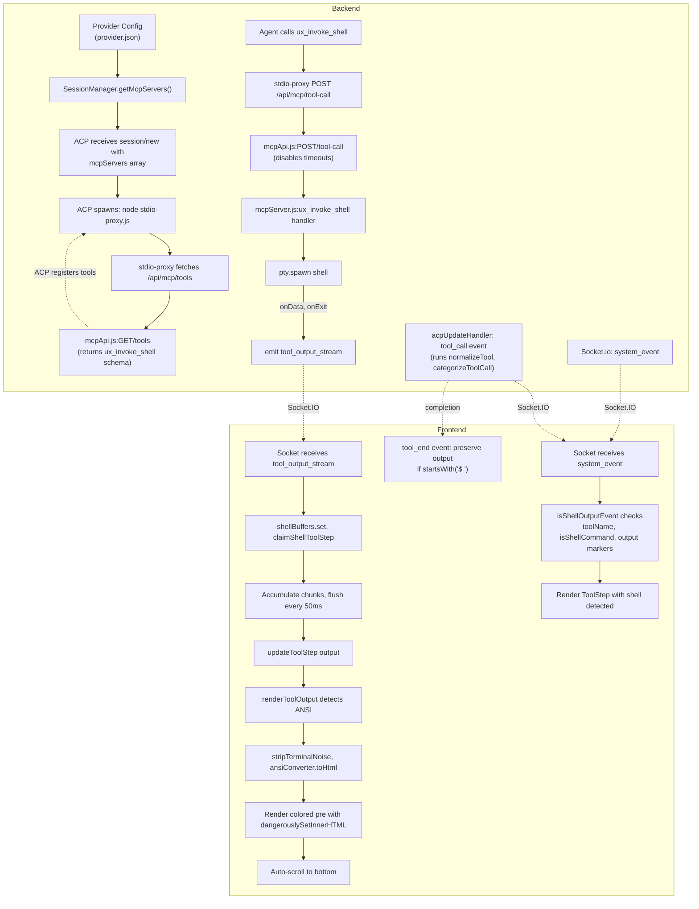

# Feature Doc — ux_invoke_shell System

**The ux_invoke_shell tool is a custom MCP tool injected into every ACP session that allows agents to execute shell commands and stream their output with live coloring and line-by-line updates to the UI.**

This is a critical feature for AcpUI — agents depend on it for running build commands, tests, git operations, and CLI tools. It is also the **most common source of confusion for new provider implementations** because the UI has a very specific contract for recognizing and rendering shell tool calls.

---

## Overview

### What It Does

When an agent calls `ux_invoke_shell`, the backend:
1. Spawns a PTY (pseudo-terminal) for cross-platform shell execution (PowerShell on Windows, Bash elsewhere)
2. Emits live output chunks via Socket.IO (`tool_output_stream` event)
3. Strips ANSI codes only on final exit (preserving them for live rendering)
4. Supports a 30-minute inactivity timeout with heartbeat reset
5. Limits output to a configurable max line count (default 1000)

The frontend:
1. Detects `ux_invoke_shell` tool calls via **multiple fallback strategies**
2. Buffers incoming chunks with a 50ms flush interval (prevents character-by-character re-renders)
3. Renders ANSI-colored output as HTML
4. Supports **parallel shell execution** — multiple shells don't mix output via `shellId` correlation
5. Auto-scrolls to the bottom while outputting
6. **Preserves shell output on `tool_end` event** — doesn't overwrite with summary text if shell output already present

### Why This Matters

- **Live streaming**: Agents see command output in real-time, not waiting for completion
- **Colored output**: Build errors, test results, git diffs are instantly readable
- **Provider agnostic**: Works with any ACP provider that correctly shapes the tool call
- **Parallel safety**: Multiple concurrent shells (e.g., sub-agents) don't corrupt each other's output

---

## How It Works — End-to-End Flow

### 1. **Tool Injection (Backend Setup)**

When a session is created (`session/new` or `session/load`), the backend injects the MCP server config:

**File:** `backend/services/sessionManager.js`

```javascript
// LINES 24-38
export function getMcpServers(providerId) {
  const name = getProvider(providerId).config.mcpName;  // from provider.json (configurable, default "AcpUI")
  if (!name) return [];
  const proxyPath = path.resolve(__dirname, '..', 'mcp', 'stdio-proxy.js');
  return [{
    name,                    // "AcpUI"
    command: 'node',
    args: [proxyPath],
    env: [
      { name: 'ACP_SESSION_PROVIDER_ID', value: String(providerId) },
      { name: 'BACKEND_PORT', value: String(process.env.BACKEND_PORT || 3005) },
      { name: 'NODE_TLS_REJECT_UNAUTHORIZED', value: '0' },
    ]
  }];
}
```

This config is passed to ACP in the `mcpServers` array of `session/new` or `session/load`.

**File:** `backend/sockets/sessionHandlers.js` (Lines 330-332 for new session)

```javascript
result = await acpClient.transport.sendRequest('session/new', {
  cwd: sessionCwd,
  mcpServers: getMcpServers(resolvedProviderId),  // <- Injected here
  ...sessionParams
});
```

---

### 2. **Tool Definition Handshake**

The ACP spawns the stdio proxy (`node stdio-proxy.js`) as a child process. The proxy's first action is to fetch tool definitions from the backend:

**File:** `backend/mcp/stdio-proxy.js` (Lines 25-41)

```javascript
// LINES 25-38: Retry loop (3 attempts, exponential backoff)
function backendFetch(path) {
  return fetch(`http://localhost:${port}${path}`)
    .catch((err) => {
      if (attempt < 3) {
        attempt++;
        return new Promise(r => setTimeout(() => r(backendFetch(path)), 500 * attempt));
      }
      throw err;
    });
}

// LINES 40-54: Main proxy setup
const url = `http://localhost:${process.env.BACKEND_PORT}/api/mcp/tools?providerId=${providerId}`;
const toolRes = await backendFetch(url);
const { tools: toolDefinitions } = await toolRes.json();

const server = new Server({
  capabilities: { tools: { listTools: true, callTool: true } }
});
server.setRequestHandler(ListToolsRequestSchema, async () => ({
  tools: toolDefinitions
}));
server.setRequestHandler(CallToolRequestSchema, async (req) => {
  const response = await fetch('http://localhost:3005/api/mcp/tool-call', {
    method: 'POST',
    headers: { 'Content-Type': 'application/json' },
    body: JSON.stringify({ tool: req.params.name, args: req.params.arguments, providerId })
  });
  return { content: await response.json() };
});
```

The proxy mirrors the tool list from the backend and forwards all tool calls to `/api/mcp/tool-call`.

---

### 3. **Tool Schema & HTTP Endpoint**

The backend defines the tool schema (what ACP sees):

**File:** `backend/routes/mcpApi.js` (Lines 33-40)

```javascript
{
  name: 'ux_invoke_shell',
  description: 'Execute a shell command with live streaming output. Always use this tool for shell commands; never use system shell, bash, or powershell tools when they are present. This is a full replacement for all shell execution. Use only non-interactive commands and adjust pager-prone commands like git diff to be non-interactive, for example git --no-pager diff.',
  inputSchema: {
    type: 'object',
    properties: {
      command: { type: 'string', description: 'The shell command to execute' },
      cwd: { type: 'string', description: 'Working directory (absolute path)' },
    },
    required: ['command'],
  }
}
```

And the endpoint that receives tool calls:

**File:** `backend/routes/mcpApi.js` (Lines 84-106)

```javascript
router.post('/tool-call', async (req, res) => {
  // CRITICAL: Disable all timeouts so long-running commands don't abort
  req.setTimeout(0);      // LINE 85
  res.setTimeout(0);      // LINE 86
  if (req.socket) req.socket.setTimeout(0);  // LINE 87

  const { tool: toolName, args, providerId } = req.body;  // LINE 89

  const handler = tools[toolName];
  if (!handler) {
    res.status(404).json({ error: `Unknown tool: ${toolName}` });
    return;
  }

  try {
    const result = await handler({ ...(args || {}), providerId });  // LINE 99
    res.json(result);
  } catch (err) {
    res.json({ content: [{ type: 'text', text: `Error: ${err.message}` }] });
  }
});
```

**Key Detail:** Lines 85-87 disable HTTP timeouts entirely. Without this, long-running builds/tests will timeout and hang the agent.

---

### 4. **Shell Execution**

When the ACP calls the tool, the backend handler runs:

**File:** `backend/mcp/mcpServer.js` (Lines 64-114)

```javascript
tools.ux_invoke_shell = async ({ command, cwd, providerId }) => {
  const workingDir = cwd || process.env.DEFAULT_WORKSPACE_CWD || process.cwd();  // LINE 66
  const maxLines = getMaxShellResultLines();  // LINE 67 (default 1000)
  const shellId = `shell-${Date.now()}-${Math.random().toString(36).slice(2, 7)}`;  // LINE 71

  return new Promise((resolve) => {
    let output = '';
    let exitCode = 0;

    // Platform detection: Windows → PowerShell, else → Bash
    const shell = process.platform === 'win32' ? 'powershell.exe' : 'bash';  // LINE 78
    const args = process.platform === 'win32'
      ? ['-NoProfile', '-Command', `[Console]::OutputEncoding = [System.Text.Encoding]::UTF8; ${command}`]  // LINE 80
      : ['-c', command];

    // Spawn PTY with ANSI color support
    const proc = pty.spawn(shell, args, {  // LINE 83
      name: 'xterm-256color',  // LINE 84
      cols: 120,
      rows: 30,
      cwd: workingDir,
      env: { ...process.env, TERM: 'xterm-256color', FORCE_COLOR: '1', PYTHONIOENCODING: 'utf-8' },  // LINE 88
    });

    // Emit first chunk: the prompt
    emitToolOutput(`$ ${command}\n`);  // LINE 95

    // Stream all data chunks
    proc.onData((data) => {
      output += data;
      emitToolOutput(data);  // LINE 99
    });

    // On exit, strip ANSI and resolve
    proc.onExit(({ exitCode: code }) => {
      exitCode = code;
      const plain = stripAnsi(output).trim() || '(no output)';  // LINE 105
      const result = exitCode !== 0 ? `${plain}\n\nExit Code: ${exitCode}` : plain;  // LINE 106
      resolve({ content: [{ type: 'text', text: result }] });
    });

    // Inactivity timeout: 30 minutes (resets on each data event = heartbeat)
    let timer = setTimeout(() => { proc.kill(); }, 1800000);  // LINE 111
    proc.onData(() => { clearTimeout(timer); timer = setTimeout(() => { proc.kill(); }, 1800000); });  // LINE 112
  });
};
```

The `emitToolOutput` function (line 91-93):

```javascript
const emitToolOutput = (chunk) => {
  if (io) io.emit('tool_output_stream', { providerId, chunk, maxLines, shellId });  // LINE 92
};
```

This Socket.IO emission is **critical** — it's the live streaming pipeline.

---

### 5. **Tool Call Event Construction (Backend → Frontend)**

When the ACP first reports the tool call, the backend constructs the event that the UI will recognize:

**File:** `backend/services/acpUpdateHandler.js` (Lines 153-188)

```javascript
else if (update.sessionUpdate === 'tool_call') {
  const titleStr = update.title || 'Running tool';  // LINE 162
  const filePath = getFilePathFromUpdate(update);

  let eventToEmit = {  // LINE 170
    providerId,
    sessionId,
    type: 'tool_start',
    id: update.toolCallId,
    title: titleStr,
    filePath,
    output: toolOutput
  };

  // Step 1: Normalize format (provider-specific → standard fields)
  eventToEmit = typeof providerModule.normalizeTool === 'function'
    ? providerModule.normalizeTool(eventToEmit, update)  // LINE 174
    : eventToEmit;

  // Step 2: Categorize (maps tool name to category + metadata)
  const category = typeof providerModule.categorizeToolCall === 'function'
    ? providerModule.categorizeToolCall(eventToEmit)  // LINE 179
    : null;
  if (category) eventToEmit = { ...eventToEmit, ...category };  // LINE 181

  acpClient.io.to('session:' + sessionId).emit('system_event', eventToEmit);  // LINE 183
}
```

The **provider's `normalizeTool()` and `categorizeToolCall()` functions are critical** here — they transform the daemon's raw tool call into the shape the UI expects.

---

### 6. **Shell Detection (Frontend)**

The frontend receives the `system_event` and must determine if it's a shell tool call. It uses **multiple fallback strategies**:

**File:** `frontend/src/components/ToolStep.tsx` (Lines 73-81)

```typescript
const isShellOutputEvent = (event: SystemEvent): boolean => {
  const titleLower = (event.title || '').toLowerCase();
  const idLower = (event.id || '').toLowerCase();
  return event.toolName === 'ux_invoke_shell' ||  // PRIMARY: direct match
    event.isShellCommand === true ||               // PRIMARY: categorization flag
    event.output?.startsWith('$ ') === true ||     // FALLBACK: prompt marker
    titleLower.includes('running shell') ||        // FALLBACK: title text
    idLower.includes('shell');                      // FALLBACK: ID text
};
```

**Priority Order:**
1. `event.toolName === 'ux_invoke_shell'` — Direct match (best)
2. `event.isShellCommand === true` — From `categorizeToolCall()` (best)
3. `event.output?.startsWith('$ ')` — Shell prompt marker (weak)
4. Title/ID contains "shell" — Text matching (very weak)

---

### 7. **Live Output Streaming (Frontend)**

As chunks arrive via `tool_output_stream`, the frontend buffers them:

**File:** `frontend/src/hooks/useChatManager.ts` (Lines 265-303)

```typescript
socket.on('tool_output_stream', (data: { chunk: string; maxLines?: number; shellId?: string }) => {
  if (data.shellId) {
    const shellId = data.shellId;
    if (!shellBuffers.has(shellId)) {
      // First chunk for this shell — claim the matching ToolStep
      shellBuffers.set(shellId, { buffer: '', maxLines: null, timer: null });
      claimShellToolStep(shellId);  // LINE 272
    }
    const entry = shellBuffers.get(shellId)!;
    if (typeof data.maxLines === 'number') {
      entry.maxLines = data.maxLines;
    }
    entry.buffer += data.chunk;  // LINE 278: Accumulate
    entry.buffer = trimShellOutputLines(entry.buffer, entry.maxLines);  // LINE 279
    if (!flushShellBuffer(shellId) && !entry.timer) {
      entry.timer = setInterval(() => {
        flushShellBuffer(shellId);  // Flush every 50ms
        const e = shellBuffers.get(shellId);
        if (e && !e.buffer && e.timer) { clearInterval(e.timer); e.timer = null; shellBuffers.delete(shellId); }
      }, 50);  // LINE 285: Critical interval
    }
  }
});
```

The `shellId` is unique per invocation: `shell-${timestamp}-${random}`. This allows **parallel shells** to not corrupt each other.

**The `claimShellToolStep()` function (Lines 112-137):**

```typescript
const claimShellToolStep = (shellId: string) => {
  useSessionLifecycleStore.setState(state => {
    let globalClaimed = false;
    const newSessions = state.sessions.map(s => {
      if (globalClaimed) return s;
      const msgs = [...s.messages];
      const lastMsg = msgs[msgs.length - 1];
      if (!lastMsg || lastMsg.role !== 'assistant' || !lastMsg.timeline) return s;
      
      let localClaimed = false;
      const timeline = lastMsg.timeline.map(e => {
        if (!localClaimed && e.type === 'tool' && e.event.status === 'in_progress' &&
            e.event.toolName === 'ux_invoke_shell' && !e.event.shellId) {  // LINE 123
          localClaimed = true;
          globalClaimed = true;
          return { ...e, event: { ...e.event, shellId } };  // LINE 126: Stamp shellId
        }
        return e;
      });
      
      if (!localClaimed) return s;
      msgs[msgs.length - 1] = { ...lastMsg, timeline };
      return { ...s, messages: msgs };
    });
    return globalClaimed ? { sessions: newSessions } : state;
  });
};
```

This function finds the first unclaimed in-progress `ux_invoke_shell` tool and stamps the `shellId` on it. Future chunks for this `shellId` route directly to this ToolStep.

**The `flushShellBuffer()` function (Lines 68-108):**

```typescript
const flushShellBuffer = (shellId: string) => {
  let flushed = false;
  const entry = shellBuffers.get(shellId);
  if (!entry || !entry.buffer) return false;

  const chunk = entry.buffer;
  useSessionLifecycleStore.setState(state => {
    let globalFlushed = false;
    const newSessions = state.sessions.map(s => {
      if (globalFlushed) return s;
      const msgs = [...s.messages];
      const msg = msgs[msgs.length - 1];
      if (!msg || msg.role !== 'assistant' || !msg.timeline) return s;

      // Only flush if the target ToolStep (matched by shellId) is still in-progress
      if (!msg.timeline.some(e => e.type === 'tool' && e.event.shellId === shellId && e.event.status === 'in_progress')) return s;

      globalFlushed = true;
      flushed = true;

      const timeline = msg.timeline.map(e =>
        e.type === 'tool' && e.event.shellId === shellId
          ? { ...e, event: { ...e.event, output: trimShellOutputLines((e.event.output || '') + chunk, entry.maxLines) } }  // LINE 95
          : e
      );
      msgs[msgs.length - 1] = { ...msg, timeline };
      return { ...s, messages: msgs };
    });
    return globalFlushed ? { sessions: newSessions } : state;
  });

  if (flushed) {
    entry.buffer = '';
  }
  return flushed;
};
```

This updates the matching ToolStep's output with the buffered chunk.

**The `trimShellOutputLines()` helper (Lines 430-441):**

```typescript
export function trimShellOutputLines(output: string, maxLines?: number | null) {
  if (!output || !Number.isInteger(maxLines) || !maxLines || maxLines <= 0) return output;

  const lines = output.split(/\r?\n/);
  const hasTrailingNewline = /\r?\n$/.test(output);
  const lineCount = hasTrailingNewline ? lines.length - 1 : lines.length;
  if (lineCount <= maxLines) return output;

  const start = lineCount - maxLines;
  const tail = lines.slice(start, hasTrailingNewline ? -1 : undefined).join('\n');
  return hasTrailingNewline ? `${tail}\n` : tail;
}
```

This keeps only the **last N lines** (default 1000) to prevent the UI from drowning in large builds.

---

### 8. **Output Rendering**

When the ToolStep renders, it calls `renderToolOutput()`:

**File:** `frontend/src/components/renderToolOutput.tsx` (Lines 86-91)

```typescript
// ANSI colored output (from MCP shell tool) — render with colors
if (!shellOutput && hasAnsi(output)) {
  const cleaned = stripTerminalNoise(output);  // LINE 88
  const html = ansiConverter.toHtml(cleaned);  // LINE 89
  return <pre className="tool-output-pre ansi-output" dangerouslySetInnerHTML={{ __html: html }} />;  // LINE 90
}
```

Key helper functions:

```typescript
const hasAnsi = (str: string) => /\u001b\[/.test(str);  // LINE 9
const stripTerminalNoise = (str: string) =>
  str.replace(/\u001b\][^\u0007]*\u0007/g, '')           // Remove window title sequences
    .replace(/\u001b\[\?[0-9;]*[a-zA-Z]/g, '')           // Remove mode sequences
    .replace(/\u001b\[[0-9;]*[A-HJ-T]/g, '');            // Remove cursor movement (LINE 14)
```

The **critical distinction**: `stripTerminalNoise` removes cursor/mode sequences but **preserves SGR color codes** (`\u001b\[...m`). This is why output stays colored.

The `AnsiToHtml` library then converts remaining ANSI codes to inline HTML `<span style>` tags.

---

### 9. **Shell Output Preservation on Tool End**

When the tool completes, the ACP sends a `tool_call_update` with `status: 'completed'`. The frontend must **not overwrite** the accumulated shell output with the summary text:

**File:** `frontend/src/store/useStreamStore.ts` (Line 286)

```typescript
output: (existingStep.event.output?.startsWith('$ ') ? existingStep.event.output : output) || existingStep.event.output,
```

This line says: **If the existing output starts with `'$ '` (shell marker), keep it. Otherwise use the new summary output.**

This is **critical** — without it, the entire streamed output would be replaced by the exit code summary.

---

### 10. **Auto-Scroll**

The ToolStep auto-scrolls to the bottom during output:

**File:** `frontend/src/components/ToolStep.tsx` (Lines 88-92)

```typescript
useEffect(() => {
  const outputContainer = outputContainerRef.current;
  if (!outputContainer || isCollapsed || !isShellOutputEvent(step.event)) return;
  outputContainer.scrollTop = outputContainer.scrollHeight;  // LINE 91
}, [isCollapsed, step.event]);
```

This effect runs whenever the event updates, keeping the bottom visible.

---

## Full Stack Architecture Diagram



---

## The Critical Contract: System Event Shape

**This is the #1 cause of confusion for new provider implementations.**

The UI doesn't just look for a tool named `"ux_invoke_shell"` — it looks for a **specific shape** in the `system_event` emitted by the backend. If the event shape is wrong, the UI will not recognize it as a shell call and will not render it with colors and live updates.

### The Full Event Shape the UI Expects

From `frontend/src/types.ts`:

```typescript
interface SystemEvent {
  providerId: string;
  sessionId: string;
  type: 'tool_start' | 'tool_update' | 'tool_end';
  id: string;                    // Unique tool call ID
  title: string;                 // Human-readable title
  status?: string;               // 'in_progress', 'completed', 'failed'
  output?: string;               // Tool output text
  filePath?: string;             // For file operations
  
  // FROM categorizeToolCall() — CRITICAL FOR SHELL DETECTION
  toolName?: string;             // Should be 'ux_invoke_shell' for shell calls
  toolCategory?: string;         // Should be 'shell' for shell calls
  isShellCommand?: boolean;      // Should be true for shell calls
  isFileOperation?: boolean;     // false for shell
  
  // FROM frontend socket handler
  shellId?: string;              // Unique per invocation, stamped by claimShellToolStep
}
```

### How the Provider's normalizeTool() and categorizeToolCall() Matter

**File:** `backend/services/acpUpdateHandler.js` (Lines 172-181)

```javascript
// Step 1: Normalize format (provider-specific → standard fields)
eventToEmit = typeof providerModule.normalizeTool === 'function'
  ? providerModule.normalizeTool(eventToEmit, update)
  : eventToEmit;

// Step 2: Categorize (maps tool name to category + metadata)
const category = typeof providerModule.categorizeToolCall === 'function'
  ? providerModule.categorizeToolCall(eventToEmit)
  : null;
if (category) eventToEmit = { ...eventToEmit, ...category };
```

The provider's two functions **transform the daemon's raw output into the expected shape**.

### How categorizeToolCall() Works

When the backend receives a tool call, it calls the provider's `categorizeToolCall()` function. This function must:
1. Look up the tool name in the provider's configured `toolCategories`
2. Return the category metadata (which includes `isShellCommand: true` for shell tools)

The returned fields are merged onto the `system_event`, so if a provider returns `{ toolCategory: 'shell', isShellCommand: true, isStreamable: true }`, the frontend receives an event with those fields set.

The frontend then sees `event.isShellCommand === true` and recognizes it as a shell call, enabling colored output and live streaming.

---

## Provider Configuration for ux_invoke_shell

A provider must configure three fields in `provider.json` to support shell tools:

### provider.json Fields

**mcpName** (REQUIRED — Configurable)

The MCP server name that the ACP spawns. The backend's `getMcpServers()` function reads this value from the provider config. The default is `"AcpUI"`, but a provider can set a different value.

Example:
```json
{
  "mcpName": "AcpUI"
}
```

This name is passed to the ACP so it knows which MCP server provides the shell tools. The same name appears in the `toolIdPattern`.

**toolIdPattern** (REQUIRED — Provider-Specific)

A pattern that describes how the daemon reports tool call IDs. This varies by provider and ACP implementation.

The pattern uses placeholders:
- `{mcpName}` — substituted with the provider's `mcpName` value
- `{toolName}` — the actual tool name (e.g., `'bash'`, `'ux_invoke_shell'`)

Example patterns:
- `mcp__{mcpName}__{toolName}` — Produces: `mcp__AcpUI__bash`
- `@{mcpName}/{toolName}` — Produces: `@AcpUI/bash`
- `mcp_{mcpName}_{toolName}` — Produces: `mcp_AcpUI_bash`

The provider's `normalizeTool()` function must parse the daemon's reported tool ID using this pattern to extract the actual tool name.

**toolCategories** (REQUIRED — Provider Defines Shell Tools)

Maps tool names (as reported by the daemon) to category metadata. For shell tools, set `"isShellCommand": true` and `"category": "shell"`.

Example:
```json
{
  "toolCategories": {
    "bash": { "category": "shell", "isShellCommand": true, "isStreamable": true },
    "sh": { "category": "shell", "isShellCommand": true, "isStreamable": true }
  }
}
```

The provider's `categorizeToolCall()` function reads this config and returns the metadata, which the backend merges onto the `system_event`. The `isShellCommand: true` flag is **critical** — it's one of the detection strategies the frontend uses to recognize shell calls.

### Provider index.js Functions

A provider must implement two functions to support shell tools:

**normalizeTool(event, update)**

This function receives the raw tool call from the daemon and must extract/normalize the `toolName` field. The implementation depends entirely on how the daemon reports tool calls.

Responsibility:
- Extract the actual tool name from `update.name`, `update.id`, or `event.id` (which contains the raw daemon format)
- Parse the tool name according to the `toolIdPattern` (remove prefixes, extract the core name)
- Return an event with `toolName` set to a value that `toolCategories` can look up

Example behavior (not actual code — shows what a provider must do):
- If daemon sends: `{ name: "mcp__AcpUI__bash" }` 
- Provider extracts: `toolName = 'bash'`
- Returns: `{ ...event, toolName: 'bash' }`

**categorizeToolCall(event)**

This function receives the normalized event and maps the tool name to category metadata.

Responsibility:
- Look up the `toolName` in the provider's configured `toolCategories`
- Return the category metadata (or `null` if not found)
- For shell tools, include `isShellCommand: true` in the return value

Example behavior:
- Input: `{ toolName: 'bash', ... }`
- Lookup in `toolCategories`: finds `{ "category": "shell", "isShellCommand": true, "isStreamable": true }`
- Returns: `{ toolCategory: 'shell', isShellCommand: true, isStreamable: true }`

The backend merges these fields onto the `system_event`, so the frontend receives an event with `isShellCommand: true` and can recognize it as a shell call.

### Provider index.js Functions

**normalizeTool(event, update)**

Extract the actual tool name from the daemon's output:

```javascript
export function normalizeTool(event, update) {
  let toolName = update?.name || event.id || '';
  
  // Strip MCP prefix based on toolIdPattern
  const mcpPrefix = `mcp__${config.mcpName}__`;  // "mcp__AcpUI__"
  if (toolName.startsWith(mcpPrefix)) {
    toolName = toolName.slice(mcpPrefix.length);
  }
  
  // Fallback: extract from title
  if (!toolName && event.title?.includes('bash')) {
    toolName = 'bash';
  }
  
  return { ...event, toolName };
}
```

**categorizeToolCall(event)**

Map the tool name to category + flags:

```javascript
export function categorizeToolCall(event) {
  const { config } = getProvider();
  const toolName = event.toolName;
  if (!toolName) return null;

  const metadata = (config.toolCategories || {})[toolName];
  if (!metadata) return null;

  return {
    toolCategory: metadata.category,
    isFileOperation: metadata.isFileOperation || false,
    isShellCommand: metadata.isShellCommand || false,
    isStreamable: metadata.isStreamable || false
  };
}
```

---

## Data Flow: From Command to Colored Output

### Raw Command Execution

```
input:  command = "npm test"
        cwd = "/home/user/my-app"

shellId = "shell-1704067200000-a1b2c"

emitToolOutput(`$ npm test\n`)
emitToolOutput(`> jest\n`)
emitToolOutput(`\x1b[32mPASS\x1b[0m src/app.test.ts\n`)
```

### Socket.IO Emission (Backend)

```javascript
io.emit('tool_output_stream', {
  providerId: 'some-provider',
  chunk: '\x1b[32mPASS\x1b[0m src/app.test.ts\n',
  maxLines: 1000,
  shellId: 'shell-1704067200000-a1b2c'
});
```

### Buffer Accumulation (Frontend)

```typescript
// First chunk: claim the tool step
shellBuffers.set('shell-1704067200000-a1b2c', {
  buffer: '\x1b[32mPASS\x1b[0m src/app.test.ts\n',
  maxLines: 1000,
  timer: <interval>
});

// Flush every 50ms
flushShellBuffer('shell-1704067200000-a1b2c');
// Updates the ToolStep event.output field
```

### Rendering Pipeline

```typescript
// renderToolOutput receives:
output = '\x1b[32mPASS\x1b[0m src/app.test.ts\n'

// Detection
hasAnsi(output) === true

// Cleaning (preserve SGR color codes, remove cursor sequences)
stripTerminalNoise(output) === '\x1b[32mPASS\x1b[0m src/app.test.ts\n'

// Conversion
ansiConverter.toHtml(cleaned) === '<span style="color: green;">PASS</span> src/app.test.ts\n'

// Render
<pre className="tool-output-pre ansi-output" dangerouslySetInnerHTML={{ __html: html }} />
```

### Result in UI

```
PASS src/app.test.ts
     ↑ (rendered in green)
```

---

## Parallel Shell Support via shellId

The `shellId` mechanism ensures multiple concurrent shells don't corrupt each other:

### Scenario: Two Shells Running in Parallel

```
Frontend state:
{
  timeline: [
    { type: 'tool', event: { toolName: 'ux_invoke_shell', output: '', shellId: null } },
    { type: 'tool', event: { toolName: 'ux_invoke_shell', output: '', shellId: null } }
  ]
}

Backend emits:
tool_output_stream { shellId: 'shell-A-123', chunk: 'Line 1\n', ... }
tool_output_stream { shellId: 'shell-B-456', chunk: 'Different output\n', ... }

Frontend processes:
1. Receive chunk for 'shell-A-123' → claim first unclaimed tool → stamp shellId on first tool
2. Receive chunk for 'shell-B-456' → claim second unclaimed tool → stamp shellId on second tool
3. Future chunks for 'shell-A-123' route to first tool only
4. Future chunks for 'shell-B-456' route to second tool only

Result:
{
  timeline: [
    { type: 'tool', event: { toolName: 'ux_invoke_shell', output: 'Line 1\n', shellId: 'shell-A-123' } },
    { type: 'tool', event: { toolName: 'ux_invoke_shell', output: 'Different output\n', shellId: 'shell-B-456' } }
  ]
}
```

Without `shellId`, both chunks would write to the first in-progress tool, resulting in mixed output.

---

## Gotchas & Important Notes

### 1. **The Provider Must Emit the Right Event Shape**

If a provider's `normalizeTool()` doesn't extract `toolName: 'ux_invoke_shell'` (or equivalent), the UI won't recognize it as a shell call.

**Test**: Log the `system_event` in `acpUpdateHandler.js` (line 183) and verify it has:
- `toolName: 'ux_invoke_shell'` (or `isShellCommand: true` from categorization), OR
- Output that starts with `'$ '`

### 2. **Tool Output Must Start with `$ ` for Fallback Detection**

The first chunk emitted is:

```javascript
emitToolOutput(`$ ${command}\n`);  // LINE 95 in mcpServer.js
```

This `'$ '` prefix is a fallback detection marker. If the provider overrides the output before this marker is stamped, shell detection may fail.

### 3. **ANSI Codes Are Preserved Until tool_end**

The backend strips ANSI codes **only on final exit** (line 105):

```javascript
const plain = stripAnsi(output).trim() || '(no output)';
```

This is intentional — the frontend needs ANSI codes during streaming to render colors. Stripping them early would lose color information.

### 4. **The 30-Minute Inactivity Timeout Resets on Each Data Event**

Lines 111-112:

```javascript
let timer = setTimeout(() => { proc.kill(); }, 1800000);
proc.onData(() => { clearTimeout(timer); timer = setTimeout(() => { proc.kill(); }, 1800000); });
```

This is a **heartbeat mechanism**. If a command produces no output for 30 minutes, it's killed. But if it keeps producing output, it can run indefinitely.

### 5. **HTTP Timeouts Must Be Disabled**

Lines 85-87 in `mcpApi.js`:

```javascript
req.setTimeout(0);
res.setTimeout(0);
if (req.socket) req.socket.setTimeout(0);
```

Without this, long-running builds will timeout at the default Node.js timeout (typically 2 minutes) and hang the agent. This is a **critical gotcha**.

### 6. **Output is Line-Capped to MAX_SHELL_RESULT_LINES**

Default is 1000 lines. Set `MAX_SHELL_RESULT_LINES` env var to override. Older lines are discarded:

```typescript
// frontend/src/hooks/useChatManager.ts, line 430
trimShellOutputLines(output, 1000)  // keeps only last 1000 lines
```

### 7. **Shell Output Preservation on tool_end**

The line:

```typescript
output: (existingStep.event.output?.startsWith('$ ') ? existingStep.event.output : output) || existingStep.event.output
```

**Only works if the output already starts with `'$ '`**. If a provider emits the shell prompt marker in a different format, this preservation will fail.

---

## Component Reference

### Backend Files

| File | Key Functions | Lines | Purpose |
|------|---|---|---|
| `backend/mcp/mcpServer.js` | `getMcpServers()` | 40-53 | Returns MCP server config for injection |
| | `ux_invoke_shell handler` | 64-114 | Spawns PTY, streams output, handles timeout |
| | `emitToolOutput` | 91-93 | Emits `tool_output_stream` event |
| | `stripAnsi` | 29 | Removes ANSI codes on final exit |
| `backend/routes/mcpApi.js` | `GET /api/mcp/tools` | 24-78 | Returns tool schema |
| | `POST /api/mcp/tool-call` | 84-106 | Tool execution endpoint (disables timeouts) |
| `backend/mcp/stdio-proxy.js` | `backendFetch` | 25-38 | Fetches tool defs from backend |
| | `runProxy` | 40-54 | Sets up MCP server, forwards tool calls |
| `backend/services/acpUpdateHandler.js` | `handleUpdate` | 16-302 | Routes ACP updates to UI |
| | `tool_call event construction` | 153-188 | Runs `normalizeTool` and `categorizeToolCall` |
| `backend/services/sessionManager.js` | `getMcpServers` | 24-38 | Creates MCP config with env vars |

### Frontend Files

| File | Key Functions | Lines | Purpose |
|------|---|---|---|
| `frontend/src/components/ToolStep.tsx` | `isShellOutputEvent` | 73-81 | Detects shell tool calls (5 strategies) |
| | Auto-scroll effect | 88-92 | Scrolls to bottom during output |
| | Render | 115-139 | Renders tool output container |
| `frontend/src/components/renderToolOutput.tsx` | `hasAnsi` | 9 | Detects ANSI codes |
| | `stripTerminalNoise` | 14 | Removes cursor sequences (keeps colors) |
| | ANSI rendering | 86-91 | Converts ANSI → HTML and renders |
| `frontend/src/hooks/useChatManager.ts` | `tool_output_stream handler` | 265-303 | Buffers chunks, manages shellBuffers |
| | `claimShellToolStep` | 112-137 | Stamps shellId on first unclaimed shell |
| | `flushShellBuffer` | 68-108 | Flushes buffered chunk to ToolStep |
| | `trimShellOutputLines` | 430-441 | Keeps only last N lines |
| | `flushLegacyBuffer` | 144-168 | Legacy fallback for events without shellId |
| `frontend/src/store/useStreamStore.ts` | `tool_update reducer` | 280-290 | Shell output preservation on tool_end |

### Provider Implementation Files

Each provider must define its own `provider.json` and `index.js` files. See the **Provider Configuration** section above for details on what these files must contain and what the functions must do.

---

## Unit Tests

### Backend Tests

- **`backend/test/mcpApi.test.js`** — Tests tool schema, timeout disabling, tool call forwarding
- **`backend/test/stdio-proxy.test.js`** — Tests tool definition fetching, MCP protocol
- **`backend/test/acpUpdateHandler.test.js`** — Tests tool_call event construction, normalizeTool pipeline
- **`backend/test/subAgentRegistry.test.js`** — Tests sub-agent lifecycle (related to output streaming)
- **`backend/test/sessionHandlers.test.js`** — Tests session creation with mcpServers injection

### Frontend Tests

- **`frontend/src/test/useChatManager.test.ts`** — Comprehensive tests for `tool_output_stream` handling:
  - `handles "tool_output_stream" with shellId` (lines 66-102)
  - `handles "tool_output_stream" without shellId — legacy fallback` (lines 148-175)
  - `handles parallel "tool_output_stream" — two shellIds` (lines 177-220)
- **`frontend/src/test/components/ToolStep.test.ts`** — Tests shell detection and rendering
- **`frontend/src/test/hooks/useStreamStore.test.ts`** — Tests shell output preservation on tool_end

---

## How to Use This Guide

### For Implementing Shell Support in a New Provider

1. Read the **Provider Configuration** section to understand what `provider.json` must contain
2. Study an existing provider's implementation (examine its `provider.json` and `index.js`)
3. Implement `normalizeTool()` to extract the tool name from your daemon's tool call format
   - Understand your daemon's tool ID format (e.g., `mcp__AcpUI__bash`, `@AcpUI/bash`)
   - Parse it according to your `toolIdPattern` to extract the core tool name
   - Return the event with `toolName` set correctly
4. Implement `categorizeToolCall()` to look up the tool name in your `toolCategories` and return category metadata
   - For shell tools, ensure the returned object includes `isShellCommand: true`
5. Set `mcpName`, `toolIdPattern`, and `toolCategories` in `provider.json`
6. Test by running a shell command and checking:
   - The `system_event` in the backend logs (acpUpdateHandler.js:183) has `toolName` or `isShellCommand: true`
   - The frontend receives `tool_output_stream` events with `shellId`
   - Output renders with colors in the UI

### For Debugging Shell Issues

1. **Tool isn't recognized as shell**: Check the `system_event` in logs. Verify `toolName === 'ux_invoke_shell'` OR `isShellCommand === true`.
2. **No live output**: Check `tool_output_stream` events in browser console (`socket.io.on('tool_output_stream')`). Verify `shellId` is present.
3. **Output not colored**: Run `hasAnsi(output)` in browser console on the output. If true but not colored, check that `stripTerminalNoise` doesn't strip SGR codes.
4. **Parallel shells corrupt output**: Check that each chunk has a unique `shellId` and that shells spawn far enough apart for `claimShellToolStep` to work.

---

## Summary

The ux_invoke_shell system is a complete end-to-end pipeline:

1. **Injection**: MCP server injected at session creation
2. **Tool Definition**: Schema provided at ACP startup
3. **Execution**: PTY spawned, output streamed via Socket.IO
4. **Detection**: Frontend recognizes via `toolName` or `isShellCommand` flag
5. **Buffering**: 50ms flush interval prevents UI thrashing
6. **Rendering**: ANSI codes preserved and converted to HTML
7. **Parallel Safety**: `shellId` ensures output isolation
8. **Preservation**: Shell output not overwritten on completion

The **critical contract** is that the provider must emit a `system_event` with either `toolName: 'ux_invoke_shell'` or `isShellCommand: true` for the UI to recognize it. This is implemented via the provider's `normalizeTool()` and `categorizeToolCall()` functions, which must correctly parse the daemon's tool call format and map it to the expected shape.
