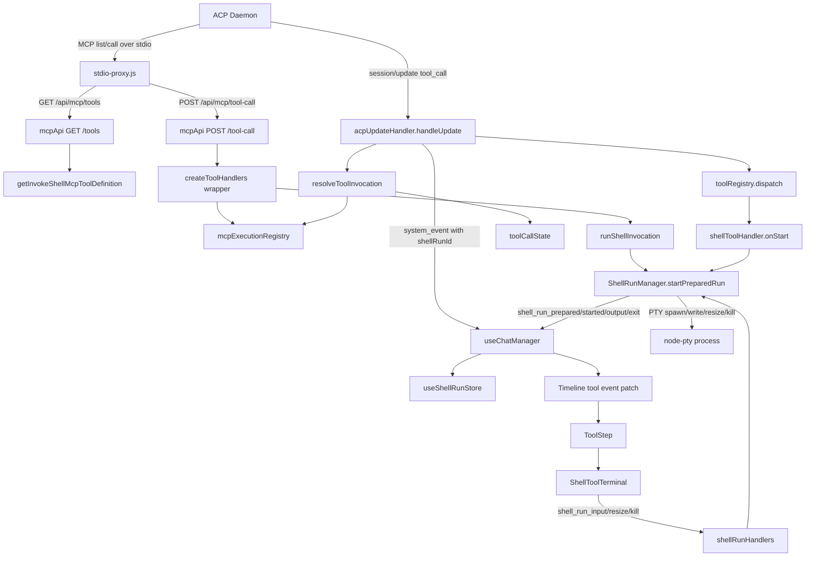

# Feature Doc - ux_invoke_shell System

`ux_invoke_shell` is AcpUI's terminal-backed MCP shell tool. It lets an agent run a shell command through the AcpUI backend while the user watches live PTY output, types into the process, resizes the terminal, or stops the run from the chat timeline.

This feature matters because shell execution crosses the MCP proxy, Tool System V2, Socket.IO, node-pty, Zustand stores, and xterm.js. The fragile part is correlation: MCP execution metadata, ACP `tool_call` updates, shell run IDs, and frontend timeline steps must all describe the same command.

---

## Overview

### What It Does

- Advertises `ux_invoke_shell` as an AcpUI core MCP tool through `GET /api/mcp/tools` when `configuration/mcp.json` enables `tools.invokeShell`.
- Runs shell commands in isolated PTYs through `ShellRunManager`, using PowerShell on Windows and bash on Unix-like platforms.
- Correlates ACP tool updates with backend MCP execution records through `toolInvocationResolver`, `toolCallState`, `mcpExecutionRegistry`, and `shellToolHandler`.
- Emits session-scoped Socket.IO events: `shell_run_prepared`, `shell_run_snapshot`, `shell_run_started`, `shell_run_output`, and `shell_run_exit`.
- Routes frontend stdin, resize, and stop actions through `shell_run_input`, `shell_run_resize`, and `shell_run_kill` socket events.
- Renders a live xterm.js terminal while the run is active and a read-only ANSI-preserving transcript after exit.
- Returns an MCP result only after the shell process exits or is finalized.

### Why This Matters

- Shell commands can be interactive: user input and Ctrl+C flow back into the PTY.
- Concurrent shell calls require separate `runId` values so output never mixes between commands.
- Tool titles and command metadata must remain sticky across provider updates and MCP handler updates.
- The frontend timeline must render shell output through `ShellToolTerminal`, not through generic tool output blocks.
- Socket room validation prevents a client from controlling a shell run for a session it is not watching.

### Architectural Role

`ux_invoke_shell` is a backend-owned MCP tool with a specialized frontend renderer. The backend owns MCP advertisement, request handling, tool-state correlation, PTY lifecycle, and socket controls. The frontend owns live terminal rendering, run snapshot storage, timeline step patching, and user control events.

---

## How It Works - End-to-End Flow

### 1. Session creation injects the MCP proxy

File: `backend/mcp/mcpServer.js` (Function: `getMcpServers`)  
File: `backend/mcp/mcpProxyRegistry.js` (Function: `createMcpProxyBinding`)

When the backend creates or loads an ACP session, `getMcpServers(providerId, { acpSessionId })` returns the stdio MCP server entry for the provider's configured MCP server name. The entry runs `backend/mcp/stdio-proxy.js` with environment values that bind the proxy to a provider/session context.

```javascript
// FILE: backend/mcp/mcpServer.js (Function: getMcpServers)
return [{
  name,
  command: 'node',
  args: [proxyPath],
  env: [
    { name: 'ACP_SESSION_PROVIDER_ID', value: String(provider.id) },
    { name: 'ACP_UI_MCP_PROXY_ID', value: proxyId },
    { name: 'BACKEND_PORT', value: String(process.env.BACKEND_PORT || 3005) },
    { name: 'NODE_TLS_REJECT_UNAUTHORIZED', value: '0' }
  ],
  ...(mcpServerMeta ? { _meta: mcpServerMeta } : {})
}];
```

If the provider has no `config.mcpName`, `getMcpServers` returns an empty list and the ACP daemon does not receive AcpUI MCP tools for that session.

### 2. The stdio proxy advertises the shell tool

File: `backend/mcp/stdio-proxy.js` (Function: `runProxy`, MCP handler: `ListToolsRequestSchema`)  
File: `backend/routes/mcpApi.js` (Route: `GET /api/mcp/tools`)  
File: `backend/mcp/coreMcpToolDefinitions.js` (Function: `getInvokeShellMcpToolDefinition`)

The proxy fetches `/api/mcp/tools` from the backend and registers the returned tool list with the MCP SDK. `GET /api/mcp/tools` includes `getInvokeShellMcpToolDefinition()` only when `isInvokeShellMcpEnabled()` is true.

```javascript
// FILE: backend/mcp/coreMcpToolDefinitions.js (Function: getInvokeShellMcpToolDefinition)
{
  name: ACP_UX_TOOL_NAMES.invokeShell,
  title: 'Interactive shell',
  inputSchema: {
    type: 'object',
    properties: {
      description: { type: 'string' },
      command: { type: 'string' },
      cwd: { type: 'string' }
    },
    required: ['description', 'command']
  },
  _meta: {
    'acpui/concurrentInvocationsSupported': true
  }
}
```

The definition tells the agent that `description` and `command` are required and that concurrent invocations are supported.

### 3. The proxy forwards MCP calls to the backend API

File: `backend/mcp/stdio-proxy.js` (MCP handler: `CallToolRequestSchema`)  
File: `backend/routes/mcpApi.js` (Route: `POST /api/mcp/tool-call`, Functions: `resolveToolContext`, `createToolCallAbortSignal`)

When the ACP daemon calls `ux_invoke_shell`, the proxy posts the tool name, public arguments, provider ID, proxy ID, MCP request ID, and request metadata to `/api/mcp/tool-call`.

`POST /api/mcp/tool-call` resolves provider/session context from `resolveMcpProxy(proxyId)`, disables HTTP request timeouts for long-running commands, creates an `AbortSignal` for client disconnects, and calls the handler returned by `createToolHandlers(io)`.

### 4. The MCP handler records public execution metadata

File: `backend/mcp/mcpServer.js` (Function: `createToolHandlers`, Helper: `wrapToolHandlers`)  
File: `backend/services/tools/mcpExecutionRegistry.js` (Functions: `publicMcpToolInput`, `mcpExecutionRegistry.begin`, `describeAcpUxToolExecution`)

Every AcpUI MCP handler is wrapped. Before `runShellInvocation` runs, `wrapToolHandlers` stores public input and display metadata in `mcpExecutionRegistry` and projects it into `toolCallState` when a tool call ID is available.

```javascript
// FILE: backend/services/tools/mcpExecutionRegistry.js (Function: publicMcpToolInput)
if (toolName === ACP_UX_TOOL_NAMES.invokeShell) {
  return {
    description: input.description,
    command: input.command,
    cwd: input.cwd || process.env.DEFAULT_WORKSPACE_CWD || process.cwd()
  };
}
```

The shell descriptor title is `Invoke Shell: <description>` when a description exists, or `Invoke Shell` when it does not.

### 5. The shell MCP handler delegates to ShellRunManager

File: `backend/mcp/mcpServer.js` (Function: `createToolHandlers`, Helper: `runShellInvocation`)  
File: `backend/services/tools/mcpExecutionRegistry.js` (Function: `toolCallIdFromMcpContext`)

`runShellInvocation` resolves `cwd`, `MAX_SHELL_RESULT_LINES`, and the tool call ID. With provider and session context present, it calls `shellRunManager.startPreparedRun()` and awaits the result.

```javascript
// FILE: backend/mcp/mcpServer.js (Helper: runShellInvocation)
const workingDir = cwd || process.env.DEFAULT_WORKSPACE_CWD || process.cwd();
const maxLines = getMaxShellResultLines();
const toolCallId = toolCallIdFromMcpContext({
  requestMeta,
  mcpRequestId,
  toolName: ACP_UX_TOOL_NAMES.invokeShell
});
return shellRunManager.startPreparedRun({
  providerId,
  acpSessionId,
  toolCallId,
  mcpRequestId,
  description,
  command,
  cwd: workingDir,
  maxLines
});
```

If provider or session context is missing, the handler returns MCP text content with `Error: Shell execution context unavailable` and does not start a PTY.

### 6. The ACP tool update enters Tool System V2

File: `backend/services/acpUpdateHandler.js` (Function: `handleUpdate`, Branches: `tool_call`, `tool_call_update`)  
File: `backend/services/tools/toolInvocationResolver.js` (Functions: `resolveToolInvocation`, `applyInvocationToEvent`)  
File: `backend/services/tools/toolRegistry.js` (Function: `dispatch`)

The ACP daemon also emits `session/update` messages for tool starts and tool updates. `handleUpdate` normalizes the provider payload, asks the provider to extract structured tool identity, resolves the invocation through Tool System V2, applies the resolved identity/title to the timeline event, and dispatches the lifecycle phase to `toolRegistry`.

```javascript
// FILE: backend/services/acpUpdateHandler.js (Function: handleUpdate, Branch: tool_call)
const invocation = resolveToolInvocation({
  providerId,
  sessionId,
  update,
  event: eventToEmit,
  providerModule,
  phase: 'start',
  acpUiMcpServerName: config.mcpName
});
eventToEmit = applyInvocationToEvent(eventToEmit, invocation);
eventToEmit = toolRegistry.dispatch('start', { acpClient, providerId, sessionId }, invocation, eventToEmit);
```

`resolveToolInvocation` merges provider extraction, existing `toolCallState`, and recent `mcpExecutionRegistry` records. A shell invocation is marked with identity kind `acpui_mcp`, canonical name `ux_invoke_shell`, MCP server name, and public input.

### 7. shellToolHandler prepares the visible run

File: `backend/services/tools/handlers/shellToolHandler.js` (Export: `shellToolHandler`, Methods: `onStart`, `onUpdate`, `onEnd`)  
File: `backend/services/tools/toolCallState.js` (Function: `upsert`)

`shellToolHandler.onStart` attaches the timeline event to an existing shell run when the MCP execution path has already created one. If a provider start event contains a command, it prepares a pending shell run before the PTY starts; if the event only contains description/title metadata, it records the title and leaves the event without `shellRunId` until a real shell run can be matched. Because ACP provider tool IDs and MCP request-derived tool IDs can differ for the same invocation, this UI-binding lookup can match by command/cwd with `allowToolCallIdMismatch: true`; the shell start path still avoids arbitrary pending-run fallback. When a run is available, the returned `runId` is stored in `toolCallState.toolSpecific.shellRunId` and attached to the `system_event` emitted to the frontend.

```javascript
// FILE: backend/services/tools/handlers/shellToolHandler.js (Method: onStart)
const command = typeof invocation.input?.command === 'string' ? invocation.input.command : '';
const hasCommand = normalizeText(command) !== '';
const mcpRequestId = invocation.raw?.mcpExecution?.mcpRequestId ?? null;
const existingRun = shellRunManager.findRun?.({
  providerId: ctx.providerId,
  sessionId: ctx.sessionId,
  toolCallId: invocation.toolCallId,
  mcpRequestId,
  command,
  cwd,
  statuses: ['pending', 'starting', 'running', 'exiting', 'exited'],
  allowToolCallIdMismatch: true
});
const prepared = existingRun
  ? (shellRunManager.snapshot?.(existingRun) || existingRun)
  : hasCommand
    ? shellRunManager.prepareRun({ providerId: ctx.providerId, sessionId: ctx.sessionId, toolCallId: invocation.toolCallId, mcpRequestId, description, command, cwd })
    : null;

if (!prepared?.runId) return { ...event, title };

return {
  ...event,
  shellRunId: prepared.runId,
  shellInteractive: true,
  shellState: prepared.status,
  command: prepared.command,
  cwd: prepared.cwd,
  title
};
```

`onUpdate` and `onEnd` keep `Invoke Shell: <description>` titles in place when description input appears in a later structured update and reattach the cached `shellRunId` so frontend updates can merge by run ID even if the provider emits a different tool ID.

### 8. ShellRunManager starts or creates the PTY run

File: `backend/services/shellRunManager.js` (Class: `ShellRunManager`, Methods: `prepareRun`, `startPreparedRun`, `findPreparedRun`, `startRun`)  
File: `backend/services/shellRunManager.js` (Functions: `detectPwsh`, `buildShellInvocation`, `normalizeCwd`)

`startPreparedRun` finds the pending run by `toolCallId`, then `mcpRequestId`, then a unique command/cwd match. It does not claim an arbitrary pending run; if none of those keys match, it prepares a fresh run inside the manager before starting it.

`startRun` emits `shell_run_started`, spawns the PTY, injects a `$ <command>` transcript prompt, hooks `onData` and `onExit`, and resets the inactivity timer on output.

```javascript
// FILE: backend/services/shellRunManager.js (Method: startRun)
const { shell, args } = buildShellInvocation(run.command, this.platform, this.pwshAvailable);
run.pty = this.pty.spawn(shell, args, {
  name: 'xterm-256color',
  cols: 120,
  rows: 30,
  cwd: run.cwd,
  env: { ...process.env, TERM: 'xterm-256color', FORCE_COLOR: '1', PYTHONIOENCODING: 'utf-8' }
});

run.status = 'running';
this.appendOutput(run, `$ ${run.command}\n`, { includeInRaw: false });
```

On Windows, `detectPwsh()` selects `pwsh.exe` when PowerShell 7+ is available and otherwise uses `powershell.exe`. On Unix-like platforms the command runs as `bash -c <command>`.

### 9. PTY output streams through shell_run_output

File: `backend/services/shellRunManager.js` (Methods: `appendOutput`, `finalizeRun`, `formatFinalText`)  
File: `backend/services/shellRunManager.js` (Functions: `sanitizeShellOutputChunk`, `trimShellOutputLines`)

Each PTY data chunk is sanitized, appended to `rawOutput`, appended to a trimmed transcript, and emitted to the session room as `shell_run_output`.

```javascript
// FILE: backend/services/shellRunManager.js (Method: appendOutput)
this.emit(run, 'shell_run_output', {
  providerId: run.providerId,
  sessionId: run.sessionId,
  runId: run.runId,
  chunk: outputChunk,
  maxLines: run.maxLines
});
```

Windows startup control sequences are stripped before storage and frontend emission. `transcript` and `rawOutput` are trimmed by `maxLines`; the injected `$ <command>` prompt is included in `transcript` but not in `rawOutput`.

### 10. Frontend socket listeners store snapshots and patch timeline steps

File: `frontend/src/hooks/useChatManager.ts` (Hook: `useChatManager`, Helpers: `shellEventStatus`, `shellRunSnapshotPatch`, `buildShellRunToolEvent`, `ensureShellRunToolStep`, `patchShellRunToolStep`)
File: `frontend/src/store/useShellRunStore.ts` (Store: `useShellRunStore`, Actions: `upsertSnapshot`, `markStarted`, `appendOutput`, `markExited`)

`useChatManager` listens for all shell run events. It updates `useShellRunStore` by `runId`, patches the matching timeline tool event by `shellRunId`, by matching tool-call ID, or by the active shell description title when a provider start event arrived before the run ID. If no rendered step exists, it queues a fallback `ux_invoke_shell` `tool_start` through `useStreamStore.onStreamEvent` so the fallback respects thought/tool ordering.

```typescript
// FILE: frontend/src/hooks/useChatManager.ts (Hook: useChatManager)
socket.on('shell_run_snapshot', (snapshot) => {
  useShellRunStore.getState().upsertSnapshot(snapshot);
  patchShellRunToolStep(snapshot.runId, shellRunSnapshotPatch(snapshot), snapshot);
});

socket.on('shell_run_output', (data) => {
  useShellRunStore.getState().appendOutput(data);
  const snapshot = useShellRunStore.getState().runs[data.runId];
  patchShellRunToolStep(data.runId, { shellState: 'running' }, snapshot);
});

socket.on('shell_run_exit', (data) => {
  useShellRunStore.getState().markExited(data);
  const snapshot = useShellRunStore.getState().runs[data.runId];
  const status = data.reason === 'completed' || data.exitCode === 0 ? 'completed' : 'failed';
  patchShellRunToolStep(data.runId, {
    shellState: 'exited',
    status,
    endTime: Date.now(),
    ...(data.finalText !== undefined ? { output: data.finalText } : {})
  }, snapshot);
});
```

This keeps the timeline event and the shell run store aligned even when the shell description or command arrives through a snapshot after the initial tool start. Queued fallback starts are also merged with queued provider starts by run ID, tool-call ID, or description title, so a description-only provider event and the real shell run do not render as duplicate cards. Provider shell starts without `shellRunId` also merge by provider tool id before lifecycle events attach the run id, preventing duplicate provider starts from becoming duplicate terminals for one run. Active shell tool steps stay expanded while later parallel shell starts arrive; terminal auto-collapse is reserved for completed or failed shell steps after the read-only view settles.

### 11. ToolStep renders ShellToolTerminal

File: `frontend/src/components/ToolStep.tsx` (Component: `ToolStep`, Helper: `getFilePathFromEvent`)  
File: `frontend/src/components/ShellToolTerminal.tsx` (Component: `ShellToolTerminal`)  
File: `frontend/src/components/ChatMessage.css` (CSS classes: `.shell-tool-terminal`, `.shell-tool-terminal-surface`, `.shell-tool-terminal-readonly`, `.shell-tool-terminal-readonly.is-settling`)

`ToolStep` renders `ShellToolTerminal` whenever the tool event has `shellRunId`. It suppresses generic output rendering for that step so final output does not duplicate the terminal transcript.

`ShellToolTerminal` uses a stored run when available, or falls back to shell metadata attached to the event. Active runs mount xterm.js; exited runs render a read-only `<pre>` with ANSI-to-HTML conversion. `ChatMessage` auto-collapses terminal shell steps after the read-only view has settled and preserves that local collapsed state across later timeline updates.

### 12. User controls flow back through socket handlers

File: `frontend/src/components/ShellToolTerminal.tsx` (Handlers: `term.onData`, custom Ctrl+V paste handler, `emitResize`, `stopRun`)  
File: `backend/sockets/shellRunHandlers.js` (Function: `registerShellRunHandlers`, Helper: `validateRunAccess`)  
File: `backend/services/shellRunManager.js` (Methods: `writeInput`, `resizeRun`, `killRun`)

Frontend controls emit session/run-scoped socket events. The backend validates that the socket is watching the run's session before writing input, resizing, or killing the PTY.

```javascript
// FILE: backend/sockets/shellRunHandlers.js (Socket event: shell_run_input)
const validation = validateRunAccess(manager, socket, payload);
if (!validation.ok) {
  ack(callback, { success: false, error: validation.error });
  return;
}
const accepted = manager.writeInput(payload.runId, payload.data);
```

`writeInput` accepts only running PTYs and records Ctrl+C when the data contains `\x03`. `resizeRun` guards invalid dimensions and catches node-pty resize races. `killRun` marks the run as user terminated and kills or finalizes the run.

### 13. Exit finalizes the socket event and MCP result

File: `backend/services/shellRunManager.js` (Methods: `finalizeRun`, `scheduleCompletedCleanup`, `formatFinalText`)  
File: `backend/services/tools/mcpExecutionRegistry.js` (Methods: `complete`, `fail`)

When the PTY exits, `finalizeRun` determines `reason`, emits `shell_run_exit`, schedules completed-run cleanup, and resolves the original MCP call with `{ content: [{ type: 'text', text: finalText }] }`.

Reasons are:

- `completed`: zero exit code.
- `failed`: non-zero exit code.
- `user_terminated`: `shell_run_kill`, pending-run kill, or Ctrl+C followed by prompt exit within the interrupt grace window.
- `timeout`: no output for the inactivity timeout window.
- `error`: PTY spawn or setup failure.

The wrapper around the MCP handler then marks the execution record completed or failed in `mcpExecutionRegistry`.

---

## Architecture Diagram



---

## Critical Contract

### Contract: Structured Tool Identity + Run ID Correlation

The shell feature depends on these stable identifiers staying attached through the whole lifecycle:

- `providerId`: provider runtime identity.
- `sessionId` / `acpSessionId`: ACP session room and transport identity.
- `toolCallId`: primary correlation key between provider tool updates, MCP execution records, and `toolCallState`.
- `runId` / `shellRunId`: shell-run correlation key for Socket.IO stream chunks and frontend terminal rendering.
- `canonicalName`: must be `ux_invoke_shell` for shell-specific handling.
- `identity.kind`: `acpui_mcp` marks AcpUI-owned tools for frontend styling and file-path suppression.

The state machine is:

```text
pending -> starting -> running -> exiting -> exited
```

`ShellRunManager` owns this state. The frontend mirrors it through `shellState` on timeline events and `ShellRunSnapshot.status` in `useShellRunStore`.

A provider should expose structured shell identity through `extractToolInvocation()` when its ACP updates contain tool data. The resolver can merge MCP handler metadata, but the most reliable path is a provider invocation with canonical identity and public input:

```javascript
// FILE: provider index.js (Hook: extractToolInvocation)
return {
  canonicalName: 'ux_invoke_shell',
  mcpServer: '<provider MCP server name>',
  mcpToolName: 'ux_invoke_shell',
  input: { description, command, cwd },
  title: description ? `Invoke Shell: ${description}` : 'Invoke Shell',
  category: { toolCategory: 'shell', isShellCommand: true, isFileOperation: false }
};
```

What breaks if the contract is violated:

- Missing `toolCallId` can force command/cwd fallback matching and can pair the wrong pending run when commands are identical.
- Missing `shellRunId` leaves the frontend on generic tool rendering and prevents terminal controls.
- Missing provider/session context makes the MCP handler return an execution-context error.
- Missing room membership makes `shell_run_input`, `shell_run_resize`, and `shell_run_kill` fail validation.
- Missing canonical identity prevents `shellToolHandler` from preparing the run.

---

## Configuration / Provider Support

### MCP tool availability

File: `backend/services/mcpConfig.js` (Functions: `getMcpConfig`, `isInvokeShellMcpEnabled`)  
File: `configuration/mcp.json.example` (Config key: `tools.invokeShell`)

`MCP_CONFIG` points to the JSON file that controls MCP tool advertisement. The default path is `configuration/mcp.json`. The shell tool is advertised and registered only when `tools.invokeShell` normalizes to enabled.

```json
{
  "tools": {
    "invokeShell": { "enabled": true }
  }
}
```

When the MCP config cannot be loaded, `disabledConfig()` disables all MCP tools, including `ux_invoke_shell`.

### Provider MCP setup

File: `backend/mcp/mcpServer.js` (Function: `getMcpServers`)  
Provider config key: `mcpName`  
Provider hook: `getMcpServerMeta()`

A provider must define `config.mcpName` for `getMcpServers` to inject the stdio proxy into ACP session configuration. `getMcpServerMeta()` may attach provider-specific `_meta` to the MCP server entry; the shell tool does not interpret that metadata directly.

### Shell runtime environment

File: `backend/mcp/mcpServer.js` (Function: `getMaxShellResultLines`)  
File: `backend/services/shellRunManager.js` (Functions: `getMaxShellResultLines`, `normalizeCwd`, `detectPwsh`)

- `MAX_SHELL_RESULT_LINES`: positive integer transcript/result cap; default is `1000`.
- `DEFAULT_WORKSPACE_CWD`: fallback working directory when `cwd` is not supplied.
- `BACKEND_PORT`: passed to the stdio proxy so it can reach the backend API.
- `ACP_SESSION_PROVIDER_ID`: provider context passed into the stdio proxy.
- `ACP_UI_MCP_PROXY_ID`: proxy binding key used by `resolveMcpProxy`.
- `NODE_TLS_REJECT_UNAUTHORIZED=0`: lets the local stdio proxy call the self-signed HTTPS backend.
- `SHELL_V2_ENABLED`: exported and tested by `isShellV2Enabled`; it is not a runtime gate in the shell execution path.

---

## Data Flow / Rendering Pipeline

### MCP call and backend execution

```text
MCP CallTool request
  -> stdio-proxy CallToolRequestSchema
  -> POST /api/mcp/tool-call
  -> createToolHandlers wrapper
  -> mcpExecutionRegistry.begin
  -> runShellInvocation
  -> ShellRunManager.startPreparedRun
  -> node-pty spawn
  -> shell_run_output chunks
  -> shell_run_exit
  -> MCP result content
```

### ACP update and timeline event

```text
ACP session/update tool_call
  -> providerModule.normalizeUpdate
  -> providerModule.normalizeTool
  -> providerModule.extractToolInvocation
  -> resolveToolInvocation
  -> applyInvocationToEvent
  -> toolRegistry.dispatch('start')
  -> shellToolHandler.onStart
  -> system_event tool_start with shellRunId
```

### Frontend rendering

```text
system_event / shell_run_* socket events
  -> useChatManager shell listeners
  -> useShellRunStore.runs[runId]
  -> timeline step patched by shellRunId
  -> ToolStep sees shellRunId
  -> ShellToolTerminal live xterm or read-only transcript
```

### Key payload shapes

Tool start event sent to the frontend:

```json
{
  "providerId": "provider-a",
  "sessionId": "acp-session-id",
  "type": "tool_start",
  "id": "tool-call-id",
  "toolName": "ux_invoke_shell",
  "canonicalName": "ux_invoke_shell",
  "mcpServer": "AcpUI",
  "mcpToolName": "ux_invoke_shell",
  "isAcpUxTool": true,
  "shellRunId": "shell-run-uuid",
  "shellInteractive": true,
  "shellState": "pending",
  "title": "Invoke Shell: Run tests",
  "command": "npm test",
  "cwd": "D:/repo"
}
```

Shell snapshot stored in `useShellRunStore`:

```json
{
  "providerId": "provider-a",
  "sessionId": "acp-session-id",
  "runId": "shell-run-uuid",
  "toolCallId": "tool-call-id",
  "mcpRequestId": "mcp-request-id",
  "status": "running",
  "description": "Run tests",
  "command": "npm test",
  "cwd": "D:/repo",
  "transcript": "$ npm test\nPASS\n",
  "exitCode": null,
  "reason": null,
  "maxLines": 1000
}
```

Shell output chunk:

```json
{
  "providerId": "provider-a",
  "sessionId": "acp-session-id",
  "runId": "shell-run-uuid",
  "chunk": "PASS\n",
  "maxLines": 1000
}
```

---

## Component Reference

### Backend

| Area | File | Anchors | Purpose |
|---|---|---|---|
| MCP definition | `backend/mcp/coreMcpToolDefinitions.js` | `getInvokeShellMcpToolDefinition`, `_meta.acpui/concurrentInvocationsSupported` | Defines tool schema, annotations, required input, and concurrency metadata. |
| MCP config | `backend/services/mcpConfig.js` | `getMcpConfig`, `isInvokeShellMcpEnabled`, config key `tools.invokeShell` | Controls whether the shell tool is advertised and registered. |
| MCP server config | `backend/mcp/mcpServer.js` | `getMcpServers`, provider config key `mcpName`, provider hook `getMcpServerMeta` | Injects the stdio proxy into ACP session configuration. |
| MCP handler | `backend/mcp/mcpServer.js` | `createToolHandlers`, `wrapToolHandlers`, `runShellInvocation`, `getMaxShellResultLines` | Registers the shell handler, records execution metadata, and delegates to `ShellRunManager`. |
| MCP proxy | `backend/mcp/stdio-proxy.js` | `runProxy`, `ListToolsRequestSchema`, `CallToolRequestSchema`, `backendFetch` | Bridges MCP stdio calls to backend HTTPS routes. |
| MCP proxy binding | `backend/mcp/mcpProxyRegistry.js` | `createMcpProxyBinding`, `resolveMcpProxy`, `bindMcpProxy`, `getMcpProxyIdFromServers` | Preserves provider/session context for proxy-originated tool calls. |
| MCP API | `backend/routes/mcpApi.js` | `GET /api/mcp/tools`, `POST /api/mcp/tool-call`, `resolveToolContext`, `createToolCallAbortSignal`, `canWriteResponse` | Serves schemas, executes tool calls, forwards context, and suppresses writes after disconnects. |
| ACP routing | `backend/services/acpUpdateHandler.js` | `handleUpdate`, branches `tool_call` and `tool_call_update` | Converts provider updates into timeline events and dispatches Tool System V2. |
| Tool registration | `backend/services/tools/index.js` | `toolRegistry.register(ACP_UX_TOOL_NAMES.invokeShell, shellToolHandler)` | Registers shell-specific lifecycle handling. |
| Tool resolver | `backend/services/tools/toolInvocationResolver.js` | `resolveToolInvocation`, `applyInvocationToEvent` | Merges provider extraction, cached state, and MCP execution details. |
| Tool state | `backend/services/tools/toolCallState.js` | `ToolCallState`, `upsert`, `shouldUseTitle`, `clearSession` | Stores sticky identity, input, title, file path, and shell-specific metadata. |
| MCP execution state | `backend/services/tools/mcpExecutionRegistry.js` | `mcpExecutionRegistry.begin`, `complete`, `fail`, `invocationFromMcpExecution`, `toolCallIdFromMcpContext` | Records authoritative MCP handler input and titles. |
| Shell tool handler | `backend/services/tools/handlers/shellToolHandler.js` | `shellToolHandler.onStart`, `onUpdate`, `onEnd`, `shellTitle` | Prepares shell runs and enriches timeline events with shell metadata. |
| Shell manager | `backend/services/shellRunManager.js` | `ShellRunManager`, `prepareRun`, `startPreparedRun`, `findRun`, `findPreparedRun`, `startRun`, `appendOutput`, `writeInput`, `resizeRun`, `killRun`, `finalizeRun`, `snapshot`, `getSnapshotsForSession` | Owns PTY lifecycle, output streaming, transcripts, termination, and snapshots. |
| Shell utilities | `backend/services/shellRunManager.js` | `detectPwsh`, `getMaxShellResultLines`, `isShellV2Enabled`, `trimShellOutputLines`, `sanitizeShellOutputChunk` | Handles shell selection, config helpers, output trimming, and startup-noise cleanup. |
| Socket controls | `backend/sockets/shellRunHandlers.js` | `registerShellRunHandlers`, `emitShellRunSnapshotsForSession`, `validateRunAccess`, events `shell_run_input`, `shell_run_resize`, `shell_run_kill` | Routes user controls to the PTY and replays active snapshots on session watch. |

### Frontend

| Area | File | Anchors | Purpose |
|---|---|---|---|
| Socket dispatcher | `frontend/src/hooks/useChatManager.ts` | `useChatManager`, `shellEventStatus`, `shellRunSnapshotPatch`, `buildShellRunToolEvent`, `ensureShellRunToolStep`, `patchShellRunToolStep`, listeners `shell_run_prepared`, `shell_run_snapshot`, `shell_run_started`, `shell_run_output`, `shell_run_exit` | Stores shell snapshots, patches timeline events by `shellRunId`, tool-call ID, or active description title, and queues fallback shell tool starts when provider starts are missing. |
| Shell store | `frontend/src/store/useShellRunStore.ts` | `useShellRunStore`, `ShellRunSnapshot`, `trimShellTranscript`, `pruneShellRuns`, actions `upsertSnapshot`, `markStarted`, `appendOutput`, `markExited` | Holds frontend run state keyed by `runId`. |
| Tool renderer | `frontend/src/components/ToolStep.tsx` | `ToolStep`, `getFilePathFromEvent`, `ShellToolTerminal` | Uses shell terminal rendering for tool events with `shellRunId`. |
| Terminal renderer | `frontend/src/components/ShellToolTerminal.tsx` | `ShellToolTerminal`, `getTranscriptWritePlan`, `getSuffixPrefixOverlap`, `getReadOnlyTerminalHtml`, `emitResize`, `stopRun` | Renders xterm.js for active runs and ANSI HTML for exited runs. |
| AcpUI UX tool identity | `frontend/src/utils/acpUxTools.ts` | `ACP_UX_TOOL_NAMES`, `isAcpUxShellToolEvent`, `isAcpUxShellToolName` | Central frontend constants and predicates for shell tool identity checks. |
| Types | `frontend/src/types.ts` | `SystemEvent`, `StreamEventData`, fields `shellRunId`, `shellInteractive`, `shellState`, `canonicalName`, `isAcpUxTool` | Defines the frontend event shape used by the shell timeline. |
| Styling | `frontend/src/components/ChatMessage.css` | `.shell-tool-terminal`, `.shell-tool-terminal-toolbar`, `.shell-tool-terminal-surface`, `.shell-tool-terminal-readonly`, `.shell-tool-terminal-stop` | Styles the embedded terminal and read-only transcript. |

---

## Gotchas

### 1. Tool identity is structured

Shell detection depends on `resolveToolInvocation` seeing `canonicalName: 'ux_invoke_shell'` from provider extraction, cached state, or MCP execution records. Filename text, titles, and raw output are not enough to trigger `shellToolHandler`.

### 2. `toolCallId` and `mcpRequestId` are the strongest correlation keys

`findPreparedRun` matches pending runs by `toolCallId`, then `mcpRequestId`, then a unique command/cwd match. It returns no match when only an unrelated pending run exists, so stale pending runs cannot be started for a later invocation. `findRun` also supports an explicit `allowToolCallIdMismatch` mode for shell UI binding when ACP and MCP IDs describe the same command. Providers and MCP metadata should still preserve `toolCallId` and MCP request identity whenever available.

### 3. MCP execution can emit a title update before the full shell event

`mcpExecutionRegistry.begin` projects `Invoke Shell: <description>` into `toolCallState` and can emit a `tool_update`. Description-only provider starts remain metadata-only until the command is known or a real run is matched. The terminal becomes available when the `tool_start` event receives `shellRunId` from `shellToolHandler.onStart`, when a prepared run is created by `startPreparedRun`, or when `useChatManager` attaches shell lifecycle events to the active description-matched step.

### 4. The route abort signal does not stop the PTY

`routes/mcpApi.js` passes `abortSignal` into tool handlers, but `runShellInvocation` does not consume it. User-facing stop behavior is implemented through `shell_run_kill` and Ctrl+C through `shell_run_input`.

### 5. Socket controls require room membership

`validateRunAccess` checks the socket's `session:<sessionId>` room before writing input, resizing, or killing. A client must be watching the session to control its shell run.

### 6. Transcript trimming affects final results

`appendOutput` trims `transcript` and `rawOutput` to `maxLines`. Long commands can stream more output than the retained final MCP result. Increase `MAX_SHELL_RESULT_LINES` before starting the backend when long retained results matter.

### 7. Windows startup controls are removed in the backend and read-only renderer

`sanitizeShellOutputChunk` strips startup screen controls before chunks enter `rawOutput`, `transcript`, or `shell_run_output`. `ShellToolTerminal` also cleans already-buffered terminal noise for read-only rendering.

### 8. xterm writes must be callback-paced

`ShellToolTerminal` uses `term.write(data, callback)` with a queue and 64 KiB chunks. Direct unpaced writes can overflow xterm's parser buffer during heavy output.

### 9. Exited snapshots are not replayed on watch

`emitShellRunSnapshotsForSession` filters out `status: 'exited'`. Reconnect replay is for active runs; completed runs render through persisted timeline output and frontend store state when present.

### 10. Stop and Ctrl+C finalize differently

`shell_run_kill` sets `terminationReason: 'user_terminated'`. Ctrl+C records `interruptRequestedAt`; `finalizeRun` treats it as user termination only when the PTY exits inside the interrupt grace window.

---

## Unit Tests

### Backend tests

| File | Verified anchors and important tests |
|---|---|
| `backend/test/shellRunManager.test.js` | `reads max line config`; `prepares a run and emits a session-scoped prepared event`; `starts a prepared run and resolves normal command output on exit`; `does not start an unmatched stale pending run`; `matches shell runs by command and cwd across tool id mismatch only when allowed`; `streams sanitized PowerShell startup output after the injected prompt`; `formats non-zero exits with exit code`; `writes input and resizes only while running`; `returns false and does not throw if pty throws during deferred resize (race condition)`; `returns rendered transcript plus user termination message on hard kill`; `classifies Ctrl+C followed by exit as user termination`; `kills inactive runs on timeout and returns timeout text`; `returns snapshots for reattach`; `spawns pwsh.exe instead of powershell.exe when pwsh is available` |
| `backend/test/shellRunHandlers.test.js` | `registers io on the shell run manager`; `accepts input for a watched matching shell run`; `rejects input when the socket is not watching the run session`; `rejects input for provider or session mismatches`; `resizes valid dimensions and rejects invalid dimensions`; `kills a watched matching shell run`; `emits active snapshots for a watched session` |
| `backend/test/acpUpdateHandler.test.js` | `prepares shell run metadata for ux_invoke_shell tool starts`; `reuses an already-started shell run for late ux_invoke_shell tool starts`; `preserves a shell description title after provider normalization on updates`; `updates shell title when provider exposes description after tool start`; `does not prepare shell metadata for non-shell tools that mention ux_invoke_shell`; `restores tool title from cache if missing in update` |
| `backend/test/mcpServer.test.js` | `registers core handlers when MCP config enables them`; `omits invoke shell handler when MCP config disables it`; `defaults MAX_SHELL_RESULT_LINES to 1000 when env is not a positive integer`; `delegates to shellRunManager with session context`; `keeps the MCP tool call pending until shell completion`; `aborts when lacking session context`; `falls back to default MCP server name when provider lookup fails while caching metadata` |
| `backend/test/mcpApi.test.js` | `GET /tools returns tool list with JSON Schema`; `GET /tools includes default-on core tools when flags are blank`; `GET /tools hides disabled core tools`; `GET /tools describes ux_invoke_shell as an interactive terminal-backed shell replacement`; `POST /tool-call passes resolved proxy context to handlers`; `POST /tool-call aborts the handler signal when the request fires the "aborted" event`; `POST /tool-call aborts the handler signal when the response closes before completion` |
| `backend/test/toolInvocationResolver.test.js` | `uses provider extraction as canonical tool identity`; `reuses cached identity and title for incomplete updates`; `marks registered AcpUI UX tool names without relying on a ux prefix`; `prefers centrally recorded MCP execution details over provider generic titles`; `can claim a recent MCP execution when the provider tool id arrives later` |
| `backend/test/toolCallState.test.js` | `merges identity, input, file path, and tool-specific metadata by tool call id`; `preserves authoritative titles over later provider titles` |
| `backend/test/toolRegistry.test.js` | `dispatches lifecycle events by canonical tool name`; `passes unknown tools through unchanged` |

### Frontend tests

| File | Verified anchors and important tests |
|---|---|
| `frontend/src/test/acpUxTools.test.ts` | `centralizes known AcpUI UX tool names`; `normalizes direct tool name checks`; `resolves tool identity from normalized event fields` |
| `frontend/src/test/useShellRunStore.test.ts` | `upserts snapshots by run id`; `appends output and applies max line trimming`; `hydrates active state from snapshots for reattach`; `marks exits as read-only terminal state`; `prunes old exited runs while retaining active runs`; `keeps the last N lines while preserving trailing newline` |
| `frontend/src/test/ShellToolTerminal.test.tsx` | `replays transcript into xterm without spawning a terminal`; `paces xterm writes until the previous write callback completes`; `writes only the overlapping delta when transcript trimming drops old lines`; `splits large transcript writes into bounded xterm chunks`; `renders completed runs as read-only text without creating xterm`; `prefers colored stored transcript over plain final output after exit`; `collapses PowerShell startup blank rows in read-only output`; `prefers final output over prompt-only stored transcript after exit`; `sends input only while running`; `sends clipboard paste through shell_run_input`; `emits resize from fitted xterm dimensions`; `sends stop command and disables stop after exit`; `settles read-only output at terminal height before compacting after exit`; `focuses xterm when terminal is running and session is active`; `does not focus xterm when session is not active` |
| `frontend/src/test/useChatManager.test.ts` | `handles Shell V2 socket events by explicit shellRunId`; `creates a Shell V2 tool step from shell lifecycle events when provider tool_start is missing`; `marks Shell V2 tool steps failed on non-zero shell exits`; `routes parallel Shell V2 output by shellRunId without claiming legacy shell steps` |
| `frontend/src/test/useStreamStore.test.ts` | `hydrates queued shell tool_start from an existing shell snapshot`; `keeps active parallel shell tool starts expanded while later shell steps arrive`; `merges duplicate shell tool_start events by shellRunId`; `merges provider shell tool_start without run id into an existing shell run by description`; `merges duplicate provider shell tool_start events before a shell run id is attached`; `merges shell tool_end events by shellRunId when tool ids differ`; `preserves Shell V2 terminal output on tool_end by shellRunId` |
| `frontend/src/test/ToolStep.test.tsx` | `renders ShellToolTerminal for Shell V2 tool steps`; `uses the AcpUI UX icon for ux tools`; `returns undefined for non-file AcpUI UX tools even when a file path is present`; `returns undefined for shell commands` |
| `frontend/src/test/ChatMessage.test.tsx` | `auto-collapses completed shell tool steps after a short settling delay`; `keeps auto-collapsed terminal shell steps collapsed while later shell steps stream` |

Recommended targeted verification commands:

```powershell
cd backend; npx vitest run test/shellRunManager.test.js test/shellRunHandlers.test.js test/acpUpdateHandler.test.js test/mcpServer.test.js test/mcpApi.test.js test/toolInvocationResolver.test.js test/toolCallState.test.js test/toolRegistry.test.js
cd frontend; npx vitest run src/test/useShellRunStore.test.ts src/test/ShellToolTerminal.test.tsx src/test/useChatManager.test.ts src/test/useStreamStore.test.ts src/test/ToolStep.test.tsx
```

---

## How to Use This Guide

### For implementing/extending this feature

1. Start at `backend/mcp/coreMcpToolDefinitions.js` and `backend/services/mcpConfig.js` when changing tool advertisement or input schema.
2. Use `backend/mcp/mcpServer.js` and `backend/routes/mcpApi.js` when changing execution context, MCP request metadata, or handler arguments.
3. Use `backend/services/tools/toolInvocationResolver.js`, `toolCallState.js`, and `mcpExecutionRegistry.js` when changing identity, title, or sticky metadata behavior.
4. Use `backend/services/tools/handlers/shellToolHandler.js` and `backend/services/shellRunManager.js` when changing shell lifecycle, state transitions, output handling, timeouts, or final result text.
5. Use `backend/sockets/shellRunHandlers.js` and `frontend/src/components/ShellToolTerminal.tsx` when changing stdin, resize, paste, focus, or stop controls.
6. Update backend and frontend tests from the Unit Tests section when changing contracts or rendering behavior.

### For debugging issues with this feature

1. Confirm the ACP update resolves to `canonicalName: 'ux_invoke_shell'` in `resolveToolInvocation`.
2. Confirm `toolCallState` has the expected `input`, `display.title`, and `toolSpecific.shellRunId` for `providerId/sessionId/toolCallId`.
3. Confirm `shellRunManager.snapshot(runId)` has the expected state, command, cwd, transcript, exit code, and reason.
4. Confirm the frontend timeline tool step has `shellRunId` and that `useShellRunStore.runs[runId]` is receiving snapshots/output.
5. Confirm the socket is watching `session:<sessionId>` before testing input, resize, or stop controls.
6. Reproduce high-output issues with `ShellToolTerminal` tests that exercise callback-paced writes and transcript trimming overlap.

---

## Summary

- `ux_invoke_shell` is a core AcpUI MCP tool gated by `configuration/mcp.json` key `tools.invokeShell`.
- The stdio proxy advertises the tool and forwards calls to `POST /api/mcp/tool-call` with provider/session/proxy context.
- `mcpExecutionRegistry`, `toolInvocationResolver`, and `toolCallState` keep structured identity, input, titles, and shell-specific metadata sticky across MCP and ACP update timing.
- `shellToolHandler.onStart` prepares a run when command input is available and attaches `shellRunId` to the timeline event when a real run exists.
- `ShellRunManager` owns PTY spawn, output streaming, transcript trimming, stdin, resize, kill, timeout, final text, and cleanup.
- `useChatManager` stores shell snapshots, patches timeline events by explicit `shellRunId`, tool-call ID, or active description title, and queues fallback shell tool starts when provider tool-start events are missing.
- `ToolStep` renders `ShellToolTerminal` for shell runs; active runs use xterm.js and exited runs use ANSI-to-HTML read-only rendering.
- The critical contract is structured tool identity plus `toolCallId` and `shellRunId` correlation across backend and frontend boundaries.
