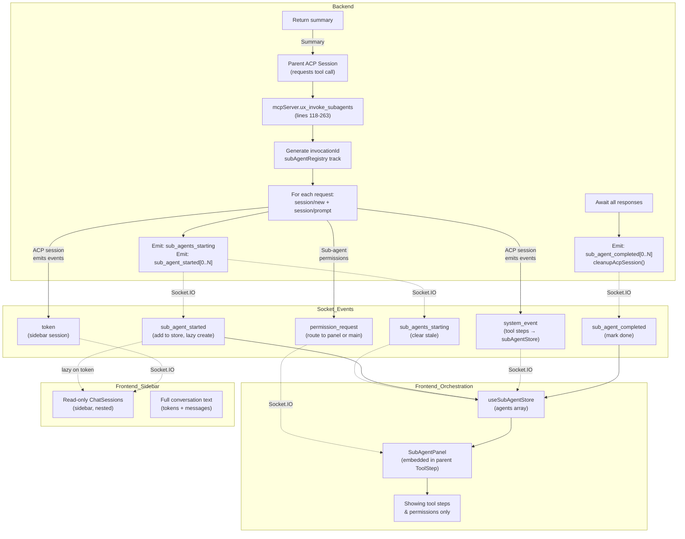

# Feature Doc — ux_invoke_subagents System

**The ux_invoke_subagents tool spawns multiple parallel AI agents and displays them in two complementary UI views: a compact orchestration panel showing each agent's tool steps and permissions, and individual read-only chat sessions in the sidebar showing full conversation history.**

This is a high-complexity feature that uniquely challenges the architecture because it creates **multiple ACP sessions from within a tool call**, requires careful parent-child correlation via `invocationId`, and presents agents in two different UIs simultaneously — one for high-level orchestration (the panel) and one for detailed inspection (the sidebar).

---

## Overview

### What It Does

When an agent calls `ux_invoke_subagents`, the backend:
1. Receives a list of sub-agent requests (prompts, optional names, optional agents)
2. Spawns multiple ACP sessions with a 1-second stagger to avoid overwhelming the ACP
3. Sends each sub-agent a prompt via `session/prompt`
4. Captures the response from each sub-agent
5. Cleans up the ephemeral ACP session files
6. Returns a summary of all responses concatenated

The frontend:
1. Receives `sub_agents_starting` event → clears stale sub-agent sessions for this parent
2. Receives `sub_agent_started` events → adds agents to the **orchestration store**, stamps `invocationId` on parent's ToolStep, adds read-only sessions to the **sidebar**
3. Shows tool steps and permissions in an **embedded SubAgentPanel** within the parent ToolStep
4. Shows full conversations in **read-only sidebar sessions** (nested under parent)
5. Receives `sub_agent_completed` event → marks agent as complete

### Why This Matters

- **Parallel Reasoning**: Agents can explore multiple approaches simultaneously and compare results
- **Transparency**: Both summary (panel) and detail (sidebar) views let the user see what each agent is thinking
- **Coordination Without Overhead**: Sub-agents are spawned from a tool call, not the user interface; the parent agent orchestrates them
- **Permission Compliance**: Sub-agents can request permissions independently, and those are approved within the panel

### Architecture Role

- **Backend**: Creates/manages multiple ACP sessions, tracks their lifecycle, routes events
- **Frontend**: Displays in two contexts (panel + sidebar), correlates sessions via `invocationId`
- **Provider**: Must support the `buildSessionParams()` and `setInitialAgent()` hooks to set agents at spawn time or post-creation

---

## How It Works — End-to-End Flow

### 1. **Parent Tool Call Event**

The parent agent calls `ux_invoke_subagents` with requests:

```javascript
// Input to the tool (from the ACP daemon)
{
  "tool": "ux_invoke_subagents",
  "args": {
    "requests": [
      { "prompt": "Question 1", "name": "Agent 1" },
      { "prompt": "Question 2", "name": "Agent 2" }
    ]
  }
}
```

The backend receives this as a tool call, constructs a `system_event`, and routes to UI:

**File:** `backend/services/acpUpdateHandler.js` (Lines 153-188)

The backend also **tracks the parent**: when a `ux_invoke_subagents` tool completes, it sets:

```javascript
if (titleStr.includes('ux_invoke_subagents') || titleStr.includes('ux_invoke_counsel')) {
  acpClient.lastSubAgentParentAcpId = sessionId;  // LINE 187
}
```

This is crucial — it lets the backend later correlate sub-agent events to their parent.

---

### 2. **Sub-Agent Spawn Batch Initialization**

The `ux_invoke_subagents` handler starts:

**File:** `backend/mcp/mcpServer.js` (Lines 118-263)

**Line 137:** Generate a unique invocation ID:
```javascript
const invocationId = `inv-${Date.now()}-${Math.random().toString(36).slice(2, 7)}`;
```

**Line 149:** Emit `sub_agents_starting` to the frontend:
```javascript
io.emit('sub_agents_starting', { invocationId, parentUiId, providerId: resolvedProviderId, count: requests.length });
```

The frontend receives this and **clears stale sidebar sessions** for the parent before showing the new batch.

---

### 3. **Resolve Parent UI ID**

The backend translates parent ACP session ID to parent UI ID:

**File:** `backend/mcp/mcpServer.js` (Lines 141-145)

```javascript
let parentUiId = null;
if (acpClient.lastSubAgentParentAcpId) {
  const parentSession = await db.getSessionByAcpId(resolvedProviderId, acpClient.lastSubAgentParentAcpId);
  if (parentSession) parentUiId = parentSession.id;  // Resolve ACP ID → UI ID
}
```

This is needed because all socket events use **UI IDs**, but the tool handler only has the **ACP session ID** from the in-flight parent request.

---

### 4. **Sub-Agent Session Creation Loop**

For each request, with a 1-second stagger:

**File:** `backend/mcp/mcpServer.js` (Lines 165-227)

**Lines 173-176:** Create sub-agent session via ACP:
```javascript
const result = await sendWithTimeout('session/new', { 
  cwd, 
  mcpServers: getMcpServers(resolvedProviderId), 
  ...sessionParams  // From provider's buildSessionParams(agent)
}, 30000);
const subAcpId = result.sessionId;
```

**Lines 182-190:** Save to database with `isSubAgent` flag:
```javascript
await db.saveSession({
  id: uiId, acpSessionId: subAcpId,
  name: req.name || `Agent ${i + 1}`,
  model: resolvedModelKey || null,
  messages: [],
  isPinned: false,
  isSubAgent: true,        // LINE 186: Mark as sub-agent
  forkedFrom: parentUiId,  // LINE 186: Link to parent
  ...
});
```

**Lines 206-212:** Emit `sub_agent_started` to frontend:
```javascript
io.emit('sub_agent_started', {
  providerId: resolvedProviderId,
  acpSessionId: subAcpId,
  uiId,
  parentUiId,
  index: i,
  name: req.name || `Agent ${i + 1}`,
  prompt: req.prompt,
  agent: agentName,
  model: resolvedModelKey,
  invocationId,  // LINE 211: Ties agent to this spawn batch
});
```

---

### 5. **Frontend: Clear Old Sessions & Register Agents**

**File:** `frontend/src/hooks/useChatManager.ts` (Lines 310-323)

When `sub_agents_starting` arrives:
```typescript
socket.on('sub_agents_starting', (data) => {
  const parentUiId = data.parentUiId || 'unknown';
  // Delete old sub-agents for this parent (from previous invocations)
  const oldSubAgents = useSessionLifecycleStore.getState().sessions.filter(
    s => s.isSubAgent && s.forkedFrom === parentUiId  // LINE 315
  );
  for (const old of oldSubAgents) {
    socket.emit('delete_session', { uiId: old.id });
  }
  useSessionLifecycleStore.setState(state => ({
    sessions: state.sessions.filter(s => !(s.isSubAgent && s.forkedFrom === parentUiId))
  }));
});
```

When `sub_agent_started` arrives:
```typescript
socket.on('sub_agent_started', (data) => {
  // Add to orchestration store (for SubAgentPanel)
  useSubAgentStore.getState().addAgent({
    providerId: data.providerId,
    acpSessionId: data.acpSessionId,
    parentSessionId: data.parentSessionId,
    invocationId: data.invocationId,
    index: data.index,
    name: data.name,
    ...
  });
  
  // Add to pendingSubAgents map (for lazy sidebar session creation)
  pendingSubAgents.set(data.acpSessionId, { ...data, parentSessionId, parentUiId, ... });
  
  // If this is index 0, stamp invocationId on the parent's ToolStep
  if (data.index === 0) {
    useSessionLifecycleStore.setState(state => ({
      sessions: state.sessions.map(s => ({
        ...s,
        messages: s.messages.map(m => ({
          ...m,
          timeline: (m.timeline || []).map(entry => {
            if (entry.event.status === 'in_progress' &&
                (entry.event.toolName === 'ux_invoke_subagents' || entry.event.toolName === 'ux_invoke_counsel')) {
              return { ...entry, event: { ...entry.event, invocationId: data.invocationId } };  // LINE 350
            }
            return entry;
          })
        }))
      }))
    }));
  }
});
```

**Critical Detail (Line 350):** The `invocationId` is stamped on the **parent's ToolStep**, not on the sub-agent sessions. This correlates the orchestration panel to the batch of agents.

---

### 6. **Frontend: Lazy Sidebar Session Creation**

Sub-agent ChatSessions are **not created** on `sub_agent_started`. They're materialized **lazily** when the first token or tool event arrives.

**File:** `frontend/src/hooks/useChatManager.ts` (Lines 177-196)

```typescript
const wrappedOnStreamToken = (data: { sessionId: string; text: string }) => {
  if (pendingSubAgents.has(data.sessionId)) {
    const pending = pendingSubAgents.get(data.sessionId)!;
    pendingSubAgents.delete(data.sessionId);
    const subSession = {
      id: pending.uiId,
      acpSessionId: pending.acpSessionId,
      name: pending.name,
      provider: pending.providerId,
      messages: [],
      isTyping: true,
      isWarmingUp: false,
      model: pending.model,
      isSubAgent: true,           // LINE 189
      parentAcpSessionId: pending.parentSessionId,
      forkedFrom: pending.parentUiId,
    };
    useSessionLifecycleStore.setState(state => ({ 
      sessions: [...state.sessions, subSession]  // Added to sidebar
    }));
  }
  origOnStreamToken(data);
};
socket.on('token', wrappedOnStreamToken);
```

**Why lazy?** If a sub-agent fails before producing output, no sidebar session is created, avoiding ghost tabs.

---

### 7. **Sub-Agent Tool Execution**

Each sub-agent executes independently:

**File:** `backend/mcp/mcpServer.js` (Lines 234-237)

```javascript
await sendWithTimeout('session/prompt', {
  sessionId: s.subAcpId,
  prompt: [{ type: 'text', text: s.req.prompt }]
});
```

The ACP daemon processes the prompt, emits `token`, `system_event` (for tool calls), `agent_message_chunk`, `agent_thought_chunk`, etc. These events are **routed to the sub-agent's session room** (`session:${subAcpId}`).

---

### 8. **Frontend: Route Tool Events to SubAgentStore**

**File:** `frontend/src/hooks/useChatManager.ts` (Lines 371-394)

A dedicated handler routes `system_event` from sub-agent sessions to the **orchestration store**:

```typescript
const subAgentSystemHandler = (data: { sessionId: string; type: string; id: string; title: string; status?: string; output?: string }) => {
  // Lazily create sidebar session if first event
  if (pendingSubAgents.has(data.sessionId)) {
    const pending = pendingSubAgents.get(data.sessionId)!;
    pendingSubAgents.delete(data.sessionId);
    useSessionLifecycleStore.setState(state => ({ 
      sessions: [...state.sessions, { /* sub-agent ChatSession */ }]
    }));
  }
  
  // Route tool steps to orchestration store (for SubAgentPanel)
  const agents = useSubAgentStore.getState().agents;
  if (!agents.some(a => a.acpSessionId === data.sessionId)) return;
  if (data.type === 'tool_start') {
    useSubAgentStore.getState().addToolStep(data.sessionId, data.id, data.title);  // LINE 388
  } else if (data.type === 'tool_end') {
    useSubAgentStore.getState().updateToolStep(data.sessionId, data.id, data.status || 'completed', data.output);  // LINE 390
  }
};

socket.on('system_event', subAgentSystemHandler);
```

**Critical distinction:** There are **two socket handlers for `system_event`**:
- `socket.on('system_event', onStreamEvent)` (line 224) — for parent session events
- `socket.on('system_event', subAgentSystemHandler)` (line 394) — for sub-agent tool steps

Both can fire, and both reach the UI.

---

### 9. **Frontend: Permission Routing**

**File:** `frontend/src/hooks/useChatManager.ts` (Lines 225-241)

When a sub-agent requests a permission:

```typescript
socket.on('permission_request', (event) => {
  const agents = useSubAgentStore.getState().agents;
  const subAgent = agents.find(a => a.acpSessionId === event.sessionId);
  if (subAgent) {
    // Route to SubAgentPanel
    useSubAgentStore.getState().setPermission(subAgent.acpSessionId, {
      id: event.id,
      sessionId: event.sessionId,
      options: event.options || [],
      toolCall: event.toolCall,
    });
    return;
  }
  // Otherwise, route to main chat timeline
  onStreamEvent({ ...event, type: 'permission_request' });
});
```

Permissions from sub-agents show in the SubAgentPanel (lines 66-77 of `SubAgentPanel.tsx`), not in the main chat.

---

### 10. **Backend: Capture Response & Cleanup**

**File:** `backend/mcp/mcpServer.js` (Lines 238-244)

```javascript
const meta = acpClient.sessionMetadata.get(s.subAcpId);
const response = meta?.lastResponseBuffer?.trim() || '(no response)';
completeSubAgent(s.subAcpId);
io.emit('sub_agent_completed', { providerId, acpSessionId: s.subAcpId, index: s.index });
writeLog(`[SUB-AGENT ${s.index}] Completed: ${s.subAcpId}`);
cleanupAcpSession(s.subAcpId, providerId);  // LINE 243: Clean up .jsonl, .json, tasks/
acpClient.sessionMetadata.delete(s.subAcpId);
```

---

### 11. **Frontend: Mark Agent Complete**

**File:** `frontend/src/hooks/useChatManager.ts` (Lines 361-369)

```typescript
socket.on('sub_agent_completed', (data) => {
  useSubAgentStore.getState().completeAgent(data.acpSessionId);  // Update orchestration store
  useSessionLifecycleStore.setState(state => ({ 
    sessions: state.sessions.map(s => {
      if (s.acpSessionId !== data.acpSessionId) return s;
      const messages = s.messages.map(m => m.isStreaming ? { ...m, isStreaming: false } : m);
      return { ...s, isTyping: false, messages };  // Mark sidebar session as done
    })
  }));
});
```

---

### 12. **Return Summary**

**File:** `backend/mcp/mcpServer.js` (Lines 254-262)

```javascript
const summary = results.map((r, i) => {
  const header = `## Agent ${i + 1}`;
  if (r.error) return `${header}\nError: ${r.error}`;
  return `${header}\n${r.response}`;
}).join('\n\n---\n\n');

return { content: [{ type: 'text', text: summary }] };
```

The ACP tool call completes with the concatenated summary, which becomes a regular message in the parent session.

---

## Architecture Diagram



---

## The Two UI Views — Orchestration Panel vs. Sidebar Sessions

### SubAgentPanel — Compact Orchestration

**File:** `frontend/src/components/SubAgentPanel.tsx`

Rendered inline in the parent's ToolStep when expanded (ToolStep.tsx:133-135).

**Props:**
```typescript
interface SubAgentPanelProps {
  invocationId?: string;  // From parent's ToolStep.event.invocationId
}
```

**Filtering (Lines 20-25):**
```typescript
const allAgents = useSubAgentStore(state => state.agents);
const agents = invocationId ? allAgents.filter(a => a.invocationId === invocationId) : [];
```

**Display (Lines 43-79):**
- Agent status icon (🟢 running, ✅ completed, ❌ failed)
- Agent name and index (e.g., "1: Agent 1 (claude)")
- **Last 4 tool steps** with status (lines 54-63)
- Permission requests with action buttons (lines 66-77)

**Key:** Shows tool steps only, not full conversation text. This gives a high-level view of "what is each agent doing right now?"

---

### Sidebar Sessions — Full Chat Inspection

Each sub-agent is a real `ChatSession` in the sidebar (created lazily), nested under its parent.

**File:** `frontend/src/components/Sidebar.tsx` (Lines 277-289)

```typescript
const subs = getSubAgentsOf(parentId);  // All sub-agents where forkedFrom === parentId
subs.map(sub => (
  <div key={sub.id} className="fork-indent" style={{ paddingLeft: `${depth * 12}px` }}>
    <SessionItem
      session={sub}
      onSelect={() => handleSelect(sub.id)}
      onRename={() => {}}        // NO-OP for sub-agents
      onTogglePin={() => {}}     // NO-OP
      onArchive={() => handleRemoveSession(sub.id)}
      onSettings={() => {}       // NO-OP
    />
  </div>
))
```

**Rendering (SessionItem.tsx:42-94):**
- Green bot icon (for `isSubAgent: true`)
- Session name (from `sub_agent_started[i].name`)
- Delete button only (all other action buttons hidden)
- Fork arrow (↳) prefix showing it's nested

**Interaction:**
- Click to open as a read-only chat
- Shows full messages, tokens, all tool steps
- No input field (read-only)
- Can delete after completion

---

## The Critical Contract: invocationId Flow

**This is the #1 cause of confusion in this system.**

### Why invocationId Exists

Imagine the parent calls `ux_invoke_subagents` twice. Without correlation:
- First call spawns Agent A, Agent B
- Second call spawns Agent C, Agent D
- But the same SubAgentPanel is embedded in the same ToolStep

Which agents should SubAgentPanel show? A+B (first call) or C+D (second call)?

**Answer:** Both ToolSteps exist in the timeline. The first ToolStep should show A+B, the second should show C+D. The `invocationId` is how we correlate them.

### The Flow

```
Backend generates invocationId = 'inv-1704067200000-a1b2c'
    ↓
Emitted in sub_agents_starting { invocationId, ... }
Emitted in sub_agent_started[0..N] { invocationId, ... }
    ↓
Frontend receives sub_agent_started[index=0]
    ↓
useChatManager stamps invocationId on parent's ToolStep (line 350)
    Now event = { toolName: 'ux_invoke_subagents', invocationId: '...', ... }
    ↓
ToolStep renders SubAgentPanel and passes invocationId prop
    ↓
SubAgentPanel filters: allAgents.filter(a => a.invocationId === invocationId)
    ↓
Shows only the agents from THIS call, not historical or future calls
```

### Without invocationId

If a historical ToolStep (from a previous invocation) re-renders, it would show the **latest** agents from the **latest** invocation, not its own agents. This causes:
- Wrong agents displayed in old ToolSteps
- Parent clicking "back" in chat history and seeing different agents

### Contract Details

- **Stamped on:** First `sub_agent_started` event only (line 350: `if (data.index === 0)`)
- **Type:** String in format `inv-${timestamp}-${random}`
- **Scope:** Unique per `ux_invoke_subagents` or `ux_invoke_counsel` call
- **Storage:** On the `SystemEvent` as `invocationId` field
- **Filtering:** SubAgentPanel filters by `invocationId`, useSubAgentStore stores it

---

## Session Lifecycle: Creation, Tracking, and Cleanup

### Creation

Sub-agent ChatSessions are created lazily:

**File:** `frontend/src/hooks/useChatManager.ts` (Lines 177-196, 374-382)

```typescript
// On first token or system_event from a sub-agent session
if (pendingSubAgents.has(data.sessionId)) {
  const pending = pendingSubAgents.get(data.sessionId)!;
  const subSession = {
    id: pending.uiId,
    acpSessionId: pending.acpSessionId,
    provider: pending.providerId,
    isSubAgent: true,
    forkedFrom: pending.parentUiId,
    ...
  };
  useSessionLifecycleStore.setState(state => ({ 
    sessions: [...state.sessions, subSession]
  }));
}
```

**Why lazy?** Avoids creating sidebar sessions for agents that fail before output (prevents ghost tabs).

### Tracking in Database

**File:** `backend/database.js`

```sql
CREATE TABLE sessions (
  ui_id TEXT PRIMARY KEY,
  is_sub_agent INTEGER DEFAULT 0,
  parent_acp_session_id TEXT,
  forked_from TEXT,
  ...
)
```

When saved (Lines 152):
```javascript
..., isSubAgent ? 1 : 0, ..., parentAcpSessionId || null, ...
```

When loaded (Lines 198-199):
```javascript
isSubAgent: row.is_sub_agent === 1,
parentAcpSessionId: row.parent_acp_session_id || null,
```

### Cleanup: Cascade Delete

When the user deletes a parent session, all sub-agent sessions are cascade-deleted:

**File:** `backend/sockets/sessionHandlers.js` (Lines 168-202)

```javascript
// 1. Delete parent
await cleanupAcpSession(session.acpSessionId, pid, 'user-delete-main');
await db.deleteSession(uiId);

// 2. Find all descendants (children, grandchildren, etc.)
const descendants = [];
const collectDescendants = (parentId) => {
  for (const s of allSessions) {
    if (s.forkedFrom === parentId) {
      descendants.push(s);
      collectDescendants(s.id);  // Recursive: forks of forks
    }
  }
};
collectDescendants(uiId);

// 3. Delete all descendants
for (const child of descendants) {
  await cleanupAcpSession(child.acpSessionId, cpid, 'user-delete-child');
  await db.deleteSession(child.id);
}
```

**Key:** Sub-agents are descendants because `forkedFrom === parentUiId`, so they're included in cascade delete.

### Automatic Cleanup

When a sub-agent completes, its ACP session files are deleted:

**File:** `backend/mcp/mcpServer.js` (Line 240)

```javascript
cleanupAcpSession(s.subAcpId, providerId);  // Deletes .jsonl, .json, tasks/
```

But the sidebar **ChatSession record** remains in the database (marked `isSubAgent: true`), allowing the user to view the conversation history.

---

## Event Routing: Two system_event Handlers

This is a subtle but critical architectural detail.

### The Two Handlers

**Parent session events** (main chat timeline):
```typescript
// File: useChatManager.ts, line 224
socket.on('system_event', onStreamEvent);
```

**Sub-agent tool events** (orchestration panel):
```typescript
// File: useChatManager.ts, line 394
socket.on('system_event', subAgentSystemHandler);
```

### How It Works

The backend emits `system_event` with `sessionId`:
```javascript
acpClient.io.to('session:' + sessionId).emit('system_event', eventToEmit);
```

The frontend has **both handlers registered**, so **both run** when a `system_event` arrives.

**But:**
- `onStreamEvent` checks if the event is for the active session and adds to main timeline
- `subAgentSystemHandler` checks if the session is in `useSubAgentStore.agents`, and if so, routes to the orchestration store instead

```typescript
// subAgentSystemHandler, lines 385-391
const agents = useSubAgentStore.getState().agents;
if (!agents.some(a => a.acpSessionId === data.sessionId)) return;  // Not a sub-agent
if (data.type === 'tool_start') {
  useSubAgentStore.getState().addToolStep(data.sessionId, data.id, data.title);
}
```

If not a sub-agent session, this handler returns early, and the event is never processed by this path.

### Why Two Handlers?

The system event from a sub-agent's ACP session must:
1. **Go to the sidebar session** (via `onStreamEvent` → `useStreamStore` → sidebar ChatSession messages)
2. **Go to the orchestration panel** (via `subAgentSystemHandler` → `useSubAgentStore` → SubAgentPanel)

Both are needed. The sidebar shows the full conversation, the panel shows only the tool steps.

---

## Permission Routing

When a sub-agent requests a permission, it arrives as a `permission_request` event with the **sub-agent's ACP session ID**.

**File:** `frontend/src/hooks/useChatManager.ts` (Lines 225-241)

```typescript
socket.on('permission_request', (event) => {
  const agents = useSubAgentStore.getState().agents;
  const subAgent = agents.find(a => a.acpSessionId === event.sessionId);
  if (subAgent) {
    // Route to SubAgentPanel
    useSubAgentStore.getState().setPermission(subAgent.acpSessionId, {
      id: event.id,
      sessionId: event.sessionId,
      options: event.options || [],
      toolCall: event.toolCall,
    });
    return;  // Don't continue to main handler
  }
  // Otherwise route to main timeline
  onStreamEvent({ ...event, type: 'permission_request' });
});
```

**Approval (SubAgentPanel.tsx:29-39):**
```typescript
const handlePermission = (agent, optionId) => {
  if (!socket || !agent.permission) return;
  socket.emit('respond_permission', {
    providerId: activeSession?.provider,
    id: agent.permission.id,
    sessionId: agent.permission.sessionId,
    optionId,
    toolCallId: agent.permission.toolCall?.toolCallId
  });
  useSubAgentStore.getState().clearPermission(agent.acpSessionId);
};
```

The response goes back to the sub-agent's ACP session, allowing it to continue execution.

---

## Provider Configuration for Sub-Agents

A provider must support two hooks for sub-agent spawning:

### buildSessionParams(agent)

Called before `session/new` for each sub-agent. Return extra parameters to pass to the daemon.

**File:** `backend/mcp/mcpServer.js` (Lines 174-176)

```javascript
const sessionParams = providerModule.buildSessionParams(agentName);
const result = await sendWithTimeout('session/new', { 
  cwd, 
  mcpServers: getMcpServers(resolvedProviderId), 
  ...sessionParams  // Spread provider's extra params
}, 30000);
```

A provider uses this to set the agent at spawn time if the daemon requires it:

```javascript
export function buildSessionParams(agent) {
  if (!agent) return undefined;
  return { _meta: { myDaemon: { options: { agent } } } };
}
```

### setInitialAgent(client, sessionId, agent)

Called after `session/new` completes. Use this to switch agents at runtime via a command.

**File:** `backend/mcp/mcpServer.js` (Lines 214-216)

```javascript
if (agentName !== provider.config.defaultSystemAgentName) {
  await providerModule.setInitialAgent(acpClient, subAcpId, agentName);
}
```

A provider implements this to send a slash command if the daemon supports runtime agent switching:

```javascript
export async function setInitialAgent(client, sessionId, agent) {
  if (!agent) return;
  await client.sendRequest('session/prompt', {
    sessionId,
    prompt: [{ type: 'text', text: `/agent ${agent}` }]
  });
}
```

### models.subAgent

A provider's `user.json` can specify which model to use for sub-agents:

**File:** `backend/mcp/mcpServer.js` (Lines 129)

```javascript
const modelId = resolveModelSelection(model || models.subAgent, models, quickModelOptions).modelId;
```

Example:
```json
{
  "models": {
    "default": "claude-opus",
    "subAgent": "claude-sonnet",
    "titleGeneration": "claude-haiku"
  }
}
```

This allows sub-agents to run on a faster/cheaper model while the parent uses a more capable one.

---

## Component Reference

### Backend Files

| File | Functions | Lines | Purpose |
|------|-----------|-------|---------|
| `backend/mcp/mcpServer.js` | `ux_invoke_subagents` | 116-260 | Main handler: spawn, prompt, cleanup |
| | `getMcpServers()` | 40-53 | MCP server config injection |
| `backend/mcp/subAgentRegistry.js` | `registerSubAgent` | 8-10 | Track running agents |
| | `completeSubAgent` | 12-15 | Mark complete |
| | `removeSubAgentsForParent` | 44-54 | Cascade cleanup |
| `backend/mcp/acpCleanup.js` | `cleanupAcpSession` | 12-17 | Delete ephemeral files |
| `backend/services/acpUpdateHandler.js` | `handleUpdate` (tool_call) | 153-188 | Set `lastSubAgentParentAcpId` |
| `backend/database.js` | `saveSession` | 119-157 | Store with `isSubAgent`, `forkedFrom` |
| | `getAllSessions` | 171-200 | Load with sub-agent flags |
| `backend/sockets/sessionHandlers.js` | `delete_session` | 168-202 | Cascade delete children |

### Frontend Files

| File | Functions | Lines | Purpose |
|------|-----------|-------|---------|
| `frontend/src/components/SubAgentPanel.tsx` | `SubAgentPanel` | 19-82 | Render agent cards with tool steps & permissions |
| `frontend/src/store/useSubAgentStore.ts` | `SubAgentEntry` | 14-31 | Sub-agent state shape |
| | `addAgent`, `completeAgent`, `addToolStep`, `updateToolStep`, `setPermission` | 49-72 | Orchestration store actions |
| | `clearForParent` | 77-79 | Clear stale agents on new invocation |
| `frontend/src/hooks/useChatManager.ts` | `sub_agents_starting` handler | 310-323 | Clear old sidebar sessions |
| | `sub_agent_started` handler | 325-358 | Register + stamp invocationId |
| | `subAgentSystemHandler` | 371-394 | Route tool steps to store |
| | `sub_agent_completed` handler | 361-369 | Mark complete in both stores |
| | `permission_request` routing | 225-241 | Route to panel or main timeline |
| `frontend/src/components/Sidebar.tsx` | `getSubAgentsOf` | 98 | Get subs nested under parent |
| | `renderChildren` | 277-289 | Render sub-agents indented, read-only |
| `frontend/src/components/SessionItem.tsx` | Sub-agent styling | 42-94 | Green icon, delete-only buttons |
| `frontend/src/components/ToolStep.tsx` | `SubAgentPanel` render | 133-135 | Pass invocationId to panel |

---

## Gotchas & Important Notes

### 1. **invocationId Must Be on the ToolStep, Not Sub-Agent Sessions**

The invocationId is stamped on the **parent's ToolStep** (line 350), not on sub-agent sessions. This ensures that when a historical ToolStep re-renders, it shows the correct agents from its own call.

**Test:** Log `step.event.invocationId` in ToolStep.tsx. It should have a value. If undefined, sub-agents won't filter correctly.

### 2. **Two system_event Handlers Both Fire**

Both `onStreamEvent` and `subAgentSystemHandler` are registered. Both receive the same event. Make sure your debugging/logging doesn't count events twice.

### 3. **Sub-Agent Sidebar Sessions Are Lazy**

Agents don't appear in the sidebar until their **first token or system_event** arrives. If a sub-agent fails instantly, no sidebar session is created. This is intentional (avoids ghost tabs), but can be confusing.

**Test:** `sub_agent_started` arrives but no sidebar session yet. Wait for first token.

### 4. **Permissions from Sub-Agents Don't Appear in Main Timeline**

Permissions from sub-agents are routed to the SubAgentPanel, not the main chat. If you're debugging and expecting a permission request in the main timeline, check the panel.

### 5. **Cascade Delete Includes Sub-Agents**

When you delete a parent session, **all sub-agent sidebar sessions are deleted too** (via cascade delete). This is because `forkedFrom === parentUiId` links them. If you want to preserve a sub-agent conversation after the parent is gone, clone it to a new parent first.

### 6. **Model Resolution for Sub-Agents**

The provider's `models.subAgent` is used if no explicit model is passed. If a provider doesn't define this field:
```javascript
const modelId = resolveModelSelection(model || models.subAgent, ...)
```

If `models.subAgent` is undefined, it falls back to `models.default`. Ensure your provider's `user.json` has at least one model defined.

### 7. **The 1-Second Stagger Prevents Overwhelming ACP**

Sub-agent sessions are created with a 1-second stagger (line 162):
```javascript
setTimeout(async () => { /* create session */ }, i * 1000);
```

This prevents the ACP from being flooded with parallel session creations. If you're adding 5 agents, expect ~5 seconds for all to spawn.

### 8. **Sub-Agents Can't Be Pinned, Renamed, or Archived from Sidebar**

Action handlers in Sidebar are no-ops for `isSubAgent: true`:
```typescript
onRename={() => {}}
onTogglePin={() => {}}
onSettings={() => {}}
```

Only delete is functional. This is intentional — sub-agents are transient and controlled by the parent orchestration.

### 9. **Sub-Agent Sessions Share Parent's Provider**

All sub-agents inherit the parent's provider. There's no per-sub-agent provider selection. If the parent is Claude, all sub-agents are Claude.

### 10. **The Summary Text Becomes a Regular Message**

When sub-agents complete, the concatenated summary is returned as the tool's result, which becomes a regular message in the parent's chat. This summary is searchable and archivable like any other message.

---

## Unit Tests

### Backend Tests

- **`backend/test/mcpApi.test.js`** — Tool schema validation
- **`backend/test/subAgentRegistry.test.js`** — Sub-agent lifecycle tracking (register, complete, cascade cleanup)
- **`backend/test/sessionHandlers.test.js`** — Session deletion including cascade delete of sub-agents
- **`backend/test/database-exhaustive.test.js`** — Sub-agent session storage and retrieval with `isSubAgent` flag

### Frontend Tests

- **`frontend/src/test/useChatManager.test.ts`** (Lines 330-365) — Sub-agent event handlers:
  - `sub_agents_starting` clears stale sessions
  - `sub_agent_started` adds to store and lazy-creates sidebar
  - Tool steps routed to `useSubAgentStore`
  - `sub_agent_completed` marks done

- **`frontend/src/test/useSubAgentStore.test.ts`** — Store actions:
  - `addAgent`, `completeAgent`, `addToolStep`, `updateToolStep`
  - `setPermission`, `clearForParent`

- **`frontend/src/test/components/SubAgentPanel.test.ts`** — Panel rendering:
  - Filter agents by `invocationId`
  - Display tool steps and permissions
  - Permission approval flow

---

## How to Use This Guide

### For Implementing Sub-Agent Support in a New Provider

1. **Understand the flow:** Read "How It Works" section to grasp the 12-step pipeline
2. **Implement `buildSessionParams()`:** Return extra params if your daemon needs agent at spawn time
3. **Implement `setInitialAgent()`:** Send a command to switch agents post-creation if supported
4. **Configure `models.subAgent`:** In `user.json`, specify which model to use for sub-agents
5. **Test the flow:**
   - Verify `sub_agents_starting` event clears old sessions
   - Check that `sub_agent_started` events add agents to orchestration store
   - Confirm SubAgentPanel shows the agents for this invocation (not historical ones)
   - Verify sub-agent tool steps appear in both sidebar and panel
   - Test permission approval flow

### For Debugging Sub-Agent Issues

1. **Sub-agents don't appear in sidebar:** Check that first token/system_event arrives. Verify `pendingSubAgents` map is cleaned up.
2. **Wrong agents in SubAgentPanel:** Check that `invocationId` is stamped on the parent's ToolStep (line 350 of useChatManager.ts). Log `step.event.invocationId`.
3. **Permissions don't show in panel:** Verify `permission_request` event routing (lines 225-241). Check that agent is in `useSubAgentStore.agents`.
4. **Sub-agent sidebar sessions still visible after deletion:** They're cascade-deleted only if parent is deleted via UI. If parent ACP files are missing, sidebar may show orphaned sessions.
5. **Stale agents showing in historical ToolSteps:** Check that `invocationId` is different for each `ux_invoke_subagents` call.

---

## Summary

The ux_invoke_subagents system is a sophisticated orchestration engine that:

1. **Spawns multiple ACP sessions** from within a tool call (backend complexity)
2. **Displays them in two complementary UI views:**
   - SubAgentPanel: Compact orchestration, tool steps + permissions
   - Sidebar: Full read-only chat sessions for inspection
3. **Correlates agents to ToolSteps** via `invocationId` so historical turns show their own agents
4. **Tracks sub-agents in two stores:**
   - `useSubAgentStore`: For orchestration (tool steps, permissions)
   - `useSessionLifecycleStore`: For sidebar sessions (full messages)
5. **Routes events intelligently:**
   - Tokens → Sidebar session messages
   - Tool steps → Orchestration store (panel display)
   - Permissions → Panel or main timeline
6. **Cleans up automatically:**
   - Ephemeral ACP files deleted on completion
   - Database cascade delete removes child sessions when parent deleted

The **critical contract** is `invocationId` — it must be stamped on the parent's ToolStep and used by SubAgentPanel to filter agents. Without it, historical ToolSteps show the wrong agents.

**Why it matters:** Sub-agents enable parallel reasoning, allowing agents to explore multiple approaches and compare results transparently within a single orchestrated request.
