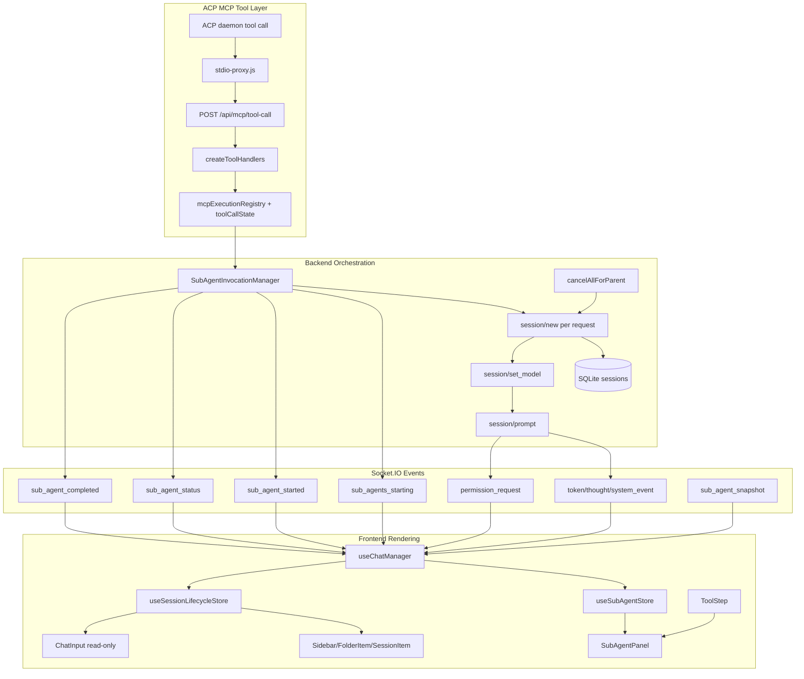

# Feature Doc - ux_invoke_subagents System

`ux_invoke_subagents` is the AcpUI MCP tool that lets an agent spawn multiple visible ACP-backed agents from inside a parent tool call. The feature spans backend MCP tool execution, ACP session orchestration, Socket.IO event routing, sidebar nesting, and a bottom-pinned orchestration panel inside the parent assistant response.

This area is easy to misread because it uses three different IDs at once: parent UI session ID, parent ACP session ID, and per-tool-call `invocationId`.

---

## Overview

### What It Does

- Advertises `ux_invoke_subagents`, `ux_invoke_counsel`, `ux_check_subagents`, and `ux_abort_subagents` through the MCP proxy when MCP config enables sub-agents or counsel.
- Receives MCP tool calls through `backend/mcp/stdio-proxy.js` and `POST /api/mcp/tool-call`.
- Records AcpUI MCP tool metadata through `mcpExecutionRegistry` and `toolCallState` so the parent ToolStep has stable identity and title data.
- Starts one async invocation through `SubAgentInvocationManager.runInvocation`, then returns an invocation ID and instructions to call `ux_check_subagents` for status/results or `ux_abort_subagents` to stop the running agents.
- Persists the invocation and each agent in SQL registry tables, and persists each spawned sub-agent as a `sessions` row with `is_sub_agent = 1` and `forked_from = parentUiId`.
- Emits Socket.IO lifecycle events: `sub_agents_starting`, `sub_agent_started`, `sub_agent_status`, `sub_agent_invocation_status`, `sub_agent_completed`, and `sub_agent_snapshot`.
- Renders each active batch in `SubAgentPanel` until every agent is terminal, with an explicit Stop action.
- Routes sub-agent permission requests to the panel while parent-session permissions stay in the main timeline.

### Why This Matters

- Sub-agent tool calls create ACP sessions as a side effect, so retry handling, active-invocation enforcement, and cancellation must be precise.
- The initial tool call must return quickly for providers with long-running tool limits; result collection moves to `ux_check_subagents`.
- The UI shows the same sub-agent activity in two places: a compact panel for orchestration and sidebar sessions for full inspection.
- Parent-child linkage uses both ACP IDs and UI IDs, and mixing them breaks room routing, cancellation, or sidebar nesting.
- `invocationId` is required so each parent ToolStep shows only the agents spawned by that tool call and so the status tool can find the registry row.
- The feature is provider-agnostic; provider-specific behavior is limited to config keys and provider module hooks.

Architectural role: backend MCP tool, backend session orchestrator, Socket.IO lifecycle, SQLite persistence, frontend Zustand state, and React rendering.

### Async Tool Contract

1. `ux_invoke_subagents` or `ux_invoke_counsel` validates the request, creates the SQL registry row, spawns the requested ACP sessions, and returns a text result containing `invocationId` and `statusToolName: ux_check_subagents`.
2. The parent agent should not call `ux_invoke_subagents` again for the same work. It should call `ux_check_subagents({ "invocationId": "..." })` to wait for results.
3. `ux_check_subagents` waits up to `subagents.statusWaitTimeoutMs`, checking at `subagents.statusPollIntervalMs`, then returns completed results plus failed, aborted, or still-running agents unless `waitForCompletion` is false. Its tool header is `Check Subagents: Waiting for agents to finish` for the default waiting mode.
4. `ux_check_subagents({ "invocationId": "...", "waitForCompletion": false })` returns the current status immediately without waiting so the parent agent can keep working in parallel. Its tool header is `Check Subagents: Quick status check`.
5. `ux_abort_subagents({ "invocationId": "..." })` aborts active agents for the invocation, then returns the same status/result payload shape as `ux_check_subagents`.
6. If any agents are still active, the status result includes the same invocation ID and tells the parent agent to call `ux_check_subagents` again.
7. A parent chat/provider can have only one active sub-agent invocation. A second invocation request returns the active invocation instructions instead of spawning another batch.

---

## How It Works - End-to-End Flow

### 1. MCP Tool Definitions Are Advertised

File: `backend/routes/mcpApi.js` (Route: `GET /tools`, Function: `createMcpApiRoutes`)
File: `backend/mcp/coreMcpToolDefinitions.js` (Functions: `getSubagentsMcpToolDefinition`, `getCounselMcpToolDefinition`, `getCheckSubagentsMcpToolDefinition`, `getAbortSubagentsMcpToolDefinition`)
File: `backend/services/mcpConfig.js` (Config keys: `tools.subagents`, `tools.counsel`, `subagents.statusWaitTimeoutMs`, `subagents.statusPollIntervalMs`)

The backend builds the tool list from `configuration/mcp.json`. `ux_invoke_subagents` appears only when `isSubagentsMcpEnabled()` returns true. `ux_invoke_counsel` is controlled by `isCounselMcpEnabled()` and uses the same invocation manager. `ux_check_subagents` and `ux_abort_subagents` are advertised whenever either sub-agents or counsel are enabled.

```javascript
// FILE: backend/routes/mcpApi.js (Route: GET /tools)
if (isSubagentsMcpEnabled()) {
  toolList.push(getSubagentsMcpToolDefinition({ modelDescription }));
}
if (isCounselMcpEnabled()) {
  toolList.push(getCounselMcpToolDefinition());
}
if (isSubagentsMcpEnabled() || isCounselMcpEnabled()) {
  toolList.push(getCheckSubagentsMcpToolDefinition());
  toolList.push(getAbortSubagentsMcpToolDefinition());
}
```

The sub-agent tool input schema accepts an optional `model` and a required `requests` array. Each request supports `prompt`, `name`, `agent`, and `cwd`.

```javascript
// FILE: backend/mcp/coreMcpToolDefinitions.js (Function: getSubagentsMcpToolDefinition)
requests: {
  type: 'array',
  items: {
    type: 'object',
    properties: {
      prompt: { type: 'string' },
      name: { type: 'string' },
      agent: { type: 'string' },
      cwd: { type: 'string' }
    },
    required: ['prompt']
  }
}
```

### 2. The Parent ToolStep Gets Canonical Tool Identity

File: `backend/services/acpUpdateHandler.js` (Function: `handleUpdate`, ACP updates: `tool_call`, `tool_call_update`)
File: `backend/services/tools/toolInvocationResolver.js` (Functions: `resolveToolInvocation`, `applyInvocationToEvent`)
File: `backend/services/tools/handlers/subAgentToolHandler.js` (Handler: `onStart`)
File: `backend/services/tools/handlers/counselToolHandler.js` (Handler: `onStart`)

When the provider emits a `tool_call` for an AcpUI MCP tool, `handleUpdate` resolves canonical identity and dispatches the Tool System handler. The sub-agent and counsel handlers set `acpClient.lastSubAgentParentAcpId` from the current parent ACP session and preserve canonical names for frontend rendering.

```javascript
// FILE: backend/services/tools/handlers/subAgentToolHandler.js (Handler: onStart)
export const subAgentToolHandler = {
  onStart(ctx, invocation, event) {
    ctx.acpClient.lastSubAgentParentAcpId = ctx.sessionId;
    return {
      ...event,
      title: event.title || 'Invoke Subagents',
      canonicalName: invocation.identity?.canonicalName
    };
  }
};
```

`toolCallState.upsert` stores sticky metadata for the parent tool event, including canonical identity and any `toolSpecific.invocationId` that is applied later.

### 3. The Stdio Proxy Forwards MCP Context

File: `backend/mcp/stdio-proxy.js` (Function: `runProxy`, MCP handler: `CallToolRequestSchema`)
File: `backend/routes/mcpApi.js` (Route: `POST /tool-call`, Functions: `resolveExecutionContext`, `createToolCallAbortSignal`)
File: `backend/mcp/mcpProxyRegistry.js` (Functions: `createMcpProxyBinding`, `resolveMcpProxy`, `bindMcpProxy`)

`getMcpServers` creates a per-session stdio proxy with `ACP_SESSION_PROVIDER_ID`, `ACP_UI_MCP_PROXY_ID`, and `ACP_UI_MCP_PROXY_AUTH_TOKEN`. The proxy fetches tool definitions from `/api/mcp/tools` and forwards tool calls to `/api/mcp/tool-call` with the MCP request ID, request metadata, provider ID, proxy ID, abort signal, and `x-acpui-mcp-proxy-auth` token.

```javascript
// FILE: backend/mcp/stdio-proxy.js (MCP handler: CallToolRequestSchema)
return await backendFetch('/api/mcp/tool-call', {
  method: 'POST',
  body: JSON.stringify({
    tool: name,
    args: args || {},
    providerId: providerId || null,
    proxyId: proxyId || null,
    mcpRequestId: extra?.requestId ?? null,
    requestMeta: request.params?._meta || extra?._meta || null
  }),
  signal: extra?.signal,
});
```

`POST /tool-call` requires a valid proxy id, matching proxy auth token, and bound proxy session, then resolves the proxy binding to `providerId` and `acpSessionId` and injects those fields into the handler args. The route also creates an `AbortSignal` that fires when the request aborts or the response closes before completion.

### 4. The MCP Handler Starts a Tracked Execution

File: `backend/mcp/mcpServer.js` (Function: `createToolHandlers`, Helper: `wrapToolHandlers`)
File: `backend/services/tools/mcpExecutionRegistry.js` (Functions: `begin`, `complete`, `fail`, `publicMcpToolInput`)

Every AcpUI MCP handler is wrapped by `wrapToolHandlers`. On entry, `mcpExecutionRegistry.begin` records the public input and emits a `system_event` update for the parent ToolStep. On success or failure, the registry updates `toolCallState` with the final MCP output or error.

```javascript
// FILE: backend/mcp/mcpServer.js (Helper: wrapToolHandlers)
const execution = mcpExecutionRegistry.begin({
  io,
  providerId: args.providerId,
  sessionId: args.acpSessionId,
  acpSessionId: args.acpSessionId,
  mcpProxyId: args.mcpProxyId,
  mcpRequestId: args.mcpRequestId,
  requestMeta: args.requestMeta,
  toolName,
  input
});
```

For sub-agents, the public input is the caller-provided `requests` and `model`; transport-only fields such as `providerId`, `acpSessionId`, `mcpProxyId`, `mcpRequestId`, `requestMeta`, and `abortSignal` are filtered out.

### 5. The Handler Builds an Idempotency Key and Delegates

File: `backend/mcp/mcpServer.js` (Function: `createToolHandlers`, Helpers: `buildSubAgentInvocationKey`, `runSubagentInvocation`, `runCheckSubagentsInvocation`, `runAbortSubagentsInvocation`, `runCounselInvocation`)
File: `backend/services/tools/acpUxTools.js` (Constants: `ACP_UX_TOOL_NAMES.invokeSubagents`, `ACP_UX_TOOL_NAMES.checkSubagents`, `ACP_UX_TOOL_NAMES.abortSubagents`, `ACP_UX_TOOL_NAMES.invokeCounsel`)

`runSubagentInvocation` builds an idempotency key scoped by provider, parent ACP session or proxy ID, tool name, and the best available request identity. It prefers `mcpRequestId`, then tool-call metadata from `requestMeta`, then a stable hash of `{ requests, model }`.

```javascript
// FILE: backend/mcp/mcpServer.js (Helper: runSubagentInvocation)
const idempotencyKey = buildSubAgentInvocationKey({
  providerId,
  acpSessionId,
  mcpProxyId,
  mcpRequestId,
  requestMeta,
  toolName: idempotencyToolName,
  input: { requests, model }
});

return subAgentInvocationManager.runInvocation({
  requests,
  model,
  providerId,
  parentAcpSessionId: acpSessionId,
  idempotencyKey,
  abortSignal
});
```

`runCounselInvocation` loads `configuration/counsel.json`, builds role-based requests from the selected counsel agents, and calls the same sub-agent path with `idempotencyToolName: ACP_UX_TOOL_NAMES.invokeCounsel`.

### 6. The Invocation Manager Resolves Parent, Model, and Batch State

File: `backend/mcp/subAgentInvocationManager.js` (Class: `SubAgentInvocationManager`, Methods: `runInvocation`, `startInvocation`, `executeStartInvocation`, `getInvocationStatus`, `cancelInvocation`)
File: `backend/database.js` (Functions: `getSessionByAcpId`, `createSubAgentInvocation`, `getActiveSubAgentInvocationForParent`, `deleteSubAgentInvocationsForParent`)
File: `backend/services/modelOptions.js` (Functions: `modelOptionsFromProviderConfig`, `resolveModelSelection`)

`runInvocation` validates that Socket.IO and the provider runtime are available, then delegates to the async start path. It resolves the parent ACP session by preferring the explicit MCP session context and falling back to `acpClient.lastSubAgentParentAcpId`.

Active idempotency records return the active start-result promise. Completed idempotency records return the cached start result. If the parent UI session already has an active SQL invocation, the manager returns instructions for that invocation instead of spawning another batch.

`executeStartInvocation` resolves the model from `model`, `models.subAgent`, then provider model defaults through `resolveModelSelection`. It resolves `parentUiId` with `getSessionByAcpId(providerId, parentAcpSessionId)`, removes old terminal sub-agent sidebar sessions only after a new invocation is accepted, creates the SQL invocation row, and emits `sub_agents_starting` before session spawn timers run.

```javascript
// FILE: backend/mcp/subAgentInvocationManager.js (Method: executeStartInvocation)
const modelId = this.resolveModelSelectionFn(model || models.subAgent, models, quickModelOptions).modelId;
const invocationId = `inv-${this.now()}-${Math.random().toString(36).slice(2, 7)}`;

await this.db.createSubAgentInvocation({
  invocationId,
  provider: resolvedProviderId,
  parentAcpSessionId,
  parentUiId,
  status: 'spawning',
  totalCount: requests.length,
  statusToolName: ACP_UX_TOOL_NAMES.checkSubagents
});

this.io.emit('sub_agents_starting', {
  invocationId,
  parentUiId,
  providerId: resolvedProviderId,
  count: requests.length,
  statusToolName: ACP_UX_TOOL_NAMES.checkSubagents
});
```

### 7. Each Sub-Agent ACP Session Is Created and Persisted

File: `backend/mcp/subAgentInvocationManager.js` (Method: `spawnAgent`, Helpers: `trackSubAgentParent`, `subAgentParentKey`)
File: `backend/mcp/mcpServer.js` (Function: `getMcpServers`)
File: `backend/mcp/mcpProxyRegistry.js` (Function: `bindMcpProxy`, Helper: `getMcpProxyIdFromServers`)
File: `backend/database.js` (Function: `saveSession`, Table: `sessions`)

The manager starts one timer per request with `i * 1000` delay. For each request it resolves `agentName`, `cwd`, provider spawn params, and MCP server config, then sends `session/new`.

```javascript
// FILE: backend/mcp/subAgentInvocationManager.js (Method: spawnAgent)
const providerModule = await this.getProviderModuleFn(resolvedProviderId);
const sessionParams = providerModule.buildSessionParams(agentName);
const mcpServers = this.getMcpServersFn(resolvedProviderId);
const result = await sendWithTimeout('session/new', { cwd, mcpServers, ...sessionParams }, 30000);
const subAcpId = result.sessionId;
this.trackSubAgentParent(resolvedProviderId, subAcpId, parentAcpSessionId);
this.bindMcpProxyFn(getMcpProxyIdFromServers(mcpServers), { providerId: resolvedProviderId, acpSessionId: subAcpId });
```

The sub-agent is saved as a sidebar-capable session and as a row in `subagent_invocation_agents`. The UI ID is `sub-${subAcpId}`. `forkedFrom` stores the parent UI ID so Sidebar and FolderItem can render the nested tree, while the invocation-agent row stores status, result text, error text, and completion timestamps for `ux_check_subagents`.

```javascript
// FILE: backend/mcp/subAgentInvocationManager.js (Method: spawnAgent)
await this.db.saveSession({
  id: uiId,
  acpSessionId: subAcpId,
  name: req.name || `Agent ${i + 1}: ${req.prompt.slice(0, 50)}`,
  model: resolvedModelKey || null,
  messages: [],
  isPinned: false,
  isSubAgent: true,
  forkedFrom: parentUiId,
  currentModelId: modelId || null,
  modelOptions: quickModelOptions,
  provider: resolvedProviderId,
});
```

If a model resolves, the manager sends `session/set_model`. It also seeds `acpClient.sessionMetadata` with `isSubAgent: true`, `agentName`, model state, counters, and response buffers.

### 8. Socket Rooms and `sub_agent_started` Are Emitted

File: `backend/mcp/subAgentInvocationManager.js` (Method: `spawnAgent`, Socket event: `sub_agent_started`)

When the parent ACP session is known, only sockets already watching `session:${parentAcpSessionId}` are joined to the sub-agent room. If parent context is unavailable, the manager joins all connected sockets as a fallback.

```javascript
// FILE: backend/mcp/subAgentInvocationManager.js (Method: spawnAgent)
const parentRoom = `session:${parentAcpSessionId}`;
const sockets = await this.io.fetchSockets();
for (const s of sockets) {
  if (s.rooms.has(parentRoom)) s.join(`session:${subAcpId}`);
}

this.io.emit('sub_agent_started', {
  providerId: resolvedProviderId,
  acpSessionId: subAcpId,
  uiId,
  parentUiId,
  index: i,
  name: req.name || `Agent ${i + 1}`,
  prompt: req.prompt,
  agent: agentName,
  model: resolvedModelKey,
  invocationId,
});
```

After the event, `setInitialAgent(acpClient, subAcpId, agentName)` runs when `agentName` differs from `provider.config.defaultSystemAgentName`.

### 9. Prompts Run in the Background and Results Are Polled

File: `backend/mcp/subAgentInvocationManager.js` (Methods: `startAgentPrompt`, `setAgentStatus`, `refreshInvocationCompletion`, `getInvocationStatus`, Socket events: `sub_agent_status`, `sub_agent_invocation_status`, `sub_agent_completed`)
File: `backend/services/acpUpdateHandler.js` (Function: `handleUpdate`, Socket events: `token`, `thought`, `system_event`, `stats_push`)
File: `backend/mcp/acpCleanup.js` (Function: `cleanupAcpSession`)

After all setup promises resolve, `executeStartInvocation` starts each prompt in the background and immediately returns an instructional MCP result containing the invocation ID and `ux_check_subagents` tool name.

ACP update routing is the same as any session: message chunks emit `token`, thoughts emit `thought`, tool calls emit `system_event`, and permissions emit `permission_request`. The manager reads each response from `acpClient.sessionMetadata.get(subAcpId).lastResponseBuffer` when `session/prompt` completes, writes it to `subagent_invocation_agents.result_text`, and emits terminal status updates.

`ux_check_subagents` calls `getInvocationStatus`. It reads the SQL snapshot, waits until every agent is terminal or the configured timeout expires, then returns completed results plus failed, aborted, and still-running agents. Passing `waitForCompletion: false` returns the current snapshot immediately. The status tool title mirrors that input: waiting calls render as `Check Subagents: Waiting for agents to finish`, while immediate calls render as `Check Subagents: Quick status check`. Status-call aborts stop waiting but do not cancel the agents.

```javascript
// FILE: backend/mcp/subAgentInvocationManager.js (Method: buildStatusResult)
if (completedAgents.length) {
  lines.push('Completed results:');
  for (const agent of completedAgents) {
    lines.push(`## Agent ${agent.index + 1}: ${agent.name || 'Sub-agent'}`);
    lines.push(agent.resultText || '(no response)');
  }
}
if (activeAgents.length) {
  lines.push(`Call ${statusToolName}({ "invocationId": "${snapshot.invocationId}" }) again to continue waiting.`);
  lines.push(`Call ${statusToolName}({ "invocationId": "${snapshot.invocationId}", "waitForCompletion": false }) to check status without waiting.`);
  lines.push(`Call ${abortToolName}({ "invocationId": "${snapshot.invocationId}" }) to abort the running agents.`);
}
```

### 10. Cancellation Cascades Through Nested Sub-Agents

File: `backend/sockets/promptHandlers.js` (Socket event: `cancel_prompt`)
File: `backend/routes/mcpApi.js` (Function: `createToolCallAbortSignal`)
File: `backend/mcp/subAgentInvocationManager.js` (Methods: `cancelAllForParent`, `collectDescendantAcpSessionIds`, `cancelInvocationRecord`)

Cancellation can arrive from the UI through `cancel_prompt`, the orchestration panel's `cancel_subagents` socket event, the parent agent's `ux_abort_subagents` tool call, or from the initial spawn MCP HTTP route through `abortSignal`. These paths call the invocation manager. A `ux_check_subagents` request abort only stops the wait for that status call and does not cancel the agents.

`collectDescendantAcpSessionIds` starts from the parent ACP session and walks `subAgentParentLinks` plus active invocation agents. `cancelInvocationRecord` calls the record abort function, marks agents `cancelled`, sends ACP `session/cancel` notifications, and rejects matching pending JSON-RPC requests.

```javascript
// FILE: backend/mcp/subAgentInvocationManager.js (Method: cancelAllForParent)
const descendantAcpSessionIds = this.collectDescendantAcpSessionIds(parentAcpSessionId, providerId);
for (const inv of this.invocations.values()) {
  if (inv.providerId === providerId && descendantAcpSessionIds.has(inv.parentAcpSessionId)) {
    await this.cancelInvocationRecord(inv);
  }
}
```

### 11. Reconnect Hydration Emits Snapshots

File: `backend/sockets/index.js` (Socket event: `watch_session`)
File: `backend/sockets/subAgentHandlers.js` (Function: `emitSubAgentSnapshotsForSession`, Socket event: `sub_agent_snapshot`)
File: `backend/mcp/subAgentInvocationManager.js` (Method: `getSnapshotsForParent`)

When a client watches a session, the backend emits snapshots for active sub-agents attached to that parent ACP session. Snapshot payloads include provider, ACP session, UI session, parent UI ID, invocation ID, display name, prompt, agent, model, and status.

```javascript
// FILE: backend/sockets/subAgentHandlers.js (Function: emitSubAgentSnapshotsForSession)
const running = subAgentInvocationManager
  .getSnapshotsForParent(sessionId)
  .filter(s => !providerId || s.providerId === providerId);

socket.emit('sub_agent_snapshot', {
  providerId: entry.providerId,
  acpSessionId: entry.acpId,
  uiId: entry.uiId,
  parentUiId: entry.parentUiId,
  invocationId: entry.invocationId,
  status: entry.status,
});
```

### 12. Frontend Listeners Register Agents and Sidebar Sessions

File: `frontend/src/hooks/useChatManager.ts` (Hook: `useChatManager`, Socket events: `sub_agents_starting`, `sub_agent_started`, `sub_agent_snapshot`, `sub_agent_status`, `sub_agent_invocation_status`, `sub_agent_completed`)
File: `frontend/src/store/useSubAgentStore.ts` (Store actions: `startInvocation`, `setInvocationStatus`, `completeInvocation`, `addAgent`, `setStatus`, `completeAgent`, `isInvocationActive`)
File: `frontend/src/store/useSessionLifecycleStore.ts` (State: `sessions`)

`sub_agents_starting` creates invocation-level store state, removes existing sub-agent sidebar sessions for the same parent UI ID, and emits `delete_session` for each removed session. This event is only emitted after the backend accepts the new invocation, so an active-invocation rejection does not clear the old sidebar agents.

`sub_agent_started` adds the agent to `useSubAgentStore`, records a pending sidebar session in `pendingSubAgents`, and stamps the batch `invocationId` onto the in-progress parent ToolStep when `index === 0`. `sub_agent_invocation_status` updates invocation-level status so the active ToolStep knows when it can collapse.

```typescript
// FILE: frontend/src/hooks/useChatManager.ts (Socket event: sub_agent_started)
useSubAgentStore.getState().addAgent({ ...data, parentSessionId });
pendingSubAgents.set(data.acpSessionId, { ...data, parentSessionId, parentUiId, model: data.model || 'balanced' });

if (data.index === 0) {
  useSessionLifecycleStore.setState(state => ({
    sessions: state.sessions.map(s => {
      if (s.id !== parentUiId) return s;
      // map the latest assistant timeline and attach invocationId to the in-progress tool
      return { ...s, messages: msgs };
    })
  }));
}
```

`sub_agent_snapshot` re-registers active agents after reconnect and adds them to `pendingSubAgents` when their sidebar session is not already present.

### 13. Streams Materialize Sidebar Sessions Lazily

File: `frontend/src/hooks/useChatManager.ts` (Handlers: `wrappedOnStreamToken`, `subAgentSystemHandler`)
File: `frontend/src/store/useStreamStore.ts` (Actions: `onStreamToken`, `onStreamEvent`, `onStreamDone`, `processBuffer`)

A sub-agent `ChatSession` is not created on `sub_agent_started`. It is created when the first `token` or `system_event` arrives for a pending sub-agent ACP session.

```typescript
// FILE: frontend/src/hooks/useChatManager.ts (Handler: wrappedOnStreamToken)
const subSession = {
  id: pending.uiId,
  acpSessionId: pending.acpSessionId,
  name: pending.name,
  provider: pending.providerId,
  messages: [],
  isTyping: true,
  isWarmingUp: false,
  model: pending.model,
  isSubAgent: true,
  parentAcpSessionId: pending.parentSessionId,
  forkedFrom: pending.parentUiId,
};
```

There are two `system_event` listeners in `useChatManager`: the general stream handler updates the full timeline, and `subAgentSystemHandler` updates `useSubAgentStore.toolSteps` for the orchestration panel.

### 14. Permissions Route to the Panel

File: `backend/services/permissionManager.js` (Methods: `handleRequest`, `respond`, Socket event: `permission_request`)
File: `backend/sockets/promptHandlers.js` (Socket event: `respond_permission`)
File: `frontend/src/hooks/useChatManager.ts` (Socket event: `permission_request`)
File: `frontend/src/components/SubAgentPanel.tsx` (Handler: `handlePermission`)

A permission request from a sub-agent carries the sub-agent ACP session ID. The frontend checks `useSubAgentStore.agents` before sending the event to the main timeline. If the session ID belongs to a sub-agent, the request is stored on that agent and rendered in `SubAgentPanel`.

```typescript
// FILE: frontend/src/hooks/useChatManager.ts (Socket event: permission_request)
const subAgent = agents.find(a => a.acpSessionId === evtData.sessionId);
if (subAgent) {
  useSubAgentStore.getState().setPermission(subAgent.acpSessionId, {
    id: evtData.id,
    sessionId: evtData.sessionId,
    options: evtData.options || [],
    toolCall: evtData.toolCall,
  });
  return;
}
```

`SubAgentPanel` resolves `providerId` from the invocation provider first, then the agent provider, then the active session provider, and sends `respond_permission` with the permission ID, selected option ID, sub-agent session ID, and resolved provider. The backend uses the provider runtime's `PermissionManager.respond` to write the ACP JSON-RPC permission result.

### 15. The UI Renders Panel and Sidebar Views

File: `frontend/src/components/AssistantMessage.tsx` (Component: `AssistantMessage`, Helper: `getPinnedSubAgentInvocationIds`, Child: `SubAgentPanel`)
File: `frontend/src/components/ToolStep.tsx` (Component: `ToolStep`)
File: `frontend/src/components/SubAgentPanel.tsx` (Component: `SubAgentPanel`)
File: `frontend/src/components/Sidebar.tsx` (Functions: `getSubAgentsOf`, `renderChildren`, `handleRemoveSession`)
File: `frontend/src/components/FolderItem.tsx` (Function: `renderForkTree`)
File: `frontend/src/components/SessionItem.tsx` (Component: `SessionItem`)
File: `frontend/src/components/ChatInput/ChatInput.tsx` (Component: `ChatInput`)

`AssistantMessage` scans the message timeline for `ux_invoke_subagents` and `ux_invoke_counsel` tool steps with an `invocationId`, then renders `SubAgentPanel` inside `.sub-agent-pinned-panels` at the bottom of the assistant response bubble. This keeps the orchestration visible even when later parent text or tool calls appear after the spawn tool. `ToolStep` still identifies sub-agent start tools so successful instructional MCP output is hidden; failed start output still renders for diagnosis. `ux_check_subagents` and `ux_abort_subagents` remain ordinary output-only status/result tools. `AssistantMessage` and `useStreamStore` keep an active sub-agent orchestration ToolStep expanded until all agents are terminal, unless the user manually collapses it. The pinned panel stays open while agents are observed active, auto-collapses after live terminal completion unless the user manually toggles it, and renders already-terminal invocations collapsed when terminal agents hydrate during chat load.

```typescript
// FILE: frontend/src/components/AssistantMessage.tsx (Component: AssistantMessage)
const pinnedSubAgentInvocationIds = useMemo(() => getPinnedSubAgentInvocationIds(timeline), [timeline]);

<div className="sub-agent-pinned-panels">
  {pinnedSubAgentInvocationIds.map(invocationId => (
    <SubAgentPanel key={invocationId} invocationId={invocationId} />
  ))}
</div>

// FILE: frontend/src/components/ToolStep.tsx (Component: ToolStep)
const toolIdentity = step.event.canonicalName || step.event.toolName;
const isSubAgentOrchestrationTool = isAcpUxSubAgentStartToolName(toolIdentity);
const shouldRenderOutput = !isSubAgentOrchestrationTool || step.event.status === 'failed';

{shouldRenderOutput && renderToolOutput(...)}
```

`SubAgentPanel` shows invocation status and a Stop button while the invocation is active; the button emits `cancel_subagents` with `providerId` and `invocationId`. `Sidebar` and `FolderItem` render sub-agents with `isSubAgent && forkedFrom === parentId`. `SessionItem` shows a bot icon and a delete button only after the sub-agent stops typing. `ChatInput` renders a read-only footer for sub-agent sessions. `AssistantMessage` hides fork controls for sub-agent sessions.

---

## Architecture Diagram



---

## The Critical Contract: IDs, Tool Identity, and Provider Context

### Required ID Roles

- `ChatSession.id`: UI/session-store identity. Used by Sidebar, FolderItem, and `forkedFrom` nesting.
- `ChatSession.acpSessionId`: ACP transport identity. Used for Socket.IO rooms, ACP requests, stream queues, permission events, and cancellation.
- `parentUiId`: UI ID of the session that invoked the tool. Stored as `forkedFrom` on sub-agent sessions.
- `parentAcpSessionId`: ACP ID of the session that invoked the tool. Used for room inheritance, reconnect snapshots, and cascade cancellation.
- `uiId`: generated sub-agent UI ID in the form `sub-${subAcpId}`.
- `invocationId`: generated per `ux_invoke_subagents` or `ux_invoke_counsel` call. Stored on `useSubAgentStore` entries and stamped onto the parent ToolStep event.

### Required Tool Identity

Tool events that spawn sub-agents must resolve to canonical names:

- `ux_invoke_subagents`
- `ux_invoke_counsel`

`ToolStep` checks `canonicalName || toolName`, so provider-specific raw tool names are valid only when `resolveToolInvocation` and `applyInvocationToEvent` attach the canonical identity.

### Required Provider Context

Sub-agents inherit the parent provider. The MCP proxy context must resolve to the correct `providerId` and parent `acpSessionId`, and sub-agent MCP servers must be rebound with `bindMcpProxy(proxyId, { providerId, acpSessionId: subAcpId })` after `session/new`.

If this contract is broken:

- Socket events reach the wrong rooms or all sockets.
- `SubAgentPanel` renders the wrong batch or nothing.
- Sidebar nesting is flat or attached to the wrong parent.
- Permission responses target the wrong provider runtime.
- Nested AcpUI MCP tool calls lack sub-agent session context.
- Cancellation leaves descendant sessions running.

---

## Configuration and Data Flow

### MCP Configuration

File: `configuration/mcp.json.example` (Config keys: `tools.subagents`, `tools.counsel`, `subagents.statusWaitTimeoutMs`, `subagents.statusPollIntervalMs`)
File: `backend/services/mcpConfig.js` (Functions: `getMcpConfig`, `getSubagentsMcpConfig`, `isSubagentsMcpEnabled`, `isCounselMcpEnabled`)

```json
{
  "tools": {
    "subagents": { "enabled": true },
    "counsel": { "enabled": true }
  },
  "subagents": {
    "statusWaitTimeoutMs": 120000,
    "statusPollIntervalMs": 1000
  }
}
```

The `MCP_CONFIG` environment variable can point to a different JSON file. If config loading fails, core tools are disabled by `disabledConfig`. `statusWaitTimeoutMs` is the maximum time a single `ux_check_subagents` call waits before returning partial progress when `waitForCompletion` is true or omitted, and `statusPollIntervalMs` is the poll/wait interval used while agents are still active.

### Provider Configuration

Provider config must provide the values used by the generic sub-agent path:

- `mcpName`: MCP server name advertised by `getMcpServers`.
- `defaultSubAgentName`: agent used when a request omits `agent`.
- `defaultSystemAgentName`: agent name that does not require `setInitialAgent` after spawn.
- `models.subAgent`: model selected when the tool call omits `model`.
- `models.default`: fallback model when no explicit sub-agent model is configured.
- `models.quickAccess`: display/model options persisted to the sub-agent session row.

Provider module hooks:

- `buildSessionParams(agentName)`: returns provider-specific fields merged into `session/new`.
- `setInitialAgent(acpClient, subAcpId, agentName)`: applies runtime agent selection after `session/new` when needed.
- `getMcpServerMeta()`: optional metadata attached to the MCP server config.

### Counsel Configuration

File: `backend/services/counselConfig.js` (Function: `loadCounselConfig`)
File: `configuration/counsel.json` (Config keys: `agents.core`, `agents.optional`)

`ux_invoke_counsel` converts configured counsel entries into sub-agent requests. Core entries are included for every counsel call, and optional entries are included when the matching boolean argument is true.

### Data Shapes

MCP tool input:

```json
{
  "model": "model-id",
  "requests": [
    { "name": "Research", "agent": "agent-name", "cwd": "D:/work/project", "prompt": "Investigate the issue" }
  ]
}
```

Async start result JSON block:

```json
{
  "invocationId": "inv-timestamp-token",
  "statusToolName": "ux_check_subagents",
  "abortToolName": "ux_abort_subagents",
  "status": "running",
  "completed": 0,
  "total": 2
}
```

Status tool input:

```json
{ "invocationId": "inv-timestamp-token", "waitForCompletion": true }
```

Set `waitForCompletion` to `false` to return current status immediately without waiting.

Abort tool input:

```json
{ "invocationId": "inv-timestamp-token" }
```

Backend `sub_agent_started` payload:

```json
{
  "providerId": "provider-id",
  "acpSessionId": "sub-acp-id",
  "uiId": "sub-sub-acp-id",
  "parentUiId": "parent-ui-id",
  "index": 0,
  "name": "Research",
  "prompt": "Investigate the issue",
  "agent": "agent-name",
  "model": "model-id",
  "invocationId": "inv-timestamp-token"
}
```

Frontend `SubAgentEntry` store shape:

```typescript
// FILE: frontend/src/store/useSubAgentStore.ts (Interface: SubAgentEntry)
{
  providerId,
  acpSessionId,
  parentSessionId,
  invocationId,
  index,
  name,
  prompt,
  agent,
  status,
  tokens,
  thoughts,
  toolSteps,
  permission
}
```

SQLite `sessions` fields for sub-agents:

```text
ui_id = sub-${subAcpId}
acp_id = subAcpId
is_sub_agent = 1
forked_from = parentUiId
parent_acp_session_id = nullable
provider = resolvedProviderId
model/current_model_id/model_options_json = resolved model state
```

---

## Component Reference

### Backend

| Area | File | Anchors | Purpose |
|---|---|---|---|
| MCP definitions | `backend/mcp/coreMcpToolDefinitions.js` | `getSubagentsMcpToolDefinition`, `getCounselMcpToolDefinition`, `getCheckSubagentsMcpToolDefinition`, `getAbortSubagentsMcpToolDefinition` | JSON schema and descriptions for core MCP tools |
| MCP handler map | `backend/mcp/mcpServer.js` | `getMcpServers`, `createToolHandlers`, `buildSubAgentInvocationKey`, `runSubagentInvocation`, `runCheckSubagentsInvocation`, `runAbortSubagentsInvocation`, `runCounselInvocation`, `wrapToolHandlers` | Proxy setup, feature-flagged tool handlers, idempotency, registry wrapping |
| MCP route | `backend/routes/mcpApi.js` | `GET /tools`, `POST /tool-call`, `resolveToolContext`, `createToolCallAbortSignal` | Tool advertisement, proxy context resolution, abort propagation |
| Stdio proxy | `backend/mcp/stdio-proxy.js` | `runProxy`, `backendFetch`, `CallToolRequestSchema` handler | ACP-facing MCP server process and backend forwarding |
| Proxy bindings | `backend/mcp/mcpProxyRegistry.js` | `createMcpProxyBinding`, `bindMcpProxy`, `resolveMcpProxy`, `getMcpProxyIdFromServers` | Provider/session context for parent and sub-agent MCP tool calls |
| Invocation manager | `backend/mcp/subAgentInvocationManager.js` | `SubAgentInvocationManager`, `runInvocation`, `executeStartInvocation`, `spawnAgent`, `startAgentPrompt`, `getInvocationStatus`, `cancelInvocation`, `cancelAllForParent`, `getSnapshotsForParent` | Async start, prompt backgrounding, SQL-backed status, cancellation, reconnect snapshots, result polling |
| Tool handler | `backend/services/tools/handlers/subAgentToolHandler.js` | `subAgentToolHandler.onStart` | Parent ACP session tracking and canonical event title |
| Counsel handler | `backend/services/tools/handlers/counselToolHandler.js` | `counselToolHandler.onStart` | Parent ACP session tracking and canonical counsel event title |
| Status handler | `backend/services/tools/handlers/subAgentStatusToolHandler.js` | `subAgentStatusToolHandler.onStart` | Applies canonical status and abort tool titles to Tool System events |
| Status title helper | `backend/services/tools/acpUiToolTitles.js` | `subAgentCheckToolTitle` | Computes wait-vs-quick-check titles for `ux_check_subagents` from public input |
| Tool registry | `backend/services/tools/index.js` | `toolRegistry.register`, `ACP_UX_TOOL_NAMES.invokeSubagents`, `ACP_UX_TOOL_NAMES.checkSubagents`, `ACP_UX_TOOL_NAMES.abortSubagents`, `ACP_UX_TOOL_NAMES.invokeCounsel`, `subAgentStatusToolHandler` | Registers tool-specific Tool System handlers |
| MCP execution registry | `backend/services/tools/mcpExecutionRegistry.js` | `McpExecutionRegistry.begin`, `complete`, `fail`, `describeAcpUxToolExecution`, `publicMcpToolInput` | Sticky AcpUI MCP metadata and parent ToolStep updates |
| Invocation resolver | `backend/services/tools/toolInvocationResolver.js` | `resolveToolInvocation`, `applyInvocationToEvent` | Merges provider identity, cached state, and MCP execution records |
| ACP updates | `backend/services/acpUpdateHandler.js` | `handleUpdate`, ACP updates `tool_call`, `tool_call_update`, `agent_message_chunk`, `agent_thought_chunk` | Normalizes streams and emits frontend timeline events |
| Prompt/socket cancellation | `backend/sockets/promptHandlers.js`, `backend/sockets/subAgentHandlers.js` | Socket events `cancel_prompt`, `cancel_subagents`, `respond_permission` | Cancels parent and sub-agent trees, stops active invocations, forwards permission responses |
| Socket bootstrap | `backend/sockets/index.js` | Socket event `watch_session` | Joins rooms and emits sub-agent snapshots |
| Snapshot socket | `backend/sockets/subAgentHandlers.js` | `emitSubAgentSnapshotsForSession`, Socket event `sub_agent_snapshot` | Reconnect hydration for active sub-agents |
| Permission manager | `backend/services/permissionManager.js` | `handleRequest`, `respond` | Emits permission requests and writes ACP permission results |
| Persistence | `backend/database.js` | `initDb`, `saveSession`, `getSessionByAcpId`, `createSubAgentInvocation`, `updateSubAgentInvocationStatus`, `getSubAgentInvocationWithAgents`, `deleteSubAgentInvocationsForParent`, Tables `sessions`, `subagent_invocations`, `subagent_invocation_agents` | Stores sidebar sessions, async invocation state, status counts, results, errors, and cleanup rows |
| Cleanup | `backend/mcp/acpCleanup.js` | `cleanupAcpSession` | Removes ephemeral ACP session files after completion or deletion |

### Frontend

| Area | File | Anchors | Purpose |
|---|---|---|---|
| Socket dispatcher | `frontend/src/hooks/useChatManager.ts` | `useChatManager`, `pendingSubAgents`, Socket events `sub_agents_starting`, `sub_agent_started`, `sub_agent_snapshot`, `sub_agent_status`, `sub_agent_invocation_status`, `sub_agent_completed`, `permission_request`, `system_event`, `token` | Registers sub-agent lifecycle, permissions, lazy sidebar creation, and invocation routing |
| Sub-agent store | `frontend/src/store/useSubAgentStore.ts` | `SubAgentInvocation`, `SubAgentEntry`, `startInvocation`, `setInvocationStatus`, `completeInvocation`, `isInvocationActive`, `addAgent`, `setStatus`, `completeAgent`, `addToolStep`, `updateToolStep`, `setPermission`, `clearPermission`, `clearForParent` | Invocation-level and agent-level orchestration-panel state independent from full chat timeline state |
| Assistant rendering | `frontend/src/components/AssistantMessage.tsx` | `AssistantMessage`, `getPinnedSubAgentInvocationIds`, `SubAgentPanel` child | Pins sub-agent orchestration panels to the bottom of the assistant response bubble by `invocationId` |
| Tool rendering | `frontend/src/components/ToolStep.tsx` | `ToolStep`, `getFilePathFromEvent` | Renders tool rows, suppresses successful sub-agent start output, and keeps status/abort output visible |
| Panel rendering | `frontend/src/components/SubAgentPanel.tsx` | `SubAgentPanel`, `handlePermission`, `handleStop`, prop `invocationId` | Filters agents by invocation and renders invocation status, Stop, tool steps, and permission buttons |
| Sidebar tree | `frontend/src/components/Sidebar.tsx` | `getSubAgentsOf`, `renderChildren`, `handleRemoveSession` | Nests sub-agent sessions under parent sessions and deletes them permanently |
| Folder tree | `frontend/src/components/FolderItem.tsx` | `getSubAgentsOf`, `renderForkTree` | Nests sub-agents under sessions inside folders |
| Session row | `frontend/src/components/SessionItem.tsx` | `SessionItem`, `session.isSubAgent` branch | Bot icon, fork arrow, delete-only actions for completed sub-agent sessions |
| Chat input | `frontend/src/components/ChatInput/ChatInput.tsx` | `ChatInput`, `activeSession?.isSubAgent` branch | Displays read-only footer for sub-agent sessions |
| Assistant message | `frontend/src/components/AssistantMessage.tsx` | `AssistantMessage`, `activeSessionId`, `isSubAgent` branch | Hides fork button in sub-agent sessions |
| AcpUI UX tool identity | `frontend/src/utils/acpUxTools.ts` | `ACP_UX_TOOL_NAMES`, `isAcpUxSubAgentStartToolEvent`, `isAcpUxSubAgentToolName` | Central frontend constants and predicates for sub-agent tool identity checks |
| Type contracts | `frontend/src/types.ts` | `SystemEvent.invocationId`, `ChatSession.isSubAgent`, `ChatSession.parentAcpSessionId`, `ChatSession.forkedFrom` | Shared frontend shapes used by panel and sidebar rendering |
| Stream store | `frontend/src/store/useStreamStore.ts` | `onStreamToken`, `onStreamEvent`, `onStreamDone`, `processBuffer`, `collapseForNewTimelineStep` | Full conversation timeline for lazily created sub-agent sessions and active-sub-agent auto-collapse guard |

### Configuration

| Area | File | Anchors | Purpose |
|---|---|---|---|
| MCP config | `configuration/mcp.json.example` | `tools.subagents`, `tools.counsel`, `subagents.statusWaitTimeoutMs`, `subagents.statusPollIntervalMs` | Enables core sub-agent/counsel tools and status wait settings |
| MCP config loader | `backend/services/mcpConfig.js` | `getMcpConfig`, `getSubagentsMcpConfig`, `isSubagentsMcpEnabled`, `isCounselMcpEnabled`, `MCP_CONFIG` | Reads MCP feature flags and exposes booleans/status wait settings |
| Counsel config | `backend/services/counselConfig.js` | `loadCounselConfig` | Loads counsel role prompts |
| Provider config | `providers/<provider>/provider.json` and provider user config | `mcpName`, `defaultSubAgentName`, `defaultSystemAgentName`, `models.subAgent`, `models.default`, `models.quickAccess` | Supplies provider-specific spawn, MCP, and model values |
| Provider module | `providers/<provider>/index.js` | `buildSessionParams`, `setInitialAgent`, `getMcpServerMeta` | Injects provider-specific spawn params and runtime agent selection |

---

## Gotchas

1. `invocationId` belongs on the parent ToolStep.

   `AssistantMessage` finds sub-agent start tool steps by `invocationId` and passes that value to the bottom-pinned `SubAgentPanel`, which filters `useSubAgentStore.agents` to the correct batch. If `sub_agent_started` does not stamp the in-progress parent ToolStep, the panel returns `null` even when agents exist in the store.

2. Explicit MCP session context beats parent tracking.

   `runInvocation` prefers `parentAcpSessionId` from the MCP route over `acpClient.lastSubAgentParentAcpId`. Parent tracking is a fallback for cases where provider metadata is incomplete.

3. Sub-agent tool calls are side-effectful and require idempotency.

   Retried MCP calls can create duplicate ACP sessions unless `buildSubAgentInvocationKey` deduplicates by MCP request ID, tool-call metadata, or scoped input fingerprint.

4. Sidebar sessions are lazy.

   `sub_agent_started` adds panel state and a pending entry. The sidebar `ChatSession` is created only on the first `token` or `system_event` from that sub-agent ACP session.

5. Two `system_event` handlers run in the frontend.

   `onStreamEvent` feeds the full timeline, and `subAgentSystemHandler` feeds `useSubAgentStore.toolSteps`. Debugging code should account for both handlers receiving the same socket event.

6. Permission responses use provider runtime state.

   The frontend routes sub-agent permissions into `SubAgentPanel`, but the backend response path uses `providerId` to find the runtime and `id` to resolve the pending ACP permission request. Keep provider inheritance intact.

7. Cancellation walks the descendant graph.

   Nested sub-agents are cancelled by `collectDescendantAcpSessionIds`, which uses `subAgentParentLinks` and active invocation agent records. Do not bypass `trackSubAgentParent` after `session/new`.

8. Sub-agent MCP proxy binding happens after `session/new`.

   `getMcpServers` creates the proxy before the sub-agent ACP ID exists, and `bindMcpProxy` attaches that proxy to `subAcpId` after spawn. Nested AcpUI tools depend on this binding.

9. `forkedFrom` represents both forks and sub-agents.

   Sidebar and folder trees must filter by `isSubAgent` when separating fork sessions from sub-agent sessions.

10. Model selection can resolve to null.

    The manager sends `session/set_model` only when `resolveModelSelection` returns a model ID. `saveSession` stores null model fields when no model resolves.

11. Spawn is staggered.

    Session creation timers use `i * 1000`, so multi-agent batches become visible progressively.

12. Completion cleanup does not remove the persisted sidebar row.

    `cleanupAcpSession` removes ephemeral ACP files and `sessionMetadata.delete(subAcpId)` removes runtime buffers. The SQLite session remains available for sidebar inspection until deleted.

---

## Unit Tests

### Backend Tests

- `backend/test/mcpApi.test.js`
  - `GET /tools returns tool list with JSON Schema`
  - `GET /tools includes default-on core tools when flags are blank`
  - `GET /tools hides disabled core tools`
  - `POST /tool-call passes resolved proxy context to handlers`
  - `POST /tool-call aborts the handler signal when the request fires the "aborted" event`
  - `POST /tool-call aborts the handler signal when the response closes before completion`

- `backend/test/stdio-proxy.test.js`
  - `runs the proxy lifecycle`
  - `handles ListTools and CallTool requests`
  - `does not retry when fetch throws an AbortError`

- `backend/test/mcpServer.test.js`
  - `getMcpServers returns server config`
  - `getMcpServers handles null providerId by using default provider`
  - `registers core handlers when MCP config enables them`
  - `omits subagents handler when MCP config disables it`
  - `passes abortSignal through to the sub-agent invocation manager`
  - `starts sub-agents asynchronously and returns status instructions`
  - `deduplicates repeated MCP request ids for the same parent session`
  - `deduplicates by tool call metadata when MCP request id is absent`
  - `deduplicates by scoped input fingerprint when request ids are absent`
  - `emits sub_agents_starting immediately with invocationId before stagger`
  - `includes invocationId in sub_agent_started events`
  - `passes defaultSubAgentName into session/new when request omits agent`
  - `binds the MCP proxy id to the sub-agent ACP session after session/new`
  - `uses models.subAgent when no explicit model arg is provided`
  - `uses models.default when no explicit model and no subAgent configured`
  - `stores null (not empty string) for model when no model can be resolved`
  - `stores null in db.saveSession.model when no model resolves`
  - `uses the explicit model arg when provided`
  - `resolves parentUiId if lastSubAgentParentAcpId is set`
  - `prefers MCP session context over stale parent tracking`
  - `only joins sockets to sub-agent room if they are watching the parent session`
  - `joins all sockets to sub-agent room if parent session is unknown (fallback)`
  - `runs counsel through the sub-agent invocation pipeline when the subagents tool is hidden`

- `backend/test/subAgentInvocationManager.test.js`
  - `starts asynchronously and returns completed results through the status call`
  - `joins an active invocation when the idempotency key repeats`
  - `returns a cached result when a completed invocation key repeats`
  - `reports the active invocation instead of starting another batch for the same parent chat`
  - `cleans active idempotency state when invocation setup rejects`
  - `uses explicit parent ACP session before stale client parent tracking`
  - `cancelAllForParent calls abortFn and sends session/cancel to sub-agents`
  - `cancelAllForParent cascades through nested sub-agent invocations`
  - `aborts and cancels sub-agents when the tool call abort signal fires`
  - `trackSubAgentParent ignores calls with any null/undefined argument`
  - `cancelInvocationRecord is idempotent - double-cancel does not re-trigger abortFn`
  - `collectDescendantAcpSessionIds returns an empty set when parentAcpSessionId is null`
  - `collectDescendantAcpSessionIds excludes sessions from a different provider`
  - `immediately aborts when abortSignal is already aborted before spawning starts`
  - `getSnapshotsForParent returns active agents`

- `backend/test/subAgentHandlers.test.js`
  - `emits sub_agent_snapshot for each running sub-agent matching parentAcpSessionId`
  - `does not emit when sessionId is null`
  - `registers cancel_subagents handler and resolves provider runtime before cancelling`
  - `ignores cancel_subagents without invocationId`

- `backend/test/acpUpdateHandler.test.js`
  - `assigns lastSubAgentParentAcpId for sub-agent spawning tools`

- `backend/test/acpUiToolTitles.test.js`
  - `titles sub-agent status checks by wait mode`
  - `accepts alternate false encodings for quick sub-agent checks`

- `backend/test/toolInvocationResolver.test.js`
  - `records sub-agent check title from waitForCompletion input`

- `backend/test/toolRegistry.test.js`
  - `titles sub-agent status tools by canonical identity`

- `backend/test/promptHandlers.test.js`
  - Covers `cancel_prompt` invoking `subAgentInvocationManager.cancelAllForParent`.
  - Covers `respond_permission` forwarding permission choices through the provider runtime.

- `backend/test/sessionHandlers.test.js`
  - Covers deleting sessions with descendant relationships through `forkedFrom` and deleting/cancelling linked sub-agent invocation registry rows.

- `backend/test/database-exhaustive.test.js` and `backend/test/persistence.test.js`
  - Cover `isSubAgent` storage/retrieval fields and SQL persistence behavior.

### Frontend Tests

- `frontend/src/test/useChatManager.test.ts`
  - `handles "permission_request" for sub-agent`
  - `handles "sub_agents_starting" - clears old sidebar sessions immediately`
  - `handles "sub_agent_started" event and stamps invocationId on in-progress ToolStep at index 0`
  - `handles "sub_agent_invocation_status" event`
  - `handles "sub_agent_status" with invocationId by updating agent and invocation state`
  - `moves waiting sub-agents back to running on token events`
  - `passes terminal sub-agent completion statuses through to the store`
  - `creates lazy sub-agent session with provider on first token`
  - `creates lazy sub-agent session with provider on first system_event`
  - `handles "sub_agent_completed" event`
  - `routes system_event tool_start/tool_end to sub-agent store`

- `frontend/src/test/useSubAgentStore.test.ts`
  - `tracks invocation lifecycle and derives status from agents`
  - `updates permission state and active status for waiting agents`
  - `deduplicates agents and invocations by identifier`
  - `clears invocations by parent ui id or parent session id`
  - `addAgent and completeAgent manage lifecycle`
  - `appendToken and appendThought update content`
  - `manage tool steps`
  - `manage permissions`
  - `clearForParent removes only specific agents and matching invocations`

- `frontend/src/test/SubAgentPanel.test.tsx`
  - `renders nothing when no agents`
  - `renders nothing when invocationId is undefined`
  - `renders nothing when invocationId does not match any agent`
  - `renders only agents matching the invocationId`
  - `renders agent cards with status and name`
  - `renders tool steps`
  - `renders permission buttons`
  - `emits cancel_subagents and marks active invocation as cancelling`
  - `emits permission responses with the invocation provider and clears local permission`

- `frontend/src/test/acpUxTools.test.ts`
  - `centralizes known AcpUI UX tool names`
  - `normalizes direct tool name checks`
  - `resolves tool identity from normalized event fields`

- `frontend/src/test/ChatMessage.test.tsx`
  - `pins active sub-agent orchestration to the bottom after later parent work`
  - `auto-collapses bottom-pinned sub-agent orchestration two seconds after completion`
  - `keeps completed bottom-pinned sub-agent orchestration collapsed when terminal agents hydrate after render`
  - `keeps active sub-agent orchestration expanded after remount`

- `frontend/src/test/useStreamStore.test.ts`
  - `keeps active sub-agent orchestration steps expanded when new timeline steps arrive`
  - `collapses inactive sub-agent orchestration steps when new timeline steps arrive`

- `frontend/src/test/ToolStep.test.tsx`
  - `does not render SubAgentPanel inline for ux_invoke_subagents`
  - `does not render SubAgentPanel inline when canonicalName is a sub-agent tool`
  - `does not render SubAgentPanel inline for ux_invoke_counsel`
  - `does not render SubAgentPanel for regular tool calls`
  - `suppresses instructional output for sub-agent start tools`
  - `keeps failure output visible for sub-agent start tools`
  - `keeps output visible for ux_check_subagents`
  - `returns undefined for sub-agent status tools even when a file path is present`

- `frontend/src/test/SessionItem.test.tsx`
  - `shows only delete button for sub-agent when not typing`
  - `hides delete button for sub-agent when typing`

- `frontend/src/test/AssistantMessage.test.tsx`
  - Covers sub-agent assistant message rendering behavior.

- `frontend/src/test/AssistantMessageExtended.test.tsx`
  - Covers sub-agent session state in assistant message variants.

---

## How to Use This Guide

### For Implementing or Extending This Feature

1. Start at `backend/mcp/coreMcpToolDefinitions.js` if the tool schema changes.
2. Update feature flags in `backend/services/mcpConfig.js` and `configuration/mcp.json.example` when tool availability changes.
3. Update `backend/mcp/mcpServer.js` when handler args, idempotency, or counsel delegation changes.
4. Update `backend/mcp/subAgentInvocationManager.js` for spawn, prompt, cancellation, snapshot, model, or persistence behavior.
5. Keep provider hooks generic: `buildSessionParams`, `setInitialAgent`, `getMcpServerMeta`.
6. Preserve MCP execution metadata through `mcpExecutionRegistry`, `toolCallState`, and `toolInvocationResolver`.
7. Update `frontend/src/hooks/useChatManager.ts` when socket lifecycle or lazy session creation changes.
8. Update `frontend/src/store/useSubAgentStore.ts`, `AssistantMessage`, `ToolStep`, and `SubAgentPanel` when panel rendering changes.
9. Update `Sidebar`, `FolderItem`, `SessionItem`, `ChatInput`, and `AssistantMessage` when sidebar or read-only session behavior changes.
10. Add or update tests listed in the Unit Tests section for the changed contract.

### For Debugging Issues With This Feature

1. Missing MCP tool: check `configuration/mcp.json`, `isSubagentsMcpEnabled`, `GET /api/mcp/tools`, and `coreMcpToolDefinitions`.
2. Parent ToolStep has a generic title or no panel: check `mcpExecutionRegistry.begin`, `resolveToolInvocation`, `subAgentToolHandler.onStart`, and `ToolStep` `canonicalName || toolName` handling.
3. Panel renders empty: check that `sub_agent_started` includes `invocationId`, `useSubAgentStore.addAgent` stores it, and `useChatManager` stamps it onto the in-progress parent ToolStep.
4. Sidebar entry is missing: check `pendingSubAgents`, then verify a `token` or `system_event` arrived for the sub-agent ACP session.
5. Tool steps show in the sidebar but not the panel: check the second `system_event` handler in `useChatManager` and the `useSubAgentStore.addToolStep` / `updateToolStep` actions.
6. Permission prompt appears in the main timeline: check whether the permission event `sessionId` matches a registered `SubAgentEntry.acpSessionId`.
7. Sub-agent events reach the wrong browser: check parent room membership in `io.fetchSockets()` and the `session:${parentAcpSessionId}` room join branch.
8. Nested sub-agent tools lack context: check `bindMcpProxy` after `session/new` and `resolveMcpProxy` in `POST /tool-call`.
9. Cancellation leaves active agents: check `trackSubAgentParent`, `collectDescendantAcpSessionIds`, `cancelAllForParent`, and pending JSON-RPC rejection.
10. Reconnect does not restore panel state: check `watch_session`, `emitSubAgentSnapshotsForSession`, `getSnapshotsForParent`, and the frontend `sub_agent_snapshot` handler.

---

## Summary

- `ux_invoke_subagents` is a feature-flagged AcpUI MCP tool that starts visible ACP-backed sub-agent sessions asynchronously from a parent tool call and returns an invocation ID.
- `ux_check_subagents` is the paired status/result tool; it waits up to the configured timeout by default, can return immediately with `waitForCompletion: false`, returns completed results plus still-active agents, can be called repeatedly with the same `invocationId`, and shows a wait-vs-quick-check title in the chat header.
- `ux_abort_subagents` aborts active agents for an invocation and returns the same status/result payload shape without waiting.
- `ux_invoke_counsel` maps configured counsel roles into the same async sub-agent invocation pipeline.
- `mcpExecutionRegistry` and `toolCallState` preserve canonical AcpUI MCP identity for the parent ToolStep.
- `SubAgentInvocationManager` owns async start, model selection, SQL registry persistence, socket lifecycle, background prompt execution, status polling, idempotency, snapshots, and cancellation.
- Sub-agent sessions inherit the parent provider and are linked through `parentAcpSessionId` for transport/cancellation and `forkedFrom = parentUiId` for sidebar nesting.
- `invocationId` is the critical rendering contract that ties a parent ToolStep, the bottom-pinned `SubAgentPanel`, and status calls to the exact batch of agents they reference.
- Sidebar chat sessions are created lazily on the first token or tool event and are read-only once selected.
- Permission requests from sub-agents render in `SubAgentPanel` and are answered through the provider runtime's permission manager.
- Active orchestration ToolSteps stay expanded until every agent is terminal unless the user manually collapses them; bottom-pinned panels stay open for observed live activity and load already-terminal invocations collapsed; the panel Stop action emits `cancel_subagents`.
- Changing this feature requires updating backend MCP tests, manager tests, socket tests, frontend hook tests, store tests, and component rendering tests that cover the same contract.
